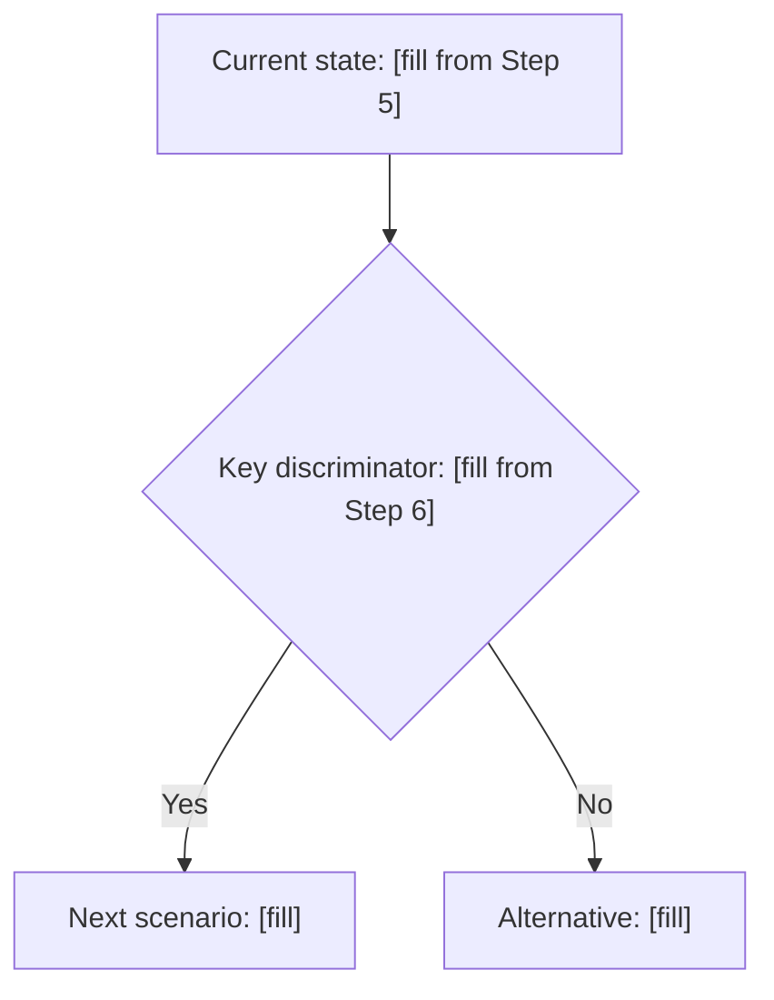

# CLAUDE.md — BB MTF Strategy Repository

## When editing references/backtest_chart_analysis.md

### Mandatory template for image analysis blocks

Every scenario in Part 3 that contains an image embed must have
the following 7-step analysis block inserted AFTER each image
embed line and BEFORE the next existing content block.

The exact insertion anchor for each scenario is the image embed
line itself — insert immediately after the closing `)` of each
`[` line.

#### The 7-step template (insert verbatim):

````
#### Image Analysis — [REPLACE WITH ACTUAL FILENAME]

##### Step 1: Mark Reading — Cause, Event, and Impact

| Mark | Cause (upstream TF state) | Event (transition at this bar) | Impact Immediate (1–5 bars) | Impact Sustained (duration) |
|------|--------------------------|-------------------------------|----------------------------|----------------------------|
| [describe mark] | [which TF + BBW_stage + mid caused this] | [BBW_stage or mid or BBUpDn change] | [which TF follows + gate fires + action] | [confinement rules + valid entries + size] |

##### Step 2: HTF Analysis (W1 → D1 → H4)

| TF | BBW_stage | diffMid_Trend | BBUpDn_state | Touch Type | Role |
|----|-----------|---------------|--------------|------------|------|
| W1 | [value] | [value] | [value] | [1/2/3] | [role] |
| D1 | [value] | [value] | [value] | [1/2/3] | [role] |
| H4 | [value] | [value] | [value] | [1/2/3] | [role] |

**HTF Summary:** [macro direction] | [price target] | [why LTF sideway] | [context or compressing]

##### Step 3: MTF Analysis (H1 → M30)

| TF | BBW_stage | diffMid_Trend | BBUpDn_state | Touch Type | Role |
|----|-----------|---------------|--------------|------------|------|
| H1  | [value] | [value] | [value] | [1/2/3] | [role] |
| M30 | [value] | [value] | [value] | [1/2/3] | [role] |

**MTF Summary:** [trending or ranging] | [confinement boundary] | [touch type] | [active gate] | [impact on H4] | [impact on M15]

##### Step 4: LTF Analysis (M15 → M5)

| TF | BBW_stage | diffMid_Trend | BBUpDn_state | Touch Type | Role |
|----|-----------|---------------|--------------|------------|------|
| M15 | [value] | [value] | [value] | [1/2/3] | [role] |
| M5  | [value] | [value] | [value] | [1/2/3] | [role] |

**LTF Summary:** [D1 lagging or D2 leading] | [BBUpDn sequence] | [REVUP/REVDN visible] | [active gate] | [impact on MTF] | [impact on HTF]

##### Step 5: Cross-TF Impact Chain

**D1 compression (HTF → LTF):**
- [H4 state] → [H1 consequence] → [M30 consequence] → [M15 consequence] → [M5 consequence]

**D2 expansion (LTF → HTF):**
- [M5 state] → [M15 follows X bars] → [M30 follows] → [H1 follows] → [H4 eventually]

**Cascade position:** D1 depth = [deepest TF in SQZ] | D2 initiated at = [lowest TF broke SQZ or NOT YET] | Leading TF = [TF to watch]

##### Step 6: Concluded Analysis

[One paragraph: scenario name + sub-scenario stage + HTF context + MTF state + LTF state + cascade position + touch behavior + key observable + next scenario prediction]

##### Step 7: Identification Flowchart



**Prediction rules:**
- IF [observable A] → next scenario = [X]
- IF [observable B] → next scenario = [Y]
- Watch: [specific TF + BBW_stage or mid flip]
````

### Rules Claude Code must follow for this file

1. NEVER remove existing flowcharts, trade action blocks,
   checklists, or image embed lines
2. NEVER invent BBW_stage, diffMid_Trend, or BBUpDn_state
   values — read them from image filenames and existing
   text analysis only. Use [TO BE FILLED] if uncertain.
3. BBW_stage valid values: 511 512 521 522 513 523 400-499
4. diffMid_Trend valid values: 1 2 3 4 5 only
5. BBUpDn_state valid values: 0 1 2 only
6. Touch Type valid values: Type 1 Type 2 Type 3 only
7. Insert at ### heading level — never promote to ## or #
8. Every Step 7 flowchart must use mermaid syntax
9. After every str_replace confirm the new line count
10. Process one scenario at a time — do not batch all scenarios
    in one tool call