# Architecture — TofyTrade5 Three-Layer System

System design and UML for TofyTrade5's three-layer architecture. For scenario/rule MEANINGS see `backtest_chart_analysis.md`; for the validation record see `references/fixtures/validation_status.md`.

## Three-Layer Overview

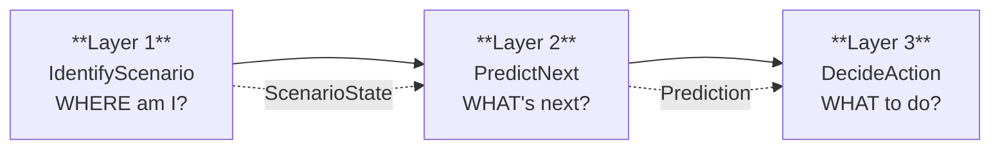

- **Layer 1 — IdentifyScenario**: Given current BB state across all TFs, classify the market into a scenario + phase. **Built & validated** against March 2026 in-sample + Jan-Apr OOS data.
- **Layer 2 — PredictNext**: Given ScenarioState, score direction, confidence, target TF, timeline, and next scenario. Built but diffBBW damping thresholds need correction (see integration note 6 in `.mqh`).
- **Layer 3 — DecideAction**: Given ScenarioState + Prediction, select entry/exit condition from firing matrix. Built and enforced.

## TF Roles (cross-cut all layers)

These responsibilities are invariant across all three layers — they define what each TF contributes to the system.

| TF | Role | Layers that consume |
|----|------|---------------------|
| W1 | Macro bias — highest container candidate, sets directional a priori | L1 (container), L2 (direction score), L3 (X2 container-crack) |
| D1 | Macro bias — alignment check for A1, G-tier sub-state discriminator | L1 (A1/G1-G2), L2 (direction score), L3 (VETO via veto_priceloc in .py) |
| H4 | Trend / context — primary classifier (fly/shrink/sqz), phase driver | L1 (CHECK-HTF, phase), L2 (direction score), L3 (E3 chk1, X2) |
| M30 | Primary trend DRIVER — the leg ridden, E3 confinement check | L1 (compression routing), L2 (direction score), L3 (E3 chk4, X2) |
| M15 | Entry TRIGGER — flip detection, B-tier depth | L1 (B-tier, E-tier, flip detection), L2 (direction score), L3 (X2 fade) |
| M5 | Noise / unused for entry — SQZ count contributor only | L1 (cas_sqzCount, E3 chk3), L2 (not scored — index 0 excluded) |

---

## Part 3 — Layer 1: IdentifyScenario (BUILT & VALIDATED)

### 3.1 Interface — Class/Struct Diagram

This diagram shows the actual data structures: what IdentifyScenario reads (input per-TF BB data) and what it returns (ScenarioState). Fields marked with `[L2]` / `[L3]` indicate the output contract consumed by downstream layers.

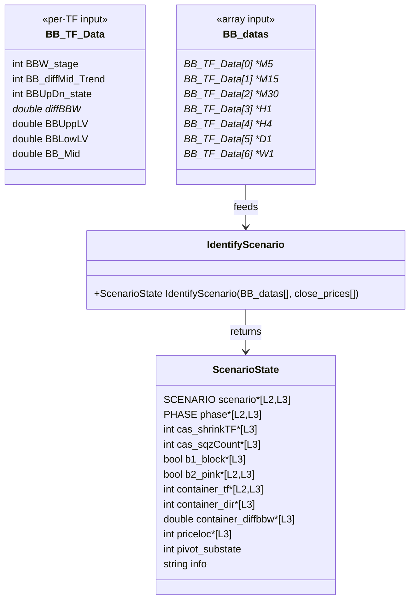

**Field meanings (ScenarioState):**

| Field | Type | Meaning | Consumed by |
|-------|------|---------|-------------|
| `scenario` | SCENARIO | Identified scenario (A1..C3) | L2, L3 |
| `phase` | PHASE | Phase classification (PH_1..PH_6) | L2, L3 |
| `cas_shrinkTF` | int | Highest TF in shrink (1=M15..5=D1, -1=none), per §12d | L3 |
| `cas_sqzCount` | int | Count of M5..H1 TFs in SQZ (400-499), per §12d | L3 |
| `b1_block` | bool | M15 diffMid >= 3 (blocks flip-entries) | L3 (read from struct by DecideAction line 809; Python harness recomputes from raw BB data — no ScenarioState struct) |
| `b2_pink` | bool | M15 AND M30 both BBW 400-499 (forces flat) | L3 (read from struct by X4 invariant line 1040 + ASSERT line 784; L2 uses `scenario==E2` as proxy, not b2_pink directly; Python harness recomputes) |
| `container_tf` | int | Highest TF with committed fly, -1 if none | L2, L3 |
| `container_dir` | int | Container's diffMid (1=UP, 2=DN, 0=none) | L3 |
| `container_diffbbw` | double | Container health: >0 room, <=0 aging | L3 |
| `priceloc` | int | Price vs container bands: -2..+2 | L3 |
| `pivot_substate` | int | G-tier: 0=N/A, 1=PIVOT-PENDING, 2=G-REVERSAL | display only |
| `info` | string | Human-readable reason string | logging |

> **Note:** `dbbwH4` is NOT a ScenarioState field — it is computed internally and pushed to ring buffers (`g_dbbw_ring`, `s_dbbwH4_hist`) used by `ClassifyPhase()` and early F-tier detection. The value is available to callers via `ADiffBBW(bb, 4)` but is not part of the output contract.

**MQL5 vs Python consumption:** MQL5 L3 reads `b1_block`, `b2_pink`, and `cas_sqzCount` directly from the ScenarioState struct. The Python harness has no ScenarioState struct — it recomputes these from raw BB data in the simulation loop. This is a harness architecture difference, not a behavioral one, except for `veto_priceloc` (Python adds D1 as veto source — see known divergence in `validation_status.md`).

**Output contract summary:**
- Layer 2 consumes: `scenario`, `phase`, `container_tf`, `container_dir`, `b2_pink`
- Layer 3 consumes: all fields except `pivot_substate` (display-only) and `info` (logging)

### 3.2 Control Flow — Activity Diagram

This flowchart shows the **as-built** evaluation order of `IdentifyScenario`, matching the validated Decisions 1-6. Note: the early F-tier check fires **before** G-tier (Step 3 in code), not after compression routing — this is the Cluster 1 fix that prevents misclassifying H4-exiting-compression as G when it should be F.

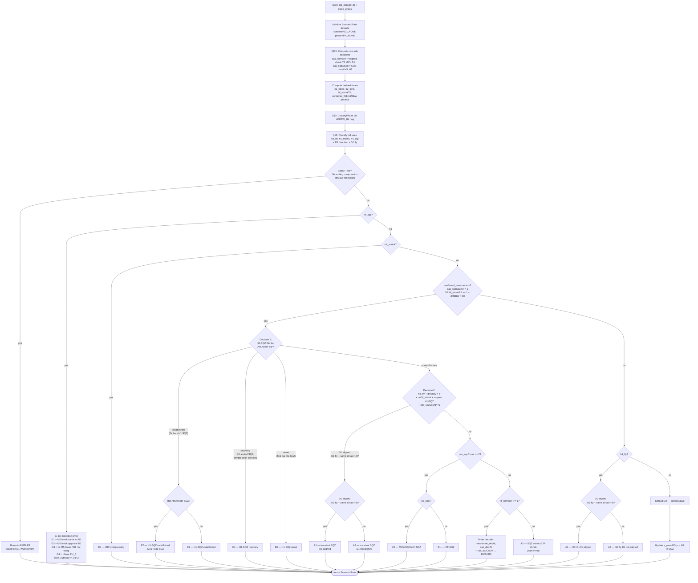

**Contract established:** IdentifyScenario returns a fully populated ScenarioState. The evaluation order is: cascade decoders → phase → CHECK-HTF (h4_sqz/h4_shrink) → compression routing → h4_fly → default. This implements the Part 2 HTF-first principle: H4 state is checked before LTF compression, and D1 direction gates G-tier sub-states (G1 vs G2).

### 3.3 Scenario State Machine — State Diagram

This diagram shows the scenario lifecycle: how the system transitions between tiers as market conditions evolve. Transition conditions are derived from the code's branch logic, not assumed.

**Contract established:** The scenario machine is a left-side (A→B→E→G) then right-side (F continuation or C reversal) cycle. The G→F edge is OOS-validated (7/7 episodes). The G→C edge is structurally defined but unvalidated — both the discriminator and the C-tier state transitions are unimplemented in the harness.

### 3.4 Validation Status

| Component | Status | Detail |
|-----------|--------|--------|
| A-tier routing (A1/A2) | OOS-VALIDATED | 103/349 snapshots, D1 alignment working |
| B-tier routing (B1/B2/B3) | OOS-VALIDATED | 81/349 snapshots, depth decoder working |
| E-tier routing (E1/E2/E4) | OOS-VALIDATED | 153/349 snapshots |
| G-tier compression entry | OOS-VALIDATED | 36/36 H4-SQZ bars detected correctly |
| F continuation resolution | OOS-VALIDATED | 7/7 episodes resolved as F |
| Decision 5 (onset/established) | OOS-VALIDATED | H1-SQZ tracking consistent |
| Early F-tier detection | OOS-VALIDATED | Fires before G-tier, prevents misclassification |
| **G reversal branch (G→C)** | **HYPOTHESIS** | Never fired on OOS data — 0/7 episodes |
| **G-vs-F discriminator** | **HYPOTHESIS** | Requires reversal episodes — none in current data |
| **G2→C1→C2/C3 transitions** | **UNIMPLEMENTED** | Not in identify_scenario, doc-only |
| VETO-AT-TARGET | OOS-VALIDATED | Architecture-enforced, item 5 PASS |
| veto_priceloc (L3) | **KNOWN DIVERGENCE** | Python stricter than MQL5 — D1 veto when not container |

For the full validation record with episode detail, see [`references/fixtures/validation_status.md`](fixtures/validation_status.md).

---

## Part 4 — Layer 2: PredictNext (DESIGN — built Phase 3)

Consumes Layer 1 ScenarioState + per-TF BB data → outputs Prediction for Layer 3. D1/W1 do their heaviest work here — resolving the H4 pivot that Part 3 left pending. For prediction rule MEANINGS see `backtest_chart_analysis.md` Part 4 (Rules 1-4); this section designs the layer structure, not rule values.

### 4.0 Link from Layer 1 — what Part 4 consumes from Part 3

**ScenarioState consumption table** — every Part 3 field mapped to Part 4 use:

| ScenarioState field (from Part 3 §3.1) | How PredictNext uses it |
|---|---|
| `scenario` | Selects which prediction rule applies; scenario-gates confidence and next-scenario edges |
| `phase` | Scenario-gates confidence (PH_4 → None, PH_5 → explosive); drives timeline estimate |
| `b2_pink` | Gating — forces confidence=0 (no prediction possible, M15+M30 locked in SQZ) |
| `container_tf` | The target the prediction aims at (Rule 2: next confinement boundary) |
| `pivot_substate` | G-tier: 0=N/A, 1=PIVOT-PENDING (direction unresolved — D1/W1 bias predicts G→F vs G→C), 2=G-REVERSAL (reversal_flag=True) |
| `cas_shrinkTF` | Not used directly by Layer 2 — consumed by Layer 3 (decoder size) |
| `cas_sqzCount` | Not used directly by Layer 2 — consumed by Layer 3 (decoder size). Provides compression depth context for timeline estimate. |
| `b1_block` | Not used by Layer 2 — consumed by Layer 3 (entry gating) |
| `container_dir` | Not used directly — direction is scored from per-TF BB data (see gap below) |
| `container_diffbbw` | Not used directly — container health scored from per-TF BB data via ADiffBBW |
| `priceloc` | Not used by Layer 2 — consumed by Layer 3 (E3, VETO, X1) |
| `info` | Not used — logging field from Part 3 |

**GAP — per-TF BB data**: PredictNext needs per-TF BB data (stage, mid, diffBBW, BBUpDn) to score direction across TFs. ScenarioState does NOT expose this — it exposes `container_tf`, `container_dir`, and `container_diffbbw` for the container only. Therefore Part 4 receives **both** ScenarioState (for scenario/phase gating) **and** the raw `BB_datas[]` array (for per-TF direction scoring). This matches the MQL5 signature: `PredictNext(ScenarioState &s, BB_MTF_Data_struct &bb[])`.

**GAP — D1/W1 prior-bar state**: Direction scoring needs `stage[LA_1]` and `mid[LA_1]` (prior-bar) for transition detection (sqz→fly, fly→shrink). ScenarioState doesn't store prior-bar per-TF state. Part 4 reads this directly from `BB_datas[tf].BBW_stage[LA_1]` — the same raw array it already receives. No additional Part 3 change needed.

**Impact — how Part 3 constrains Part 4:**

1. **Can only predict from what ScenarioState exposes.** Part 4 can gate on scenario, phase, and b2_pink. Everything else (per-TF direction scoring, diffBBW damping) requires raw BB data. If a prediction needed per-TF diffBBW and Part 3 didn't pass BB_datas, that would be an unresolvable gap — but the dual-input design avoids this.
2. **G-pivot handoff.** Part 3 marks G-tier as "pivot-pending" (pivot_substate=1) and sets direction=UNKNOWN — it does NOT resolve the pivot. Part 4 INHERITS this unresolved pivot as its primary job: D1/W1 bias predicts whether G resolves as F (continuation) or C (reversal). This is the most important Part 3 → Part 4 handoff.
3. **OOS-unvalidated propagation.** Part 3 flags G→C transition as OOS-UNVALIDATED (0 of 7 OOS episodes resolved as reversal) and G2→C1→C2/C3 as UNIMPLEMENTED. Any Part 4 prediction that depends on G→C resolution inherits these flags — it is also OOS-UNVALIDATED.
4. **Fields Part 3 computes but Part 4 ignores.** cas_shrinkTF, cas_sqzCount, b1_block, priceloc are Layer 3 fields. Part 4 doesn't consume them — they flow ScenarioState → Layer 3 directly.

### 4.0a Part 3 → Part 4 Link (visual)

Three diagrams showing how Layer 1 connects to and constrains Layer 2 — the handoff made visible, not just the table above.

#### Diagram 1 — Cross-Layer Data-Flow (field → function wiring)

Which ScenarioState field wires to which Layer 2 sub-function. Shows the dual-input: ScenarioState (gating) vs raw BB_datas (scoring).

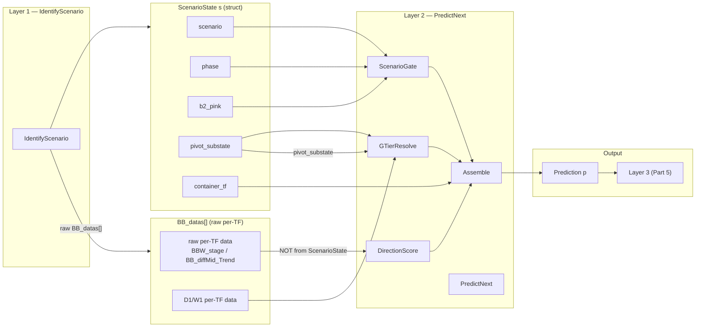

*Review criterion: I can trace any ScenarioState field to the exact sub-function that consumes it.*

#### Diagram 2 — Impact / Constraint (how Part 3 shapes Part 4)

Three ways Layer 1's design constrains Layer 2 — the unresolved pivot, the OOS flag, the dual-input gap.

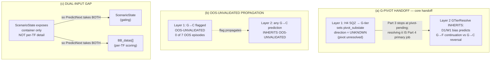

*Review criterion: I see WHY Part 4 is shaped the way it is — the unresolved pivot it inherits, the flag it carries, the raw data it needs.*

#### Diagram 3 — Detailed Cross-Layer Sequence (runtime call order)

Per-bar call sequence at the skeleton-function level — the exact functions the skeleton implements.

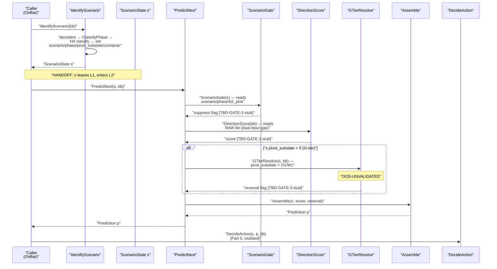

*Review criterion: this reads as the exact call sequence the skeleton implements — diagram and code are two views of one structure.*

### 4.0b Cross-Layer Sequence — Per-Bar Call Flow (L1 → L2 → L3)

This diagram shows the function-level call sequence at runtime. Every L2 sub-function is a TBD-GATE-3 stub — structure built, logic deferred.

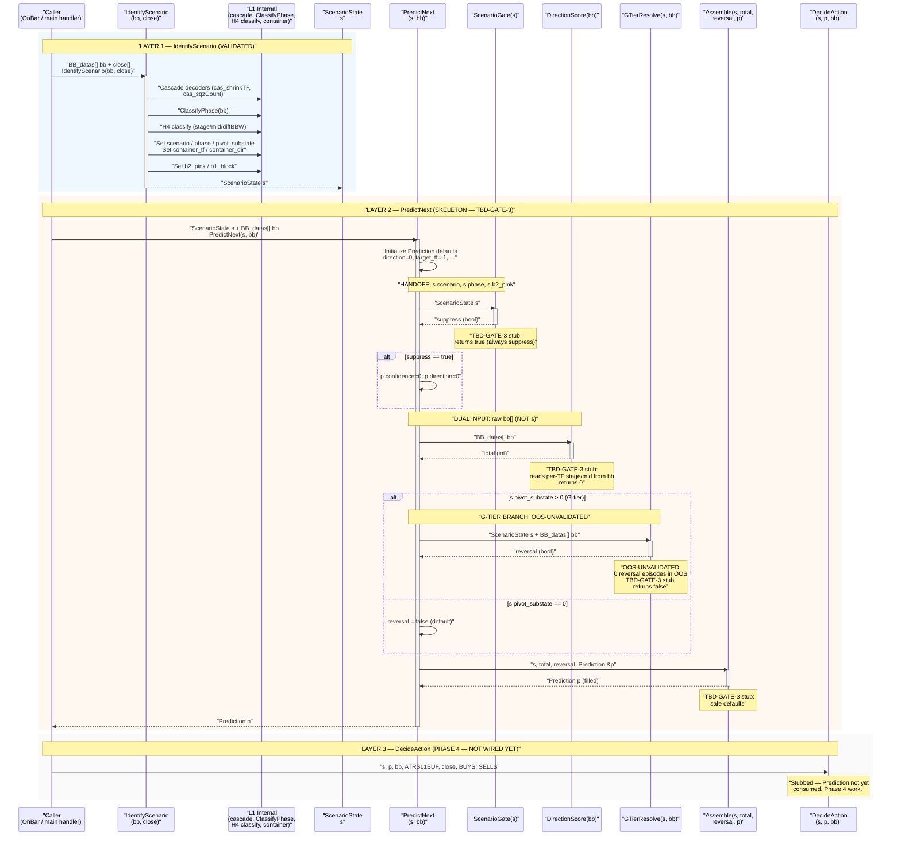

**Critical details visible in this diagram:**

- **HANDOFF POINT:** ScenarioState `s` flows from IdentifyScenario → PredictNext → ScenarioGate. This is the exact interface boundary between L1 and L2.
- **DUAL INPUT:** PredictNext receives both `s` (ScenarioGate reads it) and `bb` (DirectionScore reads it). The gap-resolution is visible: ScenarioGate reads `s.scenario`, `s.phase`, `s.b2_pink`; DirectionScore reads raw `bb[]` per-TF stage/mid.
- **G-TIER BRANCH:** GTierResolve fires only when `s.pivot_substate > 0`. Marked OOS-UNVALIDATED.
- **STUB MARKERS:** Every L2 sub-function is annotated as TBD-GATE-3. No rule values are present — structure only.
- **LAYER 3 NOT WIRED:** DecideAction receives Prediction `p` but does not consume it yet. Phase 4 work.

### 4.1 Interface — Class Diagram

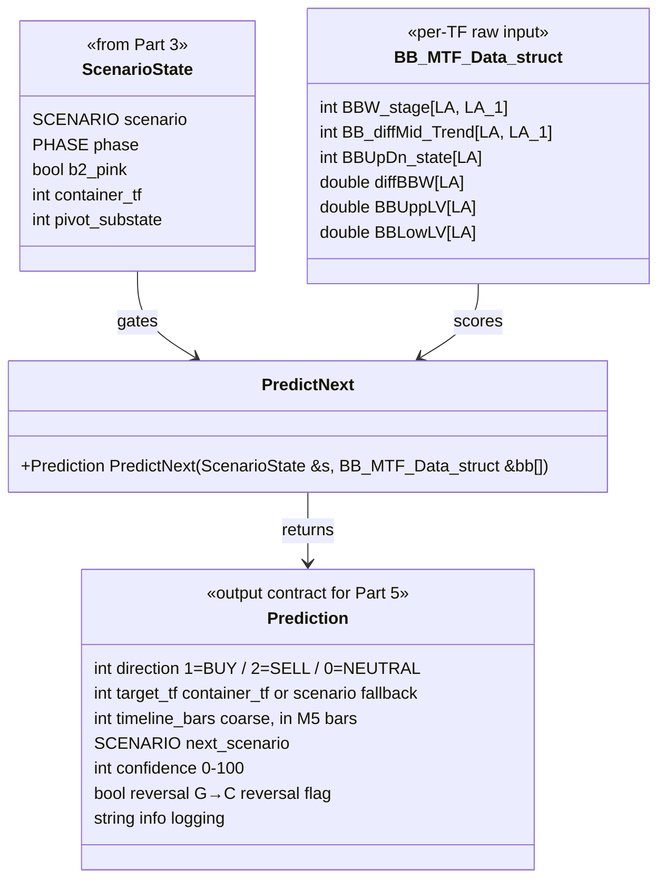

**Prediction field meanings:**

| Field | Type | Meaning | Rule | Consumed by Part 5 |
|---|---|---|---|---|
| `direction` | int | Predicted direction (1=BUY, 2=SELL, 0=NEUTRAL) | Rule 1 | Entry side |
| `target_tf` | int | Which TF band is the target (0=M5..5=D1, -1=none) | Rule 2 | Exit target |
| `timeline_bars` | int | Coarse estimate in M5 bars (TBD — GATE 3) | Rule 3 | Hold-duration check |
| `next_scenario` | SCENARIO | Predicted next scenario | Rule 4 | Scenario-transition gating |
| `confidence` | int | 0-100, drives Part 5 size | Rule 5 | Size multiplier |
| `reversal` | bool | True if HTF LTF diverge (reversal imminent) | Rule 1 | Exit-not-entry signal |
| `info` | string | Debug string (score components) | logging | — |

**Output contract:** Prediction is the structured output Part 5 consumes. direction → entry side; confidence → size; target_tf → exit target TF; reversal → exit-not-entry signal.

### 4.2 Sequence Diagram — per-bar flow

This diagram makes the consumption arrow explicit: Prediction is CONSUMED by Part 5, not decorative. (TofyTrade4 PredictNextTrend was drawn-and-discarded — its output was never consumed by the firing matrix.)

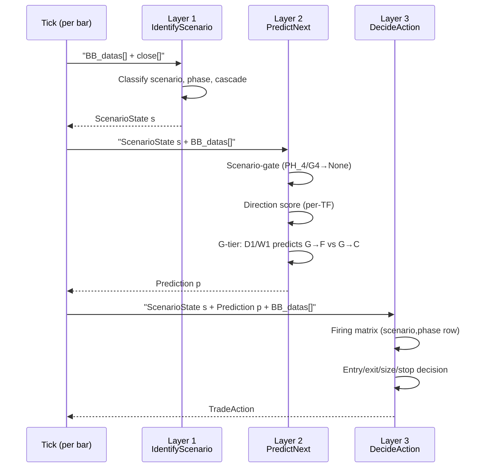

**Key difference from TofyTrade4:** In TofyTrade4, PredictNextTrend returned a TrendPrediction that was drawn on chart but NOT consumed by the entry/exit logic — the firing matrix operated independently. In TofyTrade5, Prediction flows into DecideAction: direction determines entry side, confidence determines size, target_tf determines exit boundary, reversal determines whether the signal is an exit or entry.

#### Detailed Internal Sequence — PredictNext sub-function calls

This diagram breaks PredictNext into its internal sub-function calls, showing data flow between steps. Each sub-function is a stub (TBD-GATE-3) — no rule values.

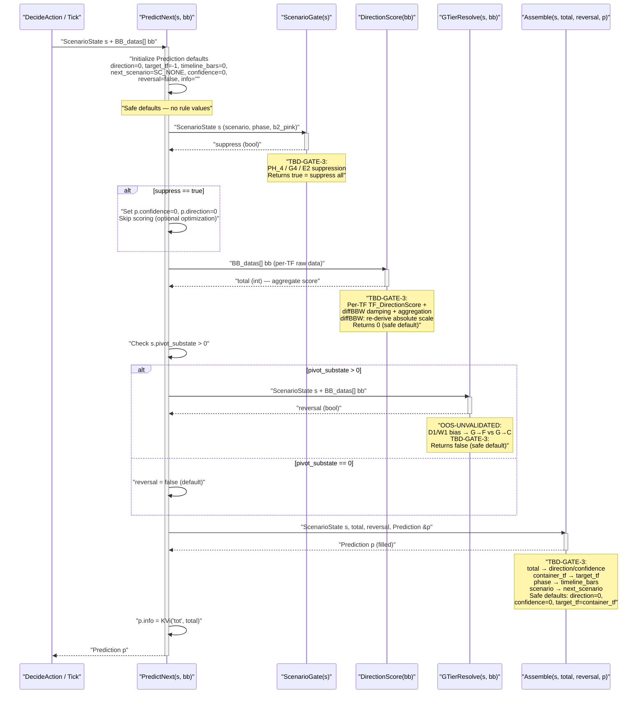

**Data consumption notes:**
- `ScenarioGate` consumes only `ScenarioState` fields: `scenario`, `phase`, `b2_pink`
- `DirectionScore` consumes only raw `BB_datas[]` — reads per-TF `BBW_stage`, `BB_diffMid_Trend` (current + prior bar via `LA`/`LA_1`)
- `GTierResolve` consumes both: `ScenarioState.pivot_substate` + raw `BB_datas[]` for D1/W1 bias
- `Assemble` consumes `ScenarioState` fields: `scenario`, `phase`, `container_tf` + score from DirectionScore + reversal from GTierResolve

**Store-vs-recompute note:** MQL5 reads `BBW_stage[LA_1]` and `BB_diffMid_Trend[LA_1]` (prior-bar state) directly from the `BB_datas[]` struct. Python harness recomputes these from consecutive log snapshots. Must match bar-for-bar (per `validation_status.md` Phase 4 item).

### 4.3 Activity Diagram — internal flow

Flow only — no weights, thresholds, or formulas. All values TBD — GATE 3.

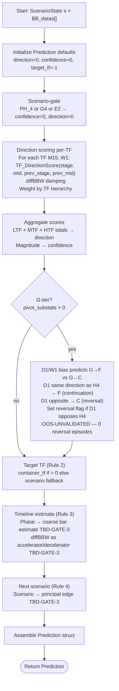

**TBD — GATE 3 markers:**
- Direction scoring weights per TF (LTF/MTF/HTF hierarchy weights)
- diffBBW damping thresholds (current values -0.5, 1.0 are WRONG with absolute formula — see integration note 6 in TofyTrade5.mqh)
- Confidence thresholds (magnitude → confidence mapping)
- Timeline bar estimates per phase
- Next-scenario edge transitions
- G→F vs G→C discrimination thresholds

### 4.4 Consumption note — link forward to Part 5

Prediction is the structured input Part 5 receives. How each field is consumed:

| Prediction field | How Part 5 uses it |
|---|---|
| `direction` | Entry side — 1=BUY, 2=SELL, 0=NEUTRAL (no entry) |
| `confidence` | Size multiplier — confidence → size mapping (Rule 5) |
| `target_tf` | Exit target — which TF band boundary triggers X1 |
| `timeline_bars` | Hold-duration sanity — if price hasn't moved in N bars, re-evaluate |
| `next_scenario` | Scenario-transition gating — if L1 transitions to next_scenario, re-evaluate position |
| `reversal` | Exit-not-entry signal — if reversal=True, the firing matrix prioritizes exit conditions over entry |

**Existing code status:** The MQL5 PredictNext stub (lines 590-648 of TofyTrade5.mqh) is functional but suppressed — `ShowPredLabels=false` and Prediction fields are not wired into DecideAction. The Python harness has no PredictNext equivalent. Both are Phase 3 work.

**Staleness report:**
- `TF_DirectionScore` — salvaged verbatim from TofyTrade4. Core scoring logic (stage→stg, mid→mid_b, transition→stg_t, mid_transition→mid_t) is intact. **NOT stale** — the scoring formula is unchanged from TofyTrade4.
- `PredictNext` — uses TF_DirectionScore + diffBBW damping + scenario-gating. **PARTIALLY STALE**: diffBBW damping thresholds (-0.5, 1.0) are WRONG with the absolute formula (flagged in integration note 6, line 1132). Confidence thresholds and next-scenario edges are hardcoded from doc rules but unvalidated — no GATE 3 run.
- TofyTrade4 `PredictNextTrend` — **STALE**: drawn-and-discarded, output not consumed by firing matrix. TofyTrade5 PredictNext fixes this by flowing Prediction into DecideAction.

---

## Part 5 — Layer 3: DecideAction (DESIGN — built Phase 4)

Consumes ScenarioState (Part 3) + Prediction (Part 4) + raw BB_datas → outputs a TradeAction (entry/exit/size/stop). This is where trades actually fire — the layer GATE 4 tests against the March 2026 benchmark. Core principle: **NOTHING FIRES UNLESS ARMED** — opposite of TofyTrade4's fire-unless-blocked model. For entry/exit/block/size/stop rule MEANINGS see `backtest_chart_analysis.md` Part 5; this section designs the layer structure, not rule values.

### 5.0 Link from Layers 1 & 2 — what Part 5 consumes

**Table A — ScenarioState (Part 3) consumption:**

| ScenarioState field (from Part 3 §3.1) | How DecideAction uses it |
|---|---|
| `scenario` | Firing-matrix ROW key — selects which row of the matrix arms triggers |
| `phase` | Firing-matrix ROW key (combined with scenario); gates entry path (E3 in zigzag vs E1/E2 in trend) |
| `b1_block` | Entry gating — M15 sideways block (M15 mid ≥ 3 → no flip-entries) |
| `b2_pink` | X4-PINK exit trigger — M15+M30 both SQZ → forced exit all |
| `priceloc` | E3 boundary entry (at container band), VETO-at-target (no entry at target), X1 (price at target_tf band) |
| `container_tf` | Exit target boundary — which TF band triggers X1 |
| `container_dir` | E3 counter-trend sizing (3B-INTO: counter side 0.25× max) |
| `container_diffbbw` | X2 qualification — container cracking (diffBBW ≤ 0 → qualified exit) |
| `cas_shrinkTF` | Decoder size — compression depth → size multiplier |
| `cas_sqzCount` | Decoder size — B4 block (≥3 → no entries), combined with cas_shrinkTF |
| `pivot_substate` | G-tier routing — 1=PIVOT-PENDING (arm cautiously, exit-only on reversal), 2=G-REVERSAL (reversal_flag → EXIT branch) |
| `info` | Not used — logging field from Part 3 |

**Table B — Prediction (Part 4) consumption:**

| Prediction field (from Part 4 §4.1) | How DecideAction uses it |
|---|---|
| `direction` | Entry side — 1=BUY, 2=SELL, 0=NEUTRAL (no entry); flip-entries require dir==p.direction |
| `confidence` | Size multiplier — confidence → size mapping (ConfSize, Rule 5) |
| `target_tf` | Exit target — which TF band boundary triggers X1 |
| `reversal` | EXIT-not-entry routing — reversal=True → counter-H4 M15 signal closes longs, doesn't open counter-shorts |
| `timeline_bars` | Hold-duration sanity — if price hasn't moved in N bars, re-evaluate |
| `next_scenario` | Re-evaluate on transition — if L1 transitions to next_scenario, re-evaluate position |

**Impact — how the two upstream layers constrain Part 5:**

1. **Nothing fires unless armed.** Both ScenarioState (scenario+phase row) AND Prediction (direction+confidence) must arm the trigger. An M15 flip with ceiling=0 (E1/E2/E4) → WAIT. A prediction with direction=0 → no entry. This is the inversion of TofyTrade4 (which fired unless a gate blocked).
2. **Counter-H4 reversal routing.** A counter-H4 M15 trigger + reversal=True → EXIT route (close existing longs), NOT a new entry (don't open counter-shorts). This branch is explicit in the activity diagram.
3. **OOS-UNVALIDATED propagation.** G→C transition is OOS-UNVALIDATED (Part 3) and G-reversal prediction is OOS-UNVALIDATED (Part 4). Any Part 5 action depending on G-reversal resolution inherits the flag — pivot_substate=2 → exit-only, arm cautiously.
4. **Store-vs-recompute.** b1_block, b2_pink come from ScenarioState (MQL5 stores these on the struct). Python harness recomputes from raw BB data — must match bar-for-bar (per CLAUDE.md and validation_status.md Phase 4 verification item).
5. **Fields consumed but not by Part 5.** Part 3's info field is logging-only; Part 4's timeline_bars and next_scenario are advisory (re-evaluate triggers, not firing conditions).

### 5.1 Interface — Class Diagram

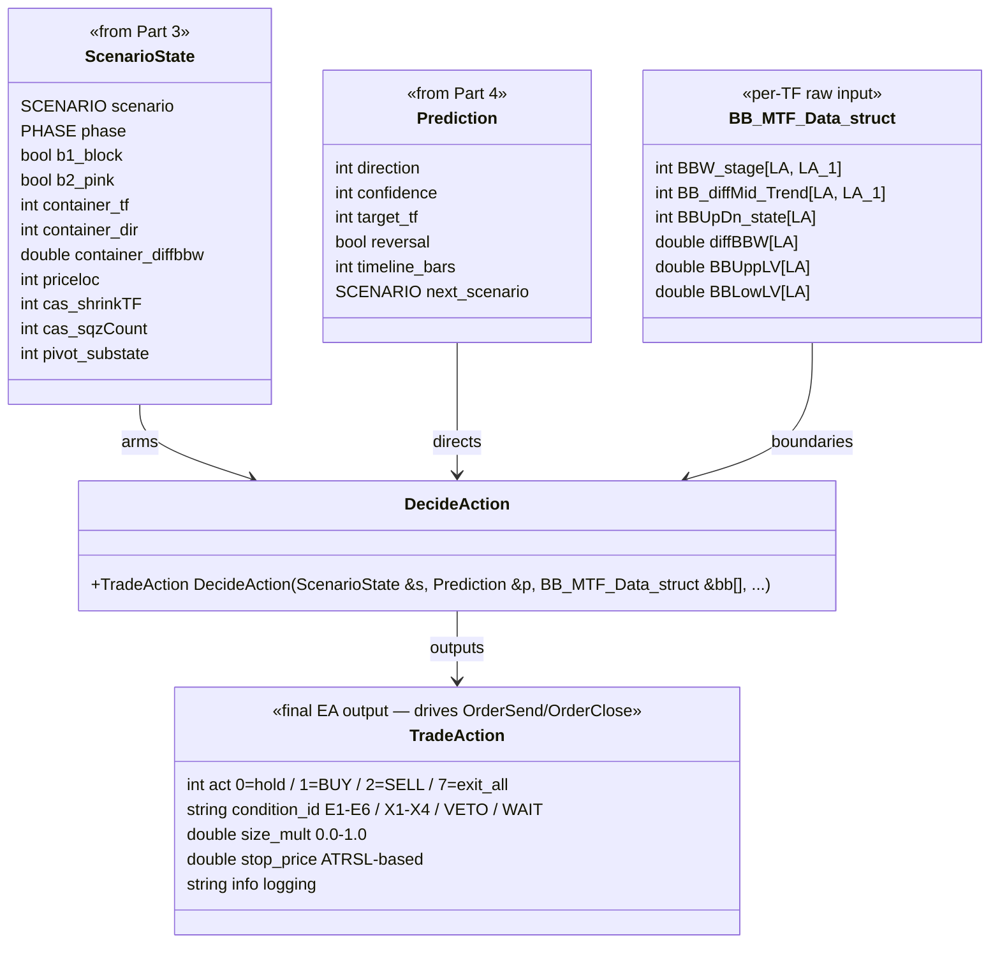

**TradeAction field meanings:**

| Field | Type | Meaning | Consumed by |
|---|---|---|---|
| `act` | int | 0=hold, 1=BUY, 2=SELL, 7=exit_all | OrderSend / OrderClose |
| `condition_id` | string | E1-E6 (entry), X1-X4 (exit), VETO, WAIT | Logging, benchmark verification |
| `size_mult` | double | 0.0–1.0, final = min(ceiling, conf_size, decoder_size) | Lot size |
| `stop_price` | double | ATRSL stop at entry | OrderSend SL |
| `info` | string | Debug string | Logging |

**Output contract:** TradeAction is the final EA output — it drives OrderSend (act=1/2), OrderClose (act=7), or holds (act=0). size_mult is the product of three independent constraints: matrix ceiling (scenario-based), confidence size (Prediction), and decoder size (cascade state). stop_price is set at entry — INVARIANT 1: no trade without a stop.

### 5.2 Activity Diagram — control-flow order

This is the evaluation order. The order IS the design. Cell values are TBD — GATE 4. The "nothing fires unless armed" principle is visible: an unarmed trigger has no path to act=1/2.

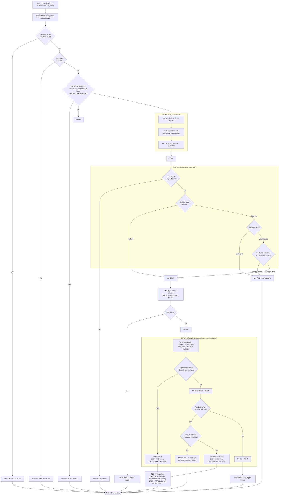

**Contract established:** The evaluation order is INVARIANTS → BLOCKS → EXITS → ARMING → SIZE. Invariants fire unconditionally (EMERGENCY, X4-PINK, VETO). Blocks prevent new entries but don't close existing positions. Exits check only when a position is open. Arming requires BOTH scenario/phase row AND Prediction direction — unarmored triggers have no path to fire. Stop is set at entry (INVARIANT 1).

### 5.3 Firing Matrix — Structure (the shape, not the cells)

The matrix defines which triggers are armed per (scenario, phase) row. Cell VALUES are TBD — GATE 4. This section designs the table structure.

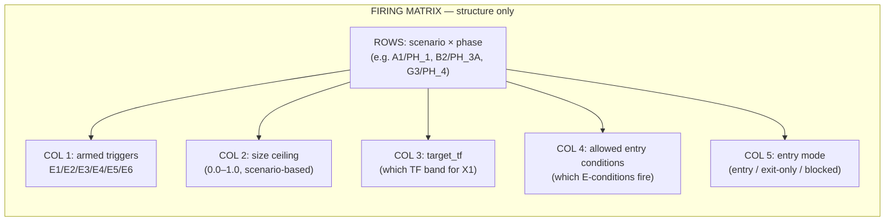

**Structure rules (design-time, not GATE-4-validated):**
- Each row is a unique (scenario, phase) combination
- Ceiling = 0.0 → exit-only or blocked (no entries possible)
- Ceiling > 0.0 → entries possible if triggers armed
- PH_4 rows → exit-only (X4-PINK or WAIT, no entries)
- PH_5 rows → E5/E6 only (expansion entries)
- G-tier rows (G1-G4) → arm cautiously; pivot_substate=2 → exit-only
- C-tier rows → OOS-UNVALIDATED — cells TBD — no OOS episodes to validate
- Cell values (which specific triggers fire per row) = TBD — GATE 4

**Existing code status:** The MQL5 DecideAction (lines 731-828 of TofyTrade5.mqh) is implemented with the control flow matching the activity diagram: invariants (b2_pink, VETO), exits (X1, X2 qualified), ceiling check, E3 in zigzag, flip-path E1/E2/E5. The replay_harness.py `decide_action()` mirrors this (lines 706-847). Matrix ceiling values are hardcoded from backtest_chart_analysis.md Part 5 — not yet GATE-4-validated.

**Staleness report:**
- TofyTrade5 DecideAction — **CURRENT**: implements the three-layer design with firing matrix. Condition IDs (E1-E6, X1-X4, VETO, WAIT) match the v31 signal taxonomy. No old G0b/G4x gate names in control flow — those are in the gate decoder table only (for log parsing).
- TofyTrade4 gate-based model — **STALE**: fire-unless-blocked model replaced by nothing-fires-unless-armed. Old gate names (G0b-TOUCH → E3, G8-BNDTGT → X1, G5-FADE → X2, G0b-PINK → X4) documented in gate decoder table.
- Matrix ceiling values — **UNVALIDATED**: hardcoded from doc rules, no GATE 4 run against benchmark.

### 5.4 GATE 4 — what validates this layer

GATE 4 is the firing benchmark. Part 5 must produce results matching the March 2026 benchmark (`references/fixtures/march2026_benchmark.md`):

1. **≥ 6 leg-capture entries** — matching the 8 verified arrow legs (03.03 SELL crash, 03.04 BUY, 03.04 SELL, 03.05 BUY, 03.05 SELL, 03.06 BUY, 03.10 BUY, 03.17 SELL run)
2. **03.03 07:45 → VETO-AT-TARGET** — not BUY (price at D1 upper band — the -191.29 nine-day hold must be impossible)
3. **No exit within 3 bars on mid=3 wobble** — 03.17-03.19 SELL run held through M15 wobble (X2 qualified only)
4. **Zero positions held > 3 days** — stop at entry (INVARIANT 1) + emergency $50 exit
5. **Counter-H4 M15 sell = EXIT not new short** — reversal routing (reversal=True → exit branch)

The replay harness `simulate_trades()` + `score_benchmark()` (replay_harness.py lines 851-1117) runs this validation.

---
