# Architecture — TofyTrade5 Three-Layer System

System design and UML for TofyTrade5's three-layer architecture. For scenario/rule MEANINGS see `backtest_chart_analysis.md`; for the validation record see `references/fixtures/validation_status.md`.

## Three-Layer Overview

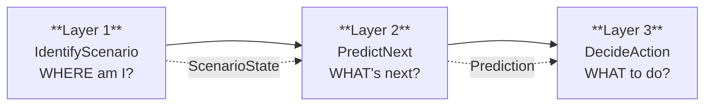

- **Layer 1 — IdentifyScenario**: Given current BB state across all TFs, classify the market into a scenario + phase. **Built & validated** against March 2026 in-sample + Jan-Apr OOS data.
- **Layer 2 — PredictNext**: Given ScenarioState, score direction, confidence, target TF, timeline, and next scenario. Built but diffBBW damping thresholds need correction (see integration note 6 in `.mqh`).
- **Layer 3 — DecideAction**: Given ScenarioState + Prediction, select entry/exit condition from firing matrix. Built and enforced.

## TF Roles (cross-cut all layers)

These responsibilities are invariant across all three layers — they define what each TF contributes to the system.

| TF | Role | Layers that consume |
|----|------|---------------------|
| W1 | Macro bias — highest container candidate, sets directional a priori | L1 (container), L2 (direction score), L3 (X2 container-crack) |
| D1 | Macro bias — alignment check for A1, G-tier sub-state discriminator | L1 (A1/G1-G2), L2 (direction score), L3 (VETO via veto_priceloc in .py) |
| H4 | Trend / context — primary classifier (fly/shrink/sqz), phase driver | L1 (CHECK-HTF, phase), L2 (direction score), L3 (E3 chk1, X2) |
| M30 | Primary trend DRIVER — the leg ridden, E3 confinement check | L1 (compression routing), L2 (direction score), L3 (E3 chk4, X2) |
| M15 | Entry TRIGGER — flip detection, B-tier depth | L1 (B-tier, E-tier, flip detection), L2 (direction score), L3 (X2 fade) |
| M5 | Noise / unused for entry — SQZ count contributor only | L1 (cas_sqzCount, E3 chk3), L2 (not scored — index 0 excluded) |

---

## Part 3 — Layer 1: IdentifyScenario (BUILT & VALIDATED)

### 3.1 Interface — Class/Struct Diagram

This diagram shows the actual data structures: what IdentifyScenario reads (input per-TF BB data) and what it returns (ScenarioState). Fields marked with `[L2]` / `[L3]` indicate the output contract consumed by downstream layers.

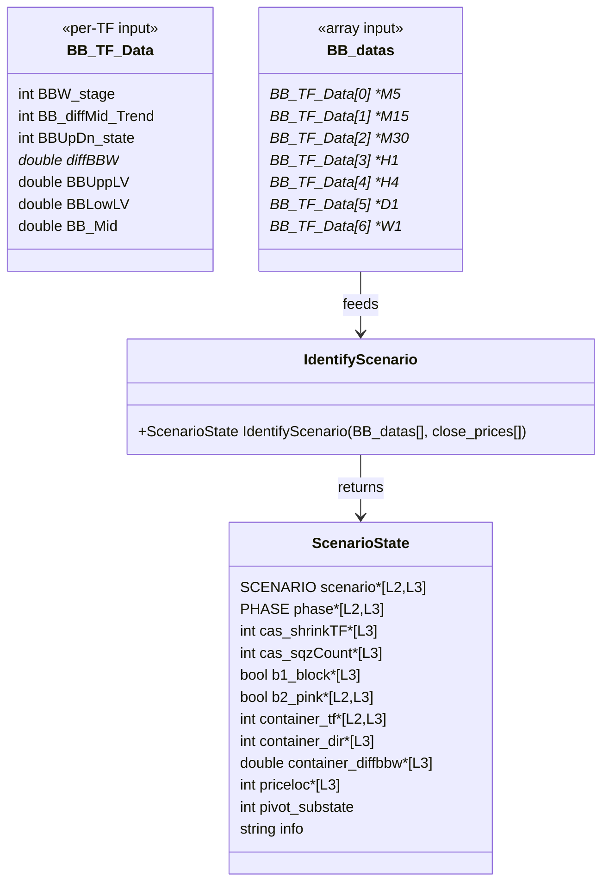

**Field meanings (ScenarioState):**

| Field | Type | Meaning | Consumed by |
|-------|------|---------|-------------|
| `scenario` | SCENARIO | Identified scenario (A1..C3) | L2, L3 |
| `phase` | PHASE | Phase classification (PH_1..PH_6) | L2, L3 |
| `cas_shrinkTF` | int | Highest TF in shrink (1=M15..5=D1, -1=none), per §12d | L3 |
| `cas_sqzCount` | int | Count of M5..H1 TFs in SQZ (400-499), per §12d | L3 |
| `b1_block` | bool | M15 diffMid >= 3 (blocks flip-entries) | L3 (read from struct by DecideAction line 809; Python harness recomputes from raw BB data — no ScenarioState struct) |
| `b2_pink` | bool | M15 AND M30 both BBW 400-499 (forces flat) | L3 (read from struct by X4 invariant line 1040 + ASSERT line 784; L2 uses `scenario==E2` as proxy, not b2_pink directly; Python harness recomputes) |
| `container_tf` | int | Highest TF with committed fly, -1 if none | L2, L3 |
| `container_dir` | int | Container's diffMid (1=UP, 2=DN, 0=none) | L3 |
| `container_diffbbw` | double | Container health: >0 room, <=0 aging | L3 |
| `priceloc` | int | Price vs container bands: -2..+2 | L3 |
| `pivot_substate` | int | G-tier: 0=N/A, 1=PIVOT-PENDING, 2=G-REVERSAL | display only |
| `info` | string | Human-readable reason string | logging |

> **Note:** `dbbwH4` is NOT a ScenarioState field — it is computed internally and pushed to ring buffers (`g_dbbw_ring`, `s_dbbwH4_hist`) used by `ClassifyPhase()` and early F-tier detection. The value is available to callers via `ADiffBBW(bb, 4)` but is not part of the output contract.

**MQL5 vs Python consumption:** MQL5 L3 reads `b1_block`, `b2_pink`, and `cas_sqzCount` directly from the ScenarioState struct. The Python harness has no ScenarioState struct — it recomputes these from raw BB data in the simulation loop. This is a harness architecture difference, not a behavioral one, except for `veto_priceloc` (Python adds D1 as veto source — see known divergence in `validation_status.md`).

**Output contract summary:**
- Layer 2 consumes: `scenario`, `phase`, `container_tf`, `container_dir`, `b2_pink`
- Layer 3 consumes: all fields except `pivot_substate` (display-only) and `info` (logging)

### 3.2 Control Flow — Activity Diagram

This flowchart shows the **as-built** evaluation order of `IdentifyScenario`, matching the validated Decisions 1-6. Note: the early F-tier check fires **before** G-tier (Step 3 in code), not after compression routing — this is the Cluster 1 fix that prevents misclassifying H4-exiting-compression as G when it should be F.

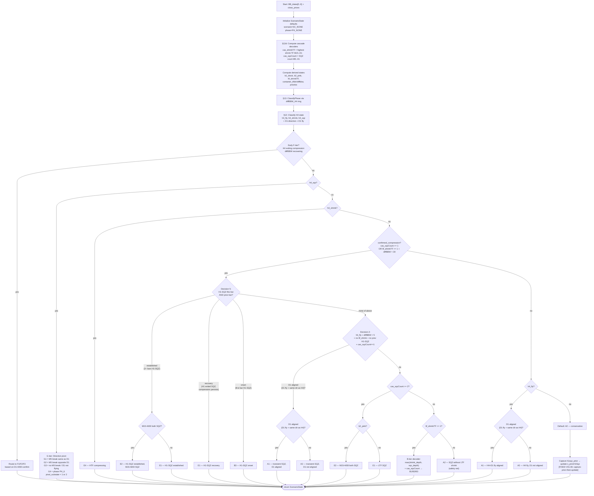

**Contract established:** IdentifyScenario returns a fully populated ScenarioState. The evaluation order is: cascade decoders → phase → CHECK-HTF (h4_sqz/h4_shrink) → compression routing → h4_fly → default. This implements the Part 2 HTF-first principle: H4 state is checked before LTF compression, and D1 direction gates G-tier sub-states (G1 vs G2).

**s_prevH1Sqz fix (V31.06):** The prior-bar H1-SQZ timing bug (update-then-read collapsed current-vs-prior, Decision 6 dead code) is fixed with capture-prior-then-update (`bool h1sqz_prior = s_prevH1Sqz;` before updating). Now matches harness read-then-update — Decision 6 recovery is live. See validation_status.md Bug 3 for full postmortem.

### 3.3 Scenario State Machine — State Diagram

This diagram shows the scenario lifecycle: how the system transitions between tiers as market conditions evolve. Transition conditions are derived from the code's branch logic, not assumed.

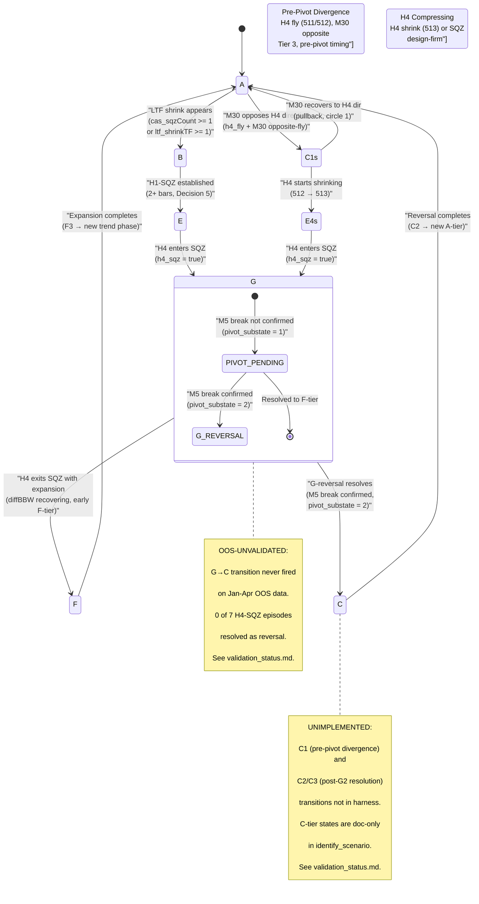

**Contract established:** The scenario machine is a left-side (A→B→E→G) then right-side (F continuation or C reversal) cycle. The G→F edge is OOS-validated (7/7 episodes). The G→C edge is structurally defined but unvalidated — both the discriminator and the C-tier state transitions are unimplemented in the harness. The reversal path is C1 (pre-pivot divergence: H4 fly 511/512, M30 opposite) → E4 (H4 compresses 513) → G2 (H4 pivots) → C2/C3 (H4 resolves). C1→A fork: M30 recovery = pullback. C1 is pre-G2, not post-G2.

### 3.4 Validation Status

| Component | Status | Detail |
|-----------|--------|--------|
| A-tier routing (A1/A2) | OOS-VALIDATED | 103/349 snapshots, D1 alignment working |
| B-tier routing (B1/B2/B3) | OOS-VALIDATED | 81/349 snapshots, depth decoder working |
| E-tier routing (E1/E2/E4) | OOS-VALIDATED | 153/349 snapshots |
| G-tier compression entry | OOS-VALIDATED | 36/36 H4-SQZ bars detected correctly |
| F continuation resolution | OOS-VALIDATED | 7/7 episodes resolved as F |
| Decision 5 (onset/established) | OOS-VALIDATED | H1-SQZ tracking consistent |
| Early F-tier detection | OOS-VALIDATED | Fires before G-tier, prevents misclassification |
| **G reversal branch (G→C)** | **HYPOTHESIS** | Never fired on OOS data — 0/7 episodes |
| **G-vs-F discriminator** | **HYPOTHESIS** | Requires reversal episodes — none in current data |
| **C1 pre-pivot detection** | **UNIMPLEMENTED** | Directional-agreement check not in identify_scenario, doc-only |
| **G2→C2/C3 transitions** | **UNIMPLEMENTED** | Not in identify_scenario, doc-only |
| VETO-AT-TARGET | OOS-VALIDATED | Architecture-enforced, item 5 PASS |
| veto_priceloc (L3) | **KNOWN DIVERGENCE** | Python stricter than MQL5 — D1 veto when not container |

For the full validation record with episode detail, see [`references/fixtures/validation_status.md`](fixtures/validation_status.md).

### 3.4a C1 as Pre-Pivot Divergence State — the April 1 Circle 2 Gap

C1 ("MTF reversal only, H4 original direction") already exists in the scenario enum and the C-tier table — but it is **misframed as post-G2** and **unimplemented**. The C1 table row says "511/512 or 513 (original direction)" for H4 — but C1 requires H4 FLYING, not shrinking. C1 = 511/512 only. This is **pre-pivot**, not post-G2.

**C1 definition (re-timed, fly-only):** The brief early-warning window where M30 has reversed opposite while H4 is still flying clean (511/512, not yet compressing). Its value: the earliest detectable flag of "reversal beginning (M30 defected)", before H4 compresses. Short-lived by nature — transitions to E4 when H4 starts shrinking. C1 fires when H4 flying dir X (511/512) AND M30 flying dir NOT-X (521/522).

**Detection (directional-agreement check — the core fix):**
- H4 fly direction: 511/512 = up, 521/522 = down
- M30 fly direction: same mapping
- If H4 flying dir X (511/512) AND M30 flying dir NOT-X (521/522) → C1
- M30's BBW_stage and BB_diffMid_Trend are already read by IdentifyScenario; this adds the **comparison to H4**, not a new read
- [DESIGN — Phase 3, unimplemented. The April-1 2nd-circle state that currently falls through to A-tier.]

**A-tier tightening:** A currently = "h4_fly + no compression" with **no directional check**, so M30-opposite-H4 wrongly reads as A. Tighten: A requires "h4_fly + no compression + MTF **aligned** with H4 direction". If M30 opposes H4 → C1, not A. [DESIGN — Phase 3. Flagged as a classification change; validate it doesn't break existing A1/A2 cases against the baseline.]

**Distinctions:**
- **A (aligned fly):** MTF agrees with H4 — C1 is the opposite (MTF opposes H4)
- **B (pullback):** LTF shrinking, will resume H4 — C1 is M30 committed opposite, not pulling back
- **E4 (H4 compressing):** H4 shrinking (513) or SQZ (400s) — C1 has H4 flying (511/512). **Clean boundary:** C1 = H4 FLYING in original direction (511/512); E4 = H4 SHRINKING/SQZ (513, 400s). The moment H4 goes 512→513, leave C1, enter E4. No H4-stage overlap (511/512 vs 513).
- **G (H4 pivot):** H4 in SQZ (400s) — C1 has H4 flying (511/512). No H4-stage overlap (511/512 vs 400s).
- **C2/C3 (H4 flipped):** H4 reversed — C1 is H4 still original

**Timing:** C1 is pre-pivot (H4 hasn't turned). The reversal cascade:

A (all aligned) → M15 reverses (511→513→521) → M30 reverses (511→513→521, H4 STILL flying 511/512) = C1 [BRIEF] → H4 starts shrinking (513) = E4 → H4 enters SQZ = G2 → H4 breaks opposite = C2/C3

C1 is a FORK — two exits:
- C1 → E4 (reversal continues: H4 compresses, pivots)
- C1 → A (M30 recovers to H4 direction: was a pullback, like circle 1)

The C1→A fork is the reversal-vs-pullback distinction. M30 recovering while H4 still flying = pullback.

**Anchored example:** April 1, 2nd circle — H4 flew up (512, diffBBW=19.5). M30 pullback (511→411-422, never hit 521) — no C1 window on April 1 per log (M30 never opposed H4). The C1→A recovery fork IS validated: M30 compressed then recovered in H4 direction = pullback. The C1-before-E4 sequence is structurally correct but has no April 1 validation. [DESIGN — Phase 3.]

**Status: UNIMPLEMENTED.** The directional-agreement check is not in identify_scenario. M30-opposite-H4 falls through to A-tier.

**Tier placement:** C1 is grouped in Tier 3 with C2/C3 for reversal-progression coherence, but functionally C1 is the PRE-PIVOT entry (Tier-2-like timing): H4 is still flying (original direction), unlike the post-pivot C2/C3 where H4 has flipped. So C1 sits in Tier 3 by grouping, but is pre-pivot by timing — it's the divergence entry that PRECEDES the G2 pivot.

---

## Part 4 — Layer 2: PredictNext (DESIGN — built Phase 3)

Consumes Layer 1 ScenarioState + per-TF BB data → outputs Prediction for Layer 3. D1/W1 do their heaviest work here — resolving the H4 pivot that Part 3 left pending. For prediction rule MEANINGS see `backtest_chart_analysis.md` Part 4 (Rules 1-4); this section designs the layer structure, not rule values.

### 4.0 Link from Layer 1 — what Part 4 consumes from Part 3

**ScenarioState consumption table** — every Part 3 field mapped to Part 4 use:

| ScenarioState field (from Part 3 §3.1) | How PredictNext uses it |
|---|---|
| `scenario` | Selects which prediction rule applies; scenario-gates confidence and next-scenario edges |
| `phase` | Scenario-gates confidence (PH_4 → None, PH_5 → explosive); drives timeline estimate |
| `b2_pink` | Gating — forces confidence=0 (no prediction possible, M15+M30 locked in SQZ) |
| `container_tf` | The target the prediction aims at (Rule 2: next confinement boundary) |
| `pivot_substate` | G-tier: 0=N/A, 1=PIVOT-PENDING (direction unresolved — D1/W1 bias predicts G→F vs G→C), 2=G-REVERSAL (reversal_flag=True) |
| `cas_shrinkTF` | Not used directly by Layer 2 — consumed by Layer 3 (decoder size). Provides compression depth context for NextScenario (cascade state input). |
| `cas_sqzCount` | Not used directly by Layer 2 — consumed by Layer 3 (decoder size). Provides compression depth context for timeline estimate. Feeds NextScenario (cascade state input). |
| `b1_block` | Not used by Layer 2 — consumed by Layer 3 (entry gating) |
| `container_dir` | Not used directly — direction is scored from per-TF BB data (see gap below) |
| `container_diffbbw` | Not used directly — container health scored from per-TF BB data via ADiffBBW |
| `priceloc` | Not used by Layer 2 — consumed by Layer 3 (E3, VETO, X1) |
| `info` | Not used — logging field from Part 3 |

**GAP — per-TF BB data**: PredictNext needs per-TF BB data (stage, mid, diffBBW, BBUpDn) to score direction across TFs. ScenarioState does NOT expose this — it exposes `container_tf`, `container_dir`, and `container_diffbbw` for the container only. Therefore Part 4 receives **both** ScenarioState (for scenario/phase gating) **and** the raw `BB_datas[]` array (for per-TF direction scoring). This matches the MQL5 signature: `PredictNext(ScenarioState &s, BB_MTF_Data_struct &bb[])`.

**GAP — D1/W1 prior-bar state**: Direction scoring needs `stage[LA_1]` and `mid[LA_1]` (prior-bar) for transition detection (sqz→fly, fly→shrink). ScenarioState doesn't store prior-bar per-TF state. Part 4 reads this directly from `BB_datas[tf].BBW_stage[LA_1]` — the same raw array it already receives. No additional Part 3 change needed.

**Impact — how Part 3 constrains Part 4:**

1. **Can only predict from what ScenarioState exposes.** Part 4 can gate on scenario, phase, and b2_pink. Everything else (per-TF direction scoring, diffBBW damping) requires raw BB data. If a prediction needed per-TF diffBBW and Part 3 didn't pass BB_datas, that would be an unresolvable gap — but the dual-input design avoids this.
2. **G-pivot handoff.** Part 3 marks G-tier as "pivot-pending" (pivot_substate=1) and sets direction=UNKNOWN — it does NOT resolve the pivot. Part 4 INHERITS this unresolved pivot as its primary job: D1/W1 bias predicts whether G resolves as F (continuation) or C (reversal). This is the most important Part 3 → Part 4 handoff.
3. **OOS-unvalidated propagation.** Part 3 flags G→C transition as OOS-UNVALIDATED (0 of 7 OOS episodes resolved as reversal) and G2→C1→C2/C3 as UNIMPLEMENTED. Any Part 4 prediction that depends on G→C resolution inherits these flags — it is also OOS-UNVALIDATED.
4. **Fields Part 3 computes but Part 4 ignores.** cas_shrinkTF, cas_sqzCount, b1_block, priceloc are Layer 3 fields. Part 4 doesn't consume them — they flow ScenarioState → Layer 3 directly.

### 4.0a Part 3 → Part 4 Link (visual)

Three diagrams showing how Layer 1 connects to and constrains Layer 2 — the handoff made visible, not just the table above.

#### Diagram 1 — Cross-Layer Data-Flow (field → function wiring)

Which ScenarioState field wires to which Layer 2 sub-function. Shows the dual-input: ScenarioState (gating) vs raw BB_datas (scoring).

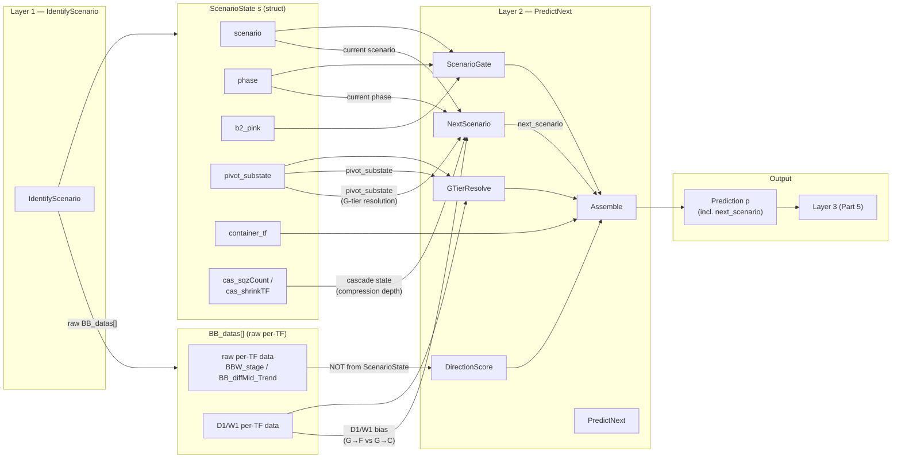

*Review criterion: I can trace any ScenarioState field to the exact sub-function that consumes it.*

**Why next_scenario is needed beyond direction:** `direction` says up/down; `next_scenario` says WHICH REGIME (fly / squeeze / pivot / reversal). DecideAction needs the regime to decide enter-vs-wait, the target band, and the size ceiling. The two-circle case proves it: the 1st circle has `next_scenario = continuation (A/B)` → HOLD; the 2nd circle has `next_scenario = reversal (G→C)` → EXIT. `direction` alone can't separate these (M15 points down at both); the next scenario does. See the test chart at `references/Backtest_data/extras/backtested_EA_test_phase_April_01.jpg` — the two-circle test pair (1st = predict continuation/HOLD, 2nd = predict reversal/EXIT) is the test for NextScenario's output.

**Validation flagging — NextScenario transitions (granular split):**
- **Compression-deepening transitions (A→B→E→G)** = follow the validated bottom-up cascade (§12d, Decision 4) → **[design-firm, validatable]**
- **G→F continuation** = **[OOS-VALIDATED 7/7]**
- **G→C reversal** = **[HYPOTHESIS — OOS-UNVALIDATED, 0 episodes; validates at GATE 4 / when reversal data exists]**

NextScenario is mostly firm; ONLY its G→C reversal output carries the hypothesis flag. Do NOT flag the whole node as unvalidated — that would wrongly taint the validated compression/continuation predictions.

#### Diagram 2 — Impact / Constraint (how Part 3 shapes Part 4)

Three ways Layer 1's design constrains Layer 2 — the unresolved pivot, the OOS flag, the dual-input gap.

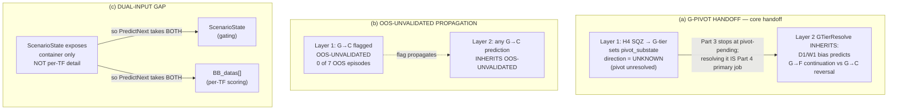

*Review criterion: I see WHY Part 4 is shaped the way it is — the unresolved pivot it inherits, the flag it carries, the raw data it needs.*

#### Diagram 3 — Detailed Cross-Layer Sequence (runtime call order)

Per-bar call sequence at the skeleton-function level — the exact functions the skeleton implements.

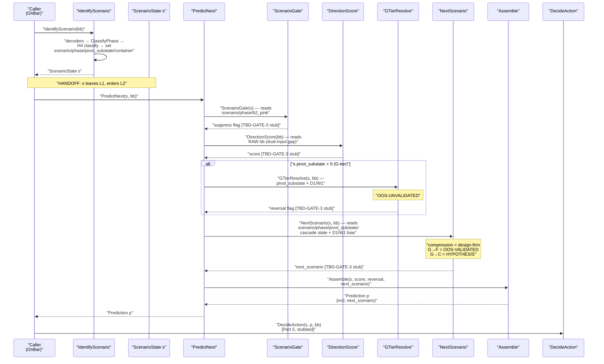

*Review criterion: this reads as the exact call sequence the skeleton implements — diagram and code are two views of one structure.*

### 4.0b Cross-Layer Sequence — Per-Bar Call Flow (L1 → L2 → L3)

This diagram shows the function-level call sequence at runtime. Every L2 sub-function is a TBD-GATE-3 stub — structure built, logic deferred.

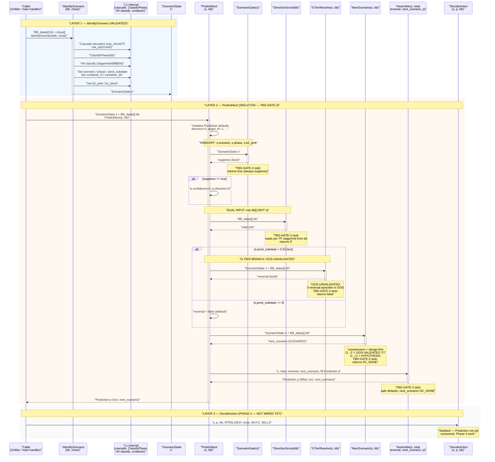

**Critical details visible in this diagram:**

- **HANDOFF POINT:** ScenarioState `s` flows from IdentifyScenario → PredictNext → ScenarioGate. This is the exact interface boundary between L1 and L2.
- **DUAL INPUT:** PredictNext receives both `s` (ScenarioGate reads it) and `bb` (DirectionScore reads it). The gap-resolution is visible: ScenarioGate reads `s.scenario`, `s.phase`, `s.b2_pink`; DirectionScore reads raw `bb[]` per-TF stage/mid.
- **G-TIER BRANCH:** GTierResolve fires only when `s.pivot_substate > 0`. Marked OOS-UNVALIDATED.
- **NEXT SCENARIO:** NextScenario produces `next_scenario` (predicted regime transition) from current scenario/phase, cascade state, pivot_substate, and D1/W1 bias. Compression transitions = design-firm; G→F = OOS-VALIDATED; G→C = HYPOTHESIS. Flows into Assemble → `Prediction.next_scenario`.
- **STUB MARKERS:** Every L2 sub-function is annotated as TBD-GATE-3. No rule values are present — structure only.
- **LAYER 3 NOT WIRED:** DecideAction receives Prediction `p` but does not consume it yet. Phase 4 work.

### 4.1 Interface — Class Diagram

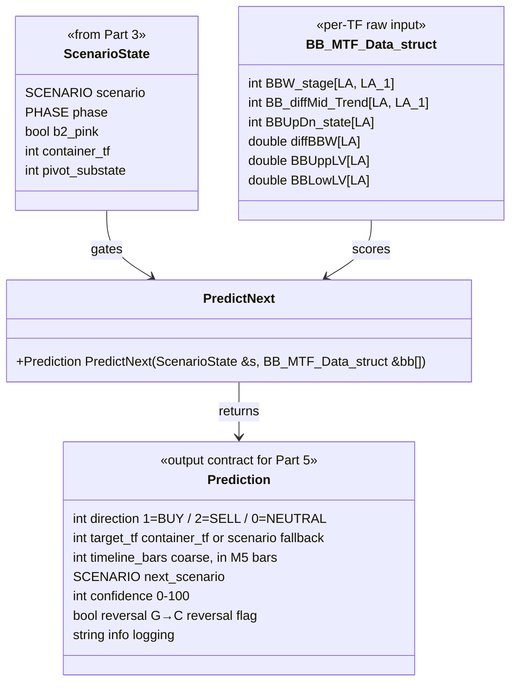

**Prediction field meanings:**

| Field | Type | Meaning | Rule | Consumed by Part 5 |
|---|---|---|---|---|
| `direction` | int | Predicted direction (1=BUY, 2=SELL, 0=NEUTRAL) | Rule 1 | Entry side |
| `target_tf` | int | Which TF band is the target (0=M5..5=D1, -1=none) | Rule 2 | Exit target |
| `timeline_bars` | int | Coarse estimate in M5 bars (TBD — GATE 3) | Rule 3 | Hold-duration check |
| `next_scenario` | SCENARIO | Predicted next scenario | Rule 4 | Scenario-transition gating |
| `confidence` | int | 0-100, drives Part 5 size | Rule 5 | Size multiplier |
| `reversal` | bool | True if HTF LTF diverge (reversal imminent) | Rule 1 | Exit-not-entry signal |
| `info` | string | Debug string (score components) | logging | — |

**Output contract:** Prediction is the structured output Part 5 consumes. direction → entry side; confidence → size; target_tf → exit target TF; reversal → exit-not-entry signal.

### 4.2 Sequence Diagram — per-bar flow

This diagram makes the consumption arrow explicit: Prediction is CONSUMED by Part 5, not decorative. (TofyTrade4 PredictNextTrend was drawn-and-discarded — its output was never consumed by the firing matrix.)

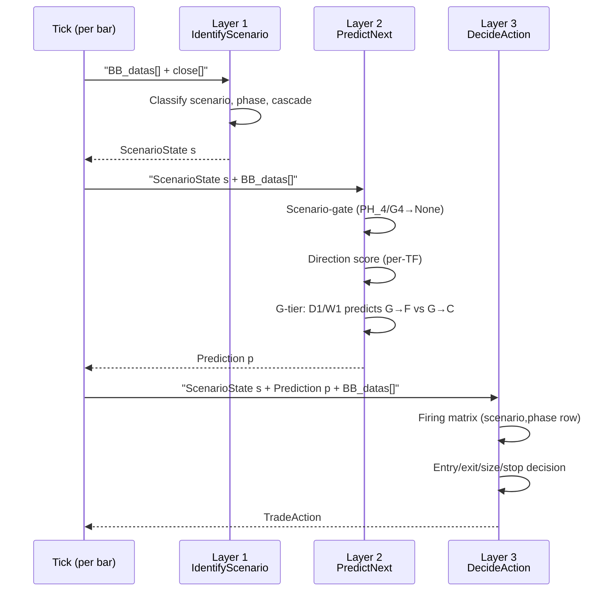

**Key difference from TofyTrade4:** In TofyTrade4, PredictNextTrend returned a TrendPrediction that was drawn on chart but NOT consumed by the entry/exit logic — the firing matrix operated independently. In TofyTrade5, Prediction flows into DecideAction: direction determines entry side, confidence determines size, target_tf determines exit boundary, reversal determines whether the signal is an exit or entry.

#### Detailed Internal Sequence — PredictNext sub-function calls

This diagram breaks PredictNext into its internal sub-function calls, showing data flow between steps. Each sub-function is a stub (TBD-GATE-3) — no rule values.

**Data consumption notes:**
- `ScenarioGate` consumes only `ScenarioState` fields: `scenario`, `phase`, `b2_pink`
- `DirectionScore` consumes only raw `BB_datas[]` — reads per-TF `BBW_stage`, `BB_diffMid_Trend` (current + prior bar via `LA`/`LA_1`)
- `GTierResolve` consumes both: `ScenarioState.pivot_substate` + raw `BB_datas[]` for D1/W1 bias
- `Assemble` consumes `ScenarioState` fields: `scenario`, `phase`, `container_tf` + score from DirectionScore + reversal from GTierResolve

**Store-vs-recompute note:** MQL5 reads `BBW_stage[LA_1]` and `BB_diffMid_Trend[LA_1]` (prior-bar state) directly from the `BB_datas[]` struct. Python harness recomputes these from consecutive log snapshots. Must match bar-for-bar (per `validation_status.md` Phase 4 item).

### 4.3 Activity Diagram — internal flow

Flow only — no weights, thresholds, or formulas. All values TBD — GATE 3.

```mermaid
flowchart TD
    Start["Start: ScenarioState s + BB_datas[]"] --> Init["Initialize Prediction defaults<br/>direction=0, confidence=0, target_tf=-1"]

    Init --> Gate["Scenario-gate<br/>PH_4 or G4 or E2 → confidence=0, direction=0"]

    Gate --> HTFEnv["HTF bias envelope [DESIGN — Phase 3]<br/>H4/D1/W1 set directional constraint<br/>HTF alignment → high confidence<br/>HTF divergence → low confidence<br/>Weight: HTF > M30 > H1"]

    HTFEnv --> Score["Direction scoring per-TF<br/>For each TF M15..W1:<br/>  TF_DirectionScore(stage, mid, prev_stage, prev_mid)<br/>  diffBBW damping<br/>  Weight by TF hierarchy"]

    Score --> Aggregate["Aggregate scores<br/>LTF + MTF + HTF totals → direction<br/>Magnitude → confidence"]

    Aggregate --> GTier{"G-tier?<br/>pivot_substate > 0"}
    GTier -->|yes| GPredict["D1/W1 bias predicts G→F vs G→C<br/>D1 same direction as H4 → F (continuation)<br/>D1 opposite → C (reversal)<br/>Set reversal flag if D1 opposes H4<br/>OOS-UNVALIDATED — 0 reversal episodes"]
    GTier -->|no| Target["Target TF (Rule 2)<br/>container_tf if > 0 else scenario fallback<br/>REQ-P4-TARGET [DESIGN — Phase 3]"]

    GPredict --> Target

    Target --> EarlySig["REQ-P4-EARLYSIGNAL [HYPOTHESIS — TBD]<br/>Early reversal signal?<br/>HTF divergence + target reached?<br/>Signal unestablished — see §4.3a"]

    EarlySig --> RevPred["REQ-P4-REVERSAL [DESIGN — Phase 3]<br/>Predict reversal at target?<br/>Arms Part 5 reversal entry"]

    RevPred --> Timeline["Timeline estimate (Rule 3)<br/>Phase → coarse bar estimate TBD-GATE-3<br/>diffBBW as accelerator/decelerator TBD-GATE-3"]

    Timeline --> NextSc["Next scenario (Rule 4)<br/>Scenario → principal edge TBD-GATE-3"]

    NextSc --> Assemble["Assemble Prediction struct"]
    Assemble --> Return([Return Prediction])
```

**TBD — GATE 3 markers:**
- Direction scoring weights per TF (LTF/MTF/HTF hierarchy weights)
- diffBBW damping thresholds (current values -0.5, 1.0 are WRONG with absolute formula — see integration note 6 in TofyTrade5.mqh)
- Confidence thresholds (magnitude → confidence mapping)
- Timeline bar estimates per phase
- Next-scenario edge transitions
- G→F vs G→C discrimination thresholds

### 4.3a HTF-as-Constraint and Divergence as EARLYSIGNAL Candidate

**HTF-as-constraint principle [DESIGN — Phase 3, weights TBD]:** HTF (H4/D1/W1) sets the bias ENVELOPE for MTF predictions. MTF predictions aligning with HTF = high confidence; fighting HTF = low confidence. HTF constrains what's plausible — it doesn't pick the exact move. This is the missing DirectionScore weight hierarchy: HTF weighted heavier than M30, M30 heavier than H1. The weight values are TBD — GATE 3.

**HTF divergence as EARLYSIGNAL candidate [HYPOTHESIS — noisy alone, validate with target combination]:** At April-1 circle 2, H4 flew up (+19 diffBBW) but D1 flew down (522) — an H4-up/D1-down DIVERGENCE. This divergence is a candidate for what Part 4 keys on to predict reversal early (REQ-P4-EARLYSIGNAL, §4.4a). **Known noise: this divergence exists on many days without reversal — divergence ALONE is too noisy.** May need combining with the target-reached condition: divergence AND price at D1-mid → reversal risk. Validate this combination before treating it as a confirmed predictor. Cross-reference: REQ-P4-EARLYSIGNAL (§4.4a).

### 4.4 Consumption note — link forward to Part 5

Prediction is the structured input Part 5 receives. How each field is consumed:

| Prediction field | How Part 5 uses it |
|---|---|
| `direction` | Entry side — 1=BUY, 2=SELL, 0=NEUTRAL (no entry) |
| `confidence` | Size multiplier — confidence → size mapping (Rule 5) |
| `target_tf` | Exit target — which TF band boundary triggers X1 |
| `timeline_bars` | Hold-duration sanity — if price hasn't moved in N bars, re-evaluate |
| `next_scenario` | Scenario-transition gating — if L1 transitions to next_scenario, re-evaluate position |
| `reversal` | Exit-not-entry signal — if reversal=True, the firing matrix prioritizes exit conditions over entry |

**Existing code status:** The MQL5 PredictNext stub (lines 590-648 of TofyTrade5.mqh) is functional but suppressed — `ShowPredLabels=false` and Prediction fields are not wired into DecideAction. The Python harness has no PredictNext equivalent. Both are Phase 3 work.

**Staleness report:**
- `TF_DirectionScore` — salvaged verbatim from TofyTrade4. Core scoring logic (stage→stg, mid→mid_b, transition→stg_t, mid_transition→mid_t) is intact. **NOT stale** — the scoring formula is unchanged from TofyTrade4.
- `PredictNext` — uses TF_DirectionScore + diffBBW damping + scenario-gating. **PARTIALLY STALE**: diffBBW damping thresholds (-0.5, 1.0) are WRONG with the absolute formula (flagged in integration note 6, line 1132). Confidence thresholds and next-scenario edges are hardcoded from doc rules but unvalidated — no GATE 3 run.
- TofyTrade4 `PredictNextTrend` — **STALE**: drawn-and-discarded, output not consumed by firing matrix. TofyTrade5 PredictNext fixes this by flowing Prediction into DecideAction.

### 4.4a Part 4 Requirements — Reversal Prediction with Target (Phase 3 build)

The §5.2 UC3 use case (April 1 sell entry) reveals three requirements that Part 4 must satisfy to arm Part 5's reversal entry. These sit alongside the existing stubbed sub-functions (DirectionScore, NextScenario, GTierResolve) — same Phase 3 scope, same TBD-GATE-3 status.

**REQ-P4-TARGET:** Part 4 computes a TARGET for the current trend — where the trend is heading and where directional bias weakens (e.g., D1 BBmid for an up-fly). The target is the boundary Part 5 watches to know "is the trend reaching its limit?" [DESIGN — Phase 3 build; the target source (D1 BBmid) is the design intent. DirectionScore/NextScenario stubs must produce this.]

**REQ-P4-REVERSAL:** Part 4 predicts a REVERSAL when conditions indicate the trend will turn (e.g., "reversal likely as price reaches the D1-mid target"). This prediction is what ARMS Part 5's reversal entry — without it, Part 5 has no arming signal and must wait for M30 (late) or fire on M15 alone (noisy). [DESIGN — Phase 3 build. NextScenario/GTierResolve stubs must produce this.]

**REQ-P4-EARLYSIGNAL:** The signal Part 4 keys on to predict the reversal EARLY — before M15 confirms 521+diffMid=2 and while H4 may still be flying. At April-1 circle 2, H4 was flying up (+19 diffBBW) — what Part 4 could have keyed on there to predict reversal is UNRESOLVED. Candidates to validate:
- price approaching/reaching the D1-mid target
- D1-down divergence (D1 bearish while H4 up)
- HTF bias rolling over
We have NOT established which (if any) lets Part 4 predict the reversal early. Part 4's reliability AS the M30-replacement depends on this being solved. [HYPOTHESIS — signal TBD/UNVERIFIED. The key open question UC3's arming depends on.]

**How Part 5 consumes it (cross-reference §5.2 UC3):**
Part 5 reversal entry = Part 4's REVERSAL prediction (REQ-P4-REVERSAL, arming) + M15 521+diffMid=2 (firing) + price at target (REQ-P4-TARGET). Part 5 does NOT wait for M30 — Part 4's prediction replaces M30 as the "is it real" filter. This is WHY Part 4's target+prediction is critical — without it, Part 5 can only wait for M30 (late) or fire on M15 alone (noisy). See §5.2 UC3 for the full arming/firing walk-through.

**Validation flags:**
- REQ-P4-TARGET, REQ-P4-REVERSAL: DESIGN, Phase 3 build (Part 4 stubbed — DirectionScore/NextScenario/GTierResolve TBD-GATE-3)
- REQ-P4-EARLYSIGNAL: HYPOTHESIS, signal TBD/UNVERIFIED — the key open question. Part 4's reliability as the M30-replacement depends on this being solved.
- Part 4's reversal prediction does NOT work yet — it is unbuilt AND the early signal is unestablished.

---

## Part 5 — Layer 3: DecideAction (DESIGN — built Phase 4)

Consumes ScenarioState (Part 3) + Prediction (Part 4) + raw BB_datas → outputs a TradeAction (entry/exit/size/stop). This is where trades actually fire — the layer GATE 4 tests against the March 2026 benchmark. Core principle: **NOTHING FIRES UNLESS ARMED** — opposite of TofyTrade4's fire-unless-blocked model. For entry/exit/block/size/stop rule MEANINGS see `backtest_chart_analysis.md` Part 5; this section designs the layer structure, not rule values.

### 5.0 Link from Layers 1 & 2 — what Part 5 consumes

**Table A — ScenarioState (Part 3) consumption:**

| ScenarioState field (from Part 3 §3.1) | How DecideAction uses it |
|---|---|
| `scenario` | Firing-matrix ROW key — selects which row of the matrix arms triggers |
| `phase` | Firing-matrix ROW key (combined with scenario); gates entry path (E3 in zigzag vs E1/E2 in trend) |
| `b1_block` | Entry gating — M15 sideways block (M15 mid ≥ 3 → no flip-entries) |
| `b2_pink` | X4-PINK exit trigger — M15+M30 both SQZ → forced exit all |
| `priceloc` | E3 boundary entry (at container band), VETO-at-target (no entry at target), X1 (price at target_tf band) |
| `container_tf` | Exit target boundary — which TF band triggers X1 |
| `container_dir` | E3 counter-trend sizing (3B-INTO: counter side 0.25× max) |
| `container_diffbbw` | X2 qualification — container cracking (diffBBW ≤ 0 → qualified exit) |
| `cas_shrinkTF` | Decoder size — compression depth → size multiplier |
| `cas_sqzCount` | Decoder size — B4 block (≥3 → no entries), combined with cas_shrinkTF |
| `pivot_substate` | G-tier routing — 1=PIVOT-PENDING (arm cautiously, exit-only on reversal), 2=G-REVERSAL (reversal_flag → EXIT branch) |
| `info` | Not used — logging field from Part 3 |

**Table B — Prediction (Part 4) consumption:**

| Prediction field (from Part 4 §4.1) | How DecideAction uses it |
|---|---|
| `direction` | Entry side — 1=BUY, 2=SELL, 0=NEUTRAL (no entry); flip-entries require dir==p.direction |
| `confidence` | Size multiplier — confidence → size mapping (ConfSize, Rule 5) |
| `target_tf` | Exit target — which TF band boundary triggers X1 |
| `reversal` | EXIT-not-entry routing — reversal=True → counter-H4 M15 signal closes longs, doesn't open counter-shorts |
| `timeline_bars` | Hold-duration sanity — if price hasn't moved in N bars, re-evaluate |
| `next_scenario` | Re-evaluate on transition — if L1 transitions to next_scenario, re-evaluate position |

**Impact — how the two upstream layers constrain Part 5:**

1. **Nothing fires unless armed.** Both ScenarioState (scenario+phase row) AND Prediction (direction+confidence) must arm the trigger. An M15 flip with ceiling=0 (E1/E2/E4) → WAIT. A prediction with direction=0 → no entry. This is the inversion of TofyTrade4 (which fired unless a gate blocked).
2. **Counter-H4 reversal routing.** A counter-H4 M15 trigger + reversal=True → EXIT route (close existing longs), NOT a new entry (don't open counter-shorts). This branch is explicit in the activity diagram.
3. **OOS-UNVALIDATED propagation.** G→C transition is OOS-UNVALIDATED (Part 3) and G-reversal prediction is OOS-UNVALIDATED (Part 4). Any Part 5 action depending on G-reversal resolution inherits the flag — pivot_substate=2 → exit-only, arm cautiously.
4. **Store-vs-recompute.** b1_block, b2_pink come from ScenarioState (MQL5 stores these on the struct). Python harness recomputes from raw BB data — must match bar-for-bar (per CLAUDE.md and validation_status.md Phase 4 verification item).
5. **Fields consumed but not by Part 5.** Part 3's info field is logging-only; Part 4's timeline_bars and next_scenario are advisory (re-evaluate triggers, not firing conditions).

**DESIGN NOTE — two data freshnesses in the trade decision (design-firm):**

- **ARMING (scenario context):** Part 5 reads the pre-computed ScenarioState from the LAST M15 CLOSE. Stale by up to one M15 bar — acceptable because H4/D1/W1 context and scenario don't transition on M5 ticks (BB bands need sustained movement, not a single tick).
- **FIRING (M15 trigger):** Part 5 reads RAW BB data FRESH from the current bar for the M15 flip detection. This is the actual trigger.

So: scenario ARMS (stale-but-stable), M15 flip FIRES (fresh). The decision = "if armed by last-M15-close scenario AND M15 flip fires fresh this bar → act."

**Justification:** Scenario can't flip mid-M15-bar (BB indicator mechanics — bands transition on accumulated movement, not one M5 tick), so the M15-close scenario is valid through the next M15 bar. This is the same mechanical principle as the bottom-up cascade (higher-TF bands need accumulated lower-TF movement).

**Part 3 cadence:** Per M15 close (design intent — stable, avoids M5 churn). **CODE GAP:** Trade_Strategy currently gates per-M5 (line 952, `iTime(PERIOD_M5)`); changing to per-M15 is a pending fix, not yet applied.

### 5.0a Part 4 → Part 5 Link (visual)

Three diagrams showing how Layer 2 connects to and constrains Layer 3 — the handoff made visible. Prediction (Part 4) is designed but not yet GATE-3-validated; these diagrams consume its designed interface. Part 5 code skeleton waits until Part 4 is built + GATE-3-validated.

#### Diagram 1 — Cross-Layer Data-Flow (field → stage wiring)

Which Prediction and ScenarioState fields wire to which DecideAction stage. Two input structs, one output.

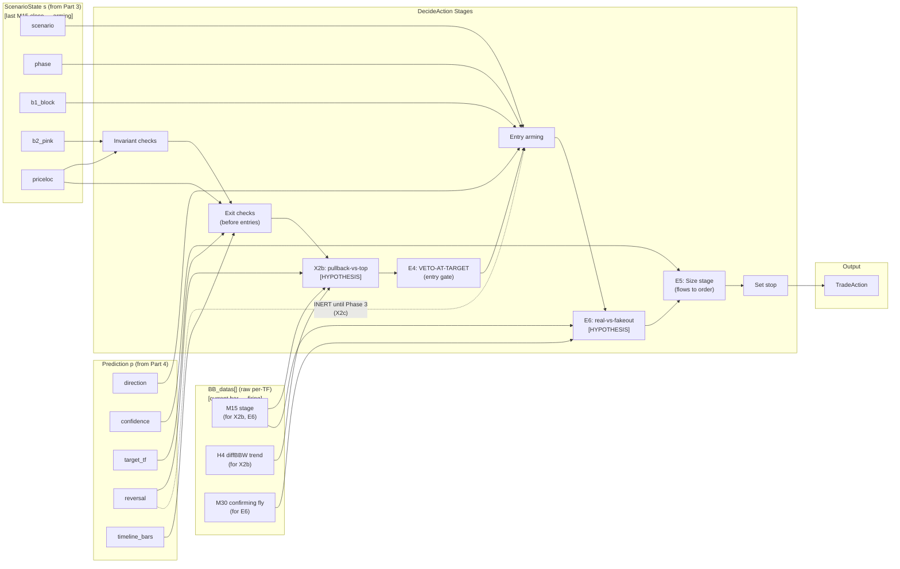

*Review criterion: I can trace any Prediction or ScenarioState field to the exact DecideAction stage that consumes it.*

#### Diagram 2 — Impact / Constraint (how Part 4 shapes Part 5)

Four ways Layer 2's Prediction constrains Layer 3 — reversal routing, confidence as one of three size inputs, OOS propagation, and the armed-only AND gate.

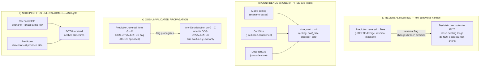

*Review criterion: I see WHY Part 5 is shaped the way it is — the reversal branch it must handle, that confidence is not the sole size driver, the OOS flag it carries, and the AND gate at its core.*

#### Diagram 3 — Detailed Cross-Layer Sequence (runtime call order)

Per-bar call sequence at the DecideAction stage level — continuing from where §4.0a ended (PredictNext returns Prediction). Function names are DESIGN-level (from §5.2 activity diagram), marked as such — not yet coded. Shows per-bar data reads for X2b, E6, E5, and X2c.

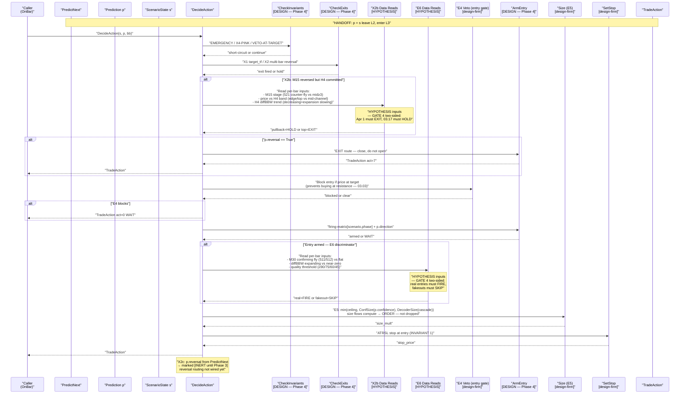

*Review criterion: I can follow one bar from DecideAction entry through invariants, exits (including X2b reads), E4 veto, arming (including E6 reads), E5 sizing (flows to order), and stop — and see where X2c is marked inert.*

### 5.1 Interface — Class Diagram

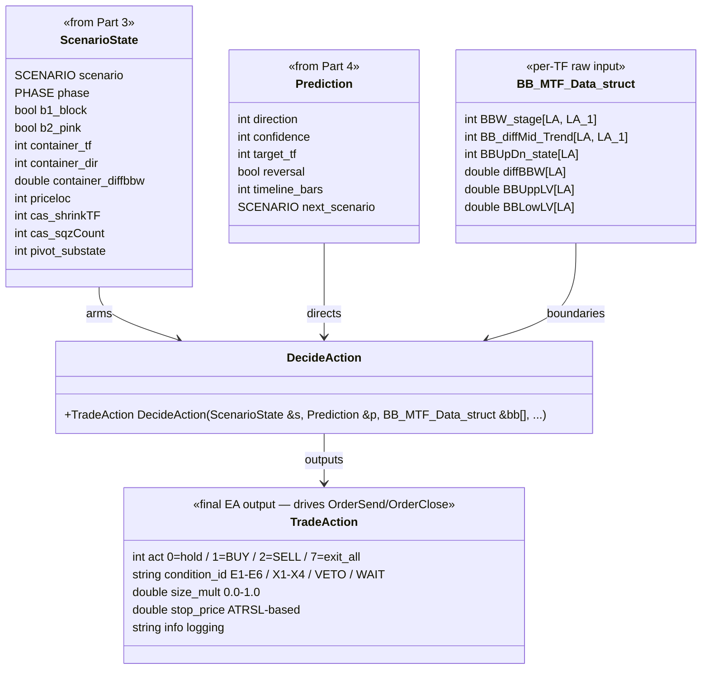

**TradeAction field meanings:**

| Field | Type | Meaning | Consumed by |
|---|---|---|---|
| `act` | int | 0=hold, 1=BUY, 2=SELL, 7=exit_all | OrderSend / OrderClose |
| `condition_id` | string | E1-E6 (entry), X1-X4 (exit), VETO, WAIT | Logging, benchmark verification |
| `size_mult` | double | 0.0–1.0, final = min(ceiling, conf_size, decoder_size) | Lot size |
| `stop_price` | double | ATRSL stop at entry | OrderSend SL |
| `info` | string | Debug string | Logging |

**Output contract:** TradeAction is the final EA output — it drives OrderSend (act=1/2), OrderClose (act=7), or holds (act=0). size_mult is the product of three independent constraints: matrix ceiling (scenario-based), confidence size (Prediction), and decoder size (cascade state). stop_price is set at entry — INVARIANT 1: no trade without a stop.

### 5.2 Activity Diagram — control-flow order

This is the evaluation order. The order IS the design. Cell values are TBD — GATE 4. The "nothing fires unless armed" principle is visible: an unarmed trigger has no path to act=1/2.

**Evaluation order: INVARIANTS → EXIT CHECKS → ENTRY ARMING → SIZE → STOP.** Exits are checked before any entry — a position that should close must close before a new one opens. (This is the April 1 lesson: the EA held +135 through a full M15 reversal because exit logic was bypassed.)

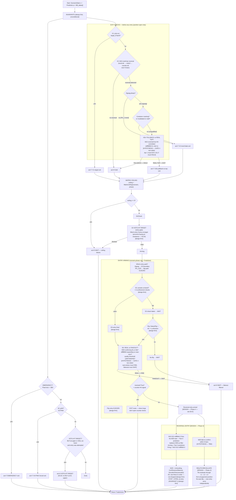

**Contract established:** The evaluation order is **INVARIANTS → EXIT CHECKS → MATRIX CEILING → E4 VETO-AT-TARGET (entry gate) → ENTRY ARMING → SIZE → STOP**. Exits fire before entries. Invariants fire unconditionally (EMERGENCY, X4-PINK, VETO). X2 detects multi-bar M15 reversal (trend-dir → mid≥3 → counter-dir over N bars); the old 1→3-only condition is **SUPERSEDED**. X2b pullback-vs-top is a HYPOTHESIS discriminator — validates at GATE 4 two-sided (April 1 must EXIT, 03.17 must HOLD). E4 VETO-AT-TARGET blocks entry when price is at target (03.03: no BUY at D1 upper). E6 real-vs-fakeout is a HYPOTHESIS discriminator — validates at GATE 4 two-sided (real entries must FIRE, fakeouts must SKIP). E5 size flows compute → order, not dropped. Stop at entry (INVARIANT 1).

**Validation flagging:**
- **design-firm** (draw as decided): X1, X2 multi-bar detection, X4-PINK, E1 arming, E2 trigger, E3 boundary, E4 VETO-AT-TARGET, E5 size, exit-before-entry order, B3 block
- **HYPOTHESIS**: X2b discriminator + inputs, E6 discriminator + inputs — both GATE 4 two-sided
- **BLOCKED**: X2c reversal routing [inert until Phase 3]

**April 1 2026 — Ticket #36: 03.03 failure mode reproduced**

EA held a +135 long through a full M15 reversal down to breakeven. H4 looked committed throughout (diffBBW>0, mid=1, fly stage 511/512) right up until the crash.

Three implementation gaps prevented the exit:
(a) X2 fade required a one-bar 1→3 flip; the reversal was gradual (1→2→3→5→2) so X2 never fired — motivates **REQ-X2a** (multi-bar M15 reversal detection).
(b) Zigzag qualification required the H4 container to crack, which didn't happen until after the crash — the pullback-vs-top tension, motivates **REQ-X2b** (pullback-vs-top HYPOTHESIS discriminator). **X2b consumes PredictNext's `next_scenario`/`reversal_flag` — the discrimination lives in Part 4, not Part 5.** Phase-order consequence: Phase 3 (PredictNext + NextScenario) must precede the Phase 4 X2b exit logic, because X2b consumes the prediction.
(c) Reversal routing inert — PredictNext stubbed until Phase 3 (**X2c**, BLOCKED).

**What worked:** B3 H4-OPPOSE correctly blocked a counter-H4 short — no wrong short was opened. The design is correct; the implementation has gaps.

This is OLD scaffold behavior — the 03.03 failure mode reproduced. DecideAction was not yet built when this chart was captured; the fix is designed in §5.2 (REQ-X2a/X2b), to be built in Phase 4, and validated at GATE 4 two-sided (April 1 must EXIT, 03.17 must HOLD). This chart documents the PROBLEM the redesign fixes, NOT correct strategy behavior.

**April 1 use cases — what the chart shows (final investigation):**

**UC1 — Circle 1: Pullback, held correctly.**
- Part 3: A2, PH_3BI (zigzag). H4 flying (512, diffBBW=22).
- Part 4: PREDICT continuation BECAUSE H4+M30 flying, M15 never compressed (diffMid_Trend stayed 1.0). TARGET D1 BBmid. CONFIDENCE high. IMPACT → hold.
- Part 5: HOLD. M15 never confirmed reversal (stayed 1.0), cascade didn't propagate → genuine pullback, correctly held.

**UC2 — Circle 2: The top, but looked like pullback at the time.**
- Part 3: A2, PH_1 (trend). H4 flying (512, diffBBW=19.5).
- Part 4: PREDICT mostly-continuation BUT FLAG risk BECAUSE H4 still flying (+19 diffBBW) + price below D1-mid target (not reached). RISK: M15 compressed deep (to 5) but RECOVERED (5→1). CONFIDENCE medium. IMPACT → hold by prediction, watch M15.
- Part 5: NO sell entry — M15 never hit 521+diffMid=2 (only reached 5 then recovered), target not reached, H4 flying (B3 blocks short). At most exit-long if X2b acted on the deep-M15 signal [HYPOTHESIS]. Correct action: HOLD (the un-clean case).

**UC3 — Sell entry: 04.02 ~04:30, M15 confirms down.**
- Part 3: M15 confirmed down (BBW_stage 521, diffMid_Trend=2). Price reached D1 mid target.
- Part 4: [PRIOR bar] PREDICTED reversal at D1-mid target — this ARMS the sell. BECAUSE price reached the predicted D1-mid target. [FLAG: what Part 4 keys on to predict this reversal EARLY is TBD — Phase 3.]
- Part 5: SELL ENTRY = Part 4's prior reversal prediction (ARMING) + M15 521+diffMid=2 (FIRING). Does NOT wait for M30 (too late) — Part 4's prediction is the filter, not M30. Self-discriminates from circle 2: M15 hit 521+diffMid=2 here, only 5-then-recovered at circle 2.

**UC4 — X2a late exit: fallback if a long was still held.**
- Part 3: M30 reverses (1→3→2 through SQZ, ~04:30-05:00).
- Part 4: reversal confirmed by M30.
- Part 5: X2a FIRES (multi-bar M30 detection) → exit any remaining long. LATE but GUARANTEED safety net.

**Key principles (from April 1 investigation):**
1. Part 4's TARGET (D1 BBmid) + reversal PREDICTION ARM Part 5's reversal entry; Part 5 fires on M15 521+diffMid=2 WITHOUT waiting for M30 (too late). The prediction replaces M30 as the filter — this is WHY Part 4's target is critical.
2. Sell entry self-discriminates: M15 521+diffMid=2 fires it; circle 2 only reached M15=5-then-recovered → no false fire there.
3. X2a (M30 multi-bar) = guaranteed-but-LATE fallback exit.
4. NO auto-flip: entries arm independently (Part4 prediction + M15 confirm + target + VETO clear).

**Validation flags — April 1 use cases:**
- **Part 4 (target + reversal prediction): STUBBED — Phase 3 build.** UC3's arming depends on Part 4 predicting the D1-mid target and reversal; this is unbuilt.
- **Part 4's early-prediction signal (what it keys on at circle 2 to predict reversal before M15 fires while H4 still flying): TBD / UNVERIFIED.**
- **M15 521+diffMid=2 as fire condition:** Candidate, validate across dataset (false-fire in pullbacks?).
- **X2a multi-bar:** Design, supersedes 1→3-only, Phase 3.
- **X2b early exit (M15 deep compression):** HYPOTHESIS, validate across dataset.
- **DO NOT reintroduce:** Scenario D (circle 1 = A2/PH_3BI, not D-tier), HTF-intact discriminator (falsified — H4 flying at both circles), "un-catchable" (superseded — M15-confirm + Part4-prediction distinguish circle 1 from circle 2).

### 5.2a M15 Trigger State Machine — sub-state transitions

This diagram defines the M15 sub-states precisely so "gradual reversal" and "with-H4 entry" aren't hand-waved. The same state machine drives both the entry trigger (with-H4 flip) and the exit trigger (gradual against-H4 reversal) as traversals through states.

**States:**
- **UP** (mid=1, trend direction): M15 aligned with current trend
- **FADING** (mid≥3, sideways): M15 losing conviction — transitional, NOT yet exit
- **COUNTER** (mid=2 or 521 counter-fly): M15 has committed to opposite direction

**Transitions define both triggers:**
- **WITH-H4 entry (REQ-E2, design-firm):** FLAT/FADING → UP in H4 direction = ENTRY trigger. The M15 flip to H4 direction fires entry.
- **AGAINST-H4 exit (REQ-X2a, design-firm):** UP → FADING → COUNTER over N bars = EXIT trigger. Fires at COUNTER state, NOT at first FADING bar (the 1→3-only condition is SUPERSEDED).

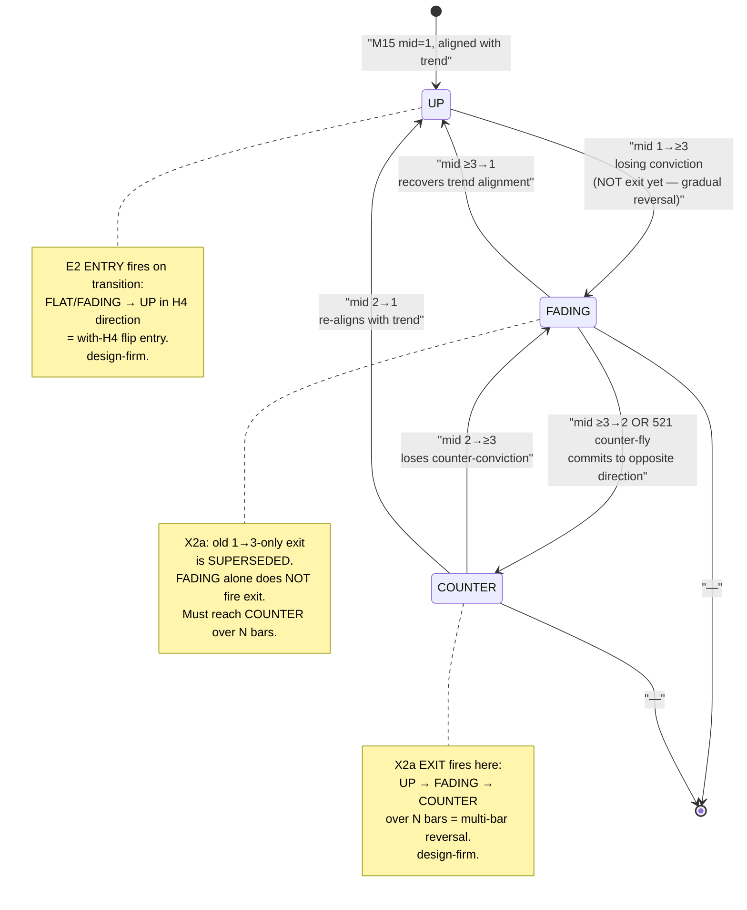

**Key design decisions visible:**
1. **Gradual reversal (X2a):** UP→FADING→COUNTER over N bars. Exit fires at COUNTER, not FADING. This is the fix for the old 1→3-only condition — a M15 wobble to mid=3 doesn't exit, only a committed counter-direction does.
2. **With-H4 entry (E2):** FLAT/FADING→UP in H4 direction. The M15 flip aligns with H4 — entry fires.
3. **Same machine, two traversals:** Entry and exit share the same state machine but traverse different paths. Entry = FADING→UP (with H4). Exit = UP→FADING→COUNTER (against H4).

**Validation flagging:** State transitions (UP⇄FADING⇄COUNTER) and triggers (E2 entry, X2a exit) are **design-firm**. The X2b discriminator at the COUNTER state (pullback vs top) is **HYPOTHESIS** — designed in §5.2 activity diagram.

### 5.3 Firing Matrix — Structure (the shape, not the cells)

The matrix defines which triggers are armed per (scenario, phase) row. Cell VALUES are TBD — GATE 4. This section designs the table structure.

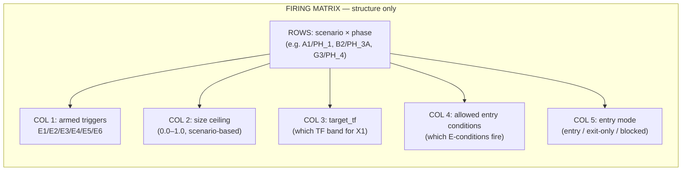

**Structure rules (design-time, not GATE-4-validated):**
- Each row is a unique (scenario, phase) combination
- Ceiling = 0.0 → exit-only or blocked (no entries possible)
- Ceiling > 0.0 → entries possible if triggers armed
- PH_4 rows → exit-only (X4-PINK or WAIT, no entries)
- PH_5 rows → E5/E6 only (expansion entries)
- G-tier rows (G1-G4) → arm cautiously; pivot_substate=2 → exit-only
- C-tier rows → OOS-UNVALIDATED — cells TBD — no OOS episodes to validate
- E4 VETO-AT-TARGET blocks entry per row when price at target (03.03: no BUY at D1 upper)
- E6 real-vs-fakeout discriminator filters armed entries [HYPOTHESIS — GATE 4 two-sided]
- X2b pullback-vs-top discriminator in exit path [HYPOTHESIS — GATE 4 two-sided: Apr 1/03.17]
- Cell values (which specific triggers fire per row) = TBD — GATE 4

**Existing code status:** The MQL5 DecideAction (lines 731-828 of TofyTrade5.mqh) is implemented with the control flow matching the activity diagram: invariants (b2_pink, VETO), exits (X1, X2 qualified), ceiling check, E3 in zigzag, flip-path E1/E2/E5. The replay_harness.py `decide_action()` mirrors this (lines 706-847). Matrix ceiling values are hardcoded from backtest_chart_analysis.md Part 5 — not yet GATE-4-validated.

**Staleness report:**
- TofyTrade5 DecideAction — **CURRENT**: implements the three-layer design with firing matrix. Condition IDs (E1-E6, X1-X4, VETO, WAIT) match the v31 signal taxonomy. No old G0b/G4x gate names in control flow — those are in the gate decoder table only (for log parsing).
- TofyTrade4 gate-based model — **STALE**: fire-unless-blocked model replaced by nothing-fires-unless-armed. Old gate names (G0b-TOUCH → E3, G8-BNDTGT → X1, G5-FADE → X2, G0b-PINK → X4) documented in gate decoder table.
- Matrix ceiling values — **UNVALIDATED**: hardcoded from doc rules, no GATE 4 run against benchmark.

### 5.4 GATE 4 — what validates this layer

GATE 4 is the firing benchmark. Part 5 must produce results matching the March 2026 benchmark (`references/fixtures/march2026_benchmark.md`):

1. **≥ 6 leg-capture entries** — matching the 8 verified arrow legs (03.03 SELL crash, 03.04 BUY, 03.04 SELL, 03.05 BUY, 03.05 SELL, 03.06 BUY, 03.10 BUY, 03.17 SELL run)
2. **03.03 07:45 → VETO-AT-TARGET** — not BUY (price at D1 upper band — the -191.29 nine-day hold must be impossible)
3. **No exit within 3 bars on mid=3 wobble** — 03.17-03.19 SELL run held through M15 wobble (X2 qualified only)
4. **Zero positions held > 3 days** — stop at entry (INVARIANT 1) + emergency $50 exit
5. **Counter-H4 M15 sell = EXIT not new short** — reversal routing (reversal=True → exit branch)

**HYPOTHESIS discriminators — two-sided GATE 4 tests:**
- **X2b pullback-vs-top:** April 1 (must EXIT — +135 held through reversal) AND 03.17 (must HOLD — don't churn the winner). Both outcomes must be correct simultaneously.
- **E6 real-vs-fakeout:** Real March/April entries (must FIRE) AND fakeout bars (must SKIP). Both outcomes must be correct simultaneously.

Both discriminators are **BLOCKED from being marked design-firm** until these two-sided tests pass at GATE 4.

The replay harness `simulate_trades()` + `score_benchmark()` (replay_harness.py lines 851-1117) runs this validation.

### 5.5 REQ-P5-REEVALUATE — Recovery when Part 4's Prediction Disconfirms (Phase 4 build)

Firing early on Part 4's reversal prediction (REQ-P4-REVERSAL) is acceptable ONLY because REQ-P4-EARLYSIGNAL is unproven — the early signal is HYPOTHESIS/TBD. Therefore Part 5 needs a safety net: when new information diverges from Part 4's prediction (e.g., M30 fails to confirm a predicted reversal within N bars), the system RE-EVALUATES through all three layers rather than hardcoding a special-case response.

**REQ-P5-REEVALUATE:** When new data diverges from Part 4's prediction, Part 5 re-evaluates fresh:
→ Part 3 reclassifies with the new data
→ Part 4 re-predicts (the disconfirmed reversal updates)
→ Part 5 re-decides entry/exit/hold FRESH on the updated scenario+prediction
→ An open position no longer supported by the re-evaluated layers is EXITED — derived from normal evaluation, not a special "cancel" rule
→ Any new entry (opposite, same, or none) arms INDEPENDENTLY — NO auto-flip ("short was wrong" ≠ "long is right")

This avoids a pile of hardcoded special-case handlers. "M30 didn't confirm" is just new input flowing through normal layer evaluation. This is the safety net for REQ-P4-EARLYSIGNAL being unproven — if the early signal fires a false positive, re-evaluation backs it out.

**Validation flags:**
- REQ-P5-REEVALUATE: DESIGN, Phase 4 build
- N-bar disconfirm window: HYPOTHESIS (TBD — the threshold for "how long before a disconfirmed prediction triggers re-evaluation" is unestablished)
- Exit-unsupported-position + no-auto-flip: design-firm (consistent with existing no-auto-flip rule, §5.2 key principle 4)
- Cross-reference: REQ-P4-EARLYSIGNAL — this is its safety net

**GATE 4 implication:** This requirement is validated at GATE 4 by confirming that false-positive early entries (where Part 4 predicted reversal but the cascade didn't propagate) are exited by re-evaluation — not by a hardcoded rule. The exit must be DERIVED from the three-layer re-evaluation.

---
