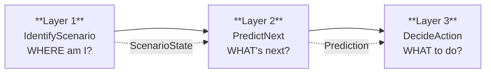
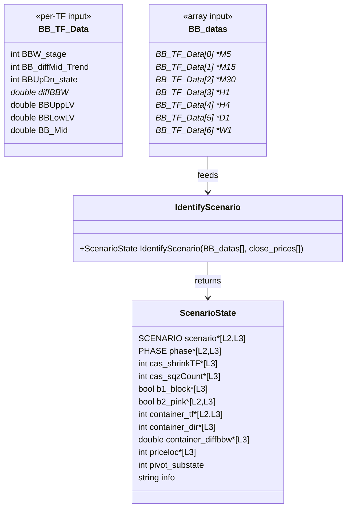
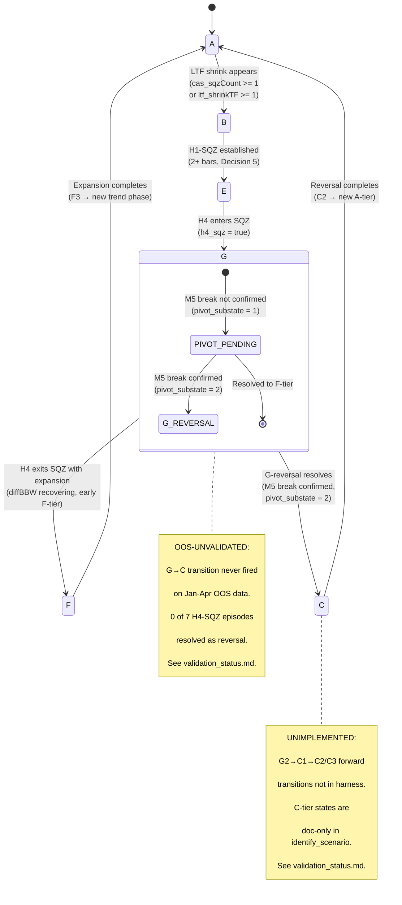
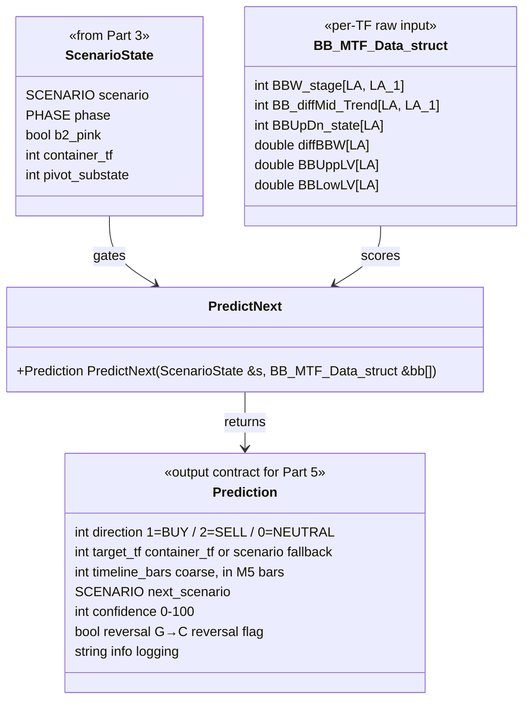
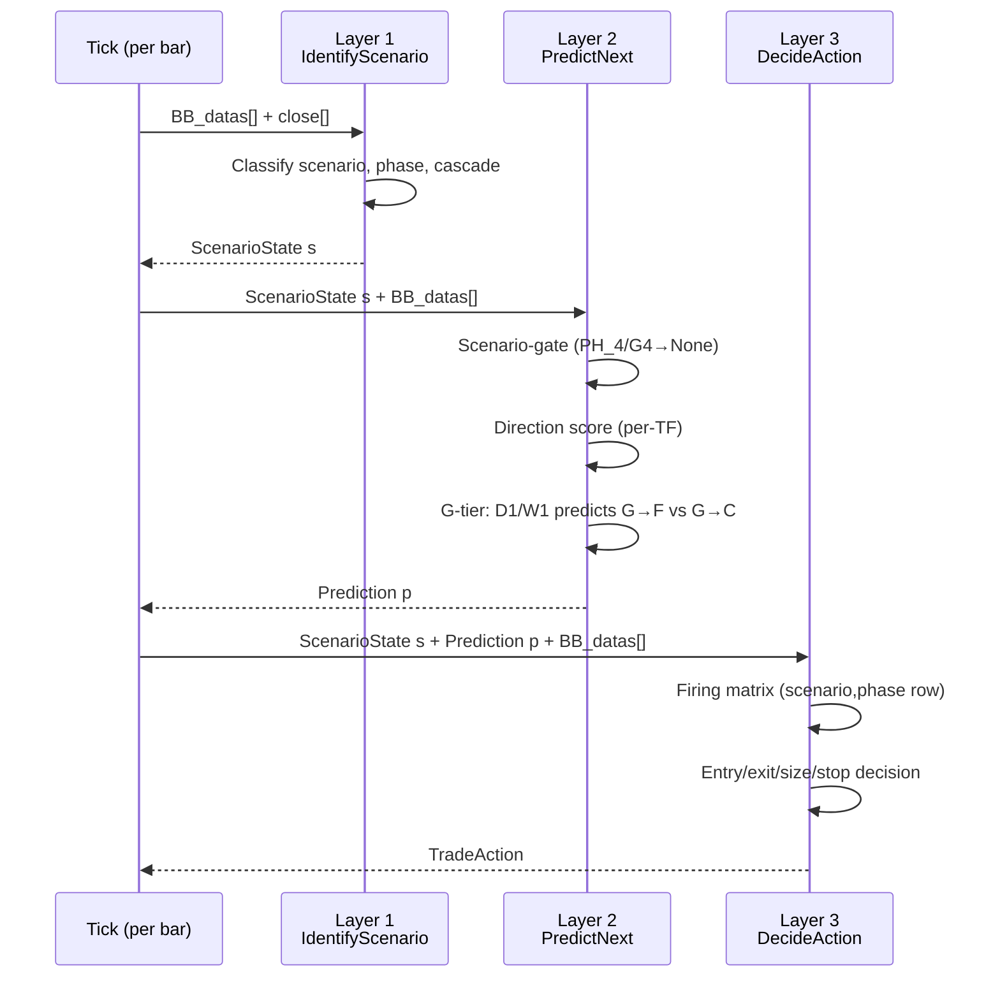

# Architecture — TofyTrade5 Three-Layer System

System design and UML for TofyTrade5's three-layer architecture. For scenario/rule MEANINGS see `backtest_chart_analysis.md`; for the validation record see `references/fixtures/validation_status.md`.

## Three-Layer Overview



- **Layer 1 — IdentifyScenario**: Given current BB state across all TFs, classify the market into a scenario + phase. **Built & validated** against March 2026 in-sample + Jan-Apr OOS data.
- **Layer 2 — PredictNext**: Given ScenarioState, score direction, confidence, target TF, timeline, and next scenario. Built but diffBBW damping thresholds need correction (see integration note 6 in `.mqh`).
- **Layer 3 — DecideAction**: Given ScenarioState + Prediction, select entry/exit condition from firing matrix. Built and enforced.

## TF Roles (cross-cut all layers)

These responsibilities are invariant across all three layers — they define what each TF contributes to the system.

| TF | Role | Layers that consume |
|----|------|---------------------|
| W1 | Macro bias — highest container candidate, sets directional a priori | L1 (container), L2 (direction score), L3 (X2 container-crack) |
| D1 | Macro bias — alignment check for A1, G-tier sub-state discriminator | L1 (A1/G1-G2), L2 (direction score), L3 (VETO via veto_priceloc in .py) |
| H4 | Trend / context — primary classifier (fly/shrink/sqz), phase driver | L1 (CHECK-HTF, phase), L2 (direction score), L3 (E3 chk1, X2) |
| M30 | Primary trend DRIVER — the leg ridden, E3 confinement check | L1 (compression routing), L2 (direction score), L3 (E3 chk4, X2) |
| M15 | Entry TRIGGER — flip detection, B-tier depth | L1 (B-tier, E-tier, flip detection), L2 (direction score), L3 (X2 fade) |
| M5 | Noise / unused for entry — SQZ count contributor only | L1 (cas_sqzCount, E3 chk3), L2 (not scored — index 0 excluded) |

---

## Part 3 — Layer 1: IdentifyScenario (BUILT & VALIDATED)

### 3.1 Interface — Class/Struct Diagram

This diagram shows the actual data structures: what IdentifyScenario reads (input per-TF BB data) and what it returns (ScenarioState). Fields marked with `[L2]` / `[L3]` indicate the output contract consumed by downstream layers.



**Field meanings (ScenarioState):**

| Field | Type | Meaning | Consumed by |
|-------|------|---------|-------------|
| `scenario` | SCENARIO | Identified scenario (A1..C3) | L2, L3 |
| `phase` | PHASE | Phase classification (PH_1..PH_6) | L2, L3 |
| `cas_shrinkTF` | int | Highest TF in shrink (1=M15..5=D1, -1=none), per §12d | L3 |
| `cas_sqzCount` | int | Count of M5..H1 TFs in SQZ (400-499), per §12d | L3 |
| `b1_block` | bool | M15 diffMid >= 3 (blocks flip-entries) | L3 (read from struct by DecideAction line 809; Python harness recomputes from raw BB data — no ScenarioState struct) |
| `b2_pink` | bool | M15 AND M30 both BBW 400-499 (forces flat) | L3 (read from struct by X4 invariant line 1040 + ASSERT line 784; L2 uses `scenario==E2` as proxy, not b2_pink directly; Python harness recomputes) |
| `container_tf` | int | Highest TF with committed fly, -1 if none | L2, L3 |
| `container_dir` | int | Container's diffMid (1=UP, 2=DN, 0=none) | L3 |
| `container_diffbbw` | double | Container health: >0 room, <=0 aging | L3 |
| `priceloc` | int | Price vs container bands: -2..+2 | L3 |
| `pivot_substate` | int | G-tier: 0=N/A, 1=PIVOT-PENDING, 2=G-REVERSAL | display only |
| `info` | string | Human-readable reason string | logging |

> **Note:** `dbbwH4` is NOT a ScenarioState field — it is computed internally and pushed to ring buffers (`g_dbbw_ring`, `s_dbbwH4_hist`) used by `ClassifyPhase()` and early F-tier detection. The value is available to callers via `ADiffBBW(bb, 4)` but is not part of the output contract.

**MQL5 vs Python consumption:** MQL5 L3 reads `b1_block`, `b2_pink`, and `cas_sqzCount` directly from the ScenarioState struct. The Python harness has no ScenarioState struct — it recomputes these from raw BB data in the simulation loop. This is a harness architecture difference, not a behavioral one, except for `veto_priceloc` (Python adds D1 as veto source — see known divergence in `validation_status.md`).

**Output contract summary:**
- Layer 2 consumes: `scenario`, `phase`, `container_tf`, `container_dir`, `b2_pink`
- Layer 3 consumes: all fields except `pivot_substate` (display-only) and `info` (logging)

### 3.2 Control Flow — Activity Diagram

This flowchart shows the **as-built** evaluation order of `IdentifyScenario`, matching the validated Decisions 1-6. Note: the early F-tier check fires **before** G-tier (Step 3 in code), not after compression routing — this is the Cluster 1 fix that prevents misclassifying H4-exiting-compression as G when it should be F.

```mermaid
flowchart TD
    Start([Start: BB_datas[0..6] + close_prices]) --> Init["Initialize ScenarioState defaults<br/>scenario=SC_NONE phase=PH_NONE"]

    Init --> Cascade["§12d: Compute cascade decoders<br/>cas_shrinkTF = highest shrink TF M15..D1<br/>cas_sqzCount = SQZ count M5..H1"]

    Cascade --> Derived["Compute derived states<br/>b1_block, b2_pink, ltf_shrinkTF,<br/>container_tf/dir/diffbbw, priceloc"]

    Derived --> Phase["§13: ClassifyPhase via diffBBW_H4 ring"]

    Phase --> H4Class["§12: Classify H4 state<br/>h4_fly, h4_shrink, h4_sqz<br/>+ D1 direction + D1 fly"]

    H4Class --> EarlyF{"Early F-tier?<br/>H4 exiting compression<br/>diffBBW recovering"}
    EarlyF -->|yes| FSub["Route to F1/F2/F3<br/>based on D1+M30 confirm"]
    FSub --> Return([return ScenarioState])

    EarlyF -->|no| H4Sqz{"h4_sqz?"}
    H4Sqz -->|yes| GTier["G-tier: Direction pivot<br/>G1 = M5 break same as D1<br/>G2 = M5 break opposite D1<br/>G3 = no M5 break / D1 not flying<br/>G4 = phase PH_6<br/>pivot_substate = 1 or 2"]
    GTier --> Return

    H4Sqz -->|no| H4Shrink{"h4_shrink?"}
    H4Shrink -->|yes| E4["E4 — HTF compressing"]
    E4 --> Return

    H4Shrink -->|no| ConfComp{"confirmed_compression?<br/>cas_sqzCount >= 1<br/>OR ltf_shrinkTF >= 1 + diffBBW < 30"}

    ConfComp -->|yes| D5{"Decision 5:<br/>H1-SQZ this bar<br/>AND prior-bar?"}

    D5 -->|established<br/>(2+ bars H1-SQZ)| D5Sub{"M15+M30 both SQZ?"}
    D5Sub -->|yes| E2a["E2 — H1-SQZ established,<br/>M15+M30 SQZ"]
    D5Sub -->|no| E1a["E1 — H1-SQZ established"]
    E2a --> Return
    E1a --> Return

    D5 -->|recovery<br/>(H1 exited SQZ,<br/>compression persists)| E1b["E1 — H1-SQZ recovery"]
    E1b --> Return

    D5 -->|onset<br/>(first bar H1-SQZ)| B3onset["B3 — H1-SQZ onset"]
    B3onset --> Return

    D5 -->|none of above| D2{"Decision 2:<br/>h4_fly + diffBBW > 5<br/>+ no ltf_shrink + no prev H1-SQZ<br/>+ cas_sqzCount==1"}
    D2 -->|yes| D2Sub{"D1 aligned<br/>(D1 fly + same dir as H4)?"}
    D2Sub -->|yes| A1c["A1 — transient SQZ,<br/>D1 aligned"]
    D2Sub -->|no| A2c["A2 — transient SQZ,<br/>D1 not aligned"]
    A1c --> Return
    A2c --> Return

    D2 -->|no| Ecomp{"cas_sqzCount >= 2?"}
    Ecomp -->|yes| EcompSub{"b2_pink?"}
    EcompSub -->|yes| E2b["E2 — M15+M30 both SQZ"]
    EcompSub -->|no| E1b2["E1 — LTF SQZ"]
    E2b --> Return
    E1b2 --> Return

    Ecomp -->|no| Bcomp{"ltf_shrinkTF >= 1?"}
    Bcomp -->|yes| BDecode["B-tier decoder:<br/>max(shrink_depth, sqz_depth)<br/>+ cas_sqzCount → B1/B2/B3"]
    BDecode --> Return

    Bcomp -->|no| A2safe["A2 — SQZ without LTF shrink<br/>(safety net)"]
    A2safe --> Return

    ConfComp -->|no| H4Fly{"h4_fly?"}
    H4Fly -->|yes| A1Sub{"D1 aligned<br/>(D1 fly + same dir as H4)?"}
    A1Sub -->|yes| A1a["A1 — H4+D1 fly aligned"]
    A1Sub -->|no| A2a["A2 — H4 fly, D1 not aligned"]
    A1a --> Return
    A2a --> Return

    H4Fly -->|no| Default["Default: A2 — conservative"]
    Default --> UpdatePrev["Update s_prevH1Sqz = H1 in SQZ"]
    UpdatePrev --> Return
```

**Contract established:** IdentifyScenario returns a fully populated ScenarioState. The evaluation order is: cascade decoders → phase → CHECK-HTF (h4_sqz/h4_shrink) → compression routing → h4_fly → default. This implements the Part 2 HTF-first principle: H4 state is checked before LTF compression, and D1 direction gates G-tier sub-states (G1 vs G2).

### 3.3 Scenario State Machine — State Diagram

This diagram shows the scenario lifecycle: how the system transitions between tiers as market conditions evolve. Transition conditions are derived from the code's branch logic, not assumed.



**Contract established:** The scenario machine is a left-side (A→B→E→G) then right-side (F continuation or C reversal) cycle. The G→F edge is OOS-validated (7/7 episodes). The G→C edge is structurally defined but unvalidated — both the discriminator and the C-tier state transitions are unimplemented in the harness.

### 3.4 Validation Status

| Component | Status | Detail |
|-----------|--------|--------|
| A-tier routing (A1/A2) | OOS-VALIDATED | 103/349 snapshots, D1 alignment working |
| B-tier routing (B1/B2/B3) | OOS-VALIDATED | 81/349 snapshots, depth decoder working |
| E-tier routing (E1/E2/E4) | OOS-VALIDATED | 153/349 snapshots |
| G-tier compression entry | OOS-VALIDATED | 36/36 H4-SQZ bars detected correctly |
| F continuation resolution | OOS-VALIDATED | 7/7 episodes resolved as F |
| Decision 5 (onset/established) | OOS-VALIDATED | H1-SQZ tracking consistent |
| Early F-tier detection | OOS-VALIDATED | Fires before G-tier, prevents misclassification |
| **G reversal branch (G→C)** | **HYPOTHESIS** | Never fired on OOS data — 0/7 episodes |
| **G-vs-F discriminator** | **HYPOTHESIS** | Requires reversal episodes — none in current data |
| **G2→C1→C2/C3 transitions** | **UNIMPLEMENTED** | Not in identify_scenario, doc-only |
| VETO-AT-TARGET | OOS-VALIDATED | Architecture-enforced, item 5 PASS |
| veto_priceloc (L3) | **KNOWN DIVERGENCE** | Python stricter than MQL5 — D1 veto when not container |

For the full validation record with episode detail, see [`references/fixtures/validation_status.md`](fixtures/validation_status.md).

---

## Part 4 — Layer 2: PredictNext (DESIGN — built Phase 3)

Consumes Layer 1 ScenarioState + per-TF BB data → outputs Prediction for Layer 3. D1/W1 do their heaviest work here — resolving the H4 pivot that Part 3 left pending. For prediction rule MEANINGS see `backtest_chart_analysis.md` Part 4 (Rules 1-4); this section designs the layer structure, not rule values.

### 4.0 Link from Layer 1 — what Part 4 consumes from Part 3

**ScenarioState consumption table** — every Part 3 field mapped to Part 4 use:

| ScenarioState field (from Part 3 §3.1) | How PredictNext uses it |
|---|---|
| `scenario` | Selects which prediction rule applies; scenario-gates confidence and next-scenario edges |
| `phase` | Scenario-gates confidence (PH_4 → None, PH_5 → explosive); drives timeline estimate |
| `b2_pink` | Gating — forces confidence=0 (no prediction possible, M15+M30 locked in SQZ) |
| `container_tf` | The target the prediction aims at (Rule 2: next confinement boundary) |
| `pivot_substate` | G-tier: 0=N/A, 1=PIVOT-PENDING (direction unresolved — D1/W1 bias predicts G→F vs G→C), 2=G-REVERSAL (reversal_flag=True) |
| `cas_shrinkTF` | Not used directly by Layer 2 — consumed by Layer 3 (decoder size) |
| `cas_sqzCount` | Not used directly by Layer 2 — consumed by Layer 3 (decoder size). Provides compression depth context for timeline estimate. |
| `b1_block` | Not used by Layer 2 — consumed by Layer 3 (entry gating) |
| `container_dir` | Not used directly — direction is scored from per-TF BB data (see gap below) |
| `container_diffbbw` | Not used directly — container health scored from per-TF BB data via ADiffBBW |
| `priceloc` | Not used by Layer 2 — consumed by Layer 3 (E3, VETO, X1) |
| `info` | Not used — logging field from Part 3 |

**GAP — per-TF BB data**: PredictNext needs per-TF BB data (stage, mid, diffBBW, BBUpDn) to score direction across TFs. ScenarioState does NOT expose this — it exposes `container_tf`, `container_dir`, and `container_diffbbw` for the container only. Therefore Part 4 receives **both** ScenarioState (for scenario/phase gating) **and** the raw `BB_datas[]` array (for per-TF direction scoring). This matches the MQL5 signature: `PredictNext(ScenarioState &s, BB_MTF_Data_struct &bb[])`.

**GAP — D1/W1 prior-bar state**: Direction scoring needs `stage[LA_1]` and `mid[LA_1]` (prior-bar) for transition detection (sqz→fly, fly→shrink). ScenarioState doesn't store prior-bar per-TF state. Part 4 reads this directly from `BB_datas[tf].BBW_stage[LA_1]` — the same raw array it already receives. No additional Part 3 change needed.

**Impact — how Part 3 constrains Part 4:**

1. **Can only predict from what ScenarioState exposes.** Part 4 can gate on scenario, phase, and b2_pink. Everything else (per-TF direction scoring, diffBBW damping) requires raw BB data. If a prediction needed per-TF diffBBW and Part 3 didn't pass BB_datas, that would be an unresolvable gap — but the dual-input design avoids this.
2. **G-pivot handoff.** Part 3 marks G-tier as "pivot-pending" (pivot_substate=1) and sets direction=UNKNOWN — it does NOT resolve the pivot. Part 4 INHERITS this unresolved pivot as its primary job: D1/W1 bias predicts whether G resolves as F (continuation) or C (reversal). This is the most important Part 3 → Part 4 handoff.
3. **OOS-unvalidated propagation.** Part 3 flags G→C transition as OOS-UNVALIDATED (0 of 7 OOS episodes resolved as reversal) and G2→C1→C2/C3 as UNIMPLEMENTED. Any Part 4 prediction that depends on G→C resolution inherits these flags — it is also OOS-UNVALIDATED.
4. **Fields Part 3 computes but Part 4 ignores.** cas_shrinkTF, cas_sqzCount, b1_block, priceloc are Layer 3 fields. Part 4 doesn't consume them — they flow ScenarioState → Layer 3 directly.

### 4.1 Interface — Class Diagram



**Prediction field meanings:**

| Field | Type | Meaning | Rule | Consumed by Part 5 |
|---|---|---|---|---|
| `direction` | int | Predicted direction (1=BUY, 2=SELL, 0=NEUTRAL) | Rule 1 | Entry side |
| `target_tf` | int | Which TF band is the target (0=M5..5=D1, -1=none) | Rule 2 | Exit target |
| `timeline_bars` | int | Coarse estimate in M5 bars (TBD — GATE 3) | Rule 3 | Hold-duration check |
| `next_scenario` | SCENARIO | Predicted next scenario | Rule 4 | Scenario-transition gating |
| `confidence` | int | 0-100, drives Part 5 size | Rule 5 | Size multiplier |
| `reversal` | bool | True if HTF LTF diverge (reversal imminent) | Rule 1 | Exit-not-entry signal |
| `info` | string | Debug string (score components) | logging | — |

**Output contract:** Prediction is the structured output Part 5 consumes. direction → entry side; confidence → size; target_tf → exit target TF; reversal → exit-not-entry signal.

### 4.2 Sequence Diagram — per-bar flow

This diagram makes the consumption arrow explicit: Prediction is CONSUMED by Part 5, not decorative. (TofyTrade4 PredictNextTrend was drawn-and-discarded — its output was never consumed by the firing matrix.)



**Key difference from TofyTrade4:** In TofyTrade4, PredictNextTrend returned a TrendPrediction that was drawn on chart but NOT consumed by the entry/exit logic — the firing matrix operated independently. In TofyTrade5, Prediction flows into DecideAction: direction determines entry side, confidence determines size, target_tf determines exit boundary, reversal determines whether the signal is an exit or entry.

### 4.3 Activity Diagram — internal flow

Flow only — no weights, thresholds, or formulas. All values TBD — GATE 3.

```mermaid
flowchart TD
    Start([Start: ScenarioState s + BB_datas[]]) --> Init["Initialize Prediction defaults<br/>direction=0, confidence=0, target_tf=-1"]

    Init --> Gate["Scenario-gate<br/>PH_4 or G4 or E2 → confidence=0, direction=0"]

    Gate --> Score["Direction scoring per-TF<br/>For each TF M15..W1:<br/>  TF_DirectionScore(stage, mid, prev_stage, prev_mid)<br/>  diffBBW damping<br/>  Weight by TF hierarchy"]

    Score --> Aggregate["Aggregate scores<br/>LTF + MTF + HTF totals → direction<br/>Magnitude → confidence"]

    Aggregate --> GTier{"G-tier?<br/>pivot_substate > 0"}
    GTier -->|yes| GPredict["D1/W1 bias predicts G→F vs G→C<br/>D1 same direction as H4 → F (continuation)<br/>D1 opposite → C (reversal)<br/>Set reversal flag if D1 opposes H4<br/>OOS-UNVALIDATED — 0 reversal episodes"]
    GTier -->|no| Target["Target TF (Rule 2)<br/>container_tf if > 0 else scenario fallback"]

    GPredict --> Target

    Target --> Timeline["Timeline estimate (Rule 3)<br/>Phase → coarse bar estimate TBD-GATE-3<br/>diffBBW as accelerator/decelerator TBD-GATE-3"]

    Timeline --> NextSc["Next scenario (Rule 4)<br/>Scenario → principal edge TBD-GATE-3"]

    NextSc --> Assemble["Assemble Prediction struct"]
    Assemble --> Return([Return Prediction])
```

**TBD — GATE 3 markers:**
- Direction scoring weights per TF (LTF/MTF/HTF hierarchy weights)
- diffBBW damping thresholds (current values -0.5, 1.0 are WRONG with absolute formula — see integration note 6 in TofyTrade5.mqh)
- Confidence thresholds (magnitude → confidence mapping)
- Timeline bar estimates per phase
- Next-scenario edge transitions
- G→F vs G→C discrimination thresholds

### 4.4 Consumption note — link forward to Part 5

Prediction is the structured input Part 5 receives. How each field is consumed:

| Prediction field | How Part 5 uses it |
|---|---|
| `direction` | Entry side — 1=BUY, 2=SELL, 0=NEUTRAL (no entry) |
| `confidence` | Size multiplier — confidence → size mapping (Rule 5) |
| `target_tf` | Exit target — which TF band boundary triggers X1 |
| `timeline_bars` | Hold-duration sanity — if price hasn't moved in N bars, re-evaluate |
| `next_scenario` | Scenario-transition gating — if L1 transitions to next_scenario, re-evaluate position |
| `reversal` | Exit-not-entry signal — if reversal=True, the firing matrix prioritizes exit conditions over entry |

**Existing code status:** The MQL5 PredictNext stub (lines 590-648 of TofyTrade5.mqh) is functional but suppressed — `ShowPredLabels=false` and Prediction fields are not wired into DecideAction. The Python harness has no PredictNext equivalent. Both are Phase 3 work.

**Staleness report:**
- `TF_DirectionScore` — salvaged verbatim from TofyTrade4. Core scoring logic (stage→stg, mid→mid_b, transition→stg_t, mid_transition→mid_t) is intact. **NOT stale** — the scoring formula is unchanged from TofyTrade4.
- `PredictNext` — uses TF_DirectionScore + diffBBW damping + scenario-gating. **PARTIALLY STALE**: diffBBW damping thresholds (-0.5, 1.0) are WRONG with the absolute formula (flagged in integration note 6, line 1132). Confidence thresholds and next-scenario edges are hardcoded from doc rules but unvalidated — no GATE 3 run.
- TofyTrade4 `PredictNextTrend` — **STALE**: drawn-and-discarded, output not consumed by firing matrix. TofyTrade5 PredictNext fixes this by flowing Prediction into DecideAction.

---

## Part 5 — Layer 3: DecideAction (design, TBD)
