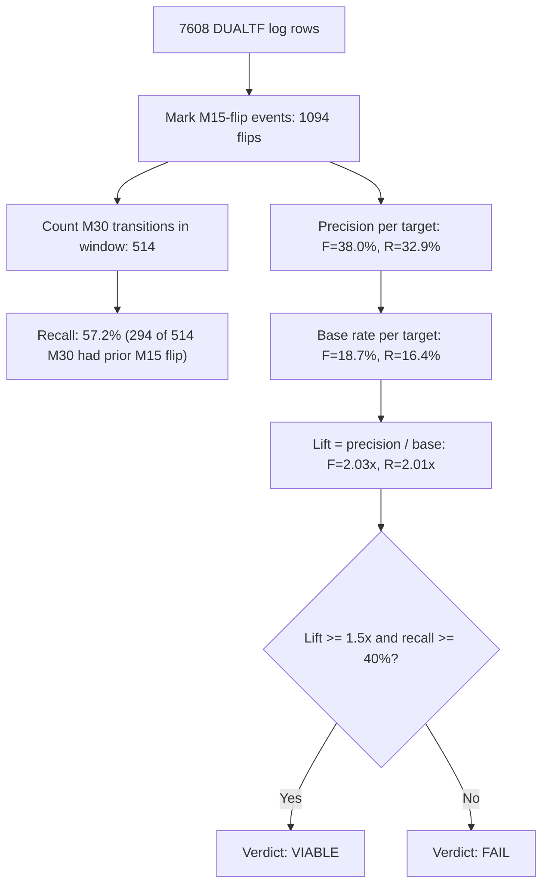

# Cascade Lead Analysis

> This is the LAST live hypothesis. Prediction is dead (1.2% / 43.9% / multi-input worse).
> If this fails, detection-based Part 4 dies → identification-only Part 5.

## Data Summary

| Metric | Value |
|--------|-------|
| Total DUALTF rows | 7608 |
| Kept (m15 & m30 non-X) | 7600 |
| Dropped (m15 or m30 = X) | 8 |
| M30 transitions | 514 |
| M15 flips | 1094 |

## Measurement A — Recall + Lead

**Question:** Did M15 warn before M30 moved? (backward: for each M30 transition, was there a same-target M15 flip in the window before?)

Window K=12 rows (60 minutes)

| Class | Count | % of M30 transitions |
|-------|-------|---------------------|
| LED (lead >= 1) | 294 | 57.2% |
| SIMULTANEOUS (lead = 0) | 38 | 7.4% |
| NO LEAD | 182 | 35.4% |

**LED Lead Distribution:** median = 5.0 rows (25 min), mean = 5.4 rows (27 min)

| Lead (rows) | Lead (min) | Count |
|-------------|-----------|-------|
| 1 | 5 | 40 |
| 2 | 10 | 32 |
| 3 | 15 | 39 |
| 4 | 20 | 30 |
| 5 | 25 | 27 |
| 6 | 30 | 18 |
| 7 | 35 | 20 |
| 8 | 40 | 18 |
| 9 | 45 | 18 |
| 10 | 50 | 17 |
| 11 | 55 | 20 |
| 12 | 60 | 15 |

**Per-Target Breakdown:**

| Target | LED | SIMULTANEOUS | NO LEAD | Total | LED % | Median Lead |
|--------|-----|------------|---------|-------|-------|-------------|
| →F | 74 | 14 | 23 | 111 | 66.7% | 4.0 |
| →R | 65 | 9 | 23 | 97 | 67.0% | 4 |
| →S | 109 | 10 | 59 | 178 | 61.2% | 6 |
| →C | 46 | 5 | 77 | 128 | 35.9% | 7.5 |

## Measurement B — Precision + Delay

**Question:** If I act on an M15 flip, does M30 follow? (forward: for each M15 flip, does M30 reach the same target state within the window?)

Window K=12 rows (60 minutes)

**Overall Precision:** 367/1094 = 33.5%
**False Signals (NOT FOLLOWED):** 727/1094 = 66.5%

**Delay Distribution:** median = 5.0 rows (25 min), mean = 5.3 rows (26 min)

**Per-Target Precision + Base Rate + Lift:**

> **Honesty anchor:** precision without base-rate comparison is meaningless. Lift = precision / base rate. Lift > 1 means M15 flip adds information over random.

| Target | M15 Flip Precision | Base Rate | Lift | Followed / Total | Median Delay (rows) | Median Delay (min) |
|--------|-------------------|-----------|------|------------------|---------------------|-------------------|
| →F | 38.0% | 18.7% | 2.03x | 93/245 | 3 | 15
| →R | 32.9% | 16.4% | 2.01x | 83/252 | 4 | 20
| →S | 37.3% | 29.7% | 1.26x | 137/367 | 6 | 30
| →C | 23.5% | 21.9% | 1.07x | 54/230 | 7.0 | 35

## Measurement C — HTF Filter Split

**Question:** Does the proposed HTF filter help? (for directional targets F/R, does agreeing HTF improve precision?)

| Bucket | Precision | Followed / Total |
|--------|-----------|-----------------|
| AGREEING | 33.0% | 58/176 |
| DISAGREEING | 35.9% | 51/142 |
| NEUTRAL | 37.4% | 67/179 |

**No filter effect:** AGREEING (33.0%) ≈ DISAGREEING (35.9%) — difference of only 3.0pp. The HTF filter idea is not validated.

## Sensitivity — K=6 and K=24

| K | Recall (LED%) | Precision | F Lift | R Lift | Median Lead | Criterion 1 | Criterion 2 | Criterion 3 |
|---|-------------|-----------|--------|--------|-------------|-------------|-------------|-------------|
| 6 | 36.2% | 20.7% | 2.88x | 2.44x | 3.0 | FAIL | PASS | PASS |
| 24 | 85.8% | 56.6% | 1.67x | 1.61x | 8.0 | PASS | PASS | PASS |

## Calculation method (plain explanation)

**(a) COUNT** — Scan every DUALTF row in the log. Whenever the M15 state flips on a bar (different from the previous bar), mark that bar as an M15-flip event. Total: 1094 flips (245 toward F, 252 toward R, 367 toward S, 230 toward C).

**(b) RATE** — Two directions: *recall* looks backward (for each M30 transition, was there a same-target M15 flip in the 12-row window before?); *precision* looks forward (for each M15 flip, does M30 reach the same target state within 12 rows?). Recall = 57.2% (294 LED out of 514 M30 transitions). Precision toward F = 38.0% (93/245), toward R = 32.9% (83/252).

**(c) LIFT** — Divide precision by the base rate (how often M30 moves to that target without any M15-flip signal). For F: 38.0% / 18.7% = 2.03x. For R: 32.9% / 16.4% = 2.01x. Lift near 1.0 means the signal adds nothing; lift >= 1.5 means the signal beats chance and carries real information.

This analysis measures whether a signal EXISTS in the identification log — NOT whether trading it is profitable. A signal with high lift can still lose money in live trading (see V36.13 backtest: -$899). Signal existence and trade profitability are different questions.

## VERDICT

**Criteria applied mechanically at K=12 — no post-hoc adjustment.**

| Criterion | Threshold | Actual | Result |
|-----------|-----------|--------|--------|
| 1. RECALL >= 40% | >= 40% | 57.2% | PASS |
| 2. PRECISION LIFT >= 1.5x (F & R) | >= 1.5x | F: 2.03x, R: 2.01x | PASS |
| 3. MEDIAN LEAD >= 2 rows | >= 2 | 5.0 | PASS |

**CONCLUSION: VIABLE.** All three criteria met. The TransitionDetector redesign for Part 4 is grounded in data. A detection-based approach (act on M15 flips as M30 forecast) has empirical support.

---

*Analysis generated by `scripts/analyze_cascade_lead.py`. Deterministic — re-running produces identical numbers.*
