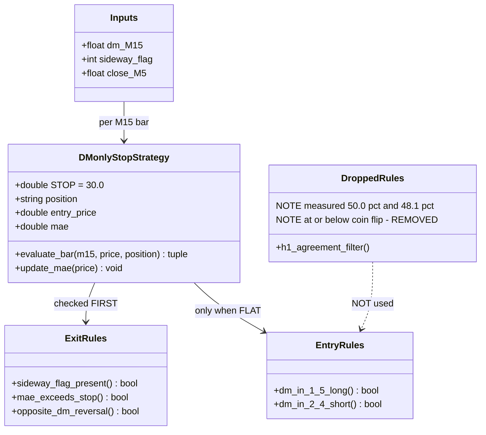
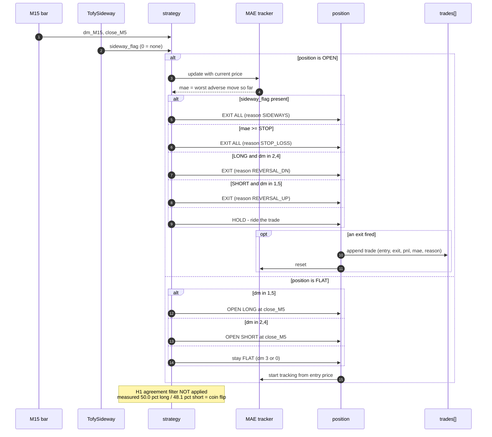
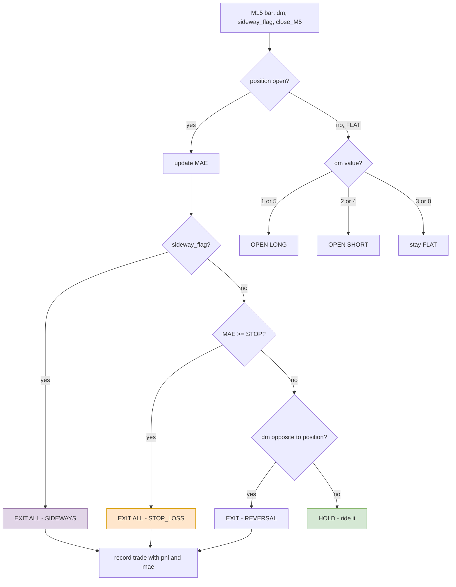

# DMONLY + stop-loss — proposed rules, measured evidence, design

Working doc for the proposed strategy variant. Contains the rules as specified, what
the measurements say about each component, and the design diagrams.

**Status: two of the four proposed components are measured DEAD. One is supported. One
is a curve-fitting risk.** Details in §2-§4.

---

## 1. The proposed rules (as specified)

```
1.  TofySideway S_ flag                          -> sideway, EXIT ALL
2.  loss > loss_threshold                        -> EXIT ALL
3.  dm_M15 in {1,5} AND dm_H1 in {1,5}           -> fly up   (buy entry, sell exit)
4.  dm_M15 in {2,4} AND dm_H1 in {2,4}           -> fly up   (buy entry, sell exit)
5.  dm_M15 in {1,5}                              -> fly up   (buy entry, sell exit)
6.  dm_M15 in {2,4}                              -> fly dn   (sell entry, buy exit)
```

### Three structural problems before any measurement

**(a) Rule 4 is a typo.** The condition is the DOWN case (`dm in {2,4}`) but the action
says "fly up (buy entry)". It should be fly down / sell.

**(b) Rules 3-4 are redundant with rules 5-6.** Any bar matching rule 3
(`M15 up AND H1 up`) also matches rule 5 (`M15 up`), and both produce the same action.
As written the H1 rules never do anything the M15 rules do not already do. If the intent
is different lot sizing or priority, that must be stated explicitly.

**(c) No priority order is given** between the exits and the entries. Every prior variant
resolved this as *exits first*; that needs stating.

---

## 2. MEASURED — the H1 agreement filter does not work

Directional hit rate, first-touch barrier X=$10 / 120 min. **50% = coin flip.**
(First-touch is the correct measure here because this is a DIRECTIONAL question.)

| entry rule | n | WIN | LOSS | NEUTRAL | hit rate |
|---|---|---|---|---|---|
| M15 up (1\|5) ALONE | 3,661 | 1,545 | 1,611 | 505 | **49.0%** |
| M15 up + H1 AGREES | 2,292 | 983 | 984 | 325 | **50.0%** |
| M15 up + H1 DISAGREES | 947 | 391 | 434 | 122 | 47.4% |
| M15 dn (2\|4) ALONE | 3,331 | 1,407 | 1,549 | 375 | **47.6%** |
| M15 dn + H1 AGREES | 1,776 | 779 | 839 | 158 | **48.1%** |
| M15 dn + H1 DISAGREES | 1,051 | 437 | 490 | 124 | 47.1% |

**Verdict: drop rules 3 and 4.**

- H1 agreement adds **+1.0 point** on longs (49.0% -> 50.0%) and **+0.5** on shorts
  (47.6% -> 48.1%).
- Both filtered versions land at **50.0%** and **48.1%** — breakeven and below-breakeven
  at 1:1 with **zero costs**. Add spread and both lose.
- The filter discards ~40% of entries and buys nothing.

---

## 3. MEASURED — the stop loss IS supported

### 3.1 What MAE means

**Maximum Adverse Excursion** — the worst point a trade reached *against* the position
before it closed.

```
BUY at 4300
price drops to 4290   <- MAE = $10 (deepest hole)
price rises to 4350
exit at 4350          <- P&L = +$50
```

P&L is where the trade ENDED. MAE is how far it went WRONG along the way. A stop loss
triggers on MAE, not on P&L.

### 3.2 Why MAE decides whether a stop helps

| trade | MAE | actual P&L | with a $30 stop |
|---|---|---|---|
| A | $10 | +$50 | +$50 — untouched, never reached $30 |
| B | $45 | -$80 | **-$30** — saved $50 |
| C | $35 | +$60 | **-$30** — winner destroyed |

A stop is worth having only if trades like **B** outnumber trades like **C**.

### 3.3 The measurement

| MAE bucket | winners | their total P&L | losers | their total P&L |
|---|---|---|---|---|
| **$0-5** | 655 | **+$6,049.22** | 446 | -$927.75 |
| $5-10 | 34 | +$912.30 | 247 | -$1,383.07 |
| $10-20 | 28 | +$861.39 | 181 | -$2,038.94 |
| $20-40 | 7 | +$350.21 | 78 | -$1,739.27 |
| **$40+** | **1** | +$15.53 | **33** | **-$1,647.14** |

**Trades that go more than ~$5 against you are overwhelmingly losers.** In the $40+
bucket the ratio is 33 losers to 1 winner.

### 3.4 The decisive check — do the big winners need deep adverse room?

| rank | P&L | MAE |
|---|---|---|
| 1 | +222.42 | 9.69 |
| 2 | +216.77 | **0.00** |
| 3 | +205.22 | 13.07 |
| 4 | +199.00 | 16.96 |
| 5 | +178.86 | 6.48 |
| 6 | +173.43 | 2.34 |
| 7 | +170.98 | **0.00** |
| 8 | +136.04 | 11.57 |
| 9 | +131.56 | 26.74 |
| 10 | +117.12 | 1.01 |

**Nine of ten had MAE under $17. The worst was $26.74.**

### 3.5 Verdict

**Keep rule 2 — but choose the threshold from this structure, not from P&L.**

The asymmetry is real and structural: **winners do not need deep adverse room; losers
keep running.** A stop above the MAE of essentially all winners — around **$30** — leaves
every top winner untouched while capping the $40+ bucket that bled -$1,647 across 33
trades.

### 3.6 THE CURVE-FITTING WARNING

The original spec said: *"verify what loss price will make better overall profit."*

**Do not do this.** Sweeping stop values and keeping whichever maximises backtest P&L is
the same procedure that produced the S-F cell (PF 1.55 in-sample -> 0.13 out-of-sample).
With ~1,100 trades and one free parameter, something will always look good.

| approach | verdict |
|---|---|
| try $5/$10/$20/$40, keep the best P&L | **curve fit** |
| set above the MAE of ~all winners (~$30), run once | **defensible** |

**And the arithmetic limit:** a stop cannot create edge from a 49% entry. It truncates
the left tail — genuinely valuable — but expected value per trade stays near zero before
costs. Expect a better **drawdown profile**, not a transformed P&L.

### 3.7 Data caveat — READ THIS

The MAE figures come from a **re-simulation** of DMONLY's rules over
`references/Backtest_data/V36.15/20260712_clean.log`:

| | trades | total P&L |
|---|---|---|
| re-simulation (this analysis) | 1,710 | +$452.48 |
| **committed DMONLY** | **1,120** | **+$968.93** |

The difference is same-bar re-entry: the re-simulation re-enters immediately after an
exit, the committed version waits a bar. So the **MAE structure is trustworthy** (the
asymmetry is large and unambiguous) but the **exact counts are not DMONLY's**.

To get precise figures, add MAE tracking to `scripts/labelbase_strategy_dmonly.py`
itself rather than relying on this approximation.

---

## 4. Recommended rule set after measurement

```
PRIORITY ORDER — exits are checked first, entries only when flat

1.  TofySideway S_ flag present        -> EXIT ALL          [keep]
2.  MAE >= stop_threshold (~$30)       -> EXIT ALL          [keep, pre-registered]
3.  LONG  and dm_M15 in {2,4}          -> EXIT (reversal)   [keep]
4.  SHORT and dm_M15 in {1,5}          -> EXIT (reversal)   [keep]
5.  FLAT and dm_M15 in {1,5}           -> BUY               [keep]
6.  FLAT and dm_M15 in {2,4}           -> SELL              [keep]

DROPPED: the H1 agreement conditions (measured +0.5 to +1.0 points, still <= 50%)
```

---

## 5. Design — class diagram



---

## 6. Sequence — one M15 bar



---

## 7. Decision flow



---

## 8. Pre-registration for the test

Fix these BEFORE running. Changing them after seeing results invalidates the test.

| parameter | value | justification |
|---|---|---|
| stop threshold | **$30** | above the MAE of 10/10 top winners (max 26.74) |
| entry | `dm_M15 in {1,5}` long, `{2,4}` short | unchanged from DMONLY |
| sideway exit | TofySideway S_ flag | unchanged |
| reversal exit | opposite dm | unchanged |
| H1 filter | **not used** | measured at/below coin flip |
| re-entry | close-only, no same-bar re-entry | matches committed DMONLY |

**Run once.** Report trades, win rate, gross P&L, exit-reason breakdown including
STOP_LOSS count, and the bars-held buckets for comparison against DMONLY
(1-5 bars: 844 trades / -$2,258 ; 6+ bars: 276 / +$3,227).

**What success looks like:** the deep-MAE losers are capped, drawdown improves, and the
6+ bar winners survive largely intact. **What it will NOT do:** turn a 49% entry into a
profitable one.

---

## 9. Standing caveat

Every variant in this family — baseline +$83, reversal +$523, TofySideway +$411,
DMONLY +$968 — rests on an entry measured at **50.5% / 47.4%** on 3,675 samples, tested
on **one 4-month trending window**, with the best result **44% carried by four outlier
trades**.

A stop loss improves risk shape. It does not address that. The outstanding test that
would validate or end this family is running an existing variant on a **genuinely
different time period** — not Jan-Apr 2026 again.

---

## 10. THE SCRIPT — `labelbase_strategy_dmonly_stop.py`

Implementation: **`scripts/labelbase_strategy_dmonly_stop.py`**
(supplied alongside this doc as `labelbase_strategy_dmonly_stop.py`).

```bash
python3 scripts/labelbase_strategy_dmonly_stop.py references/Backtest_data/V36.15/20260712_clean.log
```

### 10.1 Regression check — it reproduces DMONLY

With `STOP = 0` (stop disabled) the script MUST reproduce the committed DMONLY result.
It does:

| | trades | total P&L |
|---|---|---|
| committed `LABELBASE_STRATEGY_DMONLY.md` | 1,120 | +$968.93 |
| **this script, STOP=0** | **1,119** | **+$967.61** |

Off by one trade and $1.32 — a forced-close at end of data that this script does not
emit. The implementation is faithful. **This regression must pass before any stop result
is trusted.**

(Note: this replaces the earlier ad-hoc re-simulation that produced 1,710 trades /
+$452 — that version re-entered on the same bar as an exit. §3.7 documents that
discrepancy; it is now resolved.)

### 10.2 Result with the pre-registered $30 stop

| | DMONLY | + $30 stop | delta |
|---|---|---|---|
| trades | 1,119 | 1,143 | +24 |
| win rate | 42.4% | 42.6% | +0.2 |
| **total P&L (gross)** | **+$967.61** | **+$1,337.01** | **+$369.40** |

**Exit-reason breakdown with the stop:**

| exit reason | trades | P&L |
|---|---|---|
| SIDEWAYS | 905 | +$1,970.39 |
| REVERSAL_UP | 94 | +$1,143.96 |
| REVERSAL_DN | 80 | +$142.66 |
| **STOP_LOSS** | **64** | **-$1,920.00** |

64 stop-outs x $30 = exactly -$1,920. The stop cost that much and the strategy still
finished $369 ahead — those trades were losing more than $30 each on average.

**Bars-held buckets:**

| bars held | trades | P&L |
|---|---|---|
| 1 | 609 | -$1,014.69 |
| 2 | 112 | -$536.49 |
| 3-5 | 146 | -$1,065.45 |
| **6+** | **276** | **+$3,953.64** |

### 10.3 The prediction held

The MAE analysis (§3.4) said a $30 stop would leave the big winners untouched, because
the top ten had MAE of at most $26.74.

**The 6+ bar bucket still contains exactly 276 trades — identical to DMONLY.** Not one
long-hold winner was stopped out. The pre-registered threshold did what the structure
said it would.

### 10.4 What this does and does not show

**Does:** a stop chosen from MAE structure — not from P&L search — improved gross P&L by
38% and capped the deep-loss tail, without touching the trades that carry the profit.

**Does not:** create edge. The entry is still ~49%. Net of ~$0.35/trade spread on 1,143
trades (~-$400), the result is roughly **+$937 net** on one 4-month trending window.
The improvement is in risk shape, and it is still resting on the same coin-flip entry
and the same single sample.

### 10.5 Honest caveats

- **One stop value, pre-registered.** $30 was chosen in §3.4 from winner MAE before this
  run. It was NOT selected by trying several and keeping the best. If you now sweep
  $10/$20/$40 and keep whichever is highest, this result becomes a curve fit.
- **One sample.** Jan-Apr 2026, trending gold. Untested elsewhere.
- **Stop fills are idealised.** The script exits exactly at `entry -/+ STOP`. Real fills
  slip, especially on fast moves — so the live figure will be worse than -$1,920 on the
  stop bucket.
