# DualTF Architecture — EA Implementation Design (UNBUILT SPEC)

> **A three-layer EA design implementing the DualTF Stack model**
> (DUALTF_IMAGE_ANALYSIS.md): Identify → Predict → Act. **DESIGN SPEC — not code, not validated.**
> This is an **ALTERNATIVE/successor** to the 7-scenario system in ARCHITECTURE.md.
> All three layers are **UNBUILT** and depend on the EA baseline
> (s_prevH1Sqz fix + scenario rename A→F... + V31.06 backtest promotion) first.

---

## Three-Layer Overview

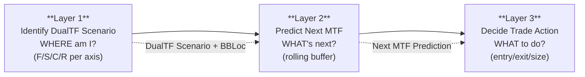

- **Layer 1 — Identify DualTF Scenario**: Given current BB state across all TFs, derive 4-state (F/S/C/R) per TF, then pair into HTF (D1×H4) and MTF (H1×M30) scenarios with BBLoc. Replaces the 7-scenario IdentifyScenario with the DualTF 4×4 derivation.
- **Layer 2 — Predict Next MTF**: Given DualTF scenario + rolling MTF history, predict the next MTF scenario. Uses real-time rolling buffer (EA advantage over analysis-side snapshot).
- **Layer 3 — Decide Trade Action**: Given DualTF scenario + predicted next MTF + M15 timing, select entry/exit/size. DualTF scenario = structure/setup; M15 = timing (M5 optional refinement only, never standalone).

> **Successor note:** This design replaces the 7-scenario system (F1/S1/C1/V1/R1 etc.) with the 4-state DualTF model. It is NOT the current built system — the current system uses the 7-scenario IdentifyScenario described in ARCHITECTURE.md.

---

## TF Roles (cross-cut all layers)

These responsibilities are invariant across all three layers — they define what each TF contributes to the DualTF system.

| TF | Role | Layers that consume |
|----|------|---------------------|
| D1 | HTF axis (with H4) — sets macro direction, fork-decider for compression breakout | L1 (HTF scenario), L2 (HTF constraint on prediction), L3 (directional a priori) |
| H4 | HTF axis (with D1) — primary HTF classifier, phase context | L1 (HTF scenario), L2 (HTF constraint), L3 (confinement check) |
| H1 | MTF axis (with M30) — the leg ridden, primary trend driver | L1 (MTF scenario), L2 (MTF prediction target), L3 (confinement) |
| M30 | MTF axis (with H1) — MTF confinement check | L1 (MTF scenario), L2 (MTF prediction), L3 (confinement) |
| M15 | Leading-edge — feeds Part 4 prediction AND Part 5 entry/exit timing | L2 (leading-edge signal), L3 (entry/exit trigger) |
| M5 | Optional within-M15-bar refinement — NOT a standalone trigger | L3 (tick refinement only, after M15 confirms) |

**Key difference from 7-scenario system:** M15 is no longer just an entry trigger — it is a leading-edge signal in the prediction function (Part 4) and the PRIMARY entry/exit timing trigger. M5 is NOT a standalone trigger — optional within-M15-bar refinement only after M15 confirms. The HTF axis (D1×H4) becomes a fork-decider: which way does compression break?

---

## Part 3 — Layer 1: Identify DualTF Scenario (UNBUILT)

### 3.1 Interface — Class/Struct Diagram

This diagram shows the DualTF data structures: what Layer 1 reads (per-TF BB data) and what it returns (DualTFScenarioState). This replaces the ScenarioState struct from the 7-scenario system.

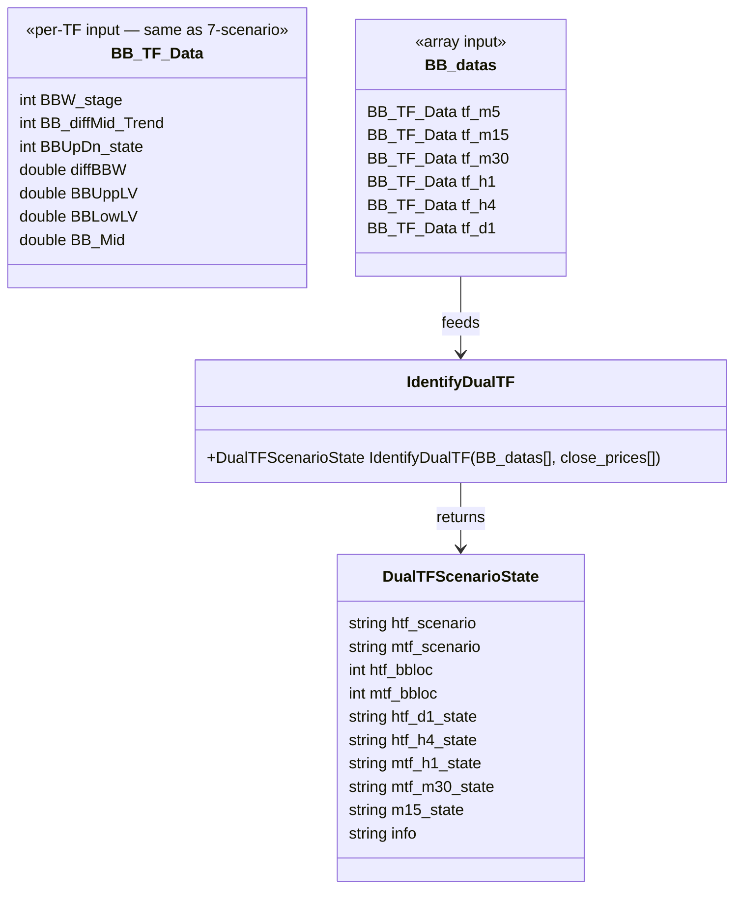

**Field meanings (DualTFScenarioState):**

| Field | Type | Meaning | Consumed by |
|-------|------|---------|-------------|
| `htf_scenario` | string | HTF 2-char code (D1-state)(H4-state), e.g. "FS" = D1 fly-up, H4 shrinking | L2, L3 |
| `mtf_scenario` | string | MTF 2-char code (H1-state)(M30-state), e.g. "FC" = H1 fly-up, M30 compress | L2, L3 |
| `htf_bbloc` | int | HTF band location 0-10 (real-time from price/band computation) | L2 (prediction constraint), L3 |
| `mtf_bbloc` | int | MTF band location {0,1,3,5,7,9,10} (sparse scale) | L2 (rolling trajectory), L3 |
| `htf_d1_state` | string | D1 raw 4-state: F/S/C/R | L2 (HTF fork-decider) |
| `htf_h4_state` | string | H4 raw 4-state: F/S/C/R | L2 (HTF fork-decider) |
| `mtf_h1_state` | string | H1 raw 4-state: F/S/C/R | L2, L3 |
| `mtf_m30_state` | string | M30 raw 4-state: F/S/C/R | L2, L3 |
| `m15_state` | string | M15 leading-edge state: F/S/C/R | L2 (leading-edge input), L3 (trigger) |
| `info` | string | Human-readable reason string | logging |

> **Note:** BBW_stage mapping to F/S/C/R: 511,512 → F; 521,522 → R; 513,523 → S; 400-499 → C. Same as DUALTF_IMAGE_ANALYSIS.md Part 1.

### 3.2 Control Flow — Activity Diagram

This flowchart shows the derivation order: per-TF BBW_stage → F/S/C/R state, then D1×H4 → HTF pair, H1×M30 → MTF pair, then BBLoc computation.

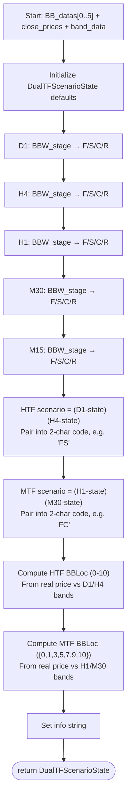

**Derivation order:** Per-TF states first (independent, parallel), then axis pairing (HTF from D1×H4, MTF from H1×M30), then BBLoc (real-time price-vs-band computation — EA advantage over analysis-side coarse BBUpDn mapping).

### 3.3 Scenario State Machine — State Diagram

The 4-state cycle: F → S → C → {F or R}, with persistence at each state.

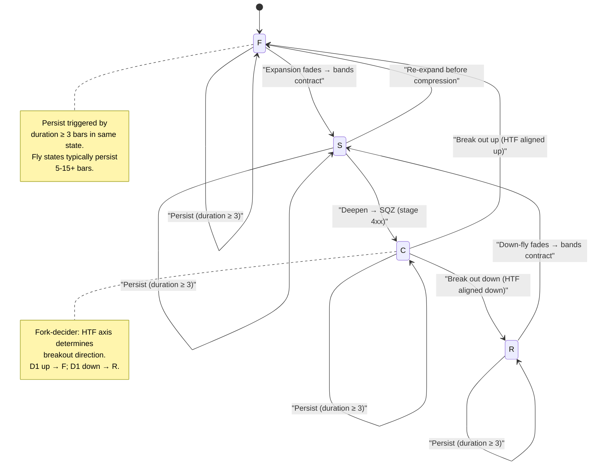

**Contract established:** The 4-state machine flows F → S → C → {F or R}, with R symmetric to F (R → S → C → {R or F}). Each state can persist (duration ≥ 3 bars). The HTF axis determines the C → {F or R} fork: D1 up → F (continuation), D1 down → R (reversal). This replaces the 7-scenario state machine in ARCHITECTURE.md §3.3.

### 3.4 BBLoc Computation

**EA advantage over analysis side:** The EA computes real band position from price vs band data. The analysis side uses coarse BBUpDn mapping (only {1,2,3,5} reachable). The EA has access to `BBUppLV`, `BBLowLV`, and `BB_Mid` per TF — it can compute exact position.

**HTF BBLoc (0-10, continuous scale):**

```
htf_bbloc = (price - band_low) / (band_up - band_low) * 10
```

Anchors: 0 = below lower band, 5 = at mid, 10 = above upper band.
Shared anchors with MTF: 1 = lower band, 5 = mid, 9 = upper band.

**MTF BBLoc (sparse scale: 0, 1, 3, 5, 7, 9, 10):**

Same formula, but the scale is sparse — mirroring the BBUpDn reachability gap.
Anchors: 0 = below lower, 1 = lower band, 3 = lower-mid, 5 = mid, 7 = upper-mid, 9 = upper band, 10 = above upper.
Gaps at 2, 4, 6 reflect the same coarse-data limit as the analysis side — the EA inherits the gap from the BBUpDn mapping that defines the state boundaries.

**Key advantage:** The EA's BBLoc is real (from price/band computation), not inferred from BBUpDn. This means levels 0, 2, 4, 6, 8 are reachable — the trajectory is continuous, not gapped. The MTF sparse scale is a design choice (matching the analysis side for consistency), not a data limitation.

**Band-position ladder:**

```
HTF BBLoc (0-10) — price position in the Bollinger bands:

   10  ── over BB Upper
──────── 9   BB Upper band
    8   ── between Upper and Upper-Mid
──────── 7   BB Upper-Mid
    6   ── between Upper-Mid and Mid
──────── 5   BB Mid band
    4   ── between Mid and Lower-Mid
──────── 3   BB Lower-Mid
    2   ── between Lower-Mid and Lower
──────── 1   BB Lower band
    0   ── below BB Lower

MTF BBLoc (sparse 0,1,3,5,7,9,10) — same anchors, coarser:
   1=Lower, 3=Lower-Mid, 5=Mid, 7=Upper-Mid, 9=Upper, 0=below, 10=above
```

**Computation flowchart:**

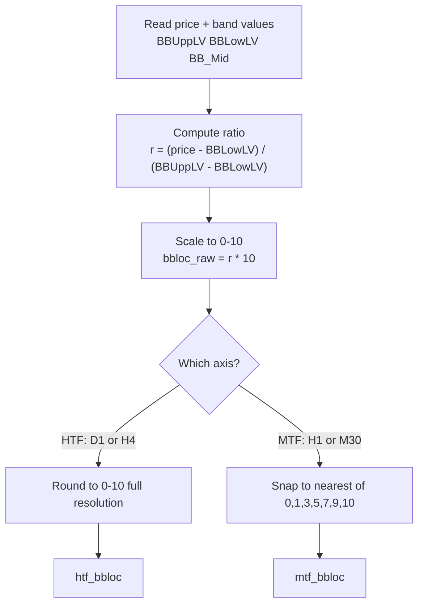

### 3.5 Build Status

| Component | Status | Detail |
|-----------|--------|--------|
| 4-state derivation (BBW_stage → F/S/C/R) | **UNBUILT** | Straightforward mapping, no logic |
| HTF pairing (D1×H4) | **UNBUILT** | String concatenation of two states |
| MTF pairing (H1×M30) | **UNBUILT** | String concatenation of two states |
| BBLoc computation | **UNBUILT** | Real price-vs-band formula — EA advantage |
| M15 leading-edge state | **UNBUILT** | Same derivation as other TFs |

> **UNBUILT.** Replaces the 7-scenario IdentifyScenario. Needs the EA baseline (s_prevH1Sqz fix + scenario rename + V31.06 backtest promotion) before this layer can be built.

---

## Part 4 — Layer 2: Predict Next MTF Scenario (NOT VIABLE)

> **STATUS: NOT VIABLE (tested).** Out-of-sample transition accuracy = 43.9% (BBLoc-only, best predictor); multi-input (HTF + M15 + duration) performs WORSE and overfits. 90.4% persistence base rate; 68.9% of pre-transition BBLoc slopes flat (no signal). TESTED across coarse data (1.2%), fine BBLoc (43.9%), and multi-input (worse). CONCLUSION: prediction is not feasible on available data — the EA should trade on IDENTIFICATION (Part 3), not prediction. This section is retained as a documented dead-end, not a build target.

### 4.1 Interface — Class Diagram

The rolling-history buffer ("15-array") stores recent MTF scenarios, BBLoc trajectory, duration-in-state, and M15 leading-edge. This is the EA's real-time equivalent of the analysis-side log — but with prior-state tracking the snapshot lacked.

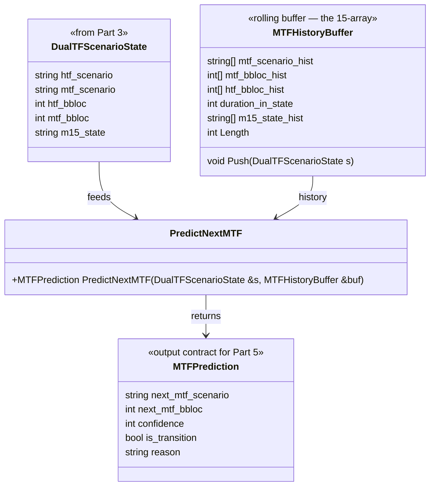

**MTFPrediction field meanings:**

| Field | Type | Meaning | Consumed by Part 5 |
|-------|------|---------|-------------------|
| `next_mtf_scenario` | string | Predicted next MTF scenario (e.g. "FF") | Setup: what regime to expect |
| `next_mtf_bbloc` | int | Predicted MTF BBLoc at next transition | Target: where price is heading |
| `confidence` | int | 0-100, scaled by transition accuracy (not inflated by persistence) | Size multiplier |
| `is_transition` | bool | True if MTF scenario changes (breakout/reversal) | Re-evaluate trigger |
| `reason` | string | Which prediction rule fired | Logging, benchmark verification |

> **Key difference from 7-scenario PredictNext:** The 7-scenario system scored direction per-TF (DirectionScore) then assembled. The DualTF system uses a rolling MTF history buffer — the EA can track prior MTF scenarios in real time, which the analysis-side snapshot could not. This enables prior-state detection (R2/R3, P, V3/V4, B3) that the analysis side missed.

### 4.2 Prediction Function

**Prediction = f(HTF + BBLoc, current MTF + BBLoc, prior MTF + BBLoc, M15 state, duration) → next MTF scenario + BBLoc**

The prediction function reads the rolling MTF history buffer (EA advantage) and applies rules:

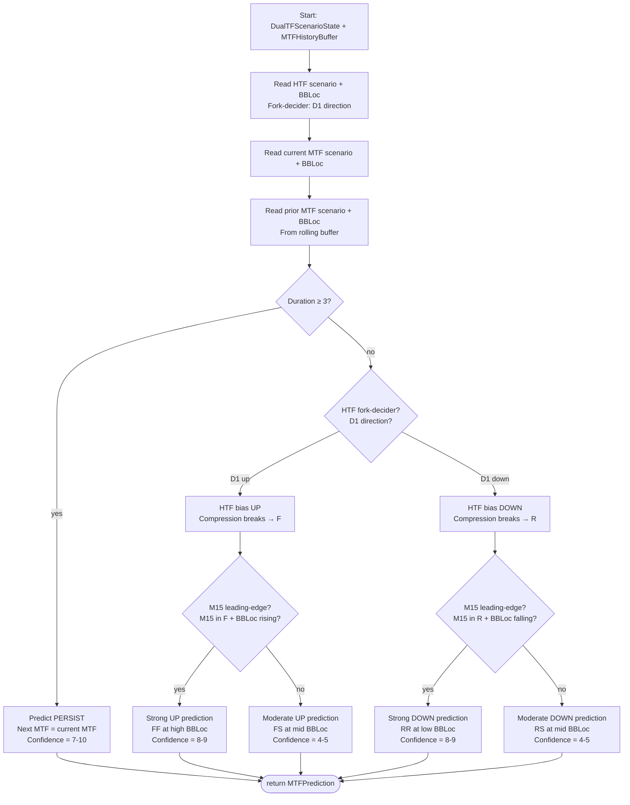

**Prediction rules (from DUALTF_IMAGE_ANALYSIS.md Part 4):**

| Condition | Predicted Next MTF (+BBLoc) | Predicted Target | Confidence | Key Input |
|-----------|---------------------------|-----------------|------------|-----------|
| Duration ≥ 3 | Same MTF (persist) | Current HTF band level (no change) | 7-10 | Rolling buffer |
| MTF in C, BBLoc climbing, HTF up | FF at high BBLoc | H4 BB Upper | 8-9 | HTF fork-decider + BBLoc trajectory |
| MTF in C, BBLoc at upper, HTF down | RR at upper | D1 BB Lower-Mid | 5-6 | HTF fork-decider |
| MTF in C, BBLoc rolling over (5→3) | FR at lower BBLoc | D1 BB Mid | 5 | BBLoc trajectory from buffer |
| MTF in F, BBLoc falling | S at lower BBLoc | H1 BB Mid | 5 | BBLoc trajectory |
| MTF in S, HTF fly-up, BBLoc rising | F at higher BBLoc | H4 BB Upper-Mid | 5-6 | HTF + BBLoc trajectory |
| M15 in F + BBLoc rising | Continuation signal | +1 HTF band level | +2 boost | M15 leading-edge |

> **HTF as fork-decider:** The HTF axis (D1×H4) determines which way compression breaks. D1 fly-up → compression breaks up (F); D1 fly-down → compression breaks down (R). This is the most critical HTF input — it resolves the C → {F or R} fork.

> **M15 as leading-edge:** M15 state feeds the prediction function (Part 4) AND entry/exit timing (Part 5). M15 in fly-up with BBLoc rising = strong continuation signal; M15 in fly-down with BBLoc falling = early reversal signal.

### 4.2b Per-Bar Prediction Signal Flow (Mechanics)

This diagram traces how each bar's raw per-TF data flows through the (attempted) prediction pipeline. Each node corresponds to a real computation step — reviewable against any log row.

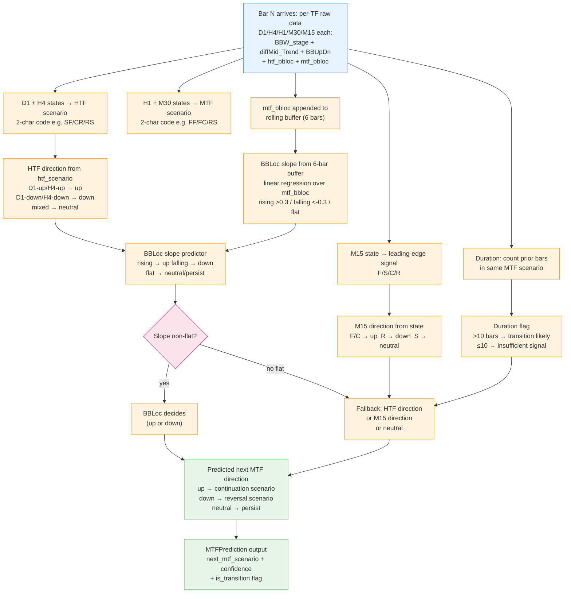

**Reviewable trace:** For any log row, you can follow the path — raw per-TF data → HTF/MTF pairing → BBLoc slope + HTF direction + M15 state → slope branch → predicted direction. The bottleneck is the slope branch: 68.9% of slopes are flat, so the predictor falls through to the fallback (HTF/M15/neutral) where those signals are noise.

### 4.2c Failure Anatomy — Where the Signal is Lost

This diagram shows where and why prediction breaks, with empirical numbers from the V36.03 analysis. The design (4.1–4.2) looks sound on paper — the failure is in the data.

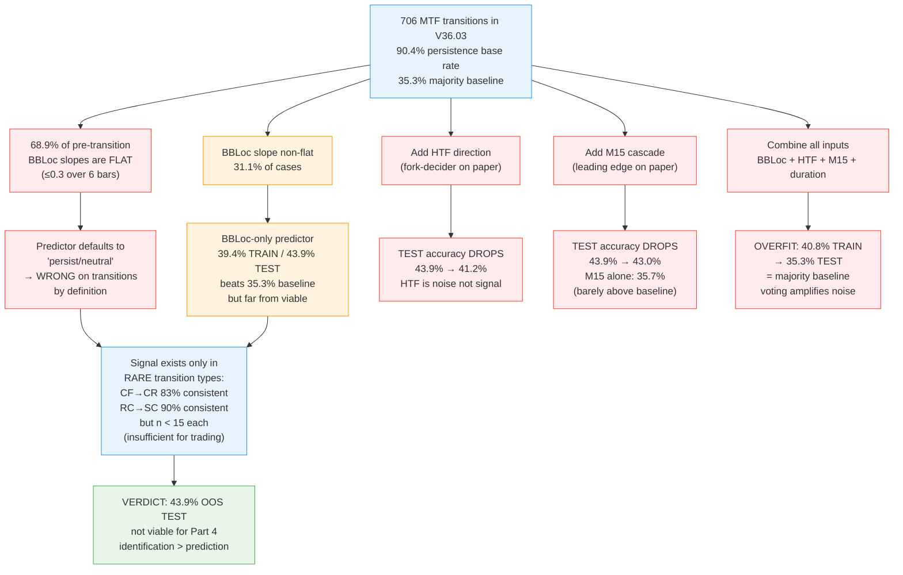

**Why it fails (in words):**

1. **Structural:** 68.9% of pre-transition BBLoc slopes are flat — the primary predictor has no signal for most transitions. The fallback (HTF/M15) is noise, not independent information.
2. **Adding inputs HURTS:** Every multi-input combination reduces TEST accuracy vs BBLoc-only (43.9%). HTF direction (-2.7pp), M15 (-0.9pp), all combined (-8.6pp). The signals are correlated with noise, not independent predictive factors.
3. **Overfitting:** All-combined predictor collapses to the majority baseline on TEST (35.3%) — it learned TRAIN patterns that don't generalize.
4. **Rare-predictable vs common-unpredictable:** High-consistency transition types (CF→CR 83%, RC→SC 90%) are rare (n < 15 each). Common transitions (FF→FS, RR→RS) are unpredictable. The signal exists only in the tail.

### 4.2a Predicted Target Derivation

The predicted target is derived from the predicted MTF direction and current HTF BBLoc. The target is always an HTF band level — price moves toward HTF structure, not MTF.

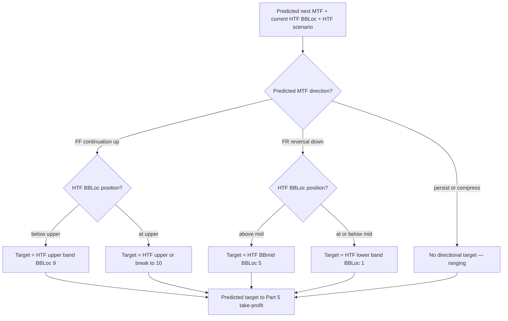

**Target logic in words:**
- Predicted FF (continuation up) → target = next HTF band UP (toward HTF upper BBLoc 9); if already at upper → HTF upper band or break to 10.
- Predicted FR (reversal down) → target = HTF BBmid (BBLoc 5) if above mid, else HTF lower band (BBLoc 1).
- Predicted persist/compress → no directional target (ranging).

**Open design questions this diagram surfaces:**

- **OPEN: HTF/MTF divergence** — when HTF=F-up but predicted MTF=R-down, does the target follow the MTF prediction (HTF mid) or does strong HTF suppress the reversal target? TBD — user to verify.
- **OPEN: at-band behavior** — predict-up while at upper band: target the band (resistance) or allow break above (BBLoc 10, trend riding band)? TBD.
- **OPEN: target source** — confirmed HTF-band-driven, or does MTF band structure also factor? TBD.

> **Purpose:** This diagram verifies the target design — unresolved paths = design gaps. The HTF involvement (target = HTF band level) is made explicit.

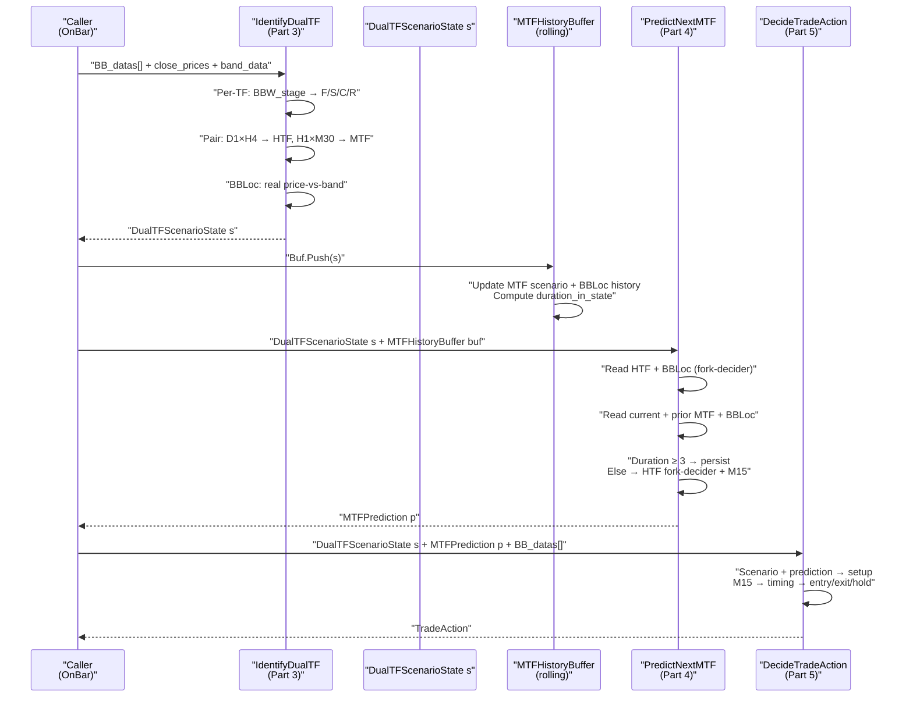

**Critical details visible in this diagram:**
- **HANDOFF POINT:** DualTFScenarioState flows L1 → L2 → L3, same as the 7-scenario system.
- **ROLLING BUFFER:** Between L1 and L2, the MTFHistoryBuffer is updated with the new scenario. This is the EA's real-time advantage — prior MTF states are tracked, not just the current state.
- **PREDICTION CONSUMED:** MTFPrediction flows into DecideTradeAction — it is NOT decorative (the 7-scenario TofyTrade4 problem where PredictNextTrend was drawn-and-discarded).

### 4.4 Benchmark — Validation Target

> **⚠ The analysis self-backtest ~68% OVERALL is INFLATED by persistence** — most rows don't change state, so predicting "persist" on every row yields high accuracy. The EA's real success metric is **TRANSITION accuracy** (predicting actual scenario CHANGES — breakouts and reversals), NOT yet measured, expected lower. **Benchmark on TRANSITION accuracy, not 68%.**

The 68% figure comes from the analysis-side self-backtest where the predicted next-MTF-scenario is compared to the actual next row. However, because most rows are in a persistent state (fly states last 5-15+ bars), predicting "same as current" on every row achieves high accuracy without skill. The transition accuracy — how well the model predicts when and where state changes occur — is the real measure of predictive skill.

**Verification target:** When built, measure transition accuracy separately from overall accuracy. A model that predicts 68% overall but 40% on transitions is a persistence model, not a prediction model.

### 4.5 Build Status

| Component | Status | Detail |
|-----------|--------|--------|
| MTFHistoryBuffer (rolling buffer) | **NOT VIABLE** | Tested — multi-input prediction fails OOS |
| Duration computation | **NOT VIABLE** | Adding duration → accuracy drops |
| HTF fork-decider logic | **NOT VIABLE** | HTF input adds noise, not signal |
| M15 leading-edge input | **NOT VIABLE** | M15 alone = 35.7% (below 43.9% BBLoc-only) |
| Transition accuracy measurement | **TESTED** | 43.9% OOS (BBLoc-only best); multi-input worse |

> **NOT VIABLE, not a build target.** Tested on V36.03 data with 70/30 chronological train/test split: BBLoc-only 43.9% OOS test accuracy (best predictor); adding HTF/M15/duration → accuracy drops, all-combined overfits (40.8% train → 35.3% test). See MULTIINPUT_PREDICTION_ANALYSIS.md and BBLOC_TRANSITION_ANALYSIS.md for full results.

### Prediction Outputs → Trade Action

| Prediction Output | Part 5 Decision It Drives |
|-------------------|--------------------------|
| next MTF scenario | DIRECTION — FF/continuation → hold/add; FR/reversal → exit/flip; persist → hold |
| predicted BBLoc | STOP / URGENCY — near a band (BBLoc 9) → tighten stop, take partial; mid (5) → less urgency |
| predicted target | TAKE-PROFIT — Part 5 sets the TP order at the predicted target |

**Summary:** next-MTF → direction; BBLoc → stop/urgency; target → take-profit. Three prediction outputs map to three distinct Part 5 decisions.

### 4.6 What To Use Instead

Since prediction is not viable (43.9% OOS TEST accuracy — barely above the 35.3% majority baseline, and multi-input is worse), **Part 5 should be IDENTIFICATION-based, not prediction-based**: trade on the CURRENT DualTF scenario + real BBLoc for entry/exit timing, NOT on a predicted next scenario. The DualTF scenario tells you WHERE you are (structure/setup); M15 tells you WHEN to act (timing). No prediction layer needed. See Part 5.

---

## Part 5 — Layer 3: Decide Trade Action (UNBUILT)

### 5.1 Interface — Class Diagram

The action decision: inputs (DualTF scenario, predicted next MTF, M15 timing) → output (entry / exit / hold / size). M5 is not a standalone trigger.

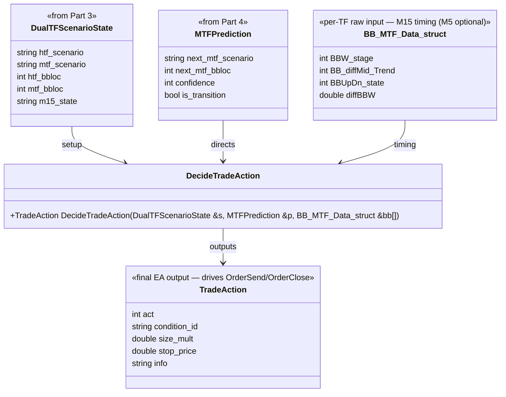

**TradeAction field meanings:**

| Field | Type | Meaning | Consumed by |
|-------|------|---------|-------------|
| `act` | int | 0=hold, 1=BUY, 2=SELL, 7=exit_all | OrderSend / OrderClose |
| `condition_id` | string | DualTF rule identifier (e.g. "HTF-F-up/MTF-C-break") | Logging, benchmark verification |
| `size_mult` | double | 0.0–1.0, from prediction confidence | Lot size |
| `stop_price` | double | ATRSL stop at entry | OrderSend SL |
| `info` | string | Debug string | Logging |

### 5.2 Control Flow — Activity Diagram

DualTF scenario + prediction → setup; M15 → timing trigger → entry/exit/hold. M5 is not a standalone trigger.

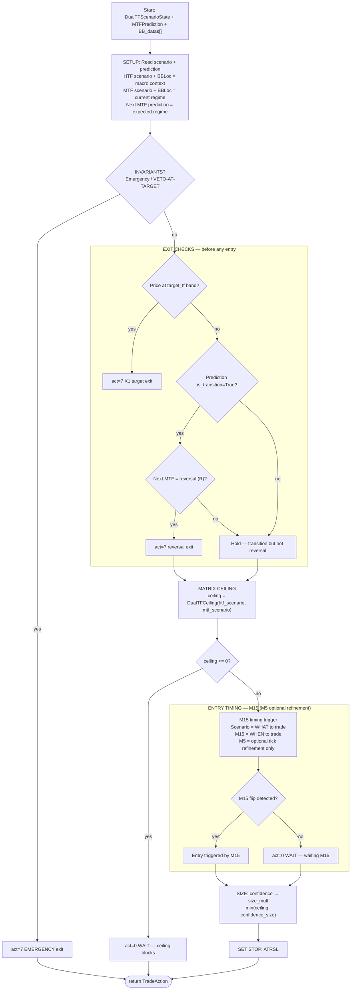

**Evaluation order:** INVARIANTS → EXIT CHECKS → SETUP → TIMING → SIZE → STOP. Exits before entries — a position that should close must close before a new one opens.

### 5.3 M15 as Entry/Exit Timing (M5 optional refinement only)

> **The DualTF scenario (D1/H4/H1/M30) = the STRUCTURE/setup; M15 = the TIMING of entry/exit within that setup. M5 is NOT a standalone trigger.** The structure tells you WHAT, M15 tells you WHEN.

> **RATIONALE: M5 carries high noise; standalone M5 triggers cause whipsaw. M15 is the timing trigger; M5 is at most an optional refinement after M15 confirms, never standalone.**

This is the separation of concerns in the DualTF model:

- **Structure (Parts 3-4):** DualTF scenario identifies the current regime (HTF direction, MTF state, BBLoc). Prediction forecasts the next MTF. Together they define the setup — is there a trade? what direction? what target?
- **Timing (Part 5):** M15 is the PRIMARY leading-edge trigger — it fires the actual entry when the M15 flip aligns with the setup. M5 is at most an optional within-M15-bar tick refinement (reducing slippage), but M5 never decides whether to enter — only M15 does.

**M15 timing in the DualTF model:**

| M15 State | Timing Signal | Context |
|-----------|--------------|---------|
| F (fly-up) + BBLoc rising | Entry timing for long setups | M15 confirms HTF up direction |
| R (fly-down) + BBLoc falling | Entry timing for short setups | M15 confirms HTF down direction |
| S (shrink) | Wait — no trigger | Compression, no momentum |
| C (compress) | Wait — no trigger | SQZ, coiled but no direction |

**M5 optional refinement (NOT a decision):** After M15 triggers, M5 may optionally refine the entry tick — but M5 never independently decides to enter or exit. M15 flip = entry fires. M5 = optional slippage reduction only.

### 5.4 Build Status

| Component | Status | Detail |
|-----------|--------|--------|
| DualTF ceiling matrix | **UNBUILT** | HTF×MTF → size ceiling |
| M15 timing trigger | **UNBUILT** | Flip detection (M5 optional refinement) |
| Confidence → size mapping | **UNBUILT** | MTFPrediction.confidence → size_mult |
| Exit checks | **UNBUILT** | Target-based + transition-based |

> **UNBUILT, Phase after Part 4.** Depends on Part 3 (IdentifyDualTF) and Part 4 (PredictNextMTF) being built and validated first.

---

## Cross-Layer Data Flow — Sequence Diagram

Per-bar L1→L2→L3: Identify → Predict → Act, showing what each layer passes to the next.

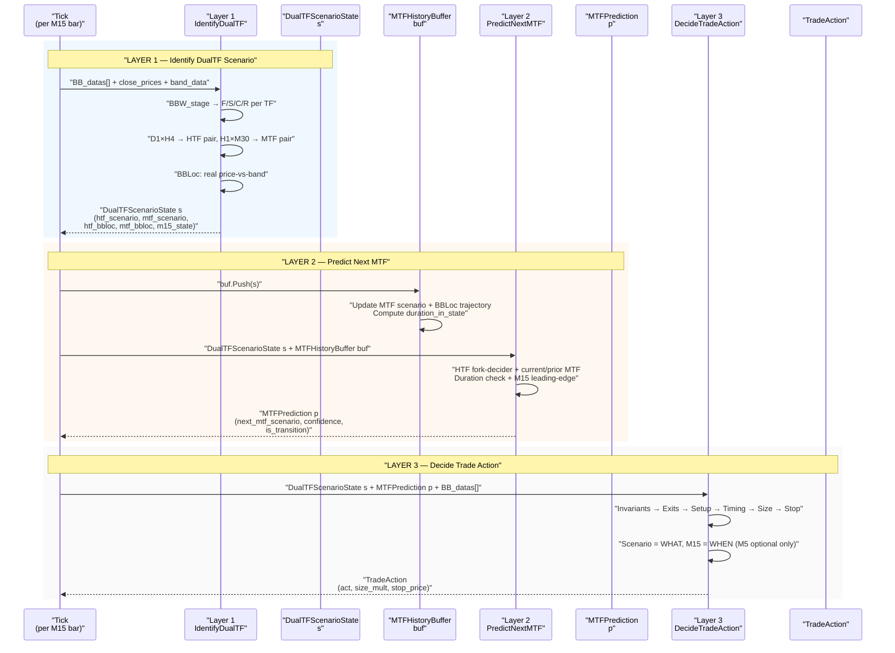

**Data flow summary:**
- **L1 → L2:** DualTFScenarioState (htf_scenario, mtf_scenario, htf_bbloc, mtf_bbloc, m15_state) + MTFHistoryBuffer (rolling trajectory)
- **L2 → L3:** MTFPrediction (next_mtf_scenario, confidence, is_transition)
- **L3 output:** TradeAction (act, size_mult, stop_price) — drives OrderSend/OrderClose

---

## Analysis-side vs EA-side — Comparison

| Capability | Analysis side | EA side |
|------------|--------------|---------|
| BBLoc | Coarse {1,2,3,5} from BBUpDn mapping | Real 0-10 from price/band computation |
| Prior-state scenarios (R2/R3, P, V3/V4, B3) | Undetectable (single snapshot, no history) | Detectable (rolling MTFHistoryBuffer tracks full trajectory) |
| Prediction inputs | Post-hoc from log (static snapshot) | Real-time rolling buffer (live trajectory) |
| Validation | Self-backtest (~68% overall — inflated by persistence) | Live forward-test on transitions (real skill measure) |
| Duration tracking | Backward count from log rows | Real-time counter in buffer |
| M15 leading-edge | Coarse BBUpDn mapping only | Real BBLoc + state from price/band |

> **The EA is the REAL test of the DualTF prediction.** The analysis side operates on coarse, static data (BBUpDn mapping, single snapshot). The EA has real-time, continuous data (price-vs-band, rolling buffer). The 68% self-backtest figure is inflated by persistence — the EA's transition accuracy on live data is the true measure.

---

## Blocker Integration & Build Phases

All three layers are **UNBUILT**. The existing EA must be stabilized before the DualTF system can be built. The blocker chain:

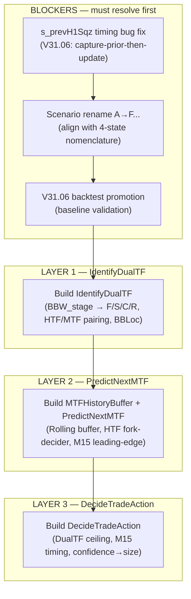

**Phase list:**

| Phase | Task | Status |
|-------|------|--------|
| 0 | s_prevH1Sqz fix (V31.06) + scenario rename + backtest promotion | **BLOCKER** |
| 1 | Build IdentifyDualTF (per-TF derivation, HTF/MTF pairing, BBLoc) | UNBUILT |
| 2 | Build MTFHistoryBuffer + PredictNextMTF (rolling buffer, fork-decider, M15) | UNBUILT |
| 3 | Build DecideTradeAction (ceiling, timing, size, exits) | UNBUILT |
| 4 | GATE 3 — transition accuracy benchmark (NOT 68% overall) | UNBUILT |
| 5 | GATE 4 — live forward-test | UNBUILT |

---

## Open Questions / TODO

| Question | Status | Impact |
|----------|--------|--------|
| Exact BBLoc formula thresholds per TF | TBD | Affects BBLoc precision, prediction accuracy |
| MTFHistoryBuffer size (how many bars?) | TBD | Too small = no trajectory; too large = stale data |
| Confidence computation — how to scale from HTF/MTF alignment | TBD | Drives size in Part 5 |
| How is transition accuracy measured live? | TBD | Must separate from overall accuracy (68% is inflated) |
| How does DualTF coexist with or replace the 7-scenario system? | TBD | Migration strategy — parallel run? hard cutover? |
| M15 flip detection threshold | TBD | Entry timing sensitivity |
| DualTF ceiling matrix — HTF×MTF → size ceiling values | TBD | Risk management |
| Duration threshold for persist (is 3 bars optimal?) | TBD | Prediction accuracy |
