# DualTF Architecture — EA Implementation Design (MEASURED SPEC)

> **STATUS NOTE:** DualTF band-state ENTRY is CLOSED (see V36.14 section).
> Part 3 IDENTIFICATION remains validated and reusable for any future premise.
>
> **A three-layer EA design implementing the DualTF Stack model**
> (DUALTF_IMAGE_ANALYSIS.md): Identify → Detect → Act.
> Part 3 **BUILT & BACKTESTED** (TofyTrade6.mqh V36.10, backtests V36.01–V36.10,
> 7,608-row verified logs); Part 4 **redesigned as TransitionDetector**
> (measured-viable, not yet implemented as detector); Part 5 **DESIGN**
> (measured rules, unimplemented).

---

## Architecture overview — four-layer model

> **STATUS NOTE (2026-07-04):** Layer 3 exit lifecycle reflects V36.13 (exit-retry fix) which is **IN-FLIGHT** — backtest not yet verified. Re-verify this section and all IN-FLIGHT-tagged diagrams after the V36.13 backtest.

### Layer ↔ Part Mapping

| Layer | Part | Description | Status |
|-------|------|-------------|--------|
| Layer 1 | Part 3 | Identification — per-TF states + BBLoc | **BUILT V36.10** |
| Layer 2 | Part 4 | TransitionDetector — M15 flip detection | **BUILT V36.11** |
| Layer 3 | Part 5 | Trade ruleset — gate, entry, TP, SL, exit | **BUILT V36.11 + V36.13 IN-FLIGHT** |
| Layer 4 | Open Questions + Evidence Index | Measurement gate — nothing enters Layers 2-3 without committed analysis passing pre-fixed criteria | **ONGOING** |

### Four-Layer Overview Diagram

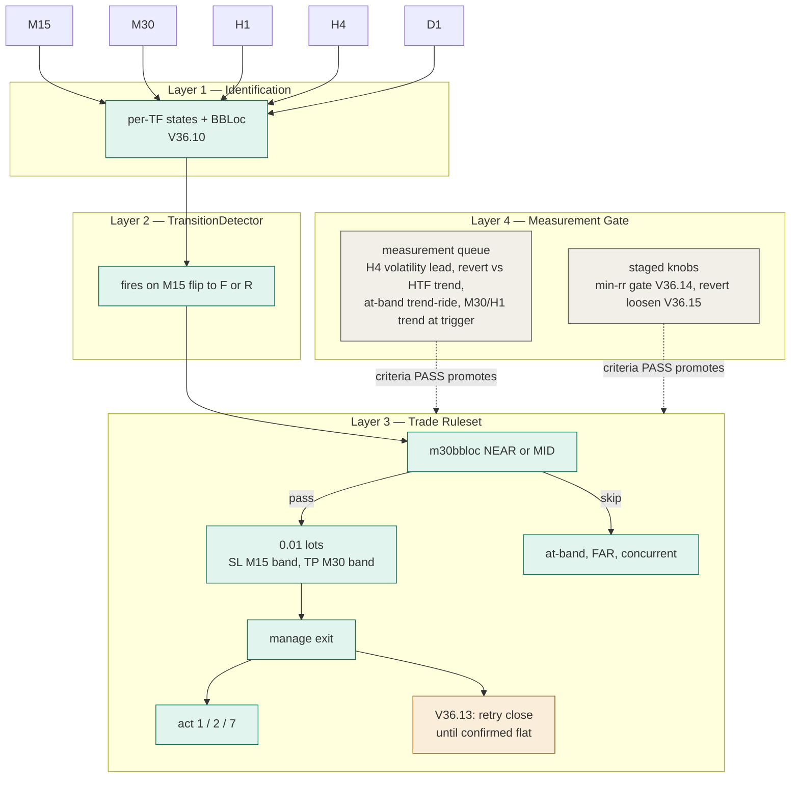

*Legend: teal = built, amber = in-flight, gray = gated (measurement required before promotion).*

### TF Roles (measured inventory)

| TF | Role | Notes |
|----|------|-------|
| M15 | Trigger + SL price + revert exit | Leading-edge signal for detection and timing |
| M30 | Gate location + TP price + timeout disarm | Never used for trend — gate and target only |
| H1 | Layer 1 logging only | Zero decision role |
| H4 | Layer 1 logging only | Zero decision role |
| D1 | Layer 1 logging only | Zero decision role |

**Dead roles (killed by measurement):**

| Dead Role | Kill Numbers | Source |
|-----------|-------------|--------|
| HTF entry filter (agreeing vs disagreeing) | 33.0% vs 35.9% — no effect | CASCADE_LEAD_ANALYSIS.md |
| H4-band TP target | 24.4% reach from MID+FAR | TARGET_REACH_ANALYSIS.md |
| Tier-2 H1 cascade TP | 0.99x lift — below 1.0 | TIER2_REACH_ANALYSIS.md |
| MTF prediction | 1.2% coarse, 43.9% fine (invalidated), multi-input worse | MULTIINPUT_PREDICTION_ANALYSIS.md |

---

## Three-Layer Overview

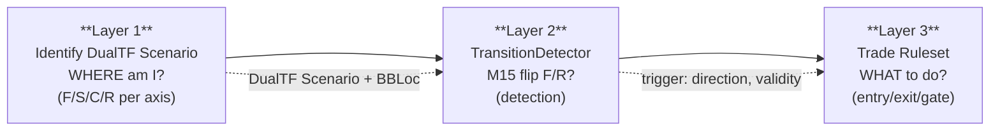

- **Layer 1 — Identify DualTF Scenario**: Given current BB state across all TFs, derive 4-state (F/S/C/R) per TF, then pair into HTF (D1×H4) and MTF (H1×M30) scenarios with per-TF BBLoc. Replaces the 7-scenario IdentifyScenario with the DualTF 4×4 derivation.
- **Layer 2 — TransitionDetector**: Detects M15 state flips to F (up) or R (down). No prediction — detection of real events. Fires trigger with 12-row validity window.
- **Layer 3 — Trade Ruleset**: Given trigger + m30bbloc zone, applies gate (NEAR/MID only) → entry → M30-band TP → stop → invalidation.

---

## TF Roles (cross-cut all layers)

These responsibilities are invariant across all three layers — they define what each TF contributes to the DualTF system.

| TF | Role | Layers that consume |
|----|------|---------------------|
| D1 | HTF axis (with H4) — sets macro direction, fork-decider for compression breakout | L1 (HTF scenario), L3 (directional a priori) |
| H4 | HTF axis (with D1) — primary HTF classifier, phase context | L1 (HTF scenario), L3 (confinement check) |
| H1 | MTF axis (with M30) — the leg ridden, primary trend driver | L1 (MTF scenario), L3 (confinement) |
| M30 | MTF axis (with H1) — MTF confinement check | L1 (MTF scenario), L3 (confinement) |
| M15 | Leading-edge — feeds Part 4 TransitionDetector AND Part 5 entry/exit timing | L2 (leading-edge signal), L3 (entry/exit trigger) |
| M5 | Optional within-M15-bar refinement — NOT a standalone trigger | L3 (tick refinement only, after M15 confirms) |

**Key difference from 7-scenario system:** M15 is no longer just an entry trigger — it is the PRIMARY detection signal (Part 4) and the PRIMARY entry/exit timing trigger. M5 is NOT a standalone trigger — optional within-M15-bar refinement only after M15 confirms. The HTF axis (D1×H4) provides context but has no filter role (HTF filter killed by measurement).

---

## Evolution + Falsification UML

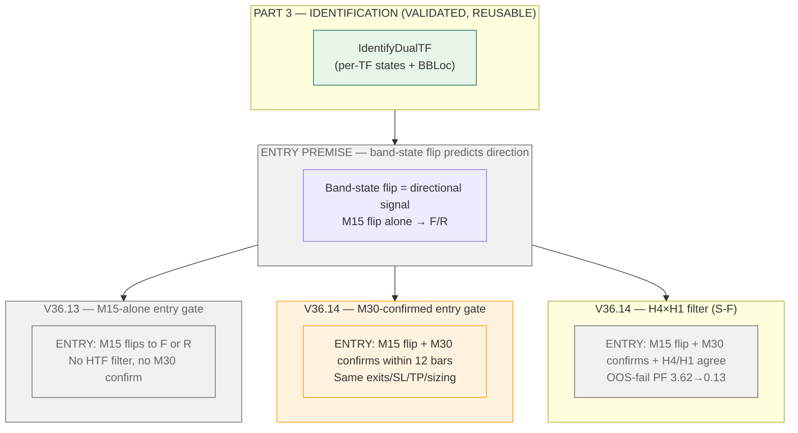

**The diagram shows:** Part 3 identification (VALIDATED, reusable) feeding the entry premise, then the premise branching into the three tested variants — M15-alone (V36.13), M30-confirmed (V36.14), and H4×H1 filter (V36.14 S-F). All three terminate in their OOS verdict nodes (all REJECTED/DEAD). Part 3 alone survives; the shared dead core is the band-state flip premise.

---

## Part 3 — Layer 1: Identify DualTF Scenario (BUILT & BACKTESTED)

### 3.1 Interface — Class/Struct Diagram

This diagram shows the DualTF data structures: what Layer 1 reads (per-TF BB data) and what it returns (DualTFScenarioState). This replaces the ScenarioState struct from the 7-scenario system.

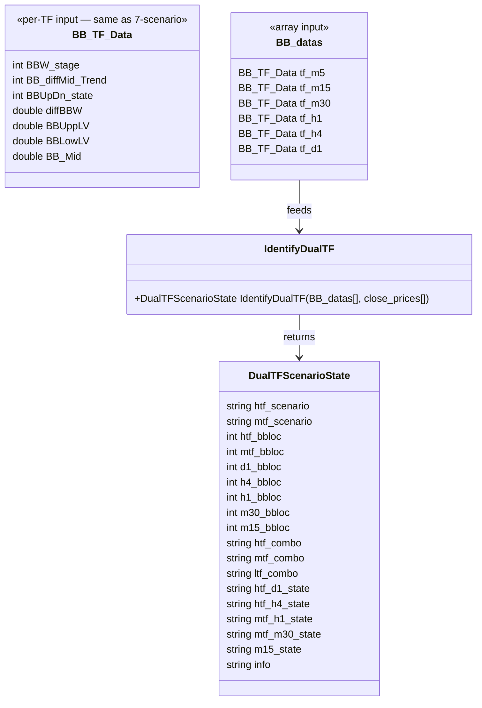

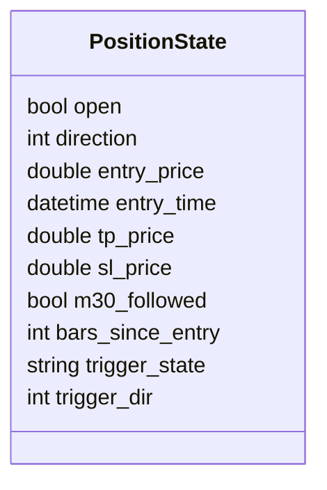

> **Note:** PositionState fields match TofyTrade6.mqh V36.12 struct. An `exit_pending` field (bool) is part of V36.13 IN-FLIGHT — not yet present in the committed struct.

**Field meanings (DualTFScenarioState):**

| Field | Type | Meaning | Consumed by |
|-------|------|---------|-------------|
| `htf_scenario` | string | HTF 2-char code (D1-state)(H4-state), e.g. "FS" = D1 fly-up, H4 shrinking | L2, L3 |
| `mtf_scenario` | string | MTF 2-char code (H1-state)(M30-state), e.g. "FC" = H1 fly-up, M30 compress | L2, L3 |
| `htf_bbloc` | int | HTF band location 0-10 (legacy, kept for compat) | L3 |
| `mtf_bbloc` | int | MTF band location {0,1,3,5,7,9,10} (legacy, kept for compat) | L3 |
| `d1_bbloc` | int | D1 per-TF band location 0-10 (V36.05+) | L2, L3 |
| `h4_bbloc` | int | H4 per-TF band location 0-10 (V36.05+) | L2, L3 |
| `h1_bbloc` | int | H1 per-TF band location sparse (V36.05+) | L2, L3 |
| `m30_bbloc` | int | M30 per-TF band location sparse (V36.05+) | L2, L3 |
| `m15_bbloc` | int | M15 per-TF band location sparse (V36.05+) | L2, L3 |
| `htf_combo` | string | HTF paired combo string, e.g. "F3F5" (V36.05+) | L2, L3 |
| `mtf_combo` | string | MTF paired combo string, e.g. "F3F5" (V36.05+) | L2, L3 |
| `ltf_combo` | string | LTF combo string, e.g. "F3" (V36.05+) | L2, L3 |
| `htf_d1_state` | string | D1 raw 4-state: F/S/C/R | L2 (HTF fork-decider) |
| `htf_h4_state` | string | H4 raw 4-state: F/S/C/R | L2 (HTF fork-decider) |
| `mtf_h1_state` | string | H1 raw 4-state: F/S/C/R | L2, L3 |
| `mtf_m30_state` | string | M30 raw 4-state: F/S/C/R | L2, L3 |
| `m15_state` | string | M15 leading-edge state: F/S/C/R | L2 (leading-edge input), L3 (trigger) |
| `info` | string | Human-readable reason string | logging |

> **Note:** BBW_stage mapping to F/S/C/R: 511,512 → F; 521,522 → R; 513,523 → S; 400-499 → C. Same as DUALTF_IMAGE_ANALYSIS.md Part 1.

### 3.2 Control Flow — Activity Diagram

This flowchart shows the derivation order: per-TF BBW_stage → F/S/C/R state, then D1×H4 → HTF pair, H1×M30 → MTF pair, then BBLoc computation.

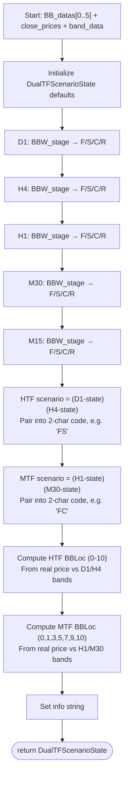

**Derivation order:** Per-TF states first (independent, parallel), then axis pairing (HTF from D1×H4, MTF from H1×M30), then BBLoc (real-time price-vs-band computation — EA advantage over analysis-side coarse BBUpDn mapping).

### 3.3 Scenario State Machine — State Diagram

The 4-state cycle: F → S → C → {F or R}, with persistence at each state.

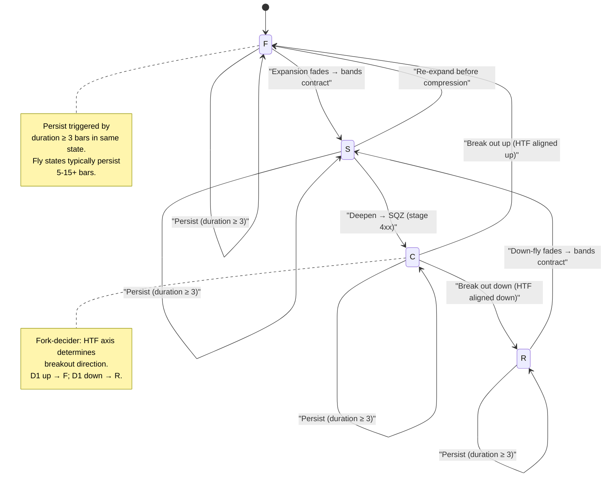

**Contract established:** The 4-state machine flows F → S → C → {F or R}, with R symmetric to F (R → S → C → {R or F}). Each state can persist (duration ≥ 3 bars). The HTF axis determines the C → {F or R} fork: D1 up → F (continuation), D1 down → R (reversal). This replaces the 7-scenario state machine in ARCHITECTURE.md §3.3.

### 3.4 BBLoc Computation

**EA advantage over analysis side:** The EA computes real band position from price vs band data. The analysis side uses coarse BBUpDn mapping (only {1,2,3,5} reachable). The EA has access to `BBUppLV`, `BBLowLV`, and `BB_Mid` per TF — it can compute exact position.

**HTF BBLoc (0-10, continuous scale):**

```
htf_bbloc = (price - band_low) / (band_up - band_low) * 10
```

Anchors: 0 = below lower band, 5 = at mid, 10 = above upper band.
Shared anchors with MTF: 1 = lower band, 5 = mid, 9 = upper band.

**MTF BBLoc (sparse scale: 0, 1, 3, 5, 7, 9, 10):**

Same formula, but the scale is sparse — mirroring the BBUpDn reachability gap.
Anchors: 0 = below lower, 1 = lower band, 3 = lower-mid, 5 = mid, 7 = upper-mid, 9 = upper band, 10 = above upper.
Gaps at 2, 4, 6 reflect the same coarse-data limit as the analysis side — the EA inherits the gap from the BBUpDn mapping that defines the state boundaries.

**Key advantage:** The EA's BBLoc is real (from price/band computation), not inferred from BBUpDn. This means levels 0, 2, 4, 6, 8 are reachable — the trajectory is continuous, not gapped. The MTF sparse scale is a design choice (matching the analysis side for consistency), not a data limitation.

**Band-position ladder:**

```
HTF BBLoc (0-10) — price position in the Bollinger bands:

   10  ── over BB Upper
──────── 9   BB Upper band
    8   ── between Upper and Upper-Mid
──────── 7   BB Upper-Mid
    6   ── between Upper-Mid and Mid
──────── 5   BB Mid band
    4   ── between Mid and Lower-Mid
──────── 3   BB Lower-Mid
    2   ── between Lower-Mid and Lower
──────── 1   BB Lower band
    0   ── below BB Lower

MTF BBLoc (sparse 0,1,3,5,7,9,10) — same anchors, coarser:
   1=Lower, 3=Lower-Mid, 5=Mid, 7=Upper-Mid, 9=Upper, 0=below, 10=above
```

**Computation flowchart:**

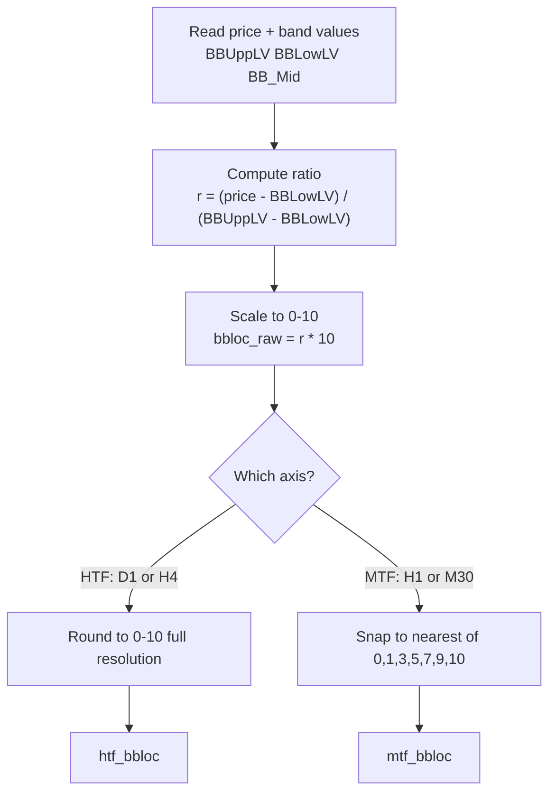

### 3.4a Per-Bar Runtime Sequence — TofyTrade6.mqh (V36.10)

This sequenceDiagram traces the actual function call flow in TofyTrade6.mqh per bar.
Each participant is a real function; each message is a real call.

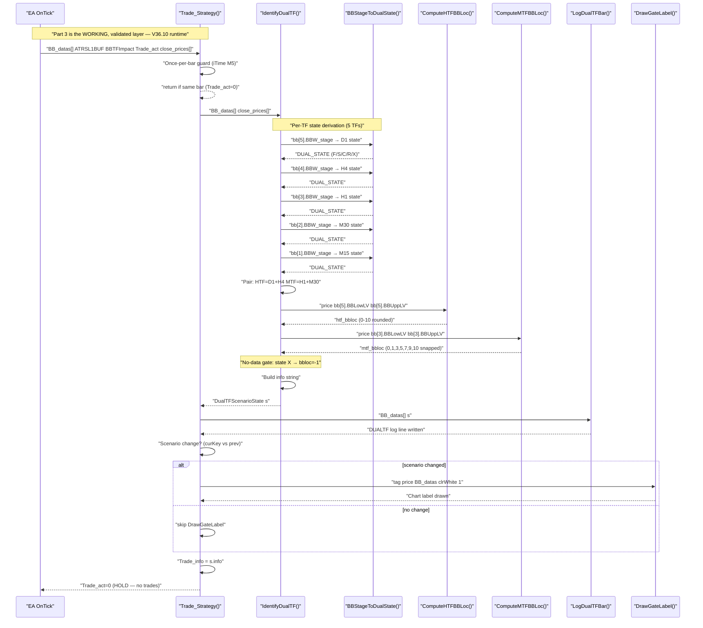

**What this shows:** Per tick, the EA calls `Trade_Strategy()` which gates on once-per-bar. Inside: `IdentifyDualTF()` derives per-TF states via `BBStageToDualState()` (5 calls: D1/H4/H1/M30/M15), pairs HTF/MTF scenarios, computes real BBLoc via `ComputeHTFBBLoc()`/`ComputeMTFBBLoc()`, applies the no-data gate (state X → bbloc=-1), and returns `DualTFScenarioState`. The caller logs via `LogDualTFBar()`, draws a chart label only on scenario change via `DrawGateLabel()`, then returns `Trade_act=0` — no trades. This is the live V36.10 flow.

### 3.5 Build Status

| Component | Status | Detail |
|-----------|--------|--------|
| 4-state derivation (BBW_stage → F/S/C/R) | **BUILT** | BBStageToDualState(), V36.10 |
| HTF pairing (D1×H4) | **BUILT** | htf_combo (e.g. "F3F5"), V36.10 |
| MTF pairing (H1×M30) | **BUILT** | mtf_combo, V36.10 |
| BBLoc computation | **BUILT** | ComputeHTFBBLoc/ComputeMTFBBLoc, per-TF (d1_bbloc/h4_bbloc/h1_bbloc/m30_bbloc/m15_bbloc), V36.10 |
| M15 leading-edge state | **BUILT** | Same derivation as other TFs, V36.10 |

> **BUILT & BACKTESTED.** TofyTrade6.mqh V36.10, backtests V36.01–V36.10, 7,608 DUALTF log rows verified.

---

## Part 4 — Layer 2: TransitionDetector (MEASURED-VIABLE)

> **STATUS: MEASURED-VIABLE (tested).** Detection-based approach grounded in data.
> TransitionDetector fires on actual M15 state flips to F (up) or R (down) —
> not a forecast, a detection. Grounding citation: CASCADE_LEAD_ANALYSIS.md.

### SUPERSEDED — Prediction (retained as evidence trail)

> **PREDICTION IS DEAD.** Coarse data: 1.2% transition accuracy. Fine BBLoc:
> 43.9% OOS (BBLoc-only, best predictor — and that number was later invalidated:
> it was measured on H1-predicts/M30-verifies inconsistent logic, fixed in V36.06,
> consistent version never re-measured). Multi-input WORSE + overfit (40.8%→35.3%).
> See MULTIINPUT_PREDICTION_ANALYSIS.md for the full failure anatomy.
> The design below (4.1–4.2a, 4.2c–4.2d) is retained as historical record.

### 4.1 TransitionDetector — Definition

**Detection, not prediction.** The TransitionDetector fires on actual M15 state
flips — real events, not forecasts.

- **FIRES** on M15 state flip to F (up trigger) or R (down trigger) ONLY.
  S/C flips excluded — lift 1.26x/1.07x, no edge.
- **NO HTF filter** — killed by measurement (agreeing 33.0% vs disagreeing 35.9%).
- **Measured stats** (K=12, CASCADE_LEAD_ANALYSIS.md):
  - Recall: 57.2% (294/514 M30 transitions preceded by same-target M15 flip)
  - Precision: F 38.0% (93/245), R 32.9% (83/252)
  - Lift: F 2.03x, R 2.01x (over unconditional base rate)
  - Median lead: 5 rows (25 minutes)
  - Validity window: 12 rows (60 minutes)
- **Output:** trigger {direction, fire-time, 12-row validity window} → Part 5.
- **Existing prediction fields** (pred_direction, predmtf, slope, predhit)
  remain **LOG-DIAGNOSTIC ONLY** — never trade inputs.

### 4.2 TransitionDetector Flowchart

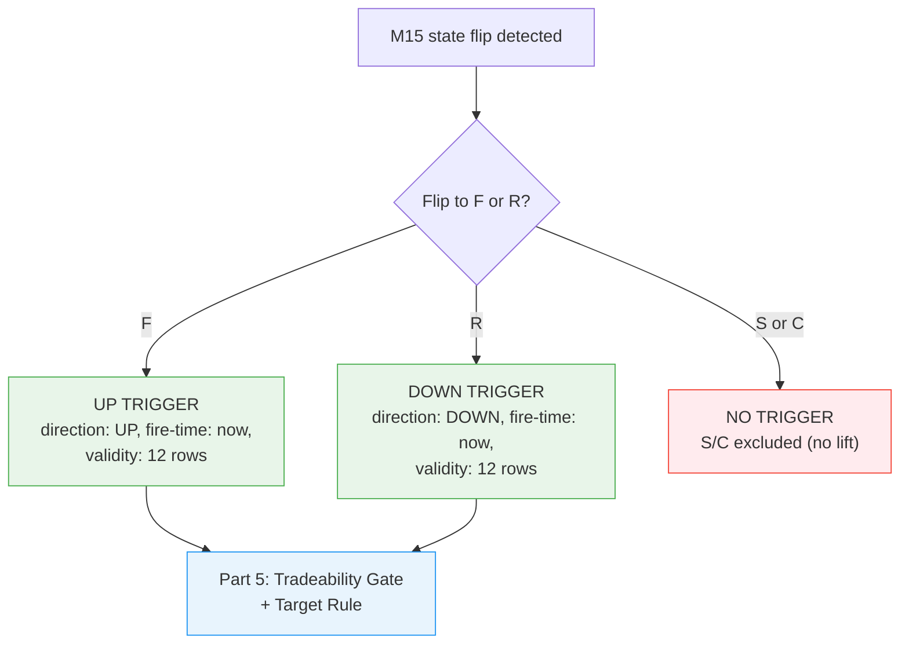

**What this shows:** The TransitionDetector detects real M15 flips — no forecast, no
rolling buffer, no prediction. It fires on F/R flips only (S/C excluded by lift
measurement). The trigger carries direction, fire-time, and a 12-row validity window.
Existing prediction fields (slope, pred_direction, predhit) are log-diagnostics only.

### 4.3 Build Status

| Component | Status | Detail |
|-----------|--------|--------|
| TransitionDetector (M15 F/R flip detection) | **MEASURED-VIABLE** | 57.2% recall, 2.03x/2.01x lift, CASCADE_LEAD_ANALYSIS.md |
| HTF filter | **KILLED** | Agreeing 33.0% vs disagreeing 35.9% — no effect |
| S/C flip detection | **KILLED** | Lift 1.26x/1.07x — no edge |
| Prediction fields (slope, pred_direction, predhit) | **LOG-DIAGNOSTIC** | Never trade inputs |

> **Measured-viable, not yet implemented as detector.** The cascade lead measurement
> grounds the TransitionDetector design (CASCADE_LEAD_ANALYSIS.md, commit 623f38d).
> Existing prediction stubs in TofyTrade6.mqh return persist with confidence=0.

---

## Part 5 — Layer 3: Measured v1 Trade Ruleset (DESIGN)

### 5.1 Trade Rules — Measured

**ENTRY:** On TransitionDetector trigger, enter in the flip direction (UP = BUY, DOWN = SELL).

**TRADEABILITY GATE:** m30bbloc at trigger row must be NEAR or MID —
UP: {5, 7}; DOWN: {3, 5} on the sparse scale.
**SKIP** AT/BEYOND (M30-band TP incoherent there; tier-2 H1 cascade DEAD — lift 0.99x;
TIER2_REACH_ANALYSIS.md) and **SKIP** FAR (6/45 = 13% follow).

**TAKE-PROFIT:** M30 band — 98.1% reach from NEAR+MID on the FOLLOWED subset,
61–72% reach on ALL triggers at N=12 (TARGET_REACH_ANALYSIS.md).
H4 target DEAD: C1 FAIL 24.4% reach from MID+FAR.

**STOP (v1 DEFAULT — LEAST-GROUNDED parameter, unmeasured):**
Opposite-side M15 band at entry.
Alternatives: opposite M30 band, fixed price offset.
**REQUIREMENT:** V36.11 must log per-trade stop and TP distances in PRICE
so the Tester adjudicates.

**INVALIDATION/EXIT:** M15 state reverts to non-trigger state,
OR 12 rows elapse without M30 reaching the trigger state → close.

**SIZING:** Fixed 0.01 lots (v1).

**FREQUENCY:** ~230 qualifying triggers / 4 months ≈ 2.7 per trading day.

**EXPECTANCY WARNING:** Follow-rate is not win-rate. The kept NEAR/MID population
follows at only 23% (54/230) vs 52% for the skipped at-band majority.
Reach is not profit — no stops or path analysis in any reach analysis.
Profitability is decided ONLY by the V36.11 Tester report.
RR must clear ~2:1 for the geometry to work.

### 5.2 Control Flow — Activity Diagram

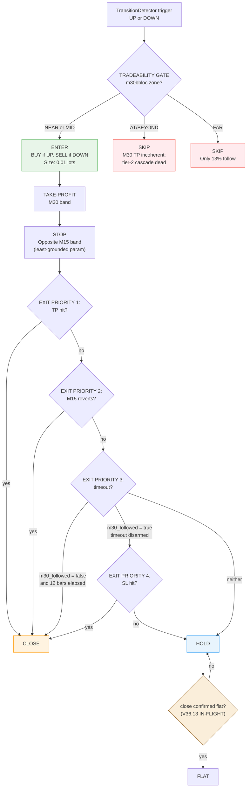

**What this shows:** Trigger → gate (zone check) → entry + TP + stop → invalidation paths.
Two skip paths (AT/BEYOND and FAR) handle the majority of triggers.
The gate keeps only the NEAR/MID minority where the M30-band TP is coherent.

### 5.2a Position Lifecycle — State Diagram (V36.13 IN-FLIGHT)

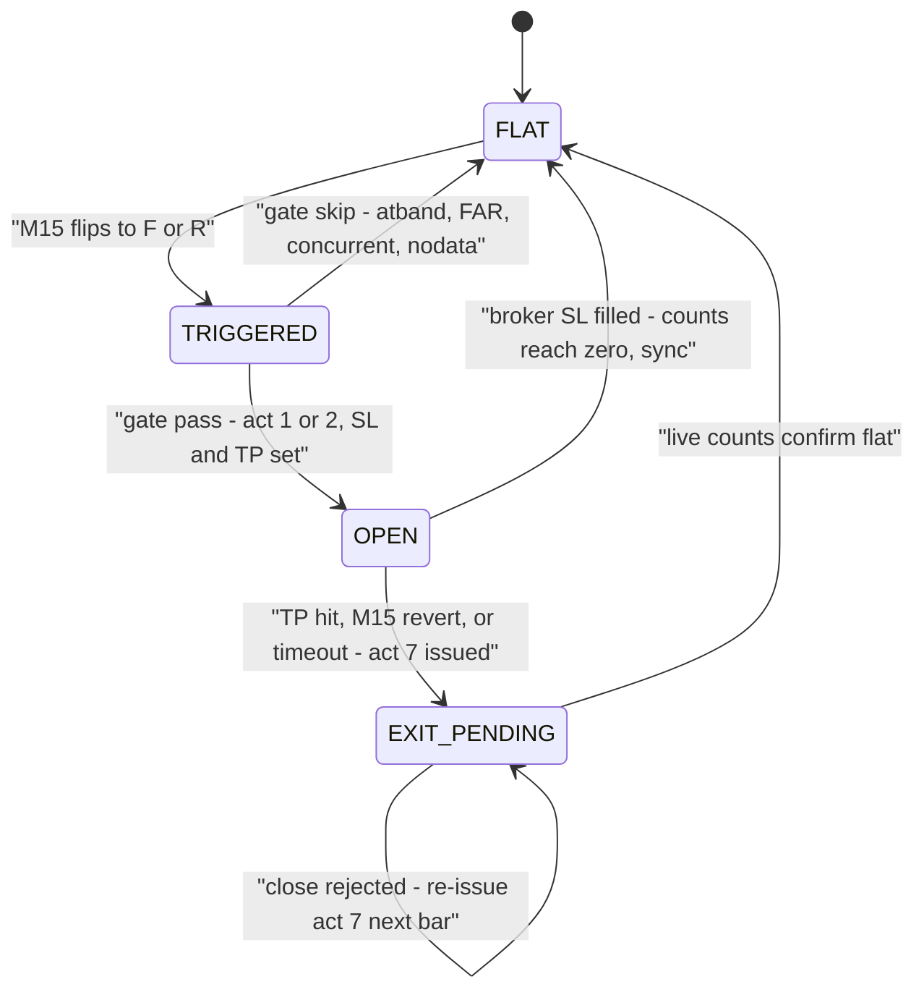

> **Note:** EXIT_PENDING retry loop is V36.13 IN-FLIGHT. Entries are blocked while OPEN or EXIT_PENDING (one position at a time). Pre-V36.13 the EXIT_PENDING state did not exist — a rejected close orphaned the position (the 2026.01.14 ERROR 4756 case).

### 5.2b Per-Bar End-to-End Flow — Sequence Diagram

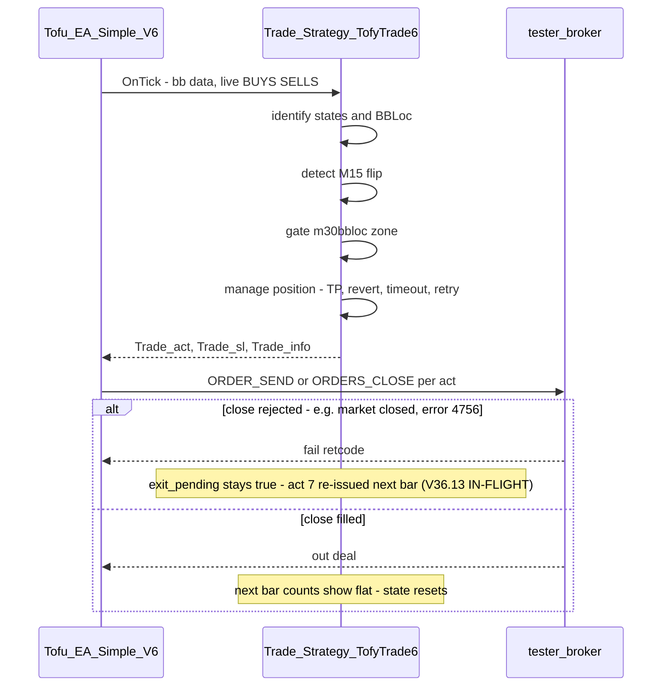

### 5.3 Build Status

| Component | Status | Detail |
|-----------|--------|--------|
| Tradeability gate (NEAR/MID only) | **DESIGN** | Measured: 230 qualifying triggers / 4 months |
| Take-profit (M30 band) | **DESIGN** | 98.1% reach NEAR+MID FOLLOWED; 61-72% ALL at N=12 |
| Stop (opposite M15 band) | **DESIGN** | Least-grounded parameter — unmeasured |
| Invalidation (M15 revert or 12 rows) | **DESIGN** | From cascade validity window |
| Sizing (0.01 lots) | **DESIGN** | Fixed v1 |

> **DESIGN — measured rules, unimplemented.** The rules are grounded in four
> committed analyses (CASCADE_LEAD, TARGET_REACH, TIER2_REACH, MULTIINPUT_PREDICTION).
> The stop parameter is the least-grounded — V36.11 price logs decide.

---

## Cross-Layer Data Flow — Sequence Diagram

Per-bar L1→L2→L3: Identify → Detect → Act, showing what each layer passes to the next.

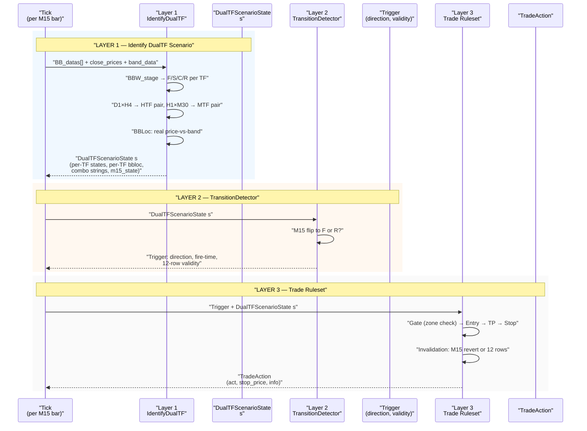

**Data flow summary:**
- **L1 → L2:** DualTFScenarioState (per-TF states, per-TF bbloc, combo strings, m15_state)
- **L2 → L3:** Trigger (direction, fire-time, 12-row validity window)
- **L3 output:** TradeAction (act, stop_price, info) — drives OrderSend/OrderClose

---

## Analysis-side vs EA-side — Comparison

| Capability | Analysis side | EA side |
|------------|--------------|---------|
| BBLoc | Coarse {1,2,3,5} from BBUpDn mapping | Real 0-10 from price/band computation |
| Prior-state scenarios (R2/R3, P, V3/V4, B3) | Undetectable (single snapshot, no history) | Detectable (rolling buffer tracks full trajectory) |
| Detector trigger | M15 flip from log (post-hoc) | Real-time M15 flip detection |
| Validation | CASCADE_LEAD_ANALYSIS (7,608 rows) | Live forward-test on transitions |
| Per-TF BBLoc | Not available (V36.02 and earlier) | Per-TF bbloc (V36.05+) — d1_bbloc, h4_bbloc, h1_bbloc, m30_bbloc, m15_bbloc |
| M15 leading-edge | Coarse BBUpDn mapping only | Real BBLoc + state from price/band |

> **The EA is the REAL test of the DualTF detector.** The analysis side operates on coarse, static data (BBUpDn mapping, single snapshot). The EA has real-time, continuous data (price-vs-band, per-TF bbloc). The CASCADE_LEAD_ANALYSIS (7,608 rows) grounds the TransitionDetector — the EA's forward-test on live data is the true measure.

---

## Blocker Integration & Build Phases

The s_prevH1Sqz timing bug fix + scenario rename + V31.06 backtest promotion baseline
was claimed as a blocker for DualTF — **FALSIFIED**. DualTF was built and backtested
independently (V36.01–V36.10) without that baseline. That baseline gates promotion of
the OLD 7-scenario system only; DualTF is independent.

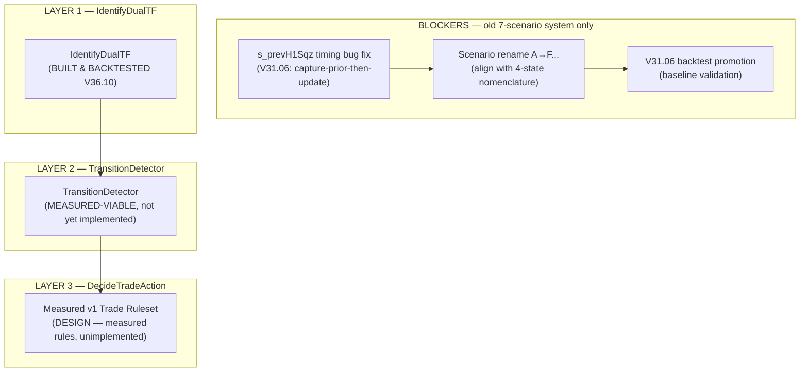

**Phase list:**

| Phase | Task | Status |
|-------|------|--------|
| 0 | s_prevH1Sqz fix (V31.06) + scenario rename + backtest promotion | **OLD SYSTEM ONLY** — DualTF independent |
| 1 | Build IdentifyDualTF (per-TF derivation, HTF/MTF pairing, BBLoc) | **BUILT** — V36.10 |
| 2 | Build TransitionDetector (M15 flip detection, F/R only) | MEASURED-VIABLE |
| 3 | Build DecideTradeAction (measured rules: gate, TP, stop, invalidation) | DESIGN |

---

## Open Questions / v2 Hypotheses

These are explicitly unmeasured — they follow from the analysis but need their own
measurement before design work.

### TofySideway filter (untested)

See SIDEWAY_ARCHITECTURE.md for the sideways-classification detector. TofySideway
is a candidate FILTER for the (now-closed) DualTF entry or any future premise, and
its trading value is UNTESTED.

### AT-Band Trend-Ride (v2 candidate — highest priority)

The skip rule discards the HIGHEST-following triggers: the at-band majority follows
at 52% (116/222) vs 23% (54/230) for the kept NEAR/MID minority. A different trade
type may exist here — momentum entry, exhaustion exit. The H4-at-band hold rate is
65% (TARGET_REACH_ANALYSIS.md), and tier-3 H4 reach from the at-band population is
63–68% (TIER2_REACH_ANALYSIS.md). v2 needs its own target/exit measurement first.

### Stop-Source Comparison

Opposite M15 band vs opposite M30 band vs fixed price offset. Unmeasured — the
stop parameter is the LEAST-GROUNDED in the v1 ruleset. V36.11 price logs decide.

### M30→H1 Cascade for Trade Management

The tier-2 cascade died as a TP rule (lift 0.99x, T2-2 FAIL). But H1 reach as a
hold/scale signal — "ride through the M30 band toward H1" — is unmeasured.

### D1 as Persistence/Exhaustion Context

D1 as a macro context for trade duration (e.g., D1 fly-up = longer hold window)
is unmeasured. D1 is never a target — its role is confinement/exhaustion context.

### Sparse-BBLoc Quantization

The sparse bbloc scale (0,1,3,5,7,9,10) may overstate the 68.9%-flat-slope finding
from the prediction analysis. Noted, NOT a license to reopen prediction.

---

## V36.14 — M30-confirmed cascade entry (CLOSED)

> **STATUS: REJECTED.** Combined-clean OOS PF 0.71 (n=169); PRE 0.66, POST 0.88.
> The DualTF band-state entry is CLOSED at all confirmation levels.

### What changed vs V36.13

- Entry gate now requires M30 to flip to the trigger direction within 12 bars of the M15 flip (confirmation), instead of M15-alone. Exits/SL/TP/sizing unchanged.

### Measured result table

| Confirmation level | Source report | OOS PF (n) | Verdict |
|--------------------|----------------|------------|---------|
| M15-alone (V36.13) | V36_13_DISSECTION.md | -0.5 pp, NOT-SEPARABLE | REJECTED |
| H4xH1 filter (S-F) | SF_FORWARD_TEST.md | PF 0.13 (n=26) | REJECTED |
| M30-confirmed (V36.14) | V36_14_FORWARD.md | PF 0.71 (n=169) | REJECTED |

One row per confirmation level, each with its verdict. The failure is the PREMISE (band-state flip predicts direction), not the timing. No further DualTF entry variant is pursued.

---

## Evidence Index

| Hypothesis / Finding | Analysis File | Commit | Verdict |
|---------------------|---------------|--------|---------|
| Cascade lead (M15 flip → M30 transition) | CASCADE_LEAD_ANALYSIS.md | 623f38d | **VIABLE** — 57.2% recall, 2.03x/2.01x lift, median 5 rows |
| M30-band TP (NEAR+MID) | TARGET_REACH_ANALYSIS.md | 3a0ea21 | **VIABLE** — 98.1% reach NEAR+MID FOLLOWED |
| H4-band TP (MID+FAR) | TARGET_REACH_ANALYSIS.md | 3a0ea21 | **DEAD** — C1 FAIL 24.4% |
| Tier-2 H1 cascade | TIER2_REACH_ANALYSIS.md | 53cb2eb | **DEAD** — T2-2 FAIL 0.99x lift |
| HTF filter (agreeing vs disagreeing) | CASCADE_LEAD_ANALYSIS.md | 623f38d | **DEAD** — 33.0% vs 35.9%, no effect |
| Multi-input prediction | MULTIINPUT_PREDICTION_ANALYSIS.md | 623f38d | **DEAD** — 43.9% OOS, overfit 40.8%→35.3% |
| Zone gate (FAR skip) | TARGET_REACH_ANALYSIS.md | 3a0ea21 | **VIABLE** — FAR follow 13% (6/45) |
| AT-band hold rate (H4) | TARGET_REACH_ANALYSIS.md | 3a0ea21 | **VIABLE** — 65% ride rate |
| V36.14 M30-confirmed entry | V36_14_FORWARD.md | b194c56 | **REJECTED** PF 0.71 OOS |

DualTF-entry line: **CLOSED** — all three entry-timing variants (M15-alone, HTF-filtered, M30-confirmed) failed out-of-sample. The failure is the PREMISE (band-state flip predicts direction), not the timing. Part 3 IDENTIFICATION survives as reusable.
