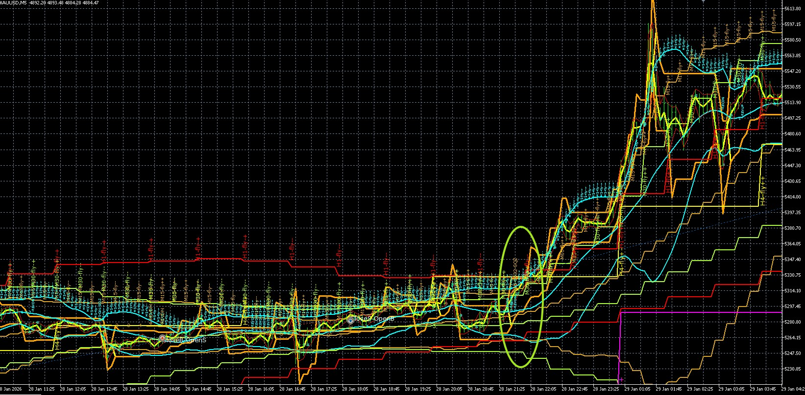
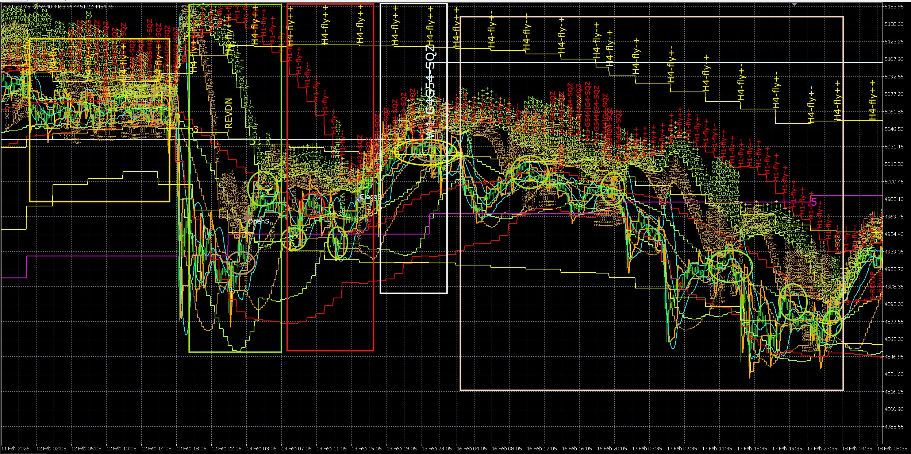
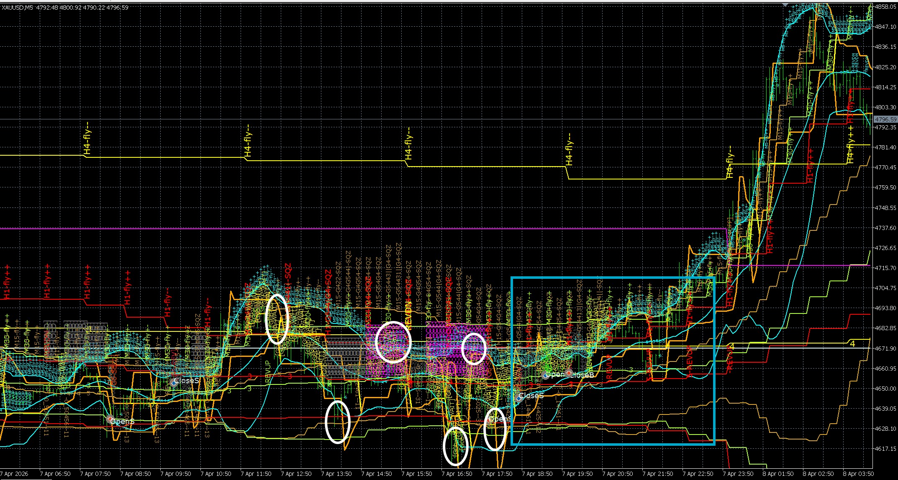

# DualTF Stack Chart Analysis — DESIGN (UNBUILT, UNVALIDATED, Phase-3)

> **A 4-state x 2-axis scenario model with band-location tracking. NOT implemented
> in code, NOT validated. Depends on the EA baseline (V31.06) blocker.**

---

## Part 1 — State Machine

### The 4-State Cycle

```
  F (Fly Up)  <-->  S (Shrink)  <-->  C (Compress)
       ^                                    |
       |                                    v
  +----+------------------------------- R (Fly Down)
  |
  +---- (or F again — continuation)
```

**Symmetric:** from R, the cycle is R -> S -> C -> {R or F}.

- **F** = Fly Up — trend expansion in the upward direction.
- **S** = Shrink — bands contracting, volatility compressing.
- **C** = Compress — deep compression (SQZ, stage 4xx), coiled.
- **R** = Fly Down — trend expansion in the downward direction. **R is down-fly,
  NOT a separate reversal event — it is the symmetric counterpart of F.**

F and R are the two trend **directions**; S and C are the two compression
**stages**. The cycle flows: F -> S -> C -> {F (continuation) or R (reversal)}.

### BBW_stage to State Mapping

| BBW_stage | State | Meaning |
|-----------|-------|---------|
| 511, 512  | F     | Fly Up |
| 521, 522  | R     | Fly Down |
| 513, 523  | S     | Shrink |
| 400-499   | C     | Compress (SQZ) |

---

## Part 2 — The 4x4 Matrix

Each TF independently occupies one of 4 states (F, S, C, R). A scenario is
the cross-product of two TFs.

### HTF Axis: D1 x H4

The HTF scenario is a 2-letter code: (D1-state)(H4-state).

| 1st\2nd | F (up) | S | C | R (down) |
|---------|--------|---|---|----------|
| **F (up)**  | FF | FS | FC | FR |
| **S**       | SF | SS | SC | SR |
| **C**       | CF | CS | CC | CR |
| **R (down)**| RF | RS | RC | RR |

**Example:** "FS" = D1 fly-up, H4 shrinking.

### MTF Axis: H1 x M30

The MTF scenario is a 2-letter code: (H1-state)(M30-state).

**Example:** "FC" = H1 fly-up, M30 compress.

### Full HTF x MTF Combination

A complete picture = (HTF scenario) x (MTF scenario), e.g. "HTF=FS x MTF=FC"
means: D1 fly-up, H4 shrinking, H1 fly-up, M30 compress.

---

## Part 3 — BBLoc (Band Location)

### 7-Level Scale (0-6)

| BBLoc | Zone | Description |
|-------|------|-------------|
| 0     | Below Lower | Price below lower band |
| 1     | At Lower | Price at lower band |
| 2     | Lower-Mid | Price between lower band and mid |
| 3     | Mid | Price at BBmid |
| 4     | Upper-Mid | Price between mid and upper band |
| 5     | At Upper | Price at upper band |
| 6     | Above Upper | Price above upper band |

### Combined Notation with BBLoc

Each scenario letter carries its TF's BBLoc as a subscript/number:

**HTF scenario with BBLoc:** `F{D1-bbloc}{H4-state}{H4-bbloc}`
- D1 fly-up at upper (5), H4 compress at mid (3) -> **F5C3**
- D1 shrink at lower-mid (2), H4 fly-down at upper (5) -> **S2R5**

**MTF scenario with BBLoc:** same pattern for H1/M30
- H1 fly-up at upper-mid (4), M30 shrink at mid (3) -> **F4S3**
- H1 compress at lower (1), M30 fly-down at below-lower (0) -> **C1R0**

### Worked Example

Given: D1=511-1-1 (fly-up, upper), H4=413-3-0 (compress, between),
H1=512-1-3 (fly-up, sideways), M30=513-1-2 (shrink, lower).

- D1 state = F, BBLoc APPROX 5 (BBUpDn=1 -> at upper)
- H4 state = C, BBLoc APPROX 3 (BBUpDn=0 -> mid)
- H1 state = F, BBLoc APPROX 3 (BBUpDn=3 -> mid)
- M30 state = S, BBLoc APPROX 1 (BBUpDn=2 -> at lower)

**HTF scenario:** F5C3  (D1 fly-up@upper, H4 compress@mid)
**MTF scenario:** F3S1  (H1 fly-up@mid, M30 shrink@lower)
**Full label:** HTF=F5C3 x MTF=F3S1

### BBLoc Source — APPROX Mapping from BBUpDn

> **WARNING: BBLoc is APPROX, not exact.** The log does not contain PriceLoc
> per TF (only in EA runtime as a container-relative field, not logged per TF).
> BBLoc is inferred from BBUpDn_state using the mapping below. The 7-level
> scale (0-6) cannot be fully resolved from BBUpDn (4 values) — only 3 of 7
> zones are reachable. Edge zones (0, 4, 6) require price-vs-band data not
> available in the log for HTF TFs.

**BBUpDn -> BBLoc mapping (APPROX):**

| BBUpDn | Meaning | BBLoc | Rationale |
|--------|---------|-------|-----------|
| 0      | between | 3     | Price between bands -> mid |
| 1      | upper   | 5     | Price at upper band -> at upper |
| 2      | lower   | 1     | Price at lower band -> at lower |
| 3      | sideways | 3    | Price consolidating -> mid |
| 4      | lower zone | 2  | Price in lower half of band -> lower-mid |

**Unreachable from log data:** BBLoc 0 (below lower), BBLoc 4 (upper-mid),
BBLoc 6 (above upper). These zones would require close-vs-UppLV-vs-LowLV
computation, which is available only for M15 in the log.

> For M15 specifically, the log includes `close_M15`, `MidLV_M15`, `UppLV_M15`,
> `LowLV_M15`. If finer BBLoc for M15 is needed, compute:
> `band = (UppLV - LowLV) / 2`, then position = `(close - MidLV) / band`.
> This yields BBLoc 0-6. Until then, M15 BBLoc also uses the coarse BBUpDn
> mapping for consistency.

---

## Part 4 — Predicting Next MTF Scenario

### Valid Next States from the Machine

Given the cycle F -> S -> C -> {F or R}, the valid next states from any
current state are:

| Current State | Valid Next States | Meaning |
|--------------|-------------------|---------|
| F (Fly Up)   | S | Compression beginning |
| S (Shrink)   | F, C | Re-expand up OR deepen compression |
| C (Compress) | F, R | Break out up OR break out down |
| R (Fly Down) | S | Compression beginning |

For a 2-TF MTF scenario, each TF transitions independently:

**Example:** MTF = FC (H1=fly-up, M30=compress)
- H1 (F) can go to: S
- M30 (C) can go to: F, R
- Valid next MTF scenarios: SF (H1->S, M30->F), SR (H1->S, M30->R)

### Prediction via BBLoc + Trend History

BBLoc trajectory across recent rows predicts **which** next state and the
**next BBLoc**:

| Signal | Prediction | Confidence |
|--------|-----------|------------|
| BBLoc climbing (3->4->5) during compress | Continuation (FF) at high BBLoc | Medium-High |
| BBLoc at upper (5) during compress | Break out up (FF) likely | Medium |
| BBLoc rolling over from upper (5->4->3) | Possible reversal (FR) | Medium |
| BBLoc at lower (1) during compress | Break out down (RR) likely | Medium |
| BBLoc flat at mid (3) during shrink | Indeterminate — wait for C | Low |
| BBLoc falling (5->3->1) during fly | Reversal to shrink then compress | Medium |

**Worked example:** MTF=FC, BBLoc climbing (3->4->5 over 3 rows) while H1
fly-up and M30 compress at upper -> predict next = SF (H1->shrink, M30->fly-up)
at high BBLoc, i.e., continuation upward. The compression at upper band
suggests upward breakout.

**Worked example:** MTF=FC, BBLoc rolling over (5->4->3) -> M30 compress at
mid after being at upper -> possible reversal. Predict next = SR (H1->shrink,
M30->fly-down) at lower BBLoc.

> **NOTE:** Real prediction needs the **sequence** (prior rows' BBLoc trend),
> which the analysis table provides. Predictions are reasoned-from-history
> with confidence levels, not deterministic.

---

## Part 5 — Analysis Tables - 

> **Cell = BBW-diffMid-BBUpDn** (e.g. 511-1-1). BBW: 511/512=up-fly,
> 521/522=down-fly, 513/523=shrink, 4xx=SQZ. diffMid: 1=up, 2=down,
> 3=sideways, 5=deep-sideways. BBUpDn: 0=between, 1=upper, 2=lower,
> 3=sideways. A new row is added only when M15 BBW_stage or diffMid changes.
> All rows fall within the user-defined period (from commit 8c164ac).
> State data extracted with fixed logic (commit b93d4b9).
> BBLoc derived via APPROX BBUpDn mapping (see Part 3).

---

### Image 1 Analysis — backtested_EA_fly_scenario.jpg


**Period:** 2026.02.02 13:10 -> 2026.02.10 08:10

| datetime | M15 | M30 | H1 | H4 | D1 | Scenario HTF (+BBLoc) | Scenario MTF (+BBLoc) | Trend/Tier |
|----------|-----|-----|----|----|----|----------------------|----------------------|------------|
| 2026.02.02 13:15 | 512-1-3 | 403-3-0 | 523-2-2 | 521-2-1 | 513-1-0 | S3R5 | S1C3 | Down (div) / Tier 1 |
| 2026.02.02 15:45 | 513-1-2 | 511-1-0 | 523-2-2 | 521-2-1 | 513-1-0 | S3R5 | S1F3 | Down (div) / Tier 1 |
| 2026.02.02 16:45 | 512-1-3 | 512-1-3 | 523-2-2 | 521-2-0 | 513-1-0 | S3R3 | S1F3 | Down (div) / Tier 1 |
| 2026.02.02 17:00 | 512-3-0 | 512-1-0 | 523-2-0 | 521-2-0 | 513-1-0 | S3R3 | S3F3 | Down (div) / Tier 1 |
| 2026.02.02 20:15 | 522-2-4 | 513-1-2 | 523-2-2 | 522-2-4 | 513-1-0 | S3R2 | S1S1 | Down (div) / Tier 1 |
| 2026.02.03 01:15 | 523-3-1 | 402-2-0 | 523-2-0 | 522-2-4 | 513-1-2 | S1R2 | S3C3 | Down (div) / Tier 1 |
| 2026.02.03 07:30 | 511-1-1 | 512-1-3 | 512-1-3 | 522-2-4 | 513-1-2 | S1R2 | F3F3 | Down (div) / Tier 1 |
| 2026.02.03 14:30 | 413-3-0 | 512-1-0 | 512-1-3 | 523-2-2 | 513-1-2 | S1S1 | F3F3 | Down (div) / Tier 2 |
| 2026.02.03 17:15 | 521-4-1 | 513-1-2 | 512-1-3 | 523-2-2 | 513-1-2 | S1S1 | F3S1 | Down (div) / Tier 2 |
| 2026.02.03 20:00 | 513-1-2 | 512-5-3 | 513-1-2 | 523-2-2 | 513-1-2 | S1S1 | S1F3 | Down (div) / Tier 2 |
| 2026.02.03 22:15 | 512-3-0 | 512-1-3 | 513-1-0 | 523-2-2 | 513-1-2 | S1S1 | S3F3 | Down (div) / Tier 2 |
| 2026.02.04 01:45 | 523-3-0 | 512-1-0 | 512-1-0 | 523-2-2 | 512-1-3 | F3S1 | F3F3 | Down (div) / Tier 2 |
| 2026.02.04 09:15 | 512-5-3 | 512-1-3 | 512-1-3 | 523-2-2 | 512-1-3 | F3S1 | F3F3 | Down (div) / Tier 2 |
| 2026.02.04 11:45 | 521-2-1 | 513-1-2 | 512-1-3 | 523-2-2 | 512-1-3 | F3S1 | F3S1 | Down (div) / Tier 2 |
| 2026.02.04 15:30 | 523-2-2 | 521-2-0 | 512-1-3 | 523-2-2 | 512-1-3 | F3S1 | F3R3 | Down (div) / Tier 2 |
| 2026.02.04 22:45 | 414-4-1 | 522-2-4 | 521-2-1 | 523-3-2 | 512-1-3 | F3S1 | R5R2 | Sideways / Tier 2 |
| 2026.02.05 04:15 | 403-3-1 | 523-2-2 | 522-2-4 | 523-1-0 | 512-1-3 | F3S3 | R2S1 | Up / Tier 2 |
| 2026.02.05 11:15 | 413-3-0 | 522-2-0 | 523-2-2 | 513-1-3 | 512-1-3 | F3S3 | S1R3 | Up / Tier 2 |
| 2026.02.05 18:30 | 523-2-2 | 522-2-4 | 521-2-0 | 513-1-2 | 512-1-3 | F3S1 | R3R2 | Up / Tier 2 |
| 2026.02.05 22:00 | 422-2-0 | 412-2-4 | 523-2-2 | 513-1-2 | 512-1-3 | F3S1 | S1C2 | Up / Tier 2 |
| 2026.02.06 04:00 | 523-2-2 | 522-2-4 | 521-2-0 | 513-1-2 | 513-1-2 | S1S1 | R3R2 | Up / Tier 2 |
| 2026.02.06 08:30 | 513-1-2 | 403-3-1 | 403-3-0 | 513-1-2 | 513-1-2 | S1S1 | C3C5 | Up / Tier 2 |
| 2026.02.06 13:30 | 511-1-1 | 403-1-2 | 403-1-1 | 513-1-2 | 513-1-2 | S1S1 | C5C1 | Up / Tier 2 |
| 2026.02.06 21:30 | 513-1-2 | 512-1-3 | 512-1-3 | 512-1-3 | 513-1-2 | S1F3 | F3F3 | Up / Tier 1 |
| 2026.02.09 02:45 | 512-1-3 | 511-1-1 | 401-1-3 | 512-5-0 | 513-1-0 | S3F3 | C3F5 | Sideways / Tier 1 |
| 2026.02.09 08:00 | 511-1-1 | 512-1-3 | 401-1-3 | 512-1-0 | 513-1-0 | S3F3 | C3F3 | Up / Tier 1 |
| 2026.02.09 12:00 | 511-5-1 | 513-3-4 | 401-1-2 | 512-3-0 | 513-1-0 | S3F3 | C1S2 | Sideways / Tier 1 |
| 2026.02.09 15:30 | 512-2-0 | 413-3-4 | 401-1-0 | 512-3-0 | 513-1-0 | S3F3 | C3C2 | Sideways / Tier 1 |
| 2026.02.09 17:00 | 511-1-1 | 423-3-1 | 401-1-3 | 523-2-2 | 513-1-0 | S3S1 | C3C5 | Down (div) / Tier 2 |
| 2026.02.09 23:15 | 512-3-0 | 512-1-3 | 511-1-1 | 523-3-0 | 513-1-0 | S3S3 | F5F3 | Sideways / Tier 2 |
| 2026.02.10 06:00 | 523-3-0 | 413-2-4 | 512-1-0 | 511-1-1 | 512-1-3 | F3F5 | F3C2 | Up / Tier 1 |
| 2026.02.10 07:00 | 513-4-0 | 413-2-4 | 512-5-0 | 511-1-1 | 512-1-3 | F3F5 | F3C2 | Up / Tier 1 |
| 2026.02.10 07:15 | 523-4-0 | 413-2-4 | 512-5-0 | 511-1-1 | 512-1-3 | F3F5 | F3C2 | Up / Tier 1 |
| 2026.02.10 08:00 | 523-1-3 | 413-2-0 | 512-1-0 | 511-1-1 | 512-1-3 | F3F5 | F3C3 | Up / Tier 1 |

> **BBLoc note:** All BBLoc values APPROX from BBUpDn mapping (Part 3).
> Only BBLoc 1, 2, 3, 5 are reachable from log data.

**Prediction example from this block:**
At 2026.02.02 13:15, MTF = S1C3
- H1 (S) valid next: F, C
- M30 (C) valid next: F, R
- BBLoc signal: BBLoc at mid (3) — indeterminate, wait for compress
- Actual next at 2026.02.02 13:15: H1=S, M30=C (MTF=S1C3)

---

### Image 2 Analysis — backtested_EA_predict_trend_1.jpg


**Period:** 2026.01.07 19:15 -> 2026.01.09 19:15

| datetime | M15 | M30 | H1 | H4 | D1 | Scenario HTF (+BBLoc) | Scenario MTF (+BBLoc) | Trend/Tier |
|----------|-----|-----|----|----|----|----------------------|----------------------|------------|
| 2026.01.07 19:15 | 511-1-1 | 423-3-3 | 522-2-0 | 512-1-3 | 513-1-3 | S3F3 | R3C3 | Up / Tier 1 |
| 2026.01.07 19:30 | 511-5-1 | 423-3-0 | 522-2-0 | 512-1-3 | 513-1-3 | S3F3 | R3C3 | Up / Tier 1 |
| 2026.01.07 20:00 | 512-5-3 | 423-2-4 | 523-2-2 | 512-1-3 | 513-1-3 | S3F3 | S1C2 | Up / Tier 1 |
| 2026.01.07 20:15 | 513-1-2 | 423-2-4 | 523-2-2 | 512-1-3 | 513-1-3 | S3F3 | S1C2 | Up / Tier 1 |
| 2026.01.07 21:00 | 512-3-3 | 423-2-2 | 523-2-2 | 512-1-3 | 513-1-3 | S3F3 | S1C1 | Up / Tier 1 |
| 2026.01.07 23:00 | 513-5-2 | 423-4-2 | 523-2-2 | 512-1-3 | 513-1-3 | S3F3 | S1C1 | Up / Tier 1 |
| 2026.01.07 23:45 | 425-2-2 | 424-4-0 | 523-2-2 | 512-1-3 | 513-1-3 | S3F3 | S1C3 | Up / Tier 1 |
| 2026.01.08 01:45 | 511-5-1 | 511-5-0 | 523-4-2 | 512-1-0 | 512-1-3 | F3F3 | S1F3 | Up / Tier 1 |
| 2026.01.08 02:45 | 512-3-0 | 512-1-3 | 523-4-2 | 512-1-0 | 512-1-3 | F3F3 | S1F3 | Up / Tier 1 |
| 2026.01.08 03:45 | 511-5-1 | 512-3-0 | 523-2-2 | 512-1-0 | 512-1-3 | F3F3 | S1F3 | Up / Tier 1 |
| 2026.01.08 05:30 | 521-4-0 | 423-2-0 | 424-4-1 | 513-1-2 | 512-1-3 | F3S1 | C5C3 | Up / Tier 2 |
| 2026.01.08 09:00 | 523-2-2 | 522-2-4 | 522-2-4 | 513-1-2 | 512-1-3 | F3S1 | R2R2 | Up / Tier 2 |
| 2026.01.08 09:45 | 522-4-4 | 522-2-4 | 522-2-4 | 513-1-2 | 512-1-3 | F3S1 | R2R2 | Up / Tier 2 |
| 2026.01.08 11:45 | 423-3-0 | 523-2-2 | 522-2-4 | 513-1-2 | 512-1-3 | F3S1 | R2S1 | Up / Tier 2 |
| 2026.01.08 13:15 | 425-5-2 | 523-2-2 | 522-4-0 | 513-5-2 | 512-1-3 | F3S1 | R3S1 | Sideways / Tier 2 |
| 2026.01.08 14:45 | 521-3-0 | 422-2-4 | 521-2-1 | 513-5-2 | 512-1-3 | F3S1 | R5C2 | Sideways / Tier 2 |
| 2026.01.08 16:15 | 522-4-4 | 422-2-2 | 522-2-4 | 423-3-0 | 512-1-3 | F3C3 | R2C1 | Sideways / Tier 2 |
| 2026.01.08 17:15 | 511-5-1 | 423-3-0 | 522-2-4 | 423-3-0 | 512-1-3 | F3C3 | R2C3 | Sideways / Tier 2 |
| 2026.01.08 21:00 | 513-1-2 | 512-1-3 | 511-4-0 | 423-1-2 | 512-1-3 | F3C1 | F3F3 | Up / Tier 2 |
| 2026.01.08 22:45 | 511-1-1 | 512-1-3 | 523-4-2 | 423-1-2 | 512-1-3 | F3C1 | S1F3 | Up / Tier 2 |
| 2026.01.09 03:30 | 513-5-2 | 513-1-2 | 511-1-0 | 423-5-0 | 512-1-0 | F3C3 | F3S1 | Sideways / Tier 2 |
| 2026.01.09 04:30 | 423-3-0 | 513-1-0 | 512-1-3 | 423-5-3 | 512-1-0 | F3C3 | F3S3 | Sideways / Tier 2 |
| 2026.01.09 07:00 | 423-4-2 | 512-5-0 | 512-1-3 | 423-5-3 | 512-1-0 | F3C3 | F3F3 | Sideways / Tier 2 |
| 2026.01.09 07:45 | 424-4-0 | 513-1-2 | 512-1-3 | 423-5-3 | 512-1-0 | F3C3 | F3S1 | Sideways / Tier 2 |
| 2026.01.09 09:00 | 511-3-1 | 513-1-0 | 512-1-3 | 423-5-3 | 512-1-0 | F3C3 | F3S3 | Sideways / Tier 2 |
| 2026.01.09 10:30 | 512-1-3 | 423-3-2 | 512-1-3 | 423-5-3 | 512-1-0 | F3C3 | F3C1 | Sideways / Tier 2 |
| 2026.01.09 11:15 | 512-5-3 | 423-2-2 | 512-1-0 | 423-5-3 | 512-1-0 | F3C3 | F3C1 | Sideways / Tier 2 |
| 2026.01.09 12:00 | 513-5-2 | 423-3-0 | 513-1-2 | 423-3-0 | 512-1-0 | F3C3 | S1C3 | Sideways / Tier 2 |
| 2026.01.09 13:00 | 425-5-2 | 423-1-0 | 513-1-2 | 423-3-0 | 512-1-0 | F3C3 | S1C3 | Sideways / Tier 2 |
| 2026.01.09 14:30 | 424-4-0 | 423-3-0 | 513-1-2 | 423-3-0 | 512-1-0 | F3C3 | S1C3 | Sideways / Tier 2 |
| 2026.01.09 15:30 | 522-5-0 | 423-5-0 | 513-5-2 | 423-3-0 | 512-1-0 | F3C3 | S1C3 | Sideways / Tier 2 |
| 2026.01.09 16:00 | 511-1-1 | 511-1-0 | 421-1-0 | 423-5-1 | 512-1-0 | F3C5 | C3F3 | Sideways / Tier 2 |
| 2026.01.09 18:15 | 512-1-3 | 511-1-1 | 511-1-1 | 423-5-1 | 512-1-0 | F3C5 | F5F5 | Sideways / Tier 2 |

> **BBLoc note:** All BBLoc values APPROX from BBUpDn mapping (Part 3).
> Only BBLoc 1, 2, 3, 5 are reachable from log data.

**Prediction example from this block:**
At 2026.01.07 19:15, MTF = R3C3
- H1 (R) valid next: S
- M30 (C) valid next: F, R
- BBLoc signal: BBLoc at mid (3) — indeterminate, wait for compress
- Actual next at 2026.01.07 19:15: H1=R, M30=C (MTF=R3C3)

---

### Image 3 Analysis — LTH_drive_fly.jpg


**Period:** 2026.01.28 11:25 -> 2026.01.29 04:20

| datetime | M15 | M30 | H1 | H4 | D1 | Scenario HTF (+BBLoc) | Scenario MTF (+BBLoc) | Trend/Tier |
|----------|-----|-----|----|----|----|----------------------|----------------------|------------|
| 2026.01.28 11:30 | 513-1-2 | 512-1-3 | 512-1-3 | 512-1-0 | 511-1-1 | F5F3 | F3F3 | Up / Tier 1 |
| 2026.01.28 13:15 | 513-3-0 | 513-1-2 | 512-1-3 | 512-1-0 | 511-1-1 | F5F3 | F3S1 | Up / Tier 1 |
| 2026.01.28 13:45 | 513-4-1 | 513-1-2 | 512-1-3 | 512-1-0 | 511-1-1 | F5F3 | F3S1 | Up / Tier 1 |
| 2026.01.28 14:00 | 521-4-1 | 513-1-2 | 512-1-3 | 512-1-0 | 511-1-1 | F5F3 | F3S1 | Up / Tier 1 |
| 2026.01.28 14:15 | 521-2-0 | 513-1-2 | 512-1-3 | 512-1-0 | 511-1-1 | F5F3 | F3S1 | Up / Tier 1 |
| 2026.01.28 14:30 | 522-2-4 | 513-1-2 | 512-1-3 | 512-1-0 | 511-1-1 | F5F3 | F3S1 | Up / Tier 1 |
| 2026.01.28 15:15 | 523-2-2 | 513-1-0 | 512-1-3 | 512-1-0 | 511-1-1 | F5F3 | F3S3 | Up / Tier 1 |
| 2026.01.28 16:30 | 522-2-4 | 513-1-2 | 512-1-0 | 512-1-3 | 511-1-1 | F5F3 | F3S1 | Up / Tier 1 |
| 2026.01.28 16:45 | 522-3-0 | 513-1-2 | 512-1-0 | 512-1-3 | 511-1-1 | F5F3 | F3S1 | Up / Tier 1 |
| 2026.01.28 17:00 | 511-5-1 | 513-1-0 | 513-1-2 | 512-1-3 | 511-1-1 | F5F3 | S1S3 | Up / Tier 1 |
| 2026.01.28 17:15 | 511-2-0 | 513-1-0 | 513-1-2 | 512-1-3 | 511-1-1 | F5F3 | S1S3 | Up / Tier 1 |
| 2026.01.28 17:45 | 511-3-1 | 513-1-2 | 513-1-2 | 512-1-3 | 511-1-1 | F5F3 | S1S1 | Up / Tier 1 |
| 2026.01.28 18:15 | 512-1-3 | 512-1-3 | 513-1-2 | 512-1-3 | 511-1-1 | F5F3 | S1F3 | Up / Tier 1 |
| 2026.01.28 19:00 | 511-1-1 | 512-1-0 | 513-1-2 | 512-1-3 | 511-1-1 | F5F3 | S1F3 | Up / Tier 1 |
| 2026.01.28 19:45 | 512-1-3 | 511-1-1 | 513-1-2 | 512-1-3 | 511-1-1 | F5F3 | S1F5 | Up / Tier 1 |
| 2026.01.28 20:15 | 511-1-1 | 511-3-1 | 513-1-0 | 512-1-3 | 511-1-1 | F5F3 | S3F5 | Up / Tier 1 |
| 2026.01.28 21:00 | 513-1-2 | 511-3-0 | 513-1-0 | 512-1-3 | 511-1-1 | F5F3 | S3F3 | Up / Tier 1 |
| 2026.01.28 21:45 | 411-1-0 | 511-1-0 | 513-1-0 | 512-1-3 | 511-1-1 | F5F3 | S3F3 | Up / Tier 1 |
| 2026.01.28 22:00 | 511-1-0 | 511-1-1 | 513-1-2 | 512-1-3 | 511-1-1 | F5F3 | S1F5 | Up / Tier 1 |
| 2026.01.28 23:45 | 512-1-3 | 511-1-1 | 401-1-3 | 512-1-3 | 511-1-1 | F5F3 | C3F5 | Up / Tier 1 |
| 2026.01.29 01:00 | 511-1-1 | 511-1-1 | 511-1-1 | 512-1-0 | 511-1-1 | F5F3 | F5F5 | Up / Tier 1 |
| 2026.01.29 02:15 | 512-1-3 | 511-1-1 | 511-1-1 | 512-1-0 | 511-1-1 | F5F3 | F5F5 | Up / Tier 1 |

> **BBLoc note:** All BBLoc values APPROX from BBUpDn mapping (Part 3).
> Only BBLoc 1, 2, 3, 5 are reachable from log data.

**Prediction example from this block:**
At 2026.01.28 11:30, MTF = F3F3
- H1 (F) valid next: S
- M30 (F) valid next: S
- BBLoc signal: BBLoc at mid (3) — indeterminate, wait for compress
- Actual next at 2026.01.28 23:45: H1=C, M30=F (MTF=C3F5)

---

### Image 4 Analysis — backtested_EA_fly_2_fly_shrink.jpg


**Period:** 2026.01.09 22:25 -> 2026.01.13 07:05

| datetime | M15 | M30 | H1 | H4 | D1 | Scenario HTF (+BBLoc) | Scenario MTF (+BBLoc) | Trend/Tier |
|----------|-----|-----|----|----|----|----------------------|----------------------|------------|
| 2026.01.09 22:30 | 425-4-0 | 512-1-3 | 511-1-0 | 511-5-1 | 512-1-0 | F3F5 | F3F3 | Sideways / Tier 1 |
| 2026.01.09 23:00 | 425-3-0 | 512-1-3 | 511-1-0 | 511-5-1 | 512-1-0 | F3F5 | F3F3 | Sideways / Tier 1 |
| 2026.01.09 23:15 | 425-5-0 | 512-1-3 | 511-1-0 | 511-5-1 | 512-1-0 | F3F5 | F3F3 | Sideways / Tier 1 |
| 2026.01.09 23:30 | 511-5-1 | 512-1-3 | 511-1-0 | 511-5-1 | 512-1-0 | F3F5 | F3F3 | Sideways / Tier 1 |
| 2026.01.12 01:15 | 511-1-1 | 512-1-3 | 511-1-0 | 511-1-1 | 512-1-3 | F3F5 | F3F3 | Up / Tier 1 |
| 2026.01.12 03:30 | 512-1-3 | 511-1-1 | 511-1-1 | 511-1-1 | 512-1-3 | F3F5 | F5F5 | Up / Tier 1 |
| 2026.01.12 05:30 | 513-1-2 | 512-1-3 | 511-1-1 | 511-1-1 | 512-1-3 | F3F5 | F5F3 | Up / Tier 1 |
| 2026.01.12 07:30 | 513-3-0 | 512-1-3 | 512-1-3 | 511-1-1 | 512-1-3 | F3F5 | F3F3 | Up / Tier 1 |
| 2026.01.12 08:15 | 513-4-2 | 512-1-3 | 512-1-3 | 511-1-1 | 512-1-3 | F3F5 | F3F3 | Up / Tier 1 |
| 2026.01.12 08:30 | 424-4-2 | 512-1-0 | 512-1-3 | 511-1-1 | 512-1-3 | F3F5 | F3F3 | Up / Tier 1 |
| 2026.01.12 08:45 | 423-3-0 | 512-1-0 | 512-1-3 | 511-1-1 | 512-1-3 | F3F5 | F3F3 | Up / Tier 1 |
| 2026.01.12 09:15 | 511-1-3 | 513-1-2 | 512-1-3 | 511-1-1 | 512-1-3 | F3F5 | F3S1 | Up / Tier 1 |
| 2026.01.12 09:30 | 512-1-3 | 513-1-2 | 512-1-3 | 511-1-1 | 512-1-3 | F3F5 | F3S1 | Up / Tier 1 |
| 2026.01.12 09:45 | 512-5-0 | 513-1-2 | 512-1-3 | 511-1-1 | 512-1-3 | F3F5 | F3S1 | Up / Tier 1 |
| 2026.01.12 10:00 | 511-5-1 | 513-1-2 | 512-1-3 | 511-1-1 | 512-1-3 | F3F5 | F3S1 | Up / Tier 1 |
| 2026.01.12 11:00 | 511-1-1 | 513-1-2 | 512-1-3 | 511-1-1 | 512-1-3 | F3F5 | F3S1 | Up / Tier 1 |
| 2026.01.12 11:30 | 512-1-3 | 513-1-2 | 512-1-3 | 511-1-1 | 512-1-3 | F3F5 | F3S1 | Up / Tier 1 |
| 2026.01.12 12:45 | 512-5-3 | 411-1-0 | 512-1-3 | 511-1-1 | 512-1-3 | F3F5 | F3C3 | Up / Tier 1 |
| 2026.01.12 13:00 | 512-1-3 | 511-5-1 | 512-1-3 | 511-1-1 | 512-1-3 | F3F5 | F3F5 | Up / Tier 1 |
| 2026.01.12 13:30 | 513-1-2 | 511-5-0 | 512-1-3 | 511-1-1 | 512-1-3 | F3F5 | F3F3 | Up / Tier 1 |
| 2026.01.12 14:00 | 513-5-2 | 512-1-3 | 512-1-3 | 511-1-1 | 512-1-3 | F3F5 | F3F3 | Up / Tier 1 |
| 2026.01.12 14:15 | 423-3-0 | 512-1-3 | 512-1-3 | 511-1-1 | 512-1-3 | F3F5 | F3F3 | Up / Tier 1 |
| 2026.01.12 15:00 | 425-5-3 | 512-1-3 | 512-1-3 | 511-1-1 | 512-1-3 | F3F5 | F3F3 | Up / Tier 1 |
| 2026.01.12 15:15 | 511-5-1 | 512-1-3 | 512-1-3 | 511-1-1 | 512-1-3 | F3F5 | F3F3 | Up / Tier 1 |
| 2026.01.12 15:30 | 511-1-1 | 511-1-1 | 512-1-3 | 511-1-1 | 512-1-3 | F3F5 | F3F5 | Up / Tier 1 |
| 2026.01.12 16:15 | 511-3-0 | 511-1-1 | 512-1-3 | 511-1-1 | 512-1-3 | F3F5 | F3F5 | Up / Tier 1 |
| 2026.01.12 16:30 | 522-4-4 | 511-1-0 | 512-1-3 | 511-1-1 | 512-1-3 | F3F5 | F3F3 | Up / Tier 1 |
| 2026.01.12 17:00 | 512-1-3 | 512-1-3 | 512-1-0 | 511-1-1 | 512-1-3 | F3F5 | F3F3 | Up / Tier 1 |
| 2026.01.12 17:15 | 511-1-1 | 512-1-3 | 512-1-0 | 511-1-1 | 512-1-3 | F3F5 | F3F3 | Up / Tier 1 |
| 2026.01.12 18:30 | 512-1-3 | 512-1-3 | 512-1-3 | 511-1-1 | 512-1-3 | F3F5 | F3F3 | Up / Tier 1 |
| 2026.01.12 19:15 | 513-1-2 | 512-1-3 | 512-1-0 | 511-1-1 | 512-1-3 | F3F5 | F3F3 | Up / Tier 1 |
| 2026.01.12 20:15 | 513-3-2 | 512-1-3 | 513-1-2 | 511-1-1 | 512-1-3 | F3F5 | S1F3 | Up / Tier 1 |
| 2026.01.12 20:30 | 513-5-1 | 512-1-3 | 513-1-2 | 511-1-1 | 512-1-3 | F3F5 | S1F3 | Up / Tier 1 |
| 2026.01.12 20:45 | 424-4-0 | 512-1-3 | 513-1-2 | 511-1-1 | 512-1-3 | F3F5 | S1F3 | Up / Tier 1 |
| 2026.01.12 21:00 | 425-5-0 | 512-1-3 | 513-1-2 | 511-1-1 | 512-1-3 | F3F5 | S1F3 | Up / Tier 1 |
| 2026.01.12 21:30 | 425-1-2 | 512-1-3 | 513-1-2 | 511-1-1 | 512-1-3 | F3F5 | S1F3 | Up / Tier 1 |
| 2026.01.12 22:00 | 423-3-2 | 512-1-3 | 513-1-0 | 511-1-1 | 512-1-3 | F3F5 | S3F3 | Up / Tier 1 |
| 2026.01.12 22:30 | 521-2-0 | 513-1-2 | 513-1-0 | 511-1-1 | 512-1-3 | F3F5 | S3S1 | Up / Tier 1 |
| 2026.01.12 23:15 | 522-2-4 | 513-3-2 | 512-5-3 | 511-1-1 | 512-1-3 | F3F5 | F3S1 | Up / Tier 1 |
| 2026.01.13 03:30 | 523-2-2 | 521-2-1 | 513-1-2 | 511-1-0 | 512-1-0 | F3F3 | S1R5 | Up / Tier 1 |
| 2026.01.13 04:45 | 523-4-2 | 522-2-4 | 513-3-2 | 512-1-3 | 512-1-0 | F3F3 | S1R2 | Up / Tier 1 |
| 2026.01.13 05:00 | 423-3-2 | 522-2-0 | 513-3-2 | 512-1-3 | 512-1-0 | F3F3 | S1R3 | Up / Tier 1 |
| 2026.01.13 05:15 | 521-4-1 | 522-2-0 | 513-3-2 | 512-1-3 | 512-1-0 | F3F3 | S1R3 | Up / Tier 1 |
| 2026.01.13 05:30 | 511-5-1 | 523-2-2 | 513-3-2 | 512-1-3 | 512-1-0 | F3F3 | S1S1 | Up / Tier 1 |
| 2026.01.13 05:45 | 511-3-1 | 523-2-2 | 513-3-2 | 512-1-3 | 512-1-0 | F3F3 | S1S1 | Up / Tier 1 |
| 2026.01.13 06:30 | 512-1-3 | 523-2-2 | 513-5-2 | 512-1-3 | 512-1-0 | F3F3 | S1S1 | Up / Tier 1 |
| 2026.01.13 06:45 | 512-5-0 | 523-2-2 | 513-5-2 | 512-1-3 | 512-1-0 | F3F3 | S1S1 | Up / Tier 1 |
| 2026.01.13 07:00 | 512-3-1 | 523-2-2 | 513-3-2 | 512-1-3 | 512-1-0 | F3F3 | S1S1 | Up / Tier 1 |

> **BBLoc note:** All BBLoc values APPROX from BBUpDn mapping (Part 3).
> Only BBLoc 1, 2, 3, 5 are reachable from log data.

**Prediction example from this block:**
At 2026.01.09 22:30, MTF = F3F3
- H1 (F) valid next: S
- M30 (F) valid next: S
- BBLoc signal: BBLoc at mid (3) — indeterminate, wait for compress
- Actual next at 2026.01.12 12:45: H1=F, M30=C (MTF=F3C3)

---

### Image 5 Analysis — backtested_EA_fly_2_fly_shrink_zoomin.jpg


**Period:** 2026.01.12 02:55 -> 2026.01.12 20:55

| datetime | M15 | M30 | H1 | H4 | D1 | Scenario HTF (+BBLoc) | Scenario MTF (+BBLoc) | Trend/Tier |
|----------|-----|-----|----|----|----|----------------------|----------------------|------------|
| 2026.01.12 03:00 | 511-1-1 | 511-1-1 | 511-1-1 | 511-1-1 | 512-1-3 | F3F5 | F5F5 | Up / Tier 1 |
| 2026.01.12 03:30 | 512-1-3 | 511-1-1 | 511-1-1 | 511-1-1 | 512-1-3 | F3F5 | F5F5 | Up / Tier 1 |
| 2026.01.12 05:30 | 513-1-2 | 512-1-3 | 511-1-1 | 511-1-1 | 512-1-3 | F3F5 | F5F3 | Up / Tier 1 |
| 2026.01.12 07:30 | 513-3-0 | 512-1-3 | 512-1-3 | 511-1-1 | 512-1-3 | F3F5 | F3F3 | Up / Tier 1 |
| 2026.01.12 08:15 | 513-4-2 | 512-1-3 | 512-1-3 | 511-1-1 | 512-1-3 | F3F5 | F3F3 | Up / Tier 1 |
| 2026.01.12 08:30 | 424-4-2 | 512-1-0 | 512-1-3 | 511-1-1 | 512-1-3 | F3F5 | F3F3 | Up / Tier 1 |
| 2026.01.12 08:45 | 423-3-0 | 512-1-0 | 512-1-3 | 511-1-1 | 512-1-3 | F3F5 | F3F3 | Up / Tier 1 |
| 2026.01.12 09:15 | 511-1-3 | 513-1-2 | 512-1-3 | 511-1-1 | 512-1-3 | F3F5 | F3S1 | Up / Tier 1 |
| 2026.01.12 09:30 | 512-1-3 | 513-1-2 | 512-1-3 | 511-1-1 | 512-1-3 | F3F5 | F3S1 | Up / Tier 1 |
| 2026.01.12 09:45 | 512-5-0 | 513-1-2 | 512-1-3 | 511-1-1 | 512-1-3 | F3F5 | F3S1 | Up / Tier 1 |
| 2026.01.12 10:00 | 511-5-1 | 513-1-2 | 512-1-3 | 511-1-1 | 512-1-3 | F3F5 | F3S1 | Up / Tier 1 |
| 2026.01.12 11:00 | 511-1-1 | 513-1-2 | 512-1-3 | 511-1-1 | 512-1-3 | F3F5 | F3S1 | Up / Tier 1 |
| 2026.01.12 11:30 | 512-1-3 | 513-1-2 | 512-1-3 | 511-1-1 | 512-1-3 | F3F5 | F3S1 | Up / Tier 1 |
| 2026.01.12 12:45 | 512-5-3 | 411-1-0 | 512-1-3 | 511-1-1 | 512-1-3 | F3F5 | F3C3 | Up / Tier 1 |
| 2026.01.12 13:00 | 512-1-3 | 511-5-1 | 512-1-3 | 511-1-1 | 512-1-3 | F3F5 | F3F5 | Up / Tier 1 |
| 2026.01.12 13:30 | 513-1-2 | 511-5-0 | 512-1-3 | 511-1-1 | 512-1-3 | F3F5 | F3F3 | Up / Tier 1 |
| 2026.01.12 14:00 | 513-5-2 | 512-1-3 | 512-1-3 | 511-1-1 | 512-1-3 | F3F5 | F3F3 | Up / Tier 1 |
| 2026.01.12 14:15 | 423-3-0 | 512-1-3 | 512-1-3 | 511-1-1 | 512-1-3 | F3F5 | F3F3 | Up / Tier 1 |
| 2026.01.12 15:00 | 425-5-3 | 512-1-3 | 512-1-3 | 511-1-1 | 512-1-3 | F3F5 | F3F3 | Up / Tier 1 |
| 2026.01.12 15:15 | 511-5-1 | 512-1-3 | 512-1-3 | 511-1-1 | 512-1-3 | F3F5 | F3F3 | Up / Tier 1 |
| 2026.01.12 15:30 | 511-1-1 | 511-1-1 | 512-1-3 | 511-1-1 | 512-1-3 | F3F5 | F3F5 | Up / Tier 1 |
| 2026.01.12 16:15 | 511-3-0 | 511-1-1 | 512-1-3 | 511-1-1 | 512-1-3 | F3F5 | F3F5 | Up / Tier 1 |
| 2026.01.12 16:30 | 522-4-4 | 511-1-0 | 512-1-3 | 511-1-1 | 512-1-3 | F3F5 | F3F3 | Up / Tier 1 |
| 2026.01.12 17:00 | 512-1-3 | 512-1-3 | 512-1-0 | 511-1-1 | 512-1-3 | F3F5 | F3F3 | Up / Tier 1 |
| 2026.01.12 17:15 | 511-1-1 | 512-1-3 | 512-1-0 | 511-1-1 | 512-1-3 | F3F5 | F3F3 | Up / Tier 1 |
| 2026.01.12 18:30 | 512-1-3 | 512-1-3 | 512-1-3 | 511-1-1 | 512-1-3 | F3F5 | F3F3 | Up / Tier 1 |
| 2026.01.12 19:15 | 513-1-2 | 512-1-3 | 512-1-0 | 511-1-1 | 512-1-3 | F3F5 | F3F3 | Up / Tier 1 |
| 2026.01.12 20:15 | 513-3-2 | 512-1-3 | 513-1-2 | 511-1-1 | 512-1-3 | F3F5 | S1F3 | Up / Tier 1 |
| 2026.01.12 20:30 | 513-5-1 | 512-1-3 | 513-1-2 | 511-1-1 | 512-1-3 | F3F5 | S1F3 | Up / Tier 1 |
| 2026.01.12 20:45 | 424-4-0 | 512-1-3 | 513-1-2 | 511-1-1 | 512-1-3 | F3F5 | S1F3 | Up / Tier 1 |

> **BBLoc note:** All BBLoc values APPROX from BBUpDn mapping (Part 3).
> Only BBLoc 1, 2, 3, 5 are reachable from log data.

**Prediction example from this block:**
At 2026.01.12 03:00, MTF = F5F5
- H1 (F) valid next: S
- M30 (F) valid next: S
- BBLoc signal: BBLoc at mid (3) — indeterminate, wait for compress
- Actual next at 2026.01.12 12:45: H1=F, M30=C (MTF=F3C3)

---

### Image 6 Analysis — backtested_EA_b_to_e_to_g_progression.jpg


**Period:** 2026.02.26 10:45 -> 2026.03.11 11:45

| datetime | M15 | M30 | H1 | H4 | D1 | Scenario HTF (+BBLoc) | Scenario MTF (+BBLoc) | Trend/Tier |
|----------|-----|-----|----|----|----|----------------------|----------------------|------------|
| 2026.02.26 10:45 | 521-2-1 | 523-5-2 | 512-1-0 | 513-1-0 | 523-2-2 | S1S3 | F3S1 | Up (div) / Tier 2 |
| 2026.02.26 11:15 | 522-2-4 | 523-5-2 | 512-3-0 | 513-1-0 | 523-2-2 | S1S3 | F3S1 | Up (div) / Tier 2 |
| 2026.02.26 12:00 | 522-4-4 | 523-1-2 | 512-3-0 | 513-5-0 | 523-2-2 | S1S3 | F3S1 | Sideways / Tier 2 |
| 2026.02.26 12:15 | 522-2-0 | 523-1-2 | 512-3-0 | 513-5-0 | 523-2-2 | S1S3 | F3S1 | Sideways / Tier 2 |
| 2026.02.26 17:30 | 521-2-1 | 522-2-0 | 522-2-4 | 513-5-0 | 523-2-2 | S1S3 | R2R3 | Sideways / Tier 2 |
| 2026.02.27 01:45 | 513-5-2 | 512-3-0 | 512-3-0 | 513-3-3 | 523-3-0 | S3S3 | F3F3 | Sideways / Tier 2 |
| 2026.02.27 07:00 | 423-3-4 | 425-1-2 | 423-3-0 | 513-5-0 | 523-3-0 | S3S3 | C3C1 | Sideways / Tier 2 |
| 2026.02.27 12:15 | 521-2-0 | 522-2-0 | 511-3-2 | 513-3-0 | 523-3-0 | S3S3 | F1R3 | Sideways / Tier 2 |
| 2026.02.27 22:45 | 511-1-1 | 512-1-3 | 511-1-1 | 511-1-0 | 523-3-0 | S3F3 | F5F3 | Sideways / Tier 1 |
| 2026.03.02 14:15 | 415-2-0 | 513-1-2 | 512-1-3 | 511-1-1 | 523-3-0 | S3F5 | F3S1 | Sideways / Tier 1 |
| 2026.03.02 23:00 | 523-1-0 | 523-2-2 | 422-3-0 | 512-1-3 | 523-3-0 | S3F3 | C3S1 | Sideways / Tier 1 |
| 2026.03.03 07:45 | 511-5-1 | 513-1-2 | 422-2-2 | 512-1-3 | 523-1-3 | S3F3 | C1S1 | Up / Tier 1 |
| 2026.03.03 22:00 | 523-1-0 | 523-2-2 | 522-2-4 | 512-3-1 | 523-1-3 | S3F5 | R2S1 | Sideways / Tier 1 |
| 2026.03.04 04:45 | 512-1-3 | 511-1-3 | 523-2-2 | 521-3-1 | 513-1-3 | S3R5 | S1F3 | Sideways / Tier 1 |
| 2026.03.04 10:45 | 523-5-0 | 513-1-2 | 523-3-2 | 521-4-1 | 513-1-3 | S3R5 | S1S1 | Sideways / Tier 1 |
| 2026.03.04 18:15 | 522-2-4 | 521-4-0 | 421-1-2 | 521-3-1 | 513-1-3 | S3R5 | C1R3 | Sideways / Tier 1 |
| 2026.03.05 07:00 | 513-5-2 | 512-1-3 | 511-3-3 | 522-2-4 | 512-1-3 | F3R2 | F3F3 | Down (div) / Tier 1 |
| 2026.03.05 13:15 | 523-1-2 | 413-2-4 | 423-3-0 | 522-2-4 | 512-1-3 | F3R2 | C3C2 | Down (div) / Tier 1 |
| 2026.03.05 23:15 | 423-3-0 | 522-2-0 | 522-2-4 | 522-2-4 | 512-1-3 | F3R2 | R2R3 | Down (div) / Tier 1 |
| 2026.03.06 07:15 | 513-1-2 | 512-1-3 | 523-2-2 | 522-2-0 | 513-1-0 | S3R3 | S1F3 | Down (div) / Tier 1 |
| 2026.03.06 18:15 | 512-1-3 | 511-1-1 | 512-1-3 | 523-2-2 | 513-1-0 | S3S1 | F3F5 | Down (div) / Tier 2 |
| 2026.03.09 01:15 | 513-1-2 | 512-1-3 | 512-1-0 | 424-4-0 | 513-1-0 | S3C3 | F3F3 | Sideways / Tier 2 |
| 2026.03.09 10:30 | 512-1-3 | 523-2-2 | 522-1-0 | 521-2-1 | 513-1-0 | S3R5 | R3S1 | Down (div) / Tier 1 |
| 2026.03.09 15:45 | 523-5-0 | 413-1-0 | 523-2-4 | 522-2-4 | 513-1-0 | S3R2 | S2C3 | Down (div) / Tier 1 |
| 2026.03.09 20:15 | 512-3-0 | 423-3-0 | 523-2-2 | 522-2-0 | 513-1-0 | S3R3 | S1C3 | Down (div) / Tier 1 |
| 2026.03.10 06:00 | 512-1-3 | 512-1-3 | 511-1-1 | 523-3-0 | 512-1-3 | F3S3 | F5F3 | Sideways / Tier 2 |
| 2026.03.10 13:45 | 425-5-1 | 411-1-2 | 512-1-3 | 423-3-1 | 512-1-3 | F3C5 | F3C1 | Sideways / Tier 2 |
| 2026.03.10 20:15 | 513-1-2 | 511-1-0 | 512-1-3 | 511-1-1 | 512-1-3 | F3F5 | F3F3 | Up / Tier 1 |
| 2026.03.11 05:15 | 512-5-3 | 423-3-0 | 512-1-3 | 512-1-3 | 512-1-3 | F3F3 | F3C3 | Up / Tier 1 |
| 2026.03.11 10:45 | 521-2-0 | 423-3-2 | 512-1-0 | 512-1-3 | 512-1-3 | F3F3 | F3C1 | Up / Tier 1 |
| 2026.03.11 11:15 | 523-2-2 | 423-3-0 | 513-1-2 | 512-1-3 | 512-1-3 | F3F3 | S1C3 | Up / Tier 1 |
| 2026.03.11 11:45 | 521-2-1 | 423-3-1 | 513-1-2 | 512-1-3 | 512-1-3 | F3F3 | S1C5 | Up / Tier 1 |

> **BBLoc note:** All BBLoc values APPROX from BBUpDn mapping (Part 3).
> Only BBLoc 1, 2, 3, 5 are reachable from log data.

**Prediction example from this block:**
At 2026.02.26 10:45, MTF = F3S1
- H1 (F) valid next: S
- M30 (S) valid next: F, C
- BBLoc signal: BBLoc at mid (3) — indeterminate, wait for compress
- Actual next at 2026.02.26 20:00: H1=R, M30=C (MTF=R3C2)

---

### Image 7 Analysis — backtested_EA_fly_2_shrink_2_fly.jpg


**Period:** 2026.01.16 15:55 -> 2026.01.21 16:05

| datetime | M15 | M30 | H1 | H4 | D1 | Scenario HTF (+BBLoc) | Scenario MTF (+BBLoc) | Trend/Tier |
|----------|-----|-----|----|----|----|----------------------|----------------------|------------|
| 2026.01.16 16:00 | 522-4-4 | 511-3-0 | 423-4-4 | 423-3-2 | 512-1-3 | F3C1 | C2F3 | Sideways / Tier 2 |
| 2026.01.16 16:45 | 522-5-3 | 511-3-0 | 423-4-4 | 423-3-2 | 512-1-3 | F3C1 | C2F3 | Sideways / Tier 2 |
| 2026.01.16 17:00 | 512-5-3 | 512-5-3 | 423-4-0 | 423-3-2 | 512-1-3 | F3C1 | C3F3 | Sideways / Tier 2 |
| 2026.01.16 17:15 | 511-5-1 | 512-5-3 | 423-4-0 | 423-3-2 | 512-1-3 | F3C1 | C3F3 | Sideways / Tier 2 |
| 2026.01.16 20:15 | 522-4-4 | 522-2-4 | 522-2-0 | 423-3-1 | 512-1-3 | F3C5 | R3R2 | Sideways / Tier 2 |
| 2026.01.16 22:15 | 523-3-0 | 522-2-4 | 522-2-4 | 423-3-1 | 512-1-3 | F3C5 | R2R2 | Sideways / Tier 2 |
| 2026.01.16 23:45 | 521-4-1 | 523-2-2 | 522-2-0 | 423-3-1 | 512-1-3 | F3C5 | R3S1 | Sideways / Tier 2 |
| 2026.01.19 04:45 | 513-1-2 | 512-1-3 | 511-1-1 | 511-1-1 | 512-1-3 | F3F5 | F5F3 | Up / Tier 1 |
| 2026.01.19 07:15 | 423-3-2 | 512-1-3 | 511-1-1 | 511-1-1 | 512-1-3 | F3F5 | F5F3 | Up / Tier 1 |
| 2026.01.19 08:00 | 423-4-2 | 512-1-3 | 511-1-0 | 511-1-1 | 512-1-3 | F3F5 | F3F3 | Up / Tier 1 |
| 2026.01.19 08:45 | 511-5-1 | 513-1-2 | 511-1-0 | 511-1-1 | 512-1-3 | F3F5 | F3S1 | Up / Tier 1 |
| 2026.01.19 10:00 | 513-3-0 | 513-1-2 | 512-1-3 | 511-1-1 | 512-1-3 | F3F5 | F3S1 | Up / Tier 1 |
| 2026.01.19 12:15 | 423-3-0 | 423-3-0 | 512-1-3 | 511-1-1 | 512-1-3 | F3F5 | F3C3 | Up / Tier 1 |
| 2026.01.19 13:45 | 425-2-0 | 423-3-0 | 512-1-3 | 511-1-1 | 512-1-3 | F3F5 | F3C3 | Up / Tier 1 |
| 2026.01.19 14:45 | 521-5-0 | 423-1-0 | 512-1-0 | 511-1-1 | 512-1-3 | F3F5 | F3C3 | Up / Tier 1 |
| 2026.01.19 16:00 | 511-3-0 | 423-5-2 | 513-1-2 | 511-5-1 | 512-1-3 | F3F5 | S1C1 | Sideways / Tier 1 |
| 2026.01.19 17:00 | 522-4-4 | 423-3-0 | 513-1-2 | 511-5-1 | 512-1-3 | F3F5 | S1C3 | Sideways / Tier 1 |
| 2026.01.19 19:30 | 512-3-0 | 423-3-0 | 513-1-2 | 511-5-1 | 512-1-3 | F3F5 | S1C3 | Sideways / Tier 1 |
| 2026.01.19 21:15 | 513-1-2 | 511-5-1 | 513-1-2 | 511-1-1 | 512-1-3 | F3F5 | S1F5 | Up / Tier 1 |
| 2026.01.20 02:00 | 423-4-1 | 511-3-0 | 423-3-0 | 511-1-1 | 512-1-3 | F3F5 | C3F3 | Up / Tier 1 |
| 2026.01.20 03:30 | 522-3-4 | 511-3-0 | 423-3-0 | 511-1-1 | 512-1-3 | F3F5 | C3F3 | Up / Tier 1 |
| 2026.01.20 04:30 | 523-4-2 | 511-3-0 | 423-3-2 | 511-1-1 | 512-1-3 | F3F5 | C1F3 | Up / Tier 1 |
| 2026.01.20 06:00 | 511-5-1 | 512-1-0 | 511-5-0 | 511-1-1 | 512-1-3 | F3F5 | F3F3 | Up / Tier 1 |
| 2026.01.20 08:00 | 511-1-1 | 511-1-1 | 511-1-1 | 511-1-1 | 512-1-3 | F3F5 | F5F5 | Up / Tier 1 |
| 2026.01.20 13:00 | 512-1-3 | 512-1-3 | 511-1-0 | 511-1-1 | 512-1-3 | F3F5 | F3F3 | Up / Tier 1 |
| 2026.01.20 14:30 | 513-5-2 | 512-1-0 | 512-1-3 | 511-1-1 | 512-1-3 | F3F5 | F3F3 | Up / Tier 1 |
| 2026.01.20 16:15 | 511-5-1 | 513-1-2 | 512-1-3 | 511-1-1 | 512-1-3 | F3F5 | F3S1 | Up / Tier 1 |
| 2026.01.20 18:00 | 512-5-3 | 513-1-0 | 512-1-3 | 511-1-1 | 512-1-3 | F3F5 | F3S3 | Up / Tier 1 |
| 2026.01.20 19:45 | 512-1-3 | 512-1-3 | 512-1-3 | 511-1-1 | 512-1-3 | F3F5 | F3F3 | Up / Tier 1 |
| 2026.01.21 01:00 | 512-1-3 | 512-1-3 | 512-1-3 | 511-1-0 | 512-1-0 | F3F3 | F3F3 | Up / Tier 1 |
| 2026.01.21 01:45 | 511-5-0 | 512-1-3 | 512-1-3 | 511-1-0 | 512-1-0 | F3F3 | F3F3 | Up / Tier 1 |
| 2026.01.21 08:00 | 513-1-2 | 512-1-3 | 511-1-1 | 511-1-1 | 512-1-0 | F3F5 | F5F3 | Up / Tier 1 |
| 2026.01.21 12:00 | 411-4-4 | 513-1-2 | 512-1-3 | 511-1-0 | 512-1-0 | F3F3 | F3S1 | Up / Tier 1 |
| 2026.01.21 13:15 | 411-2-2 | 513-1-2 | 512-1-3 | 511-1-0 | 512-1-0 | F3F3 | F3S1 | Up / Tier 1 |
| 2026.01.21 15:00 | 411-5-0 | 513-1-2 | 512-1-3 | 511-1-0 | 512-1-0 | F3F3 | F3S1 | Up / Tier 1 |
| 2026.01.21 15:15 | 425-5-0 | 513-1-2 | 512-1-3 | 511-1-0 | 512-1-0 | F3F3 | F3S1 | Up / Tier 1 |
| 2026.01.21 15:45 | 511-5-1 | 513-1-2 | 512-1-3 | 511-1-0 | 512-1-0 | F3F3 | F3S1 | Up / Tier 1 |
| 2026.01.21 16:00 | 511-1-0 | 513-1-0 | 512-1-3 | 512-1-3 | 512-1-0 | F3F3 | F3S3 | Up / Tier 1 |

> **BBLoc note:** All BBLoc values APPROX from BBUpDn mapping (Part 3).
> Only BBLoc 1, 2, 3, 5 are reachable from log data.

**Prediction example from this block:**
At 2026.01.16 16:00, MTF = C2F3
- H1 (C) valid next: F, R
- M30 (F) valid next: S
- BBLoc signal: BBLoc at mid (3) — indeterminate, wait for compress
- Actual next at 2026.01.16 16:00: H1=C, M30=F (MTF=C2F3)

---

### Image 8 Analysis — backtested_EA_fly_2_shrink_2_fly_zoomin.jpg


**Period:** 2026.01.19 06:25 -> 2026.01.20 21:55

| datetime | M15 | M30 | H1 | H4 | D1 | Scenario HTF (+BBLoc) | Scenario MTF (+BBLoc) | Trend/Tier |
|----------|-----|-----|----|----|----|----------------------|----------------------|------------|
| 2026.01.19 06:30 | 423-3-0 | 512-1-3 | 511-1-1 | 511-1-1 | 512-1-3 | F3F5 | F5F3 | Up / Tier 1 |
| 2026.01.19 07:00 | 423-4-4 | 512-1-3 | 511-1-1 | 511-1-1 | 512-1-3 | F3F5 | F5F3 | Up / Tier 1 |
| 2026.01.19 07:15 | 423-3-2 | 512-1-3 | 511-1-1 | 511-1-1 | 512-1-3 | F3F5 | F5F3 | Up / Tier 1 |
| 2026.01.19 07:30 | 423-4-0 | 512-1-3 | 511-1-1 | 511-1-1 | 512-1-3 | F3F5 | F5F3 | Up / Tier 1 |
| 2026.01.19 08:00 | 423-4-2 | 512-1-3 | 511-1-0 | 511-1-1 | 512-1-3 | F3F5 | F3F3 | Up / Tier 1 |
| 2026.01.19 08:30 | 424-5-0 | 513-1-2 | 511-1-0 | 511-1-1 | 512-1-3 | F3F5 | F3S1 | Up / Tier 1 |
| 2026.01.19 09:15 | 512-1-3 | 513-1-2 | 511-1-0 | 511-1-1 | 512-1-3 | F3F5 | F3S1 | Up / Tier 1 |
| 2026.01.19 10:00 | 513-3-0 | 513-1-2 | 512-1-3 | 511-1-1 | 512-1-3 | F3F5 | F3S1 | Up / Tier 1 |
| 2026.01.19 11:00 | 513-5-2 | 513-1-2 | 512-1-3 | 511-1-1 | 512-1-3 | F3F5 | F3S1 | Up / Tier 1 |
| 2026.01.19 12:30 | 425-5-0 | 423-2-0 | 512-1-3 | 511-1-1 | 512-1-3 | F3F5 | F3C3 | Up / Tier 1 |
| 2026.01.19 13:45 | 425-2-0 | 423-3-0 | 512-1-3 | 511-1-1 | 512-1-3 | F3F5 | F3C3 | Up / Tier 1 |
| 2026.01.19 14:30 | 521-4-1 | 423-1-0 | 512-1-0 | 511-1-1 | 512-1-3 | F3F5 | F3C3 | Up / Tier 1 |
| 2026.01.19 15:15 | 521-3-1 | 423-5-0 | 512-1-3 | 511-1-1 | 512-1-3 | F3F5 | F3C3 | Up / Tier 1 |
| 2026.01.19 16:00 | 511-3-0 | 423-5-2 | 513-1-2 | 511-5-1 | 512-1-3 | F3F5 | S1C1 | Sideways / Tier 1 |
| 2026.01.19 16:30 | 511-3-0 | 423-3-2 | 513-1-2 | 511-5-1 | 512-1-3 | F3F5 | S1C1 | Sideways / Tier 1 |
| 2026.01.19 17:45 | 522-5-3 | 423-3-4 | 513-1-2 | 511-5-1 | 512-1-3 | F3F5 | S1C2 | Sideways / Tier 1 |
| 2026.01.19 19:30 | 512-3-0 | 423-3-0 | 513-1-2 | 511-5-1 | 512-1-3 | F3F5 | S1C3 | Sideways / Tier 1 |
| 2026.01.19 21:00 | 512-1-3 | 511-5-1 | 513-1-2 | 511-1-1 | 512-1-3 | F3F5 | S1F5 | Up / Tier 1 |
| 2026.01.20 01:00 | 513-5-2 | 511-3-3 | 423-3-0 | 511-1-1 | 512-1-3 | F3F5 | C3F3 | Up / Tier 1 |
| 2026.01.20 02:00 | 423-4-1 | 511-3-0 | 423-3-0 | 511-1-1 | 512-1-3 | F3F5 | C3F3 | Up / Tier 1 |
| 2026.01.20 03:15 | 522-4-4 | 511-3-1 | 423-3-0 | 511-1-1 | 512-1-3 | F3F5 | C3F5 | Up / Tier 1 |
| 2026.01.20 03:45 | 522-4-3 | 511-3-0 | 423-3-0 | 511-1-1 | 512-1-3 | F3F5 | C3F3 | Up / Tier 1 |
| 2026.01.20 04:30 | 523-4-2 | 511-3-0 | 423-3-2 | 511-1-1 | 512-1-3 | F3F5 | C1F3 | Up / Tier 1 |
| 2026.01.20 05:45 | 521-4-1 | 512-5-3 | 423-3-0 | 511-1-1 | 512-1-3 | F3F5 | C3F3 | Up / Tier 1 |
| 2026.01.20 06:30 | 511-1-1 | 511-1-1 | 511-5-0 | 511-1-1 | 512-1-3 | F3F5 | F3F5 | Up / Tier 1 |
| 2026.01.20 08:00 | 511-1-1 | 511-1-1 | 511-1-1 | 511-1-1 | 512-1-3 | F3F5 | F5F5 | Up / Tier 1 |
| 2026.01.20 12:30 | 513-1-2 | 512-1-3 | 511-1-1 | 511-1-1 | 512-1-3 | F3F5 | F5F3 | Up / Tier 1 |
| 2026.01.20 13:15 | 513-1-2 | 512-1-3 | 511-1-0 | 511-1-1 | 512-1-3 | F3F5 | F3F3 | Up / Tier 1 |
| 2026.01.20 14:30 | 513-5-2 | 512-1-0 | 512-1-3 | 511-1-1 | 512-1-3 | F3F5 | F3F3 | Up / Tier 1 |
| 2026.01.20 15:45 | 425-5-0 | 513-1-2 | 512-1-3 | 511-1-1 | 512-1-3 | F3F5 | F3S1 | Up / Tier 1 |
| 2026.01.20 16:30 | 511-1-1 | 513-1-0 | 512-1-3 | 511-1-1 | 512-1-3 | F3F5 | F3S3 | Up / Tier 1 |
| 2026.01.20 18:00 | 512-5-3 | 513-1-0 | 512-1-3 | 511-1-1 | 512-1-3 | F3F5 | F3S3 | Up / Tier 1 |
| 2026.01.20 18:15 | 512-1-3 | 513-1-0 | 512-1-3 | 511-1-1 | 512-1-3 | F3F5 | F3S3 | Up / Tier 1 |
| 2026.01.20 19:00 | 511-1-1 | 512-1-0 | 512-1-3 | 511-1-1 | 512-1-3 | F3F5 | F3F3 | Up / Tier 1 |
| 2026.01.20 19:45 | 512-1-3 | 512-1-3 | 512-1-3 | 511-1-1 | 512-1-3 | F3F5 | F3F3 | Up / Tier 1 |

> **BBLoc note:** All BBLoc values APPROX from BBUpDn mapping (Part 3).
> Only BBLoc 1, 2, 3, 5 are reachable from log data.

**Prediction example from this block:**
At 2026.01.19 06:30, MTF = F5F3
- H1 (F) valid next: S
- M30 (F) valid next: S
- BBLoc signal: BBLoc at mid (3) — indeterminate, wait for compress
- Actual next at 2026.01.19 12:15: H1=F, M30=C (MTF=F3C3)

---

### Image 9 Analysis — backtested_EA_trend_reversal.jpg


**Period:** 2026.02.12 02:05 -> 2026.02.18 08:35

| datetime | M15 | M30 | H1 | H4 | D1 | Scenario HTF (+BBLoc) | Scenario MTF (+BBLoc) | Trend/Tier |
|----------|-----|-----|----|----|----|----------------------|----------------------|------------|
| 2026.02.12 02:15 | 521-2-1 | 412-2-4 | 512-5-0 | 513-1-2 | 512-1-3 | F3S1 | F3C2 | Up / Tier 2 |
| 2026.02.12 03:00 | 522-2-4 | 412-4-0 | 513-5-2 | 513-1-2 | 512-1-3 | F3S1 | S1C3 | Up / Tier 2 |
| 2026.02.12 04:15 | 523-2-2 | 423-3-2 | 513-5-2 | 513-1-2 | 512-1-3 | F3S1 | S1C1 | Up / Tier 2 |
| 2026.02.12 06:15 | 424-4-0 | 423-3-0 | 423-3-0 | 513-1-2 | 512-1-3 | F3S1 | C3C3 | Up / Tier 2 |
| 2026.02.12 08:30 | 512-3-0 | 423-2-0 | 423-5-0 | 513-1-0 | 512-1-3 | F3S3 | C3C3 | Up / Tier 2 |
| 2026.02.12 10:15 | 522-5-0 | 423-2-2 | 423-2-0 | 513-1-0 | 512-1-3 | F3S3 | C3C1 | Up / Tier 2 |
| 2026.02.12 12:00 | 512-3-1 | 511-1-0 | 423-3-0 | 512-1-3 | 512-1-3 | F3F3 | C3F3 | Up / Tier 1 |
| 2026.02.12 13:15 | 423-3-4 | 512-5-0 | 423-3-2 | 512-1-3 | 512-1-3 | F3F3 | C1F3 | Up / Tier 1 |
| 2026.02.12 15:00 | 521-2-1 | 521-2-1 | 423-3-1 | 512-1-3 | 512-1-3 | F3F3 | C5R5 | Up / Tier 1 |
| 2026.02.12 16:30 | 513-2-4 | 521-3-0 | 423-4-0 | 512-1-0 | 512-1-3 | F3F3 | C3R3 | Up / Tier 1 |
| 2026.02.12 18:15 | 521-2-1 | 521-3-0 | 423-2-0 | 512-1-0 | 512-1-3 | F3F3 | C3R3 | Up / Tier 1 |
| 2026.02.13 02:15 | 413-3-0 | 522-2-4 | 521-2-0 | 521-2-1 | 513-1-2 | S1R5 | R3R2 | Down (div) / Tier 1 |
| 2026.02.13 04:45 | 512-1-3 | 523-2-2 | 522-2-4 | 521-2-0 | 513-1-2 | S1R3 | R2S1 | Down (div) / Tier 1 |
| 2026.02.13 09:00 | 522-2-4 | 512-1-3 | 522-2-0 | 521-2-0 | 513-1-2 | S1R3 | R3F3 | Down (div) / Tier 1 |
| 2026.02.13 11:00 | 511-3-0 | 512-1-0 | 523-2-2 | 521-2-0 | 513-1-2 | S1R3 | S1F3 | Down (div) / Tier 1 |
| 2026.02.13 14:00 | 521-4-1 | 521-2-0 | 523-2-2 | 521-2-1 | 513-1-2 | S1R5 | S1R3 | Down (div) / Tier 1 |
| 2026.02.13 16:00 | 523-5-1 | 523-3-1 | 413-3-1 | 521-2-0 | 513-1-2 | S1R3 | C5S5 | Down (div) / Tier 1 |
| 2026.02.13 23:30 | 512-1-3 | 512-1-0 | 511-1-3 | 521-3-4 | 513-1-2 | S1R2 | F3F3 | Sideways / Tier 1 |
| 2026.02.16 03:30 | 523-4-2 | 513-1-2 | 512-1-3 | 521-3-0 | 513-1-2 | S1R3 | F3S1 | Sideways / Tier 1 |
| 2026.02.16 08:30 | 523-2-2 | 522-2-4 | 513-3-0 | 522-2-4 | 513-1-2 | S1R2 | S3R2 | Down (div) / Tier 1 |
| 2026.02.16 14:15 | 425-5-2 | 413-2-2 | 513-3-2 | 522-4-4 | 513-1-2 | S1R2 | S1C1 | Sideways / Tier 1 |
| 2026.02.16 16:15 | 522-2-4 | 413-1-2 | 422-2-0 | 522-2-4 | 513-1-2 | S1R2 | C3C1 | Down (div) / Tier 1 |
| 2026.02.16 20:30 | 423-3-2 | 522-2-4 | 422-2-0 | 522-2-4 | 513-1-2 | S1R2 | C3R2 | Down (div) / Tier 1 |
| 2026.02.17 02:15 | 423-3-0 | 523-2-2 | 422-2-0 | 522-2-0 | 513-1-2 | S1R3 | C3S1 | Down (div) / Tier 1 |
| 2026.02.17 07:15 | 412-2-4 | 522-2-4 | 521-2-1 | 522-2-4 | 513-1-2 | S1R2 | R5R2 | Down (div) / Tier 1 |
| 2026.02.17 12:30 | 413-1-0 | 523-2-0 | 522-2-4 | 522-2-4 | 513-1-2 | S1R2 | R2S3 | Down (div) / Tier 1 |
| 2026.02.17 15:45 | 521-3-1 | 412-2-2 | 522-2-4 | 522-2-4 | 513-1-2 | S1R2 | R2C1 | Down (div) / Tier 1 |
| 2026.02.17 21:00 | 414-4-1 | 522-2-4 | 522-2-0 | 522-2-4 | 513-1-2 | S1R2 | R3R2 | Down (div) / Tier 1 |
| 2026.02.17 23:45 | 414-4-0 | 522-2-0 | 522-2-4 | 522-2-4 | 513-1-2 | S1R2 | R2R3 | Down (div) / Tier 1 |
| 2026.02.18 03:30 | 521-4-0 | 413-3-0 | 523-2-2 | 522-2-0 | 513-5-2 | S1R3 | S1C3 | Sideways / Tier 1 |
| 2026.02.18 04:15 | 511-1-1 | 413-1-0 | 523-2-0 | 521-2-1 | 513-5-2 | S1R5 | S3C3 | Sideways / Tier 1 |
| 2026.02.18 06:15 | 512-1-3 | 511-1-0 | 523-3-1 | 521-2-1 | 513-5-2 | S1R5 | S5F3 | Sideways / Tier 1 |
| 2026.02.18 08:30 | 513-1-2 | 511-1-0 | 511-5-1 | 521-3-0 | 513-5-2 | S1R3 | F5F3 | Sideways / Tier 1 |

> **BBLoc note:** All BBLoc values APPROX from BBUpDn mapping (Part 3).
> Only BBLoc 1, 2, 3, 5 are reachable from log data.

**Prediction example from this block:**
At 2026.02.12 02:15, MTF = F3C2
- H1 (F) valid next: S
- M30 (C) valid next: F, R
- BBLoc signal: BBLoc at mid (3) — indeterminate, wait for compress
- Actual next at 2026.02.12 02:15: H1=F, M30=C (MTF=F3C2)

---

### Image 10 Analysis — backtested_EA_test_phase_April_01.jpg


**Period:** 2026.03.31 10:25 -> 2026.04.07 06:00

| datetime | M15 | M30 | H1 | H4 | D1 | Scenario HTF (+BBLoc) | Scenario MTF (+BBLoc) | Trend/Tier |
|----------|-----|-----|----|----|----|----------------------|----------------------|------------|
| 2026.03.31 10:30 | 513-2-0 | 513-1-2 | 512-1-3 | 511-1-1 | 522-2-4 | R2F5 | F3S1 | Up (div) / Tier 1 |
| 2026.03.31 11:00 | 513-4-2 | 513-1-2 | 512-5-0 | 511-1-1 | 522-2-4 | R2F5 | F3S1 | Up (div) / Tier 1 |
| 2026.03.31 11:15 | 424-4-0 | 513-1-2 | 512-5-0 | 511-1-1 | 522-2-4 | R2F5 | F3S1 | Up (div) / Tier 1 |
| 2026.03.31 11:30 | 521-4-1 | 512-1-3 | 512-5-0 | 511-1-1 | 522-2-4 | R2F5 | F3F3 | Up (div) / Tier 1 |
| 2026.03.31 12:30 | 512-3-0 | 513-1-2 | 512-3-1 | 511-5-1 | 522-2-4 | R2F5 | F5S1 | Sideways / Tier 1 |
| 2026.03.31 14:15 | 521-4-0 | 413-3-0 | 512-1-0 | 511-5-1 | 522-2-4 | R2F5 | F3C3 | Sideways / Tier 1 |
| 2026.03.31 16:15 | 512-1-0 | 511-5-1 | 512-1-0 | 511-1-1 | 522-2-4 | R2F5 | F3F5 | Up (div) / Tier 1 |
| 2026.04.01 02:45 | 512-1-3 | 512-1-3 | 511-1-1 | 511-1-0 | 522-2-4 | R2F3 | F5F3 | Up (div) / Tier 1 |
| 2026.04.01 05:45 | 512-3-0 | 512-1-0 | 512-1-3 | 511-1-0 | 522-2-4 | R2F3 | F3F3 | Up (div) / Tier 1 |
| 2026.04.01 07:15 | 415-5-1 | 513-1-2 | 512-1-3 | 511-1-0 | 522-2-4 | R2F3 | F3S1 | Up (div) / Tier 1 |
| 2026.04.01 08:45 | 523-4-2 | 513-1-0 | 512-1-3 | 512-1-3 | 522-2-4 | R2F3 | F3S3 | Up (div) / Tier 1 |
| 2026.04.01 10:00 | 511-1-1 | 511-1-1 | 512-1-3 | 512-1-3 | 522-2-4 | R2F3 | F3F5 | Up (div) / Tier 1 |
| 2026.04.01 14:45 | 511-1-1 | 511-1-1 | 512-1-0 | 512-1-3 | 522-2-4 | R2F3 | F3F5 | Up (div) / Tier 1 |
| 2026.04.01 17:15 | 512-1-3 | 512-1-0 | 513-1-0 | 512-1-3 | 522-2-4 | R2F3 | S3F3 | Up (div) / Tier 1 |
| 2026.04.01 22:45 | 513-5-2 | 513-1-2 | 512-1-3 | 512-1-3 | 522-2-4 | R2F3 | F3S1 | Up (div) / Tier 1 |
| 2026.04.02 01:00 | 522-2-4 | 513-1-2 | 512-1-3 | 512-1-3 | 523-2-0 | S3F3 | F3S1 | Up (div) / Tier 1 |
| 2026.04.02 02:15 | 523-3-0 | 411-1-3 | 512-1-3 | 512-1-3 | 523-2-0 | S3F3 | F3C3 | Up (div) / Tier 1 |
| 2026.04.02 04:30 | 521-2-1 | 413-3-1 | 512-1-0 | 512-1-3 | 523-2-0 | S3F3 | F3C5 | Up (div) / Tier 1 |
| 2026.04.02 09:15 | 521-2-0 | 521-2-1 | 521-2-1 | 512-1-0 | 523-2-0 | S3F3 | R5R5 | Up (div) / Tier 1 |
| 2026.04.02 14:00 | 523-1-0 | 523-2-2 | 521-2-0 | 513-1-2 | 523-2-0 | S3S1 | R3S1 | Up (div) / Tier 2 |
| 2026.04.02 15:30 | 522-4-4 | 522-2-0 | 522-2-4 | 513-1-2 | 523-2-0 | S3S1 | R2R3 | Up (div) / Tier 2 |
| 2026.04.02 19:00 | 512-1-3 | 511-1-0 | 523-2-2 | 513-1-2 | 523-2-0 | S3S1 | S1F3 | Up (div) / Tier 2 |
| 2026.04.02 22:45 | 411-2-2 | 512-1-3 | 523-2-2 | 513-1-0 | 523-2-0 | S3S3 | S1F3 | Up (div) / Tier 2 |
| 2026.04.06 01:15 | 521-2-1 | 512-1-3 | 523-2-2 | 513-1-0 | 522-2-4 | R2S3 | S1F3 | Up (div) / Tier 2 |
| 2026.04.06 05:45 | 523-2-2 | 523-3-2 | 522-3-0 | 513-1-2 | 522-2-4 | R2S1 | R3S1 | Up (div) / Tier 2 |
| 2026.04.06 07:30 | 413-1-3 | 522-3-4 | 522-1-0 | 513-1-2 | 522-2-4 | R2S1 | R3R2 | Up (div) / Tier 2 |
| 2026.04.06 10:30 | 512-4-4 | 523-3-2 | 512-1-3 | 513-1-2 | 522-2-4 | R2S1 | F3S1 | Up (div) / Tier 2 |
| 2026.04.06 15:30 | 513-5-2 | 512-1-3 | 511-5-1 | 513-1-2 | 522-2-4 | R2S1 | F5F3 | Up (div) / Tier 2 |
| 2026.04.06 16:45 | 522-2-4 | 513-1-2 | 511-1-0 | 513-1-2 | 522-2-4 | R2S1 | F3S1 | Up (div) / Tier 2 |
| 2026.04.06 20:00 | 422-2-4 | 513-3-2 | 512-4-4 | 513-1-2 | 522-2-4 | R2S1 | F2S1 | Up (div) / Tier 2 |
| 2026.04.06 22:45 | 523-2-2 | 522-2-4 | 513-1-2 | 513-1-2 | 522-2-4 | R2S1 | S1R2 | Up (div) / Tier 2 |
| 2026.04.07 02:15 | 424-5-3 | 523-2-0 | 513-5-2 | 513-1-2 | 522-2-4 | R2S1 | S1S3 | Up (div) / Tier 2 |
| 2026.04.07 04:15 | 521-4-1 | 522-2-0 | 513-5-2 | 513-3-0 | 522-2-4 | R2S3 | S1R3 | Sideways / Tier 2 |
| 2026.04.07 04:30 | 521-5-0 | 522-2-0 | 513-5-2 | 513-3-0 | 522-2-4 | R2S3 | S1R3 | Sideways / Tier 2 |
| 2026.04.07 04:45 | 521-2-1 | 522-2-0 | 513-5-2 | 513-3-0 | 522-2-4 | R2S3 | S1R3 | Sideways / Tier 2 |
| 2026.04.07 05:45 | 522-4-4 | 521-2-1 | 415-5-1 | 513-3-0 | 522-2-4 | R2S3 | C5R5 | Sideways / Tier 2 |

> **BBLoc note:** All BBLoc values APPROX from BBUpDn mapping (Part 3).
> Only BBLoc 1, 2, 3, 5 are reachable from log data.

**Prediction example from this block:**
At 2026.03.31 10:30, MTF = F3S1
- H1 (F) valid next: S
- M30 (S) valid next: F, C
- BBLoc signal: BBLoc at mid (3) — indeterminate, wait for compress
- Actual next at 2026.03.31 14:15: H1=F, M30=C (MTF=F3C3)

---

### Image 11 Analysis — backtested_EA_sideway_2_fly.jpg


**Period:** 2026.01.08 22:35 -> 2026.01.12 07:15

| datetime | M15 | M30 | H1 | H4 | D1 | Scenario HTF (+BBLoc) | Scenario MTF (+BBLoc) | Trend/Tier |
|----------|-----|-----|----|----|----|----------------------|----------------------|------------|
| 2026.01.08 22:45 | 511-1-1 | 512-1-3 | 523-4-2 | 423-1-2 | 512-1-3 | F3C1 | S1F3 | Up / Tier 2 |
| 2026.01.09 01:30 | 512-1-3 | 512-1-3 | 511-1-1 | 423-5-0 | 512-1-0 | F3C3 | F5F3 | Sideways / Tier 2 |
| 2026.01.09 02:45 | 513-1-2 | 512-1-0 | 511-1-1 | 423-5-0 | 512-1-0 | F3C3 | F5F3 | Sideways / Tier 2 |
| 2026.01.09 03:30 | 513-5-2 | 513-1-2 | 511-1-0 | 423-5-0 | 512-1-0 | F3C3 | F3S1 | Sideways / Tier 2 |
| 2026.01.09 03:45 | 513-1-2 | 513-1-2 | 511-1-0 | 423-5-0 | 512-1-0 | F3C3 | F3S1 | Sideways / Tier 2 |
| 2026.01.09 04:15 | 425-5-0 | 513-1-2 | 512-1-3 | 423-5-3 | 512-1-0 | F3C3 | F3S1 | Sideways / Tier 2 |
| 2026.01.09 04:30 | 423-3-0 | 513-1-0 | 512-1-3 | 423-5-3 | 512-1-0 | F3C3 | F3S3 | Sideways / Tier 2 |
| 2026.01.09 05:00 | 423-4-0 | 512-1-3 | 512-1-3 | 423-5-3 | 512-1-0 | F3C3 | F3F3 | Sideways / Tier 2 |
| 2026.01.09 05:15 | 423-2-4 | 512-1-3 | 512-1-3 | 423-5-3 | 512-1-0 | F3C3 | F3F3 | Sideways / Tier 2 |
| 2026.01.09 07:00 | 423-4-2 | 512-5-0 | 512-1-3 | 423-5-3 | 512-1-0 | F3C3 | F3F3 | Sideways / Tier 2 |
| 2026.01.09 07:15 | 424-4-0 | 512-5-0 | 512-1-3 | 423-5-3 | 512-1-0 | F3C3 | F3F3 | Sideways / Tier 2 |
| 2026.01.09 07:30 | 423-3-4 | 513-1-2 | 512-1-3 | 423-5-3 | 512-1-0 | F3C3 | F3S1 | Sideways / Tier 2 |
| 2026.01.09 07:45 | 424-4-0 | 513-1-2 | 512-1-3 | 423-5-3 | 512-1-0 | F3C3 | F3S1 | Sideways / Tier 2 |
| 2026.01.09 08:00 | 424-5-3 | 513-1-2 | 512-1-3 | 423-5-3 | 512-1-0 | F3C3 | F3S1 | Sideways / Tier 2 |
| 2026.01.09 08:30 | 511-1-0 | 513-1-2 | 512-1-3 | 423-5-3 | 512-1-0 | F3C3 | F3S1 | Sideways / Tier 2 |
| 2026.01.09 09:00 | 511-3-1 | 513-1-0 | 512-1-3 | 423-5-3 | 512-1-0 | F3C3 | F3S3 | Sideways / Tier 2 |
| 2026.01.09 09:45 | 511-5-0 | 423-3-0 | 512-1-3 | 423-5-3 | 512-1-0 | F3C3 | F3C3 | Sideways / Tier 2 |
| 2026.01.09 10:15 | 512-5-3 | 423-3-2 | 512-1-3 | 423-5-3 | 512-1-0 | F3C3 | F3C1 | Sideways / Tier 2 |
| 2026.01.09 10:30 | 512-1-3 | 423-3-2 | 512-1-3 | 423-5-3 | 512-1-0 | F3C3 | F3C1 | Sideways / Tier 2 |
| 2026.01.09 10:45 | 512-3-0 | 423-3-2 | 512-1-3 | 423-5-3 | 512-1-0 | F3C3 | F3C1 | Sideways / Tier 2 |
| 2026.01.09 11:00 | 513-5-2 | 423-2-2 | 512-1-0 | 423-5-3 | 512-1-0 | F3C3 | F3C1 | Sideways / Tier 2 |
| 2026.01.09 11:15 | 512-5-3 | 423-2-2 | 512-1-0 | 423-5-3 | 512-1-0 | F3C3 | F3C1 | Sideways / Tier 2 |
| 2026.01.09 11:30 | 512-1-3 | 423-4-2 | 512-1-0 | 423-5-3 | 512-1-0 | F3C3 | F3C1 | Sideways / Tier 2 |
| 2026.01.09 11:45 | 512-5-0 | 423-4-2 | 512-1-0 | 423-5-3 | 512-1-0 | F3C3 | F3C1 | Sideways / Tier 2 |
| 2026.01.09 12:00 | 513-5-2 | 423-3-0 | 513-1-2 | 423-3-0 | 512-1-0 | F3C3 | S1C3 | Sideways / Tier 2 |
| 2026.01.09 12:30 | 425-5-2 | 423-3-0 | 513-1-2 | 423-3-0 | 512-1-0 | F3C3 | S1C3 | Sideways / Tier 2 |
| 2026.01.09 12:45 | 423-3-2 | 423-3-0 | 513-1-2 | 423-3-0 | 512-1-0 | F3C3 | S1C3 | Sideways / Tier 2 |
| 2026.01.09 13:00 | 425-5-2 | 423-1-0 | 513-1-2 | 423-3-0 | 512-1-0 | F3C3 | S1C3 | Sideways / Tier 2 |
| 2026.01.09 13:45 | 424-4-0 | 423-5-2 | 513-1-2 | 423-3-0 | 512-1-0 | F3C3 | S1C1 | Sideways / Tier 2 |
| 2026.01.09 14:00 | 425-5-0 | 423-3-0 | 513-1-2 | 423-3-0 | 512-1-0 | F3C3 | S1C3 | Sideways / Tier 2 |
| 2026.01.09 14:30 | 424-4-0 | 423-3-0 | 513-1-2 | 423-3-0 | 512-1-0 | F3C3 | S1C3 | Sideways / Tier 2 |
| 2026.01.09 14:45 | 521-4-1 | 423-3-0 | 513-1-2 | 423-3-0 | 512-1-0 | F3C3 | S1C3 | Sideways / Tier 2 |
| 2026.01.09 15:15 | 522-4-4 | 423-3-0 | 513-5-2 | 423-3-0 | 512-1-0 | F3C3 | S1C3 | Sideways / Tier 2 |
| 2026.01.09 15:30 | 522-5-0 | 423-5-0 | 513-5-2 | 423-3-0 | 512-1-0 | F3C3 | S1C3 | Sideways / Tier 2 |
| 2026.01.09 16:00 | 511-1-1 | 511-1-0 | 421-1-0 | 423-5-1 | 512-1-0 | F3C5 | C3F3 | Sideways / Tier 2 |
| 2026.01.09 18:15 | 512-1-3 | 511-1-1 | 511-1-1 | 423-5-1 | 512-1-0 | F3C5 | F5F5 | Sideways / Tier 2 |
| 2026.01.09 20:00 | 513-1-2 | 512-1-3 | 512-5-3 | 511-5-1 | 512-1-0 | F3F5 | F3F3 | Sideways / Tier 1 |
| 2026.01.09 21:00 | 513-5-2 | 512-1-3 | 511-1-1 | 511-5-1 | 512-1-0 | F3F5 | F5F3 | Sideways / Tier 1 |
| 2026.01.09 22:15 | 425-5-3 | 512-1-3 | 511-1-0 | 511-5-1 | 512-1-0 | F3F5 | F3F3 | Sideways / Tier 1 |
| 2026.01.09 22:30 | 425-4-0 | 512-1-3 | 511-1-0 | 511-5-1 | 512-1-0 | F3F5 | F3F3 | Sideways / Tier 1 |
| 2026.01.09 23:00 | 425-3-0 | 512-1-3 | 511-1-0 | 511-5-1 | 512-1-0 | F3F5 | F3F3 | Sideways / Tier 1 |
| 2026.01.09 23:15 | 425-5-0 | 512-1-3 | 511-1-0 | 511-5-1 | 512-1-0 | F3F5 | F3F3 | Sideways / Tier 1 |
| 2026.01.09 23:30 | 511-5-1 | 512-1-3 | 511-1-0 | 511-5-1 | 512-1-0 | F3F5 | F3F3 | Sideways / Tier 1 |
| 2026.01.12 01:15 | 511-1-1 | 512-1-3 | 511-1-0 | 511-1-1 | 512-1-3 | F3F5 | F3F3 | Up / Tier 1 |
| 2026.01.12 03:30 | 512-1-3 | 511-1-1 | 511-1-1 | 511-1-1 | 512-1-3 | F3F5 | F5F5 | Up / Tier 1 |
| 2026.01.12 05:30 | 513-1-2 | 512-1-3 | 511-1-1 | 511-1-1 | 512-1-3 | F3F5 | F5F3 | Up / Tier 1 |

> **BBLoc note:** All BBLoc values APPROX from BBUpDn mapping (Part 3).
> Only BBLoc 1, 2, 3, 5 are reachable from log data.

**Prediction example from this block:**
At 2026.01.08 22:45, MTF = S1F3
- H1 (S) valid next: F, C
- M30 (F) valid next: S
- BBLoc signal: BBLoc at mid (3) — indeterminate, wait for compress
- Actual next at 2026.01.09 09:45: H1=F, M30=C (MTF=F3C3)

---

### Image 12 Analysis — backtested_EA_sideway_2_fly_zoomin.jpg


**Period:** 2026.01.09 06:10 -> 2026.01.12 01:10

| datetime | M15 | M30 | H1 | H4 | D1 | Scenario HTF (+BBLoc) | Scenario MTF (+BBLoc) | Trend/Tier |
|----------|-----|-----|----|----|----|----------------------|----------------------|------------|
| 2026.01.09 06:15 | 423-2-0 | 512-3-3 | 512-1-3 | 423-5-3 | 512-1-0 | F3C3 | F3F3 | Sideways / Tier 2 |
| 2026.01.09 07:00 | 423-4-2 | 512-5-0 | 512-1-3 | 423-5-3 | 512-1-0 | F3C3 | F3F3 | Sideways / Tier 2 |
| 2026.01.09 07:15 | 424-4-0 | 512-5-0 | 512-1-3 | 423-5-3 | 512-1-0 | F3C3 | F3F3 | Sideways / Tier 2 |
| 2026.01.09 07:30 | 423-3-4 | 513-1-2 | 512-1-3 | 423-5-3 | 512-1-0 | F3C3 | F3S1 | Sideways / Tier 2 |
| 2026.01.09 07:45 | 424-4-0 | 513-1-2 | 512-1-3 | 423-5-3 | 512-1-0 | F3C3 | F3S1 | Sideways / Tier 2 |
| 2026.01.09 08:00 | 424-5-3 | 513-1-2 | 512-1-3 | 423-5-3 | 512-1-0 | F3C3 | F3S1 | Sideways / Tier 2 |
| 2026.01.09 08:30 | 511-1-0 | 513-1-2 | 512-1-3 | 423-5-3 | 512-1-0 | F3C3 | F3S1 | Sideways / Tier 2 |
| 2026.01.09 09:00 | 511-3-1 | 513-1-0 | 512-1-3 | 423-5-3 | 512-1-0 | F3C3 | F3S3 | Sideways / Tier 2 |
| 2026.01.09 09:45 | 511-5-0 | 423-3-0 | 512-1-3 | 423-5-3 | 512-1-0 | F3C3 | F3C3 | Sideways / Tier 2 |
| 2026.01.09 10:15 | 512-5-3 | 423-3-2 | 512-1-3 | 423-5-3 | 512-1-0 | F3C3 | F3C1 | Sideways / Tier 2 |
| 2026.01.09 10:30 | 512-1-3 | 423-3-2 | 512-1-3 | 423-5-3 | 512-1-0 | F3C3 | F3C1 | Sideways / Tier 2 |
| 2026.01.09 10:45 | 512-3-0 | 423-3-2 | 512-1-3 | 423-5-3 | 512-1-0 | F3C3 | F3C1 | Sideways / Tier 2 |
| 2026.01.09 11:00 | 513-5-2 | 423-2-2 | 512-1-0 | 423-5-3 | 512-1-0 | F3C3 | F3C1 | Sideways / Tier 2 |
| 2026.01.09 11:15 | 512-5-3 | 423-2-2 | 512-1-0 | 423-5-3 | 512-1-0 | F3C3 | F3C1 | Sideways / Tier 2 |
| 2026.01.09 11:30 | 512-1-3 | 423-4-2 | 512-1-0 | 423-5-3 | 512-1-0 | F3C3 | F3C1 | Sideways / Tier 2 |
| 2026.01.09 11:45 | 512-5-0 | 423-4-2 | 512-1-0 | 423-5-3 | 512-1-0 | F3C3 | F3C1 | Sideways / Tier 2 |
| 2026.01.09 12:00 | 513-5-2 | 423-3-0 | 513-1-2 | 423-3-0 | 512-1-0 | F3C3 | S1C3 | Sideways / Tier 2 |
| 2026.01.09 12:30 | 425-5-2 | 423-3-0 | 513-1-2 | 423-3-0 | 512-1-0 | F3C3 | S1C3 | Sideways / Tier 2 |
| 2026.01.09 12:45 | 423-3-2 | 423-3-0 | 513-1-2 | 423-3-0 | 512-1-0 | F3C3 | S1C3 | Sideways / Tier 2 |
| 2026.01.09 13:00 | 425-5-2 | 423-1-0 | 513-1-2 | 423-3-0 | 512-1-0 | F3C3 | S1C3 | Sideways / Tier 2 |
| 2026.01.09 13:45 | 424-4-0 | 423-5-2 | 513-1-2 | 423-3-0 | 512-1-0 | F3C3 | S1C1 | Sideways / Tier 2 |
| 2026.01.09 14:00 | 425-5-0 | 423-3-0 | 513-1-2 | 423-3-0 | 512-1-0 | F3C3 | S1C3 | Sideways / Tier 2 |
| 2026.01.09 14:30 | 424-4-0 | 423-3-0 | 513-1-2 | 423-3-0 | 512-1-0 | F3C3 | S1C3 | Sideways / Tier 2 |
| 2026.01.09 14:45 | 521-4-1 | 423-3-0 | 513-1-2 | 423-3-0 | 512-1-0 | F3C3 | S1C3 | Sideways / Tier 2 |
| 2026.01.09 15:15 | 522-4-4 | 423-3-0 | 513-5-2 | 423-3-0 | 512-1-0 | F3C3 | S1C3 | Sideways / Tier 2 |
| 2026.01.09 15:30 | 522-5-0 | 423-5-0 | 513-5-2 | 423-3-0 | 512-1-0 | F3C3 | S1C3 | Sideways / Tier 2 |
| 2026.01.09 16:00 | 511-1-1 | 511-1-0 | 421-1-0 | 423-5-1 | 512-1-0 | F3C5 | C3F3 | Sideways / Tier 2 |
| 2026.01.09 18:15 | 512-1-3 | 511-1-1 | 511-1-1 | 423-5-1 | 512-1-0 | F3C5 | F5F5 | Sideways / Tier 2 |
| 2026.01.09 20:00 | 513-1-2 | 512-1-3 | 512-5-3 | 511-5-1 | 512-1-0 | F3F5 | F3F3 | Sideways / Tier 1 |
| 2026.01.09 21:00 | 513-5-2 | 512-1-3 | 511-1-1 | 511-5-1 | 512-1-0 | F3F5 | F5F3 | Sideways / Tier 1 |
| 2026.01.09 22:15 | 425-5-3 | 512-1-3 | 511-1-0 | 511-5-1 | 512-1-0 | F3F5 | F3F3 | Sideways / Tier 1 |
| 2026.01.09 22:30 | 425-4-0 | 512-1-3 | 511-1-0 | 511-5-1 | 512-1-0 | F3F5 | F3F3 | Sideways / Tier 1 |
| 2026.01.09 23:00 | 425-3-0 | 512-1-3 | 511-1-0 | 511-5-1 | 512-1-0 | F3F5 | F3F3 | Sideways / Tier 1 |
| 2026.01.09 23:15 | 425-5-0 | 512-1-3 | 511-1-0 | 511-5-1 | 512-1-0 | F3F5 | F3F3 | Sideways / Tier 1 |
| 2026.01.09 23:30 | 511-5-1 | 512-1-3 | 511-1-0 | 511-5-1 | 512-1-0 | F3F5 | F3F3 | Sideways / Tier 1 |

> **BBLoc note:** All BBLoc values APPROX from BBUpDn mapping (Part 3).
> Only BBLoc 1, 2, 3, 5 are reachable from log data.

**Prediction example from this block:**
At 2026.01.09 06:15, MTF = F3F3
- H1 (F) valid next: S
- M30 (F) valid next: S
- BBLoc signal: BBLoc at mid (3) — indeterminate, wait for compress
- Actual next at 2026.01.09 09:45: H1=F, M30=C (MTF=F3C3)

---

### Image 13 Analysis — backtest_EA_sideway_2_fly2_zoomin.jpg


**Period:** 2026.04.07 06:50 -> 2026.04.08 03:50

| datetime | M15 | M30 | H1 | H4 | D1 | Scenario HTF (+BBLoc) | Scenario MTF (+BBLoc) | Trend/Tier |
|----------|-----|-----|----|----|----|----------------------|----------------------|------------|
| 2026.04.07 07:00 | 523-4-2 | 522-3-4 | 511-2-0 | 513-3-0 | 522-2-4 | R2S3 | F3R2 | Sideways / Tier 2 |
| 2026.04.07 07:15 | 523-2-0 | 522-3-4 | 511-2-0 | 513-3-0 | 522-2-4 | R2S3 | F3R2 | Sideways / Tier 2 |
| 2026.04.07 07:30 | 523-4-2 | 522-3-4 | 511-2-0 | 513-3-0 | 522-2-4 | R2S3 | F3R2 | Sideways / Tier 2 |
| 2026.04.07 07:45 | 521-4-1 | 522-3-4 | 511-2-0 | 513-3-0 | 522-2-4 | R2S3 | F3R2 | Sideways / Tier 2 |
| 2026.04.07 08:00 | 511-5-1 | 522-3-1 | 511-2-0 | 513-4-0 | 522-2-4 | R2S3 | F3R5 | Sideways / Tier 2 |
| 2026.04.07 08:15 | 511-4-0 | 522-3-1 | 511-2-0 | 513-4-0 | 522-2-4 | R2S3 | F3R5 | Sideways / Tier 2 |
| 2026.04.07 08:30 | 522-2-4 | 522-2-0 | 511-2-0 | 513-4-0 | 522-2-4 | R2S3 | F3R3 | Sideways / Tier 2 |
| 2026.04.07 09:00 | 522-4-4 | 522-2-0 | 511-2-0 | 513-4-0 | 522-2-4 | R2S3 | F3R3 | Sideways / Tier 2 |
| 2026.04.07 09:15 | 522-3-4 | 522-2-0 | 511-2-0 | 513-4-0 | 522-2-4 | R2S3 | F3R3 | Sideways / Tier 2 |
| 2026.04.07 09:30 | 522-4-4 | 522-2-4 | 511-2-0 | 513-4-0 | 522-2-4 | R2S3 | F3R2 | Sideways / Tier 2 |
| 2026.04.07 10:00 | 522-1-0 | 522-3-0 | 523-2-2 | 513-4-0 | 522-2-4 | R2S3 | S1R3 | Sideways / Tier 2 |
| 2026.04.07 10:15 | 513-1-2 | 522-3-0 | 523-2-2 | 513-4-0 | 522-2-4 | R2S3 | S1R3 | Sideways / Tier 2 |
| 2026.04.07 10:30 | 423-3-0 | 522-3-4 | 523-2-2 | 513-4-0 | 522-2-4 | R2S3 | S1R2 | Sideways / Tier 2 |
| 2026.04.07 10:45 | 424-4-0 | 522-3-4 | 523-2-2 | 513-4-0 | 522-2-4 | R2S3 | S1R2 | Sideways / Tier 2 |
| 2026.04.07 11:15 | 521-4-1 | 522-2-0 | 523-2-2 | 513-4-0 | 522-2-4 | R2S3 | S1R3 | Sideways / Tier 2 |
| 2026.04.07 11:30 | 511-1-1 | 522-3-1 | 523-2-2 | 513-4-0 | 522-2-4 | R2S3 | S1R5 | Sideways / Tier 2 |
| 2026.04.07 12:45 | 511-5-0 | 511-1-1 | 423-3-0 | 513-3-4 | 522-2-4 | R2S2 | C3F5 | Sideways / Tier 2 |
| 2026.04.07 13:00 | 512-1-3 | 511-1-1 | 423-3-1 | 513-3-4 | 522-2-4 | R2S2 | C5F5 | Sideways / Tier 2 |
| 2026.04.07 13:45 | 513-1-2 | 511-1-1 | 423-3-1 | 513-3-4 | 522-2-4 | R2S2 | C5F5 | Sideways / Tier 2 |
| 2026.04.07 14:00 | 513-5-2 | 512-5-3 | 423-2-2 | 513-3-4 | 522-2-4 | R2S2 | C1F3 | Sideways / Tier 2 |
| 2026.04.07 14:15 | 415-5-1 | 512-5-3 | 423-2-2 | 513-3-4 | 522-2-4 | R2S2 | C1F3 | Sideways / Tier 2 |
| 2026.04.07 14:30 | 415-3-0 | 512-5-0 | 423-2-2 | 513-3-4 | 522-2-4 | R2S2 | C1F3 | Sideways / Tier 2 |
| 2026.04.07 15:00 | 415-5-3 | 512-1-0 | 423-2-2 | 513-3-4 | 522-2-4 | R2S2 | C1F3 | Sideways / Tier 2 |
| 2026.04.07 15:45 | 415-1-2 | 512-1-0 | 423-2-2 | 513-3-4 | 522-2-4 | R2S2 | C1F3 | Sideways / Tier 2 |
| 2026.04.07 16:00 | 415-3-0 | 512-3-3 | 423-4-2 | 513-2-4 | 522-2-4 | R2S2 | C1F3 | Down / Tier 2 |
| 2026.04.07 16:30 | 415-2-0 | 512-3-3 | 423-4-2 | 513-2-4 | 522-2-4 | R2S2 | C1F3 | Down / Tier 2 |
| 2026.04.07 19:00 | 415-3-0 | 512-3-0 | 521-3-0 | 513-2-4 | 522-2-4 | R2S2 | R3F3 | Down / Tier 2 |
| 2026.04.07 19:15 | 415-1-3 | 512-3-0 | 521-3-0 | 513-2-4 | 522-2-4 | R2S2 | R3F3 | Down / Tier 2 |
| 2026.04.07 19:45 | 415-3-1 | 512-1-3 | 521-3-0 | 513-2-4 | 522-2-4 | R2S2 | R3F3 | Down / Tier 2 |
| 2026.04.07 20:15 | 415-5-1 | 512-5-3 | 521-3-3 | 523-2-0 | 522-2-4 | R2S3 | R3F3 | Down / Tier 2 |
| 2026.04.07 20:30 | 415-3-2 | 512-1-3 | 521-3-3 | 523-2-0 | 522-2-4 | R2S3 | R3F3 | Down / Tier 2 |
| 2026.04.07 21:00 | 511-1-1 | 512-1-0 | 511-1-1 | 523-2-0 | 522-2-4 | R2S3 | F5F3 | Down / Tier 2 |
| 2026.04.07 22:15 | 513-1-2 | 512-3-2 | 511-5-0 | 523-2-0 | 522-2-4 | R2S3 | F3F1 | Down / Tier 2 |
| 2026.04.07 22:30 | 512-1-3 | 512-1-0 | 511-5-0 | 523-2-0 | 522-2-4 | R2S3 | F3F3 | Down / Tier 2 |
| 2026.04.08 01:15 | 511-1-1 | 511-1-1 | 511-1-1 | 523-4-2 | 523-2-2 | S1S1 | F5F5 | Sideways / Tier 2 |
| 2026.04.08 01:30 | 512-1-3 | 511-1-1 | 511-1-1 | 523-4-2 | 523-2-2 | S1S1 | F5F5 | Sideways / Tier 2 |
| 2026.04.08 01:45 | 511-1-1 | 511-1-1 | 511-1-1 | 523-4-2 | 523-2-2 | S1S1 | F5F5 | Sideways / Tier 2 |
| 2026.04.08 03:30 | 512-1-3 | 511-1-1 | 511-1-1 | 523-4-2 | 523-2-2 | S1S1 | F5F5 | Sideways / Tier 2 |

> **BBLoc note:** All BBLoc values APPROX from BBUpDn mapping (Part 3).
> Only BBLoc 1, 2, 3, 5 are reachable from log data.

**Prediction example from this block:**
At 2026.04.07 07:00, MTF = F3R2
- H1 (F) valid next: S
- M30 (R) valid next: S
- BBLoc signal: BBLoc at mid (3) — indeterminate, wait for compress
- Actual next at 2026.04.07 12:45: H1=C, M30=F (MTF=C3F5)

---

### Image 14 Analysis — backtested_EA_fly_shrink_2_sideway2.jpg


**Period:** 2026.01.16 12:05 -> 2026.01.20 12:35

| datetime | M15 | M30 | H1 | H4 | D1 | Scenario HTF (+BBLoc) | Scenario MTF (+BBLoc) | Trend/Tier |
|----------|-----|-----|----|----|----|----------------------|----------------------|------------|
| 2026.01.16 12:15 | 425-5-2 | 424-4-2 | 523-3-2 | 423-3-2 | 512-1-3 | F3C1 | S1C1 | Sideways / Tier 2 |
| 2026.01.16 13:00 | 425-4-0 | 423-3-0 | 423-3-2 | 423-3-2 | 512-1-3 | F3C1 | C1C3 | Sideways / Tier 2 |
| 2026.01.16 13:15 | 425-3-0 | 423-3-0 | 423-3-2 | 423-3-2 | 512-1-3 | F3C1 | C1C3 | Sideways / Tier 2 |
| 2026.01.16 13:30 | 425-5-0 | 425-5-0 | 423-3-2 | 423-3-2 | 512-1-3 | F3C1 | C1C3 | Sideways / Tier 2 |
| 2026.01.16 14:30 | 511-3-0 | 425-1-0 | 423-3-0 | 423-3-2 | 512-1-3 | F3C1 | C3C3 | Sideways / Tier 2 |
| 2026.01.16 15:15 | 521-2-1 | 425-3-2 | 423-4-4 | 423-3-2 | 512-1-3 | F3C1 | C2C1 | Sideways / Tier 2 |
| 2026.01.16 16:00 | 522-4-4 | 511-3-0 | 423-4-4 | 423-3-2 | 512-1-3 | F3C1 | C2F3 | Sideways / Tier 2 |
| 2026.01.16 17:00 | 512-5-3 | 512-5-3 | 423-4-0 | 423-3-2 | 512-1-3 | F3C1 | C3F3 | Sideways / Tier 2 |
| 2026.01.16 17:30 | 521-2-1 | 521-2-1 | 423-4-0 | 423-3-2 | 512-1-3 | F3C1 | C3R5 | Sideways / Tier 2 |
| 2026.01.16 20:15 | 522-4-4 | 522-2-4 | 522-2-0 | 423-3-1 | 512-1-3 | F3C5 | R3R2 | Sideways / Tier 2 |
| 2026.01.16 21:45 | 523-2-2 | 522-2-4 | 522-2-4 | 423-3-1 | 512-1-3 | F3C5 | R2R2 | Sideways / Tier 2 |
| 2026.01.16 23:15 | 425-5-0 | 522-2-4 | 522-2-0 | 423-3-1 | 512-1-3 | F3C5 | R3R2 | Sideways / Tier 2 |
| 2026.01.16 23:45 | 521-4-1 | 523-2-2 | 522-2-0 | 423-3-1 | 512-1-3 | F3C5 | R3S1 | Sideways / Tier 2 |
| 2026.01.19 03:00 | 512-1-3 | 511-1-1 | 511-1-1 | 423-3-1 | 512-1-3 | F3C5 | F5F5 | Sideways / Tier 2 |
| 2026.01.19 06:15 | 423-3-0 | 512-1-3 | 511-1-1 | 511-1-1 | 512-1-3 | F3F5 | F5F3 | Up / Tier 1 |
| 2026.01.19 07:15 | 423-3-2 | 512-1-3 | 511-1-1 | 511-1-1 | 512-1-3 | F3F5 | F5F3 | Up / Tier 1 |
| 2026.01.19 07:45 | 423-2-2 | 512-1-3 | 511-1-1 | 511-1-1 | 512-1-3 | F3F5 | F5F3 | Up / Tier 1 |
| 2026.01.19 08:15 | 424-4-0 | 512-1-3 | 511-1-0 | 511-1-1 | 512-1-3 | F3F5 | F3F3 | Up / Tier 1 |
| 2026.01.19 08:45 | 511-5-1 | 513-1-2 | 511-1-0 | 511-1-1 | 512-1-3 | F3F5 | F3S1 | Up / Tier 1 |
| 2026.01.19 09:30 | 513-5-2 | 513-1-2 | 511-1-0 | 511-1-1 | 512-1-3 | F3F5 | F3S1 | Up / Tier 1 |
| 2026.01.19 10:15 | 512-5-3 | 513-1-2 | 512-1-3 | 511-1-1 | 512-1-3 | F3F5 | F3S1 | Up / Tier 1 |
| 2026.01.19 12:15 | 423-3-0 | 423-3-0 | 512-1-3 | 511-1-1 | 512-1-3 | F3F5 | F3C3 | Up / Tier 1 |
| 2026.01.19 12:45 | 425-4-1 | 423-2-0 | 512-1-3 | 511-1-1 | 512-1-3 | F3F5 | F3C3 | Up / Tier 1 |
| 2026.01.19 14:15 | 423-3-0 | 423-3-2 | 512-1-0 | 511-1-1 | 512-1-3 | F3F5 | F3C1 | Up / Tier 1 |
| 2026.01.19 14:45 | 521-5-0 | 423-1-0 | 512-1-0 | 511-1-1 | 512-1-3 | F3F5 | F3C3 | Up / Tier 1 |
| 2026.01.19 15:30 | 511-5-1 | 423-5-0 | 512-1-3 | 511-1-1 | 512-1-3 | F3F5 | F3C3 | Up / Tier 1 |
| 2026.01.19 16:15 | 511-4-0 | 423-5-2 | 513-1-2 | 511-5-1 | 512-1-3 | F3F5 | S1C1 | Sideways / Tier 1 |
| 2026.01.19 17:00 | 522-4-4 | 423-3-0 | 513-1-2 | 511-5-1 | 512-1-3 | F3F5 | S1C3 | Sideways / Tier 1 |
| 2026.01.19 18:00 | 512-5-3 | 423-3-1 | 513-1-2 | 511-5-1 | 512-1-3 | F3F5 | S1C5 | Sideways / Tier 1 |
| 2026.01.19 19:45 | 511-5-1 | 423-3-0 | 513-1-2 | 511-5-1 | 512-1-3 | F3F5 | S1C3 | Sideways / Tier 1 |
| 2026.01.19 21:15 | 513-1-2 | 511-5-1 | 513-1-2 | 511-1-1 | 512-1-3 | F3F5 | S1F5 | Up / Tier 1 |
| 2026.01.20 01:30 | 423-3-0 | 511-3-0 | 423-3-0 | 511-1-1 | 512-1-3 | F3F5 | C3F3 | Up / Tier 1 |
| 2026.01.20 02:30 | 521-2-1 | 511-3-1 | 423-3-0 | 511-1-1 | 512-1-3 | F3F5 | C3F5 | Up / Tier 1 |
| 2026.01.20 03:30 | 522-3-4 | 511-3-0 | 423-3-0 | 511-1-1 | 512-1-3 | F3F5 | C3F3 | Up / Tier 1 |
| 2026.01.20 04:15 | 522-2-4 | 511-3-0 | 423-3-2 | 511-1-1 | 512-1-3 | F3F5 | C1F3 | Up / Tier 1 |
| 2026.01.20 05:30 | 423-3-2 | 512-5-3 | 423-3-0 | 511-1-1 | 512-1-3 | F3F5 | C3F3 | Up / Tier 1 |
| 2026.01.20 06:00 | 511-5-1 | 512-1-0 | 511-5-0 | 511-1-1 | 512-1-3 | F3F5 | F3F3 | Up / Tier 1 |
| 2026.01.20 07:45 | 512-1-3 | 511-1-1 | 511-1-1 | 511-1-1 | 512-1-3 | F3F5 | F5F5 | Up / Tier 1 |
| 2026.01.20 08:00 | 511-1-1 | 511-1-1 | 511-1-1 | 511-1-1 | 512-1-3 | F3F5 | F5F5 | Up / Tier 1 |
| 2026.01.20 08:30 | 512-1-3 | 511-1-1 | 511-1-1 | 511-1-1 | 512-1-3 | F3F5 | F5F5 | Up / Tier 1 |
| 2026.01.20 12:30 | 513-1-2 | 512-1-3 | 511-1-1 | 511-1-1 | 512-1-3 | F3F5 | F5F3 | Up / Tier 1 |

> **BBLoc note:** All BBLoc values APPROX from BBUpDn mapping (Part 3).
> Only BBLoc 1, 2, 3, 5 are reachable from log data.

**Prediction example from this block:**
At 2026.01.16 12:15, MTF = S1C1
- H1 (S) valid next: F, C
- M30 (C) valid next: F, R
- BBLoc signal: BBLoc at mid (3) — indeterminate, wait for compress
- Actual next at 2026.01.16 12:15: H1=S, M30=C (MTF=S1C1)

---

### Image 15 Analysis — backtested_EA_fly_shrink_2_sideway.jpg


**Period:** 2026.01.09 01:20 -> 2026.01.19 07:20

| datetime | M15 | M30 | H1 | H4 | D1 | Scenario HTF (+BBLoc) | Scenario MTF (+BBLoc) | Trend/Tier |
|----------|-----|-----|----|----|----|----------------------|----------------------|------------|
| 2026.01.09 01:30 | 512-1-3 | 512-1-3 | 511-1-1 | 423-5-0 | 512-1-0 | F3C3 | F5F3 | Sideways / Tier 2 |
| 2026.01.09 02:45 | 513-1-2 | 512-1-0 | 511-1-1 | 423-5-0 | 512-1-0 | F3C3 | F5F3 | Sideways / Tier 2 |
| 2026.01.09 03:30 | 513-5-2 | 513-1-2 | 511-1-0 | 423-5-0 | 512-1-0 | F3C3 | F3S1 | Sideways / Tier 2 |
| 2026.01.09 03:45 | 513-1-2 | 513-1-2 | 511-1-0 | 423-5-0 | 512-1-0 | F3C3 | F3S1 | Sideways / Tier 2 |
| 2026.01.09 08:00 | 424-5-3 | 513-1-2 | 512-1-3 | 423-5-3 | 512-1-0 | F3C3 | F3S1 | Sideways / Tier 2 |
| 2026.01.09 11:30 | 512-1-3 | 423-4-2 | 512-1-0 | 423-5-3 | 512-1-0 | F3C3 | F3C1 | Sideways / Tier 2 |
| 2026.01.09 14:45 | 521-4-1 | 423-3-0 | 513-1-2 | 423-3-0 | 512-1-0 | F3C3 | S1C3 | Sideways / Tier 2 |
| 2026.01.09 23:00 | 425-3-0 | 512-1-3 | 511-1-0 | 511-5-1 | 512-1-0 | F3F5 | F3F3 | Sideways / Tier 1 |
| 2026.01.12 08:45 | 423-3-0 | 512-1-0 | 512-1-3 | 511-1-1 | 512-1-3 | F3F5 | F3F3 | Up / Tier 1 |
| 2026.01.12 13:30 | 513-1-2 | 511-5-0 | 512-1-3 | 511-1-1 | 512-1-3 | F3F5 | F3F3 | Up / Tier 1 |
| 2026.01.12 17:15 | 511-1-1 | 512-1-3 | 512-1-0 | 511-1-1 | 512-1-3 | F3F5 | F3F3 | Up / Tier 1 |
| 2026.01.12 22:30 | 521-2-0 | 513-1-2 | 513-1-0 | 511-1-1 | 512-1-3 | F3F5 | S3S1 | Up / Tier 1 |
| 2026.01.13 06:45 | 512-5-0 | 523-2-2 | 513-5-2 | 512-1-3 | 512-1-0 | F3F3 | S1S1 | Up / Tier 1 |
| 2026.01.13 10:15 | 522-4-4 | 522-2-4 | 521-4-1 | 512-1-3 | 512-1-0 | F3F3 | R5R2 | Up / Tier 1 |
| 2026.01.13 14:30 | 511-5-1 | 511-5-1 | 522-2-0 | 512-1-3 | 512-1-0 | F3F3 | R3F5 | Up / Tier 1 |
| 2026.01.13 22:30 | 522-2-4 | 513-5-2 | 511-3-0 | 512-1-0 | 512-1-0 | F3F3 | F3S1 | Up / Tier 1 |
| 2026.01.14 08:30 | 512-1-3 | 512-1-3 | 512-1-3 | 512-1-3 | 512-1-0 | F3F3 | F3F3 | Up / Tier 1 |
| 2026.01.14 13:45 | 425-5-0 | 513-1-2 | 512-5-0 | 512-1-3 | 512-1-0 | F3F3 | F3S1 | Up / Tier 1 |
| 2026.01.14 18:30 | 522-4-4 | 521-2-0 | 513-1-2 | 512-1-0 | 512-1-0 | F3F3 | S1R3 | Up / Tier 1 |
| 2026.01.14 23:45 | 513-5-2 | 522-4-4 | 513-1-2 | 513-1-2 | 512-1-0 | F3S1 | S1R2 | Up / Tier 2 |
| 2026.01.15 08:45 | 523-5-0 | 523-2-2 | 521-2-0 | 513-5-2 | 512-1-3 | F3S1 | R3S1 | Sideways / Tier 2 |
| 2026.01.15 13:00 | 421-1-0 | 423-1-1 | 523-3-2 | 513-5-2 | 512-1-3 | F3S1 | S1C5 | Sideways / Tier 2 |
| 2026.01.15 17:45 | 522-4-0 | 513-1-2 | 521-2-0 | 423-3-2 | 512-1-3 | F3C1 | R3S1 | Sideways / Tier 2 |
| 2026.01.15 20:45 | 513-1-0 | 421-1-3 | 523-4-2 | 423-3-0 | 512-1-3 | F3C3 | S1C3 | Sideways / Tier 2 |
| 2026.01.16 02:00 | 522-4-4 | 423-3-0 | 423-1-0 | 423-3-3 | 512-1-3 | F3C3 | C3C3 | Sideways / Tier 2 |
| 2026.01.16 07:30 | 523-4-2 | 522-2-4 | 521-4-1 | 423-3-4 | 512-1-3 | F3C2 | R5R2 | Sideways / Tier 2 |
| 2026.01.16 11:15 | 425-5-0 | 423-2-2 | 522-4-0 | 423-3-0 | 512-1-3 | F3C3 | R3C1 | Sideways / Tier 2 |
| 2026.01.16 16:00 | 522-4-4 | 511-3-0 | 423-4-4 | 423-3-2 | 512-1-3 | F3C1 | C2F3 | Sideways / Tier 2 |
| 2026.01.16 22:15 | 523-3-0 | 522-2-4 | 522-2-4 | 423-3-1 | 512-1-3 | F3C5 | R2R2 | Sideways / Tier 2 |
| 2026.01.19 06:15 | 423-3-0 | 512-1-3 | 511-1-1 | 511-1-1 | 512-1-3 | F3F5 | F5F3 | Up / Tier 1 |
| 2026.01.19 07:00 | 423-4-4 | 512-1-3 | 511-1-1 | 511-1-1 | 512-1-3 | F3F5 | F5F3 | Up / Tier 1 |
| 2026.01.19 07:15 | 423-3-2 | 512-1-3 | 511-1-1 | 511-1-1 | 512-1-3 | F3F5 | F5F3 | Up / Tier 1 |

> **BBLoc note:** All BBLoc values APPROX from BBUpDn mapping (Part 3).
> Only BBLoc 1, 2, 3, 5 are reachable from log data.

**Prediction example from this block:**
At 2026.01.09 01:30, MTF = F5F3
- H1 (F) valid next: S
- M30 (F) valid next: S
- BBLoc signal: BBLoc at mid (3) — indeterminate, wait for compress
- Actual next at 2026.01.09 09:45: H1=F, M30=C (MTF=F3C3)

---

### Image 16 Analysis — backtested_EA_fly_shrink_2_sideway_zoomin.jpg


**Period:** 2026.01.13 09:10 -> 2026.01.16 06:50

| datetime | M15 | M30 | H1 | H4 | D1 | Scenario HTF (+BBLoc) | Scenario MTF (+BBLoc) | Trend/Tier |
|----------|-----|-----|----|----|----|----------------------|----------------------|------------|
| 2026.01.13 09:15 | 521-3-1 | 523-2-0 | 423-4-1 | 512-1-3 | 512-1-0 | F3F3 | C5S3 | Up / Tier 1 |
| 2026.01.13 09:30 | 521-4-1 | 522-2-4 | 423-4-1 | 512-1-3 | 512-1-0 | F3F3 | C5R2 | Up / Tier 1 |
| 2026.01.13 09:45 | 521-2-1 | 522-2-4 | 423-4-1 | 512-1-3 | 512-1-0 | F3F3 | C5R2 | Up / Tier 1 |
| 2026.01.13 10:15 | 522-4-4 | 522-2-4 | 521-4-1 | 512-1-3 | 512-1-0 | F3F3 | R5R2 | Up / Tier 1 |
| 2026.01.13 12:45 | 424-4-2 | 424-4-4 | 521-2-0 | 512-1-3 | 512-1-0 | F3F3 | R3C2 | Up / Tier 1 |
| 2026.01.13 14:15 | 423-3-2 | 423-3-2 | 522-2-0 | 512-1-3 | 512-1-0 | F3F3 | R3C1 | Up / Tier 1 |
| 2026.01.13 18:30 | 513-1-2 | 512-1-3 | 423-5-1 | 512-1-3 | 512-1-0 | F3F3 | C5F3 | Up / Tier 1 |
| 2026.01.13 21:00 | 522-2-4 | 512-3-3 | 511-3-0 | 512-1-0 | 512-1-0 | F3F3 | F3F3 | Up / Tier 1 |
| 2026.01.14 01:45 | 523-4-2 | 423-5-2 | 511-3-2 | 513-1-2 | 512-1-0 | F3S1 | F1C1 | Up / Tier 2 |
| 2026.01.14 04:30 | 512-1-3 | 511-5-1 | 511-1-1 | 512-1-3 | 512-1-0 | F3F3 | F5F5 | Up / Tier 1 |
| 2026.01.14 10:15 | 513-5-2 | 512-1-0 | 512-1-3 | 512-1-3 | 512-1-0 | F3F3 | F3F3 | Up / Tier 1 |
| 2026.01.14 12:30 | 423-3-0 | 513-1-2 | 512-1-3 | 512-1-3 | 512-1-0 | F3F3 | F3S1 | Up / Tier 1 |
| 2026.01.14 13:45 | 425-5-0 | 513-1-2 | 512-5-0 | 512-1-3 | 512-1-0 | F3F3 | F3S1 | Up / Tier 1 |
| 2026.01.14 16:00 | 423-3-0 | 513-5-0 | 512-1-3 | 512-1-0 | 512-1-0 | F3F3 | F3S3 | Up / Tier 1 |
| 2026.01.14 18:15 | 522-2-4 | 521-4-1 | 513-1-2 | 512-1-0 | 512-1-0 | F3F3 | S1R5 | Up / Tier 1 |
| 2026.01.14 20:45 | 523-3-0 | 521-3-4 | 513-1-2 | 513-1-2 | 512-1-0 | F3S1 | S1R2 | Up / Tier 2 |
| 2026.01.14 22:15 | 512-1-3 | 511-5-1 | 513-1-0 | 513-1-2 | 512-1-0 | F3S1 | S3F5 | Up / Tier 2 |
| 2026.01.15 02:15 | 521-4-1 | 522-2-4 | 423-3-1 | 513-1-2 | 512-1-3 | F3S1 | C5R2 | Up / Tier 2 |
| 2026.01.15 05:00 | 522-2-4 | 521-3-1 | 521-2-1 | 513-1-2 | 512-1-3 | F3S1 | R5R5 | Up / Tier 2 |
| 2026.01.15 09:00 | 511-5-1 | 523-2-2 | 522-2-4 | 513-5-2 | 512-1-3 | F3S1 | R2S1 | Sideways / Tier 2 |
| 2026.01.15 10:30 | 512-1-3 | 523-2-2 | 522-2-4 | 513-5-2 | 512-1-3 | F3S1 | R2S1 | Sideways / Tier 2 |
| 2026.01.15 13:00 | 421-1-0 | 423-1-1 | 523-3-2 | 513-5-2 | 512-1-3 | F3S1 | S1C5 | Sideways / Tier 2 |
| 2026.01.15 15:15 | 513-5-2 | 511-1-0 | 423-3-0 | 513-5-2 | 512-1-3 | F3S1 | C3F3 | Sideways / Tier 2 |
| 2026.01.15 17:15 | 522-3-4 | 513-1-2 | 521-2-0 | 423-3-2 | 512-1-3 | F3C1 | R3S1 | Sideways / Tier 2 |
| 2026.01.15 19:00 | 522-2-4 | 423-3-0 | 523-2-2 | 423-3-2 | 512-1-3 | F3C1 | S1C3 | Sideways / Tier 2 |
| 2026.01.15 20:15 | 523-5-1 | 421-1-3 | 523-4-2 | 423-3-0 | 512-1-3 | F3C3 | S1C3 | Sideways / Tier 2 |
| 2026.01.15 22:15 | 511-5-0 | 423-3-3 | 423-3-0 | 423-3-0 | 512-1-3 | F3C3 | C3C3 | Sideways / Tier 2 |
| 2026.01.16 01:00 | 522-5-0 | 422-3-2 | 423-5-3 | 423-3-3 | 512-1-3 | F3C3 | C3C1 | Sideways / Tier 2 |
| 2026.01.16 02:15 | 522-2-4 | 423-3-0 | 423-1-0 | 423-3-3 | 512-1-3 | F3C3 | C3C3 | Sideways / Tier 2 |
| 2026.01.16 05:15 | 522-2-4 | 521-2-1 | 423-3-0 | 423-3-4 | 512-1-3 | F3C2 | C3R5 | Sideways / Tier 2 |
| 2026.01.16 06:15 | 523-2-2 | 521-2-1 | 423-4-1 | 423-3-4 | 512-1-3 | F3C2 | C5R5 | Sideways / Tier 2 |
| 2026.01.16 06:45 | 523-4-2 | 522-2-4 | 423-4-1 | 423-3-4 | 512-1-3 | F3C2 | C5R2 | Sideways / Tier 2 |

> **BBLoc note:** All BBLoc values APPROX from BBUpDn mapping (Part 3).
> Only BBLoc 1, 2, 3, 5 are reachable from log data.

**Prediction example from this block:**
At 2026.01.13 09:15, MTF = C5S3
- H1 (C) valid next: F, R
- M30 (S) valid next: F, C
- BBLoc signal: BBLoc at mid (3) — indeterminate, wait for compress
- Actual next at 2026.01.13 09:15: H1=C, M30=S (MTF=C5S3)

---

### Image 17 Analysis — backtested_EA_phase_3a_symmetric.jpg


**Period:** 2026.01.09 11:05 -> 2026.01.19 11:45

| datetime | M15 | M30 | H1 | H4 | D1 | Scenario HTF (+BBLoc) | Scenario MTF (+BBLoc) | Trend/Tier |
|----------|-----|-----|----|----|----|----------------------|----------------------|------------|
| 2026.01.09 11:15 | 512-5-3 | 423-2-2 | 512-1-0 | 423-5-3 | 512-1-0 | F3C3 | F3C1 | Sideways / Tier 2 |
| 2026.01.09 11:30 | 512-1-3 | 423-4-2 | 512-1-0 | 423-5-3 | 512-1-0 | F3C3 | F3C1 | Sideways / Tier 2 |
| 2026.01.09 11:45 | 512-5-0 | 423-4-2 | 512-1-0 | 423-5-3 | 512-1-0 | F3C3 | F3C1 | Sideways / Tier 2 |
| 2026.01.09 12:00 | 513-5-2 | 423-3-0 | 513-1-2 | 423-3-0 | 512-1-0 | F3C3 | S1C3 | Sideways / Tier 2 |
| 2026.01.09 15:30 | 522-5-0 | 423-5-0 | 513-5-2 | 423-3-0 | 512-1-0 | F3C3 | S1C3 | Sideways / Tier 2 |
| 2026.01.09 23:30 | 511-5-1 | 512-1-3 | 511-1-0 | 511-5-1 | 512-1-0 | F3F5 | F3F3 | Sideways / Tier 1 |
| 2026.01.12 09:30 | 512-1-3 | 513-1-2 | 512-1-3 | 511-1-1 | 512-1-3 | F3F5 | F3S1 | Up / Tier 1 |
| 2026.01.12 14:15 | 423-3-0 | 512-1-3 | 512-1-3 | 511-1-1 | 512-1-3 | F3F5 | F3F3 | Up / Tier 1 |
| 2026.01.12 19:15 | 513-1-2 | 512-1-3 | 512-1-0 | 511-1-1 | 512-1-3 | F3F5 | F3F3 | Up / Tier 1 |
| 2026.01.13 03:30 | 523-2-2 | 521-2-1 | 513-1-2 | 511-1-0 | 512-1-0 | F3F3 | S1R5 | Up / Tier 1 |
| 2026.01.13 07:15 | 512-5-0 | 523-2-2 | 513-3-2 | 512-1-3 | 512-1-0 | F3F3 | S1S1 | Up / Tier 1 |
| 2026.01.13 11:00 | 424-4-2 | 523-3-2 | 521-4-0 | 512-1-3 | 512-1-0 | F3F3 | R3S1 | Up / Tier 1 |
| 2026.01.13 17:15 | 512-1-3 | 511-1-1 | 423-3-1 | 512-1-3 | 512-1-0 | F3F3 | C5F5 | Up / Tier 1 |
| 2026.01.14 01:45 | 523-4-2 | 423-5-2 | 511-3-2 | 513-1-2 | 512-1-0 | F3S1 | F1C1 | Up / Tier 2 |
| 2026.01.14 11:00 | 425-5-3 | 513-1-2 | 512-1-3 | 512-1-3 | 512-1-0 | F3F3 | F3S1 | Up / Tier 1 |
| 2026.01.14 14:30 | 423-3-0 | 513-1-0 | 511-1-1 | 512-1-3 | 512-1-0 | F3F3 | F5S3 | Up / Tier 1 |
| 2026.01.14 20:15 | 523-4-2 | 521-2-1 | 513-1-2 | 513-1-2 | 512-1-0 | F3S1 | S1R5 | Up / Tier 2 |
| 2026.01.15 02:15 | 521-4-1 | 522-2-4 | 423-3-1 | 513-1-2 | 512-1-3 | F3S1 | C5R2 | Up / Tier 2 |
| 2026.01.15 09:15 | 511-3-0 | 523-2-2 | 522-2-4 | 513-5-2 | 512-1-3 | F3S1 | R2S1 | Sideways / Tier 2 |
| 2026.01.15 14:15 | 512-5-3 | 511-1-1 | 423-3-0 | 513-5-2 | 512-1-3 | F3S1 | C3F5 | Sideways / Tier 2 |
| 2026.01.15 18:45 | 523-2-0 | 423-3-3 | 523-2-2 | 423-3-2 | 512-1-3 | F3C1 | S1C3 | Sideways / Tier 2 |
| 2026.01.15 22:15 | 511-5-0 | 423-3-3 | 423-3-0 | 423-3-0 | 512-1-3 | F3C3 | C3C3 | Sideways / Tier 2 |
| 2026.01.16 03:45 | 522-4-4 | 423-3-0 | 423-5-2 | 423-3-3 | 512-1-3 | F3C3 | C1C3 | Sideways / Tier 2 |
| 2026.01.16 08:30 | 521-3-0 | 523-2-2 | 521-3-0 | 423-3-0 | 512-1-3 | F3C3 | R3S1 | Sideways / Tier 2 |
| 2026.01.16 13:15 | 425-3-0 | 423-3-0 | 423-3-2 | 423-3-2 | 512-1-3 | F3C1 | C1C3 | Sideways / Tier 2 |
| 2026.01.16 17:00 | 512-5-3 | 512-5-3 | 423-4-0 | 423-3-2 | 512-1-3 | F3C1 | C3F3 | Sideways / Tier 2 |
| 2026.01.16 23:30 | 424-4-0 | 523-2-2 | 522-2-0 | 423-3-1 | 512-1-3 | F3C5 | R3S1 | Sideways / Tier 2 |
| 2026.01.19 07:45 | 423-2-2 | 512-1-3 | 511-1-1 | 511-1-1 | 512-1-3 | F3F5 | F5F3 | Up / Tier 1 |
| 2026.01.19 10:00 | 513-3-0 | 513-1-2 | 512-1-3 | 511-1-1 | 512-1-3 | F3F5 | F3S1 | Up / Tier 1 |
| 2026.01.19 10:15 | 512-5-3 | 513-1-2 | 512-1-3 | 511-1-1 | 512-1-3 | F3F5 | F3S1 | Up / Tier 1 |
| 2026.01.19 11:00 | 513-5-2 | 513-1-2 | 512-1-3 | 511-1-1 | 512-1-3 | F3F5 | F3S1 | Up / Tier 1 |

> **BBLoc note:** All BBLoc values APPROX from BBUpDn mapping (Part 3).
> Only BBLoc 1, 2, 3, 5 are reachable from log data.

**Prediction example from this block:**
At 2026.01.09 11:15, MTF = F3C1
- H1 (F) valid next: S
- M30 (C) valid next: F, R
- BBLoc signal: BBLoc at mid (3) — indeterminate, wait for compress
- Actual next at 2026.01.09 11:15: H1=F, M30=C (MTF=F3C1)

---

### Image 18 Analysis — backtested_EA_phase_3a_to_3b.jpg


**Period:** 2026.02.23 10:45:00 → 2026.02.26 19:05

| datetime | M15 | M30 | H1 | H4 | D1 | Scenario HTF (+BBLoc) | Scenario MTF (+BBLoc) | Trend/Tier |
|----------|-----|-----|----|----|----|----------------------|----------------------|------------|
| 2026.04.02 05:00 | 521-2-1 | 422-2-1 | 512-3-2 | 512-1-3 | 523-2-0 | S3F3 | F1C5 | Up (div) / Tier 1 |
| 2026.04.02 06:30 | 522-2-4 | 521-2-0 | 512-3-1 | 512-1-3 | 523-2-0 | S3F3 | F5R3 | Up (div) / Tier 1 |
| 2026.04.02 08:15 | 523-2-2 | 522-2-4 | 521-2-1 | 512-1-0 | 523-2-0 | S3F3 | R5R2 | Up (div) / Tier 1 |
| 2026.04.02 09:00 | 412-2-4 | 521-2-1 | 521-2-1 | 512-1-0 | 523-2-0 | S3F3 | R5R5 | Up (div) / Tier 1 |
| 2026.04.02 09:15 | 521-2-0 | 521-2-1 | 521-2-1 | 512-1-0 | 523-2-0 | S3F3 | R5R5 | Up (div) / Tier 1 |
| 2026.04.02 10:00 | 522-2-4 | 521-2-0 | 521-2-1 | 512-1-0 | 523-2-0 | S3F3 | R5R3 | Up (div) / Tier 1 |
| 2026.04.02 11:15 | 523-2-2 | 522-2-4 | 521-2-0 | 512-1-0 | 523-2-0 | S3F3 | R3R2 | Up (div) / Tier 1 |
| 2026.04.02 13:45 | 523-3-0 | 523-2-2 | 521-2-1 | 513-1-2 | 523-2-0 | S3S1 | R5S1 | Up (div) / Tier 2 |
| 2026.04.02 14:00 | 523-1-0 | 523-2-2 | 521-2-0 | 513-1-2 | 523-2-0 | S3S1 | R3S1 | Up (div) / Tier 2 |
| 2026.04.02 14:45 | 523-5-2 | 523-2-0 | 521-2-0 | 513-1-2 | 523-2-0 | S3S1 | R3S3 | Up (div) / Tier 2 |
| 2026.04.02 15:00 | 415-5-0 | 522-2-4 | 522-2-4 | 513-1-2 | 523-2-0 | S3S1 | R2R2 | Up (div) / Tier 2 |
| 2026.04.02 15:15 | 521-4-1 | 522-2-4 | 522-2-4 | 513-1-2 | 523-2-0 | S3S1 | R2R2 | Up (div) / Tier 2 |
| 2026.04.02 15:30 | 522-4-4 | 522-2-0 | 522-2-4 | 513-1-2 | 523-2-0 | S3S1 | R2R3 | Up (div) / Tier 2 |
| 2026.04.02 15:45 | 522-2-0 | 522-2-0 | 522-2-4 | 513-1-2 | 523-2-0 | S3S1 | R2R3 | Up (div) / Tier 2 |
| 2026.04.02 17:00 | 522-3-0 | 523-2-2 | 522-2-4 | 513-1-2 | 523-2-0 | S3S1 | R2S1 | Up (div) / Tier 2 |

> **BBLoc note:** All BBLoc values APPROX from BBUpDn mapping (Part 3).
> Only BBLoc 1, 2, 3, 5 are reachable from log data.

**Prediction example from this block:**
At 2026.04.02 05:00, MTF = F1C5
- H1 (F) valid next: S
- M30 (C) valid next: F, R
- BBLoc signal: BBLoc at mid (3) — indeterminate, wait for compress
- Actual next at 2026.04.02 05:00: H1=F, M30=C (MTF=F1C5)

---

### Image 19 Analysis — backtested_EA_phase_3b_asymmetric.jpg


**Period:** 2026.01.05 03:55 -> 2026.01.12 16:55

| datetime | M15 | M30 | H1 | H4 | D1 | Scenario HTF (+BBLoc) | Scenario MTF (+BBLoc) | Trend/Tier |
|----------|-----|-----|----|----|----|----------------------|----------------------|------------|
| 2026.01.05 04:00 | 512-1-3 | 511-1-1 | 511-1-1 | 423-3-1 | [TO BE FILLED] | ??C5 | F5F5 | Sideways / Tier 2 |
| 2026.01.05 05:30 | 513-1-2 | 512-1-3 | 511-1-1 | 423-3-1 | [TO BE FILLED] | ??C5 | F5F3 | Sideways / Tier 2 |
| 2026.01.05 08:00 | 425-5-0 | 512-1-3 | 511-1-1 | 511-1-1 | [TO BE FILLED] | ??F5 | F5F3 | Sideways / Tier 1 |
| 2026.01.05 08:15 | 511-1-1 | 512-1-3 | 511-1-1 | 511-1-1 | [TO BE FILLED] | ??F5 | F5F3 | Sideways / Tier 1 |
| 2026.01.05 16:15 | 522-4-0 | 413-1-2 | 512-1-3 | 511-1-1 | [TO BE FILLED] | ??F5 | F3C1 | Sideways / Tier 1 |
| 2026.01.05 22:15 | 424-4-0 | 512-3-3 | 513-1-2 | 511-1-1 | [TO BE FILLED] | ??F5 | S1F3 | Sideways / Tier 1 |
| 2026.01.06 03:30 | 521-4-1 | 513-3-2 | 513-1-2 | 511-1-1 | [TO BE FILLED] | ??F5 | S1S1 | Sideways / Tier 1 |
| 2026.01.06 10:15 | 424-4-0 | 512-1-3 | 512-1-3 | 511-1-0 | [TO BE FILLED] | ??F3 | F3F3 | Sideways / Tier 1 |
| 2026.01.06 13:45 | 521-3-0 | 513-1-2 | 513-1-2 | 511-1-0 | [TO BE FILLED] | ??F3 | S1S1 | Sideways / Tier 1 |
| 2026.01.06 16:45 | 511-1-1 | 423-3-1 | 421-1-3 | 512-1-3 | [TO BE FILLED] | ??F3 | C3C5 | Sideways / Tier 1 |
| 2026.01.06 23:15 | 421-1-3 | 512-1-3 | 512-1-3 | 512-1-3 | [TO BE FILLED] | ??F3 | F3F3 | Sideways / Tier 1 |
| 2026.01.07 08:00 | 521-2-4 | 521-2-1 | 512-3-1 | 512-1-0 | 513-1-3 | S3F3 | F5R5 | Up / Tier 1 |
| 2026.01.07 12:15 | 424-4-2 | 523-2-2 | 512-3-2 | 512-1-3 | 513-1-3 | S3F3 | F1S1 | Up / Tier 1 |
| 2026.01.07 17:45 | 523-2-2 | 412-2-4 | 522-2-4 | 512-1-3 | 513-1-3 | S3F3 | R2C2 | Up / Tier 1 |
| 2026.01.07 20:45 | 512-5-3 | 423-2-0 | 523-2-2 | 512-1-3 | 513-1-3 | S3F3 | S1C3 | Up / Tier 1 |
| 2026.01.08 01:15 | 423-3-2 | 421-1-3 | 523-4-2 | 512-1-0 | 512-1-3 | F3F3 | S1C3 | Up / Tier 1 |
| 2026.01.08 03:45 | 511-5-1 | 512-3-0 | 523-2-2 | 512-1-0 | 512-1-3 | F3F3 | S1F3 | Up / Tier 1 |
| 2026.01.08 09:30 | 523-3-2 | 522-2-4 | 522-2-4 | 513-1-2 | 512-1-3 | F3S1 | R2R2 | Up / Tier 2 |
| 2026.01.08 13:45 | 424-4-4 | 523-2-2 | 522-4-0 | 513-5-2 | 512-1-3 | F3S1 | R3S1 | Sideways / Tier 2 |
| 2026.01.08 17:15 | 511-5-1 | 423-3-0 | 522-2-4 | 423-3-0 | 512-1-3 | F3C3 | R2C3 | Sideways / Tier 2 |
| 2026.01.09 02:45 | 513-1-2 | 512-1-0 | 511-1-1 | 423-5-0 | 512-1-0 | F3C3 | F5F3 | Sideways / Tier 2 |
| 2026.01.09 07:15 | 424-4-0 | 512-5-0 | 512-1-3 | 423-5-3 | 512-1-0 | F3C3 | F3F3 | Sideways / Tier 2 |
| 2026.01.09 10:30 | 512-1-3 | 423-3-2 | 512-1-3 | 423-5-3 | 512-1-0 | F3C3 | F3C1 | Sideways / Tier 2 |
| 2026.01.09 12:45 | 423-3-2 | 423-3-0 | 513-1-2 | 423-3-0 | 512-1-0 | F3C3 | S1C3 | Sideways / Tier 2 |
| 2026.01.09 16:00 | 511-1-1 | 511-1-0 | 421-1-0 | 423-5-1 | 512-1-0 | F3C5 | C3F3 | Sideways / Tier 2 |
| 2026.01.09 23:30 | 511-5-1 | 512-1-3 | 511-1-0 | 511-5-1 | 512-1-0 | F3F5 | F3F3 | Sideways / Tier 1 |
| 2026.01.12 09:15 | 511-1-3 | 513-1-2 | 512-1-3 | 511-1-1 | 512-1-3 | F3F5 | F3S1 | Up / Tier 1 |
| 2026.01.12 13:30 | 513-1-2 | 511-5-0 | 512-1-3 | 511-1-1 | 512-1-3 | F3F5 | F3F3 | Up / Tier 1 |
| 2026.01.12 15:30 | 511-1-1 | 511-1-1 | 512-1-3 | 511-1-1 | 512-1-3 | F3F5 | F3F5 | Up / Tier 1 |
| 2026.01.12 16:15 | 511-3-0 | 511-1-1 | 512-1-3 | 511-1-1 | 512-1-3 | F3F5 | F3F5 | Up / Tier 1 |
| 2026.01.12 16:30 | 522-4-4 | 511-1-0 | 512-1-3 | 511-1-1 | 512-1-3 | F3F5 | F3F3 | Up / Tier 1 |

> **BBLoc note:** All BBLoc values APPROX from BBUpDn mapping (Part 3).
> Only BBLoc 1, 2, 3, 5 are reachable from log data.

**Prediction example from this block:**
At 2026.01.05 04:00, MTF = F5F5
- H1 (F) valid next: S
- M30 (F) valid next: S
- BBLoc signal: BBLoc at mid (3) — indeterminate, wait for compress
- Actual next at 2026.01.05 16:00: H1=F, M30=C (MTF=F3C1)

---

### Image 20 Analysis — backtested_EA_phase_3b_out_recovery.jpg


**Period:** 2026.04.02 17:00 -> 2026.04.03 03:00

| datetime | M15 | M30 | H1 | H4 | D1 | Scenario HTF (+BBLoc) | Scenario MTF (+BBLoc) | Trend/Tier |
|----------|-----|-----|----|----|----|----------------------|----------------------|------------|
| 2026.04.02 17:00 | 522-3-0 | 523-2-2 | 522-2-4 | 513-1-2 | 523-2-0 | S3S1 | R2S1 | Up (div) / Tier 2 |
| 2026.04.02 17:15 | 511-1-1 | 523-2-2 | 522-2-4 | 513-1-2 | 523-2-0 | S3S1 | R2S1 | Up (div) / Tier 2 |
| 2026.04.02 19:00 | 512-1-3 | 511-1-0 | 523-2-2 | 513-1-2 | 523-2-0 | S3S1 | S1F3 | Up (div) / Tier 2 |
| 2026.04.02 21:00 | 513-1-2 | 512-1-3 | 523-2-2 | 513-1-0 | 523-2-0 | S3S3 | S1F3 | Up (div) / Tier 2 |
| 2026.04.02 22:15 | 411-1-3 | 512-1-3 | 523-2-2 | 513-1-0 | 523-2-0 | S3S3 | S1F3 | Up (div) / Tier 2 |
| 2026.04.02 22:30 | 411-3-0 | 512-1-3 | 523-2-2 | 513-1-0 | 523-2-0 | S3S3 | S1F3 | Up (div) / Tier 2 |
| 2026.04.02 22:45 | 411-2-2 | 512-1-3 | 523-2-2 | 513-1-0 | 523-2-0 | S3S3 | S1F3 | Up (div) / Tier 2 |
| 2026.04.02 23:15 | 413-3-0 | 512-1-3 | 523-2-2 | 513-1-0 | 523-2-0 | S3S3 | S1F3 | Up (div) / Tier 2 |
| 2026.04.02 23:45 | 413-5-0 | 512-1-3 | 523-2-2 | 513-1-0 | 523-2-0 | S3S3 | S1F3 | Up (div) / Tier 2 |

> **BBLoc note:** All BBLoc values APPROX from BBUpDn mapping (Part 3).
> Only BBLoc 1, 2, 3, 5 are reachable from log data.

**Prediction example from this block:**
At 2026.04.02 17:00, MTF = R2S1
- H1 (R) valid next: S
- M30 (S) valid next: F, C
- BBLoc signal: BBLoc at mid (3) — indeterminate, wait for compress
- Actual next at 2026.04.02 23:45: H1=S, M30=F (MTF=S1F3)

---

### Image 21 Analysis — backtested_EA_phase_6_post_sqz_oscillation.jpg


**Period:** 2026.03.02 18:05 -> 2026.03.13 03:05

| datetime | M15 | M30 | H1 | H4 | D1 | Scenario HTF (+BBLoc) | Scenario MTF (+BBLoc) | Trend/Tier |
|----------|-----|-----|----|----|----|----------------------|----------------------|------------|
| 2026.03.02 18:15 | 521-2-1 | 521-2-1 | 513-1-2 | 511-1-1 | 523-3-0 | S3F5 | S1R5 | Sideways / Tier 1 |
| 2026.03.02 18:45 | 522-2-4 | 521-2-1 | 513-1-2 | 511-1-1 | 523-3-0 | S3F5 | S1R5 | Sideways / Tier 1 |
| 2026.03.02 20:30 | 523-2-2 | 522-2-4 | 513-1-2 | 512-1-3 | 523-3-0 | S3F3 | S1R2 | Sideways / Tier 1 |
| 2026.03.02 21:30 | 523-3-0 | 522-2-4 | 403-3-0 | 512-1-3 | 523-3-0 | S3F3 | C3R2 | Sideways / Tier 1 |
| 2026.03.03 06:45 | 513-1-2 | 512-1-3 | 422-2-0 | 512-1-3 | 523-1-3 | S3F3 | C3F3 | Up / Tier 1 |
| 2026.03.03 20:45 | 523-4-2 | 523-2-2 | 522-2-4 | 512-3-1 | 523-1-3 | S3F5 | R2S1 | Sideways / Tier 1 |
| 2026.03.04 03:00 | 513-5-1 | 402-2-2 | 523-2-2 | 521-2-1 | 513-1-3 | S3R5 | S1C1 | Down (div) / Tier 1 |
| 2026.03.04 09:15 | 523-2-2 | 512-1-3 | 523-2-2 | 521-4-1 | 513-1-3 | S3R5 | S1F3 | Sideways / Tier 1 |
| 2026.03.04 16:30 | 521-2-1 | 512-3-0 | 421-1-0 | 521-3-1 | 513-1-3 | S3R5 | C3F3 | Sideways / Tier 1 |
| 2026.03.05 01:30 | 511-1-1 | 523-2-2 | 413-2-0 | 521-2-0 | 512-1-3 | F3R3 | C3S1 | Down (div) / Tier 1 |
| 2026.03.05 11:30 | 523-4-2 | 513-1-0 | 523-2-2 | 522-2-4 | 512-1-3 | F3R2 | S1S3 | Down (div) / Tier 1 |
| 2026.03.05 19:30 | 523-2-2 | 522-2-4 | 521-2-1 | 522-2-4 | 512-1-3 | F3R2 | R5R2 | Down (div) / Tier 1 |
| 2026.03.06 03:30 | 513-1-2 | 523-2-2 | 522-2-4 | 522-2-4 | 513-1-0 | S3R2 | R2S1 | Down (div) / Tier 1 |
| 2026.03.06 16:30 | 523-4-1 | 523-2-2 | 522-5-0 | 523-2-2 | 513-1-0 | S3S1 | R3S1 | Down (div) / Tier 2 |
| 2026.03.06 23:15 | 523-1-3 | 512-1-3 | 512-1-3 | 523-4-2 | 513-1-0 | S3S1 | F3F3 | Sideways / Tier 2 |
| 2026.03.09 09:15 | 511-1-0 | 523-2-2 | 522-3-3 | 521-2-1 | 513-1-0 | S3R5 | R3S1 | Down (div) / Tier 1 |
| 2026.03.09 14:00 | 513-2-4 | 413-1-2 | 513-2-4 | 522-2-4 | 513-1-0 | S3R2 | S2C1 | Down (div) / Tier 1 |
| 2026.03.09 18:45 | 521-5-0 | 523-3-0 | 522-2-0 | 522-2-4 | 513-1-0 | S3R2 | R3S3 | Down (div) / Tier 1 |
| 2026.03.10 04:15 | 513-1-0 | 512-1-0 | 512-1-3 | 523-3-0 | 512-1-3 | F3S3 | F3F3 | Sideways / Tier 2 |
| 2026.03.10 11:30 | 512-1-3 | 411-1-3 | 512-1-3 | 423-3-0 | 512-1-3 | F3C3 | F3C3 | Sideways / Tier 2 |
| 2026.03.10 17:15 | 512-1-3 | 511-1-0 | 512-1-3 | 511-5-1 | 512-1-3 | F3F5 | F3F3 | Sideways / Tier 1 |
| 2026.03.11 03:15 | 423-3-2 | 413-3-0 | 513-1-0 | 511-1-0 | 512-1-3 | F3F3 | S3C3 | Up / Tier 1 |
| 2026.03.11 10:00 | 521-2-0 | 423-1-2 | 512-1-0 | 512-1-3 | 512-1-3 | F3F3 | F3C1 | Up / Tier 1 |
| 2026.03.11 15:30 | 422-3-2 | 522-2-0 | 425-2-0 | 512-1-3 | 512-1-3 | F3F3 | C3R3 | Up / Tier 1 |
| 2026.03.11 20:15 | 523-2-2 | 522-2-0 | 521-2-0 | 512-1-3 | 512-1-3 | F3F3 | R3R3 | Up / Tier 1 |
| 2026.03.12 02:45 | 521-2-1 | 521-2-0 | 522-2-0 | 512-1-3 | 512-1-3 | F3F3 | R3R3 | Up / Tier 1 |
| 2026.03.12 08:45 | 521-3-0 | 522-2-4 | 522-2-4 | 512-4-0 | 512-1-3 | F3F3 | R2R2 | Sideways / Tier 1 |
| 2026.03.12 18:00 | 522-2-4 | 512-3-1 | 421-2-4 | 513-1-2 | 512-1-3 | F3S1 | C2F5 | Up / Tier 2 |
| 2026.03.12 18:15 | 521-2-1 | 512-3-1 | 421-2-4 | 513-1-2 | 512-1-3 | F3S1 | C2F5 | Up / Tier 2 |
| 2026.03.12 19:00 | 522-2-4 | 521-2-1 | 521-2-0 | 513-1-2 | 512-1-3 | F3S1 | R3R5 | Up / Tier 2 |
| 2026.03.13 01:30 | 523-2-2 | 522-2-4 | 521-2-1 | 513-3-1 | 513-1-2 | S1S5 | R5R2 | Sideways / Tier 2 |

> **BBLoc note:** All BBLoc values APPROX from BBUpDn mapping (Part 3).
> Only BBLoc 1, 2, 3, 5 are reachable from log data.

**Prediction example from this block:**
At 2026.03.02 18:15, MTF = S1R5
- H1 (S) valid next: F, C
- M30 (R) valid next: S
- BBLoc signal: BBLoc at mid (3) — indeterminate, wait for compress
- Actual next at 2026.03.02 21:30: H1=C, M30=R (MTF=C3R2)

---

## Part 6 — Cross-Reference with IMAGE_ANALYSIS.md

The 7-step image analysis blocks (Mark Reading, HTF/MTF/LTF Analysis,
Cross-TF Impact Chain, Concluded Analysis, Identification Flowchart)
live in `IMAGE_ANALYSIS.md`. This document provides the DualTF state-table
layer on top of the same data, using the 4-state x 2-axis model.

---

## Appendix — Notation Quick Reference

| Symbol | Meaning |
|--------|---------|
| F | Fly Up (BBW 511/512) |
| S | Shrink (BBW 513/523) |
| C | Compress (BBW 400-499) |
| R | Fly Down (BBW 521/522) |
| F5C3 | HTF: D1 fly-up@BBLoc5, H4 compress@BBLoc3 |
| F3S1 | MTF: H1 fly-up@BBLoc3, M30 shrink@BBLoc1 |
| HTF=F5C3 x MTF=F3S1 | Full DualTF label |
| BBLoc 0-6 | 0=below lower, 1=at lower, 2=lower-mid, 3=mid, 4=upper-mid, 5=at upper, 6=above upper |
