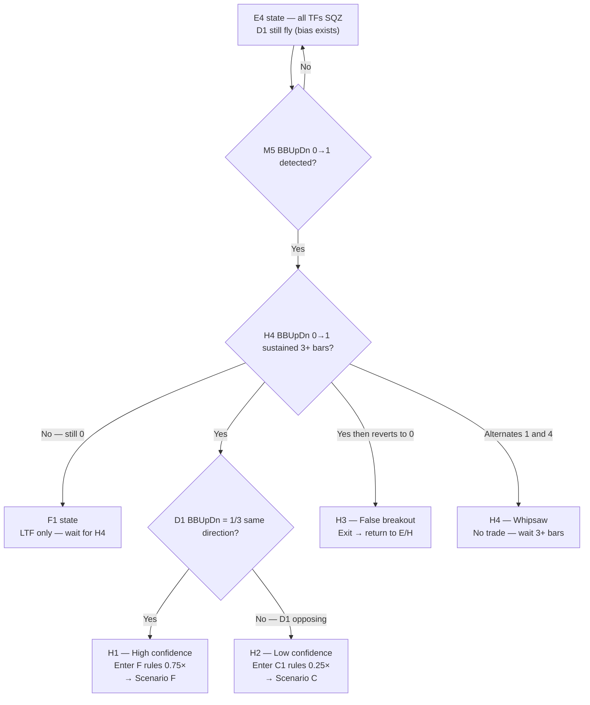

# EDIT_INSTRUCTIONS.md
# Target file: references/backtest_chart_analysis.md
# Branch: tofy5

---

## CRITICAL RULES — READ BEFORE ANY EDIT

1. Execute edits ONE AT A TIME using str_replace_based_edit
2. After EVERY edit run: `wc -l references/backtest_chart_analysis.md`
   and confirm line count changed as expected before proceeding
3. NEVER remove existing content unless the instruction says REPLACE or DELETE
4. NEVER invent BBW_stage, diffMid_Trend, BBUpDn_state, or PriceLoc values
5. Use [TO BE FILLED: describe what is needed] for image-dependent content
6. After ALL edits complete: git add references/backtest_chart_analysis.md
   then git commit -m "message" then git push origin tofy5
   then report the commit hash

---

## NAMING REFERENCE — USE THESE NAMES EVERYWHERE IN THE FILE

### Tier Names (3 tiers only — no Tier 2.5)

| Tier | Name | Description |
|------|------|-------------|
| TIER 1 | EXPANSION COMPLETE (TOP) | D2 confirmed, all TFs aligned and expanding |
| TIER 2 | COMPRESSION AND BOTTOM (D1) | D1 active or complete — includes BOTTOM state |
| TIER 3 | EXPANSION IN PROGRESS (D2) | D2 initiated, signal travelling upward |

### Scenario Names (6 parent scenarios — G is REMOVED)

| Letter | Name | Tier | What HTF is doing |
|--------|------|------|-------------------|
| A | Full fly alignment | TIER 1 | All TFs 511/512 same direction |
| B | Shallow compression | TIER 2 | H4 fly intact, MTF/LTF starting to shrink |
| E | Deep compression | TIER 2 | HTF fly maintained, LTF fully SQZ |
| H | Direction pivot | TIER 2 | All TFs SQZ — D2 direction now resolving (BOTTOM) |
| D | Rest recovery | TIER 3 | D2 same direction — shallow D1, H4 never broke |
| F | Compression release | TIER 3 | D2 from deep compression — direction known from LTF |
| C | Trend reversal | TIER 3 | D2 confirmed in opposite direction to previous trend |

NOTE: Scenario G is REMOVED — its content is absorbed:
- G1 (H4 shrink + LTF SQZ) → merged into Scenario E as sub-state E4
- G2 (H4 SQZ + D1 fly bias) → merged into Scenario H as H1 prerequisite note
- G3 (full flat) → merged into Scenario H as H4 sub-state entry condition

### Sub-Scenario Names

| Parent | Sub | Name |
|--------|-----|------|
| A | A1 | Strong fly (W1+D1+H4 all aligned) |
| A | A2 | Partial fly (H4 fly, W1 or D1 counter-trend) |
| A | A3 | Noise squeeze (brief M5/M15 SQZ — hold through) |
| B | B1 | M15 shrink only |
| B | B2 | M30 shrink |
| B | B3 | H1 shrink |
| E | E1 | LTF partial SQZ |
| E | E2 | LTF full SQZ (G0b-PINK) |
| E | E3 | M5 loading (breaking SQZ) |
| E | E4 | H4 also compressing (formerly G1) |
| H | H1 | Breakout same direction as D1 → F |
| H | H2 | Breakout opposite to D1 → C |
| H | H3 | False breakout → back to H/E |
| H | H4 | Whipsaw — no trade |
| D | D1 | M5 breaks SQZ (G6-LOAD) |
| D | D2 | M15 confirms (G6-BUY/SELL — entry) |
| D | D3 | MTF re-aligns → back toward A |
| F | F1 | LTF only — wait, quality too low |
| F | F2 | MTF confirmed — entry valid |
| F | F3 | HTF confirmed → becomes A |
| C | C1 | MTF reversal only — H4 not yet confirmed |
| C | C2 | H4 confirmed → new A begins |
| C | C3 | Counter-trend (W1/D1 still original direction) |

### Cycle Sequence (use this exact text in the file)

```
A → B → E → E4 → H → F → A       (continuation — same direction)
A → B → E → E4 → H → C → A       (reversal — new direction)
A → B → D → A                     (rest — short cycle, shallow D1 only)
H3 false breakout → back to H/E   (failed breakout)
```

---

## VARIABLE DEFINITIONS — USE THESE EVERYWHERE IN THE FILE

### BBW_stage (band shape / regime)
Valid values ONLY: 511 512 521 522 513 523 400-499

| Value | Name | Meaning |
|-------|------|---------|
| 511 | FLY++ bullish expand | Upper rising, lower falling — fanning out upward |
| 512 | FLY+- parallel up | Both bands rising together in parallel |
| 521 | FLY++ bearish expand | Upper falling, lower rising — fanning out downward |
| 522 | FLY-+ parallel down | Both bands falling in parallel |
| 513 | FLY-- bullish shrink | Upper curling down, lower still rising — contracting |
| 523 | FLY-- bearish shrink | Upper still rising, lower curling up — contracting |
| 400-499 | SQZ | Bands extremely tight and flat |

### diffMid_Trend (midline direction / price trend)
Valid values ONLY: 1 2 3 4 5

| Value | Name | Meaning | Shown on chart? |
|-------|------|---------|----------------|
| 1 | Uptrend | Midband rising | No |
| 2 | Downtrend | Midband falling | No |
| 3 | Sideways | Midband flat | Yes |
| 4 | Sideway downtrend | Flat with slight downward bias | Yes |
| 5 | Sideway uptrend | Flat with slight upward bias | Yes |

### BBUpDn_state (band envelope movement direction)
Valid values ONLY: 0 1 2 3 4
NOTE: This measures HOW THE BAND MOVES — NOT where price is relative to bands.

| Value | Enum | Condition | Meaning |
|-------|------|-----------|---------|
| 0 | no_state | Mixed / transitional | No clean 2-bar pattern — SQZ boundary or transition |
| 1 | expanding | Upper rising AND lower falling (2 bars confirmed) | Band actively expanding — fly confirm |
| 2 | shrinking | Upper falling AND lower rising (2 bars confirmed) | Band actively contracting — shrink confirm |
| 3 | up | Both upper AND lower rising (2 bars confirmed) | Entire band envelope drifting upward — parallel fly up |
| 4 | dn | Both upper AND lower falling (2 bars confirmed) | Entire band envelope drifting downward — parallel fly dn |

BBUpDn_state cross-reference with BBW_stage:
- BBUpDn=1 (expanding) → consistent with 511/521 (FLY++)
- BBUpDn=2 (shrinking) → consistent with 513/523 (SHRINK)
- BBUpDn=3 (up)        → consistent with 512 (FLY parallel up)
- BBUpDn=4 (dn)        → consistent with 522 (FLY parallel dn)
- BBUpDn=0 (no_state)  → consistent with 400-499 (SQZ) or transitional

### PriceLoc (price location relative to band levels)
This is a SEPARATE variable from BBUpDn_state.
Derived by comparing price directly against BBUppLV and BBLowLV values.
Used for G0b-TOUCH (outer band touch) and G8-BNDTGT (band target exit).

| Value | Meaning | Gate relevance |
|-------|---------|---------------|
| above_upper | price > BBUppLV | G8-BNDTGT fires — outer band reached |
| at_upper | price approaching BBUppLV from below | G0b-TOUCH arms (BUY context) |
| inside | BBLowLV < price < BBUppLV | No band touch — price within range |
| at_mid | price crossing BBMidLV | Midline cross — trend transition |
| at_lower | price approaching BBLowLV from above | G0b-TOUCH arms (SELL context) |
| below_lower | price < BBLowLV | G8-BNDTGT fires — outer band reached |

### Touch Classification (signal quality of a band touch event)

| Touch Class | BBW_stage | BBUpDn_state | diffMid | PriceLoc | Meaning | Action |
|-------------|-----------|--------------|---------|----------|---------|--------|
| Signal | Highest flying TF at shrink/fly | 2 (shrinking) | 4 or 5 (lean) | at_lower or at_upper | Price reached confinement boundary | Check G0b filters |
| Noise | Any shrinking TF below HTF | 2 (shrinking) | 3 (flat) | at_lower or at_upper | Band moved to price — geometry | Ignore |
| SQZ-peak | 400-499 any TF | 0 (no_state) | 3 all TFs | at_upper AND at_lower alternating | Band narrower than candle range | G0b-PINK — exit all |
| Continuation | Flying TF | 1 (expanding) | 1 or 2 | above_upper or below_lower | Price breaking through in trend direction | Hold / add |
| Midline-cross | Any | 0 or transitional | transitioning 3→1/2 | at_mid | Trend direction changing | Watch — entry may follow |

---

## EDIT 1 — Replace PART 3 heading and add correct Tier structure

### Find this EXACT string (unique in file):
```
# PART 3 — MIDDLE AND LOWER TIMEFRAME SCENARIO ANALYSIS
```

### Replace the ENTIRE Part 3 intro block with EXACTLY (find and replace everything from that heading down to and including the first --- separator before Scenario A):

Find end anchor (unique string just before Scenario A content):
```
**Scenarios in this tier:** D (same direction) → F (breakout from deep) → C (full reversal)

---
```

Replace the ENTIRE block from `# PART 3` through that anchor with EXACTLY:
```
# PART 3 — MIDDLE AND LOWER TIMEFRAME SCENARIO ANALYSIS

Apply after HTF context is established.
Read Part 2 HTF context first — every scenario below only makes sense
when you know what H4 + D1 are doing.

Scenarios are organised by **cascade position** — where in the D1→D2
cycle the market currently sits. Two cascade directions drive every cycle:

- **D1 — Compression cascade (HTF → LTF):** HTF tightens → confines TF below → cascades down. HTF is the driver.
- **D2 — Expansion cascade (LTF → HTF):** LTF breaks SQZ first → signal travels upward → HTF confirms last. LTF is the leading indicator.

**Cycle sequence:**
```
A → B → E → E4 → H → F → A       (continuation — same direction)
A → B → E → E4 → H → C → A       (reversal — new direction)
A → B → D → A                     (rest — short cycle, shallow D1 only)
H3 false breakout → back to H/E   (failed breakout)
```

---

## TIER 1 — EXPANSION COMPLETE (TOP)

> D2 cascade fully confirmed. All TFs expanding same direction.
> HTF fly intact. Highest entry quality. D1 has not yet begun.

**Scenarios in this tier:** A — Full fly alignment

---

## TIER 2 — COMPRESSION AND BOTTOM (D1)

> HTF compressing downward toward LTF. Trades shorter and size reduces
> as compression depth increases. Includes the BOTTOM state (H) where
> all TFs have fully compressed and D2 direction is about to resolve.
> D1 cascade is the cause — HTF state confines every TF below it.

**Scenarios in this tier:**
- B — Shallow compression (D1 at MTF depth, H4 fly intact)
- E — Deep compression (D1 at LTF depth, HTF fly intact, includes E4 formerly G1)
- H — Direction pivot (D1 complete, all TFs SQZ, D2 direction resolving)

---

## TIER 3 — EXPANSION IN PROGRESS (D2)

> LTF breaking out, signal travelling upward toward HTF.
> Entry quality increases as each TF confirms upward.
> Direction may be same as previous trend (D, F) or opposite (C).

**Scenarios in this tier:**
- D — Rest recovery (D2 same direction — shallow D1, H4 never broke)
- F — Compression release (D2 from deep compression, direction known from LTF)
- C — Trend reversal (D2 confirmed in opposite direction to previous trend)

---

```

### Verify: line count should increase by ~20 lines

---

## EDIT 2 — Update Scenario A tier label and sub-scenario names

### Find this EXACT string (unique in file — Scenario A tier label):
```
> **Tier:** TIER 1 — EXPANSION COMPLETE (TOP)
> **Cascade position:** D2 fully confirmed — all TFs aligned
> **Cascade direction:** TOP — no active D1 or D2, fully expanded
> **Leading TF:** M15 (entry trigger)
> **Next scenario:** → B when M15 first enters 513/523 (D1 begins at M15 depth)
```

### Replace with EXACTLY:
```
> **Tier:** TIER 1 — EXPANSION COMPLETE (TOP)
> **Scenario:** A — Full fly alignment
> **Cascade position:** D2 fully confirmed — all TFs aligned and expanding
> **Cascade direction:** TOP — no active D1 or D2, fully expanded
> **Leading TF:** M15 (entry trigger — FLAT→UP/DN transition)
> **Next scenario:** → B (Shallow compression) when M15 first enters 513/523
```

### Also find (unique — sub-scenario table header in Scenario A):
```
| A1 | Strong Fly | W1+D1+H4 511/512 |
```

### Replace ONLY the A1/A2/A3 name column values (keep all other columns):
```
| A1 | Strong fly |
| A2 | Partial fly |
| A3 | Noise squeeze |
```

NOTE: Do NOT change column content — only change the Name cell values to lowercase.

### Verify: line count approximately unchanged (replacements only)

---

## EDIT 3 — Update Scenario B tier label and sub-scenario names

### Find this EXACT string (unique — Scenario B tier label):
```
> **Tier:** TIER 2 — COMPRESSION IN PROGRESS (D1 Shallow)
> **Cascade position:** D1 initiated — H4 fly intact, LTF/MTF compressing
> **Cascade direction:** D1 flowing downward — H4 confinement driving MTF/LTF shrink
> **Leading TF:** Lowest TF currently showing BBW_stage 513/523 (frontier of D1)
> **Next scenario:** → E if depth reaches M30+M15 SQZ simultaneously
>                   → D if LTF breaks SQZ in same direction as H4 mid
>                   → C if LTF breaks SQZ in opposite direction to H4 mid
```

### Replace with EXACTLY:
```
> **Tier:** TIER 2 — COMPRESSION AND BOTTOM (D1)
> **Scenario:** B — Shallow compression
> **Cascade position:** D1 initiated — H4 fly intact, LTF/MTF compressing
> **Cascade direction:** D1 flowing downward — H4 confinement driving MTF/LTF shrink
> **Leading TF:** Lowest TF currently showing BBW_stage 513/523 (frontier of D1)
> **Next scenario:** → E (Deep compression) if depth reaches M30+M15 SQZ
>                   → D (Rest recovery) if LTF breaks SQZ in same direction as H4 mid
>                   → C (Trend reversal) if LTF breaks SQZ in opposite direction to H4 mid
```

### Also find (unique — sub-scenario names in Scenario B table):
```
| B1 | M15 shrink only |
```

Replace B sub-scenario name column ONLY:
```
| B1 | M15 shrink only |
| B2 | M30 shrink |
| B3 | H1 shrink |
```
(These names are already correct — verify they exist and match exactly)

### Verify: line count approximately unchanged

---

## EDIT 4 — Rename Scenario C heading and update tier label

### Find this EXACT string (unique — Scenario C heading):
```
## Scenario C — Full Reversal (D2 Opposite Direction)
```

### Replace with EXACTLY:
```
## Scenario C — Trend Reversal
```

### Then find (unique — Scenario C tier label):
```
> **Tier:** TIER 3 — EXPANSION IN PROGRESS (D2 Opposite)
> **Cascade position:** D2 confirmed in opposite direction to previous trend
> **Cascade direction:** D2 flowing upward in new direction — LTF led, HTF confirming last
> **Leading TF:** H4 (last to confirm — once H4 BBUpDn flips to 1/3 new direction, C2 confirmed)
> **Previous scenario:** Came from E2/E3 or G — deep compression exhausted
> **Next scenario:** → New A in opposite direction once H4 confirms (C2)
```

### Replace with EXACTLY:
```
> **Tier:** TIER 3 — EXPANSION IN PROGRESS (D2)
> **Scenario:** C — Trend reversal
> **Cascade position:** D2 confirmed in opposite direction to previous trend
> **Cascade direction:** D2 flowing upward in new direction — LTF led, HTF confirming last
> **Leading TF:** H4 (last to confirm — once H4 BBUpDn flips to 1/3 new direction, C2 confirmed)
> **Previous scenario:** Came from H (Direction pivot) — H2 sub-state (opposite direction)
> **Next scenario:** → New A (Full fly alignment) in new direction once H4 confirms (C2)
```

### Also find (unique — C sub-scenario name column):
```
| C1 | MTF reversal only |
| C2 | H4 confirmed |
| C3 | Counter-trend |
```

### Replace Name column ONLY with:
```
| C1 | MTF reversal only |
| C2 | H4 confirmed — new A begins |
| C3 | Counter-trend (W1/D1 still original) |
```

### Verify: line count approximately unchanged

---

## EDIT 5 — Update Scenario D heading and tier label

### Find this EXACT string (unique — Scenario D heading, get exact text first):
Search for: `## Scenario D —`
Get the full heading line, then replace with:
```
## Scenario D — Rest Recovery
```

### Then find the Scenario D tier label block and replace with EXACTLY:
```
> **Tier:** TIER 3 — EXPANSION IN PROGRESS (D2)
> **Scenario:** D — Rest recovery
> **Cascade position:** D2 initiated in same direction as previous trend — shallow D1 rest
> **Cascade direction:** D2 flowing upward — M5 led, MTF confirming
> **Leading TF:** M5 (BBUpDn 2→1 expanding), then M15 (entry trigger: mid flip)
> **Previous scenario:** Came from B (Shallow compression) — H4 fly maintained throughout
> **Next scenario:** → A (Full fly alignment) when MTF re-aligns fully (D3 complete)
```

### Verify: line count approximately unchanged

---

## EDIT 6 — Update Scenario E heading, tier label, and add E4 sub-scenario

### Find (unique — Scenario E heading):
Search for: `## Scenario E —`
Get the full heading line, then replace with:
```
## Scenario E — Deep Compression
```

### Find the Scenario E tier label and replace with EXACTLY:
```
> **Tier:** TIER 2 — COMPRESSION AND BOTTOM (D1)
> **Scenario:** E — Deep compression
> **Cascade position:** D1 deep — LTF fully SQZ, HTF fly maintained (E1-E3) or HTF also compressing (E4)
> **Cascade direction:** D1 complete at LTF level — BOTTOM approaching
> **Leading TF:** M5 (watch for BBUpDn 0→1 transition = D2 initiation signal)
> **Previous scenario:** Came from B3 (H1 also shrinking)
> **Next scenario:** → H (Direction pivot) when M5 BBUpDn flips 0→1 and M15 mid confirms
>                   → E4 if H4 also starts compressing (D1 deepens to HTF level)
```

### Find the Scenario E sub-scenario table (unique anchor):
```
| E1 | LTF partial SQZ |
```

### Replace the ENTIRE E sub-scenario table with EXACTLY:
```
| Sub | Name | H4 BBW | H4 BBUpDn | H1 BBW | H1 BBUpDn | M30 BBW | M30 BBUpDn | M15 BBW | M5 BBW | Touch class | Gate | Trade |
|-----|------|--------|-----------|--------|-----------|---------|------------|---------|--------|-------------|------|-------|
| E1 | LTF partial SQZ | 511/512 | 1 or 3 | 511/512 or 513 | 1/2/3 | 513/523 | 2 | 400-499 | 400-499 | Noise at M30, SQZ-peak at M15 | G0c-SQZLOCK | No new entries |
| E2 | LTF full SQZ | 511/512 | 1 or 3 | 511/512 or 513 | 2/3 | 400-499 | 0 | 400-499 | 400-499 | SQZ-peak all LTF — alternating PriceLoc | G0b-PINK | EXIT all |
| E3 | M5 loading | 511/512 | 1 or 3 | 511/512 | 1 or 3 | 513/523 | 2→1 | 513 | Breaking SQZ | Signal at M5 — BBUpDn 0→1 | G6-LOAD | ARM — wait M15 mid confirm |
| E4 | H4 also compressing | 513/523 or 400-499 | 2 or 0 | 400-499 | 0 | 400-499 | 0 | 400-499 | 400-499 | SQZ-peak all TFs | G0b-PINK + G0c-SQZLOCK | NO ENTRY — transition to H |
```

### Also add E4 note after the existing E3 progression table. Find (unique):
```
**E3 BBUpDn sequence:** M5 BBUpDn_state 2→1 (shrinking→expanding)
```

### Insert AFTER that line EXACTLY:
```

**E4 note (formerly Scenario G1):** When H4 BBUpDn transitions from 1/3 to 2 (shrinking)
while LTF already SQZ — D1 has now reached HTF level. This is the deepest compression state.
All TFs SQZ simultaneously → transition to Scenario H (Direction pivot).
D2 direction will be determined by which side H4 breaks SQZ toward.
If D1 is still fly (D1 BBUpDn=1/3), that D1 direction gives the bias for H1 sub-state.
```

### Verify: line count should increase by ~8 lines

---

## EDIT 7 — Rename Scenario F and update tier label

### Find (unique — Scenario F heading):
Search for: `## Scenario F —`
Get the full heading line, then replace with:
```
## Scenario F — Compression Release
```

### Find the Scenario F tier label and replace with EXACTLY:
```
> **Tier:** TIER 3 — EXPANSION IN PROGRESS (D2)
> **Scenario:** F — Compression release
> **Cascade position:** D2 initiated after deep compression (E or E4) — HTF not yet confirmed
> **Cascade direction:** D2 flowing upward — came from BOTTOM via H1 sub-state
> **Leading TF:** M30 (MTF confirmation = key gate — F1 waits for M30 BBUpDn=1)
> **Previous scenario:** Came from H (Direction pivot) — H1 sub-state (same direction as D1)
> **Next scenario:** → A (Full fly alignment) when H4 BBUpDn confirms 1 = F3
>                   → Back to H/E if HTF rejects (H4 BBUpDn stays 2 or 4 opposing)
```

### Verify: line count approximately unchanged

---

## EDIT 8 — Add Scenario H (Direction Pivot) — NEW SCENARIO

### Find this EXACT string (unique — the heading before PART 4):
```
# PART 4
```

### Insert BEFORE it EXACTLY:
```
---

## Scenario H — Direction Pivot

**When user asks to analyze a Scenario H:**
- Read `./Backtest_data/extras/backtested_EA_trend_reversal.jpg`
- Read `./Backtest_data/extras/backtested_EA_fly_shrink_2_sideway2.jpg`

[](backtested_EA_trend_reversal.jpg)
[](backtested_EA_fly_shrink_2_sideway2.jpg)

> **Tier:** TIER 2 — COMPRESSION AND BOTTOM (D1)
> **Scenario:** H — Direction pivot
> **Cascade position:** D1 complete — all TFs at or near SQZ. D2 direction about to resolve.
> **Cascade direction:** BOTTOM — D1 fully exhausted. Watching for D2 initiation direction.
> **Leading TF:** H4 (BBUpDn 0→1 or 0→4 is the direction resolution signal)
> **Previous scenario:** Came from E2/E3/E4 — full compression exhausted
> **Next scenario:** → F (Compression release) if H4 breaks same direction as D1 (H1)
>                   → C (Trend reversal) if H4 breaks opposite to D1 (H2)
>                   → Back to E/H if breakout fails (H3 false breakout)

**HTF context:** H4 in SQZ (BBUpDn=0) or just breaking SQZ. D1 still fly (bias exists — G2 state)
or D1 also SQZ (no bias — G3 state). This scenario covers the single most important bar in the
cycle — the bar where D2 direction becomes observable.

**D1 fly bias rule (formerly G2):** If D1 BBUpDn=1/3 (still expanding/up) while H4 SQZ,
D1 direction gives the breakout bias. Favour H1 sub-state in that direction.
**Full flat state (formerly G3):** If D1 also BBUpDn=0/2 (SQZ/shrinking), no directional bias.
Wait for H4 BBUpDn to sustain any direction for 3+ consecutive bars before acting.

### Sub-Scenarios

| Sub | Name | D1 BBW | D1 BBUpDn | H4 BBW | H4 BBUpDn | Direction | Confidence | Entry | Size |
|-----|------|--------|-----------|--------|-----------|-----------|------------|-------|------|
| H1 | Same as D1 | 511/512 | 1 or 3 | Breaking SQZ | 0→1 same dir as D1 mid | D1 aligned | High | F2 rules | 0.75× |
| H2 | Opposite to D1 | 511/512 | 1 or 3 | Breaking SQZ | 0→1 opposite to D1 mid | Counter D1 | Low | C1 rules | 0.25× |
| H3 | False breakout | Any | Any | SQZ attempted | 1→0 reverts within 3 bars | Failed | — | Exit immediately | — |
| H4 | Whipsaw | Any | Any | SQZ | Alternating 1 and 4 | Indeterminate | — | No trade | — |

### Sub-state Progression Table

| Step | D1 BBW | D1 mid | H4 BBW | H4 BBUpDn | H1 BBW | M30 mid | M15 mid | H4 PriceLoc | Next predict |
|------|--------|--------|--------|-----------|--------|---------|---------|-------------|-------------|
| Entry from E4 | 511/512 | 1 | 400-499 | 0 | 400-499 | 3 | 3 | inside | All TFs SQZ — wait M5 BBUpDn 0→1 |
| H1: H4 breaks same dir | 511/512 | 1 | Breaking | 0→1 (expanding same) | Breaking | 3→1 | 3→1 | above_upper | D1 aligned — enter F rules, 0.75× |
| H2: H4 breaks opposite | 511/512 | 1 | Breaking | 0→4 (dn, opposite) | Breaking | 3→2 | 3→2 | below_lower | Counter D1 — enter C1 rules, 0.25× |
| H3: false breakout | 511/512 | 1 | 400-499 | 1→0 reverted | 400-499 | 3 | 3 | inside | BBUpDn reverted — return to E/H, wait |
| H4: whipsaw | 511/512 | 1 | 400-499 | 1↔4 alternating | 400-499 | 3 | 3 | inside | No clear direction — wait 3+ bars |

### Trade action:
```
H1: ENTER using F2 rules (MTF confirm needed before full size)
    D1 fly same direction = high confidence → progress to F2→F3→A
    SIZE: 0.75× scaling to 1.0× on F3 confirm

H2: ENTER using C1 rules (small, counter-trend to D1)
    Wait for D1 to also flip before adding size → then C2 → new A
    SIZE: 0.25× only until D1 confirms new direction

H3: EXIT immediately — false breakout confirmed
    Return to E/H scenario rules. SIZE: —

H4: NO TRADE — indeterminate
    Wait for H4 BBUpDn to sustain 1 or 4 for 3+ consecutive bars
    SIZE: —
```

### Scenario H Identification Flowchart



### Cascade Position — Scenario H

| Dimension | Value |
|-----------|-------|
| Cascade direction now | BOTTOM — D1 complete, D2 direction unknown |
| Cascade depth | All TFs including H4 at SQZ (BBUpDn=0) |
| Leading TF | H4 (direction resolution signal) |
| Next scenario if H1 | F (Compression release) — same direction |
| Next scenario if H2 | C (Trend reversal) — opposite direction |
| Next scenario if H3 | Back to E/H — false breakout |
| Discriminator observable | H4 BBUpDn sustained 1 or 4 for 3+ bars |

---

```

### Verify: line count should increase by ~65 lines

---

## EDIT 9 — Remove Scenario G entirely

### The file currently contains a ## Scenario G section.
### Find the Scenario G heading (unique):
```
## Scenario G —
```

Get the full heading text then DELETE the ENTIRE Scenario G section —
from the `## Scenario G` heading through and including its final
`### Cascade Position — Scenario G` block and the trailing `---` separator.

The section ends just before `# PART 4`.

NOTE: Do NOT delete # PART 4 or anything after it.
NOTE: Scenario H (added in EDIT 8) is already inserted before # PART 4
      so Scenario G deletion just removes the now-redundant content.

### Verify: line count should DECREASE by ~45 lines

---

## EDIT 10 — Update Quick Navigation table

### Find this EXACT string (unique):
```
| Scenario details                       | Part 3 — Tier 1 (A) / Tier 2 (B,E,G) / Tier 3 (D,F,C) |
```

### Replace with EXACTLY:
```
| Scenario details                       | Part 3 — Tier 1 (A) / Tier 2 (B, E, H) / Tier 3 (D, F, C) |
```

### Also find (unique):
```
| Compression analysis                   | Part 1 Section 8 — Compression Zone Identification |
| Cascade direction model                | Part 1 Section 13 — Cascade Direction Model        |
| BBUpDn_state reference                 | Part 1 Section 13 — BBUpDn_state Quick Reference   |
| Touch classification                   | Part 1 Section 13 — Touch Classification Reference |
```

### Replace with EXACTLY:
```
| Compression analysis                   | Part 1 Section 8 — Compression Zone Identification  |
| Cascade direction model                | Part 1 Section 13 — Cascade Direction Model         |
| BBUpDn_state reference                 | Part 1 Section 13 — BBUpDn_state Quick Reference    |
| Touch classification                   | Part 1 Section 13 — Touch Classification Reference  |
| Scenario cycle sequence                | Part 3 — Cycle sequence (top of Part 3)             |
| Direction pivot / BOTTOM state         | Part 3 — Scenario H (Direction pivot)               |
```

### Verify: line count should increase by ~2 lines

---

## EDIT 11 — Update Part 2 Scenario Identification Flowchart

### Find this EXACT string (inside Part 2 flowchart):
```
    F -->|Yes| G["SCENARIO D\nRest Re-entry (D2 same dir)\nM5 BBUpDn 0→1, H4 fly intact"]
    F -->|No| H["SCENARIO B\nFly → Shrink deeper\nWatch M30 BBUpDn→2"]
    A -->|No| I["H4 BBUpDn=2 (shrinking)?"]
    I -->|Yes| J["M30/M15 BBUpDn=0 (SQZ)?"]
    J -->|Yes| K["SCENARIO E\nDeep Compression\nLTF SQZ, HTF fly"]
    J -->|No| L["SCENARIO B\nShallow Compression\nWatch depth level"]
    I -->|No — H4 BBUpDn=0 (SQZ)| M["D1 BBUpDn=1/3 (still fly)?"]
    M -->|Yes| N["SCENARIO G1/G2\nHTF Compression\nD1 fly bias exists"]
    M -->|No| O["SCENARIO G3\nFull Flat\nAll BBUpDn=0 — no trade"]
    N --> P{"M5 BBUpDn 0→1?"}
    P -->|Yes, H4 mid same dir| Q["SCENARIO F\nBreakout Expansion (D2)\nMTF confirm needed"]
    P -->|Yes, H4 mid opposite| R["SCENARIO C\nFull Reversal (D2 opposite)\nWait H4 BBUpDn=1 new dir"]
    P -->|No| S["SCENARIO G\nWait at H4 PriceLoc boundary"]
```

### Replace with EXACTLY:
```
    F -->|Yes| G["SCENARIO D\nRest recovery (D2 same dir)\nM5 BBUpDn 0→1, H4 fly intact"]
    F -->|No| H["SCENARIO B\nShallow compression\nWatch M30 BBUpDn→2"]
    A -->|No| I["H4 BBUpDn=2 (shrinking)?"]
    I -->|Yes| J["M30/M15 BBUpDn=0 (SQZ)?"]
    J -->|Yes| K["SCENARIO E\nDeep compression\nLTF SQZ, HTF fly"]
    J -->|No| L["SCENARIO B\nShallow compression\nWatch depth level"]
    I -->|No — H4 BBUpDn=0 (SQZ)| M["SCENARIO E4→H\nH4 also compressing\nAll TFs SQZ — direction pivot"]
    M --> N{"D1 BBUpDn=1/3 (fly bias)?"}
    N -->|Yes — bias exists| O{"H4 BBUpDn 0→1 same as D1?"}
    O -->|Yes sustained 3+ bars| P["SCENARIO H1→F\nCompression release\nHigh confidence — F2 rules"]
    O -->|Opposite direction| Q["SCENARIO H2→C\nTrend reversal\nLow confidence — C1 rules 0.25×"]
    O -->|Reverts to 0| R["SCENARIO H3\nFalse breakout\nReturn to E/H — wait"]
    O -->|Alternates 1 and 4| S["SCENARIO H4\nWhipsaw — no trade\nWait 3+ bars"]
    N -->|No — no bias (D1 also SQZ)| T["SCENARIO H4\nFull flat\nWait for sustained direction"]
```

### Verify: line count should increase by ~4 lines

---

## EDIT 12 — Update Section 13 Cascade Direction Model cycle sequence

### Find this EXACT string (unique — in Section 13):
```
TOP (A) → D1 begins (B: BBUpDn=2 at M15) → D1 deepens (E: BBUpDn=0 at M30/M15)
→ BOTTOM (G or E2: all BBUpDn=0) → D2 initiates (D/F: BBUpDn 0→1 at M5)
→ D2 confirms (C or back to A: BBUpDn=1 at H4)
```

### Replace with EXACTLY:
```
A (full fly) → B (BBUpDn=2 at M15: D1 shallow) → E (BBUpDn=0 at M30/M15: D1 deep)
→ E4 (BBUpDn=0/2 at H4: D1 reached HTF) → H (all BBUpDn=0: BOTTOM, direction resolving)
→ H1→F (BBUpDn=1 same dir: D2 compression release) → A (continuation)
→ H2→C (BBUpDn=1 opposite: D2 trend reversal) → new A (reversal)
→ B→D→A (BBUpDn 0→1 at M5 while H4 still fly: rest recovery short cycle)
```

### Verify: line count approximately unchanged

---

## EDIT 13 — Fix Section 13 Cascade Direction Model (Check HTF first, then read LTF)

### Find this EXACT string (unique — Section 13 cascade model heading and first paragraph):
```
### D1 — Compression Cascade (HTF → LTF)

HTF tightens → confines the TF below it → cascades downward until LTF reaches SQZ.
Observable as BBW_stage dropping TF by TF top-down, BBUpDn_state changing to 2 (shrinking).
```

### Replace with EXACTLY:
```
### Compression — Check HTF First, Then Read LTF

Compression is NOT a simple one-direction cascade. The HTF state at the time
LTF starts shrinking determines whether it's a rest, confinement, or reversal warning.

**Always check HTF BEFORE interpreting LTF shrink:**

| H4 state | D1 state | LTF shrink meaning | Scenario path | Reversal probability |
|----------|----------|-------------------|---------------|---------------------|
| Fly (511/512) | Fly (511/512) | REST — internal LTF pullback, HTF intact | B→D (rest recovery) | Low |
| Shrink (513) | Fly (511/512) | CONFINED — H4 caused LTF compression, D1 may rescue | B→E (deep compression) | Medium |
| Shrink (513) | Shrink (513) | REVERSAL WARNING — both HTF losing direction | B→E→E4 (HTF reversal) | High |
| SQZ (400-499) | Fly (511/512) | BOTTOM with D1 bias — old H4 trend exhausted | E4→H (direction pivot, D1 gives bias) | High for H4, low for macro |
| SQZ (400-499) | Shrink/SQZ | DEEP BOTTOM — no macro bias exists | E4→H (direction pivot, no bias) | Very high — full reversal |

**Two phenomena happen simultaneously during compression:**

1. **Shrink propagation (LTF → HTF):** LTF bands shrink first because they react to price faster.
   M15 enters 513 before M30 before H1 before H4. LTF is the leading indicator.
   Each TF confirming shrink increases reversal probability.

2. **Confinement effect (HTF → LTF consequence):** Once H4 IS in shrink, its band boundaries
   act as ceiling/floor for all lower TFs. M30/M15 oscillate within H4 upper/lower band.
   This is the RESULT of H4 shrink, not the initiation of shrink.

**The critical question is: did HTF shrink FIRST (causing LTF compression) or did LTF shrink
FIRST (warning of HTF reversal)?**

- If H4 entered shrink BEFORE M15 → H4 is the cause → confinement (check D1 for rescue)
- If M15 entered shrink BEFORE H4 → LTF is warning → watch if H4 follows (reversal ladder)
- If both entered shrink simultaneously → strong reversal signal

**Reversal probability ladder — each TF confirming shrink escalates:**

| Depth reached | Reversal probability | Scenario |
|---------------|---------------------|----------|
| M15 only (H4 still fly) | Low — likely rest/continuation | B1 |
| M30 added (H4 still fly) | Low-Medium — watch H1 | B2 |
| H1 added (H4 still fly) | Medium — H4 likely to follow | B3 |
| H4 enters shrink (D1 still fly) | High — HTF reversal warning | E/E4 |
| H4 SQZ + D1 still fly | High for H4, D1 gives bias | H (D1 bias) |
| H4 SQZ + D1 shrink/SQZ | Very high — full macro reversal | H (no bias) |
```

---

### Also find this EXACT string (the cascade diagram in Section 13):
```
H4 BBUpDn→2 (shrinking) — confinement floor/ceiling set for H1
  → H1 BBUpDn→2 — confined within H4 band, sets range for M30
    → M30 BBUpDn→2 — confined within H1 band, sets range for M15
      → M15 BBUpDn→2 — confined within M30 band
        → M5 BBUpDn→0 (SQZ, no_state) — deepest confinement — BOTTOM
```

### Replace with EXACTLY:
```
Shrink propagation (LTF leads — early warning of reversal):
  M15 BBUpDn→2 first (trend weakening at entry TF)
    → M30 BBUpDn→2 follows (momentum fading at driver TF)
      → H1 BBUpDn→2 follows (chain anchor losing direction)
        → H4 BBUpDn→2 follows (macro bias losing direction — reversal warning confirmed)
          → H4 BBUpDn→0 (SQZ) — old trend exhausted → Scenario H (direction pivot)

  BUT CHECK at each step: was H4 already shrinking when M15 started?
    YES → H4 caused LTF compression (confinement — H4 is driver, not victim)
    NO  → M15 is warning that H4 will follow (genuine reversal signal from LTF)

Confinement effect (HTF → LTF — consequence of HTF shrink, not cause):
  Once H4 IS in shrink → H4 band boundaries act as ceiling/floor:
    H4 upper/lower band → confines H1 range
      → H1 upper/lower band → confines M30 range
        → M30 upper/lower band → confines M15 range
          → M15 upper/lower band → confines M5 range
  This is the RESULT of H4 shrink. M30/M15 range within these boundaries
  until H4 exits shrink. Gate G8-BNDTGT fires when price touches these boundaries.
```

---

### Also find this EXACT string (the cycle sequence in Section 13):
```
A (full fly) → B (BBUpDn=2 at M15: D1 shallow) → E (BBUpDn=0 at M30/M15: D1 deep)
→ E4 (BBUpDn=0/2 at H4: D1 reached HTF) → H (all BBUpDn=0: BOTTOM, direction resolving)
→ H1→F (BBUpDn=1 same dir: D2 compression release) → A (continuation)
→ H2→C (BBUpDn=1 opposite: D2 trend reversal) → new A (reversal)
→ B→D→A (BBUpDn 0→1 at M5 while H4 still fly: rest recovery short cycle)
```

### Replace with EXACTLY:
```
CHECK HTF FIRST at every step:

A (full fly, all TFs aligned)
  → B (M15 shrinks: CHECK — is H4 still fly?)
    → H4 still fly + D1 fly: rest likely
      → B→D→A (rest recovery — H4 never broke, LTF pullback only)
    → H4 also shrinking: confinement
      → B→E (H4 caused LTF compression — LTF confined within H4 band)
      → CHECK D1: D1 still fly?
        → Yes: E (deep compression, D1 may rescue H4)
        → D1 also shrinking: E→E4 (HTF reversal warning — both H4 and D1 losing direction)
          → E4→H (all TFs SQZ: BOTTOM — old trend exhausted, direction resolving)
            → H1→F→A (M5 expands same direction: compression release → continuation)
            → H2→C→new A (M5 expands opposite: trend reversal complete)

Both shrink propagation (LTF→HTF warning) and expansion (LTF→HTF breakout) travel bottom-up.
Confinement (HTF→LTF range restriction) is the consequence of HTF shrink, not the cause.
The CHECK at each step determines whether LTF shrink is rest vs confinement vs reversal warning.
```

---

### Also find this EXACT string (the D2 expansion cascade heading and content in Section 13):
```
### D2 — Expansion Cascade (LTF → HTF)

LTF breaks SQZ first → signal travels upward → HTF confirms last.
Observable as BBUpDn_state transitioning 0→1 (expanding) TF by TF bottom-up.
```

### Replace with EXACTLY:
```
### Expansion Cascade (LTF → HTF)

LTF breaks SQZ first → signal travels upward → HTF confirms last.
Observable as BBUpDn_state transitioning 0→1 (expanding) TF by TF bottom-up.
Same direction as shrink propagation — LTF always leads both shrink and expansion.

**CHECK HTF context to determine expansion quality:**

| H4 state when M5 breaks SQZ | D1 state | Expansion meaning | Scenario |
|------------------------------|----------|-------------------|----------|
| Still fly (511/512) | Fly | High quality — macro intact, rest over | D (rest recovery) |
| Shrink (513) | Fly | Medium — H4 confined but D1 backing | F (compression release) |
| SQZ (400-499) | Fly | Medium — H4 exhausted but D1 gives bias | H1→F (direction pivot same) |
| SQZ (400-499) | Shrink/SQZ | Low until confirmed — no macro backing | H2→C (direction pivot opposite) |
```

---

### Verify: line count should increase by ~35 lines

---

### POST-EDIT 13 VERIFICATION

After applying, confirm:
- [ ] "D1 — Compression Cascade (HTF → LTF)" heading NO LONGER exists
- [ ] "Compression — Check HTF First, Then Read LTF" heading EXISTS
- [ ] HTF check table (5 rows: fly/fly, shrink/fly, shrink/shrink, SQZ/fly, SQZ/shrink) EXISTS
- [ ] Reversal probability ladder table (6 rows: M15 through H4 SQZ+D1) EXISTS
- [ ] Shrink propagation diagram shows LTF→HTF direction (M15 first, H4 last)
- [ ] Confinement diagram shows HTF→LTF with "consequence, not cause" note
- [ ] Cycle sequence shows "CHECK HTF FIRST" at every step
- [ ] "D2 — Expansion Cascade" heading replaced with "Expansion Cascade" (no D2 label)
- [ ] Expansion quality table (4 rows by H4/D1 state) EXISTS
- [ ] No remaining reference to "D1 cascade" as HTF→LTF anywhere in Section 13


---

## EDIT 13bcd — Add Sections 13b, 13c, 13d: TRADEINFO, BBTFImpact, Cascade State Decoder

These three sections bridge the document's visual chart analysis to the EA's actual log output.
Without them, a reader cannot verify a scenario identification from a journal log line.

### Find this EXACT string (unique — end of Section 13 BBUpDn_state block):
```
**IMPORTANT:** BBUpDn_state measures HOW THE BAND MOVES, not where price is.
Price location (above_upper / at_upper / inside / at_mid / at_lower / below_lower)
is tracked separately by comparing price against BBUppLV and BBLowLV values.
G0b-TOUCH and G8-BNDTGT use PriceLoc, not BBUpDn_state.
```

### Insert AFTER it EXACTLY:
```

---

## 13b. TRADEINFO Chain Flags — Cascade Direction Observable

TRADEINFO flags are the EA's real-time observable for cascade direction.
They appear in the journal log under the `[TRADEINFO]` tag and map directly
to the cascade model in Section 13.

**How to read:** Each flag has a TF index value. When ≥ 0, that flag's chain
is active up to that TF level. When = -1, the chain is not detected.

| Flag | Active (≥0) meaning | Cascade mapping | When you see it |
|------|--------------------|-----------------|-----------------| 
| H2L_flyUP | HTF→LTF fly uptrend chain confirmed | Expansion confirmed top-down — all TFs aligned UP | Scenario A (full fly up) |
| H2L_flyDN | HTF→LTF fly downtrend chain confirmed | Expansion confirmed top-down — all TFs aligned DN | Scenario A (full fly dn) |
| H2L_flyStrink | HTF→LTF shrink chain active | Shrink propagating — compression cascade in progress | Scenario B/E (compression) |
| H2L_sideway | HTF→LTF sideway/SQZ chain | All TFs suppressed — compression complete | Scenario E4/H (BOTTOM) |
| L2H_flyUP | LTF→HTF fly uptrend chain (bottom-up) | LTF leading expansion upward — D2 initiated | Scenario D/F (expansion up) |
| L2H_flyDN | LTF→HTF fly downtrend chain (bottom-up) | LTF leading expansion downward — D2 initiated | Scenario D/F (expansion dn) |
| L2H_sideway | LTF→HTF sideway chain | LTF being suppressed by HTF — D1 active | Scenario B/E (LTF confined) |
| All = -1 | No chains detected | Mixed/neutral — transitional state | Scenario H (direction pivot) |

**TF index reference (used for all TRADEINFO and BBTFImpact flags):**

| Index | Timeframe |
|-------|-----------|
| 0 | M5 |
| 1 | M15 |
| 2 | M30 |
| 3 | H1 |
| 4 | H4 |
| 5 | D1 |

**Scenario identification from TRADEINFO flags:**

| TRADEINFO state | Scenario | Trade implication |
|----------------|----------|-------------------|
| `H2L_flyUP:0` + `L2H_flyUP:3` | A — Full fly alignment (up) | Full size trend entry BUY |
| `H2L_flyDN:0` + `L2H_flyDN:3` | A — Full fly alignment (dn) | Full size trend entry SELL |
| `H2L_flyStrink:1` + `L2H_sideway:1` | B1 — M15 shrink only | Reduce to 0.75×, watch depth |
| `H2L_flyStrink:2` + `L2H_sideway:2` | B2 — M30 shrink | Reduce to 0.50×, watch H1 |
| `H2L_flyStrink:3` + `L2H_sideway:3` | B3 — H1 shrink | Reduce to 0.25×, watch H4 |
| `H2L_sideway:1` + `L2H_sideway:1` | E1/E2 — Deep compression | No entry — G0b-PINK may fire |
| `H2L_sideway:3` + all L2H = -1 | E4/H — BOTTOM | No entry — wait M5 BBUpDn 0→1 |
| All flags = -1 | H — Direction pivot (transitional) | No entry — direction unknown |
| `L2H_flyUP:1` + `H2L_flyStrink:3` | D1/F1 — LTF leading, HTF not confirmed | ARM — wait M30 confirm |
| `L2H_flyUP:2` + `H2L_flyStrink:3` or clearing | D2/F2 — MTF confirmed | ENTER — 0.75× |
| `L2H_flyUP:3` + `H2L_flyUP:0` | D3/F3 — Full chain restored | → Scenario A, full size |
| `L2H_flyDN:1` + `H2L_flyUP:3` (opposing) | C1 — MTF reversal only | Small entry 0.25× — wait H4 |
| `L2H_flyDN:3` + `H2L_flyDN:0` | C2 — H4 confirmed reversal | → New Scenario A opposite dir |

**Phase 3a/3b connection (Section 14):**
- Phase 3a (symmetric zigzag): `H2L_flyStrink` active + `H2L_sideway` not yet
- Phase 3b onset: `H2L_flyStrink` active + one `L2H_fly` flag starting to appear (LTF attempting expansion within shrink)
- Phase 3a→3b transition: `H2L_flyStrink` clears → replaced by `H2L_sideway` = shrink chain converted to sideway chain

---

## 13c. BBTFImpact Flags — Cascade Pressure Indicators

BBTFImpact flags appear in the journal log under the `[BBTFImpact]` tag.
They show which TFs are being suppressed by higher TFs (D1 pressure)
vs which TFs are showing independent fly energy (D2 pressure).

| Flag | Format | Active (=1) meaning | Cascade mapping |
|------|--------|--------------------|--------------------|
| HTF_Drive_LTF_Sideway | [TF_name_index] | TF at that index being pushed into sideways by higher TFs | Shrink/confinement active at this TF level |
| LTF_Drive_HTF_Fly | [TF_name_index] | TF at that index showing fly energy despite HTF pressure | Expansion energy building at this TF level |

**Index reference:** 1=M15, 2=M30, 3=H1, 4=H4, 5=D1

**Log format examples:**
```
[BBTFImpact] HTF_Drive_LTF_Sideway:[M15_1]
  → M15 (index 1) being suppressed — Scenario B1

[BBTFImpact] HTF_Drive_LTF_Sideway:[M15_1, M30_1]
  → M15 and M30 both suppressed — Scenario B2

[BBTFImpact] HTF_Drive_LTF_Sideway:[M15_1, M30_1, H1_1]
  → M15, M30, and H1 all suppressed — Scenario B3

[BBTFImpact] LTF_Drive_HTF_Fly:[M30_1, H1_1]
  → M30 and H1 showing fly energy — expansion building at MTF level

[BBTFImpact] HTF_Drive_LTF_Sideway:[M30_1] LTF_Drive_HTF_Fly:[M30_1, H1_1]
  → CONFLICT — M30 being suppressed AND showing fly energy simultaneously
  → Volatile transition state — Scenario E3 or H territory
```

**Scenario B sub-scenario mapping:**

| BBTFImpact pattern | Scenario | Size multiplier |
|-------------------|----------|----------------|
| `HTF_Drive_LTF_Sideway:[M15_1]` only | B1 — M15 shrink only | 0.75× |
| `HTF_Drive_LTF_Sideway:[M15_1, M30_1]` | B2 — M30 shrink | 0.50× |
| `HTF_Drive_LTF_Sideway:[M15_1, M30_1, H1_1]` | B3 — H1 shrink | 0.25× |
| `HTF_Drive_LTF_Sideway:[M15_1, M30_1, H1_1, H4_1]` | E4 — H4 also compressing | No entry |

**Scenario E/H transition mapping:**

| BBTFImpact pattern | Scenario | Action |
|-------------------|----------|--------|
| All `HTF_Drive_LTF_Sideway`, no `LTF_Drive_HTF_Fly` | E2 — Full SQZ, no expansion energy | Wait — G0b-PINK |
| `HTF_Drive_LTF_Sideway` + `LTF_Drive_HTF_Fly` appearing | E3 — Loading, expansion building | Watch — G6-LOAD may fire |
| `LTF_Drive_HTF_Fly` growing, `HTF_Drive_LTF_Sideway` clearing | F1/F2 — Expansion taking over | ARM / ENTER |
| Only `LTF_Drive_HTF_Fly`, no `HTF_Drive_LTF_Sideway` | F3/A — Full expansion | Full size entry |

**Conflict state (both flags active at same TF):**
Both `HTF_Drive_LTF_Sideway` and `LTF_Drive_HTF_Fly` active simultaneously at a TF
= volatile transition. HTF suppressing but LTF pushing back.
- Maps to Scenario E3 (loading) or Scenario H (direction pivot)
- sizeMultiplier = 0.5 (compromise between suppression and drive signals)
- Watch M5 BBUpDn_state: 0→1 resolves the conflict in favour of expansion

**Section 14 connection:**
- Phase 2 onset: first `HTF_Drive_LTF_Sideway` flag appears = zigzag starting
- Phase 3 deepening: `HTF_Drive_LTF_Sideway` count increasing = more TFs suppressed = legs shortening
- Phase 4 (SQZ): all `HTF_Drive_LTF_Sideway`, no `LTF_Drive_HTF_Fly` = noise oscillation
- Phase 5 (breakout): `LTF_Drive_HTF_Fly` appears and grows = explosive move starting

---

## 13d. Cascade State Decoder — cas_shrinkTF and cas_sqzCount

These internal EA values map directly to scenario sub-states.
They provide the fastest single-variable identification of where
in the compression cascade the market currently sits.

### cas_shrinkTF — Highest TF Currently in Shrink

| cas_shrinkTF | Meaning | Scenario sub-state | Reversal probability |
|-------------|---------|-------------------|---------------------|
| 1 | M15 is highest active shrink TF | B1 — Shallow compression | Low |
| 2 | M30 is highest shrink TF | B2 — Moderate compression | Low-Medium |
| 3 | H1 is highest shrink TF | B3 — Deep compression | Medium |
| 4 | H4 is highest shrink TF | E4 — HTF also compressing | High |
| 5 | D1 is highest shrink TF | Scenario I — Macro sideways | Very high |
| -1 | No TF in fly_shrink | Not in B — check E/H or A | Depends on other flags |

**cas_shrinkTF maps to Section 14 Phase 3 amplitude:**
- cas_shrinkTF = 1: Phase 3 zigzag legs still tall (only M15 confined)
- cas_shrinkTF = 2: Phase 3 legs moderately shortened (M30 now confined too)
- cas_shrinkTF = 3: Phase 3 legs significantly shortened (H1 confined)
- cas_shrinkTF = 4: Phase 3 → Phase 4 transition (H4 confined = approaching SQZ)

### cas_sqzCount — Number of TFs Currently in SQZ

| cas_sqzCount | Meaning | Scenario sub-state | Gate status |
|-------------|---------|-------------------|------------|
| 0 | No TFs in SQZ | B (shallow compression) — shrink only | Normal gates |
| 1 | One TF squeezed (typically M5 first) | E1 — LTF partial SQZ | G0c-SQZLOCK may activate |
| 2 | Two TFs squeezed (M5+M15) | E2 — LTF full SQZ | G0b-PINK fires — EXIT all |
| 3 | Three TFs squeezed (M5+M15+M30) | E3/E4 — Deep cascade | G0b-PINK + G0c-SQZLOCK |
| 4+ | Four or more TFs squeezed | E4/H — BOTTOM | All gates locked — wait |

**Pink zone condition:**
cas_sqzCount ≥ 2 AND M15+M30 both SQZ simultaneously → G0b-PINK fires → EXIT all.
This maps to E2 (LTF full SQZ) or deeper.

**Combined cas_shrinkTF + cas_sqzCount reading:**

| cas_shrinkTF | cas_sqzCount | Full state | Scenario | Action |
|-------------|-------------|-----------|----------|--------|
| 1 | 0 | M15 shrink, nothing squeezed | B1 | Trade at 0.75× |
| 2 | 0 | M30 shrink, nothing squeezed | B2 early | Trade at 0.50× |
| 2 | 1 | M30 shrink, M5 squeezed | B2 late → E1 | Reduce to 0.25× |
| 3 | 1 | H1 shrink, M5 squeezed | B3 → E1 | Reduce to 0.25× |
| 3 | 2 | H1 shrink, M5+M15 squeezed | E2 | EXIT — G0b-PINK |
| -1 | 2 | No shrink but 2 TFs squeezed | E2/E3 transition | Wait — G6-LOAD may fire |
| -1 | 3+ | No shrink, 3+ TFs squeezed | E4/H — BOTTOM | No entry — wait M5 expand |
| -1 | 0 | No shrink, no squeeze | A (fly) or transition | Check TRADEINFO for direction |

### Journal Log Label Reference

These labels appear in EA journal output and map to specific scenario sub-states:

| Log label | Meaning | Scenario sub-state | Action |
|-----------|---------|-------------------|--------|
| `MIDLINE_SQZ_LOADING` | M5 in SQZ, M30 shrinking — loading state | E3 — Loading | Wait — G6-LOAD about to fire |
| `MIDLINE_SQZ_ENTRY` | Loading complete — entry condition met | E3→D/F transition | ENTER on next bar |
| `SQZ_BREAK_UP` | M5 broke SQZ bullish — expansion initiated upward | D1 or F1 initiating BUY | ARM — wait M15 confirm |
| `SQZ_BREAK_DN` | M5 broke SQZ bearish — expansion initiated downward | D1 or F1 initiating SELL | ARM — wait M15 confirm |
| `CASCADE_TOUCH(TF:n upper_band)` | G0b-TOUCH fired at TF index n, upper band | Confinement boundary reached | Check G0b 6 filters |
| `CASCADE_TOUCH(TF:n lower_band)` | G0b-TOUCH fired at TF index n, lower band | Confinement boundary reached | Check G0b 6 filters |
| `CASCADE_PINK_ZONE` | G0b-PINK fired — M15+M30 both SQZ | E2 — Pink zone active | EXIT all — no entries |

**How to use with Section 14 phases:**
- Phase 2 onset: `CASCADE_TOUCH` starts appearing = zigzag legs hitting band boundaries
- Phase 3 deepening: `CASCADE_TOUCH` TF index increasing = confinement propagating upward
- Phase 4: `CASCADE_PINK_ZONE` appears = zigzag collapsed to noise
- Phase 5: `SQZ_BREAK_UP/DN` appears = explosive breakout starting
- Entry: `MIDLINE_SQZ_LOADING` → `MIDLINE_SQZ_ENTRY` → `SQZ_BREAK_UP/DN` = full entry sequence

---

```

### Verify: line count should increase by ~150 lines

---

### POST-EDIT 13bcd VERIFICATION

After applying, confirm:
- [ ] `## 13b. TRADEINFO Chain Flags — Cascade Direction Observable` heading exists
- [ ] TRADEINFO flag table (8 rows: H2L_flyUP through All=-1) present
- [ ] TF index reference table (6 rows: 0=M5 through 5=D1) present
- [ ] Scenario identification from TRADEINFO flags table (14 rows) present
- [ ] Phase 3a/3b connection note present (links to Section 14)
- [ ] `## 13c. BBTFImpact Flags — Cascade Pressure Indicators` heading exists
- [ ] BBTFImpact flag table (2 rows: HTF_Drive/LTF_Drive) present
- [ ] Log format examples with 5 example patterns present
- [ ] Scenario B sub-scenario mapping table (4 rows by BBTFImpact pattern) present
- [ ] Scenario E/H transition mapping table (4 rows) present
- [ ] Conflict state description present
- [ ] Section 14 connection note (Phase 2→5 mapping) present
- [ ] `## 13d. Cascade State Decoder — cas_shrinkTF and cas_sqzCount` heading exists
- [ ] cas_shrinkTF table (6 rows: 1 through -1) present
- [ ] cas_shrinkTF → Section 14 Phase 3 amplitude mapping present
- [ ] cas_sqzCount table (5 rows: 0 through 4+) present
- [ ] Combined cas_shrinkTF + cas_sqzCount reading table (8 rows) present
- [ ] Journal Log Label Reference table (7 rows) present
- [ ] "How to use with Section 14 phases" mapping (5 bullets) present
- [ ] All content inserted AFTER BBUpDn_state IMPORTANT note, BEFORE Section 14 or Section 12
- [ ] No existing content removed

---

## EDIT 14 (CONSOLIDATED) — Add Section 14: Candlestick Behavior During Fly → Shrink → SQZ

This EDIT replaces the previous EDIT 14 and EDIT 14b. Apply this version only.

### Find this EXACT string (unique — Section 12 heading):
```
## 12. Risk Management Guidelines
```

### Insert BEFORE it EXACTLY:
```
## 14. Candlestick Behavior During Fly → Shrink → SQZ Transition

During fly → shrink → SQZ, candlesticks form a **zigzag oscillation pattern** between
HTF band boundaries. Each zigzag leg is one complete MTF fly cycle (M30 drives the leg).
The zigzag gets progressively tighter as H4 bands narrow — this is the visual signature
of compression. Recognizing which phase the zigzag is in tells you the current scenario
and what comes next.

Three reference charts illustrate the full range of zigzag behaviors:

**Image 1 — Phase 3a Symmetric Zigzag (9–19 Jan 2026):**
Phase 2→3a symmetric decay → Phase 4 SQZ → Phase 5 explosive breakout.
Equal amplitude decay — both ceiling and floor close in equally. H4 mid = 3.

[](backtested_EA_phase_3a_symmetric.jpg)

**Image 2 — Phase 3b Asymmetric Cascade (2–12 Jan 2026):**
BUY trending shrink — UP targets drop through H4 upper → H1 mid → H4 mid
while DN targets hold at H4 mid. H4 mid = 1→5→3.

[](backtested_EA_phase_3b_asymmetric.jpg)

**Image 3 — Phase 3a→3b Transition (23–26 Feb 2026):**
Symmetric first (H4 mid=3), then develops SELL lean mid-shrink (H4 mid shifts 3→4).
UP targets start dropping while DN targets hold steady.

[](backtested_EA_phase_3a_to_3b.jpg)

---

### Phase 1 — Full Fly: Directional Trend (Scenario A)

```
Pattern:
  ╱  ╱  ╱  ╱  ╱  ╱  ╱     Price trending in one direction
 ╱  ╱  ╱  ╱  ╱  ╱  ╱      Candles mostly same color
╱  ╱  ╱  ╱  ╱  ╱  ╱       Pullbacks brief and shallow
```

| Dimension | Value |
|-----------|-------|
| H4 BBW_stage | 511/512 (FLY++) |
| H4 BBUpDn_state | 1 (expanding) or 3 (up) |
| M30 behavior | Fly same direction as H4 — sustained trend leg |
| Candle character | Mostly same-colored, directional, pullbacks < 30% of leg |
| diffBBW | Positive — band actively expanding |
| Impulse legs | All legs go SAME DIRECTION (no zigzag yet) |

**CHECK HTF:** H4 fly intact. No zigzag behavior. Trend trading.
**Visible on:** Image 2 left edge (2–5 Jan) — directional up before zigzag begins.

---

### Phase 2 — Fly → Shrink Onset: Impulse + Counter-Impulse (Scenario B1/B2)

```
Pattern:
    ╱╲      ╱╲      ╱╲        Price makes sharp up-down legs
   ╱  ╲    ╱  ╲    ╱  ╲       Each leg = one M30 fly cycle
  ╱    ╲  ╱    ╲  ╱    ╲      Legs SAME HEIGHT (H4 band still wide)
```

This is where the **zigzag begins**. Price no longer trends in one direction —
instead it impulses UP (yellow arrow) to H4 upper band, then reverses DOWN
(red arrow) to H4 lower band or H1 mid, then impulses UP again.

| Dimension | Value |
|-----------|-------|
| H4 BBW_stage | 511/512 transitioning to 513 (FLY → FLY--) |
| H4 BBUpDn_state | 1/3 transitioning to 2 (expanding → shrinking) |
| M30 behavior | Completes full fly cycles alternating BUY and SELL |
| Candle character | Alternating bullish and bearish impulse clusters |
| diffBBW | Transitioning positive → near zero → slightly negative |
| Leg height | Full H4 band width — legs are TALL (H4 still wide) |
| Leg duration | 4–12 hours per leg (one complete M30 fly cycle) |
| Leg reversal trigger | G8-BNDTGT fires at H4 band boundary — price reverses |

**CHECK HTF:** H4 BBUpDn still 1/3 = H4 fly intact.
Zigzag is MTF cycling within H4 confinement, NOT H4 reversal.
**Visible on:** Image 1 center-left (12–13 Jan) — first red and yellow arrow pair.

---

### Phase 3 — Shrink Deepening: Tightening Zigzag (Scenario B3/E1)

Phase 3 has **two sub-patterns** depending on whether H4 has a directional lean.
The discriminator is H4 diffMid_Trend during the shrink.

#### Phase 3a vs 3b Discriminator

| H4 diffMid_Trend | Phase | Pattern | Oscillation center |
|-------------------|-------|---------|-------------------|
| 3 (sideways, no lean) | 3a — Symmetric Tightening | Both ceiling and floor close in equally | Centered around H4 mid |
| 1 or 5 (uptrend / sideway-up) | 3b — Asymmetric Cascade (BUY) | UP targets drop progressively, DN targets hold at H4 mid then break | Biased above H4 mid initially |
| 2 or 4 (downtrend / sideway-dn) | 3b — Asymmetric Cascade (SELL) | DN targets rise progressively, UP targets hold at H4 mid then break | Biased below H4 mid initially |

**Mid-shrink transition:** H4 mid can shift during an active shrink.
If H4 mid = 3 at shrink onset → Phase 3a begins (symmetric).
If H4 mid later shifts to 4/2 or 5/1 → Phase 3a transitions to 3b mid-cycle.
The reverse is also possible: 3b can decay to 3a when H4 mid reaches 3.
**Watch for:** first zigzag leg where UP target is measurably lower than previous
while DN target holds steady (or vice versa) = 3a→3b transition has occurred.

---

#### Phase 3a — Symmetric Tightening (H4 mid = 3, no directional lean)

```
Pattern:
   ╱╲    ╱╲    ╱╲             Same zigzag pattern BUT
  ╱  ╲  ╱  ╲  ╱  ╲            Legs getting SHORTER each cycle
  ╱   ╲ ╱   ╲╱   ╲            BOTH ceiling and floor close in equally
```

Both the upper and lower targets close in at the same rate.
Oscillation is centered around H4 mid — no directional bias.

| Dimension | Value |
|-----------|-------|
| H4 BBW_stage | 513/523 (SHRINK confirmed) |
| H4 BBUpDn_state | 2 (shrinking — upper falling, lower rising) |
| H4 diffMid_Trend | 3 (sideways — no directional lean) |
| M30 behavior | Still completes full fly cycles but with LESS ROOM each time |
| Candle character | Zigzag continues, amplitude visibly decreasing symmetrically |
| diffBBW | Negative — band actively contracting |
| Leg height | Decreasing each cycle — BOTH UP and DN legs shorter equally |
| Leg reversal trigger | G8-BNDTGT fires at progressively CLOSER band boundaries |

**CHECK HTF:** H4 BBUpDn = 2 AND H4 mid = 3 = symmetric shrink.
Trade BOTH directions equally at each reversal — no bias.

**Visible on:**
- Image 1 center (13–15 Jan) — orange arrows oscillating with equal amplitude decay.
- Image 3 center (24–25 Feb) — orange arrows approximately equal height UP and DN.

---

#### Phase 3b — Asymmetric Target Cascade (H4 mid ≠ 3, directional lean exists)

```
BUY trending shrink pattern (H4 mid = 1 or 5):

H4 Upper ──╱─────────────────────────
           ╱╲
H4 Mid ────╱──╲──────────────────────    UP targets drop through band hierarchy
               ╲╱╲                       DN targets hold at H4 mid then break
H1 Mid ────────╱──╲──────────────────
                   ╲╱╲
H4 Lower ──────────╱──╲─────────────    Eventually reaches H4 lower → SQZ
                       ╲
```

When H4 is shrinking BUT still has a directional lean, the zigzag is asymmetric —
the ceiling drops faster than the floor rises (BUY case) because H4 upper band
curls downward while H4 lower band still rises.

**BUY trending shrink (H4 mid = 1 or 5):**

| Step | UP target (ceiling) | DN target (floor) | H4 mid | What's happening |
|------|--------------------|--------------------|--------|-----------------|
| Step 1 | H4 upper band (full reach) | H4 mid band (support holds) | 1 (uptrend) | H4 fly momentum still; H4 mid acts as floor |
| Step 2 | H1 mid band (ceiling dropped) | H4 mid → breaks through | 1→5 (weakening) | H4 upper curling down (BBUpDn→2); ceiling closes in first |
| Step 3 | H4 mid only (ceiling dropped further) | H4 lower band (full retrace) | 5→3 (exhausted) | H4 mid no longer support; price reaches floor |
| Step 4 | → Phase 4 (SQZ) or Phase 3a | → Phase 4 (SQZ) | 3 (sideways) | Trend exhausted; becomes symmetric or collapses |

**SELL trending shrink (H4 mid = 2 or 4) — mirror:**

| Step | DN target (floor) | UP target (ceiling) | H4 mid | What's happening |
|------|-------------------|---------------------|--------|-----------------|
| Step 1 | H4 lower band (full reach) | H4 mid band (resistance holds) | 2 (downtrend) | H4 fly momentum still; H4 mid acts as ceiling |
| Step 2 | H1 mid band (floor risen) | H4 mid → breaks through | 2→4 (weakening) | H4 lower curling up; floor rises first |
| Step 3 | H4 mid only (floor risen further) | H4 upper band (full retrace) | 4→3 (exhausted) | H4 mid no longer resistance |
| Step 4 | → Phase 4 (SQZ) or Phase 3a | → Phase 4 (SQZ) | 3 (sideways) | Trend exhausted; becomes symmetric or collapses |

**Band level target sequence (BUY trending — visible as yellow arrows):**

```
Arrow 1 UP: → H4 upper band     (H4 fly still has momentum)
Arrow 1 DN: → H4 mid band       (mid holds as support)
Arrow 2 UP: → H1 mid band       (can't reach H4 upper — ceiling dropped)
Arrow 2 DN: → H4 mid → through  (mid breaking as support)
Arrow 3 UP: → H4 mid only       (ceiling at H4 mid level now)
Arrow 3 DN: → H4 lower band     (floor reached — SQZ approaching)
```

**Key difference from Phase 3a:**
- 3a: price oscillates evenly around H4 mid — both sides tighten equally
- 3b: price biased to one side of H4 mid — trending side loses reach first
  while counter-trend side holds its level until H4 mid flips to 3

**Trade implications:**
- Phase 3a (symmetric): trade BOTH directions equally at each reversal — no bias
- Phase 3b (asymmetric): favour the TRENDING side while H4 mid still = 1/5 or 2/4
  → Trending-direction legs are longer and more reliable
  → Counter-trend legs are shorter and less reliable
  → STOP favouring when H4 mid flips to 3 — trend exhausted

**H4 mid flip is the transition signal:**
- 1/5 → 3: Phase 3b (BUY) ends → becomes 3a or Phase 4
- 2/4 → 3: Phase 3b (SELL) ends → becomes 3a or Phase 4
- 3 → 4/2 or 5/1: Phase 3a → 3b transition mid-shrink

**Visible on:**
- Image 2 (5–9 Jan) — BUY trending shrink: yellow arrows UP targets dropping from H4 upper → H1 mid → H4 mid while DN targets hold at H4 mid.
- Image 3 right (25–26 Feb) — 3a→3b transition: symmetric zigzag develops SELL lean as H4 mid shifts 3→4, UP targets start dropping while DN targets hold steady.

**diffBBW during Phase 3b:**
- Step 1: diffBBW slightly negative — H4 barely shrinking, fly momentum persists
- Step 2: diffBBW moderately negative — shrink accelerating, ceiling dropping visibly
- Step 3: diffBBW strongly negative — shrink aggressive, approaching SQZ

**TRADEINFO transition signal:**
H4 mid flip from 1/5 → 3 observable as: `H2L_flyStrink` clears,
replaced by `H2L_sideway` — shrink chain converted to sideway chain.

**BBTFImpact observable:** `HTF_Drive_LTF_Sideway` values increasing = deeper confinement.
**cas_shrinkTF observable:** Value increasing (1→2→3) = shrink propagating upward through TFs.

---

### Phase 4 — Approaching SQZ: Compressed Oscillation (Scenario E2/E3)

```
Pattern:
     ╱╲╱╲╱╲╱╲╱╲╱╲            Zigzag collapsed to noise range
    ╱╲╱╲╱╲╱╲╱╲╱╲╱╲           Candles small, alternating direction rapidly
   ╱╲╱╲╱╲╱╲╱╲╱╲╱╲╱╲          Band width < typical candle range
```

The zigzag has collapsed — individual legs are no longer distinguishable.
Price oscillates within a very narrow range. M30/M15 both in SQZ — no clean
fly cycles are possible. Reached from either Phase 3a or Phase 3b.

| Dimension | Value |
|-----------|-------|
| H4 BBW_stage | 513/523 deep or transitioning to 400-499 |
| H4 BBUpDn_state | 2 → 0 (shrinking → no_state = SQZ boundary) |
| M30/M15 BBW_stage | 400-499 (SQZ) |
| M30/M15 BBUpDn_state | 0 (no_state) |
| Candle character | Small bodies, mixed colors, no sustained direction |
| diffBBW | Near zero — band width stabilized at minimum |
| Leg height | ≈ single candle body height — no distinguishable legs |
| Gate active | G0b-PINK fires (M15+M30 both SQZ) — EXIT all positions |
| PriceLoc behavior | Alternates at_upper and at_lower on consecutive bars |

**CHECK HTF:** H4 BBUpDn approaching 0 = SQZ confirmed.
- D1 still fly? → Scenario E4 with D1 bias → H1 (same dir) likely
- D1 also shrinking/SQZ? → Scenario E4 no bias → H direction uncertain

**Visible on:** Image 1 (15–16 Jan) — H4-SQZ labels appear, price chops sideways.
**Log label:** `MIDLINE_SQZ_LOADING` may appear = E3 loading state.
**cas_sqzCount:** Value = 2+ (multiple TFs squeezed).

---

### Phase 5 — SQZ Break: Explosive Directional Move (Scenario H → F)

```
Pattern:
                        ╱╱╱╱      Sudden large candles same direction
   ╱╲╱╲╱╲╱╲╱╲╱╲       ╱╱╱╱       M5 breaks SQZ first (BBUpDn 0→1)
  ╱╲╱╲╱╲╱╲╱╲╱╲╱╲     ╱╱╱╱        M15 follows — G6-BUY/SELL fires
```

After the compressed oscillation, price suddenly breaks out with
2–3× sized candles in one direction. This is the expansion cascade
initiating — M5 breaks SQZ first, M15 follows, M30 confirms.

| Dimension | Value |
|-----------|-------|
| H4 BBW_stage | 400-499 → transitioning to 511/512 or 521/522 |
| H4 BBUpDn_state | 0 → 1 (no_state → expanding = direction resolved) |
| M5 BBUpDn_state | 0 → 1 first (earliest signal) |
| M15 BBUpDn_state | 0 → 1 follows in 2-5 bars |
| Candle character | Large directional candles 2–3× SQZ candle size |
| diffBBW | Positive and increasing sharply — band expanding rapidly |
| Gate sequence | G6-LOAD → G6-BUY or G6-SELL |
| PriceLoc | Sustained above_upper (BUY) or below_lower (SELL) |

**CHECK HTF at breakout:**
- H4 BBUpDn 0→1 same direction as D1 fly → H1 → F (high confidence)
- H4 BBUpDn 0→1 opposite to D1 → H2 → C (lower confidence)
- H4 BBUpDn 0→1 then reverts to 0 within 3 bars → H3 (false breakout)

**Visible on:** Image 1 right (16–18 Jan) — explosive upward breakout after H4-SQZ zone.
**Log label:** `SQZ_BREAK_UP` or `SQZ_BREAK_DN` appears.
**TRADEINFO:** `L2H_flyUP` or `L2H_flyDN` appears = LTF leading expansion upward.

---

### Summary: Three Reference Charts — Phase Mapping

| Chart | Date range | What it shows | Phase sequence visible |
|-------|-----------|---------------|----------------------|
| Image 1 (9–19 Jan) | Full cycle | Symmetric zigzag decay → SQZ → explosive breakout | Phase 2 → 3a → 4 → 5 |
| Image 2 (2–12 Jan) | BUY trending shrink | Asymmetric cascade — UP targets drop through band hierarchy | Phase 1 → 2 → 3b (BUY) → 4 → 5 |
| Image 3 (23–26 Feb) | Mid-shrink transition | Symmetric first → develops SELL lean mid-shrink | Phase 2 → 3a → 3a→3b transition → 3b (SELL) |

---

### Summary: Zigzag Amplitude Decay = diffBBW Made Visual

| Amplitude behavior | diffBBW | Shrink type | Phase | Scenario path |
|-------------------|---------|-------------|-------|---------------|
| No zigzag — directional trend | Positive | No shrink | Phase 1 | A — hold until M15 enters 513 |
| Equal-height legs (no decay) | ≈ zero | Parallel fly, no narrowing | Phase 2 onset | A2 or I (macro sideways) |
| Symmetric decay — both sides equal | Negative | H4 mid=3 sideways shrink | Phase 3a | B→E — trade both directions equally |
| Asymmetric decay — one side drops first | Negative | H4 mid=1/2/4/5 trending shrink | Phase 3b | B→E — favour trending side |
| Collapsed to noise (no legs) | ≈ zero at minimum | SQZ confirmed | Phase 4 | E2/E3→H — wait for direction |
| Explosive breakout (2-3× candles) | Positive, sharply increasing | SQZ break | Phase 5 | H→F or C — enter on M15 confirm |

---

### Summary: Each Zigzag Leg = One MTF Fly Cycle

| Leg direction | MTF state | PriceLoc at reversal | Gate at reversal | Trade action |
|--------------|-----------|---------------------|-----------------|-------------|
| Upward (yellow arrow) | M30 fly up (511/512 BUY) | at_upper at H4 level | G8-BNDTGT | Exit BUY, watch for SELL |
| Downward (red arrow) | M30 fly down (521/522 SELL) | at_lower at H4 level or at_mid at H1 | G8-BNDTGT or G5-FADE | Exit SELL, watch for BUY |
| Upward again | M30 reverses to fly up | at_lower (reversal point) | G6-BUY arms | New BUY entry if quality ≥ 60 |

**Leg reversal sequence:**
1. M30 fly reaches H4 band boundary → G8-BNDTGT fires → exit current trade
2. M15 mid flips (UP→FLAT or DN→FLAT) → G5-FADE fires → confirms exit
3. M15 mid flips again (FLAT→DN or FLAT→UP) → G6-SELL or G6-BUY fires → new entry opposite
4. New M30 fly cycle begins → repeat until zigzag decays to Phase 4

**Size scaling during zigzag decay:**
- Phase 2 (equal height legs): full size per quality score
- Phase 3a (symmetric decay): reduce size as legs shorten — 0.75× to 0.50×, trade both directions
- Phase 3b (asymmetric decay): reduce size, favour trending direction while H4 mid ≠ 3
- Phase 4 (collapsed to noise): no new entries — G0b-PINK active
- Phase 5 (explosive breakout): re-enter per Scenario H/F rules

---

```

### Verify: line count should increase by ~190 lines

---

### POST-EDIT 14 (CONSOLIDATED) VERIFICATION

After applying, confirm:
- [ ] `## 14. Candlestick Behavior During Fly → Shrink → SQZ Transition` heading exists
- [ ] Three reference images listed at top (Image 1: 9-19 Jan, Image 2: 2-12 Jan, Image 3: 23-26 Feb)
- [ ] Phase 1 present with dimension table
- [ ] Phase 2 present with dimension table
- [ ] Phase 3 discriminator table (3a vs 3b by H4 mid value) present
- [ ] Mid-shrink transition note (3a→3b and 3b→3a possible) present
- [ ] Phase 3a — Symmetric Tightening present with "Visible on: Image 1, Image 3 center"
- [ ] Phase 3b — Asymmetric Target Cascade present with BUY and SELL tables (4 steps each)
- [ ] Phase 3b — Band level target sequence (Arrow 1-3) present
- [ ] Phase 3b — "Visible on: Image 2, Image 3 right" references present
- [ ] Phase 3b — diffBBW Steps 1-3 present
- [ ] Phase 3b — TRADEINFO transition signal present
- [ ] Phase 4 present with dimension table and "Visible on: Image 1"
- [ ] Phase 5 present with dimension table and "Visible on: Image 1 right"
- [ ] "Three Reference Charts — Phase Mapping" summary table (3 rows) present
- [ ] "Zigzag Amplitude Decay = diffBBW Made Visual" summary table (6 rows) present
- [ ] "Each Zigzag Leg = One MTF Fly Cycle" table (3 rows) present
- [ ] Leg reversal sequence (4 steps) present
- [ ] Size scaling during zigzag decay (5 phases) present
- [ ] Section placed BEFORE Section 12 Risk Management Guidelines
- [ ] No existing content removed
- [ ] Previous EDIT 14 and EDIT 14b content superseded by this consolidated version

---

## FINAL COMMIT SEQUENCE

Run after ALL edits complete:

```bash
git add references/backtest_chart_analysis.md
git commit -m "Rename tiers and scenarios: Tier 2 → Compression and Bottom, F → Compression Release, C → Trend Reversal, D → Rest Recovery, A → Full Fly Alignment, B → Shallow Compression, E → Deep Compression; Add Scenario H Direction Pivot; Remove Scenario G (absorbed into E4 and H); update cycle sequence, flowchart, nav table"
git push origin tofy5
```

Report the full commit hash.

---

## COMPLETE EDIT SEQUENCE SUMMARY

Run in this EXACT order:

| # | Type | Description | Expected Δ lines |
|---|------|-------------|-----------------|
| EDIT 1 | REPLACE | Part 3 heading + correct Tier structure with new names | +20 |
| EDIT 2 | REPLACE | Scenario A tier label + sub-scenario name casing | ~0 |
| EDIT 3 | REPLACE | Scenario B tier label with new tier name | ~0 |
| EDIT 4 | RENAME+REPLACE | Scenario C → Trend Reversal + tier label | ~0 |
| EDIT 5 | RENAME+REPLACE | Scenario D → Rest Recovery + tier label | ~0 |
| EDIT 6 | RENAME+REPLACE+ADD | Scenario E → Deep Compression + E4 sub-scenario | +8 |
| EDIT 7 | RENAME+REPLACE | Scenario F → Compression Release + tier label | ~0 |
| EDIT 8 | ADD | Scenario H — Direction Pivot (new scenario) | +65 |
| EDIT 9 | DELETE | Remove Scenario G entirely | -45 |
| EDIT 10 | REPLACE | Quick Navigation — update scenario list and add H row | +2 |
| EDIT 11 | REPLACE | Part 2 flowchart — remove G, add H/E4 routing | +4 |
| EDIT 12 | REPLACE | Section 13 cycle sequence — update to new names | ~0 |

**Expected net line change:** +65 - 45 + 20 + 8 + 6 = approximately **+54 lines**

---

## POST-EDIT VERIFICATION CHECKLIST

After push, confirm each item in the file:

- [ ] `## TIER 1 — EXPANSION COMPLETE (TOP)` present in Part 3
- [ ] `## TIER 2 — COMPRESSION AND BOTTOM (D1)` present in Part 3 (NOT "IN PROGRESS")
- [ ] `## TIER 3 — EXPANSION IN PROGRESS (D2)` present in Part 3
- [ ] Tier 2 lists: B — Shallow compression / E — Deep compression / H — Direction pivot
- [ ] Tier 3 lists: D — Rest recovery / F — Compression release / C — Trend reversal
- [ ] Scenario A heading reads "Full Fly Alignment"
- [ ] Scenario B heading reads "Shallow Compression"
- [ ] Scenario C heading reads "Trend Reversal"
- [ ] Scenario D heading reads "Rest Recovery"
- [ ] Scenario E heading reads "Deep Compression"
- [ ] Scenario E has E4 sub-scenario row in sub-scenario table
- [ ] Scenario F heading reads "Compression Release"
- [ ] Scenario H section exists with H1/H2/H3/H4 sub-scenarios
- [ ] Scenario H has progression table and mermaid flowchart
- [ ] NO `## Scenario G` heading exists anywhere in file
- [ ] Cycle sequence shows: A → B → E → E4 → H → F → A
- [ ] Quick Navigation has no reference to Scenario G
- [ ] Part 2 flowchart routes to E4/H instead of G
- [ ] Section 13 cycle sequence updated to new names
- [ ] No existing image embeds removed
- [ ] No existing trade action blocks removed
