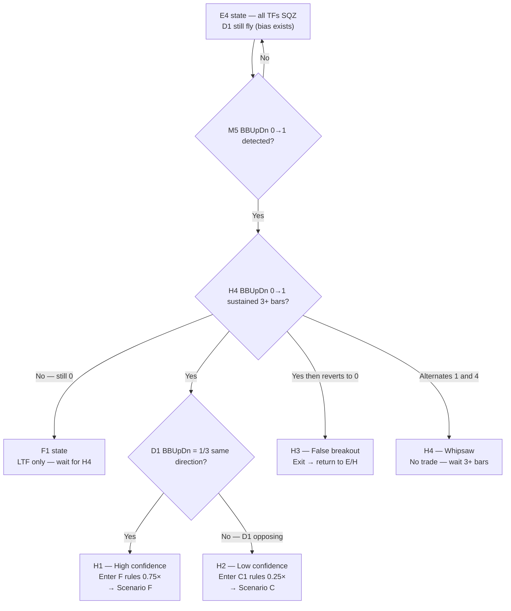
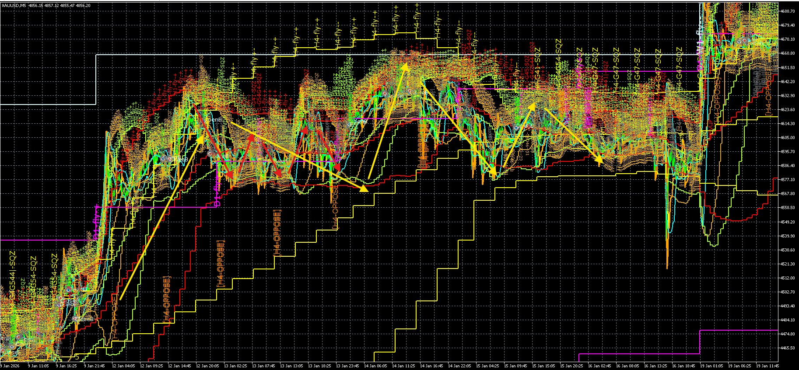
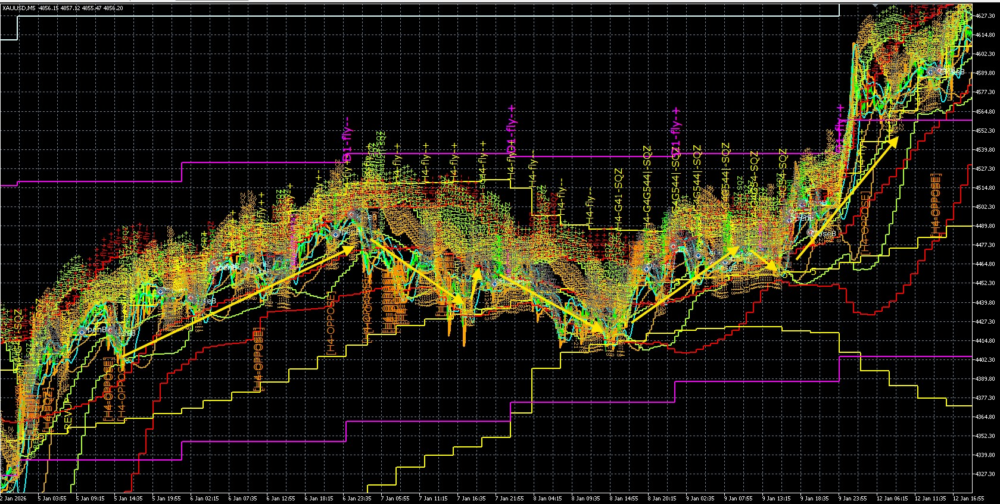
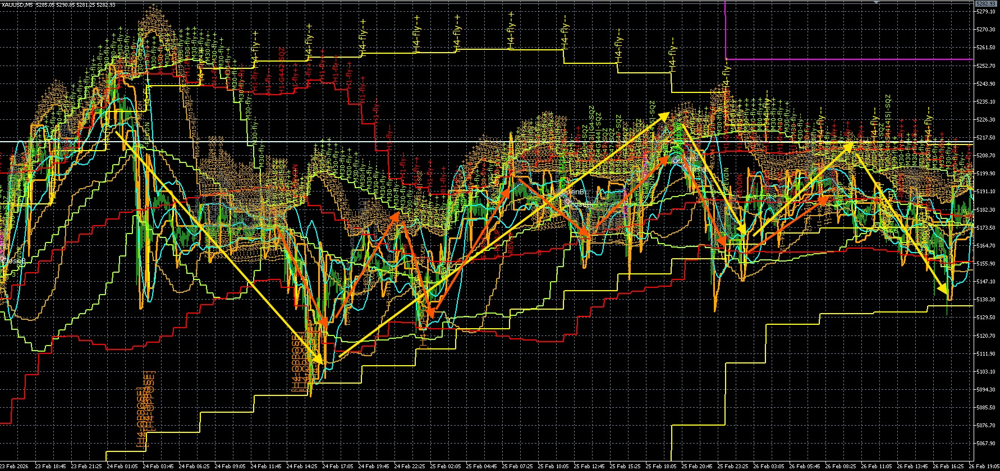
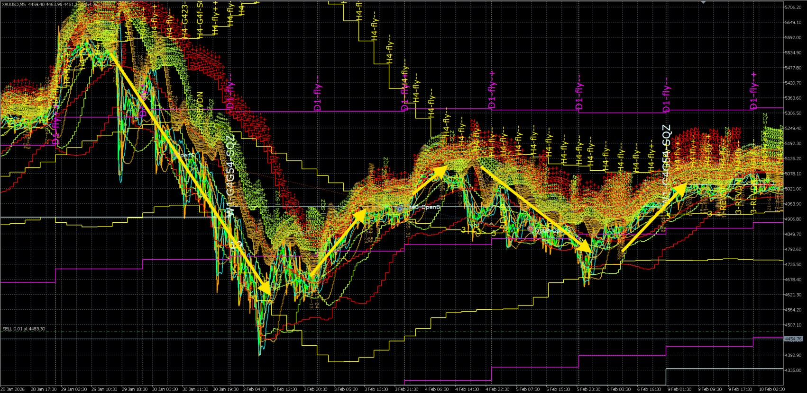
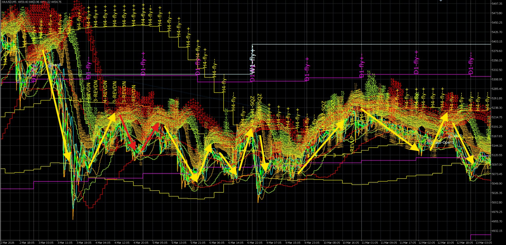

# EDIT_INSTRUCTIONS.md
# Target file: references/backtest_chart_analysis.md
# Branch: tofy5

---

## CRITICAL RULES — READ BEFORE ANY EDIT

1. Execute edits ONE AT A TIME using str_replace_based_edit
2. After EVERY edit run: `wc -l references/backtest_chart_analysis.md`
   and confirm line count changed as expected before proceeding
3. NEVER remove existing content unless the instruction says REPLACE or DELETE
4. NEVER invent BBW_stage, diffMid_Trend, BBUpDn_state, or PriceLoc values
5. Use [TO BE FILLED: describe what is needed] for image-dependent content
6. After ALL edits complete: git add references/backtest_chart_analysis.md
   then git commit -m "message" then git push origin tofy5
   then report the commit hash

---

## NAMING REFERENCE — USE THESE NAMES EVERYWHERE IN THE FILE

### Tier Names (3 tiers only — no Tier 2.5)

| Tier | Name | Description |
|------|------|-------------|
| TIER 1 | EXPANSION COMPLETE (TOP) | D2 confirmed, all TFs aligned and expanding |
| TIER 2 | COMPRESSION AND BOTTOM (D1) | D1 active or complete — includes BOTTOM state |
| TIER 3 | EXPANSION IN PROGRESS (D2) | D2 initiated, signal travelling upward |

### Scenario Names (6 parent scenarios — G is REMOVED)

| Letter | Name | Tier | What HTF is doing |
|--------|------|------|-------------------|
| A | Full fly alignment | TIER 1 | All TFs 511/512 same direction |
| B | Shallow compression | TIER 2 | H4 fly intact, MTF/LTF starting to shrink |
| E | Deep compression | TIER 2 | HTF fly maintained, LTF fully SQZ |
| H | Direction pivot | TIER 2 | All TFs SQZ — D2 direction now resolving (BOTTOM) |
| D | Rest recovery | TIER 3 | D2 same direction — shallow D1, H4 never broke |
| F | Compression release | TIER 3 | D2 from deep compression — direction known from LTF |
| C | Trend reversal | TIER 3 | D2 confirmed in opposite direction to previous trend |

NOTE: Scenario G is REMOVED — its content is absorbed:
- G1 (H4 shrink + LTF SQZ) → merged into Scenario E as sub-state E4
- G2 (H4 SQZ + D1 fly bias) → merged into Scenario H as H1 prerequisite note
- G3 (full flat) → merged into Scenario H as H4 sub-state entry condition

### Sub-Scenario Names

| Parent | Sub | Name |
|--------|-----|------|
| A | A1 | Strong fly (W1+D1+H4 all aligned) |
| A | A2 | Partial fly (H4 fly, W1 or D1 counter-trend) |
| A | A3 | Noise squeeze (brief M5/M15 SQZ — hold through) |
| B | B1 | M15 shrink only |
| B | B2 | M30 shrink |
| B | B3 | H1 shrink |
| E | E1 | LTF partial SQZ |
| E | E2 | LTF full SQZ (G0b-PINK) |
| E | E3 | M5 loading (breaking SQZ) |
| E | E4 | H4 also compressing (formerly G1) |
| H | H1 | Breakout same direction as D1 → F |
| H | H2 | Breakout opposite to D1 → C |
| H | H3 | False breakout → back to H/E |
| H | H4 | Whipsaw — no trade |
| D | D1 | M5 breaks SQZ (G6-LOAD) |
| D | D2 | M15 confirms (G6-BUY/SELL — entry) |
| D | D3 | MTF re-aligns → back toward A |
| F | F1 | LTF only — wait, quality too low |
| F | F2 | MTF confirmed — entry valid |
| F | F3 | HTF confirmed → becomes A |
| C | C1 | MTF reversal only — H4 not yet confirmed |
| C | C2 | H4 confirmed → new A begins |
| C | C3 | Counter-trend (W1/D1 still original direction) |

### Cycle Sequence (use this exact text in the file)

```
A → B → E → E4 → H → F → A       (continuation — same direction)
A → B → E → E4 → H → C → A       (reversal — new direction)
A → B → D → A                     (rest — short cycle, shallow D1 only)
H3 false breakout → back to H/E   (failed breakout)
```

---

## VARIABLE DEFINITIONS — USE THESE EVERYWHERE IN THE FILE

### BBW_stage (band shape / regime)
Valid values ONLY: 511 512 521 522 513 523 400-499

| Value | Name | Meaning |
|-------|------|---------|
| 511 | FLY++ bullish expand | Upper rising, lower falling — fanning out upward |
| 512 | FLY+- parallel up | Both bands rising together in parallel |
| 521 | FLY++ bearish expand | Upper falling, lower rising — fanning out downward |
| 522 | FLY-+ parallel down | Both bands falling in parallel |
| 513 | FLY-- bullish shrink | Upper curling down, lower still rising — contracting |
| 523 | FLY-- bearish shrink | Upper still rising, lower curling up — contracting |
| 400-499 | SQZ | Bands extremely tight and flat |

### diffMid_Trend (midline direction / price trend)
Valid values ONLY: 1 2 3 4 5

| Value | Name | Meaning | Shown on chart? |
|-------|------|---------|----------------|
| 1 | Uptrend | Midband rising | No |
| 2 | Downtrend | Midband falling | No |
| 3 | Sideways | Midband flat | Yes |
| 4 | Sideway downtrend | Flat with slight downward bias | Yes |
| 5 | Sideway uptrend | Flat with slight upward bias | Yes |

### BBUpDn_state (band envelope movement direction)
Valid values ONLY: 0 1 2 3 4
NOTE: This measures HOW THE BAND MOVES — NOT where price is relative to bands.

| Value | Enum | Condition | Meaning |
|-------|------|-----------|---------|
| 0 | no_state | Mixed / transitional | No clean 2-bar pattern — SQZ boundary or transition |
| 1 | expanding | Upper rising AND lower falling (2 bars confirmed) | Band actively expanding — fly confirm |
| 2 | shrinking | Upper falling AND lower rising (2 bars confirmed) | Band actively contracting — shrink confirm |
| 3 | up | Both upper AND lower rising (2 bars confirmed) | Entire band envelope drifting upward — parallel fly up |
| 4 | dn | Both upper AND lower falling (2 bars confirmed) | Entire band envelope drifting downward — parallel fly dn |

BBUpDn_state cross-reference with BBW_stage:
- BBUpDn=1 (expanding) → consistent with 511/521 (FLY++)
- BBUpDn=2 (shrinking) → consistent with 513/523 (SHRINK)
- BBUpDn=3 (up)        → consistent with 512 (FLY parallel up)
- BBUpDn=4 (dn)        → consistent with 522 (FLY parallel dn)
- BBUpDn=0 (no_state)  → consistent with 400-499 (SQZ) or transitional

### PriceLoc (price location relative to band levels)
This is a SEPARATE variable from BBUpDn_state.
Derived by comparing price directly against BBUppLV and BBLowLV values.
Used for G0b-TOUCH (outer band touch) and G8-BNDTGT (band target exit).

| Value | Meaning | Gate relevance |
|-------|---------|---------------|
| above_upper | price > BBUppLV | G8-BNDTGT fires — outer band reached |
| at_upper | price approaching BBUppLV from below | G0b-TOUCH arms (BUY context) |
| inside | BBLowLV < price < BBUppLV | No band touch — price within range |
| at_mid | price crossing BBMidLV | Midline cross — trend transition |
| at_lower | price approaching BBLowLV from above | G0b-TOUCH arms (SELL context) |
| below_lower | price < BBLowLV | G8-BNDTGT fires — outer band reached |

### Touch Classification (signal quality of a band touch event)

| Touch Class | BBW_stage | BBUpDn_state | diffMid | PriceLoc | Meaning | Action |
|-------------|-----------|--------------|---------|----------|---------|--------|
| Signal | Highest flying TF at shrink/fly | 2 (shrinking) | 4 or 5 (lean) | at_lower or at_upper | Price reached confinement boundary | Check G0b filters |
| Noise | Any shrinking TF below HTF | 2 (shrinking) | 3 (flat) | at_lower or at_upper | Band moved to price — geometry | Ignore |
| SQZ-peak | 400-499 any TF | 0 (no_state) | 3 all TFs | at_upper AND at_lower alternating | Band narrower than candle range | G0b-PINK — exit all |
| Continuation | Flying TF | 1 (expanding) | 1 or 2 | above_upper or below_lower | Price breaking through in trend direction | Hold / add |
| Midline-cross | Any | 0 or transitional | transitioning 3→1/2 | at_mid | Trend direction changing | Watch — entry may follow |

---

## EDIT 1 — Replace PART 3 heading and add correct Tier structure

### Find this EXACT string (unique in file):
```
# PART 3 — MIDDLE AND LOWER TIMEFRAME SCENARIO ANALYSIS
```

### Replace the ENTIRE Part 3 intro block with EXACTLY (find and replace everything from that heading down to and including the first --- separator before Scenario A):

Find end anchor (unique string just before Scenario A content):
```
**Scenarios in this tier:** D (same direction) → F (breakout from deep) → C (full reversal)

---
```

Replace the ENTIRE block from `# PART 3` through that anchor with EXACTLY:
```
# PART 3 — MIDDLE AND LOWER TIMEFRAME SCENARIO ANALYSIS

Apply after HTF context is established.
Read Part 2 HTF context first — every scenario below only makes sense
when you know what H4 + D1 are doing.

Scenarios are organised by **cascade position** — where in the D1→D2
cycle the market currently sits. Two cascade directions drive every cycle:

- **D1 — Compression cascade (HTF → LTF):** HTF tightens → confines TF below → cascades down. HTF is the driver.
- **D2 — Expansion cascade (LTF → HTF):** LTF breaks SQZ first → signal travels upward → HTF confirms last. LTF is the leading indicator.

**Cycle sequence:**
```
A → B → E → E4 → H → F → A       (continuation — same direction)
A → B → E → E4 → H → C → A       (reversal — new direction)
A → B → D → A                     (rest — short cycle, shallow D1 only)
H3 false breakout → back to H/E   (failed breakout)
```

---

## TIER 1 — EXPANSION COMPLETE (TOP)

> D2 cascade fully confirmed. All TFs expanding same direction.
> HTF fly intact. Highest entry quality. D1 has not yet begun.

**Scenarios in this tier:** A — Full fly alignment

---

## TIER 2 — COMPRESSION AND BOTTOM (D1)

> HTF compressing downward toward LTF. Trades shorter and size reduces
> as compression depth increases. Includes the BOTTOM state (H) where
> all TFs have fully compressed and D2 direction is about to resolve.
> D1 cascade is the cause — HTF state confines every TF below it.

**Scenarios in this tier:**
- B — Shallow compression (D1 at MTF depth, H4 fly intact)
- E — Deep compression (D1 at LTF depth, HTF fly intact, includes E4 formerly G1)
- H — Direction pivot (D1 complete, all TFs SQZ, D2 direction resolving)

---

## TIER 3 — EXPANSION IN PROGRESS (D2)

> LTF breaking out, signal travelling upward toward HTF.
> Entry quality increases as each TF confirms upward.
> Direction may be same as previous trend (D, F) or opposite (C).

**Scenarios in this tier:**
- D — Rest recovery (D2 same direction — shallow D1, H4 never broke)
- F — Compression release (D2 from deep compression, direction known from LTF)
- C — Trend reversal (D2 confirmed in opposite direction to previous trend)

---

```

### Verify: line count should increase by ~20 lines

---

## EDIT 2 — Update Scenario A tier label and sub-scenario names

### Find this EXACT string (unique in file — Scenario A tier label):
```
> **Tier:** TIER 1 — EXPANSION COMPLETE (TOP)
> **Cascade position:** D2 fully confirmed — all TFs aligned
> **Cascade direction:** TOP — no active D1 or D2, fully expanded
> **Leading TF:** M15 (entry trigger)
> **Next scenario:** → B when M15 first enters 513/523 (D1 begins at M15 depth)
```

### Replace with EXACTLY:
```
> **Tier:** TIER 1 — EXPANSION COMPLETE (TOP)
> **Scenario:** A — Full fly alignment
> **Cascade position:** D2 fully confirmed — all TFs aligned and expanding
> **Cascade direction:** TOP — no active D1 or D2, fully expanded
> **Leading TF:** M15 (entry trigger — FLAT→UP/DN transition)
> **Next scenario:** → B (Shallow compression) when M15 first enters 513/523
```

### Also find (unique — sub-scenario table header in Scenario A):
```
| A1 | Strong Fly | W1+D1+H4 511/512 |
```

### Replace ONLY the A1/A2/A3 name column values (keep all other columns):
```
| A1 | Strong fly |
| A2 | Partial fly |
| A3 | Noise squeeze |
```

NOTE: Do NOT change column content — only change the Name cell values to lowercase.

### Verify: line count approximately unchanged (replacements only)

---

## EDIT 3 — Update Scenario B tier label and sub-scenario names

### Find this EXACT string (unique — Scenario B tier label):
```
> **Tier:** TIER 2 — COMPRESSION IN PROGRESS (D1 Shallow)
> **Cascade position:** D1 initiated — H4 fly intact, LTF/MTF compressing
> **Cascade direction:** D1 flowing downward — H4 confinement driving MTF/LTF shrink
> **Leading TF:** Lowest TF currently showing BBW_stage 513/523 (frontier of D1)
> **Next scenario:** → E if depth reaches M30+M15 SQZ simultaneously
>                   → D if LTF breaks SQZ in same direction as H4 mid
>                   → C if LTF breaks SQZ in opposite direction to H4 mid
```

### Replace with EXACTLY:
```
> **Tier:** TIER 2 — COMPRESSION AND BOTTOM (D1)
> **Scenario:** B — Shallow compression
> **Cascade position:** D1 initiated — H4 fly intact, LTF/MTF compressing
> **Cascade direction:** D1 flowing downward — H4 confinement driving MTF/LTF shrink
> **Leading TF:** Lowest TF currently showing BBW_stage 513/523 (frontier of D1)
> **Next scenario:** → E (Deep compression) if depth reaches M30+M15 SQZ
>                   → D (Rest recovery) if LTF breaks SQZ in same direction as H4 mid
>                   → C (Trend reversal) if LTF breaks SQZ in opposite direction to H4 mid
```

### Also find (unique — sub-scenario names in Scenario B table):
```
| B1 | M15 shrink only |
```

Replace B sub-scenario name column ONLY:
```
| B1 | M15 shrink only |
| B2 | M30 shrink |
| B3 | H1 shrink |
```
(These names are already correct — verify they exist and match exactly)

### Verify: line count approximately unchanged

---

## EDIT 4 — Rename Scenario C heading and update tier label

### Find this EXACT string (unique — Scenario C heading):
```
## Scenario C — Full Reversal (D2 Opposite Direction)
```

### Replace with EXACTLY:
```
## Scenario C — Trend Reversal
```

### Then find (unique — Scenario C tier label):
```
> **Tier:** TIER 3 — EXPANSION IN PROGRESS (D2 Opposite)
> **Cascade position:** D2 confirmed in opposite direction to previous trend
> **Cascade direction:** D2 flowing upward in new direction — LTF led, HTF confirming last
> **Leading TF:** H4 (last to confirm — once H4 BBUpDn flips to 1/3 new direction, C2 confirmed)
> **Previous scenario:** Came from E2/E3 or G — deep compression exhausted
> **Next scenario:** → New A in opposite direction once H4 confirms (C2)
```

### Replace with EXACTLY:
```
> **Tier:** TIER 3 — EXPANSION IN PROGRESS (D2)
> **Scenario:** C — Trend reversal
> **Cascade position:** D2 confirmed in opposite direction to previous trend
> **Cascade direction:** D2 flowing upward in new direction — LTF led, HTF confirming last
> **Leading TF:** H4 (last to confirm — once H4 BBUpDn flips to 1/3 new direction, C2 confirmed)
> **Previous scenario:** Came from H (Direction pivot) — H2 sub-state (opposite direction)
> **Next scenario:** → New A (Full fly alignment) in new direction once H4 confirms (C2)
```

### Also find (unique — C sub-scenario name column):
```
| C1 | MTF reversal only |
| C2 | H4 confirmed |
| C3 | Counter-trend |
```

### Replace Name column ONLY with:
```
| C1 | MTF reversal only |
| C2 | H4 confirmed — new A begins |
| C3 | Counter-trend (W1/D1 still original) |
```

### Verify: line count approximately unchanged

---

## EDIT 5 — Update Scenario D heading and tier label

### Find this EXACT string (unique — Scenario D heading, get exact text first):
Search for: `## Scenario D —`
Get the full heading line, then replace with:
```
## Scenario D — Rest Recovery
```

### Then find the Scenario D tier label block and replace with EXACTLY:
```
> **Tier:** TIER 3 — EXPANSION IN PROGRESS (D2)
> **Scenario:** D — Rest recovery
> **Cascade position:** D2 initiated in same direction as previous trend — shallow D1 rest
> **Cascade direction:** D2 flowing upward — M5 led, MTF confirming
> **Leading TF:** M5 (BBUpDn 2→1 expanding), then M15 (entry trigger: mid flip)
> **Previous scenario:** Came from B (Shallow compression) — H4 fly maintained throughout
> **Next scenario:** → A (Full fly alignment) when MTF re-aligns fully (D3 complete)
```

### Verify: line count approximately unchanged

---

## EDIT 6 — Update Scenario E heading, tier label, and add E4 sub-scenario

### Find (unique — Scenario E heading):
Search for: `## Scenario E —`
Get the full heading line, then replace with:
```
## Scenario E — Deep Compression
```

### Find the Scenario E tier label and replace with EXACTLY:
```
> **Tier:** TIER 2 — COMPRESSION AND BOTTOM (D1)
> **Scenario:** E — Deep compression
> **Cascade position:** D1 deep — LTF fully SQZ, HTF fly maintained (E1-E3) or HTF also compressing (E4)
> **Cascade direction:** D1 complete at LTF level — BOTTOM approaching
> **Leading TF:** M5 (watch for BBUpDn 0→1 transition = D2 initiation signal)
> **Previous scenario:** Came from B3 (H1 also shrinking)
> **Next scenario:** → H (Direction pivot) when M5 BBUpDn flips 0→1 and M15 mid confirms
>                   → E4 if H4 also starts compressing (D1 deepens to HTF level)
```

### Find the Scenario E sub-scenario table (unique anchor):
```
| E1 | LTF partial SQZ |
```

### Replace the ENTIRE E sub-scenario table with EXACTLY:
```
| Sub | Name | H4 BBW | H4 BBUpDn | H1 BBW | H1 BBUpDn | M30 BBW | M30 BBUpDn | M15 BBW | M5 BBW | Touch class | Gate | Trade |
|-----|------|--------|-----------|--------|-----------|---------|------------|---------|--------|-------------|------|-------|
| E1 | LTF partial SQZ | 511/512 | 1 or 3 | 511/512 or 513 | 1/2/3 | 513/523 | 2 | 400-499 | 400-499 | Noise at M30, SQZ-peak at M15 | G0c-SQZLOCK | No new entries |
| E2 | LTF full SQZ | 511/512 | 1 or 3 | 511/512 or 513 | 2/3 | 400-499 | 0 | 400-499 | 400-499 | SQZ-peak all LTF — alternating PriceLoc | G0b-PINK | EXIT all |
| E3 | M5 loading | 511/512 | 1 or 3 | 511/512 | 1 or 3 | 513/523 | 2→1 | 513 | Breaking SQZ | Signal at M5 — BBUpDn 0→1 | G6-LOAD | ARM — wait M15 mid confirm |
| E4 | H4 also compressing | 513/523 or 400-499 | 2 or 0 | 400-499 | 0 | 400-499 | 0 | 400-499 | 400-499 | SQZ-peak all TFs | G0b-PINK + G0c-SQZLOCK | NO ENTRY — transition to H |
```

### Also add E4 note after the existing E3 progression table. Find (unique):
```
**E3 BBUpDn sequence:** M5 BBUpDn_state 2→1 (shrinking→expanding)
```

### Insert AFTER that line EXACTLY:
```

**E4 note (formerly Scenario G1):** When H4 BBUpDn transitions from 1/3 to 2 (shrinking)
while LTF already SQZ — D1 has now reached HTF level. This is the deepest compression state.
All TFs SQZ simultaneously → transition to Scenario H (Direction pivot).
D2 direction will be determined by which side H4 breaks SQZ toward.
If D1 is still fly (D1 BBUpDn=1/3), that D1 direction gives the bias for H1 sub-state.
```

### Verify: line count should increase by ~8 lines

---

## EDIT 7 — Rename Scenario F and update tier label

### Find (unique — Scenario F heading):
Search for: `## Scenario F —`
Get the full heading line, then replace with:
```
## Scenario F — Compression Release
```

### Find the Scenario F tier label and replace with EXACTLY:
```
> **Tier:** TIER 3 — EXPANSION IN PROGRESS (D2)
> **Scenario:** F — Compression release
> **Cascade position:** D2 initiated after deep compression (E or E4) — HTF not yet confirmed
> **Cascade direction:** D2 flowing upward — came from BOTTOM via H1 sub-state
> **Leading TF:** M30 (MTF confirmation = key gate — F1 waits for M30 BBUpDn=1)
> **Previous scenario:** Came from H (Direction pivot) — H1 sub-state (same direction as D1)
> **Next scenario:** → A (Full fly alignment) when H4 BBUpDn confirms 1 = F3
>                   → Back to H/E if HTF rejects (H4 BBUpDn stays 2 or 4 opposing)
```

### Verify: line count approximately unchanged

---

## EDIT 8 — Add Scenario H (Direction Pivot) — NEW SCENARIO

### Find this EXACT string (unique — the heading before PART 4):
```
# PART 4
```

### Insert BEFORE it EXACTLY:
```
---

## Scenario H — Direction Pivot

**When user asks to analyze a Scenario H:**
- Read `./Backtest_data/extras/backtested_EA_trend_reversal.jpg`
- Read `./Backtest_data/extras/backtested_EA_fly_shrink_2_sideway2.jpg`

[](backtested_EA_trend_reversal.jpg)
[](backtested_EA_fly_shrink_2_sideway2.jpg)

> **Tier:** TIER 2 — COMPRESSION AND BOTTOM (D1)
> **Scenario:** H — Direction pivot
> **Cascade position:** D1 complete — all TFs at or near SQZ. D2 direction about to resolve.
> **Cascade direction:** BOTTOM — D1 fully exhausted. Watching for D2 initiation direction.
> **Leading TF:** H4 (BBUpDn 0→1 or 0→4 is the direction resolution signal)
> **Previous scenario:** Came from E2/E3/E4 — full compression exhausted
> **Next scenario:** → F (Compression release) if H4 breaks same direction as D1 (H1)
>                   → C (Trend reversal) if H4 breaks opposite to D1 (H2)
>                   → Back to E/H if breakout fails (H3 false breakout)

**HTF context:** H4 in SQZ (BBUpDn=0) or just breaking SQZ. D1 still fly (bias exists — G2 state)
or D1 also SQZ (no bias — G3 state). This scenario covers the single most important bar in the
cycle — the bar where D2 direction becomes observable.

**D1 fly bias rule (formerly G2):** If D1 BBUpDn=1/3 (still expanding/up) while H4 SQZ,
D1 direction gives the breakout bias. Favour H1 sub-state in that direction.
**Full flat state (formerly G3):** If D1 also BBUpDn=0/2 (SQZ/shrinking), no directional bias.
Wait for H4 BBUpDn to sustain any direction for 3+ consecutive bars before acting.

### Sub-Scenarios

| Sub | Name | D1 BBW | D1 BBUpDn | H4 BBW | H4 BBUpDn | Direction | Confidence | Entry | Size |
|-----|------|--------|-----------|--------|-----------|-----------|------------|-------|------|
| H1 | Same as D1 | 511/512 | 1 or 3 | Breaking SQZ | 0→1 same dir as D1 mid | D1 aligned | High | F2 rules | 0.75× |
| H2 | Opposite to D1 | 511/512 | 1 or 3 | Breaking SQZ | 0→1 opposite to D1 mid | Counter D1 | Low | C1 rules | 0.25× |
| H3 | False breakout | Any | Any | SQZ attempted | 1→0 reverts within 3 bars | Failed | — | Exit immediately | — |
| H4 | Whipsaw | Any | Any | SQZ | Alternating 1 and 4 | Indeterminate | — | No trade | — |

### Sub-state Progression Table

| Step | D1 BBW | D1 mid | H4 BBW | H4 BBUpDn | H1 BBW | M30 mid | M15 mid | H4 PriceLoc | Next predict |
|------|--------|--------|--------|-----------|--------|---------|---------|-------------|-------------|
| Entry from E4 | 511/512 | 1 | 400-499 | 0 | 400-499 | 3 | 3 | inside | All TFs SQZ — wait M5 BBUpDn 0→1 |
| H1: H4 breaks same dir | 511/512 | 1 | Breaking | 0→1 (expanding same) | Breaking | 3→1 | 3→1 | above_upper | D1 aligned — enter F rules, 0.75× |
| H2: H4 breaks opposite | 511/512 | 1 | Breaking | 0→4 (dn, opposite) | Breaking | 3→2 | 3→2 | below_lower | Counter D1 — enter C1 rules, 0.25× |
| H3: false breakout | 511/512 | 1 | 400-499 | 1→0 reverted | 400-499 | 3 | 3 | inside | BBUpDn reverted — return to E/H, wait |
| H4: whipsaw | 511/512 | 1 | 400-499 | 1↔4 alternating | 400-499 | 3 | 3 | inside | No clear direction — wait 3+ bars |

### Trade action:
```
H1: ENTER using F2 rules (MTF confirm needed before full size)
    D1 fly same direction = high confidence → progress to F2→F3→A
    SIZE: 0.75× scaling to 1.0× on F3 confirm

H2: ENTER using C1 rules (small, counter-trend to D1)
    Wait for D1 to also flip before adding size → then C2 → new A
    SIZE: 0.25× only until D1 confirms new direction

H3: EXIT immediately — false breakout confirmed
    Return to E/H scenario rules. SIZE: —

H4: NO TRADE — indeterminate
    Wait for H4 BBUpDn to sustain 1 or 4 for 3+ consecutive bars
    SIZE: —
```

### Scenario H Identification Flowchart



### Cascade Position — Scenario H

| Dimension | Value |
|-----------|-------|
| Cascade direction now | BOTTOM — D1 complete, D2 direction unknown |
| Cascade depth | All TFs including H4 at SQZ (BBUpDn=0) |
| Leading TF | H4 (direction resolution signal) |
| Next scenario if H1 | F (Compression release) — same direction |
| Next scenario if H2 | C (Trend reversal) — opposite direction |
| Next scenario if H3 | Back to E/H — false breakout |
| Discriminator observable | H4 BBUpDn sustained 1 or 4 for 3+ bars |

---

```

### Verify: line count should increase by ~65 lines

---

## EDIT 9 — Remove Scenario G entirely

### The file currently contains a ## Scenario G section.
### Find the Scenario G heading (unique):
```
## Scenario G —
```

Get the full heading text then DELETE the ENTIRE Scenario G section —
from the `## Scenario G` heading through and including its final
`### Cascade Position — Scenario G` block and the trailing `---` separator.

The section ends just before `# PART 4`.

NOTE: Do NOT delete # PART 4 or anything after it.
NOTE: Scenario H (added in EDIT 8) is already inserted before # PART 4
      so Scenario G deletion just removes the now-redundant content.

### Verify: line count should DECREASE by ~45 lines

---

## EDIT 10 — Update Quick Navigation table

### Find this EXACT string (unique):
```
| Scenario details                       | Part 3 — Tier 1 (A) / Tier 2 (B,E,G) / Tier 3 (D,F,C) |
```

### Replace with EXACTLY:
```
| Scenario details                       | Part 3 — Tier 1 (A) / Tier 2 (B, E, H) / Tier 3 (D, F, C) |
```

### Also find (unique):
```
| Compression analysis                   | Part 1 Section 8 — Compression Zone Identification |
| Cascade direction model                | Part 1 Section 13 — Cascade Direction Model        |
| BBUpDn_state reference                 | Part 1 Section 13 — BBUpDn_state Quick Reference   |
| Touch classification                   | Part 1 Section 13 — Touch Classification Reference |
```

### Replace with EXACTLY:
```
| Compression analysis                   | Part 1 Section 8 — Compression Zone Identification  |
| Cascade direction model                | Part 1 Section 13 — Cascade Direction Model         |
| BBUpDn_state reference                 | Part 1 Section 13 — BBUpDn_state Quick Reference    |
| Touch classification                   | Part 1 Section 13 — Touch Classification Reference  |
| Scenario cycle sequence                | Part 3 — Cycle sequence (top of Part 3)             |
| Direction pivot / BOTTOM state         | Part 3 — Scenario H (Direction pivot)               |
```

### Verify: line count should increase by ~2 lines

---

## EDIT 11 — Update Part 2 Scenario Identification Flowchart

### Find this EXACT string (inside Part 2 flowchart):
```
    F -->|Yes| G["SCENARIO D\nRest Re-entry (D2 same dir)\nM5 BBUpDn 0→1, H4 fly intact"]
    F -->|No| H["SCENARIO B\nFly → Shrink deeper\nWatch M30 BBUpDn→2"]
    A -->|No| I["H4 BBUpDn=2 (shrinking)?"]
    I -->|Yes| J["M30/M15 BBUpDn=0 (SQZ)?"]
    J -->|Yes| K["SCENARIO E\nDeep Compression\nLTF SQZ, HTF fly"]
    J -->|No| L["SCENARIO B\nShallow Compression\nWatch depth level"]
    I -->|No — H4 BBUpDn=0 (SQZ)| M["D1 BBUpDn=1/3 (still fly)?"]
    M -->|Yes| N["SCENARIO G1/G2\nHTF Compression\nD1 fly bias exists"]
    M -->|No| O["SCENARIO G3\nFull Flat\nAll BBUpDn=0 — no trade"]
    N --> P{"M5 BBUpDn 0→1?"}
    P -->|Yes, H4 mid same dir| Q["SCENARIO F\nBreakout Expansion (D2)\nMTF confirm needed"]
    P -->|Yes, H4 mid opposite| R["SCENARIO C\nFull Reversal (D2 opposite)\nWait H4 BBUpDn=1 new dir"]
    P -->|No| S["SCENARIO G\nWait at H4 PriceLoc boundary"]
```

### Replace with EXACTLY:
```
    F -->|Yes| G["SCENARIO D\nRest recovery (D2 same dir)\nM5 BBUpDn 0→1, H4 fly intact"]
    F -->|No| H["SCENARIO B\nShallow compression\nWatch M30 BBUpDn→2"]
    A -->|No| I["H4 BBUpDn=2 (shrinking)?"]
    I -->|Yes| J["M30/M15 BBUpDn=0 (SQZ)?"]
    J -->|Yes| K["SCENARIO E\nDeep compression\nLTF SQZ, HTF fly"]
    J -->|No| L["SCENARIO B\nShallow compression\nWatch depth level"]
    I -->|No — H4 BBUpDn=0 (SQZ)| M["SCENARIO E4→H\nH4 also compressing\nAll TFs SQZ — direction pivot"]
    M --> N{"D1 BBUpDn=1/3 (fly bias)?"}
    N -->|Yes — bias exists| O{"H4 BBUpDn 0→1 same as D1?"}
    O -->|Yes sustained 3+ bars| P["SCENARIO H1→F\nCompression release\nHigh confidence — F2 rules"]
    O -->|Opposite direction| Q["SCENARIO H2→C\nTrend reversal\nLow confidence — C1 rules 0.25×"]
    O -->|Reverts to 0| R["SCENARIO H3\nFalse breakout\nReturn to E/H — wait"]
    O -->|Alternates 1 and 4| S["SCENARIO H4\nWhipsaw — no trade\nWait 3+ bars"]
    N -->|No — no bias (D1 also SQZ)| T["SCENARIO H4\nFull flat\nWait for sustained direction"]
```

### Verify: line count should increase by ~4 lines

---

## EDIT 12 — Update Section 13 Cascade Direction Model cycle sequence

### Find this EXACT string (unique — in Section 13):
```
TOP (A) → D1 begins (B: BBUpDn=2 at M15) → D1 deepens (E: BBUpDn=0 at M30/M15)
→ BOTTOM (G or E2: all BBUpDn=0) → D2 initiates (D/F: BBUpDn 0→1 at M5)
→ D2 confirms (C or back to A: BBUpDn=1 at H4)
```

### Replace with EXACTLY:
```
A (full fly) → B (BBUpDn=2 at M15: D1 shallow) → E (BBUpDn=0 at M30/M15: D1 deep)
→ E4 (BBUpDn=0/2 at H4: D1 reached HTF) → H (all BBUpDn=0: BOTTOM, direction resolving)
→ H1→F (BBUpDn=1 same dir: D2 compression release) → A (continuation)
→ H2→C (BBUpDn=1 opposite: D2 trend reversal) → new A (reversal)
→ B→D→A (BBUpDn 0→1 at M5 while H4 still fly: rest recovery short cycle)
```

### Verify: line count approximately unchanged

---

## EDIT 13 — Fix Section 13 Cascade Direction Model (Check HTF first, then read LTF)

### Find this EXACT string (unique — Section 13 cascade model heading and first paragraph):
```
### D1 — Compression Cascade (HTF → LTF)

HTF tightens → confines the TF below it → cascades downward until LTF reaches SQZ.
Observable as BBW_stage dropping TF by TF top-down, BBUpDn_state changing to 2 (shrinking).
```

### Replace with EXACTLY:
```
### Compression — Check HTF First, Then Read LTF

Compression is NOT a simple one-direction cascade. The HTF state at the time
LTF starts shrinking determines whether it's a rest, confinement, or reversal warning.

**Always check HTF BEFORE interpreting LTF shrink:**

| H4 state | D1 state | LTF shrink meaning | Scenario path | Reversal probability |
|----------|----------|-------------------|---------------|---------------------|
| Fly (511/512) | Fly (511/512) | REST — internal LTF pullback, HTF intact | B→D (rest recovery) | Low |
| Shrink (513) | Fly (511/512) | CONFINED — H4 caused LTF compression, D1 may rescue | B→E (deep compression) | Medium |
| Shrink (513) | Shrink (513) | REVERSAL WARNING — both HTF losing direction | B→E→E4 (HTF reversal) | High |
| SQZ (400-499) | Fly (511/512) | BOTTOM with D1 bias — old H4 trend exhausted | E4→H (direction pivot, D1 gives bias) | High for H4, low for macro |
| SQZ (400-499) | Shrink/SQZ | DEEP BOTTOM — no macro bias exists | E4→H (direction pivot, no bias) | Very high — full reversal |

**Two phenomena happen simultaneously during compression:**

1. **Shrink propagation (LTF → HTF):** LTF bands shrink first because they react to price faster.
   M15 enters 513 before M30 before H1 before H4. LTF is the leading indicator.
   Each TF confirming shrink increases reversal probability.

2. **Confinement effect (HTF → LTF consequence):** Once H4 IS in shrink, its band boundaries
   act as ceiling/floor for all lower TFs. M30/M15 oscillate within H4 upper/lower band.
   This is the RESULT of H4 shrink, not the initiation of shrink.

**The critical question is: did HTF shrink FIRST (causing LTF compression) or did LTF shrink
FIRST (warning of HTF reversal)?**

- If H4 entered shrink BEFORE M15 → H4 is the cause → confinement (check D1 for rescue)
- If M15 entered shrink BEFORE H4 → LTF is warning → watch if H4 follows (reversal ladder)
- If both entered shrink simultaneously → strong reversal signal

**Reversal probability ladder — each TF confirming shrink escalates:**

| Depth reached | Reversal probability | Scenario |
|---------------|---------------------|----------|
| M15 only (H4 still fly) | Low — likely rest/continuation | B1 |
| M30 added (H4 still fly) | Low-Medium — watch H1 | B2 |
| H1 added (H4 still fly) | Medium — H4 likely to follow | B3 |
| H4 enters shrink (D1 still fly) | High — HTF reversal warning | E/E4 |
| H4 SQZ + D1 still fly | High for H4, D1 gives bias | H (D1 bias) |
| H4 SQZ + D1 shrink/SQZ | Very high — full macro reversal | H (no bias) |
```

---

### Also find this EXACT string (the cascade diagram in Section 13):
```
H4 BBUpDn→2 (shrinking) — confinement floor/ceiling set for H1
  → H1 BBUpDn→2 — confined within H4 band, sets range for M30
    → M30 BBUpDn→2 — confined within H1 band, sets range for M15
      → M15 BBUpDn→2 — confined within M30 band
        → M5 BBUpDn→0 (SQZ, no_state) — deepest confinement — BOTTOM
```

### Replace with EXACTLY:
```
Shrink propagation (LTF leads — early warning of reversal):
  M15 BBUpDn→2 first (trend weakening at entry TF)
    → M30 BBUpDn→2 follows (momentum fading at driver TF)
      → H1 BBUpDn→2 follows (chain anchor losing direction)
        → H4 BBUpDn→2 follows (macro bias losing direction — reversal warning confirmed)
          → H4 BBUpDn→0 (SQZ) — old trend exhausted → Scenario H (direction pivot)

  BUT CHECK at each step: was H4 already shrinking when M15 started?
    YES → H4 caused LTF compression (confinement — H4 is driver, not victim)
    NO  → M15 is warning that H4 will follow (genuine reversal signal from LTF)

Confinement effect (HTF → LTF — consequence of HTF shrink, not cause):
  Once H4 IS in shrink → H4 band boundaries act as ceiling/floor:
    H4 upper/lower band → confines H1 range
      → H1 upper/lower band → confines M30 range
        → M30 upper/lower band → confines M15 range
          → M15 upper/lower band → confines M5 range
  This is the RESULT of H4 shrink. M30/M15 range within these boundaries
  until H4 exits shrink. Gate G8-BNDTGT fires when price touches these boundaries.
```

---

### Also find this EXACT string (the cycle sequence in Section 13):
```
A (full fly) → B (BBUpDn=2 at M15: D1 shallow) → E (BBUpDn=0 at M30/M15: D1 deep)
→ E4 (BBUpDn=0/2 at H4: D1 reached HTF) → H (all BBUpDn=0: BOTTOM, direction resolving)
→ H1→F (BBUpDn=1 same dir: D2 compression release) → A (continuation)
→ H2→C (BBUpDn=1 opposite: D2 trend reversal) → new A (reversal)
→ B→D→A (BBUpDn 0→1 at M5 while H4 still fly: rest recovery short cycle)
```

### Replace with EXACTLY:
```
CHECK HTF FIRST at every step:

A (full fly, all TFs aligned)
  → B (M15 shrinks: CHECK — is H4 still fly?)
    → H4 still fly + D1 fly: rest likely
      → B→D→A (rest recovery — H4 never broke, LTF pullback only)
    → H4 also shrinking: confinement
      → B→E (H4 caused LTF compression — LTF confined within H4 band)
      → CHECK D1: D1 still fly?
        → Yes: E (deep compression, D1 may rescue H4)
        → D1 also shrinking: E→E4 (HTF reversal warning — both H4 and D1 losing direction)
          → E4→H (all TFs SQZ: BOTTOM — old trend exhausted, direction resolving)
            → H1→F→A (M5 expands same direction: compression release → continuation)
            → H2→C→new A (M5 expands opposite: trend reversal complete)

Both shrink propagation (LTF→HTF warning) and expansion (LTF→HTF breakout) travel bottom-up.
Confinement (HTF→LTF range restriction) is the consequence of HTF shrink, not the cause.
The CHECK at each step determines whether LTF shrink is rest vs confinement vs reversal warning.
```

---

### Also find this EXACT string (the D2 expansion cascade heading and content in Section 13):
```
### D2 — Expansion Cascade (LTF → HTF)

LTF breaks SQZ first → signal travels upward → HTF confirms last.
Observable as BBUpDn_state transitioning 0→1 (expanding) TF by TF bottom-up.
```

### Replace with EXACTLY:
```
### Expansion Cascade (LTF → HTF)

LTF breaks SQZ first → signal travels upward → HTF confirms last.
Observable as BBUpDn_state transitioning 0→1 (expanding) TF by TF bottom-up.
Same direction as shrink propagation — LTF always leads both shrink and expansion.

**CHECK HTF context to determine expansion quality:**

| H4 state when M5 breaks SQZ | D1 state | Expansion meaning | Scenario |
|------------------------------|----------|-------------------|----------|
| Still fly (511/512) | Fly | High quality — macro intact, rest over | D (rest recovery) |
| Shrink (513) | Fly | Medium — H4 confined but D1 backing | F (compression release) |
| SQZ (400-499) | Fly | Medium — H4 exhausted but D1 gives bias | H1→F (direction pivot same) |
| SQZ (400-499) | Shrink/SQZ | Low until confirmed — no macro backing | H2→C (direction pivot opposite) |
```

---

### Verify: line count should increase by ~35 lines

---

### POST-EDIT 13 VERIFICATION

After applying, confirm:
- [ ] "D1 — Compression Cascade (HTF → LTF)" heading NO LONGER exists
- [ ] "Compression — Check HTF First, Then Read LTF" heading EXISTS
- [ ] HTF check table (5 rows: fly/fly, shrink/fly, shrink/shrink, SQZ/fly, SQZ/shrink) EXISTS
- [ ] Reversal probability ladder table (6 rows: M15 through H4 SQZ+D1) EXISTS
- [ ] Shrink propagation diagram shows LTF→HTF direction (M15 first, H4 last)
- [ ] Confinement diagram shows HTF→LTF with "consequence, not cause" note
- [ ] Cycle sequence shows "CHECK HTF FIRST" at every step
- [ ] "D2 — Expansion Cascade" heading replaced with "Expansion Cascade" (no D2 label)
- [ ] Expansion quality table (4 rows by H4/D1 state) EXISTS
- [ ] No remaining reference to "D1 cascade" as HTF→LTF anywhere in Section 13


---

## EDIT 13bcd — Add Sections 13b, 13c, 13d: TRADEINFO, BBTFImpact, Cascade State Decoder

These three sections bridge the document's visual chart analysis to the EA's actual log output.
Without them, a reader cannot verify a scenario identification from a journal log line.

### Find this EXACT string (unique — end of Section 13 BBUpDn_state block):
```
**IMPORTANT:** BBUpDn_state measures HOW THE BAND MOVES, not where price is.
Price location (above_upper / at_upper / inside / at_mid / at_lower / below_lower)
is tracked separately by comparing price against BBUppLV and BBLowLV values.
G0b-TOUCH and G8-BNDTGT use PriceLoc, not BBUpDn_state.
```

### Insert AFTER it EXACTLY:
```

---

## 13b. TRADEINFO Chain Flags — Cascade Direction Observable

TRADEINFO flags are the EA's real-time observable for cascade direction.
They appear in the journal log under the `[TRADEINFO]` tag and map directly
to the cascade model in Section 13.

**How to read:** Each flag has a TF index value. When ≥ 0, that flag's chain
is active up to that TF level. When = -1, the chain is not detected.

| Flag | Active (≥0) meaning | Cascade mapping | When you see it |
|------|--------------------|-----------------|-----------------| 
| H2L_flyUP | HTF→LTF fly uptrend chain confirmed | Expansion confirmed top-down — all TFs aligned UP | Scenario A (full fly up) |
| H2L_flyDN | HTF→LTF fly downtrend chain confirmed | Expansion confirmed top-down — all TFs aligned DN | Scenario A (full fly dn) |
| H2L_flyStrink | HTF→LTF shrink chain active | Shrink propagating — compression cascade in progress | Scenario B/E (compression) |
| H2L_sideway | HTF→LTF sideway/SQZ chain | All TFs suppressed — compression complete | Scenario E4/H (BOTTOM) |
| L2H_flyUP | LTF→HTF fly uptrend chain (bottom-up) | LTF leading expansion upward — D2 initiated | Scenario D/F (expansion up) |
| L2H_flyDN | LTF→HTF fly downtrend chain (bottom-up) | LTF leading expansion downward — D2 initiated | Scenario D/F (expansion dn) |
| L2H_sideway | LTF→HTF sideway chain | LTF being suppressed by HTF — D1 active | Scenario B/E (LTF confined) |
| All = -1 | No chains detected | Mixed/neutral — transitional state | Scenario H (direction pivot) |

**TF index reference (used for all TRADEINFO and BBTFImpact flags):**

| Index | Timeframe |
|-------|-----------|
| 0 | M5 |
| 1 | M15 |
| 2 | M30 |
| 3 | H1 |
| 4 | H4 |
| 5 | D1 |

**Scenario identification from TRADEINFO flags:**

| TRADEINFO state | Scenario | Trade implication |
|----------------|----------|-------------------|
| `H2L_flyUP:0` + `L2H_flyUP:3` | A — Full fly alignment (up) | Full size trend entry BUY |
| `H2L_flyDN:0` + `L2H_flyDN:3` | A — Full fly alignment (dn) | Full size trend entry SELL |
| `H2L_flyStrink:1` + `L2H_sideway:1` | B1 — M15 shrink only | Reduce to 0.75×, watch depth |
| `H2L_flyStrink:2` + `L2H_sideway:2` | B2 — M30 shrink | Reduce to 0.50×, watch H1 |
| `H2L_flyStrink:3` + `L2H_sideway:3` | B3 — H1 shrink | Reduce to 0.25×, watch H4 |
| `H2L_sideway:1` + `L2H_sideway:1` | E1/E2 — Deep compression | No entry — G0b-PINK may fire |
| `H2L_sideway:3` + all L2H = -1 | E4/H — BOTTOM | No entry — wait M5 BBUpDn 0→1 |
| All flags = -1 | H — Direction pivot (transitional) | No entry — direction unknown |
| `L2H_flyUP:1` + `H2L_flyStrink:3` | D1/F1 — LTF leading, HTF not confirmed | ARM — wait M30 confirm |
| `L2H_flyUP:2` + `H2L_flyStrink:3` or clearing | D2/F2 — MTF confirmed | ENTER — 0.75× |
| `L2H_flyUP:3` + `H2L_flyUP:0` | D3/F3 — Full chain restored | → Scenario A, full size |
| `L2H_flyDN:1` + `H2L_flyUP:3` (opposing) | C1 — MTF reversal only | Small entry 0.25× — wait H4 |
| `L2H_flyDN:3` + `H2L_flyDN:0` | C2 — H4 confirmed reversal | → New Scenario A opposite dir |

**Phase 3a/3b connection (Section 14):**
- Phase 3a (symmetric zigzag): `H2L_flyStrink` active + `H2L_sideway` not yet
- Phase 3b onset: `H2L_flyStrink` active + one `L2H_fly` flag starting to appear (LTF attempting expansion within shrink)
- Phase 3a→3b transition: `H2L_flyStrink` clears → replaced by `H2L_sideway` = shrink chain converted to sideway chain

---

## 13c. BBTFImpact Flags — Cascade Pressure Indicators

BBTFImpact flags appear in the journal log under the `[BBTFImpact]` tag.
They show which TFs are being suppressed by higher TFs (D1 pressure)
vs which TFs are showing independent fly energy (D2 pressure).

| Flag | Format | Active (=1) meaning | Cascade mapping |
|------|--------|--------------------|--------------------|
| HTF_Drive_LTF_Sideway | [TF_name_index] | TF at that index being pushed into sideways by higher TFs | Shrink/confinement active at this TF level |
| LTF_Drive_HTF_Fly | [TF_name_index] | TF at that index showing fly energy despite HTF pressure | Expansion energy building at this TF level |

**Index reference:** 1=M15, 2=M30, 3=H1, 4=H4, 5=D1

**Log format examples:**
```
[BBTFImpact] HTF_Drive_LTF_Sideway:[M15_1]
  → M15 (index 1) being suppressed — Scenario B1

[BBTFImpact] HTF_Drive_LTF_Sideway:[M15_1, M30_1]
  → M15 and M30 both suppressed — Scenario B2

[BBTFImpact] HTF_Drive_LTF_Sideway:[M15_1, M30_1, H1_1]
  → M15, M30, and H1 all suppressed — Scenario B3

[BBTFImpact] LTF_Drive_HTF_Fly:[M30_1, H1_1]
  → M30 and H1 showing fly energy — expansion building at MTF level

[BBTFImpact] HTF_Drive_LTF_Sideway:[M30_1] LTF_Drive_HTF_Fly:[M30_1, H1_1]
  → CONFLICT — M30 being suppressed AND showing fly energy simultaneously
  → Volatile transition state — Scenario E3 or H territory
```

**Scenario B sub-scenario mapping:**

| BBTFImpact pattern | Scenario | Size multiplier |
|-------------------|----------|----------------|
| `HTF_Drive_LTF_Sideway:[M15_1]` only | B1 — M15 shrink only | 0.75× |
| `HTF_Drive_LTF_Sideway:[M15_1, M30_1]` | B2 — M30 shrink | 0.50× |
| `HTF_Drive_LTF_Sideway:[M15_1, M30_1, H1_1]` | B3 — H1 shrink | 0.25× |
| `HTF_Drive_LTF_Sideway:[M15_1, M30_1, H1_1, H4_1]` | E4 — H4 also compressing | No entry |

**Scenario E/H transition mapping:**

| BBTFImpact pattern | Scenario | Action |
|-------------------|----------|--------|
| All `HTF_Drive_LTF_Sideway`, no `LTF_Drive_HTF_Fly` | E2 — Full SQZ, no expansion energy | Wait — G0b-PINK |
| `HTF_Drive_LTF_Sideway` + `LTF_Drive_HTF_Fly` appearing | E3 — Loading, expansion building | Watch — G6-LOAD may fire |
| `LTF_Drive_HTF_Fly` growing, `HTF_Drive_LTF_Sideway` clearing | F1/F2 — Expansion taking over | ARM / ENTER |
| Only `LTF_Drive_HTF_Fly`, no `HTF_Drive_LTF_Sideway` | F3/A — Full expansion | Full size entry |

**Conflict state (both flags active at same TF):**
Both `HTF_Drive_LTF_Sideway` and `LTF_Drive_HTF_Fly` active simultaneously at a TF
= volatile transition. HTF suppressing but LTF pushing back.
- Maps to Scenario E3 (loading) or Scenario H (direction pivot)
- sizeMultiplier = 0.5 (compromise between suppression and drive signals)
- Watch M5 BBUpDn_state: 0→1 resolves the conflict in favour of expansion

**Section 14 connection:**
- Phase 2 onset: first `HTF_Drive_LTF_Sideway` flag appears = zigzag starting
- Phase 3 deepening: `HTF_Drive_LTF_Sideway` count increasing = more TFs suppressed = legs shortening
- Phase 4 (SQZ): all `HTF_Drive_LTF_Sideway`, no `LTF_Drive_HTF_Fly` = noise oscillation
- Phase 5 (breakout): `LTF_Drive_HTF_Fly` appears and grows = explosive move starting

---

## 13d. Cascade State Decoder — cas_shrinkTF and cas_sqzCount

These internal EA values map directly to scenario sub-states.
They provide the fastest single-variable identification of where
in the compression cascade the market currently sits.

### cas_shrinkTF — Highest TF Currently in Shrink

| cas_shrinkTF | Meaning | Scenario sub-state | Reversal probability |
|-------------|---------|-------------------|---------------------|
| 1 | M15 is highest active shrink TF | B1 — Shallow compression | Low |
| 2 | M30 is highest shrink TF | B2 — Moderate compression | Low-Medium |
| 3 | H1 is highest shrink TF | B3 — Deep compression | Medium |
| 4 | H4 is highest shrink TF | E4 — HTF also compressing | High |
| 5 | D1 is highest shrink TF | Scenario I — Macro sideways | Very high |
| -1 | No TF in fly_shrink | Not in B — check E/H or A | Depends on other flags |

**cas_shrinkTF maps to Section 14 Phase 3 amplitude:**
- cas_shrinkTF = 1: Phase 3 zigzag legs still tall (only M15 confined)
- cas_shrinkTF = 2: Phase 3 legs moderately shortened (M30 now confined too)
- cas_shrinkTF = 3: Phase 3 legs significantly shortened (H1 confined)
- cas_shrinkTF = 4: Phase 3 → Phase 4 transition (H4 confined = approaching SQZ)

### cas_sqzCount — Number of TFs Currently in SQZ

| cas_sqzCount | Meaning | Scenario sub-state | Gate status |
|-------------|---------|-------------------|------------|
| 0 | No TFs in SQZ | B (shallow compression) — shrink only | Normal gates |
| 1 | One TF squeezed (typically M5 first) | E1 — LTF partial SQZ | G0c-SQZLOCK may activate |
| 2 | Two TFs squeezed (M5+M15) | E2 — LTF full SQZ | G0b-PINK fires — EXIT all |
| 3 | Three TFs squeezed (M5+M15+M30) | E3/E4 — Deep cascade | G0b-PINK + G0c-SQZLOCK |
| 4+ | Four or more TFs squeezed | E4/H — BOTTOM | All gates locked — wait |

**Pink zone condition:**
cas_sqzCount ≥ 2 AND M15+M30 both SQZ simultaneously → G0b-PINK fires → EXIT all.
This maps to E2 (LTF full SQZ) or deeper.

**Combined cas_shrinkTF + cas_sqzCount reading:**

| cas_shrinkTF | cas_sqzCount | Full state | Scenario | Action |
|-------------|-------------|-----------|----------|--------|
| 1 | 0 | M15 shrink, nothing squeezed | B1 | Trade at 0.75× |
| 2 | 0 | M30 shrink, nothing squeezed | B2 early | Trade at 0.50× |
| 2 | 1 | M30 shrink, M5 squeezed | B2 late → E1 | Reduce to 0.25× |
| 3 | 1 | H1 shrink, M5 squeezed | B3 → E1 | Reduce to 0.25× |
| 3 | 2 | H1 shrink, M5+M15 squeezed | E2 | EXIT — G0b-PINK |
| -1 | 2 | No shrink but 2 TFs squeezed | E2/E3 transition | Wait — G6-LOAD may fire |
| -1 | 3+ | No shrink, 3+ TFs squeezed | E4/H — BOTTOM | No entry — wait M5 expand |
| -1 | 0 | No shrink, no squeeze | A (fly) or transition | Check TRADEINFO for direction |

### Journal Log Label Reference

These labels appear in EA journal output and map to specific scenario sub-states:

| Log label | Meaning | Scenario sub-state | Action |
|-----------|---------|-------------------|--------|
| `MIDLINE_SQZ_LOADING` | M5 in SQZ, M30 shrinking — loading state | E3 — Loading | Wait — G6-LOAD about to fire |
| `MIDLINE_SQZ_ENTRY` | Loading complete — entry condition met | E3→D/F transition | ENTER on next bar |
| `SQZ_BREAK_UP` | M5 broke SQZ bullish — expansion initiated upward | D1 or F1 initiating BUY | ARM — wait M15 confirm |
| `SQZ_BREAK_DN` | M5 broke SQZ bearish — expansion initiated downward | D1 or F1 initiating SELL | ARM — wait M15 confirm |
| `CASCADE_TOUCH(TF:n upper_band)` | G0b-TOUCH fired at TF index n, upper band | Confinement boundary reached | Check G0b 6 filters |
| `CASCADE_TOUCH(TF:n lower_band)` | G0b-TOUCH fired at TF index n, lower band | Confinement boundary reached | Check G0b 6 filters |
| `CASCADE_PINK_ZONE` | G0b-PINK fired — M15+M30 both SQZ | E2 — Pink zone active | EXIT all — no entries |

**How to use with Section 14 phases:**
- Phase 2 onset: `CASCADE_TOUCH` starts appearing = zigzag legs hitting band boundaries
- Phase 3 deepening: `CASCADE_TOUCH` TF index increasing = confinement propagating upward
- Phase 4: `CASCADE_PINK_ZONE` appears = zigzag collapsed to noise
- Phase 5: `SQZ_BREAK_UP/DN` appears = explosive breakout starting
- Entry: `MIDLINE_SQZ_LOADING` → `MIDLINE_SQZ_ENTRY` → `SQZ_BREAK_UP/DN` = full entry sequence

---

```

### Verify: line count should increase by ~150 lines

---

### POST-EDIT 13bcd VERIFICATION

After applying, confirm:
- [ ] `## 13b. TRADEINFO Chain Flags — Cascade Direction Observable` heading exists
- [ ] TRADEINFO flag table (8 rows: H2L_flyUP through All=-1) present
- [ ] TF index reference table (6 rows: 0=M5 through 5=D1) present
- [ ] Scenario identification from TRADEINFO flags table (14 rows) present
- [ ] Phase 3a/3b connection note present (links to Section 14)
- [ ] `## 13c. BBTFImpact Flags — Cascade Pressure Indicators` heading exists
- [ ] BBTFImpact flag table (2 rows: HTF_Drive/LTF_Drive) present
- [ ] Log format examples with 5 example patterns present
- [ ] Scenario B sub-scenario mapping table (4 rows by BBTFImpact pattern) present
- [ ] Scenario E/H transition mapping table (4 rows) present
- [ ] Conflict state description present
- [ ] Section 14 connection note (Phase 2→5 mapping) present
- [ ] `## 13d. Cascade State Decoder — cas_shrinkTF and cas_sqzCount` heading exists
- [ ] cas_shrinkTF table (6 rows: 1 through -1) present
- [ ] cas_shrinkTF → Section 14 Phase 3 amplitude mapping present
- [ ] cas_sqzCount table (5 rows: 0 through 4+) present
- [ ] Combined cas_shrinkTF + cas_sqzCount reading table (8 rows) present
- [ ] Journal Log Label Reference table (7 rows) present
- [ ] "How to use with Section 14 phases" mapping (5 bullets) present
- [ ] All content inserted AFTER BBUpDn_state IMPORTANT note, BEFORE Section 14 or Section 12
- [ ] No existing content removed

---

## EDIT 14 (CONSOLIDATED) — Add Section 14: Candlestick Behavior During Fly → Shrink → SQZ

This EDIT replaces the previous EDIT 14 and EDIT 14b. Apply this version only.

### Find this EXACT string (unique — Section 12 heading):
```
## 12. Risk Management Guidelines
```

### Insert BEFORE it EXACTLY:
```
## 14. Candlestick Behavior During Fly → Shrink → SQZ Transition

During fly → shrink → SQZ, candlesticks form a **zigzag oscillation pattern** between
HTF band boundaries. Each zigzag leg is one complete MTF fly cycle (M30 drives the leg).
The zigzag gets progressively tighter as H4 bands narrow — this is the visual signature
of compression. Recognizing which phase the zigzag is in tells you the current scenario
and what comes next.

Three reference charts illustrate the full range of zigzag behaviors:

**Image 1 — Phase 3a Symmetric Zigzag (9–19 Jan 2026):**
Phase 2→3a symmetric decay → Phase 4 SQZ → Phase 5 explosive breakout.
Equal amplitude decay — both ceiling and floor close in equally. H4 mid = 3.

[](backtested_EA_phase_3a_symmetric.jpg)

**Image 2 — Phase 3b Asymmetric Cascade (2–12 Jan 2026):**
BUY trending shrink — UP targets drop through H4 upper → H1 mid → H4 mid
while DN targets hold at H4 mid. H4 mid = 1→5→3.

[](backtested_EA_phase_3b_asymmetric.jpg)

**Image 3 — Phase 3a→3b Transition (23–26 Feb 2026):**
Symmetric first (H4 mid=3), then develops SELL lean mid-shrink (H4 mid shifts 3→4).
UP targets start dropping while DN targets hold steady.

[](backtested_EA_phase_3a_to_3b.jpg)

---

### Phase 1 — Full Fly: Directional Trend (Scenario A)

```
Pattern:
  ╱  ╱  ╱  ╱  ╱  ╱  ╱     Price trending in one direction
 ╱  ╱  ╱  ╱  ╱  ╱  ╱      Candles mostly same color
╱  ╱  ╱  ╱  ╱  ╱  ╱       Pullbacks brief and shallow
```

| Dimension | Value |
|-----------|-------|
| H4 BBW_stage | 511/512 (FLY++) |
| H4 BBUpDn_state | 1 (expanding) or 3 (up) |
| M30 behavior | Fly same direction as H4 — sustained trend leg |
| Candle character | Mostly same-colored, directional, pullbacks < 30% of leg |
| diffBBW | Positive — band actively expanding |
| Impulse legs | All legs go SAME DIRECTION (no zigzag yet) |

**CHECK HTF:** H4 fly intact. No zigzag behavior. Trend trading.
**Visible on:** Image 2 left edge (2–5 Jan) — directional up before zigzag begins.

---

### Phase 2 — Fly → Shrink Onset: Impulse + Counter-Impulse (Scenario B1/B2)

```
Pattern:
    ╱╲      ╱╲      ╱╲        Price makes sharp up-down legs
   ╱  ╲    ╱  ╲    ╱  ╲       Each leg = one M30 fly cycle
  ╱    ╲  ╱    ╲  ╱    ╲      Legs SAME HEIGHT (H4 band still wide)
```

This is where the **zigzag begins**. Price no longer trends in one direction —
instead it impulses UP (yellow arrow) to H4 upper band, then reverses DOWN
(red arrow) to H4 lower band or H1 mid, then impulses UP again.

| Dimension | Value |
|-----------|-------|
| H4 BBW_stage | 511/512 transitioning to 513 (FLY → FLY--) |
| H4 BBUpDn_state | 1/3 transitioning to 2 (expanding → shrinking) |
| M30 behavior | Completes full fly cycles alternating BUY and SELL |
| Candle character | Alternating bullish and bearish impulse clusters |
| diffBBW | Transitioning positive → near zero → slightly negative |
| Leg height | Full H4 band width — legs are TALL (H4 still wide) |
| Leg duration | 4–12 hours per leg (one complete M30 fly cycle) |
| Leg reversal trigger | G8-BNDTGT fires at H4 band boundary — price reverses |

**CHECK HTF:** H4 BBUpDn still 1/3 = H4 fly intact.
Zigzag is MTF cycling within H4 confinement, NOT H4 reversal.
**Visible on:** Image 1 center-left (12–13 Jan) — first red and yellow arrow pair.

---

### Phase 3 — Shrink Deepening: Tightening Zigzag (Scenario B3/E1)

Phase 3 has **two sub-patterns** depending on whether H4 has a directional lean.
The discriminator is H4 diffMid_Trend during the shrink.

#### Phase 3a vs 3b Discriminator

| H4 diffMid_Trend | Phase | Pattern | Oscillation center |
|-------------------|-------|---------|-------------------|
| 3 (sideways, no lean) | 3a — Symmetric Tightening | Both ceiling and floor close in equally | Centered around H4 mid |
| 1 or 5 (uptrend / sideway-up) | 3b — Asymmetric Cascade (BUY) | UP targets drop progressively, DN targets hold at H4 mid then break | Biased above H4 mid initially |
| 2 or 4 (downtrend / sideway-dn) | 3b — Asymmetric Cascade (SELL) | DN targets rise progressively, UP targets hold at H4 mid then break | Biased below H4 mid initially |

**Mid-shrink transition:** H4 mid can shift during an active shrink.
If H4 mid = 3 at shrink onset → Phase 3a begins (symmetric).
If H4 mid later shifts to 4/2 or 5/1 → Phase 3a transitions to 3b mid-cycle.
The reverse is also possible: 3b can decay to 3a when H4 mid reaches 3.
**Watch for:** first zigzag leg where UP target is measurably lower than previous
while DN target holds steady (or vice versa) = 3a→3b transition has occurred.

---

#### Phase 3a — Symmetric Tightening (H4 mid = 3, no directional lean)

```
Pattern:
   ╱╲    ╱╲    ╱╲             Same zigzag pattern BUT
  ╱  ╲  ╱  ╲  ╱  ╲            Legs getting SHORTER each cycle
  ╱   ╲ ╱   ╲╱   ╲            BOTH ceiling and floor close in equally
```

Both the upper and lower targets close in at the same rate.
Oscillation is centered around H4 mid — no directional bias.

| Dimension | Value |
|-----------|-------|
| H4 BBW_stage | 513/523 (SHRINK confirmed) |
| H4 BBUpDn_state | 2 (shrinking — upper falling, lower rising) |
| H4 diffMid_Trend | 3 (sideways — no directional lean) |
| M30 behavior | Still completes full fly cycles but with LESS ROOM each time |
| Candle character | Zigzag continues, amplitude visibly decreasing symmetrically |
| diffBBW | Negative — band actively contracting |
| Leg height | Decreasing each cycle — BOTH UP and DN legs shorter equally |
| Leg reversal trigger | G8-BNDTGT fires at progressively CLOSER band boundaries |

**CHECK HTF:** H4 BBUpDn = 2 AND H4 mid = 3 = symmetric shrink.
Trade BOTH directions equally at each reversal — no bias.

**Visible on:**
- Image 1 center (13–15 Jan) — orange arrows oscillating with equal amplitude decay.
- Image 3 center (24–25 Feb) — orange arrows approximately equal height UP and DN.

---

#### Phase 3b — Asymmetric Target Cascade (H4 mid ≠ 3, directional lean exists)

```
BUY trending shrink pattern (H4 mid = 1 or 5):

H4 Upper ──╱─────────────────────────
           ╱╲
H4 Mid ────╱──╲──────────────────────    UP targets drop through band hierarchy
               ╲╱╲                       DN targets hold at H4 mid then break
H1 Mid ────────╱──╲──────────────────
                   ╲╱╲
H4 Lower ──────────╱──╲─────────────    Eventually reaches H4 lower → SQZ
                       ╲
```

When H4 is shrinking BUT still has a directional lean, the zigzag is asymmetric —
the ceiling drops faster than the floor rises (BUY case) because H4 upper band
curls downward while H4 lower band still rises.

**BUY trending shrink (H4 mid = 1 or 5):**

| Step | UP target (ceiling) | DN target (floor) | H4 mid | What's happening |
|------|--------------------|--------------------|--------|-----------------|
| Step 1 | H4 upper band (full reach) | H4 mid band (support holds) | 1 (uptrend) | H4 fly momentum still; H4 mid acts as floor |
| Step 2 | H1 mid band (ceiling dropped) | H4 mid → breaks through | 1→5 (weakening) | H4 upper curling down (BBUpDn→2); ceiling closes in first |
| Step 3 | H4 mid only (ceiling dropped further) | H4 lower band (full retrace) | 5→3 (exhausted) | H4 mid no longer support; price reaches floor |
| Step 4 | → Phase 4 (SQZ) or Phase 3a | → Phase 4 (SQZ) | 3 (sideways) | Trend exhausted; becomes symmetric or collapses |

**SELL trending shrink (H4 mid = 2 or 4) — mirror:**

| Step | DN target (floor) | UP target (ceiling) | H4 mid | What's happening |
|------|-------------------|---------------------|--------|-----------------|
| Step 1 | H4 lower band (full reach) | H4 mid band (resistance holds) | 2 (downtrend) | H4 fly momentum still; H4 mid acts as ceiling |
| Step 2 | H1 mid band (floor risen) | H4 mid → breaks through | 2→4 (weakening) | H4 lower curling up; floor rises first |
| Step 3 | H4 mid only (floor risen further) | H4 upper band (full retrace) | 4→3 (exhausted) | H4 mid no longer resistance |
| Step 4 | → Phase 4 (SQZ) or Phase 3a | → Phase 4 (SQZ) | 3 (sideways) | Trend exhausted; becomes symmetric or collapses |

**Band level target sequence (BUY trending — visible as yellow arrows):**

```
Arrow 1 UP: → H4 upper band     (H4 fly still has momentum)
Arrow 1 DN: → H4 mid band       (mid holds as support)
Arrow 2 UP: → H1 mid band       (can't reach H4 upper — ceiling dropped)
Arrow 2 DN: → H4 mid → through  (mid breaking as support)
Arrow 3 UP: → H4 mid only       (ceiling at H4 mid level now)
Arrow 3 DN: → H4 lower band     (floor reached — SQZ approaching)
```

**Key difference from Phase 3a:**
- 3a: price oscillates evenly around H4 mid — both sides tighten equally
- 3b: price biased to one side of H4 mid — trending side loses reach first
  while counter-trend side holds its level until H4 mid flips to 3

**Trade implications:**
- Phase 3a (symmetric): trade BOTH directions equally at each reversal — no bias
- Phase 3b (asymmetric): favour the TRENDING side while H4 mid still = 1/5 or 2/4
  → Trending-direction legs are longer and more reliable
  → Counter-trend legs are shorter and less reliable
  → STOP favouring when H4 mid flips to 3 — trend exhausted

**H4 mid flip is the transition signal:**
- 1/5 → 3: Phase 3b (BUY) ends → becomes 3a or Phase 4
- 2/4 → 3: Phase 3b (SELL) ends → becomes 3a or Phase 4
- 3 → 4/2 or 5/1: Phase 3a → 3b transition mid-shrink

**Visible on:**
- Image 2 (5–9 Jan) — BUY trending shrink: yellow arrows UP targets dropping from H4 upper → H1 mid → H4 mid while DN targets hold at H4 mid.
- Image 3 right (25–26 Feb) — 3a→3b transition: symmetric zigzag develops SELL lean as H4 mid shifts 3→4, UP targets start dropping while DN targets hold steady.

**diffBBW during Phase 3b:**
- Step 1: diffBBW slightly negative — H4 barely shrinking, fly momentum persists
- Step 2: diffBBW moderately negative — shrink accelerating, ceiling dropping visibly
- Step 3: diffBBW strongly negative — shrink aggressive, approaching SQZ

**TRADEINFO transition signal:**
H4 mid flip from 1/5 → 3 observable as: `H2L_flyStrink` clears,
replaced by `H2L_sideway` — shrink chain converted to sideway chain.

**BBTFImpact observable:** `HTF_Drive_LTF_Sideway` values increasing = deeper confinement.
**cas_shrinkTF observable:** Value increasing (1→2→3) = shrink propagating upward through TFs.

---

### Phase 4 — Approaching SQZ: Compressed Oscillation (Scenario E2/E3)

```
Pattern:
     ╱╲╱╲╱╲╱╲╱╲╱╲            Zigzag collapsed to noise range
    ╱╲╱╲╱╲╱╲╱╲╱╲╱╲           Candles small, alternating direction rapidly
   ╱╲╱╲╱╲╱╲╱╲╱╲╱╲╱╲          Band width < typical candle range
```

The zigzag has collapsed — individual legs are no longer distinguishable.
Price oscillates within a very narrow range. M30/M15 both in SQZ — no clean
fly cycles are possible. Reached from either Phase 3a or Phase 3b.

| Dimension | Value |
|-----------|-------|
| H4 BBW_stage | 513/523 deep or transitioning to 400-499 |
| H4 BBUpDn_state | 2 → 0 (shrinking → no_state = SQZ boundary) |
| M30/M15 BBW_stage | 400-499 (SQZ) |
| M30/M15 BBUpDn_state | 0 (no_state) |
| Candle character | Small bodies, mixed colors, no sustained direction |
| diffBBW | Near zero — band width stabilized at minimum |
| Leg height | ≈ single candle body height — no distinguishable legs |
| Gate active | G0b-PINK fires (M15+M30 both SQZ) — EXIT all positions |
| PriceLoc behavior | Alternates at_upper and at_lower on consecutive bars |

**CHECK HTF:** H4 BBUpDn approaching 0 = SQZ confirmed.
- D1 still fly? → Scenario E4 with D1 bias → H1 (same dir) likely
- D1 also shrinking/SQZ? → Scenario E4 no bias → H direction uncertain

**Visible on:** Image 1 (15–16 Jan) — H4-SQZ labels appear, price chops sideways.
**Log label:** `MIDLINE_SQZ_LOADING` may appear = E3 loading state.
**cas_sqzCount:** Value = 2+ (multiple TFs squeezed).

---

### Phase 5 — SQZ Break: Explosive Directional Move (Scenario H → F)

```
Pattern:
                        ╱╱╱╱      Sudden large candles same direction
   ╱╲╱╲╱╲╱╲╱╲╱╲       ╱╱╱╱       M5 breaks SQZ first (BBUpDn 0→1)
  ╱╲╱╲╱╲╱╲╱╲╱╲╱╲     ╱╱╱╱        M15 follows — G6-BUY/SELL fires
```

After the compressed oscillation, price suddenly breaks out with
2–3× sized candles in one direction. This is the expansion cascade
initiating — M5 breaks SQZ first, M15 follows, M30 confirms.

| Dimension | Value |
|-----------|-------|
| H4 BBW_stage | 400-499 → transitioning to 511/512 or 521/522 |
| H4 BBUpDn_state | 0 → 1 (no_state → expanding = direction resolved) |
| M5 BBUpDn_state | 0 → 1 first (earliest signal) |
| M15 BBUpDn_state | 0 → 1 follows in 2-5 bars |
| Candle character | Large directional candles 2–3× SQZ candle size |
| diffBBW | Positive and increasing sharply — band expanding rapidly |
| Gate sequence | G6-LOAD → G6-BUY or G6-SELL |
| PriceLoc | Sustained above_upper (BUY) or below_lower (SELL) |

**CHECK HTF at breakout:**
- H4 BBUpDn 0→1 same direction as D1 fly → H1 → F (high confidence)
- H4 BBUpDn 0→1 opposite to D1 → H2 → C (lower confidence)
- H4 BBUpDn 0→1 then reverts to 0 within 3 bars → H3 (false breakout)

**Visible on:** Image 1 right (16–18 Jan) — explosive upward breakout after H4-SQZ zone.
**Log label:** `SQZ_BREAK_UP` or `SQZ_BREAK_DN` appears.
**TRADEINFO:** `L2H_flyUP` or `L2H_flyDN` appears = LTF leading expansion upward.

---

### Summary: Three Reference Charts — Phase Mapping

| Chart | Date range | What it shows | Phase sequence visible |
|-------|-----------|---------------|----------------------|
| Image 1 (9–19 Jan) | Full cycle | Symmetric zigzag decay → SQZ → explosive breakout | Phase 2 → 3a → 4 → 5 |
| Image 2 (2–12 Jan) | BUY trending shrink | Asymmetric cascade — UP targets drop through band hierarchy | Phase 1 → 2 → 3b (BUY) → 4 → 5 |
| Image 3 (23–26 Feb) | Mid-shrink transition | Symmetric first → develops SELL lean mid-shrink | Phase 2 → 3a → 3a→3b transition → 3b (SELL) |

---

### Summary: Zigzag Amplitude Decay = diffBBW Made Visual

| Amplitude behavior | diffBBW | Shrink type | Phase | Scenario path |
|-------------------|---------|-------------|-------|---------------|
| No zigzag — directional trend | Positive | No shrink | Phase 1 | A — hold until M15 enters 513 |
| Equal-height legs (no decay) | ≈ zero | Parallel fly, no narrowing | Phase 2 onset | A2 or I (macro sideways) |
| Symmetric decay — both sides equal | Negative | H4 mid=3 sideways shrink | Phase 3a | B→E — trade both directions equally |
| Asymmetric decay — one side drops first | Negative | H4 mid=1/2/4/5 trending shrink | Phase 3b | B→E — favour trending side |
| Collapsed to noise (no legs) | ≈ zero at minimum | SQZ confirmed | Phase 4 | E2/E3→H — wait for direction |
| Explosive breakout (2-3× candles) | Positive, sharply increasing | SQZ break | Phase 5 | H→F or C — enter on M15 confirm |

---

### Summary: Each Zigzag Leg = One MTF Fly Cycle

| Leg direction | MTF state | PriceLoc at reversal | Gate at reversal | Trade action |
|--------------|-----------|---------------------|-----------------|-------------|
| Upward (yellow arrow) | M30 fly up (511/512 BUY) | at_upper at H4 level | G8-BNDTGT | Exit BUY, watch for SELL |
| Downward (red arrow) | M30 fly down (521/522 SELL) | at_lower at H4 level or at_mid at H1 | G8-BNDTGT or G5-FADE | Exit SELL, watch for BUY |
| Upward again | M30 reverses to fly up | at_lower (reversal point) | G6-BUY arms | New BUY entry if quality ≥ 60 |

**Leg reversal sequence:**
1. M30 fly reaches H4 band boundary → G8-BNDTGT fires → exit current trade
2. M15 mid flips (UP→FLAT or DN→FLAT) → G5-FADE fires → confirms exit
3. M15 mid flips again (FLAT→DN or FLAT→UP) → G6-SELL or G6-BUY fires → new entry opposite
4. New M30 fly cycle begins → repeat until zigzag decays to Phase 4

**Size scaling during zigzag decay:**
- Phase 2 (equal height legs): full size per quality score
- Phase 3a (symmetric decay): reduce size as legs shorten — 0.75× to 0.50×, trade both directions
- Phase 3b (asymmetric decay): reduce size, favour trending direction while H4 mid ≠ 3
- Phase 4 (collapsed to noise): no new entries — G0b-PINK active
- Phase 5 (explosive breakout): re-enter per Scenario H/F rules

---

```

### Verify: line count should increase by ~190 lines

---

### POST-EDIT 14 (CONSOLIDATED) VERIFICATION

After applying, confirm:
- [ ] `## 14. Candlestick Behavior During Fly → Shrink → SQZ Transition` heading exists
- [ ] Three reference images listed at top (Image 1: 9-19 Jan, Image 2: 2-12 Jan, Image 3: 23-26 Feb)
- [ ] Phase 1 present with dimension table
- [ ] Phase 2 present with dimension table
- [ ] Phase 3 discriminator table (3a vs 3b by H4 mid value) present
- [ ] Mid-shrink transition note (3a→3b and 3b→3a possible) present
- [ ] Phase 3a — Symmetric Tightening present with "Visible on: Image 1, Image 3 center"
- [ ] Phase 3b — Asymmetric Target Cascade present with BUY and SELL tables (4 steps each)
- [ ] Phase 3b — Band level target sequence (Arrow 1-3) present
- [ ] Phase 3b — "Visible on: Image 2, Image 3 right" references present
- [ ] Phase 3b — diffBBW Steps 1-3 present
- [ ] Phase 3b — TRADEINFO transition signal present
- [ ] Phase 4 present with dimension table and "Visible on: Image 1"
- [ ] Phase 5 present with dimension table and "Visible on: Image 1 right"
- [ ] "Three Reference Charts — Phase Mapping" summary table (3 rows) present
- [ ] "Zigzag Amplitude Decay = diffBBW Made Visual" summary table (6 rows) present
- [ ] "Each Zigzag Leg = One MTF Fly Cycle" table (3 rows) present
- [ ] Leg reversal sequence (4 steps) present
- [ ] Size scaling during zigzag decay (5 phases) present
- [ ] Section placed BEFORE Section 12 Risk Management Guidelines
- [ ] No existing content removed
- [ ] Previous EDIT 14 and EDIT 14b content superseded by this consolidated version

---

## EDIT 14c (WITH IMAGES) — Add Phase 6 and Phase 3b-OUT to Section 13

Two new patterns identified from backtest chart analysis.
Ensure images are committed to repo BEFORE applying this edit.

Required images in references/Backtest_data/extras/:
- backtested_EA_phase_6_post_sqz_oscillation.jpg  (2–13 Mar 2026)
- backtested_EA_phase_3b_out_recovery.jpg          (28 Jan–10 Feb 2026)

---

### PART A — Add Phase 3b-OUT (Counter-Trend Recovery Zigzag) to Phase 3b

### Find this EXACT string (unique — end of Phase 3b TRADEINFO transition signal):
```
**TRADEINFO transition signal:**
H4 mid flip from 1/5 → 3 observable as: `H2L_flyStrink` clears,
replaced by `H2L_sideway` — shrink chain converted to sideway chain.
```

### Insert AFTER it EXACTLY:
```

#### Phase 3b Temporal Context: INTO vs OUT of Compression

Phase 3b can occur in two temporal contexts depending on whether H4 is
entering compression or recovering from it:

**Phase 3b-INTO (normal — H4 fly → shrink):**
```
Trending INTO compression:
H4 Upper ──╱─────────────────    Ceiling DROPS progressively
           ╱╲                    (trending side loses reach)
H4 Mid ────╱──╲──────────────    Floor holds then breaks
               ╲╱╲
H4 Lower ──────╱──╲─────────    → Leads to Phase 4 (SQZ)
```
- H4 BBW_stage: 511/512 → 513/523 (fly → shrink)
- H4 BBUpDn_state: 1/3 → 2 (expanding → shrinking)
- diffBBW: positive → negative (bands contracting)
- Legs LOSING reach — each cycle shorter than previous
- Described in main Phase 3b section above

**Phase 3b-OUT (recovery — H4 SQZ → fly recovery):**

**Reference image — Phase 3b-OUT (28 Jan–10 Feb 2026):**
H4 recovers from crash, floor rises from 4630→4850 while D1-fly-- acts as ceiling ~5130.

[](backtested_EA_phase_3b_out_recovery.jpg)

```
Trending OUT OF compression (counter-trend to D1):
                       ╱╲  ╱╲       Ceiling roughly STABLE
                      ╱  ╲╱  ╲      (D1 confinement boundary acts as cap)
                ╱╲   ╱         ╲
               ╱  ╲ ╱
H4 Lower ──╱──╱────╲─────────────    Floor RISES progressively
           ╱                         (recovery building from SQZ bottom)
SQZ bottom ╱
```
- H4 BBW_stage: 400-499 → 511/512 (SQZ → fly recovery)
- H4 BBUpDn_state: 0 → 1 (no_state → expanding)
- diffBBW: near zero → positive (bands expanding from SQZ)
- Legs GAINING reach — each recovery leg higher floor than previous
- Counter-trend to D1 direction — D1 band acts as ceiling

**Phase 3b-OUT dimension table:**

| Dimension | Value |
|-----------|-------|
| H4 BBW_stage | 400-499 → 511/512 (recovering from SQZ) |
| H4 BBUpDn_state | 0 → 1 (expanding — fly energy building) |
| H4 diffMid_Trend | 2→4→5 (downtrend → sideway → recovering up) |
| D1 BBW_stage | 511/512 or 521/522 (D1 still trending — acts as confinement) |
| D1 diffMid_Trend | Still original direction (opposing H4 recovery) |
| diffBBW | Near zero → positive (bands expanding from SQZ minimum) |
| Candle character | Impulse legs gaining strength — each pullback at higher floor |
| Leg height | Increasing initially then stabilizing as D1 ceiling reached |

**BUY recovery (after crash — H4 recovering UP while D1 still DN):**

| Step | UP target (ceiling) | DN target (floor) | H4 mid | What's happening |
|------|--------------------|--------------------|--------|-----------------|
| Step 1 | H4 upper area (first fly from SQZ) | SQZ bottom (deepest point) | 2→4 (weak recovery) | First fly attempt — large impulse from bottom |
| Step 2 | ~Same ceiling (D1 confines) | HIGHER than Step 1 (recovery holding) | 4→5 (strengthening) | Recovery building — floor rising |
| Step 3 | ~Same ceiling or slightly higher | HIGHER again (pullbacks shallow) | 5 (sideway-up) | Approaching D1 confinement boundary |
| Step 4 (resolution) | D1 boundary reached | — | 5→3 or 5→1 | D1 ceiling stops recovery → Phase 3a or Phase 4 again. OR D1 also reverses → Scenario C → new Phase 1 |

**SELL recovery (after spike — H4 recovering DN while D1 still UP) — mirror:**

| Step | DN target (floor) | UP target (ceiling) | H4 mid | What's happening |
|------|-------------------|---------------------|--------|-----------------|
| Step 1 | H4 lower area (first fly from SQZ) | SQZ top (highest point) | 1→5 (weak recovery dn) | First fly attempt downward |
| Step 2 | ~Same floor (D1 confines) | LOWER than Step 1 | 5→4 (strengthening dn) | Recovery building — ceiling dropping |
| Step 3 | ~Same floor | LOWER again | 4 (sideway-dn) | Approaching D1 confinement boundary |
| Step 4 (resolution) | D1 boundary reached | — | 4→3 or 4→2 | D1 floor stops recovery → Phase 3a/4. OR D1 reverses → Scenario C |

**CHECK HTF discriminator — INTO vs OUT:**
- H4 entering shrink (BBUpDn 1→2) + legs LOSING reach = Phase 3b-INTO (normal)
- H4 exiting SQZ (BBUpDn 0→1) + legs GAINING reach = Phase 3b-OUT (recovery)
- D1 direction tells you which side is the confinement ceiling/floor

**Phase 3b-OUT ends when:**
1. H4 recovery reaches D1 confinement boundary → reverses → Phase 3a or Phase 4 (most common)
2. D1 also reverses → Scenario C (trend reversal) → new Phase 1 in recovery direction
3. H4 recovery fails → falls back to SQZ → Phase 4 again (false recovery)

**Trade implications of 3b-OUT:**
- Favour RECOVERY direction (BUY in BUY recovery) while floor is rising
- Size: 0.50× maximum — counter-trend to D1, lower confidence than normal 3b
- Exit at D1 confinement boundary (G8-BNDTGT at D1 level)
- If D1 mid also starts flipping → increase to 0.75× (Scenario C developing)

```

---

### PART B — Add Phase 6: Post-SQZ Oscillation (H4 Uncommitted)

### Find this EXACT string (unique — end of Phase 5 in Section 13):
```
**TRADEINFO:** `L2H_flyUP` or `L2H_flyDN` appears = LTF leading expansion upward.
```

### Insert AFTER it EXACTLY:
```

---

### Phase 6 — Post-SQZ Oscillation: H4 Uncommitted (Extended Scenario H4)

**Reference image — Phase 6 (2–13 Mar 2026):**
H4 exits SQZ then oscillates with equal-height legs for 5+ days.
D1-fly+ provides upward bias that H4 refuses to commit to.
H4 cycles fly→shrink→SQZ→fly repeatedly without sustaining direction.

[](backtested_EA_phase_6_post_sqz_oscillation.jpg)

> **See also:** Part 2 — HTF Reference Charts → Fly to Sideway images show the same H4 cycling behavior from the HTF perspective.

```
Pattern:
    ╱╲    ╱╲    ╱╲           Full amplitude zigzag AFTER SQZ
   ╱  ╲  ╱  ╲  ╱  ╲          Legs are TALL (H4 band re-expanded)
  ╱    ╲╱    ╲╱    ╲         Legs do NOT decay — EQUAL height each cycle
                              H4 cycles: fly→shrink→SQZ→fly repeatedly
```

After Phase 4 (compressed oscillation) and Phase 5 (explosive breakout),
a sixth pattern can occur: H4 exits SQZ and re-expands, but instead of
committing to one direction (Phase 5), it oscillates with full-amplitude
legs that do NOT decay. H4 cycles through fly→shrink→SQZ→fly repeatedly
without sustaining any direction.

This is **Scenario H4 (whipsaw) extended over days** — the "wait for 3+ bars
same BBUpDn direction" condition from Scenario H is never met.

| Dimension | Value |
|-----------|-------|
| H4 BBW_stage | Cycling: 511→513→400-499→511 repeatedly |
| H4 BBUpDn_state | Cycling: 1→2→0→1 repeatedly — never sustains one value |
| H4 diffMid_Trend | Alternating 1/5 and 2/4 — no sustained direction |
| D1 state | D1-fly (has direction) but H4 won't follow |
| Candle character | Large impulse legs alternating direction — looks like Phase 2 but AFTER SQZ |
| diffBBW | Alternating positive → negative → positive each H4 cycle |
| Leg height | Full H4 band width — NOT decaying (key difference from Phase 3) |
| Leg duration | 12–24 hours per leg (full H4 fly→shrink cycle per leg) |

**How Phase 6 differs from all other phases:**

| Feature | Phase 2 (pre-SQZ) | Phase 3a (symmetric) | Phase 3b-OUT (recovery) | Phase 6 (post-SQZ) |
|---------|-------------------|---------------------|------------------------|-------------------|
| Position in cycle | Before compression | During compression | After compression | After compression |
| Leg amplitude | Equal then decays | Decaying each cycle | Gaining each cycle | EQUAL — no change |
| H4 BBW_stage | Stable fly | Sustained shrink | SQZ→fly recovery | Cycling fly→shrink→SQZ→fly |
| diffBBW | Transitioning pos→neg | Sustained negative | Near zero→positive | Alternating pos↔neg |
| Floor/ceiling | Both stable | Both closing in | One side rising/dropping | Both stable — full range |
| Direction | Pre-existing trend | Losing trend | Counter-trend recovery | No trend — oscillation |
| Leads to | Phase 3 | Phase 4 | D1 boundary or Phase 4 | Phase 5 eventually or Scenario I |

**Phase 6 discriminator from Phase 2:**
Phase 2 and Phase 6 look identical on the chart (equal-amplitude zigzag).
The discriminator is HISTORY — what came before:
- Preceded by Phase 1 (directional trend) → Phase 2 (pre-compression zigzag beginning)
- Preceded by Phase 4/5 (SQZ/breakout) → Phase 6 (post-compression oscillation)

Also check H4 BBW_stage:
- Phase 2: H4 BBW_stage = stable 511/512 (sustained fly) → Phase 2
- Phase 6: H4 BBW_stage = cycling 511→513→400-499→511 → Phase 6

**Phase 6 ends when:**
1. H4 BBUpDn sustains 1 or 4 for 3+ consecutive H4 bars → Phase 5 (breakout committed) → Scenario H1/H2
2. D1 also starts shrinking → Scenario I (Macro sideways) if D1 loses direction
3. Phase 6 collapses back into Phase 4 (SQZ) → reset → wait again

**Phase 6 + D1 context determines eventual resolution:**

| D1 state during Phase 6 | Meaning | Resolution | Timeline |
|-------------------------|---------|------------|----------|
| D1 fly (BBUpDn=1/3) same dir persists | D1 gives bias — H4 will eventually follow | H1 → F → A | Days — eventually commits |
| D1 fly but weakening (diffBBW neg) | D1 bias fading — oscillation may persist | Extended Phase 6 → Phase 4 | Days to weeks |
| D1 entering shrink (BBUpDn→2) | Macro bias lost — Scenario I territory | Scenario I (Macro sideways) | Weeks |
| D1 SQZ (BBUpDn=0) | No macro reference at all | Scenario I — only W1 gives levels | Weeks to months |

**Trade rules during Phase 6:**
- Each leg IS tradeable (full M30 fly cycle) but confidence is LOW
- Size: 0.25× maximum — direction reverses every 12–24 hours
- Entry: G0b-TOUCH at H4 boundary → ride to opposite boundary
- Exit: G8-BNDTGT at opposite H4 boundary — do NOT hold through reversal
- D1 bias: if D1 mid=1, slightly favour BUY legs (longer hold, higher quality)
  if D1 mid=2, slightly favour SELL legs
  if D1 mid=3, trade both equally at minimum size
- Stop: tight — beyond the H4 boundary that was just touched

**TRADEINFO during Phase 6:**
- All chain flags frequently = -1 (no sustained chain detected)
- Brief `L2H_flyUP` or `L2H_flyDN` appear and disappear each H4 cycle
- `H2L_sideway` may appear persistently = H4 oscillation suppressing chain detection
- No sustained chain = Scenario H4 (whipsaw) confirmed

**Gate behavior during Phase 6:**
- G6-BUY/SELL fires at each M15 transition → but quality capped
- G8-BNDTGT fires at each H4 boundary → reliable exit signal
- G0b-TOUCH fires frequently at alternating boundaries → entry signal
- G0b-PINK may flash briefly during H4 mini-SQZ cycles → wait through these

```

---

### PART C — Update Summary Tables in Section 13

### Find this EXACT string (unique — amplitude decay summary table header):
```
| Amplitude behavior | diffBBW | Shrink type | Phase | Scenario path |
```

### Replace the ENTIRE table (from that header through the last row ending with "enter on M15 confirm |") with:
```
| Amplitude behavior | diffBBW | Shrink type | Phase | Scenario path |
|-------------------|---------|-------------|-------|---------------|
| No zigzag — directional trend | Positive | No shrink | Phase 1 | A — hold until M15 enters 513 |
| Equal-height legs (no decay) — before SQZ | ≈ zero | Parallel fly, no narrowing | Phase 2 onset | A2 or I (macro sideways) |
| Symmetric decay — both sides equal | Negative | H4 mid=3 sideways shrink | Phase 3a | B→E — trade both directions equally |
| Asymmetric decay — one side drops first (INTO) | Negative | H4 mid≠3 trending shrink | Phase 3b-INTO | B→E — favour trending side |
| Asymmetric gain — one side rises (OUT) | Near zero→positive | H4 recovering from SQZ | Phase 3b-OUT | Counter-trend recovery — 0.50× max |
| Collapsed to noise (no legs) | ≈ zero at minimum | SQZ confirmed | Phase 4 | E2/E3→H — wait for direction |
| Explosive one-direction breakout | Positive sharply | SQZ break — committed | Phase 5 | H→F or C — enter on M15 confirm |
| Equal-height legs (no decay) — AFTER SQZ | Alternating pos↔neg | H4 cycling fly→SQZ→fly | Phase 6 | H4 whipsaw — 0.25× at H4 boundaries |
```

### Also find (unique — size scaling section):
```
**Size scaling during zigzag decay:**
```

### Replace the ENTIRE size scaling block (from that heading through the last bullet) with:
```
**Size scaling during zigzag phases:**
- Phase 1 (directional trend): full size per quality score
- Phase 2 (equal height legs, pre-SQZ): full size — clear fly cycles
- Phase 3a (symmetric decay): reduce as legs shorten — 0.75× to 0.50×, trade both directions
- Phase 3b-INTO (asymmetric decay): reduce size, favour trending direction while H4 mid ≠ 3
- Phase 3b-OUT (recovery zigzag): 0.50× max, favour recovery direction, exit at D1 boundary
- Phase 4 (collapsed to noise): no new entries — G0b-PINK active
- Phase 5 (explosive breakout): re-enter per Scenario H/F rules
- Phase 6 (post-SQZ oscillation): 0.25× max, trade each leg to opposite H4 boundary, do not hold
```

---

### Verify: total line count should increase by ~150 lines

---

### POST-EDIT 14c VERIFICATION

After applying, confirm:
- [ ] Phase 3b-OUT heading "Phase 3b Temporal Context: INTO vs OUT of Compression" exists
- [ ] Phase 3b-OUT image embed (backtested_EA_phase_3b_out_recovery.jpg) present
- [ ] Phase 3b-INTO vs 3b-OUT ASCII diagrams both present
- [ ] Phase 3b-OUT dimension table present
- [ ] BUY recovery step table (Steps 1-4) present
- [ ] SELL recovery mirror step table (Steps 1-4) present
- [ ] CHECK HTF discriminator (INTO vs OUT) present
- [ ] Phase 3b-OUT ends conditions (3 bullets) present
- [ ] Trade implications for 3b-OUT present (0.50× max)
- [ ] Phase 6 heading "Post-SQZ Oscillation: H4 Uncommitted" exists
- [ ] Phase 6 image embed (backtested_EA_phase_6_post_sqz_oscillation.jpg) present
- [ ] Phase 6 ASCII diagram (equal height, no decay) present
- [ ] Phase 6 dimension table present
- [ ] Phase 6 comparison table (5 columns: Phase 2/3a/3b-OUT/6) present
- [ ] Phase 6 discriminator from Phase 2 present
- [ ] Phase 6 ends conditions (3 bullets) present
- [ ] Phase 6 + D1 context resolution table (4 rows) present
- [ ] Trade rules during Phase 6 (0.25× max) present
- [ ] TRADEINFO during Phase 6 present
- [ ] Gate behavior during Phase 6 present
- [ ] Summary amplitude table updated to 8 rows (includes 3b-OUT and Phase 6)
- [ ] Size scaling updated to 8 phases
- [ ] No existing Phase 1-5 content removed

---

---

## EDIT PART 4 — Replace Part 4 stub with complete Trend Prediction rules

Part 4 answers: "Given where I am (Part 3), what happens next?"
It takes scenario + phase + CHECK HTF as inputs and produces
direction + target + timeline + next scenario as outputs for Part 5.

### Find this EXACT string (unique — Part 4 heading):
```
# PART 4
```

### Replace the ENTIRE Part 4 section (from `# PART 4` heading through to
the `# PART 5` heading, but NOT including `# PART 5` itself) with EXACTLY:

```
# PART 4 — TREND PREDICTION

Part 4 answers: **given where I am, what will price do next?**

**Inputs (from Part 3):**
- Current scenario (A/B/E/H/D/F/C) + sub-state (A1/B2/E3 etc)
- Current phase (Phase 1–6 from Section 13)
- CHECK HTF result (H4 state + D1 state from Section 12)

**Outputs (for Part 5):**
- DIRECTION — which way will price move next?
- TARGET — how far will it go? (which TF band boundary)
- TIMELINE — how soon? (bars/hours)
- NEXT SCENARIO — what scenario follows this one?
- CONFIDENCE — how reliable is this prediction?

---

## Rule 1 — Direction Prediction

Direction is determined by combining current phase with CHECK HTF result.

| Current phase | CHECK HTF result | Predicted direction | Confidence |
|---|---|---|---|
| Phase 1 (directional trend) | H4 fly + D1 fly same direction | Continue same direction | High |
| Phase 2 (zigzag onset) | H4 fly + D1 fly same direction | Each leg: M30 fly direction. Overall bias: H4 direction | Medium per leg |
| Phase 3a (symmetric decay) | H4 shrink + H4 mid=3 | Next leg: opposite to current leg. Overall: UNKNOWN | Low |
| Phase 3b-INTO (trending shrink) | H4 shrink + H4 mid=1/5 or 2/4 | Next leg: opposite. Overall: trending side favoured while H4 mid ≠ 3 | Medium for trending side |
| Phase 3b-OUT (recovery) | H4 exiting SQZ + D1 opposing | Recovery direction — until D1 confinement boundary reached | Medium |
| Phase 4 (compressed oscillation) | H4 SQZ | UNKNOWN — direction not determinable. Wait for M5 BBUpDn 0→1 | None — do not predict |
| Phase 5 (explosive breakout) | H4 breaking SQZ | Direction of M5 expansion. CHECK D1 for alignment | Medium → High as TFs confirm |
| Phase 6 (post-SQZ oscillation) | H4 cycling fly→SQZ→fly | Next leg: opposite to current. Overall: D1 direction eventually | Low per leg, Medium overall |

**Direction prediction requires CHECK HTF at every step:**

When predicting UP:
- H4 mid = 1 or 5 (upward lean) → supports UP prediction
- D1 mid = 1 (uptrend) → strongly supports UP prediction
- H4 mid = 2 or 4 (downward lean) → contradicts UP → lower confidence
- D1 mid = 2 (downtrend) → strongly contradicts UP → counter-trend, lowest confidence

When predicting DN:
- H4 mid = 2 or 4 (downward lean) → supports DN prediction
- D1 mid = 2 (downtrend) → strongly supports DN prediction
- H4 mid = 1 or 5 (upward lean) → contradicts DN → lower confidence
- D1 mid = 1 (uptrend) → strongly contradicts DN → counter-trend, lowest confidence

---

## Rule 2 — Target Prediction

The target is always the **next confinement boundary** price is travelling toward.
Which boundary depends on the current scenario and which TFs are still flying.

### Target by Scenario

| Scenario | UP target | DN target | Target TF (confinement) |
|---|---|---|---|
| A (full fly) | D1 outer band (furthest target) | Brief pullback to M30 mid then resume | D1 — highest confinement |
| B1 (M15 shrink) | M30 outer band | M30 mid or M30 lower | M30 — highest still-flying MTF |
| B2 (M30 shrink) | H1 outer band | H1 mid or H1 lower | H1 — highest still-flying MTF |
| B3 (H1 shrink) | H4 outer band | H4 mid or H4 lower | H4 — confinement ceiling |
| E1-E3 (deep compression) | H4 outer band (confined) | H4 lower band | H4 — hard ceiling/floor |
| E4 (H4 compressing) | D1 mid or D1 outer band | D1 lower band | D1 — next level up |
| H (direction pivot) | Unknown until M5 breaks SQZ | Unknown until M5 breaks SQZ | Wait — no target yet |
| D1 (M5 break) | M30 outer band (arm — not confirmed) | M30 mid | M30 — wait for confirm |
| D2 (M15 confirm) | H1 outer band → H4 outer band | M30 mid (brief pullback) | Escalates as TFs confirm |
| D3 (MTF re-align) | H4 outer band → D1 outer band | M30 mid | → Scenario A target |
| F1 (LTF only) | M30 outer band (weak — wait) | M15 mid | M30 — not confirmed yet |
| F2 (MTF confirmed) | H4 outer band | M30 mid | H4 — MTF backing the move |
| F3 (HTF confirmed) | D1 outer band (→ Scenario A) | H1 mid | D1 — full fly restored |
| C1 (MTF reversal) | Previous H4 lower (now ceiling) | New H4 outer band (new direction) | H4 — transitioning |
| C2 (H4 confirmed) | New D1 outer band (new direction) | New H4 mid (pullback) | D1 — new trend confirmed |
| C3 (counter-trend) | H4 outer band (limited by W1/D1) | H4 mid | H4 — W1/D1 still opposing |

### Target by Phase (Section 13)

| Phase | Target for current leg | How to identify on chart |
|---|---|---|
| Phase 1 | D1 outer band (trend continues) | D1 stepping band at top/bottom of chart |
| Phase 2 | H4 outer band per leg (full width) | H4 band boundaries — each leg reaches them |
| Phase 3a | H4 outer band per leg (shrinking) | Each leg's target is closer than previous (bands narrowing) |
| Phase 3b-INTO | Trending side: H4 outer band → H1 mid → H4 mid (dropping). Counter side: H4 mid (holds then breaks) | Ceiling dropping (BUY) or floor rising (SELL) |
| Phase 3b-OUT | Recovery side: D1 confinement boundary (ceiling/floor). Return side: H4 mid → H4 outer (gaining) | D1 band = hard limit for recovery |
| Phase 4 | No target — oscillation within SQZ noise range | Candle range only — no distinguishable targets |
| Phase 5 | H4 outer band → D1 outer band (explosive reach) | Large candles breaking through band boundaries |
| Phase 6 | H4 outer band per leg (full width, not decaying) | Same H4 boundaries repeatedly — no progression |

---

## Rule 3 — Timeline Prediction

Timeline depends on phase (determines leg duration) and diffBBW (determines compression speed).

| Phase | Leg duration | Full cycle to next phase | diffBBW signal |
|---|---|---|---|
| Phase 1 | Sustained — days to weeks | Until M15 BBW enters 513 (shrink) | diffBBW positive → no end imminent |
| Phase 2 | 4–12 hours per leg | 2–5 days until Phase 3 | diffBBW transitioning positive → near zero |
| Phase 3a | 3–8 hours per leg (shortening) | 1–3 days until Phase 4 | diffBBW negative → more negative = faster compression |
| Phase 3b-INTO | 3–8 hours per leg (shortening) | 1–3 days until Phase 4 | diffBBW negative |
| Phase 3b-OUT | 4–12 hours per leg (lengthening) | 1–5 days until D1 boundary reached | diffBBW near zero → positive (recovering) |
| Phase 4 | No legs — noise oscillation | Hours to 1 day until M5 breaks | diffBBW ≈ zero at minimum (SQZ floor) |
| Phase 5 | Single explosive move — hours | Immediate — one move | diffBBW sharply positive (band expanding fast) |
| Phase 6 | 12–24 hours per leg | Days to weeks until commitment | diffBBW alternating positive ↔ negative each cycle |

**diffBBW as timeline accelerator/decelerator:**
- diffBBW strongly negative → compression accelerating → Phase 4 arrives sooner
- diffBBW slightly negative → compression slow → Phase 3 legs persist longer
- diffBBW near zero → SQZ floor reached → breakout imminent (Phase 5 within hours)
- diffBBW positive after zero → expansion initiated → Phase 5 in progress

---

## Rule 4 — Next Scenario Prediction

Based on CHECK HTF at each transition point. Always CHECK before predicting.

### From Scenario A (Full Fly Alignment)

```
CHECK: Is M15 entering shrink (BBW_stage → 513)?
  YES → Next: Scenario B (shallow compression begins)
        Timeline: immediate
        Sub-question: CHECK H4 — was H4 already shrinking?
          YES → B is HTF-confined → will deepen to E
          NO  → B is LTF pullback → may resolve as D (rest)
  NO  → A continues — no scenario change imminent
```

### From Scenario B (Shallow Compression)

```
CHECK: H4 state — is H4 already shrinking when LTF shrinks?
  H4 still fly + D1 fly:
    → LTF shrink is REST (not reversal)
    → CHECK: M5 BBUpDn 0→1 same direction as H4?
      YES → Next: Scenario D (rest recovery)
            Timeline: M15 confirms in 2–5 bars after M5
      NO  → B continues — wait for M5 signal

  H4 entering shrink:
    → LTF shrink is CONFINED by H4 (H4 is the cause)
    → Next: Scenario E (deep compression)
    → Timeline: hours to days as SQZ builds
    → Sub-question: CHECK D1 — is D1 also shrinking?
      D1 still fly → E, D1 may rescue H4 (medium reversal probability)
      D1 also shrinking → E4 (high reversal probability)

  H4 already SQZ:
    → Already in E4 territory
    → Next: Scenario H (direction pivot)
```

### From Scenario E (Deep Compression)

```
CHECK: H4 entering SQZ (BBW_stage → 400-499)?
  YES → Next: E4 (H4 also compressing) → H (direction pivot)
        Timeline: hours — SQZ builds fast once H4 joins
  NO  → E continues — wait for SQZ deepening

CHECK: M5 BBUpDn 0→1 (expansion initiating)?
  YES → Next: transition to F1 (LTF leading breakout)
        → Then CHECK H4 for F2/F3 confirmation
  NO  → E continues — compression not yet resolved
```

### From Scenario H (Direction Pivot)

```
CHECK: H4 BBUpDn sustaining 1 for 3+ bars?
  YES, same direction as D1:
    → Next: Scenario F (compression release) — H1 sub-state
    → Confidence: HIGH (D1 aligned)
    → Timeline: M15 confirms in 2–5 bars

  YES, opposite direction to D1:
    → Next: Scenario C (trend reversal) — H2 sub-state
    → Confidence: LOW until D1 also confirms
    → Timeline: days until D1 flips

  NO, reverts to 0 within 3 bars:
    → H3 (false breakout) → back to E/H
    → Timeline: immediate — reset

  NO, alternates 1 and 4:
    → H4 (whipsaw) → Phase 6 if persists
    → Timeline: days — wait for sustained direction

CHECK: D1 also shrinking (BBUpDn → 2)?
  YES → Next: Scenario I (macro sideways) if D1 loses direction
        Timeline: weeks — extended compression
```

### From Scenario D (Rest Recovery)

```
CHECK: M30 BBUpDn = 1 (expanding)?
  YES → Next: Scenario A (back to full fly) — D3 confirmed
        Timeline: hours — M30 is confirming
  NO  → D continues — wait for MTF confirmation

CHECK: M15 mid flips back to 3 (lost direction again)?
  YES → D stalled — may return to B
        Timeline: hours — watch M5 for new signal
```

### From Scenario F (Compression Release)

```
CHECK: H4 BBUpDn = 1 sustained?
  YES → Next: Scenario A (F3 → new full fly)
        Timeline: H4 confirming — hours
  NO, H4 still 0/2:
    → F continues (F1 or F2 depending on M30)
    → May fail: if M15 reverses within 3–5 bars → back to H/E

CHECK: H4 BBUpDn reverts after initial expansion?
  YES → False breakout → back to E/H
        Timeline: immediate
```

### From Scenario C (Trend Reversal)

```
CHECK: H4 BBUpDn = 1 in new direction?
  YES → Next: new Scenario A (C2 → full fly opposite)
        Timeline: confirmed — treat as A immediately

CHECK: W1/D1 also reversed?
  YES → C2 full → new A1 (strong fly new direction)
  NO  → C3 (counter-trend) — limited hold, W1/D1 will pull back
```

---

## Rule 5 — Confidence Matrix

Confidence determines Part 5 position size.

| Confidence level | Conditions | Part 5 size multiplier |
|---|---|---|
| High | H4 fly + D1 fly + same direction + Phase 1 or 2 | 1.0× |
| Medium-High | H4 fly + D1 fly + Phase 3b trending side | 0.75× |
| Medium | M30 confirmed expansion + H4 not opposing | 0.75× |
| Medium-Low | LTF expansion only + H4 still SQZ or shrink | 0.50× |
| Low | Counter-trend to D1 + Phase 3b-OUT or C1 | 0.25× |
| None | Phase 4 (SQZ) or Phase 6 (H4 uncommitted) or H4 whipsaw | 0 (no entry) or 0.25× max |

**Confidence adjustments based on diffBBW:**
- diffBBW strongly positive → confidence +1 level (expansion has momentum)
- diffBBW near zero after negative → confidence +1 (SQZ floor, breakout imminent)
- diffBBW negative and getting more negative → confidence -1 (compression accelerating)
- diffBBW alternating → no adjustment (Phase 6 — direction uncertain)

---

## Prediction Summary Table — Quick Reference

For quick chart reading, use this table to go directly from
Part 3 identification to Part 4 prediction:

| Part 3 result | Direction | Target | Timeline | Next scenario | Confidence |
|---|---|---|---|---|---|
| A + Phase 1 | Same as H4 fly | D1 outer band | Days | A continues until M15 shrinks → B | High |
| B1 + Phase 2 | Each leg: M30 dir | M30 outer band per leg | 4-12h per leg | D (if H4 fly) or E (if H4 shrink) | Medium |
| B2 + Phase 3a | Opposite to current leg | H1 outer band (shrinking) | 3-8h per leg | E if depth increases | Low-Medium |
| B3 + Phase 3b-INTO | Trending side favoured | H4 outer band (dropping) | 3-8h per leg | E (H4 about to SQZ) | Medium for trend side |
| E2 + Phase 4 | UNKNOWN | None — noise | Hours to 1 day | H (direction pivot) | None |
| E3 + Phase 4→5 | M5 expansion direction | H4 outer band → D1 | Hours | H → F or C | Medium → High |
| H1 + Phase 5 | Same as D1 | H4 → D1 outer band | Hours | F → A | High |
| H2 + Phase 5 | Opposite to D1 | H4 outer band (new dir) | Hours → days | C → new A | Low → Medium |
| H4 + Phase 6 | Each leg opposite | H4 boundaries | 12-24h per leg | Eventually F or C or Scenario I | Low |
| D2 + Phase 5 | Same as H4 fly | H4 outer band | Hours | A (full fly restored) | Medium-High |
| F2 | Same as M30 expansion | H4 outer band | Hours | F3 → A or back to H | Medium |
| C2 | New direction confirmed | D1 outer band (new dir) | Days | New A | High |
| Phase 3b-OUT | Recovery direction | D1 confinement boundary | Days | D1 boundary → Phase 3a or C | Medium |

---

```

### Verify: Part 4 should be approximately 200 lines of new content

---

### POST-EDIT PART 4 VERIFICATION

After applying, confirm:
- [ ] `# PART 4 — TREND PREDICTION` heading exists
- [ ] Inputs/Outputs definition block present
- [ ] Rule 1 — Direction Prediction table (8 phases × 4 columns) present
- [ ] Direction prediction CHECK HTF detail (UP and DN sub-rules) present
- [ ] Rule 2 — Target Prediction by Scenario table (16 rows) present
- [ ] Rule 2 — Target Prediction by Phase table (8 rows) present
- [ ] Rule 3 — Timeline Prediction table (8 phases) present
- [ ] diffBBW as timeline accelerator note present
- [ ] Rule 4 — Next Scenario Prediction from each scenario (A/B/E/H/D/F/C) present
- [ ] Each Rule 4 block uses CHECK format with YES/NO branches
- [ ] Rule 5 — Confidence Matrix table (6 levels) present
- [ ] Confidence adjustments by diffBBW present
- [ ] Prediction Summary Table (13 rows quick reference) present
- [ ] Part 4 ends before `# PART 5` heading
- [ ] No gate names (G0b, G6, G8 etc) appear in Part 4 — plain language only
- [ ] All references use condition language: "M15 mid flips", "H4 entering shrink", not gate codes

---

## EDIT PART 5 — Replace Part 5 stub with complete Trade Action rules

Part 5 answers: "Given the Part 4 prediction, what trade action do I take?"
It converts direction + target + timeline + confidence into
entry/exit/block/size/stop decisions.

### Find this EXACT string (unique — Part 5 heading):
```
# PART 5
```

### Replace the ENTIRE Part 5 section (from `# PART 5` heading through to
the next `#` heading or end of scenarios content) with EXACTLY:

```
# PART 5 — TRADE ACTION VIA TREND PREDICTION

Part 5 converts Part 4 predictions into executable trade decisions.

**Inputs (from Part 4):**
- DIRECTION — up / down / sideways / unknown
- TARGET — which TF band boundary
- TIMELINE — hours / days
- CONFIDENCE — high / medium / low / none
- NEXT SCENARIO — what follows current state

**Outputs (trade execution):**
- ACTION — enter / exit / hold / wait / exit all
- DIRECTION — BUY / SELL / none
- SIZE — multiplier (1.0× / 0.75× / 0.50× / 0.25× / 0)
- STOP — which TF band level
- TARGET — which TF band level (from Part 4)
- EXIT TRIGGER — what condition closes the trade

---

## Entry Conditions

Entry requires Part 4 direction ≠ UNKNOWN and confidence ≠ None.

| ID | Condition name | What must be true | Trigger (what you watch for) | Scenario |
|---|---|---|---|---|
| E1 | Trend entry | H4 fly + D1 fly + M30 fly all same direction | M15 mid flips 3→1 (BUY) or 3→2 (SELL) | A1 |
| E2 | Partial trend entry | H4 fly + M30 fly same direction, W1 or D1 opposing | M15 mid flips 3→1 or 3→2 | A2 |
| E3 | Confinement boundary entry | Highest flying TF has directional lean (mid=4/5), PriceLoc at outer band | M15 mid flips to trade direction + 6 confinement checks pass (see below) | B, E range trade |
| E4 | Expansion arm | H4 fly intact, M30/M15 in SQZ or shrink | M5 BBUpDn transitions 0→1 (expansion begins) | D1, E3, F1 — ARM only, do not enter yet |
| E5 | Expansion entry | M5 BBUpDn=1 confirmed, M30 starting to confirm | M15 mid flips 3→1 or 3→2 (direction confirmed) | D2, F2 |
| E6 | Full confirmation entry | H4 BBUpDn=1 sustained 3+ bars, M30+H1 both expanding | M15 mid confirms same direction | F3, C2 → becomes Scenario A |

### 6 Confinement Checks for E3 (Confinement Boundary Entry)

These checks replace the previous G0b filter references.
ALL 6 must pass for E3 entry to be valid:

| Check | What it verifies | Pass condition | Fail = no entry |
|-------|-----------------|---------------|-----------------|
| 1. H4 directional lean | H4 has bias — not pure sideways | H4 diffMid = 4 or 5 (lean exists) | H4 diffMid = 3 → no lean, no entry |
| 2. No SQZ lock | M15 and M30 not both in SQZ | At most ONE of M15/M30 is BBW 400-499 | BOTH M15+M30 BBW 400-499 → SQZ lock |
| 3. M5 direction confirm | M5 agrees with trade direction | M5 diffMid = 1 (for BUY) or 2 (for SELL) | M5 diffMid opposing or 3 → no confirm |
| 4. M30 not opposing | M30 not actively opposing trade | M30 diffMid ≠ opposing direction | M30 diffMid directly opposing → no entry |
| 5. No pink zone | Not in M15+M30 simultaneous SQZ | M15+M30 not both SQZ at same time | Both SQZ simultaneously → exit all |
| 6. Quality threshold | Sufficient signal quality | Quality score ≥ 60 | Quality < 60 → too weak |

---

## Exit Conditions

| ID | Condition name | What triggers it | Variable to watch | Applies to |
|---|---|---|---|---|
| X1 | Target reached | Price hits the Part 4 predicted target band | PriceLoc = above_upper or below_lower at target TF | All scenarios |
| X2 | M15 trend fading | M15 loses direction — move exhausted | M15 diffMid flips 1→3 (BUY fading) or 2→3 (SELL fading) | All scenarios |
| X3 | Quality degraded | Signal quality dropped below threshold | Quality score < 60 | F1 (LTF only) |
| X4 | Pink zone — forced exit | M15+M30 both enter SQZ simultaneously | M15 BBW=400-499 AND M30 BBW=400-499 same time | E2, Phase 4 — EXIT ALL |

---

## Block Conditions (No Entry Allowed)

| ID | Condition name | What it checks | Variable check | Result | Scenario |
|---|---|---|---|---|---|
| B1 | M15 sideways | M15 has no direction — cannot trigger entry | M15 diffMid ≥ 3 | No NEW entries. Existing position HOLDS if H4/H1 still fly | B, E1, between Phase legs |
| B2 | Pink zone | M15+M30 both SQZ simultaneously | M15 BBW=400-499 AND M30 BBW=400-499 | EXIT ALL positions + no new entries | E2, Phase 4 |
| B3 | H4 opposing | H4 direction opposes trade direction | H4 diffMid = 1 when trying SELL, or 2 when trying BUY | No entry in that direction | C3 counter-trend |
| B4 | Full SQZ | All MTF/LTF in SQZ | cas_sqzCount ≥ 3 | No entries at all — wait for M5 expansion | E4, H |

**Critical block rule — M30 SQZ alone is NOT a block:**
```
M30 in SQZ (BBW 400-499) → existing trade STAYS OPEN
  M30 is compressed but position is managed by M15 transitions
  Size may reduce but position is maintained

M15 diffMid ≥ 3 (sideways) → THIS blocks NEW entries
  M15 is the entry trigger TF — no direction = no entry
  Existing position: hold if H4/H1 still fly, otherwise exit

M15 + M30 BOTH SQZ simultaneously → EXIT ALL (B2 pink zone)
  This is the ONLY condition that forces exit of existing positions
```

---

## Size Matrix

Size is determined by Part 4 confidence level.

| Part 4 confidence | Size multiplier | When |
|---|---|---|
| High | 1.0× | H4+D1 fly aligned, Phase 1/2, E1/E6 entry |
| Medium-High | 0.75× | H4 fly + M30 confirmed, Phase 3b trending side, E2/E5 entry |
| Medium | 0.50× | Counter-trend recovery (3b-OUT), C3 counter-trend |
| Low | 0.25× | Phase 6 legs, H2 opposite direction, C1 waiting H4 |
| None | 0 | Phase 4 (SQZ), H4 whipsaw, B4 full SQZ |

**Size adjustments by diffBBW:**
- diffBBW strongly positive → +0.25× (expansion has momentum)
- diffBBW near zero after negative → +0.25× (SQZ floor, breakout imminent)
- diffBBW negative and accelerating → -0.25× (compression deepening)
- diffBBW alternating pos↔neg → no adjustment (Phase 6 uncertainty)

---

## Stop Loss Placement

Stop is placed beyond the nearest confinement boundary AGAINST the trade direction.

| Scenario | BUY stop placement | SELL stop placement | ATR TF |
|---|---|---|---|
| A (full fly) | Below M30 lower band | Above M30 upper band | M30 ATR |
| B1 (M15 shrink) | Below M30 lower band | Above M30 upper band | M30 ATR |
| B2 (M30 shrink) | Below H1 lower band | Above H1 upper band | H1 ATR |
| B3 (H1 shrink) | Below H4 lower band | Above H4 upper band | H4 ATR |
| E (range trade) | Beyond H4 outer band | Beyond H4 outer band | H4 ATR |
| D (rest recovery) | Below M30 lower band | Above M30 upper band | M30 ATR |
| F1/F2 (compression release) | Below H1 lower band | Above H1 upper band | H1 ATR |
| F3 (HTF confirmed) | Below M30 lower band (→ Scenario A) | Above M30 upper band | M30 ATR |
| C1 (MTF reversal) | Beyond H4 outer band (tight — counter-trend) | Beyond H4 outer band | H4 ATR |
| C2 (H4 confirmed) | Below M30 lower band (→ new A) | Above M30 upper band | M30 ATR |
| Phase 6 (legs) | Beyond H4 boundary that was just touched (tight) | Same — tight to boundary | H4 ATR |

**ATRSL reference:** Stop levels use `ATRSL1buf` values from EA.
- `dir:0` = stop tracking upward (BUY trailing stop)
- `dir:1` = stop tracking downward (SELL trailing stop)
- Stop level = ATRSL LV value at the ATR TF specified above

---

## Trade Action by Scenario — Complete Decision Table

This is the master table. Read Part 3 scenario → Part 4 prediction → this table.

### Tier 1 — Expansion Complete

| Scenario | Part 4 prediction | Action | Entry | Size | Stop | Target | Exit trigger |
|---|---|---|---|---|---|---|---|
| A1 Strong fly | Direction: H4 fly dir, Confidence: High | ENTER | E1: M15 mid flips to direction | 1.0× | Below M30 lower (BUY) | D1 outer band | X1 (target) or X2 (M15 fades) |
| A2 Partial fly | Direction: H4 fly dir, Confidence: Med-High | ENTER | E2: M15 mid flips | 0.75× | Below M30 lower (BUY) | H4 outer band | X1 or X2 |
| A3 Noise SQZ | Direction: same, Confidence: High | HOLD through | No new entry — hold existing | Maintain | Existing stop | Existing target | Wait for M15 mid to restore |

### Tier 2 — Compression and Bottom

| Scenario | Part 4 prediction | Action | Entry | Size | Stop | Target | Exit trigger |
|---|---|---|---|---|---|---|---|
| B1 M15 shrink | Direction: each leg, Confidence: Medium | ENTER per leg | E3: confinement boundary + 6 checks | 0.75× | Beyond M30 outer band | M30 outer band opposite side | X1 (M30 target) or X2 |
| B2 M30 shrink | Direction: each leg, Confidence: Medium | ENTER per leg | E3: at H1 level | 0.50× | Beyond H1 outer band | H1 outer band opposite | X1 (H1 target) or X2 |
| B3 H1 shrink | Direction: each leg, Confidence: Low-Med | ENTER per leg | E3: at H4 level only | 0.25× | Beyond H4 outer band | H4 outer band opposite | X1 (H4 target) or X2 |
| E1 Partial SQZ | Direction: unknown, Confidence: None | WAIT — no entry | Block B1 (M15 sideways) | 0 | — | — | Wait for M5 BBUpDn 0→1 |
| E2 Full SQZ | Direction: unknown, Confidence: None | EXIT ALL | Block B2 (pink zone) forces exit | 0 | — | — | X4 (pink zone forced exit) |
| E3 Loading | Direction: M5 expansion dir, Confidence: Low | ARM only | E4: M5 BBUpDn 0→1 = arm | — | — | — | Wait M15 to confirm (→E5) |
| E4 H4 compressing | Direction: unknown, Confidence: None | NO ENTRY | Block B4 (full SQZ) | 0 | — | — | Wait — transition to H |
| H1 Same dir | Direction: D1 dir, Confidence: Med-High | ENTER | E5: M15 mid confirms | 0.75× | Beyond H1 lower/upper | H4 outer band | X1 or X2 |
| H2 Opposite dir | Direction: opposite D1, Confidence: Low | ENTER small | E5: M15 mid confirms (small) | 0.25× | Beyond H4 outer band (tight) | H4 outer band new dir | X1 or X2 |
| H3 False breakout | Direction: failed, Confidence: None | EXIT immediately | — | 0 | — | — | Return to E/H rules |
| H4 Whipsaw | Direction: unknown, Confidence: None | NO ENTRY | Block B4 | 0 | — | — | Wait 3+ bars sustained BBUpDn |

### Tier 3 — Expansion in Progress

| Scenario | Part 4 prediction | Action | Entry | Size | Stop | Target | Exit trigger |
|---|---|---|---|---|---|---|---|
| D1 M5 break | Direction: H4 fly dir, Confidence: Low | ARM only | E4: M5 BBUpDn 0→1 | — | — | — | Wait M15 confirm |
| D2 M15 confirm | Direction: H4 fly dir, Confidence: Medium | ENTER | E5: M15 mid flips to direction | 0.75× | Below M30 lower (BUY) | H4 outer band | X1 or X2 |
| D3 MTF re-align | Direction: H4 fly dir, Confidence: Med-High | HOLD / add | Add if quality ≥ 90 | → 1.0× | Tighten to M30 lower | H4 → D1 outer band | X1 or X2 |
| F1 LTF only | Direction: M5 dir, Confidence: Low | WAIT | Block X3 (quality < 60) | 0 | — | — | Wait M30 BBUpDn=1 |
| F2 MTF confirmed | Direction: M30 expansion dir, Confidence: Medium | ENTER | E5: M15 mid confirms | 0.75× | Beyond H1 lower/upper | H4 outer band | X1 or X2 |
| F3 HTF confirmed | Direction: H4 expansion dir, Confidence: High | ENTER (→ Scenario A) | E6: H4 BBUpDn=1 sustained | 1.0× | Below M30 lower (BUY) | D1 outer band | X1 or X2 |
| C1 MTF reversal | Direction: opposite to previous, Confidence: Low | ENTER small | E5: M15 mid confirms (small) | 0.25× | Beyond H4 outer band | H4 outer band new dir | X1 or X2 |
| C2 H4 confirmed | Direction: new direction confirmed, Confidence: High | ENTER (→ new A) | E6: H4 BBUpDn=1 new dir | 1.0× | Below M30 lower (new dir) | D1 outer band new dir | X1 or X2 |
| C3 Counter-trend | Direction: opposite to W1/D1, Confidence: Medium | ENTER limited | E5: M15 mid confirms | 0.50× | Beyond H4 outer band (tight) | H4 outer band | X1 or X2 |

### Phase-Based Trade Rules (Section 13 Phases)

| Phase | Action per leg | Size | Entry trigger | Exit trigger | Special rule |
|---|---|---|---|---|---|
| Phase 1 | ENTER trend direction | 1.0× | E1/E2 (M15 mid flip) | X1 (D1 target) or X2 (M15 fades) | Hold through brief M5/M15 noise |
| Phase 2 | ENTER each leg | 1.0× | E1 at each reversal | X1 (H4 band per leg) | Size stays full — legs still tall |
| Phase 3a | ENTER each leg, both directions | 0.75→0.50× | E3 at each reversal | X1 (H4 band, closer each time) | Reduce size as legs shorten |
| Phase 3b-INTO | ENTER, favour trending side | 0.75→0.50× | E3, trending direction preferred | X1 (dropping target) | Stop favouring when H4 mid → 3 |
| Phase 3b-OUT | ENTER, favour recovery direction | 0.50× max | E3, recovery direction | X1 (D1 boundary = hard limit) | Counter-trend to D1, exit at D1 band |
| Phase 4 | NO ENTRY — exit all | 0 | — | X4 (pink zone) | B2 active — wait for M5 signal |
| Phase 5 | ENTER on breakout | 0.75→1.0× | E5/E6 (M15 confirms expansion) | X1 (H4→D1 target) or X2 | Size escalates as TFs confirm |
| Phase 6 | ENTER each leg — minimum size | 0.25× max | E3 at H4 boundary | X1 at opposite H4 boundary | Do NOT hold through reversal |

---

## Gate Decoder — EA Implementation Reference

This section maps the plain-language conditions used above back to
the EA's internal gate names. Used for EA log verification and
debugging only. Not required for chart analysis or trade decisions.

| Condition ID | Plain language | EA gate name |
|---|---|---|
| E1 / E2 | M15 mid flips 3→1 or 3→2 | G6-BUY / G6-SELL |
| E3 | Confinement boundary entry + 6 checks | G0b-TOUCH path |
| E4 | M5 BBUpDn 0→1 (arm) | G6-LOAD |
| E5 | M15 mid confirms expansion | G6-BUY / G6-SELL |
| E6 | H4 BBUpDn=1 sustained | (no single gate — composite condition) |
| X1 | Price reaches target band | G8-BNDTGT |
| X2 | M15 mid flips to 3 | G5-FADE |
| X3 | Quality < 60 | G5-WEAK |
| X4 | M15+M30 both SQZ | G0b-PINK |
| B1 | M15 diffMid ≥ 3 | G0 / G0-HOLD |
| B2 | M15+M30 both SQZ simultaneously | G0b-PINK (also exits) |
| B3 | H4 direction opposing trade | G4e-H4OPP / H4-OPPOSE |
| B4 | All TFs SQZ | G0c-SQZLOCK |
| Check 1 | H4 diffMid = 4/5 | G0b-H4OPP filter |
| Check 2 | Not both M15+M30 SQZ | G0b-SQZLOCK filter |
| Check 3 | M5 confirms direction | G0b-M5OPP filter |
| Check 4 | M30 not opposing | G0b-M30OPP / G4f-M30OPP filter |
| Check 5 | Not in pink zone | G0b-PINK filter |
| Check 6 | Quality ≥ 60 | Quality score check |

---

```

### Verify: Part 5 should be approximately 180 lines of new content

---

### POST-EDIT PART 5 VERIFICATION

After applying, confirm:
- [ ] `# PART 5 — TRADE ACTION VIA TREND PREDICTION` heading exists
- [ ] Inputs/Outputs definition block present
- [ ] Entry Conditions table (E1–E6) present with plain language descriptions
- [ ] 6 Confinement Checks table present (replaces G0b filter references)
- [ ] Exit Conditions table (X1–X4) present
- [ ] Block Conditions table (B1–B4) present
- [ ] "M30 SQZ alone is NOT a block" critical rule present
- [ ] "M15 diffMid ≥ 3 blocks NEW entries" rule present
- [ ] Size Matrix table (6 confidence levels) present
- [ ] Size adjustments by diffBBW present
- [ ] Stop Loss Placement table (11 scenarios) present
- [ ] ATRSL reference (dir:0/dir:1) present
- [ ] Tier 1 trade action table (A1/A2/A3) present
- [ ] Tier 2 trade action table (B1-B3, E1-E4, H1-H4) present
- [ ] Tier 3 trade action table (D1-D3, F1-F3, C1-C3) present
- [ ] Phase-based trade rules table (Phase 1–6) present
- [ ] Gate Decoder table present at end (maps E/X/B IDs to gate names)
- [ ] No gate names (G0b, G6, G8 etc) appear OUTSIDE the Gate Decoder section
- [ ] All trade logic uses condition IDs (E1-E6, X1-X4, B1-B5) and plain language

---

## EDIT PART 6 — Update Part 6 Analysis Workflow with Log Verification Step

### Find this EXACT string (unique — Part 6 heading):
```
# PART 6
```

### Find the end of the ENTIRE Part 6 section. Replace everything from
`# PART 6` through the end of Part 6 content (before the next `#` heading
or end of file) with EXACTLY:

```
# PART 6 — ANALYSIS WORKFLOW

Complete step-by-step workflow from chart observation to trade execution
to log verification.

---

## Step 1 — Read Chart Variables (Part 1)

For each TF (M5, M15, M30, H1, H4, D1), identify:

| Variable | Where defined | What to read |
|---|---|---|
| BBW_stage | Section 2–3 | Upper/lower band labels → 511/512/521/522/513/523/400-499 |
| diffMid_Trend | Section 4 | Middle band label → 1/2/3/4/5 (shown on chart when ≥3) |
| BBUpDn_state | Section 12 | Band movement direction → 0/1/2/3/4 (not on chart — derived from band shape) |
| PriceLoc | Section 12 | Price vs band levels → above_upper/at_upper/inside/at_mid/at_lower/below_lower |
| diffBBW | Section 4b | Band width velocity → positive (expanding) / negative (contracting) / near zero |

---

## Step 2 — CHECK HTF (Part 2)

Read H4 and D1 state BEFORE interpreting any lower TF.

| CHECK | What to look for | What it determines |
|---|---|---|
| H4 BBW_stage | Is H4 fly (511/512), shrink (513), or SQZ (400-499)? | Confinement level |
| H4 diffMid_Trend | What direction is H4? (1=up, 2=dn, 3-5=sideways) | Directional bias |
| D1 BBW_stage | Is D1 fly, shrink, or SQZ? | Macro context |
| D1 diffMid_Trend | What direction is D1? | Macro bias for Scenario H resolution |
| H4 shrink BEFORE or AFTER M15? | Which TF entered shrink first? | Rest vs confinement vs reversal warning |

---

## Step 3 — Identify Scenario (Part 3)

Using Step 1 + Step 2 results, match to scenario:

| CHECK result | Scenario | Tier |
|---|---|---|
| All TFs fly aligned | A — Full fly alignment | Tier 1 |
| H4 fly + M15/M30 shrinking | B — Shallow compression | Tier 2 |
| H4 fly + LTF SQZ | E — Deep compression | Tier 2 |
| H4 also SQZ | E4 → H — Direction pivot | Tier 2 |
| H4 fly + M5 expanding same dir | D — Rest recovery | Tier 3 |
| LTF expanding from deep SQZ | F — Compression release | Tier 3 |
| All TFs expanding opposite dir | C — Trend reversal | Tier 3 |

Identify sub-state (A1/A2/A3, B1/B2/B3, etc) from sub-scenario tables.

---

## Step 4 — Identify Phase (Section 13)

Using the candlestick behavior pattern, match to phase:

| Visual observation | Phase | diffBBW confirms |
|---|---|---|
| Directional candles, no zigzag | Phase 1 | Positive |
| Equal-height zigzag legs, pre-SQZ | Phase 2 | Transitioning pos→zero |
| Symmetric decay — both sides tightening | Phase 3a | Negative, H4 mid=3 |
| Asymmetric decay — one side drops first (trending INTO compression) | Phase 3b-INTO | Negative, H4 mid≠3 |
| Asymmetric gain — one side rises (trending OUT OF compression) | Phase 3b-OUT | Near zero→positive |
| Noise oscillation — no distinguishable legs | Phase 4 | Near zero at minimum |
| Explosive directional move, 2-3× candle size | Phase 5 | Sharply positive |
| Equal-height zigzag legs AFTER SQZ, no decay | Phase 6 | Alternating pos↔neg |

---

## Step 5 — Predict (Part 4)

Using scenario + phase + CHECK HTF, apply prediction rules:

| Determine | Using | Reference |
|---|---|---|
| DIRECTION | Rule 1 — Phase + CHECK HTF result | Part 4 Direction Prediction table |
| TARGET | Rule 2 — Scenario → next confinement boundary | Part 4 Target by Scenario table |
| TIMELINE | Rule 3 — Phase + diffBBW | Part 4 Timeline Prediction table |
| NEXT SCENARIO | Rule 4 — CHECK HTF at transition point | Part 4 Next Scenario section |
| CONFIDENCE | Rule 5 — Matrix of all factors | Part 4 Confidence Matrix |

---

## Step 6 — Act (Part 5)

Using Part 4 prediction outputs, execute trade decision:

| Determine | Using | Reference |
|---|---|---|
| Entry condition | E1–E6 based on scenario | Part 5 Entry Conditions table |
| Exit condition | X1–X4 based on target/fade | Part 5 Exit Conditions table |
| Block check | B1–B4 — M15 sideways / pink zone / H4 opposing | Part 5 Block Conditions table |
| Size | Confidence level → size multiplier | Part 5 Size Matrix |
| Stop | Scenario → ATR TF → band level | Part 5 Stop Loss Placement table |

---

## Step 7 — Verify Against EA Log

After completing Steps 1–6 visually, verify by extracting EA journal log data.
If your visual analysis disagrees with the log, **the log is ground truth**.

### Log File Location

```
.\Backtest_data\(version)\(YYYYMMDD)_clean.log
```

Where:
- `(version)` = the EA version folder (e.g., `v22.17`, `V30.02`)
- `(YYYYMMDD)` = the backtest date in year-month-day format

**Log format reference:** See `.\log_examples.md` for complete documentation of:
- Journal log output format and field ordering
- AllTF decoder (line_seq_touch, Midline_cross, BBW_stage arrays)
- TRADEINFO field semantics and enum values
- BBTFImpact flag format and index reference
- ATRSL1buf struct fields (dir, Trend, LV, Upper, Lower, ATRSLMid, Val)
- Cascade state decoder (cas_shrinkTF, cas_sqzCount)
- Example log entries with annotated field breakdowns

When grep output is unclear, check `log_examples.md` for the exact field
format before interpreting values.

Example:
```
.\Backtest_data\V30.02\20260606_clean.log
```

### Extraction Commands

#### 7a. Verify HTF State (confirms Step 2)

```bash
# D1 state — confirm D1 direction and regime
grep -r "\[D1\]" .\Backtest_data\(version)\(YYYYMMDD)_clean.log | tail -20

# H4 state — confirm H4 direction and regime
grep -r "\[H4\]" .\Backtest_data\(version)\(YYYYMMDD)_clean.log | tail -20

# BBW_stage per TF — confirm regime at each level
grep -r "BBW_stage" .\Backtest_data\(version)\(YYYYMMDD)_clean.log | tail -10

# diffMid_Trend per TF — confirm direction at each level
grep -r "diffMid" .\Backtest_data\(version)\(YYYYMMDD)_clean.log | tail -10

# BBUpDn_state per TF — confirm band movement direction
grep -r "BBUpDn" .\Backtest_data\(version)\(YYYYMMDD)_clean.log | tail -10
```

#### 7b. Verify Scenario Identification (confirms Step 3)

```bash
# TRADEINFO chain flags — confirm cascade direction
grep -r "\[TRADEINFO\]" .\Backtest_data\(version)\(YYYYMMDD)_clean.log | tail -10
# Expected match:
#   H2L_flyStrink active    = Scenario B/E (compression)
#   L2H_flyUP/DN active     = Scenario D/F (expansion)
#   H2L_sideway active      = Scenario E4/H (all suppressed)
#   All flags = -1           = Scenario H (direction pivot, transitional)

# BBTFImpact — confirm compression depth = sub-scenario
grep -r "\[BBTFImpact\]" .\Backtest_data\(version)\(YYYYMMDD)_clean.log | tail -10
# Expected match:
#   HTF_Drive_LTF_Sideway:[M15_1]              = B1
#   HTF_Drive_LTF_Sideway:[M15_1, M30_1]       = B2
#   HTF_Drive_LTF_Sideway:[M15_1, M30_1, H1_1] = B3
#   + LTF_Drive_HTF_Fly appearing              = E3 loading / transition to F

# Cascade state values — confirm sub-scenario directly
grep -r "cas_shrinkTF" .\Backtest_data\(version)\(YYYYMMDD)_clean.log | tail -5
grep -r "cas_sqzCount" .\Backtest_data\(version)\(YYYYMMDD)_clean.log | tail -5
# Expected match:
#   cas_shrinkTF=1 → B1    =2 → B2    =3 → B3    =-1 → not in B
#   cas_sqzCount=0 → B     =1 → E1    =2 → E2 (pink)   =3+ → E4/H
```

#### 7c. Verify Phase Identification (confirms Step 4)

```bash
# diffBBW — confirm compression/expansion rate = phase
grep -r "diffBBW" .\Backtest_data\(version)\(YYYYMMDD)_clean.log | tail -10
# Expected match:
#   Negative values            = Phase 3 (shrink deepening)
#   Near zero at minimum       = Phase 4 (SQZ floor)
#   Sharply positive           = Phase 5 (expansion)
#   Alternating pos↔neg        = Phase 6 (post-SQZ oscillation)

# SQZ loading and break labels — confirm Phase 4→5 transition
grep -r "MIDLINE_SQZ" .\Backtest_data\(version)\(YYYYMMDD)_clean.log | tail -5
grep -r "SQZ_BREAK" .\Backtest_data\(version)\(YYYYMMDD)_clean.log | tail -5
# Expected match:
#   MIDLINE_SQZ_LOADING    = E3 / Phase 4 (loading state)
#   MIDLINE_SQZ_ENTRY      = Phase 4→5 transition (entry fires)
#   SQZ_BREAK_UP           = Phase 5 BUY direction
#   SQZ_BREAK_DN           = Phase 5 SELL direction

# Cascade touch and pink zone events — confirm Phase boundary hits
grep -r "CASCADE_TOUCH" .\Backtest_data\(version)\(YYYYMMDD)_clean.log | tail -5
grep -r "CASCADE_PINK" .\Backtest_data\(version)\(YYYYMMDD)_clean.log | tail -5
# Expected match:
#   CASCADE_TOUCH(TF:n upper_band) = confinement boundary hit (E3 entry check)
#   CASCADE_TOUCH(TF:n lower_band) = confinement boundary hit
#   CASCADE_PINK_ZONE              = Phase 4 / E2 pink zone (exit all)
```

#### 7d. Verify Trade Action (confirms Step 6)

```bash
# Entry gate fires — confirm entry conditions E1-E6
grep -r "G6-BUY\|G6-SELL\|G6-LOAD" .\Backtest_data\(version)\(YYYYMMDD)_clean.log | tail -10
# G6-BUY/SELL maps to: E1/E2/E5 (M15 mid flip entry)
# G6-LOAD maps to: E4 (arm — M5 expansion initiated)

# Exit gate fires — confirm exit conditions X1-X4
grep -r "G8-BNDTGT" .\Backtest_data\(version)\(YYYYMMDD)_clean.log | tail -5
# Maps to: X1 (target reached — PriceLoc at target band)

grep -r "G5-FADE" .\Backtest_data\(version)\(YYYYMMDD)_clean.log | tail -5
# Maps to: X2 (M15 trend fading — diffMid 1→3 or 2→3)

grep -r "G5-WEAK" .\Backtest_data\(version)\(YYYYMMDD)_clean.log | tail -5
# Maps to: X3 (quality degraded — score < 60)

# Block gate fires — confirm block conditions B1-B4
grep -r "G0b-PINK\|PINK_ZONE" .\Backtest_data\(version)\(YYYYMMDD)_clean.log | tail -5
# Maps to: B2/X4 (pink zone — M15+M30 both SQZ → exit all)

grep -r "G0c-SQZLOCK\|SQZLOCK" .\Backtest_data\(version)\(YYYYMMDD)_clean.log | tail -5
# Maps to: B4 (full SQZ — all TFs squeezed)

# ATRSL stop levels — confirm stop placement
grep -r "ATRSL" .\Backtest_data\(version)\(YYYYMMDD)_clean.log | tail -5
# dir:0 = tracking upward (BUY trailing stop)
# dir:1 = tracking downward (SELL trailing stop)
```

### Verification Checklist

Match log values against expected values for your identified scenario:

| Your visual observation (Steps 1-4) | Log field to verify | Expected log value if correct |
|---|---|---|
| D1 sideway on chart | D1 diffMid_Trend | 3, 4, or 5 |
| D1 fly up on chart | D1 diffMid_Trend | 1 |
| D1 fly down on chart | D1 diffMid_Trend | 2 |
| H4 fly on chart | H4 BBW_stage | 511 or 512 |
| H4 shrinking on chart | H4 BBUpDn_state | 2 (shrinking) |
| H4 SQZ on chart | H4 BBW_stage | 400-499 |
| M15 sideways (blocking entry) | M15 diffMid_Trend | ≥ 3 |
| M30 SQZ but still in trade | M30 BBW_stage | 400-499 (NOT a block alone) |
| Pink zone — exit all | CASCADE_PINK_ZONE | Present in log |
| Phase 3 (legs shortening) | diffBBW_H4 | Negative values |
| Phase 4 (noise oscillation) | diffBBW_H4 | Near zero |
| Phase 5 (explosive breakout) | SQZ_BREAK_UP or SQZ_BREAK_DN | Present in log |
| Phase 6 (equal legs post-SQZ) | diffBBW_H4 | Alternating positive and negative |
| Scenario B1 | cas_shrinkTF | 1 |
| Scenario B2 | cas_shrinkTF | 2 |
| Scenario B3 | cas_shrinkTF | 3 |
| Scenario E2 (pink zone) | cas_sqzCount | ≥ 2 |
| Scenario H (all SQZ) | TRADEINFO all flags | -1 |
| Entry fired | G6-BUY or G6-SELL | Present in log at expected bar |
| Target exit | G8-BNDTGT | Present in log at target level |
| Forced exit (pink) | G0b-PINK | Present in log |

### When Log Disagrees With Chart

| Situation | Likely cause | Action |
|---|---|---|
| Chart shows H4 fly but log shows H4 BBUpDn=2 | H4 just entered shrink — visual lags behind computation | Trust log — reassess as Scenario B |
| Chart shows SQZ but log shows BBW_stage=513 | Not yet full SQZ — still in late shrink | Wait — not Phase 4 yet, still Phase 3 |
| Chart shows breakout but no SQZ_BREAK label | M5 broke but M15 hasn't confirmed yet | Wait — still E3/F1, not Phase 5 |
| Log shows G6-BUY fired but chart looks sideways | Entry valid by computed values — visual is deceptive | Trust entry condition — use small size, tight stop |
| Log shows pink zone but chart looks tradeable | M15+M30 both hit BBW 400-499 — hard block | Trust log — EXIT ALL, do not override pink zone |
| cas_shrinkTF=3 but chart shows H1 still fly | H1 just entered shrink — band hasn't visually changed yet | Trust log — H1 shrink confirmed, reduce to 0.25× |
| TRADEINFO all=-1 but chart shows M30 fly | Chain detection couldn't confirm sustained chain | Likely Phase 6 or H4 transition — treat with caution |

### Multi-Day Verification Example

For verifying D1 sideway over multiple days:

```bash
# Extract past 5 days of D1 state from multiple log files
grep -r "\[D1\]" .\Backtest_data\V30.02\20260606_clean.log | tail -5
grep -r "\[D1\]" .\Backtest_data\V30.02\20260606_clean.log | tail -5
grep -r "\[D1\]" .\Backtest_data\V30.02\20260606_clean.log | tail -5
grep -r "\[D1\]" .\Backtest_data\V30.02\20260606_clean.log | tail -5
grep -r "\[D1\]" .\Backtest_data\V30.02\20260606_clean.log | tail -5

# Or use wildcard for date range
grep -r "\[D1\]" .\Backtest_data\V30.02\20260606_clean.log | tail -25
```

Confirm D1 diffMid_Trend = 3/4/5 across all extracted lines = D1 sideway confirmed.
If D1 diffMid_Trend = 1 or 2 appears in any line = D1 still has direction, NOT sideway.

### Full Verification Workflow Example

```
1. Chart shows: H4-fly-- labels, M30 oscillating, legs shortening
   Visual assessment: Scenario B3, Phase 3a

2. Extract log:
   grep -r "cas_shrinkTF" (log) → cas_shrinkTF=3 ✅ matches B3
   grep -r "diffBBW_H4" (log) → negative values ✅ matches Phase 3
   grep -r "\[BBTFImpact\]" (log) → HTF_Drive_LTF_Sideway:[M15_1,M30_1,H1_1] ✅ matches B3
   grep -r "\[TRADEINFO\]" (log) → H2L_flyStrink:3 ✅ matches compression

3. All match → visual assessment confirmed
   Proceed to Part 4 prediction with HIGH confidence in scenario identification

4. If mismatch found:
   grep shows cas_shrinkTF=2 (not 3) → actually B2, not B3
   → Reassess: H1 hasn't entered shrink yet — adjust size from 0.25× to 0.50×
```

---

```

### Verify: Part 6 should contain Steps 1–7 with Step 7 being the largest section

---

### POST-EDIT PART 6 VERIFICATION

After applying, confirm:
- [ ] `# PART 6 — ANALYSIS WORKFLOW` heading exists
- [ ] Steps 1–7 all present with clear headings
- [ ] Step 1 references Part 1 (chart variables)
- [ ] Step 2 references Part 2 (CHECK HTF)
- [ ] Step 3 references Part 3 (scenario identification)
- [ ] Step 4 references Section 13 (phase identification)
- [ ] Step 5 references Part 4 (prediction)
- [ ] Step 6 references Part 5 (trade action)
- [ ] Step 7 — Verify Against EA Log is the largest section
- [ ] Log file path: `.\Backtest_data\(version)\(YYYYMMDD)_clean.log` present
- [ ] Section 7a: HTF state verification commands present
- [ ] Section 7b: Scenario verification commands with TRADEINFO/BBTFImpact/cas expected values
- [ ] Section 7c: Phase verification commands with diffBBW/SQZ labels
- [ ] Section 7d: Trade action verification commands with gate mappings
- [ ] Verification checklist table (20+ rows) present
- [ ] "When Log Disagrees With Chart" table (7 rows) present
- [ ] Multi-day verification example with wildcard grep present
- [ ] Full verification workflow example (4 steps) present
- [ ] All grep commands use correct log path format
- [ ] Gate names appear ONLY in log extraction context (mapping to condition IDs)

---

## EDIT PART 6b — Add Practical Log Verification Tutorial to Part 6

### Find this EXACT string (unique — end of Part 6 Step 7 full workflow example):
```
4. If mismatch found:
   grep shows cas_shrinkTF=2 (not 3) → actually B2, not B3
   → Reassess: H1 hasn't entered shrink yet — adjust size from 0.25× to 0.50×
```

### Insert AFTER it EXACTLY:
```

---

## Step 8 — Practical Log Verification Tutorial

This section shows how to extract a specific period from the log,
read each field, identify the scenario and phase, and explain
what the EA should do next.

**Log format reference:** See `.\references\log_examples.md` for complete
field documentation, enum values, and annotated examples.

---

### 8a. How to Extract a Specific Period

Identify the date range and timeframes you want to verify from your chart.
Then extract using these patterns:

```bash
# Get all entries for a specific date
type .\Backtest_data\V30.02\20260306_clean.log

# Get entries for a specific time window (e.g., 08:00-12:00)
findstr "08:\|09:\|10:\|11:" .\Backtest_data\V30.02\20260306_clean.log

# Get only the AllTF summary lines (contains all TF states in one line)
findstr "AllTF" .\Backtest_data\V30.02\20260306_clean.log

# Get H4 state changes only
findstr "\[H4\]" .\Backtest_data\V30.02\20260306_clean.log

# Get trade entry/exit events
findstr "G6-BUY\|G6-SELL\|G8-BNDTGT\|G5-FADE\|PINK" .\Backtest_data\V30.02\20260306_clean.log

# Get cascade state across multiple days
findstr "cas_shrinkTF\|cas_sqzCount" .\Backtest_data\V30.02\2026030*_clean.log
```

**PowerShell alternative (if findstr not available):**

```powershell
# Get all entries for specific date
Get-Content .\Backtest_data\V30.02\20260306_clean.log

# Filter by time window
Select-String -Path .\Backtest_data\V30.02\20260306_clean.log -Pattern "08:|09:|10:|11:"

# Filter by field
Select-String -Path .\Backtest_data\V30.02\20260306_clean.log -Pattern "AllTF"

# Multi-day D1 state
Select-String -Path .\Backtest_data\V30.02\2026030*_clean.log -Pattern "\[D1\]"
```

---

### 8b. How to Read Extracted Log Data

When you extract a log line, read these fields in order:

```
Step 1: Read TIMESTAMP — what bar is this?
Step 2: Read BBW_stage per TF — what regime LABEL is each TF in?
Step 3: Read diffMid_Trend per TF — what direction is each TF?
Step 4: Read diffBBW per TF — is band expanding or contracting?
Step 5: CROSS-CHECK Steps 2+3+4 — does the regime label match reality?
Step 6: Read BBUpDn_state per TF — what are bands doing?
Step 7: Read TRADEINFO — what cascade chains are active?
Step 8: Read BBTFImpact — what's being suppressed/driving?
Step 9: Read any gate fires — did entry/exit/block trigger?
```

**Field value quick reference (while reading log):**

| Field | Values | Quick meaning |
|---|---|---|
| BBW_stage | 511/512 | FLY (expanding/parallel) |
| BBW_stage | 513/523 | SHRINK |
| BBW_stage | 400-499 | SQZ |
| diffMid_Trend | 1 | Uptrend |
| diffMid_Trend | 2 | Downtrend |
| diffMid_Trend | 3/4/5 | Sideways / flat |
| BBUpDn_state | 0 | no_state (SQZ or transition) |
| BBUpDn_state | 1 | expanding (upper↑ lower↓) |
| BBUpDn_state | 2 | shrinking (upper↓ lower↑) |
| BBUpDn_state | 3 | up (both bands rising) |
| BBUpDn_state | 4 | dn (both bands falling) |
| diffBBW | positive | Band expanding — fly has momentum |
| diffBBW | negative | Band contracting — shrink active |
| diffBBW | near zero | SQZ floor or parallel fly |
| cas_shrinkTF | 1/2/3 | M15/M30/H1 is highest shrink TF |
| cas_sqzCount | 0/1/2/3+ | Number of TFs in SQZ |

### BBW_stage Cross-Check Rule

BBW_stage is a LAGGING label — it classifies the regime AFTER the transition
has already started. diffMid_Trend and diffBBW move FIRST and are more accurate
for real-time scenario identification.

**Always cross-check BBW_stage against diffMid_Trend + diffBBW:**

| BBW_stage says | diffMid says | diffBBW says | Actual state | Trust |
|---|---|---|---|---|
| 511 (fly) | 1 (uptrend) | Positive (expanding) | Fly confirmed ✅ | All agree |
| 511 (fly) | 3 (sideways) | Near zero | Fly ENDING — about to shrink | Trust diffMid+diffBBW |
| 511 (fly) | 3 (sideways) | Negative | Already shrinking — BBW_stage hasn't updated | Trust diffBBW — actually 513 |
| 513 (shrink) | 2 (downtrend) | Negative | Shrink confirmed ✅ | All agree |
| 513 (shrink) | 3 (sideways) | Near zero | Approaching SQZ — shrink ending | Trust diffBBW — nearing 400-499 |
| 513 (shrink) | 1 (uptrend) | Positive | Already expanding — BBW_stage hasn't updated | Trust diffMid+diffBBW — actually 511 |
| 400-499 (SQZ) | 3 (sideways) | Near zero | SQZ confirmed ✅ | All agree |
| 400-499 (SQZ) | 1 or 2 | Positive | SQZ breaking — BBW_stage hasn't updated | Trust diffMid+diffBBW — breakout started |

**Priority order when values conflict:**
1. diffBBW — fastest signal (band width velocity changes first)
2. diffMid_Trend — second signal (midline direction shifts)
3. BBW_stage — slowest (regime label updates last)

**Practical rule:** If diffBBW and diffMid_Trend both contradict BBW_stage,
ignore BBW_stage — the regime has already changed, the label just hasn't caught up.
This is especially critical at Phase 3→4 and Phase 4→5 transitions where
BBW_stage may still show 513 while diffBBW has already turned positive (expansion started).

---

### 8c. Worked Example — Identifying Scenario B2 from Log

**Chart observation:** H4-fly-- labels visible, M30 bands tightening,
M15 oscillating with shortening legs. Visually assessed as Scenario B2, Phase 3a.

**Step 1: Extract the relevant period**

```bash
findstr "AllTF" .\Backtest_data\V30.02\20260306_clean.log | findstr "10:00\|10:15\|10:30"
```

**Step 2: Read the extracted fields**

```
Example output (simplified):
  10:00 BBW_stage: [H4:512, H1:512, M30:513, M15:513, M5:400]
        diffMid:   [H4:1,   H1:1,   M30:2,   M15:3,   M5:3]
        BBUpDn:    [H4:3,   H1:1,   M30:2,   M15:2,   M5:0]
        diffBBW:   [H4:-1.2, H1:-0.8, M30:-2.1, M15:-1.5, M5:-0.3]
```

**Step 3: Map each TF to the variable definitions**

| TF | BBW_stage | diffMid | diffBBW | Cross-check | BBUpDn | Meaning |
|---|---|---|---|---|---|---|
| H4 | 512 (FLY parallel) | 1 (uptrend) | -1.2 (contracting) | ⚠️ BBW says fly but diffBBW negative — fly WEAKENING, approaching shrink | 3 (up) | Both bands moving up |
| H1 | 512 (FLY parallel) | 1 (uptrend) | -0.8 (contracting) | ⚠️ Same — fly label but contracting — H1 will enter shrink soon | 1 (expanding) | Expanding |
| M30 | 513 (SHRINK) | 2 (downtrend) | -2.1 (contracting) | ✅ All agree — shrink confirmed and accelerating | 2 (shrinking) | Shrinking |
| M15 | 513 (SHRINK) | 3 (sideways) | -1.5 (contracting) | ✅ Shrink + sideways = B1 block active (M15 no direction) | 2 (shrinking) | Shrinking |
| M5 | 400 (SQZ) | 3 (sideways) | -0.3 (barely contracting) | ✅ SQZ confirmed — diffBBW near zero = SQZ floor | 0 (no_state) | SQZ |

**Step 4: Identify scenario from log values**

```
CHECK HTF:
  H4 = 512 (fly) + mid=1 (uptrend) + BBUpDn=3 (up) → H4 fly intact ✅
  D1 = (extract separately) → need to check

CHECK compression depth:
  M30 = 513 (shrink) → M30 has entered shrink
  M15 = 513 (shrink) → M15 also shrinking
  H1 = 512 (still fly) → H1 NOT shrinking yet

  cas_shrinkTF would = 2 (M30 is highest shrink TF) → Scenario B2 ✅

CHECK phase:
  diffBBW_H4 = -1.2 (negative) → compression active → Phase 3
  H4 mid = 1 (uptrend lean) → Phase 3b-INTO (not 3a — H4 has lean)
  → BUT M15 diffMid = 3 (sideways) → B1 block active for new entries
```

**Step 5: Determine expected behavior**

```
Scenario: B2 (M30 shrink, H4 fly intact)
Phase: 3b-INTO (BUY trending — H4 mid=1)
Block: B1 active (M15 diffMid=3 — no new entry until M15 restores direction)

Expected EA behavior:
  ✗ No new entry — M15 sideways blocks entry (B1)
  ✓ Existing BUY position HOLDS — H4 still fly up
  ✓ Size should be at 0.50× (B2 depth)
  ✓ diffBBW negative = legs shortening on chart (Phase 3 confirmed)

What happens next (Part 4 prediction):
  Direction: BUY legs favoured (H4 mid=1) but shortening
  Target: H1 outer band per leg (H1 is highest still-flying MTF)
  Timeline: 3-8 hours per leg, compression continues
  Next: If M5 BBUpDn 0→1 same dir as H4 → Scenario D (rest)
        If H1 also enters 513 → B3 (depth increases, size → 0.25×)

Verify prediction by checking next few bars:
  findstr "10:45\|11:00\|11:15" (log) → does M15 mid flip to 1 or 2?
  If yes → B1 clears, new BUY entry valid (E5)
  If stays 3 → still blocked, wait
```

---

### 8d. Worked Example — Identifying Scenario E2 (Pink Zone) from Log

**Chart observation:** Price chopping sideways, bands extremely tight,
no impulse legs visible. Visually assessed as Phase 4.

**Step 1: Extract**

```bash
findstr "cas_sqzCount\|PINK" .\Backtest_data\V30.02\20260307_clean.log | findstr "14:00\|14:15\|14:30"
```

**Step 2: Read**

```
Example output:
  14:00 cas_sqzCount=2
  14:15 CASCADE_PINK_ZONE
  14:15 cas_sqzCount=2
```

**Step 3: Map**

```
cas_sqzCount = 2 → two TFs in SQZ (M15+M30 both 400-499) → Scenario E2
CASCADE_PINK_ZONE appeared → B2 block active → EXIT ALL
```

**Step 4: Identify**

```
Scenario: E2 (LTF full SQZ)
Phase: Phase 4 (compressed oscillation)
Block: B2 active (pink zone — M15+M30 both SQZ)
Action: EXIT ALL positions — no exceptions
```

**Step 5: Expected behavior**

```
Expected EA behavior:
  ✗ All positions CLOSED when CASCADE_PINK_ZONE fired
  ✗ No new entries allowed — B2 hard block
  ✓ Wait for M5 BBUpDn 0→1 (E3 loading → Phase 5 breakout)

What to watch next:
  findstr "SQZ_BREAK\|G6-LOAD" (log) → M5 expansion signal
  If SQZ_BREAK_UP appears → Phase 5 BUY direction → arm entry (E4)
  If SQZ_BREAK_DN appears → Phase 5 SELL direction → arm entry (E4)
  Neither → still Phase 4, wait

Verify by extracting next hour:
  findstr "15:00\|15:15\|15:30" (log)
  → check if cas_sqzCount drops below 2 (SQZ releasing)
  → check if diffBBW turns positive (expansion beginning)
```

---

### 8e. Worked Example — Identifying Phase 6 (Post-SQZ Oscillation) from Log

**Chart observation:** After SQZ breakout, H4 keeps cycling between
fly and SQZ. Equal-height legs, no decay. Visually assessed as Phase 6.

**Step 1: Extract multiple days**

```bash
findstr "BBUpDn.*H4\|TRADEINFO" .\Backtest_data\V30.02\2026031*_clean.log
```

**Step 2: Read H4 BBUpDn pattern over days**

```
Example output:
  Mar 10 09:00  H4 BBUpDn=1 (expanding)
  Mar 10 13:00  H4 BBUpDn=2 (shrinking)
  Mar 10 17:00  H4 BBUpDn=0 (SQZ)
  Mar 10 21:00  H4 BBUpDn=1 (expanding again)
  Mar 11 01:00  H4 BBUpDn=2 (shrinking again)
  Mar 11 05:00  H4 BBUpDn=0 (SQZ again)
  Mar 11 09:00  H4 BBUpDn=1 (expanding again)
  ...pattern repeats
```

**Step 3: Identify the cycling pattern**

```
H4 BBUpDn: 1 → 2 → 0 → 1 → 2 → 0 → 1 → ...
           (expanding → shrinking → SQZ → expanding → ...)

This is NOT sustained expansion (would be 1,1,1,1...)
This is NOT sustained shrink (would be 2,2,2,2...)
This is CYCLING — H4 cannot commit to a direction

TRADEINFO: all flags frequently = -1 (no sustained chain)
→ Phase 6 confirmed (post-SQZ oscillation, H4 uncommitted)
```

**Step 4: Check D1 for resolution bias**

```bash
findstr "\[D1\]" .\Backtest_data\V30.02\2026031*_clean.log
```

```
D1 diffMid = 1 across all days → D1 still fly uptrend
→ D1 gives upward bias → H4 will EVENTUALLY commit upward
→ But not yet — Phase 6 continues until H4 BBUpDn sustains 1 for 3+ bars

D1 diffMid = 3 across recent days → D1 losing direction too
→ Scenario I territory (macro sideways) → may persist weeks
```

**Step 5: Expected behavior**

```
Scenario: Extended H4 whipsaw (Scenario G4 sub-state)
Phase: Phase 6 (post-SQZ oscillation)
D1 bias: uptrend (D1 mid=1)

Expected EA behavior:
  ✓ Each H4 cycle IS tradeable but at 0.25× max
  ✓ Entry at H4 boundary (E3 confinement entry) each cycle
  ✓ Exit at OPPOSITE H4 boundary (X1) — do not hold through reversal
  ✓ Slightly favour BUY legs (D1 bias = uptrend)

Resolution watch:
  Monitor H4 BBUpDn — when it sustains 1 for 3+ consecutive H4 bars:
  → Phase 6 ends → Phase 5 (committed breakout) → Scenario F
  findstr "BBUpDn.*H4" (log) → look for three consecutive "1" values
```

---

### 8f. Verification Summary — What to Extract for Each Scenario

Quick reference for which log fields to extract depending on
what you're trying to verify:

| What you're verifying | Extract these fields | Expected pattern |
|---|---|---|
| Scenario A (all fly) | BBW_stage all TFs, TRADEINFO | All 511/512, H2L_flyUP/DN active |
| Scenario B depth | cas_shrinkTF, BBTFImpact | cas_shrinkTF = 1/2/3, HTF_Drive count |
| Scenario E depth | cas_sqzCount, CASCADE_PINK | cas_sqzCount ≥ 2, PINK if E2 |
| Scenario G (direction pivot) | H4 BBUpDn over 3+ bars, TRADEINFO | H4 BBUpDn sustains 1 or 4, all TRADEINFO = -1 before |
| Scenario D (rest) | M5 BBUpDn, M15 diffMid, H4 BBW | M5 BBUpDn 0→1, M15 mid flips, H4 still 511/512 |
| Scenario F (release) | M30 BBUpDn, H4 BBUpDn | M30 BBUpDn=1, H4 BBUpDn 0→? |
| Scenario C (reversal) | H4 BBUpDn direction, D1 diffMid | H4 BBUpDn=1 opposite to previous, D1 may be flipping |
| Phase 3 (legs shortening) | diffBBW_H4 over time | Negative values, getting more negative |
| Phase 4 (SQZ noise) | diffBBW_H4, cas_sqzCount | Near zero, sqzCount ≥ 2 |
| Phase 5 (breakout) | SQZ_BREAK label, diffBBW_H4 | SQZ_BREAK_UP/DN present, diffBBW sharply positive |
| Phase 6 (cycling) | H4 BBUpDn over days | Pattern: 1→2→0→1→2→0 repeating |
| M15 block (B1) | M15 diffMid_Trend | ≥ 3 (sideways — blocking new entries) |
| Pink zone (B2) | CASCADE_PINK_ZONE | Present in log — EXIT ALL |
| Entry fired | G6-BUY/SELL/LOAD | Present at expected timestamp |
| Target exit | G8-BNDTGT | Present at expected price level |
```

---

### Verify: line count should increase by ~200 lines

---

### POST-EDIT PART 6b VERIFICATION

After applying, confirm:
- [ ] `## Step 8 — Practical Log Verification Tutorial` heading exists
- [ ] Section 8a: extraction commands (findstr + PowerShell alternatives) present
- [ ] Section 8b: field reading order (8 steps) + quick reference table present
- [ ] Section 8c: Worked Example B2 — full 5-step walkthrough present
- [ ] Section 8c: includes "What happens next" Part 4 prediction link
- [ ] Section 8c: includes "Verify prediction by checking next few bars"
- [ ] Section 8d: Worked Example E2 pink zone — full 5-step walkthrough present
- [ ] Section 8d: includes "What to watch next" with SQZ_BREAK check
- [ ] Section 8e: Worked Example Phase 6 — multi-day extraction present
- [ ] Section 8e: includes H4 BBUpDn cycling pattern (1→2→0→1→2→0)
- [ ] Section 8e: includes D1 bias check for resolution prediction
- [ ] Section 8e: includes "Resolution watch" — 3 consecutive BBUpDn=1
- [ ] Section 8f: verification summary table (14 rows) present
- [ ] Log file path uses `.\Backtest_data\V30.02\` format (correct)
- [ ] `log_examples.md` reference mentioned
- [ ] All commands use findstr (Windows) format
- [ ] PowerShell alternative commands included
- [ ] No gate names outside of log extraction context

---

## EDIT PART 7 — Verification Fixes (March 2026)

Source: findings from `references/log_verification/20260302_0900-20260320_0900_analysis.md`
(4 entries vs ~10 arrow legs, 25 EXIT churn, 7 BBW_stage lag conflicts,
H4-OPPOSE blocking zigzag legs, E3 boundary entries never firing,
0.75x sizing vs 0.25x decoder prescription).

### EDIT V1 — Re-scope Block Condition B3 (H4 opposing) in Part 5

#### Locate: Part 5 Block Conditions table, the B3 row:
```
| B3 | H4 opposing |
```

#### Read the full Block Conditions table, then ADD immediately AFTER the table
(before the "Critical block rule — M30 SQZ alone is NOT a block" block) EXACTLY:

```
**B3 scope limits — when H4-OPPOSE must NOT block:**

B3 is only valid when H4 has a REAL committed direction. It must be DISABLED when:

| Condition | Why B3 is invalid | Evidence rule |
|---|---|---|
| H4 diffMid = 3 (sideways) | There is no "opposing" direction — H4 has none. Phase 3a zigzag legs are tradeable BOTH directions | diffMid is primary over BBW_stage |
| H4 diffBBW contradicts H4 BBW_stage (e.g., BBW=521 bearish but diffBBW positive and mid=3) | BBW_stage is lagging — the labelled direction no longer exists | Section 12 priority: diffBBW > diffMid > BBW_stage |
| Phase = 3a, 6 (identified per Section 13) | These phases are defined as both-direction range phases | Phase rules override directional blocks |

**Failure mode this prevents (March 2026 verification):** H4-OPPOSE keyed off lagging
H4 BBW_stage blocked the entire counter-H4 half of zigzag legs (03.04–03.05 up-legs
blocked by stale 521/522 label while H4 mid=3), and blocked the 03.03 crash SELL leg
because H4 label was still 512 fly-up after the down-move had begun.
```

---

### EDIT V2 — Entry path priority by phase (E3 must be active in zigzag phases)

#### Locate: Part 5 Entry Conditions table (rows E1–E6).

#### Read the section, then ADD immediately AFTER the "6 Confinement Checks" block EXACTLY:

```
**Entry path priority by phase:**

The M15-mid-flip entries (E1/E2/E5) are a 1–2 bar transition window. If that single
bar is blocked, the leg is missed permanently — there is no mid-leg entry. Therefore
the boundary entry E3 is the PRIMARY path in zigzag phases:

| Phase | Primary entry path | Secondary | Notes |
|---|---|---|---|
| Phase 1 (trend) | E1/E2 (M15 mid flip) | — | Trend-following entries correct here |
| Phase 2 (zigzag onset) | E3 (boundary touch + lean) | E1 at flip | Legs reverse AT boundaries — enter there |
| Phase 3a (symmetric) | E3 both directions | — | B3 disabled (no H4 direction exists) |
| Phase 3b-INTO | E3 favouring trending side | E5 | Counter-trend side 0.25× max |
| Phase 3b-OUT | E3 recovery side | — | Exit hard at D1 boundary |
| Phase 4 (SQZ) | NONE | — | B2/B4 — wait |
| Phase 5 (breakout) | E5/E6 (transition entries) | — | Transition window IS the signal here |
| Phase 6 (post-SQZ) | E3 at H4 boundary, 0.25× | — | Never hold through reversal |

**Failure mode this prevents (March 2026 verification):** zero E3 boundary entries
fired in the entire 03.02–03.20 window; only 4 G6 transition entries occurred against
~10 tradeable boundary-reversal legs. The transition window was repeatedly blocked at
the exact flip bar, leaving legs permanently missed (e.g., 03.05: M15 mid already 2
all day — no fresh flip, no entry, full SELL leg missed).
```

---

### EDIT V3 — Exit hierarchy by phase in Part 5

#### Locate: Part 5 Exit Conditions table (rows X1–X4).

#### Read the section, then ADD immediately AFTER the Exit Conditions table EXACTLY:

```
**Exit priority by phase — X1 before X2 in zigzag phases:**

X2 (M15 mid fades to 3) fires on every M15 wobble. In zigzag phases M15 passes
through 3 constantly MID-LEG, producing exit churn and — combined with the
transition-window entry problem — permanent loss of the leg.

| Phase | Primary exit | X2 role | Rule |
|---|---|---|---|
| Phase 1 | X2 (trend fade) | Primary | Trend exits on genuine fade |
| Phase 2 / 3a / 3b / 6 | X1 (opposite boundary target) | Failsafe ONLY | Ignore M15 mid=3 wobble unless price has stalled ≥3 bars short of target OR target TF band invalidated |
| Phase 4 | X4 (pink zone) | — | Forced exit |
| Phase 5 | X1 at escalating targets | Secondary | Hold while diffBBW sharply positive |

**Failure mode this prevents (March 2026 verification):** 25 EXIT events against
4 entries; 12+ exits clustered 03.17–03.18 at M30/M15 mid readings of 3/4/5 during
a sustained bearish run that should have been held as one or two legs to the
boundary target.
```

---

### EDIT V4 — Scenario identification priority rule in Part 3 intro

#### Locate: Part 3 intro, the cycle sequence block (after "Cycle sequence:").

#### Read the intro, then ADD immediately AFTER the cycle sequence code block EXACTLY:

```
**Scenario identification variable priority (normative):**

When BBW_stage conflicts with diffMid_Trend or diffBBW, the scenario MUST be
identified from diffBBW + diffMid_Trend. BBW_stage is a 3-bar lagging label and
is confirmation only — never the primary input.

Priority: diffBBW (fastest) > diffMid_Trend > BBW_stage (slowest).

This applies to every scenario table in Part 3 and every gate/condition in Part 5.
March 2026 verification found 7 lag conflicts, all clustered at scenario transition
timestamps — exactly the moments where acting on the stale label produces wrong
blocks and wrong scenario reads (e.g., 03.09 04:00: BBW=422 SQZ label while
diffBBW=+41.34 — breakout already underway).
```

---

### EDIT V5 — Size decoder enforcement note in Part 5 Size Matrix

#### Locate: Part 5 Size Matrix table.

#### Read the section, then ADD immediately AFTER the Size Matrix (before
"Size adjustments by diffBBW") EXACTLY:

```
**§12d combined decoder OVERRIDES the confidence matrix when stricter:**

When Section 12d's combined cas_shrinkTF + cas_sqzCount reading prescribes a
smaller size than the confidence matrix, the decoder wins. Example from March 2026
verification: 03.03 07:45 BUY — confidence matrix allowed 0.75×, but decoder state
(cas_shrinkTF=2 + cas_sqzCount=1 = "B2 late → E1") prescribes 0.25×. The EA sized
0.75×. Rule: final size = min(confidence size, decoder size).
```

---

### POST-EDIT PART 7 VERIFICATION

After applying all V1–V5 edits, confirm:

- [ ] "B3 scope limits" block exists after Block Conditions table (3-row table)
- [ ] "Entry path priority by phase" table exists (8 phase rows) after 6 Confinement Checks
- [ ] "Exit priority by phase" table exists (4 rows) after Exit Conditions table
- [ ] "Scenario identification variable priority (normative)" exists in Part 3 intro
- [ ] "§12d combined decoder OVERRIDES" note exists after Size Matrix
- [ ] Each block cites the March 2026 verification failure mode
- [ ] No existing E/X/B condition rows removed or altered
- [ ] No gate names introduced outside the Gate Decoder section

---

## EDIT PART 8 — W1 Container Addendum

Source: Step 0.5 container discussion + 03.03 entry-at-target failure
(BUY @5343.82 with price AT D1 upper band 5336 — X1 target = entry price).

### EDIT W1a — Add Step 2b (MTF Container Check) to Part 6 workflow

Locate Part 6 "Step 2 — CHECK HTF". Read it, then INSERT a new step
immediately AFTER it, renumbering nothing (use "Step 2b"):

```
## Step 2b — MTF Container Check (H1, M30)

Step 2 selects the playbook (strategic). Step 2b identifies the tactical
container for the current leg — required BEFORE depth or entry reads.

| Read | How | Why |
|---|---|---|
| Container TF | Highest TF currently in committed fly (diffMid=1/2 AND diffBBW not negative) | Its outer bands are the X1 target and the leg's hard boundaries |
| Container direction | Container TF diffMid | The leg's direction — M15 entries trade WITH or fade AT its boundaries |
| Container health | Container TF diffBBW | Positive = room left in the leg; ≤ 0 = leg aging, boundary rejection likely |
| PriceLoc vs container | Price vs container TF upper/mid/lower bands | Mid-band = room to trade; AT boundary = target zone — see veto below |

**Depth (Step 1/cas_shrinkTF) and container are independent reads:** depth can be
zero (no compression) while price sits at the container boundary — the leg is
finished even though nothing is compressed. The 2026.03.03 entry failed on
exactly this: shallow depth, but price AT the D1 upper band.
```

### EDIT W1b — Add the entry-at-target veto to Part 5 Entry Conditions

Locate the Part 5 "Entry path priority by phase" block (added by EDIT V2).
Read it, then INSERT immediately AFTER it:

```
**Entry-at-target veto (applies to ALL entry conditions E1–E6):**

No entry in the direction of a container/target boundary that price is
already touching. If PriceLoc is at/above the container TF upper band, BUY
is forbidden (the X1 target equals the entry price — the trade has no room);
mirror for SELL at the lower band. At a boundary the only valid setups are
the E3 fade (opposite direction, with lean + 6 checks) or WAIT.

Failure this prevents (March 2026 verification): 03.03 07:45 BUY @5343.82
with price AT the D1 upper band (5336) — entered exactly at its own target,
then held −191.29 for 9 days.
```

### EDIT W1c — Strengthen the X2 qualifier in the EDIT V3 exit-priority block

Locate the "Exit priority by phase" block (added by EDIT V3). In the
Phase 2/3a/3b/6 row, the X2 condition currently reads (approximately):
"Ignore M15 mid=3 wobble unless price has stalled ≥3 bars short of target
OR target TF band invalidated".

REPLACE that qualifier text with:

```
Ignore M15 mid=3 wobble unless ANY of: (a) the rung above is cracking —
container TF diffBBW ≤ 0 or its mid drifting to 5/4/3; (b) price stalled
≥3 bars short of the X1 target; (c) the target TF band is invalidated.
An M15 reversal with the container still committed (diffBBW > 0, mid=1/2,
price mid-band) is a pullback (D-rest), not an exit signal.
```

### Commit A:
```
git add references/backtest_chart_analysis.md
git commit -m "Add Step 2b MTF container check, entry-at-target veto, container-cracking X2 qualifier (03.03 failure class)"
git push origin tofy5
```

---

## EDIT PART 9 — Gate Rewrite Instructions

Target: scripts/TofyTrade5.mqh signal layer + references/backtest_chart_analysis.md Gate Decoder
Purpose: replace the entire TofyTrade4 gate set with a condition/signal system
organized by scenario and phase. Gates as control flow are abolished;
what remains are SIGNALS (log labels), 3 INVARIANTS, and ASSERTIONS.
Companion: EDIT_TOFYTRADE5_SCAFFOLD_INSTRUCTIONS.md (Phases 0-5),
EDIT_W1_CONTAINER_ADDENDUM_INSTRUCTIONS.md.

### STEP 1 — Complete Gate Inventory (do this FIRST)

The disposition table below was built from a partial read of TofyTrade4.mqh.
Before applying anything:

```
grep -n "G[0-9]" scripts/TofyTrade4.mqh   (and grep -n "Gate:" )
```

List EVERY distinct gate label found. Any label NOT in the disposition table
below → STOP and report it with its code context. Do not silently drop
or silently keep it.

### STEP 2 — Disposition Table (old gate → fate)

#### DELETED — intent absorbed by Layer 1 (scenario) or Layer 2 (confidence)

| Old gate | Original intent | Where the intent now lives |
|---|---|---|
| G4-BLOCK | M30/M15 mid conflict | Conflicting mids = different scenario (Layer 1); low score (Layer 2) |
| G4b-H1OPP | H1 committed fly opposes | H1 weighted ×2 in direction score → drags total below threshold |
| G4c-M15OPP | M15 fly/shrink/SQZ opposes | M15 state is part of scenario ID; opposing M15 = C1/noise scenario |
| G4d-M30SID | M30 flat + M15 opposing | Same — scenario, not veto |
| G4e-H4OPP / H4-OPPOSE | H4 committed fly opposes | H4 ×3 in score + EDIT V1 scope limits; ASSERT-B3 only |
| G4j-D1OPP | D1 opposes while H4 SQZ | D1 ×2 in score; G2 scenario = counter-D1 at 0.25× (allowed, sized) |
| G4k-M15SHRKopp | M15 opposing shrink w/ M30 trigger | Scenario ID covers it |
| G4k-TRIGDIR | Trigger TF stage contradicts direction | Cross-check rule (diffBBW/diffMid primary) makes this unreachable |
| G5-WEAK | Quality < 60 floor | Confidence band "None" → size 0; log reason in info, no gate |
| G5-NONE | No transition | No signal = no label needed |
| G0 / G0-HOLD | All-TF mid≥3 exit/hold | THE 03.17 winner-killer. Replaced by qualified X2 (W1c) — delete outright |
| G0b-WAIT | Cascade waiting | State [SC:*|PH:*] tag conveys this |
| G7-NEUTRAL | Prediction neutral | [PRED] label already carries direction=NEUTRAL |
| G1-FAIL / G1-OK | (verify purpose via grep) | Expected: info-only → fold into state tag; CONFIRM before deleting |

#### RENAMED — same trigger, new condition-ID label (doc Part 5 names)

| Old gate | New signal | Doc section |
|---|---|---|
| G5-ENTRY (flip path) | E1 / E2 / E5 (by scenario+phase, see matrix) | Part 5 Entry |
| G6-ENTRY (sqz_brk path) | E5 | Part 5 Entry |
| G6-LOAD | E4-ARM | Part 5 Entry (arm only) |
| G6-BUY / G6-SELL | ORD:BUY / ORD:SELL (order execution label, carries condition_id) | Part 5 |
| G0b-TOUCH | E3 (boundary fade entry) | Part 5 E3 |
| G0b-M15OPP / G0b-M30OPP / G0b-H4OPP / G0b-SQZLOCK | E3-CHK:n fail reasons (the 6 confinement checks, n=1..6) | Part 5 E3 checks |
| G8-BNDTGT | X1 (target reached) | Part 5 Exit |
| G5-FADE | X2 (QUALIFIED per W1c — container cracking / stall / invalidated) | Part 5 Exit + W1c |
| G6-REV | X2 + immediate new E-eval (reversal = exit then entry, two signals) | Part 5 |
| G0b-PINK | X4-PINK (forced exit invariant) | Part 5 B2/X4 |
| G0e-MAXLOSS | EMERGENCY (invariant) | unconditional |
| G0c-SQZLOCK | ASSERT-B4 (consistency check, not control flow) | Part 5 B4 |

#### KEPT AS-IS

| Item | Why |
|---|---|
| [PRED] label + drawing | Part 6 log verification uses it; now also consumed by Layer 3 |
| GATE_CLR_* color scheme | Reuse for new labels (same semantic colors) |

### STEP 3 — New Signal Taxonomy (log label grammar)

Every bar where state changes, and every action, emits ONE of:

```
[SC:B2|PH:3A]                          state tag (on change only, not every bar)
[E3:SELL q:72 sz:0.50 chk:6/6]         entry signal with quality, size, checks passed
[E3-CHK:4 FAIL M30opp]                 E3 attempted, check 4 failed (replaces G0b-M30OPP)
[E4-ARM:BUY]                           loading state armed
[ORD:BUY id:E5 lot:0.01 sl:5102.3]     order actually placed
[X1:SELL tgt:H1up hit:5231.4]          target exit
[X2:SELL reason:container-crack]       qualified fade exit (reason mandatory:
                                        container-crack | stall3 | invalidated)
[X4-PINK]                              forced flat — M15+M30 both SQZ
[VETO-AT-TARGET dir:BUY loc:+2]        entry veto fired (W1 addendum)
[EMERGENCY loss:-51.2]                 unconditional loss exit
[ASSERT-B1] [ASSERT-B2] [ASSERT-B3] [ASSERT-B4]
                                        consistency failures: decision table tried
                                        an entry in a state that forbids it.
                                        Log + suppress the order + count it.
[PRED ...]                             unchanged format from TofyTrade4
```

Rules:
- X2 without a reason string is a compile-discipline violation — the reason
  parameter is non-optional in the function signature.
- ASSERT-* in a replay run = test failure. The benchmark requires zero.

### STEP 4 — Firing Matrix: which conditions are ARMED per scenario × phase

This is the core deliverable. Implement as a single static table
(scenario, phase) → {armed entries, armed exits, size ceiling} consulted by
DecideAction. Anything not armed cannot fire — no veto needed.

#### Always armed, every state (the 3 invariants, evaluated in this order):
```
1. EMERGENCY          (MAX_FLOATING_LOSS_USD)
2. X4-PINK            (M15+M30 both BBW 400-499)
3. VETO-AT-TARGET     (screens any entry the matrix produces)
```

#### Matrix

| Scenario | Phase(s) | Armed entries | Armed exits | Size ceiling | Notes (doc cite) |
|---|---|---|---|---|---|
| A1 | PH_1 | E1 | X2 primary, X1(D1 band) | 1.00 | Part 5 Tier 1 |
| A2 | PH_1 | E2 | X2, X1(H4 band) | 0.75 | Part 5 Tier 1 |
| A3 | PH_1 | none (HOLD) | none (ride noise SQZ) | hold | Part 5 A3 |
| B1 | PH_2 | E3 both dir, E1 re-entry | X1(M30 band) primary, X2 qualified | 0.75 | Part 5 Tier 2 + V2 |
| B2 | PH_2/3A | E3 both dir | X1(H1 band) primary, X2 qualified | 0.50 | Part 5 + V2/V3 |
| B3 | PH_3A | E3 both dir | X1(H4 band) primary, X2 qualified | 0.25 | Part 5 + V1 (B3 gate off) |
| B1-B3 | PH_3B_INTO | E3 trend-side at ceiling/floor; counter-side 0.25 | X1 (dropping targets) | 0.50 | §13 Phase 3b |
| B* | PH_3B_OUT | E3 recovery-side | X1 = D1 boundary HARD | 0.50 | §13 3b-OUT |
| E1 | PH_3A/4 | none (WAIT) | existing rides: X1, X2 qualified | — | M30 SQZ ≠ exit |
| E2 | PH_4 | none | X4 forced | 0 | ASSERT-B2 backs it |
| E3(load) | PH_4→5 | E4-ARM → E5 on M15 confirm | — | 0.50 | Part 5 E3 loading |
| E4 | PH_4 | none (WAIT) | — | 0 | ASSERT-B4 backs it |
| G1 | PH_5 | E5 (with-D1 break) | X1, X2 | 0.75 | Part 4 Rule 4 |
| G2 | PH_5 | E5 (counter-D1) | X1, X2, tight stop | 0.25 | counter-trend sizing |
| G3 | PH_5 fail | none — exit any position | X2 immediate | 0 | false breakout |
| G4 | PH_6 | E3 at H4 bounds, both dir | X1 opposite H4 bound ONLY — never hold through | 0.25 | §13 Phase 6 |
| D1s | PH_5 | E4-ARM | — | — | arm only |
| D2s | PH_5 | E5 | X1(H4 band), X2 qualified | 0.75 | |
| D3s | PH_1 | add-on if conf≥90 | X1(D1 band), X2 | 1.00 | → A |
| F1 | PH_5 | none (WAIT — conf floor) | — | 0 | LTF only |
| F2 | PH_5 | E5 | X1(H4 band) | 0.75 | |
| F3 | PH_5→1 | E6 | X1(D1 band), X2 | 1.00 | → A |
| C1 | PH_5 | E5 | X1(H4 band new dir), tight | 0.25 | until H4 confirms |
| C2 | PH_5→1 | E6 | X1(D1 band new dir), X2 | 1.00 | → new A |
| C3 | any | E5 | X1(H4 band), tight | 0.50 | W1/D1 still opposing |

Final size for any entry = MathMin(matrix ceiling, confidence size, §12d decoder size)  // EDIT V5

#### Assertions (logged, order suppressed, never control flow beyond suppression):
```
ASSERT-B1: matrix produced E1/E5 while M15 mid>=3        (flip entries need a flip — unreachable if Layer 1 correct)
ASSERT-B2: matrix produced any entry while pink           (E2 row is empty — unreachable)
ASSERT-B3: entry against H4 committed fly outside V1 exemptions
ASSERT-B4: entry while cas_sqzCount>=3 outside E3(load)
```

### STEP 5 — Document Update (backtest_chart_analysis.md Gate Decoder)

Locate the "Gate Decoder — EA Implementation Reference" section at the end of
Part 5. Read it, then REPLACE its mapping table with the STEP 2 disposition
tables above (Deleted / Renamed / Kept), prefaced by:

```
As of TofyTrade5 (v31), gates no longer exist as control flow. This decoder
maps legacy TofyTrade4 gate names (still present in pre-v31 logs) to the
v31 signal taxonomy, for cross-version log verification.
```

Also update Part 6 Step 7d grep commands: add the new labels
(E3, X1, X2, X4-PINK, VETO-AT-TARGET, EMERGENCY, ASSERT-, ORD:) alongside the
legacy ones (keep legacy greps — old logs remain greppable).

Commit: "Gate system rewrite: disposition table, signal taxonomy, scenario×phase firing matrix; Gate Decoder updated for v31"

### STEP 6 — Verification

1. Inventory completeness: grep output from STEP 1 vs disposition table —
   zero unlisted labels (G1-FAIL/G1-OK purpose confirmed and reported)
2. Replay the March window with the matrix implementation:
   - march2026_benchmark items 1-5 all PASS
   - zero ASSERT-* lines in the replay log
   - every X2 line carries a reason string
   - the 03.17-03.19 run shows X1 or trailing-stop exit, no X2:stall before
     3 bars, and NO label resembling the old G0 all-mid exit
3. RC regression suite (scaffold Phase 5) re-run: report N/M covered —
   each covered incident must now log either a state with no armed entry,
   a failed E3-CHK, confidence size 0, or VETO-AT-TARGET — never a bespoke gate
4. Doc check: Gate Decoder section contains the three disposition tables and
   the v31 preface; Step 7d has both legacy and v31 grep lines

---

## EDIT PART 10 — QUICK_RULES Derived Extract

Target: create references/QUICK_RULES.md (derived rules-only file)
Source: references/backtest_chart_analysis.md (MASTER — do not modify it in this task)
Purpose: verification tasks read this ~350-line file instead of the 5,062-line master.
         10× token reduction per verification run.

### CRITICAL RULES

1. Every table is COPIED VERBATIM from the master — no rewording, no summarizing,
   no "improving". If a master table is wrong, it gets fixed in the MASTER first
   (separate edit), then re-extracted here.
2. Every section carries its master citation in the heading, e.g.
   "## 4. Scenario Identification  [master: Part 3]" — so ambiguity resolution
   can grep the master heading instead of reading the whole file.
3. EXCLUDE: all images, ASCII diagrams, worked examples, March-2026 evidence
   narratives, candlestick prose, Part 1 teaching content, Part 2 reference charts,
   Part 6 tutorials. Tables and one-line rules ONLY.
4. Target length: 300–400 lines. If over 450, you copied prose — cut it.
5. After creating, run the SELF-TEST in Step 3 before committing.

---

### STEP 1 — Create references/QUICK_RULES.md with this exact skeleton

```markdown
# QUICK_RULES — derived from backtest_chart_analysis.md
# ⚠ THIS FILE IS DERIVED. NEVER EDIT DIRECTLY.
# Every edit to a normative table in backtest_chart_analysis.md MUST
# regenerate the corresponding section here IN THE SAME COMMIT.
# Master version: <git short-hash of backtest_chart_analysis.md at generation time>

## 1. Variables  [master: Part 1 §2-§4b, §12]
<copy verbatim:>
- BBW_stage value table (511/512/521/522/513/523/400-499)
- diffMid_Trend value table (1-5)
- BBUpDn_state value table (0-4) + the "measures band movement NOT price" note
- PriceLoc value table (above_upper..below_lower)
- diffBBW sign table from §4b (5 rows: pos-increasing..neg-decreasing) + log format line
- THE PRIORITY RULE (verbatim from Part 3 intro / EDIT V4):
  diffBBW > diffMid_Trend > BBW_stage; BBW_stage is lagging confirmation only

## 2. Log Decoders  [master: §12b, §12c, §12d]
<copy verbatim:>
- TRADEINFO flag table (8 rows H2L/L2H + all=-1) + TF index reference (0=M5..5=D1)
- TRADEINFO scenario-identification table (the 13-14 row mapping)
- BBTFImpact two-flag table + B-sub-scenario mapping (4 rows) + conflict-state rule
- cas_shrinkTF table (6 rows) ; cas_sqzCount table (5 rows)
- COMBINED cas_shrinkTF × cas_sqzCount table (8 rows — includes the
  "B2 late → E1 → 0.25×" row)
- Journal log label table (MIDLINE_SQZ_LOADING..CASCADE_PINK_ZONE, 7 rows)
- PINK PAIR RULE one-liner: pink = M15 BBW 400-499 AND M30 BBW 400-499
  simultaneously — NEVER cas_sqzCount alone (sqzCount=2 can be H1+M30)

## 3. CHECK HTF FIRST  [master: §12 Compression — Check HTF First]
<copy verbatim:>
- The H4 × D1 state matrix (5 rows: fly/fly .. SQZ/shrink → meaning/path/probability)
- Reversal probability ladder (6 rows: M15-only .. H4 SQZ+D1)
- The "did HTF shrink FIRST or LTF FIRST" discriminator (3 bullets)

## 4. Scenario Identification  [master: Part 3]
<build ONE compact table — this is the only section that is assembled rather
 than copied wholesale, but every cell value comes from the master sub-state tables:>
| Sub | Tier | Identification condition (TF states) | Next |
covering all of: A1 A2 A3 / B1 B2 B3 / E1 E2 E3 E4 / G1 G2 G3 G4 /
D1 D2 D3 / F1 F2 F3 / C1 C2 C3   (23 rows)
- plus the cycle sequence block (A→B→E→E4→G→F→A etc, verbatim)

## 5. Phase Identification  [master: §13]
<copy verbatim:>
- The "Zigzag Amplitude Decay = diffBBW Made Visual" 8-row summary table
  (it already encodes Phase 1/2/3a/3b-INTO/3b-OUT/4/5/6 with diffBBW signatures)
- 3a vs 3b discriminator table (3 rows by H4 mid)
- Phase 6 vs Phase 2 discriminator (history + BBW cycling, 2 bullets)
- 3b-INTO vs 3b-OUT discriminator (2 bullets)

## 6. Prediction  [master: Part 4 Rules 1-5]
<copy verbatim, tables only:>
- Rule 1 direction table (8 phases)
- Rule 2 target-by-scenario table (16 rows) — SKIP the target-by-phase table
  (redundant with §5 for verification purposes)
- Rule 3 timeline table (8 rows)
- Rule 4: compress the CHECK trees into one edge table:
  | From | CHECK condition | Next | (≈15 rows — every YES/NO branch becomes a row)
- Rule 5 confidence matrix (6 rows) + diffBBW adjustments (4 bullets)

## 7. Trade Conditions  [master: Part 5 + EDITs V1-V5, W1]
<copy verbatim:>
- Entry table E1-E6 (6 rows)
- Entry path priority by phase table (8 rows)  [EDIT V2]
- The 6 confinement checks table
- ENTRY-AT-TARGET VETO paragraph  [W1b]
- Exit table X1-X4 (4 rows)
- Exit priority by phase table (4 rows) WITH the 3-condition X2 qualifier  [V3+W1c]
- Block table B1-B4 (4 rows) + B3 scope-limits table (3 rows)  [V1]
- The "M30 SQZ alone is NOT a block" critical rule block
- Stop placement table (11 rows) + ATRSL dir note

## 8. Firing Matrix & Sizing  [master: Part 5 / gate-rewrite]
- The scenario×phase armed-conditions matrix (≈23 rows)
- final size = min(matrix ceiling, confidence size, §12d decoder size)  [V5]
- The 3 invariants in evaluation order: EMERGENCY → X4-PINK → VETO-AT-TARGET

## 9. Verification Constants  [master: Part 6]
- Log path: .\Backtest_data\(version)\(YYYYMMDD)_clean.log  (V uppercase)
- Output path: .\references\log_verification\
- March benchmark one-liners: ≥6 of 8 legs; max loss ≤ M30-band stop;
  no exit ≤3 bars on mid=3 wobble; zero holds >3 days;
  03.03 07:45 → VETO-AT-TARGET never BUY
```

NOTE on Section 8: if the firing matrix does not yet exist in the master
(it was specified in EDIT_GATE_REWRITE_INSTRUCTIONS.md Step 4), copy it from
that file and add citation "[source: EDIT_GATE_REWRITE Step 4 — pending master
integration]". Flag this to the user in your completion report.

### STEP 2 — Header hash

Set the "Master version:" line to the current commit short-hash:
git log -1 --format=%h -- references/backtest_chart_analysis.md

### STEP 3 — SELF-TEST before committing

Answer these 8 questions using ONLY QUICK_RULES.md (do not open the master).
If any answer requires the master, the extraction is incomplete — fix first:

1. cas_shrinkTF=2 + cas_sqzCount=1 → scenario? size?        (expect: B2-late→E1, 0.25×)
2. M30 BBW=415, M15 mid=2 → is pink active? is B1 active?   (expect: no pink; no B1)
3. H4 BBW=512 but diffBBW_H4=-1.2, mid=3 → trust which? state? (expect: diffBBW; shrinking)
4. Phase 3a, price at H4 upper band, H4 mid=3 → which entry armed, which direction?
   (expect: E3 fade SELL — B3 disabled per V1)
5. Holding SELL in PH_2, M15 mid flips 2→3, container diffBBW=+0.8, mid=2,
   price mid-band → exit? (expect: NO — unqualified fade, hold)
6. PriceLoc=+2 vs D1 container, flip BUY signal fires → action? (expect: VETO-AT-TARGET)
7. Scenario G2 → next scenario and max size? (expect: C1; 0.25×)
8. All TRADEINFO flags = -1 → scenario? (expect: G direction pivot / transitional)

### STEP 4 — Commit + sync rule propagation

1. git add references/QUICK_RULES.md
   git commit -m "Add QUICK_RULES.md: derived rules-only extract (~350 lines) for token-efficient verification; master hash pinned"
   git push origin tofy5
2. Append to the CRITICAL RULES section of EDIT_INSTRUCTIONS.md (the local
   workflow file, if present in repo):
   "N. Any edit touching a normative table MUST regenerate the corresponding
    QUICK_RULES.md section in the same commit. Post-edit checklist:
    [ ] QUICK_RULES.md synced + master hash updated."
3. Report: final line count, self-test 8/8 result, commit hash, and whether
   Section 8 came from master or from EDIT_GATE_REWRITE (pending flag).

---

## EDIT PART 11 — TofyTrade5 Scaffold Instructions

Target: new files scripts/TofyTrade5.mqh, scripts/replay_harness.py, references/fixtures/
Goal: restructure EA into 3 layers mapping 1:1 to backtest_chart_analysis.md Parts 3/4/5,
validated by log replay BEFORE any MT5 backtest.

Source documents (read ALL before starting):
- references/backtest_chart_analysis.md  (Parts 3,4,5 + §12/12b/12c/12d + Section 13 phases)
- references/log_verification/20260302_0400-20260320_0900_analysis_part2.md  (verified truth data)
- references/log_examples.md  (log field formats)
- scripts/TofyTrade4.mqh  (current code — source of structs, helpers, and RC incident comments)
- references/Backtest_data/V30.02/20260606_clean.log  (replay data source)

### CRITICAL RULES

1. Execute PHASES IN ORDER. Each phase ends with a verification gate.
   DO NOT proceed to the next phase if the gate fails — report and stop.
2. NEVER invent struct field names. Read TofyIncludeSimple.mqh first and use the
   real field names for: BBW_stage, BB_diffMid_Trend, BB_Mid, diffBBW (the band
   width velocity — find its actual field name), and BBUpDn state (find its
   actual field name). If a field does not exist in the struct, report it —
   do not fabricate access to it.
3. TF index convention from TofyTrade4.mqh: BB_datas[0]=M5, [1]=M15, [2]=M30,
   [3]=H1, [4]=H4, [5]=D1, [6]=W1. Bar indexing: LA=current, LA_1=prev, LA_2=prev2.
4. Every decision rule in TofyTrade5 MUST carry a comment citing its document
   section (e.g. "// Part 5 B3 scope limits" or "// §12d decoder row cas=2/sqz=1").
   Logic without a doc citation is forbidden.
5. Commit at the end of each phase with the message given. Report each commit hash.
6. NO MT5 backtest in this task. Replay only.

---

### PHASE 0 — Extract Truth Fixtures from the Verified March Analysis

#### 0.1 Create references/fixtures/march2026_truth.csv

Parse the Section 1 table of
references/log_verification/20260302_0400-20260320_0900_analysis_part2.md
(78 rows) into CSV with columns:

```
row,timestamp,h4_bbw,h4_mid,h4_ud,h1_bbw,h1_mid,h1_ud,m30_bbw,m30_mid,m30_ud,m15_bbw,m15_mid,m15_ud,d1_bbw,d1_mid,diffbbw_h4,cas_shrinktf,cas_sqzcount,trade_event
```

#### 0.2 Create references/fixtures/march2026_expected.csv

For each of the 78 rows, derive the EXPECTED scenario+phase from the
Section 3 period analysis in the same file (Periods 1–onward assign scenario/phase
to time ranges). Columns:

```
row,timestamp,expected_scenario,expected_substate,expected_phase,expected_b1_block,expected_b2_pink,notes
```

Rules for derivation:
- expected_scenario/substate/phase come from the Period that contains the timestamp
- expected_b1_block = TRUE where M15 mid >= 3 (per Part 5 B1)
- expected_b2_pink = TRUE only where M15 BBW in 400-499 AND M30 BBW in 400-499
  simultaneously (per Part 5 B2 — NOT cas_sqzCount alone)

#### 0.3 Create references/fixtures/march2026_benchmark.md

Write the acceptance benchmark for this window:

```
REPLAY BENCHMARK — 2026.03.02 04:00 to 2026.03.20 09:00
1. IdentifyScenario must match expected_scenario on >= 95% of the 78 rows
   (substate mismatches within same parent scenario count as half-miss)
2. DecideAction over the window must produce >= 6 leg-capture entries
   matching these verified arrow legs:
   - 03.03 ~08:00-20:00 SELL leg (crash) — entry valid once M30+M15 mid=2
     and B3 disabled (H4 mid=3 by 16:00 / diffBBW contradicts 512 label)
   - 03.04 ~04:00-16:00 BUY leg (H4 mid=3 → B3 off)
   - 03.04 20:00 SELL leg (H4 mid=2 aligned)
   - 03.05 04:00-08:00 BUY leg (short)
   - 03.05 12:00-22:00 SELL leg (full alignment — cleanest of window)
   - 03.06 04:00-08:00 BUY recovery leg
   - 03.10 04:45+ BUY leg (the one TofyTrade4 actually caught)
   - 03.17-03.19 SELL run (must be held, not churned: no exit within
     3 bars of entry on a mid=3 wobble; X1/boundary or trailing stop only)
3. Max single-trade adverse excursion <= M30-band stop distance at entry
   (the -191.29 nine-day hold must be IMPOSSIBLE: stop set at entry,
    emergency $50 exit unconditional)
4. Zero positions held > 3 days
```

#### GATE 0: show me the 3 fixture files (head -20 of each) before continuing.

#### Commit: "Phase 0: extract March 2026 truth fixtures and replay benchmark"

---

### PHASE 1 — Replay Harness (Python, before any MQL5)

#### 1.1 Create scripts/replay_harness.py

A Python script that:
1. Parses references/Backtest_data/V30.02/20260606_clean.log into per-bar records
   (reuse/extend scripts/extract_log_data.py which already exists and parsed
   this log for the part2 analysis)
2. Implements identify_scenario(record) in Python as the REFERENCE
   implementation of Layer 1 (rules below in Phase 2 — implement them here first)
3. Runs it over the March window, joins against march2026_expected.csv,
   prints: match %, per-row mismatches with reason
4. Implements decide_action() the same way (rules in Phase 4) and replays the
   window producing a trade list: entries/exits with timestamp, direction,
   condition ID (E1-E6/X1-X4/B1-B4), size
5. Scores the trade list against march2026_benchmark.md and prints PASS/FAIL
   per benchmark item

The Python harness is the executable spec. The MQL5 code in later phases is a
PORT of this harness — when they disagree, the harness (validated against
fixtures) is the truth.

#### GATE 1: run the harness with identify_scenario only.
Report match % against expected. Iterate the rules until >= 95%.
DO NOT tune by hardcoding timestamps — only by improving the general rules.
If a fixture row appears wrongly labeled (the expected value itself is wrong),
flag it to me with evidence instead of forcing a match.

#### Commit: "Phase 1: replay harness with scenario identification >= 95% on March fixtures"

---

### PHASE 2 — TofyTrade5.mqh Layer 1: IdentifyScenario (Part 3 + §12d)

#### 2.1 Create scripts/TofyTrade5.mqh with header

```cpp
#property version   "31.00"
// TofyTrade5 — three-layer architecture mapping 1:1 to backtest_chart_analysis.md
// Layer 1 IdentifyScenario  = Part 3  (+ §12 CHECK-HTF, §12d decoder, Section 13 phases)
// Layer 2 PredictNext       = Part 4  (Rules 1-5)
// Layer 3 DecideAction      = Part 5  (E1-E6 / X1-X4 / B1-B4, size, stops)
// RULE: every branch cites its document section. No uncited logic.
#include <TofyIncludeSimple.mqh>
#define MIN_HOLD_BARS 3
#define POST_EXIT_COOLDOWN 5
#define MAX_FLOATING_LOSS_USD 50.0   // checked UNCONDITIONALLY every tick — no gate may suppress
```

#### 2.2 Enums and state struct

```cpp
enum SCENARIO { SC_NONE,
  SC_A1, SC_A2, SC_A3,
  SC_B1, SC_B2, SC_B3,
  SC_E1, SC_E2, SC_E3, SC_E4,
  SC_G1, SC_G2, SC_G3, SC_G4,      // Direction pivot (doc Scenario G/H naming)
  SC_D1s, SC_D2s, SC_D3s,          // suffix s to avoid clash with TF names
  SC_F1, SC_F2, SC_F3,
  SC_C1, SC_C2, SC_C3 };

enum PHASE { PH_NONE, PH_1, PH_2, PH_3A, PH_3B_INTO, PH_3B_OUT, PH_4, PH_5, PH_6 };

struct ScenarioState {
  SCENARIO scenario;
  PHASE    phase;
  int      cas_shrinkTF;   // §12d
  int      cas_sqzCount;   // §12d
  bool     b1_block;       // M15 mid >= 3            // Part 5 B1
  bool     b2_pink;        // M15 BBW 400-499 AND M30 BBW 400-499  // Part 5 B2
  string   info;
};
```

#### 2.3 IdentifyScenario rules (port from the validated Python harness)

Implementation order inside the function — cite each:

1. Compute cas_sqzCount and cas_shrinkTF from per-TF BBW_stage  // §12d tables
2. Compute b2_pink: M15 AND M30 both in 400-499                 // Part 5 B2
3. Compute b1_block: M15 diffMid >= 3                            // Part 5 B1
4. CHECK HTF FIRST: classify the H4 x D1 state cell              // §12 CHECK-HTF table
   using diffMid + diffBBW as PRIMARY, BBW_stage as confirmation // EDIT V4 normative rule
   - if H4 BBW_stage label contradicts (sign of diffBBW + mid),
     override the label                                           // §12 lag rule, 7 March conflicts
5. Map to scenario per Part 3 tier tables + §12d sub-state rows
6. Phase from diffBBW trajectory (needs last N values — maintain a
   small ring buffer of diffBBW_H4):                              // Section 13 phase table
   sustained positive=PH_1/2; sustained negative=PH_3*; near-zero
   minimum=PH_4; zero-cross to sharply positive=PH_5;
   alternating sign over lookback=PH_6
   3A vs 3B-INTO vs 3B-OUT discriminated by H4 mid (=3 → 3A) and
   by whether H4 BBUpDn is exiting SQZ (0→1) with legs gaining → 3B-OUT

#### GATE 2: cross-check — run the same 78 fixture rows through a quick
MQL5-side test (or desk-check 10 representative rows by hand against the
Python harness output). The two implementations must agree on all checked rows.

#### Commit: "Phase 2: TofyTrade5 Layer 1 IdentifyScenario ported from validated harness"

---

### PHASE 3 — Layer 2: PredictNext (Part 4) — salvage PredictNextTrend

#### 3.1 Port from TofyTrade4.mqh, KEEP:
- TF_DirectionScore() scoring skeleton (stage+mid+transitions)
- PredictTFNextStage() labels
- TF_BandTouchSummary()

#### 3.2 CHANGE:
- Add diffBBW term to TF_DirectionScore (positive expanding reinforces the
  directional score; negative damps it)                          // Part 4 Rule 5 diffBBW adjust
- Output struct extended:

```cpp
struct Prediction {
  int direction;        // 1 BUY / 2 SELL / 0 NEUTRAL            // Part 4 Rule 1
  int target_tf;        // TF index whose outer band is target   // Part 4 Rule 2 table
  int timeline_bars;    // expected bars to target                // Part 4 Rule 3 table
  SCENARIO next_scenario;                                        // Part 4 Rule 4 CHECK trees
  int confidence;       // 0-100                                  // Part 4 Rule 5 matrix
  bool reversal;
  string info;
};
Prediction PredictNext(ScenarioState &s, BB_MTF_Data_struct &bb[]);
```

- Confidence is GATED BY SCENARIO: PH_4 or SC_G4 (whipsaw) forces
  confidence band "None" regardless of score                    // Part 4 Rule 5
- The chart label drawing stays (useful for Part 6 log verification),
  but the Prediction return value is now CONSUMED by Layer 3.

#### Commit: "Phase 3: Layer 2 PredictNext — rewired PredictNextTrend, scenario-gated confidence"

---

### PHASE 4 — Layer 3: DecideAction (Part 5) — gates deleted, conditions in

#### 4.1 The G4x chain is NOT ported. Delete-list (do not carry over):
G4-BLOCK, G4b-H1OPP, G4c-M15OPP, G4d-M30SID, G4e-H4OPP, G4j-D1OPP,
G4k-M15SHRKopp, G4k-TRIGDIR, G5-WEAK quality patchwork, adaptive-trigger
special cases. Their intents live in Layers 1-2 (an opposing-TF
configuration IS a different scenario / lower confidence, not a veto).

#### 4.2 Structure

```cpp
struct TradeAction {
  int    act;          // 0 none / 1 open BUY / 2 open SELL / 7 exit
  string condition_id; // "E1".."E6","X1".."X4","B1".."B4","WAIT"
  double size_mult;    // min(confidence size, §12d decoder size)   // EDIT V5
  double stop_price;   // M30-band stop AT ENTRY per Part 5 table
  string info;
};
TradeAction DecideAction(ScenarioState &s, Prediction &p,
                         BB_MTF_Data_struct &bb[], double &close[],
                         PositionInfo &pos);
```

#### 4.3 Entry rules (cite Part 5 Entry Conditions + EDIT V2 priority-by-phase):
- PH_2/PH_3A/PH_3B*/PH_6 → E3 boundary entry is PRIMARY:
  PriceLoc at highest-flying-TF outer band (compute from close vs that TF's
  band buffers) + directional lean + the 6 confinement checks   // Part 5 E3
  Both directions allowed in PH_3A/PH_6 (B3 disabled there)     // EDIT V1
- PH_1 → E1/E2 on M15 mid flip (keep DetectM5Transition for THIS path only,
  stripped of its embedded G4 blocks)                            // Part 5 E1/E2
- PH_5 → E5/E6 transition entries                                // Part 5 E5/E6
- SC_E3 → E4 arm only (no order until M15 confirms → E5)

#### 4.4 Block rules — exactly four:
- B1: M15 diffMid >= 3 blocks NEW entries only; existing position holds
- B2: M15+M30 both BBW 400-499 → exit all + no entries
- B3: H4 committed opposing fly — WITH the V1 scope limits:
  disabled when H4 mid==3, when diffBBW contradicts the H4 label,
  and in PH_3A/PH_6                                              // EDIT V1
- B4: cas_sqzCount >= 3 → no entries

#### 4.5 Exit rules (EDIT V3 hierarchy):
- PH_2/3A/3B/6: X1 boundary-target PRIMARY (opposite band of the leg's
  confinement TF). X2 (M15 fade) only if price stalled >= 3 bars short of
  target or the target TF band is invalidated. NO exit within 3 bars of
  entry on a mid=3 wobble.
- PH_1: X2 primary.
- X4 = B2 pink forced exit.
- ALWAYS: stop_price set at entry (GetATRSLStop kept from TofyTrade4) and
  MAX_FLOATING_LOSS_USD checked unconditionally before anything else.

#### 4.6 Sizing:
size_mult = MathMin(confidence_size(p.confidence), decoder_size(s))  // EDIT V5
and it MUST be applied to the actual lot calculation (CalcLotSize kept) —
no "unused; lots always baseLot".

#### GATE 4: port decide_action back into replay_harness.py (or run the
fixtures through it) and score against march2026_benchmark.md.
Report each benchmark item PASS/FAIL with the produced trade list.
Iterate rules (general rules only, no timestamp hardcoding) until items
1, 3, 4 PASS and item 2 reaches >= 6 captured legs.

#### Commit: "Phase 4: Layer 3 DecideAction — E/X/B conditions, G4x chain removed, benchmark PASS"

---

### PHASE 5 — RC Incident Regression Suite

Every RC comment in TofyTrade4.mqh cites a dated losing trade
(e.g. "RC16: Mar-02 ... -62.63", "RC24: Jan-16 19:55 ... -97.03",
"RC31: Apr-24 ...", "RC35: Apr-27 03:10 ... -32.41", "RC39", "RC18: Feb-09 /
Feb-27 / Apr-20 ...").

1. Grep TofyTrade4.mqh for all "RC" comments; list each with its date,
   direction, TF states, and loss.
2. For each incident whose date exists in available logs, add a row to
   references/fixtures/rc_regressions.csv:
   timestamp, tf_states, old_failure, expected_new_behavior
   (expected behavior derived from the document: most are "no entry —
   scenario X / confidence below floor" or "entry allowed but stop limits
   loss to Y").
3. Run the replay harness over each incident timestamp and report whether
   TofyTrade5 rules avoid the original loss WITHOUT a dedicated veto.
4. Any incident the new architecture does NOT handle → report it to me
   with the scenario readout. Do not add a patch gate. We fix the document
   rule first.

#### Commit: "Phase 5: RC incident regression suite — N/M incidents covered by architecture"

---

### FINAL REPORT (paste back to me)

1. Fixture extraction stats (rows, scenarios covered)
2. Layer 1 match % + list of remaining mismatches with reasons
3. Benchmark scorecard (items 1-4, PASS/FAIL, trade list for the window)
4. RC regression coverage (N of M, list of uncovered)
5. All commit hashes
6. Any struct fields that did not exist (diffBBW / BBUpDn field names found)
7. Open questions where the document is ambiguous — listed, NOT silently resolved

---

## FINAL COMMIT SEQUENCE

Run after ALL edits complete:

```bash
git add references/backtest_chart_analysis.md
git commit -m "Encode March 2026 verification findings: B3 H4-OPPOSE scope limits, E3 primary entry in zigzag phases, X1-before-X2 exit hierarchy, diffBBW-primary scenario ID, decoder size override"
git push origin tofy5
```

Report the full commit hash.

---

## COMPLETE EDIT SEQUENCE SUMMARY

Run in this EXACT order:

| # | Type | Description | Expected Δ lines |
|---|------|-------------|-----------------|
| EDIT 1 | REPLACE | Part 3 heading + correct Tier structure with new names | +20 |
| EDIT 2 | REPLACE | Scenario A tier label + sub-scenario name casing | ~0 |
| EDIT 3 | REPLACE | Scenario B tier label with new tier name | ~0 |
| EDIT 4 | RENAME+REPLACE | Scenario C → Trend Reversal + tier label | ~0 |
| EDIT 5 | RENAME+REPLACE | Scenario D → Rest Recovery + tier label | ~0 |
| EDIT 6 | RENAME+REPLACE+ADD | Scenario E → Deep Compression + E4 sub-scenario | +8 |
| EDIT 7 | RENAME+REPLACE | Scenario F → Compression Release + tier label | ~0 |
| EDIT 8 | ADD | Scenario H — Direction Pivot (new scenario) | +65 |
| EDIT 9 | DELETE | Remove Scenario G entirely | -45 |
| EDIT 10 | REPLACE | Quick Navigation — update scenario list and add H row | +2 |
| EDIT 11 | REPLACE | Part 2 flowchart — remove G, add H/E4 routing | +4 |
| EDIT 12 | REPLACE | Section 13 cycle sequence — update to new names | ~0 |
| EDIT PART 7 (V1–V5) | ADD | Verification fixes: B3 scope limits, E3 entry priority, X1 exit hierarchy, diffBBW scenario ID, decoder size override | +~50 |
| EDIT PART 8 (W1a–W1c) | ADD | MTF container check (Step 2b), entry-at-target veto, container-cracking X2 qualifier | +~20 |
| EDIT PART 9 | ADD | Gate rewrite: disposition table, signal taxonomy, scenario×phase firing matrix | +~100 |
| EDIT PART 10 | ADD | QUICK_RULES derived extract (~350 lines, 10× token reduction) | +~150 |
| EDIT PART 11 | ADD | TofyTrade5 scaffold: 3-layer architecture, replay harness, Phases 0-5 | +~200 |

**Expected net line change:** +65 - 45 + 20 + 8 + 6 + 50 + 20 + 100 + 150 + 200 = approximately **+574 lines**

---

## POST-EDIT VERIFICATION CHECKLIST

After push, confirm each item in the file:

- [ ] `## TIER 1 — EXPANSION COMPLETE (TOP)` present in Part 3
- [ ] `## TIER 2 — COMPRESSION AND BOTTOM (D1)` present in Part 3 (NOT "IN PROGRESS")
- [ ] `## TIER 3 — EXPANSION IN PROGRESS (D2)` present in Part 3
- [ ] Tier 2 lists: B — Shallow compression / E — Deep compression / H — Direction pivot
- [ ] Tier 3 lists: D — Rest recovery / F — Compression release / C — Trend reversal
- [ ] Scenario A heading reads "Full Fly Alignment"
- [ ] Scenario B heading reads "Shallow Compression"
- [ ] Scenario C heading reads "Trend Reversal"
- [ ] Scenario D heading reads "Rest Recovery"
- [ ] Scenario E heading reads "Deep Compression"
- [ ] Scenario E has E4 sub-scenario row in sub-scenario table
- [ ] Scenario F heading reads "Compression Release"
- [ ] Scenario H section exists with H1/H2/H3/H4 sub-scenarios
- [ ] Scenario H has progression table and mermaid flowchart
- [ ] NO `## Scenario G` heading exists anywhere in file
- [ ] Cycle sequence shows: A → B → E → E4 → H → F → A
- [ ] Quick Navigation has no reference to Scenario G
- [ ] Part 2 flowchart routes to E4/H instead of G
- [ ] Section 13 cycle sequence updated to new names
- [ ] No existing image embeds removed
- [ ] No existing trade action blocks removed
- [ ] "B3 scope limits" block exists after Block Conditions table (3-row table)
- [ ] "Entry path priority by phase" table exists (8 phase rows) after 6 Confinement Checks
- [ ] "Exit priority by phase" table exists (4 rows) after Exit Conditions table
- [ ] "Scenario identification variable priority (normative)" exists in Part 3 intro
- [ ] "§12d combined decoder OVERRIDES" note exists after Size Matrix
- [ ] "## Step 2b — MTF Container Check" exists in Part 6 (4-row table)
- [ ] "Entry-at-target veto" block exists in Part 5 with 03.03 evidence
- [ ] X2 qualifier in exit-priority block lists 3 conditions (container cracking, stall, invalidated)
- [ ] Gate rewrite disposition tables exist (STEP 2: Deleted/Renamed/Kept)
- [ ] Signal taxonomy (STEP 3) exists with log label grammar
- [ ] Firing matrix (STEP 4) exists with scenario×phase table
- [ ] QUICK_RULES instructions (EDIT PART 10) exists with 9-section skeleton and self-test
- [ ] TofyTrade5 scaffold (EDIT PART 11) exists with Phases 0-5 and gate criteria
- [ ] Phase 0 includes fixture extraction (march2026_truth.csv, expected.csv, benchmark.md)
- [ ] Phase 4 block rules include V1 B3 scope limits
- [ ] Phase 4 exit rules include V3 X1-before-X2 hierarchy
