# Image Analysis Blocks

Companion to `backtest_chart_analysis.md` — Part 3 seven-step image-analysis blocks have been separated from the scenario definitions into this document. The scenario definitions (Cascade Position, Sub-Scenarios, Sub-State Flowchart, Identification Flowchart, Trade action) remain in `backtest_chart_analysis.md`.

Most blocks are `[TO BE FILLED]` skeletons — work in progress.

---

## Scenario A

#### Image Analysis — backtested_EA_fly_scenario.jpg

##### Step 1: Mark Reading — Cause, Event, and Impact

| Mark | Cause (upstream TF state) | Event (transition at this bar) | Impact Immediate (1–5 bars) | Impact Sustained (duration) |
|------|--------------------------|-------------------------------|----------------------------|----------------------------|
| [TO BE FILLED] | W1/D1/H4 all fly 511/512 mid=1 | Full alignment maintained | G6-BUY/SELL fires | Hold until H4 outer band |

##### Step 2: HTF Analysis (W1 → D1 → H4)

| TF | BBW_stage | diffMid_Trend | BBUpDn_state | Touch Type | Role |
|----|-----------|---------------|--------------|------------|------|
| W1 | 511/512 | 1 | [TO BE FILLED] | [TO BE FILLED] | Macro direction BUY |
| D1 | 511/512 | 1 | [TO BE FILLED] | [TO BE FILLED] | Price target ceiling |
| H4 | 511/512 | 1 | [TO BE FILLED] | [TO BE FILLED] | Confirmation + entry target |

**HTF Summary:** Full macro alignment BUY | D1 outer band | N/A — all fly | HTF providing full context

##### Step 3: MTF Analysis (H1 → M30)

| TF | BBW_stage | diffMid_Trend | BBUpDn_state | Touch Type | Role |
|----|-----------|---------------|--------------|------------|------|
| H1  | 511/512 | 1 | [TO BE FILLED] | [TO BE FILLED] | Confirms H4 fly |
| M30 | 511/512 | 1 | [TO BE FILLED] | [TO BE FILLED] | Primary trend driver |

**MTF Summary:** Trending | H4 outer band | Type 1 | G6-BUY/SELL | Supports H4 fly | M15 entry valid

##### Step 4: LTF Analysis (M15 → M5)

| TF | BBW_stage | diffMid_Trend | BBUpDn_state | Touch Type | Role |
|----|-----------|---------------|--------------|------------|------|
| M15 | 511/512 | 1 | [TO BE FILLED] | [TO BE FILLED] | Entry trigger |
| M5  | 511/512 (brief SQZ noise) | 1 | [TO BE FILLED] | [TO BE FILLED] | Noise — not trigger |

**LTF Summary:** D1 lagging — all fly | [TO BE FILLED] | No reversal | G6-BUY/SELL | Confirms MTF | N/A

##### Step 5: Cross-TF Impact Chain

**D1 compression (HTF → LTF):**
- No D1 active — all TFs in fly

**D2 expansion (LTF → HTF):**
- Already at TOP — full fly alignment

**Cascade position:** D1 depth = none (TOP) | D2 initiated at = already complete | Leading TF = H4 (watch for shrink)

##### Step 6: Concluded Analysis

Scenario A — Normal Fly. All TFs from W1 through M5 in fly 511/512 with mid=1. Full macro tailwind, no compression. Price target is H4 outer band then D1 outer band. Key observable: any TF entering shrink (513) signals D1 compression beginning → transition to Scenario B.

##### Step 7: Identification Flowchart

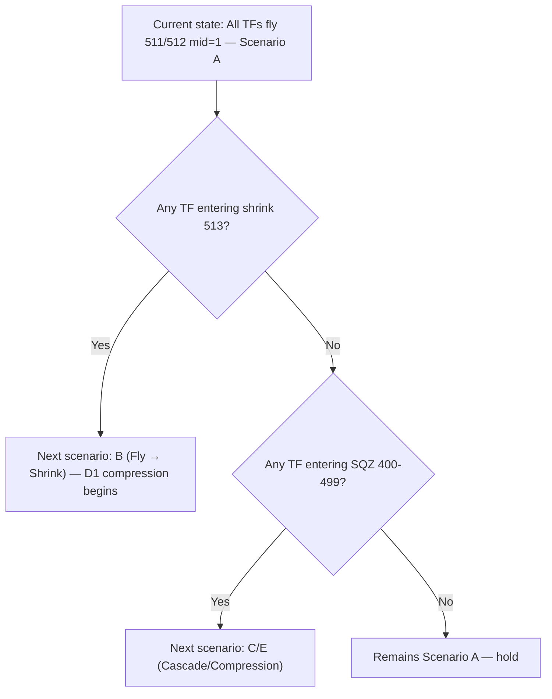

**Prediction rules:**
- IF H4 enters 513 → next scenario = B
- IF M30 or M15 enters 513 first → next scenario = B (shallow)
- Watch: H4 BBW_stage for first sign of shrink

---

## Scenario B

#### Image 1 Analysis — backtested_EA_fly_2_fly_shrink.jpg

##### Step 1: Mark Reading — Cause, Event, and Impact

| Mark | Cause (upstream TF state) | Event (transition at this bar) | Impact Immediate (1–5 bars) | Impact Sustained (duration) |
|------|--------------------------|-------------------------------|----------------------------|----------------------------|
| [TO BE FILLED] | H4 fly 511/512 mid=1 | M30/M15 transition 511→513 | Midtrend labels (3,4,5) appear | M15 confined within M30 band |

##### Step 2: HTF Analysis (W1 → D1 → H4)

| TF | BBW_stage | diffMid_Trend | BBUpDn_state | Touch Type | Role |
|----|-----------|---------------|--------------|------------|------|
| W1 | 511/512 | 1 | [TO BE FILLED] | [TO BE FILLED] | Macro direction BUY |
| D1 | 511/512 | 1 | [TO BE FILLED] | [TO BE FILLED] | Price target ceiling |
| H4 | 511/512 | 1 | [TO BE FILLED] | [TO BE FILLED] | Direction + target for M30 |

**HTF Summary:** H4 fly provides direction | H4 outer band | M15 shrinking due to M30 confinement | HTF providing context

##### Step 3: MTF Analysis (H1 → M30)

| TF | BBW_stage | diffMid_Trend | BBUpDn_state | Touch Type | Role |
|----|-----------|---------------|--------------|------------|------|
| H1  | 511/512 | 1 | [TO BE FILLED] | [TO BE FILLED] | Confirms H4 fly |
| M30 | 513/523 | 3/4/5 | [TO BE FILLED] | Type 1 | Confinement boundary for M15 |

**MTF Summary:** H1 trending, M30 ranging | M30 outer band | Type 1 | G4f-M30OPP may block | N/A | M15 confined

##### Step 4: LTF Analysis (M15 → M5)

| TF | BBW_stage | diffMid_Trend | BBUpDn_state | Touch Type | Role |
|----|-----------|---------------|--------------|------------|------|
| M15 | 513/523 | 3/4/5 | [TO BE FILLED] | Type 1 | Entry trigger on FLAT→UP/DN |
| M5  | 513/523 | 3/4/5 | [TO BE FILLED] | Type 1 | Noise — not trigger |

**LTF Summary:** D1 compression reaching LTF | [TO BE FILLED] | [TO BE FILLED] | G4c-M15OPP | M30 confined by H1 | N/A

##### Step 5: Cross-TF Impact Chain

**D1 compression (HTF → LTF):**
- H4 fly 511/512 → H1 fly → M30 shrink 513 → M15 shrink 513 → M5 shrink

**D2 expansion (LTF → HTF):**
- Not yet initiated

**Cascade position:** D1 depth = M5 | D2 initiated at = NOT YET | Leading TF = M30 (watch for SQZ or fly resume)

##### Step 6: Concluded Analysis

Scenario B — Fly → Shrink, early D1 compression. H4/H1 remain in fly providing direction. M30 has entered shrink (513) with midtrend labels (3,4,5) appearing. M15 and M5 follow. Price resting inside H4 band. Key observable: M30 BBW_stage — if it returns to 511/512, D2 expansion resumes (Scenario D); if it deepens to 400-499, D1 continues (Scenario E).

##### Step 7: Identification Flowchart

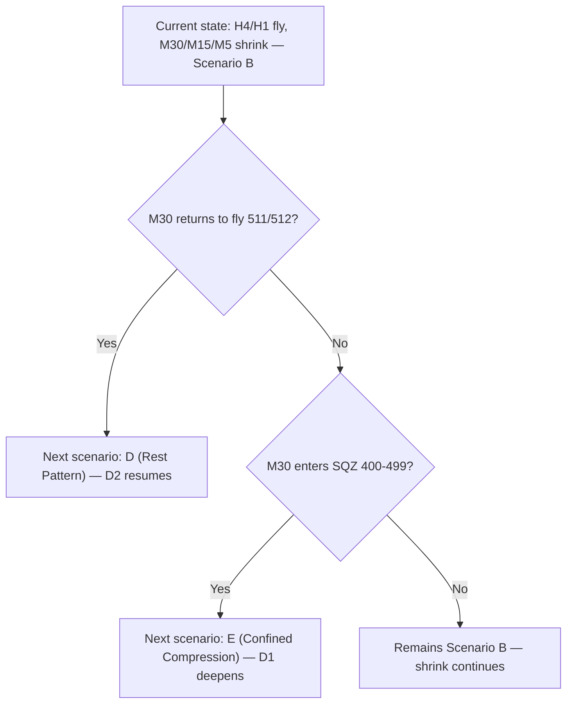

**Prediction rules:**
- IF M30 513→511/512 → next scenario = D
- IF M30 513→400-499 → next scenario = E
- Watch: M30 BBW_stage + midtrend label changes

#### Image 2 Analysis — backtested_EA_fly_2_fly_shrink_zoomin.jpg

##### Step 1: Mark Reading — Cause, Event, and Impact

| Mark | Cause (upstream TF state) | Event (transition at this bar) | Impact Immediate (1–5 bars) | Impact Sustained (duration) |
|------|--------------------------|-------------------------------|----------------------------|----------------------------|
| [TO BE FILLED] | M30 shrink 513 | M15 bands converging | Entry on M15 FLAT→UP/DN possible | M15 confined within M30 |

##### Step 2: HTF Analysis (W1 → D1 → H4)

| TF | BBW_stage | diffMid_Trend | BBUpDn_state | Touch Type | Role |
|----|-----------|---------------|--------------|------------|------|
| W1 | 511/512 | 1 | [TO BE FILLED] | [TO BE FILLED] | Macro direction BUY |
| D1 | 511/512 | 1 | [TO BE FILLED] | [TO BE FILLED] | Price target ceiling |
| H4 | 511/512 | 1 | [TO BE FILLED] | [TO BE FILLED] | Direction + target |

**HTF Summary:** H4 fly maintained | H4 outer band | M15 resting due to M30 shrink | HTF providing context

##### Step 3: MTF Analysis (H1 → M30)

| TF | BBW_stage | diffMid_Trend | BBUpDn_state | Touch Type | Role |
|----|-----------|---------------|--------------|------------|------|
| H1  | 511/512 | 1 | [TO BE FILLED] | [TO BE FILLED] | Confirms H4 fly |
| M30 | 513/523 | 3/4/5 | [TO BE FILLED] | Type 1 | Confinement for M15 |

**MTF Summary:** H1 trending, M30 ranging | M30 outer band | Type 1 | G4f-M30OPP | N/A | M15 entry via shrink path

##### Step 4: LTF Analysis (M15 → M5)

| TF | BBW_stage | diffMid_Trend | BBUpDn_state | Touch Type | Role |
|----|-----------|---------------|--------------|------------|------|
| M15 | 513/523 | 3/4/5 | [TO BE FILLED] | Type 1 | Shrink path entry trigger |
| M5  | 513/523 | 3/4/5 | [TO BE FILLED] | Type 1 | Noise |

**LTF Summary:** D1 at M15 depth | [TO BE FILLED] | [TO BE FILLED] | G4c-M15OPP | Confirmed by zoom | N/A

##### Step 5: Cross-TF Impact Chain

**D1 compression (HTF → LTF):**
- H4 fly 511/512 → H1 fly → M30 shrink 513 → M15 shrink 513 → M5 shrink

**D2 expansion (LTF → HTF):**
- Not yet initiated — watch M15 for FLAT→UP/DN

**Cascade position:** D1 depth = M5 | D2 initiated at = NOT YET | Leading TF = M15 (watch for transition)

##### Step 6: Concluded Analysis

Scenario B zoom — confirms D1 compression at M30→M15→M5. H4/H1 fly unchanged. M15 midtrend transitions are valid entry triggers. Key observable: M15 FLAT→UP/DN for shrink path entry, or M30 513→511/512 for rest pattern resumption.

##### Step 7: Identification Flowchart

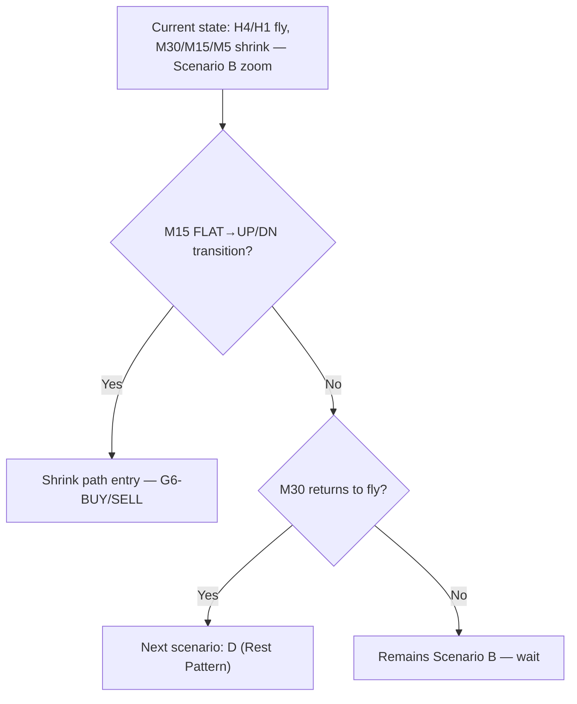

**Prediction rules:**
- IF M15 FLAT→UP/DN → shrink path entry
- IF M30 513→511/512 → next scenario = D
- Watch: M15 midtrend transition + M30 BBW_stage

---

## Scenario D

#### Image 1 Analysis — backtested_EA_fly_2_shrink_2_fly.jpg

##### Step 1: Mark Reading — Cause, Event, and Impact

| Mark | Cause (upstream TF state) | Event (transition at this bar) | Impact Immediate (1–5 bars) | Impact Sustained (duration) |
|------|--------------------------|-------------------------------|----------------------------|----------------------------|
| [TO BE FILLED] | W1/D1/H4 fly maintained | M30/M15/M5 compress then re-expand | Brief SQZ → fly resume | Rest pattern — full fly resumes |

##### Step 2: HTF Analysis (W1 → D1 → H4)

| TF | BBW_stage | diffMid_Trend | BBUpDn_state | Touch Type | Role |
|----|-----------|---------------|--------------|------------|------|
| W1 | 511/512 | 1 | [TO BE FILLED] | [TO BE FILLED] | Macro direction BUY |
| D1 | 511/512 | 1 | [TO BE FILLED] | [TO BE FILLED] | Price target ceiling |
| H4 | 511/512 | 1 | [TO BE FILLED] | [TO BE FILLED] | Guarantees fly resume |

**HTF Summary:** Full alignment maintained | D1 outer band | N/A — rest not reversal | HTF providing full context

##### Step 3: MTF Analysis (H1 → M30)

| TF | BBW_stage | diffMid_Trend | BBUpDn_state | Touch Type | Role |
|----|-----------|---------------|--------------|------------|------|
| H1  | 511/512 | 1 | [TO BE FILLED] | [TO BE FILLED] | Step maintained — rest test |
| M30 | 513→SQZ→511/512 | 3→1 | [TO BE FILLED] | Type 1 → Type 2 | Brief compression then fly |

**MTF Summary:** H1 trending, M30 brief range then fly | H4 outer band | Type 1→2 | G6-LOAD → G6-BUY | Confirms H4 | M15 follows

##### Step 4: LTF Analysis (M15 → M5)

| TF | BBW_stage | diffMid_Trend | BBUpDn_state | Touch Type | Role |
|----|-----------|---------------|--------------|------------|------|
| M15 | 513→SQZ→511/512 | 3→1 | [TO BE FILLED] | Type 1 → Type 2 | Entry on SQZ break |
| M5  | 513→SQZ→511/512 | 3→1 | [TO BE FILLED] | Type 1 → Type 2 | First to break SQZ |

**LTF Summary:** D2 leading — M5 breaks first | M5 SQZ break → REVUP | REVUP visible | G6-LOAD → G6-BUY | M30 follows M15 | N/A

##### Step 5: Cross-TF Impact Chain

**D1 compression (HTF → LTF):**
- H4 fly → H1 fly → M30 brief shrink → M15 brief shrink → M5 brief SQZ → M5 breaks SQZ first

**D2 expansion (LTF → HTF):**
- M5 REVUP → M15 follows → M30 follows → H1 maintains → H4 fly unchanged

**Cascade position:** D1 reached BOTTOM (M5 SQZ) → D2 initiated at M5 | Leading TF = M5 (broke SQZ)

##### Step 6: Concluded Analysis

Scenario D — Rest Pattern, D1→D2 transition confirmed. W1/D1/H4/H1 fly unchanged throughout. M30/M15/M5 briefly compressed (shrink→SQZ) then re-expanded in same direction. M5 broke SQZ first (REVUP) driving D2 expansion. Key observable: H1 step direction maintained — if it breaks, becomes reversal (Scenario G2).

##### Step 7: Identification Flowchart

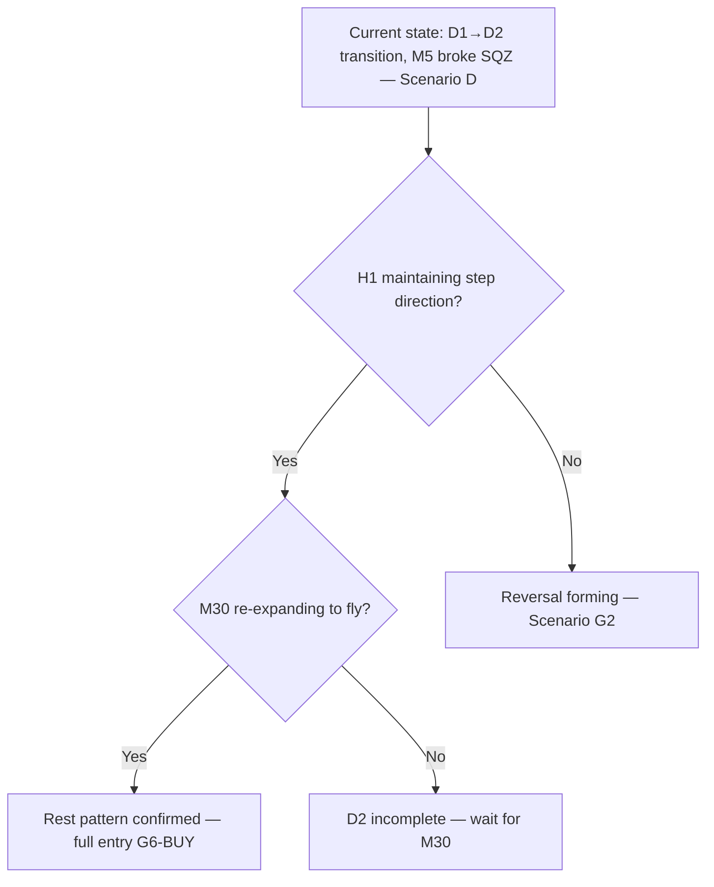

**Prediction rules:**
- IF H1 maintains step → rest pattern → Scenario A
- IF H1 reverses → Scenario G2 (reversal)
- Watch: H1 BBW_stage + M30 re-expansion

#### Image 2 Analysis — backtested_EA_fly_2_shrink_2_fly_zoomin.jpg

##### Step 1: Mark Reading — Cause, Event, and Impact

| Mark | Cause (upstream TF state) | Event (transition at this bar) | Impact Immediate (1–5 bars) | Impact Sustained (duration) |
|------|--------------------------|-------------------------------|----------------------------|----------------------------|
| [TO BE FILLED] | M30 shrink → SQZ | M5 SQZ break REVUP | G6-LOAD → G6-BUY | Fly resumes full |

##### Step 2: HTF Analysis (W1 → D1 → H4)

| TF | BBW_stage | diffMid_Trend | BBUpDn_state | Touch Type | Role |
|----|-----------|---------------|--------------|------------|------|
| W1 | 511/512 | 1 | [TO BE FILLED] | [TO BE FILLED] | Macro direction BUY |
| D1 | 511/512 | 1 | [TO BE FILLED] | [TO BE FILLED] | Price target ceiling |
| H4 | 511/512 | 1 | [TO BE FILLED] | [TO BE FILLED] | Fly guarantee |

**HTF Summary:** Unchanged fly | D1 outer band | N/A | HTF context stable

##### Step 3: MTF Analysis (H1 → M30)

| TF | BBW_stage | diffMid_Trend | BBUpDn_state | Touch Type | Role |
|----|-----------|---------------|--------------|------------|------|
| H1  | 511/512 | 1 | [TO BE FILLED] | [TO BE FILLED] | Step maintained |
| M30 | SQZ→511/512 | 3→1 | [TO BE FILLED] | Type 2 | D2 re-expanding |

**MTF Summary:** Both trending again | H4 outer band | Type 2 | G6-BUY | H4 confirmed | M15 entry valid

##### Step 4: LTF Analysis (M15 → M5)

| TF | BBW_stage | diffMid_Trend | BBUpDn_state | Touch Type | Role |
|----|-----------|---------------|--------------|------------|------|
| M15 | SQZ→511/512 | 3→1 | [TO BE FILLED] | Type 2 | Entry trigger |
| M5  | SQZ→511/512 | 3→1 | [TO BE FILLED] | Type 2 | D2 initiator |

**LTF Summary:** D2 complete — fly resumed | REVUP fired | REVUP visible | G6-BUY | M30 re-expanded | N/A

##### Step 5: Cross-TF Impact Chain

**D1 compression (HTF → LTF):**
- Complete — M5 SQZ was deepest point, now resolved

**D2 expansion (LTF → HTF):**
- M5 REVUP → M15 fly → M30 fly → H1 maintained → H4 fly

**Cascade position:** D2 complete — TOP reached | Leading TF = M30 (confirm fly)

##### Step 6: Concluded Analysis

Scenario D zoom — confirms D2 expansion from M5 SQZ break. All lower TFs re-expanded to fly in same direction. H4/H1 fly unchanged. Key observable: M30 fly confirmation = full entry. Next: watch for new D1 compression if M30 enters shrink again.

##### Step 7: Identification Flowchart

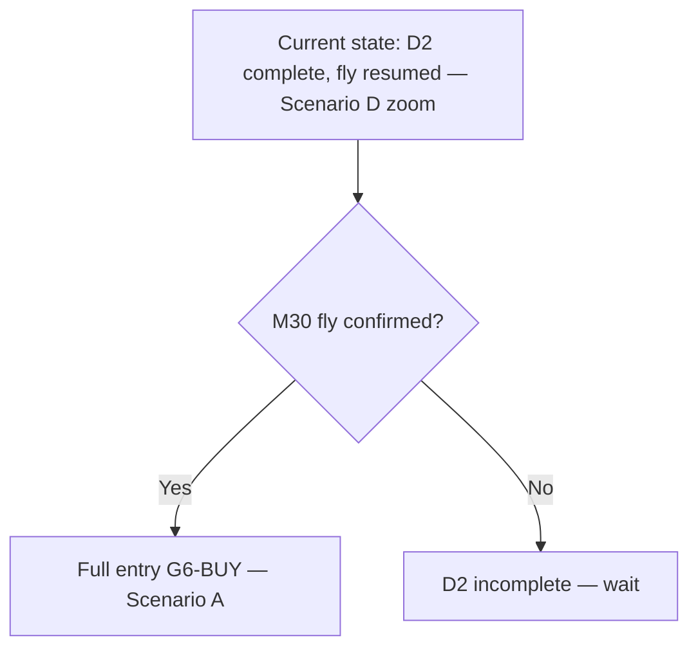

**Prediction rules:**
- IF M30 fly 511/512 → Scenario A
- IF M30 enters shrink → Scenario B
- Watch: M30 BBW_stage

---

## Scenario F

#### Image 1 Analysis — backtested_EA_sideway_2_fly.jpg

##### Step 1: Mark Reading — Cause, Event, and Impact

| Mark | Cause (upstream TF state) | Event (transition at this bar) | Impact Immediate (1–5 bars) | Impact Sustained (duration) |
|------|--------------------------|-------------------------------|----------------------------|----------------------------|
| [TO BE FILLED] | All TF SQZ 400-499 | M5 breaks SQZ, REVUP/REVDN | G6-LOAD → G6-BUY/SELL | D2 expansion upward |

##### Step 2: HTF Analysis (W1 → D1 → H4)

| TF | BBW_stage | diffMid_Trend | BBUpDn_state | Touch Type | Role |
|----|-----------|---------------|--------------|------------|------|
| W1 | [TO BE FILLED] | [TO BE FILLED] | [TO BE FILLED] | [TO BE FILLED] | [TO BE FILLED] |
| D1 | [TO BE FILLED] | [TO BE FILLED] | [TO BE FILLED] | [TO BE FILLED] | Breakout direction |
| H4 | 400-499 | 3 | [TO BE FILLED] | Type 3 | SQZ — breakout target |

**HTF Summary:** [TO BE FILLED] | D1 outer band | All TF SQZ | HTF also compressing

##### Step 3: MTF Analysis (H1 → M30)

| TF | BBW_stage | diffMid_Trend | BBUpDn_state | Touch Type | Role |
|----|-----------|---------------|--------------|------------|------|
| H1  | 400-499 | 3 | [TO BE FILLED] | Type 3 | SQZ — follows M5 break |
| M30 | 400-499 | 3 | [TO BE FILLED] | Type 3 | SQZ — confirms D2 |

**MTF Summary:** Ranging — both SQZ | H4 outer band | Type 3 | G0c-SQZLOCK | N/A | M15 follows M5

##### Step 4: LTF Analysis (M15 → M5)

| TF | BBW_stage | diffMid_Trend | BBUpDn_state | Touch Type | Role |
|----|-----------|---------------|--------------|------------|------|
| M15 | 400→511/512 | 3→1 | [TO BE FILLED] | Type 3→Type 2 | Entry on SQZ break |
| M5  | 400→511/512 | 3→1 | [TO BE FILLED] | Type 3→Type 2 | D2 initiator |

**LTF Summary:** D2 leading — M5 breaks first | M5→511/512 | REVUP visible | G6-LOAD → G6-BUY | M30 follows | N/A

##### Step 5: Cross-TF Impact Chain

**D1 compression (HTF → LTF):**
- Complete — all TF in SQZ (BOTTOM)

**D2 expansion (LTF → HTF):**
- M5 REVUP → M15 follows → M30 follows → H1 follows → H4 eventually

**Cascade position:** D2 initiated at M5 | Leading TF = M5 (broke SQZ)

##### Step 6: Concluded Analysis

Scenario F — SQZ → Fly breakout. All TFs in SQZ (400-499) transitioning to fly. M5 broke SQZ first (REVUP/REVDN), driving D2 expansion. D1 direction determines breakout sustainability. Key observable: M30 SQZ break confirms full entry.

##### Step 7: Identification Flowchart

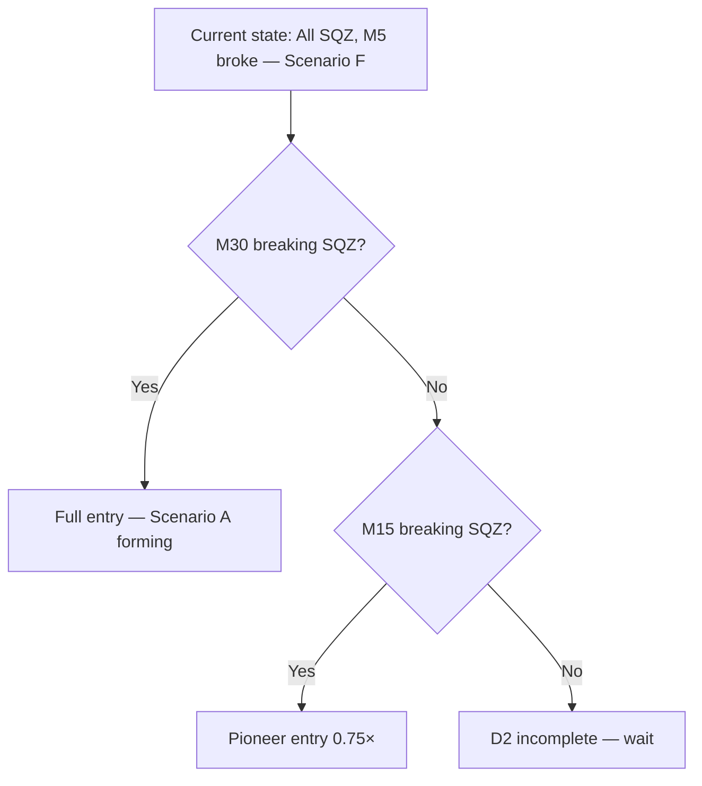

**Prediction rules:**
- IF M30 400→511/512 → Scenario A
- IF only M15 breaks → pioneer entry 0.75×
- Watch: M30 BBW_stage

#### Image 2 Analysis — backtested_EA_sideway_2_fly_zoomin.jpg

##### Step 1: Mark Reading — Cause, Event, and Impact

| Mark | Cause (upstream TF state) | Event (transition at this bar) | Impact Immediate (1–5 bars) | Impact Sustained (duration) |
|------|--------------------------|-------------------------------|----------------------------|----------------------------|
| [TO BE FILLED] | M5 fly 511/512 | M15 SQZ break | G6-BUY/SELL entry | Full fly resuming |

##### Step 2: HTF Analysis (W1 → D1 → H4)

| TF | BBW_stage | diffMid_Trend | BBUpDn_state | Touch Type | Role |
|----|-----------|---------------|--------------|------------|------|
| W1 | [TO BE FILLED] | [TO BE FILLED] | [TO BE FILLED] | [TO BE FILLED] | [TO BE FILLED] |
| D1 | [TO BE FILLED] | [TO BE FILLED] | [TO BE FILLED] | [TO BE FILLED] | Direction bias |
| H4 | 400→513 | 3→3/4/5 | [TO BE FILLED] | Type 3→Type 1 | SQZ release |

**HTF Summary:** [TO BE FILLED] | H4 outer band | SQZ releasing | HTF decompressing

##### Step 3: MTF Analysis (H1 → M30)

| TF | BBW_stage | diffMid_Trend | BBUpDn_state | Touch Type | Role |
|----|-----------|---------------|--------------|------------|------|
| H1  | 400→513 | 3→3/4/5 | [TO BE FILLED] | Type 3→Type 1 | SQZ release |
| M30 | 400→511/512 | 3→1 | [TO BE FILLED] | Type 3→Type 2 | D2 confirmed |

**MTF Summary:** SQZ→fly | H4 outer band | Type 3→2 | G6-BUY | D2 expanding | M15 entry valid

##### Step 4: LTF Analysis (M15 → M5)

| TF | BBW_stage | diffMid_Trend | BBUpDn_state | Touch Type | Role |
|----|-----------|---------------|--------------|------------|------|
| M15 | 400→511/512 | 3→1 | [TO BE FILLED] | Type 2 | Entry trigger |
| M5  | 511/512 | 1 | [TO BE FILLED] | Type 2 | D2 leader |

**LTF Summary:** D2 confirmed | M5 fly → M15 fly | REVUP visible | G6-BUY | M30 follows | N/A

##### Step 5: Cross-TF Impact Chain

**D1 compression (HTF → LTF):**
- Resolved — SQZ breaking

**D2 expansion (LTF → HTF):**
- M5 fly → M15 fly → M30 fly → H1 shrink → H4 decompressing

**Cascade position:** D2 advancing | Leading TF = M30 (confirm fly)

##### Step 6: Concluded Analysis

Scenario F zoom — D2 expansion confirmed. M5/M15/M30 all re-expanded to fly. H4 decompressing from SQZ. Key observable: M30 fly confirmation = full entry. Next: Scenario A if H4 also flies.

##### Step 7: Identification Flowchart

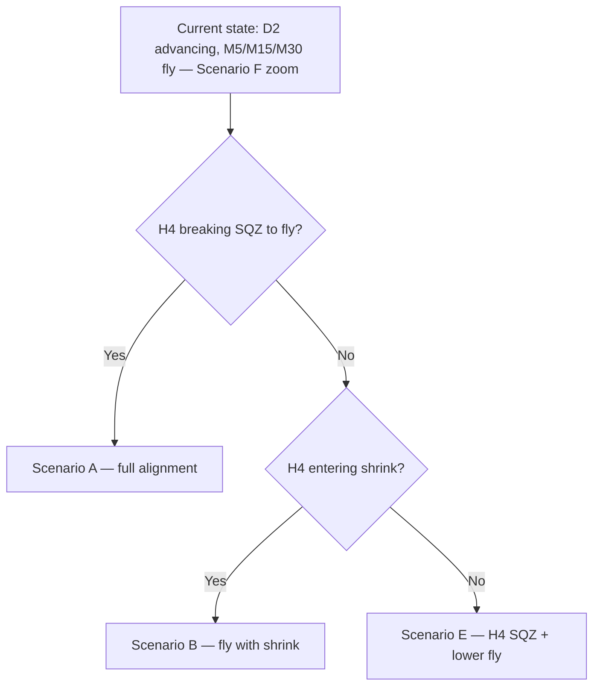

**Prediction rules:**
- IF H4 400→511/512 → Scenario A
- IF H4 400→513 → Scenario B
- Watch: H4 BBW_stage

---

## Scenario G

#### Image 1 Analysis — backtested_EA_trend_reversal.jpg

##### Step 1: Mark Reading — Cause, Event, and Impact

| Mark | Cause (upstream TF state) | Event (transition at this bar) | Impact Immediate (1–5 bars) | Impact Sustained (duration) |
|------|--------------------------|-------------------------------|----------------------------|----------------------------|
| [TO BE FILLED: describe mark color and location] | [TO BE FILLED: which TF, BBW_stage, mid value caused this] | [TO BE FILLED: BBW_stage change / mid flip / BBUpDn change / gate fire] | [TO BE FILLED: which TF follows, what gate fires, what action triggered] | [TO BE FILLED: confinement boundaries, valid entries, size rules, active gates] |

##### Step 2: HTF Analysis (W1 → D1 → H4)

| TF | BBW_stage | diffMid_Trend | BBUpDn_state | Touch Type | Role in Image |
|----|-----------|---------------|--------------|------------|---------------|
| W1 | [TO BE FILLED] | [TO BE FILLED] | [TO BE FILLED] | [TO BE FILLED] | [TO BE FILLED] |
| D1 | [TO BE FILLED] | [TO BE FILLED] | [TO BE FILLED] | [TO BE FILLED] | [TO BE FILLED] |
| H4 | [TO BE FILLED] | [TO BE FILLED] | [TO BE FILLED] | [TO BE FILLED] | [TO BE FILLED] |

**HTF Summary:**
- Macro direction: [TO BE FILLED]
- Price target: [TO BE FILLED]
- Why LTF sideway: [TO BE FILLED]
- HTF providing context or also compressing: [TO BE FILLED]

##### Step 3: MTF Analysis (H1 → M30)

| TF  | BBW_stage | diffMid_Trend | BBUpDn_state | Touch Type | Role in Image |
|-----|-----------|---------------|--------------|------------|---------------|
| H1  | [TO BE FILLED] | [TO BE FILLED] | [TO BE FILLED] | [TO BE FILLED] | [TO BE FILLED] |
| M30 | [TO BE FILLED] | [TO BE FILLED] | [TO BE FILLED] | [TO BE FILLED] | [TO BE FILLED] |

**MTF Summary:**
- Trending or ranging: [TO BE FILLED]
- Confinement boundary: [TO BE FILLED]
- Touch type at MTF: [TO BE FILLED]
- Active gate: [TO BE FILLED]
- Impact on H4: [TO BE FILLED]
- Impact on M15: [TO BE FILLED]

##### Step 4: LTF Analysis (M15 → M5)

| TF  | BBW_stage | diffMid_Trend | BBUpDn_state | Touch Type | Role in Image |
|-----|-----------|---------------|--------------|------------|---------------|
| M15 | [TO BE FILLED] | [TO BE FILLED] | [TO BE FILLED] | [TO BE FILLED] | [TO BE FILLED] |
| M5  | [TO BE FILLED] | [TO BE FILLED] | [TO BE FILLED] | [TO BE FILLED] | [TO BE FILLED] |

**LTF Summary:**
- LTF leading (D2) or lagging (D1): [TO BE FILLED]
- M5 BBUpDn_state sequence: [TO BE FILLED]
- REVUP/REVDN visible: [TO BE FILLED]
- Active gate: [TO BE FILLED]
- Impact on MTF: [TO BE FILLED]
- Impact on HTF eventually: [TO BE FILLED]

##### Step 5: Cross-TF Impact Chain

**D1 direction (HTF causing LTF confinement):**
```
[TO BE FILLED: H4 state]
  → [TO BE FILLED: H1 consequence]
    → [TO BE FILLED: M30 consequence]
      → [TO BE FILLED: M15 consequence]
        → [TO BE FILLED: M5 consequence]
```

**D2 direction (LTF signalling HTF):**
```
[TO BE FILLED: M5 state]
  → [TO BE FILLED: M15 follows in X bars]
    → [TO BE FILLED: M30 follows]
      → [TO BE FILLED: H1 follows]
        → [TO BE FILLED: H4 eventually]
```

**Cascade position at time of image:**
- D1 reached depth: [TO BE FILLED — deepest TF in SQZ]
- D2 initiated at: [TO BE FILLED — lowest TF that broke SQZ, or NOT YET]
- Leading TF to watch: [TO BE FILLED]

##### Step 6: Concluded Image Analysis

[TO BE FILLED: single paragraph — scenario name + sub-scenario stage + HTF context + MTF state + LTF state + cascade position + touch behavior + key observable + next scenario prediction]

##### Step 7: Identification Flowchart for Trend Prediction

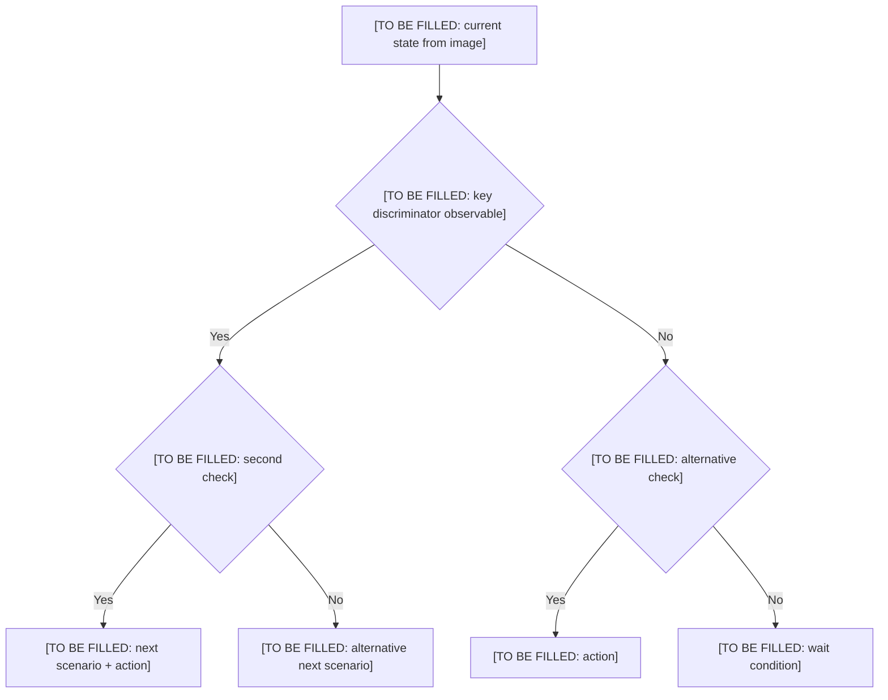

**Prediction rules from this image:**
- IF [TO BE FILLED: observable A] THEN next scenario = [TO BE FILLED]
- IF [TO BE FILLED: observable B] THEN next scenario = [TO BE FILLED]
- Discriminator TF: [TO BE FILLED]
- Watch: [TO BE FILLED: specific BBW_stage or mid flip to monitor]

#### Image 2 Analysis — backtested_EA_fly_shrink_2_sideway2.jpg

##### Step 1: Mark Reading — Cause, Event, and Impact

| Mark | Cause (upstream TF state) | Event (transition at this bar) | Impact Immediate (1–5 bars) | Impact Sustained (duration) |
|------|--------------------------|-------------------------------|----------------------------|----------------------------|
| [TO BE FILLED: describe mark color and location] | [TO BE FILLED: which TF, BBW_stage, mid value caused this] | [TO BE FILLED: BBW_stage change / mid flip / BBUpDn change / gate fire] | [TO BE FILLED: which TF follows, what gate fires, what action triggered] | [TO BE FILLED: confinement boundaries, valid entries, size rules, active gates] |

##### Step 2: HTF Analysis (W1 → D1 → H4)

| TF | BBW_stage | diffMid_Trend | BBUpDn_state | Touch Type | Role in Image |
|----|-----------|---------------|--------------|------------|---------------|
| W1 | [TO BE FILLED] | [TO BE FILLED] | [TO BE FILLED] | [TO BE FILLED] | [TO BE FILLED] |
| D1 | [TO BE FILLED] | [TO BE FILLED] | [TO BE FILLED] | [TO BE FILLED] | [TO BE FILLED] |
| H4 | [TO BE FILLED] | [TO BE FILLED] | [TO BE FILLED] | [TO BE FILLED] | [TO BE FILLED] |

**HTF Summary:**
- Macro direction: [TO BE FILLED]
- Price target: [TO BE FILLED]
- Why LTF sideway: [TO BE FILLED]
- HTF providing context or also compressing: [TO BE FILLED]

##### Step 3: MTF Analysis (H1 → M30)

| TF  | BBW_stage | diffMid_Trend | BBUpDn_state | Touch Type | Role in Image |
|-----|-----------|---------------|--------------|------------|---------------|
| H1  | [TO BE FILLED] | [TO BE FILLED] | [TO BE FILLED] | [TO BE FILLED] | [TO BE FILLED] |
| M30 | [TO BE FILLED] | [TO BE FILLED] | [TO BE FILLED] | [TO BE FILLED] | [TO BE FILLED] |

**MTF Summary:**
- Trending or ranging: [TO BE FILLED]
- Confinement boundary: [TO BE FILLED]
- Touch type at MTF: [TO BE FILLED]
- Active gate: [TO BE FILLED]
- Impact on H4: [TO BE FILLED]
- Impact on M15: [TO BE FILLED]

##### Step 4: LTF Analysis (M15 → M5)

| TF  | BBW_stage | diffMid_Trend | BBUpDn_state | Touch Type | Role in Image |
|-----|-----------|---------------|--------------|------------|---------------|
| M15 | [TO BE FILLED] | [TO BE FILLED] | [TO BE FILLED] | [TO BE FILLED] | [TO BE FILLED] |
| M5  | [TO BE FILLED] | [TO BE FILLED] | [TO BE FILLED] | [TO BE FILLED] | [TO BE FILLED] |

**LTF Summary:**
- LTF leading (D2) or lagging (D1): [TO BE FILLED]
- M5 BBUpDn_state sequence: [TO BE FILLED]
- REVUP/REVDN visible: [TO BE FILLED]
- Active gate: [TO BE FILLED]
- Impact on MTF: [TO BE FILLED]
- Impact on HTF eventually: [TO BE FILLED]

##### Step 5: Cross-TF Impact Chain

**D1 direction (HTF causing LTF confinement):**
```
[TO BE FILLED: H4 state]
  → [TO BE FILLED: H1 consequence]
    → [TO BE FILLED: M30 consequence]
      → [TO BE FILLED: M15 consequence]
        → [TO BE FILLED: M5 consequence]
```

**D2 direction (LTF signalling HTF):**
```
[TO BE FILLED: M5 state]
  → [TO BE FILLED: M15 follows in X bars]
    → [TO BE FILLED: M30 follows]
      → [TO BE FILLED: H1 follows]
        → [TO BE FILLED: H4 eventually]
```

**Cascade position at time of image:**
- D1 reached depth: [TO BE FILLED — deepest TF in SQZ]
- D2 initiated at: [TO BE FILLED — lowest TF that broke SQZ, or NOT YET]
- Leading TF to watch: [TO BE FILLED]

##### Step 6: Concluded Image Analysis

[TO BE FILLED: single paragraph — scenario name + sub-scenario stage + HTF context + MTF state + LTF state + cascade position + touch behavior + key observable + next scenario prediction]

##### Step 7: Identification Flowchart for Trend Prediction


**Prediction rules from this image:**
- IF [TO BE FILLED: observable A] THEN next scenario = [TO BE FILLED]
- IF [TO BE FILLED: observable B] THEN next scenario = [TO BE FILLED]
- Discriminator TF: [TO BE FILLED]
- Watch: [TO BE FILLED: specific BBW_stage or mid flip to monitor]

---

## Scenario E

#### Image 1 Analysis — backtested_EA_fly_shrink_2_sideway.jpg

##### Step 1: Mark Reading — Cause, Event, and Impact

| Mark | Cause (upstream TF state) | Event (transition at this bar) | Impact Immediate (1–5 bars) | Impact Sustained (duration) |
|------|--------------------------|-------------------------------|----------------------------|----------------------------|
| Yellow rectangles | H4 fly 511/512 | M5→M15→M30 sequential compression | Midband labels (3,4,5) appear | Lower TF confined within H4 envelope |
| Red rectangles | M30+M15+M5 all SQZ | G0c-SQZLOCK fires | No new entries | Range trade at H4 boundaries only |

##### Step 2: HTF Analysis (W1 → D1 → H4)

| TF | BBW_stage | diffMid_Trend | BBUpDn_state | Touch Type | Role |
|----|-----------|---------------|--------------|------------|------|
| W1 | [TO BE FILLED] | [TO BE FILLED] | [TO BE FILLED] | [TO BE FILLED] | [TO BE FILLED] |
| D1 | [TO BE FILLED] | [TO BE FILLED] | [TO BE FILLED] | [TO BE FILLED] | [TO BE FILLED] |
| H4 | 511/512/521/522 | 1/2 | [TO BE FILLED] | Type 2 | Directional context — fly expand |

**HTF Summary:** H4 fly expand provides direction | H4 outer band | Lower TF confined by H4 envelope | HTF providing full context

##### Step 3: MTF Analysis (H1 → M30)

| TF | BBW_stage | diffMid_Trend | BBUpDn_state | Touch Type | Role |
|----|-----------|---------------|--------------|------------|------|
| H1  | 511/512/521/522 | 1/2 | [TO BE FILLED] | Type 2 | Follows H4 — confirms direction |
| M30 | 511→513→400-499 | 1/2→3/4/5→3 | [TO BE FILLED] | Type 1→Type 3 | Confinement depth indicator |

**MTF Summary:** H1 trending, M30 ranging → SQZ | H4 outer band | Type 1→3 | G4f-M30OPP then G0c-SQZLOCK | H4 unchanged | M15 confined

##### Step 4: LTF Analysis (M15 → M5)

| TF | BBW_stage | diffMid_Trend | BBUpDn_state | Touch Type | Role |
|----|-----------|---------------|--------------|------------|------|
| M15 | 511→513→400-499 | 1/2→3/4/5→3 | [TO BE FILLED] | Type 1→Type 3 | G0b-PINK when SQZ |
| M5  | 511→513→400-499 | 1/2→3/4/5→3 | [TO BE FILLED] | Type 1→Type 3 | First to compress, first to break |

**LTF Summary:** D1 compression reaching BOTTOM | M5 first to collapse | [TO BE FILLED] | G0b-M5OPP → G0b-PINK | Confirms M30 | N/A

##### Step 5: Cross-TF Impact Chain

**D1 compression (HTF → LTF):**
- H4 fly 511/512 → H1 fly → M30 shrink 513→SQZ → M15 shrink→SQZ → M5 shrink→SQZ (first)

**D2 expansion (LTF → HTF):**
- Not yet — all lower TF in SQZ

**Cascade position:** D1 depth = M5 (full SQZ) | D2 initiated at = NOT YET | Leading TF = M5 (watch for REVUP/REVDN)

##### Step 6: Concluded Analysis

Scenario E — Fly expand + confined compression, Image 1. H4/H1 fly expand maintained throughout. Multiple compression zones visible: yellow rectangles (shrink phase) and red rectangles (full SQZ). Compression localized to M30/M15/M5 — H4/H1 provide directional context. Sequential compression: M5 first, M15 second, M30 third. G0c-SQZLOCK and G0b-PINK active. Key observable: M5 SQZ break (REVUP/REVDN) initiates D2 expansion.

##### Step 7: Identification Flowchart

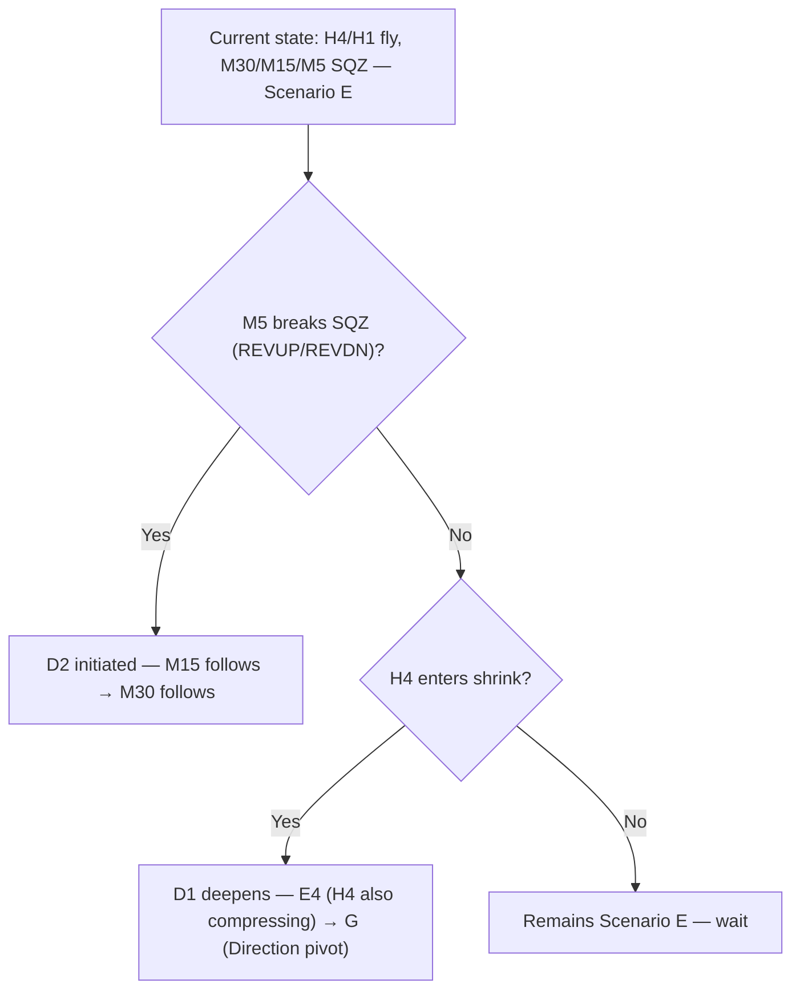

**Prediction rules:**
- IF M5 REVUP/REVDN → D2 expansion begins
- IF H4 511→513 → D1 deepens toward G
- Watch: M5 BBW_stage 400-499→511/512 + REVUP/REVDN

#### Image 2 Analysis — backtested_EA_fly_shrink_2_sideway_zoomin.jpg

##### Step 1: Mark Reading — Cause, Event, and Impact

| Mark | Cause (upstream TF state) | Event (transition at this bar) | Impact Immediate (1–5 bars) | Impact Sustained (duration) |
|------|--------------------------|-------------------------------|----------------------------|----------------------------|
| [TO BE FILLED] | M5 SQZ → breakout | M5 REVUP/REVDN | G6-LOAD → G6-BUY/SELL | M15 follows within 2-3 bars |

##### Step 2: HTF Analysis (W1 → D1 → H4)

| TF | BBW_stage | diffMid_Trend | BBUpDn_state | Touch Type | Role |
|----|-----------|---------------|--------------|------------|------|
| W1 | [TO BE FILLED] | [TO BE FILLED] | [TO BE FILLED] | [TO BE FILLED] | [TO BE FILLED] |
| D1 | [TO BE FILLED] | [TO BE FILLED] | [TO BE FILLED] | [TO BE FILLED] | [TO BE FILLED] |
| H4 | 511/512/521/522 | 1/2 MAINTAINED | [TO BE FILLED] | Type 2 | Directional context unchanged |

**HTF Summary:** H4 fly maintained | H4 outer band | Lower TF confined by H4 | HTF providing context

##### Step 3: MTF Analysis (H1 → M30)

| TF | BBW_stage | diffMid_Trend | BBUpDn_state | Touch Type | Role |
|----|-----------|---------------|--------------|------------|------|
| H1  | 511/512/521/522 | 1/2 MAINTAINED | [TO BE FILLED] | Type 2 | Follows H4 |
| M30 | 400-499→513 | 3→3/4/5 | [TO BE FILLED] | Type 3→Type 1 | SQZ release → shrink |

**MTF Summary:** H1 trending, M30 SQZ→shrink | H4 outer band | Type 3→1 | G0c-SQZLOCK → G4f-M30OPP | H4 confirmed | M15 follows M30

##### Step 4: LTF Analysis (M15 → M5)

| TF | BBW_stage | diffMid_Trend | BBUpDn_state | Touch Type | Role |
|----|-----------|---------------|--------------|------------|------|
| M15 | 400-499→513 | 3→3/4/5 | [TO BE FILLED] | Type 3→Type 1 | G0b-PINK → entry trigger |
| M5  | 400-499→511/512 | 3→1/2 | [TO BE FILLED] | Type 3→Type 2 | D2 initiator — REVUP/REVDN |

**LTF Summary:** D2 leading — M5 broke SQZ | M5→511/512 | REVUP/REVDN visible | G6-LOAD → G6-BUY/SELL | M30 follows | N/A

##### Step 5: Cross-TF Impact Chain

**D1 compression (HTF → LTF):**
- Complete — H4 fly → H1 fly → M30 SQZ → M15 SQZ → M5 SQZ (reached BOTTOM)

**D2 expansion (LTF → HTF):**
- M5 REVUP → M15 follows → M30 follows → H1 maintains → H4 fly

**Cascade position:** D2 initiated at M5 | Leading TF = M5 (broke SQZ)

##### Step 6: Concluded Analysis

Scenario E zoom — confirms D2 expansion from M5 SQZ break. H4/H1 fly unchanged. M5 broke SQZ first (REVUP/REVDN), M15 and M30 follow. Touch evolution: L touches building → balanced oscillation → U touches increasing (pre-breakout). Gate sequence: G0b-M5OPP → G4c-M15OPP → G0c-SQZLOCK → G0b-PINK → G6-LOAD → G6-BUY/SELL. Key observable: M15 re-expansion to fly confirms D2.

##### Step 7: Identification Flowchart

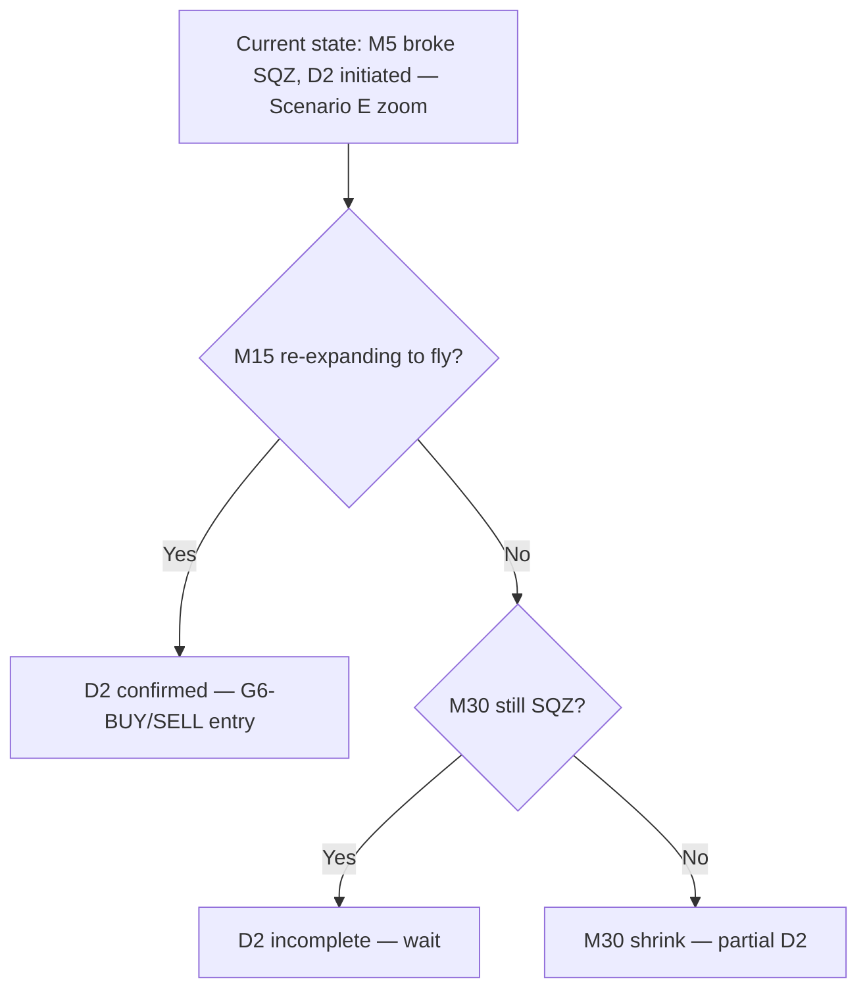

**Prediction rules:**
- IF M15 400→511/512 → D2 confirmed
- IF M30 remains 400-499 → D2 blocked
- Watch: M15 BBW_stage + M30 midtrend

#### Image 3 Analysis — backtested_EA_fly_shrink_2_sideway2.jpg

##### Step 1: Mark Reading — Cause, Event, and Impact

| Mark | Cause (upstream TF state) | Event (transition at this bar) | Impact Immediate (1–5 bars) | Impact Sustained (duration) |
|------|--------------------------|-------------------------------|----------------------------|----------------------------|
| Zone 2 (yellow) | M30 511→513 | M5 begins shrink | G0b-M5OPP may block | D1 compression deepens |
| Zone 3-5 (red) | All lower TF SQZ | G0c-SQZLOCK + G0b-PINK | No entries | Range trade only |
| Zone 6 (recovery) | M5 SQZ break | REVUP/REVDN + G6-LOAD | G6-BUY/SELL | D2 expansion |

##### Step 2: HTF Analysis (W1 → D1 → H4)

| TF | BBW_stage | diffMid_Trend | BBUpDn_state | Touch Type | Role |
|----|-----------|---------------|--------------|------------|------|
| W1 | [TO BE FILLED] | [TO BE FILLED] | [TO BE FILLED] | [TO BE FILLED] | [TO BE FILLED] |
| D1 | [TO BE FILLED] | [TO BE FILLED] | [TO BE FILLED] | [TO BE FILLED] | [TO BE FILLED] |
| H4 | 511/512/521/522 (all zones) | 1/2 (all zones) | [TO BE FILLED] | Type 2 | Fly expand MAINTAINED throughout |

**HTF Summary:** H4 fly MAINTAINED all 6 zones | H4 outer band | Lower TF confined within H4 | HTF providing full context

##### Step 3: MTF Analysis (H1 → M30)

| TF | BBW_stage | diffMid_Trend | BBUpDn_state | Touch Type | Role |
|----|-----------|---------------|--------------|------------|------|
| H1  | 511/512/521/522 (all zones) | 1/2 (all zones) | [TO BE FILLED] | Type 2 | Fly MAINTAINED — confirms H4 |
| M30 | 511→513→400→513 | 1/2→3/4/5→3→3/4/5 | [TO BE FILLED] | Type 1→3→1 | Full D1 cycle |

**MTF Summary:** H1 trending all zones, M30 full D1 cycle | H4 outer band | Type 1→3→1 | G4f-M30OPP → G0c-SQZLOCK → G4f-M30OPP | H4 unchanged | M15 confined

##### Step 4: LTF Analysis (M15 → M5)

| TF | BBW_stage | diffMid_Trend | BBUpDn_state | Touch Type | Role |
|----|-----------|---------------|--------------|------------|------|
| M15 | 511→513→400→513 | 1/2→3/4/5→3→3/5 | [TO BE FILLED] | Type 1→3→1 | Full D1 cycle |
| M5  | 511→513→400→513 | 1/2→3/4/5→3→3/5 | [TO BE FILLED] | Type 1→3→1 | First compress, first break |

**LTF Summary:** Full D1 cycle: compress→SQZ→release | M5→M15→M30 cascade | REVUP/REVDN visible | G0b-M5OPP → G0b-PINK → G6-LOAD | Confirms M30 | N/A

##### Step 5: Cross-TF Impact Chain

**D1 compression (HTF → LTF):**
- H4 fly (zone 1-6) → H1 fly (zone 1-6) → M30 shrink→SQZ→shrink (zone 2-6) → M15 shrink→SQZ→shrink → M5 shrink→SQZ→shrink

**D2 expansion (LTF → HTF):**
- Zone 6: M5 shrink→break → M15 follows → M30 follows → H1 maintains → H4 fly

**Cascade position:** D1 full cycle (zone 1→6) | D2 initiated at M5 (zone 6) | Leading TF = M5

##### Step 6: Concluded Analysis

Scenario E Image 3 — comprehensive 6-zone view of H4/H1 fly expand + lower TF confined compression. Core finding: H4/H1 fly expand MAINTAINED throughout all compression zones (1-6). Compression localized to M30/M15/M5 only. Zone progression: fly (1) → shrink (2) → SQZ peak (3-5) → shrink release (6). Touch evolution: L touches (entry) → L persistent (compression) → balanced (loading) → U touches (pre-breakout). Gate sequence: G0b-M5OPP → G0c-SQZLOCK → G0b-PINK → G0 → G6-LOAD → G6-BUY/SELL. Range trade at H4 band boundaries: sell upper, buy lower.

##### Step 7: Identification Flowchart

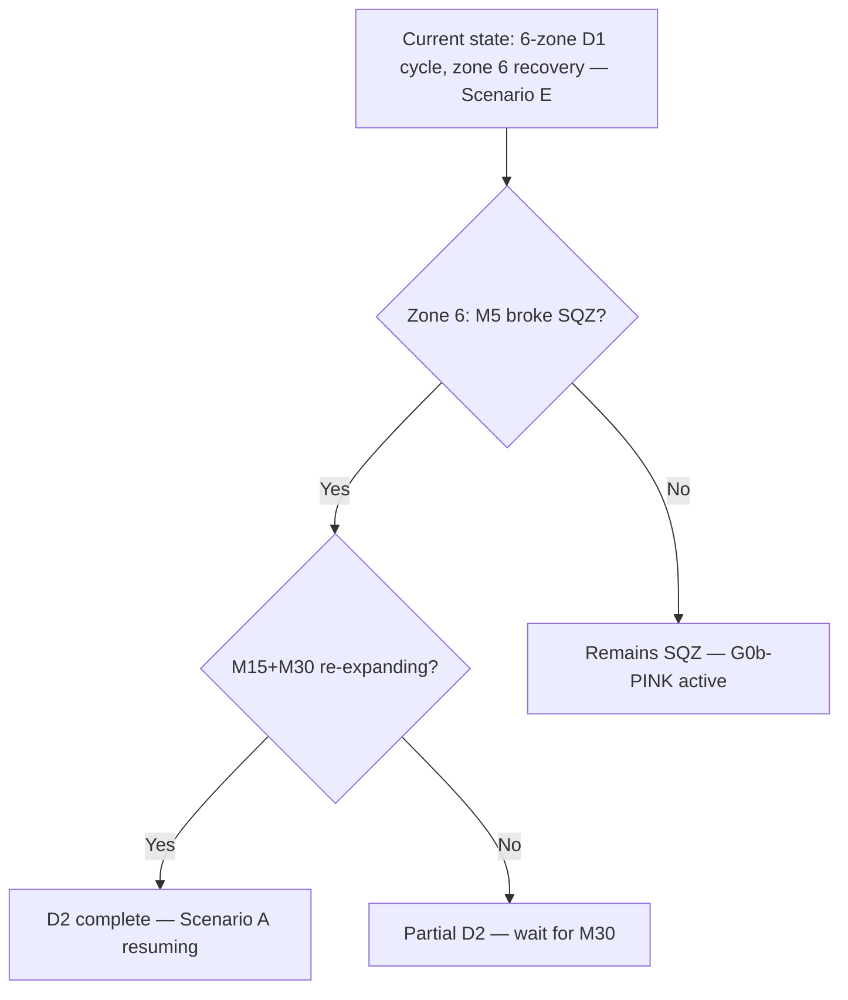

**Prediction rules:**
- IF M15+M30 400→511/512 → Scenario A
- IF M30 remains 513 → Scenario B
- IF H4 enters 513 → Scenario E4 risk (H4 compressing → Direction pivot)
- Watch: M30 BBW_stage + M15 midtrend
