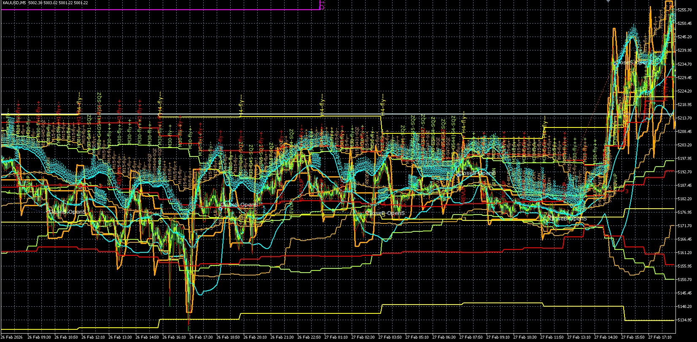

# Image Analysis Blocks

Companion to `backtest_chart_analysis.md` — Part 3 image-analysis blocks have been separated from the scenario definitions into this document. The scenario definitions (Cascade Position, Sub-Scenarios, Sub-State Flowchart, Identification Flowchart, Trade action) remain in `backtest_chart_analysis.md`.

Each block contains an event-driven state table derived from the backtest log (`references/Backtest_data/V31.04/20260620_clean.log`). States are `[TO BE FILLED]` where the log has no data for that TF at the given time.

---

## HTF / MTF Two-Axis Reading — DESIGN REFERENCE

> **STATUS: DESIGN — UNBUILT, UNVALIDATED.** This is a proposed framework for
> reading each chart into two state axes (HTF + MTF). It is NOT implemented in
> identify_scenario and NOT validated against backtest data. It is a reference
> for the manual image analysis below, not a code spec. Depends on the EA
> baseline (V31.06) blocker before any of it can be built. Rows marked below are
> inferred — verify against backtest_chart_analysis.md before relying on them.

**The two axes:**
- **HTF-state** (H4/D1/W1): slow macro context (changes over days).
- **MTF-state** (M15/M30/H1): fast cascade (changes bar-to-bar).
- A scenario = (HTF-state × MTF-state). Existing labels are shorthand for
  combinations.
- **KEY: the MTF-state's most important attribute is DIRECTION-vs-H4.** "MTF
  flying SAME as H4" = continuation (F); "MTF flying/reversed OPPOSITE to H4"
  = reversal beginning (R1). Both look like "MTF active" — only direction-vs-H4
  separates them. (This is the discriminator current code is blind to.)

**Scenario → axis classification** (defs from backtest_chart_analysis.md):

| Scenario | Sub-state meaning | MTF/HTF driven | Why |
|----------|-------------------|----------------|-----|
| F1/F2/F3 | D1/W1 alignment levels (macro/partial/weak) | HTF | sub-split is D1/W1 |
| S1/S2/S3 | shrink @ M15 / M30 / H1 | MTF | which TF shrinks |
| R1 | M30 reversed, H4 still flying (pre-pivot) | Both | genuinely 2-axis |
| R2 | H4 flipped + D1 reversed (full) | HTF | D1 fork |
| R3 | H4 flipped, D1 original (counter-trend) | HTF | D1 fork |
| C1 | LTF partial SQZ (M15 peak, M30 noise) | MTF | SQZ progression |
| C2 | LTF full SQZ (all LTF, G0b-PINK) | MTF | SQZ progression |
| C3 | M5 loading (breaking SQZ, G6-LOAD) | MTF | SQZ progression |
| C4 | H4 also compressing ( V) | HTF | H4 state change |
| B1 | release, LTF only (unconfirmed) | MTF | MTF leads |
| B2 | release, MTF confirmed | Both | propagation |
| B3 | release, HTF confirmed ( F) | HTF | H4 confirms |
| V1 | H4 breaks same as D1 (continuation  B) | HTF | H4 SQZ resolution |
| V2 | H4 breaks opposite D1 (reversal  R2/R3) | HTF | H4 SQZ resolution |
| V3 | false breakout (reverts 3 bars  C/V) | HTF | H4 SQZ resolution |
| V4 | whipsaw (alternating, no resolution) | HTF | H4 SQZ resolution |
| P1 | M5 break (G6-LOAD, arm) | MTF | re-expansion |
| P2 | M15 confirm (entry trigger, 0.75) | MTF | re-expansion |
| P3 | MTF re-align ( F, 1.0) | MTF | re-expansion |

**Pattern:** HTF-driven = F, R2/R3, C4, V (all), B3 (D1/W1/H4-state is the
discriminator). MTF-driven = S, C1-C3, P, B1 (which-TF/depth/stage). Genuinely
2-axis = R1, B2.

**Sideways cascade:** "sideways" (diffMid=3) propagates up the TFs —
LTF-sideways (M5/M15 flat, earliest/ambiguous)  MTF-sideways (M30/H1 flat,
committed)  HTF-sideways (H4 flat = pivot/V). Propagating states (shrink,
sideways, breakout) are TF-indexable; simultaneous states (fly) are not.

**Split recommendation (when built):** expose HTF-state + MTF-state as two
fields (additive), KEEP existing labels, share HTF-state with Part 4. Do NOT
do a uniform 2-digit rename — most scenarios are single-axis (one field empty);
only R1/B2 are genuinely 2-axis.

---

## Scenario F (Full Fly)

#### Image 1 Analysis — backtested_EA_fly_scenario.jpg

**Period:** 2026.02.02 13:10 → 2026.02.10 08:10 

> **Cell = BBW_stage-diffMid-BBUpDn** (e.g. 511-1-1). BBW: 511/512=up-fly,
> 521/522=down-fly, 513/523=shrink, 4xx=SQZ. diffMid: 1=up, 2=down,
> 3=sideways, 5=deep-sideways. BBUpDn: 0=between, 1=upper, 2=lower,
> 3=sideways. A new row is added only when M15 BBW_stage or diffMid changes.
> All rows fall within the user-defined period.

| datetime | M15 | M30 | H1 | H4 | D1 | W1 | Scenario (HTF-MTF) | Trend / Tier |
|----------|-----|-----|----|----|----|----|--------------------|------------|
| 2026.02.02 13:15 | 512-1-3 | 403-3-0 | 523-2-2 | 521-2-1 | 513-1-0 | 401-1-0 | F3-F [divergence] | Down (div) / Tier 1 |
| 2026.02.02 15:45 | 513-1-2 | 511-1-0 | 523-2-2 | 521-2-1 | 513-1-0 | 401-1-0 | F3-R1 [divergence] | Down (div) / Tier 1 |
| 2026.02.02 16:45 | 512-1-3 | 512-1-3 | 523-2-2 | 521-2-0 | 513-1-0 | 401-1-0 | F3-R1 [divergence] | Down (div) / Tier 1 |
| 2026.02.02 17:00 | 512-3-0 | 512-1-0 | 523-2-0 | 521-2-0 | 513-1-0 | 401-1-0 | F3-R1 [divergence] | Down (div) / Tier 1 |
| 2026.02.02 17:30 | 513-5-2 | 512-1-3 | 523-2-0 | 521-2-0 | 513-1-0 | 401-1-0 | F3-R1 [divergence] | Down (div) / Tier 1 |
| 2026.02.02 17:45 | 511-5-1 | 512-1-3 | 523-2-0 | 521-2-0 | 513-1-0 | 401-1-0 | F3-R1 [divergence] | Down (div) / Tier 1 |
| 2026.02.02 18:00 | 521-2-1 | 513-1-2 | 523-2-0 | 521-2-0 | 513-1-0 | 401-1-0 | F3-F [divergence] | Down (div) / Tier 1 |
| 2026.02.02 18:30 | 522-2-4 | 513-1-2 | 523-2-0 | 521-2-0 | 513-1-0 | 401-1-0 | F3-F [divergence] | Down (div) / Tier 1 |
| 2026.02.02 19:45 | 523-2-2 | 513-1-2 | 523-2-2 | 521-2-0 | 513-1-0 | 401-1-0 | F3-S3 [divergence] | Down (div) / Tier 1 |
| 2026.02.02 20:15 | 522-2-4 | 513-1-2 | 523-2-2 | 522-2-4 | 513-1-0 | 401-1-0 | F3-F [divergence] | Down (div) / Tier 1 |
| 2026.02.02 21:45 | 523-2-2 | 402-2-1 | 523-2-2 | 522-2-4 | 513-1-0 | 401-1-0 | F3-F | Down (div) / Tier 1 |
| 2026.02.02 22:15 | 523-4-2 | 402-2-4 | 523-2-2 | 522-2-4 | 513-1-0 | 401-1-0 | F3-F | Down (div) / Tier 1 |
| 2026.02.02 23:15 | 523-2-2 | 402-2-0 | 523-2-0 | 522-2-4 | 513-1-0 | 401-1-0 | F3-F | Down (div) / Tier 1 |
| 2026.02.02 23:30 | 523-3-0 | 402-2-0 | 523-2-0 | 522-2-4 | 513-1-0 | 401-1-0 | F3-F | Down (div) / Tier 1 |
| 2026.02.03 01:00 | 523-2-0 | 402-2-0 | 523-2-0 | 522-2-4 | 513-1-2 | 401-1-0 | F3-F | Down (div) / Tier 1 |
| 2026.02.03 01:15 | 523-3-1 | 402-2-0 | 523-2-0 | 522-2-4 | 513-1-2 | 401-1-0 | F3-F | Down (div) / Tier 1 |
| 2026.02.03 01:30 | 421-1-1 | 402-2-2 | 523-2-0 | 522-2-4 | 513-1-2 | 401-1-0 | F3-C3 [divergence] | Down (div) / Tier 1 |
| 2026.02.03 01:45 | 511-1-1 | 402-2-2 | 523-2-0 | 522-2-4 | 513-1-2 | 401-1-0 | F3-F [divergence] | Down (div) / Tier 1 |
| 2026.02.03 03:00 | 512-1-3 | 511-1-1 | 523-3-1 | 522-2-4 | 513-1-2 | 401-1-0 | F3-R1 [divergence] | Down (div) / Tier 1 |
| 2026.02.03 05:00 | 513-1-2 | 512-1-3 | 513-1-0 | 522-2-4 | 513-1-2 | 401-1-0 | F3-R1 [divergence] | Down (div) / Tier 1 |
| 2026.02.03 07:15 | 512-5-3 | 512-1-3 | 512-1-3 | 522-2-4 | 513-1-2 | 401-1-0 | F3-R1 [divergence] | Down (div) / Tier 1 |
| 2026.02.03 07:30 | 511-1-1 | 512-1-3 | 512-1-3 | 522-2-4 | 513-1-2 | 401-1-0 | F3-R1 [divergence] | Down (div) / Tier 1 |
| 2026.02.03 08:00 | 512-1-3 | 512-1-3 | 512-1-3 | 522-2-4 | 513-1-2 | 401-1-0 | F3-R1 [divergence] | Down (div) / Tier 1 |
| 2026.02.03 08:15 | 512-5-0 | 512-1-3 | 512-1-3 | 522-2-4 | 513-1-2 | 401-1-0 | F3-R1 [divergence] | Down (div) / Tier 1 |
| 2026.02.03 08:30 | 511-1-1 | 512-1-3 | 512-1-3 | 522-2-4 | 513-1-2 | 401-1-0 | F3-R1 [divergence] | Down (div) / Tier 1 |
| 2026.02.03 09:30 | 512-1-3 | 512-1-3 | 512-1-0 | 522-2-4 | 513-1-2 | 401-1-0 | F3-R1 [divergence] | Down (div) / Tier 1 |
| 2026.02.03 12:15 | 513-1-2 | 512-1-3 | 511-1-1 | 523-2-2 | 513-1-2 | 401-1-0 | C4-S1 [divergence] | Down (div) / Tier 2 |
| 2026.02.03 14:30 | 413-3-0 | 512-1-0 | 512-1-3 | 523-2-2 | 513-1-2 | 401-1-0 | C4-C1 [divergence] | Down (div) / Tier 2 |
| 2026.02.03 15:00 | 413-4-4 | 513-1-2 | 512-1-3 | 523-2-2 | 513-1-2 | 401-1-0 | C4-C1 [divergence] | Down (div) / Tier 2 |
| 2026.02.03 15:45 | 521-4-0 | 513-1-2 | 512-1-3 | 523-2-2 | 513-1-2 | 401-1-0 | C4-B1 [divergence] | Down (div) / Tier 2 |
| 2026.02.03 16:00 | 511-1-1 | 513-1-2 | 512-1-3 | 523-2-2 | 513-1-2 | 401-1-0 | C4-B1 [divergence] | Down (div) / Tier 2 |
| 2026.02.03 16:45 | 511-3-0 | 513-1-2 | 512-1-3 | 523-2-2 | 513-1-2 | 401-1-0 | C4-B1 [divergence] | Down (div) / Tier 2 |
| 2026.02.03 17:00 | 522-4-4 | 513-1-2 | 512-1-3 | 523-2-2 | 513-1-2 | 401-1-0 | C4-B1 [divergence] | Down (div) / Tier 2 |
| 2026.02.03 17:15 | 521-4-1 | 513-1-2 | 512-1-3 | 523-2-2 | 513-1-2 | 401-1-0 | C4-B1 [divergence] | Down (div) / Tier 2 |
| 2026.02.03 17:45 | 521-1-0 | 513-1-2 | 512-1-3 | 523-2-2 | 513-1-2 | 401-1-0 | C4-B1 [divergence] | Down (div) / Tier 2 |
| 2026.02.03 18:00 | 512-1-3 | 513-1-2 | 512-1-3 | 523-2-2 | 513-1-2 | 401-1-0 | C4-B1 [divergence] | Down (div) / Tier 2 |
| 2026.02.03 18:30 | 511-1-1 | 411-1-0 | 512-1-3 | 523-2-2 | 513-1-2 | 401-1-0 | C4-B1 [divergence] | Down (div) / Tier 2 |
| 2026.02.03 19:15 | 512-1-3 | 411-1-0 | 512-1-3 | 523-2-2 | 513-1-2 | 401-1-0 | C4-B1 [divergence] | Down (div) / Tier 2 |
| 2026.02.03 19:45 | 512-5-0 | 511-1-3 | 512-1-3 | 523-2-2 | 513-1-2 | 401-1-0 | C4-F [divergence] | Down (div) / Tier 2 |
| 2026.02.03 20:00 | 513-1-2 | 512-5-3 | 513-1-2 | 523-2-2 | 513-1-2 | 401-1-0 | C4-S1 [divergence] | Down (div) / Tier 2 |
| 2026.02.03 20:15 | 512-1-3 | 512-5-3 | 513-1-2 | 523-2-2 | 513-1-2 | 401-1-0 | C4-B2 [divergence] | Down (div) / Tier 2 |
| 2026.02.03 20:30 | 512-3-0 | 512-5-0 | 513-1-2 | 523-2-2 | 513-1-2 | 401-1-0 | C4-B2 [divergence] | Down (div) / Tier 2 |
| 2026.02.03 20:45 | 521-2-1 | 512-5-0 | 513-1-2 | 523-2-2 | 513-1-2 | 401-1-0 | C4-B2 [divergence] | Down (div) / Tier 2 |
| 2026.02.03 21:15 | 521-3-0 | 512-5-0 | 513-1-2 | 523-2-2 | 513-1-2 | 401-1-0 | C4-B2 [divergence] | Down (div) / Tier 2 |
| 2026.02.03 21:45 | 512-1-3 | 512-1-0 | 513-1-2 | 523-2-2 | 513-1-2 | 401-1-0 | C4-B2 [divergence] | Down (div) / Tier 2 |
| 2026.02.03 22:15 | 512-3-0 | 512-1-3 | 513-1-0 | 523-2-2 | 513-1-2 | 401-1-0 | C4-B2 [divergence] | Down (div) / Tier 2 |
| 2026.02.03 22:45 | 512-1-3 | 512-1-3 | 513-1-0 | 523-2-2 | 513-1-2 | 401-1-0 | C4-B2 [divergence] | Down (div) / Tier 2 |
| 2026.02.03 23:15 | 512-3-0 | 512-1-3 | 512-1-3 | 523-2-2 | 513-1-2 | 401-1-0 | C4-F [divergence] | Down (div) / Tier 2 |
| 2026.02.03 23:45 | 523-2-2 | 512-1-3 | 512-1-3 | 523-2-2 | 513-1-2 | 401-1-0 | C4-S1 [divergence] | Down (div) / Tier 2 |
| 2026.02.04 01:00 | 523-3-0 | 512-1-3 | 512-1-0 | 523-2-2 | 512-1-3 | 401-1-0 | C4-S1 [divergence] | Down (div) / Tier 2 |
| 2026.02.04 01:30 | 523-2-0 | 512-1-0 | 512-1-0 | 523-2-2 | 512-1-3 | 401-1-0 | C4-S1 [divergence] | Down (div) / Tier 2 |
| 2026.02.04 01:45 | 523-3-0 | 512-1-0 | 512-1-0 | 523-2-2 | 512-1-3 | 401-1-0 | C4-S1 [divergence] | Down (div) / Tier 2 |
| 2026.02.04 02:15 | 511-1-1 | 512-1-3 | 513-1-2 | 523-2-2 | 512-1-3 | 401-1-0 | C4-B2 [divergence] | Down (div) / Tier 2 |
| 2026.02.04 02:45 | 512-1-3 | 511-1-1 | 513-1-2 | 523-2-2 | 512-1-3 | 401-1-0 | C4-B2 [divergence] | Down (div) / Tier 2 |
| 2026.02.04 03:30 | 511-1-1 | 511-1-1 | 513-1-0 | 523-2-2 | 512-1-3 | 401-1-0 | C4-B2 [divergence] | Down (div) / Tier 2 |
| 2026.02.04 04:15 | 512-1-3 | 511-1-1 | 401-1-3 | 523-2-2 | 512-1-3 | 401-1-0 | C4-B2 [divergence] | Down (div) / Tier 2 |
| 2026.02.04 06:30 | 513-1-2 | 511-1-0 | 511-1-0 | 523-2-2 | 512-1-3 | 401-1-0 | C4-S1 [divergence] | Down (div) / Tier 2 |
| 2026.02.04 09:15 | 512-5-3 | 512-1-3 | 512-1-3 | 523-2-2 | 512-1-3 | 401-1-0 | C4-F [divergence] | Down (div) / Tier 2 |
| 2026.02.04 09:30 | 512-1-3 | 512-1-3 | 512-1-3 | 523-2-2 | 512-1-3 | 401-1-0 | C4-F [divergence] | Down (div) / Tier 2 |
| 2026.02.04 10:15 | 513-1-2 | 512-1-3 | 512-1-3 | 523-2-2 | 512-1-3 | 401-1-0 | C4-S1 [divergence] | Down (div) / Tier 2 |
| 2026.02.04 10:45 | 421-1-0 | 512-1-0 | 512-1-3 | 523-2-2 | 512-1-3 | 401-1-0 | C4-C1 [divergence] | Down (div) / Tier 2 |
| 2026.02.04 11:15 | 421-5-0 | 513-1-2 | 512-1-3 | 523-2-2 | 512-1-3 | 401-1-0 | C4-C1 [divergence] | Down (div) / Tier 2 |
| 2026.02.04 11:30 | 511-5-1 | 513-1-2 | 512-1-3 | 523-2-2 | 512-1-3 | 401-1-0 | C4-B1 [divergence] | Down (div) / Tier 2 |
| 2026.02.04 11:45 | 521-2-1 | 513-1-2 | 512-1-3 | 523-2-2 | 512-1-3 | 401-1-0 | C4-B1 [divergence] | Down (div) / Tier 2 |
| 2026.02.04 12:15 | 522-2-4 | 513-1-2 | 512-1-3 | 523-2-2 | 512-1-3 | 401-1-0 | C4-B1 [divergence] | Down (div) / Tier 2 |
| 2026.02.04 12:30 | 521-2-1 | 513-1-2 | 512-1-3 | 523-2-2 | 512-1-3 | 401-1-0 | C4-B1 [divergence] | Down (div) / Tier 2 |
| 2026.02.04 12:45 | 522-2-4 | 513-1-2 | 512-1-3 | 523-2-2 | 512-1-3 | 401-1-0 | C4-B1 [divergence] | Down (div) / Tier 2 |
| 2026.02.04 13:15 | 521-2-1 | 513-1-2 | 512-1-3 | 523-2-2 | 512-1-3 | 401-1-0 | C4-B1 [divergence] | Down (div) / Tier 2 |
| 2026.02.04 14:00 | 522-2-4 | 521-4-0 | 512-1-3 | 523-2-2 | 512-1-3 | 401-1-0 | C4-F [divergence] | Down (div) / Tier 2 |
| 2026.02.04 15:30 | 523-2-2 | 521-2-0 | 512-1-3 | 523-2-2 | 512-1-3 | 401-1-0 | C4-S1 [divergence] | Down (div) / Tier 2 |
| 2026.02.04 16:30 | 412-2-4 | 522-2-4 | 512-1-3 | 523-3-2 | 512-1-3 | 401-1-0 | C4-C1 | Sideways / Tier 2 |
| 2026.02.04 16:45 | 521-2-1 | 522-2-4 | 512-1-3 | 523-3-2 | 512-1-3 | 401-1-0 | C4-F | Sideways / Tier 2 |
| 2026.02.04 19:15 | 522-2-4 | 521-2-1 | 403-3-1 | 523-3-2 | 512-1-3 | 401-1-0 | C4-B2 | Sideways / Tier 2 |
| 2026.02.04 20:45 | 523-2-2 | 522-2-4 | 422-2-1 | 523-3-2 | 512-1-3 | 401-1-0 | C4-F | Sideways / Tier 2 |
| 2026.02.04 22:30 | 523-4-0 | 522-2-4 | 521-2-1 | 523-3-2 | 512-1-3 | 401-1-0 | C4-S1 | Sideways / Tier 2 |
| 2026.02.04 22:45 | 414-4-1 | 522-2-4 | 521-2-1 | 523-3-2 | 512-1-3 | 401-1-0 | C4-C1 | Sideways / Tier 2 |
| 2026.02.04 23:00 | 511-1-0 | 522-2-4 | 521-2-1 | 523-3-2 | 512-1-3 | 401-1-0 | C4-F | Sideways / Tier 2 |
| 2026.02.05 01:00 | 512-1-3 | 523-2-2 | 522-2-4 | 523-3-0 | 512-1-3 | 401-1-0 | C4-B1 | Sideways / Tier 2 |
| 2026.02.05 01:15 | 511-1-1 | 523-2-2 | 522-2-4 | 523-3-0 | 512-1-3 | 401-1-0 | C4-B1 | Sideways / Tier 2 |
| 2026.02.05 02:00 | 512-1-3 | 523-2-2 | 522-2-4 | 523-3-0 | 512-1-3 | 401-1-0 | C4-B1 | Sideways / Tier 2 |
| 2026.02.05 03:30 | 513-1-2 | 523-2-2 | 522-2-0 | 523-3-0 | 512-1-3 | 401-1-0 | C4-S2 | Sideways / Tier 2 |
| 2026.02.05 04:15 | 403-3-1 | 523-2-2 | 522-2-4 | 523-1-0 | 512-1-3 | 401-1-0 | C4-C1 [divergence] | Up / Tier 2 |
| 2026.02.05 04:45 | 521-2-1 | 523-3-0 | 522-2-4 | 523-1-0 | 512-1-3 | 401-1-0 | C4-B1 [divergence] | Up / Tier 2 |
| 2026.02.05 06:15 | 522-2-4 | 521-2-1 | 522-2-4 | 523-1-0 | 512-1-3 | 401-1-0 | C4-F [divergence] | Up / Tier 2 |
| 2026.02.05 07:45 | 523-2-2 | 521-2-1 | 522-2-4 | 523-1-0 | 512-1-3 | 401-1-0 | C4-S1 [divergence] | Up / Tier 2 |
| 2026.02.05 09:15 | 413-3-0 | 522-2-4 | 522-2-0 | 513-1-3 | 512-1-3 | 401-1-0 | C4-C1 [divergence] | Up / Tier 2 |
| 2026.02.05 09:45 | 413-1-0 | 522-3-0 | 522-2-0 | 513-1-3 | 512-1-3 | 401-1-0 | C4-C1 [divergence] | Up / Tier 2 |
| 2026.02.05 11:15 | 413-3-0 | 522-2-0 | 523-2-2 | 513-1-3 | 512-1-3 | 401-1-0 | C4-C1 [divergence] | Up / Tier 2 |
| 2026.02.05 12:45 | 413-2-0 | 523-2-2 | 523-2-0 | 513-1-0 | 512-1-3 | 401-1-0 | C4-C1 [divergence] | Up / Tier 2 |
| 2026.02.05 14:15 | 521-2-4 | 523-2-0 | 402-2-0 | 513-1-0 | 512-1-3 | 401-1-0 | C4-B1 [divergence] | Up / Tier 2 |
| 2026.02.05 14:30 | 522-2-4 | 412-2-0 | 402-2-0 | 513-1-0 | 512-1-3 | 401-1-0 | C4-B1 [divergence] | Up / Tier 2 |
| 2026.02.05 15:30 | 523-2-2 | 412-3-1 | 402-2-0 | 513-1-0 | 512-1-3 | 401-1-0 | C4-F [divergence] | Up / Tier 2 |
| 2026.02.05 16:00 | 522-2-4 | 521-2-1 | 521-2-1 | 513-1-2 | 512-1-3 | 401-1-0 | C4-F [divergence] | Up / Tier 2 |
| 2026.02.05 18:30 | 523-2-2 | 522-2-4 | 521-2-0 | 513-1-2 | 512-1-3 | 401-1-0 | C4-S1 [divergence] | Up / Tier 2 |
| 2026.02.05 18:45 | 413-3-0 | 522-2-4 | 521-2-0 | 513-1-2 | 512-1-3 | 401-1-0 | C4-C1 [divergence] | Up / Tier 2 |
| 2026.02.05 19:15 | 511-1-1 | 523-2-2 | 522-2-4 | 513-1-2 | 512-1-3 | 401-1-0 | C4-B1 [divergence] | Up / Tier 2 |
| 2026.02.05 20:15 | 512-1-3 | 523-2-2 | 522-2-4 | 513-1-2 | 512-1-3 | 401-1-0 | C4-B1 [divergence] | Up / Tier 2 |
| 2026.02.05 21:30 | 513-1-2 | 523-2-0 | 522-2-0 | 513-1-2 | 512-1-3 | 401-1-0 | C4-S2 [divergence] | Up / Tier 2 |
| 2026.02.05 21:45 | 513-3-0 | 523-2-0 | 522-2-0 | 513-1-2 | 512-1-3 | 401-1-0 | C4-S2 [divergence] | Up / Tier 2 |
| 2026.02.05 22:00 | 422-2-0 | 412-2-4 | 523-2-2 | 513-1-2 | 512-1-3 | 401-1-0 | C4-C2 [divergence] | Up / Tier 2 |
| 2026.02.05 22:15 | 422-3-0 | 412-2-4 | 523-2-2 | 513-1-2 | 512-1-3 | 401-1-0 | C4-C2 [divergence] | Up / Tier 2 |
| 2026.02.05 23:00 | 521-2-1 | 412-2-4 | 523-2-2 | 513-1-2 | 512-1-3 | 401-1-0 | C4-B1 [divergence] | Up / Tier 2 |
| 2026.02.06 01:00 | 522-2-4 | 521-2-1 | 402-2-0 | 513-1-2 | 513-1-2 | 401-1-0 | C4-B2 [divergence] | Up / Tier 2 |
| 2026.02.06 02:15 | 521-2-1 | 521-2-1 | 521-2-1 | 513-1-2 | 513-1-2 | 401-1-0 | C4-F [divergence] | Up / Tier 2 |
| 2026.02.06 02:30 | 522-2-4 | 521-2-1 | 521-2-1 | 513-1-2 | 513-1-2 | 401-1-0 | C4-F [divergence] | Up / Tier 2 |
| 2026.02.06 04:00 | 523-2-2 | 522-2-4 | 521-2-0 | 513-1-2 | 513-1-2 | 401-1-0 | C4-S1 [divergence] | Up / Tier 2 |
| 2026.02.06 04:30 | 523-3-2 | 522-3-4 | 521-2-0 | 513-1-2 | 513-1-2 | 401-1-0 | C4-S1 [divergence] | Up / Tier 2 |
| 2026.02.06 04:45 | 403-3-1 | 522-3-4 | 521-2-0 | 513-1-2 | 513-1-2 | 401-1-0 | C4-C1 [divergence] | Up / Tier 2 |
| 2026.02.06 05:30 | 403-1-1 | 522-2-0 | 522-2-4 | 513-1-2 | 513-1-2 | 401-1-0 | C4-C1 [divergence] | Up / Tier 2 |
| 2026.02.06 07:45 | 511-1-3 | 523-2-2 | 523-2-2 | 513-1-2 | 513-1-2 | 401-1-0 | C4-B1 [divergence] | Up / Tier 2 |
| 2026.02.06 08:00 | 512-1-3 | 403-3-1 | 403-3-0 | 513-1-2 | 513-1-2 | 401-1-0 | C4-B1 | Up / Tier 2 |
| 2026.02.06 08:30 | 513-1-2 | 403-3-1 | 403-3-0 | 513-1-2 | 513-1-2 | 401-1-0 | C4-F | Up / Tier 2 |
| 2026.02.06 09:30 | 411-1-3 | 403-1-1 | 403-3-2 | 513-1-2 | 513-1-2 | 401-1-0 | C4-C3 | Up / Tier 2 |
| 2026.02.06 12:30 | 411-3-0 | 403-1-2 | 403-3-1 | 513-1-2 | 513-1-2 | 401-1-0 | C4-C2 | Up / Tier 2 |
| 2026.02.06 12:45 | 411-5-0 | 403-1-2 | 403-3-1 | 513-1-2 | 513-1-2 | 401-1-0 | C4-C2 | Up / Tier 2 |
| 2026.02.06 13:00 | 411-4-2 | 403-1-2 | 403-1-1 | 513-1-2 | 513-1-2 | 401-1-0 | C4-C2 | Up / Tier 2 |
| 2026.02.06 13:15 | 521-4-0 | 403-1-2 | 403-1-1 | 513-1-2 | 513-1-2 | 401-1-0 | C4-B1 | Up / Tier 2 |
| 2026.02.06 13:30 | 511-1-1 | 403-1-2 | 403-1-1 | 513-1-2 | 513-1-2 | 401-1-0 | C4-B1 | Up / Tier 2 |
| 2026.02.06 14:00 | 512-1-3 | 403-1-0 | 403-1-1 | 513-1-2 | 513-1-2 | 401-1-0 | C4-B1 | Up / Tier 2 |
| 2026.02.06 15:30 | 511-1-1 | 512-1-3 | 511-1-1 | 513-1-2 | 513-1-2 | 401-1-0 | C4-F | Up / Tier 2 |
| 2026.02.06 16:15 | 512-1-3 | 512-1-3 | 511-1-1 | 513-1-0 | 513-1-2 | 401-1-0 | C4-F | Up / Tier 2 |
| 2026.02.06 19:45 | 513-1-2 | 512-1-3 | 511-1-1 | 513-1-0 | 513-1-2 | 401-1-0 | C4-S1 | Up / Tier 2 |
| 2026.02.06 20:00 | 512-1-3 | 512-1-3 | 511-1-0 | 512-1-3 | 513-1-2 | 401-1-0 | F1-F | Up / Tier 1 |
| 2026.02.06 21:30 | 513-1-2 | 512-1-3 | 512-1-3 | 512-1-3 | 513-1-2 | 401-1-0 | F1-S1 | Up / Tier 1 |
| 2026.02.06 22:00 | 512-5-3 | 512-1-3 | 512-1-0 | 512-1-3 | 513-1-2 | 401-1-0 | F1-F | Up / Tier 1 |
| 2026.02.06 23:00 | 513-5-2 | 513-1-2 | 513-1-2 | 512-1-3 | 513-1-2 | 401-1-0 | F1-S3 | Up / Tier 1 |
| 2026.02.06 23:30 | 513-1-2 | 513-1-2 | 513-1-2 | 512-1-3 | 513-1-2 | 401-1-0 | F1-S3 | Up / Tier 1 |
| 2026.02.09 01:00 | 411-1-0 | 513-1-0 | 513-1-0 | 512-5-0 | 513-1-0 | 401-1-3 | F3-C1 | Sideways / Tier 1 |
| 2026.02.09 01:15 | 511-1-1 | 513-1-0 | 513-1-0 | 512-5-0 | 513-1-0 | 401-1-3 | F3-F | Sideways / Tier 1 |
| 2026.02.09 02:45 | 512-1-3 | 511-1-1 | 401-1-3 | 512-5-0 | 513-1-0 | 401-1-3 | F3-F | Sideways / Tier 1 |
| 2026.02.09 04:15 | 513-1-2 | 512-1-3 | 401-1-3 | 512-1-0 | 513-1-0 | 401-1-3 | F1-F | Up / Tier 1 |
| 2026.02.09 06:30 | 513-3-0 | 512-1-3 | 401-1-3 | 512-1-0 | 513-1-0 | 401-1-3 | F1-F | Up / Tier 1 |
| 2026.02.09 06:45 | 513-2-2 | 512-1-3 | 401-1-3 | 512-1-0 | 513-1-0 | 401-1-3 | F1-F [divergence] | Up / Tier 1 |
| 2026.02.09 07:30 | 513-3-0 | 512-1-3 | 401-1-3 | 512-1-0 | 513-1-0 | 401-1-3 | F1-F | Up / Tier 1 |
| 2026.02.09 07:45 | 413-3-1 | 512-1-3 | 401-1-3 | 512-1-0 | 513-1-0 | 401-1-3 | F1-C1 | Up / Tier 1 |
| 2026.02.09 08:00 | 511-1-1 | 512-1-3 | 401-1-3 | 512-1-0 | 513-1-0 | 401-1-3 | F1-F | Up / Tier 1 |
| 2026.02.09 08:45 | 512-1-3 | 512-1-3 | 401-1-3 | 512-1-0 | 513-1-0 | 401-1-3 | F1-F | Up / Tier 1 |
| 2026.02.09 09:15 | 513-1-2 | 512-1-0 | 401-1-3 | 512-1-0 | 513-1-0 | 401-1-3 | F1-F | Up / Tier 1 |
| 2026.02.09 10:00 | 413-3-0 | 513-1-2 | 401-1-2 | 512-1-0 | 513-1-0 | 401-1-3 | F1-C1 | Up / Tier 1 |
| 2026.02.09 10:45 | 425-5-0 | 513-1-2 | 401-1-2 | 512-1-0 | 513-1-0 | 401-1-3 | F1-C1 | Up / Tier 1 |
| 2026.02.09 11:45 | 423-3-0 | 513-3-0 | 401-1-2 | 512-1-0 | 513-1-0 | 401-1-3 | F1-C1 | Up / Tier 1 |
| 2026.02.09 12:00 | 511-5-1 | 513-3-4 | 401-1-2 | 512-3-0 | 513-1-0 | 401-1-3 | F3-F | Sideways / Tier 1 |
| 2026.02.09 12:15 | 521-2-1 | 513-3-4 | 401-1-2 | 512-3-0 | 513-1-0 | 401-1-3 | F3-F | Sideways / Tier 1 |
| 2026.02.09 13:15 | 522-2-4 | 521-2-1 | 401-1-2 | 512-3-0 | 513-1-0 | 401-1-3 | F3-R1 | Sideways / Tier 1 |
| 2026.02.09 14:00 | 522-4-0 | 521-3-2 | 401-1-2 | 512-3-0 | 513-1-0 | 401-1-3 | F3-R1 | Sideways / Tier 1 |
| 2026.02.09 14:30 | 522-5-3 | 513-1-2 | 401-1-2 | 512-3-0 | 513-1-0 | 401-1-3 | F3-F | Sideways / Tier 1 |
| 2026.02.09 14:45 | 512-5-3 | 513-1-2 | 401-1-2 | 512-3-0 | 513-1-0 | 401-1-3 | F3-F | Sideways / Tier 1 |
| 2026.02.09 15:30 | 512-2-0 | 413-3-4 | 401-1-0 | 512-3-0 | 513-1-0 | 401-1-3 | F3-F | Sideways / Tier 1 |
| 2026.02.09 15:45 | 522-2-4 | 413-3-4 | 401-1-0 | 512-3-0 | 513-1-0 | 401-1-3 | F3-F | Sideways / Tier 1 |
| 2026.02.09 16:00 | 523-2-2 | 422-2-4 | 401-1-2 | 523-2-2 | 513-1-0 | 401-1-3 | C4-F [divergence] | Down (div) / Tier 2 |
| 2026.02.09 16:15 | 523-4-2 | 422-2-4 | 401-1-2 | 523-2-2 | 513-1-0 | 401-1-3 | C4-F [divergence] | Down (div) / Tier 2 |
| 2026.02.09 16:30 | 523-3-0 | 423-3-0 | 401-1-2 | 523-2-2 | 513-1-0 | 401-1-3 | C4-F [divergence] | Down (div) / Tier 2 |
| 2026.02.09 16:45 | 413-3-1 | 423-3-0 | 401-1-2 | 523-2-2 | 513-1-0 | 401-1-3 | C4-C3 [divergence] | Down (div) / Tier 2 |
| 2026.02.09 17:00 | 511-1-1 | 423-3-1 | 401-1-3 | 523-2-2 | 513-1-0 | 401-1-3 | C4-B1 [divergence] | Down (div) / Tier 2 |
| 2026.02.09 17:30 | 512-1-3 | 423-3-1 | 401-1-3 | 523-2-2 | 513-1-0 | 401-1-3 | C4-B1 [divergence] | Down (div) / Tier 2 |
| 2026.02.09 18:30 | 511-1-1 | 511-1-1 | 401-1-3 | 523-2-2 | 513-1-0 | 401-1-3 | C4-B2 [divergence] | Down (div) / Tier 2 |
| 2026.02.09 19:15 | 512-1-3 | 511-1-1 | 401-1-3 | 523-2-2 | 513-1-0 | 401-1-3 | C4-B2 [divergence] | Down (div) / Tier 2 |
| 2026.02.09 20:45 | 513-1-2 | 512-1-0 | 401-1-0 | 523-3-0 | 513-1-0 | 401-1-3 | C4-F | Sideways / Tier 2 |
| 2026.02.09 21:45 | 512-1-3 | 511-1-0 | 511-1-0 | 523-3-0 | 513-1-0 | 401-1-3 | C4-F | Sideways / Tier 2 |
| 2026.02.09 23:15 | 512-3-0 | 512-1-3 | 511-1-1 | 523-3-0 | 513-1-0 | 401-1-3 | C4-F | Sideways / Tier 2 |
| 2026.02.09 23:45 | 522-2-4 | 512-1-0 | 511-1-1 | 523-3-0 | 513-1-0 | 401-1-3 | C4-F | Sideways / Tier 2 |
| 2026.02.10 01:00 | 522-4-4 | 512-1-0 | 512-1-3 | 523-3-1 | 512-1-3 | 401-1-3 | C4-F | Sideways / Tier 2 |
| 2026.02.10 01:15 | 521-2-1 | 512-1-0 | 512-1-3 | 523-3-1 | 512-1-3 | 401-1-3 | C4-F | Sideways / Tier 2 |
| 2026.02.10 03:15 | 522-2-4 | 513-3-2 | 512-3-0 | 523-3-1 | 512-1-3 | 401-1-3 | C4-B1 | Sideways / Tier 2 |
| 2026.02.10 04:15 | 523-2-2 | 413-4-1 | 512-3-0 | 511-1-1 | 512-1-3 | 401-1-3 | F1-F [divergence] | Up / Tier 1 |
| 2026.02.10 06:00 | 523-3-0 | 413-2-4 | 512-1-0 | 511-1-1 | 512-1-3 | 401-1-3 | F1-F [divergence] | Up / Tier 1 |
| 2026.02.10 06:15 | 523-4-0 | 413-2-4 | 512-1-0 | 511-1-1 | 512-1-3 | 401-1-3 | F1-F [divergence] | Up / Tier 1 |
| 2026.02.10 06:30 | 523-5-0 | 413-2-4 | 512-1-0 | 511-1-1 | 512-1-3 | 401-1-3 | F1-F [divergence] | Up / Tier 1 |
| 2026.02.10 06:45 | 513-5-0 | 413-2-4 | 512-1-0 | 511-1-1 | 512-1-3 | 401-1-3 | F1-F [divergence] | Up / Tier 1 |
| 2026.02.10 07:00 | 513-4-0 | 413-2-4 | 512-5-0 | 511-1-1 | 512-1-3 | 401-1-3 | F1-F [divergence] | Up / Tier 1 |
| 2026.02.10 07:15 | 523-4-0 | 413-2-4 | 512-5-0 | 511-1-1 | 512-1-3 | 401-1-3 | F1-F [divergence] | Up / Tier 1 |
| 2026.02.10 08:00 | 523-1-3 | 413-2-0 | 512-1-0 | 511-1-1 | 512-1-3 | 401-1-3 | F1-F [divergence] | Up / Tier 1 |
**Coverage:** COMPLETE (last data 2026.02.10 08:00, 10min before period end)

#### Image 2 Analysis — backtested_EA_predict_trend_1.jpg

**Period:** 2026.01.07 19:15 → 2026.01.09 19:15

> **Cell = BBW_stage-diffMid-BBUpDn** (e.g. 511-1-1). BBW: 511/512=up-fly,
> 521/522=down-fly, 513/523=shrink, 4xx=SQZ. diffMid: 1=up, 2=down,
> 3=sideways, 5=deep-sideways. BBUpDn: 0=between, 1=upper, 2=lower,
> 3=sideways. A new row is added only when M15 BBW_stage or diffMid changes.
> All rows fall within the user-defined period.

| datetime | M15 | M30 | H1 | H4 | D1 | W1 | Scenario (HTF-MTF) | Trend / Tier |
|----------|-----|-----|----|----|----|----|--------------------|------------|
| 2026.01.07 19:15 | 511-1-1 | 423-3-3 | 522-2-0 | 512-1-3 | 513-1-3 | [TO BE FILLED] | F?-F [divergence] | Up / Tier 1 |
| 2026.01.07 19:30 | 511-5-1 | 423-3-0 | 522-2-0 | 512-1-3 | 513-1-3 | [TO BE FILLED] | F?-F [divergence] | Up / Tier 1 |
| 2026.01.07 20:00 | 512-5-3 | 423-2-4 | 523-2-2 | 512-1-3 | 513-1-3 | [TO BE FILLED] | F?-F [divergence] | Up / Tier 1 |
| 2026.01.07 20:15 | 513-1-2 | 423-2-4 | 523-2-2 | 512-1-3 | 513-1-3 | [TO BE FILLED] | F?-F [divergence] | Up / Tier 1 |
| 2026.01.07 20:30 | 513-5-0 | 423-2-0 | 523-2-2 | 512-1-3 | 513-1-3 | [TO BE FILLED] | F?-F [divergence] | Up / Tier 1 |
| 2026.01.07 20:45 | 512-5-3 | 423-2-0 | 523-2-2 | 512-1-3 | 513-1-3 | [TO BE FILLED] | F?-F [divergence] | Up / Tier 1 |
| 2026.01.07 21:00 | 512-3-3 | 423-2-2 | 523-2-2 | 512-1-3 | 513-1-3 | [TO BE FILLED] | F?-F [divergence] | Up / Tier 1 |
| 2026.01.07 21:30 | 512-5-0 | 423-2-2 | 523-2-2 | 512-1-3 | 513-1-3 | [TO BE FILLED] | F?-F [divergence] | Up / Tier 1 |
| 2026.01.07 22:15 | 513-1-2 | 423-3-2 | 523-2-2 | 512-1-3 | 513-1-3 | [TO BE FILLED] | F?-F [divergence] | Up / Tier 1 |
| 2026.01.07 23:00 | 513-5-2 | 423-4-2 | 523-2-2 | 512-1-3 | 513-1-3 | [TO BE FILLED] | F?-F [divergence] | Up / Tier 1 |
| 2026.01.07 23:15 | 423-3-2 | 423-4-2 | 523-2-2 | 512-1-3 | 513-1-3 | [TO BE FILLED] | F?-C2 [divergence] | Up / Tier 1 |
| 2026.01.07 23:30 | 425-5-0 | 424-4-0 | 523-2-2 | 512-1-3 | 513-1-3 | [TO BE FILLED] | F?-C2 [divergence] | Up / Tier 1 |
| 2026.01.07 23:45 | 425-2-2 | 424-4-0 | 523-2-2 | 512-1-3 | 513-1-3 | [TO BE FILLED] | F?-C2 [divergence] | Up / Tier 1 |
| 2026.01.08 01:15 | 423-3-2 | 421-1-3 | 523-4-2 | 512-1-0 | 512-1-3 | [TO BE FILLED] | F?-C2 | Up / Tier 1 |
| 2026.01.08 01:30 | 521-4-1 | 511-5-0 | 523-4-2 | 512-1-0 | 512-1-3 | [TO BE FILLED] | F?-F | Up / Tier 1 |
| 2026.01.08 01:45 | 511-5-1 | 511-5-0 | 523-4-2 | 512-1-0 | 512-1-3 | [TO BE FILLED] | F?-F | Up / Tier 1 |
| 2026.01.08 02:15 | 511-1-0 | 511-1-0 | 523-4-2 | 512-1-0 | 512-1-3 | [TO BE FILLED] | F?-F | Up / Tier 1 |
| 2026.01.08 02:30 | 512-1-3 | 512-1-3 | 523-4-2 | 512-1-0 | 512-1-3 | [TO BE FILLED] | F?-F | Up / Tier 1 |
| 2026.01.08 02:45 | 512-3-0 | 512-1-3 | 523-4-2 | 512-1-0 | 512-1-3 | [TO BE FILLED] | F?-F | Up / Tier 1 |
| 2026.01.08 03:15 | 523-4-2 | 512-3-2 | 523-2-2 | 512-1-0 | 512-1-3 | [TO BE FILLED] | F?-S1 [divergence] | Up / Tier 1 |
| 2026.01.08 03:30 | 523-5-2 | 512-3-0 | 523-2-2 | 512-1-0 | 512-1-3 | [TO BE FILLED] | F?-S1 [divergence] | Up / Tier 1 |
| 2026.01.08 03:45 | 511-5-1 | 512-3-0 | 523-2-2 | 512-1-0 | 512-1-3 | [TO BE FILLED] | F?-F [divergence] | Up / Tier 1 |
| 2026.01.08 04:00 | 521-4-1 | 513-1-2 | 424-4-0 | 513-1-2 | 512-1-3 | [TO BE FILLED] | C4-B1 | Up / Tier 2 |
| 2026.01.08 04:15 | 521-2-0 | 513-1-2 | 424-4-0 | 513-1-2 | 512-1-3 | [TO BE FILLED] | C4-B1 [divergence] | Up / Tier 2 |
| 2026.01.08 05:30 | 521-4-0 | 423-2-0 | 424-4-1 | 513-1-2 | 512-1-3 | [TO BE FILLED] | C4-B1 [divergence] | Up / Tier 2 |
| 2026.01.08 05:45 | 522-2-4 | 423-2-0 | 424-4-1 | 513-1-2 | 512-1-3 | [TO BE FILLED] | C4-B1 [divergence] | Up / Tier 2 |
| 2026.01.08 08:45 | 523-4-2 | 521-2-0 | 521-2-0 | 513-1-2 | 512-1-3 | [TO BE FILLED] | C4-S1 [divergence] | Up / Tier 2 |
| 2026.01.08 09:00 | 523-2-2 | 522-2-4 | 522-2-4 | 513-1-2 | 512-1-3 | [TO BE FILLED] | C4-S1 [divergence] | Up / Tier 2 |
| 2026.01.08 09:15 | 523-4-2 | 522-2-4 | 522-2-4 | 513-1-2 | 512-1-3 | [TO BE FILLED] | C4-S1 [divergence] | Up / Tier 2 |
| 2026.01.08 09:30 | 523-3-2 | 522-2-4 | 522-2-4 | 513-1-2 | 512-1-3 | [TO BE FILLED] | C4-S1 [divergence] | Up / Tier 2 |
| 2026.01.08 09:45 | 522-4-4 | 522-2-4 | 522-2-4 | 513-1-2 | 512-1-3 | [TO BE FILLED] | C4-F [divergence] | Up / Tier 2 |
| 2026.01.08 10:00 | 522-2-0 | 522-2-4 | 522-2-4 | 513-1-2 | 512-1-3 | [TO BE FILLED] | C4-F [divergence] | Up / Tier 2 |
| 2026.01.08 11:00 | 523-4-2 | 522-2-0 | 522-2-4 | 513-1-2 | 512-1-3 | [TO BE FILLED] | C4-S1 [divergence] | Up / Tier 2 |
| 2026.01.08 11:45 | 423-3-0 | 523-2-2 | 522-2-4 | 513-1-2 | 512-1-3 | [TO BE FILLED] | C4-C1 [divergence] | Up / Tier 2 |
| 2026.01.08 12:00 | 425-5-0 | 523-2-2 | 522-3-0 | 513-5-2 | 512-1-3 | [TO BE FILLED] | C4-C1 | Sideways / Tier 2 |
| 2026.01.08 13:00 | 425-1-2 | 523-2-2 | 522-4-0 | 513-5-2 | 512-1-3 | [TO BE FILLED] | C4-C1 | Sideways / Tier 2 |
| 2026.01.08 13:15 | 425-5-2 | 523-2-2 | 522-4-0 | 513-5-2 | 512-1-3 | [TO BE FILLED] | C4-C1 | Sideways / Tier 2 |
| 2026.01.08 13:45 | 424-4-4 | 523-2-2 | 522-4-0 | 513-5-2 | 512-1-3 | [TO BE FILLED] | C4-C1 | Sideways / Tier 2 |
| 2026.01.08 14:00 | 521-2-4 | 523-2-0 | 521-2-1 | 513-5-2 | 512-1-3 | [TO BE FILLED] | C4-B1 | Sideways / Tier 2 |
| 2026.01.08 14:45 | 521-3-0 | 422-2-4 | 521-2-1 | 513-5-2 | 512-1-3 | [TO BE FILLED] | C4-B1 | Sideways / Tier 2 |
| 2026.01.08 15:15 | 521-4-0 | 422-2-0 | 521-2-0 | 513-5-2 | 512-1-3 | [TO BE FILLED] | C4-B1 | Sideways / Tier 2 |
| 2026.01.08 15:45 | 521-5-0 | 422-4-2 | 521-2-0 | 513-5-2 | 512-1-3 | [TO BE FILLED] | C4-B1 | Sideways / Tier 2 |
| 2026.01.08 16:15 | 522-4-4 | 422-2-2 | 522-2-4 | 423-3-0 | 512-1-3 | [TO BE FILLED] | V1-B1 | Sideways / Tier 2 |
| 2026.01.08 16:45 | 523-4-2 | 422-4-2 | 522-2-4 | 423-3-0 | 512-1-3 | [TO BE FILLED] | V1-F | Sideways / Tier 2 |
| 2026.01.08 17:00 | 523-5-1 | 423-3-0 | 522-2-4 | 423-3-0 | 512-1-3 | [TO BE FILLED] | V1-F | Sideways / Tier 2 |
| 2026.01.08 17:15 | 511-5-1 | 423-3-0 | 522-2-4 | 423-3-0 | 512-1-3 | [TO BE FILLED] | V1-B1 | Sideways / Tier 2 |
| 2026.01.08 17:30 | 511-1-1 | 511-1-1 | 522-2-4 | 423-3-0 | 512-1-3 | [TO BE FILLED] | V1-F | Sideways / Tier 2 |
| 2026.01.08 19:15 | 512-1-3 | 511-1-1 | 522-3-1 | 423-3-0 | 512-1-3 | [TO BE FILLED] | V1-F | Sideways / Tier 2 |
| 2026.01.08 21:00 | 513-1-2 | 512-1-3 | 511-4-0 | 423-1-2 | 512-1-3 | [TO BE FILLED] | V2-S1 | Up / Tier 2 |
| 2026.01.08 22:15 | 513-5-0 | 512-1-3 | 523-4-2 | 423-1-2 | 512-1-3 | [TO BE FILLED] | V2-S1 | Up / Tier 2 |
| 2026.01.08 22:30 | 421-1-0 | 512-1-3 | 523-4-2 | 423-1-2 | 512-1-3 | [TO BE FILLED] | V2-C1 | Up / Tier 2 |
| 2026.01.08 22:45 | 511-1-1 | 512-1-3 | 523-4-2 | 423-1-2 | 512-1-3 | [TO BE FILLED] | V2-B2 | Up / Tier 2 |
| 2026.01.09 01:30 | 512-1-3 | 512-1-3 | 511-1-1 | 423-5-0 | 512-1-0 | [TO BE FILLED] | V1-F | Sideways / Tier 2 |
| 2026.01.09 02:45 | 513-1-2 | 512-1-0 | 511-1-1 | 423-5-0 | 512-1-0 | [TO BE FILLED] | V1-S1 | Sideways / Tier 2 |
| 2026.01.09 03:30 | 513-5-2 | 513-1-2 | 511-1-0 | 423-5-0 | 512-1-0 | [TO BE FILLED] | V1-S2 | Sideways / Tier 2 |
| 2026.01.09 03:45 | 513-1-2 | 513-1-2 | 511-1-0 | 423-5-0 | 512-1-0 | [TO BE FILLED] | V1-S2 | Sideways / Tier 2 |
| 2026.01.09 04:15 | 425-5-0 | 513-1-2 | 512-1-3 | 423-5-3 | 512-1-0 | [TO BE FILLED] | V1-C1 | Sideways / Tier 2 |
| 2026.01.09 04:30 | 423-3-0 | 513-1-0 | 512-1-3 | 423-5-3 | 512-1-0 | [TO BE FILLED] | V1-C1 | Sideways / Tier 2 |
| 2026.01.09 05:00 | 423-4-0 | 512-1-3 | 512-1-3 | 423-5-3 | 512-1-0 | [TO BE FILLED] | V1-C1 | Sideways / Tier 2 |
| 2026.01.09 05:15 | 423-2-4 | 512-1-3 | 512-1-3 | 423-5-3 | 512-1-0 | [TO BE FILLED] | V1-C1 | Sideways / Tier 2 |
| 2026.01.09 07:00 | 423-4-2 | 512-5-0 | 512-1-3 | 423-5-3 | 512-1-0 | [TO BE FILLED] | V1-C1 | Sideways / Tier 2 |
| 2026.01.09 07:15 | 424-4-0 | 512-5-0 | 512-1-3 | 423-5-3 | 512-1-0 | [TO BE FILLED] | V1-C1 | Sideways / Tier 2 |
| 2026.01.09 07:30 | 423-3-4 | 513-1-2 | 512-1-3 | 423-5-3 | 512-1-0 | [TO BE FILLED] | V1-C1 | Sideways / Tier 2 |
| 2026.01.09 07:45 | 424-4-0 | 513-1-2 | 512-1-3 | 423-5-3 | 512-1-0 | [TO BE FILLED] | V1-C1 | Sideways / Tier 2 |
| 2026.01.09 08:00 | 424-5-3 | 513-1-2 | 512-1-3 | 423-5-3 | 512-1-0 | [TO BE FILLED] | V1-C1 | Sideways / Tier 2 |
| 2026.01.09 08:30 | 511-1-0 | 513-1-2 | 512-1-3 | 423-5-3 | 512-1-0 | [TO BE FILLED] | V1-B1 | Sideways / Tier 2 |
| 2026.01.09 09:00 | 511-3-1 | 513-1-0 | 512-1-3 | 423-5-3 | 512-1-0 | [TO BE FILLED] | V1-B1 | Sideways / Tier 2 |
| 2026.01.09 09:45 | 511-5-0 | 423-3-0 | 512-1-3 | 423-5-3 | 512-1-0 | [TO BE FILLED] | V1-B1 | Sideways / Tier 2 |
| 2026.01.09 10:15 | 512-5-3 | 423-3-2 | 512-1-3 | 423-5-3 | 512-1-0 | [TO BE FILLED] | V1-B1 | Sideways / Tier 2 |
| 2026.01.09 10:30 | 512-1-3 | 423-3-2 | 512-1-3 | 423-5-3 | 512-1-0 | [TO BE FILLED] | V1-B1 | Sideways / Tier 2 |
| 2026.01.09 10:45 | 512-3-0 | 423-3-2 | 512-1-3 | 423-5-3 | 512-1-0 | [TO BE FILLED] | V1-B1 | Sideways / Tier 2 |
| 2026.01.09 11:00 | 513-5-2 | 423-2-2 | 512-1-0 | 423-5-3 | 512-1-0 | [TO BE FILLED] | V1-F | Sideways / Tier 2 |
| 2026.01.09 11:15 | 512-5-3 | 423-2-2 | 512-1-0 | 423-5-3 | 512-1-0 | [TO BE FILLED] | V1-B1 | Sideways / Tier 2 |
| 2026.01.09 11:30 | 512-1-3 | 423-4-2 | 512-1-0 | 423-5-3 | 512-1-0 | [TO BE FILLED] | V1-B1 | Sideways / Tier 2 |
| 2026.01.09 11:45 | 512-5-0 | 423-4-2 | 512-1-0 | 423-5-3 | 512-1-0 | [TO BE FILLED] | V1-B1 | Sideways / Tier 2 |
| 2026.01.09 12:00 | 513-5-2 | 423-3-0 | 513-1-2 | 423-3-0 | 512-1-0 | [TO BE FILLED] | V1-F | Sideways / Tier 2 |
| 2026.01.09 12:30 | 425-5-2 | 423-3-0 | 513-1-2 | 423-3-0 | 512-1-0 | [TO BE FILLED] | V1-C2 | Sideways / Tier 2 |
| 2026.01.09 12:45 | 423-3-2 | 423-3-0 | 513-1-2 | 423-3-0 | 512-1-0 | [TO BE FILLED] | V1-C2 | Sideways / Tier 2 |
| 2026.01.09 13:00 | 425-5-2 | 423-1-0 | 513-1-2 | 423-3-0 | 512-1-0 | [TO BE FILLED] | V1-C2 | Sideways / Tier 2 |
| 2026.01.09 13:45 | 424-4-0 | 423-5-2 | 513-1-2 | 423-3-0 | 512-1-0 | [TO BE FILLED] | V1-C2 | Sideways / Tier 2 |
| 2026.01.09 14:00 | 425-5-0 | 423-3-0 | 513-1-2 | 423-3-0 | 512-1-0 | [TO BE FILLED] | V1-C2 | Sideways / Tier 2 |
| 2026.01.09 14:30 | 424-4-0 | 423-3-0 | 513-1-2 | 423-3-0 | 512-1-0 | [TO BE FILLED] | V1-C2 | Sideways / Tier 2 |
| 2026.01.09 14:45 | 521-4-1 | 423-3-0 | 513-1-2 | 423-3-0 | 512-1-0 | [TO BE FILLED] | V1-B1 | Sideways / Tier 2 |
| 2026.01.09 15:15 | 522-4-4 | 423-3-0 | 513-5-2 | 423-3-0 | 512-1-0 | [TO BE FILLED] | V1-B1 | Sideways / Tier 2 |
| 2026.01.09 15:30 | 522-5-0 | 423-5-0 | 513-5-2 | 423-3-0 | 512-1-0 | [TO BE FILLED] | V1-B1 | Sideways / Tier 2 |
| 2026.01.09 16:00 | 511-1-1 | 511-1-0 | 421-1-0 | 423-5-1 | 512-1-0 | [TO BE FILLED] | V1-B2 | Sideways / Tier 2 |
| 2026.01.09 18:15 | 512-1-3 | 511-1-1 | 511-1-1 | 423-5-1 | 512-1-0 | [TO BE FILLED] | V1-F | Sideways / Tier 2 |
**Coverage:** COMPLETE (last data 2026.01.09 19:15, 0min before period end)

#### Image 3 Analysis — LTH_drive_fly.jpg

**Period:** 2026.01.28 11:25 → 2026.01.29 04:20

> **Cell = BBW_stage-diffMid-BBUpDn** (e.g. 511-1-1). BBW: 511/512=up-fly,
> 521/522=down-fly, 513/523=shrink, 4xx=SQZ. diffMid: 1=up, 2=down,
> 3=sideways, 5=deep-sideways. BBUpDn: 0=between, 1=upper, 2=lower,
> 3=sideways. A new row is added only when M15 BBW_stage or diffMid changes.
> All rows fall within the user-defined period.

| datetime | M15 | M30 | H1 | H4 | D1 | W1 | Scenario (HTF-MTF) | Trend / Tier |
|----------|-----|-----|----|----|----|----|--------------------|------------|
| 2026.01.28 11:30 | 513-1-2 | 512-1-3 | 512-1-3 | 512-1-0 | 511-1-1 | 401-1-3 | F1-S1 | Up / Tier 1 |
| 2026.01.28 13:15 | 513-3-0 | 513-1-2 | 512-1-3 | 512-1-0 | 511-1-1 | 401-1-3 | F1-S2 | Up / Tier 1 |
| 2026.01.28 13:45 | 513-4-1 | 513-1-2 | 512-1-3 | 512-1-0 | 511-1-1 | 401-1-3 | F1-S2 | Up / Tier 1 |
| 2026.01.28 14:00 | 521-4-1 | 513-1-2 | 512-1-3 | 512-1-0 | 511-1-1 | 401-1-3 | F1-F | Up / Tier 1 |
| 2026.01.28 14:15 | 521-2-0 | 513-1-2 | 512-1-3 | 512-1-0 | 511-1-1 | 401-1-3 | F1-F [divergence] | Up / Tier 1 |
| 2026.01.28 14:30 | 522-2-4 | 513-1-2 | 512-1-3 | 512-1-0 | 511-1-1 | 401-1-3 | F1-F [divergence] | Up / Tier 1 |
| 2026.01.28 15:15 | 523-2-2 | 513-1-0 | 512-1-3 | 512-1-0 | 511-1-1 | 401-1-3 | F1-S2 [divergence] | Up / Tier 1 |
| 2026.01.28 16:30 | 522-2-4 | 513-1-2 | 512-1-0 | 512-1-3 | 511-1-1 | 401-1-3 | F1-F [divergence] | Up / Tier 1 |
| 2026.01.28 16:45 | 522-3-0 | 513-1-2 | 512-1-0 | 512-1-3 | 511-1-1 | 401-1-3 | F1-F | Up / Tier 1 |
| 2026.01.28 17:00 | 511-5-1 | 513-1-0 | 513-1-2 | 512-1-3 | 511-1-1 | 401-1-3 | F1-F | Up / Tier 1 |
| 2026.01.28 17:15 | 511-2-0 | 513-1-0 | 513-1-2 | 512-1-3 | 511-1-1 | 401-1-3 | F1-F [divergence] | Up / Tier 1 |
| 2026.01.28 17:45 | 511-3-1 | 513-1-2 | 513-1-2 | 512-1-3 | 511-1-1 | 401-1-3 | F1-F | Up / Tier 1 |
| 2026.01.28 18:15 | 512-1-3 | 512-1-3 | 513-1-2 | 512-1-3 | 511-1-1 | 401-1-3 | F1-F | Up / Tier 1 |
| 2026.01.28 19:00 | 511-1-1 | 512-1-0 | 513-1-2 | 512-1-3 | 511-1-1 | 401-1-3 | F1-F | Up / Tier 1 |
| 2026.01.28 19:45 | 512-1-3 | 511-1-1 | 513-1-2 | 512-1-3 | 511-1-1 | 401-1-3 | F1-F | Up / Tier 1 |
| 2026.01.28 20:15 | 511-1-1 | 511-3-1 | 513-1-0 | 512-1-3 | 511-1-1 | 401-1-3 | F1-F | Up / Tier 1 |
| 2026.01.28 21:00 | 513-1-2 | 511-3-0 | 513-1-0 | 512-1-3 | 511-1-1 | 401-1-3 | F1-S1 | Up / Tier 1 |
| 2026.01.28 21:45 | 411-1-0 | 511-1-0 | 513-1-0 | 512-1-3 | 511-1-1 | 401-1-3 | F1-C1 | Up / Tier 1 |
| 2026.01.28 22:00 | 511-1-0 | 511-1-1 | 513-1-2 | 512-1-3 | 511-1-1 | 401-1-3 | F1-F | Up / Tier 1 |
| 2026.01.28 23:45 | 512-1-3 | 511-1-1 | 401-1-3 | 512-1-3 | 511-1-1 | 401-1-3 | F1-F | Up / Tier 1 |
| 2026.01.29 01:00 | 511-1-1 | 511-1-1 | 511-1-1 | 512-1-0 | 511-1-1 | 401-1-3 | F1-F | Up / Tier 1 |
| 2026.01.29 02:15 | 512-1-3 | 511-1-1 | 511-1-1 | 512-1-0 | 511-1-1 | 401-1-3 | F1-F | Up / Tier 1 |
**Coverage:** COMPLETE (last data 2026.01.29 04:15, 5min before period end)

---

## Scenario S (Shrink)

#### Image 1 Analysis — backtested_EA_fly_2_fly_shrink.jpg

**Period:** 2026.01.09 22:25 → 2026.01.13 07:05

> **Cell = BBW_stage-diffMid-BBUpDn** (e.g. 511-1-1). BBW: 511/512=up-fly,
> 521/522=down-fly, 513/523=shrink, 4xx=SQZ. diffMid: 1=up, 2=down,
> 3=sideways, 5=deep-sideways. BBUpDn: 0=between, 1=upper, 2=lower,
> 3=sideways. A new row is added only when M15 BBW_stage or diffMid changes.
> All rows fall within the user-defined period.

| datetime | M15 | M30 | H1 | H4 | D1 | W1 | Scenario (HTF-MTF) | Trend / Tier |
|----------|-----|-----|----|----|----|----|--------------------|------------|
| 2026.01.09 22:30 | 425-4-0 | 512-1-3 | 511-1-0 | 511-5-1 | 512-1-0 | [TO BE FILLED] | F?-C1 | Sideways / Tier 1 |
| 2026.01.09 23:00 | 425-3-0 | 512-1-3 | 511-1-0 | 511-5-1 | 512-1-0 | [TO BE FILLED] | F?-C1 | Sideways / Tier 1 |
| 2026.01.09 23:15 | 425-5-0 | 512-1-3 | 511-1-0 | 511-5-1 | 512-1-0 | [TO BE FILLED] | F?-C1 | Sideways / Tier 1 |
| 2026.01.09 23:30 | 511-5-1 | 512-1-3 | 511-1-0 | 511-5-1 | 512-1-0 | [TO BE FILLED] | F?-F | Sideways / Tier 1 |
| 2026.01.12 01:15 | 511-1-1 | 512-1-3 | 511-1-0 | 511-1-1 | 512-1-3 | [TO BE FILLED] | F?-F | Up / Tier 1 |
| 2026.01.12 03:30 | 512-1-3 | 511-1-1 | 511-1-1 | 511-1-1 | 512-1-3 | [TO BE FILLED] | F?-F | Up / Tier 1 |
| 2026.01.12 05:30 | 513-1-2 | 512-1-3 | 511-1-1 | 511-1-1 | 512-1-3 | [TO BE FILLED] | F?-S1 | Up / Tier 1 |
| 2026.01.12 07:30 | 513-3-0 | 512-1-3 | 512-1-3 | 511-1-1 | 512-1-3 | [TO BE FILLED] | F?-S1 | Up / Tier 1 |
| 2026.01.12 08:15 | 513-4-2 | 512-1-3 | 512-1-3 | 511-1-1 | 512-1-3 | [TO BE FILLED] | F?-S1 | Up / Tier 1 |
| 2026.01.12 08:30 | 424-4-2 | 512-1-0 | 512-1-3 | 511-1-1 | 512-1-3 | [TO BE FILLED] | F?-C1 | Up / Tier 1 |
| 2026.01.12 08:45 | 423-3-0 | 512-1-0 | 512-1-3 | 511-1-1 | 512-1-3 | [TO BE FILLED] | F?-C1 | Up / Tier 1 |
| 2026.01.12 09:15 | 511-1-3 | 513-1-2 | 512-1-3 | 511-1-1 | 512-1-3 | [TO BE FILLED] | F?-F | Up / Tier 1 |
| 2026.01.12 09:30 | 512-1-3 | 513-1-2 | 512-1-3 | 511-1-1 | 512-1-3 | [TO BE FILLED] | F?-F | Up / Tier 1 |
| 2026.01.12 09:45 | 512-5-0 | 513-1-2 | 512-1-3 | 511-1-1 | 512-1-3 | [TO BE FILLED] | F?-F | Up / Tier 1 |
| 2026.01.12 10:00 | 511-5-1 | 513-1-2 | 512-1-3 | 511-1-1 | 512-1-3 | [TO BE FILLED] | F?-F | Up / Tier 1 |
| 2026.01.12 11:00 | 511-1-1 | 513-1-2 | 512-1-3 | 511-1-1 | 512-1-3 | [TO BE FILLED] | F?-F | Up / Tier 1 |
| 2026.01.12 11:30 | 512-1-3 | 513-1-2 | 512-1-3 | 511-1-1 | 512-1-3 | [TO BE FILLED] | F?-F | Up / Tier 1 |
| 2026.01.12 12:45 | 512-5-3 | 411-1-0 | 512-1-3 | 511-1-1 | 512-1-3 | [TO BE FILLED] | F?-F | Up / Tier 1 |
| 2026.01.12 13:00 | 512-1-3 | 511-5-1 | 512-1-3 | 511-1-1 | 512-1-3 | [TO BE FILLED] | F?-F | Up / Tier 1 |
| 2026.01.12 13:30 | 513-1-2 | 511-5-0 | 512-1-3 | 511-1-1 | 512-1-3 | [TO BE FILLED] | F?-S1 | Up / Tier 1 |
| 2026.01.12 14:00 | 513-5-2 | 512-1-3 | 512-1-3 | 511-1-1 | 512-1-3 | [TO BE FILLED] | F?-S1 | Up / Tier 1 |
| 2026.01.12 14:15 | 423-3-0 | 512-1-3 | 512-1-3 | 511-1-1 | 512-1-3 | [TO BE FILLED] | F?-C1 | Up / Tier 1 |
| 2026.01.12 15:00 | 425-5-3 | 512-1-3 | 512-1-3 | 511-1-1 | 512-1-3 | [TO BE FILLED] | F?-C1 | Up / Tier 1 |
| 2026.01.12 15:15 | 511-5-1 | 512-1-3 | 512-1-3 | 511-1-1 | 512-1-3 | [TO BE FILLED] | F?-F | Up / Tier 1 |
| 2026.01.12 15:30 | 511-1-1 | 511-1-1 | 512-1-3 | 511-1-1 | 512-1-3 | [TO BE FILLED] | F?-F | Up / Tier 1 |
| 2026.01.12 16:15 | 511-3-0 | 511-1-1 | 512-1-3 | 511-1-1 | 512-1-3 | [TO BE FILLED] | F?-F | Up / Tier 1 |
| 2026.01.12 16:30 | 522-4-4 | 511-1-0 | 512-1-3 | 511-1-1 | 512-1-3 | [TO BE FILLED] | F?-F | Up / Tier 1 |
| 2026.01.12 17:00 | 512-1-3 | 512-1-3 | 512-1-0 | 511-1-1 | 512-1-3 | [TO BE FILLED] | F?-F | Up / Tier 1 |
| 2026.01.12 17:15 | 511-1-1 | 512-1-3 | 512-1-0 | 511-1-1 | 512-1-3 | [TO BE FILLED] | F?-F | Up / Tier 1 |
| 2026.01.12 18:30 | 512-1-3 | 512-1-3 | 512-1-3 | 511-1-1 | 512-1-3 | [TO BE FILLED] | F?-F | Up / Tier 1 |
| 2026.01.12 19:15 | 513-1-2 | 512-1-3 | 512-1-0 | 511-1-1 | 512-1-3 | [TO BE FILLED] | F?-S1 | Up / Tier 1 |
| 2026.01.12 20:15 | 513-3-2 | 512-1-3 | 513-1-2 | 511-1-1 | 512-1-3 | [TO BE FILLED] | F?-S1 | Up / Tier 1 |
| 2026.01.12 20:30 | 513-5-1 | 512-1-3 | 513-1-2 | 511-1-1 | 512-1-3 | [TO BE FILLED] | F?-S1 | Up / Tier 1 |
| 2026.01.12 20:45 | 424-4-0 | 512-1-3 | 513-1-2 | 511-1-1 | 512-1-3 | [TO BE FILLED] | F?-C1 | Up / Tier 1 |
| 2026.01.12 21:00 | 425-5-0 | 512-1-3 | 513-1-2 | 511-1-1 | 512-1-3 | [TO BE FILLED] | F?-C1 | Up / Tier 1 |
| 2026.01.12 21:30 | 425-1-2 | 512-1-3 | 513-1-2 | 511-1-1 | 512-1-3 | [TO BE FILLED] | F?-C1 | Up / Tier 1 |
| 2026.01.12 22:00 | 423-3-2 | 512-1-3 | 513-1-0 | 511-1-1 | 512-1-3 | [TO BE FILLED] | F?-C1 | Up / Tier 1 |
| 2026.01.12 22:30 | 521-2-0 | 513-1-2 | 513-1-0 | 511-1-1 | 512-1-3 | [TO BE FILLED] | F?-F [divergence] | Up / Tier 1 |
| 2026.01.12 23:15 | 522-2-4 | 513-3-2 | 512-5-3 | 511-1-1 | 512-1-3 | [TO BE FILLED] | F?-F [divergence] | Up / Tier 1 |
| 2026.01.13 03:30 | 523-2-2 | 521-2-1 | 513-1-2 | 511-1-0 | 512-1-0 | [TO BE FILLED] | F?-R1 [divergence] | Up / Tier 1 |
| 2026.01.13 04:45 | 523-4-2 | 522-2-4 | 513-3-2 | 512-1-3 | 512-1-0 | [TO BE FILLED] | F?-R1 [divergence] | Up / Tier 1 |
| 2026.01.13 05:00 | 423-3-2 | 522-2-0 | 513-3-2 | 512-1-3 | 512-1-0 | [TO BE FILLED] | F?-R1 [divergence] | Up / Tier 1 |
| 2026.01.13 05:15 | 521-4-1 | 522-2-0 | 513-3-2 | 512-1-3 | 512-1-0 | [TO BE FILLED] | F?-R1 [divergence] | Up / Tier 1 |
| 2026.01.13 05:30 | 511-5-1 | 523-2-2 | 513-3-2 | 512-1-3 | 512-1-0 | [TO BE FILLED] | F?-F [divergence] | Up / Tier 1 |
| 2026.01.13 05:45 | 511-3-1 | 523-2-2 | 513-3-2 | 512-1-3 | 512-1-0 | [TO BE FILLED] | F?-F [divergence] | Up / Tier 1 |
| 2026.01.13 06:30 | 512-1-3 | 523-2-2 | 513-5-2 | 512-1-3 | 512-1-0 | [TO BE FILLED] | F?-F [divergence] | Up / Tier 1 |
| 2026.01.13 06:45 | 512-5-0 | 523-2-2 | 513-5-2 | 512-1-3 | 512-1-0 | [TO BE FILLED] | F?-F [divergence] | Up / Tier 1 |
| 2026.01.13 07:00 | 512-3-1 | 523-2-2 | 513-3-2 | 512-1-3 | 512-1-0 | [TO BE FILLED] | F?-F [divergence] | Up / Tier 1 |
**Coverage:** COMPLETE (last data 2026.01.13 07:00, 5min before period end)

#### Image 2 Analysis — backtested_EA_fly_2_fly_shrink_zoomin.jpg

**Period:** 2026.01.12 02:55 → 2026.01.12 20:55

> **Cell = BBW_stage-diffMid-BBUpDn** (e.g. 511-1-1). BBW: 511/512=up-fly,
> 521/522=down-fly, 513/523=shrink, 4xx=SQZ. diffMid: 1=up, 2=down,
> 3=sideways, 5=deep-sideways. BBUpDn: 0=between, 1=upper, 2=lower,
> 3=sideways. A new row is added only when M15 BBW_stage or diffMid changes.
> All rows fall within the user-defined period.

| datetime | M15 | M30 | H1 | H4 | D1 | W1 | Scenario (HTF-MTF) | Trend / Tier |
|----------|-----|-----|----|----|----|----|--------------------|------------|
| 2026.01.12 03:00 | 511-1-1 | 511-1-1 | 511-1-1 | 511-1-1 | 512-1-3 | [TO BE FILLED] | F?-F | Up / Tier 1 |
| 2026.01.12 03:30 | 512-1-3 | 511-1-1 | 511-1-1 | 511-1-1 | 512-1-3 | [TO BE FILLED] | F?-F | Up / Tier 1 |
| 2026.01.12 05:30 | 513-1-2 | 512-1-3 | 511-1-1 | 511-1-1 | 512-1-3 | [TO BE FILLED] | F?-S1 | Up / Tier 1 |
| 2026.01.12 07:30 | 513-3-0 | 512-1-3 | 512-1-3 | 511-1-1 | 512-1-3 | [TO BE FILLED] | F?-S1 | Up / Tier 1 |
| 2026.01.12 08:15 | 513-4-2 | 512-1-3 | 512-1-3 | 511-1-1 | 512-1-3 | [TO BE FILLED] | F?-S1 | Up / Tier 1 |
| 2026.01.12 08:30 | 424-4-2 | 512-1-0 | 512-1-3 | 511-1-1 | 512-1-3 | [TO BE FILLED] | F?-C1 | Up / Tier 1 |
| 2026.01.12 08:45 | 423-3-0 | 512-1-0 | 512-1-3 | 511-1-1 | 512-1-3 | [TO BE FILLED] | F?-C1 | Up / Tier 1 |
| 2026.01.12 09:15 | 511-1-3 | 513-1-2 | 512-1-3 | 511-1-1 | 512-1-3 | [TO BE FILLED] | F?-F | Up / Tier 1 |
| 2026.01.12 09:30 | 512-1-3 | 513-1-2 | 512-1-3 | 511-1-1 | 512-1-3 | [TO BE FILLED] | F?-F | Up / Tier 1 |
| 2026.01.12 09:45 | 512-5-0 | 513-1-2 | 512-1-3 | 511-1-1 | 512-1-3 | [TO BE FILLED] | F?-F | Up / Tier 1 |
| 2026.01.12 10:00 | 511-5-1 | 513-1-2 | 512-1-3 | 511-1-1 | 512-1-3 | [TO BE FILLED] | F?-F | Up / Tier 1 |
| 2026.01.12 11:00 | 511-1-1 | 513-1-2 | 512-1-3 | 511-1-1 | 512-1-3 | [TO BE FILLED] | F?-F | Up / Tier 1 |
| 2026.01.12 11:30 | 512-1-3 | 513-1-2 | 512-1-3 | 511-1-1 | 512-1-3 | [TO BE FILLED] | F?-F | Up / Tier 1 |
| 2026.01.12 12:45 | 512-5-3 | 411-1-0 | 512-1-3 | 511-1-1 | 512-1-3 | [TO BE FILLED] | F?-F | Up / Tier 1 |
| 2026.01.12 13:00 | 512-1-3 | 511-5-1 | 512-1-3 | 511-1-1 | 512-1-3 | [TO BE FILLED] | F?-F | Up / Tier 1 |
| 2026.01.12 13:30 | 513-1-2 | 511-5-0 | 512-1-3 | 511-1-1 | 512-1-3 | [TO BE FILLED] | F?-S1 | Up / Tier 1 |
| 2026.01.12 14:00 | 513-5-2 | 512-1-3 | 512-1-3 | 511-1-1 | 512-1-3 | [TO BE FILLED] | F?-S1 | Up / Tier 1 |
| 2026.01.12 14:15 | 423-3-0 | 512-1-3 | 512-1-3 | 511-1-1 | 512-1-3 | [TO BE FILLED] | F?-C1 | Up / Tier 1 |
| 2026.01.12 15:00 | 425-5-3 | 512-1-3 | 512-1-3 | 511-1-1 | 512-1-3 | [TO BE FILLED] | F?-C1 | Up / Tier 1 |
| 2026.01.12 15:15 | 511-5-1 | 512-1-3 | 512-1-3 | 511-1-1 | 512-1-3 | [TO BE FILLED] | F?-F | Up / Tier 1 |
| 2026.01.12 15:30 | 511-1-1 | 511-1-1 | 512-1-3 | 511-1-1 | 512-1-3 | [TO BE FILLED] | F?-F | Up / Tier 1 |
| 2026.01.12 16:15 | 511-3-0 | 511-1-1 | 512-1-3 | 511-1-1 | 512-1-3 | [TO BE FILLED] | F?-F | Up / Tier 1 |
| 2026.01.12 16:30 | 522-4-4 | 511-1-0 | 512-1-3 | 511-1-1 | 512-1-3 | [TO BE FILLED] | F?-F | Up / Tier 1 |
| 2026.01.12 17:00 | 512-1-3 | 512-1-3 | 512-1-0 | 511-1-1 | 512-1-3 | [TO BE FILLED] | F?-F | Up / Tier 1 |
| 2026.01.12 17:15 | 511-1-1 | 512-1-3 | 512-1-0 | 511-1-1 | 512-1-3 | [TO BE FILLED] | F?-F | Up / Tier 1 |
| 2026.01.12 18:30 | 512-1-3 | 512-1-3 | 512-1-3 | 511-1-1 | 512-1-3 | [TO BE FILLED] | F?-F | Up / Tier 1 |
| 2026.01.12 19:15 | 513-1-2 | 512-1-3 | 512-1-0 | 511-1-1 | 512-1-3 | [TO BE FILLED] | F?-S1 | Up / Tier 1 |
| 2026.01.12 20:15 | 513-3-2 | 512-1-3 | 513-1-2 | 511-1-1 | 512-1-3 | [TO BE FILLED] | F?-S1 | Up / Tier 1 |
| 2026.01.12 20:30 | 513-5-1 | 512-1-3 | 513-1-2 | 511-1-1 | 512-1-3 | [TO BE FILLED] | F?-S1 | Up / Tier 1 |
| 2026.01.12 20:45 | 424-4-0 | 512-1-3 | 513-1-2 | 511-1-1 | 512-1-3 | [TO BE FILLED] | F?-C1 | Up / Tier 1 |
**Coverage:** COMPLETE (last data 2026.01.12 20:45, 10min before period end)

#### Image 3 Analysis — backtested_EA_b_to_e_to_g_progression.jpg

**Period:** 2026.02.26 10:45 → 2026.03.11 11:45

> **Cell = BBW_stage-diffMid-BBUpDn** (e.g. 511-1-1). BBW: 511/512=up-fly,
> 521/522=down-fly, 513/523=shrink, 4xx=SQZ. diffMid: 1=up, 2=down,
> 3=sideways, 5=deep-sideways. BBUpDn: 0=between, 1=upper, 2=lower,
> 3=sideways. A new row is added only when M15 BBW_stage or diffMid changes.
> All rows fall within the user-defined period.

| datetime | M15 | M30 | H1 | H4 | D1 | W1 | Scenario (HTF-MTF) | Trend / Tier |
|----------|-----|-----|----|----|----|----|--------------------|------------|
| 2026.02.26 10:45 | 521-2-1 | 523-5-2 | 512-1-0 | 513-1-0 | 523-2-2 | 511-1-3 | C4-B1 [divergence] | Up (div) / Tier 2 |
| 2026.02.26 11:15 | 522-2-4 | 523-5-2 | 512-3-0 | 513-1-0 | 523-2-2 | 511-1-3 | C4-B1 [divergence] | Up (div) / Tier 2 |
| 2026.02.26 12:00 | 522-4-4 | 523-1-2 | 512-3-0 | 513-5-0 | 523-2-2 | 511-1-3 | C4-B1 | Sideways / Tier 2 |
| 2026.02.26 12:15 | 522-2-0 | 523-1-2 | 512-3-0 | 513-5-0 | 523-2-2 | 511-1-3 | C4-B1 | Sideways / Tier 2 |
| 2026.02.26 13:45 | 523-2-2 | 521-2-1 | 512-3-0 | 513-5-0 | 523-2-2 | 511-1-3 | C4-S1 | Sideways / Tier 2 |
| 2026.02.26 14:00 | 522-2-4 | 521-2-1 | 521-2-1 | 513-5-0 | 523-2-2 | 511-1-3 | C4-F | Sideways / Tier 2 |
| 2026.02.26 14:30 | 522-4-0 | 521-3-1 | 521-2-1 | 513-5-0 | 523-2-2 | 511-1-3 | C4-F | Sideways / Tier 2 |
| 2026.02.26 15:00 | 523-3-2 | 521-3-0 | 521-2-0 | 513-5-0 | 523-2-2 | 511-1-3 | C4-S1 | Sideways / Tier 2 |
| 2026.02.26 15:15 | 523-4-0 | 521-3-0 | 521-2-0 | 513-5-0 | 523-2-2 | 511-1-3 | C4-S1 | Sideways / Tier 2 |
| 2026.02.26 15:30 | 424-4-4 | 522-2-4 | 521-2-0 | 513-5-0 | 523-2-2 | 511-1-3 | C4-C1 | Sideways / Tier 2 |
| 2026.02.26 16:00 | 424-2-1 | 522-2-4 | 522-2-4 | 513-5-0 | 523-2-2 | 511-1-3 | C4-C1 | Sideways / Tier 2 |
| 2026.02.26 16:15 | 521-2-0 | 522-2-4 | 522-2-4 | 513-5-0 | 523-2-2 | 511-1-3 | C4-F | Sideways / Tier 2 |
| 2026.02.26 16:30 | 522-2-4 | 522-2-4 | 522-2-4 | 513-5-0 | 523-2-2 | 511-1-3 | C4-F | Sideways / Tier 2 |
| 2026.02.26 17:00 | 523-2-2 | 522-2-0 | 522-2-4 | 513-5-0 | 523-2-2 | 511-1-3 | C4-S1 | Sideways / Tier 2 |
| 2026.02.26 17:30 | 521-2-1 | 522-2-0 | 522-2-4 | 513-5-0 | 523-2-2 | 511-1-3 | C4-F | Sideways / Tier 2 |
| 2026.02.26 17:45 | 521-3-0 | 522-2-0 | 522-2-4 | 513-5-0 | 523-2-2 | 511-1-3 | C4-F | Sideways / Tier 2 |
| 2026.02.26 18:30 | 511-5-1 | 523-2-2 | 522-4-0 | 513-5-0 | 523-2-2 | 511-1-3 | C4-B1 | Sideways / Tier 2 |
| 2026.02.26 19:00 | 512-1-3 | 523-4-2 | 522-3-0 | 513-5-0 | 523-2-2 | 511-1-3 | C4-B1 | Sideways / Tier 2 |
| 2026.02.26 19:30 | 512-3-0 | 523-2-2 | 522-3-0 | 513-5-0 | 523-2-2 | 511-1-3 | C4-B1 | Sideways / Tier 2 |
| 2026.02.26 19:45 | 523-4-2 | 523-2-2 | 522-3-0 | 513-5-0 | 523-2-2 | 511-1-3 | C4-S2 | Sideways / Tier 2 |
| 2026.02.26 20:00 | 522-4-4 | 422-2-4 | 522-3-0 | 513-3-2 | 523-2-2 | 511-1-3 | C4-B1 | Sideways / Tier 2 |
| 2026.02.26 21:00 | 512-1-3 | 423-3-0 | 522-5-0 | 513-3-2 | 523-2-2 | 511-1-3 | C4-B1 | Sideways / Tier 2 |
| 2026.02.26 22:30 | 513-1-2 | 423-1-1 | 512-5-3 | 513-3-2 | 523-2-2 | 511-1-3 | C4-F | Sideways / Tier 2 |
| 2026.02.26 23:00 | 511-1-1 | 511-1-1 | 512-5-0 | 513-3-2 | 523-2-2 | 511-1-3 | C4-F | Sideways / Tier 2 |
| 2026.02.26 23:30 | 512-5-3 | 511-1-0 | 512-5-0 | 513-3-2 | 523-2-2 | 511-1-3 | C4-F | Sideways / Tier 2 |
| 2026.02.27 01:45 | 513-5-2 | 512-3-0 | 512-3-0 | 513-3-3 | 523-3-0 | 511-1-3 | C4-S1 | Sideways / Tier 2 |
| 2026.02.27 02:00 | 513-1-2 | 512-5-0 | 512-3-0 | 513-3-3 | 523-3-0 | 511-1-3 | C4-S1 | Sideways / Tier 2 |
| 2026.02.27 02:45 | 423-3-0 | 512-1-3 | 512-3-0 | 513-3-3 | 523-3-0 | 511-1-3 | C4-C1 | Sideways / Tier 2 |
| 2026.02.27 03:00 | 521-4-1 | 512-1-0 | 522-2-4 | 513-3-3 | 523-3-0 | 511-1-3 | C4-F | Sideways / Tier 2 |
| 2026.02.27 03:15 | 521-2-1 | 512-1-0 | 522-2-4 | 513-3-3 | 523-3-0 | 511-1-3 | C4-F | Sideways / Tier 2 |
| 2026.02.27 03:45 | 521-3-4 | 513-1-2 | 522-2-4 | 513-3-3 | 523-3-0 | 511-1-3 | C4-B1 | Sideways / Tier 2 |
| 2026.02.27 04:30 | 523-2-2 | 513-1-2 | 523-4-2 | 513-5-0 | 523-3-0 | 511-1-3 | C4-S3 | Sideways / Tier 2 |
| 2026.02.27 04:45 | 522-2-4 | 513-1-2 | 523-4-2 | 513-5-0 | 523-3-0 | 511-1-3 | C4-B1 | Sideways / Tier 2 |
| 2026.02.27 05:15 | 523-4-2 | 423-3-0 | 523-4-2 | 513-5-0 | 523-3-0 | 511-1-3 | C4-F | Sideways / Tier 2 |
| 2026.02.27 05:30 | 423-3-2 | 425-5-3 | 523-4-2 | 513-5-0 | 523-3-0 | 511-1-3 | C4-C2 | Sideways / Tier 2 |
| 2026.02.27 06:15 | 425-5-3 | 425-5-3 | 424-4-2 | 513-5-0 | 523-3-0 | 511-1-3 | C4-C3 | Sideways / Tier 2 |
| 2026.02.27 07:00 | 423-3-4 | 425-1-2 | 423-3-0 | 513-5-0 | 523-3-0 | 511-1-3 | C4-C2 | Sideways / Tier 2 |
| 2026.02.27 07:15 | 424-4-0 | 425-1-2 | 423-3-0 | 513-5-0 | 523-3-0 | 511-1-3 | C4-C2 | Sideways / Tier 2 |
| 2026.02.27 07:30 | 521-4-1 | 425-1-0 | 423-3-0 | 513-5-0 | 523-3-0 | 511-1-3 | C4-B1 | Sideways / Tier 2 |
| 2026.02.27 07:45 | 512-1-3 | 425-1-0 | 423-3-0 | 513-5-0 | 523-3-0 | 511-1-3 | C4-B1 | Sideways / Tier 2 |
| 2026.02.27 08:45 | 512-5-0 | 511-3-1 | 511-1-1 | 513-3-0 | 523-3-0 | 511-1-3 | C4-F | Sideways / Tier 2 |
| 2026.02.27 09:15 | 512-4-0 | 511-5-0 | 511-5-0 | 513-3-0 | 523-3-0 | 511-1-3 | C4-F | Sideways / Tier 2 |
| 2026.02.27 09:30 | 512-3-0 | 522-2-4 | 511-5-0 | 513-3-0 | 523-3-0 | 511-1-3 | C4-F | Sideways / Tier 2 |
| 2026.02.27 10:00 | 512-4-0 | 522-2-4 | 511-3-0 | 513-3-0 | 523-3-0 | 511-1-3 | C4-F | Sideways / Tier 2 |
| 2026.02.27 10:15 | 521-4-1 | 522-2-4 | 511-3-0 | 513-3-0 | 523-3-0 | 511-1-3 | C4-F | Sideways / Tier 2 |
| 2026.02.27 11:30 | 522-4-4 | 522-4-0 | 511-3-2 | 513-3-0 | 523-3-0 | 511-1-3 | C4-F | Sideways / Tier 2 |
| 2026.02.27 12:00 | 521-4-1 | 522-2-0 | 511-3-2 | 513-3-0 | 523-3-0 | 511-1-3 | C4-F | Sideways / Tier 2 |
| 2026.02.27 12:15 | 521-2-0 | 522-2-0 | 511-3-2 | 513-3-0 | 523-3-0 | 511-1-3 | C4-F | Sideways / Tier 2 |
| 2026.02.27 12:30 | 522-2-4 | 521-4-1 | 511-3-2 | 513-3-0 | 523-3-0 | 511-1-3 | C4-F | Sideways / Tier 2 |
| 2026.02.27 13:00 | 523-2-2 | 521-3-0 | 511-1-0 | 513-3-0 | 523-3-0 | 511-1-3 | C4-S1 | Sideways / Tier 2 |
| 2026.02.27 14:00 | 423-3-0 | 521-4-0 | 513-1-2 | 513-3-0 | 523-3-0 | 511-1-3 | C4-C1 | Sideways / Tier 2 |
| 2026.02.27 14:15 | 511-5-1 | 521-4-0 | 513-1-2 | 513-3-0 | 523-3-0 | 511-1-3 | C4-B2 | Sideways / Tier 2 |
| 2026.02.27 15:30 | 511-1-1 | 511-1-1 | 513-3-0 | 513-3-0 | 523-3-0 | 511-1-3 | C4-B2 | Sideways / Tier 2 |
| 2026.02.27 16:45 | 512-1-3 | 511-1-1 | 423-3-1 | 511-1-1 | 523-3-0 | 511-1-3 | F2-F | Sideways / Tier 1 |
| 2026.02.27 19:00 | 513-1-2 | 511-1-0 | 511-1-1 | 511-1-1 | 523-3-0 | 511-1-3 | F2-S1 | Sideways / Tier 1 |
| 2026.02.27 20:15 | 425-5-0 | 512-1-3 | 511-1-1 | 511-1-0 | 523-3-0 | 511-1-3 | F2-C1 | Sideways / Tier 1 |
| 2026.02.27 21:00 | 511-1-3 | 512-1-3 | 511-1-1 | 511-1-0 | 523-3-0 | 511-1-3 | F2-F | Sideways / Tier 1 |
| 2026.02.27 21:45 | 512-1-3 | 512-1-3 | 511-1-1 | 511-1-0 | 523-3-0 | 511-1-3 | F2-F | Sideways / Tier 1 |
| 2026.02.27 22:45 | 511-1-1 | 512-1-3 | 511-1-1 | 511-1-0 | 523-3-0 | 511-1-3 | F2-F | Sideways / Tier 1 |
| 2026.03.02 02:30 | 512-1-3 | 511-1-1 | 511-1-1 | 511-1-1 | 523-3-0 | 511-1-0 | F2-F | Sideways / Tier 1 |
| 2026.03.02 04:00 | 513-1-2 | 512-1-3 | 512-1-3 | 511-1-1 | 523-3-0 | 511-1-0 | F2-S1 | Sideways / Tier 1 |
| 2026.03.02 06:15 | 512-5-3 | 512-1-3 | 512-1-3 | 511-1-1 | 523-3-0 | 511-1-0 | F2-F | Sideways / Tier 1 |
| 2026.03.02 06:45 | 523-2-2 | 512-1-3 | 512-1-3 | 511-1-1 | 523-3-0 | 511-1-0 | F2-S1 [divergence] | Sideways / Tier 1 |
| 2026.03.02 07:45 | 413-3-0 | 512-1-0 | 512-1-3 | 511-1-1 | 523-3-0 | 511-1-0 | F2-C1 | Sideways / Tier 1 |
| 2026.03.02 08:15 | 511-1-3 | 512-1-3 | 512-1-3 | 511-1-1 | 523-3-0 | 511-1-0 | F2-F | Sideways / Tier 1 |
| 2026.03.02 08:30 | 512-1-3 | 512-1-3 | 512-1-3 | 511-1-1 | 523-3-0 | 511-1-0 | F2-F | Sideways / Tier 1 |
| 2026.03.02 12:00 | 513-1-2 | 511-1-0 | 512-1-3 | 511-1-1 | 523-3-0 | 511-1-0 | F2-S1 | Sideways / Tier 1 |
| 2026.03.02 13:45 | 513-5-2 | 513-1-2 | 512-1-3 | 511-1-1 | 523-3-0 | 511-1-0 | F2-S2 | Sideways / Tier 1 |
| 2026.03.02 14:00 | 415-5-1 | 513-1-2 | 512-1-3 | 511-1-1 | 523-3-0 | 511-1-0 | F2-C1 | Sideways / Tier 1 |
| 2026.03.02 14:15 | 415-2-0 | 513-1-2 | 512-1-3 | 511-1-1 | 523-3-0 | 511-1-0 | F2-C1 [divergence] | Sideways / Tier 1 |
| 2026.03.02 15:30 | 415-4-2 | 512-1-3 | 512-1-3 | 511-1-1 | 523-3-0 | 511-1-0 | F2-C1 | Sideways / Tier 1 |
| 2026.03.02 16:00 | 424-4-0 | 512-1-0 | 512-1-0 | 511-1-1 | 523-3-0 | 511-1-0 | F2-C1 | Sideways / Tier 1 |
| 2026.03.02 16:15 | 521-2-1 | 512-1-0 | 512-1-0 | 511-1-1 | 523-3-0 | 511-1-0 | F2-F [divergence] | Sideways / Tier 1 |
| 2026.03.02 17:45 | 522-2-4 | 521-2-1 | 513-1-2 | 511-1-1 | 523-3-0 | 511-1-0 | F2-R1 [divergence] | Sideways / Tier 1 |
| 2026.03.02 18:15 | 521-2-1 | 521-2-1 | 513-1-2 | 511-1-1 | 523-3-0 | 511-1-0 | F2-R1 [divergence] | Sideways / Tier 1 |
| 2026.03.02 18:45 | 522-2-4 | 521-2-1 | 513-1-2 | 511-1-1 | 523-3-0 | 511-1-0 | F2-R1 [divergence] | Sideways / Tier 1 |
| 2026.03.02 20:30 | 523-2-2 | 522-2-4 | 513-1-2 | 512-1-3 | 523-3-0 | 511-1-0 | F2-R1 [divergence] | Sideways / Tier 1 |
| 2026.03.02 21:30 | 523-3-0 | 522-2-4 | 403-3-0 | 512-1-3 | 523-3-0 | 511-1-0 | F2-R1 [divergence] | Sideways / Tier 1 |
| 2026.03.02 22:15 | 523-5-1 | 522-2-4 | 422-2-0 | 512-1-3 | 523-3-0 | 511-1-0 | F2-R1 [divergence] | Sideways / Tier 1 |
| 2026.03.02 22:30 | 523-4-0 | 522-2-0 | 422-2-0 | 512-1-3 | 523-3-0 | 511-1-0 | F2-R1 [divergence] | Sideways / Tier 1 |
| 2026.03.02 23:00 | 523-1-0 | 523-2-2 | 422-3-0 | 512-1-3 | 523-3-0 | 511-1-0 | F2-F [divergence] | Sideways / Tier 1 |
| 2026.03.02 23:15 | 513-1-3 | 523-2-2 | 422-3-0 | 512-1-3 | 523-3-0 | 511-1-0 | F2-F [divergence] | Sideways / Tier 1 |
| 2026.03.02 23:30 | 512-1-3 | 523-2-2 | 422-3-0 | 512-1-3 | 523-3-0 | 511-1-0 | F2-F [divergence] | Sideways / Tier 1 |
| 2026.03.03 02:15 | 513-1-2 | 523-2-2 | 422-4-0 | 512-1-3 | 523-1-3 | 511-1-0 | F1-F [divergence] | Up / Tier 1 |
| 2026.03.03 03:00 | 512-1-3 | 523-3-2 | 422-3-4 | 512-1-3 | 523-1-3 | 511-1-0 | F1-F | Up / Tier 1 |
| 2026.03.03 03:30 | 511-1-1 | 413-3-1 | 422-3-4 | 512-1-3 | 523-1-3 | 511-1-0 | F1-F | Up / Tier 1 |
| 2026.03.03 04:00 | 512-5-3 | 413-1-0 | 422-4-0 | 512-1-3 | 523-1-3 | 511-1-0 | F1-F | Up / Tier 1 |
| 2026.03.03 04:15 | 512-1-3 | 413-1-0 | 422-4-0 | 512-1-3 | 523-1-3 | 511-1-0 | F1-F | Up / Tier 1 |
| 2026.03.03 06:45 | 513-1-2 | 512-1-3 | 422-2-0 | 512-1-3 | 523-1-3 | 511-1-0 | F1-F [divergence] | Up / Tier 1 |
| 2026.03.03 07:15 | 513-5-2 | 512-1-0 | 422-2-2 | 512-1-3 | 523-1-3 | 511-1-0 | F1-F [divergence] | Up / Tier 1 |
| 2026.03.03 07:30 | 425-5-2 | 513-1-2 | 422-2-2 | 512-1-3 | 523-1-3 | 511-1-0 | F1-C1 [divergence] | Up / Tier 1 |
| 2026.03.03 07:45 | 511-5-1 | 513-1-2 | 422-2-2 | 512-1-3 | 523-1-3 | 511-1-0 | F1-F [divergence] | Up / Tier 1 |
| 2026.03.03 08:00 | 521-2-1 | 513-3-0 | 422-2-0 | 512-1-3 | 523-1-3 | 511-1-0 | F1-F [divergence] | Up / Tier 1 |
| 2026.03.03 09:30 | 522-2-4 | 521-2-1 | 422-2-4 | 512-1-3 | 523-1-3 | 511-1-0 | F1-R1 [divergence] | Up / Tier 1 |
| 2026.03.03 13:15 | 521-2-1 | 521-2-0 | 521-2-0 | 512-1-3 | 523-1-3 | 511-1-0 | F1-R1 [divergence] | Up / Tier 1 |
| 2026.03.03 14:15 | 522-2-4 | 521-2-1 | 521-2-1 | 512-1-3 | 523-1-3 | 511-1-0 | F1-R1 [divergence] | Up / Tier 1 |
| 2026.03.03 18:30 | 522-3-0 | 522-2-4 | 521-2-1 | 512-3-1 | 523-1-3 | 511-1-0 | F3-R1 | Sideways / Tier 1 |
| 2026.03.03 19:00 | 522-2-4 | 522-2-4 | 521-2-0 | 512-3-1 | 523-1-3 | 511-1-0 | F3-R1 | Sideways / Tier 1 |
| 2026.03.03 20:00 | 523-2-2 | 522-2-4 | 522-2-4 | 512-3-1 | 523-1-3 | 511-1-0 | F3-R1 | Sideways / Tier 1 |
| 2026.03.03 20:45 | 523-4-2 | 523-2-2 | 522-2-4 | 512-3-1 | 523-1-3 | 511-1-0 | F3-S2 | Sideways / Tier 1 |
| 2026.03.03 21:00 | 523-2-2 | 523-2-2 | 522-2-4 | 512-3-1 | 523-1-3 | 511-1-0 | F3-S2 | Sideways / Tier 1 |
| 2026.03.03 21:30 | 523-3-0 | 523-2-2 | 522-2-4 | 512-3-1 | 523-1-3 | 511-1-0 | F3-S2 | Sideways / Tier 1 |
| 2026.03.03 22:00 | 523-1-0 | 523-2-2 | 522-2-4 | 512-3-1 | 523-1-3 | 511-1-0 | F3-S2 | Sideways / Tier 1 |
| 2026.03.03 23:00 | 523-3-0 | 523-2-2 | 522-2-4 | 512-3-1 | 523-1-3 | 511-1-0 | F3-S2 | Sideways / Tier 1 |
| 2026.03.03 23:30 | 522-2-4 | 402-2-0 | 522-2-4 | 512-3-1 | 523-1-3 | 511-1-0 | F3-F | Sideways / Tier 1 |
| 2026.03.04 01:00 | 522-3-0 | 402-2-0 | 522-2-4 | 521-2-1 | 513-1-3 | 511-1-0 | F3-F | Down (div) / Tier 1 |
| 2026.03.04 01:15 | 512-1-3 | 402-2-0 | 522-2-4 | 521-2-1 | 513-1-3 | 511-1-0 | F3-F [divergence] | Down (div) / Tier 1 |
| 2026.03.04 01:45 | 513-1-2 | 402-2-2 | 522-2-4 | 521-2-1 | 513-1-3 | 511-1-0 | F3-F [divergence] | Down (div) / Tier 1 |
| 2026.03.04 02:30 | 513-5-0 | 402-2-2 | 522-2-0 | 521-2-1 | 513-1-3 | 511-1-0 | F3-F | Down (div) / Tier 1 |
| 2026.03.04 02:45 | 513-3-0 | 402-2-2 | 522-2-0 | 521-2-1 | 513-1-3 | 511-1-0 | F3-F | Down (div) / Tier 1 |
| 2026.03.04 03:00 | 513-5-1 | 402-2-2 | 523-2-2 | 521-2-1 | 513-1-3 | 511-1-0 | F3-F | Down (div) / Tier 1 |
| 2026.03.04 03:15 | 511-5-1 | 402-2-2 | 523-2-2 | 521-2-1 | 513-1-3 | 511-1-0 | F3-F | Down (div) / Tier 1 |
| 2026.03.04 03:30 | 511-1-1 | 413-3-0 | 523-2-2 | 521-2-1 | 513-1-3 | 511-1-0 | F3-F [divergence] | Down (div) / Tier 1 |
| 2026.03.04 04:45 | 512-1-3 | 511-1-3 | 523-2-2 | 521-3-1 | 513-1-3 | 511-1-0 | F3-R1 | Sideways / Tier 1 |
| 2026.03.04 05:45 | 513-1-2 | 512-1-0 | 523-2-2 | 521-3-1 | 513-1-3 | 511-1-0 | F3-R1 | Sideways / Tier 1 |
| 2026.03.04 06:15 | 512-1-3 | 512-1-0 | 523-2-2 | 521-3-1 | 513-1-3 | 511-1-0 | F3-R1 | Sideways / Tier 1 |
| 2026.03.04 06:45 | 513-1-2 | 512-1-3 | 523-2-2 | 521-3-1 | 513-1-3 | 511-1-0 | F3-R1 | Sideways / Tier 1 |
| 2026.03.04 08:00 | 513-5-2 | 512-1-3 | 523-2-2 | 521-4-1 | 513-1-3 | 511-1-0 | F3-R1 | Sideways / Tier 1 |
| 2026.03.04 08:15 | 415-5-1 | 512-1-3 | 523-2-2 | 521-4-1 | 513-1-3 | 511-1-0 | F3-R1 | Sideways / Tier 1 |
| 2026.03.04 08:30 | 422-2-1 | 512-1-0 | 523-2-2 | 521-4-1 | 513-1-3 | 511-1-0 | F3-R1 | Sideways / Tier 1 |
| 2026.03.04 08:45 | 521-2-0 | 512-1-0 | 523-2-2 | 521-4-1 | 513-1-3 | 511-1-0 | F3-R1 | Sideways / Tier 1 |
| 2026.03.04 09:15 | 523-2-2 | 512-1-3 | 523-2-2 | 521-4-1 | 513-1-3 | 511-1-0 | F3-R1 | Sideways / Tier 1 |
| 2026.03.04 09:30 | 523-4-2 | 512-1-3 | 523-2-2 | 521-4-1 | 513-1-3 | 511-1-0 | F3-R1 | Sideways / Tier 1 |
| 2026.03.04 09:45 | 523-3-0 | 512-1-3 | 523-2-2 | 521-4-1 | 513-1-3 | 511-1-0 | F3-R1 | Sideways / Tier 1 |
| 2026.03.04 10:45 | 523-5-0 | 513-1-2 | 523-3-2 | 521-4-1 | 513-1-3 | 511-1-0 | F3-S3 | Sideways / Tier 1 |
| 2026.03.04 11:00 | 523-4-0 | 513-1-2 | 523-3-2 | 521-4-1 | 513-1-3 | 511-1-0 | F3-S3 | Sideways / Tier 1 |
| 2026.03.04 11:30 | 521-4-1 | 513-1-2 | 523-3-2 | 521-4-1 | 513-1-3 | 511-1-0 | F3-F | Sideways / Tier 1 |
| 2026.03.04 12:00 | 511-1-1 | 513-1-0 | 523-3-0 | 521-3-1 | 513-1-3 | 511-1-0 | F3-F | Sideways / Tier 1 |
| 2026.03.04 12:45 | 512-1-3 | 512-1-3 | 523-3-0 | 521-3-1 | 513-1-3 | 511-1-0 | F3-R1 | Sideways / Tier 1 |
| 2026.03.04 14:45 | 512-3-1 | 511-1-0 | 421-1-0 | 521-3-1 | 513-1-3 | 511-1-0 | F3-R1 | Sideways / Tier 1 |
| 2026.03.04 15:15 | 512-1-0 | 511-1-0 | 421-1-0 | 521-3-1 | 513-1-3 | 511-1-0 | F3-R1 | Sideways / Tier 1 |
| 2026.03.04 16:00 | 513-5-2 | 512-3-0 | 421-1-0 | 521-3-1 | 513-1-3 | 511-1-0 | F3-R1 | Sideways / Tier 1 |
| 2026.03.04 16:30 | 521-2-1 | 512-3-0 | 421-1-0 | 521-3-1 | 513-1-3 | 511-1-0 | F3-R1 | Sideways / Tier 1 |
| 2026.03.04 16:45 | 521-4-1 | 512-3-0 | 421-1-0 | 521-3-1 | 513-1-3 | 511-1-0 | F3-R1 | Sideways / Tier 1 |
| 2026.03.04 17:00 | 521-2-1 | 512-2-0 | 421-1-2 | 521-3-1 | 513-1-3 | 511-1-0 | F3-R1 | Sideways / Tier 1 |
| 2026.03.04 18:15 | 522-2-4 | 521-4-0 | 421-1-2 | 521-3-1 | 513-1-3 | 511-1-0 | F3-F | Sideways / Tier 1 |
| 2026.03.04 21:45 | 523-2-2 | 521-2-0 | 421-1-2 | 521-2-1 | 513-1-3 | 511-1-0 | F3-F [divergence] | Down (div) / Tier 1 |
| 2026.03.04 22:00 | 523-4-0 | 522-2-4 | 421-1-2 | 521-2-1 | 513-1-3 | 511-1-0 | F3-F [divergence] | Down (div) / Tier 1 |
| 2026.03.04 22:15 | 522-2-4 | 522-2-4 | 421-1-2 | 521-2-1 | 513-1-3 | 511-1-0 | F3-F [divergence] | Down (div) / Tier 1 |
| 2026.03.04 22:45 | 522-3-0 | 522-2-4 | 421-1-2 | 521-2-1 | 513-1-3 | 511-1-0 | F3-F [divergence] | Down (div) / Tier 1 |
| 2026.03.04 23:15 | 523-3-2 | 522-2-4 | 413-3-0 | 521-2-1 | 513-1-3 | 511-1-0 | F3-F | Down (div) / Tier 1 |
| 2026.03.04 23:30 | 523-2-2 | 523-2-2 | 413-3-0 | 521-2-1 | 513-1-3 | 511-1-0 | F3-F | Down (div) / Tier 1 |
| 2026.03.05 01:00 | 423-3-0 | 523-2-2 | 413-2-0 | 521-2-0 | 512-1-3 | 511-1-0 | F3-C1 | Down (div) / Tier 1 |
| 2026.03.05 01:30 | 511-1-1 | 523-2-2 | 413-2-0 | 521-2-0 | 512-1-3 | 511-1-0 | F3-F [divergence] | Down (div) / Tier 1 |
| 2026.03.05 02:45 | 512-1-3 | 523-4-2 | 413-3-0 | 521-2-0 | 512-1-3 | 511-1-0 | F3-F [divergence] | Down (div) / Tier 1 |
| 2026.03.05 05:45 | 513-1-2 | 511-1-1 | 413-1-0 | 522-2-4 | 512-1-3 | 511-1-0 | F3-R1 [divergence] | Down (div) / Tier 1 |
| 2026.03.05 07:00 | 513-5-2 | 512-1-3 | 511-3-3 | 522-2-4 | 512-1-3 | 511-1-0 | F3-R1 [divergence] | Down (div) / Tier 1 |
| 2026.03.05 07:15 | 423-3-2 | 512-1-3 | 511-3-3 | 522-2-4 | 512-1-3 | 511-1-0 | F3-R1 [divergence] | Down (div) / Tier 1 |
| 2026.03.05 07:45 | 521-4-1 | 512-1-0 | 511-3-3 | 522-2-4 | 512-1-3 | 511-1-0 | F3-R1 [divergence] | Down (div) / Tier 1 |
| 2026.03.05 08:00 | 521-2-1 | 513-1-2 | 511-3-4 | 522-2-4 | 512-1-3 | 511-1-0 | F3-F [divergence] | Down (div) / Tier 1 |
| 2026.03.05 09:00 | 522-4-4 | 513-1-2 | 511-2-0 | 522-2-4 | 512-1-3 | 511-1-0 | F3-F [divergence] | Down (div) / Tier 1 |
| 2026.03.05 09:15 | 522-2-4 | 513-1-2 | 511-2-0 | 522-2-4 | 512-1-3 | 511-1-0 | F3-F [divergence] | Down (div) / Tier 1 |
| 2026.03.05 11:00 | 523-2-2 | 513-1-2 | 523-2-2 | 522-2-4 | 512-1-3 | 511-1-0 | F3-S3 [divergence] | Down (div) / Tier 1 |
| 2026.03.05 11:15 | 523-3-2 | 513-1-2 | 523-2-2 | 522-2-4 | 512-1-3 | 511-1-0 | F3-S3 [divergence] | Down (div) / Tier 1 |
| 2026.03.05 11:30 | 523-4-2 | 513-1-0 | 523-2-2 | 522-2-4 | 512-1-3 | 511-1-0 | F3-S3 [divergence] | Down (div) / Tier 1 |
| 2026.03.05 12:00 | 523-2-2 | 413-3-0 | 523-2-2 | 522-2-4 | 512-1-3 | 511-1-0 | F3-F | Down (div) / Tier 1 |
| 2026.03.05 12:45 | 523-3-4 | 413-3-0 | 523-2-2 | 522-2-4 | 512-1-3 | 511-1-0 | F3-F | Down (div) / Tier 1 |
| 2026.03.05 13:15 | 523-1-2 | 413-2-4 | 423-3-0 | 522-2-4 | 512-1-3 | 511-1-0 | F3-F [divergence] | Down (div) / Tier 1 |
| 2026.03.05 13:45 | 425-5-0 | 413-2-4 | 423-3-0 | 522-2-4 | 512-1-3 | 511-1-0 | F3-C2 | Down (div) / Tier 1 |
| 2026.03.05 14:30 | 425-4-0 | 413-2-2 | 423-3-3 | 522-2-4 | 512-1-3 | 511-1-0 | F3-C2 | Down (div) / Tier 1 |
| 2026.03.05 15:15 | 425-1-2 | 413-2-2 | 423-5-3 | 522-2-4 | 512-1-3 | 511-1-0 | F3-C2 [divergence] | Down (div) / Tier 1 |
| 2026.03.05 15:30 | 425-3-1 | 413-2-0 | 423-5-3 | 522-2-4 | 512-1-3 | 511-1-0 | F3-C3 | Down (div) / Tier 1 |
| 2026.03.05 15:45 | 422-2-1 | 413-2-0 | 423-5-3 | 522-2-4 | 512-1-3 | 511-1-0 | F3-C3 | Down (div) / Tier 1 |
| 2026.03.05 16:00 | 521-2-1 | 521-2-4 | 521-2-1 | 522-2-4 | 512-1-3 | 511-1-0 | F3-F | Down (div) / Tier 1 |
| 2026.03.05 18:00 | 522-2-4 | 521-2-1 | 521-2-1 | 522-2-4 | 512-1-3 | 511-1-0 | F3-F | Down (div) / Tier 1 |
| 2026.03.05 19:30 | 523-2-2 | 522-2-4 | 521-2-1 | 522-2-4 | 512-1-3 | 511-1-0 | F3-S1 | Down (div) / Tier 1 |
| 2026.03.05 22:15 | 523-4-2 | 522-2-4 | 521-2-0 | 522-2-4 | 512-1-3 | 511-1-0 | F3-S1 | Down (div) / Tier 1 |
| 2026.03.05 22:45 | 523-2-2 | 522-2-4 | 521-2-0 | 522-2-4 | 512-1-3 | 511-1-0 | F3-S1 | Down (div) / Tier 1 |
| 2026.03.05 23:15 | 423-3-0 | 522-2-0 | 522-2-4 | 522-2-4 | 512-1-3 | 511-1-0 | F3-C1 | Down (div) / Tier 1 |
| 2026.03.06 01:00 | 423-5-1 | 523-2-2 | 522-2-4 | 522-2-4 | 513-1-0 | 511-1-0 | F3-C1 | Down (div) / Tier 1 |
| 2026.03.06 01:15 | 511-5-1 | 523-2-2 | 522-2-4 | 522-2-4 | 513-1-0 | 511-1-0 | F3-F | Down (div) / Tier 1 |
| 2026.03.06 01:45 | 511-1-1 | 523-2-2 | 522-2-4 | 522-2-4 | 513-1-0 | 511-1-0 | F3-F [divergence] | Down (div) / Tier 1 |
| 2026.03.06 02:00 | 512-1-3 | 523-2-2 | 522-2-4 | 522-2-4 | 513-1-0 | 511-1-0 | F3-F [divergence] | Down (div) / Tier 1 |
| 2026.03.06 02:45 | 512-5-3 | 523-2-2 | 522-2-4 | 522-2-4 | 513-1-0 | 511-1-0 | F3-F | Down (div) / Tier 1 |
| 2026.03.06 03:00 | 512-1-3 | 523-2-2 | 522-2-4 | 522-2-4 | 513-1-0 | 511-1-0 | F3-F [divergence] | Down (div) / Tier 1 |
| 2026.03.06 03:15 | 513-5-2 | 523-2-2 | 522-2-4 | 522-2-4 | 513-1-0 | 511-1-0 | F3-S2 | Down (div) / Tier 1 |
| 2026.03.06 03:30 | 513-1-2 | 523-2-2 | 522-2-4 | 522-2-4 | 513-1-0 | 511-1-0 | F3-S2 [divergence] | Down (div) / Tier 1 |
| 2026.03.06 04:00 | 511-1-1 | 413-3-1 | 523-2-2 | 522-2-0 | 513-1-0 | 511-1-0 | F3-F [divergence] | Down (div) / Tier 1 |
| 2026.03.06 05:00 | 512-1-3 | 511-1-1 | 523-2-2 | 522-2-0 | 513-1-0 | 511-1-0 | F3-R1 [divergence] | Down (div) / Tier 1 |
| 2026.03.06 07:15 | 513-1-2 | 512-1-3 | 523-2-2 | 522-2-0 | 513-1-0 | 511-1-0 | F3-R1 [divergence] | Down (div) / Tier 1 |
| 2026.03.06 08:45 | 423-3-0 | 512-1-0 | 523-2-2 | 523-2-2 | 513-1-0 | 511-1-0 | C4-C1 [divergence] | Down (div) / Tier 2 |
| 2026.03.06 09:15 | 521-2-1 | 512-1-0 | 523-2-2 | 523-2-2 | 513-1-0 | 511-1-0 | C4-B2 [divergence] | Down (div) / Tier 2 |
| 2026.03.06 10:00 | 522-2-4 | 513-1-2 | 523-2-2 | 523-2-2 | 513-1-0 | 511-1-0 | C4-B1 [divergence] | Down (div) / Tier 2 |
| 2026.03.06 14:45 | 523-2-2 | 522-2-4 | 522-4-0 | 523-2-2 | 513-1-0 | 511-1-0 | C4-S1 | Down (div) / Tier 2 |
| 2026.03.06 15:15 | 522-2-4 | 522-2-4 | 522-3-0 | 523-2-2 | 513-1-0 | 511-1-0 | C4-F | Down (div) / Tier 2 |
| 2026.03.06 15:45 | 522-3-1 | 522-2-4 | 522-3-0 | 523-2-2 | 513-1-0 | 511-1-0 | C4-F | Down (div) / Tier 2 |
| 2026.03.06 16:00 | 523-3-2 | 522-2-0 | 522-5-0 | 523-2-2 | 513-1-0 | 511-1-0 | C4-S1 | Down (div) / Tier 2 |
| 2026.03.06 16:30 | 523-4-1 | 523-2-2 | 522-5-0 | 523-2-2 | 513-1-0 | 511-1-0 | C4-S2 | Down (div) / Tier 2 |
| 2026.03.06 16:45 | 523-3-0 | 523-2-2 | 522-5-0 | 523-2-2 | 513-1-0 | 511-1-0 | C4-S2 | Down (div) / Tier 2 |
| 2026.03.06 17:15 | 511-1-1 | 523-3-0 | 512-1-3 | 523-2-2 | 513-1-0 | 511-1-0 | C4-B1 [divergence] | Down (div) / Tier 2 |
| 2026.03.06 18:15 | 512-1-3 | 511-1-1 | 512-1-3 | 523-2-2 | 513-1-0 | 511-1-0 | C4-F [divergence] | Down (div) / Tier 2 |
| 2026.03.06 20:15 | 513-1-2 | 511-1-1 | 512-1-3 | 523-4-2 | 513-1-0 | 511-1-0 | C4-S1 | Sideways / Tier 2 |
| 2026.03.06 20:45 | 512-1-3 | 511-1-1 | 512-1-3 | 523-4-2 | 513-1-0 | 511-1-0 | C4-F | Sideways / Tier 2 |
| 2026.03.06 21:45 | 513-1-2 | 511-1-0 | 512-1-3 | 523-4-2 | 513-1-0 | 511-1-0 | C4-S1 | Sideways / Tier 2 |
| 2026.03.06 22:15 | 513-3-0 | 512-1-3 | 512-1-0 | 523-4-2 | 513-1-0 | 511-1-0 | C4-S1 | Sideways / Tier 2 |
| 2026.03.06 22:30 | 513-4-2 | 512-1-3 | 512-1-0 | 523-4-2 | 513-1-0 | 511-1-0 | C4-S1 | Sideways / Tier 2 |
| 2026.03.06 22:45 | 523-4-0 | 512-1-3 | 512-1-0 | 523-4-2 | 513-1-0 | 511-1-0 | C4-S1 | Sideways / Tier 2 |
| 2026.03.06 23:00 | 523-5-3 | 512-1-3 | 512-1-3 | 523-4-2 | 513-1-0 | 511-1-0 | C4-S1 | Sideways / Tier 2 |
| 2026.03.06 23:15 | 523-1-3 | 512-1-3 | 512-1-3 | 523-4-2 | 513-1-0 | 511-1-0 | C4-S1 | Sideways / Tier 2 |
| 2026.03.06 23:30 | 513-1-3 | 512-1-3 | 512-1-3 | 523-4-2 | 513-1-0 | 511-1-0 | C4-S1 | Sideways / Tier 2 |
| 2026.03.06 23:45 | 512-1-3 | 512-1-3 | 512-1-3 | 523-4-2 | 513-1-0 | 511-1-0 | C4-F | Sideways / Tier 2 |
| 2026.03.09 01:15 | 513-1-2 | 512-1-3 | 512-1-0 | 424-4-0 | 513-1-0 | 512-1-0 | V1-S1 | Sideways / Tier 2 |
| 2026.03.09 01:45 | 513-3-1 | 513-1-2 | 512-1-0 | 424-4-0 | 513-1-0 | 512-1-0 | V1-S2 | Sideways / Tier 2 |
| 2026.03.09 02:00 | 422-2-1 | 513-1-2 | 512-3-0 | 424-4-0 | 513-1-0 | 512-1-0 | V1-C1 | Sideways / Tier 2 |
| 2026.03.09 02:15 | 521-2-1 | 513-1-2 | 512-3-0 | 424-4-0 | 513-1-0 | 512-1-0 | V1-B1 | Sideways / Tier 2 |
| 2026.03.09 04:00 | 522-2-4 | 521-2-1 | 521-2-1 | 422-2-0 | 513-1-0 | 512-1-0 | V1-F | Down (div) / Tier 2 |
| 2026.03.09 05:30 | 523-2-2 | 522-2-4 | 521-2-1 | 422-2-0 | 513-1-0 | 512-1-0 | V1-S1 | Down (div) / Tier 2 |
| 2026.03.09 07:30 | 413-3-0 | 522-2-4 | 522-2-4 | 422-2-0 | 513-1-0 | 512-1-0 | V1-C1 | Down (div) / Tier 2 |
| 2026.03.09 07:45 | 413-1-3 | 522-2-4 | 522-2-4 | 422-2-0 | 513-1-0 | 512-1-0 | V1-C1 [divergence] | Down (div) / Tier 2 |
| 2026.03.09 09:15 | 511-1-0 | 523-2-2 | 522-3-3 | 521-2-1 | 513-1-0 | 512-1-0 | F3-F [divergence] | Down (div) / Tier 1 |
| 2026.03.09 09:45 | 512-1-3 | 523-2-2 | 522-3-3 | 521-2-1 | 513-1-0 | 512-1-0 | F3-F [divergence] | Down (div) / Tier 1 |
| 2026.03.09 10:00 | 513-1-2 | 523-2-2 | 522-1-0 | 521-2-1 | 513-1-0 | 512-1-0 | F3-S2 [divergence] | Down (div) / Tier 1 |
| 2026.03.09 10:30 | 512-1-3 | 523-2-2 | 522-1-0 | 521-2-1 | 513-1-0 | 512-1-0 | F3-F [divergence] | Down (div) / Tier 1 |
| 2026.03.09 10:45 | 512-5-3 | 523-2-2 | 522-1-0 | 521-2-1 | 513-1-0 | 512-1-0 | F3-F [divergence] | Down (div) / Tier 1 |
| 2026.03.09 11:45 | 512-3-0 | 523-2-2 | 513-5-2 | 521-2-1 | 513-1-0 | 512-1-0 | F3-F | Down (div) / Tier 1 |
| 2026.03.09 12:00 | 513-5-2 | 523-2-2 | 513-3-0 | 522-2-4 | 513-1-0 | 512-1-0 | F3-S3 | Down (div) / Tier 1 |
| 2026.03.09 12:15 | 512-5-3 | 523-2-2 | 513-3-0 | 522-2-4 | 513-1-0 | 512-1-0 | F3-F | Down (div) / Tier 1 |
| 2026.03.09 12:30 | 512-1-3 | 413-3-0 | 513-3-0 | 522-2-4 | 513-1-0 | 512-1-0 | F3-F [divergence] | Down (div) / Tier 1 |
| 2026.03.09 13:00 | 513-1-2 | 413-3-0 | 513-3-0 | 522-2-4 | 513-1-0 | 512-1-0 | F3-F [divergence] | Down (div) / Tier 1 |
| 2026.03.09 13:30 | 513-3-0 | 413-1-2 | 513-3-0 | 522-2-4 | 513-1-0 | 512-1-0 | F3-F [divergence] | Down (div) / Tier 1 |
| 2026.03.09 14:00 | 513-2-4 | 413-1-2 | 513-2-4 | 522-2-4 | 513-1-0 | 512-1-0 | F3-F [divergence] | Down (div) / Tier 1 |
| 2026.03.09 14:30 | 523-2-4 | 413-1-2 | 513-2-4 | 522-2-4 | 513-1-0 | 512-1-0 | F3-F [divergence] | Down (div) / Tier 1 |
| 2026.03.09 15:00 | 523-4-0 | 413-1-2 | 523-2-4 | 522-2-4 | 513-1-0 | 512-1-0 | F3-F [divergence] | Down (div) / Tier 1 |
| 2026.03.09 15:45 | 523-5-0 | 413-1-0 | 523-2-4 | 522-2-4 | 513-1-0 | 512-1-0 | F3-F [divergence] | Down (div) / Tier 1 |
| 2026.03.09 16:00 | 523-4-0 | 413-3-0 | 522-2-4 | 522-2-4 | 513-1-0 | 512-1-0 | F3-F | Down (div) / Tier 1 |
| 2026.03.09 16:15 | 424-4-4 | 413-3-0 | 522-2-4 | 522-2-4 | 513-1-0 | 512-1-0 | F3-C2 | Down (div) / Tier 1 |
| 2026.03.09 16:45 | 424-2-0 | 413-5-0 | 522-2-4 | 522-2-4 | 513-1-0 | 512-1-0 | F3-C2 | Down (div) / Tier 1 |
| 2026.03.09 17:00 | 521-2-1 | 521-2-0 | 522-2-4 | 522-2-4 | 513-1-0 | 512-1-0 | F3-F | Down (div) / Tier 1 |
| 2026.03.09 17:45 | 521-3-0 | 521-2-1 | 522-2-4 | 522-2-4 | 513-1-0 | 512-1-0 | F3-F | Down (div) / Tier 1 |
| 2026.03.09 18:15 | 521-2-0 | 523-3-2 | 522-2-0 | 522-2-4 | 513-1-0 | 512-1-0 | F3-F | Down (div) / Tier 1 |
| 2026.03.09 18:30 | 521-3-0 | 523-3-0 | 522-2-0 | 522-2-4 | 513-1-0 | 512-1-0 | F3-F | Down (div) / Tier 1 |
| 2026.03.09 18:45 | 521-5-0 | 523-3-0 | 522-2-0 | 522-2-4 | 513-1-0 | 512-1-0 | F3-F | Down (div) / Tier 1 |
| 2026.03.09 19:00 | 512-5-3 | 523-2-2 | 523-2-2 | 522-2-4 | 513-1-0 | 512-1-0 | F3-F | Down (div) / Tier 1 |
| 2026.03.09 19:30 | 512-1-3 | 523-2-2 | 523-2-2 | 522-2-4 | 513-1-0 | 512-1-0 | F3-F [divergence] | Down (div) / Tier 1 |
| 2026.03.09 20:15 | 512-3-0 | 423-3-0 | 523-2-2 | 522-2-0 | 513-1-0 | 512-1-0 | F3-F | Down (div) / Tier 1 |
| 2026.03.09 21:00 | 512-4-0 | 423-3-4 | 523-2-2 | 522-2-0 | 513-1-0 | 512-1-0 | F3-F | Down (div) / Tier 1 |
| 2026.03.09 21:15 | 512-5-3 | 423-3-4 | 523-2-2 | 522-2-0 | 513-1-0 | 512-1-0 | F3-F | Down (div) / Tier 1 |
| 2026.03.09 21:45 | 512-1-0 | 421-1-0 | 523-2-2 | 522-2-0 | 513-1-0 | 512-1-0 | F3-F [divergence] | Down (div) / Tier 1 |
| 2026.03.09 22:45 | 511-1-1 | 511-1-1 | 423-3-0 | 522-2-0 | 513-1-0 | 512-1-0 | F3-R1 [divergence] | Down (div) / Tier 1 |
| 2026.03.09 23:15 | 512-1-3 | 511-1-1 | 423-3-0 | 522-2-0 | 513-1-0 | 512-1-0 | F3-R1 [divergence] | Down (div) / Tier 1 |
| 2026.03.10 02:45 | 513-1-2 | 511-1-1 | 511-1-0 | 523-3-2 | 512-1-3 | 512-1-0 | C4-S1 | Sideways / Tier 2 |
| 2026.03.10 04:00 | 513-5-2 | 512-1-0 | 512-1-3 | 523-3-0 | 512-1-3 | 512-1-0 | C4-S1 | Sideways / Tier 2 |
| 2026.03.10 04:15 | 513-1-0 | 512-1-0 | 512-1-3 | 523-3-0 | 512-1-3 | 512-1-0 | C4-S1 | Sideways / Tier 2 |
| 2026.03.10 04:30 | 421-1-1 | 512-1-3 | 512-1-3 | 523-3-0 | 512-1-3 | 512-1-0 | C4-C1 | Sideways / Tier 2 |
| 2026.03.10 04:45 | 511-1-1 | 512-1-3 | 512-1-3 | 523-3-0 | 512-1-3 | 512-1-0 | C4-F | Sideways / Tier 2 |
| 2026.03.10 06:00 | 512-1-3 | 512-1-3 | 511-1-1 | 523-3-0 | 512-1-3 | 512-1-0 | C4-F | Sideways / Tier 2 |
| 2026.03.10 08:15 | 513-1-2 | 513-1-2 | 512-1-3 | 423-3-0 | 512-1-3 | 512-1-0 | V1-S2 | Sideways / Tier 2 |
| 2026.03.10 09:45 | 423-3-0 | 411-1-3 | 512-1-0 | 423-3-0 | 512-1-3 | 512-1-0 | V1-C2 | Sideways / Tier 2 |
| 2026.03.10 10:00 | 423-5-0 | 411-1-3 | 512-1-0 | 423-3-0 | 512-1-3 | 512-1-0 | V1-C2 | Sideways / Tier 2 |
| 2026.03.10 10:15 | 424-4-2 | 411-1-3 | 512-1-0 | 423-3-0 | 512-1-3 | 512-1-0 | V1-C2 | Sideways / Tier 2 |
| 2026.03.10 10:30 | 424-2-0 | 411-1-3 | 512-1-0 | 423-3-0 | 512-1-3 | 512-1-0 | V1-C2 | Sideways / Tier 2 |
| 2026.03.10 10:45 | 424-3-0 | 411-1-3 | 512-1-0 | 423-3-0 | 512-1-3 | 512-1-0 | V1-C2 | Sideways / Tier 2 |
| 2026.03.10 11:15 | 511-1-0 | 411-1-3 | 512-1-3 | 423-3-0 | 512-1-3 | 512-1-0 | V1-B1 | Sideways / Tier 2 |
| 2026.03.10 11:30 | 512-1-3 | 411-1-3 | 512-1-3 | 423-3-0 | 512-1-3 | 512-1-0 | V1-B1 | Sideways / Tier 2 |
| 2026.03.10 13:15 | 512-5-0 | 411-1-0 | 512-1-3 | 423-3-1 | 512-1-3 | 512-1-0 | V1-B1 | Sideways / Tier 2 |
| 2026.03.10 13:30 | 513-5-2 | 411-1-2 | 512-1-3 | 423-3-1 | 512-1-3 | 512-1-0 | V1-F | Sideways / Tier 2 |
| 2026.03.10 13:45 | 425-5-1 | 411-1-2 | 512-1-3 | 423-3-1 | 512-1-3 | 512-1-0 | V1-C3 | Sideways / Tier 2 |
| 2026.03.10 14:00 | 425-4-0 | 411-1-2 | 512-1-3 | 423-3-1 | 512-1-3 | 512-1-0 | V1-C2 | Sideways / Tier 2 |
| 2026.03.10 14:30 | 425-5-3 | 421-1-0 | 512-1-3 | 423-3-1 | 512-1-3 | 512-1-0 | V1-C3 | Sideways / Tier 2 |
| 2026.03.10 14:45 | 425-3-0 | 421-1-0 | 512-1-3 | 423-3-1 | 512-1-3 | 512-1-0 | V1-C2 | Sideways / Tier 2 |
| 2026.03.10 15:00 | 423-3-2 | 423-3-0 | 512-1-0 | 423-3-1 | 512-1-3 | 512-1-0 | V1-C2 | Sideways / Tier 2 |
| 2026.03.10 15:15 | 423-5-0 | 423-3-0 | 512-1-0 | 423-3-1 | 512-1-3 | 512-1-0 | V1-C2 | Sideways / Tier 2 |
| 2026.03.10 16:00 | 511-5-3 | 423-1-0 | 512-1-0 | 511-5-1 | 512-1-3 | 512-1-0 | F3-F | Sideways / Tier 1 |
| 2026.03.10 16:30 | 511-1-1 | 511-1-1 | 512-1-0 | 511-5-1 | 512-1-3 | 512-1-0 | F3-F | Sideways / Tier 1 |
| 2026.03.10 17:15 | 512-1-3 | 511-1-0 | 512-1-3 | 511-5-1 | 512-1-3 | 512-1-0 | F3-F | Sideways / Tier 1 |
| 2026.03.10 17:30 | 511-1-1 | 512-1-3 | 512-1-3 | 511-5-1 | 512-1-3 | 512-1-0 | F3-F | Sideways / Tier 1 |
| 2026.03.10 18:45 | 512-1-3 | 511-1-1 | 512-1-3 | 511-5-1 | 512-1-3 | 512-1-0 | F3-F | Sideways / Tier 1 |
| 2026.03.10 20:15 | 513-1-2 | 511-1-0 | 512-1-3 | 511-1-1 | 512-1-3 | 512-1-0 | F1-S1 | Up / Tier 1 |
| 2026.03.10 21:15 | 513-5-2 | 512-1-3 | 512-1-3 | 511-1-1 | 512-1-3 | 512-1-0 | F1-S1 | Up / Tier 1 |
| 2026.03.10 21:30 | 415-5-1 | 512-1-0 | 512-1-3 | 511-1-1 | 512-1-3 | 512-1-0 | F1-C1 | Up / Tier 1 |
| 2026.03.10 21:45 | 521-2-1 | 512-1-0 | 512-1-3 | 511-1-1 | 512-1-3 | 512-1-0 | F1-F [divergence] | Up / Tier 1 |
| 2026.03.10 22:00 | 521-4-1 | 512-5-0 | 513-1-2 | 511-1-1 | 512-1-3 | 512-1-0 | F1-F | Up / Tier 1 |
| 2026.03.10 22:45 | 521-2-1 | 512-1-0 | 513-1-2 | 511-1-1 | 512-1-3 | 512-1-0 | F1-F [divergence] | Up / Tier 1 |
| 2026.03.10 23:30 | 522-2-4 | 513-1-2 | 513-1-2 | 511-1-1 | 512-1-3 | 512-1-0 | F1-F [divergence] | Up / Tier 1 |
| 2026.03.11 02:15 | 523-2-2 | 513-1-2 | 513-5-0 | 511-1-0 | 512-1-3 | 512-1-0 | F1-S3 [divergence] | Up / Tier 1 |
| 2026.03.11 03:15 | 423-3-2 | 413-3-0 | 513-1-0 | 511-1-0 | 512-1-3 | 512-1-0 | F1-C2 | Up / Tier 1 |
| 2026.03.11 03:45 | 511-1-1 | 413-3-0 | 513-1-0 | 511-1-0 | 512-1-3 | 512-1-0 | F1-F | Up / Tier 1 |
| 2026.03.11 05:00 | 512-1-3 | 423-3-0 | 512-1-3 | 512-1-3 | 512-1-3 | 512-1-0 | F1-F | Up / Tier 1 |
| 2026.03.11 05:15 | 512-5-3 | 423-3-0 | 512-1-3 | 512-1-3 | 512-1-3 | 512-1-0 | F1-F | Up / Tier 1 |
| 2026.03.11 06:00 | 512-1-3 | 423-2-2 | 512-1-3 | 512-1-3 | 512-1-3 | 512-1-0 | F1-F [divergence] | Up / Tier 1 |
| 2026.03.11 06:45 | 513-1-2 | 423-2-2 | 512-1-3 | 512-1-3 | 512-1-3 | 512-1-0 | F1-F [divergence] | Up / Tier 1 |
| 2026.03.11 08:15 | 423-3-2 | 423-3-0 | 512-1-0 | 512-1-3 | 512-1-3 | 512-1-0 | F1-C2 | Up / Tier 1 |
| 2026.03.11 08:30 | 425-5-1 | 423-3-3 | 512-1-0 | 512-1-3 | 512-1-3 | 512-1-0 | F1-C3 | Up / Tier 1 |
| 2026.03.11 08:45 | 425-2-0 | 423-3-3 | 512-1-0 | 512-1-3 | 512-1-3 | 512-1-0 | F1-C2 [divergence] | Up / Tier 1 |
| 2026.03.11 09:15 | 425-4-2 | 423-3-0 | 512-1-0 | 512-1-3 | 512-1-3 | 512-1-0 | F1-C2 | Up / Tier 1 |
| 2026.03.11 09:45 | 425-2-4 | 423-1-3 | 512-1-0 | 512-1-3 | 512-1-3 | 512-1-0 | F1-C2 [divergence] | Up / Tier 1 |
| 2026.03.11 10:00 | 521-2-0 | 423-1-2 | 512-1-0 | 512-1-3 | 512-1-3 | 512-1-0 | F1-F [divergence] | Up / Tier 1 |
| 2026.03.11 10:15 | 521-4-1 | 423-1-2 | 512-1-0 | 512-1-3 | 512-1-3 | 512-1-0 | F1-F | Up / Tier 1 |
| 2026.03.11 10:45 | 521-2-0 | 423-3-2 | 512-1-0 | 512-1-3 | 512-1-3 | 512-1-0 | F1-F [divergence] | Up / Tier 1 |
| 2026.03.11 11:15 | 523-2-2 | 423-3-0 | 513-1-2 | 512-1-3 | 512-1-3 | 512-1-0 | F1-F [divergence] | Up / Tier 1 |
| 2026.03.11 11:45 | 521-2-1 | 423-3-1 | 513-1-2 | 512-1-3 | 512-1-3 | 512-1-0 | F1-F [divergence] | Up / Tier 1 |
**Coverage:** COMPLETE (last data 2026.03.11 11:45, 0min before period end)

---

## Scenario P (Rest Recovery / Pause)

#### Image 1 Analysis — backtested_EA_fly_2_shrink_2_fly.jpg

**Period:** 2026.01.16 15:55 → 2026.01.21 16:05

  > **No log data available for this period.**

#### Image 2 Analysis — backtested_EA_fly_2_shrink_2_fly_zoomin.jpg

**Period:** 2026.01.19 06:25 → 2026.01.20 21:55

  > **No log data available for this period.**

---

## Scenario R (Reversal)

#### Image 1 Analysis — backtested_EA_trend_reversal.jpg

**Period:** 2026.02.12 02:05 → 2026.02.18 08:35

> **Cell = BBW_stage-diffMid-BBUpDn** (e.g. 511-1-1). BBW: 511/512=up-fly,
> 521/522=down-fly, 513/523=shrink, 4xx=SQZ. diffMid: 1=up, 2=down,
> 3=sideways, 5=deep-sideways. BBUpDn: 0=between, 1=upper, 2=lower,
> 3=sideways. A new row is added only when M15 BBW_stage or diffMid changes.
> All rows fall within the user-defined period.

| datetime | M15 | M30 | H1 | H4 | D1 | W1 | Scenario (HTF-MTF) | Trend / Tier |
|----------|-----|-----|----|----|----|----|--------------------|------------|
| 2026.01.16 16:00 | 522-4-4 | 511-3-0 | 423-4-4 | 423-3-2 | 512-1-3 | [TO BE FILLED] | V2-B2 | Sideways / Tier 2 |
| 2026.01.16 16:45 | 522-5-3 | 511-3-0 | 423-4-4 | 423-3-2 | 512-1-3 | [TO BE FILLED] | V2-B2 | Sideways / Tier 2 |
| 2026.01.16 17:00 | 512-5-3 | 512-5-3 | 423-4-0 | 423-3-2 | 512-1-3 | [TO BE FILLED] | V2-B2 | Sideways / Tier 2 |
| 2026.01.16 17:15 | 511-5-1 | 512-5-3 | 423-4-0 | 423-3-2 | 512-1-3 | [TO BE FILLED] | V2-B2 | Sideways / Tier 2 |
| 2026.01.16 17:30 | 521-2-1 | 521-2-1 | 423-4-0 | 423-3-2 | 512-1-3 | [TO BE FILLED] | V2-B2 | Sideways / Tier 2 |
| 2026.01.16 18:15 | 522-2-4 | 521-2-1 | 521-2-1 | 423-3-2 | 512-1-3 | [TO BE FILLED] | V2-F | Sideways / Tier 2 |
| 2026.01.16 20:15 | 522-4-4 | 522-2-4 | 522-2-0 | 423-3-1 | 512-1-3 | [TO BE FILLED] | V1-F | Sideways / Tier 2 |
| 2026.01.16 21:00 | 522-2-4 | 522-2-4 | 522-2-4 | 423-3-1 | 512-1-3 | [TO BE FILLED] | V1-F | Sideways / Tier 2 |
| 2026.01.16 21:45 | 523-2-2 | 522-2-4 | 522-2-4 | 423-3-1 | 512-1-3 | [TO BE FILLED] | V1-S1 | Sideways / Tier 2 |
| 2026.01.16 22:15 | 523-3-0 | 522-2-4 | 522-2-4 | 423-3-1 | 512-1-3 | [TO BE FILLED] | V1-S1 | Sideways / Tier 2 |
| 2026.01.16 23:15 | 425-5-0 | 522-2-4 | 522-2-0 | 423-3-1 | 512-1-3 | [TO BE FILLED] | V1-C1 | Sideways / Tier 2 |
| 2026.01.16 23:30 | 424-4-0 | 523-2-2 | 522-2-0 | 423-3-1 | 512-1-3 | [TO BE FILLED] | V1-C1 | Sideways / Tier 2 |
| 2026.01.16 23:45 | 521-4-1 | 523-2-2 | 522-2-0 | 423-3-1 | 512-1-3 | [TO BE FILLED] | V1-B1 | Sideways / Tier 2 |
| 2026.01.19 01:15 | 511-1-1 | 523-3-0 | 522-3-0 | 423-3-1 | 512-1-3 | 513-1-3 | V1-B1 | Sideways / Tier 2 |
| 2026.01.19 03:00 | 512-1-3 | 511-1-1 | 511-1-1 | 423-3-1 | 512-1-3 | 513-1-3 | V1-F | Sideways / Tier 2 |
| 2026.01.19 04:45 | 513-1-2 | 512-1-3 | 511-1-1 | 511-1-1 | 512-1-3 | 513-1-3 | F1-S1 | Up / Tier 1 |
| 2026.01.19 06:15 | 423-3-0 | 512-1-3 | 511-1-1 | 511-1-1 | 512-1-3 | 513-1-3 | F1-C1 | Up / Tier 1 |
| 2026.01.19 07:00 | 423-4-4 | 512-1-3 | 511-1-1 | 511-1-1 | 512-1-3 | 513-1-3 | F1-C1 | Up / Tier 1 |
| 2026.01.19 07:15 | 423-3-2 | 512-1-3 | 511-1-1 | 511-1-1 | 512-1-3 | 513-1-3 | F1-C1 | Up / Tier 1 |
| 2026.01.19 07:30 | 423-4-0 | 512-1-3 | 511-1-1 | 511-1-1 | 512-1-3 | 513-1-3 | F1-C1 | Up / Tier 1 |
| 2026.01.19 07:45 | 423-2-2 | 512-1-3 | 511-1-1 | 511-1-1 | 512-1-3 | 513-1-3 | F1-C1 [divergence] | Up / Tier 1 |
| 2026.01.19 08:00 | 423-4-2 | 512-1-3 | 511-1-0 | 511-1-1 | 512-1-3 | 513-1-3 | F1-C1 | Up / Tier 1 |
| 2026.01.19 08:15 | 424-4-0 | 512-1-3 | 511-1-0 | 511-1-1 | 512-1-3 | 513-1-3 | F1-C1 | Up / Tier 1 |
| 2026.01.19 08:30 | 424-5-0 | 513-1-2 | 511-1-0 | 511-1-1 | 512-1-3 | 513-1-3 | F1-C1 | Up / Tier 1 |
| 2026.01.19 08:45 | 511-5-1 | 513-1-2 | 511-1-0 | 511-1-1 | 512-1-3 | 513-1-3 | F1-F | Up / Tier 1 |
| 2026.01.19 09:15 | 512-1-3 | 513-1-2 | 511-1-0 | 511-1-1 | 512-1-3 | 513-1-3 | F1-F | Up / Tier 1 |
| 2026.01.19 09:30 | 513-5-2 | 513-1-2 | 511-1-0 | 511-1-1 | 512-1-3 | 513-1-3 | F1-S2 | Up / Tier 1 |
| 2026.01.19 10:00 | 513-3-0 | 513-1-2 | 512-1-3 | 511-1-1 | 512-1-3 | 513-1-3 | F1-S2 | Up / Tier 1 |
| 2026.01.19 10:15 | 512-5-3 | 513-1-2 | 512-1-3 | 511-1-1 | 512-1-3 | 513-1-3 | F1-F | Up / Tier 1 |
| 2026.01.19 11:00 | 513-5-2 | 513-1-2 | 512-1-3 | 511-1-1 | 512-1-3 | 513-1-3 | F1-S2 | Up / Tier 1 |
| 2026.01.19 12:15 | 423-3-0 | 423-3-0 | 512-1-3 | 511-1-1 | 512-1-3 | 513-1-3 | F1-C2 | Up / Tier 1 |
| 2026.01.19 12:30 | 425-5-0 | 423-2-0 | 512-1-3 | 511-1-1 | 512-1-3 | 513-1-3 | F1-C2 [divergence] | Up / Tier 1 |
| 2026.01.19 12:45 | 425-4-1 | 423-2-0 | 512-1-3 | 511-1-1 | 512-1-3 | 513-1-3 | F1-C3 [divergence] | Up / Tier 1 |
| 2026.01.19 13:45 | 425-2-0 | 423-3-0 | 512-1-3 | 511-1-1 | 512-1-3 | 513-1-3 | F1-C2 [divergence] | Up / Tier 1 |
| 2026.01.19 14:15 | 423-3-0 | 423-3-2 | 512-1-0 | 511-1-1 | 512-1-3 | 513-1-3 | F1-C2 | Up / Tier 1 |
| 2026.01.19 14:30 | 521-4-1 | 423-1-0 | 512-1-0 | 511-1-1 | 512-1-3 | 513-1-3 | F1-F | Up / Tier 1 |
| 2026.01.19 14:45 | 521-5-0 | 423-1-0 | 512-1-0 | 511-1-1 | 512-1-3 | 513-1-3 | F1-F | Up / Tier 1 |
| 2026.01.19 15:15 | 521-3-1 | 423-5-0 | 512-1-3 | 511-1-1 | 512-1-3 | 513-1-3 | F1-F | Up / Tier 1 |
| 2026.01.19 15:30 | 511-5-1 | 423-5-0 | 512-1-3 | 511-1-1 | 512-1-3 | 513-1-3 | F1-F | Up / Tier 1 |
| 2026.01.19 16:00 | 511-3-0 | 423-5-2 | 513-1-2 | 511-5-1 | 512-1-3 | 513-1-3 | F3-F | Sideways / Tier 1 |
| 2026.01.19 16:15 | 511-4-0 | 423-5-2 | 513-1-2 | 511-5-1 | 512-1-3 | 513-1-3 | F3-F | Sideways / Tier 1 |
| 2026.01.19 16:30 | 511-3-0 | 423-3-2 | 513-1-2 | 511-5-1 | 512-1-3 | 513-1-3 | F3-F | Sideways / Tier 1 |
| 2026.01.19 17:00 | 522-4-4 | 423-3-0 | 513-1-2 | 511-5-1 | 512-1-3 | 513-1-3 | F3-F | Sideways / Tier 1 |
| 2026.01.19 17:45 | 522-5-3 | 423-3-4 | 513-1-2 | 511-5-1 | 512-1-3 | 513-1-3 | F3-F | Sideways / Tier 1 |
| 2026.01.19 18:00 | 512-5-3 | 423-3-1 | 513-1-2 | 511-5-1 | 512-1-3 | 513-1-3 | F3-F | Sideways / Tier 1 |
| 2026.01.19 19:30 | 512-3-0 | 423-3-0 | 513-1-2 | 511-5-1 | 512-1-3 | 513-1-3 | F3-F | Sideways / Tier 1 |
| 2026.01.19 19:45 | 511-5-1 | 423-3-0 | 513-1-2 | 511-5-1 | 512-1-3 | 513-1-3 | F3-F | Sideways / Tier 1 |
| 2026.01.19 21:00 | 512-1-3 | 511-5-1 | 513-1-2 | 511-1-1 | 512-1-3 | 513-1-3 | F1-F | Up / Tier 1 |
| 2026.01.19 21:15 | 513-1-2 | 511-5-1 | 513-1-2 | 511-1-1 | 512-1-3 | 513-1-3 | F1-S1 | Up / Tier 1 |
| 2026.01.20 01:00 | 513-5-2 | 511-3-3 | 423-3-0 | 511-1-1 | 512-1-3 | 513-1-3 | F1-F | Up / Tier 1 |
| 2026.01.20 01:30 | 423-3-0 | 511-3-0 | 423-3-0 | 511-1-1 | 512-1-3 | 513-1-3 | F1-C1 | Up / Tier 1 |
| 2026.01.20 02:00 | 423-4-1 | 511-3-0 | 423-3-0 | 511-1-1 | 512-1-3 | 513-1-3 | F1-C1 | Up / Tier 1 |
| 2026.01.20 02:30 | 521-2-1 | 511-3-1 | 423-3-0 | 511-1-1 | 512-1-3 | 513-1-3 | F1-F [divergence] | Up / Tier 1 |
| 2026.01.20 03:15 | 522-4-4 | 511-3-1 | 423-3-0 | 511-1-1 | 512-1-3 | 513-1-3 | F1-F | Up / Tier 1 |
| 2026.01.20 03:30 | 522-3-4 | 511-3-0 | 423-3-0 | 511-1-1 | 512-1-3 | 513-1-3 | F1-F | Up / Tier 1 |
| 2026.01.20 03:45 | 522-4-3 | 511-3-0 | 423-3-0 | 511-1-1 | 512-1-3 | 513-1-3 | F1-F | Up / Tier 1 |
| 2026.01.20 04:15 | 522-2-4 | 511-3-0 | 423-3-2 | 511-1-1 | 512-1-3 | 513-1-3 | F1-F [divergence] | Up / Tier 1 |
| 2026.01.20 04:30 | 523-4-2 | 511-3-0 | 423-3-2 | 511-1-1 | 512-1-3 | 513-1-3 | F1-F | Up / Tier 1 |
| 2026.01.20 05:30 | 423-3-2 | 512-5-3 | 423-3-0 | 511-1-1 | 512-1-3 | 513-1-3 | F1-C1 | Up / Tier 1 |
| 2026.01.20 05:45 | 521-4-1 | 512-5-3 | 423-3-0 | 511-1-1 | 512-1-3 | 513-1-3 | F1-F | Up / Tier 1 |
| 2026.01.20 06:00 | 511-5-1 | 512-1-0 | 511-5-0 | 511-1-1 | 512-1-3 | 513-1-3 | F1-F | Up / Tier 1 |
| 2026.01.20 06:30 | 511-1-1 | 511-1-1 | 511-5-0 | 511-1-1 | 512-1-3 | 513-1-3 | F1-F | Up / Tier 1 |
| 2026.01.20 07:45 | 512-1-3 | 511-1-1 | 511-1-1 | 511-1-1 | 512-1-3 | 513-1-3 | F1-F | Up / Tier 1 |
| 2026.01.20 08:00 | 511-1-1 | 511-1-1 | 511-1-1 | 511-1-1 | 512-1-3 | 513-1-3 | F1-F | Up / Tier 1 |
| 2026.01.20 08:30 | 512-1-3 | 511-1-1 | 511-1-1 | 511-1-1 | 512-1-3 | 513-1-3 | F1-F | Up / Tier 1 |
| 2026.01.20 12:30 | 513-1-2 | 512-1-3 | 511-1-1 | 511-1-1 | 512-1-3 | 513-1-3 | F1-S1 | Up / Tier 1 |
| 2026.01.20 13:00 | 512-1-3 | 512-1-3 | 511-1-0 | 511-1-1 | 512-1-3 | 513-1-3 | F1-F | Up / Tier 1 |
| 2026.01.20 13:15 | 513-1-2 | 512-1-3 | 511-1-0 | 511-1-1 | 512-1-3 | 513-1-3 | F1-S1 | Up / Tier 1 |
| 2026.01.20 14:00 | 512-1-3 | 512-1-3 | 512-1-3 | 511-1-1 | 512-1-3 | 513-1-3 | F1-F | Up / Tier 1 |
| 2026.01.20 14:30 | 513-5-2 | 512-1-0 | 512-1-3 | 511-1-1 | 512-1-3 | 513-1-3 | F1-S1 | Up / Tier 1 |
| 2026.01.20 15:30 | 423-3-1 | 513-1-2 | 512-1-3 | 511-1-1 | 512-1-3 | 513-1-3 | F1-C1 | Up / Tier 1 |
| 2026.01.20 15:45 | 425-5-0 | 513-1-2 | 512-1-3 | 511-1-1 | 512-1-3 | 513-1-3 | F1-C1 | Up / Tier 1 |
| 2026.01.20 16:15 | 511-5-1 | 513-1-2 | 512-1-3 | 511-1-1 | 512-1-3 | 513-1-3 | F1-F | Up / Tier 1 |
| 2026.01.20 16:30 | 511-1-1 | 513-1-0 | 512-1-3 | 511-1-1 | 512-1-3 | 513-1-3 | F1-F | Up / Tier 1 |
| 2026.01.20 17:00 | 511-5-1 | 513-1-2 | 512-1-3 | 511-1-1 | 512-1-3 | 513-1-3 | F1-F | Up / Tier 1 |
| 2026.01.20 18:00 | 512-5-3 | 513-1-0 | 512-1-3 | 511-1-1 | 512-1-3 | 513-1-3 | F1-F | Up / Tier 1 |
| 2026.01.20 18:15 | 512-1-3 | 513-1-0 | 512-1-3 | 511-1-1 | 512-1-3 | 513-1-3 | F1-F | Up / Tier 1 |
| 2026.01.20 19:00 | 511-1-1 | 512-1-0 | 512-1-3 | 511-1-1 | 512-1-3 | 513-1-3 | F1-F | Up / Tier 1 |
| 2026.01.20 19:45 | 512-1-3 | 512-1-3 | 512-1-3 | 511-1-1 | 512-1-3 | 513-1-3 | F1-F | Up / Tier 1 |
| 2026.01.20 22:30 | 513-1-2 | 512-1-3 | 512-1-3 | 511-1-1 | 512-1-3 | 513-1-3 | F1-S1 | Up / Tier 1 |
| 2026.01.20 23:45 | 513-5-2 | 512-1-3 | 512-1-3 | 511-1-1 | 512-1-3 | 513-1-3 | F1-S1 | Up / Tier 1 |
| 2026.01.21 01:00 | 512-1-3 | 512-1-3 | 512-1-3 | 511-1-0 | 512-1-0 | 513-1-3 | F1-F | Up / Tier 1 |
| 2026.01.21 01:15 | 513-1-2 | 512-1-3 | 512-1-3 | 511-1-0 | 512-1-0 | 513-1-3 | F1-S1 | Up / Tier 1 |
| 2026.01.21 01:30 | 425-5-2 | 512-1-3 | 512-1-3 | 511-1-0 | 512-1-0 | 513-1-3 | F1-C1 | Up / Tier 1 |
| 2026.01.21 01:45 | 511-5-0 | 512-1-3 | 512-1-3 | 511-1-0 | 512-1-0 | 513-1-3 | F1-F | Up / Tier 1 |
| 2026.01.21 02:00 | 511-1-1 | 512-1-3 | 512-1-3 | 511-1-0 | 512-1-0 | 513-1-3 | F1-F | Up / Tier 1 |
| 2026.01.21 04:30 | 512-1-3 | 511-1-0 | 512-1-0 | 511-1-1 | 512-1-0 | 513-1-3 | F1-F | Up / Tier 1 |
| 2026.01.21 08:00 | 513-1-2 | 512-1-3 | 511-1-1 | 511-1-1 | 512-1-0 | 513-1-3 | F1-S1 | Up / Tier 1 |
| 2026.01.21 08:30 | 411-1-3 | 512-1-3 | 511-1-1 | 511-1-1 | 512-1-0 | 513-1-3 | F1-C1 | Up / Tier 1 |
| 2026.01.21 11:45 | 411-3-0 | 513-1-2 | 512-1-3 | 511-1-1 | 512-1-0 | 513-1-3 | F1-C1 | Up / Tier 1 |
| 2026.01.21 12:00 | 411-4-4 | 513-1-2 | 512-1-3 | 511-1-0 | 512-1-0 | 513-1-3 | F1-C1 | Up / Tier 1 |
| 2026.01.21 12:30 | 411-2-4 | 513-1-2 | 512-1-3 | 511-1-0 | 512-1-0 | 513-1-3 | F1-C1 [divergence] | Up / Tier 1 |
| 2026.01.21 12:45 | 411-4-2 | 513-1-2 | 512-1-3 | 511-1-0 | 512-1-0 | 513-1-3 | F1-C1 | Up / Tier 1 |
| 2026.01.21 13:15 | 411-2-2 | 513-1-2 | 512-1-3 | 511-1-0 | 512-1-0 | 513-1-3 | F1-C1 [divergence] | Up / Tier 1 |
| 2026.01.21 13:45 | 411-3-0 | 513-1-2 | 512-1-3 | 511-1-0 | 512-1-0 | 513-1-3 | F1-C1 | Up / Tier 1 |
| 2026.01.21 14:15 | 411-1-2 | 513-1-2 | 512-1-3 | 511-1-0 | 512-1-0 | 513-1-3 | F1-C1 | Up / Tier 1 |
| 2026.01.21 15:00 | 411-5-0 | 513-1-2 | 512-1-3 | 511-1-0 | 512-1-0 | 513-1-3 | F1-C1 | Up / Tier 1 |
| 2026.01.21 15:15 | 425-5-0 | 513-1-2 | 512-1-3 | 511-1-0 | 512-1-0 | 513-1-3 | F1-C1 | Up / Tier 1 |
| 2026.01.21 15:45 | 511-5-1 | 513-1-2 | 512-1-3 | 511-1-0 | 512-1-0 | 513-1-3 | F1-F | Up / Tier 1 |
| 2026.01.21 16:00 | 511-1-0 | 513-1-0 | 512-1-3 | 512-1-3 | 512-1-0 | 513-1-3 | F1-F | Up / Tier 1 |
**Coverage:** COMPLETE (last data 2026.01.21 16:00, 5min before period end)

#### Image 2 Analysis — backtested_EA_test_phase_April_01.jpg

**Period:** 2026.03.31 10:25 → 2026.04.07 06:00

> **Cell = BBW_stage-diffMid-BBUpDn** (e.g. 511-1-1). BBW: 511/512=up-fly,
> 521/522=down-fly, 513/523=shrink, 4xx=SQZ. diffMid: 1=up, 2=down,
> 3=sideways, 5=deep-sideways. BBUpDn: 0=between, 1=upper, 2=lower,
> 3=sideways. A new row is added only when M15 BBW_stage or diffMid changes.
> All rows fall within the user-defined period.

| datetime | M15 | M30 | H1 | H4 | D1 | W1 | Scenario (HTF-MTF) | Trend / Tier |
|----------|-----|-----|----|----|----|----|--------------------|------------|
| 2026.03.31 10:30 | 513-2-0 | 513-1-2 | 512-1-3 | 511-1-1 | 522-2-4 | 513-1-2 | F2-S2 [divergence] | Up (div) / Tier 1 |
| 2026.03.31 11:00 | 513-4-2 | 513-1-2 | 512-5-0 | 511-1-1 | 522-2-4 | 513-1-2 | F2-S2 | Up (div) / Tier 1 |
| 2026.03.31 11:15 | 424-4-0 | 513-1-2 | 512-5-0 | 511-1-1 | 522-2-4 | 513-1-2 | F2-C1 | Up (div) / Tier 1 |
| 2026.03.31 11:30 | 521-4-1 | 512-1-3 | 512-5-0 | 511-1-1 | 522-2-4 | 513-1-2 | F2-F | Up (div) / Tier 1 |
| 2026.03.31 11:45 | 521-1-0 | 512-1-3 | 512-5-0 | 511-1-1 | 522-2-4 | 513-1-2 | F2-F | Up (div) / Tier 1 |
| 2026.03.31 12:00 | 512-1-3 | 512-1-0 | 512-3-1 | 511-5-1 | 522-2-4 | 513-1-2 | F3-F | Sideways / Tier 1 |
| 2026.03.31 12:15 | 512-5-3 | 512-1-0 | 512-3-1 | 511-5-1 | 522-2-4 | 513-1-2 | F3-F | Sideways / Tier 1 |
| 2026.03.31 12:30 | 512-3-0 | 513-1-2 | 512-3-1 | 511-5-1 | 522-2-4 | 513-1-2 | F3-F | Sideways / Tier 1 |
| 2026.03.31 12:45 | 512-4-0 | 513-1-2 | 512-3-1 | 511-5-1 | 522-2-4 | 513-1-2 | F3-F | Sideways / Tier 1 |
| 2026.03.31 13:15 | 521-4-1 | 513-1-2 | 512-3-0 | 511-5-1 | 522-2-4 | 513-1-2 | F3-F | Sideways / Tier 1 |
| 2026.03.31 13:45 | 521-2-0 | 513-1-2 | 512-3-0 | 511-5-1 | 522-2-4 | 513-1-2 | F3-F | Sideways / Tier 1 |
| 2026.03.31 14:15 | 521-4-0 | 413-3-0 | 512-1-0 | 511-5-1 | 522-2-4 | 513-1-2 | F3-F | Sideways / Tier 1 |
| 2026.03.31 14:45 | 511-1-1 | 413-2-0 | 512-1-0 | 511-5-1 | 522-2-4 | 513-1-2 | F3-F | Sideways / Tier 1 |
| 2026.03.31 15:30 | 512-1-3 | 413-3-0 | 512-1-0 | 511-5-1 | 522-2-4 | 513-1-2 | F3-F | Sideways / Tier 1 |
| 2026.03.31 16:00 | 512-5-3 | 511-5-1 | 512-1-0 | 511-1-1 | 522-2-4 | 513-1-2 | F2-F | Up (div) / Tier 1 |
| 2026.03.31 16:15 | 512-1-0 | 511-5-1 | 512-1-0 | 511-1-1 | 522-2-4 | 513-1-2 | F2-F | Up (div) / Tier 1 |
| 2026.03.31 16:45 | 511-1-1 | 511-1-0 | 512-1-0 | 511-1-1 | 522-2-4 | 513-1-2 | F2-F | Up (div) / Tier 1 |
| 2026.03.31 18:00 | 512-1-3 | 511-1-0 | 511-1-0 | 511-1-1 | 522-2-4 | 513-1-2 | F2-F | Up (div) / Tier 1 |
| 2026.03.31 23:45 | 513-1-2 | 512-1-3 | 512-1-3 | 511-1-1 | 522-2-4 | 513-1-2 | F2-S1 | Up (div) / Tier 1 |
| 2026.04.01 02:45 | 512-1-3 | 512-1-3 | 511-1-1 | 511-1-0 | 522-2-4 | 513-1-2 | F2-F | Up (div) / Tier 1 |
| 2026.04.01 03:30 | 511-1-1 | 512-1-3 | 511-1-0 | 511-1-0 | 522-2-4 | 513-1-2 | F2-F | Up (div) / Tier 1 |
| 2026.04.01 04:00 | 512-1-3 | 512-1-3 | 511-1-0 | 511-1-0 | 522-2-4 | 513-1-2 | F2-F | Up (div) / Tier 1 |
| 2026.04.01 05:30 | 512-5-3 | 512-1-0 | 512-1-3 | 511-1-0 | 522-2-4 | 513-1-2 | F2-F | Up (div) / Tier 1 |
| 2026.04.01 05:45 | 512-3-0 | 512-1-0 | 512-1-3 | 511-1-0 | 522-2-4 | 513-1-2 | F2-F | Up (div) / Tier 1 |
| 2026.04.01 06:00 | 513-5-2 | 513-1-2 | 512-1-3 | 511-1-0 | 522-2-4 | 513-1-2 | F2-S2 | Up (div) / Tier 1 |
| 2026.04.01 06:30 | 513-1-2 | 513-1-2 | 512-1-3 | 511-1-0 | 522-2-4 | 513-1-2 | F2-S2 | Up (div) / Tier 1 |
| 2026.04.01 07:00 | 513-5-2 | 513-1-2 | 512-1-3 | 511-1-0 | 522-2-4 | 513-1-2 | F2-S2 | Up (div) / Tier 1 |
| 2026.04.01 07:15 | 415-5-1 | 513-1-2 | 512-1-3 | 511-1-0 | 522-2-4 | 513-1-2 | F2-C1 | Up (div) / Tier 1 |
| 2026.04.01 07:30 | 422-2-1 | 513-1-2 | 512-1-3 | 511-1-0 | 522-2-4 | 513-1-2 | F2-C1 [divergence] | Up (div) / Tier 1 |
| 2026.04.01 07:45 | 521-2-1 | 513-1-2 | 512-1-3 | 511-1-0 | 522-2-4 | 513-1-2 | F2-F [divergence] | Up (div) / Tier 1 |
| 2026.04.01 08:38 | 523-2-2 | 513-1-0 | 512-1-3 | 512-1-3 | 522-2-4 | 513-1-2 | F2-S2 [divergence] | Up (div) / Tier 1 |
| 2026.04.01 08:45 | 523-4-2 | 513-1-0 | 512-1-3 | 512-1-3 | 522-2-4 | 513-1-2 | F2-S2 | Up (div) / Tier 1 |
| 2026.04.01 09:00 | 523-2-2 | 513-1-2 | 512-1-3 | 512-1-3 | 522-2-4 | 513-1-2 | F2-S2 [divergence] | Up (div) / Tier 1 |
| 2026.04.01 09:30 | 413-3-1 | 411-1-3 | 512-1-3 | 512-1-3 | 522-2-4 | 513-1-2 | F2-C3 | Up (div) / Tier 1 |
| 2026.04.01 09:45 | 421-1-1 | 411-1-3 | 512-1-3 | 512-1-3 | 522-2-4 | 513-1-2 | F2-C3 | Up (div) / Tier 1 |
| 2026.04.01 10:00 | 511-1-1 | 511-1-1 | 512-1-3 | 512-1-3 | 522-2-4 | 513-1-2 | F2-F | Up (div) / Tier 1 |
| 2026.04.01 11:00 | 512-1-3 | 511-1-0 | 512-1-0 | 512-1-3 | 522-2-4 | 513-1-2 | F2-F | Up (div) / Tier 1 |
| 2026.04.01 12:30 | 513-1-2 | 512-1-3 | 512-1-3 | 512-1-3 | 522-2-4 | 513-1-2 | F2-S1 | Up (div) / Tier 1 |
| 2026.04.01 14:30 | 512-1-3 | 511-1-1 | 512-1-0 | 512-1-3 | 522-2-4 | 513-1-2 | F2-F | Up (div) / Tier 1 |
| 2026.04.01 14:45 | 511-1-1 | 511-1-1 | 512-1-0 | 512-1-3 | 522-2-4 | 513-1-2 | F2-F | Up (div) / Tier 1 |
| 2026.04.01 15:15 | 512-1-3 | 511-1-0 | 512-1-3 | 512-1-3 | 522-2-4 | 513-1-2 | F2-F | Up (div) / Tier 1 |
| 2026.04.01 15:30 | 512-3-3 | 512-1-3 | 512-1-3 | 512-1-3 | 522-2-4 | 513-1-2 | F2-F | Up (div) / Tier 1 |
| 2026.04.01 16:15 | 512-5-0 | 512-1-3 | 513-1-2 | 512-1-3 | 522-2-4 | 513-1-2 | F2-F | Up (div) / Tier 1 |
| 2026.04.01 17:15 | 512-1-3 | 512-1-0 | 513-1-0 | 512-1-3 | 522-2-4 | 513-1-2 | F2-F | Up (div) / Tier 1 |
| 2026.04.01 18:45 | 511-1-1 | 411-1-3 | 411-1-3 | 512-1-3 | 522-2-4 | 513-1-2 | F2-F | Up (div) / Tier 1 |
| 2026.04.01 20:30 | 512-1-3 | 512-1-0 | 511-1-0 | 512-1-3 | 522-2-4 | 513-1-2 | F2-F | Up (div) / Tier 1 |
| 2026.04.01 21:15 | 513-1-2 | 512-1-3 | 512-1-3 | 512-1-3 | 522-2-4 | 513-1-2 | F2-S1 | Up (div) / Tier 1 |
| 2026.04.01 22:45 | 513-5-2 | 513-1-2 | 512-1-3 | 512-1-3 | 522-2-4 | 513-1-2 | F2-S2 | Up (div) / Tier 1 |
| 2026.04.01 23:00 | 513-3-0 | 513-1-0 | 512-1-3 | 512-1-3 | 522-2-4 | 513-1-2 | F2-S2 | Up (div) / Tier 1 |
| 2026.04.01 23:30 | 513-2-4 | 513-1-2 | 512-1-3 | 512-1-3 | 522-2-4 | 513-1-2 | F2-S2 [divergence] | Up (div) / Tier 1 |
| 2026.04.01 23:45 | 523-2-4 | 513-1-2 | 512-1-3 | 512-1-3 | 522-2-4 | 513-1-2 | F2-S2 [divergence] | Up (div) / Tier 1 |
| 2026.04.02 01:00 | 522-2-4 | 513-1-2 | 512-1-3 | 512-1-3 | 523-2-0 | 513-1-2 | F2-F [divergence] | Up (div) / Tier 1 |
| 2026.04.02 01:30 | 522-4-0 | 411-1-0 | 512-1-3 | 512-1-3 | 523-2-0 | 513-1-2 | F2-F | Up (div) / Tier 1 |
| 2026.04.02 01:45 | 523-4-2 | 411-1-0 | 512-1-3 | 512-1-3 | 523-2-0 | 513-1-2 | F2-F | Up (div) / Tier 1 |
| 2026.04.02 02:00 | 523-2-2 | 411-1-3 | 512-1-3 | 512-1-3 | 523-2-0 | 513-1-2 | F2-F [divergence] | Up (div) / Tier 1 |
| 2026.04.02 02:15 | 523-3-0 | 411-1-3 | 512-1-3 | 512-1-3 | 523-2-0 | 513-1-2 | F2-F | Up (div) / Tier 1 |
| 2026.04.02 02:45 | 511-1-1 | 411-1-3 | 512-1-3 | 512-1-3 | 523-2-0 | 513-1-2 | F2-F | Up (div) / Tier 1 |
| 2026.04.02 03:45 | 512-1-3 | 411-1-0 | 512-1-3 | 512-1-3 | 523-2-0 | 513-1-2 | F2-F | Up (div) / Tier 1 |
| 2026.04.02 04:15 | 512-3-1 | 411-1-0 | 512-1-0 | 512-1-3 | 523-2-0 | 513-1-2 | F2-F | Up (div) / Tier 1 |
| 2026.04.02 04:30 | 521-2-1 | 413-3-1 | 512-1-0 | 512-1-3 | 523-2-0 | 513-1-2 | F2-F [divergence] | Up (div) / Tier 1 |
| 2026.04.02 06:30 | 522-2-4 | 521-2-0 | 512-3-1 | 512-1-3 | 523-2-0 | 513-1-2 | F2-R1 [divergence] | Up (div) / Tier 1 |
| 2026.04.02 08:15 | 523-2-2 | 522-2-4 | 521-2-1 | 512-1-0 | 523-2-0 | 513-1-2 | F2-R1 [divergence] | Up (div) / Tier 1 |
| 2026.04.02 09:00 | 412-2-4 | 521-2-1 | 521-2-1 | 512-1-0 | 523-2-0 | 513-1-2 | F2-R1 [divergence] | Up (div) / Tier 1 |
| 2026.04.02 09:15 | 521-2-0 | 521-2-1 | 521-2-1 | 512-1-0 | 523-2-0 | 513-1-2 | F2-R1 [divergence] | Up (div) / Tier 1 |
| 2026.04.02 10:00 | 522-2-4 | 521-2-0 | 521-2-1 | 512-1-0 | 523-2-0 | 513-1-2 | F2-R1 [divergence] | Up (div) / Tier 1 |
| 2026.04.02 11:15 | 523-2-2 | 522-2-4 | 521-2-0 | 512-1-0 | 523-2-0 | 513-1-2 | F2-R1 [divergence] | Up (div) / Tier 1 |
| 2026.04.02 13:45 | 523-3-0 | 523-2-2 | 521-2-1 | 513-1-2 | 523-2-0 | 513-1-2 | C4-S2 [divergence] | Up (div) / Tier 2 |
| 2026.04.02 14:00 | 523-1-0 | 523-2-2 | 521-2-0 | 513-1-2 | 523-2-0 | 513-1-2 | C4-S2 [divergence] | Up (div) / Tier 2 |
| 2026.04.02 14:45 | 523-5-2 | 523-2-0 | 521-2-0 | 513-1-2 | 523-2-0 | 513-1-2 | C4-S2 [divergence] | Up (div) / Tier 2 |
| 2026.04.02 15:00 | 415-5-0 | 522-2-4 | 522-2-4 | 513-1-2 | 523-2-0 | 513-1-2 | C4-C1 [divergence] | Up (div) / Tier 2 |
| 2026.04.02 15:15 | 521-4-1 | 522-2-4 | 522-2-4 | 513-1-2 | 523-2-0 | 513-1-2 | C4-F [divergence] | Up (div) / Tier 2 |
| 2026.04.02 15:30 | 522-4-4 | 522-2-0 | 522-2-4 | 513-1-2 | 523-2-0 | 513-1-2 | C4-F [divergence] | Up (div) / Tier 2 |
| 2026.04.02 15:45 | 522-2-0 | 522-2-0 | 522-2-4 | 513-1-2 | 523-2-0 | 513-1-2 | C4-F [divergence] | Up (div) / Tier 2 |
| 2026.04.02 17:00 | 522-3-0 | 523-2-2 | 522-2-4 | 513-1-2 | 523-2-0 | 513-1-2 | C4-B1 [divergence] | Up (div) / Tier 2 |
| 2026.04.02 17:15 | 511-1-1 | 523-2-2 | 522-2-4 | 513-1-2 | 523-2-0 | 513-1-2 | C4-B1 [divergence] | Up (div) / Tier 2 |
| 2026.04.02 19:00 | 512-1-3 | 511-1-0 | 523-2-2 | 513-1-2 | 523-2-0 | 513-1-2 | C4-B2 [divergence] | Up (div) / Tier 2 |
| 2026.04.02 21:00 | 513-1-2 | 512-1-3 | 523-2-2 | 513-1-0 | 523-2-0 | 513-1-2 | C4-S1 [divergence] | Up (div) / Tier 2 |
| 2026.04.02 22:15 | 411-1-3 | 512-1-3 | 523-2-2 | 513-1-0 | 523-2-0 | 513-1-2 | C4-C1 [divergence] | Up (div) / Tier 2 |
| 2026.04.02 22:30 | 411-3-0 | 512-1-3 | 523-2-2 | 513-1-0 | 523-2-0 | 513-1-2 | C4-C1 [divergence] | Up (div) / Tier 2 |
| 2026.04.02 22:45 | 411-2-2 | 512-1-3 | 523-2-2 | 513-1-0 | 523-2-0 | 513-1-2 | C4-C1 [divergence] | Up (div) / Tier 2 |
| 2026.04.02 23:15 | 413-3-0 | 512-1-3 | 523-2-2 | 513-1-0 | 523-2-0 | 513-1-2 | C4-C1 [divergence] | Up (div) / Tier 2 |
| 2026.04.02 23:45 | 413-5-0 | 512-1-3 | 523-2-2 | 513-1-0 | 523-2-0 | 513-1-2 | C4-C1 [divergence] | Up (div) / Tier 2 |
| 2026.04.06 01:00 | 425-5-3 | 512-1-3 | 523-2-2 | 513-1-0 | 522-2-4 | 513-1-2 | C4-C1 [divergence] | Up (div) / Tier 2 |
| 2026.04.06 01:15 | 521-2-1 | 512-1-3 | 523-2-2 | 513-1-0 | 522-2-4 | 513-1-2 | C4-B2 [divergence] | Up (div) / Tier 2 |
| 2026.04.06 03:45 | 522-2-4 | 513-2-0 | 522-2-4 | 513-1-0 | 522-2-4 | 513-1-2 | C4-B1 [divergence] | Up (div) / Tier 2 |
| 2026.04.06 05:00 | 523-2-2 | 522-2-4 | 522-3-0 | 513-1-2 | 522-2-4 | 513-1-2 | C4-S1 [divergence] | Up (div) / Tier 2 |
| 2026.04.06 05:30 | 523-4-2 | 523-3-2 | 522-3-0 | 513-1-2 | 522-2-4 | 513-1-2 | C4-S2 | Up (div) / Tier 2 |
| 2026.04.06 05:45 | 523-2-2 | 523-3-2 | 522-3-0 | 513-1-2 | 522-2-4 | 513-1-2 | C4-S2 [divergence] | Up (div) / Tier 2 |
| 2026.04.06 06:00 | 413-3-0 | 523-4-0 | 522-3-0 | 513-1-2 | 522-2-4 | 513-1-2 | C4-C1 | Up (div) / Tier 2 |
| 2026.04.06 06:15 | 413-4-0 | 523-4-0 | 522-3-0 | 513-1-2 | 522-2-4 | 513-1-2 | C4-C1 | Up (div) / Tier 2 |
| 2026.04.06 06:45 | 413-3-0 | 522-2-4 | 522-3-0 | 513-1-2 | 522-2-4 | 513-1-2 | C4-C1 [divergence] | Up (div) / Tier 2 |
| 2026.04.06 07:30 | 413-1-3 | 522-3-4 | 522-1-0 | 513-1-2 | 522-2-4 | 513-1-2 | C4-C1 | Up (div) / Tier 2 |
| 2026.04.06 08:00 | 511-1-3 | 522-4-0 | 512-1-3 | 513-1-2 | 522-2-4 | 513-1-2 | C4-F | Up (div) / Tier 2 |
| 2026.04.06 08:15 | 512-1-3 | 522-4-0 | 512-1-3 | 513-1-2 | 522-2-4 | 513-1-2 | C4-F | Up (div) / Tier 2 |
| 2026.04.06 10:15 | 512-3-0 | 523-3-2 | 512-1-3 | 513-1-2 | 522-2-4 | 513-1-2 | C4-B1 | Up (div) / Tier 2 |
| 2026.04.06 10:30 | 512-4-4 | 523-3-2 | 512-1-3 | 513-1-2 | 522-2-4 | 513-1-2 | C4-B1 | Up (div) / Tier 2 |
| 2026.04.06 11:00 | 511-1-1 | 411-1-0 | 512-1-3 | 513-1-2 | 522-2-4 | 513-1-2 | C4-B1 | Up (div) / Tier 2 |
| 2026.04.06 11:30 | 512-1-3 | 511-1-1 | 512-1-3 | 513-1-2 | 522-2-4 | 513-1-2 | C4-F | Up (div) / Tier 2 |
| 2026.04.06 14:30 | 513-1-2 | 512-1-3 | 512-1-0 | 513-1-2 | 522-2-4 | 513-1-2 | C4-S1 | Up (div) / Tier 2 |
| 2026.04.06 15:30 | 513-5-2 | 512-1-3 | 511-5-1 | 513-1-2 | 522-2-4 | 513-1-2 | C4-S1 | Up (div) / Tier 2 |
| 2026.04.06 15:45 | 513-3-2 | 512-1-3 | 511-5-1 | 513-1-2 | 522-2-4 | 513-1-2 | C4-S1 | Up (div) / Tier 2 |
| 2026.04.06 16:00 | 412-2-0 | 512-1-0 | 511-1-0 | 513-1-2 | 522-2-4 | 513-1-2 | C4-C1 [divergence] | Up (div) / Tier 2 |
| 2026.04.06 16:15 | 521-2-1 | 512-1-0 | 511-1-0 | 513-1-2 | 522-2-4 | 513-1-2 | C4-F [divergence] | Up (div) / Tier 2 |
| 2026.04.06 16:45 | 522-2-4 | 513-1-2 | 511-1-0 | 513-1-2 | 522-2-4 | 513-1-2 | C4-B1 [divergence] | Up (div) / Tier 2 |
| 2026.04.06 17:30 | 523-2-2 | 513-1-2 | 512-1-3 | 513-1-2 | 522-2-4 | 513-1-2 | C4-S2 [divergence] | Up (div) / Tier 2 |
| 2026.04.06 18:00 | 523-4-2 | 513-1-0 | 512-1-3 | 513-1-2 | 522-2-4 | 513-1-2 | C4-S2 | Up (div) / Tier 2 |
| 2026.04.06 18:15 | 412-2-4 | 513-1-0 | 512-1-3 | 513-1-2 | 522-2-4 | 513-1-2 | C4-C1 [divergence] | Up (div) / Tier 2 |
| 2026.04.06 20:00 | 422-2-4 | 513-3-2 | 512-4-4 | 513-1-2 | 522-2-4 | 513-1-2 | C4-C1 [divergence] | Up (div) / Tier 2 |
| 2026.04.06 20:15 | 521-2-1 | 513-3-2 | 512-4-4 | 513-1-2 | 522-2-4 | 513-1-2 | C4-B1 [divergence] | Up (div) / Tier 2 |
| 2026.04.06 21:15 | 522-4-4 | 521-2-0 | 512-1-0 | 513-1-2 | 522-2-4 | 513-1-2 | C4-F [divergence] | Up (div) / Tier 2 |
| 2026.04.06 21:45 | 522-2-4 | 522-2-4 | 512-1-0 | 513-1-2 | 522-2-4 | 513-1-2 | C4-F [divergence] | Up (div) / Tier 2 |
| 2026.04.06 22:45 | 523-2-2 | 522-2-4 | 513-1-2 | 513-1-2 | 522-2-4 | 513-1-2 | C4-S1 [divergence] | Up (div) / Tier 2 |
| 2026.04.06 23:15 | 424-4-0 | 522-2-4 | 513-1-2 | 513-1-2 | 522-2-4 | 513-1-2 | C4-C1 [divergence] | Up (div) / Tier 2 |
| 2026.04.06 23:45 | 424-2-4 | 522-2-0 | 513-1-2 | 513-1-2 | 522-2-4 | 513-1-2 | C4-C1 [divergence] | Up (div) / Tier 2 |
| 2026.04.07 01:15 | 424-4-2 | 522-2-0 | 513-1-2 | 513-1-2 | 522-2-4 | 513-1-2 | C4-C1 [divergence] | Up (div) / Tier 2 |
| 2026.04.07 02:15 | 424-5-3 | 523-2-0 | 513-5-2 | 513-1-2 | 522-2-4 | 513-1-2 | C4-C1 [divergence] | Up (div) / Tier 2 |
| 2026.04.07 02:30 | 423-3-0 | 522-2-4 | 513-5-2 | 513-1-2 | 522-2-4 | 513-1-2 | C4-C1 [divergence] | Up (div) / Tier 2 |
| 2026.04.07 03:45 | 513-5-3 | 522-2-0 | 513-1-2 | 513-1-2 | 522-2-4 | 513-1-2 | C4-S1 [divergence] | Up (div) / Tier 2 |
| 2026.04.07 04:00 | 423-3-0 | 522-2-0 | 513-5-2 | 513-3-0 | 522-2-4 | 513-1-2 | C4-C1 | Sideways / Tier 2 |
| 2026.04.07 04:15 | 521-4-1 | 522-2-0 | 513-5-2 | 513-3-0 | 522-2-4 | 513-1-2 | C4-B2 | Sideways / Tier 2 |
| 2026.04.07 04:30 | 521-5-0 | 522-2-0 | 513-5-2 | 513-3-0 | 522-2-4 | 513-1-2 | C4-B2 | Sideways / Tier 2 |
| 2026.04.07 04:45 | 521-2-1 | 522-2-0 | 513-5-2 | 513-3-0 | 522-2-4 | 513-1-2 | C4-B2 | Sideways / Tier 2 |
| 2026.04.07 05:45 | 522-4-4 | 521-2-1 | 415-5-1 | 513-3-0 | 522-2-4 | 513-1-2 | C4-B2 | Sideways / Tier 2 |
**Coverage:** COMPLETE (last data 2026.04.07 06:00, 0min before period end)

---

## Scenario B (Compression Release / Breakout)

#### Image 1 Analysis — backtested_EA_sideway_2_fly.jpg

**Period:** 2026.01.08 22:35 → 2026.01.12 07:15

> **Cell = BBW_stage-diffMid-BBUpDn** (e.g. 511-1-1). BBW: 511/512=up-fly,
> 521/522=down-fly, 513/523=shrink, 4xx=SQZ. diffMid: 1=up, 2=down,
> 3=sideways, 5=deep-sideways. BBUpDn: 0=between, 1=upper, 2=lower,
> 3=sideways. A new row is added only when M15 BBW_stage or diffMid changes.
> All rows fall within the user-defined period.

| datetime | M15 | M30 | H1 | H4 | D1 | W1 | Scenario (HTF-MTF) | Trend / Tier |
|----------|-----|-----|----|----|----|----|--------------------|------------|
| 2026.01.08 22:45 | 511-1-1 | 512-1-3 | 523-4-2 | 423-1-2 | 512-1-3 | [TO BE FILLED] | V2-B2 | Up / Tier 2 |
| 2026.01.09 01:30 | 512-1-3 | 512-1-3 | 511-1-1 | 423-5-0 | 512-1-0 | [TO BE FILLED] | V1-F | Sideways / Tier 2 |
| 2026.01.09 02:45 | 513-1-2 | 512-1-0 | 511-1-1 | 423-5-0 | 512-1-0 | [TO BE FILLED] | V1-S1 | Sideways / Tier 2 |
| 2026.01.09 03:30 | 513-5-2 | 513-1-2 | 511-1-0 | 423-5-0 | 512-1-0 | [TO BE FILLED] | V1-S2 | Sideways / Tier 2 |
| 2026.01.09 03:45 | 513-1-2 | 513-1-2 | 511-1-0 | 423-5-0 | 512-1-0 | [TO BE FILLED] | V1-S2 | Sideways / Tier 2 |
| 2026.01.09 04:15 | 425-5-0 | 513-1-2 | 512-1-3 | 423-5-3 | 512-1-0 | [TO BE FILLED] | V1-C1 | Sideways / Tier 2 |
| 2026.01.09 04:30 | 423-3-0 | 513-1-0 | 512-1-3 | 423-5-3 | 512-1-0 | [TO BE FILLED] | V1-C1 | Sideways / Tier 2 |
| 2026.01.09 05:00 | 423-4-0 | 512-1-3 | 512-1-3 | 423-5-3 | 512-1-0 | [TO BE FILLED] | V1-C1 | Sideways / Tier 2 |
| 2026.01.09 05:15 | 423-2-4 | 512-1-3 | 512-1-3 | 423-5-3 | 512-1-0 | [TO BE FILLED] | V1-C1 | Sideways / Tier 2 |
| 2026.01.09 07:00 | 423-4-2 | 512-5-0 | 512-1-3 | 423-5-3 | 512-1-0 | [TO BE FILLED] | V1-C1 | Sideways / Tier 2 |
| 2026.01.09 07:15 | 424-4-0 | 512-5-0 | 512-1-3 | 423-5-3 | 512-1-0 | [TO BE FILLED] | V1-C1 | Sideways / Tier 2 |
| 2026.01.09 07:30 | 423-3-4 | 513-1-2 | 512-1-3 | 423-5-3 | 512-1-0 | [TO BE FILLED] | V1-C1 | Sideways / Tier 2 |
| 2026.01.09 07:45 | 424-4-0 | 513-1-2 | 512-1-3 | 423-5-3 | 512-1-0 | [TO BE FILLED] | V1-C1 | Sideways / Tier 2 |
| 2026.01.09 08:00 | 424-5-3 | 513-1-2 | 512-1-3 | 423-5-3 | 512-1-0 | [TO BE FILLED] | V1-C1 | Sideways / Tier 2 |
| 2026.01.09 08:30 | 511-1-0 | 513-1-2 | 512-1-3 | 423-5-3 | 512-1-0 | [TO BE FILLED] | V1-B1 | Sideways / Tier 2 |
| 2026.01.09 09:00 | 511-3-1 | 513-1-0 | 512-1-3 | 423-5-3 | 512-1-0 | [TO BE FILLED] | V1-B1 | Sideways / Tier 2 |
| 2026.01.09 09:45 | 511-5-0 | 423-3-0 | 512-1-3 | 423-5-3 | 512-1-0 | [TO BE FILLED] | V1-B1 | Sideways / Tier 2 |
| 2026.01.09 10:15 | 512-5-3 | 423-3-2 | 512-1-3 | 423-5-3 | 512-1-0 | [TO BE FILLED] | V1-B1 | Sideways / Tier 2 |
| 2026.01.09 10:30 | 512-1-3 | 423-3-2 | 512-1-3 | 423-5-3 | 512-1-0 | [TO BE FILLED] | V1-B1 | Sideways / Tier 2 |
| 2026.01.09 10:45 | 512-3-0 | 423-3-2 | 512-1-3 | 423-5-3 | 512-1-0 | [TO BE FILLED] | V1-B1 | Sideways / Tier 2 |
| 2026.01.09 11:00 | 513-5-2 | 423-2-2 | 512-1-0 | 423-5-3 | 512-1-0 | [TO BE FILLED] | V1-F | Sideways / Tier 2 |
| 2026.01.09 11:15 | 512-5-3 | 423-2-2 | 512-1-0 | 423-5-3 | 512-1-0 | [TO BE FILLED] | V1-B1 | Sideways / Tier 2 |
| 2026.01.09 11:30 | 512-1-3 | 423-4-2 | 512-1-0 | 423-5-3 | 512-1-0 | [TO BE FILLED] | V1-B1 | Sideways / Tier 2 |
| 2026.01.09 11:45 | 512-5-0 | 423-4-2 | 512-1-0 | 423-5-3 | 512-1-0 | [TO BE FILLED] | V1-B1 | Sideways / Tier 2 |
| 2026.01.09 12:00 | 513-5-2 | 423-3-0 | 513-1-2 | 423-3-0 | 512-1-0 | [TO BE FILLED] | V1-F | Sideways / Tier 2 |
| 2026.01.09 12:30 | 425-5-2 | 423-3-0 | 513-1-2 | 423-3-0 | 512-1-0 | [TO BE FILLED] | V1-C2 | Sideways / Tier 2 |
| 2026.01.09 12:45 | 423-3-2 | 423-3-0 | 513-1-2 | 423-3-0 | 512-1-0 | [TO BE FILLED] | V1-C2 | Sideways / Tier 2 |
| 2026.01.09 13:00 | 425-5-2 | 423-1-0 | 513-1-2 | 423-3-0 | 512-1-0 | [TO BE FILLED] | V1-C2 | Sideways / Tier 2 |
| 2026.01.09 13:45 | 424-4-0 | 423-5-2 | 513-1-2 | 423-3-0 | 512-1-0 | [TO BE FILLED] | V1-C2 | Sideways / Tier 2 |
| 2026.01.09 14:00 | 425-5-0 | 423-3-0 | 513-1-2 | 423-3-0 | 512-1-0 | [TO BE FILLED] | V1-C2 | Sideways / Tier 2 |
| 2026.01.09 14:30 | 424-4-0 | 423-3-0 | 513-1-2 | 423-3-0 | 512-1-0 | [TO BE FILLED] | V1-C2 | Sideways / Tier 2 |
| 2026.01.09 14:45 | 521-4-1 | 423-3-0 | 513-1-2 | 423-3-0 | 512-1-0 | [TO BE FILLED] | V1-B1 | Sideways / Tier 2 |
| 2026.01.09 15:15 | 522-4-4 | 423-3-0 | 513-5-2 | 423-3-0 | 512-1-0 | [TO BE FILLED] | V1-B1 | Sideways / Tier 2 |
| 2026.01.09 15:30 | 522-5-0 | 423-5-0 | 513-5-2 | 423-3-0 | 512-1-0 | [TO BE FILLED] | V1-B1 | Sideways / Tier 2 |
| 2026.01.09 16:00 | 511-1-1 | 511-1-0 | 421-1-0 | 423-5-1 | 512-1-0 | [TO BE FILLED] | V1-B2 | Sideways / Tier 2 |
| 2026.01.09 18:15 | 512-1-3 | 511-1-1 | 511-1-1 | 423-5-1 | 512-1-0 | [TO BE FILLED] | V1-F | Sideways / Tier 2 |
| 2026.01.09 20:00 | 513-1-2 | 512-1-3 | 512-5-3 | 511-5-1 | 512-1-0 | [TO BE FILLED] | F?-S1 | Sideways / Tier 1 |
| 2026.01.09 21:00 | 513-5-2 | 512-1-3 | 511-1-1 | 511-5-1 | 512-1-0 | [TO BE FILLED] | F?-S1 | Sideways / Tier 1 |
| 2026.01.09 22:15 | 425-5-3 | 512-1-3 | 511-1-0 | 511-5-1 | 512-1-0 | [TO BE FILLED] | F?-C1 | Sideways / Tier 1 |
| 2026.01.09 22:30 | 425-4-0 | 512-1-3 | 511-1-0 | 511-5-1 | 512-1-0 | [TO BE FILLED] | F?-C1 | Sideways / Tier 1 |
| 2026.01.09 23:00 | 425-3-0 | 512-1-3 | 511-1-0 | 511-5-1 | 512-1-0 | [TO BE FILLED] | F?-C1 | Sideways / Tier 1 |
| 2026.01.09 23:15 | 425-5-0 | 512-1-3 | 511-1-0 | 511-5-1 | 512-1-0 | [TO BE FILLED] | F?-C1 | Sideways / Tier 1 |
| 2026.01.09 23:30 | 511-5-1 | 512-1-3 | 511-1-0 | 511-5-1 | 512-1-0 | [TO BE FILLED] | F?-F | Sideways / Tier 1 |
| 2026.01.12 01:15 | 511-1-1 | 512-1-3 | 511-1-0 | 511-1-1 | 512-1-3 | [TO BE FILLED] | F?-F | Up / Tier 1 |
| 2026.01.12 03:30 | 512-1-3 | 511-1-1 | 511-1-1 | 511-1-1 | 512-1-3 | [TO BE FILLED] | F?-F | Up / Tier 1 |
| 2026.01.12 05:30 | 513-1-2 | 512-1-3 | 511-1-1 | 511-1-1 | 512-1-3 | [TO BE FILLED] | F?-S1 | Up / Tier 1 |
**Coverage:** COMPLETE (last data 2026.01.12 07:15, 0min before period end)

#### Image 2 Analysis — backtested_EA_sideway_2_fly_zoomin.jpg

**Period:** 2026.01.09 06:10 → 2026.01.12 01:10

> **Cell = BBW_stage-diffMid-BBUpDn** (e.g. 511-1-1). BBW: 511/512=up-fly,
> 521/522=down-fly, 513/523=shrink, 4xx=SQZ. diffMid: 1=up, 2=down,
> 3=sideways, 5=deep-sideways. BBUpDn: 0=between, 1=upper, 2=lower,
> 3=sideways. A new row is added only when M15 BBW_stage or diffMid changes.
> All rows fall within the user-defined period.

| datetime | M15 | M30 | H1 | H4 | D1 | W1 | Scenario (HTF-MTF) | Trend / Tier |
|----------|-----|-----|----|----|----|----|--------------------|------------|
| 2026.01.09 06:15 | 423-2-0 | 512-3-3 | 512-1-3 | 423-5-3 | 512-1-0 | [TO BE FILLED] | V1-C1 | Sideways / Tier 2 |
| 2026.01.09 07:00 | 423-4-2 | 512-5-0 | 512-1-3 | 423-5-3 | 512-1-0 | [TO BE FILLED] | V1-C1 | Sideways / Tier 2 |
| 2026.01.09 07:15 | 424-4-0 | 512-5-0 | 512-1-3 | 423-5-3 | 512-1-0 | [TO BE FILLED] | V1-C1 | Sideways / Tier 2 |
| 2026.01.09 07:30 | 423-3-4 | 513-1-2 | 512-1-3 | 423-5-3 | 512-1-0 | [TO BE FILLED] | V1-C1 | Sideways / Tier 2 |
| 2026.01.09 07:45 | 424-4-0 | 513-1-2 | 512-1-3 | 423-5-3 | 512-1-0 | [TO BE FILLED] | V1-C1 | Sideways / Tier 2 |
| 2026.01.09 08:00 | 424-5-3 | 513-1-2 | 512-1-3 | 423-5-3 | 512-1-0 | [TO BE FILLED] | V1-C1 | Sideways / Tier 2 |
| 2026.01.09 08:30 | 511-1-0 | 513-1-2 | 512-1-3 | 423-5-3 | 512-1-0 | [TO BE FILLED] | V1-B1 | Sideways / Tier 2 |
| 2026.01.09 09:00 | 511-3-1 | 513-1-0 | 512-1-3 | 423-5-3 | 512-1-0 | [TO BE FILLED] | V1-B1 | Sideways / Tier 2 |
| 2026.01.09 09:45 | 511-5-0 | 423-3-0 | 512-1-3 | 423-5-3 | 512-1-0 | [TO BE FILLED] | V1-B1 | Sideways / Tier 2 |
| 2026.01.09 10:15 | 512-5-3 | 423-3-2 | 512-1-3 | 423-5-3 | 512-1-0 | [TO BE FILLED] | V1-B1 | Sideways / Tier 2 |
| 2026.01.09 10:30 | 512-1-3 | 423-3-2 | 512-1-3 | 423-5-3 | 512-1-0 | [TO BE FILLED] | V1-B1 | Sideways / Tier 2 |
| 2026.01.09 10:45 | 512-3-0 | 423-3-2 | 512-1-3 | 423-5-3 | 512-1-0 | [TO BE FILLED] | V1-B1 | Sideways / Tier 2 |
| 2026.01.09 11:00 | 513-5-2 | 423-2-2 | 512-1-0 | 423-5-3 | 512-1-0 | [TO BE FILLED] | V1-F | Sideways / Tier 2 |
| 2026.01.09 11:15 | 512-5-3 | 423-2-2 | 512-1-0 | 423-5-3 | 512-1-0 | [TO BE FILLED] | V1-B1 | Sideways / Tier 2 |
| 2026.01.09 11:30 | 512-1-3 | 423-4-2 | 512-1-0 | 423-5-3 | 512-1-0 | [TO BE FILLED] | V1-B1 | Sideways / Tier 2 |
| 2026.01.09 11:45 | 512-5-0 | 423-4-2 | 512-1-0 | 423-5-3 | 512-1-0 | [TO BE FILLED] | V1-B1 | Sideways / Tier 2 |
| 2026.01.09 12:00 | 513-5-2 | 423-3-0 | 513-1-2 | 423-3-0 | 512-1-0 | [TO BE FILLED] | V1-F | Sideways / Tier 2 |
| 2026.01.09 12:30 | 425-5-2 | 423-3-0 | 513-1-2 | 423-3-0 | 512-1-0 | [TO BE FILLED] | V1-C2 | Sideways / Tier 2 |
| 2026.01.09 12:45 | 423-3-2 | 423-3-0 | 513-1-2 | 423-3-0 | 512-1-0 | [TO BE FILLED] | V1-C2 | Sideways / Tier 2 |
| 2026.01.09 13:00 | 425-5-2 | 423-1-0 | 513-1-2 | 423-3-0 | 512-1-0 | [TO BE FILLED] | V1-C2 | Sideways / Tier 2 |
| 2026.01.09 13:45 | 424-4-0 | 423-5-2 | 513-1-2 | 423-3-0 | 512-1-0 | [TO BE FILLED] | V1-C2 | Sideways / Tier 2 |
| 2026.01.09 14:00 | 425-5-0 | 423-3-0 | 513-1-2 | 423-3-0 | 512-1-0 | [TO BE FILLED] | V1-C2 | Sideways / Tier 2 |
| 2026.01.09 14:30 | 424-4-0 | 423-3-0 | 513-1-2 | 423-3-0 | 512-1-0 | [TO BE FILLED] | V1-C2 | Sideways / Tier 2 |
| 2026.01.09 14:45 | 521-4-1 | 423-3-0 | 513-1-2 | 423-3-0 | 512-1-0 | [TO BE FILLED] | V1-B1 | Sideways / Tier 2 |
| 2026.01.09 15:15 | 522-4-4 | 423-3-0 | 513-5-2 | 423-3-0 | 512-1-0 | [TO BE FILLED] | V1-B1 | Sideways / Tier 2 |
| 2026.01.09 15:30 | 522-5-0 | 423-5-0 | 513-5-2 | 423-3-0 | 512-1-0 | [TO BE FILLED] | V1-B1 | Sideways / Tier 2 |
| 2026.01.09 16:00 | 511-1-1 | 511-1-0 | 421-1-0 | 423-5-1 | 512-1-0 | [TO BE FILLED] | V1-B2 | Sideways / Tier 2 |
| 2026.01.09 18:15 | 512-1-3 | 511-1-1 | 511-1-1 | 423-5-1 | 512-1-0 | [TO BE FILLED] | V1-F | Sideways / Tier 2 |
| 2026.01.09 20:00 | 513-1-2 | 512-1-3 | 512-5-3 | 511-5-1 | 512-1-0 | [TO BE FILLED] | F?-S1 | Sideways / Tier 1 |
| 2026.01.09 21:00 | 513-5-2 | 512-1-3 | 511-1-1 | 511-5-1 | 512-1-0 | [TO BE FILLED] | F?-S1 | Sideways / Tier 1 |
| 2026.01.09 22:15 | 425-5-3 | 512-1-3 | 511-1-0 | 511-5-1 | 512-1-0 | [TO BE FILLED] | F?-C1 | Sideways / Tier 1 |
| 2026.01.09 22:30 | 425-4-0 | 512-1-3 | 511-1-0 | 511-5-1 | 512-1-0 | [TO BE FILLED] | F?-C1 | Sideways / Tier 1 |
| 2026.01.09 23:00 | 425-3-0 | 512-1-3 | 511-1-0 | 511-5-1 | 512-1-0 | [TO BE FILLED] | F?-C1 | Sideways / Tier 1 |
| 2026.01.09 23:15 | 425-5-0 | 512-1-3 | 511-1-0 | 511-5-1 | 512-1-0 | [TO BE FILLED] | F?-C1 | Sideways / Tier 1 |
| 2026.01.09 23:30 | 511-5-1 | 512-1-3 | 511-1-0 | 511-5-1 | 512-1-0 | [TO BE FILLED] | F?-F | Sideways / Tier 1 |
**Coverage:** COMPLETE (last data 2026.01.12 01:00, 10min before period end)

#### Image 3 Analysis — backtest_EA_sideway_2_fly2_zoomin.jpg

**Period:** 2026.04.07 06:50 → 2026.04.08 03:50

> **Cell = BBW_stage-diffMid-BBUpDn** (e.g. 511-1-1). BBW: 511/512=up-fly,
> 521/522=down-fly, 513/523=shrink, 4xx=SQZ. diffMid: 1=up, 2=down,
> 3=sideways, 5=deep-sideways. BBUpDn: 0=between, 1=upper, 2=lower,
> 3=sideways. A new row is added only when M15 BBW_stage or diffMid changes.
> All rows fall within the user-defined period.

| datetime | M15 | M30 | H1 | H4 | D1 | W1 | Scenario (HTF-MTF) | Trend / Tier |
|----------|-----|-----|----|----|----|----|--------------------|------------|
| 2026.04.07 07:00 | 523-4-2 | 522-3-4 | 511-2-0 | 513-3-0 | 522-2-4 | 513-1-2 | C4-S1 | Sideways / Tier 2 |
| 2026.04.07 07:15 | 523-2-0 | 522-3-4 | 511-2-0 | 513-3-0 | 522-2-4 | 513-1-2 | C4-S1 | Sideways / Tier 2 |
| 2026.04.07 07:30 | 523-4-2 | 522-3-4 | 511-2-0 | 513-3-0 | 522-2-4 | 513-1-2 | C4-S1 | Sideways / Tier 2 |
| 2026.04.07 07:45 | 521-4-1 | 522-3-4 | 511-2-0 | 513-3-0 | 522-2-4 | 513-1-2 | C4-F | Sideways / Tier 2 |
| 2026.04.07 08:00 | 511-5-1 | 522-3-1 | 511-2-0 | 513-4-0 | 522-2-4 | 513-1-2 | C4-F | Sideways / Tier 2 |
| 2026.04.07 08:15 | 511-4-0 | 522-3-1 | 511-2-0 | 513-4-0 | 522-2-4 | 513-1-2 | C4-F | Sideways / Tier 2 |
| 2026.04.07 08:30 | 522-2-4 | 522-2-0 | 511-2-0 | 513-4-0 | 522-2-4 | 513-1-2 | C4-F | Sideways / Tier 2 |
| 2026.04.07 09:00 | 522-4-4 | 522-2-0 | 511-2-0 | 513-4-0 | 522-2-4 | 513-1-2 | C4-F | Sideways / Tier 2 |
| 2026.04.07 09:15 | 522-3-4 | 522-2-0 | 511-2-0 | 513-4-0 | 522-2-4 | 513-1-2 | C4-F | Sideways / Tier 2 |
| 2026.04.07 09:30 | 522-4-4 | 522-2-4 | 511-2-0 | 513-4-0 | 522-2-4 | 513-1-2 | C4-F | Sideways / Tier 2 |
| 2026.04.07 10:00 | 522-1-0 | 522-3-0 | 523-2-2 | 513-4-0 | 522-2-4 | 513-1-2 | C4-B2 | Sideways / Tier 2 |
| 2026.04.07 10:15 | 513-1-2 | 522-3-0 | 523-2-2 | 513-4-0 | 522-2-4 | 513-1-2 | C4-S1 | Sideways / Tier 2 |
| 2026.04.07 10:30 | 423-3-0 | 522-3-4 | 523-2-2 | 513-4-0 | 522-2-4 | 513-1-2 | C4-C1 | Sideways / Tier 2 |
| 2026.04.07 10:45 | 424-4-0 | 522-3-4 | 523-2-2 | 513-4-0 | 522-2-4 | 513-1-2 | C4-C1 | Sideways / Tier 2 |
| 2026.04.07 11:15 | 521-4-1 | 522-2-0 | 523-2-2 | 513-4-0 | 522-2-4 | 513-1-2 | C4-B2 | Sideways / Tier 2 |
| 2026.04.07 11:30 | 511-1-1 | 522-3-1 | 523-2-2 | 513-4-0 | 522-2-4 | 513-1-2 | C4-B2 | Sideways / Tier 2 |
| 2026.04.07 12:45 | 511-5-0 | 511-1-1 | 423-3-0 | 513-3-4 | 522-2-4 | 513-1-2 | C4-B2 | Sideways / Tier 2 |
| 2026.04.07 13:00 | 512-1-3 | 511-1-1 | 423-3-1 | 513-3-4 | 522-2-4 | 513-1-2 | C4-B2 | Sideways / Tier 2 |
| 2026.04.07 13:45 | 513-1-2 | 511-1-1 | 423-3-1 | 513-3-4 | 522-2-4 | 513-1-2 | C4-F | Sideways / Tier 2 |
| 2026.04.07 14:00 | 513-5-2 | 512-5-3 | 423-2-2 | 513-3-4 | 522-2-4 | 513-1-2 | C4-F | Sideways / Tier 2 |
| 2026.04.07 14:15 | 415-5-1 | 512-5-3 | 423-2-2 | 513-3-4 | 522-2-4 | 513-1-2 | C4-C1 | Sideways / Tier 2 |
| 2026.04.07 14:30 | 415-3-0 | 512-5-0 | 423-2-2 | 513-3-4 | 522-2-4 | 513-1-2 | C4-C1 | Sideways / Tier 2 |
| 2026.04.07 15:00 | 415-5-3 | 512-1-0 | 423-2-2 | 513-3-4 | 522-2-4 | 513-1-2 | C4-C1 | Sideways / Tier 2 |
| 2026.04.07 15:45 | 415-1-2 | 512-1-0 | 423-2-2 | 513-3-4 | 522-2-4 | 513-1-2 | C4-C1 | Sideways / Tier 2 |
| 2026.04.07 16:00 | 415-3-0 | 512-3-3 | 423-4-2 | 513-2-4 | 522-2-4 | 513-1-2 | C4-C1 | Down / Tier 2 |
| 2026.04.07 16:30 | 415-2-0 | 512-3-3 | 423-4-2 | 513-2-4 | 522-2-4 | 513-1-2 | C4-C1 | Down / Tier 2 |
| 2026.04.07 19:00 | 415-3-0 | 512-3-0 | 521-3-0 | 513-2-4 | 522-2-4 | 513-1-2 | C4-C1 | Down / Tier 2 |
| 2026.04.07 19:15 | 415-1-3 | 512-3-0 | 521-3-0 | 513-2-4 | 522-2-4 | 513-1-2 | C4-C1 [divergence] | Down / Tier 2 |
| 2026.04.07 19:45 | 415-3-1 | 512-1-3 | 521-3-0 | 513-2-4 | 522-2-4 | 513-1-2 | C4-C1 [divergence] | Down / Tier 2 |
| 2026.04.07 20:15 | 415-5-1 | 512-5-3 | 521-3-3 | 523-2-0 | 522-2-4 | 513-1-2 | C4-C1 | Down / Tier 2 |
| 2026.04.07 20:30 | 415-3-2 | 512-1-3 | 521-3-3 | 523-2-0 | 522-2-4 | 513-1-2 | C4-C1 [divergence] | Down / Tier 2 |
| 2026.04.07 21:00 | 511-1-1 | 512-1-0 | 511-1-1 | 523-2-0 | 522-2-4 | 513-1-2 | C4-F [divergence] | Down / Tier 2 |
| 2026.04.07 22:15 | 513-1-2 | 512-3-2 | 511-5-0 | 523-2-0 | 522-2-4 | 513-1-2 | C4-S1 [divergence] | Down / Tier 2 |
| 2026.04.07 22:30 | 512-1-3 | 512-1-0 | 511-5-0 | 523-2-0 | 522-2-4 | 513-1-2 | C4-F [divergence] | Down / Tier 2 |
| 2026.04.08 01:15 | 511-1-1 | 511-1-1 | 511-1-1 | 523-4-2 | 523-2-2 | 513-1-2 | C4-F | Sideways / Tier 2 |
| 2026.04.08 01:30 | 512-1-3 | 511-1-1 | 511-1-1 | 523-4-2 | 523-2-2 | 513-1-2 | C4-F | Sideways / Tier 2 |
| 2026.04.08 01:45 | 511-1-1 | 511-1-1 | 511-1-1 | 523-4-2 | 523-2-2 | 513-1-2 | C4-F | Sideways / Tier 2 |
| 2026.04.08 03:30 | 512-1-3 | 511-1-1 | 511-1-1 | 523-4-2 | 523-2-2 | 513-1-2 | C4-F | Sideways / Tier 2 |
**Coverage:** COMPLETE (last data 2026.04.08 03:45, 5min before period end)

---

## Scenario V (Direction Pivot)

#### Image 1 Analysis — backtested_EA_fly_shrink_2_sideway2.jpg

**Period:** 2026.01.16 12:05 → 2026.01.20 12:35

> **Cell = BBW_stage-diffMid-BBUpDn** (e.g. 511-1-1). BBW: 511/512=up-fly,
> 521/522=down-fly, 513/523=shrink, 4xx=SQZ. diffMid: 1=up, 2=down,
> 3=sideways, 5=deep-sideways. BBUpDn: 0=between, 1=upper, 2=lower,
> 3=sideways. A new row is added only when M15 BBW_stage or diffMid changes.
> All rows fall within the user-defined period.

| datetime | M15 | M30 | H1 | H4 | D1 | W1 | Scenario (HTF-MTF) | Trend / Tier |
|----------|-----|-----|----|----|----|----|--------------------|------------|
| 2026.01.16 12:15 | 425-5-2 | 424-4-2 | 523-3-2 | 423-3-2 | 512-1-3 | [TO BE FILLED] | V2-C2 | Sideways / Tier 2 |
| 2026.01.16 13:00 | 425-4-0 | 423-3-0 | 423-3-2 | 423-3-2 | 512-1-3 | [TO BE FILLED] | V2-C2 | Sideways / Tier 2 |
| 2026.01.16 13:15 | 425-3-0 | 423-3-0 | 423-3-2 | 423-3-2 | 512-1-3 | [TO BE FILLED] | V2-C2 | Sideways / Tier 2 |
| 2026.01.16 13:30 | 425-5-0 | 425-5-0 | 423-3-2 | 423-3-2 | 512-1-3 | [TO BE FILLED] | V2-C2 | Sideways / Tier 2 |
| 2026.01.16 14:15 | 511-5-0 | 425-1-1 | 423-3-0 | 423-3-2 | 512-1-3 | [TO BE FILLED] | V2-B1 | Sideways / Tier 2 |
| 2026.01.16 14:30 | 511-3-0 | 425-1-0 | 423-3-0 | 423-3-2 | 512-1-3 | [TO BE FILLED] | V2-B1 | Sideways / Tier 2 |
| 2026.01.16 14:45 | 511-4-0 | 425-1-0 | 423-3-0 | 423-3-2 | 512-1-3 | [TO BE FILLED] | V2-B1 | Sideways / Tier 2 |
| 2026.01.16 15:15 | 521-2-1 | 425-3-2 | 423-4-4 | 423-3-2 | 512-1-3 | [TO BE FILLED] | V2-B1 | Sideways / Tier 2 |
| 2026.01.16 15:45 | 521-4-0 | 511-5-1 | 423-4-4 | 423-3-2 | 512-1-3 | [TO BE FILLED] | V2-B2 | Sideways / Tier 2 |
| 2026.01.16 16:00 | 522-4-4 | 511-3-0 | 423-4-4 | 423-3-2 | 512-1-3 | [TO BE FILLED] | V2-B2 | Sideways / Tier 2 |
| 2026.01.16 16:45 | 522-5-3 | 511-3-0 | 423-4-4 | 423-3-2 | 512-1-3 | [TO BE FILLED] | V2-B2 | Sideways / Tier 2 |
| 2026.01.16 17:00 | 512-5-3 | 512-5-3 | 423-4-0 | 423-3-2 | 512-1-3 | [TO BE FILLED] | V2-B2 | Sideways / Tier 2 |
| 2026.01.16 17:15 | 511-5-1 | 512-5-3 | 423-4-0 | 423-3-2 | 512-1-3 | [TO BE FILLED] | V2-B2 | Sideways / Tier 2 |
| 2026.01.16 17:30 | 521-2-1 | 521-2-1 | 423-4-0 | 423-3-2 | 512-1-3 | [TO BE FILLED] | V2-B2 | Sideways / Tier 2 |
| 2026.01.16 18:15 | 522-2-4 | 521-2-1 | 521-2-1 | 423-3-2 | 512-1-3 | [TO BE FILLED] | V2-F | Sideways / Tier 2 |
| 2026.01.16 20:15 | 522-4-4 | 522-2-4 | 522-2-0 | 423-3-1 | 512-1-3 | [TO BE FILLED] | V1-F | Sideways / Tier 2 |
| 2026.01.16 21:00 | 522-2-4 | 522-2-4 | 522-2-4 | 423-3-1 | 512-1-3 | [TO BE FILLED] | V1-F | Sideways / Tier 2 |
| 2026.01.16 21:45 | 523-2-2 | 522-2-4 | 522-2-4 | 423-3-1 | 512-1-3 | [TO BE FILLED] | V1-S1 | Sideways / Tier 2 |
| 2026.01.16 22:15 | 523-3-0 | 522-2-4 | 522-2-4 | 423-3-1 | 512-1-3 | [TO BE FILLED] | V1-S1 | Sideways / Tier 2 |
| 2026.01.16 23:15 | 425-5-0 | 522-2-4 | 522-2-0 | 423-3-1 | 512-1-3 | [TO BE FILLED] | V1-C1 | Sideways / Tier 2 |
| 2026.01.16 23:30 | 424-4-0 | 523-2-2 | 522-2-0 | 423-3-1 | 512-1-3 | [TO BE FILLED] | V1-C1 | Sideways / Tier 2 |
| 2026.01.16 23:45 | 521-4-1 | 523-2-2 | 522-2-0 | 423-3-1 | 512-1-3 | [TO BE FILLED] | V1-B1 | Sideways / Tier 2 |
| 2026.01.19 01:15 | 511-1-1 | 523-3-0 | 522-3-0 | 423-3-1 | 512-1-3 | 513-1-3 | V1-B1 | Sideways / Tier 2 |
| 2026.01.19 03:00 | 512-1-3 | 511-1-1 | 511-1-1 | 423-3-1 | 512-1-3 | 513-1-3 | V1-F | Sideways / Tier 2 |
| 2026.01.19 04:45 | 513-1-2 | 512-1-3 | 511-1-1 | 511-1-1 | 512-1-3 | 513-1-3 | F1-S1 | Up / Tier 1 |
| 2026.01.19 06:15 | 423-3-0 | 512-1-3 | 511-1-1 | 511-1-1 | 512-1-3 | 513-1-3 | F1-C1 | Up / Tier 1 |
| 2026.01.19 07:00 | 423-4-4 | 512-1-3 | 511-1-1 | 511-1-1 | 512-1-3 | 513-1-3 | F1-C1 | Up / Tier 1 |
| 2026.01.19 07:15 | 423-3-2 | 512-1-3 | 511-1-1 | 511-1-1 | 512-1-3 | 513-1-3 | F1-C1 | Up / Tier 1 |
| 2026.01.19 07:30 | 423-4-0 | 512-1-3 | 511-1-1 | 511-1-1 | 512-1-3 | 513-1-3 | F1-C1 | Up / Tier 1 |
| 2026.01.19 07:45 | 423-2-2 | 512-1-3 | 511-1-1 | 511-1-1 | 512-1-3 | 513-1-3 | F1-C1 [divergence] | Up / Tier 1 |
| 2026.01.19 08:00 | 423-4-2 | 512-1-3 | 511-1-0 | 511-1-1 | 512-1-3 | 513-1-3 | F1-C1 | Up / Tier 1 |
| 2026.01.19 08:15 | 424-4-0 | 512-1-3 | 511-1-0 | 511-1-1 | 512-1-3 | 513-1-3 | F1-C1 | Up / Tier 1 |
| 2026.01.19 08:30 | 424-5-0 | 513-1-2 | 511-1-0 | 511-1-1 | 512-1-3 | 513-1-3 | F1-C1 | Up / Tier 1 |
| 2026.01.19 08:45 | 511-5-1 | 513-1-2 | 511-1-0 | 511-1-1 | 512-1-3 | 513-1-3 | F1-F | Up / Tier 1 |
| 2026.01.19 09:15 | 512-1-3 | 513-1-2 | 511-1-0 | 511-1-1 | 512-1-3 | 513-1-3 | F1-F | Up / Tier 1 |
| 2026.01.19 09:30 | 513-5-2 | 513-1-2 | 511-1-0 | 511-1-1 | 512-1-3 | 513-1-3 | F1-S2 | Up / Tier 1 |
| 2026.01.19 10:00 | 513-3-0 | 513-1-2 | 512-1-3 | 511-1-1 | 512-1-3 | 513-1-3 | F1-S2 | Up / Tier 1 |
| 2026.01.19 10:15 | 512-5-3 | 513-1-2 | 512-1-3 | 511-1-1 | 512-1-3 | 513-1-3 | F1-F | Up / Tier 1 |
| 2026.01.19 11:00 | 513-5-2 | 513-1-2 | 512-1-3 | 511-1-1 | 512-1-3 | 513-1-3 | F1-S2 | Up / Tier 1 |
| 2026.01.19 12:15 | 423-3-0 | 423-3-0 | 512-1-3 | 511-1-1 | 512-1-3 | 513-1-3 | F1-C2 | Up / Tier 1 |
| 2026.01.19 12:30 | 425-5-0 | 423-2-0 | 512-1-3 | 511-1-1 | 512-1-3 | 513-1-3 | F1-C2 [divergence] | Up / Tier 1 |
| 2026.01.19 12:45 | 425-4-1 | 423-2-0 | 512-1-3 | 511-1-1 | 512-1-3 | 513-1-3 | F1-C3 [divergence] | Up / Tier 1 |
| 2026.01.19 13:45 | 425-2-0 | 423-3-0 | 512-1-3 | 511-1-1 | 512-1-3 | 513-1-3 | F1-C2 [divergence] | Up / Tier 1 |
| 2026.01.19 14:15 | 423-3-0 | 423-3-2 | 512-1-0 | 511-1-1 | 512-1-3 | 513-1-3 | F1-C2 | Up / Tier 1 |
| 2026.01.19 14:30 | 521-4-1 | 423-1-0 | 512-1-0 | 511-1-1 | 512-1-3 | 513-1-3 | F1-F | Up / Tier 1 |
| 2026.01.19 14:45 | 521-5-0 | 423-1-0 | 512-1-0 | 511-1-1 | 512-1-3 | 513-1-3 | F1-F | Up / Tier 1 |
| 2026.01.19 15:15 | 521-3-1 | 423-5-0 | 512-1-3 | 511-1-1 | 512-1-3 | 513-1-3 | F1-F | Up / Tier 1 |
| 2026.01.19 15:30 | 511-5-1 | 423-5-0 | 512-1-3 | 511-1-1 | 512-1-3 | 513-1-3 | F1-F | Up / Tier 1 |
| 2026.01.19 16:00 | 511-3-0 | 423-5-2 | 513-1-2 | 511-5-1 | 512-1-3 | 513-1-3 | F3-F | Sideways / Tier 1 |
| 2026.01.19 16:15 | 511-4-0 | 423-5-2 | 513-1-2 | 511-5-1 | 512-1-3 | 513-1-3 | F3-F | Sideways / Tier 1 |
| 2026.01.19 16:30 | 511-3-0 | 423-3-2 | 513-1-2 | 511-5-1 | 512-1-3 | 513-1-3 | F3-F | Sideways / Tier 1 |
| 2026.01.19 17:00 | 522-4-4 | 423-3-0 | 513-1-2 | 511-5-1 | 512-1-3 | 513-1-3 | F3-F | Sideways / Tier 1 |
| 2026.01.19 17:45 | 522-5-3 | 423-3-4 | 513-1-2 | 511-5-1 | 512-1-3 | 513-1-3 | F3-F | Sideways / Tier 1 |
| 2026.01.19 18:00 | 512-5-3 | 423-3-1 | 513-1-2 | 511-5-1 | 512-1-3 | 513-1-3 | F3-F | Sideways / Tier 1 |
| 2026.01.19 19:30 | 512-3-0 | 423-3-0 | 513-1-2 | 511-5-1 | 512-1-3 | 513-1-3 | F3-F | Sideways / Tier 1 |
| 2026.01.19 19:45 | 511-5-1 | 423-3-0 | 513-1-2 | 511-5-1 | 512-1-3 | 513-1-3 | F3-F | Sideways / Tier 1 |
| 2026.01.19 21:00 | 512-1-3 | 511-5-1 | 513-1-2 | 511-1-1 | 512-1-3 | 513-1-3 | F1-F | Up / Tier 1 |
| 2026.01.19 21:15 | 513-1-2 | 511-5-1 | 513-1-2 | 511-1-1 | 512-1-3 | 513-1-3 | F1-S1 | Up / Tier 1 |
| 2026.01.20 01:00 | 513-5-2 | 511-3-3 | 423-3-0 | 511-1-1 | 512-1-3 | 513-1-3 | F1-F | Up / Tier 1 |
| 2026.01.20 01:30 | 423-3-0 | 511-3-0 | 423-3-0 | 511-1-1 | 512-1-3 | 513-1-3 | F1-C1 | Up / Tier 1 |
| 2026.01.20 02:00 | 423-4-1 | 511-3-0 | 423-3-0 | 511-1-1 | 512-1-3 | 513-1-3 | F1-C1 | Up / Tier 1 |
| 2026.01.20 02:30 | 521-2-1 | 511-3-1 | 423-3-0 | 511-1-1 | 512-1-3 | 513-1-3 | F1-F [divergence] | Up / Tier 1 |
| 2026.01.20 03:15 | 522-4-4 | 511-3-1 | 423-3-0 | 511-1-1 | 512-1-3 | 513-1-3 | F1-F | Up / Tier 1 |
| 2026.01.20 03:30 | 522-3-4 | 511-3-0 | 423-3-0 | 511-1-1 | 512-1-3 | 513-1-3 | F1-F | Up / Tier 1 |
| 2026.01.20 03:45 | 522-4-3 | 511-3-0 | 423-3-0 | 511-1-1 | 512-1-3 | 513-1-3 | F1-F | Up / Tier 1 |
| 2026.01.20 04:15 | 522-2-4 | 511-3-0 | 423-3-2 | 511-1-1 | 512-1-3 | 513-1-3 | F1-F [divergence] | Up / Tier 1 |
| 2026.01.20 04:30 | 523-4-2 | 511-3-0 | 423-3-2 | 511-1-1 | 512-1-3 | 513-1-3 | F1-F | Up / Tier 1 |
| 2026.01.20 05:30 | 423-3-2 | 512-5-3 | 423-3-0 | 511-1-1 | 512-1-3 | 513-1-3 | F1-C1 | Up / Tier 1 |
| 2026.01.20 05:45 | 521-4-1 | 512-5-3 | 423-3-0 | 511-1-1 | 512-1-3 | 513-1-3 | F1-F | Up / Tier 1 |
| 2026.01.20 06:00 | 511-5-1 | 512-1-0 | 511-5-0 | 511-1-1 | 512-1-3 | 513-1-3 | F1-F | Up / Tier 1 |
| 2026.01.20 06:30 | 511-1-1 | 511-1-1 | 511-5-0 | 511-1-1 | 512-1-3 | 513-1-3 | F1-F | Up / Tier 1 |
| 2026.01.20 07:45 | 512-1-3 | 511-1-1 | 511-1-1 | 511-1-1 | 512-1-3 | 513-1-3 | F1-F | Up / Tier 1 |
| 2026.01.20 08:00 | 511-1-1 | 511-1-1 | 511-1-1 | 511-1-1 | 512-1-3 | 513-1-3 | F1-F | Up / Tier 1 |
| 2026.01.20 08:30 | 512-1-3 | 511-1-1 | 511-1-1 | 511-1-1 | 512-1-3 | 513-1-3 | F1-F | Up / Tier 1 |
| 2026.01.20 12:30 | 513-1-2 | 512-1-3 | 511-1-1 | 511-1-1 | 512-1-3 | 513-1-3 | F1-S1 | Up / Tier 1 |
**Coverage:** COMPLETE (last data 2026.01.20 12:30, 5min before period end)

---

## Scenario C (Deep Compression)

#### Image 1 Analysis — backtested_EA_fly_shrink_2_sideway.jpg

**Period:** 2026.01.09 01:20 → 2026.01.19 07:20

> **Cell = BBW_stage-diffMid-BBUpDn** (e.g. 511-1-1). BBW: 511/512=up-fly,
> 521/522=down-fly, 513/523=shrink, 4xx=SQZ. diffMid: 1=up, 2=down,
> 3=sideways, 5=deep-sideways. BBUpDn: 0=between, 1=upper, 2=lower,
> 3=sideways. A new row is added only when M15 BBW_stage or diffMid changes.
> All rows fall within the user-defined period.

| datetime | M15 | M30 | H1 | H4 | D1 | W1 | Scenario (HTF-MTF) | Trend / Tier |
|----------|-----|-----|----|----|----|----|--------------------|------------|
| 2026.01.09 01:30 | 512-1-3 | 512-1-3 | 511-1-1 | 423-5-0 | 512-1-0 | [TO BE FILLED] | V1-F | Sideways / Tier 2 |
| 2026.01.09 02:45 | 513-1-2 | 512-1-0 | 511-1-1 | 423-5-0 | 512-1-0 | [TO BE FILLED] | V1-S1 | Sideways / Tier 2 |
| 2026.01.09 03:30 | 513-5-2 | 513-1-2 | 511-1-0 | 423-5-0 | 512-1-0 | [TO BE FILLED] | V1-S2 | Sideways / Tier 2 |
| 2026.01.09 03:45 | 513-1-2 | 513-1-2 | 511-1-0 | 423-5-0 | 512-1-0 | [TO BE FILLED] | V1-S2 | Sideways / Tier 2 |
| 2026.01.09 04:15 | 425-5-0 | 513-1-2 | 512-1-3 | 423-5-3 | 512-1-0 | [TO BE FILLED] | V1-C1 | Sideways / Tier 2 |
| 2026.01.09 04:30 | 423-3-0 | 513-1-0 | 512-1-3 | 423-5-3 | 512-1-0 | [TO BE FILLED] | V1-C1 | Sideways / Tier 2 |
| 2026.01.09 05:00 | 423-4-0 | 512-1-3 | 512-1-3 | 423-5-3 | 512-1-0 | [TO BE FILLED] | V1-C1 | Sideways / Tier 2 |
| 2026.01.09 05:15 | 423-2-4 | 512-1-3 | 512-1-3 | 423-5-3 | 512-1-0 | [TO BE FILLED] | V1-C1 | Sideways / Tier 2 |
| 2026.01.09 07:00 | 423-4-2 | 512-5-0 | 512-1-3 | 423-5-3 | 512-1-0 | [TO BE FILLED] | V1-C1 | Sideways / Tier 2 |
| 2026.01.09 07:15 | 424-4-0 | 512-5-0 | 512-1-3 | 423-5-3 | 512-1-0 | [TO BE FILLED] | V1-C1 | Sideways / Tier 2 |
| 2026.01.09 07:30 | 423-3-4 | 513-1-2 | 512-1-3 | 423-5-3 | 512-1-0 | [TO BE FILLED] | V1-C1 | Sideways / Tier 2 |
| 2026.01.09 07:45 | 424-4-0 | 513-1-2 | 512-1-3 | 423-5-3 | 512-1-0 | [TO BE FILLED] | V1-C1 | Sideways / Tier 2 |
| 2026.01.09 08:00 | 424-5-3 | 513-1-2 | 512-1-3 | 423-5-3 | 512-1-0 | [TO BE FILLED] | V1-C1 | Sideways / Tier 2 |
| 2026.01.09 08:30 | 511-1-0 | 513-1-2 | 512-1-3 | 423-5-3 | 512-1-0 | [TO BE FILLED] | V1-B1 | Sideways / Tier 2 |
| 2026.01.09 09:00 | 511-3-1 | 513-1-0 | 512-1-3 | 423-5-3 | 512-1-0 | [TO BE FILLED] | V1-B1 | Sideways / Tier 2 |
| 2026.01.09 09:45 | 511-5-0 | 423-3-0 | 512-1-3 | 423-5-3 | 512-1-0 | [TO BE FILLED] | V1-B1 | Sideways / Tier 2 |
| 2026.01.09 10:15 | 512-5-3 | 423-3-2 | 512-1-3 | 423-5-3 | 512-1-0 | [TO BE FILLED] | V1-B1 | Sideways / Tier 2 |
| 2026.01.09 10:30 | 512-1-3 | 423-3-2 | 512-1-3 | 423-5-3 | 512-1-0 | [TO BE FILLED] | V1-B1 | Sideways / Tier 2 |
| 2026.01.09 10:45 | 512-3-0 | 423-3-2 | 512-1-3 | 423-5-3 | 512-1-0 | [TO BE FILLED] | V1-B1 | Sideways / Tier 2 |
| 2026.01.09 11:00 | 513-5-2 | 423-2-2 | 512-1-0 | 423-5-3 | 512-1-0 | [TO BE FILLED] | V1-F | Sideways / Tier 2 |
| 2026.01.09 11:15 | 512-5-3 | 423-2-2 | 512-1-0 | 423-5-3 | 512-1-0 | [TO BE FILLED] | V1-B1 | Sideways / Tier 2 |
| 2026.01.09 11:30 | 512-1-3 | 423-4-2 | 512-1-0 | 423-5-3 | 512-1-0 | [TO BE FILLED] | V1-B1 | Sideways / Tier 2 |
| 2026.01.09 11:45 | 512-5-0 | 423-4-2 | 512-1-0 | 423-5-3 | 512-1-0 | [TO BE FILLED] | V1-B1 | Sideways / Tier 2 |
| 2026.01.09 12:00 | 513-5-2 | 423-3-0 | 513-1-2 | 423-3-0 | 512-1-0 | [TO BE FILLED] | V1-F | Sideways / Tier 2 |
| 2026.01.09 12:30 | 425-5-2 | 423-3-0 | 513-1-2 | 423-3-0 | 512-1-0 | [TO BE FILLED] | V1-C2 | Sideways / Tier 2 |
| 2026.01.09 12:45 | 423-3-2 | 423-3-0 | 513-1-2 | 423-3-0 | 512-1-0 | [TO BE FILLED] | V1-C2 | Sideways / Tier 2 |
| 2026.01.09 13:00 | 425-5-2 | 423-1-0 | 513-1-2 | 423-3-0 | 512-1-0 | [TO BE FILLED] | V1-C2 | Sideways / Tier 2 |
| 2026.01.09 13:45 | 424-4-0 | 423-5-2 | 513-1-2 | 423-3-0 | 512-1-0 | [TO BE FILLED] | V1-C2 | Sideways / Tier 2 |
| 2026.01.09 14:00 | 425-5-0 | 423-3-0 | 513-1-2 | 423-3-0 | 512-1-0 | [TO BE FILLED] | V1-C2 | Sideways / Tier 2 |
| 2026.01.09 14:30 | 424-4-0 | 423-3-0 | 513-1-2 | 423-3-0 | 512-1-0 | [TO BE FILLED] | V1-C2 | Sideways / Tier 2 |
| 2026.01.09 14:45 | 521-4-1 | 423-3-0 | 513-1-2 | 423-3-0 | 512-1-0 | [TO BE FILLED] | V1-B1 | Sideways / Tier 2 |
| 2026.01.09 15:15 | 522-4-4 | 423-3-0 | 513-5-2 | 423-3-0 | 512-1-0 | [TO BE FILLED] | V1-B1 | Sideways / Tier 2 |
| 2026.01.09 15:30 | 522-5-0 | 423-5-0 | 513-5-2 | 423-3-0 | 512-1-0 | [TO BE FILLED] | V1-B1 | Sideways / Tier 2 |
| 2026.01.09 16:00 | 511-1-1 | 511-1-0 | 421-1-0 | 423-5-1 | 512-1-0 | [TO BE FILLED] | V1-B2 | Sideways / Tier 2 |
| 2026.01.09 18:15 | 512-1-3 | 511-1-1 | 511-1-1 | 423-5-1 | 512-1-0 | [TO BE FILLED] | V1-F | Sideways / Tier 2 |
| 2026.01.09 20:00 | 513-1-2 | 512-1-3 | 512-5-3 | 511-5-1 | 512-1-0 | [TO BE FILLED] | F?-S1 | Sideways / Tier 1 |
| 2026.01.09 21:00 | 513-5-2 | 512-1-3 | 511-1-1 | 511-5-1 | 512-1-0 | [TO BE FILLED] | F?-S1 | Sideways / Tier 1 |
| 2026.01.09 22:15 | 425-5-3 | 512-1-3 | 511-1-0 | 511-5-1 | 512-1-0 | [TO BE FILLED] | F?-C1 | Sideways / Tier 1 |
| 2026.01.09 22:30 | 425-4-0 | 512-1-3 | 511-1-0 | 511-5-1 | 512-1-0 | [TO BE FILLED] | F?-C1 | Sideways / Tier 1 |
| 2026.01.09 23:00 | 425-3-0 | 512-1-3 | 511-1-0 | 511-5-1 | 512-1-0 | [TO BE FILLED] | F?-C1 | Sideways / Tier 1 |
| 2026.01.09 23:15 | 425-5-0 | 512-1-3 | 511-1-0 | 511-5-1 | 512-1-0 | [TO BE FILLED] | F?-C1 | Sideways / Tier 1 |
| 2026.01.09 23:30 | 511-5-1 | 512-1-3 | 511-1-0 | 511-5-1 | 512-1-0 | [TO BE FILLED] | F?-F | Sideways / Tier 1 |
| 2026.01.12 01:15 | 511-1-1 | 512-1-3 | 511-1-0 | 511-1-1 | 512-1-3 | [TO BE FILLED] | F?-F | Up / Tier 1 |
| 2026.01.12 03:30 | 512-1-3 | 511-1-1 | 511-1-1 | 511-1-1 | 512-1-3 | [TO BE FILLED] | F?-F | Up / Tier 1 |
| 2026.01.12 05:30 | 513-1-2 | 512-1-3 | 511-1-1 | 511-1-1 | 512-1-3 | [TO BE FILLED] | F?-S1 | Up / Tier 1 |
| 2026.01.12 07:30 | 513-3-0 | 512-1-3 | 512-1-3 | 511-1-1 | 512-1-3 | [TO BE FILLED] | F?-S1 | Up / Tier 1 |
| 2026.01.12 08:15 | 513-4-2 | 512-1-3 | 512-1-3 | 511-1-1 | 512-1-3 | [TO BE FILLED] | F?-S1 | Up / Tier 1 |
| 2026.01.12 08:30 | 424-4-2 | 512-1-0 | 512-1-3 | 511-1-1 | 512-1-3 | [TO BE FILLED] | F?-C1 | Up / Tier 1 |
| 2026.01.12 08:45 | 423-3-0 | 512-1-0 | 512-1-3 | 511-1-1 | 512-1-3 | [TO BE FILLED] | F?-C1 | Up / Tier 1 |
| 2026.01.12 09:15 | 511-1-3 | 513-1-2 | 512-1-3 | 511-1-1 | 512-1-3 | [TO BE FILLED] | F?-F | Up / Tier 1 |
| 2026.01.12 09:30 | 512-1-3 | 513-1-2 | 512-1-3 | 511-1-1 | 512-1-3 | [TO BE FILLED] | F?-F | Up / Tier 1 |
| 2026.01.12 09:45 | 512-5-0 | 513-1-2 | 512-1-3 | 511-1-1 | 512-1-3 | [TO BE FILLED] | F?-F | Up / Tier 1 |
| 2026.01.12 10:00 | 511-5-1 | 513-1-2 | 512-1-3 | 511-1-1 | 512-1-3 | [TO BE FILLED] | F?-F | Up / Tier 1 |
| 2026.01.12 11:00 | 511-1-1 | 513-1-2 | 512-1-3 | 511-1-1 | 512-1-3 | [TO BE FILLED] | F?-F | Up / Tier 1 |
| 2026.01.12 11:30 | 512-1-3 | 513-1-2 | 512-1-3 | 511-1-1 | 512-1-3 | [TO BE FILLED] | F?-F | Up / Tier 1 |
| 2026.01.12 12:45 | 512-5-3 | 411-1-0 | 512-1-3 | 511-1-1 | 512-1-3 | [TO BE FILLED] | F?-F | Up / Tier 1 |
| 2026.01.12 13:00 | 512-1-3 | 511-5-1 | 512-1-3 | 511-1-1 | 512-1-3 | [TO BE FILLED] | F?-F | Up / Tier 1 |
| 2026.01.12 13:30 | 513-1-2 | 511-5-0 | 512-1-3 | 511-1-1 | 512-1-3 | [TO BE FILLED] | F?-S1 | Up / Tier 1 |
| 2026.01.12 14:00 | 513-5-2 | 512-1-3 | 512-1-3 | 511-1-1 | 512-1-3 | [TO BE FILLED] | F?-S1 | Up / Tier 1 |
| 2026.01.12 14:15 | 423-3-0 | 512-1-3 | 512-1-3 | 511-1-1 | 512-1-3 | [TO BE FILLED] | F?-C1 | Up / Tier 1 |
| 2026.01.12 15:00 | 425-5-3 | 512-1-3 | 512-1-3 | 511-1-1 | 512-1-3 | [TO BE FILLED] | F?-C1 | Up / Tier 1 |
| 2026.01.12 15:15 | 511-5-1 | 512-1-3 | 512-1-3 | 511-1-1 | 512-1-3 | [TO BE FILLED] | F?-F | Up / Tier 1 |
| 2026.01.12 15:30 | 511-1-1 | 511-1-1 | 512-1-3 | 511-1-1 | 512-1-3 | [TO BE FILLED] | F?-F | Up / Tier 1 |
| 2026.01.12 16:15 | 511-3-0 | 511-1-1 | 512-1-3 | 511-1-1 | 512-1-3 | [TO BE FILLED] | F?-F | Up / Tier 1 |
| 2026.01.12 16:30 | 522-4-4 | 511-1-0 | 512-1-3 | 511-1-1 | 512-1-3 | [TO BE FILLED] | F?-F | Up / Tier 1 |
| 2026.01.12 17:00 | 512-1-3 | 512-1-3 | 512-1-0 | 511-1-1 | 512-1-3 | [TO BE FILLED] | F?-F | Up / Tier 1 |
| 2026.01.12 17:15 | 511-1-1 | 512-1-3 | 512-1-0 | 511-1-1 | 512-1-3 | [TO BE FILLED] | F?-F | Up / Tier 1 |
| 2026.01.12 18:30 | 512-1-3 | 512-1-3 | 512-1-3 | 511-1-1 | 512-1-3 | [TO BE FILLED] | F?-F | Up / Tier 1 |
| 2026.01.12 19:15 | 513-1-2 | 512-1-3 | 512-1-0 | 511-1-1 | 512-1-3 | [TO BE FILLED] | F?-S1 | Up / Tier 1 |
| 2026.01.12 20:15 | 513-3-2 | 512-1-3 | 513-1-2 | 511-1-1 | 512-1-3 | [TO BE FILLED] | F?-S1 | Up / Tier 1 |
| 2026.01.12 20:30 | 513-5-1 | 512-1-3 | 513-1-2 | 511-1-1 | 512-1-3 | [TO BE FILLED] | F?-S1 | Up / Tier 1 |
| 2026.01.12 20:45 | 424-4-0 | 512-1-3 | 513-1-2 | 511-1-1 | 512-1-3 | [TO BE FILLED] | F?-C1 | Up / Tier 1 |
| 2026.01.12 21:00 | 425-5-0 | 512-1-3 | 513-1-2 | 511-1-1 | 512-1-3 | [TO BE FILLED] | F?-C1 | Up / Tier 1 |
| 2026.01.12 21:30 | 425-1-2 | 512-1-3 | 513-1-2 | 511-1-1 | 512-1-3 | [TO BE FILLED] | F?-C1 | Up / Tier 1 |
| 2026.01.12 22:00 | 423-3-2 | 512-1-3 | 513-1-0 | 511-1-1 | 512-1-3 | [TO BE FILLED] | F?-C1 | Up / Tier 1 |
| 2026.01.12 22:30 | 521-2-0 | 513-1-2 | 513-1-0 | 511-1-1 | 512-1-3 | [TO BE FILLED] | F?-F [divergence] | Up / Tier 1 |
| 2026.01.12 23:15 | 522-2-4 | 513-3-2 | 512-5-3 | 511-1-1 | 512-1-3 | [TO BE FILLED] | F?-F [divergence] | Up / Tier 1 |
| 2026.01.13 03:30 | 523-2-2 | 521-2-1 | 513-1-2 | 511-1-0 | 512-1-0 | [TO BE FILLED] | F?-R1 [divergence] | Up / Tier 1 |
| 2026.01.13 04:45 | 523-4-2 | 522-2-4 | 513-3-2 | 512-1-3 | 512-1-0 | [TO BE FILLED] | F?-R1 [divergence] | Up / Tier 1 |
| 2026.01.13 05:00 | 423-3-2 | 522-2-0 | 513-3-2 | 512-1-3 | 512-1-0 | [TO BE FILLED] | F?-R1 [divergence] | Up / Tier 1 |
| 2026.01.13 05:15 | 521-4-1 | 522-2-0 | 513-3-2 | 512-1-3 | 512-1-0 | [TO BE FILLED] | F?-R1 [divergence] | Up / Tier 1 |
| 2026.01.13 05:30 | 511-5-1 | 523-2-2 | 513-3-2 | 512-1-3 | 512-1-0 | [TO BE FILLED] | F?-F [divergence] | Up / Tier 1 |
| 2026.01.13 05:45 | 511-3-1 | 523-2-2 | 513-3-2 | 512-1-3 | 512-1-0 | [TO BE FILLED] | F?-F [divergence] | Up / Tier 1 |
| 2026.01.13 06:30 | 512-1-3 | 523-2-2 | 513-5-2 | 512-1-3 | 512-1-0 | [TO BE FILLED] | F?-F [divergence] | Up / Tier 1 |
| 2026.01.13 06:45 | 512-5-0 | 523-2-2 | 513-5-2 | 512-1-3 | 512-1-0 | [TO BE FILLED] | F?-F [divergence] | Up / Tier 1 |
| 2026.01.13 07:00 | 512-3-1 | 523-2-2 | 513-3-2 | 512-1-3 | 512-1-0 | [TO BE FILLED] | F?-F [divergence] | Up / Tier 1 |
| 2026.01.13 07:15 | 512-5-0 | 523-2-2 | 513-3-2 | 512-1-3 | 512-1-0 | [TO BE FILLED] | F?-F [divergence] | Up / Tier 1 |
| 2026.01.13 08:15 | 512-3-3 | 523-3-2 | 423-3-0 | 512-1-3 | 512-1-0 | [TO BE FILLED] | F?-F | Up / Tier 1 |
| 2026.01.13 08:30 | 512-5-0 | 523-2-2 | 423-3-0 | 512-1-3 | 512-1-0 | [TO BE FILLED] | F?-F [divergence] | Up / Tier 1 |
| 2026.01.13 08:45 | 521-4-1 | 523-2-2 | 423-3-0 | 512-1-3 | 512-1-0 | [TO BE FILLED] | F?-F [divergence] | Up / Tier 1 |
| 2026.01.13 09:15 | 521-3-1 | 523-2-0 | 423-4-1 | 512-1-3 | 512-1-0 | [TO BE FILLED] | F?-F [divergence] | Up / Tier 1 |
| 2026.01.13 09:30 | 521-4-1 | 522-2-4 | 423-4-1 | 512-1-3 | 512-1-0 | [TO BE FILLED] | F?-R1 [divergence] | Up / Tier 1 |
| 2026.01.13 09:45 | 521-2-1 | 522-2-4 | 423-4-1 | 512-1-3 | 512-1-0 | [TO BE FILLED] | F?-R1 [divergence] | Up / Tier 1 |
| 2026.01.13 10:15 | 522-4-4 | 522-2-4 | 521-4-1 | 512-1-3 | 512-1-0 | [TO BE FILLED] | F?-R1 [divergence] | Up / Tier 1 |
| 2026.01.13 10:45 | 523-3-2 | 522-3-4 | 521-4-1 | 512-1-3 | 512-1-0 | [TO BE FILLED] | F?-R1 | Up / Tier 1 |
| 2026.01.13 11:00 | 424-4-2 | 523-3-2 | 521-4-0 | 512-1-3 | 512-1-0 | [TO BE FILLED] | F?-C1 | Up / Tier 1 |
| 2026.01.13 12:15 | 424-2-0 | 424-4-4 | 521-2-0 | 512-1-3 | 512-1-0 | [TO BE FILLED] | F?-C2 [divergence] | Up / Tier 1 |
| 2026.01.13 12:45 | 424-4-2 | 424-4-4 | 521-2-0 | 512-1-3 | 512-1-0 | [TO BE FILLED] | F?-C2 [divergence] | Up / Tier 1 |
| 2026.01.13 13:15 | 424-3-0 | 423-3-4 | 522-2-4 | 512-1-3 | 512-1-0 | [TO BE FILLED] | F?-C2 [divergence] | Up / Tier 1 |
| 2026.01.13 13:30 | 424-4-0 | 423-3-0 | 522-2-4 | 512-1-3 | 512-1-0 | [TO BE FILLED] | F?-C2 [divergence] | Up / Tier 1 |
| 2026.01.13 14:00 | 424-5-0 | 423-3-2 | 522-2-0 | 512-1-3 | 512-1-0 | [TO BE FILLED] | F?-C2 [divergence] | Up / Tier 1 |
| 2026.01.13 14:15 | 423-3-2 | 423-3-2 | 522-2-0 | 512-1-3 | 512-1-0 | [TO BE FILLED] | F?-C2 [divergence] | Up / Tier 1 |
| 2026.01.13 14:30 | 511-5-1 | 511-5-1 | 522-2-0 | 512-1-3 | 512-1-0 | [TO BE FILLED] | F?-F [divergence] | Up / Tier 1 |
| 2026.01.13 15:45 | 511-1-1 | 511-3-1 | 522-2-0 | 512-1-3 | 512-1-0 | [TO BE FILLED] | F?-F [divergence] | Up / Tier 1 |
| 2026.01.13 17:15 | 512-1-3 | 511-1-1 | 423-3-1 | 512-1-3 | 512-1-0 | [TO BE FILLED] | F?-F | Up / Tier 1 |
| 2026.01.13 18:30 | 513-1-2 | 512-1-3 | 423-5-1 | 512-1-3 | 512-1-0 | [TO BE FILLED] | F?-F | Up / Tier 1 |
| 2026.01.13 20:00 | 413-3-0 | 512-3-2 | 511-3-0 | 512-1-0 | 512-1-0 | [TO BE FILLED] | F?-C1 | Up / Tier 1 |
| 2026.01.13 20:15 | 521-4-1 | 512-3-2 | 511-3-0 | 512-1-0 | 512-1-0 | [TO BE FILLED] | F?-F | Up / Tier 1 |
| 2026.01.13 20:30 | 521-2-1 | 512-3-0 | 511-3-0 | 512-1-0 | 512-1-0 | [TO BE FILLED] | F?-F [divergence] | Up / Tier 1 |
| 2026.01.13 21:00 | 522-2-4 | 512-3-3 | 511-3-0 | 512-1-0 | 512-1-0 | [TO BE FILLED] | F?-F [divergence] | Up / Tier 1 |
| 2026.01.13 22:00 | 523-2-2 | 513-1-2 | 511-3-0 | 512-1-0 | 512-1-0 | [TO BE FILLED] | F?-S2 [divergence] | Up / Tier 1 |
| 2026.01.13 22:30 | 522-2-4 | 513-5-2 | 511-3-0 | 512-1-0 | 512-1-0 | [TO BE FILLED] | F?-F [divergence] | Up / Tier 1 |
| 2026.01.14 01:00 | 523-2-2 | 423-3-0 | 511-3-2 | 513-1-2 | 512-1-0 | [TO BE FILLED] | C4-F [divergence] | Up / Tier 2 |
| 2026.01.14 01:45 | 523-4-2 | 423-5-2 | 511-3-2 | 513-1-2 | 512-1-0 | [TO BE FILLED] | C4-F | Up / Tier 2 |
| 2026.01.14 02:00 | 424-4-0 | 423-3-0 | 511-3-3 | 513-1-2 | 512-1-0 | [TO BE FILLED] | C4-C2 | Up / Tier 2 |
| 2026.01.14 02:15 | 521-4-1 | 423-3-0 | 511-3-3 | 513-1-2 | 512-1-0 | [TO BE FILLED] | C4-B1 | Up / Tier 2 |
| 2026.01.14 02:30 | 511-1-1 | 423-3-0 | 511-3-3 | 513-1-2 | 512-1-0 | [TO BE FILLED] | C4-B1 | Up / Tier 2 |
| 2026.01.14 04:30 | 512-1-3 | 511-5-1 | 511-1-1 | 512-1-3 | 512-1-0 | [TO BE FILLED] | F?-F | Up / Tier 1 |
| 2026.01.14 08:00 | 513-5-2 | 512-1-3 | 512-1-3 | 512-1-3 | 512-1-0 | [TO BE FILLED] | F?-S1 | Up / Tier 1 |
| 2026.01.14 08:15 | 513-1-0 | 512-1-3 | 512-1-3 | 512-1-3 | 512-1-0 | [TO BE FILLED] | F?-S1 | Up / Tier 1 |
| 2026.01.14 08:30 | 512-1-3 | 512-1-3 | 512-1-3 | 512-1-3 | 512-1-0 | [TO BE FILLED] | F?-F | Up / Tier 1 |
| 2026.01.14 10:15 | 513-5-2 | 512-1-0 | 512-1-3 | 512-1-3 | 512-1-0 | [TO BE FILLED] | F?-S1 | Up / Tier 1 |
| 2026.01.14 11:00 | 425-5-3 | 513-1-2 | 512-1-3 | 512-1-3 | 512-1-0 | [TO BE FILLED] | F?-C1 | Up / Tier 1 |
| 2026.01.14 11:45 | 425-3-0 | 513-1-2 | 512-1-3 | 512-1-3 | 512-1-0 | [TO BE FILLED] | F?-C1 | Up / Tier 1 |
| 2026.01.14 12:00 | 424-4-0 | 513-1-2 | 512-1-3 | 512-1-3 | 512-1-0 | [TO BE FILLED] | F?-C1 | Up / Tier 1 |
| 2026.01.14 12:30 | 423-3-0 | 513-1-2 | 512-1-3 | 512-1-3 | 512-1-0 | [TO BE FILLED] | F?-C1 | Up / Tier 1 |
| 2026.01.14 12:45 | 424-4-0 | 513-1-2 | 512-1-3 | 512-1-3 | 512-1-0 | [TO BE FILLED] | F?-C1 | Up / Tier 1 |
| 2026.01.14 13:00 | 424-5-0 | 513-1-2 | 512-5-0 | 512-1-3 | 512-1-0 | [TO BE FILLED] | F?-C1 | Up / Tier 1 |
| 2026.01.14 13:30 | 424-3-0 | 513-1-2 | 512-5-0 | 512-1-3 | 512-1-0 | [TO BE FILLED] | F?-C1 | Up / Tier 1 |
| 2026.01.14 13:45 | 425-5-0 | 513-1-2 | 512-5-0 | 512-1-3 | 512-1-0 | [TO BE FILLED] | F?-C1 | Up / Tier 1 |
| 2026.01.14 14:00 | 424-4-4 | 513-1-2 | 511-1-1 | 512-1-3 | 512-1-0 | [TO BE FILLED] | F?-C1 | Up / Tier 1 |
| 2026.01.14 14:30 | 423-3-0 | 513-1-0 | 511-1-1 | 512-1-3 | 512-1-0 | [TO BE FILLED] | F?-C1 | Up / Tier 1 |
| 2026.01.14 15:15 | 423-5-0 | 513-1-0 | 511-1-0 | 512-1-3 | 512-1-0 | [TO BE FILLED] | F?-C1 | Up / Tier 1 |
| 2026.01.14 16:00 | 423-3-0 | 513-5-0 | 512-1-3 | 512-1-0 | 512-1-0 | [TO BE FILLED] | F?-C1 | Up / Tier 1 |
| 2026.01.14 16:15 | 423-4-2 | 513-5-0 | 512-1-3 | 512-1-0 | 512-1-0 | [TO BE FILLED] | F?-C1 | Up / Tier 1 |
| 2026.01.14 16:30 | 423-5-0 | 425-5-3 | 512-1-3 | 512-1-0 | 512-1-0 | [TO BE FILLED] | F?-C2 | Up / Tier 1 |
| 2026.01.14 16:45 | 521-2-1 | 425-5-3 | 512-1-3 | 512-1-0 | 512-1-0 | [TO BE FILLED] | F?-F [divergence] | Up / Tier 1 |
| 2026.01.14 18:15 | 522-2-4 | 521-4-1 | 513-1-2 | 512-1-0 | 512-1-0 | [TO BE FILLED] | F?-R1 [divergence] | Up / Tier 1 |
| 2026.01.14 18:30 | 522-4-4 | 521-2-0 | 513-1-2 | 512-1-0 | 512-1-0 | [TO BE FILLED] | F?-R1 [divergence] | Up / Tier 1 |
| 2026.01.14 18:45 | 522-2-4 | 521-2-0 | 513-1-2 | 512-1-0 | 512-1-0 | [TO BE FILLED] | F?-R1 [divergence] | Up / Tier 1 |
| 2026.01.14 20:15 | 523-4-2 | 521-2-1 | 513-1-2 | 513-1-2 | 512-1-0 | [TO BE FILLED] | C4-S1 [divergence] | Up / Tier 2 |
| 2026.01.14 20:45 | 523-3-0 | 521-3-4 | 513-1-2 | 513-1-2 | 512-1-0 | [TO BE FILLED] | C4-S1 | Up / Tier 2 |
| 2026.01.14 21:00 | 423-3-1 | 521-3-0 | 513-1-2 | 513-1-2 | 512-1-0 | [TO BE FILLED] | C4-C1 | Up / Tier 2 |
| 2026.01.14 21:15 | 511-5-1 | 521-3-0 | 513-1-2 | 513-1-2 | 512-1-0 | [TO BE FILLED] | C4-B2 | Up / Tier 2 |
| 2026.01.14 21:45 | 511-1-1 | 521-3-1 | 513-1-2 | 513-1-2 | 512-1-0 | [TO BE FILLED] | C4-B2 | Up / Tier 2 |
| 2026.01.14 22:15 | 512-1-3 | 511-5-1 | 513-1-0 | 513-1-2 | 512-1-0 | [TO BE FILLED] | C4-B2 | Up / Tier 2 |
| 2026.01.14 23:15 | 512-5-3 | 511-3-2 | 513-1-2 | 513-1-2 | 512-1-0 | [TO BE FILLED] | C4-B2 | Up / Tier 2 |
| 2026.01.14 23:45 | 513-5-2 | 522-4-4 | 513-1-2 | 513-1-2 | 512-1-0 | [TO BE FILLED] | C4-S1 | Up / Tier 2 |
| 2026.01.15 02:00 | 513-4-0 | 522-2-4 | 423-3-1 | 513-1-2 | 512-1-3 | [TO BE FILLED] | C4-F [divergence] | Up / Tier 2 |
| 2026.01.15 02:15 | 521-4-1 | 522-2-4 | 423-3-1 | 513-1-2 | 512-1-3 | [TO BE FILLED] | C4-B2 [divergence] | Up / Tier 2 |
| 2026.01.15 02:30 | 521-2-0 | 522-2-4 | 423-3-1 | 513-1-2 | 512-1-3 | [TO BE FILLED] | C4-B2 [divergence] | Up / Tier 2 |
| 2026.01.15 02:45 | 522-2-4 | 522-2-4 | 423-3-1 | 513-1-2 | 512-1-3 | [TO BE FILLED] | C4-B2 [divergence] | Up / Tier 2 |
| 2026.01.15 04:30 | 523-2-2 | 521-3-1 | 521-2-1 | 513-1-2 | 512-1-3 | [TO BE FILLED] | C4-S1 [divergence] | Up / Tier 2 |
| 2026.01.15 05:00 | 522-2-4 | 521-3-1 | 521-2-1 | 513-1-2 | 512-1-3 | [TO BE FILLED] | C4-F [divergence] | Up / Tier 2 |
| 2026.01.15 08:00 | 523-2-2 | 522-2-4 | 521-2-0 | 513-5-2 | 512-1-3 | [TO BE FILLED] | C4-S1 | Sideways / Tier 2 |
| 2026.01.15 08:15 | 523-3-0 | 522-2-4 | 521-2-0 | 513-5-2 | 512-1-3 | [TO BE FILLED] | C4-S1 | Sideways / Tier 2 |
| 2026.01.15 08:45 | 523-5-0 | 523-2-2 | 521-2-0 | 513-5-2 | 512-1-3 | [TO BE FILLED] | C4-S2 | Sideways / Tier 2 |
| 2026.01.15 09:00 | 511-5-1 | 523-2-2 | 522-2-4 | 513-5-2 | 512-1-3 | [TO BE FILLED] | C4-B1 | Sideways / Tier 2 |
| 2026.01.15 09:15 | 511-3-0 | 523-2-2 | 522-2-4 | 513-5-2 | 512-1-3 | [TO BE FILLED] | C4-B1 | Sideways / Tier 2 |
| 2026.01.15 09:45 | 511-5-0 | 523-2-2 | 522-2-4 | 513-5-2 | 512-1-3 | [TO BE FILLED] | C4-B1 | Sideways / Tier 2 |
| 2026.01.15 10:15 | 512-5-3 | 523-2-2 | 522-2-4 | 513-5-2 | 512-1-3 | [TO BE FILLED] | C4-B1 | Sideways / Tier 2 |
| 2026.01.15 10:30 | 512-1-3 | 523-2-2 | 522-2-4 | 513-5-2 | 512-1-3 | [TO BE FILLED] | C4-B1 | Sideways / Tier 2 |
| 2026.01.15 11:15 | 512-5-3 | 523-2-2 | 522-2-0 | 513-5-2 | 512-1-3 | [TO BE FILLED] | C4-B1 | Sideways / Tier 2 |
| 2026.01.15 11:30 | 512-1-3 | 423-3-2 | 522-2-0 | 513-5-2 | 512-1-3 | [TO BE FILLED] | C4-B1 | Sideways / Tier 2 |
| 2026.01.15 12:30 | 513-1-2 | 423-3-2 | 523-2-2 | 513-5-2 | 512-1-3 | [TO BE FILLED] | C4-F | Sideways / Tier 2 |
| 2026.01.15 13:00 | 421-1-0 | 423-1-1 | 523-3-2 | 513-5-2 | 512-1-3 | [TO BE FILLED] | C4-C2 | Sideways / Tier 2 |
| 2026.01.15 13:15 | 511-1-1 | 423-1-1 | 523-3-2 | 513-5-2 | 512-1-3 | [TO BE FILLED] | C4-B1 | Sideways / Tier 2 |
| 2026.01.15 14:15 | 512-5-3 | 511-1-1 | 423-3-0 | 513-5-2 | 512-1-3 | [TO BE FILLED] | C4-B2 | Sideways / Tier 2 |
| 2026.01.15 14:30 | 512-1-3 | 511-1-1 | 423-3-0 | 513-5-2 | 512-1-3 | [TO BE FILLED] | C4-B2 | Sideways / Tier 2 |
| 2026.01.15 15:15 | 513-5-2 | 511-1-0 | 423-3-0 | 513-5-2 | 512-1-3 | [TO BE FILLED] | C4-F | Sideways / Tier 2 |
| 2026.01.15 15:45 | 521-2-1 | 511-1-0 | 423-3-0 | 513-5-2 | 512-1-3 | [TO BE FILLED] | C4-B2 | Sideways / Tier 2 |
| 2026.01.15 16:15 | 521-4-1 | 511-3-0 | 521-2-0 | 423-3-2 | 512-1-3 | [TO BE FILLED] | V2-F | Sideways / Tier 2 |
| 2026.01.15 16:45 | 522-4-4 | 513-5-2 | 521-2-0 | 423-3-2 | 512-1-3 | [TO BE FILLED] | V2-B1 | Sideways / Tier 2 |
| 2026.01.15 17:15 | 522-3-4 | 513-1-2 | 521-2-0 | 423-3-2 | 512-1-3 | [TO BE FILLED] | V2-B1 | Sideways / Tier 2 |
| 2026.01.15 17:45 | 522-4-0 | 513-1-2 | 521-2-0 | 423-3-2 | 512-1-3 | [TO BE FILLED] | V2-B1 | Sideways / Tier 2 |
| 2026.01.15 18:00 | 523-4-2 | 513-1-0 | 523-2-2 | 423-3-2 | 512-1-3 | [TO BE FILLED] | V2-S3 | Sideways / Tier 2 |
| 2026.01.15 18:45 | 523-2-0 | 423-3-3 | 523-2-2 | 423-3-2 | 512-1-3 | [TO BE FILLED] | V2-F | Sideways / Tier 2 |
| 2026.01.15 19:00 | 522-2-4 | 423-3-0 | 523-2-2 | 423-3-2 | 512-1-3 | [TO BE FILLED] | V2-B1 | Sideways / Tier 2 |
| 2026.01.15 19:15 | 523-4-2 | 423-3-0 | 523-2-2 | 423-3-2 | 512-1-3 | [TO BE FILLED] | V2-F | Sideways / Tier 2 |
| 2026.01.15 19:45 | 523-3-2 | 423-3-0 | 523-2-2 | 423-3-2 | 512-1-3 | [TO BE FILLED] | V2-F | Sideways / Tier 2 |
| 2026.01.15 20:00 | 523-4-1 | 421-1-3 | 523-4-2 | 423-3-0 | 512-1-3 | [TO BE FILLED] | V1-F | Sideways / Tier 2 |
| 2026.01.15 20:15 | 523-5-1 | 421-1-3 | 523-4-2 | 423-3-0 | 512-1-3 | [TO BE FILLED] | V1-F | Sideways / Tier 2 |
| 2026.01.15 20:30 | 513-5-0 | 421-1-3 | 523-4-2 | 423-3-0 | 512-1-3 | [TO BE FILLED] | V1-F | Sideways / Tier 2 |
| 2026.01.15 20:45 | 513-1-0 | 421-1-3 | 523-4-2 | 423-3-0 | 512-1-3 | [TO BE FILLED] | V1-F | Sideways / Tier 2 |
| 2026.01.15 21:45 | 425-5-3 | 421-1-3 | 423-3-2 | 423-3-0 | 512-1-3 | [TO BE FILLED] | V1-C3 | Sideways / Tier 2 |
| 2026.01.15 22:15 | 511-5-0 | 423-3-3 | 423-3-0 | 423-3-0 | 512-1-3 | [TO BE FILLED] | V1-B1 | Sideways / Tier 2 |
| 2026.01.15 22:30 | 521-4-1 | 423-3-4 | 423-3-0 | 423-3-0 | 512-1-3 | [TO BE FILLED] | V1-B1 | Sideways / Tier 2 |
| 2026.01.15 23:00 | 521-2-0 | 422-2-4 | 423-3-0 | 423-3-0 | 512-1-3 | [TO BE FILLED] | V1-B1 | Sideways / Tier 2 |
| 2026.01.15 23:15 | 522-4-4 | 422-2-4 | 423-3-0 | 423-3-0 | 512-1-3 | [TO BE FILLED] | V1-B1 | Sideways / Tier 2 |
| 2026.01.16 01:00 | 522-5-0 | 422-3-2 | 423-5-3 | 423-3-3 | 512-1-3 | [TO BE FILLED] | V1-B1 | Sideways / Tier 2 |
| 2026.01.16 01:15 | 512-5-3 | 422-3-2 | 423-5-3 | 423-3-3 | 512-1-3 | [TO BE FILLED] | V1-B1 | Sideways / Tier 2 |
| 2026.01.16 01:45 | 512-4-0 | 424-4-0 | 423-5-3 | 423-3-3 | 512-1-3 | [TO BE FILLED] | V1-B1 | Sideways / Tier 2 |
| 2026.01.16 02:00 | 522-4-4 | 423-3-0 | 423-1-0 | 423-3-3 | 512-1-3 | [TO BE FILLED] | V1-B1 | Sideways / Tier 2 |
| 2026.01.16 02:15 | 522-2-4 | 423-3-0 | 423-1-0 | 423-3-3 | 512-1-3 | [TO BE FILLED] | V1-B1 | Sideways / Tier 2 |
| 2026.01.16 03:45 | 522-4-4 | 423-3-0 | 423-5-2 | 423-3-3 | 512-1-3 | [TO BE FILLED] | V1-B1 | Sideways / Tier 2 |
| 2026.01.16 04:30 | 521-4-1 | 521-2-1 | 423-5-2 | 423-3-4 | 512-1-3 | [TO BE FILLED] | V2-B2 | Sideways / Tier 2 |
| 2026.01.16 04:45 | 521-2-1 | 521-2-1 | 423-5-2 | 423-3-4 | 512-1-3 | [TO BE FILLED] | V2-B2 | Sideways / Tier 2 |
| 2026.01.16 05:15 | 522-2-4 | 521-2-1 | 423-3-0 | 423-3-4 | 512-1-3 | [TO BE FILLED] | V2-B2 | Sideways / Tier 2 |
| 2026.01.16 06:15 | 523-2-2 | 521-2-1 | 423-4-1 | 423-3-4 | 512-1-3 | [TO BE FILLED] | V2-F | Sideways / Tier 2 |
| 2026.01.16 06:45 | 523-4-2 | 522-2-4 | 423-4-1 | 423-3-4 | 512-1-3 | [TO BE FILLED] | V2-F | Sideways / Tier 2 |
| 2026.01.16 07:15 | 523-2-2 | 522-2-4 | 521-4-1 | 423-3-4 | 512-1-3 | [TO BE FILLED] | V2-S1 | Sideways / Tier 2 |
| 2026.01.16 07:30 | 523-4-2 | 522-2-4 | 521-4-1 | 423-3-4 | 512-1-3 | [TO BE FILLED] | V2-S1 | Sideways / Tier 2 |
| 2026.01.16 08:00 | 521-4-1 | 523-4-2 | 521-3-0 | 423-3-0 | 512-1-3 | [TO BE FILLED] | V1-B1 | Sideways / Tier 2 |
| 2026.01.16 08:30 | 521-3-0 | 523-2-2 | 521-3-0 | 423-3-0 | 512-1-3 | [TO BE FILLED] | V1-B1 | Sideways / Tier 2 |
| 2026.01.16 08:45 | 521-4-0 | 523-2-2 | 521-3-0 | 423-3-0 | 512-1-3 | [TO BE FILLED] | V1-B1 | Sideways / Tier 2 |
| 2026.01.16 09:00 | 522-4-4 | 422-2-0 | 522-2-4 | 423-3-0 | 512-1-3 | [TO BE FILLED] | V1-B1 | Sideways / Tier 2 |
| 2026.01.16 09:15 | 521-4-1 | 422-2-0 | 522-2-4 | 423-3-0 | 512-1-3 | [TO BE FILLED] | V1-B1 | Sideways / Tier 2 |
| 2026.01.16 09:30 | 521-5-0 | 423-3-4 | 522-2-4 | 423-3-0 | 512-1-3 | [TO BE FILLED] | V1-B1 | Sideways / Tier 2 |
| 2026.01.16 09:45 | 512-5-3 | 423-3-4 | 522-2-4 | 423-3-0 | 512-1-3 | [TO BE FILLED] | V1-B1 | Sideways / Tier 2 |
| 2026.01.16 10:45 | 513-5-2 | 423-4-2 | 522-4-0 | 423-3-0 | 512-1-3 | [TO BE FILLED] | V1-F | Sideways / Tier 2 |
| 2026.01.16 11:15 | 425-5-0 | 423-2-2 | 522-4-0 | 423-3-0 | 512-1-3 | [TO BE FILLED] | V1-C2 | Sideways / Tier 2 |
| 2026.01.16 13:00 | 425-4-0 | 423-3-0 | 423-3-2 | 423-3-2 | 512-1-3 | [TO BE FILLED] | V2-C2 | Sideways / Tier 2 |
| 2026.01.16 13:15 | 425-3-0 | 423-3-0 | 423-3-2 | 423-3-2 | 512-1-3 | [TO BE FILLED] | V2-C2 | Sideways / Tier 2 |
| 2026.01.16 13:30 | 425-5-0 | 425-5-0 | 423-3-2 | 423-3-2 | 512-1-3 | [TO BE FILLED] | V2-C2 | Sideways / Tier 2 |
| 2026.01.16 14:15 | 511-5-0 | 425-1-1 | 423-3-0 | 423-3-2 | 512-1-3 | [TO BE FILLED] | V2-B1 | Sideways / Tier 2 |
| 2026.01.16 14:30 | 511-3-0 | 425-1-0 | 423-3-0 | 423-3-2 | 512-1-3 | [TO BE FILLED] | V2-B1 | Sideways / Tier 2 |
| 2026.01.16 14:45 | 511-4-0 | 425-1-0 | 423-3-0 | 423-3-2 | 512-1-3 | [TO BE FILLED] | V2-B1 | Sideways / Tier 2 |
| 2026.01.16 15:15 | 521-2-1 | 425-3-2 | 423-4-4 | 423-3-2 | 512-1-3 | [TO BE FILLED] | V2-B1 | Sideways / Tier 2 |
| 2026.01.16 15:45 | 521-4-0 | 511-5-1 | 423-4-4 | 423-3-2 | 512-1-3 | [TO BE FILLED] | V2-B2 | Sideways / Tier 2 |
| 2026.01.16 16:00 | 522-4-4 | 511-3-0 | 423-4-4 | 423-3-2 | 512-1-3 | [TO BE FILLED] | V2-B2 | Sideways / Tier 2 |
| 2026.01.16 16:45 | 522-5-3 | 511-3-0 | 423-4-4 | 423-3-2 | 512-1-3 | [TO BE FILLED] | V2-B2 | Sideways / Tier 2 |
| 2026.01.16 17:00 | 512-5-3 | 512-5-3 | 423-4-0 | 423-3-2 | 512-1-3 | [TO BE FILLED] | V2-B2 | Sideways / Tier 2 |
| 2026.01.16 17:15 | 511-5-1 | 512-5-3 | 423-4-0 | 423-3-2 | 512-1-3 | [TO BE FILLED] | V2-B2 | Sideways / Tier 2 |
| 2026.01.16 17:30 | 521-2-1 | 521-2-1 | 423-4-0 | 423-3-2 | 512-1-3 | [TO BE FILLED] | V2-B2 | Sideways / Tier 2 |
| 2026.01.16 18:15 | 522-2-4 | 521-2-1 | 521-2-1 | 423-3-2 | 512-1-3 | [TO BE FILLED] | V2-F | Sideways / Tier 2 |
| 2026.01.16 20:15 | 522-4-4 | 522-2-4 | 522-2-0 | 423-3-1 | 512-1-3 | [TO BE FILLED] | V1-F | Sideways / Tier 2 |
| 2026.01.16 21:00 | 522-2-4 | 522-2-4 | 522-2-4 | 423-3-1 | 512-1-3 | [TO BE FILLED] | V1-F | Sideways / Tier 2 |
| 2026.01.16 21:45 | 523-2-2 | 522-2-4 | 522-2-4 | 423-3-1 | 512-1-3 | [TO BE FILLED] | V1-S1 | Sideways / Tier 2 |
| 2026.01.16 22:15 | 523-3-0 | 522-2-4 | 522-2-4 | 423-3-1 | 512-1-3 | [TO BE FILLED] | V1-S1 | Sideways / Tier 2 |
| 2026.01.16 23:15 | 425-5-0 | 522-2-4 | 522-2-0 | 423-3-1 | 512-1-3 | [TO BE FILLED] | V1-C1 | Sideways / Tier 2 |
| 2026.01.16 23:30 | 424-4-0 | 523-2-2 | 522-2-0 | 423-3-1 | 512-1-3 | [TO BE FILLED] | V1-C1 | Sideways / Tier 2 |
| 2026.01.16 23:45 | 521-4-1 | 523-2-2 | 522-2-0 | 423-3-1 | 512-1-3 | [TO BE FILLED] | V1-B1 | Sideways / Tier 2 |
| 2026.01.19 01:15 | 511-1-1 | 523-3-0 | 522-3-0 | 423-3-1 | 512-1-3 | 513-1-3 | V1-B1 | Sideways / Tier 2 |
| 2026.01.19 03:00 | 512-1-3 | 511-1-1 | 511-1-1 | 423-3-1 | 512-1-3 | 513-1-3 | V1-F | Sideways / Tier 2 |
| 2026.01.19 04:45 | 513-1-2 | 512-1-3 | 511-1-1 | 511-1-1 | 512-1-3 | 513-1-3 | F1-S1 | Up / Tier 1 |
| 2026.01.19 06:15 | 423-3-0 | 512-1-3 | 511-1-1 | 511-1-1 | 512-1-3 | 513-1-3 | F1-C1 | Up / Tier 1 |
| 2026.01.19 07:00 | 423-4-4 | 512-1-3 | 511-1-1 | 511-1-1 | 512-1-3 | 513-1-3 | F1-C1 | Up / Tier 1 |
| 2026.01.19 07:15 | 423-3-2 | 512-1-3 | 511-1-1 | 511-1-1 | 512-1-3 | 513-1-3 | F1-C1 | Up / Tier 1 |
**Coverage:** COMPLETE (last data 2026.01.19 07:15, 5min before period end)

#### Image 2 Analysis — backtested_EA_fly_shrink_2_sideway_zoomin.jpg

**Period:** 2026.01.13 09:10 → 2026.01.16 06:50

> **Cell = BBW_stage-diffMid-BBUpDn** (e.g. 511-1-1). BBW: 511/512=up-fly,
> 521/522=down-fly, 513/523=shrink, 4xx=SQZ. diffMid: 1=up, 2=down,
> 3=sideways, 5=deep-sideways. BBUpDn: 0=between, 1=upper, 2=lower,
> 3=sideways. A new row is added only when M15 BBW_stage or diffMid changes.
> All rows fall within the user-defined period.

| datetime | M15 | M30 | H1 | H4 | D1 | W1 | Scenario (HTF-MTF) | Trend / Tier |
|----------|-----|-----|----|----|----|----|--------------------|------------|
| 2026.01.13 09:15 | 521-3-1 | 523-2-0 | 423-4-1 | 512-1-3 | 512-1-0 | [TO BE FILLED] | F?-F [divergence] | Up / Tier 1 |
| 2026.01.13 09:30 | 521-4-1 | 522-2-4 | 423-4-1 | 512-1-3 | 512-1-0 | [TO BE FILLED] | F?-R1 [divergence] | Up / Tier 1 |
| 2026.01.13 09:45 | 521-2-1 | 522-2-4 | 423-4-1 | 512-1-3 | 512-1-0 | [TO BE FILLED] | F?-R1 [divergence] | Up / Tier 1 |
| 2026.01.13 10:15 | 522-4-4 | 522-2-4 | 521-4-1 | 512-1-3 | 512-1-0 | [TO BE FILLED] | F?-R1 [divergence] | Up / Tier 1 |
| 2026.01.13 10:45 | 523-3-2 | 522-3-4 | 521-4-1 | 512-1-3 | 512-1-0 | [TO BE FILLED] | F?-R1 | Up / Tier 1 |
| 2026.01.13 11:00 | 424-4-2 | 523-3-2 | 521-4-0 | 512-1-3 | 512-1-0 | [TO BE FILLED] | F?-C1 | Up / Tier 1 |
| 2026.01.13 12:15 | 424-2-0 | 424-4-4 | 521-2-0 | 512-1-3 | 512-1-0 | [TO BE FILLED] | F?-C2 [divergence] | Up / Tier 1 |
| 2026.01.13 12:45 | 424-4-2 | 424-4-4 | 521-2-0 | 512-1-3 | 512-1-0 | [TO BE FILLED] | F?-C2 [divergence] | Up / Tier 1 |
| 2026.01.13 13:15 | 424-3-0 | 423-3-4 | 522-2-4 | 512-1-3 | 512-1-0 | [TO BE FILLED] | F?-C2 [divergence] | Up / Tier 1 |
| 2026.01.13 13:30 | 424-4-0 | 423-3-0 | 522-2-4 | 512-1-3 | 512-1-0 | [TO BE FILLED] | F?-C2 [divergence] | Up / Tier 1 |
| 2026.01.13 14:00 | 424-5-0 | 423-3-2 | 522-2-0 | 512-1-3 | 512-1-0 | [TO BE FILLED] | F?-C2 [divergence] | Up / Tier 1 |
| 2026.01.13 14:15 | 423-3-2 | 423-3-2 | 522-2-0 | 512-1-3 | 512-1-0 | [TO BE FILLED] | F?-C2 [divergence] | Up / Tier 1 |
| 2026.01.13 14:30 | 511-5-1 | 511-5-1 | 522-2-0 | 512-1-3 | 512-1-0 | [TO BE FILLED] | F?-F [divergence] | Up / Tier 1 |
| 2026.01.13 15:45 | 511-1-1 | 511-3-1 | 522-2-0 | 512-1-3 | 512-1-0 | [TO BE FILLED] | F?-F [divergence] | Up / Tier 1 |
| 2026.01.13 17:15 | 512-1-3 | 511-1-1 | 423-3-1 | 512-1-3 | 512-1-0 | [TO BE FILLED] | F?-F | Up / Tier 1 |
| 2026.01.13 18:30 | 513-1-2 | 512-1-3 | 423-5-1 | 512-1-3 | 512-1-0 | [TO BE FILLED] | F?-F | Up / Tier 1 |
| 2026.01.13 20:00 | 413-3-0 | 512-3-2 | 511-3-0 | 512-1-0 | 512-1-0 | [TO BE FILLED] | F?-C1 | Up / Tier 1 |
| 2026.01.13 20:15 | 521-4-1 | 512-3-2 | 511-3-0 | 512-1-0 | 512-1-0 | [TO BE FILLED] | F?-F | Up / Tier 1 |
| 2026.01.13 20:30 | 521-2-1 | 512-3-0 | 511-3-0 | 512-1-0 | 512-1-0 | [TO BE FILLED] | F?-F [divergence] | Up / Tier 1 |
| 2026.01.13 21:00 | 522-2-4 | 512-3-3 | 511-3-0 | 512-1-0 | 512-1-0 | [TO BE FILLED] | F?-F [divergence] | Up / Tier 1 |
| 2026.01.13 22:00 | 523-2-2 | 513-1-2 | 511-3-0 | 512-1-0 | 512-1-0 | [TO BE FILLED] | F?-S2 [divergence] | Up / Tier 1 |
| 2026.01.13 22:30 | 522-2-4 | 513-5-2 | 511-3-0 | 512-1-0 | 512-1-0 | [TO BE FILLED] | F?-F [divergence] | Up / Tier 1 |
| 2026.01.14 01:00 | 523-2-2 | 423-3-0 | 511-3-2 | 513-1-2 | 512-1-0 | [TO BE FILLED] | C4-F [divergence] | Up / Tier 2 |
| 2026.01.14 01:45 | 523-4-2 | 423-5-2 | 511-3-2 | 513-1-2 | 512-1-0 | [TO BE FILLED] | C4-F | Up / Tier 2 |
| 2026.01.14 02:00 | 424-4-0 | 423-3-0 | 511-3-3 | 513-1-2 | 512-1-0 | [TO BE FILLED] | C4-C2 | Up / Tier 2 |
| 2026.01.14 02:15 | 521-4-1 | 423-3-0 | 511-3-3 | 513-1-2 | 512-1-0 | [TO BE FILLED] | C4-B1 | Up / Tier 2 |
| 2026.01.14 02:30 | 511-1-1 | 423-3-0 | 511-3-3 | 513-1-2 | 512-1-0 | [TO BE FILLED] | C4-B1 | Up / Tier 2 |
| 2026.01.14 04:30 | 512-1-3 | 511-5-1 | 511-1-1 | 512-1-3 | 512-1-0 | [TO BE FILLED] | F?-F | Up / Tier 1 |
| 2026.01.14 08:00 | 513-5-2 | 512-1-3 | 512-1-3 | 512-1-3 | 512-1-0 | [TO BE FILLED] | F?-S1 | Up / Tier 1 |
| 2026.01.14 08:15 | 513-1-0 | 512-1-3 | 512-1-3 | 512-1-3 | 512-1-0 | [TO BE FILLED] | F?-S1 | Up / Tier 1 |
| 2026.01.14 08:30 | 512-1-3 | 512-1-3 | 512-1-3 | 512-1-3 | 512-1-0 | [TO BE FILLED] | F?-F | Up / Tier 1 |
| 2026.01.14 10:15 | 513-5-2 | 512-1-0 | 512-1-3 | 512-1-3 | 512-1-0 | [TO BE FILLED] | F?-S1 | Up / Tier 1 |
| 2026.01.14 11:00 | 425-5-3 | 513-1-2 | 512-1-3 | 512-1-3 | 512-1-0 | [TO BE FILLED] | F?-C1 | Up / Tier 1 |
| 2026.01.14 11:45 | 425-3-0 | 513-1-2 | 512-1-3 | 512-1-3 | 512-1-0 | [TO BE FILLED] | F?-C1 | Up / Tier 1 |
| 2026.01.14 12:00 | 424-4-0 | 513-1-2 | 512-1-3 | 512-1-3 | 512-1-0 | [TO BE FILLED] | F?-C1 | Up / Tier 1 |
| 2026.01.14 12:30 | 423-3-0 | 513-1-2 | 512-1-3 | 512-1-3 | 512-1-0 | [TO BE FILLED] | F?-C1 | Up / Tier 1 |
| 2026.01.14 12:45 | 424-4-0 | 513-1-2 | 512-1-3 | 512-1-3 | 512-1-0 | [TO BE FILLED] | F?-C1 | Up / Tier 1 |
| 2026.01.14 13:00 | 424-5-0 | 513-1-2 | 512-5-0 | 512-1-3 | 512-1-0 | [TO BE FILLED] | F?-C1 | Up / Tier 1 |
| 2026.01.14 13:30 | 424-3-0 | 513-1-2 | 512-5-0 | 512-1-3 | 512-1-0 | [TO BE FILLED] | F?-C1 | Up / Tier 1 |
| 2026.01.14 13:45 | 425-5-0 | 513-1-2 | 512-5-0 | 512-1-3 | 512-1-0 | [TO BE FILLED] | F?-C1 | Up / Tier 1 |
| 2026.01.14 14:00 | 424-4-4 | 513-1-2 | 511-1-1 | 512-1-3 | 512-1-0 | [TO BE FILLED] | F?-C1 | Up / Tier 1 |
| 2026.01.14 14:30 | 423-3-0 | 513-1-0 | 511-1-1 | 512-1-3 | 512-1-0 | [TO BE FILLED] | F?-C1 | Up / Tier 1 |
| 2026.01.14 15:15 | 423-5-0 | 513-1-0 | 511-1-0 | 512-1-3 | 512-1-0 | [TO BE FILLED] | F?-C1 | Up / Tier 1 |
| 2026.01.14 16:00 | 423-3-0 | 513-5-0 | 512-1-3 | 512-1-0 | 512-1-0 | [TO BE FILLED] | F?-C1 | Up / Tier 1 |
| 2026.01.14 16:15 | 423-4-2 | 513-5-0 | 512-1-3 | 512-1-0 | 512-1-0 | [TO BE FILLED] | F?-C1 | Up / Tier 1 |
| 2026.01.14 16:30 | 423-5-0 | 425-5-3 | 512-1-3 | 512-1-0 | 512-1-0 | [TO BE FILLED] | F?-C2 | Up / Tier 1 |
| 2026.01.14 16:45 | 521-2-1 | 425-5-3 | 512-1-3 | 512-1-0 | 512-1-0 | [TO BE FILLED] | F?-F [divergence] | Up / Tier 1 |
| 2026.01.14 18:15 | 522-2-4 | 521-4-1 | 513-1-2 | 512-1-0 | 512-1-0 | [TO BE FILLED] | F?-R1 [divergence] | Up / Tier 1 |
| 2026.01.14 18:30 | 522-4-4 | 521-2-0 | 513-1-2 | 512-1-0 | 512-1-0 | [TO BE FILLED] | F?-R1 [divergence] | Up / Tier 1 |
| 2026.01.14 18:45 | 522-2-4 | 521-2-0 | 513-1-2 | 512-1-0 | 512-1-0 | [TO BE FILLED] | F?-R1 [divergence] | Up / Tier 1 |
| 2026.01.14 20:15 | 523-4-2 | 521-2-1 | 513-1-2 | 513-1-2 | 512-1-0 | [TO BE FILLED] | C4-S1 [divergence] | Up / Tier 2 |
| 2026.01.14 20:45 | 523-3-0 | 521-3-4 | 513-1-2 | 513-1-2 | 512-1-0 | [TO BE FILLED] | C4-S1 | Up / Tier 2 |
| 2026.01.14 21:00 | 423-3-1 | 521-3-0 | 513-1-2 | 513-1-2 | 512-1-0 | [TO BE FILLED] | C4-C1 | Up / Tier 2 |
| 2026.01.14 21:15 | 511-5-1 | 521-3-0 | 513-1-2 | 513-1-2 | 512-1-0 | [TO BE FILLED] | C4-B2 | Up / Tier 2 |
| 2026.01.14 21:45 | 511-1-1 | 521-3-1 | 513-1-2 | 513-1-2 | 512-1-0 | [TO BE FILLED] | C4-B2 | Up / Tier 2 |
| 2026.01.14 22:15 | 512-1-3 | 511-5-1 | 513-1-0 | 513-1-2 | 512-1-0 | [TO BE FILLED] | C4-B2 | Up / Tier 2 |
| 2026.01.14 23:15 | 512-5-3 | 511-3-2 | 513-1-2 | 513-1-2 | 512-1-0 | [TO BE FILLED] | C4-B2 | Up / Tier 2 |
| 2026.01.14 23:45 | 513-5-2 | 522-4-4 | 513-1-2 | 513-1-2 | 512-1-0 | [TO BE FILLED] | C4-S1 | Up / Tier 2 |
| 2026.01.15 02:00 | 513-4-0 | 522-2-4 | 423-3-1 | 513-1-2 | 512-1-3 | [TO BE FILLED] | C4-F [divergence] | Up / Tier 2 |
| 2026.01.15 02:15 | 521-4-1 | 522-2-4 | 423-3-1 | 513-1-2 | 512-1-3 | [TO BE FILLED] | C4-B2 [divergence] | Up / Tier 2 |
| 2026.01.15 02:30 | 521-2-0 | 522-2-4 | 423-3-1 | 513-1-2 | 512-1-3 | [TO BE FILLED] | C4-B2 [divergence] | Up / Tier 2 |
| 2026.01.15 02:45 | 522-2-4 | 522-2-4 | 423-3-1 | 513-1-2 | 512-1-3 | [TO BE FILLED] | C4-B2 [divergence] | Up / Tier 2 |
| 2026.01.15 04:30 | 523-2-2 | 521-3-1 | 521-2-1 | 513-1-2 | 512-1-3 | [TO BE FILLED] | C4-S1 [divergence] | Up / Tier 2 |
| 2026.01.15 05:00 | 522-2-4 | 521-3-1 | 521-2-1 | 513-1-2 | 512-1-3 | [TO BE FILLED] | C4-F [divergence] | Up / Tier 2 |
| 2026.01.15 08:00 | 523-2-2 | 522-2-4 | 521-2-0 | 513-5-2 | 512-1-3 | [TO BE FILLED] | C4-S1 | Sideways / Tier 2 |
| 2026.01.15 08:15 | 523-3-0 | 522-2-4 | 521-2-0 | 513-5-2 | 512-1-3 | [TO BE FILLED] | C4-S1 | Sideways / Tier 2 |
| 2026.01.15 08:45 | 523-5-0 | 523-2-2 | 521-2-0 | 513-5-2 | 512-1-3 | [TO BE FILLED] | C4-S2 | Sideways / Tier 2 |
| 2026.01.15 09:00 | 511-5-1 | 523-2-2 | 522-2-4 | 513-5-2 | 512-1-3 | [TO BE FILLED] | C4-B1 | Sideways / Tier 2 |
| 2026.01.15 09:15 | 511-3-0 | 523-2-2 | 522-2-4 | 513-5-2 | 512-1-3 | [TO BE FILLED] | C4-B1 | Sideways / Tier 2 |
| 2026.01.15 09:45 | 511-5-0 | 523-2-2 | 522-2-4 | 513-5-2 | 512-1-3 | [TO BE FILLED] | C4-B1 | Sideways / Tier 2 |
| 2026.01.15 10:15 | 512-5-3 | 523-2-2 | 522-2-4 | 513-5-2 | 512-1-3 | [TO BE FILLED] | C4-B1 | Sideways / Tier 2 |
| 2026.01.15 10:30 | 512-1-3 | 523-2-2 | 522-2-4 | 513-5-2 | 512-1-3 | [TO BE FILLED] | C4-B1 | Sideways / Tier 2 |
| 2026.01.15 11:15 | 512-5-3 | 523-2-2 | 522-2-0 | 513-5-2 | 512-1-3 | [TO BE FILLED] | C4-B1 | Sideways / Tier 2 |
| 2026.01.15 11:30 | 512-1-3 | 423-3-2 | 522-2-0 | 513-5-2 | 512-1-3 | [TO BE FILLED] | C4-B1 | Sideways / Tier 2 |
| 2026.01.15 12:30 | 513-1-2 | 423-3-2 | 523-2-2 | 513-5-2 | 512-1-3 | [TO BE FILLED] | C4-F | Sideways / Tier 2 |
| 2026.01.15 13:00 | 421-1-0 | 423-1-1 | 523-3-2 | 513-5-2 | 512-1-3 | [TO BE FILLED] | C4-C2 | Sideways / Tier 2 |
| 2026.01.15 13:15 | 511-1-1 | 423-1-1 | 523-3-2 | 513-5-2 | 512-1-3 | [TO BE FILLED] | C4-B1 | Sideways / Tier 2 |
| 2026.01.15 14:15 | 512-5-3 | 511-1-1 | 423-3-0 | 513-5-2 | 512-1-3 | [TO BE FILLED] | C4-B2 | Sideways / Tier 2 |
| 2026.01.15 14:30 | 512-1-3 | 511-1-1 | 423-3-0 | 513-5-2 | 512-1-3 | [TO BE FILLED] | C4-B2 | Sideways / Tier 2 |
| 2026.01.15 15:15 | 513-5-2 | 511-1-0 | 423-3-0 | 513-5-2 | 512-1-3 | [TO BE FILLED] | C4-F | Sideways / Tier 2 |
| 2026.01.15 15:45 | 521-2-1 | 511-1-0 | 423-3-0 | 513-5-2 | 512-1-3 | [TO BE FILLED] | C4-B2 | Sideways / Tier 2 |
| 2026.01.15 16:15 | 521-4-1 | 511-3-0 | 521-2-0 | 423-3-2 | 512-1-3 | [TO BE FILLED] | V2-F | Sideways / Tier 2 |
| 2026.01.15 16:45 | 522-4-4 | 513-5-2 | 521-2-0 | 423-3-2 | 512-1-3 | [TO BE FILLED] | V2-B1 | Sideways / Tier 2 |
| 2026.01.15 17:15 | 522-3-4 | 513-1-2 | 521-2-0 | 423-3-2 | 512-1-3 | [TO BE FILLED] | V2-B1 | Sideways / Tier 2 |
| 2026.01.15 17:45 | 522-4-0 | 513-1-2 | 521-2-0 | 423-3-2 | 512-1-3 | [TO BE FILLED] | V2-B1 | Sideways / Tier 2 |
| 2026.01.15 18:00 | 523-4-2 | 513-1-0 | 523-2-2 | 423-3-2 | 512-1-3 | [TO BE FILLED] | V2-S3 | Sideways / Tier 2 |
| 2026.01.15 18:45 | 523-2-0 | 423-3-3 | 523-2-2 | 423-3-2 | 512-1-3 | [TO BE FILLED] | V2-F | Sideways / Tier 2 |
| 2026.01.15 19:00 | 522-2-4 | 423-3-0 | 523-2-2 | 423-3-2 | 512-1-3 | [TO BE FILLED] | V2-B1 | Sideways / Tier 2 |
| 2026.01.15 19:15 | 523-4-2 | 423-3-0 | 523-2-2 | 423-3-2 | 512-1-3 | [TO BE FILLED] | V2-F | Sideways / Tier 2 |
| 2026.01.15 19:45 | 523-3-2 | 423-3-0 | 523-2-2 | 423-3-2 | 512-1-3 | [TO BE FILLED] | V2-F | Sideways / Tier 2 |
| 2026.01.15 20:00 | 523-4-1 | 421-1-3 | 523-4-2 | 423-3-0 | 512-1-3 | [TO BE FILLED] | V1-F | Sideways / Tier 2 |
| 2026.01.15 20:15 | 523-5-1 | 421-1-3 | 523-4-2 | 423-3-0 | 512-1-3 | [TO BE FILLED] | V1-F | Sideways / Tier 2 |
| 2026.01.15 20:30 | 513-5-0 | 421-1-3 | 523-4-2 | 423-3-0 | 512-1-3 | [TO BE FILLED] | V1-F | Sideways / Tier 2 |
| 2026.01.15 20:45 | 513-1-0 | 421-1-3 | 523-4-2 | 423-3-0 | 512-1-3 | [TO BE FILLED] | V1-F | Sideways / Tier 2 |
| 2026.01.15 21:45 | 425-5-3 | 421-1-3 | 423-3-2 | 423-3-0 | 512-1-3 | [TO BE FILLED] | V1-C3 | Sideways / Tier 2 |
| 2026.01.15 22:15 | 511-5-0 | 423-3-3 | 423-3-0 | 423-3-0 | 512-1-3 | [TO BE FILLED] | V1-B1 | Sideways / Tier 2 |
| 2026.01.15 22:30 | 521-4-1 | 423-3-4 | 423-3-0 | 423-3-0 | 512-1-3 | [TO BE FILLED] | V1-B1 | Sideways / Tier 2 |
| 2026.01.15 23:00 | 521-2-0 | 422-2-4 | 423-3-0 | 423-3-0 | 512-1-3 | [TO BE FILLED] | V1-B1 | Sideways / Tier 2 |
| 2026.01.15 23:15 | 522-4-4 | 422-2-4 | 423-3-0 | 423-3-0 | 512-1-3 | [TO BE FILLED] | V1-B1 | Sideways / Tier 2 |
| 2026.01.16 01:00 | 522-5-0 | 422-3-2 | 423-5-3 | 423-3-3 | 512-1-3 | [TO BE FILLED] | V1-B1 | Sideways / Tier 2 |
| 2026.01.16 01:15 | 512-5-3 | 422-3-2 | 423-5-3 | 423-3-3 | 512-1-3 | [TO BE FILLED] | V1-B1 | Sideways / Tier 2 |
| 2026.01.16 01:45 | 512-4-0 | 424-4-0 | 423-5-3 | 423-3-3 | 512-1-3 | [TO BE FILLED] | V1-B1 | Sideways / Tier 2 |
| 2026.01.16 02:00 | 522-4-4 | 423-3-0 | 423-1-0 | 423-3-3 | 512-1-3 | [TO BE FILLED] | V1-B1 | Sideways / Tier 2 |
| 2026.01.16 02:15 | 522-2-4 | 423-3-0 | 423-1-0 | 423-3-3 | 512-1-3 | [TO BE FILLED] | V1-B1 | Sideways / Tier 2 |
| 2026.01.16 03:45 | 522-4-4 | 423-3-0 | 423-5-2 | 423-3-3 | 512-1-3 | [TO BE FILLED] | V1-B1 | Sideways / Tier 2 |
| 2026.01.16 04:30 | 521-4-1 | 521-2-1 | 423-5-2 | 423-3-4 | 512-1-3 | [TO BE FILLED] | V2-B2 | Sideways / Tier 2 |
| 2026.01.16 04:45 | 521-2-1 | 521-2-1 | 423-5-2 | 423-3-4 | 512-1-3 | [TO BE FILLED] | V2-B2 | Sideways / Tier 2 |
| 2026.01.16 05:15 | 522-2-4 | 521-2-1 | 423-3-0 | 423-3-4 | 512-1-3 | [TO BE FILLED] | V2-B2 | Sideways / Tier 2 |
| 2026.01.16 06:15 | 523-2-2 | 521-2-1 | 423-4-1 | 423-3-4 | 512-1-3 | [TO BE FILLED] | V2-F | Sideways / Tier 2 |
| 2026.01.16 06:45 | 523-4-2 | 522-2-4 | 423-4-1 | 423-3-4 | 512-1-3 | [TO BE FILLED] | V2-F | Sideways / Tier 2 |
**Coverage:** COMPLETE (last data 2026.01.16 06:45, 5min before period end)

#### Image 3 Analysis — backtested_EA_phase_3a_symmetric.jpg

**Period:** 2026.01.09 11:05 → 2026.01.19 11:45

> **Cell = BBW_stage-diffMid-BBUpDn** (e.g. 511-1-1). BBW: 511/512=up-fly,
> 521/522=down-fly, 513/523=shrink, 4xx=SQZ. diffMid: 1=up, 2=down,
> 3=sideways, 5=deep-sideways. BBUpDn: 0=between, 1=upper, 2=lower,
> 3=sideways. A new row is added only when M15 BBW_stage or diffMid changes.
> All rows fall within the user-defined period.

| datetime | M15 | M30 | H1 | H4 | D1 | W1 | Scenario (HTF-MTF) | Trend / Tier |
|----------|-----|-----|----|----|----|----|--------------------|------------|
| 2026.01.09 11:15 | 512-5-3 | 423-2-2 | 512-1-0 | 423-5-3 | 512-1-0 | [TO BE FILLED] | V1-B1 | Sideways / Tier 2 |
| 2026.01.09 11:30 | 512-1-3 | 423-4-2 | 512-1-0 | 423-5-3 | 512-1-0 | [TO BE FILLED] | V1-B1 | Sideways / Tier 2 |
| 2026.01.09 11:45 | 512-5-0 | 423-4-2 | 512-1-0 | 423-5-3 | 512-1-0 | [TO BE FILLED] | V1-B1 | Sideways / Tier 2 |
| 2026.01.09 12:00 | 513-5-2 | 423-3-0 | 513-1-2 | 423-3-0 | 512-1-0 | [TO BE FILLED] | V1-F | Sideways / Tier 2 |
| 2026.01.09 12:30 | 425-5-2 | 423-3-0 | 513-1-2 | 423-3-0 | 512-1-0 | [TO BE FILLED] | V1-C2 | Sideways / Tier 2 |
| 2026.01.09 12:45 | 423-3-2 | 423-3-0 | 513-1-2 | 423-3-0 | 512-1-0 | [TO BE FILLED] | V1-C2 | Sideways / Tier 2 |
| 2026.01.09 13:00 | 425-5-2 | 423-1-0 | 513-1-2 | 423-3-0 | 512-1-0 | [TO BE FILLED] | V1-C2 | Sideways / Tier 2 |
| 2026.01.09 13:45 | 424-4-0 | 423-5-2 | 513-1-2 | 423-3-0 | 512-1-0 | [TO BE FILLED] | V1-C2 | Sideways / Tier 2 |
| 2026.01.09 14:00 | 425-5-0 | 423-3-0 | 513-1-2 | 423-3-0 | 512-1-0 | [TO BE FILLED] | V1-C2 | Sideways / Tier 2 |
| 2026.01.09 14:30 | 424-4-0 | 423-3-0 | 513-1-2 | 423-3-0 | 512-1-0 | [TO BE FILLED] | V1-C2 | Sideways / Tier 2 |
| 2026.01.09 14:45 | 521-4-1 | 423-3-0 | 513-1-2 | 423-3-0 | 512-1-0 | [TO BE FILLED] | V1-B1 | Sideways / Tier 2 |
| 2026.01.09 15:15 | 522-4-4 | 423-3-0 | 513-5-2 | 423-3-0 | 512-1-0 | [TO BE FILLED] | V1-B1 | Sideways / Tier 2 |
| 2026.01.09 15:30 | 522-5-0 | 423-5-0 | 513-5-2 | 423-3-0 | 512-1-0 | [TO BE FILLED] | V1-B1 | Sideways / Tier 2 |
| 2026.01.09 16:00 | 511-1-1 | 511-1-0 | 421-1-0 | 423-5-1 | 512-1-0 | [TO BE FILLED] | V1-B2 | Sideways / Tier 2 |
| 2026.01.09 18:15 | 512-1-3 | 511-1-1 | 511-1-1 | 423-5-1 | 512-1-0 | [TO BE FILLED] | V1-F | Sideways / Tier 2 |
| 2026.01.09 20:00 | 513-1-2 | 512-1-3 | 512-5-3 | 511-5-1 | 512-1-0 | [TO BE FILLED] | F?-S1 | Sideways / Tier 1 |
| 2026.01.09 21:00 | 513-5-2 | 512-1-3 | 511-1-1 | 511-5-1 | 512-1-0 | [TO BE FILLED] | F?-S1 | Sideways / Tier 1 |
| 2026.01.09 22:15 | 425-5-3 | 512-1-3 | 511-1-0 | 511-5-1 | 512-1-0 | [TO BE FILLED] | F?-C1 | Sideways / Tier 1 |
| 2026.01.09 22:30 | 425-4-0 | 512-1-3 | 511-1-0 | 511-5-1 | 512-1-0 | [TO BE FILLED] | F?-C1 | Sideways / Tier 1 |
| 2026.01.09 23:00 | 425-3-0 | 512-1-3 | 511-1-0 | 511-5-1 | 512-1-0 | [TO BE FILLED] | F?-C1 | Sideways / Tier 1 |
| 2026.01.09 23:15 | 425-5-0 | 512-1-3 | 511-1-0 | 511-5-1 | 512-1-0 | [TO BE FILLED] | F?-C1 | Sideways / Tier 1 |
| 2026.01.09 23:30 | 511-5-1 | 512-1-3 | 511-1-0 | 511-5-1 | 512-1-0 | [TO BE FILLED] | F?-F | Sideways / Tier 1 |
| 2026.01.12 01:15 | 511-1-1 | 512-1-3 | 511-1-0 | 511-1-1 | 512-1-3 | [TO BE FILLED] | F?-F | Up / Tier 1 |
| 2026.01.12 03:30 | 512-1-3 | 511-1-1 | 511-1-1 | 511-1-1 | 512-1-3 | [TO BE FILLED] | F?-F | Up / Tier 1 |
| 2026.01.12 05:30 | 513-1-2 | 512-1-3 | 511-1-1 | 511-1-1 | 512-1-3 | [TO BE FILLED] | F?-S1 | Up / Tier 1 |
| 2026.01.12 07:30 | 513-3-0 | 512-1-3 | 512-1-3 | 511-1-1 | 512-1-3 | [TO BE FILLED] | F?-S1 | Up / Tier 1 |
| 2026.01.12 08:15 | 513-4-2 | 512-1-3 | 512-1-3 | 511-1-1 | 512-1-3 | [TO BE FILLED] | F?-S1 | Up / Tier 1 |
| 2026.01.12 08:30 | 424-4-2 | 512-1-0 | 512-1-3 | 511-1-1 | 512-1-3 | [TO BE FILLED] | F?-C1 | Up / Tier 1 |
| 2026.01.12 08:45 | 423-3-0 | 512-1-0 | 512-1-3 | 511-1-1 | 512-1-3 | [TO BE FILLED] | F?-C1 | Up / Tier 1 |
| 2026.01.12 09:15 | 511-1-3 | 513-1-2 | 512-1-3 | 511-1-1 | 512-1-3 | [TO BE FILLED] | F?-F | Up / Tier 1 |
| 2026.01.12 09:30 | 512-1-3 | 513-1-2 | 512-1-3 | 511-1-1 | 512-1-3 | [TO BE FILLED] | F?-F | Up / Tier 1 |
| 2026.01.12 09:45 | 512-5-0 | 513-1-2 | 512-1-3 | 511-1-1 | 512-1-3 | [TO BE FILLED] | F?-F | Up / Tier 1 |
| 2026.01.12 10:00 | 511-5-1 | 513-1-2 | 512-1-3 | 511-1-1 | 512-1-3 | [TO BE FILLED] | F?-F | Up / Tier 1 |
| 2026.01.12 11:00 | 511-1-1 | 513-1-2 | 512-1-3 | 511-1-1 | 512-1-3 | [TO BE FILLED] | F?-F | Up / Tier 1 |
| 2026.01.12 11:30 | 512-1-3 | 513-1-2 | 512-1-3 | 511-1-1 | 512-1-3 | [TO BE FILLED] | F?-F | Up / Tier 1 |
| 2026.01.12 12:45 | 512-5-3 | 411-1-0 | 512-1-3 | 511-1-1 | 512-1-3 | [TO BE FILLED] | F?-F | Up / Tier 1 |
| 2026.01.12 13:00 | 512-1-3 | 511-5-1 | 512-1-3 | 511-1-1 | 512-1-3 | [TO BE FILLED] | F?-F | Up / Tier 1 |
| 2026.01.12 13:30 | 513-1-2 | 511-5-0 | 512-1-3 | 511-1-1 | 512-1-3 | [TO BE FILLED] | F?-S1 | Up / Tier 1 |
| 2026.01.12 14:00 | 513-5-2 | 512-1-3 | 512-1-3 | 511-1-1 | 512-1-3 | [TO BE FILLED] | F?-S1 | Up / Tier 1 |
| 2026.01.12 14:15 | 423-3-0 | 512-1-3 | 512-1-3 | 511-1-1 | 512-1-3 | [TO BE FILLED] | F?-C1 | Up / Tier 1 |
| 2026.01.12 15:00 | 425-5-3 | 512-1-3 | 512-1-3 | 511-1-1 | 512-1-3 | [TO BE FILLED] | F?-C1 | Up / Tier 1 |
| 2026.01.12 15:15 | 511-5-1 | 512-1-3 | 512-1-3 | 511-1-1 | 512-1-3 | [TO BE FILLED] | F?-F | Up / Tier 1 |
| 2026.01.12 15:30 | 511-1-1 | 511-1-1 | 512-1-3 | 511-1-1 | 512-1-3 | [TO BE FILLED] | F?-F | Up / Tier 1 |
| 2026.01.12 16:15 | 511-3-0 | 511-1-1 | 512-1-3 | 511-1-1 | 512-1-3 | [TO BE FILLED] | F?-F | Up / Tier 1 |
| 2026.01.12 16:30 | 522-4-4 | 511-1-0 | 512-1-3 | 511-1-1 | 512-1-3 | [TO BE FILLED] | F?-F | Up / Tier 1 |
| 2026.01.12 17:00 | 512-1-3 | 512-1-3 | 512-1-0 | 511-1-1 | 512-1-3 | [TO BE FILLED] | F?-F | Up / Tier 1 |
| 2026.01.12 17:15 | 511-1-1 | 512-1-3 | 512-1-0 | 511-1-1 | 512-1-3 | [TO BE FILLED] | F?-F | Up / Tier 1 |
| 2026.01.12 18:30 | 512-1-3 | 512-1-3 | 512-1-3 | 511-1-1 | 512-1-3 | [TO BE FILLED] | F?-F | Up / Tier 1 |
| 2026.01.12 19:15 | 513-1-2 | 512-1-3 | 512-1-0 | 511-1-1 | 512-1-3 | [TO BE FILLED] | F?-S1 | Up / Tier 1 |
| 2026.01.12 20:15 | 513-3-2 | 512-1-3 | 513-1-2 | 511-1-1 | 512-1-3 | [TO BE FILLED] | F?-S1 | Up / Tier 1 |
| 2026.01.12 20:30 | 513-5-1 | 512-1-3 | 513-1-2 | 511-1-1 | 512-1-3 | [TO BE FILLED] | F?-S1 | Up / Tier 1 |
| 2026.01.12 20:45 | 424-4-0 | 512-1-3 | 513-1-2 | 511-1-1 | 512-1-3 | [TO BE FILLED] | F?-C1 | Up / Tier 1 |
| 2026.01.12 21:00 | 425-5-0 | 512-1-3 | 513-1-2 | 511-1-1 | 512-1-3 | [TO BE FILLED] | F?-C1 | Up / Tier 1 |
| 2026.01.12 21:30 | 425-1-2 | 512-1-3 | 513-1-2 | 511-1-1 | 512-1-3 | [TO BE FILLED] | F?-C1 | Up / Tier 1 |
| 2026.01.12 22:00 | 423-3-2 | 512-1-3 | 513-1-0 | 511-1-1 | 512-1-3 | [TO BE FILLED] | F?-C1 | Up / Tier 1 |
| 2026.01.12 22:30 | 521-2-0 | 513-1-2 | 513-1-0 | 511-1-1 | 512-1-3 | [TO BE FILLED] | F?-F [divergence] | Up / Tier 1 |
| 2026.01.12 23:15 | 522-2-4 | 513-3-2 | 512-5-3 | 511-1-1 | 512-1-3 | [TO BE FILLED] | F?-F [divergence] | Up / Tier 1 |
| 2026.01.13 03:30 | 523-2-2 | 521-2-1 | 513-1-2 | 511-1-0 | 512-1-0 | [TO BE FILLED] | F?-R1 [divergence] | Up / Tier 1 |
| 2026.01.13 04:45 | 523-4-2 | 522-2-4 | 513-3-2 | 512-1-3 | 512-1-0 | [TO BE FILLED] | F?-R1 [divergence] | Up / Tier 1 |
| 2026.01.13 05:00 | 423-3-2 | 522-2-0 | 513-3-2 | 512-1-3 | 512-1-0 | [TO BE FILLED] | F?-R1 [divergence] | Up / Tier 1 |
| 2026.01.13 05:15 | 521-4-1 | 522-2-0 | 513-3-2 | 512-1-3 | 512-1-0 | [TO BE FILLED] | F?-R1 [divergence] | Up / Tier 1 |
| 2026.01.13 05:30 | 511-5-1 | 523-2-2 | 513-3-2 | 512-1-3 | 512-1-0 | [TO BE FILLED] | F?-F [divergence] | Up / Tier 1 |
| 2026.01.13 05:45 | 511-3-1 | 523-2-2 | 513-3-2 | 512-1-3 | 512-1-0 | [TO BE FILLED] | F?-F [divergence] | Up / Tier 1 |
| 2026.01.13 06:30 | 512-1-3 | 523-2-2 | 513-5-2 | 512-1-3 | 512-1-0 | [TO BE FILLED] | F?-F [divergence] | Up / Tier 1 |
| 2026.01.13 06:45 | 512-5-0 | 523-2-2 | 513-5-2 | 512-1-3 | 512-1-0 | [TO BE FILLED] | F?-F [divergence] | Up / Tier 1 |
| 2026.01.13 07:00 | 512-3-1 | 523-2-2 | 513-3-2 | 512-1-3 | 512-1-0 | [TO BE FILLED] | F?-F [divergence] | Up / Tier 1 |
| 2026.01.13 07:15 | 512-5-0 | 523-2-2 | 513-3-2 | 512-1-3 | 512-1-0 | [TO BE FILLED] | F?-F [divergence] | Up / Tier 1 |
| 2026.01.13 08:15 | 512-3-3 | 523-3-2 | 423-3-0 | 512-1-3 | 512-1-0 | [TO BE FILLED] | F?-F | Up / Tier 1 |
| 2026.01.13 08:30 | 512-5-0 | 523-2-2 | 423-3-0 | 512-1-3 | 512-1-0 | [TO BE FILLED] | F?-F [divergence] | Up / Tier 1 |
| 2026.01.13 08:45 | 521-4-1 | 523-2-2 | 423-3-0 | 512-1-3 | 512-1-0 | [TO BE FILLED] | F?-F [divergence] | Up / Tier 1 |
| 2026.01.13 09:15 | 521-3-1 | 523-2-0 | 423-4-1 | 512-1-3 | 512-1-0 | [TO BE FILLED] | F?-F [divergence] | Up / Tier 1 |
| 2026.01.13 09:30 | 521-4-1 | 522-2-4 | 423-4-1 | 512-1-3 | 512-1-0 | [TO BE FILLED] | F?-R1 [divergence] | Up / Tier 1 |
| 2026.01.13 09:45 | 521-2-1 | 522-2-4 | 423-4-1 | 512-1-3 | 512-1-0 | [TO BE FILLED] | F?-R1 [divergence] | Up / Tier 1 |
| 2026.01.13 10:15 | 522-4-4 | 522-2-4 | 521-4-1 | 512-1-3 | 512-1-0 | [TO BE FILLED] | F?-R1 [divergence] | Up / Tier 1 |
| 2026.01.13 10:45 | 523-3-2 | 522-3-4 | 521-4-1 | 512-1-3 | 512-1-0 | [TO BE FILLED] | F?-R1 | Up / Tier 1 |
| 2026.01.13 11:00 | 424-4-2 | 523-3-2 | 521-4-0 | 512-1-3 | 512-1-0 | [TO BE FILLED] | F?-C1 | Up / Tier 1 |
| 2026.01.13 12:15 | 424-2-0 | 424-4-4 | 521-2-0 | 512-1-3 | 512-1-0 | [TO BE FILLED] | F?-C2 [divergence] | Up / Tier 1 |
| 2026.01.13 12:45 | 424-4-2 | 424-4-4 | 521-2-0 | 512-1-3 | 512-1-0 | [TO BE FILLED] | F?-C2 [divergence] | Up / Tier 1 |
| 2026.01.13 13:15 | 424-3-0 | 423-3-4 | 522-2-4 | 512-1-3 | 512-1-0 | [TO BE FILLED] | F?-C2 [divergence] | Up / Tier 1 |
| 2026.01.13 13:30 | 424-4-0 | 423-3-0 | 522-2-4 | 512-1-3 | 512-1-0 | [TO BE FILLED] | F?-C2 [divergence] | Up / Tier 1 |
| 2026.01.13 14:00 | 424-5-0 | 423-3-2 | 522-2-0 | 512-1-3 | 512-1-0 | [TO BE FILLED] | F?-C2 [divergence] | Up / Tier 1 |
| 2026.01.13 14:15 | 423-3-2 | 423-3-2 | 522-2-0 | 512-1-3 | 512-1-0 | [TO BE FILLED] | F?-C2 [divergence] | Up / Tier 1 |
| 2026.01.13 14:30 | 511-5-1 | 511-5-1 | 522-2-0 | 512-1-3 | 512-1-0 | [TO BE FILLED] | F?-F [divergence] | Up / Tier 1 |
| 2026.01.13 15:45 | 511-1-1 | 511-3-1 | 522-2-0 | 512-1-3 | 512-1-0 | [TO BE FILLED] | F?-F [divergence] | Up / Tier 1 |
| 2026.01.13 17:15 | 512-1-3 | 511-1-1 | 423-3-1 | 512-1-3 | 512-1-0 | [TO BE FILLED] | F?-F | Up / Tier 1 |
| 2026.01.13 18:30 | 513-1-2 | 512-1-3 | 423-5-1 | 512-1-3 | 512-1-0 | [TO BE FILLED] | F?-F | Up / Tier 1 |
| 2026.01.13 20:00 | 413-3-0 | 512-3-2 | 511-3-0 | 512-1-0 | 512-1-0 | [TO BE FILLED] | F?-C1 | Up / Tier 1 |
| 2026.01.13 20:15 | 521-4-1 | 512-3-2 | 511-3-0 | 512-1-0 | 512-1-0 | [TO BE FILLED] | F?-F | Up / Tier 1 |
| 2026.01.13 20:30 | 521-2-1 | 512-3-0 | 511-3-0 | 512-1-0 | 512-1-0 | [TO BE FILLED] | F?-F [divergence] | Up / Tier 1 |
| 2026.01.13 21:00 | 522-2-4 | 512-3-3 | 511-3-0 | 512-1-0 | 512-1-0 | [TO BE FILLED] | F?-F [divergence] | Up / Tier 1 |
| 2026.01.13 22:00 | 523-2-2 | 513-1-2 | 511-3-0 | 512-1-0 | 512-1-0 | [TO BE FILLED] | F?-S2 [divergence] | Up / Tier 1 |
| 2026.01.13 22:30 | 522-2-4 | 513-5-2 | 511-3-0 | 512-1-0 | 512-1-0 | [TO BE FILLED] | F?-F [divergence] | Up / Tier 1 |
| 2026.01.14 01:00 | 523-2-2 | 423-3-0 | 511-3-2 | 513-1-2 | 512-1-0 | [TO BE FILLED] | C4-F [divergence] | Up / Tier 2 |
| 2026.01.14 01:45 | 523-4-2 | 423-5-2 | 511-3-2 | 513-1-2 | 512-1-0 | [TO BE FILLED] | C4-F | Up / Tier 2 |
| 2026.01.14 02:00 | 424-4-0 | 423-3-0 | 511-3-3 | 513-1-2 | 512-1-0 | [TO BE FILLED] | C4-C2 | Up / Tier 2 |
| 2026.01.14 02:15 | 521-4-1 | 423-3-0 | 511-3-3 | 513-1-2 | 512-1-0 | [TO BE FILLED] | C4-B1 | Up / Tier 2 |
| 2026.01.14 02:30 | 511-1-1 | 423-3-0 | 511-3-3 | 513-1-2 | 512-1-0 | [TO BE FILLED] | C4-B1 | Up / Tier 2 |
| 2026.01.14 04:30 | 512-1-3 | 511-5-1 | 511-1-1 | 512-1-3 | 512-1-0 | [TO BE FILLED] | F?-F | Up / Tier 1 |
| 2026.01.14 08:00 | 513-5-2 | 512-1-3 | 512-1-3 | 512-1-3 | 512-1-0 | [TO BE FILLED] | F?-S1 | Up / Tier 1 |
| 2026.01.14 08:15 | 513-1-0 | 512-1-3 | 512-1-3 | 512-1-3 | 512-1-0 | [TO BE FILLED] | F?-S1 | Up / Tier 1 |
| 2026.01.14 08:30 | 512-1-3 | 512-1-3 | 512-1-3 | 512-1-3 | 512-1-0 | [TO BE FILLED] | F?-F | Up / Tier 1 |
| 2026.01.14 10:15 | 513-5-2 | 512-1-0 | 512-1-3 | 512-1-3 | 512-1-0 | [TO BE FILLED] | F?-S1 | Up / Tier 1 |
| 2026.01.14 11:00 | 425-5-3 | 513-1-2 | 512-1-3 | 512-1-3 | 512-1-0 | [TO BE FILLED] | F?-C1 | Up / Tier 1 |
| 2026.01.14 11:45 | 425-3-0 | 513-1-2 | 512-1-3 | 512-1-3 | 512-1-0 | [TO BE FILLED] | F?-C1 | Up / Tier 1 |
| 2026.01.14 12:00 | 424-4-0 | 513-1-2 | 512-1-3 | 512-1-3 | 512-1-0 | [TO BE FILLED] | F?-C1 | Up / Tier 1 |
| 2026.01.14 12:30 | 423-3-0 | 513-1-2 | 512-1-3 | 512-1-3 | 512-1-0 | [TO BE FILLED] | F?-C1 | Up / Tier 1 |
| 2026.01.14 12:45 | 424-4-0 | 513-1-2 | 512-1-3 | 512-1-3 | 512-1-0 | [TO BE FILLED] | F?-C1 | Up / Tier 1 |
| 2026.01.14 13:00 | 424-5-0 | 513-1-2 | 512-5-0 | 512-1-3 | 512-1-0 | [TO BE FILLED] | F?-C1 | Up / Tier 1 |
| 2026.01.14 13:30 | 424-3-0 | 513-1-2 | 512-5-0 | 512-1-3 | 512-1-0 | [TO BE FILLED] | F?-C1 | Up / Tier 1 |
| 2026.01.14 13:45 | 425-5-0 | 513-1-2 | 512-5-0 | 512-1-3 | 512-1-0 | [TO BE FILLED] | F?-C1 | Up / Tier 1 |
| 2026.01.14 14:00 | 424-4-4 | 513-1-2 | 511-1-1 | 512-1-3 | 512-1-0 | [TO BE FILLED] | F?-C1 | Up / Tier 1 |
| 2026.01.14 14:30 | 423-3-0 | 513-1-0 | 511-1-1 | 512-1-3 | 512-1-0 | [TO BE FILLED] | F?-C1 | Up / Tier 1 |
| 2026.01.14 15:15 | 423-5-0 | 513-1-0 | 511-1-0 | 512-1-3 | 512-1-0 | [TO BE FILLED] | F?-C1 | Up / Tier 1 |
| 2026.01.14 16:00 | 423-3-0 | 513-5-0 | 512-1-3 | 512-1-0 | 512-1-0 | [TO BE FILLED] | F?-C1 | Up / Tier 1 |
| 2026.01.14 16:15 | 423-4-2 | 513-5-0 | 512-1-3 | 512-1-0 | 512-1-0 | [TO BE FILLED] | F?-C1 | Up / Tier 1 |
| 2026.01.14 16:30 | 423-5-0 | 425-5-3 | 512-1-3 | 512-1-0 | 512-1-0 | [TO BE FILLED] | F?-C2 | Up / Tier 1 |
| 2026.01.14 16:45 | 521-2-1 | 425-5-3 | 512-1-3 | 512-1-0 | 512-1-0 | [TO BE FILLED] | F?-F [divergence] | Up / Tier 1 |
| 2026.01.14 18:15 | 522-2-4 | 521-4-1 | 513-1-2 | 512-1-0 | 512-1-0 | [TO BE FILLED] | F?-R1 [divergence] | Up / Tier 1 |
| 2026.01.14 18:30 | 522-4-4 | 521-2-0 | 513-1-2 | 512-1-0 | 512-1-0 | [TO BE FILLED] | F?-R1 [divergence] | Up / Tier 1 |
| 2026.01.14 18:45 | 522-2-4 | 521-2-0 | 513-1-2 | 512-1-0 | 512-1-0 | [TO BE FILLED] | F?-R1 [divergence] | Up / Tier 1 |
| 2026.01.14 20:15 | 523-4-2 | 521-2-1 | 513-1-2 | 513-1-2 | 512-1-0 | [TO BE FILLED] | C4-S1 [divergence] | Up / Tier 2 |
| 2026.01.14 20:45 | 523-3-0 | 521-3-4 | 513-1-2 | 513-1-2 | 512-1-0 | [TO BE FILLED] | C4-S1 | Up / Tier 2 |
| 2026.01.14 21:00 | 423-3-1 | 521-3-0 | 513-1-2 | 513-1-2 | 512-1-0 | [TO BE FILLED] | C4-C1 | Up / Tier 2 |
| 2026.01.14 21:15 | 511-5-1 | 521-3-0 | 513-1-2 | 513-1-2 | 512-1-0 | [TO BE FILLED] | C4-B2 | Up / Tier 2 |
| 2026.01.14 21:45 | 511-1-1 | 521-3-1 | 513-1-2 | 513-1-2 | 512-1-0 | [TO BE FILLED] | C4-B2 | Up / Tier 2 |
| 2026.01.14 22:15 | 512-1-3 | 511-5-1 | 513-1-0 | 513-1-2 | 512-1-0 | [TO BE FILLED] | C4-B2 | Up / Tier 2 |
| 2026.01.14 23:15 | 512-5-3 | 511-3-2 | 513-1-2 | 513-1-2 | 512-1-0 | [TO BE FILLED] | C4-B2 | Up / Tier 2 |
| 2026.01.14 23:45 | 513-5-2 | 522-4-4 | 513-1-2 | 513-1-2 | 512-1-0 | [TO BE FILLED] | C4-S1 | Up / Tier 2 |
| 2026.01.15 02:00 | 513-4-0 | 522-2-4 | 423-3-1 | 513-1-2 | 512-1-3 | [TO BE FILLED] | C4-F [divergence] | Up / Tier 2 |
| 2026.01.15 02:15 | 521-4-1 | 522-2-4 | 423-3-1 | 513-1-2 | 512-1-3 | [TO BE FILLED] | C4-B2 [divergence] | Up / Tier 2 |
| 2026.01.15 02:30 | 521-2-0 | 522-2-4 | 423-3-1 | 513-1-2 | 512-1-3 | [TO BE FILLED] | C4-B2 [divergence] | Up / Tier 2 |
| 2026.01.15 02:45 | 522-2-4 | 522-2-4 | 423-3-1 | 513-1-2 | 512-1-3 | [TO BE FILLED] | C4-B2 [divergence] | Up / Tier 2 |
| 2026.01.15 04:30 | 523-2-2 | 521-3-1 | 521-2-1 | 513-1-2 | 512-1-3 | [TO BE FILLED] | C4-S1 [divergence] | Up / Tier 2 |
| 2026.01.15 05:00 | 522-2-4 | 521-3-1 | 521-2-1 | 513-1-2 | 512-1-3 | [TO BE FILLED] | C4-F [divergence] | Up / Tier 2 |
| 2026.01.15 08:00 | 523-2-2 | 522-2-4 | 521-2-0 | 513-5-2 | 512-1-3 | [TO BE FILLED] | C4-S1 | Sideways / Tier 2 |
| 2026.01.15 08:15 | 523-3-0 | 522-2-4 | 521-2-0 | 513-5-2 | 512-1-3 | [TO BE FILLED] | C4-S1 | Sideways / Tier 2 |
| 2026.01.15 08:45 | 523-5-0 | 523-2-2 | 521-2-0 | 513-5-2 | 512-1-3 | [TO BE FILLED] | C4-S2 | Sideways / Tier 2 |
| 2026.01.15 09:00 | 511-5-1 | 523-2-2 | 522-2-4 | 513-5-2 | 512-1-3 | [TO BE FILLED] | C4-B1 | Sideways / Tier 2 |
| 2026.01.15 09:15 | 511-3-0 | 523-2-2 | 522-2-4 | 513-5-2 | 512-1-3 | [TO BE FILLED] | C4-B1 | Sideways / Tier 2 |
| 2026.01.15 09:45 | 511-5-0 | 523-2-2 | 522-2-4 | 513-5-2 | 512-1-3 | [TO BE FILLED] | C4-B1 | Sideways / Tier 2 |
| 2026.01.15 10:15 | 512-5-3 | 523-2-2 | 522-2-4 | 513-5-2 | 512-1-3 | [TO BE FILLED] | C4-B1 | Sideways / Tier 2 |
| 2026.01.15 10:30 | 512-1-3 | 523-2-2 | 522-2-4 | 513-5-2 | 512-1-3 | [TO BE FILLED] | C4-B1 | Sideways / Tier 2 |
| 2026.01.15 11:15 | 512-5-3 | 523-2-2 | 522-2-0 | 513-5-2 | 512-1-3 | [TO BE FILLED] | C4-B1 | Sideways / Tier 2 |
| 2026.01.15 11:30 | 512-1-3 | 423-3-2 | 522-2-0 | 513-5-2 | 512-1-3 | [TO BE FILLED] | C4-B1 | Sideways / Tier 2 |
| 2026.01.15 12:30 | 513-1-2 | 423-3-2 | 523-2-2 | 513-5-2 | 512-1-3 | [TO BE FILLED] | C4-F | Sideways / Tier 2 |
| 2026.01.15 13:00 | 421-1-0 | 423-1-1 | 523-3-2 | 513-5-2 | 512-1-3 | [TO BE FILLED] | C4-C2 | Sideways / Tier 2 |
| 2026.01.15 13:15 | 511-1-1 | 423-1-1 | 523-3-2 | 513-5-2 | 512-1-3 | [TO BE FILLED] | C4-B1 | Sideways / Tier 2 |
| 2026.01.15 14:15 | 512-5-3 | 511-1-1 | 423-3-0 | 513-5-2 | 512-1-3 | [TO BE FILLED] | C4-B2 | Sideways / Tier 2 |
| 2026.01.15 14:30 | 512-1-3 | 511-1-1 | 423-3-0 | 513-5-2 | 512-1-3 | [TO BE FILLED] | C4-B2 | Sideways / Tier 2 |
| 2026.01.15 15:15 | 513-5-2 | 511-1-0 | 423-3-0 | 513-5-2 | 512-1-3 | [TO BE FILLED] | C4-F | Sideways / Tier 2 |
| 2026.01.15 15:45 | 521-2-1 | 511-1-0 | 423-3-0 | 513-5-2 | 512-1-3 | [TO BE FILLED] | C4-B2 | Sideways / Tier 2 |
| 2026.01.15 16:15 | 521-4-1 | 511-3-0 | 521-2-0 | 423-3-2 | 512-1-3 | [TO BE FILLED] | V2-F | Sideways / Tier 2 |
| 2026.01.15 16:45 | 522-4-4 | 513-5-2 | 521-2-0 | 423-3-2 | 512-1-3 | [TO BE FILLED] | V2-B1 | Sideways / Tier 2 |
| 2026.01.15 17:15 | 522-3-4 | 513-1-2 | 521-2-0 | 423-3-2 | 512-1-3 | [TO BE FILLED] | V2-B1 | Sideways / Tier 2 |
| 2026.01.15 17:45 | 522-4-0 | 513-1-2 | 521-2-0 | 423-3-2 | 512-1-3 | [TO BE FILLED] | V2-B1 | Sideways / Tier 2 |
| 2026.01.15 18:00 | 523-4-2 | 513-1-0 | 523-2-2 | 423-3-2 | 512-1-3 | [TO BE FILLED] | V2-S3 | Sideways / Tier 2 |
| 2026.01.15 18:45 | 523-2-0 | 423-3-3 | 523-2-2 | 423-3-2 | 512-1-3 | [TO BE FILLED] | V2-F | Sideways / Tier 2 |
| 2026.01.15 19:00 | 522-2-4 | 423-3-0 | 523-2-2 | 423-3-2 | 512-1-3 | [TO BE FILLED] | V2-B1 | Sideways / Tier 2 |
| 2026.01.15 19:15 | 523-4-2 | 423-3-0 | 523-2-2 | 423-3-2 | 512-1-3 | [TO BE FILLED] | V2-F | Sideways / Tier 2 |
| 2026.01.15 19:45 | 523-3-2 | 423-3-0 | 523-2-2 | 423-3-2 | 512-1-3 | [TO BE FILLED] | V2-F | Sideways / Tier 2 |
| 2026.01.15 20:00 | 523-4-1 | 421-1-3 | 523-4-2 | 423-3-0 | 512-1-3 | [TO BE FILLED] | V1-F | Sideways / Tier 2 |
| 2026.01.15 20:15 | 523-5-1 | 421-1-3 | 523-4-2 | 423-3-0 | 512-1-3 | [TO BE FILLED] | V1-F | Sideways / Tier 2 |
| 2026.01.15 20:30 | 513-5-0 | 421-1-3 | 523-4-2 | 423-3-0 | 512-1-3 | [TO BE FILLED] | V1-F | Sideways / Tier 2 |
| 2026.01.15 20:45 | 513-1-0 | 421-1-3 | 523-4-2 | 423-3-0 | 512-1-3 | [TO BE FILLED] | V1-F | Sideways / Tier 2 |
| 2026.01.15 21:45 | 425-5-3 | 421-1-3 | 423-3-2 | 423-3-0 | 512-1-3 | [TO BE FILLED] | V1-C3 | Sideways / Tier 2 |
| 2026.01.15 22:15 | 511-5-0 | 423-3-3 | 423-3-0 | 423-3-0 | 512-1-3 | [TO BE FILLED] | V1-B1 | Sideways / Tier 2 |
| 2026.01.15 22:30 | 521-4-1 | 423-3-4 | 423-3-0 | 423-3-0 | 512-1-3 | [TO BE FILLED] | V1-B1 | Sideways / Tier 2 |
| 2026.01.15 23:00 | 521-2-0 | 422-2-4 | 423-3-0 | 423-3-0 | 512-1-3 | [TO BE FILLED] | V1-B1 | Sideways / Tier 2 |
| 2026.01.15 23:15 | 522-4-4 | 422-2-4 | 423-3-0 | 423-3-0 | 512-1-3 | [TO BE FILLED] | V1-B1 | Sideways / Tier 2 |
| 2026.01.16 01:00 | 522-5-0 | 422-3-2 | 423-5-3 | 423-3-3 | 512-1-3 | [TO BE FILLED] | V1-B1 | Sideways / Tier 2 |
| 2026.01.16 01:15 | 512-5-3 | 422-3-2 | 423-5-3 | 423-3-3 | 512-1-3 | [TO BE FILLED] | V1-B1 | Sideways / Tier 2 |
| 2026.01.16 01:45 | 512-4-0 | 424-4-0 | 423-5-3 | 423-3-3 | 512-1-3 | [TO BE FILLED] | V1-B1 | Sideways / Tier 2 |
| 2026.01.16 02:00 | 522-4-4 | 423-3-0 | 423-1-0 | 423-3-3 | 512-1-3 | [TO BE FILLED] | V1-B1 | Sideways / Tier 2 |
| 2026.01.16 02:15 | 522-2-4 | 423-3-0 | 423-1-0 | 423-3-3 | 512-1-3 | [TO BE FILLED] | V1-B1 | Sideways / Tier 2 |
| 2026.01.16 03:45 | 522-4-4 | 423-3-0 | 423-5-2 | 423-3-3 | 512-1-3 | [TO BE FILLED] | V1-B1 | Sideways / Tier 2 |
| 2026.01.16 04:30 | 521-4-1 | 521-2-1 | 423-5-2 | 423-3-4 | 512-1-3 | [TO BE FILLED] | V2-B2 | Sideways / Tier 2 |
| 2026.01.16 04:45 | 521-2-1 | 521-2-1 | 423-5-2 | 423-3-4 | 512-1-3 | [TO BE FILLED] | V2-B2 | Sideways / Tier 2 |
| 2026.01.16 05:15 | 522-2-4 | 521-2-1 | 423-3-0 | 423-3-4 | 512-1-3 | [TO BE FILLED] | V2-B2 | Sideways / Tier 2 |
| 2026.01.16 06:15 | 523-2-2 | 521-2-1 | 423-4-1 | 423-3-4 | 512-1-3 | [TO BE FILLED] | V2-F | Sideways / Tier 2 |
| 2026.01.16 06:45 | 523-4-2 | 522-2-4 | 423-4-1 | 423-3-4 | 512-1-3 | [TO BE FILLED] | V2-F | Sideways / Tier 2 |
| 2026.01.16 07:15 | 523-2-2 | 522-2-4 | 521-4-1 | 423-3-4 | 512-1-3 | [TO BE FILLED] | V2-S1 | Sideways / Tier 2 |
| 2026.01.16 07:30 | 523-4-2 | 522-2-4 | 521-4-1 | 423-3-4 | 512-1-3 | [TO BE FILLED] | V2-S1 | Sideways / Tier 2 |
| 2026.01.16 08:00 | 521-4-1 | 523-4-2 | 521-3-0 | 423-3-0 | 512-1-3 | [TO BE FILLED] | V1-B1 | Sideways / Tier 2 |
| 2026.01.16 08:30 | 521-3-0 | 523-2-2 | 521-3-0 | 423-3-0 | 512-1-3 | [TO BE FILLED] | V1-B1 | Sideways / Tier 2 |
| 2026.01.16 08:45 | 521-4-0 | 523-2-2 | 521-3-0 | 423-3-0 | 512-1-3 | [TO BE FILLED] | V1-B1 | Sideways / Tier 2 |
| 2026.01.16 09:00 | 522-4-4 | 422-2-0 | 522-2-4 | 423-3-0 | 512-1-3 | [TO BE FILLED] | V1-B1 | Sideways / Tier 2 |
| 2026.01.16 09:15 | 521-4-1 | 422-2-0 | 522-2-4 | 423-3-0 | 512-1-3 | [TO BE FILLED] | V1-B1 | Sideways / Tier 2 |
| 2026.01.16 09:30 | 521-5-0 | 423-3-4 | 522-2-4 | 423-3-0 | 512-1-3 | [TO BE FILLED] | V1-B1 | Sideways / Tier 2 |
| 2026.01.16 09:45 | 512-5-3 | 423-3-4 | 522-2-4 | 423-3-0 | 512-1-3 | [TO BE FILLED] | V1-B1 | Sideways / Tier 2 |
| 2026.01.16 10:45 | 513-5-2 | 423-4-2 | 522-4-0 | 423-3-0 | 512-1-3 | [TO BE FILLED] | V1-F | Sideways / Tier 2 |
| 2026.01.16 11:15 | 425-5-0 | 423-2-2 | 522-4-0 | 423-3-0 | 512-1-3 | [TO BE FILLED] | V1-C2 | Sideways / Tier 2 |
| 2026.01.16 13:00 | 425-4-0 | 423-3-0 | 423-3-2 | 423-3-2 | 512-1-3 | [TO BE FILLED] | V2-C2 | Sideways / Tier 2 |
| 2026.01.16 13:15 | 425-3-0 | 423-3-0 | 423-3-2 | 423-3-2 | 512-1-3 | [TO BE FILLED] | V2-C2 | Sideways / Tier 2 |
| 2026.01.16 13:30 | 425-5-0 | 425-5-0 | 423-3-2 | 423-3-2 | 512-1-3 | [TO BE FILLED] | V2-C2 | Sideways / Tier 2 |
| 2026.01.16 14:15 | 511-5-0 | 425-1-1 | 423-3-0 | 423-3-2 | 512-1-3 | [TO BE FILLED] | V2-B1 | Sideways / Tier 2 |
| 2026.01.16 14:30 | 511-3-0 | 425-1-0 | 423-3-0 | 423-3-2 | 512-1-3 | [TO BE FILLED] | V2-B1 | Sideways / Tier 2 |
| 2026.01.16 14:45 | 511-4-0 | 425-1-0 | 423-3-0 | 423-3-2 | 512-1-3 | [TO BE FILLED] | V2-B1 | Sideways / Tier 2 |
| 2026.01.16 15:15 | 521-2-1 | 425-3-2 | 423-4-4 | 423-3-2 | 512-1-3 | [TO BE FILLED] | V2-B1 | Sideways / Tier 2 |
| 2026.01.16 15:45 | 521-4-0 | 511-5-1 | 423-4-4 | 423-3-2 | 512-1-3 | [TO BE FILLED] | V2-B2 | Sideways / Tier 2 |
| 2026.01.16 16:00 | 522-4-4 | 511-3-0 | 423-4-4 | 423-3-2 | 512-1-3 | [TO BE FILLED] | V2-B2 | Sideways / Tier 2 |
| 2026.01.16 16:45 | 522-5-3 | 511-3-0 | 423-4-4 | 423-3-2 | 512-1-3 | [TO BE FILLED] | V2-B2 | Sideways / Tier 2 |
| 2026.01.16 17:00 | 512-5-3 | 512-5-3 | 423-4-0 | 423-3-2 | 512-1-3 | [TO BE FILLED] | V2-B2 | Sideways / Tier 2 |
| 2026.01.16 17:15 | 511-5-1 | 512-5-3 | 423-4-0 | 423-3-2 | 512-1-3 | [TO BE FILLED] | V2-B2 | Sideways / Tier 2 |
| 2026.01.16 17:30 | 521-2-1 | 521-2-1 | 423-4-0 | 423-3-2 | 512-1-3 | [TO BE FILLED] | V2-B2 | Sideways / Tier 2 |
| 2026.01.16 18:15 | 522-2-4 | 521-2-1 | 521-2-1 | 423-3-2 | 512-1-3 | [TO BE FILLED] | V2-F | Sideways / Tier 2 |
| 2026.01.16 20:15 | 522-4-4 | 522-2-4 | 522-2-0 | 423-3-1 | 512-1-3 | [TO BE FILLED] | V1-F | Sideways / Tier 2 |
| 2026.01.16 21:00 | 522-2-4 | 522-2-4 | 522-2-4 | 423-3-1 | 512-1-3 | [TO BE FILLED] | V1-F | Sideways / Tier 2 |
| 2026.01.16 21:45 | 523-2-2 | 522-2-4 | 522-2-4 | 423-3-1 | 512-1-3 | [TO BE FILLED] | V1-S1 | Sideways / Tier 2 |
| 2026.01.16 22:15 | 523-3-0 | 522-2-4 | 522-2-4 | 423-3-1 | 512-1-3 | [TO BE FILLED] | V1-S1 | Sideways / Tier 2 |
| 2026.01.16 23:15 | 425-5-0 | 522-2-4 | 522-2-0 | 423-3-1 | 512-1-3 | [TO BE FILLED] | V1-C1 | Sideways / Tier 2 |
| 2026.01.16 23:30 | 424-4-0 | 523-2-2 | 522-2-0 | 423-3-1 | 512-1-3 | [TO BE FILLED] | V1-C1 | Sideways / Tier 2 |
| 2026.01.16 23:45 | 521-4-1 | 523-2-2 | 522-2-0 | 423-3-1 | 512-1-3 | [TO BE FILLED] | V1-B1 | Sideways / Tier 2 |
| 2026.01.19 01:15 | 511-1-1 | 523-3-0 | 522-3-0 | 423-3-1 | 512-1-3 | 513-1-3 | V1-B1 | Sideways / Tier 2 |
| 2026.01.19 03:00 | 512-1-3 | 511-1-1 | 511-1-1 | 423-3-1 | 512-1-3 | 513-1-3 | V1-F | Sideways / Tier 2 |
| 2026.01.19 04:45 | 513-1-2 | 512-1-3 | 511-1-1 | 511-1-1 | 512-1-3 | 513-1-3 | F1-S1 | Up / Tier 1 |
| 2026.01.19 06:15 | 423-3-0 | 512-1-3 | 511-1-1 | 511-1-1 | 512-1-3 | 513-1-3 | F1-C1 | Up / Tier 1 |
| 2026.01.19 07:00 | 423-4-4 | 512-1-3 | 511-1-1 | 511-1-1 | 512-1-3 | 513-1-3 | F1-C1 | Up / Tier 1 |
| 2026.01.19 07:15 | 423-3-2 | 512-1-3 | 511-1-1 | 511-1-1 | 512-1-3 | 513-1-3 | F1-C1 | Up / Tier 1 |
| 2026.01.19 07:30 | 423-4-0 | 512-1-3 | 511-1-1 | 511-1-1 | 512-1-3 | 513-1-3 | F1-C1 | Up / Tier 1 |
| 2026.01.19 07:45 | 423-2-2 | 512-1-3 | 511-1-1 | 511-1-1 | 512-1-3 | 513-1-3 | F1-C1 [divergence] | Up / Tier 1 |
| 2026.01.19 08:00 | 423-4-2 | 512-1-3 | 511-1-0 | 511-1-1 | 512-1-3 | 513-1-3 | F1-C1 | Up / Tier 1 |
| 2026.01.19 08:15 | 424-4-0 | 512-1-3 | 511-1-0 | 511-1-1 | 512-1-3 | 513-1-3 | F1-C1 | Up / Tier 1 |
| 2026.01.19 08:30 | 424-5-0 | 513-1-2 | 511-1-0 | 511-1-1 | 512-1-3 | 513-1-3 | F1-C1 | Up / Tier 1 |
| 2026.01.19 08:45 | 511-5-1 | 513-1-2 | 511-1-0 | 511-1-1 | 512-1-3 | 513-1-3 | F1-F | Up / Tier 1 |
| 2026.01.19 09:15 | 512-1-3 | 513-1-2 | 511-1-0 | 511-1-1 | 512-1-3 | 513-1-3 | F1-F | Up / Tier 1 |
| 2026.01.19 09:30 | 513-5-2 | 513-1-2 | 511-1-0 | 511-1-1 | 512-1-3 | 513-1-3 | F1-S2 | Up / Tier 1 |
| 2026.01.19 10:00 | 513-3-0 | 513-1-2 | 512-1-3 | 511-1-1 | 512-1-3 | 513-1-3 | F1-S2 | Up / Tier 1 |
| 2026.01.19 10:15 | 512-5-3 | 513-1-2 | 512-1-3 | 511-1-1 | 512-1-3 | 513-1-3 | F1-F | Up / Tier 1 |
| 2026.01.19 11:00 | 513-5-2 | 513-1-2 | 512-1-3 | 511-1-1 | 512-1-3 | 513-1-3 | F1-S2 | Up / Tier 1 |
**Coverage:** COMPLETE (last data 2026.01.19 11:45, 0min before period end)

#### Image 4 Analysis — backtested_EA_phase_3a_to_3b.jpg

**Period:** 2026.04.02 05:00 → 2026.04.02 17:00 (chart x-axis: "02.04.2026", transition from symmetric to asymmetric SQZ)

> **Cell = BBW_stage-diffMid-BBUpDn** (e.g. 511-1-1). BBW: 511/512=up-fly,
> 521/522=down-fly, 513/523=shrink, 4xx=SQZ. diffMid: 1=up, 2=down,
> 3=sideways, 5=deep-sideways. BBUpDn: 0=between, 1=upper, 2=lower,
> 3=sideways. A new row is added only when M15 BBW_stage or diffMid changes.
> All rows fall within the user-defined period.

| datetime | M15 | M30 | H1 | H4 | D1 | W1 | Scenario (HTF-MTF) | Trend / Tier |
|----------|-----|-----|----|----|----|----|--------------------|------------|
| 2026.04.02 05:00 | 521-2-1 | 422-2-1 | 512-3-2 | 512-1-3 | 523-2-0 | 513-1-2 | F2-F [divergence] | Up (div) / Tier 1 |
| 2026.04.02 06:30 | 522-2-4 | 521-2-0 | 512-3-1 | 512-1-3 | 523-2-0 | 513-1-2 | F2-R1 [divergence] | Up (div) / Tier 1 |
| 2026.04.02 08:15 | 523-2-2 | 522-2-4 | 521-2-1 | 512-1-0 | 523-2-0 | 513-1-2 | F2-R1 [divergence] | Up (div) / Tier 1 |
| 2026.04.02 09:00 | 412-2-4 | 521-2-1 | 521-2-1 | 512-1-0 | 523-2-0 | 513-1-2 | F2-R1 [divergence] | Up (div) / Tier 1 |
| 2026.04.02 09:15 | 521-2-0 | 521-2-1 | 521-2-1 | 512-1-0 | 523-2-0 | 513-1-2 | F2-R1 [divergence] | Up (div) / Tier 1 |
| 2026.04.02 10:00 | 522-2-4 | 521-2-0 | 521-2-1 | 512-1-0 | 523-2-0 | 513-1-2 | F2-R1 [divergence] | Up (div) / Tier 1 |
| 2026.04.02 11:15 | 523-2-2 | 522-2-4 | 521-2-0 | 512-1-0 | 523-2-0 | 513-1-2 | F2-R1 [divergence] | Up (div) / Tier 1 |
| 2026.04.02 13:45 | 523-3-0 | 523-2-2 | 521-2-1 | 513-1-2 | 523-2-0 | 513-1-2 | C4-S2 [divergence] | Up (div) / Tier 2 |
| 2026.04.02 14:00 | 523-1-0 | 523-2-2 | 521-2-0 | 513-1-2 | 523-2-0 | 513-1-2 | C4-S2 [divergence] | Up (div) / Tier 2 |
| 2026.04.02 14:45 | 523-5-2 | 523-2-0 | 521-2-0 | 513-1-2 | 523-2-0 | 513-1-2 | C4-S2 [divergence] | Up (div) / Tier 2 |
| 2026.04.02 15:00 | 415-5-0 | 522-2-4 | 522-2-4 | 513-1-2 | 523-2-0 | 513-1-2 | C4-C1 [divergence] | Up (div) / Tier 2 |
| 2026.04.02 15:15 | 521-4-1 | 522-2-4 | 522-2-4 | 513-1-2 | 523-2-0 | 513-1-2 | C4-F [divergence] | Up (div) / Tier 2 |
| 2026.04.02 15:30 | 522-4-4 | 522-2-0 | 522-2-4 | 513-1-2 | 523-2-0 | 513-1-2 | C4-F [divergence] | Up (div) / Tier 2 |
| 2026.04.02 15:45 | 522-2-0 | 522-2-0 | 522-2-4 | 513-1-2 | 523-2-0 | 513-1-2 | C4-F [divergence] | Up (div) / Tier 2 |
| 2026.04.02 17:00 | 522-3-0 | 523-2-2 | 522-2-4 | 513-1-2 | 523-2-0 | 513-1-2 | C4-B1 [divergence] | Up (div) / Tier 2 |
**Coverage:** COMPLETE (last data 2026.04.02 17:00, 0min before period end)

#### Image 5 Analysis — backtested_EA_phase_3b_asymmetric.jpg

**Period:** 2026.01.05 03:55 → 2026.01.12 16:55

> **Cell = BBW_stage-diffMid-BBUpDn** (e.g. 511-1-1). BBW: 511/512=up-fly,
> 521/522=down-fly, 513/523=shrink, 4xx=SQZ. diffMid: 1=up, 2=down,
> 3=sideways, 5=deep-sideways. BBUpDn: 0=between, 1=upper, 2=lower,
> 3=sideways. A new row is added only when M15 BBW_stage or diffMid changes.
> All rows fall within the user-defined period.

| datetime | M15 | M30 | H1 | H4 | D1 | W1 | Scenario (HTF-MTF) | Trend / Tier |
|----------|-----|-----|----|----|----|----|--------------------|------------|
| 2026.01.05 04:00 | 512-1-3 | 511-1-1 | 511-1-1 | 423-3-1 | [TO BE FILLED] | [TO BE FILLED] | V1-F | Sideways / Tier 2 |
| 2026.01.05 05:30 | 513-1-2 | 512-1-3 | 511-1-1 | 423-3-1 | [TO BE FILLED] | [TO BE FILLED] | V1-S1 | Sideways / Tier 2 |
| 2026.01.05 08:00 | 425-5-0 | 512-1-3 | 511-1-1 | 511-1-1 | [TO BE FILLED] | [TO BE FILLED] | F?-C1 | Sideways / Tier 1 |
| 2026.01.05 08:15 | 511-1-1 | 512-1-3 | 511-1-1 | 511-1-1 | [TO BE FILLED] | [TO BE FILLED] | F?-F | Sideways / Tier 1 |
| 2026.01.05 09:00 | 512-1-3 | 512-1-3 | 511-1-1 | 511-1-1 | [TO BE FILLED] | [TO BE FILLED] | F?-F | Sideways / Tier 1 |
| 2026.01.05 13:30 | 512-3-0 | 512-1-0 | 511-1-0 | 511-1-1 | [TO BE FILLED] | [TO BE FILLED] | F?-F | Sideways / Tier 1 |
| 2026.01.05 13:45 | 512-5-0 | 512-1-0 | 511-1-0 | 511-1-1 | [TO BE FILLED] | [TO BE FILLED] | F?-F | Sideways / Tier 1 |
| 2026.01.05 14:00 | 512-3-0 | 513-1-2 | 512-1-3 | 511-1-1 | [TO BE FILLED] | [TO BE FILLED] | F?-F | Sideways / Tier 1 |
| 2026.01.05 14:15 | 521-4-1 | 513-1-2 | 512-1-3 | 511-1-1 | [TO BE FILLED] | [TO BE FILLED] | F?-F | Sideways / Tier 1 |
| 2026.01.05 14:45 | 521-2-1 | 513-1-2 | 512-1-3 | 511-1-1 | [TO BE FILLED] | [TO BE FILLED] | F?-F [divergence] | Sideways / Tier 1 |
| 2026.01.05 16:00 | 522-2-4 | 413-1-2 | 512-1-3 | 511-1-1 | [TO BE FILLED] | [TO BE FILLED] | F?-F [divergence] | Sideways / Tier 1 |
| 2026.01.05 16:15 | 522-4-0 | 413-1-2 | 512-1-3 | 511-1-1 | [TO BE FILLED] | [TO BE FILLED] | F?-F | Sideways / Tier 1 |
| 2026.01.05 16:30 | 523-2-2 | 413-5-2 | 512-1-3 | 511-1-1 | [TO BE FILLED] | [TO BE FILLED] | F?-F [divergence] | Sideways / Tier 1 |
| 2026.01.05 17:00 | 523-3-0 | 421-1-3 | 512-1-0 | 511-1-1 | [TO BE FILLED] | [TO BE FILLED] | F?-F | Sideways / Tier 1 |
| 2026.01.05 17:45 | 511-1-1 | 411-1-3 | 512-1-0 | 511-1-1 | [TO BE FILLED] | [TO BE FILLED] | F?-F | Sideways / Tier 1 |
| 2026.01.05 18:45 | 512-1-3 | 511-1-0 | 512-1-0 | 511-1-1 | [TO BE FILLED] | [TO BE FILLED] | F?-F | Sideways / Tier 1 |
| 2026.01.05 20:30 | 513-1-2 | 512-1-3 | 513-1-2 | 511-1-1 | [TO BE FILLED] | [TO BE FILLED] | F?-S1 | Sideways / Tier 1 |
| 2026.01.05 21:45 | 513-5-2 | 512-5-3 | 513-1-2 | 511-1-1 | [TO BE FILLED] | [TO BE FILLED] | F?-S1 | Sideways / Tier 1 |
| 2026.01.05 22:00 | 425-5-0 | 512-3-3 | 513-1-2 | 511-1-1 | [TO BE FILLED] | [TO BE FILLED] | F?-C1 | Sideways / Tier 1 |
| 2026.01.05 22:15 | 424-4-0 | 512-3-3 | 513-1-2 | 511-1-1 | [TO BE FILLED] | [TO BE FILLED] | F?-C1 | Sideways / Tier 1 |
| 2026.01.05 23:00 | 424-3-0 | 512-1-3 | 513-1-0 | 511-1-1 | [TO BE FILLED] | [TO BE FILLED] | F?-C1 | Sideways / Tier 1 |
| 2026.01.05 23:15 | 424-5-1 | 512-1-3 | 513-1-0 | 511-1-1 | [TO BE FILLED] | [TO BE FILLED] | F?-C1 | Sideways / Tier 1 |
| 2026.01.05 23:30 | 425-5-0 | 512-1-3 | 513-1-0 | 511-1-1 | [TO BE FILLED] | [TO BE FILLED] | F?-C1 | Sideways / Tier 1 |
| 2026.01.05 23:45 | 423-3-0 | 512-1-3 | 513-1-0 | 511-1-1 | [TO BE FILLED] | [TO BE FILLED] | F?-C1 | Sideways / Tier 1 |
| 2026.01.06 01:15 | 511-5-1 | 512-1-3 | 512-1-3 | 511-1-1 | [TO BE FILLED] | [TO BE FILLED] | F?-F | Sideways / Tier 1 |
| 2026.01.06 02:15 | 521-4-1 | 513-1-2 | 512-1-3 | 511-1-1 | [TO BE FILLED] | [TO BE FILLED] | F?-F | Sideways / Tier 1 |
| 2026.01.06 03:15 | 521-3-0 | 513-1-2 | 513-1-2 | 511-1-1 | [TO BE FILLED] | [TO BE FILLED] | F?-F | Sideways / Tier 1 |
| 2026.01.06 03:30 | 521-4-1 | 513-3-2 | 513-1-2 | 511-1-1 | [TO BE FILLED] | [TO BE FILLED] | F?-F | Sideways / Tier 1 |
| 2026.01.06 04:30 | 511-1-1 | 511-1-1 | 513-1-0 | 511-1-1 | [TO BE FILLED] | [TO BE FILLED] | F?-F | Sideways / Tier 1 |
| 2026.01.06 05:00 | 511-5-0 | 511-1-1 | 421-1-3 | 511-1-1 | [TO BE FILLED] | [TO BE FILLED] | F?-F | Sideways / Tier 1 |
| 2026.01.06 05:15 | 511-1-1 | 511-1-1 | 421-1-3 | 511-1-1 | [TO BE FILLED] | [TO BE FILLED] | F?-F | Sideways / Tier 1 |
| 2026.01.06 06:45 | 512-1-3 | 511-1-1 | 511-1-3 | 511-1-1 | [TO BE FILLED] | [TO BE FILLED] | F?-F | Sideways / Tier 1 |
| 2026.01.06 08:00 | 513-1-2 | 512-5-3 | 512-1-3 | 511-1-0 | [TO BE FILLED] | [TO BE FILLED] | F?-S1 | Sideways / Tier 1 |
| 2026.01.06 09:15 | 425-5-3 | 512-1-3 | 512-1-3 | 511-1-0 | [TO BE FILLED] | [TO BE FILLED] | F?-C1 | Sideways / Tier 1 |
| 2026.01.06 10:00 | 425-3-0 | 512-1-3 | 512-1-3 | 511-1-0 | [TO BE FILLED] | [TO BE FILLED] | F?-C1 | Sideways / Tier 1 |
| 2026.01.06 10:15 | 424-4-0 | 512-1-3 | 512-1-3 | 511-1-0 | [TO BE FILLED] | [TO BE FILLED] | F?-C1 | Sideways / Tier 1 |
| 2026.01.06 10:30 | 424-5-1 | 512-1-3 | 512-1-3 | 511-1-0 | [TO BE FILLED] | [TO BE FILLED] | F?-C1 | Sideways / Tier 1 |
| 2026.01.06 10:45 | 424-3-0 | 512-1-3 | 512-1-3 | 511-1-0 | [TO BE FILLED] | [TO BE FILLED] | F?-C1 | Sideways / Tier 1 |
| 2026.01.06 11:15 | 521-4-0 | 512-1-3 | 512-1-3 | 511-1-0 | [TO BE FILLED] | [TO BE FILLED] | F?-F | Sideways / Tier 1 |
| 2026.01.06 12:00 | 521-2-1 | 513-5-2 | 513-1-2 | 511-1-0 | [TO BE FILLED] | [TO BE FILLED] | F?-F [divergence] | Sideways / Tier 1 |
| 2026.01.06 12:30 | 522-2-4 | 513-1-2 | 513-1-2 | 511-1-0 | [TO BE FILLED] | [TO BE FILLED] | F?-F [divergence] | Sideways / Tier 1 |
| 2026.01.06 12:45 | 522-4-0 | 513-1-2 | 513-1-2 | 511-1-0 | [TO BE FILLED] | [TO BE FILLED] | F?-F | Sideways / Tier 1 |
| 2026.01.06 13:00 | 521-4-1 | 513-1-2 | 513-1-2 | 511-1-0 | [TO BE FILLED] | [TO BE FILLED] | F?-F | Sideways / Tier 1 |
| 2026.01.06 13:45 | 521-3-0 | 513-1-2 | 513-1-2 | 511-1-0 | [TO BE FILLED] | [TO BE FILLED] | F?-F | Sideways / Tier 1 |
| 2026.01.06 14:00 | 523-4-2 | 425-5-0 | 421-1-0 | 511-1-0 | [TO BE FILLED] | [TO BE FILLED] | F?-F | Sideways / Tier 1 |
| 2026.01.06 14:30 | 523-3-2 | 421-1-3 | 421-1-0 | 511-1-0 | [TO BE FILLED] | [TO BE FILLED] | F?-F | Sideways / Tier 1 |
| 2026.01.06 14:45 | 423-3-0 | 421-1-3 | 421-1-0 | 511-1-0 | [TO BE FILLED] | [TO BE FILLED] | F?-C2 | Sideways / Tier 1 |
| 2026.01.06 15:00 | 425-5-1 | 425-5-3 | 421-1-3 | 511-1-0 | [TO BE FILLED] | [TO BE FILLED] | F?-C3 | Sideways / Tier 1 |
| 2026.01.06 15:15 | 425-4-0 | 425-5-3 | 421-1-3 | 511-1-0 | [TO BE FILLED] | [TO BE FILLED] | F?-C2 | Sideways / Tier 1 |
| 2026.01.06 16:00 | 521-4-0 | 423-3-0 | 421-1-3 | 512-1-3 | [TO BE FILLED] | [TO BE FILLED] | F?-F | Sideways / Tier 1 |
| 2026.01.06 16:30 | 521-1-0 | 423-3-1 | 421-1-3 | 512-1-3 | [TO BE FILLED] | [TO BE FILLED] | F?-F | Sideways / Tier 1 |
| 2026.01.06 16:45 | 511-1-1 | 423-3-1 | 421-1-3 | 512-1-3 | [TO BE FILLED] | [TO BE FILLED] | F?-F | Sideways / Tier 1 |
| 2026.01.06 17:15 | 512-1-3 | 511-1-1 | 511-1-0 | 512-1-3 | [TO BE FILLED] | [TO BE FILLED] | F?-F | Sideways / Tier 1 |
| 2026.01.06 20:45 | 513-1-2 | 511-1-1 | 512-1-3 | 512-1-3 | [TO BE FILLED] | [TO BE FILLED] | F?-S1 | Sideways / Tier 1 |
| 2026.01.06 21:30 | 513-5-2 | 512-1-3 | 512-1-3 | 512-1-3 | [TO BE FILLED] | [TO BE FILLED] | F?-S1 | Sideways / Tier 1 |
| 2026.01.06 21:45 | 425-5-0 | 512-1-3 | 512-1-3 | 512-1-3 | [TO BE FILLED] | [TO BE FILLED] | F?-C1 | Sideways / Tier 1 |
| 2026.01.06 22:00 | 424-4-4 | 512-1-0 | 512-1-3 | 512-1-3 | [TO BE FILLED] | [TO BE FILLED] | F?-C1 | Sideways / Tier 1 |
| 2026.01.06 22:15 | 425-5-0 | 512-1-0 | 512-1-3 | 512-1-3 | [TO BE FILLED] | [TO BE FILLED] | F?-C1 | Sideways / Tier 1 |
| 2026.01.06 22:45 | 425-1-2 | 513-1-2 | 512-1-3 | 512-1-3 | [TO BE FILLED] | [TO BE FILLED] | F?-C1 | Sideways / Tier 1 |
| 2026.01.06 23:15 | 421-1-3 | 512-1-3 | 512-1-3 | 512-1-3 | [TO BE FILLED] | [TO BE FILLED] | F?-C1 | Sideways / Tier 1 |
| 2026.01.06 23:30 | 511-5-0 | 512-1-3 | 512-1-3 | 512-1-3 | [TO BE FILLED] | [TO BE FILLED] | F?-F | Sideways / Tier 1 |
| 2026.01.07 01:45 | 512-5-3 | 512-1-3 | 512-1-3 | 512-1-3 | 513-1-3 | [TO BE FILLED] | F?-F | Up / Tier 1 |
| 2026.01.07 03:15 | 521-4-1 | 513-1-2 | 512-1-3 | 512-1-3 | 513-1-3 | [TO BE FILLED] | F?-F | Up / Tier 1 |
| 2026.01.07 03:45 | 521-2-1 | 423-3-0 | 512-1-3 | 512-1-3 | 513-1-3 | [TO BE FILLED] | F?-F [divergence] | Up / Tier 1 |
| 2026.01.07 04:45 | 522-2-4 | 413-3-0 | 512-3-0 | 512-1-3 | 513-1-3 | [TO BE FILLED] | F?-F [divergence] | Up / Tier 1 |
| 2026.01.07 07:30 | 523-2-2 | 522-2-4 | 512-3-0 | 512-1-3 | 513-1-3 | [TO BE FILLED] | F?-R1 [divergence] | Up / Tier 1 |
| 2026.01.07 07:45 | 412-2-4 | 522-2-4 | 512-3-0 | 512-1-3 | 513-1-3 | [TO BE FILLED] | F?-R1 [divergence] | Up / Tier 1 |
| 2026.01.07 08:00 | 521-2-4 | 521-2-1 | 512-3-1 | 512-1-0 | 513-1-3 | [TO BE FILLED] | F?-R1 [divergence] | Up / Tier 1 |
| 2026.01.07 08:15 | 522-2-4 | 521-2-1 | 512-3-1 | 512-1-0 | 513-1-3 | [TO BE FILLED] | F?-R1 [divergence] | Up / Tier 1 |
| 2026.01.07 08:45 | 521-2-1 | 521-2-1 | 512-3-1 | 512-1-0 | 513-1-3 | [TO BE FILLED] | F?-R1 [divergence] | Up / Tier 1 |
| 2026.01.07 09:30 | 522-2-4 | 521-2-0 | 512-3-1 | 512-1-0 | 513-1-3 | [TO BE FILLED] | F?-R1 [divergence] | Up / Tier 1 |
| 2026.01.07 10:00 | 523-2-2 | 522-2-4 | 512-3-2 | 512-1-0 | 513-1-3 | [TO BE FILLED] | F?-R1 [divergence] | Up / Tier 1 |
| 2026.01.07 10:45 | 523-4-2 | 522-2-0 | 512-3-2 | 512-1-0 | 513-1-3 | [TO BE FILLED] | F?-R1 [divergence] | Up / Tier 1 |
| 2026.01.07 11:45 | 424-4-2 | 523-2-2 | 512-3-2 | 512-1-0 | 513-1-3 | [TO BE FILLED] | F?-C1 [divergence] | Up / Tier 1 |
| 2026.01.07 12:00 | 423-3-2 | 523-2-2 | 512-3-2 | 512-1-3 | 513-1-3 | [TO BE FILLED] | F?-C1 [divergence] | Up / Tier 1 |
| 2026.01.07 12:15 | 424-4-2 | 523-2-2 | 512-3-2 | 512-1-3 | 513-1-3 | [TO BE FILLED] | F?-C1 [divergence] | Up / Tier 1 |
| 2026.01.07 12:30 | 423-3-0 | 523-2-2 | 512-3-2 | 512-1-3 | 513-1-3 | [TO BE FILLED] | F?-C1 [divergence] | Up / Tier 1 |
| 2026.01.07 13:15 | 423-5-3 | 523-2-2 | 512-5-0 | 512-1-3 | 513-1-3 | [TO BE FILLED] | F?-C1 [divergence] | Up / Tier 1 |
| 2026.01.07 14:00 | 423-3-2 | 412-2-0 | 521-2-1 | 512-1-3 | 513-1-3 | [TO BE FILLED] | F?-C2 [divergence] | Up / Tier 1 |
| 2026.01.07 14:15 | 511-5-0 | 412-2-0 | 521-2-1 | 512-1-3 | 513-1-3 | [TO BE FILLED] | F?-F [divergence] | Up / Tier 1 |
| 2026.01.07 14:30 | 521-4-1 | 412-2-0 | 521-2-1 | 512-1-3 | 513-1-3 | [TO BE FILLED] | F?-F [divergence] | Up / Tier 1 |
| 2026.01.07 14:45 | 521-2-1 | 412-2-0 | 521-2-1 | 512-1-3 | 513-1-3 | [TO BE FILLED] | F?-F [divergence] | Up / Tier 1 |
| 2026.01.07 15:45 | 522-2-4 | 412-2-4 | 521-2-1 | 512-1-3 | 513-1-3 | [TO BE FILLED] | F?-F [divergence] | Up / Tier 1 |
| 2026.01.07 17:45 | 523-2-2 | 412-2-4 | 522-2-4 | 512-1-3 | 513-1-3 | [TO BE FILLED] | F?-F [divergence] | Up / Tier 1 |
| 2026.01.07 18:30 | 423-3-0 | 412-3-0 | 522-2-4 | 512-1-3 | 513-1-3 | [TO BE FILLED] | F?-C2 [divergence] | Up / Tier 1 |
| 2026.01.07 18:45 | 413-3-1 | 412-3-0 | 522-2-4 | 512-1-3 | 513-1-3 | [TO BE FILLED] | F?-C3 [divergence] | Up / Tier 1 |
| 2026.01.07 19:00 | 511-1-1 | 423-3-3 | 522-2-0 | 512-1-3 | 513-1-3 | [TO BE FILLED] | F?-F [divergence] | Up / Tier 1 |
| 2026.01.07 19:30 | 511-5-1 | 423-3-0 | 522-2-0 | 512-1-3 | 513-1-3 | [TO BE FILLED] | F?-F [divergence] | Up / Tier 1 |
| 2026.01.07 20:00 | 512-5-3 | 423-2-4 | 523-2-2 | 512-1-3 | 513-1-3 | [TO BE FILLED] | F?-F [divergence] | Up / Tier 1 |
| 2026.01.07 20:15 | 513-1-2 | 423-2-4 | 523-2-2 | 512-1-3 | 513-1-3 | [TO BE FILLED] | F?-F [divergence] | Up / Tier 1 |
| 2026.01.07 20:30 | 513-5-0 | 423-2-0 | 523-2-2 | 512-1-3 | 513-1-3 | [TO BE FILLED] | F?-F [divergence] | Up / Tier 1 |
| 2026.01.07 20:45 | 512-5-3 | 423-2-0 | 523-2-2 | 512-1-3 | 513-1-3 | [TO BE FILLED] | F?-F [divergence] | Up / Tier 1 |
| 2026.01.07 21:00 | 512-3-3 | 423-2-2 | 523-2-2 | 512-1-3 | 513-1-3 | [TO BE FILLED] | F?-F [divergence] | Up / Tier 1 |
| 2026.01.07 21:30 | 512-5-0 | 423-2-2 | 523-2-2 | 512-1-3 | 513-1-3 | [TO BE FILLED] | F?-F [divergence] | Up / Tier 1 |
| 2026.01.07 22:15 | 513-1-2 | 423-3-2 | 523-2-2 | 512-1-3 | 513-1-3 | [TO BE FILLED] | F?-F [divergence] | Up / Tier 1 |
| 2026.01.07 23:00 | 513-5-2 | 423-4-2 | 523-2-2 | 512-1-3 | 513-1-3 | [TO BE FILLED] | F?-F [divergence] | Up / Tier 1 |
| 2026.01.07 23:15 | 423-3-2 | 423-4-2 | 523-2-2 | 512-1-3 | 513-1-3 | [TO BE FILLED] | F?-C2 [divergence] | Up / Tier 1 |
| 2026.01.07 23:30 | 425-5-0 | 424-4-0 | 523-2-2 | 512-1-3 | 513-1-3 | [TO BE FILLED] | F?-C2 [divergence] | Up / Tier 1 |
| 2026.01.07 23:45 | 425-2-2 | 424-4-0 | 523-2-2 | 512-1-3 | 513-1-3 | [TO BE FILLED] | F?-C2 [divergence] | Up / Tier 1 |
| 2026.01.08 01:15 | 423-3-2 | 421-1-3 | 523-4-2 | 512-1-0 | 512-1-3 | [TO BE FILLED] | F?-C2 | Up / Tier 1 |
| 2026.01.08 01:30 | 521-4-1 | 511-5-0 | 523-4-2 | 512-1-0 | 512-1-3 | [TO BE FILLED] | F?-F | Up / Tier 1 |
| 2026.01.08 01:45 | 511-5-1 | 511-5-0 | 523-4-2 | 512-1-0 | 512-1-3 | [TO BE FILLED] | F?-F | Up / Tier 1 |
| 2026.01.08 02:15 | 511-1-0 | 511-1-0 | 523-4-2 | 512-1-0 | 512-1-3 | [TO BE FILLED] | F?-F | Up / Tier 1 |
| 2026.01.08 02:30 | 512-1-3 | 512-1-3 | 523-4-2 | 512-1-0 | 512-1-3 | [TO BE FILLED] | F?-F | Up / Tier 1 |
| 2026.01.08 02:45 | 512-3-0 | 512-1-3 | 523-4-2 | 512-1-0 | 512-1-3 | [TO BE FILLED] | F?-F | Up / Tier 1 |
| 2026.01.08 03:15 | 523-4-2 | 512-3-2 | 523-2-2 | 512-1-0 | 512-1-3 | [TO BE FILLED] | F?-S1 [divergence] | Up / Tier 1 |
| 2026.01.08 03:30 | 523-5-2 | 512-3-0 | 523-2-2 | 512-1-0 | 512-1-3 | [TO BE FILLED] | F?-S1 [divergence] | Up / Tier 1 |
| 2026.01.08 03:45 | 511-5-1 | 512-3-0 | 523-2-2 | 512-1-0 | 512-1-3 | [TO BE FILLED] | F?-F [divergence] | Up / Tier 1 |
| 2026.01.08 04:00 | 521-4-1 | 513-1-2 | 424-4-0 | 513-1-2 | 512-1-3 | [TO BE FILLED] | C4-B1 | Up / Tier 2 |
| 2026.01.08 04:15 | 521-2-0 | 513-1-2 | 424-4-0 | 513-1-2 | 512-1-3 | [TO BE FILLED] | C4-B1 [divergence] | Up / Tier 2 |
| 2026.01.08 05:30 | 521-4-0 | 423-2-0 | 424-4-1 | 513-1-2 | 512-1-3 | [TO BE FILLED] | C4-B1 [divergence] | Up / Tier 2 |
| 2026.01.08 05:45 | 522-2-4 | 423-2-0 | 424-4-1 | 513-1-2 | 512-1-3 | [TO BE FILLED] | C4-B1 [divergence] | Up / Tier 2 |
| 2026.01.08 08:45 | 523-4-2 | 521-2-0 | 521-2-0 | 513-1-2 | 512-1-3 | [TO BE FILLED] | C4-S1 [divergence] | Up / Tier 2 |
| 2026.01.08 09:00 | 523-2-2 | 522-2-4 | 522-2-4 | 513-1-2 | 512-1-3 | [TO BE FILLED] | C4-S1 [divergence] | Up / Tier 2 |
| 2026.01.08 09:15 | 523-4-2 | 522-2-4 | 522-2-4 | 513-1-2 | 512-1-3 | [TO BE FILLED] | C4-S1 [divergence] | Up / Tier 2 |
| 2026.01.08 09:30 | 523-3-2 | 522-2-4 | 522-2-4 | 513-1-2 | 512-1-3 | [TO BE FILLED] | C4-S1 [divergence] | Up / Tier 2 |
| 2026.01.08 09:45 | 522-4-4 | 522-2-4 | 522-2-4 | 513-1-2 | 512-1-3 | [TO BE FILLED] | C4-F [divergence] | Up / Tier 2 |
| 2026.01.08 10:00 | 522-2-0 | 522-2-4 | 522-2-4 | 513-1-2 | 512-1-3 | [TO BE FILLED] | C4-F [divergence] | Up / Tier 2 |
| 2026.01.08 11:00 | 523-4-2 | 522-2-0 | 522-2-4 | 513-1-2 | 512-1-3 | [TO BE FILLED] | C4-S1 [divergence] | Up / Tier 2 |
| 2026.01.08 11:45 | 423-3-0 | 523-2-2 | 522-2-4 | 513-1-2 | 512-1-3 | [TO BE FILLED] | C4-C1 [divergence] | Up / Tier 2 |
| 2026.01.08 12:00 | 425-5-0 | 523-2-2 | 522-3-0 | 513-5-2 | 512-1-3 | [TO BE FILLED] | C4-C1 | Sideways / Tier 2 |
| 2026.01.08 13:00 | 425-1-2 | 523-2-2 | 522-4-0 | 513-5-2 | 512-1-3 | [TO BE FILLED] | C4-C1 | Sideways / Tier 2 |
| 2026.01.08 13:15 | 425-5-2 | 523-2-2 | 522-4-0 | 513-5-2 | 512-1-3 | [TO BE FILLED] | C4-C1 | Sideways / Tier 2 |
| 2026.01.08 13:45 | 424-4-4 | 523-2-2 | 522-4-0 | 513-5-2 | 512-1-3 | [TO BE FILLED] | C4-C1 | Sideways / Tier 2 |
| 2026.01.08 14:00 | 521-2-4 | 523-2-0 | 521-2-1 | 513-5-2 | 512-1-3 | [TO BE FILLED] | C4-B1 | Sideways / Tier 2 |
| 2026.01.08 14:45 | 521-3-0 | 422-2-4 | 521-2-1 | 513-5-2 | 512-1-3 | [TO BE FILLED] | C4-B1 | Sideways / Tier 2 |
| 2026.01.08 15:15 | 521-4-0 | 422-2-0 | 521-2-0 | 513-5-2 | 512-1-3 | [TO BE FILLED] | C4-B1 | Sideways / Tier 2 |
| 2026.01.08 15:45 | 521-5-0 | 422-4-2 | 521-2-0 | 513-5-2 | 512-1-3 | [TO BE FILLED] | C4-B1 | Sideways / Tier 2 |
| 2026.01.08 16:15 | 522-4-4 | 422-2-2 | 522-2-4 | 423-3-0 | 512-1-3 | [TO BE FILLED] | V1-B1 | Sideways / Tier 2 |
| 2026.01.08 16:45 | 523-4-2 | 422-4-2 | 522-2-4 | 423-3-0 | 512-1-3 | [TO BE FILLED] | V1-F | Sideways / Tier 2 |
| 2026.01.08 17:00 | 523-5-1 | 423-3-0 | 522-2-4 | 423-3-0 | 512-1-3 | [TO BE FILLED] | V1-F | Sideways / Tier 2 |
| 2026.01.08 17:15 | 511-5-1 | 423-3-0 | 522-2-4 | 423-3-0 | 512-1-3 | [TO BE FILLED] | V1-B1 | Sideways / Tier 2 |
| 2026.01.08 17:30 | 511-1-1 | 511-1-1 | 522-2-4 | 423-3-0 | 512-1-3 | [TO BE FILLED] | V1-F | Sideways / Tier 2 |
| 2026.01.08 19:15 | 512-1-3 | 511-1-1 | 522-3-1 | 423-3-0 | 512-1-3 | [TO BE FILLED] | V1-F | Sideways / Tier 2 |
| 2026.01.08 21:00 | 513-1-2 | 512-1-3 | 511-4-0 | 423-1-2 | 512-1-3 | [TO BE FILLED] | V2-S1 | Up / Tier 2 |
| 2026.01.08 22:15 | 513-5-0 | 512-1-3 | 523-4-2 | 423-1-2 | 512-1-3 | [TO BE FILLED] | V2-S1 | Up / Tier 2 |
| 2026.01.08 22:30 | 421-1-0 | 512-1-3 | 523-4-2 | 423-1-2 | 512-1-3 | [TO BE FILLED] | V2-C1 | Up / Tier 2 |
| 2026.01.08 22:45 | 511-1-1 | 512-1-3 | 523-4-2 | 423-1-2 | 512-1-3 | [TO BE FILLED] | V2-B2 | Up / Tier 2 |
| 2026.01.09 01:30 | 512-1-3 | 512-1-3 | 511-1-1 | 423-5-0 | 512-1-0 | [TO BE FILLED] | V1-F | Sideways / Tier 2 |
| 2026.01.09 02:45 | 513-1-2 | 512-1-0 | 511-1-1 | 423-5-0 | 512-1-0 | [TO BE FILLED] | V1-S1 | Sideways / Tier 2 |
| 2026.01.09 03:30 | 513-5-2 | 513-1-2 | 511-1-0 | 423-5-0 | 512-1-0 | [TO BE FILLED] | V1-S2 | Sideways / Tier 2 |
| 2026.01.09 03:45 | 513-1-2 | 513-1-2 | 511-1-0 | 423-5-0 | 512-1-0 | [TO BE FILLED] | V1-S2 | Sideways / Tier 2 |
| 2026.01.09 04:15 | 425-5-0 | 513-1-2 | 512-1-3 | 423-5-3 | 512-1-0 | [TO BE FILLED] | V1-C1 | Sideways / Tier 2 |
| 2026.01.09 04:30 | 423-3-0 | 513-1-0 | 512-1-3 | 423-5-3 | 512-1-0 | [TO BE FILLED] | V1-C1 | Sideways / Tier 2 |
| 2026.01.09 05:00 | 423-4-0 | 512-1-3 | 512-1-3 | 423-5-3 | 512-1-0 | [TO BE FILLED] | V1-C1 | Sideways / Tier 2 |
| 2026.01.09 05:15 | 423-2-4 | 512-1-3 | 512-1-3 | 423-5-3 | 512-1-0 | [TO BE FILLED] | V1-C1 | Sideways / Tier 2 |
| 2026.01.09 07:00 | 423-4-2 | 512-5-0 | 512-1-3 | 423-5-3 | 512-1-0 | [TO BE FILLED] | V1-C1 | Sideways / Tier 2 |
| 2026.01.09 07:15 | 424-4-0 | 512-5-0 | 512-1-3 | 423-5-3 | 512-1-0 | [TO BE FILLED] | V1-C1 | Sideways / Tier 2 |
| 2026.01.09 07:30 | 423-3-4 | 513-1-2 | 512-1-3 | 423-5-3 | 512-1-0 | [TO BE FILLED] | V1-C1 | Sideways / Tier 2 |
| 2026.01.09 07:45 | 424-4-0 | 513-1-2 | 512-1-3 | 423-5-3 | 512-1-0 | [TO BE FILLED] | V1-C1 | Sideways / Tier 2 |
| 2026.01.09 08:00 | 424-5-3 | 513-1-2 | 512-1-3 | 423-5-3 | 512-1-0 | [TO BE FILLED] | V1-C1 | Sideways / Tier 2 |
| 2026.01.09 08:30 | 511-1-0 | 513-1-2 | 512-1-3 | 423-5-3 | 512-1-0 | [TO BE FILLED] | V1-B1 | Sideways / Tier 2 |
| 2026.01.09 09:00 | 511-3-1 | 513-1-0 | 512-1-3 | 423-5-3 | 512-1-0 | [TO BE FILLED] | V1-B1 | Sideways / Tier 2 |
| 2026.01.09 09:45 | 511-5-0 | 423-3-0 | 512-1-3 | 423-5-3 | 512-1-0 | [TO BE FILLED] | V1-B1 | Sideways / Tier 2 |
| 2026.01.09 10:15 | 512-5-3 | 423-3-2 | 512-1-3 | 423-5-3 | 512-1-0 | [TO BE FILLED] | V1-B1 | Sideways / Tier 2 |
| 2026.01.09 10:30 | 512-1-3 | 423-3-2 | 512-1-3 | 423-5-3 | 512-1-0 | [TO BE FILLED] | V1-B1 | Sideways / Tier 2 |
| 2026.01.09 10:45 | 512-3-0 | 423-3-2 | 512-1-3 | 423-5-3 | 512-1-0 | [TO BE FILLED] | V1-B1 | Sideways / Tier 2 |
| 2026.01.09 11:00 | 513-5-2 | 423-2-2 | 512-1-0 | 423-5-3 | 512-1-0 | [TO BE FILLED] | V1-F | Sideways / Tier 2 |
| 2026.01.09 11:15 | 512-5-3 | 423-2-2 | 512-1-0 | 423-5-3 | 512-1-0 | [TO BE FILLED] | V1-B1 | Sideways / Tier 2 |
| 2026.01.09 11:30 | 512-1-3 | 423-4-2 | 512-1-0 | 423-5-3 | 512-1-0 | [TO BE FILLED] | V1-B1 | Sideways / Tier 2 |
| 2026.01.09 11:45 | 512-5-0 | 423-4-2 | 512-1-0 | 423-5-3 | 512-1-0 | [TO BE FILLED] | V1-B1 | Sideways / Tier 2 |
| 2026.01.09 12:00 | 513-5-2 | 423-3-0 | 513-1-2 | 423-3-0 | 512-1-0 | [TO BE FILLED] | V1-F | Sideways / Tier 2 |
| 2026.01.09 12:30 | 425-5-2 | 423-3-0 | 513-1-2 | 423-3-0 | 512-1-0 | [TO BE FILLED] | V1-C2 | Sideways / Tier 2 |
| 2026.01.09 12:45 | 423-3-2 | 423-3-0 | 513-1-2 | 423-3-0 | 512-1-0 | [TO BE FILLED] | V1-C2 | Sideways / Tier 2 |
| 2026.01.09 13:00 | 425-5-2 | 423-1-0 | 513-1-2 | 423-3-0 | 512-1-0 | [TO BE FILLED] | V1-C2 | Sideways / Tier 2 |
| 2026.01.09 13:45 | 424-4-0 | 423-5-2 | 513-1-2 | 423-3-0 | 512-1-0 | [TO BE FILLED] | V1-C2 | Sideways / Tier 2 |
| 2026.01.09 14:00 | 425-5-0 | 423-3-0 | 513-1-2 | 423-3-0 | 512-1-0 | [TO BE FILLED] | V1-C2 | Sideways / Tier 2 |
| 2026.01.09 14:30 | 424-4-0 | 423-3-0 | 513-1-2 | 423-3-0 | 512-1-0 | [TO BE FILLED] | V1-C2 | Sideways / Tier 2 |
| 2026.01.09 14:45 | 521-4-1 | 423-3-0 | 513-1-2 | 423-3-0 | 512-1-0 | [TO BE FILLED] | V1-B1 | Sideways / Tier 2 |
| 2026.01.09 15:15 | 522-4-4 | 423-3-0 | 513-5-2 | 423-3-0 | 512-1-0 | [TO BE FILLED] | V1-B1 | Sideways / Tier 2 |
| 2026.01.09 15:30 | 522-5-0 | 423-5-0 | 513-5-2 | 423-3-0 | 512-1-0 | [TO BE FILLED] | V1-B1 | Sideways / Tier 2 |
| 2026.01.09 16:00 | 511-1-1 | 511-1-0 | 421-1-0 | 423-5-1 | 512-1-0 | [TO BE FILLED] | V1-B2 | Sideways / Tier 2 |
| 2026.01.09 18:15 | 512-1-3 | 511-1-1 | 511-1-1 | 423-5-1 | 512-1-0 | [TO BE FILLED] | V1-F | Sideways / Tier 2 |
| 2026.01.09 20:00 | 513-1-2 | 512-1-3 | 512-5-3 | 511-5-1 | 512-1-0 | [TO BE FILLED] | F?-S1 | Sideways / Tier 1 |
| 2026.01.09 21:00 | 513-5-2 | 512-1-3 | 511-1-1 | 511-5-1 | 512-1-0 | [TO BE FILLED] | F?-S1 | Sideways / Tier 1 |
| 2026.01.09 22:15 | 425-5-3 | 512-1-3 | 511-1-0 | 511-5-1 | 512-1-0 | [TO BE FILLED] | F?-C1 | Sideways / Tier 1 |
| 2026.01.09 22:30 | 425-4-0 | 512-1-3 | 511-1-0 | 511-5-1 | 512-1-0 | [TO BE FILLED] | F?-C1 | Sideways / Tier 1 |
| 2026.01.09 23:00 | 425-3-0 | 512-1-3 | 511-1-0 | 511-5-1 | 512-1-0 | [TO BE FILLED] | F?-C1 | Sideways / Tier 1 |
| 2026.01.09 23:15 | 425-5-0 | 512-1-3 | 511-1-0 | 511-5-1 | 512-1-0 | [TO BE FILLED] | F?-C1 | Sideways / Tier 1 |
| 2026.01.09 23:30 | 511-5-1 | 512-1-3 | 511-1-0 | 511-5-1 | 512-1-0 | [TO BE FILLED] | F?-F | Sideways / Tier 1 |
| 2026.01.12 01:15 | 511-1-1 | 512-1-3 | 511-1-0 | 511-1-1 | 512-1-3 | [TO BE FILLED] | F?-F | Up / Tier 1 |
| 2026.01.12 03:30 | 512-1-3 | 511-1-1 | 511-1-1 | 511-1-1 | 512-1-3 | [TO BE FILLED] | F?-F | Up / Tier 1 |
| 2026.01.12 05:30 | 513-1-2 | 512-1-3 | 511-1-1 | 511-1-1 | 512-1-3 | [TO BE FILLED] | F?-S1 | Up / Tier 1 |
| 2026.01.12 07:30 | 513-3-0 | 512-1-3 | 512-1-3 | 511-1-1 | 512-1-3 | [TO BE FILLED] | F?-S1 | Up / Tier 1 |
| 2026.01.12 08:15 | 513-4-2 | 512-1-3 | 512-1-3 | 511-1-1 | 512-1-3 | [TO BE FILLED] | F?-S1 | Up / Tier 1 |
| 2026.01.12 08:30 | 424-4-2 | 512-1-0 | 512-1-3 | 511-1-1 | 512-1-3 | [TO BE FILLED] | F?-C1 | Up / Tier 1 |
| 2026.01.12 08:45 | 423-3-0 | 512-1-0 | 512-1-3 | 511-1-1 | 512-1-3 | [TO BE FILLED] | F?-C1 | Up / Tier 1 |
| 2026.01.12 09:15 | 511-1-3 | 513-1-2 | 512-1-3 | 511-1-1 | 512-1-3 | [TO BE FILLED] | F?-F | Up / Tier 1 |
| 2026.01.12 09:30 | 512-1-3 | 513-1-2 | 512-1-3 | 511-1-1 | 512-1-3 | [TO BE FILLED] | F?-F | Up / Tier 1 |
| 2026.01.12 09:45 | 512-5-0 | 513-1-2 | 512-1-3 | 511-1-1 | 512-1-3 | [TO BE FILLED] | F?-F | Up / Tier 1 |
| 2026.01.12 10:00 | 511-5-1 | 513-1-2 | 512-1-3 | 511-1-1 | 512-1-3 | [TO BE FILLED] | F?-F | Up / Tier 1 |
| 2026.01.12 11:00 | 511-1-1 | 513-1-2 | 512-1-3 | 511-1-1 | 512-1-3 | [TO BE FILLED] | F?-F | Up / Tier 1 |
| 2026.01.12 11:30 | 512-1-3 | 513-1-2 | 512-1-3 | 511-1-1 | 512-1-3 | [TO BE FILLED] | F?-F | Up / Tier 1 |
| 2026.01.12 12:45 | 512-5-3 | 411-1-0 | 512-1-3 | 511-1-1 | 512-1-3 | [TO BE FILLED] | F?-F | Up / Tier 1 |
| 2026.01.12 13:00 | 512-1-3 | 511-5-1 | 512-1-3 | 511-1-1 | 512-1-3 | [TO BE FILLED] | F?-F | Up / Tier 1 |
| 2026.01.12 13:30 | 513-1-2 | 511-5-0 | 512-1-3 | 511-1-1 | 512-1-3 | [TO BE FILLED] | F?-S1 | Up / Tier 1 |
| 2026.01.12 14:00 | 513-5-2 | 512-1-3 | 512-1-3 | 511-1-1 | 512-1-3 | [TO BE FILLED] | F?-S1 | Up / Tier 1 |
| 2026.01.12 14:15 | 423-3-0 | 512-1-3 | 512-1-3 | 511-1-1 | 512-1-3 | [TO BE FILLED] | F?-C1 | Up / Tier 1 |
| 2026.01.12 15:00 | 425-5-3 | 512-1-3 | 512-1-3 | 511-1-1 | 512-1-3 | [TO BE FILLED] | F?-C1 | Up / Tier 1 |
| 2026.01.12 15:15 | 511-5-1 | 512-1-3 | 512-1-3 | 511-1-1 | 512-1-3 | [TO BE FILLED] | F?-F | Up / Tier 1 |
| 2026.01.12 15:30 | 511-1-1 | 511-1-1 | 512-1-3 | 511-1-1 | 512-1-3 | [TO BE FILLED] | F?-F | Up / Tier 1 |
| 2026.01.12 16:15 | 511-3-0 | 511-1-1 | 512-1-3 | 511-1-1 | 512-1-3 | [TO BE FILLED] | F?-F | Up / Tier 1 |
| 2026.01.12 16:30 | 522-4-4 | 511-1-0 | 512-1-3 | 511-1-1 | 512-1-3 | [TO BE FILLED] | F?-F | Up / Tier 1 |
**Coverage:** COMPLETE (last data 2026.01.12 16:45, 10min before period end)

#### Image 6 Analysis — backtested_EA_phase_3b_out_recovery.jpg

**Period:** 2026.04.02 17:00 → 2026.04.03 03:00 (chart x-axis: "02.04.2026" / "03.04.2026", recovery from asymmetric SQZ)

> **Cell = BBW_stage-diffMid-BBUpDn** (e.g. 511-1-1). BBW: 511/512=up-fly,
> 521/522=down-fly, 513/523=shrink, 4xx=SQZ. diffMid: 1=up, 2=down,
> 3=sideways, 5=deep-sideways. BBUpDn: 0=between, 1=upper, 2=lower,
> 3=sideways. A new row is added only when M15 BBW_stage or diffMid changes.
> All rows fall within the user-defined period.

| datetime | M15 | M30 | H1 | H4 | D1 | W1 | Scenario (HTF-MTF) | Trend / Tier |
|----------|-----|-----|----|----|----|----|--------------------|------------|
| 2026.04.02 17:00 | 522-3-0 | 523-2-2 | 522-2-4 | 513-1-2 | 523-2-0 | 513-1-2 | C4-B1 [divergence] | Up (div) / Tier 2 |
| 2026.04.02 17:15 | 511-1-1 | 523-2-2 | 522-2-4 | 513-1-2 | 523-2-0 | 513-1-2 | C4-B1 [divergence] | Up (div) / Tier 2 |
| 2026.04.02 19:00 | 512-1-3 | 511-1-0 | 523-2-2 | 513-1-2 | 523-2-0 | 513-1-2 | C4-B2 [divergence] | Up (div) / Tier 2 |
| 2026.04.02 21:00 | 513-1-2 | 512-1-3 | 523-2-2 | 513-1-0 | 523-2-0 | 513-1-2 | C4-S1 [divergence] | Up (div) / Tier 2 |
| 2026.04.02 22:15 | 411-1-3 | 512-1-3 | 523-2-2 | 513-1-0 | 523-2-0 | 513-1-2 | C4-C1 [divergence] | Up (div) / Tier 2 |
| 2026.04.02 22:30 | 411-3-0 | 512-1-3 | 523-2-2 | 513-1-0 | 523-2-0 | 513-1-2 | C4-C1 [divergence] | Up (div) / Tier 2 |
| 2026.04.02 22:45 | 411-2-2 | 512-1-3 | 523-2-2 | 513-1-0 | 523-2-0 | 513-1-2 | C4-C1 [divergence] | Up (div) / Tier 2 |
| 2026.04.02 23:15 | 413-3-0 | 512-1-3 | 523-2-2 | 513-1-0 | 523-2-0 | 513-1-2 | C4-C1 [divergence] | Up (div) / Tier 2 |
| 2026.04.02 23:45 | 413-5-0 | 512-1-3 | 523-2-2 | 513-1-0 | 523-2-0 | 513-1-2 | C4-C1 [divergence] | Up (div) / Tier 2 |
**Coverage:** INCOMPLETE — period ends on non-trading day (2026.04.03), last data 2026.04.02 23:45

#### Image 7 Analysis — backtested_EA_phase_6_post_sqz_oscillation.jpg

**Period:** 2026.03.02 18:05 → 2026.03.13 03:05

  > **No log data available for this period.**

---

## Illustrative Images (do not fit a specific scenario)

#### backtested_EA_atrsl1buf.jpg

**Illustrative:** ATR-based stop-loss / buffer visualization. Shows price action with ATR-derived levels. Does not map to a specific scenario — demonstrates the ATRSL1 buffer mechanism.

#### backtested-tofu-ea2.jpg

**Illustrative:** EA performance chart — equity curve with trade markers. Shows overall EA results (green=profit trades, red=loss trades). Does not map to a specific BBW scenario.

#### backtested_chart.jpg

**Illustrative:** General backtest overview chart. Multi-period view with trade markers and equity curve. Does not map to a single scenario — composite of multiple state transitions.

## Scenario Coverage

| Scenario | Sub-states | Present? | Image(s) | Missing sub-states |
|----------|-----------|----------|----------|--------------------|
| F (Fly) | F1, F2, F3 | Yes | F1, F2, F3 | — |
| S (Shrink) | S1, S2, S3 | Yes | S1, S2, S3 | — |
| C (Compress) | C1, C2, C3, C4 | Yes | C1, C2, C3, C4 | — |
| P (Pause) | P1, P2, P3 | No | — | P1, P2, P3 |
| B (Breakout) | B1, B2, B3 | Yes | B1, B2 | B3 |
| R (Reversal) | R1, R2, R3 | Yes | R1 | R2, R3 |
| V (Pivot) | V1, V2, V3, V4 | No | — | V1, V2, V3, V4 |

**Gap summary:** Missing sub-states with no chart example: P1, P2, P3, B3, R2, R3, V1, V2, V3, V4.
