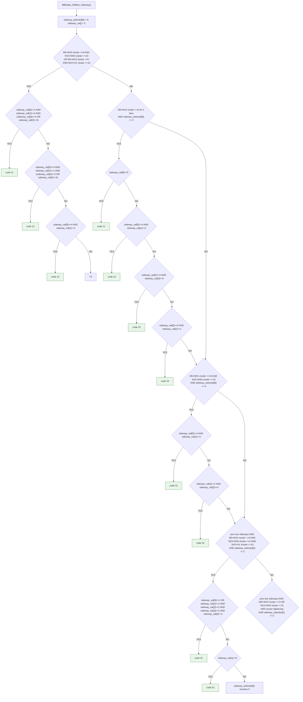

# TofySideway — Sideways-Classification Subsystem (DETECTOR)

This document describes the TofySideway sideways-classification subsystem, which classifies each bar's sideways condition into a code (11/12/13/21/22/23/24/31/32/41/51, or 0=none), using midline clustering across TFs + per-TF sideways scores.

---

## Overview

TofySideway classifies each bar's sideways condition into a code using two functions:

- **BBDatas_Midline_Cluster** — computes midline-distance between TF pairs (M5-M15, M15-M30, M15-H1) and stores results in `BBTFImpact.BB_midline_Cluster[3][LA]`.
- **BBDatas_Midline_Sideway** — scores each TF with `sideway_val` and classifies into a code stored in `BBTFImpact.sideway_selected[0]`.

State: TofySideway is a DETECTOR — it flags sideways conditions, it does NOT yet make trade decisions (untested for trading).

---

## Inputs and scoring

### BB_midline_Cluster values

| Index | TF pair | Stored in |
|-------|---------|-----------|
| 0 | M5 vs M15 | `BBTFImpact.BB_midline_Cluster[0][LA]` |
| 1 | M15 vs M30 | `BBTFImpact.BB_midline_Cluster[1][LA]` |
| 2 | M15 vs H1 | `BBTFImpact.BB_midline_Cluster[2][LA]` |

### sideway_val per TF — scoring rules

Each TF contributes a sum of points (max 7):

| Condition | Points | Source line |
|-----------|--------|-------------|
| `BB_diffMid_Trend >= 3` (sideways trend) | +4 | line 51-53 |
| `BBW_stage < 500` (not flying) | +2 | line 55-57 |
| `BBW_stage == 513 / 523` (fly-shrink) | +1 | line 59-61 |

### Log format

When a code fires, the log line includes:

```
Sideway_val:[H4 H1 M30 M15 M5]-S_<code>
```

where `<code>` is the selected sideways code (e.g. `11`, `23`, `41`). The `S_` prefix marks the sideways selection event.

---

## Classification logic

### DIAGRAM 1 — Full decision cascade



The tier order is critical — each code only fires if earlier conditions were false (see the `sideway_selected[0] == 0` guards). Terminal nodes are the final codes or the default `sideway_selected[0] = 0` when none match.

---

## Code catalog

| Code | Tier | Exact trigger condition (from source) | Plain-language description |
|------|------|--------------------------------------|----------------------------|
| 11 | 1 | `(midline_0<=6 && midline_1<=10 || midline_0<=6 && midline_2<=10) && sideway_val[0]>=1 && sideway_val[1]>=4 && (sideway_val[3]>=2 || sideway_val[2]>=4)` | M5+M15 tightly clustered with M15+M30 or M15+H1; M5 shows sideways trend, M15 strongly sideways; H4/M30 also sideways or not flying |
| 12 | 1 | `(midline_0<=6 && midline_1<=10 || midline_0<=6 && midline_2<=10) && sideway_val[0]>=4 && sideway_val[1]>=1 && (sideway_val[3]>=2 || sideway_val[2]>=4)` | Same cluster pattern but M5 sideways trend stronger (>=4); M15 still sideways or not flying |
| 13 | 1 | `(midline_0<=6 && midline_1<=10 || midline_0<=6 && midline_2<=10) && sideway_val[0]>=4 && sideway_val[1]>=2` | Cluster pattern; M5 sideways trend moderate (>=4); M15 moderate sideways (>=2); H4/M30 not flying |
| 21 | 2 | `(midline_0<=6 && midline_0_1<=6) && sideway_val[0]>=6` | M5+M15 cluster sustained for two bars; M5 strongly sideways (>=6) |
| 22 | 2 | `(midline_0<=6 && midline_0_1<=6) && sideway_val[0]>=4 && sideway_val[1]>=2` | Same cluster pattern; M5 moderate sideways (>=4); M15 sideways or not flying (>=2) |
| 23 | 2 | `(midline_0<=6 && midline_0_1<=6) && sideway_val[1]>=2 && sideway_val[3]>=5` | Same cluster pattern; M15 sideways or not flying (>=2); H4 strongly sideways (>=5) |
| 24 | 2 | `(midline_0<=6 && midline_0_1<=6) && sideway_val[0]>=5 && sideway_val[1]>=1` | Same cluster pattern; M5 moderate sideways (>=5); M15 not flying (>=1) |
| 31 | 3 | `(midline_0<=10 && midline_1<=15) && sideway_val[0]>=4 && sideway_val[1]>=2` | Wider cluster pattern; M5 sideways trend (>=4); M15 sideways or not flying (>=2) |
| 32 | 3 | `(midline_0<=10 && midline_1<=15) && sideway_val[1]>=2 && sideway_val[3]>=5` | Wider cluster pattern; M15 sideways or not flying (>=2); H4 strongly sideways (>=5) |
| 41 | 4 | `sideway_selected[1] != 0 && midline_0<=6 && midline_1<=6 && midline_2<=10 && (sideway_val[0]>=1 || sideway_val[1]>=1) && sideway_val[2]>=2 && sideway_val[3]>=2 && sideway_val[4]>=2` | Previous bar was sideways; all TFs now clustered tighter; H4/M30/M15 not flying, M5 at least mildly sideways |
| 51 | 5 | `sideway_selected[1] != 0 && (midline_0<=3 || midline_1<=3) && (midline_0<prev_midline_0 || midline_1<prev_midline_1) && sideway_val[1]>=6` | Previous bar was sideways; M5+M15 cluster further tightening (<=3 and shrinking); M15 strongly sideways (>=6) |

---

## Classification dispatch (sequence view)

**TofySideway is a CLASSIFIER, not a trading strategy. The terminal outputs are sideways CODES (S_11..S_51, or none), NOT trade actions.** This diagram shows the DISPATCH ORDER of the tier cascade — each tier only fires if all earlier tiers were false (mutual exclusion via `sideway_selected[0] == 0` guards).

```mermaid
sequenceDiagram
    autonumber
    participant Cluster as Midline cluster distances<br/>cluster M5-M15 / M15-M30 / M15-H1
    participant ValM5 as M5 sideway_val score
    participant ValM15 as M15 sideway_val score
    participant ValM30 as M30 sideway_val score
    participant ValH1 as H1 sideway_val score
    participant ValH4 as H4 sideway_val score
    participant Classifier as BBDatas_Midline_Sideway<br/>(tier cascade)
    participant Code as Output code

    Note over Cluster,ValH4: DETECTOR logic — outputs sideways codes only
    Cluster->>Classifier: read clusterM5M15 / clusterM15M30 / clusterM15H1
    ValM5->>Classifier: val0 (sum of +4/+2/+1)
    ValM15->>Classifier: val1
    ValM30->>Classifier: val2
    ValH1->>Classifier: val3
    ValH4->>Classifier: val4

    Classifier->>Classifier: tier 1 check<br/>cluster M5-M15 at most 6 AND<br/>(clusterM15M30 at most 10 OR clusterM15H1 at most 10)
    alt tier 1 conditions met
        Classifier->>Code: S_11 if<br/>val0>=1 AND<br/>val1>=4 AND<br/>(val3>=2 OR val2>=4)
        else
        Classifier->>Code: S_12 if<br/>val0>=4 AND<br/>val1>=1 AND<br/>(val3>=2 OR val2>=4)
        else
        Classifier->>Code: S_13 if<br/>val0>=4 AND<br/>val1>=2
    end

    opt tier 1 false — proceed to tier 2
        Classifier->>Classifier: tier 2 check<br/>cluster M5-M15 at most 6 for 2 bars<br/>AND current code == 0
        alt tier 2 conditions met
            Classifier->>Code: S_21 if<br/>val0>=6
            else
            Classifier->>Code: S_22 if<br/>val0>=4 AND<br/>val1>=2
            else
            Classifier->>Code: S_23 if<br/>val1>=2 AND<br/>val3>=5
            else
            Classifier->>Code: S_24 if<br/>val0>=5 AND<br/>val1>=1
        end

    opt tier 2 false — proceed to tier 3
        Classifier->>Classifier: tier 3 check<br/>cluster M5-M15 at most 10 AND<br/>clusterM15M30 at most 15<br/>AND current code == 0
        alt tier 3 conditions met
            Classifier->>Code: S_31 if<br/>val0>=4 AND<br/>val1>=2
            else
            Classifier->>Code: S_32 if<br/>val1>=2 AND<br/>val3>=5
        end

    opt tier 3 false — proceed to tier 4
        Classifier->>Classifier: tier 4 check<br/>prev code != 0<br/>AND cluster M5-M15 at most 6 AND<br/>clusterM15M30 at most 6 AND<br/>clusterM15H1 at most 10
        alt tier 4 conditions met
            Classifier->>Code: S_41 if<br/>val0>=1 OR<br/>val1>=1 AND<br/>val2>=2 AND<br/>val3>=2 AND<br/>val4>=2
        end

    opt tier 4 false — proceed to tier 5
        Classifier->>Classifier: tier 5 check<br/>prev code != 0<br/>AND cluster M5-M15 at most 3 OR<br/>clusterM15M30 at most 3 AND<br/>cluster shrinking (current under prev)<br/>AND val1>=6
        alt tier 5 conditions met
            Classifier->>Code: S_51
        end

    opt all tiers false
        Classifier->>Code: none (current code stays 0)
    end
```

The sequence mirrors the flowchart tier cascade: tier 1 fires first, and only if it fails does tier 2 get checked, and so on. Each terminal node is a sideways CODE, never a trade operation. This view emphasizes the DISPATCH ORDER — the mutual exclusion enforced by `sideway_selected[0] == 0` guards at each tier boundary.

---

## Cross-reference

See `DUALTF_ARCHITECTURE.md` for the DualTF Architecture overview. TofySideway is a candidate FILTER for the (now-closed) DualTF entry or any future premise, and its trading value is UNTESTED.

---

## Improvement opportunities

Observations on the logic AS WRITTEN — not prescriptive rewrites:

- **Tier-4/5 coupling:** Codes 41 and 51 require `sideway_selected[1] != 0`, meaning they only fire after a tier-1/2/3 code fired on the previous bar. This persistence dependence is built into the design; earlier tiers must establish a sideways state before later tiers can tighten it.
- **Threshold progression:** The cluster thresholds move from <=6 (tiers 1-2) to <=10 (tier 3) to <=3 with shrinking (tier 5). The progression from 6→10→3 suggests tier-5 is meant for a further-tightening case, but the jump back to <=3 seems asymmetric compared to the earlier steps.
- **M5 dependence:** M5 (`sideway_val[0]`) is used in almost every code (11/12/13/21/22/24/31/41/51). Since M5 is the noisiest TF, several codes lean on it for the sideways signal — this may make the detector sensitive to M5 noise.
- **sideway_val weighting:** The +4/+2/+1 scheme assigns most weight to `BB_diffMid_Trend >= 3`. Whether this has a rationale or is ad-hoc needs investigation — for instance, whether the +4 points correlate with higher win-rate than the +2 points from `BBW_stage < 500`.

---
