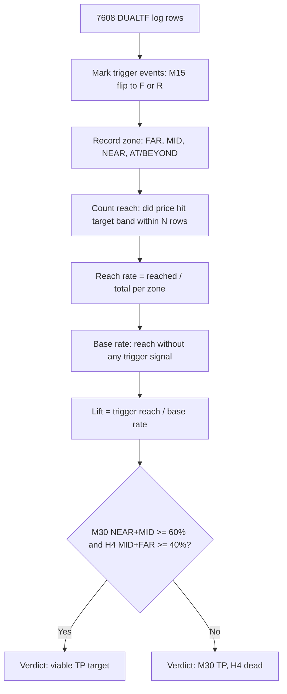

# Target Reach Analysis

> Do structural band targets (M30/H1/H4 upper/lower band) get REACHED after detector-qualifying triggers? Settles Part 5's target rule.

## Data Summary

| Metric | Value |
|--------|-------|
| Total DUALTF rows | 7608 |
| UP triggers (M15->F) | 245 |
| DOWN triggers (M15->R) | 252 |
| M30-followed UP | 93 |
| M30-followed DOWN | 83 |
| M30-followed total | 176 |

> **Cascade cross-check:** UP flips = 245 (cascade: ~245), DOWN flips = 252 (cascade: ~252). M30-followed UP = 93 (38%), DOWN = 83 (33%).

## Measurement A — Reach Rates

For each target TF x direction x zone x window: reach % on ALL triggers and on the M30-FOLLOWED subset.

### M30

**Window N=12 rows (60 minutes)**

| Zone | Direction | ALL Reach % (n) | FOLLOWED Reach % (n) |
|------|-----------|-----------------|---------------------|
| FAR | UP | 23% (n=13) * | 50% (n=2) * |
| FAR | DOWN | 31% (n=32) | 100% (n=4) * |
| MID | UP | 51% (n=39) | 100% (n=2) * |
| MID | DOWN | 49% (n=55) | 100% (n=10) * |
| NEAR | UP | 72% (n=82) | 100% (n=26) |
| NEAR | DOWN | 61% (n=54) | 81% (n=16) |
| AT/BEYOND | UP | 95% (n=111) | 98% (n=63) |
| AT/BEYOND | DOWN | 92% (n=111) | 96% (n=53) |

**Window N=24 rows (120 minutes)**

| Zone | Direction | ALL Reach % (n) | FOLLOWED Reach % (n) |
|------|-----------|-----------------|---------------------|
| FAR | UP | 46% (n=13) * | 100% (n=2) * |
| FAR | DOWN | 44% (n=32) | 100% (n=4) * |
| MID | UP | 64% (n=39) | 100% (n=2) * |
| MID | DOWN | 67% (n=55) | 100% (n=10) * |
| NEAR | UP | 82% (n=82) | 100% (n=26) |
| NEAR | DOWN | 78% (n=54) | 88% (n=16) |
| AT/BEYOND | UP | 96% (n=111) | 98% (n=63) |
| AT/BEYOND | DOWN | 92% (n=111) | 96% (n=53) |

**Window N=48 rows (240 minutes)**

| Zone | Direction | ALL Reach % (n) | FOLLOWED Reach % (n) |
|------|-----------|-----------------|---------------------|
| FAR | UP | 54% (n=13) * | 100% (n=2) * |
| FAR | DOWN | 66% (n=32) | 100% (n=4) * |
| MID | UP | 79% (n=39) | 100% (n=2) * |
| MID | DOWN | 85% (n=55) | 100% (n=10) * |
| NEAR | UP | 91% (n=82) | 100% (n=26) |
| NEAR | DOWN | 91% (n=54) | 94% (n=16) |
| AT/BEYOND | UP | 97% (n=111) | 98% (n=63) |
| AT/BEYOND | DOWN | 94% (n=111) | 98% (n=53) |

**Window N=96 rows (480 minutes)**

| Zone | Direction | ALL Reach % (n) | FOLLOWED Reach % (n) |
|------|-----------|-----------------|---------------------|
| FAR | UP | 92% (n=13) * | 100% (n=2) * |
| FAR | DOWN | 97% (n=32) | 100% (n=4) * |
| MID | UP | 87% (n=39) | 100% (n=2) * |
| MID | DOWN | 98% (n=55) | 100% (n=10) * |
| NEAR | UP | 99% (n=82) | 100% (n=26) |
| NEAR | DOWN | 96% (n=54) | 94% (n=16) |
| AT/BEYOND | UP | 98% (n=111) | 100% (n=63) |
| AT/BEYOND | DOWN | 97% (n=111) | 100% (n=53) |

* = low sample (n < 15)

### H1

**Window N=12 rows (60 minutes)**

| Zone | Direction | ALL Reach % (n) | FOLLOWED Reach % (n) |
|------|-----------|-----------------|---------------------|
| FAR | UP | 6% (n=36) | 20% (n=5) * |
| FAR | DOWN | 12% (n=66) | 31% (n=16) |
| MID | UP | 20% (n=55) | 42% (n=19) |
| MID | DOWN | 23% (n=57) | 31% (n=16) |
| NEAR | UP | 60% (n=57) | 78% (n=27) |
| NEAR | DOWN | 48% (n=44) | 79% (n=14) * |
| AT/BEYOND | UP | 97% (n=97) | 100% (n=42) |
| AT/BEYOND | DOWN | 94% (n=85) | 97% (n=37) |

**Window N=24 rows (120 minutes)**

| Zone | Direction | ALL Reach % (n) | FOLLOWED Reach % (n) |
|------|-----------|-----------------|---------------------|
| FAR | UP | 17% (n=36) | 40% (n=5) * |
| FAR | DOWN | 26% (n=66) | 62% (n=16) |
| MID | UP | 38% (n=55) | 58% (n=19) |
| MID | DOWN | 39% (n=57) | 56% (n=16) |
| NEAR | UP | 68% (n=57) | 85% (n=27) |
| NEAR | DOWN | 59% (n=44) | 79% (n=14) * |
| AT/BEYOND | UP | 98% (n=97) | 100% (n=42) |
| AT/BEYOND | DOWN | 94% (n=85) | 97% (n=37) |

**Window N=48 rows (240 minutes)**

| Zone | Direction | ALL Reach % (n) | FOLLOWED Reach % (n) |
|------|-----------|-----------------|---------------------|
| FAR | UP | 47% (n=36) | 60% (n=5) * |
| FAR | DOWN | 47% (n=66) | 69% (n=16) |
| MID | UP | 73% (n=55) | 79% (n=19) |
| MID | DOWN | 56% (n=57) | 81% (n=16) |
| NEAR | UP | 81% (n=57) | 89% (n=27) |
| NEAR | DOWN | 66% (n=44) | 79% (n=14) * |
| AT/BEYOND | UP | 99% (n=97) | 100% (n=42) |
| AT/BEYOND | DOWN | 95% (n=85) | 97% (n=37) |

**Window N=96 rows (480 minutes)**

| Zone | Direction | ALL Reach % (n) | FOLLOWED Reach % (n) |
|------|-----------|-----------------|---------------------|
| FAR | UP | 72% (n=36) | 100% (n=5) * |
| FAR | DOWN | 65% (n=66) | 75% (n=16) |
| MID | UP | 84% (n=55) | 84% (n=19) |
| MID | DOWN | 70% (n=57) | 88% (n=16) |
| NEAR | UP | 88% (n=57) | 93% (n=27) |
| NEAR | DOWN | 73% (n=44) | 79% (n=14) * |
| AT/BEYOND | UP | 100% (n=97) | 100% (n=42) |
| AT/BEYOND | DOWN | 96% (n=85) | 100% (n=37) |

* = low sample (n < 15)

### H4

**Window N=12 rows (60 minutes)**

| Zone | Direction | ALL Reach % (n) | FOLLOWED Reach % (n) |
|------|-----------|-----------------|---------------------|
| FAR | UP | 0% (n=47) | 0% (n=16) |
| FAR | DOWN | 1% (n=89) | 4% (n=27) |
| MID | UP | 5% (n=63) | 8% (n=25) |
| MID | DOWN | 5% (n=65) | 9% (n=22) |
| NEAR | UP | 26% (n=68) | 40% (n=30) |
| NEAR | DOWN | 38% (n=50) | 61% (n=18) |
| AT/BEYOND | UP | 97% (n=65) | 100% (n=21) |
| AT/BEYOND | DOWN | 94% (n=47) | 100% (n=15) |

**Window N=24 rows (120 minutes)**

| Zone | Direction | ALL Reach % (n) | FOLLOWED Reach % (n) |
|------|-----------|-----------------|---------------------|
| FAR | UP | 0% (n=47) | 0% (n=16) |
| FAR | DOWN | 2% (n=89) | 7% (n=27) |
| MID | UP | 10% (n=63) | 12% (n=25) |
| MID | DOWN | 12% (n=65) | 27% (n=22) |
| NEAR | UP | 38% (n=68) | 53% (n=30) |
| NEAR | DOWN | 48% (n=50) | 67% (n=18) |
| AT/BEYOND | UP | 98% (n=65) | 100% (n=21) |
| AT/BEYOND | DOWN | 94% (n=47) | 100% (n=15) |

**Window N=48 rows (240 minutes)**

| Zone | Direction | ALL Reach % (n) | FOLLOWED Reach % (n) |
|------|-----------|-----------------|---------------------|
| FAR | UP | 2% (n=47) | 6% (n=16) |
| FAR | DOWN | 3% (n=89) | 7% (n=27) |
| MID | UP | 24% (n=63) | 36% (n=25) |
| MID | DOWN | 29% (n=65) | 45% (n=22) |
| NEAR | UP | 49% (n=68) | 63% (n=30) |
| NEAR | DOWN | 56% (n=50) | 78% (n=18) |
| AT/BEYOND | UP | 98% (n=65) | 100% (n=21) |
| AT/BEYOND | DOWN | 98% (n=47) | 100% (n=15) |

**Window N=96 rows (480 minutes)**

| Zone | Direction | ALL Reach % (n) | FOLLOWED Reach % (n) |
|------|-----------|-----------------|---------------------|
| FAR | UP | 6% (n=47) | 6% (n=16) |
| FAR | DOWN | 12% (n=89) | 19% (n=27) |
| MID | UP | 52% (n=63) | 56% (n=25) |
| MID | DOWN | 51% (n=65) | 77% (n=22) |
| NEAR | UP | 57% (n=68) | 70% (n=30) |
| NEAR | DOWN | 64% (n=50) | 83% (n=18) |
| AT/BEYOND | UP | 98% (n=65) | 100% (n=21) |
| AT/BEYOND | DOWN | 98% (n=47) | 100% (n=15) |

* = low sample (n < 15)

## Measurement B — Base-Rate Lift

Unconditional: from ALL rows in a zone (no trigger), how often does the band get reached within N=48? Lift = trigger-conditioned reach / unconditional reach.

### M30

| Zone | Direction | Trigger Reach % | Base Rate % | Lift |
|------|-----------|-----------------|-------------|------|
| FAR | UP | 54% | 86% | 0.63x |
| FAR | DOWN | 66% | 79% | 0.83x |
| MID | UP | 79% | 80% | 0.99x |
| MID | DOWN | 85% | 82% | 1.04x |
| NEAR | UP | 91% | 80% | 1.14x |
| NEAR | DOWN | 91% | 80% | 1.13x |
| AT/BEYOND | UP | 97% | 84% | 1.16x |
| AT/BEYOND | DOWN | 94% | 79% | 1.19x |

### H1

| Zone | Direction | Trigger Reach % | Base Rate % | Lift |
|------|-----------|-----------------|-------------|------|
| FAR | UP | 47% | 66% | 0.71x |
| FAR | DOWN | 47% | 57% | 0.82x |
| MID | UP | 73% | 66% | 1.10x |
| MID | DOWN | 56% | 54% | 1.03x |
| NEAR | UP | 81% | 70% | 1.15x |
| NEAR | DOWN | 66% | 55% | 1.21x |
| AT/BEYOND | UP | 99% | 70% | 1.42x |
| AT/BEYOND | DOWN | 95% | 54% | 1.77x |

### H4

| Zone | Direction | Trigger Reach % | Base Rate % | Lift |
|------|-----------|-----------------|-------------|------|
| FAR | UP | 2% | 35% | 0.06x |
| FAR | DOWN | 3% | 26% | 0.13x |
| MID | UP | 24% | 22% | 1.10x |
| MID | DOWN | 29% | 26% | 1.13x |
| NEAR | UP | 49% | 33% | 1.47x |
| NEAR | DOWN | 56% | 32% | 1.75x |
| AT/BEYOND | UP | 98% | 62% | 1.60x |
| AT/BEYOND | DOWN | 98% | 40% | 2.47x |

## Measurement C — The At-Band Question

For triggers firing in AT/BEYOND zone: does bbloc hold at the band for 12 rows (ride) or move away from it (reject)? UP: hold >= 9, reject = falls < 7. DOWN: hold <= 1, reject = rises > 3.

**AT/BEYOND triggers across all targets:** 516 (note: a single trigger can be AT/BEYOND for multiple targets, so this sum exceeds the 497 total triggers).

| Target | AT/BEYOND Triggers | Ride (holds band 12 rows) | Reject (moves away) | Ride % |
|--------|-------------------|--------------------------|--------------------|--------|
| M30 | 222 | 33 | 103 | 15% |
| H1 | 182 | 56 | 45 | 31% |
| H4 | 112 | 73 | 8 | 65% |

## Calculation method (plain explanation)

**(a) COUNT** — Scan every DUALTF row. When the M15 state flips to F (UP trigger) or R (DOWN trigger), mark the bar. Total: 245 UP triggers and 252 DOWN triggers (497 total). For each trigger, record the M30 BBLoc zone (FAR, MID, NEAR, AT/BEYOND).

**(b) RATE** — For each trigger, look forward N rows (12/24/48/96). If price reaches the target band (M30, H1, or H4) within N rows, count it as "reached." Reach rate = reached / total triggers in that zone. At N=48, M30 band reach from NEAR+MID = 98.1% (FOLLOWED subset). H4 reach from MID+FAR = 24.4%.

**(c) LIFT** — The base rate is how often the band gets reached from the same zone even without a trigger (unconditional reach). Lift = trigger-conditioned reach / base-rate reach. For M30 NEAR UP: 91% / 80% = 1.14x. Lift near 1.0 means the trigger adds nothing over random; lift >= 1.5 means the trigger meaningfully improves reach.

This analysis measures whether a signal EXISTS in the identification log — NOT whether trading it is profitable. A signal with high lift can still lose money in live trading (see V36.13 backtest: -$899). Signal existence and trade profitability are different questions.

## VERDICT

**Criteria applied mechanically at N=48 on M30-FOLLOWED subset — no post-hoc adjustment.**

| Criterion | Threshold | Actual | Result |
|-----------|-----------|--------|--------|
| C1: H4 reach from MID+FAR >= 40% | >= 40% | 24.4% | FAIL |
| C2: any target NEAR+MID >= 60% | >= 60% | M30 at 98.1% | PASS |
| C3: NEAR >= FAR (sanity) | No violation | No violation | PASS |

**CONCLUSION: CRITERIA FAILED.** C1: H4 reach 24.4% from MID+FAR. 
Recommendation: M30 band as default take-profit (98% reach from NEAR+MID).

## LIMITATIONS

1. **Reach is not profit.** Price can stop you out on the way, then reach the band. This measurement has no stops, no path analysis — only endpoint reach.
2. **bbloc-distance is not price-RR.** Band prices are not logged in this data. Real risk-reward waits for the V36.11 backtest with price-level targets.
3. **Weekend row-index caveat.** Rows are M5 bar index, not wall-clock. Weekend gaps mean 48 rows may cover > 4 hours of real time on Friday, or < 4 hours on a continuous session.
4. **Sparse bbloc scale.** H1/M30/M15 bbloc uses sparse values (0,1,3,5,7,9,10). Zone boundaries may not be equidistant in price terms.

---

*Analysis generated by `scripts/analyze_target_reach.py`. Deterministic — re-running produces identical numbers.*
