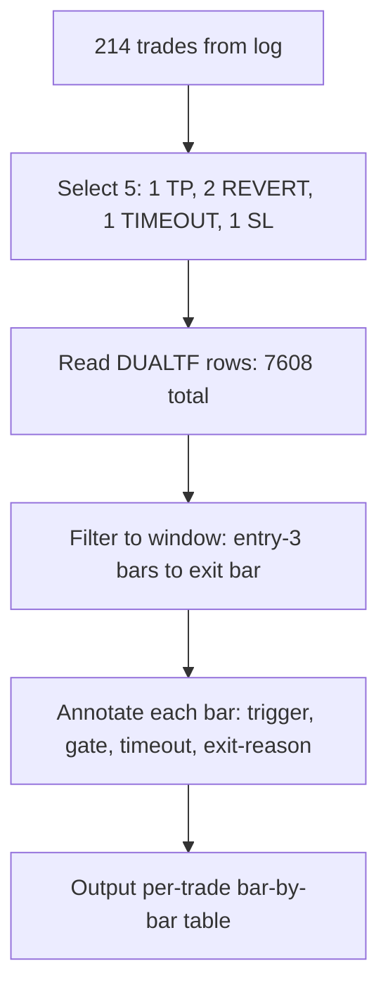

# V36.13 Trade Traces - Bar-by-Bar Decision Traces

> **VALIDATION USE:** For each trade, confirm the code's entry/exit decisions match the intended design rules. A mismatch = implementation bug; a match + loss = design premise issue.

## Trade 1: UP - TP_HIT

**Entry:** 2026-01-09 23:30:00 | **Exit:** 2026-01-12 01:30:00 | **Bars held:** 3 | **RR:** 0.64

**SL:** 4489.58 (opposite M15 band) | **TP:** 4522.65 (M30 band) | **m30bbloc at entry:** 7 (NEAR/MID)

| dt | d1 | d1b | h4 | h4b | h1 | h1b | m30 | m30b | m15 | m15b | annotation |
|----|----|-----|----|-----|----|-----|-----|------|-----|------|------------|
| 01.09 22:45 | F | 9 | F | 10 | F | 9 | F | 7 | C | 7 |  |
| 01.09 23:00 | F | 9 | F | 10 | F | 9 | F | 7 | C | 7 |  |
| 01.09 23:15 | F | 9 | F | 10 | F | 9 | F | 7 | C | 9 |  |
| 01.09 23:30 | F | 9 | F | 10 | F | 10 | F | 7 | F | 9 | TRIGGER: M15 flip C->F (UP) | m30bbloc=7 (NEAR/MID) | gate PASS -> entry UP at 4509.75 | SL=4489.58 (opp M15 band) | TP=4522.65 (M30 band) | rr=0.64 |
| 01.09 23:45 | F | 9 | F | 10 | F | 10 | F | 7 | F | 9 | m30_followed->TRUE |
| 01.12 01:00 | F | 9 | F | 10 | F | 10 | F | 9 | F | 10 |  |
| 01.12 01:15 | F | 9 | F | 10 | F | 10 | F | 10 | F | 10 |  |
| 01.12 01:30 | F | 10 | F | 10 | F | 10 | F | 10 | F | 10 | EXIT: price 4537.92 reached TP 4522.65 -> TP_HIT |

## Trade 2: UP - M15_REVERT

**Entry:** 2026-01-05 08:15:00 | **Exit:** 2026-01-05 14:30:00 | **Bars held:** 24 | **RR:** 1.18

**SL:** 4394.90 (opposite M15 band) | **TP:** 4446.08 (M30 band) | **m30bbloc at entry:** 7 (NEAR/MID)

| dt | d1 | d1b | h4 | h4b | h1 | h1b | m30 | m30b | m15 | m15b | annotation |
|----|----|-----|----|-----|----|-----|-----|------|-----|------|------------|
| 01.05 07:30 | X | -1 | C | 10 | F | 9 | F | 7 | S | 9 |  |
| 01.05 07:45 | X | -1 | C | 10 | F | 7 | F | 7 | S | 3 |  |
| 01.05 08:00 | X | -1 | F | 10 | F | 9 | F | 7 | C | 10 |  |
| 01.05 08:15 | X | -1 | F | 10 | F | 9 | F | 7 | F | 10 | TRIGGER: M15 flip C->F (UP) | m30bbloc=7 (NEAR/MID) | gate PASS -> entry UP at 4418.36 | SL=4394.90 (opp M15 band) | TP=4446.08 (M30 band) | rr=1.18 |
| 01.05 08:30 | X | -1 | F | 10 | F | 9 | F | 9 | F | 10 | m30_followed->TRUE |
| 01.05 08:45 | X | -1 | F | 10 | F | 9 | F | 7 | F | 10 |  |
| 01.05 09:00 | X | -1 | F | 10 | F | 9 | F | 7 | F | 9 |  |
| 01.05 09:15 | X | -1 | F | 10 | F | 9 | F | 7 | F | 9 |  |
| 01.05 09:30 | X | -1 | F | 10 | F | 9 | F | 7 | F | 9 |  |
| 01.05 09:45 | X | -1 | F | 10 | F | 9 | F | 7 | F | 9 |  |
| 01.05 10:00 | X | -1 | F | 10 | F | 9 | S | 7 | F | 9 |  |
| 01.05 10:15 | X | -1 | F | 10 | F | 9 | S | 7 | F | 9 | timeout: 8/12, m30_followed=True |
| 01.05 10:30 | X | -1 | F | 10 | F | 9 | S | 9 | F | 9 | timeout: 9/12, m30_followed=True |
| 01.05 10:45 | X | -1 | F | 10 | F | 9 | S | 9 | F | 9 | timeout: 10/12, m30_followed=True |
| 01.05 11:00 | X | -1 | F | 10 | F | 9 | S | 9 | F | 9 | timeout: 11/12, m30_followed=True |
| 01.05 11:15 | X | -1 | F | 10 | F | 9 | S | 9 | F | 9 | timeout: 12/12, m30_followed=True |
| 01.05 11:30 | X | -1 | F | 10 | F | 9 | S | 9 | F | 9 | timeout: 13/12, m30_followed=True |
| 01.05 11:45 | X | -1 | F | 10 | F | 9 | S | 10 | F | 9 | timeout: 14/12, m30_followed=True |
| 01.05 12:00 | X | -1 | F | 10 | F | 9 | S | 9 | F | 9 | timeout: 15/12, m30_followed=True |
| 01.05 12:15 | X | -1 | F | 10 | F | 9 | S | 9 | F | 7 | timeout: 16/12, m30_followed=True |
| 01.05 12:30 | X | -1 | F | 10 | F | 9 | F | 9 | F | 7 | timeout: 17/12, m30_followed=True |
| 01.05 12:45 | X | -1 | F | 10 | F | 9 | F | 9 | F | 9 | timeout: 18/12, m30_followed=True |
| 01.05 13:00 | X | -1 | F | 10 | F | 9 | F | 9 | F | 9 | timeout: 19/12, m30_followed=True |
| 01.05 13:15 | X | -1 | F | 10 | F | 7 | F | 9 | F | 7 | timeout: 20/12, m30_followed=True |
| 01.05 13:30 | X | -1 | F | 9 | F | 7 | F | 5 | F | 1 | timeout: 21/12, m30_followed=True |
| 01.05 13:45 | X | -1 | F | 10 | F | 7 | F | 7 | F | 3 | timeout: 22/12, m30_followed=True |
| 01.05 14:00 | X | -1 | F | 9 | F | 7 | S | 5 | F | 1 | timeout: 23/12, m30_followed=True |
| 01.05 14:15 | X | -1 | F | 9 | F | 7 | S | 5 | R | 1 | timeout: 24/12, m30_followed=True | M15 R != trigger F |
| 01.05 14:30 | X | -1 | F | 9 | F | 7 | S | 5 | R | 1 | EXIT: M15 R != trigger state F -> M15_REVERT |

## Trade 3: DOWN - M15_REVERT

**Entry:** 2026-01-06 11:15:00 | **Exit:** 2026-01-06 14:15:00 | **Bars held:** 11 | **RR:** 1.60

**SL:** 4472.22 (opposite M15 band) | **TP:** 4435.50 (M30 band) | **m30bbloc at entry:** 5 (NEAR/MID)

| dt | d1 | d1b | h4 | h4b | h1 | h1b | m30 | m30b | m15 | m15b | annotation |
|----|----|-----|----|-----|----|-----|-----|------|-----|------|------------|
| 01.06 10:30 | X | -1 | F | 9 | F | 9 | F | 9 | C | 9 |  |
| 01.06 10:45 | X | -1 | F | 9 | F | 9 | F | 7 | C | 5 |  |
| 01.06 11:00 | X | -1 | F | 9 | F | 9 | F | 7 | C | 7 |  |
| 01.06 11:15 | X | -1 | F | 9 | F | 7 | F | 5 | R | 1 | TRIGGER: M15 flip C->R (DOWN) | m30bbloc=5 (NEAR/MID) | gate PASS -> entry DOWN at 4458.08 | SL=4472.22 (opp M15 band) | TP=4435.50 (M30 band) | rr=1.60 |
| 01.06 11:30 | X | -1 | F | 9 | F | 7 | F | 5 | R | 1 |  |
| 01.06 11:45 | X | -1 | F | 9 | F | 7 | F | 5 | R | 1 |  |
| 01.06 12:00 | X | -1 | F | 8 | S | 5 | S | 3 | R | 0 |  |
| 01.06 12:15 | X | -1 | F | 8 | S | 5 | S | 3 | R | 1 |  |
| 01.06 12:30 | X | -1 | F | 8 | S | 5 | S | 3 | R | 1 |  |
| 01.06 12:45 | X | -1 | F | 8 | S | 5 | S | 3 | R | 1 |  |
| 01.06 13:00 | X | -1 | F | 8 | S | 5 | S | 3 | R | 3 |  |
| 01.06 13:15 | X | -1 | F | 8 | S | 5 | S | 3 | R | 3 | timeout: 8/12, m30_followed=False |
| 01.06 13:30 | X | -1 | F | 8 | S | 7 | S | 3 | R | 3 | timeout: 9/12, m30_followed=False |
| 01.06 13:45 | X | -1 | F | 9 | S | 9 | S | 5 | R | 7 | timeout: 10/12, m30_followed=False |
| 01.06 14:00 | X | -1 | F | 9 | C | 7 | C | 7 | S | 7 | timeout: 11/12, m30_followed=False | M15 S != trigger R |
| 01.06 14:15 | X | -1 | F | 9 | C | 7 | C | 5 | S | 7 | EXIT: M15 S != trigger state R -> M15_REVERT |

## Trade 4: UP - TIMEOUT

**Entry:** 2026-01-12 09:15:00 | **Exit:** 2026-01-12 12:30:00 | **Bars held:** 12 | **RR:** 1.54

**SL:** 4565.10 (opposite M15 band) | **TP:** 4611.35 (M30 band) | **m30bbloc at entry:** 7 (NEAR/MID)

| dt | d1 | d1b | h4 | h4b | h1 | h1b | m30 | m30b | m15 | m15b | annotation |
|----|----|-----|----|-----|----|-----|-----|------|-----|------|------------|
| 01.12 08:30 | F | 10 | F | 10 | F | 9 | F | 7 | C | 5 |  |
| 01.12 08:45 | F | 10 | F | 10 | F | 9 | F | 7 | C | 5 |  |
| 01.12 09:00 | F | 10 | F | 10 | F | 9 | S | 7 | C | 7 |  |
| 01.12 09:15 | F | 10 | F | 10 | F | 9 | S | 7 | F | 10 | TRIGGER: M15 flip C->F (UP) | m30bbloc=7 (NEAR/MID) | gate PASS -> entry UP at 4583.34 | SL=4565.10 (opp M15 band) | TP=4611.35 (M30 band) | rr=1.54 |
| 01.12 09:30 | F | 10 | F | 10 | F | 9 | S | 7 | F | 9 |  |
| 01.12 09:45 | F | 10 | F | 10 | F | 9 | S | 7 | F | 9 |  |
| 01.12 10:00 | F | 10 | F | 10 | F | 9 | S | 7 | F | 10 |  |
| 01.12 10:15 | F | 10 | F | 10 | F | 9 | S | 7 | F | 9 |  |
| 01.12 10:30 | F | 10 | F | 10 | F | 9 | S | 7 | F | 7 |  |
| 01.12 10:45 | F | 10 | F | 10 | F | 9 | S | 7 | F | 9 |  |
| 01.12 11:00 | F | 10 | F | 10 | F | 9 | S | 9 | F | 10 |  |
| 01.12 11:15 | F | 10 | F | 10 | F | 9 | S | 9 | F | 10 | timeout: 8/12, m30_followed=False |
| 01.12 11:30 | F | 10 | F | 10 | F | 9 | S | 10 | F | 9 | timeout: 9/12, m30_followed=False |
| 01.12 11:45 | F | 10 | F | 10 | F | 9 | S | 9 | F | 9 | timeout: 10/12, m30_followed=False |
| 01.12 12:00 | F | 10 | F | 10 | F | 7 | S | 7 | F | 7 | timeout: 11/12, m30_followed=False |
| 01.12 12:15 | F | 10 | F | 10 | F | 9 | S | 9 | F | 7 | timeout: 12/12, m30_followed=False |
| 01.12 12:30 | F | 10 | F | 10 | F | 9 | C | 9 | F | 7 | EXIT: 13 bars, m30_followed=False -> TIMEOUT |

## Trade 5: DOWN - SL_HIT

**Entry:** 2026-01-06 02:45:00 | **Exit:** 2026-01-06 04:30:00 | **Bars held:** 6 | **RR:** 0.42

**SL:** 4451.95 (opposite M15 band) | **TP:** 4430.14 (M30 band) | **m30bbloc at entry:** 3 (NEAR/MID)

| dt | d1 | d1b | h4 | h4b | h1 | h1b | m30 | m30b | m15 | m15b | annotation |
|----|----|-----|----|-----|----|-----|-----|------|-----|------|------------|
| 01.06 02:00 | X | -1 | F | 9 | F | 7 | S | 5 | F | 3 |  |
| 01.06 02:15 | X | -1 | F | 9 | F | 7 | S | 5 | R | 3 |  |
| 01.06 02:30 | X | -1 | F | 9 | F | 7 | S | 5 | R | 3 |  |
| 01.06 02:45 | X | -1 | F | 9 | F | 5 | S | 3 | R | 1 | TRIGGER: M15 flip R->R (DOWN) | m30bbloc=3 (NEAR/MID) | gate PASS -> entry DOWN at 4436.62 | SL=4451.95 (opp M15 band) | TP=4430.14 (M30 band) | rr=0.42 |
| 01.06 03:00 | X | -1 | F | 9 | S | 5 | S | 1 | R | 1 |  |
| 01.06 03:15 | X | -1 | F | 9 | S | 7 | S | 5 | R | 5 |  |
| 01.06 03:30 | X | -1 | F | 9 | S | 5 | S | 0 | R | 1 |  |
| 01.06 03:45 | X | -1 | F | 9 | S | 7 | S | 3 | R | 3 |  |
| 01.06 04:00 | X | -1 | F | 9 | S | 9 | C | 9 | R | 9 |  |
| 01.06 04:15 | X | -1 | F | 9 | S | 10 | C | 10 | R | 10 |  |
| 01.06 04:30 | X | -1 | F | 10 | S | 10 | F | 10 | F | 10 | EXIT: price 4460.15 reached SL 4451.95 -> SL_HIT |

---

> This report contains raw decision-trace data only. No profitability verdict, no design recommendations. For each trade, compare the code's entry/exit decisions against the intended design rules.

## How the trace is built

Five trades are selected from the 214 total — one TP_HIT, two M15_REVERT (spaced at least one day apart), one TIMEOUT, one SL_HIT — to cover all exit types. For each trade, the script reads all [DUALTF] log rows and filters to a window spanning 3 bars before entry through the exit bar. Each bar is annotated with the rule that produced the decision at that point: the TRIGGER row marks the M15 state flip and m30bbloc zone gate; post-entry bars show m30_followed status, timeout countdown (bars 8-12), and the M15-revert check; the EXIT row states the exit reason and the rule that fired. The output is a per-trade bar-by-bar table with columns for each TF's state and bbloc, plus an annotation column naming the decision rule. This is a VALIDATION trace — it confirms the code's entry/exit decisions match the intended design rules. A mismatch is an implementation bug; a match plus a loss is a design-premise issue, not a profitability analysis.

