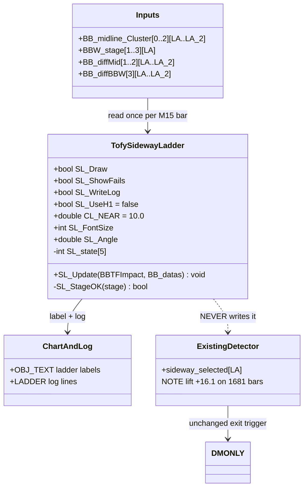
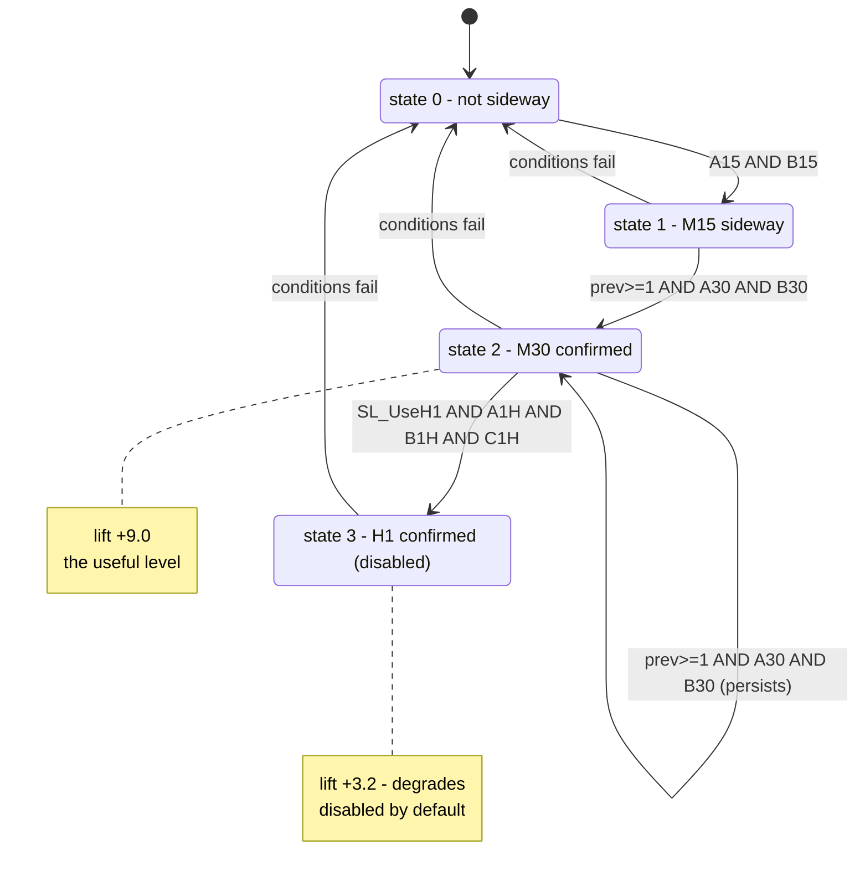
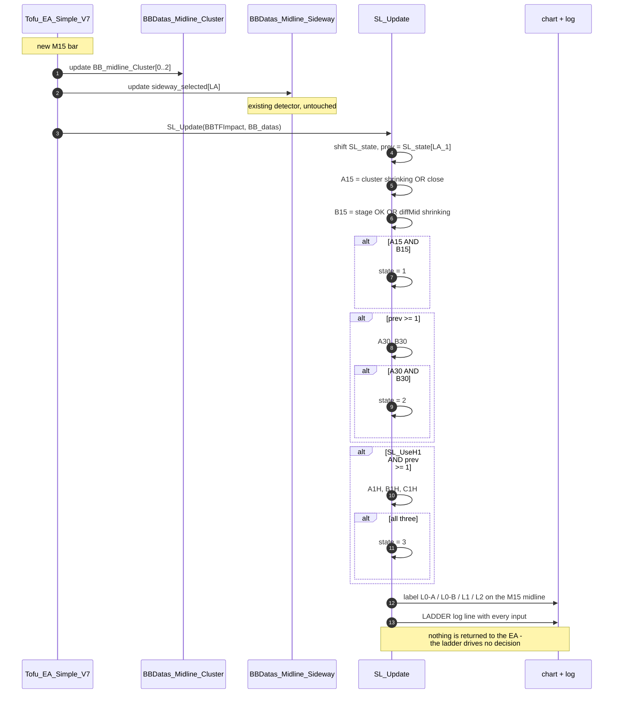

# TofySidewayLadder — design, measurements, and open questions

Companion doc for `scripts/TofySidewayLadder.mqh`.

**Status: diagnostic only.** The module computes a sideway "ladder" state and draws a
label per M15 bar. It does **not** trade and does **not** write `sideway_selected`, so
the existing detector and DMONLY are unaffected. Everything below is measurement, not
a recommendation to deploy.

---

## 1. What problem this is trying to solve

A specific 13-hour range on the chart — **2026.02.03 12:40 → 2026.02.04 02:05** — that
should be flagged as sideway so the strategy exits and stays out.

Measured properties of that window:

| | value |
|---|---|
| M15 bars | 50 |
| start → end | 4916.88 → 4957.30 (**net 40.42**) |
| high / low | 4993.42 / 4881.51 (**range 111.91**) |
| path travelled | **1,163.18** |
| **efficiency ratio** | **0.035** |

Price walked 1,163 points to finish 40 from where it started. ER 0.035 puts this in the
bottom decile of the whole dataset — **this is chop, not quiet.**

**The current detector covers 6 of 50 bars (12%):**

```
.....X...XX......XX..............................X
```

It catches a couple of bars at the start, one at the end, and misses the entire
10-hour middle.

---

## 2. Why the existing detector misses it

From the classification work (see `TofyVerifySideway.md`), TofySideway is a **quiet**
detector, not a **chop** detector:

| class | definition | baseline | TofySideway flags | lift |
|---|---|---|---|---|
| QUIET | net < 10 and range < 15 | 37.8% | 53.8% | **+16.0** |
| CHOPPY | net < 10 and range >= 15 | 15.6% | 10.8% | **-4.8** |
| TREND | net >= 10 | 46.6% | 35.4% | -11.2 |

It finds quiet strongly, avoids trends correctly, and **under-flags chop**.

The mechanism is the midline-cluster gate. In a *quiet* market the M5/M15/M30 midlines
converge, so `cluster < 10` passes. In a *choppy* range price swings ±50 points, which
keeps the midlines apart — the very condition the detector uses as evidence of sideways
is destroyed by the kind of sideways being looked for.

---

## 3. The ladder design

Sequential escalation. Each level requires the **previous bar** to have reached the level
below (or higher, after the `prev >= 1` fix — see §5).

```
state 1  M15 block
state 2  M30 block   (needs prev >= 1)
state 3  H1  block   (needs prev >= 1)   [disabled by default]
```

### Conditions, split out

`＜` means "less than". `clus0` = |M15 mid − M5 mid|, `clus1` = |M15 mid − M30 mid|,
`clus2` = |M15 mid − H1 mid|. `LA` = current bar, `LA_1` = one bar ago, `LA_2` = two ago.

**LEVEL 1 — M15 → state 1**

| | condition |
|---|---|
| A1 | `clus0[LA] ＜ clus0[LA_1]` AND `clus0[LA_1] ＜ clus0[LA_2]` (shrinking 2 bars) |
| A2 | `clus0[LA] ＜ CL_NEAR` AND `clus0[LA_1] ＜ CL_NEAR` (already close) |
| **A15** | **A1 OR A2** |
| B1 | `stage[1][LA]` is 512, 523, or 400-499 |
| B2 | `dmid[1][LA] ＜ dmid[1][LA_1] ＜ dmid[1][LA_2]` |
| **B15** | **B1 OR B2** |
| → | `state = 1` when **A15 AND B15** |

**LEVEL 2 — M30 → state 2** (requires `prev >= 1`)

| | condition |
|---|---|
| A1 | `clus1[LA] ＜ clus1[LA_1] ＜ clus1[LA_2]` |
| A2 | `clus1[LA] ＜ CL_NEAR` AND `clus1[LA_1] ＜ CL_NEAR` |
| **A30** | **A1 OR A2** |
| B1 | `stage[2][LA]` is 512, 523, or 400-499 |
| B2 | `dmid[2][LA] ＜ dmid[2][LA_1] ＜ dmid[2][LA_2]` |
| **B30** | **B1 OR B2** |
| → | `state = 2` when **A30 AND B30** |

**LEVEL 3 — H1 → state 3** (requires `prev >= 1`) — **disabled, `SL_UseH1 = false`**

| | condition |
|---|---|
| A1 | `stage[3][LA]` is 512, 523, or 400-499 |
| A2 | `dbbw[3][LA] ＜ dbbw[3][LA_1] ＜ dbbw[3][LA_2]` |
| **A1H** | **A1 OR A2** |
| **B1H** | `clus2[LA] ＜ clus2[LA_1] ＜ clus2[LA_2]` |
| **C1H** | `clus1[LA] ＜ CL_NEAR` AND `clus1[LA_1] ＜ CL_NEAR` |
| → | `state = 3` when **A1H AND B1H AND C1H** |

**BREAKOUT** (specified, not implemented in the module)

| | condition |
|---|---|
| BUY | `close[LA]` above `UppLV[2]` at LA_1, LA_2 and LA_3, AND `close[LA_1]` above the same three |
| SELL | mirror against `LowLV[2]` |

---

## 4. Measured — the original ladder (`prev == 1`)

Scored against the QUIET class over 7,607 M15 bars. Baseline QUIET = 37.8%.

| state | meaning | n | % of bars | QUIET% | lift |
|---|---|---|---|---|---|
| 0 | none | 3,526 | 46.4% | 32.0% | −5.8 |
| 1 | M15 sideway | 2,904 | 38.2% | 41.4% | +3.6 |
| **2** | **M30 confirmed** | **948** | **12.5%** | **48.0%** | **+10.2** |
| 3 | H1 confirmed | 229 | 3.0% | 41.0% | **+3.2** |

**The escalation works up to state 2** — 32.0 → 41.4 → 48.0 is a clean monotonic climb.
Each confirmation genuinely improves the signal.

**Then state 3 collapses.** H1 confirmation makes it *worse* than the state it escalated
from, while cutting the sample from 948 to 229.

### The H1 block has now failed twice

| test | result |
|---|---|
| flat version, H1 conditions alone | +3.4 |
| as ladder step 3 | +3.2 |

Two independent constructions, both near noise. `SL_UseH1` defaults to **false**.

### The flat (non-sequential) variants, for comparison

| rule | n | QUIET% | lift |
|---|---|---|---|
| ALL THREE (M15 & M30 & H1) | 407 | 43.5% | +5.6 |
| **M15 & M30** | 1,672 | 48.6% | **+10.7** |
| M15 only | 3,784 | 43.0% | +5.2 |
| M30 only | 3,040 | 45.6% | +7.7 |
| H1 only | 1,205 | 41.2% | +3.4 |
| ANY of three | 5,393 | 42.2% | +4.4 |
| **current TofySideway** | 1,681 | 53.9% | **+16.1** |

### Overlap with the existing detector

| bucket | n | QUIET% | lift |
|---|---|---|---|
| **BOTH agree** | 789 | 56.3% | **+18.4** |
| **ladder only** (S_ missed) | 883 | 41.7% | **+3.8** |
| **S_ only** (ladder missed) | 892 | 51.8% | **+14.0** |
| neither | 5,039 | 31.8% | −6.0 |

**As a replacement the ladder is a bad trade** — it would add 883 near-baseline bars
while discarding 892 good ones. **As a confirmation tier it is valuable**: where both
agree the lift is +18.4, better than either alone.

---

## 5. The `prev >= 1` fix — a genuine improvement

Changing the M30 gate from `prev == 1` to `prev >= 1` lets a state **persist** instead of
requiring fresh re-escalation every bar.

With `prev == 1`, once a bar reached state 2 the next bar had `prev == 2` and could never
re-qualify, so the state kept collapsing back down. That is why state 2 only held 948
bars.

| variant | state≥2 n | QUIET% | lift | Feb3-4 window |
|---|---|---|---|---|
| `prev == 1` | 1,019 | 46.4% | +8.6 | 6/50 (12%) |
| **`prev >= 1`** | **2,648** | **46.8%** | **+9.0** | **14/50 (28%)** |

**2.6× more state-2 bars AND slightly better lift.** That combination is unusual — more
coverage normally costs quality. It held here because the change fixed a structural flaw
rather than loosening a threshold. Window coverage more than doubled.

---

## 6. The `diffMid` threshold — measured, rejected

Proposal: add `dmid[LA] ＜ SL_diffmid AND dmid[LA_1] ＜ SL_diffmid` as a third OR-branch
in block B.

### Distribution first

| | p25 | p50 | p75 | \|abs\| p50 | negative |
|---|---|---|---|---|---|
| diffMid_M15 | −0.94 | 0.12 | 1.26 | 1.09 | 47% |
| diffMid_M30 | −1.29 | 0.18 | 1.89 | 1.58 | 47% |

**`diffMid` is signed and negative 47% of the time.** So `dmid ＜ 1.0` is true for *every
falling midline*, including one dropping at −18. It measures "midline is falling", not
"midline is flat". If kept, it needs `MathAbs()`.

### Results (all with `prev >= 1`)

| M15 thr | M30 thr | mode | state≥2 n | QUIET% | lift | Feb3-4 |
|---|---|---|---|---|---|---|
| — | — | — | 2,648 | 46.8% | **+9.0** | 14/50 (28%) |
| 1.0 | — | signed | 2,826 | 46.0% | +8.2 | 14/50 (28%) |
| 1.0 | 1.5 | signed | 4,008 | 45.3% | **+7.5** | 14/50 (28%) |
| 1.0 | 1.5 | abs | 3,640 | 46.7% | +8.9 | 14/50 (28%) |
| 2.0 | 3.0 | abs | 4,245 | 45.1% | +7.3 | 16/50 (32%) |

**Verdict: drop it.** It adds up to 1,400 detections, costs lift in every variant, and
**window coverage does not move at all**.

### Why it cannot help the target window

`diffMid` sits in **block B**. The undetected bars in the window fail **block A** — the
cluster gate:

| bar | clus0 | failed |
|---|---|---|
| 19:15 | 15.8 | A |
| 19:30 | 17.6 | A |
| 21:45 | 19.0 | A |
| 22:00 | 22.6 | A |
| 23:45 | 13.9 | A |
| 01:00 | 14.7 | A |

Since the rule is `A15 && B15`, loosening B changes nothing when A is already false.
**The wrong condition was being relaxed.**

---

## 7. `CL_NEAR` sweep — the lever that does reach the window

All with `prev >= 1`, no diffMid gate. Baseline QUIET 37.8%, CHOPPY 15.6%.

| CL_NEAR | state≥2 n | % of all bars | QUIET% | lift | CHOPPY% | Feb3-4 window |
|---|---|---|---|---|---|---|
| 5 | 1,710 | 22% | 47.0% | +9.2 | 12.3% | 4/50 (8%) |
| 10 | 2,648 | 35% | 46.8% | +9.0 | 12.8% | 14/50 (28%) |
| **15** | **3,268** | **43%** | 46.3% | **+8.4** | 12.8% | **29/50 (58%)** |
| 20 | 3,589 | 47% | 45.0% | +7.2 | 12.7% | 29/50 (58%) |
| 25 | 3,841 | 50% | 44.1% | +6.3 | 13.1% | 29/50 (58%) |
| 30 | 3,976 | 52% | 43.6% | +5.8 | 13.3% | 29/50 (58%) |
| 40 | 4,223 | 56% | 42.6% | +4.8 | 13.9% | 29/50 (58%) |

**10 → 15 doubles window coverage (28% → 58%) for almost no lift cost (+9.0 → +8.4).**

**Past 15, coverage plateaus at 58%** while lift keeps bleeding. CL_NEAR = 40 adds 955
detections and zero extra window coverage.

That plateau makes 15 a **principled** choice rather than a fitted one: it is the point
where the cluster gate stops being the binding constraint. The remaining 21 undetected
bars fail **block B** (`stage = 513`, which the rule rejects while accepting 523), and no
cluster threshold can reach them.

### Cautions

- **43% of all bars would be state ≥ 2.** Driving an exit rule from that means exiting on
  nearly half of all bars, versus 22% for the current detector. The churn analysis
  (844 short trades, −$2,258) says more exits means shorter holds, which has been the
  losing direction.
- **Per-bar quality remains below the incumbent** — +8.4 versus +16.1.

---

## 8. Known asymmetry in the stage test

`SL_StageOK` accepts **512, 523, 400-499** but rejects **513**. Both 513 and 523 are
shrink states. Five undetected bars in the target window (12:45, 13:00, 13:45, 14:15,
20:00) have `stage = 513` and fail block B for that reason alone.

Untested. Adding 513 is a one-token change and would be worth measuring before any
threshold work.

---

## 9. Design (UML)



The dotted relationship is the safety property: the ladder is read-only with respect to
`sideway_selected`, so a mistake in it cannot silently degrade a measured strategy.

---

## 10. State machine



The `S2 --> S2` self-transition is what the `prev >= 1` fix enabled. Under `prev == 1`
that edge did not exist and the state collapsed every bar.

---

## 11. Sequence — one M15 bar



---

## 12. Chart labels

| label | colour | meaning |
|---|---|---|
| `L2` | 🟢 lime | state 2 — M30 confirmed, the useful level |
| `L1` | 🟡 yellow | state 1 — M15 only |
| `L0-A` | ⚪ gray | failed the **cluster** gate |
| `L0-B` | ⚪ gray | failed the **stage / diffMid** gate |
| `L0-AB` | ⚪ gray | both failed |
| `L0-P` | ⚪ gray | blocks passed but the previous level was not met |

`SL_ShowFails = false` hides the gray L0 labels for a clean view. Keep it **true** while
diagnosing — the L0-A / L0-B split is what identifies which gate rejected each bar.

---

## 13. Where this stands

**Confirmed improvements**

| change | effect |
|---|---|
| `prev >= 1` | 2.6× coverage, lift slightly up. Keep. |
| `SL_UseH1 = false` | H1 measured +3.2 vs +10.2 for state 2. Keep off. |

**Rejected**

| change | reason |
|---|---|
| `diffMid` threshold | no window gain, lift down, wrong block |
| ladder as a replacement for TofySideway | loses 892 good bars to gain 883 weak ones |

**Open**

| question | status |
|---|---|
| `CL_NEAR = 15` | doubles window coverage for little lift cost; plateau makes 15 principled. Untested in a strategy. |
| accepting `stage = 513` | one-token change, five window bars, unmeasured |
| ladder as a **confirmation tier** on TofySideway | +18.4 where both agree — the strongest number seen, untested in a strategy |
| breakout rule | entirely unmeasured |

**The honest summary:** the ladder is a better *chop* detector than TofySideway and a
worse *sideway* detector overall. It reaches 58% of the target range where the incumbent
reaches 12%, but at 43% of all bars and roughly half the per-bar precision.

Whether that trade is worth making depends on what it drives, and that has not been
tested. The next step is not another threshold — it is running DMONLY with a fixed
configuration and comparing against the +$968 baseline, once, with the parameters
pre-registered.
