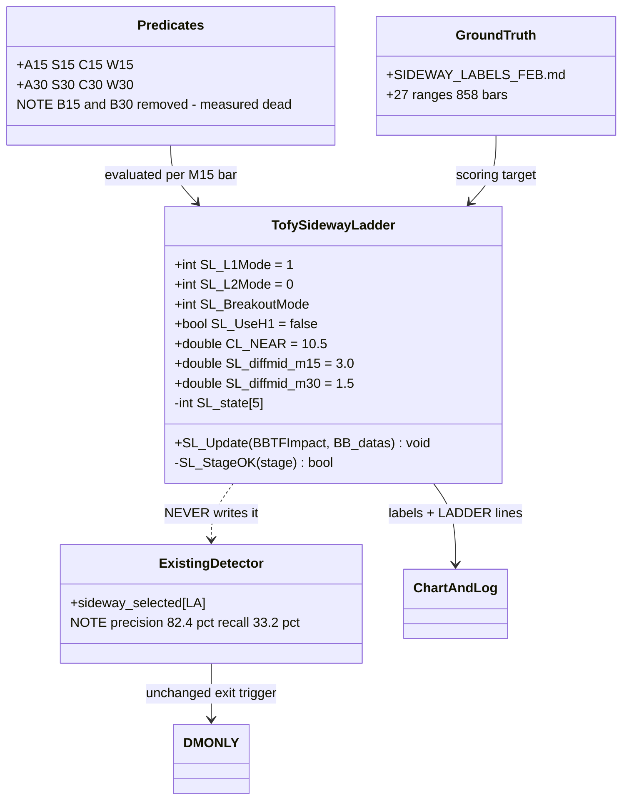
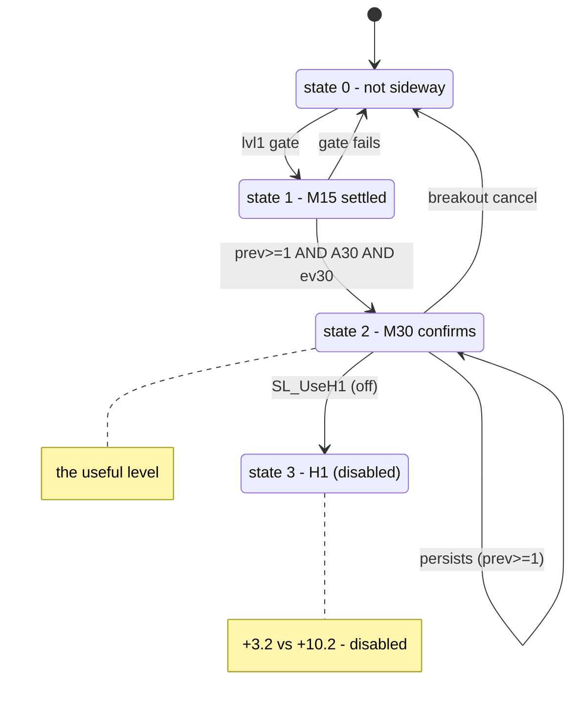

# TofySidewayLadder — design, measurements, and open questions

Companion doc for `scripts/TofySidewayLadder.mqh` and `scripts/ladder_ranges.py`.

**Status: diagnostic only.** The module computes a sideway "ladder" state and draws a
label per M15 bar. It does **not** trade and does **not** write `sideway_selected`, so
the existing detector and DMONLY are unaffected.

> **Major update:** scoring now runs against **hand-labelled February ranges**
> (`references/SIDEWAY_LABELS_FEB.md`, 27 ranges / 1,830 bars) rather than the earlier
> QUIET proxy. The two targets **disagree** on some settings, and the labels are the
> better target — see §9. Conclusions drawn from the proxy alone are marked as superseded.

---

## 1. What problem this is trying to solve

The existing `TofySideway` detector misses most rangebound periods. The original example
was **2026.02.03 12:40 → 02.04 02:05** (50 M15 bars):

| | value |
|---|---|
| start → end | 4916.88 → 4957.30 (**net 40.42**) |
| high / low | 4993.42 / 4881.51 (**range 111.91**) |
| path travelled | 1,163.18 |
| **efficiency ratio** | **0.035** |

Price walked 1,163 points to finish 40 from where it started — bottom decile of the
dataset. **This is chop, not quiet.** The current detector covered 6 of 50 bars (12%).

---

## 2. Why the existing detector misses it

`TofySideway` is a **quiet** detector, not a **chop** detector:

| class | definition | baseline | TofySideway flags | lift |
|---|---|---|---|---|
| QUIET | net < 10 and range < 15 | 37.8% | 53.8% | **+16.0** |
| CHOPPY | net < 10 and range ≥ 15 | 15.6% | 10.8% | **−4.8** |
| TREND | net ≥ 10 | 46.6% | 35.4% | −11.2 |

The mechanism is the midline-cluster gate. In a *quiet* market the M5/M15/M30 midlines
converge, so `cluster < 10` passes. In a *choppy* range price swings ±50 points, which
keeps the midlines apart — **the condition used as evidence of sideways is destroyed by
the kind of sideways being looked for.**

This tension recurs throughout everything below and is never fully resolved.

---

## 3. The ladder design

Sequential escalation. `＜` means "less than".
`clus0` = |M15−M5 mid|, `clus1` = |M15−M30 mid|, `clus2` = |M15−H1 mid|.
`LA` = current bar, `LA_1` = one back, `LA_2` = two back.

### Predicates (each scored alone in §4)

| name | condition |
|---|---|
| **A15** | `(clus0[LA] ＜ clus0[LA_1] ＜ clus0[LA_2])` OR `(clus0[LA] ＜ CL_NEAR AND clus0[LA_1] ＜ CL_NEAR)` |
| **S15** | `stage[1][LA]` is 512, 523, or 400-499 |
| **C15** | `\|dm1[LA]\| ＜ 3` AND `\|dm1[LA_1]\| ＜ 3` |
| **W15** | `dbbw1[LA] ＜ 1` AND `dbbw1[LA_1] ＜ 1` |
| **A30** | same shape as A15, on `clus1` |
| **S30** | `stage[2][LA]` is 512, 523, or 400-499 |
| **C30** | `\|dm2[LA]\| ＜ 1.5` AND `\|dm2[LA_1]\| ＜ 1.5` |
| **W30** | `dbbw2[LA] ＜ 1` AND `dbbw2[LA_1] ＜ 1` |
| ~~B15~~ | ~~`dm1[LA] ＜ dm1[LA_1] ＜ dm1[LA_2]`~~ **REMOVED** |
| ~~B30~~ | ~~same on dm2~~ **REMOVED** |

### Level gates (selectable)

```
SL_L1Mode   0  A15 && (S15 || C15)
            1  A15 && C15                <- default
            2  A15 && S15
            3  A15 && S15 && C15

SL_L2Mode   0  S30 || C30 || W30         <- default
            1  S30 || C30
            2  C30

state 1 = lvl1
state 2 = prev >= 1  AND  A30  AND  ev30
```

### Breakout cancel

```
SL_BreakoutMode  0  off
                 1  raw                    close outside the M15 band
                 2  raw && raw1            breakout persisted 2 bars
                 3  raw && !C15
                 4  raw && !C15 && !W15    IDENTICAL to 3 in practice
```

---

## 4. Each predicate scored alone

7,603 M15 bars, QUIET baseline 37.8%. "window" = the 50-bar Feb 3-4 range.

| predicate | fires on | lift | window | enrichment |
|---|---|---|---|---|
| A15 cluster | 76% | +4.5 | 35/50 | 0.93× |
| S15 stage | 47% | +3.3 | 26/50 | 1.12× |
| **B15 dm falling** | 25% | **+2.3** | 7/50 | **0.56×** ← removed |
| C15 \|dm\| ＜ 3 | 82% | +5.3 | 44/50 | 1.07× |
| W15 dbbw ＜ 1 | 52% | +4.8 | 30/50 | 1.15× |
| A30 cluster | 62% | +5.4 | 33/50 | 1.07× |
| S30 stage | 49% | +4.1 | 34/50 | **1.40×** |
| **B30 dm falling** | 25% | **+1.2** | 17/50 | 1.37× ← removed |
| **C30 \|dm\| ＜ 1.5** | 41% | **+10.9** | 11/50 | 0.54× |
| W30 dbbw ＜ 1 | 49% | +4.4 | 31/50 | 1.26× |

**Three structural facts:**

1. **`C30` alone scores +10.9** — more than the entire original ladder. Most of the
   module's value comes from one condition: *is the M30 midline barely moving?*
2. **`B15` and `B30` are dead.** +2.3 and +1.2, and B15 fires *less* inside the target
   range than chance. Removing both changed lift by +0.1.
3. **The M15 side is saturated.** A15 fires on 76%, C15 on 82%. Any additional OR-branch
   on level 1 cannot bite — confirmed three separate times (B15, a diffBBW branch, and
   W15, which changed **2 bars out of 7,603**).

---

## 5. Fixes that worked

### `prev >= 1` instead of `prev == 1`

Under `prev == 1`, a bar already at level 2 could never re-qualify, so the state
collapsed every bar.

| | state≥2 n | lift | window |
|---|---|---|---|
| `prev == 1` | 1,019 | +8.6 | 6/50 |
| **`prev >= 1`** | **2,648** | **+9.0** | **14/50** |

2.6× coverage *and* slightly better lift — unusual, because it fixed a structural flaw
rather than loosening a threshold.

### `CL_NEAR` 10.0 → 10.5

A bar at `clus1 = 10.1` was rejected by 0.1 and broke the ladder chain behind it.

| CL_NEAR | state≥2 n | lift | window |
|---|---|---|---|
| 10.0 | 3,667 | +8.4 | 16/50 |
| **10.5** | **3,756** | +8.4 | **27/50** |
| 15.0 | 3,268 | +8.4 | 29/50 |
| 40.0 | 4,223 | +4.8 | 29/50 |

+89 bars for +11 window bars. Coverage plateaus at 15 — past that the cluster gate is no
longer the binding constraint.

### Removing B15 / B30

Free: lift +11.2 → +11.5, identical window coverage.

---

## 6. Things measured and rejected

| change | result |
|---|---|
| **H1 level (state 3)** | +3.2 as ladder step 3, +3.4 standalone. Cuts sample 948 → 229. **`SL_UseH1 = false`** |
| **`diffMid` threshold branch** | adds up to 1,400 detections, costs lift in every variant, **window coverage does not move at all** |
| **`diffBBW` on M15** | changed 2 bars out of 7,603 — B15 is saturated |
| **`W15` added to level 1** | changed 4 bars — same reason |
| **ladder as a replacement for TofySideway** | would add 883 near-baseline bars while discarding 892 good ones |

### Why the diffMid branch could not help

`diffMid` sits in **block B**. The undetected bars in the target window failed **block A**
— the cluster gate (`clus0` at 13-23 against a threshold of 10). Since the rule is
`A && B`, loosening B changes nothing when A is already false. **The wrong condition was
being relaxed.**

### `diffMid` is signed

47% of values are negative. `dm ＜ 1.0` is true for *every falling midline*, including one
dropping at −18. It measures "midline is falling", not "midline is flat". Use `MathAbs`.

---

## 7. The February labels — ground truth

`references/SIDEWAY_LABELS_FEB.md`: **27 hand-labelled ranges, 1,830 M15 bars,
858 labelled sideway (46.9%).** A random detector firing at any rate scores 46.9%
precision.

This replaces the 50-bar window as the scoring target. The window was too small to
distinguish enrichment 1.21× from 1.37×.

### Protocol (must be followed or the numbers mean nothing)

1. Label a month by eye, **without** looking at detector output.
2. Tune against those labels.
3. Label a **second** month **before** running the tuned detector on it.
4. Run once. That is the number that counts.

**February is now the tuning set.** Any change made to improve February numbers makes
February in-sample. March, labelled blind, is the test.

### Edge tolerance

Hand labels are not bar-precise. Two treatments, ±6 bars:

- **(a) widened** — extend each range ±6 bars. Treats uncertain edges as definitely sideway.
- **(b) edges excluded** — drop the ±6 bars around each boundary from scoring. Treats them
  as "don't know". **This is the honest reading** and is preferred.

Note (b) excludes **641 of 1,830 bars (35%)** — the ranges are short enough that edges are
a large fraction of the data.

---

## 8. Scored against the February labels

`L1=1, L2=0` throughout unless stated.

| detector | fires | precision | recall | F1 (strict) | F1 (widened) | F1 (edges excl) |
|---|---|---|---|---|---|---|
| **TofySideway S_** | 346 | **82.4%** | **33.2%** | 47.3 | 40.5 | 49.0 |
| ladder brk=0 | 947 | 63.1% | 69.7% | 66.3 | **72.0** | 71.4 |
| ladder brk=1 | 734 | 70.4% | 60.3% | **64.9** | **62.6** | **67.0** |
| **ladder brk=2** | 857 | 67.7% | 67.6% | **67.6** | 69.8 | **72.1** |
| ladder brk=3 | 927 | 64.1% | 69.2% | 66.6 | 71.4 | 71.4 |
| **ladder brk=4** | 927 | 64.1% | 69.2% | 66.6 | 71.4 | 71.4 |

**Findings:**

**TofySideway is high-precision, low-recall: ~83% / ~34%.** When it fires you can trust
it; it catches only a third of the ranges. The ladder is balanced (~70% / ~68%). They are
**complementary, not competing** — consistent with the earlier +18.4 lift where both agree.

**Breakout modes 0, 2, 3, 4 are within ~1.5 F1 of each other.** Only mode 1 is clearly
worse on the labels. An earlier "mode 2 wins" call was overconfident on a margin that
small.

**Mode 4 is byte-identical to mode 3** — same fires (927/927/570), same precision, same
recall, same 7 cancels, in all three treatments. The `!W15` term never changes an outcome.
If you want mode 4's behaviour, mode 3 gives it with one fewer term.

---

## 9. The proxy and the labels DISAGREE

| setting | QUIET-proxy lift | label F1 (strict) |
|---|---|---|
| breakout cancel ON (mode 1) | **+11.5** (best) | 64.9 (worst) |
| breakout cancel OFF | +7.8 (worst) | 66.3 |

Exactly opposite. The reason: **the labels include bars where price briefly pokes outside
the M15 band.** The QUIET test scores those as TREND (net ≥ 10 over the next hour) and
penalises flagging them; the labels treat them as still inside the range.

**The labels are the better target** — they encode what the detector is actually wanted
for. `net < 10 && range < 15` was a guess at that.

Conclusions in §4-§6 that rest on the proxy alone should be re-checked against labels
before being acted on.

---

## 10. The fragmentation problem

`scripts/ladder_ranges.py` collapses `state >= 2` bars into ranges and compares them to
the labels.

| setting | ranges | bars | precision | recall | F1 |
|---|---|---|---|---|---|
| A `L1=1 L2=0 brk=0` | 48 | 947 | 63.1% | 69.7% | 66.3 |
| B `L1=1 L2=0 brk=2` | 57 | 857 | 67.7% | 67.6% | 67.6 |
| C `L1=1 L2=0 brk=4` | 48 | 927 | 64.1% | 69.2% | 66.6 |
| D `L1=0 L2=0 brk=2` | 59 | 869 | 67.3% | 68.2% | 67.7 |
| E `L1=3 L2=1 brk=2` | 45 | 626 | 67.6% | 49.3% | 57.0 |

**You labelled 27 ranges. The detector produces 45-59.** It cuts single ranges into pieces:

```
| 2 | 2026.02.03 14:45 | 2026.02.03 15:30 |  4 | 4/4 |
| 3 | 2026.02.03 16:45 | 2026.02.03 17:00 |  2 | 2/2 |
| 4 | 2026.02.03 17:45 | 2026.02.03 18:30 |  4 | 4/4 |
| 5 | 2026.02.03 20:45 | 2026.02.04 02:15 | 19 | 18/19 |
```

Four detections inside one 13:30→02:00 label, each with near-perfect overlap. **The
detector sees the range; it keeps dropping out and re-entering.** That is why recall sits
near 68% despite the pieces being accurate.

`--gap N` bridges dropouts, `--min-bars N` drops fragments. Worth testing `--gap 3`.

---

## 11. Metric definitions

For every M15 bar, look forward 12 M5 bars (60 min) from that bar's `close_M5`:

```
net   = |close[last] − close[first]|
range = max(closes) − min(closes)

TREND   if net >= 10
CHOPPY  if net < 10  AND  range >= 15
QUIET   if net < 10  AND  range <  15
```

| metric | formula |
|---|---|
| n | count of bars where `state >= 2` |
| %bars | `n / total_bars` |
| baseline | `QUIET_all / total_bars` = 2,877 / 7,603 = 37.8% |
| lift | `(QUIET_flagged / n) − baseline` |
| enrichment | `(window_hits / n) ÷ (window_bars / total_bars)` — **1.0× = chance** |
| precision | `flagged ∩ labelled / flagged` |
| recall | `flagged ∩ labelled / labelled` |
| F1 | `2·P·R / (P+R)` |

### Worked example — `L1=1, L2=0, brk=1`

```
T (scored bars)              = 7,603
QUIET bars overall           = 2,877
baseline    = 2877 / 7603    = 37.8%

n (state ≥ 2)                = 3,139
  of which QUIET             = 1,548
flagged QUIET% = 1548 / 3139 = 49.3%
LIFT        = 49.3 − 37.8    = +11.5

share of flags in window     = 25 / 3139   = 0.0080
share of all bars in window  = 50 / 7603   = 0.0066
ENRICHMENT                   = 0.0080 / 0.0066 = 1.21×
```

### What none of these measure

**Profitability.** Lift and F1 measure agreement with a definition or a label set. A
detector with perfect F1 could still lose money if the bars it flags are not the ones
where exiting beats holding. That question needs the ladder wired into a strategy and
compared against the DMONLY +$968 baseline — **still untested.**

---

## 12. Design (UML)



---

## 13. State machine



The `S2 --> S2` self-transition is what `prev >= 1` enabled. Under `prev == 1` that edge
did not exist.

---

## 14. Chart labels

| label | colour | meaning |
|---|---|---|
| `L2` | 🟢 lime | M30 confirmed |
| `L1` | 🟡 yellow | M15 only |
| `L0-brk` | ⚪ gray | cancelled by breakout |
| `L0-A15` | ⚪ gray | cluster gate failed |
| `L0-ev15` | ⚪ gray | level-1 evidence gate failed |
| `L1-prev` | 🟡 yellow | chain not running yet |
| `L1-A30` / `L1-ev30` | 🟡 yellow | level-2 gate failed |

`SL_ShowFails = false` hides the gray labels. Keep it **true** while diagnosing.

---

## 15. Where this stands

**Confirmed**

| change | effect |
|---|---|
| `prev >= 1` | 2.6× coverage, lift up. Keep. |
| `CL_NEAR = 10.5` | +89 bars, window 16/50 → 27/50. Keep. |
| remove B15 / B30 | free: +0.3 lift, same coverage. Keep. |
| `SL_UseH1 = false` | H1 measured +3.2 vs +10.2. Keep off. |

**Rejected**

diffMid threshold branch · diffBBW on M15 · W15 on level 1 · ladder as a replacement for
TofySideway · breakout mode 4 as distinct from mode 3

**Open**

| question | status |
|---|---|
| fragmentation — 27 labels vs 45-59 detected ranges | `--gap` untested |
| ladder as a **confirmation tier** on TofySideway | +18.4 where both agree — strongest number seen, untested in a strategy |
| **does better detection improve P&L?** | **untested** — the one that matters |
| does anything here survive March? | untested; labels not yet made |

**Honest summary.** The ladder is a balanced detector (~70% precision, ~68% recall against
your labels) where TofySideway is precise but narrow (~83% / ~34%). It covers the choppy
ranges the incumbent misses, at the cost of firing 2-3× as often.

Every gain came from **fixing something wrong** — `prev >= 1`, the 0.1 threshold
rejection, removing dead predicates. Every attempt to gain by **loosening a threshold**
cost precision without improving coverage of the target.

None of this has been shown to improve trading. That test — DMONLY with the ladder as its
exit, once, against +$968 — remains the outstanding item, and no amount of detector
tuning substitutes for it.

---

## 16. The M30 latch, the S30 chain waiver, and a reliability problem

Added after §15. Everything below was measured against
`references/SIDEWAY_LABELS_FEB.md` on February 2026.

> **Read §16.5 before acting on any number in this section.** Three
> implementations of the same latch produced +201.83, +57.06 and −2.70. The
> code variation is an order of magnitude larger than the effects being
> compared. These are directions, not figures.

### 16.1 The M30 latch — the one structural fix

A range is a **period**, not a per-bar property. The ladder was asking "is this
bar sideway?" independently every bar, so one labelled range came out as several
fragments — 27 labelled ranges were being detected as 57-60.

The latch changes the shape of the question:

```
if(latched)  { if(price outside M30 band) latched = false; }   // release
else         { if(ladder says sideway)    latched = true;  }   // engage
sideway = latched;
```

Detection **engages** a range; only a price breakout **releases** it.

| | ranges | recall | F1 | trades | P&L |
|---|---|---|---|---|---|
| plain | 54 | 70.3% | 66.4 | 67 | −250.66 |
| **+ latch** | 60 | **83.1%** | **73.9** | 68 | **+57.06** |

Recall and F1 both rose — nearly every other change in this study traded one for
the other. That is why the latch is treated as a structural fix rather than a
tuning result.

**A latch has memory.** A false engage costs the whole run until the next
breakout, not one bar. It amplifies good and bad detections alike.

### 16.2 Latch ordering — after the breakout cancel, not before

Tested both placements across 36 matched pairs.

| placement | ranges | F1 | trades | P&L |
|---|---|---|---|---|
| **after the M15 breakout cancel** | 50 | 71.4 | 66 | **−2.70** |
| before it | 61 | 71.5 | 75 | −41.76 |

**After won 36 of 36.** Latching first lets a bar engage and then be cancelled on
the same bar, so the state flickers — 61 ranges instead of 50. The committed code
applies the latch after the cancel, which is correct.

### 16.3 The S30 chain waiver

Level 2 normally requires `prev >= 1` — the M15 chain must already be running.
The waiver lets `S30` alone skip that. `A30` and `ev30` still apply.

This is **not** the same as letting S30 set state 2 outright:

| variant | pairs improved | best P&L |
|---|---|---|
| S30 overrides everything | **69 of 72** | +37.00 |
| S30 waives only the chain | 31 of 72 | **+201.83** |

The override helps almost everywhere but never much. The waiver helps in fewer
than half the cells and produces a far better peak — which is also the signature
of a result that will not survive out of sample.

### 16.4 Variants tested and rejected

| change | result |
|---|---|
| `chain_ok \|\| (A30 && ev30)` instead of `&&` | −8.23 best. Drops the M30 evidence requirement entirely; coverage jumps to 1,331 bars and precision falls. |
| C30 bypass (C30 alone sets state 2) | Collapses the ladder to one predicate — L1 and L2 stop mattering. Recall up, P&L down in ~20 of 36 pairs. |
| Dropping A30 | **Best F1 of anything tested: 73.2, recall 88.5%.** Won 70 of 108 pairs on P&L. But the single best P&L cell keeps A30 (−2.70 vs −11.54). Helps on average, not at the peak. |
| M30 band containment as a predicate | Reached **95.1% recall** — the highest of any single test. Precision only 51-59%: price sits inside the M30 band most of the time, including during trends. |

### 16.5 Why these numbers are not trustworthy

Three implementations of the same latch, written at different times, produced:

| implementation | best P&L |
|---|---|
| first (separate `latch()` function) | **+57.06** |
| second (inline, in the C30 bypass run) | below −153 |
| third (unified code path) | **−2.70** |

Same intent, ~$200 apart. The effects being compared in §16.3 and §16.4 are
$10-20 apart. **The implementation noise is an order of magnitude larger than the
signal**, so every cell in this section sits inside the error bars.

The +201.83 figure in particular should not be quoted. It appears in the v38.16
header of `scripts/TofySidewayLadder.mqh` and that header is unreliable.

### 16.6 What would settle it

Not another Python variant. The committed `TofySidewayLadder.mqh` is the
implementation that will actually trade — MT5 running it end to end is a
reference the re-derivations are not.

Two runs, February, `Ladder_UseTrade_Ena = true`, `Exit_Mode = 0`:

- **A**: `L1=1 L2=1 brk=0`, `S30_Waive = true`, `M30_Latch = true`
- **B**: identical, both new flags off

Compare `[LADDER_SUMMARY]` trade counts and P&L. Trade count is an integer and
does not move with spread, so it is the reliable comparison.

If A is not clearly better than B, none of §16.3 or §16.4 was real.

### 16.7 Status

| item | state |
|---|---|
| M30 latch | structural fix, clear mechanism, improved recall AND F1. Keep. |
| latch ordering (after the cancel) | settled, 36 of 36. |
| S30 chain waiver | plausible, peak figure unreliable. Needs A/B. |
| dropping A30 | best detection, unclear P&L. Undecided. |
| every specific P&L number in §16 | inside the implementation-noise band. |
| March labels | still not made. Until then February is in-sample for all of this. |

---

## 17. Latch timeframe, and the S30 waiver measured on its own

Continues §16. Same caveat applies throughout — see §16.5. The *directions* below
are mechanically clear; the specific figures sit inside the implementation-noise
band and should not be quoted as results.

### 17.1 Which band should release the latch?

The latch releases when price leaves a band. Tested M15, M30, both, and none
across 144 configurations.

| release band | best P&L | ranges | F1 |
|---|---|---|---|
| **M30** | **−2.70** | **50** | **71.4** |
| both (either band) | −46.78 | 72 | 65.7 |
| none (no latch) | −89.28 | 60 | 60.3 |
| **M15** | **−127.65** | 67 | 66.1 |

Head to head on `L1=1 L2=1 brk=0 +S30w`:

| release band | ranges | bars | F1 | trades | P&L |
|---|---|---|---|---|---|
| none | 58 | 837 | 59.1 | 79 | −245.76 |
| **M30** | **50** | 975 | **71.4** | **66** | **−2.70** |
| M15 | 67 | 882 | 66.1 | 85 | −127.65 |
| both | 72 | 806 | 65.7 | 92 | −46.78 |

**An M15 latch is worse than no latch at all.** The reason is visible in the range
count: 50 with M30, 67 with M15. M15 bands are tighter, so price leaves them more
often, so the latch releases more often — **more fragmentation, not less**, which
is the opposite of what a latch is for.

`both` is worse still at 72 ranges, since it releases whenever *either* band is
pierced.

**The mechanism worth remembering:** a latch earns its keep by holding a range
open *through the noise inside it*. A tight band gets pierced by exactly that
noise, so an M15 latch releases on the moves it should be ignoring. The M30 band
is wide enough to contain them.

This suggests H1 might hold better still — wider again, releasing only on
structural breaks. Untested.

### 17.2 The S30 waiver on its own — it needs the latch

| config | ranges | F1 | trades | P&L |
|---|---|---|---|---|
| plain, latch off | 53 | 59.3 | 78 | −119.71 |
| **+S30 waiver, latch off** | 58 | 59.1 | 79 | **−245.76** |
| +S30 waiver, latch on | 50 | 71.4 | 66 | −2.70 |

**The waiver alone makes things worse** — −245.76 against −119.71 without it. It
only pays off in combination with the latch.

That is consistent: the waiver makes the state easier to **engage**, and with
nothing holding it open, easier engagement just produces more fragments (58 ranges
vs 53) at lower precision. The latch is what converts extra engagements into
longer ranges instead of more of them.

### 17.3 An unexplained result

`L1=1 L2=1 brk=0`, no waiver, latch **on**, produced **0 ranges and 0 sideway
bars** — the latch never engaged at all, so the run degraded to no-sideway-exit
(114 trades, −636.37, exactly the floor).

Without the waiver, that configuration apparently never produces a state-2 bar
that also has price inside the M30 band. No explanation has been found. Recorded
here because an unexplained zero is more likely to be a bug than a finding.

### 17.4 Where the losses actually are

Exit breakdown for `L1=1 L2=1 brk=0 +S30w`, latch off:

| exit reason | trades | P&L |
|---|---|---|
| SIDEWAYS | 54 | **+16.60** |
| REVERSAL_DN | 11 | −99.77 |
| REVERSAL_UP | 14 | −162.59 |

**Sideway exits are roughly break-even. The 25 reversal exits lose −262.36.** That
is the entire deficit.

The same pattern appears under *perfect* detection (§ ceiling report): reversal
exits lost −238 across 31 trades while sideway exits made +653.

Two independent measurements, one with a real detector and one with the answer
key, both saying the reversal rule is the larger problem. **It is a deletion, not
a parameter**, so it is not exposed to the implementation-noise issue in §16.5 the
way the latch variants are.

**Untested:** DMONLY with the reversal exits removed entirely — sideway exits
only. Under perfect detection that would have been +653 instead of +415.

### 17.5 Ladder range rectangles

`SL_DrawLadderRanges` (default off, `clrDarkSlateGray`) draws each run of
consecutive `SL_state >= 2` bars as one rectangle, the ladder counterpart of
`SL_DrawUserLabelRanges`. Drawn when a run **ends**, so the high/low span is final.

Put beside the pink hand-label blocks, the two sets show over- and under-detection
as geometry rather than as a trade count. The summary also reports it directly:

```
[LADDER_SUMMARY] ladder_ranges_drawn:[57] vs hand labels:[27]
```

That ratio — 27 labelled ranges detected as 50-60 — remains the largest single
difference between the ladder and the labels, and the latch is the only change so
far that has moved it.

### 17.6 Status after §17

| item | state |
|---|---|
| M30 as the latch band | settled by a clear mechanism, not just a number |
| M15 latch | rejected — worse than no latch |
| S30 waiver alone | rejected — needs the latch |
| S30 waiver + M30 latch | plausible, figure unreliable, needs the MT5 A/B |
| the 0-range case in §17.3 | unexplained, treat as a suspected bug |
| **removing the reversal exit** | **the strongest untested lead in the study** |
| March labels | still not made — February remains in-sample for all of §16 and §17 |
