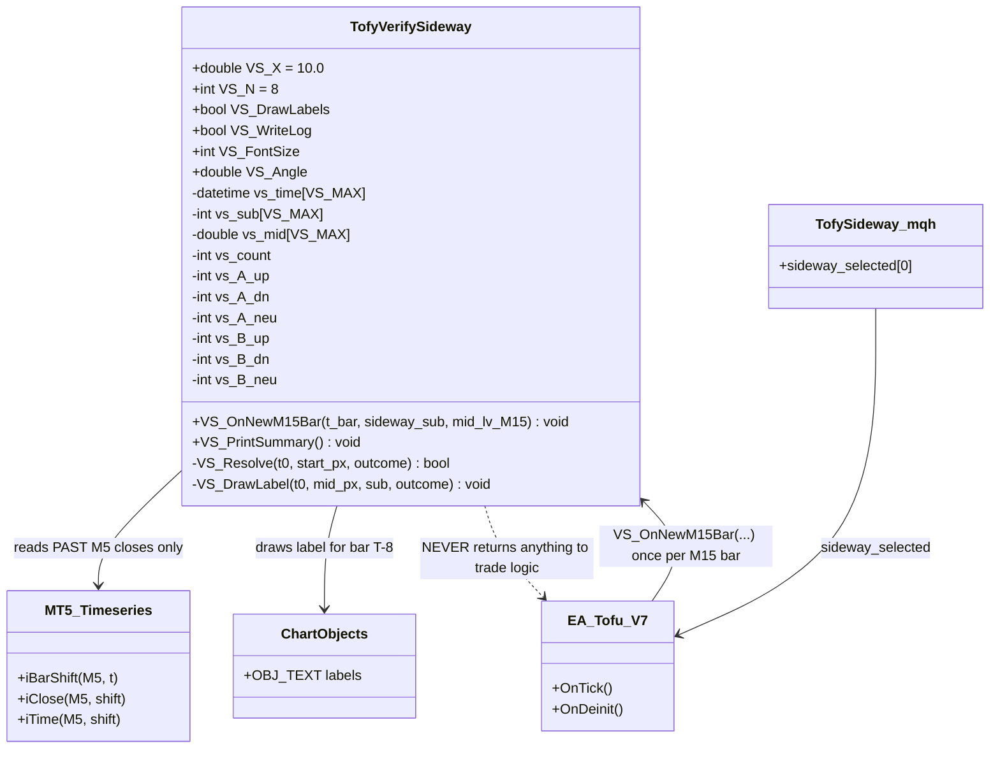
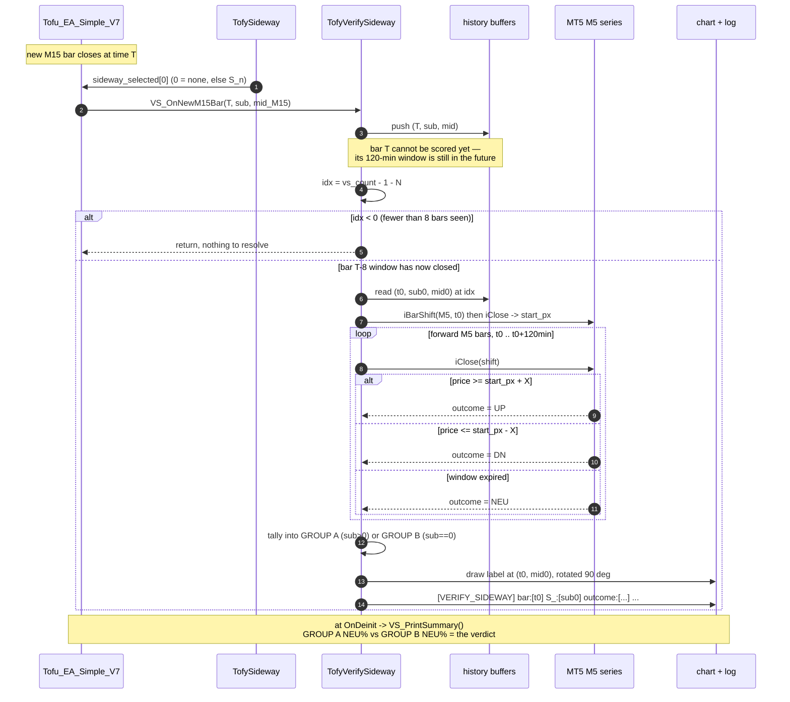
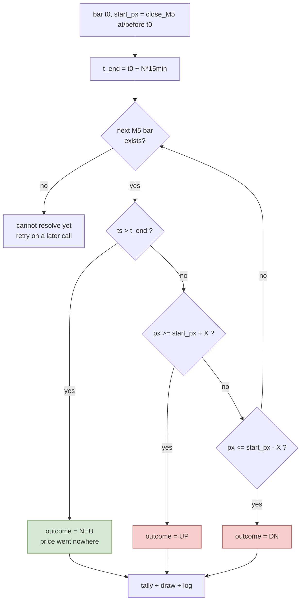

# TofyVerifySideway — how it works

Companion doc for `TofyVerifySideway.mqh`.

---

## 1. What this is — and what it is NOT

**It is NOT a sideway detector.** It does not decide anything, does not trade, and must
never be read by trade logic.

**It is a scorer for the detector you already have.** `TofySideway.mqh` produces
`sideway_selected` (the `S_n` value). This tool asks one question about it:

> When TofySideway said "sideway", did price actually go nowhere?

That is the whole purpose. It measures the *outcome* of each bar so you can see, on the
chart and in the log, whether the flag was right or wrong.

---

## 2. X and N — the definition of "went nowhere"

You cannot score "sideway" without first defining it in measurable terms. Two numbers do that:

| param | value | what it answers |
|---|---|---|
| **X** | `10.0` | How far must price move to count as *a move*? Without X, a $0.30 wiggle would count as "price went up", and every bar would look like it moved. |
| **N** | `8` M15 bars (120 min) | *By when*? Without a horizon there is no moment at which the bar is judged. |

Together they form a **first-touch barrier**. From the bar's start price, walk forward
through M5 closes for 120 minutes:

| what happens first | outcome |
|---|---|
| price reaches `start + 10.0` | **UP** |
| price reaches `start - 10.0` | **DN** |
| neither, for the whole 120 min | **NEU** |

**`NEU` is the operational definition of sideways.** Price stayed inside a $20 band for
two hours — it went nowhere. That is what the S_ flag claims will happen.

X and N are **pre-registered** — they are the same values used by
`scripts/label_base_rate.py`, so every measurement in this project is comparable. Do not
tune them. If a signal only looks good at one specific X/N, that is curve-fitting, not
an edge.

### Why label on M15 but measure price on M5

The flag lives on M15. Price comes from `close_M5` because that is the only field
carrying **real traded price** — `MidLV/UppLV/LowLV` are moving averages, and measuring
against a moving average would measure the average's lag, not the market. The *window*
is still M15-sized (8 M15 bars); M5 just gives a finer tape so an intrabar $10 touch is
not missed.

---

## 3. The lookahead constraint (why labels appear 8 bars late)

> **Bar T's outcome is not knowable until T + 120 minutes.**

This is not a limitation to work around — it is the nature of the measurement. The tool
therefore resolves and draws **bar T−8**, using only price that has already happened.

Consequences:

- Labels trail the current bar by 8 M15 bars. That is correct, not lag.
- The last 8 bars of any run will have no label.
- **Nothing here may ever feed trade logic.** It knows the future by construction; wiring
  it into a decision would be lookahead bias and would make every later backtest fake.

---

## 4. Chart labels

One label per resolved M15 bar, drawn **rotated 90°, anchored on the M15 BB midline**.

Text is `<flag>-<outcome>`:

| label | colour | meaning |
|---|---|---|
| `S13-NEU` | 🟢 lime | flag fired, price went flat — **CORRECT** |
| `S13-UP` / `S13-DN` | 🔴 red | flag fired, price ran — **FALSE SIDEWAY** |
| `.-NEU` | 🟠 orange | no flag, price went flat — **MISSED SIDEWAY** |
| `.-UP` / `.-DN` | ⚪ grey | no flag, price moved — correct |

`S13` = the S_ sub-type that fired. `.` = no flag.

**Reading the chart:** red = false positives, orange = misses. If the chart is mostly
lime and grey, the detector works. If reds cluster in choppy regions, you have found the
failure visually.

Display settings at the top of the `.mqh`: `VS_FontSize` (11), `VS_Angle` (90.0),
`VS_DrawLabels`.

---

## 5. Log format

### Per-bar line

```
[VERIFY_SIDEWAY] bar:[2026.01.05 22:00] S_:[22] outcome:[NEU] start_px:[4443.06] mid_M15:[4443.44] X:[10.0] N:[8]
```

| field | meaning |
|---|---|
| `bar` | the M15 bar being scored (**not** the current bar — it is 8 bars back) |
| `S_` | sub-type that fired. **`0` = no flag.** Non-zero = flagged |
| `outcome` | `UP` / `DN` / `NEU` from the barrier |
| `start_px` | `close_M5` at/before the bar — the barrier origin |
| `mid_M15` | M15 BB midline, where the label is drawn |
| `X`, `N` | barrier parameters, echoed for provenance |

**`S_:[0]` is how you tell `.-NEU` from `S22-NEU`.** Zero means no flag.

### Summary lines (from `VS_PrintSummary()` in `OnDeinit`)

```
[VERIFY_SIDEWAY_SUMMARY] X:[10.0] N:[8]
[VERIFY_SIDEWAY_SUMMARY] GROUP_A_flag   n:[...] UP:[...] DN:[...] NEU:[...] NEU_pct:[...]
[VERIFY_SIDEWAY_SUMMARY] GROUP_B_noflag n:[...] UP:[...] DN:[...] NEU:[...] NEU_pct:[...]
[VERIFY_SIDEWAY_SUMMARY] VERDICT A_minus_B:[...]
```

### Counting straight from the log

```bash
# NEUTRAL% per sub-type — the most useful single view
grep "\[VERIFY_SIDEWAY\]" log | grep -oE "S_:\[[0-9]+\] outcome:\[[A-Z]+\]" | sort | uniq -c | sort -rn

# GROUP A (flagged) vs GROUP B (unflagged), NEU counts
grep "\[VERIFY_SIDEWAY\]" log | grep -v "S_:\[0\]" | grep -c "outcome:\[NEU\]"
grep "\[VERIFY_SIDEWAY\]" log | grep    "S_:\[0\]" | grep -c "outcome:\[NEU\]"
```

---

## 6. How to read the result — the actual test

Split every bar into two groups and compare **NEUTRAL rate**:

- **GROUP A** — S_ flag present
- **GROUP B** — no flag

| result | conclusion |
|---|---|
| `A_NEU% >> B_NEU%` | the flag genuinely predicts flat price — **detector works** |
| `A_NEU% ≈ B_NEU%` | the flag carries **no information** about sideways price |

**The comparison is relative, not absolute.** NEUTRAL is rare in gold — from the
base-rate test, ~13% of bars were NEUTRAL overall. So do not expect Group A at 60%. If
Group A is 25% and Group B is 10%, the detector is working well. If both sit near 12%,
it is not.

The per-sub-type breakdown matters too: some sub-types may work while others do not.
Treat any sub-type with n < 50 as low confidence.

---

## 7. Design (UML)



**Note the last relationship.** Data flows *into* this module and out to the chart and
log. Nothing flows back into the strategy. That one-way arrow is what keeps it free of
lookahead bias.

---

## 8. Sequence — one M15 bar



---

## 9. Barrier resolution logic



**First touch wins.** If price would cross both barriers inside the window, only the
first one counts — that is what makes the measurement a fair 1:1 test rather than a
"did it ever touch" test.

---

## 10. Wiring it in

```mql5
#include <TofyVerifySideway.mqh>

// once per new M15 bar:
VS_OnNewM15Bar(iTime(_Symbol, PERIOD_M15, 0),
               (int)BBTFImpact.sideway_selected[0],
               BB_datas[1].BB_MidLV[LA]);   // <-- your actual M15 midline field

// in OnDeinit:
VS_PrintSummary();
```

`BB_datas[1]` is M15 (index 1). The midline field name is inferred from the log's
`MidLV_M15`; if it does not compile, substitute the real struct field.

---

## 11. Cross-check

`scripts/verify_sideway_flag.py` performs the identical measurement offline on the
backtest log, with the same X and N.

**The two must agree.** If `VS_PrintSummary()` and the Python report give materially
different NEUTRAL percentages, one implementation is wrong — and finding that out is
worth more than either number on its own.
