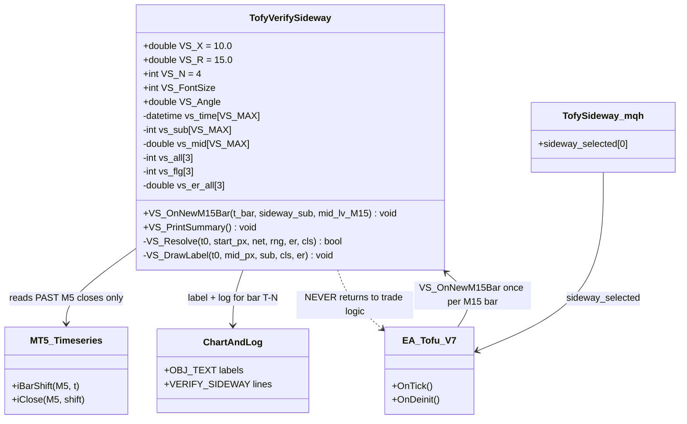
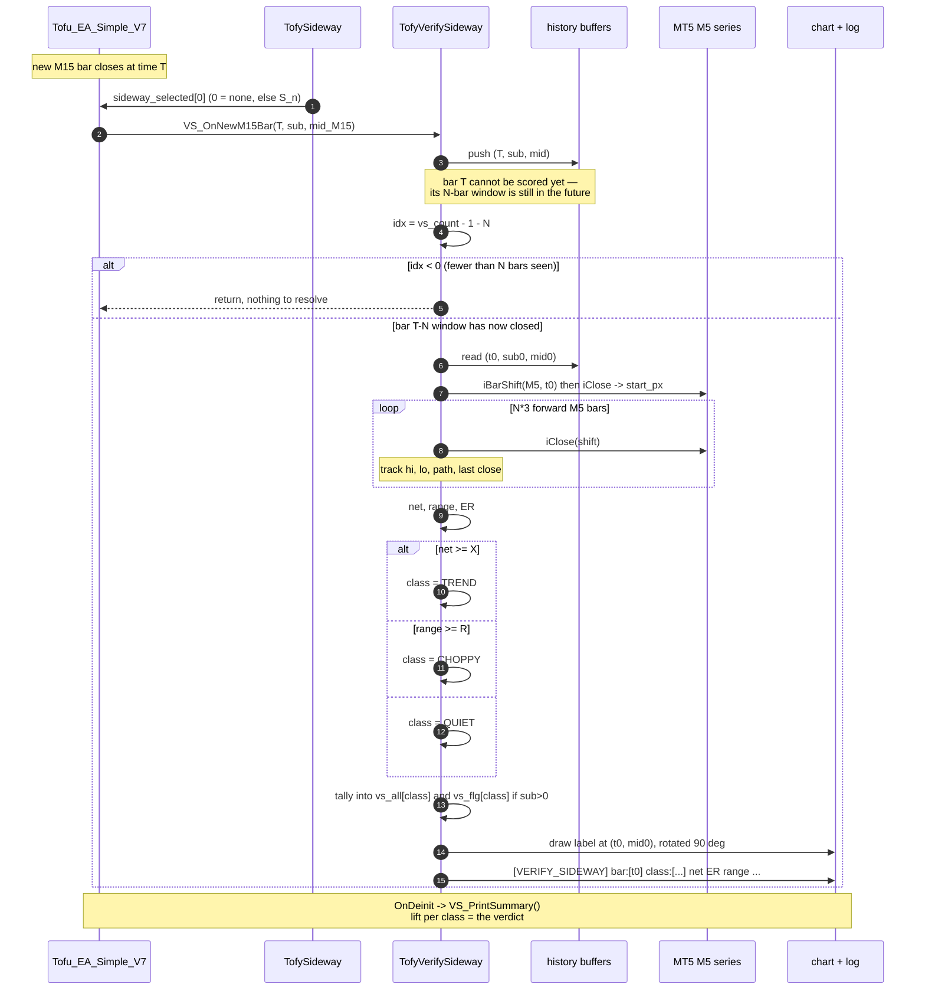
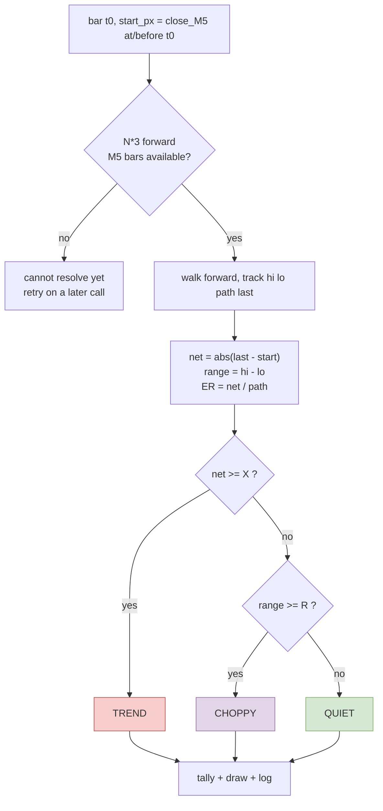

# TofyVerifySideway — how it works

Companion doc for `TofyVerifySideway.mqh` **v2**.

> **v1 is superseded.** The original version used a *first-touch barrier* (does price
> reach `start+$10` or `start-$10` first?). That measures **direction**, not range, and
> it misclassified visually-sideways bars. It has been replaced by a three-way
> classification. See §3.

---

## 1. What this is — and what it is NOT

**It is NOT a sideway detector.** It decides nothing, trades nothing, and must never be
read by trade logic.

**It scores the detector you already have.** `TofySideway.mqh` produces `sideway_selected`
(the `S_n` value). This tool asks one question about it:

> When TofySideway said "sideway", what did price actually do?

---

## 2. The three-way classification

Over the next **N M15 bars** from each bar's `close_M5`:

```
net    = |end_close - start_close|          how far it ended from where it began
range  = max(close) - min(close)            how far it swung
path   = sum |bar-to-bar close change|      total distance travelled
ER     = net / path                         0 = thrashed, 1 = straight line
```

| class | condition | meaning |
|---|---|---|
| **TREND** | `net >= X` | price went somewhere |
| **CHOPPY** | `net < X` **and** `range >= R` | thrashed and came back — **this is what churns you** |
| **QUIET** | `net < X` **and** `range < R` | barely moved — harmless |

Defaults: `X = 10.0`, `R = 15.0`, `N = 4` (60 min).

**Why net displacement instead of first-touch** — verified counter-examples:

| bar | net | range | first-touch said | truth |
|---|---|---|---|---|
| 2026.02.10 07:25 | **+2.75** | 20.75 | UP | sideways |
| 2026.02.10 13:25 | **-7.51** | 30.04 | DN | sideways |
| 2026.02.11 08:25 | -2.24 | 12.16 | NEU | sideways |

First-touch got two of three wrong: price tagged the $10 barrier on its first swing and
came straight back. It is retained only for **directional** tests like
`label_base_rate.py`.

**Why N = 4 (60 min):** the losing trades in DMONLY were held 1-5 bars = 15-75 minutes.
The window is matched to the horizon where the money is lost, not chosen for the best score.

### Why QUIET and CHOPPY must be separated

Both end near the start, so net displacement alone lumps them together. They are not the
same risk:

| | price moves | your exposure |
|---|---|---|
| **QUIET** | little | few signals, small losses, boring |
| **CHOPPY** | a lot | many signals, all reversed — **death by churn** |

`range` is what splits them. `ER` confirms the split.

---

## 3. Lookahead constraint

> **Bar T's class is not knowable until T + N*15 minutes.**

The tool resolves and draws **bar T-N**, using only price that has already happened.

- Labels trail the current bar by N bars. That is correct, not lag.
- The last N bars of a run carry no label.
- **Nothing here may feed trade logic.** It knows the future by construction.

---

## 4. MEASURED RESULTS

All measurements on `references/Backtest_data/V36.15/20260712_clean.log`, 7,593-7,605
usable M15 bars.

### 4.1 Three-way classification — what TofySideway actually catches (N=4, 60 min)

| class | all bars | % | TofySideway flags | % of flags | **lift** | mean ER |
|---|---|---|---|---|---|---|
| **QUIET** | 2,877 | 37.8% | 906 | **53.8%** | **+16.0** | 0.185 |
| **CHOPPY** | 1,187 | 15.6% | 182 | **10.8%** | **-4.8** | **0.114** |
| **TREND** | 3,541 | 46.6% | 595 | 35.4% | -11.2 | 0.429 |

*(7,605 bars total; 1,683 flagged)*

**The core finding: TofySideway is a QUIET detector.** It finds quiet periods strongly
(+16.0), correctly avoids trends (-11.2), and **under-flags choppy bars (-4.8)** — a
choppy bar is *less* likely to be flagged than a randomly chosen bar.

Chop is 15.6% of bars (~1,187) and is the condition that whipsaws the strategy in and
out. The exit rule meant to protect you fires least often exactly there.

### 4.2 ER separates the three classes cleanly

| class | mean ER |
|---|---|
| CHOPPY | **0.114** |
| QUIET | 0.185 |
| TREND | 0.429 |

ER is the single cleanest number for chop.

### 4.3 ER decile table — ER vs sideways rate

| ER decile | ER range | n | sideways% | mean range |
|---|---|---|---|---|
| 1 | 0.000-0.033 | 760 | **99.3%** | 25.1 |
| 2 | 0.033-0.064 | 760 | 94.9% | 26.4 |
| 3 | 0.064-0.098 | 760 | 82.0% | 27.1 |
| 4 | 0.098-0.132 | 760 | 57.6% | 30.7 |
| 5 | 0.132-0.171 | 760 | 40.0% | 30.7 |
| 6 | 0.171-0.214 | 760 | 24.1% | 33.8 |
| 7 | 0.214-0.264 | 760 | 12.1% | 35.0 |
| 8 | 0.264-0.325 | 760 | 3.7% | 39.8 |
| 9 | 0.326-0.416 | 760 | 0.3% | 50.4 |
| 10 | 0.416-0.929 | 761 | **0.0%** | 62.2 |

Working bands: **ER < 0.10 → sideways ~92%** · **0.10-0.17 → ambiguous** · **> 0.26 → trending ~99%**.

Caveat: ER and net displacement share a numerator, so part of this monotonicity is
definitional. The independent evidence is the **range** column — 25.1 at decile 1 vs
62.2 at decile 10.

### 4.4 sideways% — parameter sweep (robustness)

Gap = TofySideway sideways% minus baseline sideways%.

| gap | N=2 (30m) | N=4 (60m) | N=8 (120m) | N=12 (180m) | N=16 (240m) |
|---|---|---|---|---|---|
| **X=$3** | +7.4 | +5.4 | +3.3 | +2.5 | +2.0 |
| **X=$5** | +11.3 | +8.8 | +6.0 | +3.5 | +2.9 |
| **X=$10** | **+12.2** | +11.2 | +7.2 | +6.5 | +5.5 |
| **X=$15** | +8.7 | +10.1 | +9.1 | +7.0 | +5.9 |
| **X=$20** | +6.6 | +8.2 | +8.3 | +7.7 | +5.6 |

**25 of 25 cells positive.** No parameter choice flips the conclusion — TofySideway's
edge is robust, not a lucky cell. The edge is **strongest at short horizons** (+12.2 at
30 min, decaying to +5.5 at 240 min), i.e. it detects a condition lasting ~30-60 minutes.

Do **not** read X=$10/N=2 as "the best setting" — picking the max of 25 cells is
selection bias. The finding is that the effect is present everywhere.

### 4.5 ER by window — ER does NOT separate the groups

| N (min) | baseline ER | TofySideway ER | gap | relative |
|---|---|---|---|---|
| 2 (30) | 0.409 | 0.405 | -0.004 | -0.9% |
| 4 (60) | 0.288 | 0.285 | -0.003 | -1.0% |
| 8 (120) | 0.202 | 0.205 | +0.003 | +1.5% |
| 12 (180) | 0.167 | 0.172 | +0.005 | +3.1% |
| 16 (240) | 0.148 | 0.152 | +0.004 | +3.0% |

**sideways% separates the groups by 17-21%. ER separates them by 1-3%.**

This is not a failure of ER — §4.2 shows ER discriminates strongly across *price
behaviour*. It means **TofySideway does not separate on chop**, only on quiet.

### 4.6 Nothing currently logged predicts chop

Every M15 field scored against forward ER (baseline 0.202), spread across value buckets:

| field | spread | verdict |
|---|---|---|
| diffBBW | 0.007 | no signal |
| diffMid | 0.013 | no signal |
| BBW (WLV) | 0.014 | no signal |
| **midline_Cluster** | **0.015** | **no signal** |
| bandwidth | 0.021 | no signal |
| W_stage | per-value 0.194-0.219 | no signal |
| diffMid_Trend | per-value 0.197-0.205 | no signal |
| BBUpDn | per-value 0.197-0.208 | no signal |

**No field carries chop-predictive information.** Note `midline_Cluster` in particular —
tuning its thresholds would optimise a field that does not discriminate.

---

## 5. Chart labels

One label per resolved M15 bar, rotated 90°, anchored on the M15 BB midline.
Text is `<flag>-<class> <ER>`, e.g. `S13-QUIET 0.18` or `.-CHOP 0.09`.

| label | colour | meaning |
|---|---|---|
| `S13-QUIET` | 🟢 lime | flagged, quiet — **correct** |
| `S13-CHOP` | 🟡 yellow | flagged, choppy — also fine |
| `S13-TREND` | 🔴 red | flagged, but price trended — **false positive** |
| `.-CHOP` | 🟣 **magenta** | **missed chop — churned with no warning** |
| `.-QUIET` | 🟠 orange | missed quiet — mild |
| `.-TREND` | ⚪ grey | correctly not flagged |

**Hunt for magenta.** Given the -4.8 CHOPPY lift, expect it to be common, and to cluster
in the whipsaw regions where short trades pile up.

Settings: `VS_FontSize` (11), `VS_Angle` (90.0), `VS_DrawLabels`.

---

## 6. Log format

### Per-bar line

```
[VERIFY_SIDEWAY] bar:[2026.01.05 22:00] S_:[22] class:[CHOPPY] net:[4.20] range:[22.10] ER:[0.087] start_px:[4443.06] mid_M15:[4443.44] X:[10.0] R:[15.0] N:[4]
```

| field | meaning |
|---|---|
| `bar` | the M15 bar being scored (**N bars behind** the current bar) |
| `S_` | sub-type that fired. **`0` = no flag** |
| `class` | QUIET / CHOPPY / TREND |
| `net` | `\|end - start\|` — the verdict input |
| `range` | `max - min` — what splits QUIET from CHOPPY |
| `ER` | efficiency ratio |
| `X`,`R`,`N` | parameters, echoed for provenance |

`S_:[0]` distinguishes `.-CHOP` from `S22-CHOP`.

### Summary (`VS_PrintSummary()` in `OnDeinit`)

```
[VERIFY_SIDEWAY_SUMMARY] X:[10.0] R:[15.0] N:[4] bars:[...] flagged:[...]
[VERIFY_SIDEWAY_SUMMARY] QUIET  baseline:[..%] flagged:[..%] lift:[..] mean_ER:[..]
[VERIFY_SIDEWAY_SUMMARY] CHOPPY baseline:[..%] flagged:[..%] lift:[..] mean_ER:[..]
[VERIFY_SIDEWAY_SUMMARY] TREND  baseline:[..%] flagged:[..%] lift:[..] mean_ER:[..]
```

### Counting from the log

```bash
# class distribution
grep "\[VERIFY_SIDEWAY\]" log | grep -oE "class:\[[A-Z]+\]" | sort | uniq -c

# missed chop — the costly bars
grep "\[VERIFY_SIDEWAY\]" log | grep "S_:\[0\]" | grep -c "class:\[CHOPPY\]"

# flagged chop
grep "\[VERIFY_SIDEWAY\]" log | grep -v "S_:\[0\]" | grep -c "class:\[CHOPPY\]"

# per sub-type outcome
grep "\[VERIFY_SIDEWAY\]" log | grep -oE "S_:\[[0-9]+\] class:\[[A-Z]+\]" | sort | uniq -c | sort -rn
```

---

## 7. Design (UML)



The last relationship is the safety property: data flows in, and out to chart and log.
Nothing flows back into the strategy.

---

## 8. Sequence — one M15 bar



---

## 9. Classification logic



---

## 10. Wiring it in

```mql5
#include <TofyVerifySideway.mqh>

// once per new M15 bar:
VS_OnNewM15Bar(iTime(_Symbol, PERIOD_M15, 0),
               (int)BBTFImpact.sideway_selected[0],
               BB_datas[1].BB_MidLV[LA]);   // <-- your actual M15 midline field

// in OnDeinit:
VS_PrintSummary();
```

`BB_datas[1]` is M15 (index 1). The midline field name is inferred from the log's
`MidLV_M15`; substitute the real struct field if it does not compile.

---

## 11. Cross-check

The live run should reproduce the offline measurement in §4.1:

| class | expected lift |
|---|---|
| QUIET | ~+16.0 |
| CHOPPY | ~-4.8 |
| TREND | ~-11.2 |

If `VS_PrintSummary()` matches, the MQL5 and Python implementations agree and both are
trustworthy. If they diverge materially, one is wrong — and finding that out is worth
more than either number alone.

---

## 12. Open problem

**Chop is 15.6% of bars, it is what churns the strategy, and nothing detects it.**

- TofySideway under-flags it (-4.8 lift)
- No logged field predicts it (§4.6, all spreads under 0.021)

Two directions:

1. **Find a chop-predictive input** — something not derived from Bollinger geometry:
   realised volatility over a lookback, tick density, session/time-of-day.
2. **Handle it structurally instead of predicting it** — a minimum-hold rule or a
   post-exit cooldown suppresses short churn trades without needing to see chop coming.
   This works even though nothing predicts chop, which is why it may be the better route.
