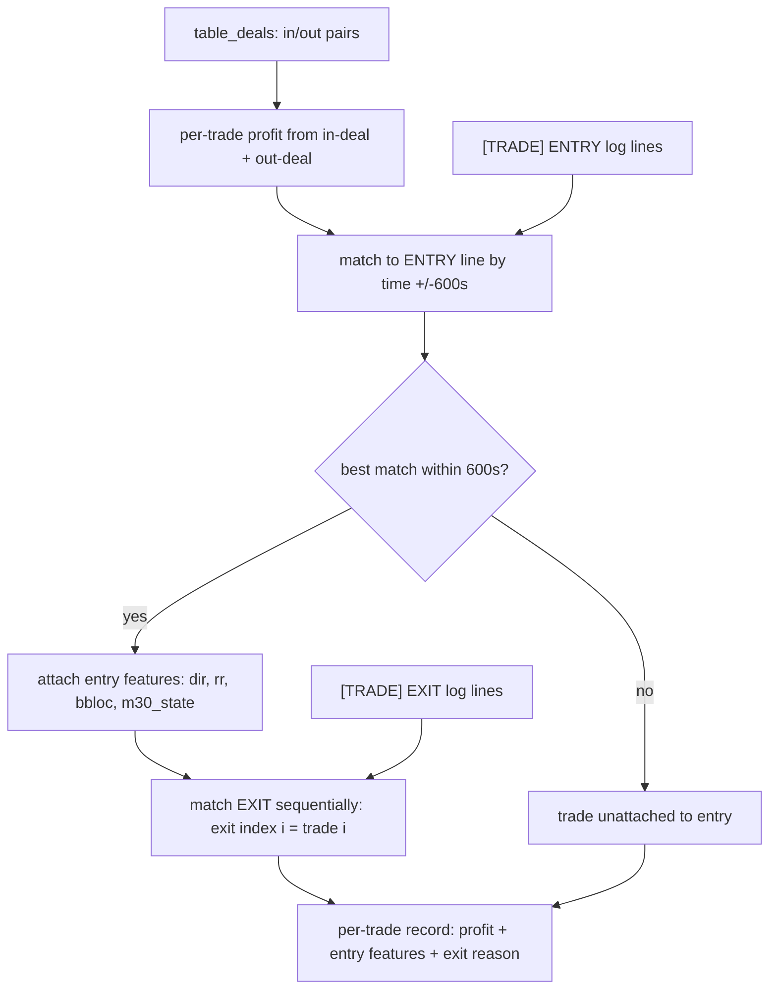
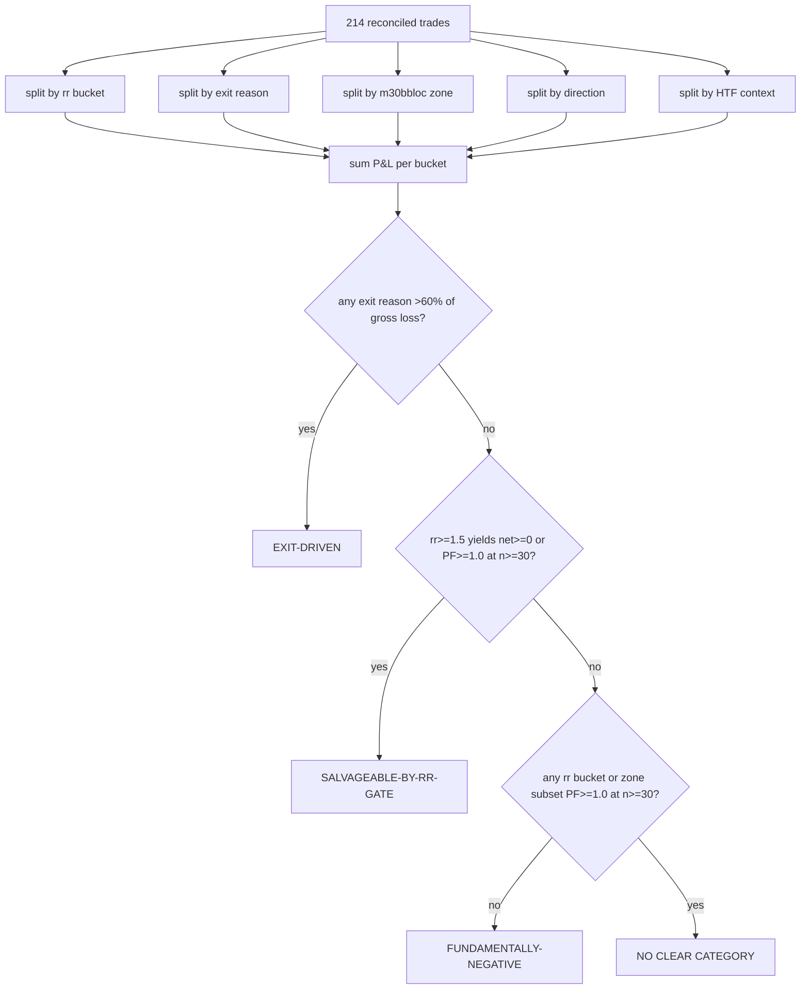

# V36.13 Dissection — Where the -$899 concentrates

## Reconciliation

- 214 in-deals matched to 214 out-deals. All 214 trades joined.
- 214/214 trades matched to [TRADE] ENTRY log lines. 214/214 matched to [TRADE] EXIT lines.
- Per-trade profit sum: **-896.62**
- Report Total Net Profit: **-899.06**
- Delta: **2.44** (explained by swap/summary deal)

## Splits

### A. By rr Bucket at Entry

| Group | n | Total $ | Mean $ | Win-Rate | PF |
|-------|---|---------|--------|----------|-----|
| rr<1.0 | 134 | -593.15 | -4.43 | 37.3% | 0.58 |
| 1.0-1.5 | 37 | -240.04 | -6.49 | 32.4% | 0.57 |
| 1.5-2.0 | 17 | +78.56 | +4.62 | 47.1% | 1.74 |
| >=2.0 | 26 | -141.99 | -5.46 | 26.9% | 0.36 |

**Cumulative net keeping only rr>=1.0:** n=80, net=-303.47, PF=0.66
**Cumulative net keeping only rr>=1.5:** n=43, net=-63.43, PF=0.81

### B. By Exit Reason

| Group | n | Total $ | Mean $ | Win-Rate | PF |
|-------|---|---------|--------|----------|-----|
| TP_HIT | 45 | +1138.70 | +25.30 | 100.0% | inf |
| M15_REVERT | 152 | -1801.49 | -11.85 | 16.4% | 0.10 |
| TIMEOUT | 8 | +48.55 | +6.07 | 87.5% | 35.43 |
| SL_HIT | 9 | -282.38 | -31.38 | 0.0% | 0.00 |

**M15_REVERT:** n=152, net **-1801.49**, PF=0.10

### C. By Entry m30bbloc Zone

| Group | n | Total $ | Mean $ | Win-Rate | PF |
|-------|---|---------|--------|----------|-----|
| NEAR/MID | 214 | -896.62 | -4.19 | 36.0% | 0.61 |

### D. By Direction

| Group | n | Total $ | Mean $ | Win-Rate | PF |
|-------|---|---------|--------|----------|-----|
| DOWN | 101 | -419.63 | -4.15 | 35.6% | 0.61 |
| UP | 113 | -476.99 | -4.22 | 36.3% | 0.61 |

### E. By HTF Context (H4 vs Trigger Dir)

| Group | n | Total $ | Mean $ | Win-Rate | PF |
|-------|---|---------|--------|----------|-----|
| AGREE | 70 | -297.51 | -4.25 | 31.4% | 0.59 |
| DISAGREE | 63 | -165.16 | -2.62 | 41.3% | 0.73 |
| NEUTRAL | 81 | -433.95 | -5.36 | 35.8% | 0.55 |

## Verdict

**EXIT-DRIVEN**

M15_REVERT accounts for 87.6% of gross loss (2009.91 / 2293.70)

### Subsets with PF >= 1.0 but n < 30 (not promoted)

- 1.5-2.0: n=17, PF=1.74, total=+78.56 -- too small to trade

## Limitations

- **Post-hoc subsets are hypotheses, not validation:** Any promising subset identified here needs a FORWARD test on a fresh data window before trusting it. This analysis is descriptive, not prescriptive.
- **In-sample kept-set:** The rr>=1.5 kept-set is in-sample -- it was selected on the same data it was evaluated on. Overfitting is possible.
- **Counterfactual unknowable:** Removing a bucket (e.g., M15_REVERT) is counterfactual -- we cannot know whether those lost trades would have been wins had they exited differently.
- **No new design recommendations:** The three fixed verdict categories (salvageable-by-rr-gate / exit-driven / fundamentally-negative) are the only conclusions drawn. No gate, exit, or parameter tuning is proposed.

---

*Analysis generated by `scripts/dissect_v36_13.py`. Deterministic -- re-running produces identical numbers.*

## M15_REVERT by reverted-to-state

The 152 M15_REVERT exits classified by the M15 state at the exit bar.
For an UP trade (trigger F): reverted-to-R = TRUE REVERSAL; to-S/C = PAUSE-CUT; to-F = STATE_UNCHANGED.
For a DOWN trade (trigger R): reverted-to-F = TRUE REVERSAL; to-S/C = PAUSE-CUT; to-R = STATE_UNCHANGED.
STATE_UNCHANGED: exit fired but m15_state at exit bar equals entry state — edge case, not reversal nor pause.

### Class Table

| Class | n | Total $ | Mean $ | Win-Rate | PF |
|-------|---|---------|--------|----------|-----|
| TRUE_REVERSAL | 53 | -1045.00 | -19.72 | 7.5% | 0.01 |
| PAUSE_CUT_S | 85 | -640.22 | -7.53 | 21.2% | 0.20 |
| PAUSE_CUT_C | 7 | -64.16 | -9.17 | 0.0% | 0.00 |
| STATE_UNCHANGED | 7 | -52.11 | -7.44 | 42.9% | 0.43 |

**Total:** 152 M15_REVERT exits classified.

### Loss Concentration

- TRUE_REVERSAL gross loss: **$1052.55** (52.4% of M15_REVERT gross loss)
- PAUSE_CUT_S gross loss: **$801.54**
- PAUSE_CUT_C gross loss: **$64.16**
- PAUSE_CUT (S+C) combined gross loss: **$865.70** (43.1% of M15_REVERT gross loss)
- STATE_UNCHANGED gross loss: **$91.66** (4.6% of M15_REVERT gross loss, 7 trades)

**TRUE_REVERSAL** owns the most loss: $1052.55 (52.4%).

### Verdict

**MIXED**

TRUE_REVERSAL: 52.4% of loss (53 trades), PAUSE_CUT: 43.1% of loss (92 trades), STATE_UNCHANGED: 7 trades

### Caveat — Counterfactual Unknowable, Realized-Only

- **Counterfactual unknowable:** Whether PAUSE-CUT trades would have recovered had the exit been held is unknowable from this data. The exit fired at the M15 state change; without the exit rule, price may have continued against the trade or recovered. We cannot simulate counterfactual outcomes here.
- **Realized-only:** All figures below are realized profits/losses per the actual exit. The concentration of realized loss by class is informative — if PAUSE-CUT trades carry the bulk of the loss, loosening the exit (exit only on TRUE_REVERSAL) targets those trades. However, whether they would recover requires a backtest with the modified exit rule.

## Winner-vs-loser entry separation (with BB_diffmid_trend ablation)

45 TP_HIT winners vs 152 M15_REVERT losers (197 trades). TIMEOUT (8) and SL_HIT (9) excluded — not clean win/loss contrast.
A feature separates if any category/threshold yields WR >= 50% at n >= 20.
Two feature sets: BASE (dir, m30bbloc, h1bbloc, h4bbloc, rr, h4_state, h1_state, m30_state, entry_hour) and BASE + diffMid_trend (diffMid_Trend_M30/H1/H4 as sign and magnitude).

### diffMid_Trend Parse Status

| TF | Parsed | Missing |
|----|--------|---------|
| M30 | 197 | 0 |
| H1 | 197 | 0 |
| H4 | 197 | 0 |

### Categorical Feature Separation

| Feature | Type | Spread (%) | Best Category | WR (%) | n | Separator (>=50%/n>=20)? |
|---------|------|------------|---------------|--------|---|-------------------------|
| dir | cat | 2.9 | DOWN | 24.4 | 90 | DOWN (WR=24.4%, n=90) — below threshold |
| m30_state | cat | 22.3 | C | 35.3 | 51 | C (WR=35.3%, n=51) — below threshold |
| h1_state | cat | 21.8 | S | 32.7 | 49 | S (WR=32.7%, n=49) — below threshold |
| h4_state | cat | 14.7 | S | 28.8 | 59 | S (WR=28.8%, n=59) — below threshold |
| dm_trend_m30_sign | cat | 0.0 | POS | 22.8 | 197 | POS (WR=22.8%, n=197) — below threshold |
| dm_trend_h1_sign | cat | 0.0 | POS | 22.8 | 197 | POS (WR=22.8%, n=197) — below threshold |
| dm_trend_h4_sign | cat | 0.0 | POS | 22.8 | 197 | POS (WR=22.8%, n=197) — below threshold |
| dm_trend_m30_mag | cat | 6.5 | MED | 25.7 | 101 | MED (WR=25.7%, n=101) — below threshold |
| dm_trend_h1_mag | cat | 6.8 | LOW | 24.4 | 82 | LOW (WR=24.4%, n=82) — below threshold |
| dm_trend_h4_mag | cat | 11.2 | HIGH | 30.0 | 20 | HIGH (WR=30.0%, n=20) — below threshold |

### Numeric Feature Separation

| Feature | Win Mean | Lose Mean | Gap | Separator (>=50%/n>=20)? |
|---------|----------|-----------|-----|-------------------------|
| m30bbloc | 5.18 | 5.25 | 0.07 | none |
| h1bbloc | 5.64 | 5.23 | 0.41 | none |
| h4bbloc | 5.07 | 5.56 | 0.49 | none |
| rr | 0.71 | 3.03 | 2.32 | none |
| entry_hour | 11.38 | 11.95 | 0.57 | none |
| dm_trend_m30 | 2.24 | 1.91 | 0.33 | none |
| dm_trend_h1 | 1.91 | 1.95 | 0.04 | none |
| dm_trend_h4 | 2.2 | 1.97 | 0.23 | none |

### Ablation Verdict — Does BB_diffmid_trend add value?

**BB_DIFFMID_TREND REDUNDANT**

Base has no separator >=50%/n>=20.

| | Best Separator | WR (%) | n |
|---|---|---|---|
| BASE only | none | — | — |
| BASE + trend | none | — | — |

### Overall Salvage Verdict

**NOT-SEPARABLE**

No entry-time feature in either set isolates a >=50% win-rate subset at n>=20. Winners and losers are indistinguishable at entry time.

### Limitations

- **In-sample post-hoc:** Any separator identified here is in-sample — selected on the same data it was evaluated on. Overfitting is possible. A forward test on a fresh data window is required before trusting any entry filter.
- **Win/loss by realized exit:** TP_HIT = realized win; M15_REVERT = realized loss. A REVERT exit does not mean the trade would have been a loss had it been held — and a TP_HIT does not mean the trade would not have reverted later. Exit reason ≠ ultimate outcome.
- **Single-feature only:** This tests each feature in isolation. Multi-feature combos (e.g., h4_state=F AND dm_trend_h4_sign=POS) may separate better — but testing all combos is a different analysis.
- **Sub-n=20 subsets not promoted:** Categories with WR >= 50% but n < 20 exist and are reported but not promoted — too small to trade.

## How the dissection scripts work

### dissect_v36_13.py — Reconcile, Split, Verdict

Loads the report JSON and pairs in-deals with out-deals sequentially, yielding per-trade profit. Parses the clean log for [TRADE] ENTRY and EXIT lines, then matches each trade to its ENTRY line by timestamp (within +/-600 seconds, which covers the bar-boundary drift between deal timestamps and log bar-ticks). Exit lines are matched sequentially — both sources produce 214 exits in the same order, so index i of the exit log pairs with trade i. Five splits are computed: rr bucket (rr less than 1.0, 1.0-1.5, 1.5-2.0, >=2.0), exit reason (TP_HIT, M15_REVERT, TIMEOUT, SL_HIT), m30bbloc zone, direction, and HTF context (H4 state vs trigger direction). P&L is summed per bucket. The verdict applies fixed thresholds: SALVAGEABLE-BY-RR-GATE if rr>=1.5 yields net >=0 or PF >=1.0 at n >=30; EXIT-DRIVEN if one exit reason accounts for >60% of gross loss; FUNDAMENTALLY-NEGATIVE if no rr bucket or zone subset reaches PF >=1.0 at n >=30.

### revert_split_v36_13.py — Classify M15_REVERT exits by reverted-to state

From the 152 M15_REVERT exits, reads the [DUALTF] m15_state at each exit bar (timestamp lookup, with +/-15/30 minute fallback). For UP trades (triggered by F-state): reverted-to-R means TRUE_REVERSAL, to-S/C means PAUSE_CUT, to-F means STATE_UNCHANGED. For DOWN trades (triggered by R-state): reverted-to-F means TRUE_REVERSAL, to-S/C means PAUSE_CUT, to-R means STATE_UNCHANGED. P&L is summed per class. The verdict applies a fixed 60% threshold: PAUSE-CUT DOMINANT if pause-cuts account for >=60% of the M15_REVERT gross loss, REVERSAL-JUSTIFIED if true reversals account for >=60%, MIXED if neither reaches 60%.

### separate_winners_v36_13.py — Entry-time feature separation with ablation

Takes 45 TP_HIT winners and 152 M15_REVERT losers (197 trades; TIMEOUT/SL_HIT excluded). For each trade, parses entry-time features from the ENTRY log line (dir, m30bbloc, h1bbloc, h4bbloc, rr, m30_state) and from DUALTF (h4_state, h1_state). Also parses diffMid_Trend from the [M30]/[H1]/[H4] log lines by tracking log timestamps and finding the nearest value before the entry time. Two ablation sets: BASE (9 features) and BASE + diffMid_trend (12 features, adding sign and magnitude buckets for M30/H1/H4). For each feature, computes how well it separates winners from losers — categorical features get per-category win-rate and spread; numeric features get winner-vs-loser mean gap and threshold tests. A feature separates if any category or threshold yields >=50% win-rate at n >=20. The ablation verdict compares the best separator from each set: if a trend-only feature achieves separation that no base feature matches, BB_DIFFMID_TREND ADDS VALUE; otherwise BB_DIFFMID_TREND REDUNDANT. The overall verdict is SEPARABLE if any feature in either set meets the criterion, NOT-SEPARABLE if none does.

### Data-Join Flowchart

### Classification Flowchart

### The Key Caveat

These scripts measure REALIZED outcomes on historical trades. They classify what happened; they do not predict what will happen. A separable subset found here is in-sample and needs a forward test on fresh data before trusting.

## Scenario-cell dissection (H4 x H1 at entry)

The 214 reconciled trades split into joint scenario cells by H4 state x H1 state at the entry bar. Pre-registered bar: PF >= 1.2 at n >= 20.

### Sanity Reconciliation

- Sum of cell n: **214** (expected 214) — PASS
- Sum of cell $: **-896.62** (per-trade profit sum: -896.62, delta: +0.00) — PASS

### n-Distribution Across Cells

- n >= 20: **3** cells
- n 10-19: **8** cells
- n < 10: **5** cells
- empty: **9** cells

### Cell Grid (H4 x H1)

| Cell | n | Total $ | Mean $ | Win-Rate | PF |
|------|---|---------|--------|----------|-----|
| F-F | 35 | -118.84 | -3.40 | 20.0% | 0.56 |
| F-S | 13 | -137.17 | -10.55 | 38.5% | 0.44 |
| F-C | 11 | -128.95 | -11.72 | 18.2% | 0.20 |
| F-R | 11 | -155.28 | -14.12 | 27.3% | 0.15 |
| S-F | 26 | +92.48 | +3.56 | 57.7% | 1.55 |
| S-S | 14 | +98.28 | +7.02 | 50.0% | 1.97 |
| S-C | 10 | -36.50 | -3.65 | 50.0% | 0.56 |
| S-R | 13 | -76.69 | -5.90 | 30.8% | 0.40 |
| C-F | 5 | -41.59 | -8.32 | 20.0% | 0.23 |
| C-S | 7 | -56.34 | -8.05 | 28.6% | 0.30 |
| C-C | 5 | -5.59 | -1.12 | 60.0% | 0.77 |
| C-R | 6 | -130.30 | -21.72 | 0.0% | 0.00 |
| R-F | 8 | +62.18 | +7.77 | 50.0% | 3.41 |
| R-S | 19 | -217.07 | -11.42 | 42.1% | 0.37 |
| R-C | 10 | -46.83 | -4.68 | 40.0% | 0.69 |
| R-R | 21 | +1.59 | +0.08 | 33.3% | 1.01 |

### Marginals

| H4 State | n | Total $ | Mean $ | Win-Rate | PF |
|----------|---|---------|--------|----------|-----|
| F | 70 | -540.24 | -7.72 | 24.3% | 0.37 |
| S | 63 | +77.57 | +1.23 | 49.2% | 1.16 |
| C | 23 | -233.82 | -10.17 | 26.1% | 0.19 |
| R | 58 | -200.13 | -3.45 | 39.7% | 0.70 |

| H1 State | n | Total $ | Mean $ | Win-Rate | PF |
|----------|---|---------|--------|----------|-----|
| F | 74 | -5.77 | -0.08 | 36.5% | 0.99 |
| S | 53 | -312.30 | -5.89 | 41.5% | 0.59 |
| C | 36 | -217.87 | -6.05 | 38.9% | 0.48 |
| R | 51 | -360.68 | -7.07 | 27.5% | 0.39 |

### Verdict

**SURVIVOR**

Cell S-F: n=26, PF=1.55, total=+92.48, WR=57.7%
in-sample, post-hoc, one of 16+ comparisons — a HYPOTHESIS requiring a forward test on a fresh data window before any rule is built on it.

### Below-Threshold (PF >= 1.2 but n < 20 — not promoted)

- Cell S-S: n=14, PF=1.97, total=+98.28 — too small to trade
- Cell R-F: n=8, PF=3.41, total=+62.18 — too small to trade

### Multiple-Comparisons Note

With 16+ cells and a 21% base win-rate, 1-2 cells are EXPECTED to look profitable by chance alone. Only the pre-registered bar (PF >= 1.2 at n >= 20) counts, and even a survivor is a hypothesis, not a validated edge.

### Limitations

- **In-sample, post-hoc:** The cell with the best PF was selected from the same data it was evaluated on. Overfitting is possible. A forward test on a fresh data window is required before building any rule on a survivor cell.
- **X-cell handling:** X states (no real TF data at entry) form their own row/column in the grid. They are reported, not silently dropped, but carry no signal — they are no-data rows.
- **No new design recommendations:** The fixed verdict categories (SURVIVOR / NO-SURVIVOR) are the only conclusions drawn. No scenario-specific entry filter is proposed without a forward test.

