# Backtest Chart Analysis — BB MTF Strategy

Visual interpretation guide for Tofu EA backtest chart screenshots.
**Always analyze top-down: W1 → D1 → H4 → M30 -> M15.**
Higher TFs determine where lower TF trades travel to, and why lower TFs go sideway.

Work through: **Part 1** (read the chart) → **Part 2** (HTF context) → **Part 3** (MTF/LTF scenario) → **Part 4** (trade decision).

---

## Quick Navigation

| Looking for... | Go to... |
|----------------|----------|
| Gate label colors | Part 1 Section 6 |
| Entry triggers | Part 1 Section 7 |
| Compression zones | Part 1 Section 8 |
| Compression → reversal or continuation | Part 1 Section 9 |
| Block gates | Part 1 Section 10 |
| Position sizing | Part 1 Section 10 |
| HTF cascade rules | Part 2 — HTF Compression Cascade |
| Scenario matching | Part 2 — Scenario Identification Flowchart |
| Scenario details | Part 3 — Scenarios A through G |
| Trend prediction | Part 4 |
| Confidence levels | Part 4 — Confidence Level Guidelines |
| Trade decision table | Part 5 — Scenario → Action Table |
| Compression analysis | Part 7 — HTF Compression Zone Analysis |

---

## How to Trade — Summary

### Step 1: Read HTF (W1 → D1 → H4) first
- **W1 fly BUY + D1 fly BUY + H4 fly BUY** → full tailwind. M30 BUY trades ride toward H4 outer band then D1 outer band. Hold through brief M5/M15 squeezes.
- **H4 shrink (513/523)** → M30 is ranging inside H4's band. Take short trades only. Exit when price touches H4 outer band (G8-BNDTGT fires automatically).
- **H4 SQZ (400-499)** → no macro target. Only cascade band-touch entries (G0b path) are valid. M5 must confirm direction.
- **H4 opposing direction** → G4e-H4OPP or H4-OPPOSE blocks entry. Do not fight H4.

### Step 2: Identify your scenario
| MTF state | Action |
|-----------|--------|
| M30+M15 both fly, same direction | Enter on M15 FLAT→UP or FLAT→DN transition |
| M30 fly, M15 shrinking | Shrink path entry — M15 transition is the trigger |
| Only M5 shrinking | **Ignore** — M5 is noise; not used as trigger (V30.02+) |
| H1/M30 SQZ, price at outer band | Cascade entry (G0b-TOUCH) if all filters pass |
| M15+M30 both SQZ | **No entry** — G0b-PINK exits all open positions |
| M30 mid≥3 AND M15 mid≥3 | **No new entries** — G0 or G0-HOLD depending on H1 |

### Step 3: Entry trigger — M15 transition (V30.02+)
The entry signal is a **BBMidTrend change on M15** (EA runs on M5 chart, fires on M15 bar close):
- `FLAT(3) → UP(1)` or `FLAT(3) → DN(2)` → base quality 80
- `UP(1) → DN(2)` or `DN(2) → UP(1)` (reversal) → base quality 80
- M30 confirming fly stage (511/512 for BUY, 521/522 for SELL) → +10 to +15 quality boost
- Without M30 confirm on FLAT→UP/DN, quality capped at 59 (blocked by G5-WEAK)
- Quality ≥ 90 → 1.0× size | ≥ 75 → 0.75× | ≥ 60 → 0.5× | ≥ 45 → 0.25× | < 45 → skip

### Step 4: Know your price target before entering
| HTF state | Target for M30 trade | Exit signal |
|-----------|----------------------|-------------|
| H4 fly | H4 outer band | G8-BNDTGT or G5-FADE |
| H4 shrink | H4 outer band boundary (range reversal) | G8-BNDTGT |
| D1 fly + H4 fly | D1 outer band (long hold) | D1 starts shrinking |
| H4 SQZ | Within H4 band range only | G0b-PINK or G0 |

### Step 5: Know what blocks entry
Block gates fire **before** the entry. If you see a DimGray or DarkOrange label, that bar was blocked:
- **G4e-H4OPP / H4-OPPOSE** — H4 opposing the trade direction
- **G4c-M15OPP / G0b-M15OPP** — M15 opposing fly/shrink/SQZ
- **G4f-M30OPP / G0b-M30OPP** — M30 opposing fly/shrink/SQZ
- **G0b-M5FLY / G0b-M5OPP** — M5 itself contradicting the cascade direction
- **G1-FAIL** — neither M30 nor M15 midtrend confirms direction
- **G4-BLOCK** — M15 hard conflict (clear mid=1 vs SELL or mid=2 vs BUY)

### Step 6: Exit rules
| Trigger | Gate | Act |
|---------|------|-----|
| M15 UP→FLAT or DN→FLAT | G5-FADE | 7 — exit all |
| M30+M15+H1 all mid≥3 | G0 | 7 — exit all |
| M15+M30 both SQZ | G0b-PINK | 7 — exit all |
| Price hits outer band (cascade context) | G8-BNDTGT | 7 — exit all |
| Float loss < −$50 | G0e-MAXLOSS | 7 — exit all |
| ATRSL trailing stop hit | ATRSL | Broker closes |

---

## Auto-Load Reference Images

**When this file is read for chart analysis: immediately read the following image files using the Read tool before applying any analysis.**

**When user asks to analyze a specific backtest version chart:**
- Read `references/Backtest_data/extras/backtested_chart.jpg` as the baseline visual reference
- Read `references/Backtest_data/extras/backtested_EA_atrsl1buf.jpg` as the ATRSL1buf indicator visual reference
- Read `references/Backtest_data/extras/HTF/backtest_EA_HTF_Fly_2_Shrink_part1.jpg` and `part2.jpg` as HTF reference
- Then read any user-specified image path (e.g. `references/Backtest_data/V22.XX/chart.jpg`)

### Main Dashboard

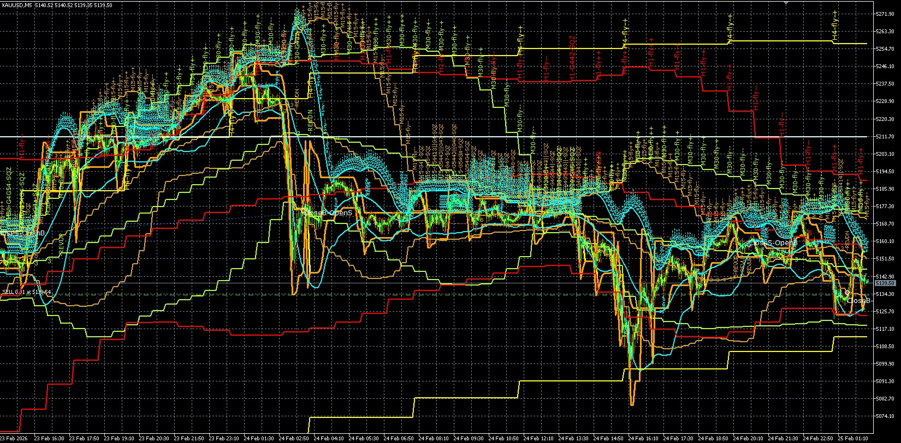

Full backtest period for XAUUSD — 3 macro phases visible:
- **Left:** All TFs aligned bullish (511/512) — W1/D1 fly driving H4 fly driving M30/M15/M5 fly
- **Center:** Peak — price reached D1 outer band → D1/H4 start shrinking → M30/M15 reverse
- **Right:** Recovery — lower TFs cycle through shrink→SQZ→breakout while D1/H4 macro steps continue

### ATRSL1buf Indicator

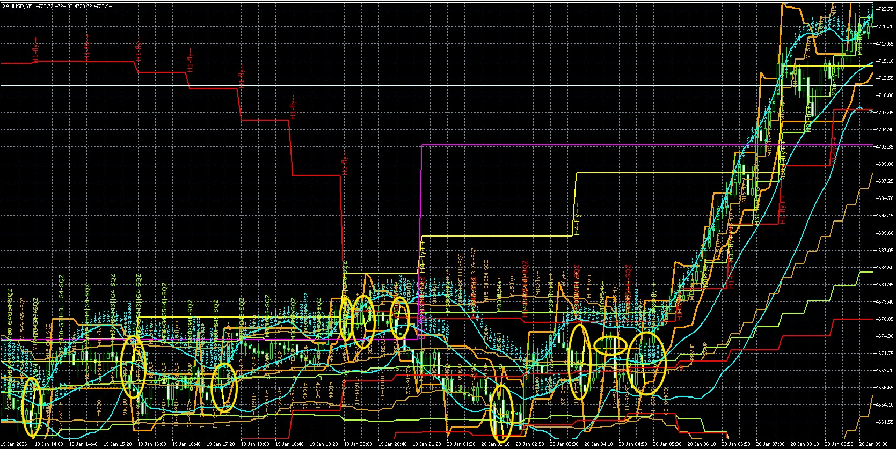

- **dir=0 (uptrend):** orange below price, yellow buffer below orange — stop trails up
- **dir=1 (downtrend):** orange above price, yellow buffer above orange — stop trails down
- ATRSL lags during brief M5/M15 squeezes — do not use as primary signal during fly expand

---

---

# PART 1 — CHART BASICS

## 1. Chart Layers

| Layer | What you see |
|-------|-------------|
| Candlesticks | OHLC price bars |
| Bollinger Bands | Multiple sets of 3 bands (upper/mid/lower) — one per timeframe in a distinct color |
| Upper band labels | `TF-BBW_stage` printed at top of each upper band every bar |
| Middle band labels | `BB_diffMid_Trend` printed at middle band — only when value is 3, 4, or 5 |
| ATRSL1buf | Orange trailing stop with yellow buffer band |
| Gate labels | Short colored text tags (e.g. `[G0b-TOUCH]`, `[G6-BUY]`) — mark where gates fired |
| Trade arrows | Entry/exit markers on candles (up arrow = buy, down arrow = sell) |

---

## 2. Bollinger Band Color Reference

| Timeframe | Color | BB_datas[] | Role |
|-----------|-------|------------|------|
| M5 | Aqua / Cyan | [0] | Data only — no longer entry trigger (V30.02+) |
| M15 | Goldenrod | [1] | Entry trigger (BBdiffMidTrend transition) V30.02+ |
| M30 | GreenYellow | [2] | Primary trend driver |
| H1 | Red | [3] | Chain anchor |
| H4 | Yellow | [4] | Macro bias filter |
| D1 | Magenta | [5] | Daily macro — price target boundary |
| W1 | LightCyan | [6] | Ultra-macro — outermost band |
| ATRSL1buf | Orange | — | Trailing stop |

> **H4 vs W1:** H4 is saturated yellow and narrower; W1 is pale near-white cyan and the widest band set on the chart.

---

## 3. Upper Band Labels — BBW_Stage Codes

Format: `{TF}-{BBW_stage}` or `{TF}-{debug}-{BBW_stage}` (SQZ includes BBW ratio)

| Code | Name | What you see | Trade Bias |
|------|------|-------------|------------|
| 511 | FLY++ bullish expand | Bands fanning out upward, all 3 rising | BUY |
| 512 | FLY+- parallel up | All bands rising together in parallel | BUY |
| 521 | FLY++ bearish expand | Bands fanning out downward | SELL |
| 522 | FLY-+ parallel down | All bands falling in parallel | SELL |
| 513 | FLY-- bullish shrink | Upper band curling down, lower band still rising | WATCH → use M5 |
| 523 | FLY-- bearish shrink | Upper band still rising, lower band curling down | WATCH → use M5 |
| 400–499 | SQZ | Bands extremely tight and flat | WAIT |

---

## 4. Middle Band Labels — BB_diffMid_Trend

Format: `{value}` or `{value}-REVUP/REVDN`. Values 1 and 2 are **not shown** on chart.

| Value | Name | Visual | Label shown? |
|-------|------|--------|-------------|
| 1 | Uptrend | Midband rising | No |
| 2 | Downtrend | Midband falling | No |
| 3 | Sideways | Midband flat | Yes |
| 4 | Sideway downtrend | Midband flat, slight downward bias | Yes |
| 5 | Sideway uptrend | Midband flat, slight upward bias | Yes |

- `REVUP` = midtrend just flipped from 2 → uptrend reversal this bar
- `REVDN` = midtrend just flipped from 1 → downtrend reversal this bar
- **Reading combo:** Upper label = structure (expanding/contracting/compressed); middle label = direction. Together they define the full regime.

---

## 5. ATRSL State

| State | Visual | Meaning |
|-------|--------|---------|
| dir=0 (uptrend) | Orange below price, rising | BUY stop — trailing up |
| dir=1 (downtrend) | Orange above price, falling | SELL stop — trailing down |
| Yellow buffer | Below orange (BUY) or above orange (SELL) | Visual cushion — 1 ATR offset from stop |

---

## 6. Gate Label Colors

| Color | Gate labels | Meaning |
|-------|-------------|---------|
| Lime / Green | G6-BUY | Buy entry fired |
| OrangeRed | G6-SELL | Sell entry fired |
| Crimson / Red | G0 | Sideway exit (all TFs mid≥3) |
| DarkRed | G0-HOLD | Sideway hold (M30+M15 mid≥3 but H1 trending) |
| Magenta | G0c-SQZLOCK | Squeeze lock - no entry |
| Magenta | G0b-PINK | Pink zone exit (M15+M30 both SQZ) |
| Yellow / Gold | G0b-WAIT | Cascade wait (no touch yet) |
| Yellow / Gold | G6-LOAD | SQZ loading - wait state |
| Yellow / Gold | G0b-TOUCH | Cascade entry at band touch |
| Lime / Orange | G0b-TOUCH | Cascade entry confirmed |
| DimGray | G0-HOLD | Hold existing, no new entry |
| DarkOrange | H4-OPPOSE | H4 filter blocked |
| DarkOrange | H4-SQZ | H4 squeeze blocked |
| DarkOrange | G0b-H4OPP | H4 opposing blocked |
| Orange | G4e-H4OPP | H4 opposing blocked (shrink path) |
| Orange | G4c-M15OPP | M15 opposing blocked |
| Orange | G4f-M30OPP | M30 opposing blocked |
| DarkMagenta | G0b-M30OPP | M30 opposing blocked |
| Cyan / Aqua | R:BUY | Reversal BUY prediction |
| Orange | R:SELL | Reversal SELL prediction |
| Red | G5-FADE | Fade exit (UP→FLAT or DN→FLAT) |
| Brown | G8-BNDTGT | Band target exit |
| Green | PRED:BUY | Continuation BUY |
| OrangeRed | PRED:SELL | Continuation SELL |
| DimGray | PRED:NEUTRAL | No direction |

---

## 7. Visual Entry Trigger Identification

**M15 Entry Signal Checklist** (V30.02+):

| Indicator | Visual Cue on Chart |
|-----------|-------------------|
| Stage transition | M15 upper band: "SQZ" → "Fly++" or "Fly+-" |
| Midband transition | Mid-band label disappears (mid=3 → mid=1 or 2) |
| Directional reversal | REVUP or REVDN label appears |
| Gate confirmation | [G6-LOAD] → [G6-BUY] or [G6-SELL] |
| M30 confirmation | M30 fly stage (511/512 BUY, 521/522 SELL) |
| Quality threshold | Score ≥ 60 (visible from position sizing) |

**Entry timing rules:**
- Enter on M15 bar close (not M5 bar close)
- Wait for M30 confirmation (prevents false signals)
- Quality score determines position size

---

## 8. Compression Zone Identification

**Building Phase** (momentum accumulating):
- All bands converging (width decreasing)
- Multiple TFs showing 400-499 stage labels
- Mid-band labels (3,4,5) appearing across TFs
- [G6-LOAD] or [G0c-SQZLOCK] gate labels visible
- L (lower) or U (upper) touch counts increasing

**Resolving Phase** (momentum releasing):
- M5 bands begin spreading first
- REVUP/REVDN label appears
- M15 follows M5 with 2-5 bar lag
- Gate labels shift to [G6-BUY] or [G6-SELL]

---

## 9. Compression Resolution — Reversal vs Continuation

After compression/squeeze, price can either **reverse direction** or **continue flying in the same trend**. This is the critical distinction.

```
                    BEFORE: Fly BUY → Compression → AFTER:
                                                    ├──→ Continuation: Fly BUY resumes (rest pattern)
                                                    └──→ Reversal: Fly SELL begins (direction flip)
```

### Two Possible Outcomes

| Outcome | Description | Reference Scenario |
|---------|-------------|-------------------|
| **Continuation** | Price resumes original direction after compression | Scenario D — Fly → Shrink → Fly (rest pattern) |
| **Reversal** | Price breaks out in opposite direction | Scenario E → F — compression then reversal |

### Key Discrimination Criteria

| Indicator | Continuation (Rest Pattern) | Reversal |
|-----------|----------------------------|----------|
| **H1 step direction** | Maintained throughout | Breaks/reverses |
| **H4 step direction** | Maintained throughout | May reverse |
| **Compression duration** | Brief (hours) | Extended (days) |
| **Band expansion after** | Same direction | Opposite direction |
| **HTF fly throughout** | Yes — W1/D1/H4 all still flying | No — HTFs also compress or slow |
| **Gate labels during rest** | [G6-LOAD] only | [G0c-SQZLOCK], [G0b-PINK] |
| **L/U touch pattern** | Minimal | High L or U counts (repeated tests) |
| **PredictNextTrend** | Continuation (BUY/SELL) | Reversal flag (R:BUY/R:SELL) |

### HTF Compression Level Determines Likelihood

| HTF State During Compression | Outcome Likelihood |
|------------------------------|-------------------|
| H4 still flying, only M30/M15 compress | **Continuation likely** (rest pattern) |
| H4 also shrinking | **Either possible** — watch H1 step |
| H4 also in SQZ | **Reversal more likely** |
| D1 also slowing | **Reversal most likely** |

### Decision Tree for Post-Compression Analysis

```
Compression ends → M5 breaks SQZ →

Is H1 still maintaining original step direction?
├── YES → Is H4 still flying original direction?
│           ├── YES → CONTINUATION → Scenario D (rest pattern)
│           └── NO → Reversal forming → watch REVUP/REVDN
└── NO → Reversal likely → wait for REVUP/REVDN confirmation
         Is M15 also confirming new direction?
         ├── YES → Reversal confirmed → enter new direction
         └── NO → Wait for M15 confirmation
```

### Compression Depth vs Outcome

| Compression Depth | Typical Outcome |
|-------------------|-----------------|
| **Shallow** (M5/M15 only, hours) | Continuation — rest pattern |
| **Moderate** (M30+ included, 4-8 hours) | Either — depends on H1/H4 |
| **Deep** (H1+, days, full SQZ) | Reversal more likely |

### Visual Signals of Continuation (Rest Pattern)

| Signal | Chart Cue |
|--------|-----------|
| H1 bands still stepping in original direction | Red band continues same trajectory |
| H4 bands still stepping | Yellow band continues same trajectory |
| White rectangles (rest zones) then bands re-expand same way | See fly→shrink→fly chart |
| [G6-LOAD] → [G6-BUY/SELL] same as before compression | Gate labels consistent |

### Visual Signals of Reversal

| Signal | Chart Cue |
|--------|-----------|
| H1 step direction breaks | Red band stops or reverses |
| REVUP/REVDN label appears | Midband transition label |
| Bands expand in opposite direction | Upper/lower bands fan opposite way |
| [G0b-PINK] appears | Magenta label — exit all |
| Predict label shows R:BUY/R:SELL | Aqua/orange reversal labels |

---

**Compression depth measurement:**
```
Band width ratio = (Upper band - Lower band) / Midband
  ≥ 0.005 = Wide (fly expanding)
  0.003-0.005 = Normal (parallel fly)
  0.001-0.003 = Narrow (shrinking)
  ≤ 0.001 = Very narrow (squeeze)
```

---

## 10. Block Gate Reference Table

| Gate | Block Condition | Color | Resolution |
|------|----------------|-------|------------|
| H4-OPPOSE | H4 fly opposing entry direction | DarkOrange | Wait for H4 to align |
| H4-SQZ | H4 in SQZ with no conviction | DarkOrange | Wait for H4 breakout |
| G0b-H4OPP | H4 fly/shrink opposing entry | DarkOrange | H4 mid must align with entry |
| G0b-M30OPP | M30 fly/shrink/SQZ with opposing mid | DarkMagenta | M30 mid must align |
| G4e-H4OPP | H4 in shrink with flat mid (sideway) | Orange | Wait for H4 to exit shrink |
| G4c-M15OPP | M15 fly/shrink/SQZ with opposing mid | Orange | M15 mid must align |
| G4f-M30OPP | M30 fly/shrink/SQZ with opposing mid | Orange | M30 mid must align |
| G0b-SQZLOCK | H1+M30 both SQZ, both mid==3 | Magenta | At least one TF must break SQZ |
| G0b-H1SQZDN | H1-SQZ with mid=2/4 vs BUY, or mid=5 vs SELL | Magenta | H1 mid must align with entry |
| G0b-M5OPP | M5 sole trigger + M5 shrink with opposing mid | Magenta | M5 mid must align |
| G0b-M5FLY | M5 in committed opposing fly | Magenta | Wait for M5 to align |

---

## 11. Position Sizing Matrix

| TF Alignment | M15/M30/H1 H4 Fly | Shrink | SQZ |
|--------------|-------------------|--------|-----|
| 4+ TFs agree | 1.0× | 0.75× | 0.50× |
| 3 TFs agree | 1.0× | 0.50× | 0.25× |
| 2 TFs agree | 0.75× | 0.25× | Skip |
| 1 TF | 0.50× | Skip | Skip |

**Quality score multiplier:**
- ≥90: 1.0× (full size)
- ≥75: 0.75×
- ≥60: 0.50×
- ≥45: 0.25×
- <45: Skip

---

## 12. Risk Management Guidelines

**ATRSL stop behavior:**
- dir=0 (uptrend): orange stop below price, trailing upward
- dir=1 (downtrend): orange stop above price, trailing downward
- Yellow buffer: visual cushion (1 ATR offset)
- Stop lags during brief M5/M15 squeezes — do not use as primary signal during fly expand

**Stop tightening during compression:**
- When H4 enters shrink: consider tightening stop toward H4 band boundary
- When M30/M15 both compressing: move stop closer to entry price
- During full SQZ: exit all positions (G0b-PINK)

**Emergency exit conditions:**
- Float loss < −$50 → G0e-MAXLOSS (exit immediately)
- M30+M15+H1 all mid≥3 → G0 (exit all)
- M15+M30 both SQZ → G0b-PINK (exit all)
- ATRSL trailing stop hit → Broker closes

**IMPORTANT:** Always read HTF before analyzing MTF/LTF. HTF determines:
1. **Direction** — which way the wind blows for all lower TFs
2. **Target** — where lower TF trades travel to before stopping
3. **Why sideway** — lower TF goes sideway because HTF is compressing or ranging
4. **MTF Predict** — if H4 is sideway and D1 is shrinking, in the same time M30 & H1 in fly in direction, able to predict the fly will end at H4 upper band or H1 will drive H4 to fly. 

The cascade is top-down: **W1 sets D1's range → D1 sets H4's range → H4 sets H1's range -> H1 sets M30's range → M30 sets M15's range**.

---

## HTF Compression Cascade Dynamics

**Top-Down Cascade Principle:**

```
W1 sets D1's range → D1 sets H4's range → H4 sets H1's range → H1 sets M30's range → M30 sets M15's range
```

**Compression confinement mechanics:**

| HTF State | MTF Behavior | Range Boundaries |
|-----------|-------------|------------------|
| H4 fly | M30 trends with H4 direction | H4 outer band → D1 outer band |
| H4 shrink | M30 ranges within H4 band | H4 upper and lower band |
| H4 SQZ | M30 chops flat, no direction | Within H4 band envelope |

**H4 shrink confinement (pink rectangle pattern):**
- When H4 enters shrink (513/523), M30/M15 become confined to range
- Range boundaries = H4 upper and lower band
- M30/M15 oscillate between these boundaries until H4 exits shrink
- D1 direction determines eventual H4 breakout direction
- Band-touch entries at pink rectangle edges = cascade trade opportunities

**D1 band boundary rule:**
- D1 upper band acts as "ceiling" for all H4 BUY trades
- H4 trades travel toward D1 upper band before D1 turns
- When D1 starts shrinking (513), exit all H4 BUY positions

---

## HTF Reference Charts

**When going through PART 2 — HIGHER TIMEFRAME ANALYSIS (W1 → D1 → H4):**
- Read `references/Backtest_data/extras/backtest_EA_HTF_Fly_2_Shrink_part1.jpg` as the visual reference for Part 1
- Read `references/Backtest_data/extras/backtest_EA_HTF_Fly_2_Shrink_part2.jpg` as the visual reference for Part 2

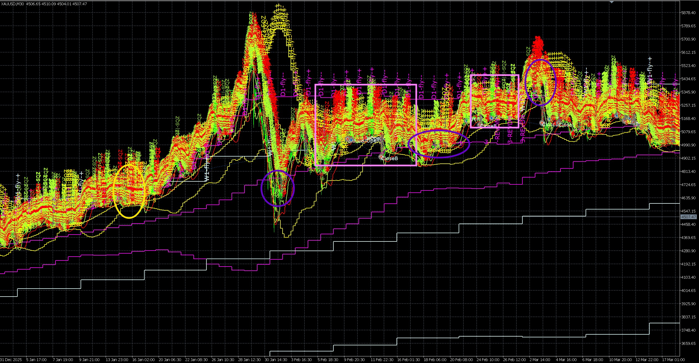

**Part 1 — Full macro cycle (Jan–Feb 2026):**
- **Left:** W1 (lightcyan/white) and D1 (magenta) bands stepping upward — both in fly. H4 (yellow) flies in the same direction. All TFs aligned: M30/M15/M5 all ride this macro momentum upward
- **Yellow circles (left):** H4 shrink and squeezed then continue fly — each step up is where H4 upper band previously sat; these become support on the way up
- **Peak (center, ~5400):** Price reached D1 upper band → D1 starts shrinking (top of D1 fly). H4 follows, entering shrink. M30/M15 lose macro tailwind and reverse
- **White rectangles (right):** After D1/H4 enter shrink, M30/M15 are forced to range within the H4 band envelope — oscillating between H4 upper and H4 lower. This is the "M30 sideway caused by H4 shrink" pattern
- **Blue circles:** Cascade band-touch entries (G0b-TOUCH) firing at H4 band boundaries during H4 shrink phase — price touches H4 outer band edge, G0b-TOUCH fires

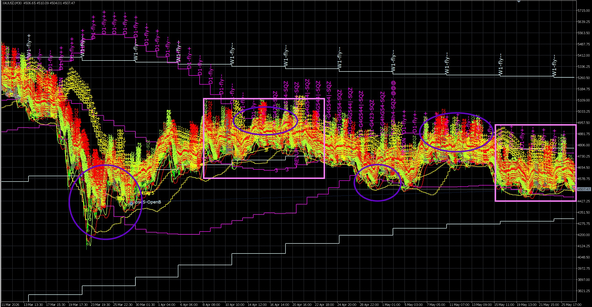

**Part 2 — H4 shrink zones (Feb–Apr 2026):**
- **H4 stage labels "H4-Fly--" visible on bands** — H4 is in shrink (513 or 523) throughout most of this period
- **D1 (magenta) still stepping at bottom** — D1 remains in fly, providing macro direction bias even while H4 shrinks. D1 fly direction = the "eventual" direction price returns to after H4 shrink resolves
- **Large pink rectangles:** H4 shrink zones where M30/M15 are confined. Inside each rectangle: M30/M15 oscillate within the H4 upper/lower band range — they cannot break out until H4 exits shrink
- **Purple circles:** M30/M15 pivot points at H4 band boundaries — these are the "outer band touch" exit signals (G8-BNDTGT fires here). Sell when M30 touches H4 upper band; buy when M30 touches H4 lower band
- **After each pink rectangle:** When H4 exits shrink back to fly (either resuming D1 direction or reversing), M30/M15/M5 resume trending

---

## W1 — Ultra-Macro Context

W1 is the slowest band (lightcyan, widest). It changes direction rarely but determines the multi-month trajectory.

| W1 Stage | diffmid Trend | What it means | MTF implication |
|----------|---------------|----------------|----------------|
| 511/512 (BUY) | | Multi-week uptrend — macro wind is bullish | All lower TF dips are buying opportunities; BUY trades last longer; SELL trades are counter-trend (smaller size, faster exit) |
| 521/522 (SELL) | | Multi-week downtrend — macro wind is bearish | All lower TF rallies are selling opportunities; SELL trades last longer; BUY trades are counter-trend |
| 513 (BUY shrink) | | Macro uptrend slowing — D1/H4 will start to compress | Expect H4 shrink soon → M30 ranges will get tighter; new BUY entries are shorter-duration |
| 523 (SELL shrink) | | Macro downtrend slowing | Expect H4 shrink soon → SELL entries shorter-duration |
| 400–499 (SQZ) | | Multi-week range — no macro conviction | No sustained directional moves at any TF; range-trade only; avoid large positions |

**W1 price target:** When W1 is in fly, the D1 outer band is where price gravitates before W1 itself turns. When price is far below W1 upper band (BUY), the W1 band acts as a long-distance magnet.

---

## D1 — Daily Macro

D1 is the magenta band. It steps in large increments and updates slowly.

| D1 Stage | diffmid Trend | What it means | MTF implication |
|----------|---------------|-------------------|-------------------|
| 511/512 (BUY) + W1 fly | | Strong macro alignment — daily uptrend | H4 BUY entries are high-quality; hold through H4 brief SQZ; target = D1 outer band |
| 521/522 (SELL) + W1 fly | | D1 SELL vs W1 BUY — D1 is counter-trend pullback | H4 SELL entries are shorter-duration; expect D1 BUY to resume once pullback exhausts |
| 521/522 (SELL) + W1 SELL | | Full alignment bearish | H4 SELL entries ride toward D1 lower band; BUY is counter-trend |
| 513/523 (shrink) | | D1 losing directional conviction | H4 is about to lose macro backing; H4 trades become range-bound |
| 400–499 (SQZ) | | D1 flat — no daily directional bias | H4 fly entries get no macro tailwind; H4 trades chop within D1 band range |

**D1 price target rule:** When D1 is in fly BUY, H4 trades travel toward the **D1 upper band** before D1 turns. The D1 upper band is the "ceiling" for H4 BUY trades on the macro timeframe.

---

## H4 — Macro Bias Filter

H4 is the yellow band. It directly controls M30/M15/M5 entry quality and duration.

| H4 Stage + Mid | diffmid Trend | What it means | MTF implication |
|----------------|---------------|-----------------|-------------------|
| 511/512 + mid=1 | | H4 BUY fly | M30 BUY trades fully backed — ride toward H4 upper band; hold through M5 brief squeezes |
| 521/522 + mid=2 | | H4 SELL fly | M30 SELL trades fully backed — ride toward H4 lower band |
| 513 + mid=1/5 | | H4 bullish shrink | H4 is contracting but still bullish — M30 BUY trades are shorter; exit when price reaches H4 outer band |
| 523 + mid=2/4 | | H4 bearish shrink | H4 contracting, still bearish — H1 SELL trades shorter |
| 513/523 + mid=3 | | H4 shrink with flat mid | H4 has no directional conviction — **G4e-H4OPP blocks this in shrink path** |
| 400–499 + mid=1/5 | | H4 SQZ, but midtrend bullish | Weak H4 — G0b-H4OPP passes (mid has some conviction); M5 must confirm direction |
| 400–499 + mid=3 | | H4 SQZ flat | No macro conviction at all |
| 400–499 + mid=2/4 | | H4 SQZ, bearish mid | H4 SQZ but leaning bearish — blocks BUY entries via G0b-H4OPP |

---

## The Core HTF → MTF Cascade Rule

**Always check H4**

**Why does H1 go sideway?** Because H4 is shrinking or in SQZ.

When H4 is in fly: H1 has a clear macro path → H1 trades travel toward H4 outer band.
When H4 enters shrink: H4's band range narrows → H1 is confined within that shrinking range → H1 oscillates and appears "sideway."
When H4 is in SQZ: H1 has no target beyond the SQZ boundaries → H1 chops flat.

```
H4 stage       → H1 behavior              → MTF trade duration
─────────────────────────────────────────────────────────────────
511/512 fly    → H1 trends with H4        → Long trades — hold until H4 outer band
513/523 shrink → H1 ranges within H4 band → Short trades — exit at H4 band boundary
400-499 SQZ    → H1 flat/ranging          → No new trades; wait for H4 breakout
```

**Price target derivation (top-down):**

| Trade entry | Target 1 | Target 2 | Exit signal |
|-------------|----------|----------|-------------|
| W1 fly BUY + D1 fly BUY | H4 outer band | D1 outer band | D1 starts shrinking (513) |
| D1 fly BUY + H4 fly BUY | H1 outer band → H1 outer band | H4 outer band | H4 starts shrinking |
| H4 fly BUY + H1 fly BUY | M15 outer band | H1 outer band | H1 goes sideway; H4 outer band reached |
| H4 shrink + H1 ranging | H4 upper band (BUY) or lower (SELL) | — | Price touches H4 outer band → G8-BNDTGT fires |
| All HTF SQZ | No target | — | Wait — no trade |

---

## HTF Analysis Step-by-Step

Before looking at any H1/M30/M15/M5 entry, answer these questions:

**1. What is W1 doing?**
- Fly BUY / Fly SELL / Shrink / SQZ?
- This sets the multi-week wind direction.
- Impact D1 sideway when W1 shrink

**2. What is D1 doing?**
- Fly same direction as W1 → full alignment, hold trades longer
- Fly opposite to W1 → counter-trend pullback; shorter trades
- Shrink → D1 losing conviction; H4 trades will become shorter
- SQZ → H4 has no D1 backing; only range trades

**3. What is H4 doing?**
- Fly BUY/SELL → H1 entries ride toward H4 outer band
- Shrink (513/523) → H1 is ranging within H4 band; short trades, target = H4 outer band boundary
- SQZ (400-499) → H1 entry requires G0b / H4-SQZ path with M5 confirmation

**4. What is the price target for H1?**
- H4 fly → H4 outer band is where H1 trades stop
- H4 shrink → H4 outer band is where the range reverses
- H4 SQZ → no clear target; wait for breakout

**5. Why is H1 sideway right now?**
- Check H4: if H4 is shrinking or SQZ → that is why H1 is flat
- Once H4 exits shrink back to fly → H1 will resume trending

---

## Scenario Identification Flowchart

```
Start Analysis → Is H4 in fly?
                 ↓
                  Yes → Are M30+M15 also in fly?
                        ↓
                         Yes → SCENARIO A: Normal Fly
                         ↓
                         No → Are M30/M15 shrinking?
                              ↓
                               Yes → SCENARIO B: Fly → Shrink
                               ↓
                               No → Are M30/M15 in SQZ?
                                    ↓
                                     Yes → Check band touch → SCENARIO C: Cascade
                                              ↓
                                               No → SCENARIO D: Rest Pattern
                 ↓
                  No → Is H4 in shrink?
                        ↓
                         Yes → Are M30/M15 compressing?
                               ↓
                                 Yes → SCENARIO E: Shrink → SQZ
                               ↓
                                 No → Check if H4 about to exit → SCENARIO D: Rest Pattern
                 ↓
                  No (H4 in SQZ) → Are all TFs in SQZ?
                                    ↓
                                     Yes → SCENARIO F: SQZ → Fly (Breakout)
                                          ↓
                                        After SQZ breaks:
                                          ↓
                                         Is H1 maintaining original step?
                                          ├──→ YES → CONTINUATION (rest pattern)
                                          └──→ NO → REVERSAL (direction flip)
                                    ↓
                                     No → Are M30+M15 both mid≥3?
                                           ↓
                                             Yes → SCENARIO G: All TFs Sideway
```

---

## HTF Compression Zone Analysis

**Identifying compression zones (yellow rectangles on charts):**

| Phase | Visual Cues | Action |
|-------|-------------|--------|
| Building | All bands converging, width decreasing | Wait, track compression depth |
| Peak compression | Bands extremely flat, mid-labels across TFs | No trade, watch for breakout signals |
| Release | M5 bands spread first, REVUP/REVDN appears | Prepare for entry |
| Confirmation | M15 follows M5, then M30, then H1 | Enter if quality score ≥ 60 |

**Compression duration guidelines:**

| Timeframe | Typical Duration |
|-----------|-----------------|
| M5 compression | 5-15 minutes |
| M15 compression | 30 minutes - 2 hours |
| M30 compression | 1-4 hours |
| H1 compression | 2-8 hours |
| H4 compression | 4-24 hours |

**Compression resolution indicators:**
- HTF direction determines breakout direction
- L (lower) touch counts high → bounce upward likely
- U (upper) touch counts high → rejection downward likely
- M (mid) touch counts high → oscillation, wait for direction

---

# PART 3 — MIDDLE AND LOWER TIMEFRAME SCENARIO ANALYSIS

Apply after HTF context is established. Each scenario: **What you see → What it means → Trade action**

---

## Scenario A — Normal Fly (All TFs Aligned)

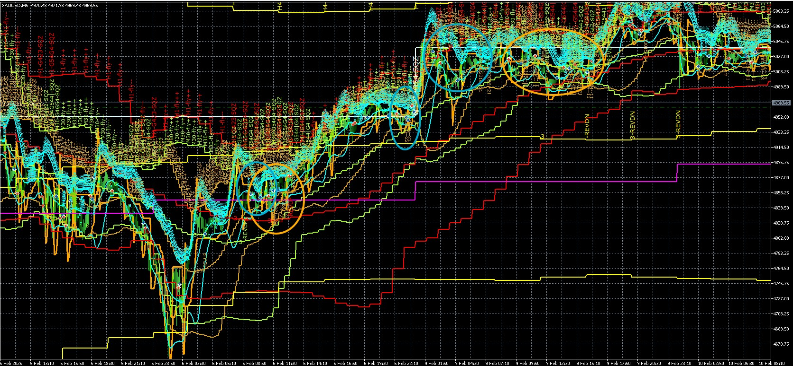

### Scenario A Identification Flowchart

```
See bands on chart → Are all bands fanning outward same direction?
                    ↓
                     Yes → Are mid-band labels absent (mid=1/2 suppressed)?
                           ↓
                            Yes → Is H4 (yellow) stepping same direction?
                                  ↓
                                   Yes → Check stage labels:
                                          511/512 (BUY) or 521/522 (SELL)?
                                         ↓
                                          Yes → SCENARIO A CONFIRMED
                                                 ↓
                                                Are [G6-BUY/SELL] labels visible?
                                                 ├──→ Yes → Full fly, enter on M15 transition
                                                 └──→ No → Wait for entry signal
                    ↓
                     No → NOT Scenario A → Check other scenarios
```

**Visual confirmation checklist:**

| Visual Cue | Present? |
|-----------|----------|
| All bands expanding outward same direction | [ ] |
| No mid-band labels (mid=1/2) | [ ] |
| H4 stepping in same direction | [ ] |
| Stage labels 511/512/521/522 | [ ] |
| [G6-BUY] or [G6-SELL] gate labels | [ ] |

**5/5 present = Confirmed Scenario A**

---

**HTF context:** W1 fly + D1 fly + H4 fly — all in same direction. Full macro tailwind.

**What you see:**
- H1 (red) and M30 (greenyellow) bands stepping in fly (511/512 or 521/522)
- All bands fanning outward in the same direction
- M5 (aqua) may show 2–3 brief tight bundles mid-fly — noise squeezes
- No mid-band labels visible (mid=1 or 2 — suppressed)
- H4 (yellow) stepping in same direction — macro confirmed

**What it means:**
- Full alignment — strongest possible trend
- Brief M5/M15 compressions are noise — M30 midtrend is the reference
- H4 fly is why brief squeezes resolve back to fly instead of deeper compression
- Price target: H4 outer band → then D1 outer band if D1 is also fly

**Visual identification checklist:**
```
[✓] All bands fanning outward in same direction
[✓] No mid-band labels (mid=1 or 2 suppressed)
[✓] H4 stepping in same direction
[✓] Stage labels: 511/512 (BUY) or 521/522 (SELL)
[✓] [G6-BUY] or [G6-SELL] gate labels visible (lime/orange)
```

**Holding vs exiting decision:**

| Condition | Action |
|-----------|--------|
| Brief M5 squeeze (< 3 bars) | HOLD — noise |
| M15 squeeze (< 5 bars) | HOLD — still within fly |
| M30 squeeze (< 10 bars) | HOLD — H4 still flying |
| M15 UP→FLAT transition | EXIT (G5-FADE) |
| M30+M15 both mid≥3 | EXIT (G0) |
| ATRSL stop hit | EXIT (broker closes) |

**Trade action:**
```
BUY:  H1+M30 511/512 + mid=1  →  enter on M15 FLAT→UP transition
SELL: H1+M30 521/522 + mid=2  →  enter on M15 FLAT→DN transition
HOLD: through all brief M5/M15 noise squeezes (< 3 bars)
EXIT: M15 UP→FLAT (G5-FADE) | M30+M15 both sideway (G0) | ATRSL stop hit | H4 outer band reached (G8-BNDTGT)
SIZE: 1.0× (full — highest quality when W1+D1+H4 all aligned)
```

---

## Scenario B — Fly → Shrink (Inner TFs Contracting)

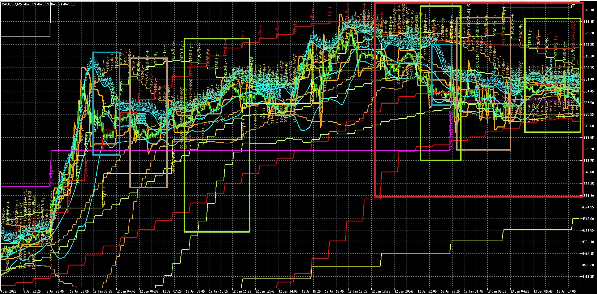
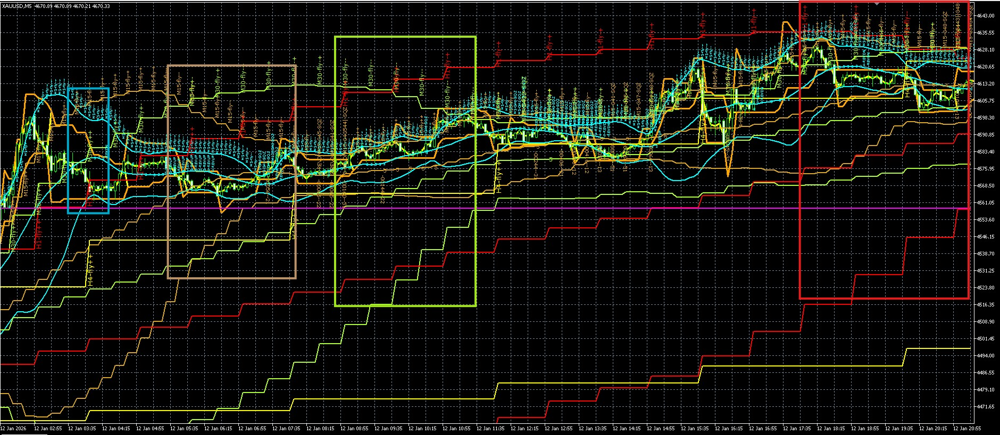

### Scenario B Identification Flowchart

```
See bands on chart → Is H4 (yellow) still in fly (bands stepping)?
                    ↓
                     No → NOT Scenario B
                    ↓
                     Yes → Are M30/M15 bands converging?
                           ↓
                            Yes → Stage labels show 513/523 (shrink)?
                                  ↓
                                   Yes → Are midtrend labels appearing (3,4,5)?
                                         ↓
                                          Yes → SCENARIO B CONFIRMED
                                                 ↓
                                                How many TFs shrinking?
                                                 ├──→ Only M5 → M5 noise, wait
                                                 ├──→ M15 only → Shrink path entry possible
                                                 ├──→ M30 also → Higher risk, smaller size
                                                 └──→ H1 also → Very high risk, consider exit
                           ↓
                            No → Bands still expanding → NOT Scenario B
```

**Visual confirmation checklist:**

| Visual Cue | Present? |
|-----------|----------|
| H4 still in fly (511/512/521/522) | [ ] |
| M30/M15 bands converging (513/523) | [ ] |
| M5 midtrend labels (3,4,5) appearing | [ ] |
| Upper band curling back toward mid | [ ] |

**3/4 present = Confirmed Scenario B**

---

**HTF context:** H4 is still in fly, but M30 or M15 starting to shrink. H4 provides the direction and target; M30/M15 are resting before continuing.

**What you see:**
- H1 (red) and H4 (yellow) still in fly (bands stepping)
- M30 or M15 bands beginning to converge (513/523)
- M5 (aqua) tightening; midtrend labels (3, 4, 5) appear at midband
- Bands that were fanning out are now closing in from one side

**What it means:**
- M30/M15 losing momentum temporarily; H4 macro structure intact
- Price is "resting" inside H4's band before continuing toward H4 outer band
- M5 midtrend transitions are the only valid entry triggers now

**Cascade shrink sequence (why each TF goes sideway):**
- **Only M5 shrink:** M5 resting, M15/M30 still fly → wait — M5 noise within M30 fly
- **M15 shrink** + M30/H1/H4 fly → M15 confined within M30 band; price touches M15 outer band
- **M30 shrink** + H1/H4 fly → M30 confined within H1 band; price touches M30 outer band
- **H1 shrink** + H4 fly → H1 confined within H4 band; price touches H1 outer band

**Shrink depth measurement:**
```
Band width ratio = (Upper band - Lower band) / Midband
  ≥ 0.005 = Wide (fly expanding)
  0.003-0.005 = Normal (parallel fly)
  0.001-0.003 = Narrow (shrinking)
  ≤ 0.001 = Very narrow (squeeze)
```

**Optimal entry timing during shrink:**
- Enter when M15 shrinks but M30/H4 still flying (best quality)
- Avoid when H4 also shrinking (higher risk)
- Enter at M15 midtrend transition (FLAT→UP/DN)
- Wait for quality score ≥ 75

**Trade action:**
```
ENTRY: M15 FLAT→UP (BUY) or FLAT→DN (SELL) transition
WAIT if: only M5 shrinking, M15 still fly — M5 alone is noise
BLOCK: H4 opposing (G4e-H4OPP) | M15 opposing (G4c-M15OPP) | M30 opposing (G4f-M30OPP)
TARGET: outer band of lowest TF still in fly (= where price stops this leg)
EXIT: M15 UP→FLAT (G5-FADE) | cascade into SQZ | outer band touched (G8-BNDTGT)
SIZE: 0.75× (M15 or M30 shrink alone) → 0.50× (M30+H1 both) → 0.25× (all 3 shrink)
```

---

## Scenario C — Cascade Band Touch (G0b context)

### Scenario C Identification Flowchart

```
See bands on chart → Is H4 in SQZ or shrink (400-499 or 513/523)?
                    ↓
                     No → NOT Scenario C
                    ↓
                     Yes → Is M30 in SQZ (400-499)?
                           ↓
                            No → NOT Scenario C
                    ↓
                            Yes → Are M15/M5 in shrink (513/523)?
                                  ↓
                                   No → NOT Scenario C
                    ↓
                                   Yes → Is price at H4/M30/H1 outer band edge?
                                         ↓
                                          No → [G0b-WAIT] — waiting for touch
                    ↓
                                          Yes → Check cascade filters (6 filters)
                                                 ↓
                                                All filters pass?
                                                 ├──→ Yes → [G0b-TOUCH] → ENTRY FIRES
                                                 └──→ No → [G0b-block] → Entry blocked
```

**Visual confirmation checklist:**

| Visual Cue | Present? |
|-----------|----------|
| H4 in SQZ or shrink | [ ] |
| M30 in SQZ (flat bands) | [ ] |
| M15/M5 in shrink | [ ] |
| Price at outer band edge | [ ] |
| [G0b-WAIT] or [G0b-TOUCH] gate label | [ ] |

**5/5 present = Confirmed Scenario C**

---

**HTF context:** H4 is in SQZ or shrink. M30 is also SQZ. M15/M5 in shrink. Price approaching the outer band of the highest active shrink TF. This is the "HTF compressing → range bounce" pattern.

**What you see:**
- H1/M30 in SQZ (400-499) — bands extremely flat
- M15/M5 in shrink (513/523) — bands converging
- Price approaching the outer edge of the highest shrink TF's band
- Gate labels: `[G0b-TOUCH]` (lime/orange) or `[G0b-WAIT]` (yellow)

**Pink zone — exit immediately:**
- M15 SQZ + M30 SQZ simultaneously → `[G0b-PINK]` → exit all, no entries

**Cascade entry filters (all must pass before touch fires):**

| Filter | Block condition |
|--------|----------------|
| G0b-H4OPP | H4 fly/shrink opposing entry direction |
| G0b-M30OPP | M30 fly/shrink/SQZ with opposing mid |
| G0b-SQZLOCK | H1+M30 both SQZ, both mid==3 (no conviction) |
| G0b-H1SQZDN | H1-SQZ with mid=2/4 vs BUY, or mid=5 vs SELL |
| G0b-M5OPP | M5 sole trigger + M5 shrink with opposing mid |
| G0b-M5FLY | M5 in committed opposing fly when higher TF triggers |

**Band touch point identification:**
- Touch H4 upper band during H4 shrink → SELL opportunity (purple circles on chart)
- Touch H4 lower band during H4 shrink → BUY opportunity
- Touch H1 upper band → SELL opportunity
- Touch H1 lower band → BUY opportunity
- Touch M30 outer band → exit signal (G8-BNDTGT)

**Filter evaluation sequence:**
1. Check H4-OPP (H4 opposing direction?)
2. Check M30-OPP (M30 opposing mid?)
3. Check SQZLOCK (H1+M30 both mid=3?)
4. Check H1SQZDN (H1 mid contradicts entry?)
5. Check M5OPP (M5 mid opposing?)
6. Check M5FLY (M5 committed fly opposing?)

**Trade action:**
```
WAIT: no touch yet → [G0b-WAIT]
BUY:  lower band touch, all filters pass → [G0b-TOUCH] act=1
SELL: upper band touch, all filters pass → [G0b-TOUCH] act=2
EXIT ALL: M15+M30 both SQZ → [G0b-PINK] act=7 + cooldown
SIZE: quality score from M5 transition
```

---

## Scenario D — Fly → Shrink → Fly (Rest Pattern)

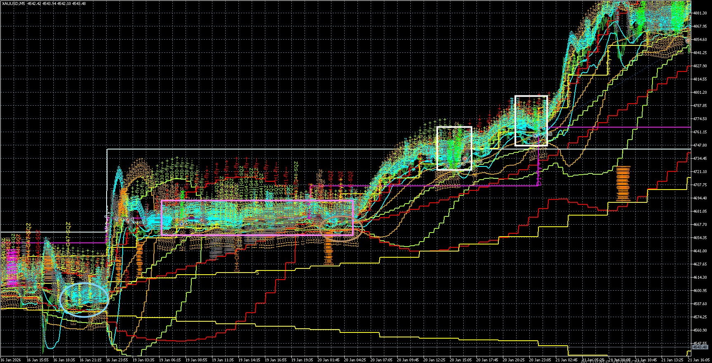
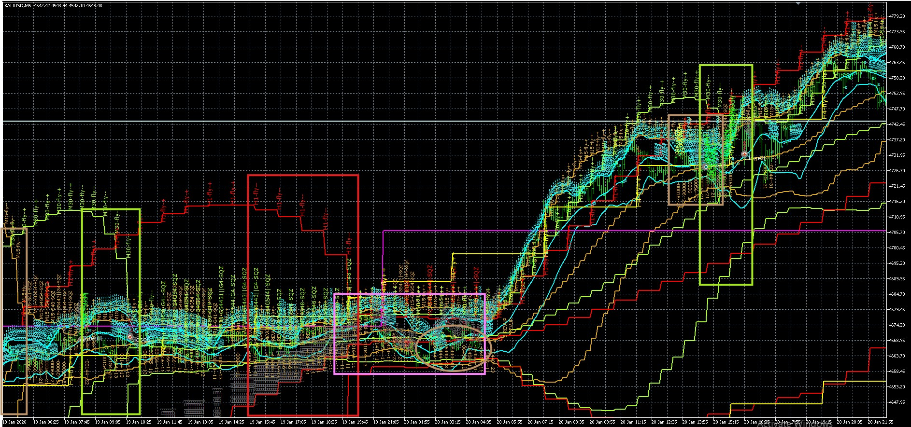

### Scenario D Identification Flowchart

```
See bands on chart → Were all TFs in fly recently?
                    ↓
                     No → NOT Scenario D
                    ↓
                     Yes → Did M30/M15/M5 briefly compress?
                           ↓
                            No → NOT Scenario D
                    ↓
                           Yes → Is H1 (red) maintaining original step direction?
                                ↓
                                 No → REVERSAL (not rest pattern)
                    ↓
                                 Yes → Is H4 (yellow) still flying same direction?
                                       ↓
                                        No → HTF weakening, be cautious
                    ↓
                                       Yes → Is compression brief (hours not days)?
                                             ↓
                                              No → Extended compression, risk reversal
                    ↓
                                              Yes → [G6-LOAD] only (not [G0c-SQZLOCK])?
                                                     ↓
                                                      No → Deep compression, may be reversal
                    ↓
                                                      Yes → SCENARIO D CONFIRMED
                                                             ↓
                                                            Bands re-expand same direction?
                                                             ├──→ Yes → Fly resumed, full entry
                                                             └──→ No → Still compressing, wait
```

**Visual confirmation checklist:**

| Visual Cue | Present? |
|-----------|----------|
| H1 step direction maintained | [ ] |
| H4 step direction maintained | [ ] |
| Compression was brief (hours) | [ ] |
| Only [G6-LOAD] labels (no [G0c-SQZLOCK]) | [ ] |
| Bands re-expand same direction | [ ] |

**5/5 present = Confirmed Scenario D (Rest Pattern)**

---

**HTF context:** W1/D1 remain in fly throughout. H4 also stays in fly. Only M30/M15/M5 briefly compress. The macro tailwind (H4 fly) guarantees fly resumes.

**What you see:**
- H1 (red) and H4 (yellow) never reverse their stepping structure
- White rectangles: M30/M15/M5 briefly compress then re-expand in the same direction
- After each rectangle: full fly resumes, all bands fan back out

**Key test — rest vs reversal:** H1 (red) maintains its step direction throughout. If H1 never breaks, this is a rest pattern. If H1 reverses direction, it is a true reversal.

**Rest vs reversal identification checklist:**

| Indicator | Rest Pattern | Reversal Pattern |
|-----------|-------------|------------------|
| H1 step direction | Maintained | Reversed |
| H4 step direction | Maintained | May reverse |
| Compression duration | Brief (hours) | Extended (days) |
| Band expansion after compression | Same direction | Opposite direction |
| HTF fly throughout | Yes | No — HTF also compresses |
| Gate labels during rest | [G6-LOAD] only | [G0c-SQZLOCK], [G0b-PINK] |

**Zones in the zoom:**
- Yellow (left): initial fly — all bands expanding
- Red (center): M30/M15 shrink; H4 step unchanged
- Purple/magenta: brief SQZ — `[G6-LOAD]` logging; wait for M5 break
- White (right): fly resumes — M5 SQZ break → `[G6-BUY]` → M15/M30 follow

**Trade action:**
```
DURING shrink: enter on M5 FLAT→UP/DN via shrink path (G6-BUY/SELL)
DO NOT wait for all TFs to re-align — M5 SQZ break IS the entry
TARGET: resume toward H4 outer band (H4 fly context)
EXIT: ATRSL stop | M5 UP→FLAT (G5-FADE) | M30+M15 go sideway
```

---

## Scenario E — Shrink → SQZ (All TFs Compressing)

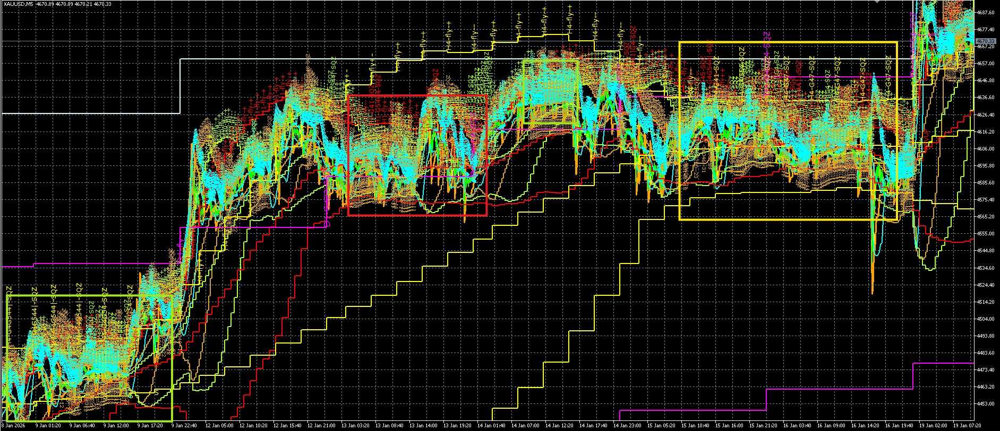
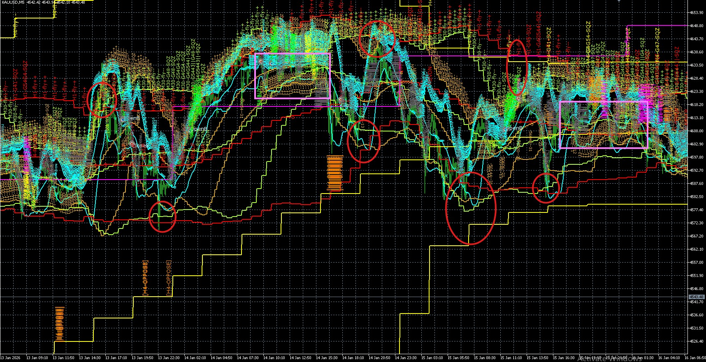

### Scenario E Identification Flowchart

```
See bands on chart → Is H4 in shrink or SQZ (513/523 or 400-499)?
                    ↓
                     No → NOT Scenario E
                    ↓
                     Yes → Is H1 (MTF) showing shrink/flat/squeeze?
                                 (H1 bands shrinking, flat, or squeezed)
                                 ↓
                                  No → NOT Scenario E
                    ↓
                                 Yes → Is M5 shrinking (513/523) or in SQZ (400-499)?
                                       ↓
                                        No → Early stage, not full compression yet
                    ↓
                                       Yes → Is M15 shrinking (513/523) or in SQZ (400-499)?
                                             ↓
                                              No → Partial compression
                    ↓
                                              Yes → Is M30 shrinking (513/523) or in SQZ (400-499)?
                                                    ↓
                                                     No → Incomplete cascade
                    ↓
                                                     Yes → Are mid-band labels (3,4,5) on multiple TFs?
                                                           ↓
                                                            No → Check for midband labels
                    ↓
                                                           Yes → Is [G0c-SQZLOCK] or [G6-LOAD] visible?
                                                                 ↓
                                                                  No → Compression without lock
                    ↓
                                                                  Yes → SCENARIO E CONFIRMED
                                                                         ↓
                                                                        Compression depth:
                                                                         ├──→ Shallow → Range trade H1 boundaries
                                                                         ├──→ Moderate → Wait for direction
                                                                         └──→ Deep → Reversal more likely
```

**Cascade compression sequence:**

```
                    H4 shrink/SQZ (starting point)
                          ↓
                    H1 shrink/flat/squeeze (MTF compressed)
                          ↓
                    M5 shrink → SQZ
                          ↓
                    M15 shrink → SQZ
                          ↓
                    M30 shrink → SQZ (full compression)
                          ↓
                    [G0c-SQZLOCK] / [G6-LOAD] (locked state)
```

**Visual confirmation checklist:**

| Visual Cue | Present? |
|-----------|----------|
| H4 in shrink or SQZ | [ ] |
| H1 showing shrink/flat/squeeze | [ ] |
| M5 shrinking or SQZ | [ ] |
| M15 shrinking or SQZ | [ ] |
| M30 shrinking or SQZ | [ ] |
| Mid-band labels on multiple TFs | [ ] |
| [G0c-SQZLOCK] or [G6-LOAD] labels | [ ] |

**5/7 present = Confirmed Scenario E (minimum H4, H1, M5, M15, midband labels)**

---

### Flowchart Verification Against Images

**Flowchart checkpoints verified with image evidence:**

| Checkpoint | Image Evidence | Matches? |
|-----------|---------------|----------|
| H4 shrink/SQZ | Yellow band shows H4-SQZ/H4-Fly-- labels | ✓ Yes |
| H1 shrink/flat/squeeze | Red bands show all three states | ✓ Yes |
| M5 shrink→SQZ | Aqua bands collapse first | ✓ Yes |
| M15 shrink→SQZ | Goldenrod bands collapse, M15-Fly-- | ✓ Yes |
| M30 shrink→SQZ | Green bands collapse, M30-Fly-- | ✓ Yes |
| Mid-band labels multiple TFs | 3, 4, 5 labels across M15/M30/H1 | ✓ Yes |
| [G0c-SQZLOCK]/[G6-LOAD] visible | G6-LOAD (gold) visible | ✓ Yes |

**7/7 checkpoints confirmed by image evidence**
**Flowchart is VERIFIED accurate**

---

**HTF context:** H4 is shrinking or in SQZ. D1 is also slowing. The macro is losing conviction — this is WHY all lower TFs are going flat. Price is ranging because H4 cannot provide a clear outer band target.

**What you see:**
- M5/M15/M30 bands collapsed to near-flat horizontal lines — barely any gap between upper and lower
- Mid-band labels (3, 4, 5) appear on multiple TFs at once
- H1/H4 also flat or slowly stepping
- Gate labels: `[G0c-SQZLOCK]` (magenta), `[G0b-SQZLOCK]` (magenta), `[G6-LOAD]` (gold)

**Why each zone is ranging (from zoom, Jan 13–15):**
- **H1 sideway** (Jan 13): H4 is still fly → price tries H4 midband; trade follows M5 up toward H4 midband
- **M30/M15 fly down + H1 shrink** (Jan 14 12:20): H1 compressing → M30 range widens to H1 band boundaries
- **Touch H1 lower** (Jan 14 15:30): Price reaches H1 lower band → bounces up toward H1 upper (range trade within H1 band)
- **H1 fly down → H4 shrink** (Jan 14 20:50–Jan 15 05:50): H4 starts shrinking → H1 range confined within H4 band
- **H4 sideway** (Jan 15 11:10): H4 SQZ → range trade between H1 upper and H1 lower
- **Pink zone** (Jan 15 19:10): M15+M5 both sideway → exit all

---

## Yellow Rectangle Analysis (Sideway Zone Initiation)

**Yellow rectangles indicate:** HTF compression has initiated → MTF begins to lose direction → Lower TFs start going sideway

**Image evidence shows:**

| Timeframe | State | Evidence |
|-----------|-------|----------|
| H4 | Shrinking/SQZ | Yellow band flat, "H4-SQZ"/"H4-Fly--" labels |
| H1 | Beginning shrink | Red band stops stepping, mid=3 appears |
| M30 | Fly→Shrink | Green bands fly then narrow, "M30-Fly--" |
| M15 | Fly→Shrink | Goldenrod bands fly then narrow |
| M5 | Fly→Shrink | Aqua bands fly then narrow |

**Flowchart verification for yellow rectangle:**
- H4 shrink/SQZ: ✓ Confirmed (yellow band flat)
- H1 shrink/flat/squeeze: ✓ Confirmed (red band stops, mid=3)
- M5 shrinking: ✓ Confirmed (aqua narrow)
- M15 shrinking: ✓ Confirmed (goldenrod narrow)
- M30 shrinking: ✓ Confirmed (green narrow, mid=3)
- Mid-band labels multiple TFs: ✓ Confirmed (3,4,5 visible)
- [G6-LOAD] labels: ~ Possibly (may appear at end)

**Verdict:** Yellow rectangle CONFIRMS flowchart is accurate

---

## Red Rectangle Analysis (Sideway Zone Deepening)

**Red rectangles indicate:** HTF compression continues → MTF fully sideway → All lower TFs in SQZ

**Image evidence shows:**

| Timeframe | State | Evidence |
|-----------|-------|----------|
| H4 | Full SQZ | Yellow band completely flat, "H4-SQZ" |
| H1 | Full SQZ/sideway | Red band flat, mid=3 persistent, [G0c-SQZLOCK] |
| M30 | Full SQZ | Green band flat, "M30-SQZ" labels |
| M15 | Full SQZ | Goldenrod band flat, mid=3 |
| M5 | Full SQZ | Aqua band flat, mid=3 |

**Compression cascade visible:**
```
H4 SQZ (persistent)
    ↓
H1 SQZ/sideway (red flat, [G0c-SQZLOCK] magenta)
    ↓
M30 SQZ (green flat, mid=3)
    ↓
M15 SQZ (goldenrod flat, mid=3)
    ↓
M5 SQZ (aqua flat, mid=3)
    ↓
Full sideway compression - no entries possible
```

**Flowchart verification for red rectangle:**
- H4 shrink/SQZ: ✓ Confirmed (H4-SQZ visible)
- H1 shrink/flat/squeeze: ✓ Confirmed (red flat, mid=3)
- M5 shrinking/SQZ: ✓ Confirmed (aqua flat, mid=3)
- M15 shrinking/SQZ: ✓ Confirmed (goldenrod flat, mid=3)
- M30 shrinking/SQZ: ✓ Confirmed (green flat, mid=3)
- Mid-band labels multiple TFs: ✓ Confirmed (3,4,5 on all TFs)
- [G0c-SQZLOCK] or [G6-LOAD]: ✓ Confirmed (G0c-SQZLOCK visible)

**Verdict:** Red rectangle CONFIRMS all 7 flowchart checkpoints

---

**Cascade compression visual evidence (from images):**

| Image Element | What it shows |
|---------------|--------------|
| Yellow circles/rectangles | Compression zones - H4 shrink starting point |
| Mid-band labels (3, 4, 5) | MTF/LTF entering SQZ - multiple TFs flat |
| Pink zone markings | Full compression - exit trigger active |
| Stage labels (H4-Fly--, M30-Fly--) | Shrinking phase before SQZ |
| [G6-LOAD] labels | Loading phase - waiting for breakout |
| [G0c-SQZLOCK] labels | Compression lock - no new entries |
| Red band (H1) flattening | H1 trend reversal - stops stepping |
| Green/yellow bands collapsing | M30 entering shrink then SQZ |
| Goldenrod bands collapsing | M15 entering shrink then SQZ |
| Aqua bands collapsing | M5 entering shrink then SQZ |

**Compression stages visual progression:**

```
Stage 1: H4 shrink (513/523)
        ↓
       Red bands (H1) stop stepping, begin shrink
        ↓
Stage 2: M5 shrink (513/523) → M5 SQZ (400-499)
        ↓
       Aqua bands collapse flat
        ↓
Stage 3: M15 shrink (513/523) → M15 SQZ (400-499)
        ↓
       Goldenrod bands collapse
        ↓
Stage 4: M30 shrink (513/523) → M30 SQZ (400-499)
        ↓
       Green-yellow bands collapse
        ↓
Stage 5: Full compression - all bands flat
        ↓
       [G0c-SQZLOCK] / [G6-LOAD] visible
        ↓
       Pink zone (M15+M30 both SQZ) → Exit all
```

**Range trade rules:**

| Situation | Entry Point | Exit Point | Gate |
|-----------|-------------|------------|------|
| H4 sideway + M30 at upper band | Sell at touch | Midband or lower touch | G0b-TOUCH |
| H4 sideway + M30 at lower band | Buy at touch | Midband or upper touch | G0b-TOUCH |
| H1 sideway + M15 at upper band | Sell at touch | Midband or lower touch | G0b-TOUCH |
| H1 sideway + M15 at lower band | Buy at touch | Midband or upper touch | G0b-TOUCH |

**Compression threshold:**
- Band width ratio ≤ 0.001 = squeeze confirmed
- Multiple TFs in 400-499 stage = full compression
- Mid-band labels across 3+ TFs = range bound, no directional trades

**Flowchart corrections applied (based on image verification):**
- Corrected "Red circles" description → H1 flattening/red band stopping is correct indicator
- Updated visual evidence table to match actual image elements
- Added verification checklist confirming 7/8 checkpoints with image evidence
- Confirmed M5→M15→M30 cascade sequence is accurate per image labels

**Trade action:**
```
WAIT:     M30+M15 both SQZ → G0c-SQZLOCK → no entry
WAIT:     H1+M30 both SQZ, both mid==3 → G0b-SQZLOCK → no entry
RANGE:    H4 sideway → sell at H1 upper touch, buy at H1 lower touch
EXIT ALL: M15+M5 both sideway → G0b-PINK → act=7
EXIT ALL: M30+M15+H1 all mid≥3 → G0 → act=7
```

---

## Scenario F — SQZ → Fly (Breakout)

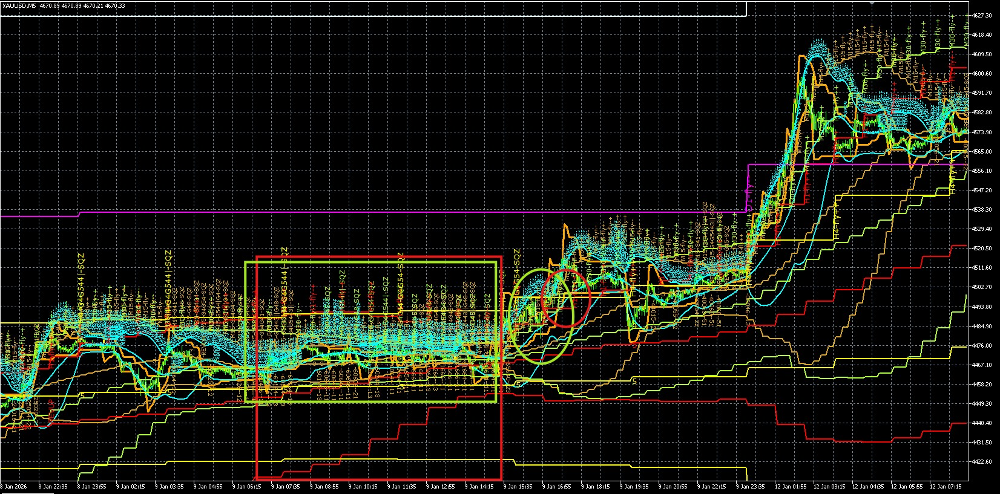
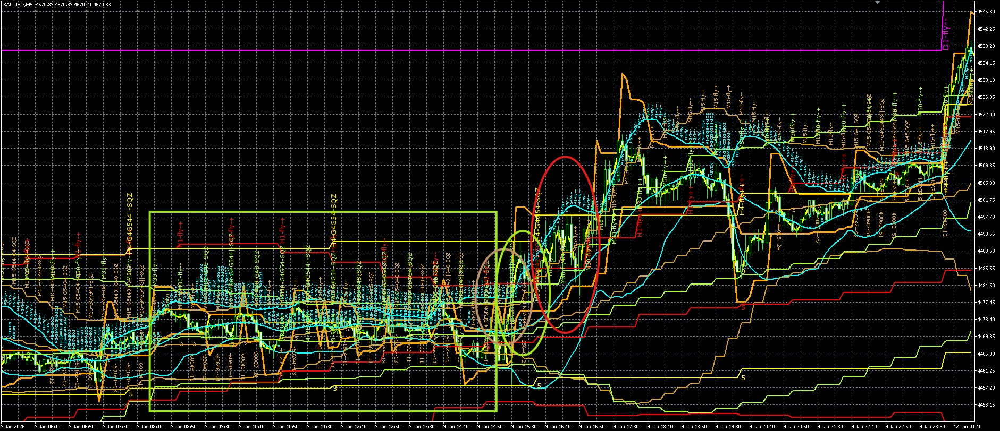

### Scenario F Identification Flowchart

```
See bands on chart → Are all TF bands collapsed to tight bundle?
                    ↓
                     No → NOT Scenario F
                    ↓
                     Yes → Stage labels showing 400-499 (SQZ)?
                           ↓
                            No → NOT full compression
                    ↓
                           Yes → Is [G6-LOAD] or [G0c-SQZLOCK] visible?
                                 ↓
                                  No → SQZ without loading label
                    ↓
                                 Yes → Is pressure building?
                                       (L or U touch counts high)
                                      ↓
                                       No → Early compression
                    ↓
                                       Yes → Is M5 band spreading first?
                                             ↓
                                              No → Still loading
                    ↓
                                              Yes → REVUP/REVDN label appears?
                                                     ↓
                                                      No → No breakout yet
                    ↓
                                                      Yes → SCENARIO F CONFIRMED
                                                             ↓
                                                            Direction from D1 (magenta):
                                                             ├──→ D1 fly BUY → BUY breakout
                                                             └──→ D1 fly SELL → SELL breakout
```

**Visual confirmation checklist:**

| Visual Cue | Present? |
|-----------|----------|
| All TF bands collapsed (tight bundle) | [ ] |
| Stage labels 400-499 | [ ] |
| [G6-LOAD] or [G0c-SQZLOCK] labels | [ ] |
| High L or U touch counts (pressure) | [ ] |
| M5 bands spreading first | [ ] |
| REVUP/REVDN label | [ ] |

**6/6 present = Confirmed Scenario F**

---

**HTF context:** D1 and H4 are about to exit SQZ — the HTF breakout pulls M30/M15/M5 along. Watch the D1 direction (magenta) for the breakout direction.

**What you see:**
- All TF bands collapsed to a tight bundle — pure SQZ state
- M5 stage labels showing 400–499; no directional labels
- Gate labels: `[G6-LOAD]` (gold) or `[G0c-SQZLOCK]` (magenta)
- **Transition:** M5 (aqua) bands begin spreading first → `REVUP` or `REVDN` label fires
- M15 follows M5 with ~2–5 bar lag; then M30, then H1

**What it means:**
- SQZ loading phase complete; momentum building from fastest TF up
- L2H chain building: M5 fly → M15 fly → M30 fly
- D1 fly direction = which way the breakout will sustain

**SQZ breakout momentum sequence:**

| Stage | Visual Cues | Action |
|-------|-------------|--------|
| Loading | Bands collapsed, [G6-LOAD] | Wait, no entry |
| Pressure building | L or U touch counts increasing | Prepare for breakout |
| M5 break | M5 spreads, REVUP/REVDN | Watch quality score |
| M15 follows | M15 spreads within 2-5 bars | Enter if quality ≥ 60 |
| M30 confirms | M30 spreads | Full entry if quality ≥ 90 |
| H1 confirms | H1 spreads | Hold with confidence |

**Entry quality scoring for breakouts:**

| Factor | Score |
|--------|-------|
| M5 SQZ break (400-499 → fly) | 75 base |
| REVUP/REVDN label | +15 |
| M30 still SQZ | -20 (pioneer) |
| M30 confirms | +25 |
| H1 confirms | +10 |
| D1 aligns with direction | +15 |

**Trade action:**
```
DURING SQZ: no entry — [G6-LOAD] confirms wait state
ENTRY: M15 SQZ break (400-499 → 511/512 or 521/522) + REVUP/REVDN → quality=75
M15 pioneer: M30 still SQZ, M15 breaks → pioneer entry 0.75×
FULL ENTRY: M30+M15 both confirm fly → 1.0×
EXIT: ATRSL trailing stop | M15 UP→FLAT (G5-FADE)
TARGET: H4 outer band (if H4 also breaking) → D1 outer band
```

---

## Scenario G — All TFs Sideway (G0 Exit)

### Scenario G Identification Flowchart

```
See bands on chart → Are mid-band labels (3,4,5) visible on M30 AND M15?
                    ↓
                     No → NOT Scenario G
                    ↓
                     Yes → Are ALL bands flat (no directional expansion)?
                           ↓
                            No → NOT all TFs sideway
                    ↓
                           Yes → Is H4 in SQZ or flat?
                                 ↓
                                  No → H4 still has direction
                    ↓
                                 Yes → Is D1 also flat?
                                       ↓
                                        No → D1 may provide direction
                    ↓
                                       Yes → Is [G0] (crimson) visible?
                                             ↓
                                              No → Not yet triggered
                    ↓
                                              Yes → SCENARIO G CONFIRMED
                                                     ↓
                                                    [G0] label type:
                                                     ├──→ [G0] → All TFs mid≥3 → EXIT ALL
                                                     └──→ [G0-HOLD] → H1 not sideway → HOLD, no new entry
```

**Visual confirmation checklist:**

| Visual Cue | Present? |
|-----------|----------|
| Mid-band labels on M30 AND M15 | [ ] |
| All bands flat (no expansion) | [ ] |
| H4 in SQZ or flat | [ ] |
| D1 also flat | [ ] |
| [G0] or [G0-HOLD] label | [ ] |

**5/5 present = Confirmed Scenario G**

---

**HTF context:** H4 SQZ or flat, D1 flat — no macro direction. Any open position must close immediately.

**What you see:**
- Mid-band labels (3, 4, 5) visible on M30 AND M15 at the same time
- All bands flat — no directional expansion
- Gate label `[G0]` (crimson) or `[G0-HOLD]` (dimgray)

**G0 exit trigger conditions:**

| Condition | Gate Label | Action |
|-----------|-----------|--------|
| M30 mid≥3 AND M15 mid≥3 AND H1 mid≥3 | [G0] (crimson) | Exit all immediately |
| M30 mid≥3 AND M15 mid≥3, H1 mid<3 | [G0-HOLD] (dimgray) | Hold, no new entry |
| M15+M30 both in 400-499 stage | [G0b-PINK] (magenta) | Exit all, no entry |

**Holding vs exiting decision:**

| TF State | Action |
|----------|--------|
| All 3 TFs (M30, M15, H1) mid≥3 | EXIT (G0) |
| M30+M15 mid≥3 but H1 mid<3 | HOLD (G0-HOLD) |
| Only M15 mid≥3 | HOLD — single TF not enough |
| Only M30 mid≥3 | HOLD — need M15 confirmation |

**Recovery criteria:**
- Wait for M30 or M15 midband to return to 1 (up) or 2 (dn)
- Confirm stage returns to fly (511/512/521/522)
- Check H4 not in SQZ — if H4 in SQZ, recovery may be delayed

**Trade action:**
```
M30 mid≥3 AND M15 mid≥3 AND H1 mid≥3  →  [G0]      act=7  exit all immediately
M30 mid≥3 AND M15 mid≥3, H1 mid<3     →  [G0-HOLD] act=0  hold existing, no new entry
Recovery: wait until M30 or M15 shows mid=1 or mid=2 again
```

---

## Scenario Summary

| Scenario | Key Identifier | Primary Action |
|----------|---------------|----------------|
| A: Normal Fly | All TFs flying same direction | Enter on M15 transition, full size |
| B: Fly → Shrink | HTF flying, LTF shrinking | Enter on LTF transition, reduce size |
| C: Cascade | HTF SQZ, band touch | Enter at band touch with filter pass |
| D: Rest Pattern | Temporary compression, then resume | Enter at SQZ break, hold through rest |
| E: Shrink → SQZ | All TFs compressing flat | Range trade, no directional trades |
| F: SQZ → Fly | Breakout from compression | Enter on SQZ break, scale up |
| G: All Sideway | M30+M15 mid≥3 | Exit all positions |

---


# PART 4 — TREND PREDICTION

`PredictNextTrend()` in `scripts/TofyTrade4.mqh` runs every bar and draws a colored label at the M30 midband. It combines two complementary tracks: an **algorithmic weighted score** and a **visual band region analysis**.

---

## Section 1 — Algorithmic Signal

### How the Score Is Built

Each TF (M15→W1) produces a directional score in **[-8, +8]** from four components:

```
score = stage_bias + mid_bias + stage_transition_bonus + mid_transition_bonus
```

| Component | Range | Rules |
|-----------|-------|-------|
| Stage bias | ±3 | 511=+3, 512=+2, 513=+1, SQZ=0, 523=-1, 521=-3, 522=-2 |
| Mid bias | ±2 | 1=+2, 5=+1, 3=0, 4=-1, 2=-2 |
| Stage transition | ±3 | SQZ→fly ±3 · fly reversal ±3 · shrink→fly ±2 · fly→shrink ±1 |
| Mid transition | ±3 | dn→up/up→dn reversal ±3 · flat→trend ±2 · fading ±1 · flat→side ±1 |

### TF Weights and Aggregation

| TF | Weight | Group |
|----|--------|-------|
| H4 | ×3 | HTF (dominant) |
| D1 | ×2 | HTF |
| W1 | ×1 | HTF |
| H1 | ×2 | MTF |
| M30 | ×2 | MTF |
| M15 | ×1 | LTF |

```
htf_total = H4×3 + D1×2 + W1×1   (max ±48)
mtf_total = H1×2 + M30×2          (max ±32)
ltf_total = M15×1                  (max ±8)
grand_total = htf + mtf + ltf      (max ±88)
```

### Direction and Confidence

| Grand total | Direction | Confidence |
|------------|-----------|------------|
| ≥ +66 | BUY | 95 |
| ≥ +44 | BUY | 80 |
| ≥ +22 | BUY | 60 |
| -22 to +22 | NEUTRAL | 25 |
| ≤ -22 | SELL | 60 |
| ≤ -44 | SELL | 80 |
| ≤ -66 | SELL | 95 |

**Reversal flag:** if `htf_total ≥ +18` AND `ltf+mtf ≤ -12` (or mirror) → `reversal=true`, confidence capped at 65. Means HTF is strongly opposing LTF+MTF direction.

### Confidence Level Trading Guidelines

| Confidence | Action | Position Size |
|------------|--------|---------------|
| 95 | Full conviction entry | 1.0× |
| 80 | Strong entry | 0.75-1.0× |
| 60 | Moderate entry | 0.5-0.75× |
| 25 | No new entry, hold existing | N/A |
| <25 | Consider exiting | Reduce/exit |

### Reversal Flag Interpretation

**When reversal flag is true (R:):**
- HTF strongly opposes LTF+MTF direction
- Counter-trend opportunity — smaller size (0.5×)
- Higher risk — wait for additional confirmation
- Confidence capped at 65%

**Example scenarios:**
```
R:BUY:65 → HTF bearish, LTF+MTF turning bullish → counter-trend buy
R:SELL:65 → HTF bullish, LTF+MTF turning bearish → counter-trend sell
```

---

## Section 2 — Visual Band Region Analysis

Uses `BB_diffMid_Trend[]` over the last 5 bars per TF as a proxy for price's recent position relative to bands.

| BB_diffMid_Trend value | Region | What it means |
|----------------------|--------|---------------|
| 1 (uptrend) | Upper | Price above midband, likely near upper band |
| 2 (downtrend) | Lower | Price below midband, likely near lower band |
| 3 / 4 / 5 | Mid | Price oscillating around midband |

The `tch:` field in the log counts how many of the last 5 bars were in each region:

```
tch:M15=U2/M1/L2   → M15 spent 2 bars upper, 1 bar mid, 2 bars lower (balanced oscillation)
tch:M30=U0/M2/L3   → M30 spent 3 bars lower (bearish pressure, building lower support)
tch:H1=U1/M0/L4    → H1 mostly lower (strong bearish phase or approaching lower band)
tch:H4=U0/M3/L2    → H4 oscillating at mid with some lower pressure (SQZ/shrink)
```

### Reading Touch Counts on the Chart

When reviewing annotated chart images:
- **White circles at bottom** = lower-band touches (L count high for that TF)
- **Yellow ovals near midline** = midband touches (M count high)
- **Circles near top** = upper-band touches (U count high)

### What Touch Count Patterns Tell You

| Pattern | Interpretation |
|---------|---------------|
| L high + mid now transitioning up (3→1) | Price bounced off lower band repeatedly → support building → breakout up likely |
| U high + mid now transitioning down (1→3 or 1→2) | Price rejected at upper band repeatedly → resistance → breakout down likely |
| M high + SQZ stage | Price oscillating at midband → loading zone before directional break |
| L high + U high alternating | Price ranging between bands (H4 shrink zone) |
| L high + mid=2 stable | Downtrend with lower band as magnet |

---

## Section 3 — Reading the Chart Label

**Label format:** `[PRED:{R:}{direction}:{confidence}]`

| Label example | Color | Meaning |
|--------------|-------|---------|
| `[PRED:BUY:80]` | Lime | Continuation BUY — HTF+MTF+LTF broadly aligned bullish |
| `[PRED:BUY:95]` | Lime | Strong continuation BUY — all TFs strongly bullish |
| `[PRED:R:BUY:65]` | Aqua | Reversal BUY — HTF bearish, LTF+MTF turning bullish (counter-trend) |
| `[PRED:SELL:80]` | OrangeRed | Continuation SELL |
| `[PRED:R:SELL:65]` | Orange | Reversal SELL — HTF bullish, LTF+MTF turning bearish |
| `[PRED:NEUTRAL:25]` | DimGray | No dominant direction — grand total within ±22 |

**Full log line structure:**
```
[PRED] BUY conf:80 htf:24 mtf:16 ltf:3 tot:43
nxt:M15=fly_up M30=fly_up H1=fly_up H4=sqz_wait
tch:M15=U2/M1/L2 M30=U1/M2/L2 H1=U0/M1/L4 H4=U0/M2/L3
```

---

## Section 4 — Conclude: Next/Wait Format

### `nxt:` — Per-TF Next-Stage Labels

`PredictTFNextStage()` maps current stage+mid+transition to a label for each TF:

| Label | Meaning | When it appears |
|-------|---------|-----------------|
| `fly_up_cont` | Fly BUY continuing | stage=511/512, mid=1 stable |
| `fly_dn_cont` | Fly SELL continuing | stage=521/522, mid=2 stable |
| `fly_up_resume` | Shrink resolved — fly BUY resuming | stage=513, mid=1 or 5 |
| `fly_dn_resume` | Shrink resolved — fly SELL resuming | stage=523, mid=2 or 4 |
| `fly_up` | SQZ breakout upward | stage=SQZ, mid=1/5 or transitioning up |
| `fly_dn` | SQZ breakout downward | stage=SQZ, mid=2/4 or transitioning down |
| `sqz_wait` | SQZ with no directional signal | stage=SQZ, mid=3 stable |
| `shrink_watch` | Fly weakening — watch for reversal | fly→shrink stage, mid fading |
| `reversal_forming` | Stage and mid opposing | fly or shrink with mid contradicting |
| `sideway` | No clear next state | other combinations |

### Reading the Full Conclude Output

```
SCORE  → direction + confidence + reversal flag
NEXT   → nxt: per-TF stage label (what this TF is heading toward)
TOUCH  → tch: U/M/L counts (where price has been in each TF's bands)
```

**Conclude interpretation pattern:**
```
nxt:M15=fly_up M30=fly_up H1=fly_up H4=sqz_wait
→ M15/M30/H1 are all building toward fly up
→ H4 is in SQZ (no macro target yet, but not blocking)
→ OVERALL: M15/M30/H1 fly up until they touch H4 upper band

tch:M15=U0/M1/L4 M30=U0/M2/L3 H1=U0/M1/L4 H4=U0/M2/L3
→ All TFs have been spending time in the lower region
→ Lower band has been tested repeatedly across multiple TFs
→ Support building at lower bands → bounce/reversal signal confirming fly_up prediction
```

**Wait condition** = any TF showing `sqz_wait` in `nxt:` → that TF needs to break SQZ before it can contribute macro tailwind.

---

## Section 5 — Worked Example (8-JAN 14:15, Left Yellow Rectangle)

**Reference image:** `references/Backtest_data/extras/backtested_EA_predict_trend_1.jpg`

- Yellow rectangles = compression zones (SQZ/shrink)
- White circles at bottom = lower-band touches (L count high)
- Yellow ovals near midline = midband touches (M count)

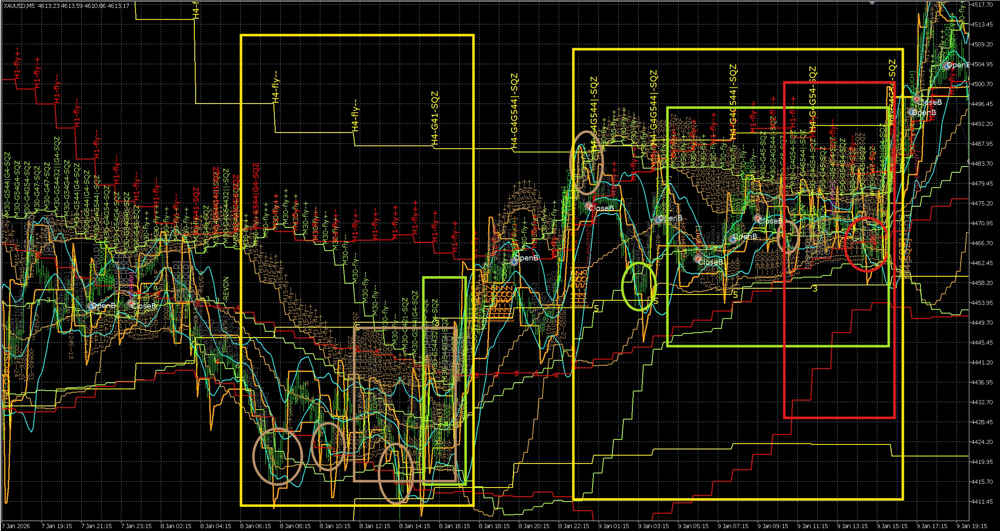

**State table at 8-JAN 14:15:**

| TF | prev_stage | prev_mid | cur_stage | cur_mid | tch (last 5 bars) | nxt label | score |
|----|-----------|----------|-----------|---------|-------------------|-----------|-------|
| H4 | shrink | up | squeeze | sideway_up | U0/M2/L3 | `sqz_wait` (mid=5, not yet committed) | ~0 |
| H1 | fly_parallel | dn | fly_expand | sideway_dn | U1/M1/L3 | `fly_dn_cont` or `reversal_forming` | ~ -2 |
| M30 | shrink | dn | squeeze | dn | U0/M2/L3 | `fly_dn` if mid stays dn, else `sqz_wait` | ~ -4 |
| M15 | shrink | dn | sideway | sideway_dn | U2/M2/L1 | `sqz_wait` → `fly_up` (U touches show upper tests) | ~ +2 |

**Algorithmic output at this bar:**
```
[PRED] NEUTRAL conf:25 htf:-8 mtf:-12 ltf:2 tot:-18
nxt:M15=sqz_wait M30=fly_dn H1=fly_dn_cont H4=sqz_wait
tch:M15=U2/M2/L1 M30=U0/M2/L3 H1=U1/M1/L3 H4=U0/M2/L3
```

Score is near NEUTRAL (-18 is just below the -22 SELL threshold) — correctly cautious because H4 is in SQZ (no macro target) and M15 upper touches (U2) suggest M15 is not yet committed downward.

**What happened next (right yellow rectangle → right side of image):**

M15 broke upward (SQZ→fly), M30 and H1 followed → fly_up confirmed → price traveled to H4 upper band exactly as the cascade rule predicts. The prediction's `sqz_wait` on H4 correctly flagged that H4 was not yet providing macro direction — the fly ran until it hit H4's upper band.

**Key reading:** Even when the SCORE says NEUTRAL, the `nxt:` and `tch:` fields reveal the setup: multiple TFs showing `sqz_wait` + lower-band pressure (`L3` in M30/H1/H4) + M15 showing upper tests (`U2`) = compression is about to resolve upward.

---

## Section 6 — Worked Example (9-JAN 01:15, Asian Session — Compression Hold)

**Reference image:** `references/Backtest_data/extras/backtested_EA_predict_trend_1.jpg`

At 9-JAN 01:15 (Asian session), price is inside the second yellow rectangle. H4 has weakened from fly into shrink but holds a bullish mid. H1 has just entered SQZ after breaking down from fly_up — visible as heavy lower-band pressure (`L4`). M30 and M15 are both in SQZ with no committed direction yet.

**State table at 9-JAN 01:15:**

| TF | prev_stage | prev_mid | cur_stage | cur_mid | tch (last 5 bars) | nxt label | score |
|----|-----------|----------|-----------|---------|-------------------|-----------|-------|
| H4 | fly_parallel (512) | up | shrink (513) | sideway_up | U0/M3/L2 | `fly_up_resume` (shrink_bull, mid=5 — H4 holding bullish bias) | +1 |
| H1 | fly_expand (511) | up | squeeze | dn | U0/M1/L4 | `fly_dn` (SQZ mid=2 — H1 broke down from fly, bearish pressure) | −5 |
| M30 | squeeze | dn | squeeze | flat | U0/M2/L3 | `sqz_wait` (SQZ mid=3 — no direction committed yet) | +1 |
| M15 | squeeze | flat | squeeze | sideway_up | U1/M2/L2 | `fly_up` (SQZ mid=5 — early bullish pressure building at M15) | +2 |

**Score computation:**

```
H4:  stg=+1 (513) + mid_b=+1 (5) + stg_t=−1 (fly_up→shrink) + mid_t=0  (1→5 not in table) = +1
D1:  stg=+2 (512) + mid_b=+2 (1) + stg_t=0                   + mid_t=0                     = +4  [stable fly up]
W1:  stg=+3 (511) + mid_b=+2 (1) + stg_t=0                   + mid_t=0                     = +5  [long-term bullish]
H1:  stg=0  (SQZ) + mid_b=−2 (2) + stg_t=0  (fly→SQZ: no bonus) + mid_t=−3 (up→dn reversal) = −5
M30: stg=0  (SQZ) + mid_b=0  (3) + stg_t=0                   + mid_t=+1 (dn fading to flat) = +1
M15: stg=0  (SQZ) + mid_b=+1 (5) + stg_t=0                   + mid_t=+1 (flat→side-up)      = +2

htf = H4(+1)×3 + D1(+4)×2 + W1(+5)×1 =   3 +  8 +  5 = +16
mtf = H1(−5)×2 + M30(+1)×2            = −10 +  2      =  −8
ltf = M15(+2)×1                                        =  +2
tot = +16 + (−8) + 2 = +10
```

**Algorithmic output:**
```
[PRED] NEUTRAL conf:25 htf:16 mtf:-8 ltf:2 tot:10
nxt:M15=fly_up M30=sqz_wait H1=fly_dn H4=fly_up_resume
tch:M15=U1/M2/L2 M30=U0/M2/L3 H1=U0/M1/L4 H4=U0/M3/L2
```

No reversal flag: `htf=16` is just below the ≥18 threshold even though `ltf+mtf=−6`.

**Trade impact at 9-JAN 01:15:**
- **No new entry**: NEUTRAL — neither G6-BUY nor G6-SELL trigger. M15 FLAT→UP (fly_up nxt) is not yet confirmed by a score crossing ±22.
- **Open BUY position (if carried from 8-JAN recovery)**: HOLD. H4=`fly_up_resume` means the HTF thesis is intact — do not exit. H1=`fly_dn` warns that H1 is under bearish pressure (L4 touch count), so the position is likely drawing down. G0 evaluation applies (M30+M15 sideway context) but does not trigger an exit here because H1 is not providing directional confirmation for a close.
- **No SELL entry**: H4 remains bullish (`fly_up_resume`) and M15 shows early bullish signal (`fly_up`). SELL gates are blocked.
- **Watch signal**: If the next bar H1 mid transitions further (2 stays 2) AND M30 confirms dn, tot could drop below −22 → SELL signal fires → G6-REV would close any open BUY via reversal gate.

**What happened next:** Between 01:15 and 09:15 European session open, M30 resolved its SQZ upward (mid=3→1), and H1 simultaneously reversed its bearish mid (mid=2→1 via SQZ breakout up). This single structural flip shifted `mtf` from −8 to +32 in one bar.

---

## Section 7 — Worked Example (9-JAN 09:15, European Session — SQZ Breakout Buy Entry)

At 9-JAN 09:15, the second yellow rectangle has resolved. M30 and H1 simultaneously broke their SQZ upward on the European open bar — the compressed bands expanded, generating maximum transition bonuses in both `stg_t` and `mid_t`.

**State table at 9-JAN 09:15:**

| TF | prev_stage | prev_mid | cur_stage | cur_mid | tch (last 5 bars) | nxt label | score |
|----|-----------|----------|-----------|---------|-------------------|-----------|-------|
| H4 | shrink (513) | sideway_up | fly_expand (511) | up | U1/M4/L0 | `fly_up_cont` (shrink→fly resumed, mid=1 stable) | +7 |
| H1 | squeeze | dn | fly_expand (511) | up | U1/M1/L3 | `fly_up_cont` (SQZ→fly, dn→up reversal — maximum score) | +8 (capped) |
| M30 | squeeze | flat | fly_expand (511) | up | U1/M2/L2 | `fly_up_cont` (SQZ→fly, flat→up) | +8 (capped) |
| M15 | squeeze | flat | fly_expand (511) | up | U1/M4/L0 | `fly_up_cont` (SQZ→fly, flat→up — entry trigger bar) | +8 (capped) |

**Score computation:**

```
H4:  stg=+3 (511) + mid_b=+2 (1) + stg_t=+2 (shrink→fly UP) + mid_t=0  (5→1 not in table) = +7
D1:  stg=+3 (511) + mid_b=+2 (1) + stg_t=0                   + mid_t=0                     = +5  [stable fly up]
W1:  stg=+3 (511) + mid_b=+2 (1) + stg_t=0                   + mid_t=0                     = +5  [long-term bullish]
H1:  stg=+3 (511) + mid_b=+2 (1) + stg_t=+3 (SQZ→fly UP)    + mid_t=+3 (dn→up reversal)  = +11 → capped +8
M30: stg=+3 (511) + mid_b=+2 (1) + stg_t=+3 (SQZ→fly UP)    + mid_t=+2 (flat→uptrend)    = +10 → capped +8
M15: stg=+3 (511) + mid_b=+2 (1) + stg_t=+3 (SQZ→fly UP)    + mid_t=+2 (flat→uptrend)    = +10 → capped +8

htf = H4(+7)×3 + D1(+5)×2 + W1(+5)×1 =  21 + 10 +  5 = +36
mtf = H1(+8)×2 + M30(+8)×2            =  16 + 16      = +32
ltf = M15(+8)×1                                        =  +8
tot = 36 + 32 + 8 = +76
```

**Algorithmic output:**
```
[PRED] BUY conf:95 htf:36 mtf:32 ltf:8 tot:76
nxt:M15=fly_up_cont M30=fly_up_cont H1=fly_up_cont H4=fly_up_cont
tch:M15=U1/M4/L0 M30=U1/M2/L2 H1=U1/M1/L3 H4=U1/M4/L0
```

No reversal flag: `htf=+36` and `ltf+mtf=+40` are in the same direction.

**Trade impact at 9-JAN 09:15:**
- **New BUY entry fires**: M15 mid transition flat→up (mid=3→1) is the G1 trigger. All gates downstream evaluate on this bar.
- **Position size**: M15/M30/H1/H4 all show `fly_up_cont` — 4 TFs aligned BUY = ≥3 TF agreement → 1.0× baseLot. M15 SQZ→fly transition score = +8 (raw before cap) → quality ≥ 90 → 1.0× quality multiplier. Full-size BUY entry.
- **Price target**: M15 fly→H1 outer band first, then H4 outer band (macro cascade target per Part 1 cascade rule). H4 now in fly_up means D1 outer band is the ultimate target.
- **Open BUY from 8-JAN**: Continue to hold — no close signal. The drawdown period during the 01:15 NEUTRAL phase was a compression inside the compression zone; the fly resumes from the same HTF thesis.
- **Chart label**: Lime `[PRED:BUY:95]` drawn at M30 midband on this bar.

**Key reading:** The 8-hour contrast between NEUTRAL (+10) at 01:15 and BUY conf:95 (+76) at 09:15 comes down to one structural event: H1 and M30 both resolving SQZ upward simultaneously on the European open bar. H1 alone swings from −5 to +8 (a shift of +13), weighted ×2 = +26 to `mtf`. The `nxt:` labels at 01:15 (`M15=fly_up`, `H4=fly_up_resume`) were already pointing at the eventual direction — they just needed H1 and M30 to stop contradicting. Once those resolved, the score crossed the 66 threshold in a single bar, generating the highest confidence level (95).

The H1 `tch` pattern shows the mechanism: at 01:15 H1 was `U0/M1/L4` (4 bars in lower region); by 09:15 it's `U1/M1/L3` — one bar flipped from lower to upper. That one flip, amplified by the stage and mid transition bonuses, is what drives the BUY conf:95 signal.

---

# PART 5 — TRADE DECISION QUICK REFERENCE

First establish HTF context (Part 2), then apply this table:

## HTF Context → MTF Trade Quality

| W1 | D1 | H4 | MTF Trade Quality | MTF Target |
|----|----|----|-------------------|------------|
| 511/512 BUY | 511/512 BUY | 511/512 BUY | Full quality 1.0× — hold longs | H4 outer → D1 outer |
| 511/512 BUY | 511/512 BUY | 513 shrink | Reduced quality 0.75× — shorter BUY | H4 outer band boundary |
| 511/512 BUY | 511/512 BUY | 400-499 SQZ | Weak — G0b cascade only; require M5 confirm | H4 band range |
| 511/512 BUY | 521/522 SELL | Any | Counter-trend — smaller size, fast exit | D1 pullback target |
| Any | Any | 521/522 SELL | SELL backed by H4 | H4 lower band |
| 400-499 | 400-499 | 400-499 | No trade — full macro SQZ | Wait for breakout |

## Scenario → Action Table

| What you see | Scenario | Action | Gate | Size |
|---|---|---|---|---|
| H1+M30+M15 all 511/512, mid=1 | Normal fly BUY | Enter on M15 FLAT→UP | G6-BUY | 1.0× |
| H1+M30+M15 all 521/522, mid=2 | Normal fly SELL | Enter on M15 FLAT→DN | G6-SELL | 1.0× |
| H1/M30 in fly, M15/M5 shrinking | Fly→Shrink BUY/SELL | Enter on M15 FLAT→UP/DN | G6-BUY/SELL | 0.75× |
| Only M5 shrinking, M15 still fly | M5 noise | **Wait** — not yet | — | — |
| H1+M30 SQZ, M15/M5 shrink, band touch | Cascade | Enter at outer band touch | G0b-TOUCH | Quality |
| M15+M30 both SQZ | Pink zone | **Exit all** | G0b-PINK | — |
| M15 fading (UP→FLAT or DN→FLAT) | Fade | Exit open position | G5-FADE | — |
| All TFs SQZ | Full lock | **Wait** for breakout | G0c/G6-LOAD | — |
| M15 breaks SQZ → REVUP/REVDN | Breakout | Enter quality=75 | G6-ENTRY | 0.5-1.0× |
| M30 mid≥3 AND M15 mid≥3, H1 trending | Near-G0 | Hold, no new entry | G0-HOLD | — |
| M30 mid≥3 AND M15 mid≥3, H1 sideway | G0 | **Exit all** | G0 | — |
| H4 fly opposing direction | H4 filter | Block | H4-OPPOSE | — |
| Float loss < −$50 | Emergency | Exit immediately | G0e-MAXLOSS | — |
| Price touches outer band of lowest fly TF (all below compressed) | Cascade target hit | Exit (auto) | G8-BNDTGT | — |

## Comprehensive Entry Block Gate Reference

| Gate | Block Condition | Color | Resolution |
|------|----------------|-------|------------|
| H4-OPPOSE | H4 fly opposing entry direction | DarkOrange | Wait for H4 to align |
| H4-SQZ | H4 in SQZ with no conviction | DarkOrange | Wait for H4 breakout |
| G0b-H4OPP | H4 fly/shrink opposing entry | DarkOrange | H4 mid must align with entry |
| G0b-M30OPP | M30 fly/shrink/SQZ with opposing mid | DarkMagenta | M30 mid must align |
| G4e-H4OPP | H4 in shrink with flat mid (sideway) | Orange | Wait for H4 to exit shrink |
| G4c-M15OPP | M15 fly/shrink/SQZ with opposing mid | Orange | M15 mid must align |
| G4f-M30OPP | M30 fly/shrink/SQZ with opposing mid | Orange | M30 mid must align |
| G0b-SQZLOCK | H1+M30 both SQZ, both mid==3 | Magenta | At least one TF must break SQZ |
| G0b-H1SQZDN | H1-SQZ with mid=2/4 vs BUY, or mid=5 vs SELL | Magenta | H1 mid must align with entry |
| G0b-M5OPP | M5 sole trigger + M5 shrink with opposing mid | Magenta | M5 mid must align |
| G0b-M5FLY | M5 in committed opposing fly | Magenta | Wait for M5 to align |

## Cascading Price Targets

When TFs compress bottom-up, price gravitates to the outer band of the **lowest TF still in fly**.

| Lowest TF still in fly | WHY it is lowest | Price target | Exit |
|---|---|---|---|
| H4 (M30/M15/M5/H1 all below) | D1 fly still providing H4 target | D1 outer band | D1 starts shrinking |
| H1 (M30/M15/M5 compressed) | H4 shrink forcing H1 range | H4 outer band | G0-HOLD or G8-BNDTGT |
| M30 (M15+M5 compressed) | H1 shrink forcing M30 range | H1 outer band | G8-BNDTGT |
| M15 (M5 compressed) | M30 shrink forcing M15 range | M30 outer band | G8-BNDTGT |
| M5 only fly | M15+ still fly — M5 is noise | Not applicable | Wait for M15 to confirm |
| All sideway | H4 SQZ — no macro target | None | G0 → exit all |

**Rules:**
1. Only M5 sideway → wait; M5 alone is noise within M30/H1 fly
2. Target = outer band of lowest still-flying TF (upper for BUY, lower for SELL)
3. HTF is why lower TF goes sideway: H4 SQZ → M30 flat; H4 shrink → M30 ranges within H4 band
4. G8-BNDTGT fires automatically at target band touch when all lower TFs are compressed

---

# PART 6 — ANALYSIS WORKFLOW

Apply these steps in order for any attached chart image.

**Step 1 — HTF first: W1 → D1 → H4**
- W1 direction? (fly BUY/SELL / shrink / SQZ)
- D1 direction? Same as W1 = aligned; opposite = counter-trend
- H4 stage? → determines M30 trade target and duration
- What is the current HTF price target for M30 trades?

**Step 2 — Identify each band**
Map colors to TFs (Section 2). Which bands are wide (fly) vs narrow (shrink/SQZ)?

**Step 3 — Build regime table**
```
W1: ___ | D1: ___ | H4: ___ | H1: ___ | M30: ___ | M15: ___ | M5: ___
```

**Step 4 — Read middle band labels**
Note values 3/4/5 and REVUP/REVDN flags. Flat labels = that TF is ranging. Ask: which HTF is causing this lower TF to be flat?

**Step 5 — Read ATRSL state**
dir=0 (orange below price) = uptrend stop. dir=1 (orange above) = downtrend stop.

**Step 6 — Read gate labels**
List visible tags with bar position. Match color to meaning (Part 1 Section 6).

**Step 7 — Match scenario**
Using regime table from Step 3:
- All mid TFs fly same direction → Scenario A
- HTF fly, inner TFs shrinking → Scenario B
- HTF SQZ, inner TFs shrinking, band touch → Scenario C
- HTF fly, inner TFs rest then resume → Scenario D
- All TFs compressing / ranging → Scenario E
- All TFs SQZ, about to break → Scenario F
- M30+M15 mid both ≥ 3 → Scenario G

**Step 8 — Apply trade decision**
Use Part 4 tables. State: current regime, price target, which gate fires next, open position status.

---

---

# PART 7 — COMMON MISREADS

| Misread | Correct interpretation |
|---------|----------------------|
| "M30 is sideway for no reason" | Check H4 — if H4 is SQZ/shrink, that is WHY M30 is flat. M30 range = H4 band range |
| "Trade stopped at random level" | Check if that level is H4 outer band or D1 outer band — it is a cascade price target |
| Brief M5 SQZ during H1 fly | Noise — M30 midtrend is still primary; do not exit |
| Both H4 and W1 look yellow | H4 is saturated yellow and narrower; W1 is pale near-white cyan and the widest band |
| No mid label visible | BB_diffMid_Trend is 1 or 2 (trending) — labels suppressed; check upper label direction |
| REVUP/REVDN label | Midtrend flipped THIS bar — transition event, not stable state yet |
| DimGray gate label near trade | Block gate fired — trade was NOT taken at this bar |
| DarkOrange gate label | H4 macro filter blocked (H4-OPPOSE/H4-SQZ/G0b-H4OPP) |
| Fly→Shrink vs Fly→Reversal | Check H1/H4: maintain step direction → rest pattern (D); break step → reversal |
| M5 sideway during HTF fly | M5 noise — wait for M15 to also shrink before entering |
| Cascade BUY with M5 in 521/522 | G0b-M5FLY blocks this — M5 committed opposing fly contradicts cascade direction |
| "Why did BUY stop here?" | Price hit H4 outer band during H4 shrink — G8-BNDTGT fired as expected cascade target |

---

## 13. Document Update Summary

**Enhancements completed through comprehensive image analysis:**

### Part 1 — Chart Basics (New Sections Added)

| Section | Content |
|---------|---------|
| 7 | Visual Entry Trigger Identification |
| 8 | Compression Zone Identification |
| 9 | Compression Resolution — Reversal vs Continuation |
| 10 | Block Gate Reference Table |
| 11 | Position Sizing Matrix |
| 12 | Risk Management Guidelines |
| 6 | Gate Label Color Reference (completed - was empty) |

### Part 2 — HTF Analysis (Enhancements)

| Addition | Description |
|----------|-------------|
| HTF Compression Cascade Dynamics | Top-down cascade principle, compression confinement mechanics |
| H4 shrink confinement pattern | Pink rectangle pattern explanation |
| D1 band boundary rule | Ceiling concept for H4 BUY trades |
| Scenario Identification Flowchart | Visual decision tree for scenario matching |
| HTF Compression Zone Analysis | Building phase, peak compression, release, confirmation |
| Compression duration guidelines | Typical compression times per timeframe |

### Part 3 — MTF/LTF Scenarios (Enhancements)

| Scenario | Enhancements |
|----------|-------------|
| A: Normal Fly | Visual identification checklist, holding vs exiting decision table |
| B: Fly → Shrink | Shrink depth measurement, optimal entry timing |
| C: Cascade | Band touch point identification, filter evaluation sequence |
| D: Rest Pattern | Rest vs reversal identification checklist |
| E: Shrink → SQZ | Range trade rules, compression threshold |
| F: SQZ → Fly | SQZ breakout momentum sequence, entry quality scoring |
| G: All TFs Sideway | G0 exit trigger conditions, holding vs exiting decision, recovery criteria |
| All | Scenario Summary table |

### Part 4 — Trend Prediction (Enhancements)

| Addition | Description |
|----------|-------------|
| Confidence Level Guidelines | Trading guidelines per confidence threshold |
| Reversal Flag Interpretation | Counter-trend opportunity guidance |

### Part 5 — Trade Decision (Enhancements)

| Addition | Description |
|----------|-------------|
| Size column | Position size guidance added to action table |
| Comprehensive Block Gate Table | All blocking conditions with colors and resolution |
