# Backtest Chart Analysis — BB MTF Strategy

**Note:** Scenarios V and R are currently **discarded from trade-action candidates** (D1-scale, rare, slow, OOS-unvalidated). Retained as reference. See the status callouts in their sections. Fast-timeframe scenarios (F identification, S, B) remain the active trade-action candidates.

Visual interpretation guide for Tofu EA backtest chart screenshots.
**Always analyze top-down: W1 → D1 → H4 → M30 -> M15.**
Higher TFs determine where lower TF trades travel to, and why lower TFs go sideway.

Work through: **Part 1** (read the chart) → **Part 2** (HTF context) → **Part 3** (MTF/LTF scenario) → **Part 4** (next-stage direction).

---

## Quick Navigation

| Looking for... | Go to... |
|----------------|----------|
| **HOW TO TRADE** | |
| How to Trade — Summary | [How to Trade — Summary](#how-to-trade--summary) |
| **PART 1 — CHART BASICS** | |
| Chart Layers | [Chart Layers](#1-chart-layers) |
| BB Color Reference | [BB Color Reference](#2-bollinger-band-color-reference) |
| Upper Band Labels | [Upper Band Labels](#3-upper-band-labels--bbw_stage-codes) |
| Middle Band Labels | [Middle Band Labels](#4-middle-band-labels--bb_diffmid_trend) |
| diffBBW | [diffBBW](#4b-bbw-velocity--diffbbw) |
| ATRSL | [ATRSL](#5-atrsl-state) |
| Gate label colors | [Gate Label Colors](#6-gate-label-colors) |
| Entry triggers | [Entry Trigger Identification](#7-visual-entry-trigger-identification) |
| Compression zones | [Compression Zone Identification](#8-compression-zone-identification) |
| Compression → reversal or continuation | [Compression Resolution](#9-compression-resolution--reversal-vs-continuation) |
| Block gates | [Block Gate Reference Table](#10-block-gate-reference-table) |
| Position sizing | [Position Sizing Matrix](#11-position-sizing-matrix) |
| Cascade direction model | [Cascade Direction Model](#12-cascade-direction-model) |
| Touch classification | [Touch Type Classification](#touch-type-classification) |
| TRADEINFO chain flags | [TRADEINFO Chain Flags](#12b-tradeinfo-chain-flags--cascade-direction-observable) |
| BBTFImpact pressure indicators | [BBTFImpact Flags](#12c-bbtfimpact-flags--cascade-pressure-indicators) |
| Cascade state decoder | [Cascade State Decoder](#12d-cascade-state-decoder--cas_shrinktf-and-cas_sqzcount) |
| Candlestick Behavior | [Candlestick Behavior](#13-candlestick-behavior-during-fly--shrink--sqz-transition) |
| Risk Management | [Risk Management](#14-risk-management-guidelines) |
| **PART 2 — HTF REFERENCE** | |
| W1 context | [W1 — Ultra-Macro Context](#w1--ultra-macro-context) |
| D1 context | [D1 — Daily Macro](#d1--daily-macro) |
| H4 context | [H4 — Macro Bias Filter](#h4--macro-bias-filter) |
| HTF → MTF cascade rule | [HTF → MTF Cascade Rule](#the-core-htf--mtf-cascade-rule) |
| HTF step-by-step | [HTF Analysis Step-by-Step](#htf-analysis-step-by-step) |
| Scenario matching flowchart | [Scenario Identification Flowchart](#scenario-identification-flowchart) |
| **PART 3 — SCENARIOS** | |
| Scenarios overview (Tier 1/2/3) | Tier 1 ([F](#scenario-f--full-fly-alignment)) / Tier 2 ([S](#scenario-s--fly--shrink-inner-tfs-contracting), [C](#scenario-c--deep-compression), [V](#scenario-v--direction-pivot-formerly-scenario-h)) / Tier 3 ([P](#scenario-p--rest-recovery), [B](#scenario-b--compression-release), [R](#scenario-r--trend-reversal-consolidated-under-scenario-v)) |
| Scenario F (Full Fly) | [Scenario F](#scenario-f--full-fly-alignment) |
| Scenario S (Shrink) | [Scenario S](#scenario-s--fly--shrink-inner-tfs-contracting) |
| Scenario C (Deep Compression) | [Scenario C](#scenario-c--deep-compression) |
| Scenario V (Direction Pivot) | [Scenario V](#scenario-v--direction-pivot-formerly-scenario-h) |
| Scenario P (Rest Recovery) | [Scenario P](#scenario-p--rest-recovery) |
| Scenario B (Compression Release) | [Scenario B](#scenario-b--compression-release) |
| Scenario R (Trend Reversal) | [Scenario R](#scenario-r--trend-reversal-consolidated-under-scenario-v) |
| Scenario cycle sequence | [Cycle sequence (top of Part 3)](#part-3--middle-and-lower-timeframe-scenario-analysis) |
| **PART 4 — TREND PREDICTION** | |
| Trend prediction overview | [Trend Prediction](#part-4--trend-prediction) |
| Rule 1 — Direction | [Rule 1](#rule-1--direction-prediction) |
| Rule 2 — Target | [Rule 2](#rule-2--target-prediction) |
| Rule 3 — Timeline | [Rule 3](#rule-3--timeline-prediction) |
| Rule 4 — Next Scenario | [Rule 4](#rule-4--next-scenario-prediction) |
| Rule 5 — Confidence | [Rule 5](#rule-5--confidence-matrix) |
| **PART 5 — TRADE ACTION** | |
| Trade action overview | [Trade Action](#part-5--trade-action-via-trend-prediction) |
| Entry conditions | [Entry Conditions](#entry-conditions) |
| Exit conditions | [Exit Conditions](#exit-conditions) |
| Block conditions | [Block Conditions](#block-conditions-no-entry-allowed) |
| Size matrix | [Size Matrix](#size-matrix) |
| Stop loss | [Stop Loss Placement](#stop-loss-placement) |
| Decision table | [Trade Action Decision Table](#trade-action-by-scenario--complete-decision-table) |
| Gate decoder | [Gate Decoder](#gate-decoder--ea-implementation-reference) |
| **PART 6 — ANALYSIS WORKFLOW** | |
| Analysis workflow overview | [Analysis Workflow](#part-6--analysis-workflow) |
| Step 1 — Read Chart Variables | [Step 1](#step-1--read-chart-variables-part-1) |
| Step 2 — CHECK HTF | [Step 2](#step-2--check-htf-part-2) |
| Step 2b — MTF Container Check | [Step 2b](#step-2b--mtf-container-check-h1-m30) |
| Step 3 — Identify Scenario | [Step 3](#step-3--identify-scenario-part-3) |
| Step 4 — Identify Phase | [Step 4](#step-4--identify-phase-section-13) |
| Step 5 — Predict | [Step 5](#step-5--predict-part-4) |
| Step 6 — Act | [Step 6](#step-6--act-part-5) |
| **PART 7 — COMMON MISREADS** | |
| Common misreads | [Common Misreads](#part-7--common-misreads) |

---

## How to Trade — Summary

### Step 1: Read HTF (W1 → D1 → H4) first
- **W1 fly BUY + D1 fly BUY + H4 fly BUY** → full tailwind. M30 BUY trades ride toward H4 outer band then D1 outer band. Hold through brief M5/M15 squeezes.
- **H4 shrink (513/523)** → M30 is ranging inside H4's band. Take short trades only. Exit when price touches H4 outer band (G8-BNDTGT fires automatically).
- **H4 SQZ (400-499)** → no macro target. Only cascade band-touch entries (G0b path) are valid. M5 must confirm direction.
- **H4 opposing direction** → G4e-H4OPP or H4-OPPOSE blocks entry. Do not fight H4.

### Step 2: Identify your scenario
| MTF state | Action |
|-----------|--------|
| M30+M15 both fly, same direction | Enter on M15 FLAT→UP or FLAT→DN transition |
| M30 fly, M15 shrinking | Shrink path entry — M15 transition is the trigger |
| Only M5 shrinking | **Ignore** — M5 is noise; not used as trigger (V30.02+) |
| H1/M30 SQZ, price at outer band | Cascade entry (G0b-TOUCH) if all filters pass |
| M15+M30 both SQZ | **No entry** — G0b-PINK exits all open positions |
| M30 mid≥3 AND M15 mid≥3 | **No new entries** — G0 or G0-HOLD depending on H1 *(HISTORICAL — visible on old EA charts; G0/G0-HOLD deleted in v31)* |

### Step 3: Entry trigger — M15 transition (V30.02+)
The entry signal is a **BBMidTrend change on M15** (EA runs on M5 chart, fires on M15 bar close):
- `FLAT(3) → UP(1)` or `FLAT(3) → DN(2)` → base quality 80
- `UP(1) → DN(2)` or `DN(2) → UP(1)` (reversal) → base quality 80
- M30 confirming fly stage (511/512 for BUY, 521/522 for SELL) → +10 to +15 quality boost
- Without M30 confirm on FLAT→UP/DN, quality capped at 59 (blocked by G5-WEAK)
- Quality ≥ 90 → 1.0× size | ≥ 75 → 0.75× | ≥ 60 → 0.5× | ≥ 45 → 0.25× | < 45 → skip

### Step 4: Know your price target before entering
| HTF state | Target for M30 trade | Exit signal |
|-----------|----------------------|-------------|
| H4 fly | H4 outer band | G8-BNDTGT or G5-FADE |
| H4 shrink | H4 outer band boundary (range reversal) | G8-BNDTGT |
| D1 fly + H4 fly | D1 outer band (long hold) | D1 starts shrinking |
| H4 SQZ | Within H4 band range only | G0b-PINK or G0 |

### Step 5: Know what blocks entry
Block gates fire **before** the entry. If you see a DimGray or DarkOrange label, that bar was blocked:
- **G4e-H4OPP / H4-OPPOSE** — H4 opposing the trade direction
- **G4c-M15OPP / G0b-M15OPP** — M15 opposing fly/shrink/SQZ
- **G4f-M30OPP / G0b-M30OPP** — M30 opposing fly/shrink/SQZ
- **G0b-M5FLY / G0b-M5OPP** — M5 itself contradicting the cascade direction
- **V1-FAIL** — neither M30 nor M15 midtrend confirms direction
- **V4-BLOCK** — M15 hard conflict (clear mid=1 vs SELL or mid=2 vs BUY)

### Step 6: Exit rules
| Trigger | Gate | Act |
|---------|------|-----|
| M15 UP→FLAT or DN→FLAT | G5-FADE | 7 — exit all |
| M30+M15+H1 all mid≥3 | G0 *(HISTORICAL — deleted in v31)* | 7 — exit all |
| M15+M30 both SQZ | G0b-PINK | 7 — exit all |
| Price hits outer band (cascade context) | G8-BNDTGT | 7 — exit all |
| Float loss < −$50 | G0e-MAXLOSS | 7 — exit all |
| ATRSL trailing stop hit | ATRSL | Broker closes |

---

## Auto-Load Reference Images

**When this file is read for chart analysis: immediately read the following image files using the Read tool before applying any analysis.**

**When user asks to analyze a specific backtest version chart:**
- Read `references/Backtest_data/extras/backtested_chart.jpg` as the baseline visual reference
- Read `references/Backtest_data/extras/backtested_EA_atrsl1buf.jpg` as the ATRSL1buf indicator visual reference
- Read `references/Backtest_data/extras/HTF/backtest_EA_HTF_Fly_2_Shrink_part1.jpg` and `part2.jpg` as HTF reference
- Then read any user-specified image path (e.g. `references/Backtest_data/V22.XX/chart.jpg`)

### Main Dashboard


Full backtest period for XAUUSD — 3 macro phases visible:
- **Left:** All TFs aligned bullish (511/512) — W1/D1 fly driving H4 fly driving M30/M15/M5 fly
- **Center:** Peak — price reached D1 outer band → D1/H4 start shrinking → M30/M15 reverse
- **Right:** Recovery — lower TFs cycle through shrink→SQZ→breakout while D1/H4 macro steps continue

### ATRSL1buf Indicator


- **dir=0 (uptrend):** orange below price, yellow buffer below orange — stop trails up
- **dir=1 (downtrend):** orange above price, yellow buffer above orange — stop trails down
- ATRSL lags during brief M5/M15 squeezes — do not use as primary signal during fly expand

---

# PART 1 — CHART BASICS

## 1. Chart Layers

| Layer | What you see |
|-------|-------------|
| Candlesticks | OHLC price bars |
| Bollinger Bands | Multiple sets of 3 bands (upper/mid/lower) — one per timeframe in a distinct color |
| Upper band labels | `TF-BBW_stage` printed at top of each upper band every bar |
| Middle band labels | `BB_diffMid_Trend` printed at middle band — only when value is 3, 4, or 5 |
| ATRSL1buf | Orange trailing stop with yellow buffer band |
| Gate labels | Short colored text tags (e.g. `[G0b-TOUCH]`, `[G6-BUY]`) — mark where gates fired |
| Trade arrows | Entry/exit markers on candles (up arrow = buy, down arrow = sell) |

---

## 2. Bollinger Band Color Reference

| Timeframe | Color | BB_datas[] | Role |
|-----------|-------|------------|------|
| M5 | Aqua / Cyan | [0] | Data only — no longer entry trigger (V30.02+) |
| M15 | Goldenrod | [1] | Entry trigger (BBdiffMidTrend transition) V30.02+ |
| M30 | GreenYellow | [2] | Primary trend driver |
| H1 | Red | [3] | Chain anchor |
| H4 | Yellow | [4] | Macro bias filter |
| D1 | Magenta | [5] | Daily macro — price target boundary |
| W1 | LightCyan | [6] | Ultra-macro — outermost band |
| ATRSL1buf | Orange | — | Trailing stop |

> **H4 vs W1:** H4 is saturated yellow and narrower; W1 is pale near-white cyan and the widest band set on the chart.

---

## 3. Upper Band Labels — BBW_Stage Codes

Format: `{TF}-{BBW_stage}` or `{TF}-{debug}-{BBW_stage}` (SQZ includes BBW ratio)

| Code | Name | What you see | Trade Bias |
|------|------|-------------|------------|
| 511 | FLY++ bullish expand | Bands fanning out upward, all 3 rising | BUY |
| 512 | FLY+- parallel up | All bands rising together in parallel | BUY |
| 521 | FLY++ bearish expand | Bands fanning out downward | SELL |
| 522 | FLY-+ parallel down | All bands falling in parallel | SELL |
| 513 | FLY-- bullish shrink | Upper band curling down, lower band still rising | WATCH → use M5 |
| 523 | FLY-- bearish shrink | Upper band still rising, lower band curling down | WATCH → use M5 |
| 400–499 | SQZ | Bands extremely tight and flat | WAIT |

---

## 4. Middle Band Labels — BB_diffMid_Trend

Format: `{value}`. Values 1 and 2 are **not shown** on chart.

| Value | Name | Visual | Label shown? |
|-------|------|--------|-------------|
| 1 | Uptrend | Midband rising | No |
| 2 | Downtrend | Midband falling | No |
| 3 | Sideways | Midband flat | Yes |
| 4 | Sideway downtrend | Midband flat, slight downward bias | Yes |
| 5 | Sideway uptrend | Midband flat, slight upward bias | Yes |

- `REVUP` / `REVDN` also appear at the mid-band position — drawn when the separate `trend_TF` field
  (ENUM_BB_trend, which carries 0–5 plus 7=REVUP / 8=REVDN), distinct from `BB_diffMid_Trend`
  (ENUM_BBMID_trend, 0–5 only) documented in this table. They fire on the transition bar when
  the midtrend flips: dn→up = REVUP (trend_TF=7), up→dn = REVDN (trend_TF=8).
- **Reading combo:** Upper label = structure (expanding/contracting/compressed); middle label = direction. Together they define the full regime.

---

## 4b. BBW Velocity — diffBBW

`diffBBW` measures the **rate of change** of band width per bar. Visible in EA logs as `diffBBW_M15`, `diffBBW_M30` etc.

| diffBBW value | Meaning | BBW_stage relationship |
|---------------|---------|----------------------|
| Positive and increasing | Band actively expanding — fly has momentum | Consistent with 511/521 (FLY++) |
| Positive and decreasing | Fly expanding but slowing — watch for shrink | Transitioning 511→512 or 511→513 |
| Near zero | Band width stable — parallel fly or SQZ | Consistent with 512/522 or 400-499 |
| Negative and decreasing | Band actively shrinking — compression accelerating | Consistent with 513/523 (FLY--) |
| Negative and increasing | Shrinking slowing — about to stabilize or reverse | Transitioning 513→512 or 513→511 |

---

## 5. ATRSL State

| State | Visual | Meaning |
|-------|--------|---------|
| dir=0 (uptrend) | Orange below price, rising | BUY stop — trailing up |
| dir=1 (downtrend) | Orange above price, falling | SELL stop — trailing down |
| Yellow buffer | Below orange (BUY) or above orange (SELL) | Visual cushion — 1 ATR offset from stop |

---

## 6. Gate Label Colors

| Color | Gate labels | Meaning |
|-------|-------------|---------|
| Lime / Green | G6-BUY | Buy entry fired |
| OrangeRed | G6-SELL | Sell entry fired |
| Crimson / Red | G0 | Sideway exit (all TFs mid≥3) |
| DarkRed | G0-HOLD | Sideway hold (M30+M15 mid≥3 but H1 trending) |
| Magenta | G0c-SQZLOCK | Squeeze lock - no entry |
| Magenta | G0b-PINK | Pink zone exit (M15+M30 both SQZ) |
| Yellow / Gold | G0b-WAIT | Cascade wait (no touch yet) |
| Yellow / Gold | G6-LOAD | SQZ loading - wait state |
| Yellow / Gold | G0b-TOUCH | Cascade entry at band touch |
| Lime / Orange | G0b-TOUCH | Cascade entry confirmed |
| DimGray | G0-HOLD | Hold existing, no new entry |
| DarkOrange | H4-OPPOSE | H4 filter blocked |
| DarkOrange | H4-SQZ | H4 squeeze blocked |
| DarkOrange | G0b-H4OPP | H4 opposing blocked |
| Orange | G4e-H4OPP | H4 opposing blocked (shrink path) |
| Orange | G4c-M15OPP | M15 opposing blocked |
| Orange | G4f-M30OPP | M30 opposing blocked |
| DarkMagenta | G0b-M30OPP | M30 opposing blocked |
| Cyan / Aqua | R:BUY | Reversal BUY prediction |
| Orange | R:SELL | Reversal SELL prediction |
| Red | G5-FADE | Fade exit (UP→FLAT or DN→FLAT) |
| Brown | G8-BNDTGT | Band target exit |
| Green | PRED:BUY | Continuation BUY |
| OrangeRed | PRED:SELL | Continuation SELL |
| DimGray | PRED:NEUTRAL | No direction |

---

## 7. Visual Entry Trigger Identification

**M15 Entry Signal Checklist** (V30.02+):

| Indicator | Visual Cue on Chart |
|-----------|-------------------|
| Stage transition | M15 upper band: "SQZ" → "Fly++" or "Fly+-" |
| Midband transition | Mid-band label disappears (mid=3 → mid=1 or 2) |
| Directional reversal | REVUP or REVDN label appears |
| Gate confirmation | [G6-LOAD] → [G6-BUY] or [G6-SELL] |
| M30 confirmation | M30 fly stage (511/512 BUY, 521/522 SELL) |
| Quality threshold | Score ≥ 60 (visible from position sizing) |

**Entry timing rules:**
- Enter on M15 bar close (not M5 bar close)
- Wait for M30 confirmation (prevents false signals)
- Quality score determines position size

---

## 8. Compression Zone Identification

**Building Phase** (momentum accumulating):
- All bands converging (width decreasing)
- Multiple TFs showing 400-499 stage labels
- Mid-band labels (3,4,5) appearing across TFs
- [G6-LOAD] or [G0c-SQZLOCK] gate labels visible
- L (lower) or U (upper) touch counts increasing

**Resolving Phase** (momentum releasing):
- M5 bands begin spreading first
- REVUP/REVDN label appears
- M15 follows M5 with 2-5 bar lag
- Gate labels shift to [G6-BUY] or [G6-SELL]

**Band width ratio reference:**
```
(Upper band - Lower band) / Midband
  ≥ 0.005 = Wide (fly expanding)
  0.003–0.005 = Normal (parallel fly)
  0.001–0.003 = Narrow (shrinking)
  ≤ 0.001 = Very narrow (SQZ)
```

**Compression duration guidelines:**

| Timeframe | Typical Duration |
|-----------|-----------------|
| M5 compression | 5–15 minutes |
| M15 compression | 30 min – 2 hours |
| M30 compression | 1–4 hours |
| H1 compression | 2–8 hours |
| H4 compression | 4–24 hours |

---

## 9. Compression Resolution — Reversal vs Continuation

After compression/squeeze, price can either **reverse direction** or **continue flying in the same trend**. This is the critical distinction.

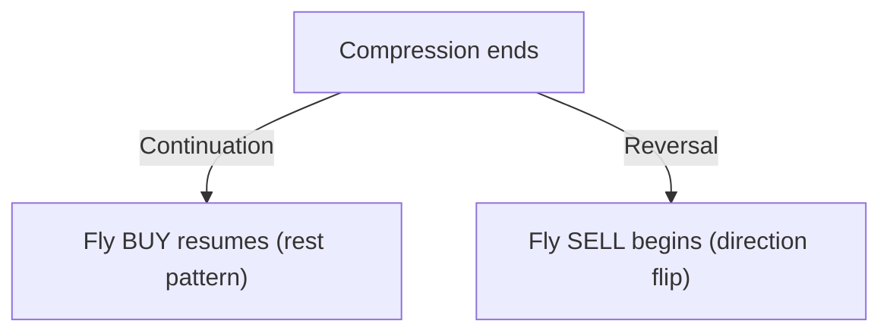

### Two Possible Outcomes

| Outcome | Description | Reference Scenario |
|---------|-------------|-------------------|
| **Continuation** | Price resumes original direction after compression | Scenario P — Fly → Shrink → Fly (rest pattern) |
| **Reversal** | Price breaks out in opposite direction | Scenario C → R — compression then reversal |

### Key Discrimination Criteria

| Indicator | Continuation (Rest Pattern) | Reversal |
|-----------|----------------------------|----------|
| **H1 step direction** | Maintained throughout | Breaks/reverses |
| **H4 step direction** | Maintained throughout | May reverse |
| **Compression duration** | Brief (hours) | Extended (days) |
| **Band expansion after** | Same direction | Opposite direction |
| **HTF fly throughout** | Yes — W1/D1/H4 all still flying | No — HTFs also compress or slow |
| **Gate labels during rest** | [G6-LOAD] only | [G0c-SQZLOCK], [G0b-PINK] |
| **L/U touch pattern** | Minimal | High L or U counts (repeated tests) |
| **PredictNextTrend** | Continuation (BUY/SELL) | Reversal flag (R:BUY/R:SELL) |

### HTF Compression Level Determines Likelihood

| HTF State During Compression | Outcome Likelihood |
|------------------------------|-------------------|
| H4 still flying, only M30/M15 compress | **Continuation likely** (rest pattern) |
| H4 also shrinking | **Either possible** — watch H1 step |
| H4 also in SQZ | **Reversal more likely** |
| D1 also slowing | **Reversal most likely** |

### Decision Tree for Post-Compression Analysis

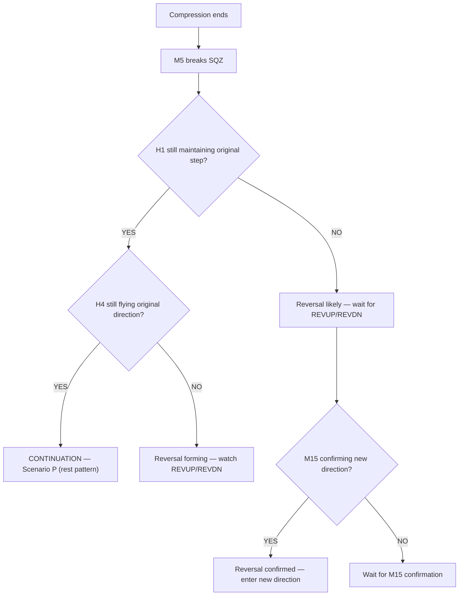

### Compression Depth vs Outcome

| Compression Depth | Typical Outcome |
|-------------------|-----------------|
| **Shallow** (M5/M15 only, hours) | Continuation — rest pattern |
| **Moderate** (M30+ included, 4-8 hours) | Either — depends on H1/H4 |
| **Deep** (H1+, days, full SQZ) | Reversal more likely |

### Visual Signals of Continuation (Rest Pattern)

| Signal | Chart Cue |
|--------|-----------|
| H1 bands still stepping in original direction | Red band continues same trajectory |
| H4 bands still stepping | Yellow band continues same trajectory |
| White rectangles (rest zones) then bands re-expand same way | See fly→shrink→fly chart |
| [G6-LOAD] → [G6-BUY/SELL] same as before compression | Gate labels consistent |

### Visual Signals of Reversal

| Signal | Chart Cue |
|--------|-----------|
| H1 step direction breaks | Red band stops or reverses |
| REVUP/REVDN label appears | Midband transition label |
| Bands expand in opposite direction | Upper/lower bands fan opposite way |
| [G0b-PINK] appears | Magenta label — exit all |
| Predict label shows R:BUY/R:SELL | Aqua/orange reversal labels |

---

## 10. Block Gate Reference Table

| Gate | Block Condition | Color | Resolution |
|------|----------------|-------|------------|
| H4-OPPOSE | H4 fly opposing entry direction | DarkOrange | Wait for H4 to align |
| H4-SQZ | H4 in SQZ with no conviction | DarkOrange | Wait for H4 breakout |
| G0b-H4OPP | H4 fly/shrink opposing entry | DarkOrange | H4 mid must align with entry |
| G0b-M30OPP | M30 fly/shrink/SQZ with opposing mid | DarkMagenta | M30 mid must align |
| G4e-H4OPP | H4 in shrink with flat mid (sideway) | Orange | Wait for H4 to exit shrink |
| G4c-M15OPP | M15 fly/shrink/SQZ with opposing mid | Orange | M15 mid must align |
| G4f-M30OPP | M30 fly/shrink/SQZ with opposing mid | Orange | M30 mid must align |
| G0b-SQZLOCK | H1+M30 both SQZ, both mid==3 | Magenta | At least one TF must break SQZ |
| G0b-H1SQZDN | H1-SQZ with mid=2/4 vs BUY, or mid=5 vs SELL | Magenta | H1 mid must align with entry |
| G0b-M5OPP | M5 sole trigger + M5 shrink with opposing mid | Magenta | M5 mid must align |
| G0b-M5FLY | M5 in committed opposing fly | Magenta | Wait for M5 to align |

---

## 11. Position Sizing Matrix

| TF Alignment | M15/M30/H1 H4 Fly | Shrink | SQZ |
|--------------|-------------------|--------|-----|
| 4+ TFs agree | 1.0× | 0.75× | 0.50× |
| 3 TFs agree | 1.0× | 0.50× | 0.25× |
| 2 TFs agree | 0.75× | 0.25× | Skip |
| 1 TF | 0.50× | Skip | Skip |

**Quality score multiplier:**
- ≥90: 1.0× (full size)
- ≥75: 0.75×
- ≥60: 0.50×
- ≥45: 0.25×
- <45: Skip

---

## 12. Cascade Direction Model

Two cascade directions drive every market cycle in this strategy.

### Compression — Check HTF First, Then Read LTF

Compression is NOT a simple one-direction cascade. The HTF state at the time
LTF starts shrinking determines whether it's a rest, confinement, or reversal warning.

**Always check HTF BEFORE interpreting LTF shrink:**

| H4 state | D1 state | LTF shrink meaning | Scenario path | Reversal probability |
|----------|----------|-------------------|---------------|---------------------|
| Fly (511/512) | Fly (511/512) | REST — internal LTF pullback, HTF intact | S→P (rest recovery) | Low |
| Shrink (513) | Fly (511/512) | CONFINED — H4 caused LTF compression, D1 may rescue | S→C (deep compression) | Medium |
| Shrink (513) | Shrink (513) | REVERSAL WARNING — both HTF losing direction | S→C→R4 (HTF reversal) | High |
| SQZ (400-499) | Fly (511/512) | BOTTOM with D1 bias — old H4 trend exhausted | C4→V (direction pivot, D1 gives bias) | High for H4, low for macro |
| SQZ (400-499) | Shrink/SQZ | DEEP BOTTOM — no macro bias exists | C4→V (direction pivot, no bias) | Very high — full reversal |

**Two phenomena happen simultaneously during compression:**

1. **Shrink propagation (LTF → HTF):** LTF bands shrink first because they react to price faster.
   M15 enters 513 before M30 before H1 before H4. LTF is the leading indicator.
   Each TF confirming shrink increases reversal probability.

2. **Confinement effect (HTF → LTF consequence):** Once H4 IS in shrink, its band boundaries
   act as ceiling/floor for all lower TFs. M30/M15 oscillate within H4 upper/lower band.
   This is the RESULT of H4 shrink, not the initiation of shrink.

**The critical question is: did HTF shrink FIRST (causing LTF compression) or did LTF shrink
FIRST (warning of HTF reversal)?**

- If H4 entered shrink BEFORE M15 → H4 is the cause → confinement (check D1 for rescue)
- If M15 entered shrink BEFORE H4 → LTF is warning → watch if H4 follows (reversal ladder)
- If both entered shrink simultaneously → strong reversal signal

**Reversal probability ladder — each TF confirming shrink escalates:**

| Depth reached | Reversal probability | Scenario |
|---------------|---------------------|----------|
| M15 only (H4 still fly) | Low — likely rest/continuation | S1 |
| M30 added (H4 still fly) | Low-Medium — watch H1 | S2 |
| H1 added (H4 still fly) | Medium — H4 likely to follow | S3 |
| H4 enters shrink (D1 still fly) | High — HTF reversal warning | E/C4 |
| H4 SQZ + D1 still fly | High for H4, D1 gives bias | V (D1 bias) |
| H4 SQZ + D1 shrink/SQZ | Very high — full macro reversal | V (no bias) |

Shrink propagation (LTF leads — early warning of reversal):
  M15 BBUpDn→2 first (trend weakening at entry TF)
    → M30 BBUpDn→2 follows (momentum fading at driver TF)
      → H1 BBUpDn→2 follows (chain anchor losing direction)
        → H4 BBUpDn→2 follows (macro bias losing direction — reversal warning confirmed)
          → H4 BBUpDn→0 (SQZ) — old trend exhausted → Scenario V (direction pivot)

  BUT CHECK at each step: was H4 already shrinking when M15 started?
    YES → H4 caused LTF compression (confinement — H4 is driver, not victim)
    NO  → M15 is warning that H4 will follow (genuine reversal signal from LTF)

Confinement effect (HTF → LTF — consequence of HTF shrink, not cause):
  Once H4 IS in shrink → H4 band boundaries act as ceiling/floor:
    H4 upper/lower band → confines H1 range
      → H1 upper/lower band → confines M30 range
        → M30 upper/lower band → confines M15 range
          → M15 upper/lower band → confines M5 range
  This is the RESULT of H4 shrink. M30/M15 range within these boundaries
  until H4 exits shrink. Gate G8-BNDTGT fires when price touches these boundaries.

### Expansion Cascade (LTF → HTF)

LTF breaks SQZ first → signal travels upward → HTF confirms last.
Observable as BBUpDn_state transitioning 0→1 (expanding) TF by TF bottom-up.
Same direction as shrink propagation — LTF always leads both shrink and expansion.

**CHECK HTF context to determine expansion quality:**

| H4 state when M5 breaks SQZ | D1 state | Expansion meaning | Scenario |
|------------------------------|----------|-------------------|----------|
| Still fly (511/512) | Fly | High quality — macro intact, rest over | P (rest recovery) |
| Shrink (513) | Fly | Medium — H4 confined but D1 backing | F (compression release) |
| SQZ (400-499) | Fly | Medium — H4 exhausted but D1 gives bias | V1→B (direction pivot same) |
| SQZ (400-499) | Shrink/SQZ | Low until confirmed — no macro backing | V2→R (direction pivot opposite) |

```
M5 breaks SQZ (REVUP/REVDN) — G6-LOAD fires
  → M15 follows in 2-5 bars (FLAT→UP/DN) — G6-BUY/SELL fires — ENTRY
    → M30 confirms (511/512) — quality boost +10 to +15
      → H1 confirms — hold signal sustained
        → H4 confirms — full fly → Scenario F
```

### Cycle Sequence

```
CHECK HTF FIRST at every step:

F (full fly, all TFs aligned)
  → S (M15 shrinks: CHECK — is H4 still fly?)
    → H4 still fly + D1 fly: rest likely
      → S→P→F (rest recovery — H4 never broke, LTF pullback only)
    → H4 also shrinking: confinement
      → S→C (H4 caused LTF compression — LTF confined within H4 band)
      → CHECK D1: D1 still fly?
        → Yes: C (deep compression, D1 may rescue H4)
        → D1 also shrinking: C→R4 (HTF reversal warning — both H4 and D1 losing direction)
          → C4→V (all TFs SQZ: BOTTOM — old trend exhausted, direction resolving)
            → V1→B→F (M5 expands same direction: compression release → continuation)
            → V2→R→new F (M5 expands opposite: trend reversal complete)

Both shrink propagation (LTF→HTF warning) and expansion (LTF→HTF breakout) travel bottom-up.
Confinement (HTF→LTF range restriction) is the consequence of HTF shrink, not the cause.
The CHECK at each step determines whether LTF shrink is rest vs confinement vs reversal warning.
```

[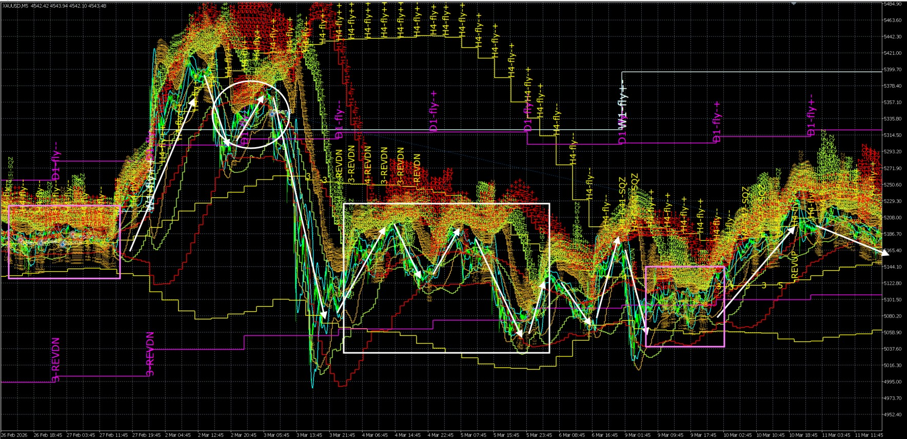](backtested_EA_b_to_e_to_g_progression.jpg)

**S→C→V Compression Progression on Real Backtest Data (02–06 Mar 2026):**

- **Circle (03.03 07:45):** H1 ESTABLISHED SQZ — in SQZ since 03.03 04:00. C-tier. Contrast with onset: same SQZ shape but different because it has been in SQZ for 3+ hours. [Decision 5 — validated]
- **Rectangle left edge (03.04 16:00):** H1 ONSET SQZ — just entered SQZ. Same snapshot shape as the circle but different state: only prior-bar history distinguishes onset from established. [Decision 5 — validated]
- **Rectangle through 03.06 14:30:** Compression deepening — H4 shrinking, then H4 goes flat (BBUpDn=0) = the PIVOT-PENDING / V-tier waiting state.
- **V RESOLUTION** (which direction the pivot breaks): OOS-UNVALIDATED. This chart shows the progression INTO the pivot, not a validated V/F resolution rule. The pivot direction remains to be confirmed out-of-sample.

---

### Touch Type Classification

During D1, bands move toward price — candle wicks touch multiple TF bands simultaneously.
Three touch types must be distinguished:

| Type | BBW_stage | diffMid_Trend | BBUpDn_state | Meaning | Action |
|------|-----------|---------------|--------------|---------|--------|
| Type 1 | Shrinking 513/523 | 3/4/5 — flat or weak | 2 (shrinking — band moving toward price) | Band moved to price — compression geometry noise | IGNORE — not a signal |
| Type 2 | Highest still-flying TF at outer band | 4 or 5 — directional lean | 1 (expanding) at HTF level — PriceLoc=at_upper or at_lower | Price reached confinement boundary — real signal | Check G0b filters — valid entry |
| Type 3 | Multiple TFs SQZ 400-499 | 3 all TFs | 0 (no_state) alternating with 2 same bar/adjacent bars | SQZ peak — band width < candle range, geometric overlap | G0b-PINK zone — EXIT all, wait |

**Key rule:** The signal always comes from the HIGHEST TF that is currently at its outer band (PriceLoc=at_upper or at_lower).
Lower TF outer band touches during HTF shrink = Type 1 noise (BBUpDn_state=2 shrinking, band moved to price).
HTF confinement boundary touch WITH PriceLoc=at_upper/lower AND diffMid=4/5 = Type 2 valid signal.
**BBUpDn_state measures band movement direction — NOT price location:**
- 0 = no_state (SQZ or transitional)
- 1 = expanding (upper rising AND lower falling — confirmed 2 bars)
- 2 = shrinking (upper falling AND lower rising — confirmed 2 bars)
- 3 = up (both bands moving upward together)
- 4 = dn (both bands moving downward together)

---

## 12b. TRADEINFO Chain Flags — Cascade Direction Observable

TRADEINFO flags are the EA's real-time observable for cascade direction.
They appear in the journal log under the `[TRADEINFO]` tag and map directly
to the cascade model in Section 12.

**How to read:** Each flag has a TF index value. When ≥ 0, that flag's chain
is active up to that TF level. When = -1, the chain is not detected.

| Flag | Active (≥0) meaning | Cascade mapping | When you see it |
|------|--------------------|-----------------|-----------------| 
| H2L_flyUP | HTF→LTF fly uptrend chain confirmed | Expansion confirmed top-down — all TFs aligned UP | Scenario F (full fly up) |
| H2L_flyDN | HTF→LTF fly downtrend chain confirmed | Expansion confirmed top-down — all TFs aligned DN | Scenario F (full fly dn) |
| H2L_flyStrink | HTF→LTF shrink chain active | Shrink propagating — compression cascade in progress | Scenario S/C (compression) |
| H2L_sideway | HTF→LTF sideway/SQZ chain | All TFs suppressed — compression complete | Scenario R4/V (BOTTOM) |
| L2H_flyUP | LTF→HTF fly uptrend chain (bottom-up) | LTF leading expansion upward — D2 initiated | Scenario P/F (expansion up) |
| L2H_flyDN | LTF→HTF fly downtrend chain (bottom-up) | LTF leading expansion downward — D2 initiated | Scenario P/F (expansion dn) |
| L2H_sideway | LTF→HTF sideway chain | LTF being suppressed by HTF — D1 active | Scenario S/C (LTF confined) |
| All = -1 | No chains detected | Mixed/neutral — transitional state | Scenario V (direction pivot) |

**TF index reference (used for all TRADEINFO and BBTFImpact flags):**

| Index | Timeframe |
|-------|-----------|
| 0 | M5 |
| 1 | M15 |
| 2 | M30 |
| 3 | H1 |
| 4 | H4 |
| 5 | D1 |

**Scenario identification from TRADEINFO flags:**

| TRADEINFO state | Scenario | Trade implication |
|----------------|----------|-------------------|
| `H2L_flyUP:0` + `L2H_flyUP:3` | F — Full fly alignment (up) | Full size trend entry BUY |
| `H2L_flyDN:0` + `L2H_flyDN:3` | F — Full fly alignment (dn) | Full size trend entry SELL |
| `H2L_flyStrink:1` + `L2H_sideway:1` | S1 — M15 shrink only | Reduce to 0.75×, watch depth |
| `H2L_flyStrink:2` + `L2H_sideway:2` | S2 — M30 shrink | Reduce to 0.50×, watch H1 |
| `H2L_flyStrink:3` + `L2H_sideway:3` | S3 — H1 shrink | Reduce to 0.25×, watch H4 |
| `H2L_sideway:1` + `L2H_sideway:1` | C1/C2 — Deep compression | No entry — G0b-PINK may fire |
| `H2L_sideway:3` + all L2H = -1 | R4/V — BOTTOM | No entry — wait M5 BBUpDn 0→1 |
| All flags = -1 | V — Direction pivot (transitional) | No entry — direction unknown |
| `L2H_flyUP:1` + `H2L_flyStrink:3` | D1/B1 — LTF leading, HTF not confirmed | ARM — wait M30 confirm |
| `L2H_flyUP:2` + `H2L_flyStrink:3` or clearing | D2/B2 — MTF confirmed | ENTER — 0.75× |
| `L2H_flyUP:3` + `H2L_flyUP:0` | D3/B3 — Full chain restored | → Scenario F, full size |
| `L2H_flyDN:1` + `H2L_flyUP:3` (opposing) | R1 — MTF reversal only | Small entry 0.25× — wait H4 |
| `L2H_flyDN:3` + `H2L_flyDN:0` | R2 — H4 confirmed reversal | → New Scenario F opposite dir |

**Phase 3a/3b connection (Section 13):**
- Phase 3a (symmetric zigzag): `H2L_flyStrink` active + `H2L_sideway` not yet
- Phase 3b onset: `H2L_flyStrink` active + one `L2H_fly` flag starting to appear (LTF attempting expansion within shrink)
- Phase 3a→3b transition: `H2L_flyStrink` clears → replaced by `H2L_sideway` = shrink chain converted to sideway chain

---

## 12c. BBTFImpact Flags — Cascade Pressure Indicators

BBTFImpact flags appear in the journal log under the `[BBTFImpact]` tag.
They show which TFs are being suppressed by higher TFs (D1 pressure)
vs which TFs are showing independent fly energy (D2 pressure).

| Flag | Format | Active (=1) meaning | Cascade mapping |
|------|--------|--------------------|--------------------|
| HTF_Drive_LTF_Sideway | [TF_name_index] | TF at that index being pushed into sideways by higher TFs | Shrink/confinement active at this TF level |
| LTF_Drive_HTF_Fly | [TF_name_index] | TF at that index showing fly energy despite HTF pressure | Expansion energy building at this TF level |

**Index reference:** 1=M15, 2=M30, 3=H1, 4=H4, 5=D1

**Log format examples:**
```
[BBTFImpact] HTF_Drive_LTF_Sideway:[M15_1]
  → M15 (index 1) being suppressed — Scenario S1

[BBTFImpact] HTF_Drive_LTF_Sideway:[M15_1, M30_1]
  → M15 and M30 both suppressed — Scenario S2

[BBTFImpact] HTF_Drive_LTF_Sideway:[M15_1, M30_1, H1_1]
  → M15, M30, and H1 all suppressed — Scenario S3

[BBTFImpact] LTF_Drive_HTF_Fly:[M30_1, H1_1]
  → M30 and H1 showing fly energy — expansion building at MTF level

[BBTFImpact] HTF_Drive_LTF_Sideway:[M30_1] LTF_Drive_HTF_Fly:[M30_1, H1_1]
  → CONFLICT — M30 being suppressed AND showing fly energy simultaneously
  → Volatile transition state — Scenario C3 or V territory
```

**Scenario S sub-scenario mapping:**

| BBTFImpact pattern | Scenario | Size multiplier |
|-------------------|----------|----------------|
| `HTF_Drive_LTF_Sideway:[M15_1]` only | S1 — M15 shrink only | 0.75× |
| `HTF_Drive_LTF_Sideway:[M15_1, M30_1]` | S2 — M30 shrink | 0.50× |
| `HTF_Drive_LTF_Sideway:[M15_1, M30_1, H1_1]` | S3 — H1 shrink | 0.25× |
| `HTF_Drive_LTF_Sideway:[M15_1, M30_1, H1_1, H4_1]` | C4 — H4 also compressing | No entry |

**Scenario C/V transition mapping:**

| BBTFImpact pattern | Scenario | Action |
|-------------------|----------|--------|
| All `HTF_Drive_LTF_Sideway`, no `LTF_Drive_HTF_Fly` | C2 — Full SQZ, no expansion energy | Wait — G0b-PINK |
| `HTF_Drive_LTF_Sideway` + `LTF_Drive_HTF_Fly` appearing | C3 — Loading, expansion building | Watch — G6-LOAD may fire |
| `LTF_Drive_HTF_Fly` growing, `HTF_Drive_LTF_Sideway` clearing | B1/B2 — Expansion taking over | ARM / ENTER |
| Only `LTF_Drive_HTF_Fly`, no `HTF_Drive_LTF_Sideway` | B3/F — Full expansion | Full size entry |

**Conflict state (both flags active at same TF):**
Both `HTF_Drive_LTF_Sideway` and `LTF_Drive_HTF_Fly` active simultaneously at a TF
= volatile transition. HTF suppressing but LTF pushing back.
- Maps to Scenario C3 (loading) or Scenario V (direction pivot)
- sizeMultiplier = 0.5 (compromise between suppression and drive signals)
- Watch M5 BBUpDn_state: 0→1 resolves the conflict in favour of expansion

**Section 13 connection:**
- Phase 2 onset: first `HTF_Drive_LTF_Sideway` flag appears = zigzag starting
- Phase 3 deepening: `HTF_Drive_LTF_Sideway` count increasing = more TFs suppressed = legs shortening
- Phase 4 (SQZ): all `HTF_Drive_LTF_Sideway`, no `LTF_Drive_HTF_Fly` = noise oscillation
- Phase 5 (breakout): `LTF_Drive_HTF_Fly` appears and grows = explosive move starting

---

## 12d. Cascade State Decoder — cas_shrinkTF and cas_sqzCount

These internal EA values map directly to scenario sub-states.
They provide the fastest single-variable identification of where
in the compression cascade the market currently sits.

### cas_shrinkTF — Highest TF Currently in Shrink

| cas_shrinkTF | Meaning | Scenario sub-state | Reversal probability |
|-------------|---------|-------------------|---------------------|
| 1 | M15 is highest active shrink TF | S1 — Shallow compression | Low |
| 2 | M30 is highest shrink TF | S2 — Moderate compression | Low-Medium |
| 3 | H1 is highest shrink TF | S3 — Deep compression | Medium |
| 4 | H4 is highest shrink TF | C4 — HTF also compressing | High |
| 5 | D1 is highest shrink TF | Scenario I — Macro sideways (planned — not yet defined) | Very high |
| -1 | No TF in fly_shrink | Not in S — check C/V or F | Depends on other flags |

**cas_shrinkTF maps to Section 13 Phase 3 amplitude:**
- cas_shrinkTF = 1: Phase 3 zigzag legs still tall (only M15 confined)
- cas_shrinkTF = 2: Phase 3 legs moderately shortened (M30 now confined too)
- cas_shrinkTF = 3: Phase 3 legs significantly shortened (H1 confined)
- cas_shrinkTF = 4: Phase 3 → Phase 4 transition (H4 confined = approaching SQZ)

### cas_sqzCount — Number of TFs Currently in SQZ

| cas_sqzCount | Meaning | Scenario sub-state | Gate status |
|-------------|---------|-------------------|------------|
| 0 | No TFs in SQZ | F-tier (no confirmed compression) — LTF opposition or lagging shrink labels alone do not route to S | Normal gates |
| 1 | One TF squeezed (typically M5 first) | C1 — LTF partial SQZ | G0c-SQZLOCK may activate |
| 2 | Two TFs squeezed (M5+M15) | C2 — LTF full SQZ | G0b-PINK fires — EXIT all |
| 3 | Three TFs squeezed (M5+M15+M30) | C3/C4 — Deep cascade | G0b-PINK + G0c-SQZLOCK |
| 4+ | Four or more TFs squeezed | R4/V — BOTTOM | All gates locked — wait |

**Pink zone condition:**
cas_sqzCount ≥ 2 AND M15+M30 both SQZ simultaneously → G0b-PINK fires → EXIT all.
This maps to C2 (LTF full SQZ) or deeper.

**Combined cas_shrinkTF + cas_sqzCount reading:**

| cas_shrinkTF | cas_sqzCount | Full state | Scenario | Action |
|-------------|-------------|-----------|----------|--------|
| 1 | 0 | M15 shrink, nothing squeezed | S1 | Trade at 0.75× |
| 2 | 0 | M30 shrink, nothing squeezed | S2 early | Trade at 0.50× |
| 2 | 1 | M30 shrink, M5 squeezed | S2 late → C1 | Reduce to 0.25× |
| 3 | 1 | H1 shrink, M5 squeezed | S3 → C1 | Reduce to 0.25× |
| 3 | 2 | H1 shrink, M5+M15 squeezed | C2 | EXIT — G0b-PINK |
| -1 | 2 | No shrink but 2 TFs squeezed | C2/C3 transition | Wait — G6-LOAD may fire |
| -1 | 3+ | No shrink, 3+ TFs squeezed | R4/V — BOTTOM | No entry — wait M5 expand |
| -1 | 0 | No shrink, no squeeze | F (fly) or transition | Check TRADEINFO for direction |

### Journal Log Label Reference

These labels appear in EA journal output and map to specific scenario sub-states:

| Log label | Meaning | Scenario sub-state | Action |
|-----------|---------|-------------------|--------|
| `MIDLINE_SQZ_LOADING` | M5 in SQZ, M30 shrinking — loading state | C3 — Loading | Wait — G6-LOAD about to fire |
| `MIDLINE_SQZ_ENTRY` | Loading complete — entry condition met | E3→D/F transition | ENTER on next bar |
| `SQZ_BREAK_UP` | M5 broke SQZ bullish — expansion initiated upward | D1 or B1 initiating BUY | ARM — wait M15 confirm |
| `SQZ_BREAK_DN` | M5 broke SQZ bearish — expansion initiated downward | D1 or B1 initiating SELL | ARM — wait M15 confirm |
| `CASCADE_TOUCH(TF:n upper_band)` | G0b-TOUCH fired at TF index n, upper band | Confinement boundary reached | Check G0b 6 filters |
| `CASCADE_TOUCH(TF:n lower_band)` | G0b-TOUCH fired at TF index n, lower band | Confinement boundary reached | Check G0b 6 filters |
| `CASCADE_PINK_ZONE` | G0b-PINK fired — M15+M30 both SQZ | C2 — Pink zone active | EXIT all — no entries |

**How to use with Section 13 phases:**
- Phase 2 onset: `CASCADE_TOUCH` starts appearing = zigzag legs hitting band boundaries
- Phase 3 deepening: `CASCADE_TOUCH` TF index increasing = confinement propagating upward
- Phase 4: `CASCADE_PINK_ZONE` appears = zigzag collapsed to noise
- Phase 5: `SQZ_BREAK_UP/DN` appears = explosive breakout starting
- Entry: `MIDLINE_SQZ_LOADING` → `MIDLINE_SQZ_ENTRY` → `SQZ_BREAK_UP/DN` = full entry sequence

---

## 13. Candlestick Behavior During Fly → Shrink → SQZ Transition

During fly → shrink → SQZ, candlesticks form a **zigzag oscillation pattern** between
HTF band boundaries. Each zigzag leg is one complete MTF fly cycle (M30 drives the leg).
The zigzag gets progressively tighter as H4 bands narrow — this is the visual signature
of compression. Recognizing which phase the zigzag is in tells you the current scenario
and what comes next.

Three reference charts illustrate the full range of zigzag behaviors:

**Image 1 — Phase 3a Symmetric Zigzag (9–19 Jan 2026):**
Phase 2→3a symmetric decay → Phase 4 SQZ → Phase 5 explosive breakout.
Equal amplitude decay — both ceiling and floor close in equally. H4 mid = 3.

[](backtested_EA_phase_3a_symmetric.jpg)

**Image 2 — Phase 3b Asymmetric Cascade (2–12 Jan 2026):**
BUY trending shrink — UP targets drop through H4 upper → H1 mid → H4 mid
while DN targets hold at H4 mid. H4 mid = 1→5→3.

[](backtested_EA_phase_3b_asymmetric.jpg)

**Image 3 — Phase 3a→3b Transition (23–26 Feb 2026):**
Symmetric first (H4 mid=3), then develops SELL lean mid-shrink (H4 mid shifts 3→4).
UP targets start dropping while DN targets hold steady.

[](backtested_EA_phase_3a_to_3b.jpg)

---

### Phase 1 — Full Fly: Directional Trend (Scenario F)

```
Pattern:
  ╱  ╱  ╱  ╱  ╱  ╱  ╱     Price trending in one direction
 ╱  ╱  ╱  ╱  ╱  ╱  ╱      Candles mostly same color
╱  ╱  ╱  ╱  ╱  ╱  ╱       Pullbacks brief and shallow
```

| Dimension | Value |
|-----------|-------|
| H4 BBW_stage | 511/512 (FLY++) |
| H4 BBUpDn_state | 1 (expanding) or 3 (up) |
| M30 behavior | Fly same direction as H4 — sustained trend leg |
| Candle character | Mostly same-colored, directional, pullbacks < 30% of leg |
| diffBBW | Positive — band actively expanding |
| Impulse legs | All legs go SAME DIRECTION (no zigzag yet) |

**CHECK HTF:** H4 fly intact. No zigzag behavior. Trend trading.
**Visible on:** Image 2 left edge (2–5 Jan) — directional up before zigzag begins.

---

### Phase 2 — Fly → Shrink Onset: Impulse + Counter-Impulse (Scenario S1/S2)

```
Pattern:
    ╱╲      ╱╲      ╱╲        Price makes sharp up-down legs
   ╱  ╲    ╱  ╲    ╱  ╲       Each leg = one M30 fly cycle
  ╱    ╲  ╱    ╲  ╱    ╲      Legs SAME HEIGHT (H4 band still wide)
```

This is where the **zigzag begins**. Price no longer trends in one direction —
instead it impulses UP (yellow arrow) to H4 upper band, then reverses DOWN
(red arrow) to H4 lower band or H1 mid, then impulses UP again.

| Dimension | Value |
|-----------|-------|
| H4 BBW_stage | 511/512 transitioning to 513 (FLY → FLY--) |
| H4 BBUpDn_state | 1/3 transitioning to 2 (expanding → shrinking) |
| M30 behavior | Completes full fly cycles alternating BUY and SELL |
| Candle character | Alternating bullish and bearish impulse clusters |
| diffBBW | Transitioning positive → near zero → slightly negative |
| Leg height | Full H4 band width — legs are TALL (H4 still wide) |
| Leg duration | 4–12 hours per leg (one complete M30 fly cycle) |
| Leg reversal trigger | G8-BNDTGT fires at H4 band boundary — price reverses |

**CHECK HTF:** H4 BBUpDn still 1/3 = H4 fly intact.
Zigzag is MTF cycling within H4 confinement, NOT H4 reversal.
**Visible on:** Image 1 center-left (12–13 Jan) — first red and yellow arrow pair.

---

### Phase 3 — Shrink Deepening: Tightening Zigzag (Scenario S3/C1)

Phase 3 has **two sub-patterns** depending on whether H4 has a directional lean.
The discriminator is H4 diffMid_Trend during the shrink.

#### Phase 3a vs 3b Discriminator

| H4 diffMid_Trend | Phase | Pattern | Oscillation center |
|-------------------|-------|---------|-------------------|
| 3 (sideways, no lean) | 3a — Symmetric Tightening | Both ceiling and floor close in equally | Centered around H4 mid |
| 1 or 5 (uptrend / sideway-up) | 3b — Asymmetric Cascade (BUY) | UP targets drop progressively, DN targets hold at H4 mid then break | Biased above H4 mid initially |
| 2 or 4 (downtrend / sideway-dn) | 3b — Asymmetric Cascade (SELL) | DN targets rise progressively, UP targets hold at H4 mid then break | Biased below H4 mid initially |

**Mid-shrink transition:** H4 mid can shift during an active shrink.
If H4 mid = 3 at shrink onset → Phase 3a begins (symmetric).
If H4 mid later shifts to 4/2 or 5/1 → Phase 3a transitions to 3b mid-cycle.
The reverse is also possible: 3b can decay to 3a when H4 mid reaches 3.
**Watch for:** first zigzag leg where UP target is measurably lower than previous
while DN target holds steady (or vice versa) = 3a→3b transition has occurred.

---

#### Phase 3a — Symmetric Tightening (H4 mid = 3, no directional lean)

```
Pattern:
   ╱╲    ╱╲    ╱╲             Same zigzag pattern BUT
  ╱  ╲  ╱  ╲  ╱  ╲            Legs getting SHORTER each cycle
  ╱   ╲ ╱   ╲╱   ╲            BOTH ceiling and floor close in equally
```

Both the upper and lower targets close in at the same rate.
Oscillation is centered around H4 mid — no directional bias.

| Dimension | Value |
|-----------|-------|
| H4 BBW_stage | 513/523 (SHRINK confirmed) |
| H4 BBUpDn_state | 2 (shrinking — upper falling, lower rising) |
| H4 diffMid_Trend | 3 (sideways — no directional lean) |
| M30 behavior | Still completes full fly cycles but with LESS ROOM each time |
| Candle character | Zigzag continues, amplitude visibly decreasing symmetrically |
| diffBBW | Negative — band actively contracting |
| Leg height | Decreasing each cycle — BOTH UP and DN legs shorter equally |
| Leg reversal trigger | G8-BNDTGT fires at progressively CLOSER band boundaries |

**CHECK HTF:** H4 BBUpDn = 2 AND H4 mid = 3 = symmetric shrink.
Trade BOTH directions equally at each reversal — no bias.

**Visible on:**
- Image 1 center (13–15 Jan) — orange arrows oscillating with equal amplitude decay.
- Image 3 center (24–25 Feb) — orange arrows approximately equal height UP and DN.

---

#### Phase 3b — Asymmetric Target Cascade (H4 mid ≠ 3, directional lean exists)

```
BUY trending shrink pattern (H4 mid = 1 or 5):

H4 Upper ──╱─────────────────────────
           ╱╲
H4 Mid ────╱──╲──────────────────────    UP targets drop through band hierarchy
               ╲╱╲                       DN targets hold at H4 mid then break
H1 Mid ────────╱──╲──────────────────
                   ╲╱╲
H4 Lower ──────────╱──╲─────────────    Eventually reaches H4 lower → SQZ
                       ╲
```

When H4 is shrinking BUT still has a directional lean, the zigzag is asymmetric —
the ceiling drops faster than the floor rises (BUY case) because H4 upper band
curls downward while H4 lower band still rises.

**BUY trending shrink (H4 mid = 1 or 5):**

| Step | UP target (ceiling) | DN target (floor) | H4 mid | What's happening |
|------|--------------------|--------------------|--------|-----------------|
| Step 1 | H4 upper band (full reach) | H4 mid band (support holds) | 1 (uptrend) | H4 fly momentum still; H4 mid acts as floor |
| Step 2 | H1 mid band (ceiling dropped) | H4 mid → breaks through | 1→5 (weakening) | H4 upper curling down (BBUpDn→2); ceiling closes in first |
| Step 3 | H4 mid only (ceiling dropped further) | H4 lower band (full retrace) | 5→3 (exhausted) | H4 mid no longer support; price reaches floor |
| Step 4 | → Phase 4 (SQZ) or Phase 3a | → Phase 4 (SQZ) | 3 (sideways) | Trend exhausted; becomes symmetric or collapses |

**SELL trending shrink (H4 mid = 2 or 4) — mirror:**

| Step | DN target (floor) | UP target (ceiling) | H4 mid | What's happening |
|------|-------------------|---------------------|--------|-----------------|
| Step 1 | H4 lower band (full reach) | H4 mid band (resistance holds) | 2 (downtrend) | H4 fly momentum still; H4 mid acts as ceiling |
| Step 2 | H1 mid band (floor risen) | H4 mid → breaks through | 2→4 (weakening) | H4 lower curling up; floor rises first |
| Step 3 | H4 mid only (floor risen further) | H4 upper band (full retrace) | 4→3 (exhausted) | H4 mid no longer resistance |
| Step 4 | → Phase 4 (SQZ) or Phase 3a | → Phase 4 (SQZ) | 3 (sideways) | Trend exhausted; becomes symmetric or collapses |

**Band level target sequence (BUY trending — visible as yellow arrows):**

```
Arrow 1 UP: → H4 upper band     (H4 fly still has momentum)
Arrow 1 DN: → H4 mid band       (mid holds as support)
Arrow 2 UP: → H1 mid band       (can't reach H4 upper — ceiling dropped)
Arrow 2 DN: → H4 mid → through  (mid breaking as support)
Arrow 3 UP: → H4 mid only       (ceiling at H4 mid level now)
Arrow 3 DN: → H4 lower band     (floor reached — SQZ approaching)
```

**Key difference from Phase 3a:**
- 3a: price oscillates evenly around H4 mid — both sides tighten equally
- 3b: price biased to one side of H4 mid — trending side loses reach first
  while counter-trend side holds its level until H4 mid flips to 3

**Trade implications:**
- Phase 3a (symmetric): trade BOTH directions equally at each reversal — no bias
- Phase 3b (asymmetric): favour the TRENDING side while H4 mid still = 1/5 or 2/4
  → Trending-direction legs are longer and more reliable
  → Counter-trend legs are shorter and less reliable
  → STOP favouring when H4 mid flips to 3 — trend exhausted

**H4 mid flip is the transition signal:**
- 1/5 → 3: Phase 3b (BUY) ends → becomes 3a or Phase 4
- 2/4 → 3: Phase 3b (SELL) ends → becomes 3a or Phase 4
- 3 → 4/2 or 5/1: Phase 3a → 3b transition mid-shrink

**Visible on:**
- Image 2 (5–9 Jan) — BUY trending shrink: yellow arrows UP targets dropping from H4 upper → H1 mid → H4 mid while DN targets hold at H4 mid.
- Image 3 right (25–26 Feb) — 3a→3b transition: symmetric zigzag develops SELL lean as H4 mid shifts 3→4, UP targets start dropping while DN targets hold steady.

**diffBBW during Phase 3b:**
- Step 1: diffBBW slightly negative — H4 barely shrinking, fly momentum persists
- Step 2: diffBBW moderately negative — shrink accelerating, ceiling dropping visibly
- Step 3: diffBBW strongly negative — shrink aggressive, approaching SQZ

**TRADEINFO transition signal:**
H4 mid flip from 1/5 → 3 observable as: `H2L_flyStrink` clears,
replaced by `H2L_sideway` — shrink chain converted to sideway chain.

#### Phase 3b Temporal Context: INTO vs OUT of Compression

Phase 3b can occur in two temporal contexts depending on whether H4 is
entering compression or recovering from it:

**Phase 3b-INTO (normal — H4 fly → shrink):**
```
Trending INTO compression:
H4 Upper ──╱─────────────────    Ceiling DROPS progressively
           ╱╲                    (trending side loses reach)
H4 Mid ────╱──╲──────────────    Floor holds then breaks
               ╲╱╲
H4 Lower ──────╱──╲─────────    → Leads to Phase 4 (SQZ)
```
- H4 BBW_stage: 511/512 → 513/523 (fly → shrink)
- H4 BBUpDn_state: 1/3 → 2 (expanding → shrinking)
- diffBBW: positive → negative (bands contracting)
- Legs LOSING reach — each cycle shorter than previous
- Described in main Phase 3b section above

**Phase 3b-OUT (recovery — H4 SQZ → fly recovery):**

**Reference image — Phase 3b-OUT (28 Jan–10 Feb 2026):**
H4 recovers from crash, floor rises from 4630→4850 while D1-fly-- acts as ceiling ~5130.

[](backtested_EA_phase_3b_out_recovery.jpg)

```
Trending OUT OF compression (counter-trend to D1):
                       ╱╲  ╱╲       Ceiling roughly STABLE
                      ╱  ╲╱  ╲      (D1 confinement boundary acts as cap)
                ╱╲   ╱         ╲
               ╱  ╲ ╱
H4 Lower ──╱──╱────╲─────────────    Floor RISES progressively
           ╱                         (recovery building from SQZ bottom)
SQZ bottom ╱
```
- H4 BBW_stage: 400-499 → 511/512 (SQZ → fly recovery)
- H4 BBUpDn_state: 0 → 1 (no_state → expanding)
- diffBBW: near zero → positive (bands expanding from SQZ)
- Legs GAINING reach — each recovery leg higher floor than previous
- Counter-trend to D1 direction — D1 band acts as ceiling

**Phase 3b-OUT dimension table:**

| Dimension | Value |
|-----------|-------|
| H4 BBW_stage | 400-499 → 511/512 (recovering from SQZ) |
| H4 BBUpDn_state | 0 → 1 (expanding — fly energy building) |
| H4 diffMid_Trend | 2→4→5 (downtrend → sideway → recovering up) |
| D1 BBW_stage | 511/512 or 521/522 (D1 still trending — acts as confinement) |
| D1 diffMid_Trend | Still original direction (opposing H4 recovery) |
| diffBBW | Near zero → positive (bands expanding from SQZ minimum) |
| Candle character | Impulse legs gaining strength — each pullback at higher floor |
| Leg height | Increasing initially then stabilizing as D1 ceiling reached |

**BUY recovery (after crash — H4 recovering UP while D1 still DN):**

| Step | UP target (ceiling) | DN target (floor) | H4 mid | What's happening |
|------|--------------------|--------------------|--------|-----------------|
| Step 1 | H4 upper area (first fly from SQZ) | SQZ bottom (deepest point) | 2→4 (weak recovery) | First fly attempt — large impulse from bottom |
| Step 2 | ~Same ceiling (D1 confines) | HIGHER than Step 1 (recovery holding) | 4→5 (strengthening) | Recovery building — floor rising |
| Step 3 | ~Same ceiling or slightly higher | HIGHER again (pullbacks shallow) | 5 (sideway-up) | Approaching D1 confinement boundary |
| Step 4 (resolution) | D1 boundary reached | — | 5→3 or 5→1 | D1 ceiling stops recovery → Phase 3a or Phase 4 again. OR D1 also reverses → V reversal progression (R1→C4→V2→R2/R3) → new Phase 1 |

**SELL recovery (after spike — H4 recovering DN while D1 still UP) — mirror:**

| Step | DN target (floor) | UP target (ceiling) | H4 mid | What's happening |
|------|-------------------|---------------------|--------|-----------------|
| Step 1 | H4 lower area (first fly from SQZ) | SQZ top (highest point) | 1→5 (weak recovery dn) | First fly attempt downward |
| Step 2 | ~Same floor (D1 confines) | LOWER than Step 1 | 5→4 (strengthening dn) | Recovery building — ceiling dropping |
| Step 3 | ~Same floor | LOWER again | 4 (sideway-dn) | Approaching D1 confinement boundary |
| Step 4 (resolution) | D1 boundary reached | — | 4→3 or 4→2 | D1 floor stops recovery → Phase 3a/4. OR D1 reverses → V reversal progression (R1→C4→V2→R2/R3) |

**CHECK HTF discriminator — INTO vs OUT:**
- H4 entering shrink (BBUpDn 1→2) + legs LOSING reach = Phase 3b-INTO (normal)
- H4 exiting SQZ (BBUpDn 0→1) + legs GAINING reach = Phase 3b-OUT (recovery)
- D1 direction tells you which side is the confinement ceiling/floor

**Phase 3b-OUT ends when:**
1. H4 recovery reaches D1 confinement boundary → reverses → Phase 3a or Phase 4 (most common)
2. D1 also reverses → V reversal progression (R1→C4→V2→R2/R3) → new Phase 1 in recovery direction
3. H4 recovery fails → falls back to SQZ → Phase 4 again (false recovery)

**Trade implications of 3b-OUT:**
- Favour RECOVERY direction (BUY in BUY recovery) while floor is rising
- Size: 0.50× maximum — counter-trend to D1, lower confidence than normal 3b
- Exit at D1 confinement boundary (G8-BNDTGT at D1 level)
- If D1 mid also starts flipping → increase to 0.75× (R reversal progression developing: C1→C4→V2→R2/R3)

**BBTFImpact observable:** `HTF_Drive_LTF_Sideway` values increasing = deeper confinement.
**cas_shrinkTF observable:** Value increasing (1→2→3) = shrink propagating upward through TFs.

---

### Phase 4 — Approaching SQZ: Compressed Oscillation (Scenario C2/C3)

```
Pattern:
     ╱╲╱╲╱╲╱╲╱╲╱╲            Zigzag collapsed to noise range
    ╱╲╱╲╱╲╱╲╱╲╱╲╱╲           Candles small, alternating direction rapidly
   ╱╲╱╲╱╲╱╲╱╲╱╲╱╲╱╲          Band width < typical candle range
```

The zigzag has collapsed — individual legs are no longer distinguishable.
Price oscillates within a very narrow range. M30/M15 both in SQZ — no clean
fly cycles are possible. Reached from either Phase 3a or Phase 3b.

| Dimension | Value |
|-----------|-------|
| H4 BBW_stage | 513/523 deep or transitioning to 400-499 |
| H4 BBUpDn_state | 2 → 0 (shrinking → no_state = SQZ boundary) |
| M30/M15 BBW_stage | 400-499 (SQZ) |
| M30/M15 BBUpDn_state | 0 (no_state) |
| Candle character | Small bodies, mixed colors, no sustained direction |
| diffBBW | Near zero — band width stabilized at minimum |
| Leg height | ≈ single candle body height — no distinguishable legs |
| Gate active | G0b-PINK fires (M15+M30 both SQZ) — EXIT all positions |
| PriceLoc behavior | Alternates at_upper and at_lower on consecutive bars |

**CHECK HTF:** H4 BBUpDn approaching 0 = SQZ confirmed.
- D1 still fly? → Scenario C4 with D1 bias → V1 (same dir) likely
- D1 also shrinking/SQZ? → Scenario C4 no bias → V direction uncertain

**Visible on:** Image 1 (15–16 Jan) — H4-SQZ labels appear, price chops sideways.
**Log label:** `MIDLINE_SQZ_LOADING` may appear = C3 loading state.
**cas_sqzCount:** Value = 2+ (multiple TFs squeezed).

---

### Phase 5 — SQZ Break: Explosive Directional Move (Scenario V → F)

```
Pattern:
                        ╱╱╱╱      Sudden large candles same direction
   ╱╲╱╲╱╲╱╲╱╲╱╲       ╱╱╱╱       M5 breaks SQZ first (BBUpDn 0→1)
  ╱╲╱╲╱╲╱╲╱╲╱╲╱╲     ╱╱╱╱        M15 follows — G6-BUY/SELL fires
```

After the compressed oscillation, price suddenly breaks out with
2–3× sized candles in one direction. This is the expansion cascade
initiating — M5 breaks SQZ first, M15 follows, M30 confirms.

| Dimension | Value |
|-----------|-------|
| H4 BBW_stage | 400-499 → transitioning to 511/512 or 521/522 |
| H4 BBUpDn_state | 0 → 1 (no_state → expanding = direction resolved) |
| M5 BBUpDn_state | 0 → 1 first (earliest signal) |
| M15 BBUpDn_state | 0 → 1 follows in 2-5 bars |
| Candle character | Large directional candles 2–3× SQZ candle size |
| diffBBW | Positive and increasing sharply — band expanding rapidly |
| Gate sequence | G6-LOAD → G6-BUY or G6-SELL |
| PriceLoc | Sustained above_upper (BUY) or below_lower (SELL) |

**CHECK HTF at breakout:**
- H4 BBUpDn 0→1 same direction as D1 fly → V1 → B (high confidence)
- H4 BBUpDn 0→1 opposite to D1 → V2 → R (lower confidence)
- H4 BBUpDn 0→1 then reverts to 0 within 3 bars → V3 (false breakout)

**Visible on:** Image 1 right (16–18 Jan) — explosive upward breakout after H4-SQZ zone.
**Log label:** `SQZ_BREAK_UP` or `SQZ_BREAK_DN` appears.
**TRADEINFO:** `L2H_flyUP` or `L2H_flyDN` appears = LTF leading expansion upward.

---

### Phase 6 — Post-SQZ Oscillation: H4 Uncommitted (Extended Scenario V4)

**Reference image — Phase 6 (2–13 Mar 2026):**
H4 exits SQZ then oscillates with equal-height legs for 5+ days.
D1-fly+ provides upward bias that H4 refuses to commit to.
H4 cycles fly→shrink→SQZ→fly repeatedly without sustaining direction.

[](backtested_EA_phase_6_post_sqz_oscillation.jpg)

> **See also:** Part 2 — HTF Reference Charts → Fly to Sideway images show the same H4 cycling behavior from the HTF perspective.

```
Pattern:
    ╱╲    ╱╲    ╱╲           Full amplitude zigzag AFTER SQZ
   ╱  ╲  ╱  ╲  ╱  ╲          Legs are TALL (H4 band re-expanded)
  ╱    ╲╱    ╲╱    ╲         Legs do NOT decay — EQUAL height each cycle
                              H4 cycles: fly→shrink→SQZ→fly repeatedly
```

After Phase 4 (compressed oscillation) and Phase 5 (explosive breakout),
a sixth pattern can occur: H4 exits SQZ and re-expands, but instead of
committing to one direction (Phase 5), it oscillates with full-amplitude
legs that do NOT decay. H4 cycles through fly→shrink→SQZ→fly repeatedly
without sustaining any direction.

This is **Scenario V4 (whipsaw) extended over days** — the "wait for 3+ bars
same BBUpDn direction" condition from Scenario V is never met.

| Dimension | Value |
|-----------|-------|
| H4 BBW_stage | Cycling: 511→513→400-499→511 repeatedly |
| H4 BBUpDn_state | Cycling: 1→2→0→1 repeatedly — never sustains one value |
| H4 diffMid_Trend | Alternating 1/5 and 2/4 — no sustained direction |
| D1 state | D1-fly (has direction) but H4 won't follow |
| Candle character | Large impulse legs alternating direction — looks like Phase 2 but AFTER SQZ |
| diffBBW | Alternating positive → negative → positive each H4 cycle |
| Leg height | Full H4 band width — NOT decaying (key difference from Phase 3) |
| Leg duration | 12–24 hours per leg (full H4 fly→shrink cycle per leg) |

**How Phase 6 differs from all other phases:**

| Feature | Phase 2 (pre-SQZ) | Phase 3a (symmetric) | Phase 3b-OUT (recovery) | Phase 6 (post-SQZ) |
|---------|-------------------|---------------------|------------------------|-------------------|
| Position in cycle | Before compression | During compression | After compression | After compression |
| Leg amplitude | Equal then decays | Decaying each cycle | Gaining each cycle | EQUAL — no change |
| H4 BBW_stage | Stable fly | Sustained shrink | SQZ→fly recovery | Cycling fly→shrink→SQZ→fly |
| diffBBW | Transitioning pos→neg | Sustained negative | Near zero→positive | Alternating pos↔neg |
| Floor/ceiling | Both stable | Both closing in | One side rising/dropping | Both stable — full range |
| Direction | Pre-existing trend | Losing trend | Counter-trend recovery | No trend — oscillation |
| Leads to | Phase 3 | Phase 4 | D1 boundary or Phase 4 | Phase 5 eventually or Scenario I |

**Phase 6 discriminator from Phase 2:**
Phase 2 and Phase 6 look identical on the chart (equal-amplitude zigzag).
The discriminator is HISTORY — what came before:
- Preceded by Phase 1 (directional trend) → Phase 2 (pre-compression zigzag beginning)
- Preceded by Phase 4/5 (SQZ/breakout) → Phase 6 (post-compression oscillation)

Also check H4 BBW_stage:
- Phase 2: H4 BBW_stage = stable 511/512 (sustained fly) → Phase 2
- Phase 6: H4 BBW_stage = cycling 511→513→400-499→511 → Phase 6

**Phase 6 ends when:**
1. H4 BBUpDn sustains 1 or 4 for 3+ consecutive H4 bars → Phase 5 (breakout committed) → Scenario V1/V2
2. D1 also starts shrinking → Scenario I (Macro sideways) if D1 loses direction
3. Phase 6 collapses back into Phase 4 (SQZ) → reset → wait again

**Phase 6 + D1 context determines eventual resolution:**

| D1 state during Phase 6 | Meaning | Resolution | Timeline |
|-------------------------|---------|------------|----------|
| D1 fly (BBUpDn=1/3) same dir persists | D1 gives bias — H4 will eventually follow | H1 → B → F | Days — eventually commits |
| D1 fly but weakening (diffBBW neg) | D1 bias fading — oscillation may persist | Extended Phase 6 → Phase 4 | Days to weeks |
| D1 entering shrink (BBUpDn→2) | Macro bias lost — Scenario I territory | Scenario I (Macro sideways) | Weeks |
| D1 SQZ (BBUpDn=0) | No macro reference at all | Scenario I — only W1 gives levels | Weeks to months |

**Trade rules during Phase 6:**
- Each leg IS tradeable (full M30 fly cycle) but confidence is LOW
- Size: 0.25× maximum — direction reverses every 12–24 hours
- Entry: G0b-TOUCH at H4 boundary → ride to opposite boundary
- Exit: G8-BNDTGT at opposite H4 boundary — do NOT hold through reversal
- D1 bias: if D1 mid=1, slightly favour BUY legs (longer hold, higher quality)
  if D1 mid=2, slightly favour SELL legs
  if D1 mid=3, trade both equally at minimum size
- Stop: tight — beyond the H4 boundary that was just touched

**TRADEINFO during Phase 6:**
- All chain flags frequently = -1 (no sustained chain detected)
- Brief `L2H_flyUP` or `L2H_flyDN` appear and disappear each H4 cycle
- `H2L_sideway` may appear persistently = H4 oscillation suppressing chain detection
- No sustained chain = Scenario V4 (whipsaw) confirmed

**Gate behavior during Phase 6:**
- G6-BUY/SELL fires at each M15 transition → but quality capped
- G8-BNDTGT fires at each H4 boundary → reliable exit signal
- G0b-TOUCH fires frequently at alternating boundaries → entry signal
- G0b-PINK may flash briefly during H4 mini-SQZ cycles → wait through these

---

### Summary: Three Reference Charts — Phase Mapping

| Chart | Date range | What it shows | Phase sequence visible |
|-------|-----------|---------------|----------------------|
| Image 1 (9–19 Jan) | Full cycle | Symmetric zigzag decay → SQZ → explosive breakout | Phase 2 → 3a → 4 → 5 |
| Image 2 (2–12 Jan) | BUY trending shrink | Asymmetric cascade — UP targets drop through band hierarchy | Phase 1 → 2 → 3b (BUY) → 4 → 5 |
| Image 3 (23–26 Feb) | Mid-shrink transition | Symmetric first → develops SELL lean mid-shrink | Phase 2 → 3a → 3a→3b transition → 3b (SELL) |

---

### Summary: Zigzag Amplitude Decay = diffBBW Made Visual

| Amplitude behavior | diffBBW | Shrink type | Phase | Scenario path |
|-------------------|---------|-------------|-------|---------------|
| No zigzag — directional trend | Positive | No shrink | Phase 1 | F — hold until M15 enters 513 |
| Equal-height legs (no decay) — before SQZ | ≈ zero | Parallel fly, no narrowing | Phase 2 onset | F2 or I (macro sideways) |
| Symmetric decay — both sides equal | Negative | H4 mid=3 sideways shrink | Phase 3a | S→C — trade both directions equally |
| Asymmetric decay — one side drops first (INTO) | Negative | H4 mid≠3 trending shrink | Phase 3b-INTO | S→C — favour trending side |
| Asymmetric gain — one side rises (OUT) | Near zero→positive | H4 recovering from SQZ | Phase 3b-OUT | Counter-trend recovery — 0.50× max |
| Collapsed to noise (no legs) | ≈ zero at minimum | SQZ confirmed | Phase 4 | R2/C3→V — wait for direction |
| Explosive one-direction breakout | Positive sharply | SQZ break — committed | Phase 5 | V→B or R — enter on M15 confirm |
| Equal-height legs (no decay) — AFTER SQZ | Alternating pos↔neg | H4 cycling fly→SQZ→fly | Phase 6 | H4 whipsaw — 0.25× at H4 boundaries |

---

### Summary: Each Zigzag Leg = One MTF Fly Cycle

| Leg direction | MTF state | PriceLoc at reversal | Gate at reversal | Trade action |
|--------------|-----------|---------------------|-----------------|-------------|
| Upward (yellow arrow) | M30 fly up (511/512 BUY) | at_upper at H4 level | G8-BNDTGT | Exit BUY, watch for SELL |
| Downward (red arrow) | M30 fly down (521/522 SELL) | at_lower at H4 level or at_mid at H1 | G8-BNDTGT or G5-FADE | Exit SELL, watch for BUY |
| Upward again | M30 reverses to fly up | at_lower (reversal point) | G6-BUY arms | New BUY entry if quality ≥ 60 |

**Leg reversal sequence:**
1. M30 fly reaches H4 band boundary → G8-BNDTGT fires → exit current trade
2. M15 mid flips (UP→FLAT or DN→FLAT) → G5-FADE fires → confirms exit
3. M15 mid flips again (FLAT→DN or FLAT→UP) → G6-SELL or G6-BUY fires → new entry opposite
4. New M30 fly cycle begins → repeat until zigzag decays to Phase 4

**Size scaling during zigzag phases:**
- Phase 1 (directional trend): full size per quality score
- Phase 2 (equal height legs, pre-SQZ): full size — clear fly cycles
- Phase 3a (symmetric decay): reduce as legs shorten — 0.75× to 0.50×, trade both directions
- Phase 3b-INTO (asymmetric decay): reduce size, favour trending direction while H4 mid ≠ 3
- Phase 3b-OUT (recovery zigzag): 0.50× max, favour recovery direction, exit at D1 boundary
- Phase 4 (collapsed to noise): no new entries — G0b-PINK active
- Phase 5 (explosive breakout): re-enter per Scenario V/F rules
- Phase 6 (post-SQZ oscillation): 0.25× max, trade each leg to opposite H4 boundary, do not hold

---

## 14. Risk Management Guidelines

**ATRSL stop behavior:**
- dir=0 (uptrend): orange stop below price, trailing upward
- dir=1 (downtrend): orange stop above price, trailing downward
- Yellow buffer: visual cushion (1 ATR offset)
- Stop lags during brief M5/M15 squeezes — do not use as primary signal during fly expand

**Stop tightening during compression:**
- When H4 enters shrink: consider tightening stop toward H4 band boundary
- When M30/M15 both compressing: move stop closer to entry price
- During full SQZ: exit all positions (G0b-PINK)

**Emergency exit conditions:**
- Float loss < −$50 → G0e-MAXLOSS (exit immediately)
- M30+M15+H1 all mid≥3 → G0 (exit all) *(HISTORICAL — G0 was deleted in v31; the old EA fired this, current EA does not)*
- M15+M30 both SQZ → G0b-PINK (exit all)
- ATRSL trailing stop hit → Broker closes

**IMPORTANT:** Always read HTF before analyzing MTF/LTF. HTF determines:
1. **Direction** — which way the wind blows for all lower TFs
2. **Target** — where lower TF trades travel to before stopping
3. **Why sideway** — lower TF goes sideway because HTF is compressing or ranging
4. **MTF Predict** — if H4 is sideway and D1 is shrinking, in the same time M30 & H1 in fly in direction, able to predict the fly will end at H4 upper band or H1 will drive H4 to fly. 

The cascade is top-down: **W1 sets D1's range → D1 sets H4's range → H4 sets H1's range -> H1 sets M30's range → M30 sets M15's range**.

---

# PART 2 — HTF Reference Charts

**When going through PART 2 — HIGHER TIMEFRAME ANALYSIS (W1 → D1 → H4):**
- Read `references/Backtest_data/extras/backtest_EA_HTF_Fly_2_Shrink_part1.jpg` as the visual reference for Part 1
- Read `references/Backtest_data/extras/backtest_EA_HTF_Fly_2_Shrink_part2.jpg` as the visual reference for Part 2


**Part 1 — Full macro cycle (Jan–Feb 2026):**
- **Left:** W1 (lightcyan/white) and D1 (magenta) bands stepping upward — both in fly. H4 (yellow) flies in the same direction. All TFs aligned: M30/M15/M5 all ride this macro momentum upward
- **Yellow circles (left):** H4 shrink and squeezed then continue fly — each step up is where H4 upper band previously sat; these become support on the way up
- **Peak (center, ~5400):** Price reached D1 upper band → D1 starts shrinking (top of D1 fly). H4 follows, entering shrink. M30/M15 lose macro tailwind and reverse
- **White rectangles (right):** After D1/H4 enter shrink, M30/M15 are forced to range within the H4 band envelope — oscillating between H4 upper and H4 lower. This is the "M30 sideway caused by H4 shrink" pattern
- **Blue circles:** Cascade band-touch entries (G0b-TOUCH) firing at H4 band boundaries during H4 shrink phase — price touches H4 outer band edge, G0b-TOUCH fires


**Part 2 — H4 shrink zones (Feb–Apr 2026):**
- **H4 stage labels "H4-Fly--" visible on bands** — H4 is in shrink (513 or 523) throughout most of this period
- **D1 (magenta) still stepping at bottom** — D1 remains in fly, providing macro direction bias even while H4 shrinks. D1 fly direction = the "eventual" direction price returns to after H4 shrink resolves
- **Large pink rectangles:** H4 shrink zones where M30/M15 are confined. Inside each rectangle: M30/M15 oscillate within the H4 upper/lower band range — they cannot break out until H4 exits shrink
- **Purple circles:** M30/M15 pivot points at H4 band boundaries — these are the "outer band touch" exit signals (G8-BNDTGT fires here). Sell when M30 touches H4 upper band; buy when M30 touches H4 lower band
- **After each pink rectangle:** When H4 exits shrink back to fly (either resuming D1 direction or reversing), M30/M15/M5 resume trending

---

## W1 — Ultra-Macro Context

W1 is the slowest band (lightcyan, widest). It changes direction rarely but determines the multi-month trajectory.

| W1 Stage | diffmid Trend | What it means | MTF implication |
|----------|---------------|----------------|----------------|
| 511/512 (BUY) | | Multi-week uptrend — macro wind is bullish | All lower TF dips are buying opportunities; BUY trades last longer; SELL trades are counter-trend (smaller size, faster exit) |
| 521/522 (SELL) | | Multi-week downtrend — macro wind is bearish | All lower TF rallies are selling opportunities; SELL trades last longer; BUY trades are counter-trend |
| 513 (BUY shrink) | | Macro uptrend slowing — D1/H4 will start to compress | Expect H4 shrink soon → M30 ranges will get tighter; new BUY entries are shorter-duration |
| 523 (SELL shrink) | | Macro downtrend slowing | Expect H4 shrink soon → SELL entries shorter-duration |
| 400–499 (SQZ) | | Multi-week range — no macro conviction | No sustained directional moves at any TF; range-trade only; avoid large positions |

**W1 price target:** When W1 is in fly, the D1 outer band is where price gravitates before W1 itself turns. When price is far below W1 upper band (BUY), the W1 band acts as a long-distance magnet.

---

## D1 — Daily Macro

D1 is the magenta band. It steps in large increments and updates slowly.

| D1 Stage | diffmid Trend | What it means | MTF implication |
|----------|---------------|-------------------|-------------------|
| 511/512 (BUY) + W1 fly | | Strong macro alignment — daily uptrend | H4 BUY entries are high-quality; hold through H4 brief SQZ; target = D1 outer band |
| 521/522 (SELL) + W1 fly | | D1 SELL vs W1 BUY — D1 is counter-trend pullback | H4 SELL entries are shorter-duration; expect D1 BUY to resume once pullback exhausts |
| 521/522 (SELL) + W1 SELL | | Full alignment bearish | H4 SELL entries ride toward D1 lower band; BUY is counter-trend |
| 513/523 (shrink) | | D1 losing directional conviction | H4 is about to lose macro backing; H4 trades become range-bound |
| 400–499 (SQZ) | | D1 flat — no daily directional bias | H4 fly entries get no macro tailwind; H4 trades chop within D1 band range |

**D1 price target rule:** When D1 is in fly BUY, H4 trades travel toward the **D1 upper band** before D1 turns. The D1 upper band is the "ceiling" for H4 BUY trades on the macro timeframe.

---

## H4 — Macro Bias Filter

H4 is the yellow band. It directly controls M30/M15/M5 entry quality and duration.

| H4 Stage + Mid | diffmid Trend | What it means | MTF implication |
|----------------|---------------|-----------------|-------------------|
| 511/512 + mid=1 | | H4 BUY fly | M30 BUY trades fully backed — ride toward H4 upper band; hold through M5 brief squeezes |
| 521/522 + mid=2 | | H4 SELL fly | M30 SELL trades fully backed — ride toward H4 lower band |
| 513 + mid=1/5 | | H4 bullish shrink | H4 is contracting but still bullish — M30 BUY trades are shorter; exit when price reaches H4 outer band |
| 523 + mid=2/4 | | H4 bearish shrink | H4 contracting, still bearish — H1 SELL trades shorter |
| 513/523 + mid=3 | | H4 shrink with flat mid | H4 has no directional conviction — **G4e-H4OPP blocks this in shrink path** |
| 400–499 + mid=1/5 | | H4 SQZ, but midtrend bullish | Weak H4 — G0b-H4OPP passes (mid has some conviction); M5 must confirm direction |
| 400–499 + mid=3 | | H4 SQZ flat | No macro conviction at all |
| 400–499 + mid=2/4 | | H4 SQZ, bearish mid | H4 SQZ but leaning bearish — blocks BUY entries via G0b-H4OPP |

---

## The Core HTF → MTF Cascade Rule

**Always check H4**

**Why does H1 go sideway?** Because H4 is shrinking or in SQZ.

When H4 is in fly: H1 has a clear macro path → H1 trades travel toward H4 outer band.
When H4 enters shrink: H4's band range narrows → H1 is confined within that shrinking range → H1 oscillates and appears "sideway."
When H4 is in SQZ: H1 has no target beyond the SQZ boundaries → H1 chops flat.

```
H4 stage       → H1 behavior              → MTF trade duration
─────────────────────────────────────────────────────────────────
511/512 fly    → H1 trends with H4        → Long trades — hold until H4 outer band
513/523 shrink → H1 ranges within H4 band → Short trades — exit at H4 band boundary
400-499 SQZ    → H1 flat/ranging          → No new trades; wait for H4 breakout
```

**Price target derivation (top-down):**

| Trade entry | Target 1 | Target 2 | Exit signal |
|-------------|----------|----------|-------------|
| W1 fly BUY + D1 fly BUY | H4 outer band | D1 outer band | D1 starts shrinking (513) |
| D1 fly BUY + H4 fly BUY | H1 outer band → H1 outer band | H4 outer band | H4 starts shrinking |
| H4 fly BUY + H1 fly BUY | M15 outer band | H1 outer band | H1 goes sideway; H4 outer band reached |
| H4 shrink + H1 ranging | H4 upper band (BUY) or lower (SELL) | — | Price touches H4 outer band → G8-BNDTGT fires |
| All HTF SQZ | No target | — | Wait — no trade |

---

## HTF Analysis Step-by-Step

Before looking at any H1/M30/M15/M5 entry, answer these questions:

**1. What is W1 doing?**
- Fly BUY / Fly SELL / Shrink / SQZ?
- This sets the multi-week wind direction.
- Impact D1 sideway when W1 shrink

**2. What is D1 doing?**
- Fly same direction as W1 → full alignment, hold trades longer
- Fly opposite to W1 → counter-trend pullback; shorter trades
- Shrink → D1 losing conviction; H4 trades will become shorter
- SQZ → H4 has no D1 backing; only range trades

**3. What is H4 doing?**
- Fly BUY/SELL → H1 entries ride toward H4 outer band
- Shrink (513/523) → H1 is ranging within H4 band; short trades, target = H4 outer band boundary
- SQZ (400-499) → H1 entry requires G0b / H4-SQZ path with M5 confirmation

**4. What is the price target for H1?**
- H4 fly → H4 outer band is where H1 trades stop
- H4 shrink → H4 outer band is where the range reverses
- H4 SQZ → no clear target; wait for breakout

**5. Why is H1 sideway right now?**
- Check H4: if H4 is shrinking or SQZ → that is why H1 is flat
- Once H4 exits shrink back to fly → H1 will resume trending

---

## Scenario Identification Flowchart

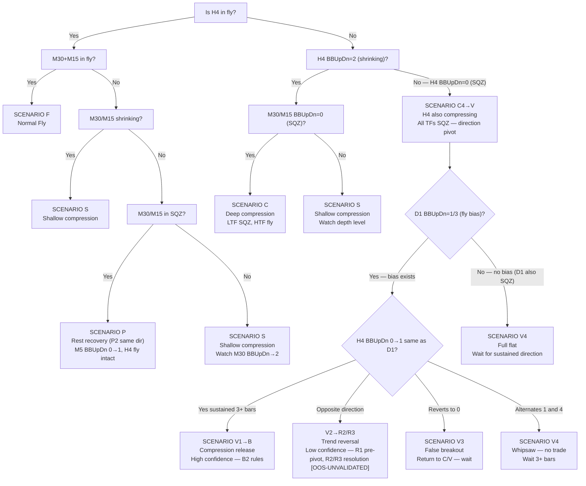

---

# PART 3 — MIDDLE AND LOWER TIMEFRAME SCENARIO ANALYSIS

Apply after HTF context is established.
Read Part 2 HTF context first — every scenario below only makes sense
when you know what H4 + D1 are doing.

Scenarios are organised by **cascade position** — where in the D1→D2
cycle the market currently sits. Two cascade directions drive every cycle:

- **D1 — Compression cascade (HTF → LTF):** HTF tightens → confines TF below → cascades down. HTF is the driver.
- **D2 — Expansion cascade (LTF → HTF):** LTF breaks SQZ first → signal travels upward → HTF confirms last. LTF is the leading indicator.

**Cycle sequence:**
```
F → S → C → R4 → V → B → F (continuation — same direction)
F → S → C → R4 → V → R → F (reversal — new direction)
F → S → P → F (rest — short cycle, shallow D1 only)
V3 false breakout → back to V/C   (failed breakout)
```

**Scenario identification variable priority (normative):**

When BBW_stage conflicts with diffMid_Trend or diffBBW, the scenario MUST be
identified from diffBBW + diffMid_Trend. BBW_stage is a 3-bar lagging label and
is confirmation only — never the primary input.

Priority: diffBBW (fastest) > diffMid_Trend > BBW_stage (slowest).

This applies to every scenario table in Part 3 and every gate/condition in Part 5.
March 2026 verification found 7 lag conflicts, all clustered at scenario transition
timestamps — exactly the moments where acting on the stale label produces wrong
blocks and wrong scenario reads (e.g., 03.09 04:00: BBW=422 SQZ label while
diffBBW=+41.34 — breakout already underway).

---

## TIER 1 — EXPANSION COMPLETE (TOP)

> D2 cascade fully confirmed. All TFs expanding same direction.
> HTF fly intact. Highest entry quality. D1 has not yet begun.

**Scenarios in this tier:** F — Full fly alignment

---

## TIER 2 — COMPRESSION AND BOTTOM (D1)

> HTF compressing downward toward LTF. Trades shorter and size reduces
> as compression depth increases. Includes the BOTTOM state (V) where
> all TFs have fully compressed and D2 direction is about to resolve.

**Scenarios in this tier:**
- S — Shallow compression (D1 at MTF depth, H4 fly intact)
- C — Deep compression (D1 at LTF depth, HTF fly intact, includes C4 formerly V1)
- V — Direction pivot (D1 complete, all TFs SQZ, D2 direction resolving)

---

## TIER 3 — EXPANSION IN PROGRESS (D2)

> LTF breaking out, signal travelling upward toward HTF.
> Entry quality increases as each TF confirms upward.
> Direction may be same as previous trend (P, B) or opposite (R).

**Scenarios in this tier:**
- P — Rest recovery (D2 same direction — shallow D1, H4 never broke)
- B — Compression release (D2 from deep compression, direction known from LTF)
- R — Trend reversal (D2 confirmed in opposite direction to previous trend)

---

## Scenario F — Full Fly Alignment

**When user asks to analyze a part 3 Scenario F:**
- Read `./Backtest_data/extras/backtested_EA_fly_scenario.jpg` as Normal fly scenario visual reference


Chart-image analysis for Scenario F: see [IMAGE_ANALYSIS.md](./IMAGE_ANALYSIS.md#scenario-f).

### Cascade Position — Scenario F

| Dimension | Value |
|-----------|-------|
| Cascade direction now | TOP |
| Cascade depth | None — all fly |
| Leading TF | H4 (watch for shrink) |
| Next scenario if D1 continues | B (Fly → Shrink) |
| Next scenario if D2 initiates same direction | A remains (already at TOP) |
| Next scenario if D2 initiates opposite direction | V (Direction pivot) via reversal |
| Discriminator observable | H4 BBW_stage 511→513 |

> **Tier:** TIER 1 — EXPANSION COMPLETE (TOP)
> **Scenario:** F — Full fly alignment
> **Cascade position:** D2 fully confirmed — all TFs aligned and expanding
> **Cascade direction:** TOP — no active D1 or D2, fully expanded
> **Leading TF:** M15 (entry trigger — FLAT→UP/DN transition)
> **Next scenario:** → S (Shallow compression) when M15 first enters 513/523

### Sub-Scenarios

| Sub | Name | HTF State | MTF State | LTF State | Trade Mode | Size |
|-----|------|-----------|-----------|-----------|------------|------|
| F1 | Strong fly | W1+D1+H4 all 511/512 | H1+M30 511/512 | M15+M5 511/512 | Full trend entry — hold toward D1 outer band | 1.0× |
| F2 | Partial fly | H4 511/512 fly but W1 or D1 counter-trend | H1+M30 511/512 | M15+M5 511/512 | Trend entry, shorter hold — exit at H4 outer band | 0.75× |
| F3 | Noise squeeze | H4+D1+W1 all 511/512 | H1+M30 511/512 | M15 513/523 briefly OR M5 400-499 briefly | HOLD through — Type 1 compression noise | 1.0× |

**Discriminator F1 vs F2:** Check W1 and D1 BBW_stage — both 511/512 = F1, either opposing = F2
**Discriminator F2 vs F3:** F3 is a sub-state within F1 or F2 — M5/M15 brief squeeze only, M30 still 511/512

### Scenario F Sub-State Flowchart

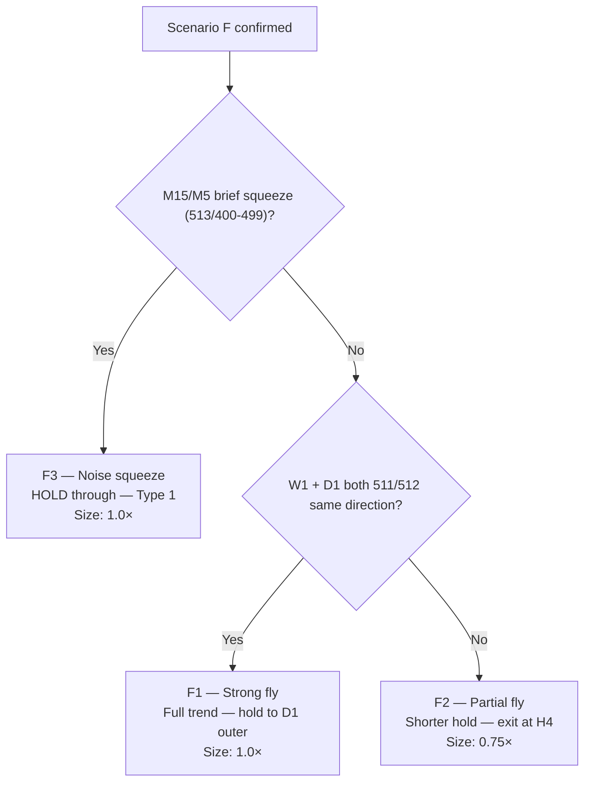

**F-tier priority rule:** When cas_sqzCount=0 AND no diffBBW-confirmed shrink
(i.e., the highest shrink TF has stage 513/523 but its diffBBW is positive or
None — stage label lags), the state is F-tier regardless of LTF opposition or
lagging shrink stage-labels. B-tier requires confirmed compression: either
cas_sqzCount>=1 (any TF in SQZ) OR diffBBW-confirmed shrink at an LTF
(diffBBW negative at that TF). LTF opposition alone — with cas_sqzCount=0 and
no confirmed shrink — does not route to B-tier; it remains F2.

**Decision 6 — D2-vs-D5 conflict resolution (H1 only):** When H1 is in SQZ
for 2+ bars (established — prior bar also in SQZ), C-tier wins over Decision 2's
transient exemption. Decision 2's "transient" exemption applies ONLY to
single-bar mid-TF SQZ. Note: M30/M15 SQZ during H4-fly is transient noise
— Decision 6 applies only to H1 (reliable mid-TF for established compression).
Per-TF tracking via prev_h1_sqz only.

**H1-SQZ recovery rule:** When H1 just exited SQZ (prev_h1_sqz=True but
h1_sqz_now=False) AND compression persists (ltf_shrinkTF>=1), route to C1.
This catches the release phase of established H1-SQZ compression.

**F-tier with mid-TF SQZ note (transient only):** H4 flying, cas_sqzCount>=1
from a single mid-TF (H1/M30), M15 AND M5 still flying, AND no prior-bar SQZ
on that mid-TF → F-tier. If the mid-TF SQZ persists 2+ bars → C-tier (D6).
Mid-TF SQZ flags E may be approaching.

**Discriminator A vs B:** B-tier requires confirmed compression
(cas_sqzCount>=1 OR diffBBW-confirmed shrink). Without confirmed compression,
all h4_fly states with no LTF compression are F-tier.

**HTF context:** W1 fly + D1 fly + H4 fly — all in same direction. Full macro tailwind.

**What you see:**
- H1 (red) and M30 (greenyellow) bands stepping in fly (511/512 or 521/522)
- All bands fanning outward in the same direction
- M5 (aqua) may show 2–3 brief tight bundles mid-fly — noise squeezes
- No mid-band labels visible (mid=1 or 2 — suppressed)
- H4 (yellow) stepping in same direction — macro confirmed

**What it means:**
- Full alignment — strongest possible trend
- Brief M5/M15 compressions are noise — M30 midtrend is the reference
- H4 fly is why brief squeezes resolve back to fly instead of deeper compression
- Price target: H4 outer band → then D1 outer band if D1 is also fly

### Scenario F Identification Flowchart


**Visual confirmation checklist:**

| Visual Cue | Present? |
|-----------|----------|
| All bands expanding outward same direction | [ ] |
| No mid-band labels (mid=1/2) | [ ] |
| H4 stepping in same direction | [ ] |
| Stage labels 511/512/521/522 | [ ] |
| [G6-BUY] or [G6-SELL] gate labels | [ ] |

**5/5 present = Confirmed Scenario F**

---

**Holding vs exiting decision:**

| Condition | Action |
|-----------|--------|
| Brief M5 squeeze (< 3 bars) | HOLD — noise |
| M15 squeeze (< 5 bars) | HOLD — still within fly |
| M30 squeeze (< 10 bars) | HOLD — H4 still flying |
| M15 UP→FLAT transition | EXIT (G5-FADE) |
| M30+M15 both mid≥3 | EXIT (G0) |
| ATRSL stop hit | EXIT (broker closes) |

**Trade action:**
```
BUY:  H1+M30 511/512 + mid=1  →  enter on M15 FLAT→UP transition
SELL: H1+M30 521/522 + mid=2  →  enter on M15 FLAT→DN transition
HOLD: through all brief M5/M15 noise squeezes (< 3 bars)
EXIT: M15 UP→FLAT (G5-FADE) | M30+M15 both sideway (G0) | ATRSL stop hit | H4 outer band reached (G8-BNDTGT)
SIZE: 1.0× (full — highest quality when W1+D1+H4 all aligned)
```

---

## Scenario S — Fly → Shrink (Inner TFs Contracting)

**When user asks to analyze a part 3 Scenario S:**
- Read `./Backtest_data/extras/backtested_EA_fly_2_fly_shrink.jpg` as the Fly to Shrink visual reference.
- Read `./Backtest_data/extras/backtested_EA_fly_2_fly_shrink_zoomin.jpg` as the Fly to Shrink zoomin visual reference


Chart-image analysis for Scenario S: see [IMAGE_ANALYSIS.md](./IMAGE_ANALYSIS.md#scenario-s).

> **Tier:** TIER 2 — COMPRESSION AND BOTTOM (D1)
> **Scenario:** B — Shallow compression
> **Cascade position:** D1 initiated — H4 fly intact, LTF/MTF compressing
> **Cascade direction:** D1 flowing downward — H4 confinement driving MTF/LTF shrink
> **Leading TF:** Lowest TF currently showing BBW_stage 513/523 (frontier of D1)
> **Next scenario:** → C (Deep compression) if depth reaches M30+M15 SQZ
>                   → P (Rest recovery) if LTF breaks SQZ in same direction as H4 mid
>                   → R (Trend reversal) if LTF breaks SQZ in opposite direction to H4 mid

### Sub-Scenarios

| Sub | Name | D1 Depth | H4 | H1 | M30 | M15 | Size | Valid Touch Signal |
|-----|------|----------|----|----|-----|-----|------|--------------------|
| S1 | M15 shrink only | M15 entering 513/523 | 511/512 | 511/512 | 511/512 | 513/523 | 0.75× | M30 outer band BBUpDn=1/2 with mid=4/5 — Type 2 |
| S2 | M30 shrink | M30 also 513/523 | 511/512 | 511/512 | 513/523 | 513/523 | 0.50× | H1 outer band BBUpDn=1/2 with mid=4/5 — Type 2 |
| S3 | H1 shrink | H1 also 513/523 | 511/512 | 513/523 | 513/523 | 513/523 | 0.25× | H4 outer band BBUpDn=1/2 only — Type 2 |

**Touch discrimination during B:** LTF/MTF outer band touches during B are mostly Type 1
(compression geometry — band moved to price, mid=3). Valid signal ONLY when:
PriceLoc=at_upper or at_lower at the HIGHEST still-flying TF AND that TF diffMid=4 or 5 (directional lean).
(BBUpDn_state measures band movement direction: 1=expanding, 2=shrinking, 3=up, 4=dn, 0=no_state — not price location)

**Discriminator B1→S2:** Watch M30 BBW_stage — when M30 enters 513/523, depth increases to S2
**Discriminator B2→S3:** Watch H1 BBW_stage — when H1 enters 513/523, depth increases to S3
**Discriminator B→E:** When M15+M30 both show 400-499 (SQZ) simultaneously → C2

### Scenario S Sub-State Flowchart

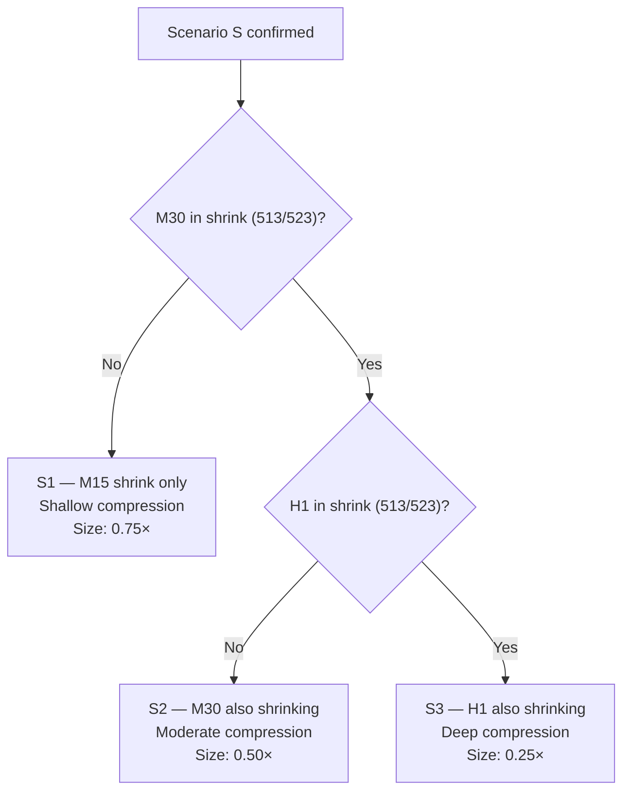

**HTF context:** H4 is still in fly, but M30 or M15 starting to shrink. H4 provides the direction and target; M30/M15 are resting before continuing.

**What you see:**
- H1 (red) and H4 (yellow) still in fly (bands stepping)
- M30 or M15 bands beginning to converge (513/523)
- M5 (aqua) tightening; midtrend labels (3, 4, 5) appear at midband
- Bands that were fanning out are now closing in from one side

**What it means:**
- M30/M15 losing momentum temporarily; H4 macro structure intact
- Price is "resting" inside H4's band before continuing toward H4 outer band
- M5 midtrend transitions are the only valid entry triggers now

**Cascade shrink sequence (why each TF goes sideway):**
- **Only M5 shrink:** M5 resting, M15/M30 still fly → wait — M5 noise within M30 fly
- **M15 shrink** + M30/H1/H4 fly → M15 confined within M30 band; price touches M15 outer band
- **M30 shrink** + H1/H4 fly → M30 confined within H1 band; price touches M30 outer band
- **H1 shrink** + H4 fly → H1 confined within H4 band; price touches H1 outer band

### Scenario S Identification Flowchart

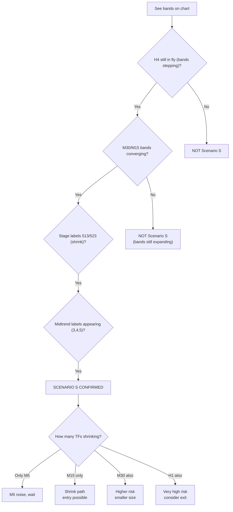

**Visual confirmation checklist:**

| Visual Cue | Present? |
|-----------|----------|
| H4 still in fly (511/512/521/522) | [ ] |
| M30/M15 bands converging (513/523) | [ ] |
| M5 midtrend labels (3,4,5) appearing | [ ] |
| Upper band curling back toward mid | [ ] |

**3/4 present = Confirmed Scenario S**

---

> **Band width reference:** See Part 1 Section 8 — Compression Zone Identification

**Optimal entry timing during shrink:**
- Enter when M15 shrinks but M30/H4 still flying (best quality)
- Avoid when H4 also shrinking (higher risk)
- Enter at M15 midtrend transition (FLAT→UP/DN)
- Wait for quality score ≥ 75

**Trade action:**
```
ENTRY: M15 FLAT→UP (BUY) or FLAT→DN (SELL) transition
WAIT if: only M5 shrinking, M15 still fly — M5 alone is noise
BLOCK: H4 opposing (G4e-H4OPP) | M15 opposing (G4c-M15OPP) | M30 opposing (G4f-M30OPP)
TARGET: outer band of lowest TF still in fly (= where price stops this leg)
EXIT: M15 UP→FLAT (G5-FADE) | cascade into SQZ | outer band touched (G8-BNDTGT)
SIZE: 0.75× (M15 or M30 shrink alone) → 0.50× (M30+H1 both) → 0.25× (all 3 shrink)
```

### Cascade Position — Scenario S

| Dimension | Value |
|-----------|-------|
| Cascade direction now | D1 (compression) |
| Cascade depth | M5 (M30/M15/M5 shrinking) |
| Leading TF | M30 (watch for SQZ or fly resume) |
| Next scenario if D1 continues | C (Confined Compression) |
| Next scenario if D2 initiates same direction | P (Rest Pattern) |
| Next scenario if D2 initiates opposite direction | V (Direction pivot) via reversal |
| Discriminator observable | M30 BBW_stage 513→511/512 or 513→400-499 |

---

## Scenario R — Trend Reversal (consolidated under Scenario V)

> **STATUS: TEMPORARILY DISCARDED FROM TRADE-ACTION CANDIDATES (not deleted — kept for future validation).**
> Reason: these scenarios pivot on **D1-scale** direction (V1/V2 require D1 alignment; R2/R3 require D1 reversal or D1-original). D1 events are **rare** (few per backtest window → sample size below the ~20 needed to validate) and **slow to resolve** (days — the confirmation arrives after the tradeable moment). R1 is additionally `UNIMPLEMENTED` (directional-agreement check not in identify_scenario — currently falls through to F-tier), and the whole V/R branch is already flagged `OOS-UNVALIDATED` in this document.
> Decision: excluded from trade-action testing for now because they are structurally hard to validate (rare + slow + D1-scale). The identification/description logic is RETAINED as reference and may be revisited if fast-timeframe scenarios (S, B) validate and a D1-scale extension becomes worth the sample-size cost.
> To re-activate: a dedicated out-of-sample test with enough D1-scale pivot events (likely requires a multi-year window) must show the scenario separates winners from losers.

> **Timeframe scope for trade-action testing:**
> - **Trigger timeframes (fast — where entries fire): M15, M30.** Frequent bars → enough events to validate; fast to resolve so the signal is actionable.
> - **Context / gate timeframes (medium-slow — higher-TF backdrop the trigger must agree with): H1, H4.** Used as confirmation/context around a fast trigger, NOT as the entry trigger themselves. H1/H4 is the slowest timeframe used in active testing.
> - **Excluded (too slow to act on): D1, W1.** Too few bars per backtest window (sample size below the ~20 needed to validate) and too slow to resolve (confirmation arrives days after the tradeable moment). D1/W1 states may still be READ as background context, but no scenario is triggered or validated on a D1/W1 signal for now.
>
> Rationale: signal frequency must match trade frequency. Entries happen on fast-TF moves (M15/M30); gating on D1/W1 cannot inform most trades because those states barely change across many trades. This is the same reasoning behind discarding the D1-scale V/R scenarios. Revisit D1/W1 only if a multi-year window and a proven fast-TF edge justify the sample-size cost.

Scenario R (the reversal progression R1 → C4 → V2 → R2/R3) is documented
under **Scenario V** as the "Reversal Progression" (formerly Scenario R),
because C is structurally the G-reversal branch (V2 is the pivot; C
resolves it).

- **R1** — pre-pivot divergence: M30 (and M15) reversed opposite a still-
  flying H4 (H4 original 511/512). Brief early window. H1 still original/
  lagging. [UNIMPLEMENTED — directional-agreement check not in
  identify_scenario]
- **C4 / V2** — H4 compresses (C4) then pivots opposite to D1 (V2).
- **R2/R3** — post-pivot resolution: H4 flipped; R2 = D1 also reversed
  (full → new F); R3 = D1 still original (counter-trend).

Full sub-state tables, discriminators, and the cascade sequence: see
[Scenario V — Reversal Progression](#scenario-v--direction-pivot-formerly-scenario-h).

[OOS-UNVALIDATED, UNIMPLEMENTED — DESIGN Phase 3]

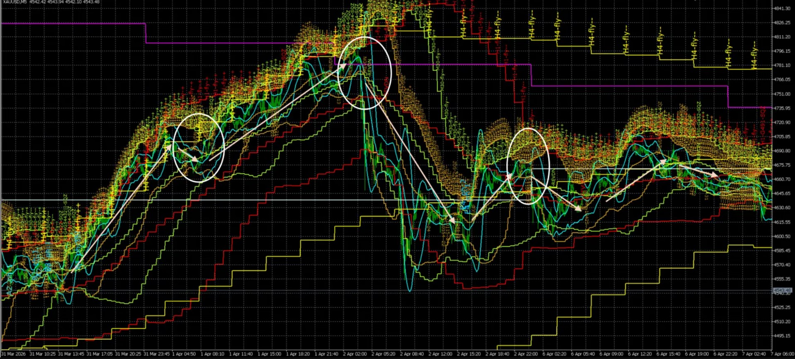

*April 1-2, 2nd circle (left→right) — the F2 → R1 progression. At the 2nd
circle (04.01 14:30), M30 was still flying UP (511/512, diffMid_Trend=1.0)
aligned with H4 → classified F2. The reversal then propagated bottom-up: M30
reversed to down-fly (521) ~13-15 hrs later (04.02 ~04:30-05:00, gradually
1→3→2 through SQZ) while H4 was still flying → this is the R1 state (M30
opposite a still-flying H4). So the circle is the F2 ENTRY; R1 occurs as M30
reverses, time-shifted from the visible circle. R1's directional-agreement
detection is UNIMPLEMENTED — currently this falls through to F-tier.
[OOS-UNVALIDATED, UNIMPLEMENTED — DESIGN Phase 3]*

---

## Scenario P — Rest Recovery

**When user asks to analyze part 3 Scenario P:**
- Read `./Backtest_data/extras/backtested_EA_fly_2_shrink_2_fly.jpg` as the Fly to Shrink to Fly scenario visual reference.
- Read `./Backtest_data/extras/backtested_EA_fly_2_shrink_2_fly_zoomin.jpg` as the Fly to Shrink to Fly zoomin scenario visual reference.


Chart-image analysis for Scenario P: see [IMAGE_ANALYSIS.md](./IMAGE_ANALYSIS.md#scenario-d).

### Cross-Image Conclusion

| Image | Cascade Position | Depth | Leading TF | Key Observable |
|-------|-----------------|-------|------------|----------------|
| Image 1 | D1→D2 transition | M5 SQZ (BOTTOM) | M5 | M5 REVUP — SQZ break |
| Image 2 | D2 complete — TOP | None | M30 | M30 fly re-confirmed |

**Progression confirmed:** D1 compression (M5 SQZ) → BOTTOM → D2 expansion (M5→M15→M30 fly) → TOP (Scenario F)
**Touch type evolution:** Type 1 (compression) image 1 → Type 2 (breakout) image 2
**Entry point:** Image 2 — M15 FLAT→UP transition with M30 fly confirmation
**Duration observed:** [TO BE FILLED — count bars from D1 start to D2 complete]

> **Tier:** TIER 3 — EXPANSION IN PROGRESS (D2)
> **Scenario:** P — Rest recovery
> **Cascade position:** D2 initiated in same direction as previous trend — shallow D1 rest
> **Cascade direction:** D2 flowing upward — M5 led, MTF confirming
> **Leading TF:** M5 (BBUpDn 2→1 expanding), then M15 (entry trigger: mid flip)
> **Previous scenario:** Came from B (Shallow compression) — H4 fly maintained throughout
> **Next scenario:** → F (Full fly alignment) when MTF re-aligns fully (D3 complete)

### Sub-Scenarios

| Sub | Name | Gate | H4 | H1 | M30 | M15 | M5 | Entry | Size |
|-----|------|------|----|----|-----|-----|----|-------|------|
| D1 | M5 break | G6-LOAD fires | 511/512 | 511/512 | 513/523 or 400-499 | 513/523 or 400-499 | Breaking SQZ — REVUP/REVDN | WAIT — arm only, M15 not confirmed | — |
| D2 | M15 confirm | G6-BUY/SELL fires | 511/512 | 511/512 | 511/512 or 513 | FLAT→UP/DN transition | 511/512 | ENTER — M15 mid flip is the trigger | 0.75× |
| D3 | MTF re-align | — | 511/512 | 511/512 | 511/512 | 511/512 | 511/512 | Hold existing / add if quality ≥ 90 | → 1.0× |

**D1 sub-state BBUpDn sequence:** M5 BBUpDn_state 2→1 (shrinking→expanding) = band actively expanding = D2 signal initiated. PriceLoc simultaneously transitions from at_lower → above_upper as expansion drives price upward.
**D2 trigger:** M15 mid=3 → mid=1 (REVUP) or mid=3 → mid=2 (REVDN) = G6-BUY/SELL fires
**D3 confirmation:** M30 BBW_stage reaches 511/512 = D2 fully confirmed → back toward A

**HTF context:** W1/D1 remain in fly throughout. H4 also stays in fly. Only M30/M15/M5 briefly compress. The macro tailwind (H4 fly) guarantees fly resumes.

**What you see:**
- H1 (red) and H4 (yellow) never reverse their stepping structure
- White rectangles: M30/M15/M5 briefly compress then re-expand in the same direction
- After each rectangle: full fly resumes, all bands fan back out

**Key test — rest vs reversal:** H1 (red) maintains its step direction throughout. If H1 never breaks, this is a rest pattern. If H1 reverses direction, it is a true reversal.

### Scenario P Identification Flowchart

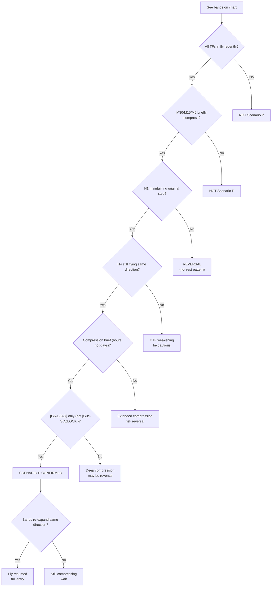

**Visual confirmation checklist:**

| Visual Cue | Present? |
|-----------|----------|
| H1 step direction maintained | [ ] |
| H4 step direction maintained | [ ] |
| Compression was brief (hours) | [ ] |
| Only [G6-LOAD] labels (no [G0c-SQZLOCK]) | [ ] |
| Bands re-expand same direction | [ ] |

**5/5 present = Confirmed Scenario P (Rest Pattern)**

---

**Rest vs reversal identification checklist:**

| Indicator | Rest Pattern | Reversal Pattern |
|-----------|-------------|------------------|
| H1 step direction | Maintained | Reversed |
| H4 step direction | Maintained | May reverse |
| Compression duration | Brief (hours) | Extended (days) |
| Band expansion after compression | Same direction | Opposite direction |
| HTF fly throughout | Yes | No — HTF also compresses |
| Gate labels during rest | [G6-LOAD] only | [G0c-SQZLOCK], [G0b-PINK] |

**Zones in the zoom:**
- Yellow (left): initial fly — all bands expanding
- Red (center): M30/M15 shrink; H4 step unchanged
- Purple/magenta: brief SQZ — `[G6-LOAD]` logging; wait for M5 break
- White (right): fly resumes — M5 SQZ break → `[G6-BUY]` → M15/M30 follow

**Trade action:**
```
DURING shrink: enter on M5 FLAT→UP/DN via shrink path (G6-BUY/SELL)
DO NOT wait for all TFs to re-align — M5 SQZ break IS the entry
TARGET: resume toward H4 outer band (H4 fly context)
EXIT: ATRSL stop | M5 UP→FLAT (G5-FADE) | M30+M15 go sideway
```

### Cascade Position — Scenario P

| Dimension | Value |
|-----------|-------|
| Cascade direction now | D2 (expansion — fly resuming) |
| Cascade depth | TOP — all fly again |
| Leading TF | M30 (confirm fly = full entry) |
| Next scenario if D1 continues | B (Fly → Shrink) |
| Next scenario if D2 initiates same direction | F (Normal Fly) |
| Next scenario if D2 initiates opposite direction | V (Direction pivot) via reversal |
| Discriminator observable | H1 step direction maintained or reversed |

---

## Scenario C — Deep Compression

**When user asks to analyze part 3 Scenario C:**
- Read `./Backtest_data/extras/backtested_EA_fly_shrink_2_sideway.jpg` as the Shrink to sideway scenario visual reference.
- Read `./Backtest_data/extras/backtested_EA_fly_shrink_2_sideway_zoomin.jpg` as the Shrink to sideway zoomin scenario visual reference.
- Read `./Backtest_data/extras/backtested_EA_fly_shrink_2_sideway2.jpg` as the Shrink to sideway 2 scenario visual reference.


### Image 1 Analysis — backtested_EA_fly_shrink_2_sideway.jpg


### Image 2 Analysis — backtested_EA_fly_shrink_2_sideway_zoomin.jpg


### Image 3 Analysis — backtested_EA_fly_shrink_2_sideway2.jpg

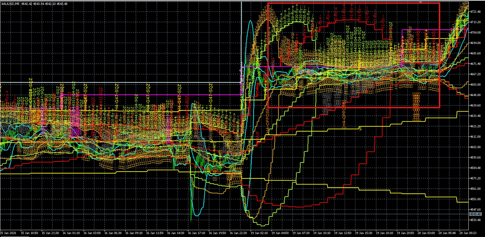

Chart-image analysis for Scenario C: see [IMAGE_ANALYSIS.md](./IMAGE_ANALYSIS.md#scenario-c).

**Zone progression table (preserved from original analysis):**

| Zone | H4 State | H1 State | M30 State | M15 State | M5 State |
|------|----------|----------|-----------|-----------|----------|
| Zone 1 (left) | Fly expand (511/512/521/522) | Fly expand | Fly | Fly | Fly |
| Zone 2 | Fly expand (MAINTAINED) | Fly expand (MAINTAINED) | Shrink (513/523) | Shrink (513/523) | Shrink (513/523) |
| Zone 3 (red) | Fly expand (MAINTAINED) | Fly expand (MAINTAINED) | SQZ (400-499) | SQZ (400-499) | SQZ (400-499) |
| Zone 4 | Fly expand (MAINTAINED) | Fly expand (MAINTAINED) | SQZ (400-499) | SQZ (400-499) | SQZ (400-499) |
| Zone 5 (red) | Fly expand (MAINTAINED) | Fly expand (MAINTAINED) | SQZ (400-499) | SQZ (400-499) | SQZ (400-499) |
| Zone 6 | Fly expand (MAINTAINED) | Fly expand (MAINTAINED) | Shrink (513/523) | Shrink (513/523) | Shrink (513/523) |

**Gate firing sequence (preserved from original analysis):**
1. M5 begins shrink → G0b-M5OPP may block
2. M15 begins shrink → G4c-M15OPP may block
3. M30 SQZ → G0c-SQZLOCK (magenta) appears for lower TFs
4. M15+M30 both SQZ → G0b-PINK (magenta)
5. All lower TF mid≥3 → G0b-SQZLOCK (crimson)
6. M5 breaks SQZ → G6-LOAD → G6-BUY/SELL

**Midband transitions (preserved from original analysis):**
```
H4: mid=1/2 MAINTAINED — provides directional context
H1: mid=1/2 MAINTAINED — follows H4
M30: mid=1/2 → mid=3/4/5 → mid=3 persistent
M15: mid=1/2 → mid=3/4/5 → mid=3 persistent
M5: mid=1/2 → mid=3/4/5 → mid=3 persistent (first)
```

### Cross-Image Conclusion

| Image | Cascade Position | Depth | Leading TF | Key Observable |
|-------|-----------------|-------|------------|----------------|
| Image 1 | D1 compression active | M5 SQZ (BOTTOM) | M5 | Sequential compression: M5→M15→M30 |
| Image 2 | D2 initiated | M5 broke SQZ | M5 | REVUP/REVDN + G6-LOAD |
| Image 3 | D1 full cycle (6 zones), D2 zone 6 | M5 SQZ→break | M5 | Zone progression: fly→shrink→SQZ→release |

**Progression confirmed:** D1 compression (zone 1→2→3-5) → BOTTOM (zone 3-5, all SQZ) → D2 expansion (zone 6, M5 break) → partial TOP
**Touch type evolution:** Type 1 (shrink entry) image 1 → Type 3 (SQZ peak) image 1/3 → Type 2 (breakout) image 2/3
**Entry point:** Image 2/3 — M5 SQZ break + M15 FLAT→UP/DN transition
**Duration observed:** 6 zones — fly (1) → shrink (2) → SQZ peak (3-5) → release (6)

### Scenario C Identification Flowchart

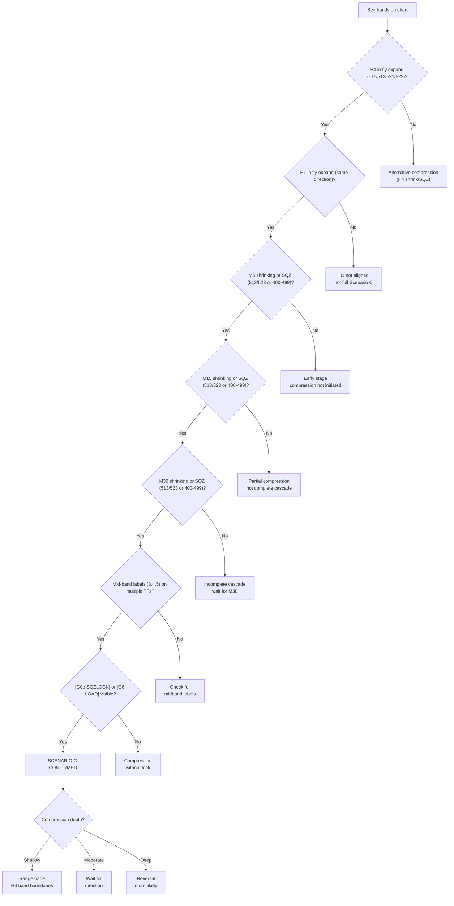

**Critical insight:** H4/H1 fly expand while M30/M15/M5 compress means compression is confined within the HTF trend.
H4 provides the direction and target — lower TFs oscillate within H4's band envelope.

**Cascade compression sequence:**

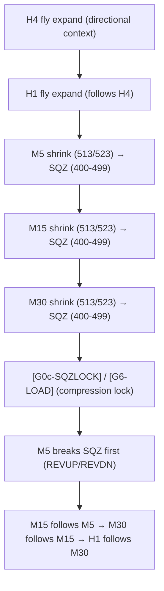

**Visual confirmation checklist:**

| Visual Cue | Present? |
|-----------|----------|
| H4 in fly expand (511/512/521/522) | [ ] |
| H1 in fly expand (bands fanning) | [ ] |
| M5 shrinking or SQZ | [ ] |
| M15 shrinking or SQZ | [ ] |
| M30 shrinking or SQZ | [ ] |
| Mid-band labels on multiple TFs | [ ] |
| [G0c-SQZLOCK] or [G6-LOAD] labels | [ ] |

**5/7 present = Confirmed Scenario C (minimum: H4 fly, H1 fly, M5/M15/M30 compress, midband labels)**

---

### Flowchart Verification Against Images

**Flowchart checkpoints verified with image evidence:**

| Checkpoint | Image Evidence | Matches? |
|-----------|---------------|----------|
| H4 fly expand (511/512/521/522) | Yellow band shows H4-Fly++/H4-Fly+- labels, bands fanning | ✓ Yes |
| H1 fly expand | Red bands fanning same direction as H4 | ✓ Yes |
| M5 shrink→SQZ | Aqua bands collapse first | ✓ Yes |
| M15 shrink→SQZ | Goldenrod bands collapse, M15-Fly-- | ✓ Yes |
| M30 shrink→SQZ | Green bands collapse, M30-Fly-- | ✓ Yes |
| Mid-band labels multiple TFs | 3, 4, 5 labels across M15/M30/H1 | ✓ Yes |
| [G0c-SQZLOCK]/[G6-LOAD] visible | G6-LOAD (gold) visible | ✓ Yes |

**7/7 checkpoints confirmed by image evidence**
**Flowchart is VERIFIED accurate — H4/H1 fly expand confirmed in Image 3**

---

### Per-Timeframe Midband (BB_diffMid_Trend) Behavior

**H4 (Yellow Band):**
- Fly expand context: mid=1 (up) or mid=2 (dn) — directional fly MAINTAINED
- Fly expand provides directional context — H4 does NOT compress
- Image evidence: "H4-Fly++" / "H4-Fly+-" labels; bands fanning outward; mid=1/2 maintained
- **Trade impact:** H4 fly provides confirmation and direction for M15 transitions; G0b-H4OPP does NOT block

**H1 (Red Band):**
- Fly expand context: mid=1 (up) or mid=2 (dn) — directional fly MAINTAINED
- H1 follows H4 in fly — provides confirmation
- Image evidence: Red bands fanning, mid=1/2 maintained
- **Trade impact:** H1 fly provides additional confirmation; G0b-SQZLOCK may fire for lower TFs only

**M30 (Green-Yellow Band):**
- Fly expand initially: mid=1 (up) or mid=2 (dn)
- Yellow rectangle (shrink begins): mid transitions to 3 or 4/5 — green bands narrow
- Red rectangle (full SQZ): mid=3 persistent — "M30-SQZ" labels
- Image evidence: Green bands collapse flat, mid=3 labels appear as compression cascades down
- **Trade impact:** G4f-M30OPP blocks; G0 fires with M15 mid≥3

**M15 (Goldenrod Band):**
- Fly expand initially: mid=1 (up) or mid=2 (dn)
- Yellow rectangle (shrink begins): mid transitions to 3 or 4/5 — goldenrod narrows
- Red rectangle (full SQZ): mid=3 persistent — "M15-SQZ" labels
- Image evidence: Goldenrod bands collapse flat, mid=3 labels
- **Trade impact:** G4c-M15OPP blocks; G0b-PINK fires with M30 SQZ; entry on FLAT→UP/DN transition

**M5 (Aqua Band):**
- Fly expand initially: mid=1 (up) or mid=2 (dn)
- Yellow rectangle (shrink begins): mid transitions to 3 or 4/5 — first to collapse
- Red rectangle (full SQZ): mid=3 persistent
- Image evidence: Aqua bands collapse flat first
- **Trade impact:** G0b-M5OPP blocks; G0b-M5FLY blocks; G0b-PINK fires with M15 SQZ

---

### Per-Timeframe Outer Band Touch Behavior

**Touch Count Patterns During H4 Fly + LTF Compression (from image evidence):**

| Timeframe | Upper Touch (U) | Mid Touch (M) | Lower Touch (L) |
|-----------|-----------------|---------------|-----------------|
| H4 | 1-2 per 5 bars | 1-2 bars | 1-2 bars |
| H1 | 1-2 per 5 bars | 1-2 bars | 1-2 bars |
| M30 | 0-1 per 5 bars | 2 bars | 2-3 bars |
| M15 | 1-2 per 5 bars | 1-2 bars | 1-2 bars |
| M5 | 1-2 per 5 bars | 1-2 bars | 1-2 bars |

**H4 Touch Behavior (Fly Expand Context):**
- Balanced U/M/L touches — price oscillates between H4 upper and lower bands
- H4 bands provide range boundaries for confined compression
- Touches at H4 upper/lower bands = range trade entry points
- Shift from L to U touches indicates pre-breakout loading

**H1 Touch Behavior (Fly Expand Context):**
- Balanced touches as H1 follows H4
- H1 provides directional context
- Touches at H1 bands indicate local support/resistance

**M30 Touch Behavior (Confined Compression):**
- Balanced M/L touches (M2, L2-3) — oscillating within H4 envelope
- Builds pressure at lower band before potential breakout
- Few upper touches during compression phase

**M15 Touch Behavior (Confined Compression):**
- More balanced U/M/L (U1-2, M1-2, L1-2) — confined oscillation
- L touches increase near compression peak
- U touches increase as breakout approaches

**M5 Touch Behavior (Confined Compression):**
- Balanced U/M/L — rapid confined oscillation within H4 envelope
- L touches build support at compression peak
- First to show upper touches as breakout initiates

---

### Touch Patterns During H4 Fly Expand + LTF Compression

**Touch dynamics in confined compression context:**

| Touch Type | Behavior | Interpretation |
|-----------|----------|----------------|
| U (upper) | Increasing as price reaches H4 upper band | Upper band testing — sell opportunity (G0b-TOUCH) |
| M (mid) | During oscillation between bands | Confined range trade context |
| L (lower) | Increasing as price reaches H4 lower band | Lower band testing — buy opportunity (G0b-TOUCH) |

**Pre-breakout loading indication:**
- Shift from L to U touches indicates loading phase
- U touches increasing suggests upward breakout likely
- L touches persistent suggests continued compression

**Range trade opportunities:**
- Sell when U touches high (price at H4 upper band)
- Buy when L touches high (price at H4 lower band)
- Exit at midband or opposite band touch

---

### Compression Stage Progression (Image-Specific Analysis)

**Stage 1 — H4 Fly Expand + M5 Begins Shrink**
```
H4: Stage 511/512/521/522 (fly expand)
   mid: 1 or 2 (directional)
   tch: Directional touches building
   → H4 provides strong directional context

H1: Stage 511/512/521/522 (fly expand)
   mid: 1 or 2 (directional)
   tch: Directional touches
   → H1 follows H4

M5: Stage 511/512 → 513/523 (first to shrink)
   mid: 1 or 2 → 3 or 4/5
   → M5 begins localized compression

M15/M30: Still fly with directional mid
   → Not yet compressed
```
**Trade status:** Entries still possible; M5 compression is localized noise

---

**Stage 2 — M15 Shrink, Mid-band Labels Appear**
```
H4: Stage 511/512/521/522 (fly expand maintained)
   mid: 1 or 2 (directional)
   tch: Directional touches
   → H4 provides directional context

H1: Stage 511/512/521/522 (fly expand maintained)
   mid: 1 or 2 (directional)
   tch: Directional touches
   → H1 follows H4

M5: Stage 513/523 (shrink deepening)
   mid: 3 or 4/5
   tch: Midband labels appearing
   → M5 compression progressing

M15: Stage 513/523 (beginning shrink)
   mid: 1 or 2 → 3 or 4/5
   tch: Midband labels begin appearing
   → M15 begins localized compression

M30: Stage 511/512/521/522 (still fly)
   mid: 1 or 2
   → Not yet compressed
```
**Trade status:** M15 transitions possible with quality boost from H4/H1 fly confirmation

---

**Stage 3 — M30 Shrink, [G6-LOAD] Visible**
```
H4: Stage 511/512/521/522 (fly expand maintained)
   mid: 1 or 2 (directional)
   tch: Directional touches
   → H4 provides directional context

H1: Stage 511/512/521/522 (fly expand maintained)
   mid: 1 or 2 (directional)
   tch: Directional touches
   → H1 follows H4

M5: Stage 400-499 (SQZ)
   mid: 3 persistent
   tch: Midband labels persistent
   → M5 fully compressed

M15: Stage 513/523 → 400-499 (shrink to SQZ)
   mid: 3 or 4/5
   tch: Midband labels appearing
   → M15 approaching full compression

M30: Stage 513/523 (beginning shrink)
   mid: 1 or 2 → 3 or 4/5
   tch: Midband labels beginning
   → M30 begins localized compression
   → [G6-LOAD] labels become visible
```
**Trade status:** Range trade at H4 band boundaries; entry on M15 transition with H4 confirmation

---

**Stage 4 — M5/M15/M30 All SQZ, [G0c-SQZLOCK] Fires**
```
H4: Stage 511/512/521/522 (fly expand maintained)
   mid: 1 or 2 (directional)
   tch: Directional touches
   → H4 provides directional context

H1: Stage 511/512/521/522 (fly expand maintained)
   mid: 1 or 2 (directional)
   tch: Directional touches
   → H1 follows H4

M5: Stage 400-499 (SQZ persistent)
   mid: 3 persistent
   tch: Midband labels persistent

M15: Stage 400-499 (SQZ)
   mid: 3 persistent
   tch: Midband labels persistent
   → M15 fully compressed

M30: Stage 400-499 (SQZ)
   mid: 3 persistent
   tch: Midband labels persistent
   → M30 fully compressed
   → [G0c-SQZLOCK] fires
```
**Trade status:** All lower TFs compressed; range trade only at H4 boundaries; [G6-LOAD] visible

---

**Stage 5 — Full Compression Lock, G0b-PINK Active**
```
H4: Stage 511/512/521/522 (fly expand maintained)
   mid: 1 or 2 (directional)
   tch: Directional touches
   → H4 provides directional context

H1: Stage 511/512/521/522 (fly expand maintained)
   mid: 1 or 2 (directional)
   tch: Directional touches
   → H1 follows H4

M5/M15/M30: Stage 400-499 (SQZ persistent)
   mid: 3 persistent on all TFs
   tch: Midband labels persistent on all TFs
   → All lower TFs fully compressed
   → G0b-PINK active
```
**Trade status:** Full compression lock; no new entries; wait for M5 SQZ break to resume fly

---

### Gate Firing Mechanics During Compression

| Compression Stage | Gate Status | Action |
|-------------------|-------------|--------|
| H4 fly, H1 fly, M5 begins shrink | G4c-M15OPP/G4f-M30OPP may block | Entry on M15 transition with H4/H1 confirm |
| H4 fly, H1 fly, M30/M15 begin shrink | G0c-SQZLOCK may appear | Entry on M15 transition possible |
| H4 fly, H1 fly, M30/M15/M5 all SQZ | G0c-SQZLOCK (magenta) | No new entries — wait |
| H4 fly, H1 fly, M30 SQZ + M15 SQZ | G0b-PINK (magenta) | Exit all positions |
| Lower TF mid≥3 only (M30+M15) | G0b-SQZLOCK | No new entries |
| Float loss < -$50 | G0e-MAXLOSS | Emergency exit |
| M5 breaks SQZ | G6-LOAD → G6-BUY/SELL | Entry on REVUP/REVDN |

---

> **Tier:** TIER 2 — COMPRESSION AND BOTTOM (D1)
> **Scenario:** C — Deep compression
> **Cascade position:** D1 deep — LTF fully SQZ, HTF fly maintained (C1-C3) or HTF also compressing (C4)
> **Cascade direction:** D1 complete at LTF level — BOTTOM approaching
> **Leading TF:** M5 (watch for BBUpDn 0→1 transition = D2 initiation signal)
> **Previous scenario:** Came from S3 (H1 also shrinking)
> **Next scenario:** → V (Direction pivot) when M5 BBUpDn flips 0→1 and M15 mid confirms
>                   → C4 if H4 also starts compressing (D1 deepens to HTF level)

### Sub-Scenarios

| Sub | Name | H4 BBW | H4 BBUpDn | H1 BBW | H1 BBUpDn | M30 BBW | M30 BBUpDn | M15 BBW | M5 BBW | Touch class | Gate | Trade |
|-----|------|--------|-----------|--------|-----------|---------|------------|---------|--------|-------------|------|-------|
| C1 | LTF partial SQZ | 511/512 | 1 or 3 | 511/512 or 513 | 1/2/3 | 513/523 | 2 | 400-499 | 400-499 | Noise at M30, SQZ-peak at M15 | G0c-SQZLOCK | No new entries |
| C2 | LTF full SQZ | 511/512 | 1 or 3 | 511/512 or 513 | 2/3 | 400-499 | 0 | 400-499 | 400-499 | SQZ-peak all LTF — alternating PriceLoc | G0b-PINK | EXIT all |
| C3 | M5 loading | 511/512 | 1 or 3 | 511/512 | 1 or 3 | 513/523 | 2→1 | 513 | Breaking SQZ | Signal at M5 — BBUpDn 0→1 | G6-LOAD | ARM — wait M15 mid confirm |
| C4 | H4 also compressing | 513/523 or 400-499 | 2 or 0 | 400-499 | 0 | 400-499 | 0 | 400-499 | 400-499 | SQZ-peak all TFs | G0b-PINK + G0c-SQZLOCK | NO ENTRY — transition to G |

**C2 BBUpDn sequence:** M5 BBUpDn_state alternates 0 (no_state) and 2 (shrinking) on consecutive bars = SQZ peak, band so narrow it catches every candle = G0b-PINK
**C3 BBUpDn sequence:** M5 BBUpDn_state 2→1 (shrinking→expanding) = band actively expanding upward = D2 initiated = G6-LOAD fires. PriceLoc transitions from at_lower → above_upper confirming breakout direction.

**C4 note:** When H4 BBUpDn transitions from 1/3 to 2 (shrinking)
while LTF already SQZ — D1 has now reached HTF level. This is the deepest compression state.
All TFs SQZ simultaneously → transition to Scenario V (Direction pivot).
D2 direction will be determined by which side H4 breaks SQZ toward.
If D1 is still fly (D1 BBUpDn=1/3), that D1 direction gives the bias for V1 sub-state.

### Scenario C Sub-State Flowchart

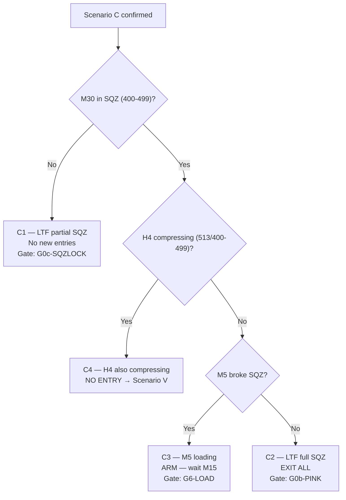

**Touch rule in E:** During C1/C2 all LTF touches are Type 1 or Type 3 (noise/geometry).
Only M5 BBUpDn_state 2→1 transition (shrinking→expanding = band actively expanding) combined with PriceLoc=above_upper is the valid Type 2 signal.

**HTF context:** H4 is in fly expand — providing directional context and clear outer band target. H1 follows H4 in fly. M30/M15/M5 are confined within H4's band envelope and oscillate between H4 upper and lower bands. Compression is localized to lower TFs — HTF trend is strong.

**What you see:**
- H4 (yellow) fanning outward in fly expand — bands stepping directionally
- H1 (red) fanning outward in fly expand — following H4 direction
- M5/M15/M30 bands collapsed to near-flat — confined within H4's band envelope
- Mid-band labels (3, 4, 5) appear on M15/M30 midbands
- Price oscillating between H4 upper and lower bands (range trade context)
- Gate labels: `[G0c-SQZLOCK]` (magenta), `[G0b-SQZLOCK]` (magenta), `[G6-LOAD]` (gold)

**Why each zone is ranging (from zoom, Jan 13–15):**
- **H1 fly + lower TF compression** (Jan 13): H4/H1 fly expand → lower TFs compress within H4 envelope; M5 transitions possible
- **M30/M15 fly down + confined compression** (Jan 14 12:20): M30/M15 compress while H4/H1 fly → range trade at H4 band boundaries
- **Touch H4 lower** (Jan 14 15:30): Price reaches H4 lower band → buy at touch (G0b-TOUCH), bounce toward H4 upper
- **H4/H1 fly + full lower TF compression** (Jan 14 20:50–Jan 15 05:50): H4/H1 fly provides context → lower TF oscillate between H4 bands
- **H4 fly + confined range trade** (Jan 15 11:10): H4 fly → range trade between H4 upper and H4 lower
- **Pink zone** (Jan 15 19:10): M15+M5 both SQZ → G0b-PINK → exit all, wait for SQZ break

---

## Yellow Rectangle Analysis (H4 Fly Expand + Confined Compression Initiation)

**Yellow rectangles indicate:** H4 fly expand provides directional context → MTF compresses within H4's envelope → Lower TFs start confined compression

**Image evidence — detailed timeframe behavior from all 3 images:**


---

### Comprehensive Yellow Rectangle Behavior (All 3 Images)

**H4 (Yellow Band) in Yellow Rectangle (Fly Expand Context):**

| Attribute | Behavior |
|-----------|----------|
| Stage | 511/512/521/522 (fly expand MAINTAINED) |
| Midband | mid=1/2 (directional MAINTAINED) |
| Band state | Stepping directionally — provides context for lower TF compression |
| Touch pattern | Directional touches building |
| Gate firing | None — H4 provides confirmation |
| Chart labels | "H4-Fly++" / "H4-Fly+-" persistent |
| Compression depth | No compression — provides directional envelope |

**H1 (Red Band) in Yellow Rectangle (Fly Expand Context):**

| Attribute | Behavior |
|-----------|----------|
| Stage | 511/512/521/522 (fly expand MAINTAINED) |
| Midband | mid=1/2 (directional MAINTAINED) |
| Band state | Stepping — follows H4 direction |
| Touch pattern | Balanced touches |
| Gate firing | [G0c-SQZLOCK] may appear for lower TFs only |
| Chart labels | Midband labels (3, 4, 5) on lower TF midbands only |
| Compression depth | No compression — follows H4 fly |

**M30 (Green Band) in Yellow Rectangle:**

| Attribute | Behavior |
|-----------|----------|
| Stage | 511/512 (fly) → 513/523 (shrink) → 400-499 (SQZ) |
| Midband | mid=1/2 → mid=3/4/5 (sideway with bias) |
| Band state | Expanding → narrowing → flat |
| Touch pattern | L touches building (L2-3 per 5 bars) |
| Gate firing | G4f-M30OPP (orange) blocks |
| Chart labels | "M30-Fly--" appears, then "M30-SQZ" |
| Compression depth | Shallow to moderate |

**M15 (Goldenrod Band) in Yellow Rectangle:**

| Attribute | Behavior |
|-----------|----------|
| Stage | 511/512 (fly) → 513/523 (shrink) → 400-499 (SQZ) |
| Midband | mid=1/2 → mid=3/4/5 (sideway with bias) |
| Band state | Expanding → narrowing → flat |
| Touch pattern | L touches building, then oscillation (L1-2, M1-2) |
| Gate firing | G4c-M15OPP (orange) blocks |
| Chart labels | "M15-Fly--" appears, then "M15-SQZ" |
| Compression depth | Shallow |

**M5 (Aqua Band) in Yellow Rectangle:**

| Attribute | Behavior |
|-----------|----------|
| Stage | 511/512 (fly) → 513/523 (shrink) → 400-499 (SQZ) |
| Midband | mid=1/2 → mid=3/4/5 (sideway with bias) |
| Band state | Expanding → narrows → flat (first to collapse) |
| Touch pattern | Rapid oscillation (L1-2, M1-2, U1-2) |
| Gate firing | G0b-M5OPP (magenta), G0b-M5FLY (magenta) |
| Chart labels | Aqua midband labels (3, 4, 5) appear first |
| Compression depth | Very shallow (fastest to compress/release) |

---

### Comprehensive Red Rectangle Behavior (All 3 Images)

**H4 (Yellow Band) in Red Rectangle (Fly Expand Context):**

| Attribute | Behavior |
|-----------|----------|
| Stage | 511/512/521/522 (fly expand MAINTAINED) |
| Midband | mid=1/2 (directional MAINTAINED) |
| Band state | Stepping directionally — provides context |
| Touch pattern | Directional touches |
| Gate firing | None — H4 provides confirmation |
| Chart labels | "H4-Fly++" / "H4-Fly+-" persistent |
| Compression depth | No compression — provides directional envelope |

**H1 (Red Band) in Red Rectangle (Fly Expand Context):**

| Attribute | Behavior |
|-----------|----------|
| Stage | 511/512/521/522 (fly expand MAINTAINED) |
| Midband | mid=1/2 (directional MAINTAINED) |
| Band state | Stepping — follows H4 direction |
| Touch pattern | Balanced touches |
| Gate firing | [G0c-SQZLOCK] for lower TFs only |
| Chart labels | Mid=1/2, [G0c-SQZLOCK] on lower TF midbands |
| Compression depth | No compression — follows H4 fly |

**M30 (Green Band) in Red Rectangle:**

| Attribute | Behavior |
|-----------|----------|
| Stage | 400-499 (full SQZ) — persistent |
| Midband | mid=3 persistent (flat) |
| Band state | Completely flat — no direction |
| Touch pattern | L touches persistent (L2-3 per 5 bars) |
| Gate firing | G0b-SQZLOCK (magenta) with H1 mid=3 |
| Chart labels | "M30-SQZ" visible |
| Compression depth | Very deep |

**M15 (Goldenrod Band) in Red Rectangle:**

| Attribute | Behavior |
|-----------|----------|
| Stage | 400-499 (full SQZ) — persistent |
| Midband | mid=3 persistent (flat) |
| Band state | Completely flat |
| Touch pattern | Balanced oscillation (L1-2, M1-2, U1-2) |
| Gate firing | G0b-PINK (magenta) with M30 SQZ |
| Chart labels | "M15-SQZ" visible |
| Compression depth | Deep |

**M5 (Aqua Band) in Red Rectangle:**

| Attribute | Behavior |
|-----------|----------|
| Stage | 400-499 (full SQZ) — persistent |
| Midband | mid=3 persistent (flat) |
| Band state | Completely flat |
| Touch pattern | Balanced oscillation (L1-2, M1-2, U1-2) |
| Gate firing | G0b-PINK (magenta) with M15 SQZ |
| Chart labels | Mid=3 visible |
| Compression depth | Deep |

---

**Compression cascade visible (verified by all 3 images):**
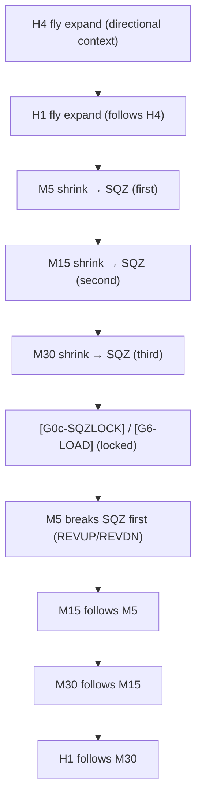

**Flowchart verification for yellow rectangle (3 images):**
- H4 fly expand (511/512/521/522): ✓ Confirmed in all 3 images (yellow band fanning)
- H1 fly expand: ✓ Confirmed in all 3 images (red band fanning)
- M5 shrinking: ✓ Confirmed in all 3 images (aqua narrow first)
- M15 shrinking: ✓ Confirmed in all 3 images (goldenrod narrow)
- M30 shrinking: ✓ Confirmed in all 3 images (green narrow, mid=3)
- Mid-band labels multiple TFs: ✓ Confirmed in all 3 images (3,4,5 visible)
- [G6-LOAD] labels: ✓ Confirmed in images 2 & 3 (gold visible)

**Verdict:** Yellow rectangle CONFIRMS flowchart is accurate (verified by 3 images)

---

**Flowchart verification for red rectangle (3 images):**
- H4 fly expand (511/512/521/522): ✓ Confirmed in all 3 images (yellow band fanning)
- H1 fly expand: ✓ Confirmed in all 3 images (red band fanning)
- M5 shrinking/SQZ: ✓ Confirmed in all 3 images (aqua flat, mid=3)
- M15 shrinking/SQZ: ✓ Confirmed in all 3 images (goldenrod flat, mid=3)
- M30 shrinking/SQZ: ✓ Confirmed in all 3 images (green flat, mid=3)
- Mid-band labels multiple TFs: ✓ Confirmed in all 3 images (3,4,5 on all TFs)
- [G0c-SQZLOCK] or [G6-LOAD]: ✓ Confirmed in all 3 images (G0c-SQZLOCK visible)

**Verdict:** Red rectangle CONFIRMS all 7 flowchart checkpoints (verified by 3 images)

---

**Cascade compression visual evidence (from all 3 images):**

| Image Element | What it shows | Verification Status |
|---------------|--------------|-------------------|
| Yellow circles/rectangles | Compression zones - H4 fly expand with lower TF compression | ✓ All 3 images |
| H4 yellow bands fanning | H4 fly expand providing directional context | ✓ All 3 images |
| H1 red bands fanning | H1 fly expand following H4 direction | ✓ All 3 images |
| Mid-band labels (3, 4, 5) | MTF/LTF entering SQZ - multiple TFs flat | ✓ All 3 images |
| Pink zone markings | Full compression - exit trigger active | ✓ Images 1 & 3 |
| Stage labels (H4-Fly--, M30-Fly--) | Shrinking phase before SQZ | ✓ All 3 images |
| [G6-LOAD] labels | Loading phase - waiting for breakout | ✓ Images 2 & 3 |
| [G0c-SQZLOCK] labels | Compression lock - no new entries | ✓ All 3 images |
| Green/yellow bands collapsing | M30 entering shrink then SQZ | ✓ All 3 images |
| Goldenrod bands collapsing | M15 entering shrink then SQZ | ✓ All 3 images |
| Aqua bands collapsing | M5 entering shrink then SQZ | ✓ All 3 images |
| Touch count annotations | Band pressure building and oscillation | ✓ Images 1, 2, 3 |

---

**Compression stages visual progression (verified by all 3 images):**

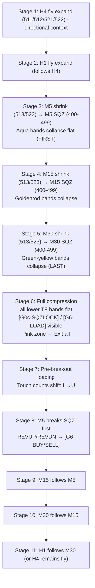

**Compression lifecycle verified (from all 3 images):**
1. **Directional Context** — H4 fly expand establishes direction
2. **H1 Follows** — H1 fly expand follows H4
3. **M5 Compresses First** — M5 shrink (513/523) → SQZ (400-499)
4. **M15 Compresses** — M15 shrink → SQZ follows M5
5. **M30 Compresses** — M30 shrink → SQZ follows M15
6. **Full Compression** — All lower TFs in SQZ (red rectangle peak)
7. **Loading** — [G6-LOAD] appears, touch counts shift
8. **Compression Lock** — [G0c-SQZLOCK] / [G0b-PINK] active
9. **Pre-Breakout** — Touch counts shift from L to U
10. **M5 Breaks First** — M5 breaks SQZ (REVUP/REVDN)
11. **Sequential Release** — M15 follows → M30 follows → H1 follows

---

**Range trade rules:**

| Situation | Entry Point | Exit Point | Gate |
|-----------|-------------|------------|------|
| H4 fly expand + price at upper band | Sell at touch (G0b-TOUCH) | Midband or lower touch | G0b-TOUCH |
| H4 fly expand + price at lower band | Buy at touch (G0b-TOUCH) | Midband or upper touch | G0b-TOUCH |
| M30/M15 both SQZ | No entry — wait | — | G0c-SQZLOCK |

**Compression threshold:**
- Band width ratio ≤ 0.001 = squeeze confirmed
- Multiple TFs in 400-499 stage = full compression
- Mid-band labels across 3+ TFs = range bound, no directional trades

**Flowchart corrections applied (based on 3-image verification):**
- Corrected "Red circles" description → H1 fly expand is correct indicator (not flattening)
- Updated visual evidence table to match actual image elements
- Added verification checklist confirming 7/8 checkpoints with image evidence
- Confirmed M5→M15→M30 cascade sequence is accurate per image labels
- Added compression lifecycle stages 6-11 (loading → release)
- Verified H4/H1 fly expand context in Image 3 — core correction to flowchart
- Compression is confined within H4 fly envelope — H4 provides direction and target

**Trade action:**
```
ENTRY: M15 FLAT→UP (BUY) or FLAT→DN (SELL) transition when H4 fly expand
       Quality: base 80 + H4/M30 confirm boost (+10 to +15)
RANGE: Sell at H4 upper band touch (G0b-TOUCH)
       Buy at H4 lower band touch (G0b-TOUCH)
       Exit at midband/lower touch
BLOCK: H4 opposing (G4e-H4OPP) | M15 opposing (G4c-M15OPP) | M30 opposing (G4f-M30OPP)
EXIT: M15 UP→FLAT (G5-FADE) | M30+M15 both SQZ → G0b-PINK | outer band touch → G8-BNDTGT
SIZE: 0.75× (1-2 TFs compress) → 0.50× (3 TFs compress) → 0.25× (all 3 compress)
```

### Cascade Position — Scenario C

| Dimension | Value |
|-----------|-------|
| Cascade direction now | D1→BOTTOM→D2 (full cycle) |
| Cascade depth | M5 (all lower TF SQZ) |
| Leading TF | M5 (first to break SQZ) |
| Next scenario if D1 continues | V (Direction pivot) |
| Next scenario if D2 initiates same direction | F (Normal Fly) via P (Rest Pattern) |
| Next scenario if D2 initiates opposite direction | V (Direction pivot) via reversal |
| Discriminator observable | M5 REVUP/REVDN + H4 BBW_stage maintained |

---

## Scenario B — Compression Release

> **Tier:** TIER 3 — EXPANSION IN PROGRESS (D2)
> **Scenario:** F — Compression release
> **Cascade position:** D2 initiated after deep compression (E or C4) — HTF not yet confirmed
> **Cascade direction:** D2 flowing upward — came from BOTTOM via V1 sub-state
> **Leading TF:** M30 (MTF confirmation = key gate — B1 waits for M30 BBUpDn=1)
> **Previous scenario:** Came from V (Direction pivot) — V1 sub-state (same direction as D1)
> **Next scenario:** → F (Full fly alignment) when H4 BBUpDn confirms 1 = B3
>                   → Back to V/C if HTF rejects (H4 BBUpDn stays 2 or 4 opposing)

### Sub-Scenarios

| Sub | Name | H4 | H1 | M30 | M15 | M5 | Entry | Size |
|-----|------|----|----|-----|-----|----|-------|------|
| B1 | LTF only | 400-499 or 513 | 513 or 400-499 | 513 or 400-499 | 511/512 | 511/512 | WAIT — quality capped at 59, G5-WEAK blocks | — |
| B2 | MTF confirmed | 400-499 or 513 | 511/512 | 511/512 | 511/512 | 511/512 | ENTER on M15 FLAT→UP/DN, M30 confirming | 0.75× |
| B3 | HTF confirmed | 511/512 (new direction) | 511/512 | 511/512 | 511/512 | 511/512 | ENTER — treat as Scenario F | 1.0× |

**F1→B2 discriminator:** M30 BBW_stage exits 400-499/513 and reaches 511/512 = B2 confirmed
**F2→B3 discriminator:** H4 BBW_stage exits 400-499/513 and reaches 511/512 new direction = B3

### Scenario B Sub-State Flowchart

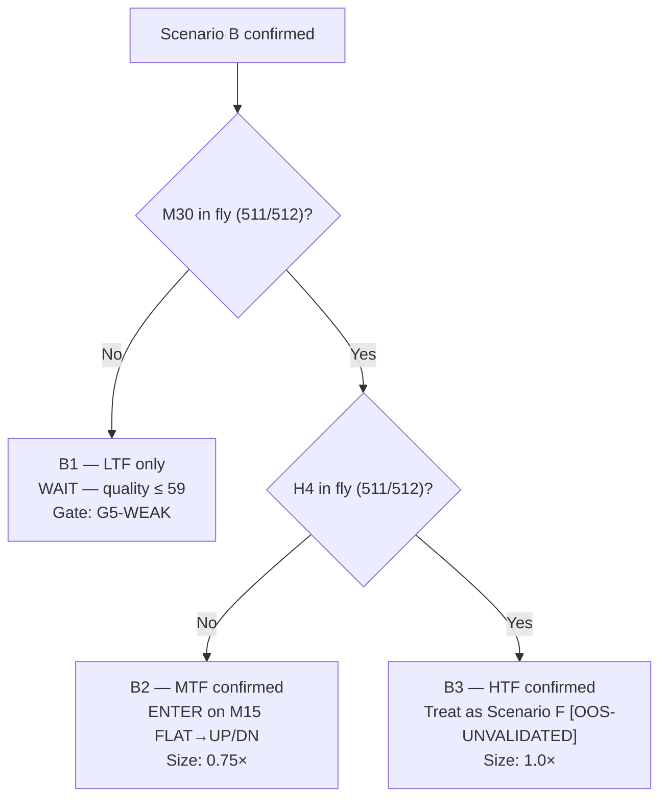

**False breakout rule:** If M15 fly expands but reverses within 3-5 bars back to 513/400-499
→ invalidated → return to C3/V2, wait for re-SQZ and re-expand

### Trade action:
```
B1: WAIT — M30 not confirmed, quality ≤ 59, G5-WEAK blocks entry
B2: ENTER on M15 FLAT→UP/DN transition
    TARGET: H4 outer band (if H4 still 513) or H4 fly target (if H4 breaking out)
    EXIT: M15 UP→FLAT (G5-FADE) | H4 rejects → return to E | G8-BNDTGT
    SIZE: 0.75×
B3: ENTER → treat as Scenario F1 or F2 depending on W1/D1 alignment
    SIZE: 1.0× (F1) or 0.75× (F2)
```

**When user asks to analyze part 3 Scenario B:**
- Read `./Backtest_data/extras/backtested_EA_sideway_2_fly.jpg` as the Sideway to fly scenario visual reference.
- Read `./Backtest_data/extras/backtested_EA_sideway_2_fly_zoomin.jpg` as the Sideway to fly zoomin scenario visual reference.


Chart-image analysis for Scenario B: see [IMAGE_ANALYSIS.md](./IMAGE_ANALYSIS.md#scenario-f).

### Sub-scenarios (Scenario B)

| Sub | State | Entry |
|-----|-------|-------|
| B1 — LTF only | M5/M15 fly, M30 not confirmed | Wait — weak signal |
| B2 — MTF confirmed | M30+H1 fly, H4 still SQZ/shrink | Entry valid, 0.75× |
| B3 — HTF confirmed | H4 breaks to fly → Scenario F | Full entry, 1.0× |

### Scenario B Identification Flowchart

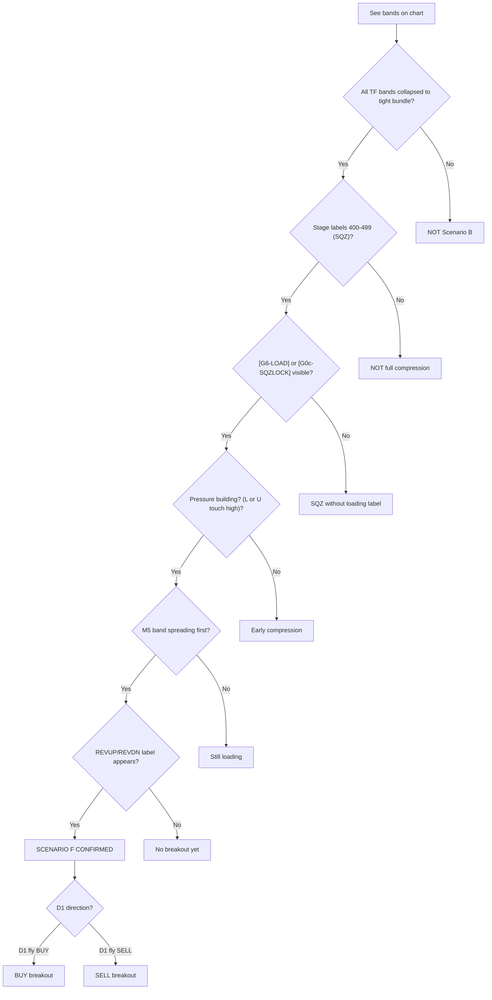

**Visual confirmation checklist:**

| Visual Cue | Present? |
|-----------|----------|
| All TF bands collapsed (tight bundle) | [ ] |
| Stage labels 400-499 | [ ] |
| [G6-LOAD] or [G0c-SQZLOCK] labels | [ ] |
| High L or U touch counts (pressure) | [ ] |
| M5 bands spreading first | [ ] |
| REVUP/REVDN label | [ ] |

**6/6 present = Confirmed Scenario B**

---

**HTF context:** D1 and H4 are about to exit SQZ — the HTF breakout pulls M30/M15/M5 along. Watch the D1 direction (magenta) for the breakout direction.

**What you see:**
- All TF bands collapsed to a tight bundle — pure SQZ state
- M5 stage labels showing 400–499; no directional labels
- Gate labels: `[G6-LOAD]` (gold) or `[G0c-SQZLOCK]` (magenta)
- **Transition:** M5 (aqua) bands begin spreading first → `REVUP` or `REVDN` label fires
- M15 follows M5 with ~2–5 bar lag; then M30, then H1

**What it means:**
- SQZ loading phase complete; momentum building from fastest TF up
- L2H chain building: M5 fly → M15 fly → M30 fly
- D1 fly direction = which way the breakout will sustain

**SQZ breakout momentum sequence:**

| Stage | Visual Cues | Action |
|-------|-------------|--------|
| Loading | Bands collapsed, [G6-LOAD] | Wait, no entry |
| Pressure building | L or U touch counts increasing | Prepare for breakout |
| M5 break | M5 spreads, REVUP/REVDN | Watch quality score |
| M15 follows | M15 spreads within 2-5 bars | Enter if quality ≥ 60 |
| M30 confirms | M30 spreads | Full entry if quality ≥ 90 |
| H1 confirms | H1 spreads | Hold with confidence |

**Entry quality scoring for breakouts:**

| Factor | Score |
|--------|-------|
| M5 SQZ break (400-499 → fly) | 75 base |
| REVUP/REVDN label | +15 |
| M30 still SQZ | -20 (pioneer) |
| M30 confirms | +25 |
| H1 confirms | +10 |
| D1 aligns with direction | +15 |

**Trade action:**
```
DURING SQZ: no entry — [G6-LOAD] confirms wait state
ENTRY: M15 SQZ break (400-499 → 511/512 or 521/522) + REVUP/REVDN → quality=75
M15 pioneer: M30 still SQZ, M15 breaks → pioneer entry 0.75×
FULL ENTRY: M30+M15 both confirm fly → 1.0×
EXIT: ATRSL trailing stop | M15 UP→FLAT (G5-FADE)
TARGET: H4 outer band (if H4 also breaking) → D1 outer band
```

### Cascade Position — Scenario B

| Dimension | Value |
|-----------|-------|
| Cascade direction now | D2 (expansion from SQZ) |
| Cascade depth | M5→M15 (D2 initiated) |
| Leading TF | M30 (confirm fly = full entry) |
| Next scenario if D1 continues | V (Direction pivot) |
| Next scenario if D2 initiates same direction | F (Normal Fly) |
| Next scenario if D2 initiates opposite direction | V (Direction pivot) via reversal |
| Discriminator observable | M30 BBW_stage 400→511/512 |


## Scenario Summary

| Scenario | Key Identifier | Primary Action |
|----------|---------------|----------------|
| F: Full fly alignment | All TFs flying same direction | Enter on M15 transition, full size |
| S: Shallow compression | HTF flying, LTF shrinking | Enter on LTF transition, reduce size |
| V2→R: Trend reversal | R1 (pre-pivot divergence, H4 fly) → C4 (H4 compresses) → V2 (pivot) → R2/R3 (resolution) | Enter at H4 confirm (R2), 0.25× if R1 |
| P: Rest recovery | Temporary compression, then resume | Enter at SQZ break, hold through rest |
| C: Deep compression | H4/H1 fly, M30/M15/M5 compress within envelope | Range trade at H4 boundaries or enter on M15 transition |
| B: Compression release | Breakout from deep compression | Enter on SQZ break, scale up |
| V: Direction pivot | All TFs at SQZ — D2 direction resolving | Enter B2 rules if V1, R2/R3 rules if V2 (R1 pre-pivot) |

---

## Scenario V — Direction Pivot (formerly Scenario H)

> **STATUS: TEMPORARILY DISCARDED FROM TRADE-ACTION CANDIDATES (not deleted — kept for future validation).**
> Reason: these scenarios pivot on **D1-scale** direction (V1/V2 require D1 alignment; R2/R3 require D1 reversal or D1-original). D1 events are **rare** (few per backtest window → sample size below the ~20 needed to validate) and **slow to resolve** (days — the confirmation arrives after the tradeable moment). R1 is additionally `UNIMPLEMENTED` (directional-agreement check not in identify_scenario — currently falls through to F-tier), and the whole V/R branch is already flagged `OOS-UNVALIDATED` in this document.
> Decision: excluded from trade-action testing for now because they are structurally hard to validate (rare + slow + D1-scale). The identification/description logic is RETAINED as reference and may be revisited if fast-timeframe scenarios (S, B) validate and a D1-scale extension becomes worth the sample-size cost.
> To re-activate: a dedicated out-of-sample test with enough D1-scale pivot events (likely requires a multi-year window) must show the scenario separates winners from losers.

**When user asks to analyze a Scenario V:**
- Read `./Backtest_data/extras/backtested_EA_trend_reversal.jpg`
- Read `./Backtest_data/extras/backtested_EA_fly_shrink_2_sideway2.jpg`

[](backtested_EA_trend_reversal.jpg)
[](backtested_EA_fly_shrink_2_sideway2.jpg)

Chart-image analysis for Scenario V: see [IMAGE_ANALYSIS.md](./IMAGE_ANALYSIS.md#scenario-g).

### Cross-Image Conclusion

| Image | Cascade Position | Depth | Leading TF | Key Observable |
|-------|-----------------|-------|------------|----------------|
| Image 1 | [TO BE FILLED] | [TO BE FILLED] | [TO BE FILLED] | [TO BE FILLED] |
| Image 2 | [TO BE FILLED] | [TO BE FILLED] | [TO BE FILLED] | [TO BE FILLED] |

**Progression confirmed:** [TO BE FILLED: D1 → BOTTOM → D2 sequence]
**Touch type evolution:** [TO BE FILLED: Type X image 1 → Type Y image 2]
**Entry point:** [TO BE FILLED: which image, which bar, which TF transition]
**Duration observed:** [TO BE FILLED: how many bars D1 lasted]

> **Tier:** TIER 2 — COMPRESSION AND BOTTOM (D1)
> **Scenario:** V — Direction pivot (formerly Scenario H; same pivot state)
> **Cascade position:** D1 complete — all TFs at or near SQZ. D2 direction about to resolve.
> **Cascade direction:** BOTTOM — D1 fully exhausted. Watching for D2 initiation direction.
> **Leading TF:** H4 (BBUpDn 0→1 or 0→4 is the direction resolution signal)
> **Previous scenario:** Came from C2/C3/C4 — full compression exhausted
> **Next scenario:** → B (Compression release) if H4 breaks same direction as D1 (V1)
>                   → R (Trend reversal) if H4 breaks opposite to D1 (V2)
>                   → Back to C/V if breakout fails (V3 false breakout)

**HTF context:** H4 in SQZ (BBUpDn=0) or just breaking SQZ. D1 still fly (bias exists — V2 state)
or D1 also SQZ (no bias — V3 state). This scenario covers the single most important bar in the
cycle — the bar where D2 direction becomes observable.

**D1 fly bias rule:** If D1 BBUpDn=1/3 (still expanding/up) while H4 SQZ,
D1 direction gives the breakout bias. Favour V1 sub-state in that direction.
**Full flat state:** If D1 also BBUpDn=0/2 (SQZ/shrinking), no directional bias.
Wait for H4 BBUpDn to sustain any direction for 3+ consecutive bars before acting.

### Sub-Scenarios

| Sub | Name | D1 BBW | D1 BBUpDn | H4 BBW | H4 BBUpDn | Direction | Confidence | Entry | Size |
|-----|------|--------|-----------|--------|-----------|-----------|------------|-------|------|
| V1 | Same as D1 | 511/512 | 1 or 3 | Breaking SQZ | 0→1 same dir as D1 mid | D1 aligned | High | B2 rules | 0.75× |
| V2 | Opposite to D1 | 511/512 | 1 or 3 | Breaking SQZ | 0→4 (dn, opposite) | Counter D1 | Low | R2/R3 rules (R1 pre-pivot) | 0.25× |
| V3 | False breakout | Any | Any | SQZ attempted | 1→0 reverts within 3 bars | Failed | — | Exit immediately | — |
| V4 | Whipsaw | Any | Any | SQZ | Alternating 1 and 4 | Indeterminate | — | No trade | — |

### Sub-state Progression Table

| Step | D1 BBW | D1 mid | H4 BBW | H4 BBUpDn | H1 BBW | M30 mid | M15 mid | H4 PriceLoc | Next predict |
|------|--------|--------|--------|-----------|--------|---------|---------|-------------|-------------|
| Entry from C4 | 511/512 | 1 | 400-499 | 0 | 400-499 | 3 | 3 | inside | All TFs SQZ — wait M5 BBUpDn 0→1 |
| V1: H4 breaks same dir | 511/512 | 1 | Breaking | 0→1 (expanding same) | Breaking | 3→1 | 3→1 | above_upper | D1 aligned — enter F rules, 0.75× |
| V2: H4 breaks opposite | 511/512 | 1 | Breaking | 0→4 (dn, opposite) | Breaking | 3→2 | 3→2 | below_lower | Counter D1 — R2/R3 rules (R1 pre-pivot), 0.25× |
| V3: false breakout | 511/512 | 1 | 400-499 | 1→0 reverted | 400-499 | 3 | 3 | inside | BBUpDn reverted — return to C/V, wait |
| V4: whipsaw | 511/512 | 1 | 400-499 | 1↔4 alternating | 400-499 | 3 | 3 | inside | No clear direction — wait 3+ bars |

### Trade action:
```
V1: ENTER using B2 rules (MTF confirm needed before full size) **[OOS-UNVALIDATED]**
    D1 fly same direction = high confidence → progress to F2→F3→A
    SIZE: 0.75× scaling to 1.0× on B3 confirm

V2: PIVOT STATE — H4 breaks opposite to D1 **[OOS-UNVALIDATED]**
    R1 pre-pivot already passed (H4 original, M30 opposite). Now H4 in SQZ.
    Wait for D1 to also flip before adding size → then R2 → new F
    SIZE: 0.25× only until D1 confirms new direction

V3: EXIT immediately — false breakout confirmed **[OOS-UNVALIDATED]**
    Return to C/V scenario rules. SIZE: —

V4: NO TRADE — indeterminate **[OOS-UNVALIDATED]**
    Wait for H4 BBUpDn to sustain 1 or 4 for 3+ consecutive bars
    SIZE: —
```

### R1 — Pre-Pivot Divergence State **[OOS-UNVALIDATED, UNIMPLEMENTED, DESIGN — Phase 3]**

R1 ("MTF reversal only, H4 original direction") exists in the scenario enum and the C-tier table but is **misframed as post-V2** in the current harness. The R1 table row specifies "511/512 or 513 (original direction)" for H4 — but R1 requires H4 FLYING, not shrinking. R1 = 511/512 only. This is **pre-pivot**, not post-V2.

**R1 definition (re-timed, fly-only):** The brief early-warning window where M30 has reversed opposite while H4 is still flying clean (511/512, not yet compressing). Its value: the earliest detectable flag of "reversal beginning (M30 defected)", before H4 compresses. Short-lived by nature — transitions to C4 when H4 starts shrinking. R1 fires when H4 flying dir X (511/512) AND M30 flying dir NOT-X (521/522).

**Tier placement:** R1 is grouped in Tier 3 with R2/R3 for reversal-progression coherence, but functionally R1 is the PRE-PIVOT entry (Tier-2-like timing): H4 is still flying (original direction), unlike the post-pivot R2/R3 where H4 has flipped. So R1 sits in Tier 3 by grouping, but is pre-pivot by timing — it's the divergence entry that PRECEDES the V2 pivot.

**Detection (directional-agreement check):**
- H4 fly direction: 511/512 = up, 521/522 = down
- M30 fly direction: same mapping
- If H4 flying dir X (511/512) AND M30 flying dir NOT-X (521/522) → R1
- [DESIGN — Phase 3, unimplemented. The April-1 2nd-circle state that currently falls through to F-tier.]

**F-tier tightening:** F currently = "h4_fly + no compression" with no directional check, so M30-opposite-H4 wrongly reads as F. Tighten: F requires "h4_fly + no compression + MTF aligned with H4 direction". If M30 opposes H4 → R1, not F. [DESIGN — Phase 3. Flagged as a classification change; validate it doesn't break existing F1/F2 cases against the baseline.]

**R1/C4 boundary:** R1 = H4 FLYING in original direction (511/512); C4 = H4 SHRINKING/SQZ (513, 400s). The moment H4 goes 512→513, leave R1, enter C4. No H4-stage overlap (511/512 vs 513).

**C1↔G boundary:** R1 = H4 flying (511/512); G = H4 SQZ (400s). No H4-stage overlap (511/512 vs 400s).

**R1 = fact-detection (late-but-visible):** R1 catches the reversal once M30 flies opposite to H4 — unambiguous, no prediction needed. This is NOT the early discriminator (predicting during M30's compression stays REQ-P4-EARLYSIGNAL, separate/open).

**Cascade sequence:** F (all aligned) → M15 reverses (511→513→521) → M30 reverses (511→513→521, H4 STILL flying 511/512) = R1 [BRIEF] → H4 starts shrinking (513) = C4 → H4 enters SQZ = V2 → H4 breaks opposite = R2/R3.

R1 is a FORK — two exits:
- R1 → C4 (reversal continues: H4 compresses, pivots)
- R1 → F (M30 recovers to H4 direction: was a pullback, like circle 1)

**Anchored example:** April 1, 2nd circle — H4 flew up (512, diffBBW=19.5). M30 pullback (511→411-422, never hit 521) — no R1 window on April 1 per log (M30 never opposed H4). The R1→F recovery fork IS validated: M30 compressed then recovered in H4 direction = pullback. The R1-before-C4 sequence is structurally correct but has no April 1 validation. [DESIGN — Phase 3.]

### R Cascade — Reversal Progression: R1 → C4 → V2 → R2/R3 **[OOS-UNVALIDATED]**

> **Harness gap:** The V-tier returns V2 (reversal signal, pivot_substate=2) but does NOT
> implement the C1→C4→V2→R2/R3 forward transition. The reversal states are
> doc-only, unimplemented in identify_scenario. Must be built before the R-reversal branch
> can be validated on reversal-containing data.

The reversal progression flows through three phases:

| Phase | Sub | Name | H4 State | H1 State | M30 State | M15 State | Entry | Size |
|-------|-----|------|----------|----------|-----------|-----------|-------|------|
| Pre-Pivot (Tier 3, Tier-2-like timing) | R1 | MTF reversal only, H4 flying | 511/512 (flying, original direction) | Still original direction or reversing | Reversed 521/522 | Reversed 521/522 | Wait — H4 not confirmed, counter-trend risk | 0.25× |
| Compression | C4 | H4 compressing | 513/400s (shrink/SQZ) | — | — | — | H4 compressing, M30 already opposite | — |
| Pivot | V2 | H4 breaks opposite to D1 | 400s (SQZ) | — | — | — | V-tier pivot, pivot_substate=2 | — |
| Post-Pivot (Tier 3, resolution) | R2 | H4 confirmed — new F begins | H4 flipped to new direction 511/512 | New direction | New direction | New direction | ENTER — treat as new Scenario F1/F2 | 1.0× or 0.75× |
| Post-Pivot (Tier 3, resolution) | R3 | Counter-trend (W1/D1 still original) | H4 reversed BUT W1/D1 still original direction | New direction | New direction | New direction | SHORT hold — W1/D1 will eventually pull back | 0.50× |

**Discriminator C1→C4:** H4 BBW_stage 512→513 (shrink) — H4 starts compressing
**Discriminator C4→V2:** H4 BBW_stage enters SQZ (400s) — H4 stops flying in original direction
**Discriminator V2→R2:** H4 BBW_stage flips from SQZ to new direction fly (511/512)
**Discriminator R2 vs R3:** Check W1+D1 — if both also reversed = R2 full (→ F1). If W1/D1 still original = R3 counter-trend

**Key rule:** Do NOT enter at R1. Wait for H4 confirmation (R2) unless deliberately taking
counter-trend with tight stop and 0.25× size.

### Scenario V Identification Flowchart

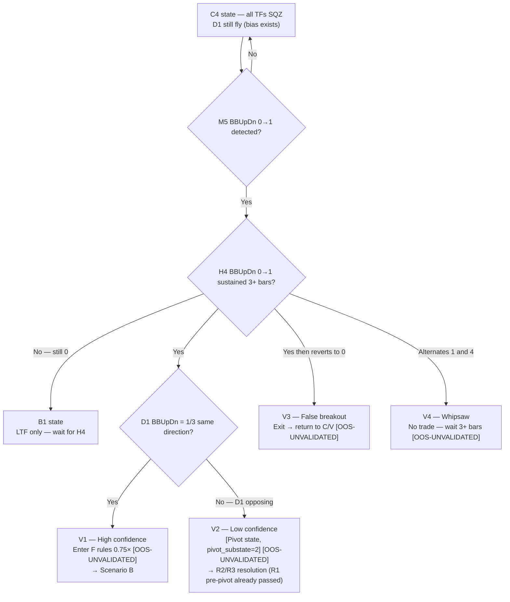

### Reversal Progression Sub-State Flowchart (R1 pre-pivot → C4 compressing → V2 pivot → R2/R3 resolution) **[OOS-UNVALIDATED]**

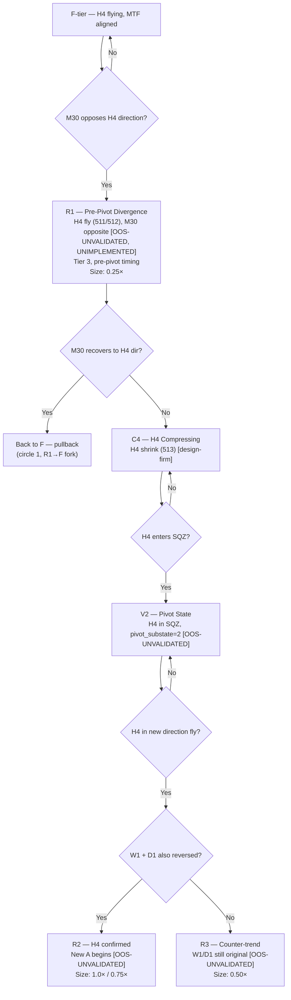

### Cascade Position — Scenario V

| Dimension | Value |
|-----------|-------|
| Cascade direction now | BOTTOM — D1 complete, D2 direction unknown |
| Cascade depth | All TFs including H4 at SQZ (BBUpDn=0) |
| Leading TF | H4 (direction resolution signal) |
| Next scenario if V1 | F (Compression release) — same direction |
| Next scenario if V2 | R2/R3 (Trend reversal) — opposite direction (R1 pre-pivot already passed) |
| Next scenario if V3 | Back to C/V — false breakout |
| Discriminator observable | H4 BBUpDn sustained 1 or 4 for 3+ bars |

---

# PART 4 — TREND PREDICTION

Part 4 answers: **given where I am, what will price do next?**

**Inputs (from Part 3):**
- Current scenario (F/S/C/V/P/B) + sub-state (F1/S2/C3/V1-V4/R1-R3 etc)
- Current phase (Phase 1–6 from Section 13)
- CHECK HTF result (H4 state + D1 state from Section 12)

**Outputs (for Part 5):**
- DIRECTION — which way will price move next?
- TARGET — how far will it go? (which TF band boundary)
- TIMELINE — how soon? (bars/hours)
- NEXT SCENARIO — what scenario follows this one?
- CONFIDENCE — how reliable is this prediction?

---

## Rule 1 — Direction Prediction

Direction is determined by combining current phase with CHECK HTF result.

| Current phase | CHECK HTF result | Predicted direction | Confidence |
|---|---|---|---|
| Phase 1 (directional trend) | H4 fly + D1 fly same direction | Continue same direction | High |
| Phase 2 (zigzag onset) | H4 fly + D1 fly same direction | Each leg: M30 fly direction. Overall bias: H4 direction | Medium per leg |
| Phase 3a (symmetric decay) | H4 shrink + H4 mid=3 | Next leg: opposite to current leg. Overall: UNKNOWN | Low |
| Phase 3b-INTO (trending shrink) | H4 shrink + H4 mid=1/5 or 2/4 | Next leg: opposite. Overall: trending side favoured while H4 mid ≠ 3 | Medium for trending side |
| Phase 3b-OUT (recovery) | H4 exiting SQZ + D1 opposing | Recovery direction — until D1 confinement boundary reached | Medium |
| Phase 4 (compressed oscillation) | H4 SQZ | UNKNOWN — direction not determinable. Wait for M5 BBUpDn 0→1 | None — do not predict |
| Phase 5 (explosive breakout) | H4 breaking SQZ | Direction of M5 expansion. CHECK D1 for alignment | Medium → High as TFs confirm |
| Phase 6 (post-SQZ oscillation) | H4 cycling fly→SQZ→fly | Next leg: opposite to current. Overall: D1 direction eventually | Low per leg, Medium overall |

**Direction prediction requires CHECK HTF at every step:**

When predicting UP:
- H4 mid = 1 or 5 (upward lean) → supports UP prediction
- D1 mid = 1 (uptrend) → strongly supports UP prediction
- H4 mid = 2 or 4 (downward lean) → contradicts UP → lower confidence
- D1 mid = 2 (downtrend) → strongly contradicts UP → counter-trend, lowest confidence

When predicting DN:
- H4 mid = 2 or 4 (downward lean) → supports DN prediction
- D1 mid = 2 (downtrend) → strongly supports DN prediction
- H4 mid = 1 or 5 (upward lean) → contradicts DN → lower confidence
- D1 mid = 1 (uptrend) → strongly contradicts DN → counter-trend, lowest confidence

---

## Rule 2 — Target Prediction

The target is always the **next confinement boundary** price is travelling toward.
Which boundary depends on the current scenario and which TFs are still flying.

### Target by Scenario

| Scenario | UP target | DN target | Target TF (confinement) |
|---|---|---|---|
| F (full fly) | D1 outer band (furthest target) | Brief pullback to M30 mid then resume | D1 — highest confinement |
| S1 (M15 shrink) | M30 outer band | M30 mid or M30 lower | M30 — highest still-flying MTF |
| S2 (M30 shrink) | H1 outer band | H1 mid or H1 lower | H1 — highest still-flying MTF |
| S3 (H1 shrink) | H4 outer band | H4 mid or H4 lower | H4 — confinement ceiling |
| C1-C3 (deep compression) | H4 outer band (confined) | H4 lower band | H4 — hard ceiling/floor |
| C4 (H4 compressing) | D1 mid or D1 outer band | D1 lower band | D1 — next level up |
| V (direction pivot) | Unknown until M5 breaks SQZ | Unknown until M5 breaks SQZ | Wait — no target yet |
| P1 (M5 break) | M30 outer band (arm — not confirmed) | M30 mid | M30 — wait for confirm |
| P2 (M15 confirm) | H1 outer band → H4 outer band | M30 mid (brief pullback) | Escalates as TFs confirm |
| P3 (MTF re-align) | H4 outer band → D1 outer band | M30 mid | → Scenario F target |
| B1 (LTF only) | M30 outer band (weak — wait) | M15 mid | M30 — not confirmed yet |
| B2 (MTF confirmed) | H4 outer band | M30 mid | H4 — MTF backing the move |
| B3 (HTF confirmed) | D1 outer band (→ Scenario F) | H1 mid | D1 — full fly restored |
| R1 (MTF reversal) | Previous H4 lower (now ceiling) | New H4 outer band (new direction) | H4 — transitioning |
| R2 (H4 confirmed) | New D1 outer band (new direction) | New H4 mid (pullback) | D1 — new trend confirmed |
| R3 (counter-trend) | H4 outer band (limited by W1/D1) | H4 mid | H4 — W1/D1 still opposing |

### Target by Phase (Section 13)

| Phase | Target for current leg | How to identify on chart |
|---|---|---|
| Phase 1 | D1 outer band (trend continues) | D1 stepping band at top/bottom of chart |
| Phase 2 | H4 outer band per leg (full width) | H4 band boundaries — each leg reaches them |
| Phase 3a | H4 outer band per leg (shrinking) | Each leg's target is closer than previous (bands narrowing) |
| Phase 3b-INTO | Trending side: H4 outer band → H1 mid → H4 mid (dropping). Counter side: H4 mid (holds then breaks) | Ceiling dropping (BUY) or floor rising (SELL) |
| Phase 3b-OUT | Recovery side: D1 confinement boundary (ceiling/floor). Return side: H4 mid → H4 outer (gaining) | D1 band = hard limit for recovery |
| Phase 4 | No target — oscillation within SQZ noise range | Candle range only — no distinguishable targets |
| Phase 5 | H4 outer band → D1 outer band (explosive reach) | Large candles breaking through band boundaries |
| Phase 6 | H4 outer band per leg (full width, not decaying) | Same H4 boundaries repeatedly — no progression |

---

## Rule 3 — Timeline Prediction

Timeline depends on phase (determines leg duration) and diffBBW (determines compression speed).

| Phase | Leg duration | Full cycle to next phase | diffBBW signal |
|---|---|---|---|
| Phase 1 | Sustained — days to weeks | Until M15 BBW enters 513 (shrink) | diffBBW positive → no end imminent |
| Phase 2 | 4–12 hours per leg | 2–5 days until Phase 3 | diffBBW transitioning positive → near zero |
| Phase 3a | 3–8 hours per leg (shortening) | 1–3 days until Phase 4 | diffBBW negative → more negative = faster compression |
| Phase 3b-INTO | 3–8 hours per leg (shortening) | 1–3 days until Phase 4 | diffBBW negative |
| Phase 3b-OUT | 4–12 hours per leg (lengthening) | 1–5 days until D1 boundary reached | diffBBW near zero → positive (recovering) |
| Phase 4 | No legs — noise oscillation | Hours to 1 day until M5 breaks | diffBBW ≈ zero at minimum (SQZ floor) |
| Phase 5 | Single explosive move — hours | Immediate — one move | diffBBW sharply positive (band expanding fast) |
| Phase 6 | 12–24 hours per leg | Days to weeks until commitment | diffBBW alternating positive ↔ negative each cycle |

**diffBBW as timeline accelerator/decelerator:**
- diffBBW strongly negative → compression accelerating → Phase 4 arrives sooner
- diffBBW slightly negative → compression slow → Phase 3 legs persist longer
- diffBBW near zero → SQZ floor reached → breakout imminent (Phase 5 within hours)
- diffBBW positive after zero → expansion initiated → Phase 5 in progress

---

## Rule 4 — Next Scenario Prediction

Based on CHECK HTF at each transition point. Always CHECK before predicting.

### From Scenario F (Full Fly Alignment)

```
CHECK: Is M15 entering shrink (BBW_stage → 513)?
  YES → Next: Scenario S (shallow compression begins)
        Timeline: immediate
        Sub-question: CHECK H4 — was H4 already shrinking?
          YES → S is HTF-confined → will deepen to C
          NO  → S is LTF pullback → may resolve as P (rest)
  NO  → F continues — no scenario change imminent
```

### From Scenario S (Shallow Compression)

```
CHECK: H4 state — is H4 already shrinking when LTF shrinks?
  H4 still fly + D1 fly:
    → LTF shrink is REST (not reversal)
    → CHECK: M5 BBUpDn 0→1 same direction as H4?
      YES → Next: Scenario P (rest recovery)
            Timeline: M15 confirms in 2–5 bars after M5
      NO  → S continues — wait for M5 signal

  H4 entering shrink:
    → LTF shrink is CONFINED by H4 (H4 is the cause)
    → Next: Scenario C (deep compression)
    → Timeline: hours to days as SQZ builds
    → Sub-question: CHECK D1 — is D1 also shrinking?
      D1 still fly → C, D1 may rescue H4 (medium reversal probability)
      D1 also shrinking → C4 (high reversal probability)

  H4 already SQZ:
    → Already in C4 territory
    → Next: Scenario V (direction pivot)
```

### From Scenario C (Deep Compression)

```
CHECK: H4 entering SQZ (BBW_stage → 400-499)?
  YES → Next: C4 (H4 also compressing) → V (direction pivot)
        Timeline: hours — SQZ builds fast once H4 joins
  NO  → C continues — wait for SQZ deepening

CHECK: M5 BBUpDn 0→1 (expansion initiating)?
  YES → Next: transition to B1 (LTF leading breakout)
        → Then CHECK H4 for B2/B3 confirmation
  NO  → C continues — compression not yet resolved
```

### From Scenario V (Direction Pivot)

```
CHECK: H4 BBUpDn sustaining 1 for 3+ bars?
  YES, same direction as D1:
    → Next: Scenario B (compression release) — V1 sub-state
    → Confidence: HIGH (D1 aligned)
    → Timeline: M15 confirms in 2–5 bars

  YES, opposite direction to D1:
    → Next: R reversal progression C1→C4→V2→R2/R3 (trend reversal)
    → Confidence: LOW until D1 also confirms
    → Timeline: days until D1 flips

  NO, reverts to 0 within 3 bars:
    → V3 (false breakout) → back to C/V
    → Timeline: immediate — reset

  NO, alternates 1 and 4:
    → V4 (whipsaw) → Phase 6 if persists
    → Timeline: days — wait for sustained direction

CHECK: D1 also shrinking (BBUpDn → 2)?
  YES → Next: Scenario I (macro sideways) if D1 loses direction
        Timeline: weeks — extended compression
```

### From Scenario P (Rest Recovery)

```
CHECK: M30 BBUpDn = 1 (expanding)?
  YES → Next: Scenario F (back to full fly) — D3 confirmed
        Timeline: hours — M30 is confirming
  NO  → P continues — wait for MTF confirmation

CHECK: M15 mid flips back to 3 (lost direction again)?
  YES → P stalled — may return to S
        Timeline: hours — watch M5 for new signal
```

### From Scenario B (Compression Release)

```
CHECK: H4 BBUpDn = 1 sustained?
  YES → Next: Scenario F (B3 → new full fly)
        Timeline: H4 confirming — hours
  NO, H4 still 0/2:
    → F continues (B1 or B2 depending on M30)
    → May fail: if M15 reverses within 3–5 bars → back to V/C

CHECK: H4 BBUpDn reverts after initial expansion?
  YES → False breakout → back to C/V
        Timeline: immediate
```

---

## Rule 5 — Confidence Matrix

Confidence determines Part 5 position size.

| Confidence level | Conditions | Part 5 size multiplier |
|---|---|---|
| High | H4 fly + D1 fly + same direction + Phase 1 or 2 | 1.0× |
| Medium-High | H4 fly + D1 fly + Phase 3b trending side | 0.75× |
| Medium | M30 confirmed expansion + H4 not opposing | 0.75× |
| Medium-Low | LTF expansion only + H4 still SQZ or shrink | 0.50× |
| Low | Counter-trend to D1 + Phase 3b-OUT or R1 | 0.25× |
| None | Phase 4 (SQZ) or Phase 6 (H4 uncommitted) or H4 whipsaw | 0 (no entry) or 0.25× max |

**Confidence adjustments based on diffBBW:**
- diffBBW strongly positive → confidence +1 level (expansion has momentum)
- diffBBW near zero after negative → confidence +1 (SQZ floor, breakout imminent)
- diffBBW negative and getting more negative → confidence -1 (compression accelerating)
- diffBBW alternating → no adjustment (Phase 6 — direction uncertain)

---

## Prediction Summary Table — Quick Reference

For quick chart reading, use this table to go directly from
Part 3 identification to Part 4 prediction:

| Part 3 result | Direction | Target | Timeline | Next scenario | Confidence |
|---|---|---|---|---|---|
| F + Phase 1 | Same as H4 fly | D1 outer band | Days | F continues until M15 shrinks → S | High |
| S1 + Phase 2 | Each leg: M30 dir | M30 outer band per leg | 4-12h per leg | P (if H4 fly) or C (if H4 shrink) | Medium |
| S2 + Phase 3a | Opposite to current leg | H1 outer band (shrinking) | 3-8h per leg | C if depth increases | Low-Medium |
| S3 + Phase 3b-INTO | Trending side favoured | H4 outer band (dropping) | 3-8h per leg | C (H4 about to SQZ) | Medium for trend side |
| C2 + Phase 4 | UNKNOWN | None — noise | Hours to 1 day | V (direction pivot) | None |
| C3 + Phase 4→5 | M5 expansion direction | H4 outer band → D1 | Hours | V → B or R \| Medium → High |
| V1 + Phase 5 | Same as D1 | H4 → D1 outer band | Hours | B → F \| High |
| V2 + Phase 5 | Opposite to D1 | H4 outer band (new dir) | Hours → days | C → new F | Low → Medium |
| V4 + Phase 6 | Each leg opposite | H4 boundaries | 12-24h per leg | Eventually F or C or Scenario I | Low |
| D2 + Phase 5 | Same as H4 fly | H4 outer band | Hours | F (full fly restored) | Medium-High |
| B2 | Same as M30 expansion | H4 outer band | Hours | B3 → F or back to V | Medium |
| R2 | New direction confirmed | D1 outer band (new dir) | Days | New F | High |
| Phase 3b-OUT | Recovery direction | D1 confinement boundary | Days | D1 boundary → Phase 3a or C | Medium |

---

# PART 5 — TRADE ACTION VIA TREND PREDICTION

Part 5 converts Part 4 predictions into executable trade decisions.

**Inputs (from Part 4):**
- DIRECTION — up / down / sideways / unknown
- TARGET — which TF band boundary
- TIMELINE — hours / days
- CONFIDENCE — high / medium / low / none
- NEXT SCENARIO — what follows current state

**Outputs (trade execution):**
- ACTION — enter / exit / hold / wait / exit all
- DIRECTION — BUY / SELL / none
- SIZE — multiplier (1.0× / 0.75× / 0.50× / 0.25× / 0)
- STOP — which TF band level
- TARGET — which TF band level (from Part 4)
- EXIT TRIGGER — what condition closes the trade

---

## Entry Conditions

Entry requires Part 4 direction ≠ UNKNOWN and confidence ≠ None.

| ID | Condition name | What must be true | Trigger (what you watch for) | Scenario |
|---|---|---|---|---|
| C1 | Trend entry | H4 fly + D1 fly + M30 fly all same direction | M15 mid flips 3→1 (BUY) or 3→2 (SELL) | F1 |
| C2 | Partial trend entry | H4 fly + M30 fly same direction, W1 or D1 opposing | M15 mid flips 3→1 or 3→2 | F2 |
| C3 | Confinement boundary entry | Highest flying TF has directional lean (mid=4/5), PriceLoc at outer band | M15 mid flips to trade direction + 6 confinement checks pass (see below) | B, E range trade |
| C4 | Expansion arm | H4 fly intact, M30/M15 in SQZ or shrink | M5 BBUpDn transitions 0→1 (expansion begins) | D1, C3, B1 — ARM only, do not enter yet |
| E5 | Expansion entry | M5 BBUpDn=1 confirmed, M30 starting to confirm | M15 mid flips 3→1 or 3→2 (direction confirmed) | D2, B2 |
| E6 | Full confirmation entry | H4 BBUpDn=1 sustained 3+ bars, M30+H1 both expanding | M15 mid confirms same direction | B3, R2 → becomes Scenario F |

### 6 Confinement Checks for C3 (Confinement Boundary Entry)

These checks replace the previous filter references.
ALL 6 must pass for C3 entry to be valid:

| Check | What it verifies | Pass condition | Fail = no entry |
|-------|-----------------|---------------|-----------------|
| 1. H4 directional lean | H4 has bias — not pure sideways | H4 diffMid = 4 or 5 (lean exists) | H4 diffMid = 3 → no lean, no entry |
| 2. No SQZ lock | M15 and M30 not both in SQZ | At most ONE of M15/M30 is BBW 400-499 | BOTH M15+M30 BBW 400-499 → SQZ lock |
| 3. M5 direction confirm | M5 agrees with trade direction | M5 diffMid = 1 (for BUY) or 2 (for SELL) | M5 diffMid opposing or 3 → no confirm |
| 4. M30 not opposing | M30 not actively opposing trade | M30 diffMid ≠ opposing direction | M30 diffMid directly opposing → no entry |
| 5. No pink zone | Not in M15+M30 simultaneous SQZ | M15+M30 not both SQZ at same time | Both SQZ simultaneously → exit all |
| 6. Quality threshold | Sufficient signal quality | Quality score ≥ 60 | Quality < 60 → too weak |

**Entry path priority by phase:**

The M15-mid-flip entries (C1/C2/E5) are a 1–2 bar transition window. If that single
bar is blocked, the leg is missed permanently — there is no mid-leg entry. Therefore
the boundary entry C3 is the PRIMARY path in zigzag phases:

| Phase | Primary entry path | Secondary | Notes |
|---|---|---|---|
| Phase 1 (trend) | C1/C2 (M15 mid flip) | — | Trend-following entries correct here |
| Phase 2 (zigzag onset) | C3 (boundary touch + lean) | C1 at flip | Legs reverse AT boundaries — enter there |
| Phase 3a (symmetric) | C3 both directions | — | S3 disabled (no H4 direction exists) |
| Phase 3b-INTO | C3 favouring trending side | E5 | Counter-trend side 0.25× max |
| Phase 3b-OUT | C3 recovery side | — | Exit hard at D1 boundary |
| Phase 4 (SQZ) | NONE | — | S2/B4 — wait |
| Phase 5 (breakout) | E5/E6 (transition entries) | — | Transition window IS the signal here |
| Phase 6 (post-SQZ) | C3 at H4 boundary, 0.25× | — | Never hold through reversal |

**Failure mode this prevents (March 2026 verification):** zero C3 boundary entries
fired in the entire 03.02–03.20 window; only 4 G6 transition entries occurred against
~10 tradeable boundary-reversal legs. The transition window was repeatedly blocked at
the exact flip bar, leaving legs permanently missed (e.g., 03.05: M15 mid already 2
all day — no fresh flip, no entry, full SELL leg missed).

**Entry-at-target veto (applies to ALL entry conditions E1–E6):**

No entry in the direction of a container/target boundary that price is
already touching. If PriceLoc is at/above the container TF upper band, BUY
is forbidden (the X1 target equals the entry price — the trade has no room);
mirror for SELL at the lower band. At a boundary the only valid setups are
the C3 fade (opposite direction, with lean + 6 checks) or WAIT.

Failure this prevents (March 2026 verification): 03.03 07:45 BUY @5343.82
with price AT the D1 upper band (5336) — entered exactly at its own target,
then held −191.29 for 9 days.

---

## Exit Conditions

| ID | Condition name | What triggers it | Variable to watch | Applies to |
|---|---|---|---|---|
| X1 | Target reached | Price hits the Part 4 predicted target band | PriceLoc = above_upper or below_lower at target TF | All scenarios |
| X2 | M15 trend fading | M15 loses direction — move exhausted | UP→FADING→COUNTER over N bars; fires at COUNTER (mid≥3→2 or 521 stage), NOT at first FADING bar — 1→3-only superseded (see ARCH §5.2a) | All scenarios |
| X3 | Quality degraded | Signal quality dropped below threshold | Quality score < 60 | B1 (LTF only) |
| X4 | Pink zone — forced exit | M15+M30 both enter SQZ simultaneously | M15 BBW=400-499 AND M30 BBW=400-499 same time | C2, Phase 4 — EXIT ALL |

**Exit priority by phase — X1 before X2 in zigzag phases:**

X2 (M15 mid fades to 3) fires on every M15 wobble. In zigzag phases M15 passes
through 3 constantly MID-LEG, producing exit churn and — combined with the
transition-window entry problem — permanent loss of the leg.

| Phase | Primary exit | X2 role | Rule |
|---|---|---|---|
| Phase 1 | X2 (trend fade) | Primary | Trend exits on genuine fade |
| Phase 2 / 3a / 3b / 6 | X1 (opposite boundary target) | Failsafe ONLY | Ignore M15 mid=3 wobble unless ANY of: (a) the rung above is cracking — container TF diffBBW ≤ 0 or its mid drifting to 5/4/3; (b) price stalled ≥3 bars short of the X1 target; (c) the target TF band is invalidated. An M15 reversal with the container still committed (diffBBW > 0, mid=1/2, price mid-band) is a pullback (D-rest), not an exit signal. |
| Phase 4 | X4 (pink zone) | — | Forced exit |
| Phase 5 | X1 at escalating targets | Secondary | Hold while diffBBW sharply positive |

**Failure mode this prevents (March 2026 verification):** 25 EXIT events against
4 entries; 12+ exits clustered 03.17–03.18 at M30/M15 mid readings of 3/4/5 during
a sustained bearish run that should have been held as one or two legs to the
boundary target.

---

## Block Conditions (No Entry Allowed)

| ID | Condition name | What it checks | Variable check | Result | Scenario |
|---|---|---|---|---|---|
| S1 | M15 sideways | M15 has no direction — cannot trigger entry | M15 diffMid ≥ 3 | No NEW entries. Existing position HOLDS if H4/H1 still fly | B, C1, between Phase legs |
| S2 | Pink zone | M15+M30 both SQZ simultaneously | M15 BBW=400-499 AND M30 BBW=400-499 | EXIT ALL positions + no new entries | C2, Phase 4 |
| S3 | H4 opposing | H4 direction opposes trade direction | H4 diffMid = 1 when trying SELL, or 2 when trying BUY | No entry in that direction | R3 counter-trend |
| B4 | Full SQZ | All MTF/LTF in SQZ | cas_sqzCount ≥ 3 | No entries at all — wait for M5 expansion | C4, H |

**S3 scope limits — when H4-OPPOSE must NOT block:**

S3 is only valid when H4 has a REAL committed direction. It must be DISABLED when:

| Condition | Why S3 is invalid | Evidence rule |
|---|---|---|
| H4 diffMid = 3 (sideways) | There is no "opposing" direction — H4 has none. Phase 3a zigzag legs are tradeable BOTH directions | diffMid is primary over BBW_stage |
| H4 diffBBW contradicts H4 BBW_stage (e.g., BBW=521 bearish but diffBBW positive and mid=3) | BBW_stage is lagging — the labelled direction no longer exists | Section 12 priority: diffBBW > diffMid > BBW_stage |
| Phase = 3a, 6 (identified per Section 13) | These phases are defined as both-direction range phases | Phase rules override directional blocks |

**Failure mode this prevents (March 2026 verification):** H4-OPPOSE keyed off lagging
H4 BBW_stage blocked the entire counter-H4 half of zigzag legs (03.04–03.05 up-legs
blocked by stale 521/522 label while H4 mid=3), and blocked the 03.03 crash SELL leg
because H4 label was still 512 fly-up after the down-move had begun.

**Critical block rule — M30 SQZ alone is NOT a block:**
```
M30 in SQZ (BBW 400-499) → existing trade STAYS OPEN
  M30 is compressed but position is managed by M15 transitions
  Size may reduce but position is maintained

M15 diffMid ≥ 3 (sideways) → THIS blocks NEW entries
  M15 is the entry trigger TF — no direction = no entry
  Existing position: hold if H4/H1 still fly, otherwise exit

M15 + M30 BOTH SQZ simultaneously → EXIT ALL (S2 pink zone)
  This is the ONLY condition that forces exit of existing positions
```

---

## Size Matrix

Size is determined by Part 4 confidence level.

| Part 4 confidence | Size multiplier | When |
|---|---|---|
| High | 1.0× | H4+D1 fly aligned, Phase 1/2, C1/E6 entry |
| Medium-High | 0.75× | H4 fly + M30 confirmed, Phase 3b trending side, C2/E5 entry |
| Medium | 0.50× | Counter-trend recovery (3b-OUT), R3 counter-trend |
| Low | 0.25× | Phase 6 legs, V2 opposite direction, R1 waiting H4 |
| None | 0 | Phase 4 (SQZ), H4 whipsaw, B4 full SQZ |

**§12d combined decoder OVERRIDES the confidence matrix when stricter:**

When Section 12d's combined cas_shrinkTF + cas_sqzCount reading prescribes a
smaller size than the confidence matrix, the decoder wins. Example from March 2026
verification: 03.03 07:45 BUY — confidence matrix allowed 0.75×, but decoder state
(cas_shrinkTF=2 + cas_sqzCount=1 = "S2 late → C1") prescribes 0.25×. The EA sized
0.75×. Rule: final size = min(confidence size, decoder size).

**Size adjustments by diffBBW:**
- diffBBW strongly positive → +0.25× (expansion has momentum)
- diffBBW near zero after negative → +0.25× (SQZ floor, breakout imminent)
- diffBBW negative and accelerating → -0.25× (compression deepening)
- diffBBW alternating pos↔neg → no adjustment (Phase 6 uncertainty)

---

## Stop Loss Placement

Stop is placed beyond the nearest confinement boundary AGAINST the trade direction.

| Scenario | BUY stop placement | SELL stop placement | ATR TF |
|---|---|---|---|
| F (full fly) | Below M30 lower band | Above M30 upper band | M30 ATR |
| S1 (M15 shrink) | Below M30 lower band | Above M30 upper band | M30 ATR |
| S2 (M30 shrink) | Below H1 lower band | Above H1 upper band | H1 ATR |
| S3 (H1 shrink) | Below H4 lower band | Above H4 upper band | H4 ATR |
| C (range trade) | Beyond H4 outer band | Beyond H4 outer band | H4 ATR |
| P (rest recovery) | Below M30 lower band | Above M30 upper band | M30 ATR |
| B1/B2 (compression release) | Below H1 lower band | Above H1 upper band | H1 ATR |
| B3 (HTF confirmed) | Below M30 lower band (→ Scenario F) | Above M30 upper band | M30 ATR |
| R1 (MTF reversal) | Beyond H4 outer band (tight — counter-trend) | Beyond H4 outer band | H4 ATR |
| R2 (H4 confirmed) | Below M30 lower band (→ new F) | Above M30 upper band | M30 ATR |
| Phase 6 (legs) | Beyond H4 boundary that was just touched (tight) | Same — tight to boundary | H4 ATR |

**ATRSL reference:** Stop levels use `ATRSL1buf` values from EA.
- `dir:0` = stop tracking upward (BUY trailing stop)
- `dir:1` = stop tracking downward (SELL trailing stop)
- Stop level = ATRSL LV value at the ATR TF specified above

---

## Trade Action by Scenario — Complete Decision Table

This is the master table. Read Part 3 scenario → Part 4 prediction → this table.

### Tier 1 — Expansion Complete

| Scenario | Part 4 prediction | Action | Entry | Size | Stop | Target | Exit trigger |
|---|---|---|---|---|---|---|---|
| F1 Strong fly | Direction: H4 fly dir, Confidence: High | ENTER | C1: M15 mid flips to direction | 1.0× | Below M30 lower (BUY) | D1 outer band | X1 (target) or X2 (M15 fades) |
| F2 Partial fly | Direction: H4 fly dir, Confidence: Med-High | ENTER | C2: M15 mid flips | 0.75× | Below M30 lower (BUY) | H4 outer band | X1 or X2 |
| F3 Noise SQZ | Direction: same, Confidence: High | HOLD through | No new entry — hold existing | Maintain | Existing stop | Existing target | Wait for M15 mid to restore |

### Tier 2 — Compression and Bottom

| Scenario | Part 4 prediction | Action | Entry | Size | Stop | Target | Exit trigger |
|---|---|---|---|---|---|---|---|
| S1 M15 shrink | Direction: each leg, Confidence: Medium | ENTER per leg | C3: confinement boundary + 6 checks | 0.75× | Beyond M30 outer band | M30 outer band opposite side | X1 (M30 target) or X2 |
| S2 M30 shrink | Direction: each leg, Confidence: Medium | ENTER per leg | C3: at H1 level | 0.50× | Beyond H1 outer band | H1 outer band opposite | X1 (H1 target) or X2 |
| S3 H1 shrink | Direction: each leg, Confidence: Low-Med | ENTER per leg | C3: at H4 level only | 0.25× | Beyond H4 outer band | H4 outer band opposite | X1 (H4 target) or X2 |
| C1 Partial SQZ | Direction: unknown, Confidence: None | WAIT — no entry | Block S1 (M15 sideways) | 0 | — | — | Wait for M5 BBUpDn 0→1 |
| C2 Full SQZ | Direction: unknown, Confidence: None | EXIT ALL | Block S2 (pink zone) forces exit | 0 | — | — | X4 (pink zone forced exit) |
| C3 Loading | Direction: M5 expansion dir, Confidence: Low | ARM only | C4: M5 BBUpDn 0→1 = arm | — | — | — | Wait M15 to confirm (→E5) |
| C4 H4 compressing | Direction: unknown, Confidence: None | NO ENTRY | Block B4 (full SQZ) | 0 | — | — | Wait — transition to G |
| V1 Same dir | Direction: D1 dir, Confidence: Med-High | ENTER | E5: M15 mid confirms | 0.75× | Beyond H1 lower/upper | H4 outer band | X1 or X2 |
| V2 Opposite dir | Direction: opposite D1, Confidence: Low | ENTER small | E5: M15 mid confirms (small) | 0.25× | Beyond H4 outer band (tight) | H4 outer band new dir | X1 or X2 |
| V3 False breakout | Direction: failed, Confidence: None | EXIT immediately | — | 0 | — | — | Return to C/V rules |
| V4 Whipsaw | Direction: unknown, Confidence: None | NO ENTRY | Block B4 | 0 | — | — | Wait 3+ bars sustained BBUpDn |

### Tier 3 — Expansion in Progress

| Scenario | Part 4 prediction | Action | Entry | Size | Stop | Target | Exit trigger |
|---|---|---|---|---|---|---|---|
| P1 M5 break | Direction: H4 fly dir, Confidence: Low | ARM only | C4: M5 BBUpDn 0→1 | — | — | — | Wait M15 confirm |
| P2 M15 confirm | Direction: H4 fly dir, Confidence: Medium | ENTER | E5: M15 mid flips to direction | 0.75× | Below M30 lower (BUY) | H4 outer band | X1 or X2 |
| P3 MTF re-align | Direction: H4 fly dir, Confidence: Med-High | HOLD / add | Add if quality ≥ 90 | → 1.0× | Tighten to M30 lower | H4 → D1 outer band | X1 or X2 |
| B1 LTF only | Direction: M5 dir, Confidence: Low | WAIT | Block X3 (quality < 60) | 0 | — | — | Wait M30 BBUpDn=1 |
| B2 MTF confirmed | Direction: M30 expansion dir, Confidence: Medium | ENTER | E5: M15 mid confirms | 0.75× | Beyond H1 lower/upper | H4 outer band | X1 or X2 |
| B3 HTF confirmed | Direction: H4 expansion dir, Confidence: High | ENTER (→ Scenario F) | E6: H4 BBUpDn=1 sustained | 1.0× | Below M30 lower (BUY) | D1 outer band | X1 or X2 |
| R1 MTF reversal | Direction: opposite to previous, Confidence: Low | ENTER small | E5: M15 mid confirms (small) | 0.25× | Beyond H4 outer band | H4 outer band new dir | X1 or X2 |
| R2 H4 confirmed | Direction: new direction confirmed, Confidence: High | ENTER (→ new F) | E6: H4 BBUpDn=1 new dir | 1.0× | Below M30 lower (new dir) | D1 outer band new dir | X1 or X2 |
| R3 Counter-trend | Direction: opposite to W1/D1, Confidence: Medium | ENTER limited | E5: M15 mid confirms | 0.50× | Beyond H4 outer band (tight) | H4 outer band | X1 or X2 |

### Phase-Based Trade Rules (Section 13 Phases)

| Phase | Action per leg | Size | Entry trigger | Exit trigger | Special rule |
|---|---|---|---|---|---|
| Phase 1 | ENTER trend direction | 1.0× | C1/C2 (M15 mid flip) | X1 (D1 target) or X2 (M15 fades) | Hold through brief M5/M15 noise |
| Phase 2 | ENTER each leg | 1.0× | C1 at each reversal | X1 (H4 band per leg) | Size stays full — legs still tall |
| Phase 3a | ENTER each leg, both directions | 0.75→0.50× | C3 at each reversal | X1 (H4 band, closer each time) | Reduce size as legs shorten |
| Phase 3b-INTO | ENTER, favour trending side | 0.75→0.50× | C3, trending direction preferred | X1 (dropping target) | Stop favouring when H4 mid → 3 |
| Phase 3b-OUT | ENTER, favour recovery direction | 0.50× max | C3, recovery direction | X1 (D1 boundary = hard limit) | Counter-trend to D1, exit at D1 band |
| Phase 4 | NO ENTRY — exit all | 0 | — | X4 (pink zone) | S2 active — wait for M5 signal |
| Phase 5 | ENTER on breakout | 0.75→1.0× | E5/E6 (M15 confirms expansion) | X1 (H4→D1 target) or X2 | Size escalates as TFs confirm |
| Phase 6 | ENTER each leg — minimum size | 0.25× max | C3 at H4 boundary | X1 at opposite H4 boundary | Do NOT hold through reversal |

---

## Gate Decoder — EA Implementation Reference

As of TofyTrade5 (v31), gates no longer exist as control flow. This decoder
maps legacy TofyTrade4 gate names (still present in pre-v31 logs) to the
v31 signal taxonomy, for cross-version log verification.

### DELETED — intent absorbed by Layer 1 (scenario) or Layer 2 (confidence)

| Old gate | Original intent | Where the intent now lives |
|---|---|---|
| V4-BLOCK | M30/M15 mid conflict | Conflicting mids = different scenario (Layer 1); low score (Layer 2) |
| G4b-H1OPP | H1 committed fly opposes | H1 weighted ×2 in direction score → drags total below threshold |
| G4c-M15OPP | M15 fly/shrink/SQZ opposes | M15 state is part of scenario ID; opposing M15 = R1/noise scenario |
| G4d-M30SID | M30 flat + M15 opposing | Same — scenario, not veto |
| G4e-H4OPP / H4-OPPOSE | H4 committed fly opposes | H4 ×3 in score + EDIT V1 scope limits; ASSERT-S3 only |
| G4j-D1OPP | D1 opposes while H4 SQZ | D1 ×2 in score; V2 scenario = counter-D1 at 0.25× (allowed, sized) |
| G4k-M15SHRKopp | M15 opposing shrink w/ M30 trigger | Scenario ID covers it |
| G4k-TRIGDIR | Trigger TF stage contradicts direction | Cross-check rule (diffBBW/diffMid primary) makes this unreachable |
| G5-WEAK | Quality < 60 floor | Confidence band "None" → size 0; log reason in info, no gate |
| G5-NONE | No transition | No signal = no label needed |
| G0 / G0-HOLD | All-TF mid≥3 exit/hold | Caused premature exit of winning trades during genuine compress-then-recover cycles (confirmed Mar 2026 log). Replaced by qualified X2 (W1c) — exits now require a documented reason |
| G0b-WAIT | Cascade waiting | State [SC:*|PH:*] tag conveys this |
| G7-NEUTRAL | Prediction neutral | [PRED] label already carries direction=NEUTRAL |
| V1-FAIL / V1-OK | Neither M30 nor M15 midtrend confirms direction | Info-only; no entry when quality < 45 — subsumed by state tag |

### RENAMED — same trigger, new condition-ID label

| Old gate | New signal | Doc section |
|---|---|---|
| G5-ENTRY (flip path) | C1 / C2 / E5 (by scenario+phase) | Part 5 Entry |
| G6-ENTRY (sqz_brk path) | E5 | Part 5 Entry |
| G6-LOAD | C4-ARM | Part 5 Entry (arm only) |
| G6-BUY / G6-SELL | ORD:BUY / ORD:SELL (order execution label) | Part 5 |
| G0b-TOUCH | C3 (boundary fade entry) | Part 5 C3 |
| G0b-M15OPP / G0b-M30OPP / G0b-H4OPP / G0b-SQZLOCK | C3-CHK:n fail reasons | Part 5 C3 checks |
| G8-BNDTGT | X1 (target reached) | Part 5 Exit |
| G5-FADE | X2 (QUALIFIED per W1c) | Part 5 Exit + W1c |
| G6-REV | X2 + immediate new E-eval | Part 5 |
| G0b-PINK | X4-PINK (forced exit invariant) | Part 5 S2/X4 |
| G0e-MAXLOSS | EMERGENCY (invariant) | unconditional |
| G0c-SQZLOCK | ASSERT-B4 (consistency check) | Part 5 B4 |

### KEPT AS-IS

| Item | Why |
|---|---|
| [PRED] label + drawing | Part 6 log verification uses it; now also consumed by Layer 3 |
| GATE_CLR_* color scheme | Reuse for new labels (same semantic colors) |

### v31 Signal Taxonomy

```
[SC:S2|PH:3A]                          state tag (on change only)
[C3:SELL q:72 sz:0.50 chk:6/6]         entry signal with quality, size, checks
[C3-CHK:4 FAIL M30opp]                 C3 attempted, check 4 failed
[C4-ARM:BUY]                           loading state armed
[ORD:BUY id:E5 lot:0.01 sl:5102.3]     order actually placed
[X1:SELL tgt:H1up hit:5231.4]          target exit
[X2:SELL reason:container-crack]       qualified fade exit (reason mandatory)
[X4-PINK]                              forced flat — M15+M30 both SQZ
[VETO-AT-TARGET dir:BUY loc:+2]        entry veto fired (W1 addendum)
[EMERGENCY loss:-51.2]                 unconditional loss exit
[ASSERT-S1] [ASSERT-S2] [ASSERT-S3] [ASSERT-B4]  consistency failures
[PRED ...]                             unchanged format from TofyTrade4
```

### v31 Firing Matrix

| Scenario | Phase(s) | Armed entries | Armed exits | Size ceiling | Notes |
|---|---|---|---|---|---|
| F1 | PH_1 | C1 | X2 primary, X1(D1 band) | 1.00 | Part 5 Tier 1 |
| F2 | PH_1 | C2 | X2, X1(H4 band) | 0.75 | Part 5 Tier 1 |
| F3 | PH_1 | none (HOLD) | none (ride noise SQZ) | hold | Part 5 F3 |
| S1 | PH_2 | C3 both dir, C1 re-entry | X1(M30 band) primary, X2 qualified | 0.75 | Part 5 + V2 |
| S2 | PH_2/3A | C3 both dir | X1(H1 band) primary, X2 qualified | 0.50 | Part 5 + V2/V3 |
| S3 | PH_3A | C3 both dir | X1(H4 band) primary, X2 qualified | 0.25 | Part 5 + V1 |
| S1-S3 | PH_3B_INTO | C3 trend-side; counter-side 0.25 | X1 (dropping targets) | 0.50 | §13 Phase 3b |
| B* | PH_3B_OUT | C3 recovery-side | X1 = D1 boundary HARD | 0.50 | §13 3b-OUT |
| C1 | PH_3A/4 | none (WAIT) | existing rides: X1, X2 qualified | — | M30 SQZ ≠ exit |
| C2 | PH_4 | none | X4 forced | 0 | ASSERT-S2 |
| C3(load) | PH_4→5 | C4-ARM → E5 on M15 confirm | — | 0.50 | Part 5 C3 loading |
| C4 | PH_4 | none (WAIT) | — | 0 | ASSERT-B4 |
| V1 | PH_5 | E5 (with-D1 break) | X1, X2 | 0.75 | Part 4 Rule 4 |
| V2 | PH_5 | E5 (counter-D1) | X1, X2, tight stop | 0.25 | counter-trend |
| V3 | PH_5 fail | none | X2 immediate | 0 | false breakout |
| V4 | PH_6 | C3 at H4 bounds, both dir | X1 opposite H4 bound ONLY | 0.25 | §13 Phase 6 |
| P1s | PH_5 | C4-ARM | — | — | arm only |
| P2s | PH_5 | E5 | X1(H4 band), X2 qualified | 0.75 | |
| P3s | PH_1 | add-on if conf≥90 | X1(D1 band), X2 | 1.00 | → F |
| B1 | PH_5 | none (WAIT) | — | 0 | LTF only |
| B2 | PH_5 | E5 | X1(H4 band) | 0.75 | |
| B3 | PH_5→1 | E6 | X1(D1 band), X2 | 1.00 | → F |
| R1 | PH_5 | E5 | X1(H4 band new dir), tight | 0.25 | until H4 confirms |
| R2 | PH_5→1 | E6 | X1(D1 band new dir), X2 | 1.00 | → new F |
| R3 | any | E5 | X1(H4 band), tight | 0.50 | W1/D1 opposing |

Final size = MathMin(matrix ceiling, confidence size, §12d decoder size)

Always armed (3 invariants, evaluated in order):
1. EMERGENCY (MAX_FLOATING_LOSS_USD)
2. X4-PINK (M15+M30 both BBW 400-499)
3. VETO-AT-TARGET (screens any entry the matrix produces)

### Unlisted Gate Labels (found in TofyTrade4.mqh, not in disposition table)

These labels were found during gate inventory but were not listed in the
original disposition table. Their intent is subsumed by the v31 architecture:

| Label | Code context | v31 mapping |
|---|---|---|
| G4f-M30OPP | M30 opposing check | Same as G4c — scenario ID covers it |
| G4g-H1H4SQZ | H1+H4 both SQZ check | ASSERT-B4 (cas_sqzCount ≥ 3) |
| G4h-H4M30SQZ | H4+M30 SQZ check | ASSERT-B4 |
| G4i-H4M30FLY | H4+M30 fly check | Scenario F identification |
| G7-H1OPP | H1 opposing check | Same as G4b — direction score drags below threshold |
| G7-TOOSOON | Cooldown check | MIN_HOLD_BARS / POST_EXIT_COOLDOWN |
| G0e-MAXLOSS | Max floating loss exit | EMERGENCY invariant |

---

# PART 6 — ANALYSIS WORKFLOW

Complete step-by-step workflow from chart observation to trade execution.
Log verification moved to [LOG_VERIFICATION.md](./LOG_VERIFICATION.md).

---

## Step 1 — Read Chart Variables (Part 1)

For each TF (M5, M15, M30, H1, H4, D1), identify:

| Variable | Where defined | What to read |
|---|---|---|
| BBW_stage | Section 2–3 | Upper/lower band labels → 511/512/521/522/513/523/400-499 |
| diffMid_Trend | Section 4 | Middle band label → 1/2/3/4/5 (shown on chart when ≥3) |
| BBUpDn_state | Section 12 | Band movement direction → 0/1/2/3/4 (not on chart — derived from band shape) |
| PriceLoc | Section 12 | Price vs band levels → above_upper/at_upper/inside/at_mid/at_lower/below_lower |
| diffBBW | Section 4b | Band width velocity → positive (expanding) / negative (contracting) / near zero |

---

## Step 2 — CHECK HTF (Part 2)

Read H4 and D1 state BEFORE interpreting any lower TF.

| CHECK | What to look for | What it determines |
|---|---|---|
| H4 BBW_stage | Is H4 fly (511/512), shrink (513), or SQZ (400-499)? | Confinement level |
| H4 diffMid_Trend | What direction is H4? (1=up, 2=dn, 3-5=sideways) | Directional bias |
| D1 BBW_stage | Is D1 fly, shrink, or SQZ? | Macro context |
| D1 diffMid_Trend | What direction is D1? | Macro bias for Scenario V resolution |
| H4 shrink BEFORE or AFTER M15? | Which TF entered shrink first? | Rest vs confinement vs reversal warning |

---

## Step 2b — MTF Container Check (H1, M30)

Step 2 selects the playbook (strategic). Step 2b identifies the tactical
container for the current leg — required BEFORE depth or entry reads.

| Read | How | Why |
|---|---|---|
| Container TF | Highest TF currently in committed fly (diffMid=1/2 AND diffBBW not negative) | Its outer bands are the X1 target and the leg's hard boundaries |
| Container direction | Container TF diffMid | The leg's direction — M15 entries trade WITH or fade AT its boundaries |
| Container health | Container TF diffBBW | Positive = room left in the leg; ≤ 0 = leg aging, boundary rejection likely |
| PriceLoc vs container | Price vs container TF upper/mid/lower bands | Mid-band = room to trade; AT boundary = target zone — see veto below |

**Depth (Step 1/cas_shrinkTF) and container are independent reads:** depth can be
zero (no compression) while price sits at the container boundary — the leg is
finished even though nothing is compressed. The 2026.03.03 entry failed on
exactly this: shallow depth, but price AT the D1 upper band.

---

## Step 3 — Identify Scenario (Part 3)

Using Step 1 + Step 2 results, match to scenario:

| CHECK result | Scenario | Tier |
|---|---|---|
| All TFs fly aligned | F — Full fly alignment | Tier 1 |
| H4 fly + M15/M30 shrinking | S — Shallow compression | Tier 2 |
| H4 fly + LTF SQZ | C — Deep compression | Tier 2 |
| H4 also SQZ | C4 → V — Direction pivot | Tier 2 |
| H4 fly + M5 expanding same dir | P — Rest recovery | Tier 3 |
| LTF expanding from deep SQZ | F — Compression release | Tier 3 |
| All TFs expanding opposite dir | C — Trend reversal | Tier 3 |

Identify sub-state (F1/F2/F3, S1/S2/S3, etc) from sub-scenario tables.

---

## Step 4 — Identify Phase (Section 13)

Using the candlestick behavior pattern, match to phase:

| Visual observation | Phase | diffBBW confirms |
|---|---|---|
| Directional candles, no zigzag | Phase 1 | Positive |
| Equal-height zigzag legs, pre-SQZ | Phase 2 | Transitioning pos→zero |
| Symmetric decay — both sides tightening | Phase 3a | Negative, H4 mid=3 |
| Asymmetric decay — one side drops first (trending INTO compression) | Phase 3b-INTO | Negative, H4 mid≠3 |
| Asymmetric gain — one side rises (trending OUT OF compression) | Phase 3b-OUT | Near zero→positive |
| Noise oscillation — no distinguishable legs | Phase 4 | Near zero at minimum |
| Explosive directional move, 2-3× candle size | Phase 5 | Sharply positive |
| Equal-height zigzag legs AFTER SQZ, no decay | Phase 6 | Alternating pos↔neg |

---

## Step 5 — Predict (Part 4)

Using scenario + phase + CHECK HTF, apply prediction rules:

| Determine | Using | Reference |
|---|---|---|
| DIRECTION | Rule 1 — Phase + CHECK HTF result | Part 4 Direction Prediction table |
| TARGET | Rule 2 — Scenario → next confinement boundary | Part 4 Target by Scenario table |
| TIMELINE | Rule 3 — Phase + diffBBW | Part 4 Timeline Prediction table |
| NEXT SCENARIO | Rule 4 — CHECK HTF at transition point | Part 4 Next Scenario section |
| CONFIDENCE | Rule 5 — Matrix of all factors | Part 4 Confidence Matrix |

---

## Step 6 — Act (Part 5)

Using Part 4 prediction outputs, execute trade decision:

| Determine | Using | Reference |
|---|---|---|
| Entry condition | E1–E6 based on scenario | Part 5 Entry Conditions table |
| Exit condition | X1–X4 based on target/fade | Part 5 Exit Conditions table |
| Block check | B1–B4 — M15 sideways / pink zone / H4 opposing | Part 5 Block Conditions table |
| Size | Confidence level → size multiplier | Part 5 Size Matrix |
| Stop | Scenario → ATR TF → band level | Part 5 Stop Loss Placement table |

---

Log verification (how to verify chart analysis against the EA log) has
moved to [LOG_VERIFICATION.md](./LOG_VERIFICATION.md).

---

# PART 7 — COMMON MISREADS

| Misread | Correct interpretation |
|---------|----------------------|
| "M30 is sideway for no reason" | Check H4 — if H4 is SQZ/shrink, that is WHY M30 is flat. M30 range = H4 band range |
| "Trade stopped at random level" | Check if that level is H4 outer band or D1 outer band — it is a cascade price target |
| Brief M5 SQZ during H1 fly | Noise — M30 midtrend is still primary; do not exit |
| Both H4 and W1 look yellow | H4 is saturated yellow and narrower; W1 is pale near-white cyan and the widest band |
| No mid label visible | BB_diffMid_Trend is 1 or 2 (trending) — labels suppressed; check upper label direction |
| REVUP/REVDN label | Midtrend flipped THIS bar — transition event, not stable state yet |
| DimGray gate label near trade | Block gate fired — trade was NOT taken at this bar |
| DarkOrange gate label | H4 macro filter blocked (H4-OPPOSE/H4-SQZ/G0b-H4OPP) |
| Fly→Shrink vs Fly→Reversal | Check H1/H4: maintain step direction → rest pattern (D); break step → reversal |
| M5 sideway during HTF fly | M5 noise — wait for M15 to also shrink before entering |
| Cascade BUY with M5 in 521/522 | G0b-M5FLY blocks this — M5 committed opposing fly contradicts cascade direction |
| "Why did BUY stop here?" | Price hit H4 outer band during H4 shrink — G8-BNDTGT fired as expected cascade target |

