# Backtest Chart Analysis — BB MTF Strategy

Visual interpretation guide for Tofu EA backtest chart screenshots.
**Always analyze top-down: W1 → D1 → H4 → M30 -> M15.**
Higher TFs determine where lower TF trades travel to, and why lower TFs go sideway.

Work through: **Part 1** (read the chart) → **Part 2** (HTF context) → **Part 3** (MTF/LTF scenario) → **Part 4** (next-stage direction).

---

## Quick Navigation

| Looking for... | Go to... |
|----------------|----------|
| Gate label colors | Part 1 Section 6 |
| Entry triggers | Part 1 Section 7 |
| Compression zones | Part 1 Section 8 |
| Compression → reversal or continuation | Part 1 Section 9 |
| Block gates | Part 1 Section 10 |
| Position sizing | Part 1 Section 10 |
| HTF cascade rules | Part 2 — HTF Compression Cascade |
| Scenario matching | Part 2 — Scenario Identification Flowchart |
| Scenario details | Part 3 — Tier 1 (A) / Tier 2 (B, E, G) / Tier 3 (D, F, C) |
| Next-stage direction | Part 4 — Per-TF nxt: labels |
| Trade decision table | Part 5 — Scenario → Action Table |
| Compression analysis                   | Part 1 Section 8 — Compression Zone Identification |
| Cascade direction model                | Part 1 Section 13 — Cascade Direction Model        |

---

## How to Trade — Summary

### Step 1: Read HTF (W1 → D1 → H4) first
- **W1 fly BUY + D1 fly BUY + H4 fly BUY** → full tailwind. M30 BUY trades ride toward H4 outer band then D1 outer band. Hold through brief M5/M15 squeezes.
- **H4 shrink (513/523)** → M30 is ranging inside H4's band. Take short trades only. Exit when price touches H4 outer band (G8-BNDTGT fires automatically).
- **H4 SQZ (400-499)** → no macro target. Only cascade band-touch entries (G0b path) are valid. M5 must confirm direction.
- **H4 opposing direction** → G4e-H4OPP or H4-OPPOSE blocks entry. Do not fight H4.

### Step 2: Identify your scenario
| MTF state | Action |
|-----------|--------|
| M30+M15 both fly, same direction | Enter on M15 FLAT→UP or FLAT→DN transition |
| M30 fly, M15 shrinking | Shrink path entry — M15 transition is the trigger |
| Only M5 shrinking | **Ignore** — M5 is noise; not used as trigger (V30.02+) |
| H1/M30 SQZ, price at outer band | Cascade entry (G0b-TOUCH) if all filters pass |
| M15+M30 both SQZ | **No entry** — G0b-PINK exits all open positions |
| M30 mid≥3 AND M15 mid≥3 | **No new entries** — G0 or G0-HOLD depending on H1 |

### Step 3: Entry trigger — M15 transition (V30.02+)
The entry signal is a **BBMidTrend change on M15** (EA runs on M5 chart, fires on M15 bar close):
- `FLAT(3) → UP(1)` or `FLAT(3) → DN(2)` → base quality 80
- `UP(1) → DN(2)` or `DN(2) → UP(1)` (reversal) → base quality 80
- M30 confirming fly stage (511/512 for BUY, 521/522 for SELL) → +10 to +15 quality boost
- Without M30 confirm on FLAT→UP/DN, quality capped at 59 (blocked by G5-WEAK)
- Quality ≥ 90 → 1.0× size | ≥ 75 → 0.75× | ≥ 60 → 0.5× | ≥ 45 → 0.25× | < 45 → skip

### Step 4: Know your price target before entering
| HTF state | Target for M30 trade | Exit signal |
|-----------|----------------------|-------------|
| H4 fly | H4 outer band | G8-BNDTGT or G5-FADE |
| H4 shrink | H4 outer band boundary (range reversal) | G8-BNDTGT |
| D1 fly + H4 fly | D1 outer band (long hold) | D1 starts shrinking |
| H4 SQZ | Within H4 band range only | G0b-PINK or G0 |

### Step 5: Know what blocks entry
Block gates fire **before** the entry. If you see a DimGray or DarkOrange label, that bar was blocked:
- **G4e-H4OPP / H4-OPPOSE** — H4 opposing the trade direction
- **G4c-M15OPP / G0b-M15OPP** — M15 opposing fly/shrink/SQZ
- **G4f-M30OPP / G0b-M30OPP** — M30 opposing fly/shrink/SQZ
- **G0b-M5FLY / G0b-M5OPP** — M5 itself contradicting the cascade direction
- **G1-FAIL** — neither M30 nor M15 midtrend confirms direction
- **G4-BLOCK** — M15 hard conflict (clear mid=1 vs SELL or mid=2 vs BUY)

### Step 6: Exit rules
| Trigger | Gate | Act |
|---------|------|-----|
| M15 UP→FLAT or DN→FLAT | G5-FADE | 7 — exit all |
| M30+M15+H1 all mid≥3 | G0 | 7 — exit all |
| M15+M30 both SQZ | G0b-PINK | 7 — exit all |
| Price hits outer band (cascade context) | G8-BNDTGT | 7 — exit all |
| Float loss < −$50 | G0e-MAXLOSS | 7 — exit all |
| ATRSL trailing stop hit | ATRSL | Broker closes |

---

## Auto-Load Reference Images

**When this file is read for chart analysis: immediately read the following image files using the Read tool before applying any analysis.**

**When user asks to analyze a specific backtest version chart:**
- Read `references/Backtest_data/extras/backtested_chart.jpg` as the baseline visual reference
- Read `references/Backtest_data/extras/backtested_EA_atrsl1buf.jpg` as the ATRSL1buf indicator visual reference
- Read `references/Backtest_data/extras/HTF/backtest_EA_HTF_Fly_2_Shrink_part1.jpg` and `part2.jpg` as HTF reference
- Then read any user-specified image path (e.g. `references/Backtest_data/V22.XX/chart.jpg`)

### Main Dashboard


Full backtest period for XAUUSD — 3 macro phases visible:
- **Left:** All TFs aligned bullish (511/512) — W1/D1 fly driving H4 fly driving M30/M15/M5 fly
- **Center:** Peak — price reached D1 outer band → D1/H4 start shrinking → M30/M15 reverse
- **Right:** Recovery — lower TFs cycle through shrink→SQZ→breakout while D1/H4 macro steps continue

### ATRSL1buf Indicator


- **dir=0 (uptrend):** orange below price, yellow buffer below orange — stop trails up
- **dir=1 (downtrend):** orange above price, yellow buffer above orange — stop trails down
- ATRSL lags during brief M5/M15 squeezes — do not use as primary signal during fly expand

---

# PART 1 — CHART BASICS

## 1. Chart Layers

| Layer | What you see |
|-------|-------------|
| Candlesticks | OHLC price bars |
| Bollinger Bands | Multiple sets of 3 bands (upper/mid/lower) — one per timeframe in a distinct color |
| Upper band labels | `TF-BBW_stage` printed at top of each upper band every bar |
| Middle band labels | `BB_diffMid_Trend` printed at middle band — only when value is 3, 4, or 5 |
| ATRSL1buf | Orange trailing stop with yellow buffer band |
| Gate labels | Short colored text tags (e.g. `[G0b-TOUCH]`, `[G6-BUY]`) — mark where gates fired |
| Trade arrows | Entry/exit markers on candles (up arrow = buy, down arrow = sell) |

---

## 2. Bollinger Band Color Reference

| Timeframe | Color | BB_datas[] | Role |
|-----------|-------|------------|------|
| M5 | Aqua / Cyan | [0] | Data only — no longer entry trigger (V30.02+) |
| M15 | Goldenrod | [1] | Entry trigger (BBdiffMidTrend transition) V30.02+ |
| M30 | GreenYellow | [2] | Primary trend driver |
| H1 | Red | [3] | Chain anchor |
| H4 | Yellow | [4] | Macro bias filter |
| D1 | Magenta | [5] | Daily macro — price target boundary |
| W1 | LightCyan | [6] | Ultra-macro — outermost band |
| ATRSL1buf | Orange | — | Trailing stop |

> **H4 vs W1:** H4 is saturated yellow and narrower; W1 is pale near-white cyan and the widest band set on the chart.

---

## 3. Upper Band Labels — BBW_Stage Codes

Format: `{TF}-{BBW_stage}` or `{TF}-{debug}-{BBW_stage}` (SQZ includes BBW ratio)

| Code | Name | What you see | Trade Bias |
|------|------|-------------|------------|
| 511 | FLY++ bullish expand | Bands fanning out upward, all 3 rising | BUY |
| 512 | FLY+- parallel up | All bands rising together in parallel | BUY |
| 521 | FLY++ bearish expand | Bands fanning out downward | SELL |
| 522 | FLY-+ parallel down | All bands falling in parallel | SELL |
| 513 | FLY-- bullish shrink | Upper band curling down, lower band still rising | WATCH → use M5 |
| 523 | FLY-- bearish shrink | Upper band still rising, lower band curling down | WATCH → use M5 |
| 400–499 | SQZ | Bands extremely tight and flat | WAIT |

---

## 4. Middle Band Labels — BB_diffMid_Trend

Format: `{value}` or `{value}-REVUP/REVDN`. Values 1 and 2 are **not shown** on chart.

| Value | Name | Visual | Label shown? |
|-------|------|--------|-------------|
| 1 | Uptrend | Midband rising | No |
| 2 | Downtrend | Midband falling | No |
| 3 | Sideways | Midband flat | Yes |
| 4 | Sideway downtrend | Midband flat, slight downward bias | Yes |
| 5 | Sideway uptrend | Midband flat, slight upward bias | Yes |

- `REVUP` = midtrend just flipped from 2 → uptrend reversal this bar
- `REVDN` = midtrend just flipped from 1 → downtrend reversal this bar
- **Reading combo:** Upper label = structure (expanding/contracting/compressed); middle label = direction. Together they define the full regime.

---

## 5. ATRSL State

| State | Visual | Meaning |
|-------|--------|---------|
| dir=0 (uptrend) | Orange below price, rising | BUY stop — trailing up |
| dir=1 (downtrend) | Orange above price, falling | SELL stop — trailing down |
| Yellow buffer | Below orange (BUY) or above orange (SELL) | Visual cushion — 1 ATR offset from stop |

---

## 6. Gate Label Colors

| Color | Gate labels | Meaning |
|-------|-------------|---------|
| Lime / Green | G6-BUY | Buy entry fired |
| OrangeRed | G6-SELL | Sell entry fired |
| Crimson / Red | G0 | Sideway exit (all TFs mid≥3) |
| DarkRed | G0-HOLD | Sideway hold (M30+M15 mid≥3 but H1 trending) |
| Magenta | G0c-SQZLOCK | Squeeze lock - no entry |
| Magenta | G0b-PINK | Pink zone exit (M15+M30 both SQZ) |
| Yellow / Gold | G0b-WAIT | Cascade wait (no touch yet) |
| Yellow / Gold | G6-LOAD | SQZ loading - wait state |
| Yellow / Gold | G0b-TOUCH | Cascade entry at band touch |
| Lime / Orange | G0b-TOUCH | Cascade entry confirmed |
| DimGray | G0-HOLD | Hold existing, no new entry |
| DarkOrange | H4-OPPOSE | H4 filter blocked |
| DarkOrange | H4-SQZ | H4 squeeze blocked |
| DarkOrange | G0b-H4OPP | H4 opposing blocked |
| Orange | G4e-H4OPP | H4 opposing blocked (shrink path) |
| Orange | G4c-M15OPP | M15 opposing blocked |
| Orange | G4f-M30OPP | M30 opposing blocked |
| DarkMagenta | G0b-M30OPP | M30 opposing blocked |
| Cyan / Aqua | R:BUY | Reversal BUY prediction |
| Orange | R:SELL | Reversal SELL prediction |
| Red | G5-FADE | Fade exit (UP→FLAT or DN→FLAT) |
| Brown | G8-BNDTGT | Band target exit |
| Green | PRED:BUY | Continuation BUY |
| OrangeRed | PRED:SELL | Continuation SELL |
| DimGray | PRED:NEUTRAL | No direction |

---

## 7. Visual Entry Trigger Identification

**M15 Entry Signal Checklist** (V30.02+):

| Indicator | Visual Cue on Chart |
|-----------|-------------------|
| Stage transition | M15 upper band: "SQZ" → "Fly++" or "Fly+-" |
| Midband transition | Mid-band label disappears (mid=3 → mid=1 or 2) |
| Directional reversal | REVUP or REVDN label appears |
| Gate confirmation | [G6-LOAD] → [G6-BUY] or [G6-SELL] |
| M30 confirmation | M30 fly stage (511/512 BUY, 521/522 SELL) |
| Quality threshold | Score ≥ 60 (visible from position sizing) |

**Entry timing rules:**
- Enter on M15 bar close (not M5 bar close)
- Wait for M30 confirmation (prevents false signals)
- Quality score determines position size

---

## 8. Compression Zone Identification

**Building Phase** (momentum accumulating):
- All bands converging (width decreasing)
- Multiple TFs showing 400-499 stage labels
- Mid-band labels (3,4,5) appearing across TFs
- [G6-LOAD] or [G0c-SQZLOCK] gate labels visible
- L (lower) or U (upper) touch counts increasing

**Resolving Phase** (momentum releasing):
- M5 bands begin spreading first
- REVUP/REVDN label appears
- M15 follows M5 with 2-5 bar lag
- Gate labels shift to [G6-BUY] or [G6-SELL]

**Band width ratio reference:**
```
(Upper band - Lower band) / Midband
  ≥ 0.005 = Wide (fly expanding)
  0.003–0.005 = Normal (parallel fly)
  0.001–0.003 = Narrow (shrinking)
  ≤ 0.001 = Very narrow (SQZ)
```

**Compression duration guidelines:**

| Timeframe | Typical Duration |
|-----------|-----------------|
| M5 compression | 5–15 minutes |
| M15 compression | 30 min – 2 hours |
| M30 compression | 1–4 hours |
| H1 compression | 2–8 hours |
| H4 compression | 4–24 hours |

---

## 9. Compression Resolution — Reversal vs Continuation

After compression/squeeze, price can either **reverse direction** or **continue flying in the same trend**. This is the critical distinction.

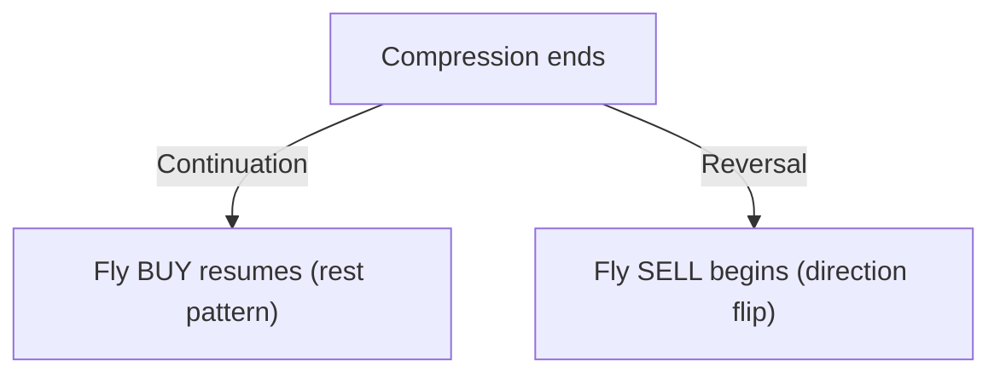
```mermaid
flowchart TD
    A["Compression ends"] -->|"Continuation"| B["Fly BUY resumes (rest pattern)"]
    A -->|"Reversal"| C["Fly SELL begins (direction flip)"]
```

### Two Possible Outcomes

| Outcome | Description | Reference Scenario |
|---------|-------------|-------------------|
| **Continuation** | Price resumes original direction after compression | Scenario D — Fly → Shrink → Fly (rest pattern) |
| **Reversal** | Price breaks out in opposite direction | Scenario E → F — compression then reversal |

### Key Discrimination Criteria

| Indicator | Continuation (Rest Pattern) | Reversal |
|-----------|----------------------------|----------|
| **H1 step direction** | Maintained throughout | Breaks/reverses |
| **H4 step direction** | Maintained throughout | May reverse |
| **Compression duration** | Brief (hours) | Extended (days) |
| **Band expansion after** | Same direction | Opposite direction |
| **HTF fly throughout** | Yes — W1/D1/H4 all still flying | No — HTFs also compress or slow |
| **Gate labels during rest** | [G6-LOAD] only | [G0c-SQZLOCK], [G0b-PINK] |
| **L/U touch pattern** | Minimal | High L or U counts (repeated tests) |
| **PredictNextTrend** | Continuation (BUY/SELL) | Reversal flag (R:BUY/R:SELL) |

### HTF Compression Level Determines Likelihood

| HTF State During Compression | Outcome Likelihood |
|------------------------------|-------------------|
| H4 still flying, only M30/M15 compress | **Continuation likely** (rest pattern) |
| H4 also shrinking | **Either possible** — watch H1 step |
| H4 also in SQZ | **Reversal more likely** |
| D1 also slowing | **Reversal most likely** |

### Decision Tree for Post-Compression Analysis


```mermaid
flowchart TD
    A["Compression ends"] --> B["M5 breaks SQZ"]
    B --> C{"H1 still maintaining original step?"}
    C -->|YES| D{"H4 still flying original direction?"}
    D -->|YES| E["CONTINUATION — Scenario D (rest pattern)"]
    D -->|NO| F["Reversal forming — watch REVUP/REVDN"]
    C -->|NO| G["Reversal likely — wait for REVUP/REVDN"]
    G --> H{"M15 confirming new direction?"}
    H -->|YES| I["Reversal confirmed — enter new direction"]
    H -->|NO| J["Wait for M15 confirmation"]
```

### Compression Depth vs Outcome

| Compression Depth | Typical Outcome |
|-------------------|-----------------|
| **Shallow** (M5/M15 only, hours) | Continuation — rest pattern |
| **Moderate** (M30+ included, 4-8 hours) | Either — depends on H1/H4 |
| **Deep** (H1+, days, full SQZ) | Reversal more likely |

### Visual Signals of Continuation (Rest Pattern)

| Signal | Chart Cue |
|--------|-----------|
| H1 bands still stepping in original direction | Red band continues same trajectory |
| H4 bands still stepping | Yellow band continues same trajectory |
| White rectangles (rest zones) then bands re-expand same way | See fly→shrink→fly chart |
| [G6-LOAD] → [G6-BUY/SELL] same as before compression | Gate labels consistent |

### Visual Signals of Reversal

| Signal | Chart Cue |
|--------|-----------|
| H1 step direction breaks | Red band stops or reverses |
| REVUP/REVDN label appears | Midband transition label |
| Bands expand in opposite direction | Upper/lower bands fan opposite way |
| [G0b-PINK] appears | Magenta label — exit all |
| Predict label shows R:BUY/R:SELL | Aqua/orange reversal labels |

---

## 10. Block Gate Reference Table

| Gate | Block Condition | Color | Resolution |
|------|----------------|-------|------------|
| H4-OPPOSE | H4 fly opposing entry direction | DarkOrange | Wait for H4 to align |
| H4-SQZ | H4 in SQZ with no conviction | DarkOrange | Wait for H4 breakout |
| G0b-H4OPP | H4 fly/shrink opposing entry | DarkOrange | H4 mid must align with entry |
| G0b-M30OPP | M30 fly/shrink/SQZ with opposing mid | DarkMagenta | M30 mid must align |
| G4e-H4OPP | H4 in shrink with flat mid (sideway) | Orange | Wait for H4 to exit shrink |
| G4c-M15OPP | M15 fly/shrink/SQZ with opposing mid | Orange | M15 mid must align |
| G4f-M30OPP | M30 fly/shrink/SQZ with opposing mid | Orange | M30 mid must align |
| G0b-SQZLOCK | H1+M30 both SQZ, both mid==3 | Magenta | At least one TF must break SQZ |
| G0b-H1SQZDN | H1-SQZ with mid=2/4 vs BUY, or mid=5 vs SELL | Magenta | H1 mid must align with entry |
| G0b-M5OPP | M5 sole trigger + M5 shrink with opposing mid | Magenta | M5 mid must align |
| G0b-M5FLY | M5 in committed opposing fly | Magenta | Wait for M5 to align |

---

## 11. Position Sizing Matrix

| TF Alignment | M15/M30/H1 H4 Fly | Shrink | SQZ |
|--------------|-------------------|--------|-----|
| 4+ TFs agree | 1.0× | 0.75× | 0.50× |
| 3 TFs agree | 1.0× | 0.50× | 0.25× |
| 2 TFs agree | 0.75× | 0.25× | Skip |
| 1 TF | 0.50× | Skip | Skip |

**Quality score multiplier:**
- ≥90: 1.0× (full size)
- ≥75: 0.75×
- ≥60: 0.50×
- ≥45: 0.25×
- <45: Skip

---

## 12. Risk Management Guidelines

**ATRSL stop behavior:**
- dir=0 (uptrend): orange stop below price, trailing upward
- dir=1 (downtrend): orange stop above price, trailing downward
- Yellow buffer: visual cushion (1 ATR offset)
- Stop lags during brief M5/M15 squeezes — do not use as primary signal during fly expand

**Stop tightening during compression:**
- When H4 enters shrink: consider tightening stop toward H4 band boundary
- When M30/M15 both compressing: move stop closer to entry price
- During full SQZ: exit all positions (G0b-PINK)

**Emergency exit conditions:**
- Float loss < −$50 → G0e-MAXLOSS (exit immediately)
- M30+M15+H1 all mid≥3 → G0 (exit all)
- M15+M30 both SQZ → G0b-PINK (exit all)
- ATRSL trailing stop hit → Broker closes

**IMPORTANT:** Always read HTF before analyzing MTF/LTF. HTF determines:
1. **Direction** — which way the wind blows for all lower TFs
2. **Target** — where lower TF trades travel to before stopping
3. **Why sideway** — lower TF goes sideway because HTF is compressing or ranging
4. **MTF Predict** — if H4 is sideway and D1 is shrinking, in the same time M30 & H1 in fly in direction, able to predict the fly will end at H4 upper band or H1 will drive H4 to fly. 

The cascade is top-down: **W1 sets D1's range → D1 sets H4's range → H4 sets H1's range -> H1 sets M30's range → M30 sets M15's range**.

---

## 13. Cascade Direction Model

Two cascade directions drive every market cycle in this strategy.

### D1 — Compression Cascade (HTF → LTF)

HTF tightens → confines TF below → cascades downward until LTF reaches SQZ.
HTF is the driver. Observable as BBW_stage dropping TF by TF from top down.

```
H4 shrinks (513/523)
  → H1 confined within H4 band → H1 ranges within H4 upper/lower
    → M30 confined within H1 band → M30 shrinks
      → M15 confined within M30 band → M15 shrinks
        → M5 reaches SQZ (400-499) — deepest confinement point
```

### D2 — Expansion Cascade (LTF → HTF)

LTF breaks SQZ first → signal travels upward → HTF confirms last.
LTF is the leading indicator. Observable as REVUP/REVDN at M5, then M15 fly, then M30, H1, H4.

```
M5 breaks SQZ (REVUP/REVDN) — G6-LOAD fires
  → M15 follows in 2-5 bars (FLAT→UP/DN) — G6-BUY/SELL fires — ENTRY
    → M30 confirms (511/512) — quality boost +10 to +15
      → H1 confirms — hold signal sustained
        → H4 confirms — full fly → Scenario A
```

### Cycle Sequence

```
TOP (A) → D1 begins (B) → D1 deepens (E) → BOTTOM (G or E2)
→ D2 initiates (D or F) → D2 confirms (C or back to A)
```

### Touch Type Classification

During D1, bands move toward price — candle wicks touch multiple TF bands simultaneously.
Three touch types must be distinguished:

| Type | BBW_stage | diffMid_Trend | BBUpDn_state | Meaning | Action |
|------|-----------|---------------|--------------|---------|--------|
| Type 1 | Shrinking 513/523 | 3/4/5 — flat or weak | 2 (shrinking — band moving toward price) | Band moved to price — compression geometry noise | IGNORE — not a signal |
| Type 2 | Highest still-flying TF at outer band | 4 or 5 — directional lean | 1 (expanding) at HTF level — PriceLoc=at_upper or at_lower | Price reached confinement boundary — real signal | Check G0b filters — valid entry |
| Type 3 | Multiple TFs SQZ 400-499 | 3 all TFs | 0 (no_state) alternating with 2 same bar/adjacent bars | SQZ peak — band width < candle range, geometric overlap | G0b-PINK zone — EXIT all, wait |

**Key rule:** The signal always comes from the HIGHEST TF that is currently at its outer band (PriceLoc=at_upper or at_lower).
Lower TF outer band touches during HTF shrink = Type 1 noise (BBUpDn_state=2 shrinking, band moved to price).
HTF confinement boundary touch WITH PriceLoc=at_upper/lower AND diffMid=4/5 = Type 2 valid signal.
**BBUpDn_state measures band movement direction — NOT price location:**
- 0 = no_state (SQZ or transitional)
- 1 = expanding (upper rising AND lower falling — confirmed 2 bars)
- 2 = shrinking (upper falling AND lower rising — confirmed 2 bars)
- 3 = up (both bands moving upward together)
- 4 = dn (both bands moving downward together)

---

# PART 2 — HTF Reference Charts

**When going through PART 2 — HIGHER TIMEFRAME ANALYSIS (W1 → D1 → H4):**
- Read `references/Backtest_data/extras/backtest_EA_HTF_Fly_2_Shrink_part1.jpg` as the visual reference for Part 1
- Read `references/Backtest_data/extras/backtest_EA_HTF_Fly_2_Shrink_part2.jpg` as the visual reference for Part 2


**Part 1 — Full macro cycle (Jan–Feb 2026):**
- **Left:** W1 (lightcyan/white) and D1 (magenta) bands stepping upward — both in fly. H4 (yellow) flies in the same direction. All TFs aligned: M30/M15/M5 all ride this macro momentum upward
- **Yellow circles (left):** H4 shrink and squeezed then continue fly — each step up is where H4 upper band previously sat; these become support on the way up
- **Peak (center, ~5400):** Price reached D1 upper band → D1 starts shrinking (top of D1 fly). H4 follows, entering shrink. M30/M15 lose macro tailwind and reverse
- **White rectangles (right):** After D1/H4 enter shrink, M30/M15 are forced to range within the H4 band envelope — oscillating between H4 upper and H4 lower. This is the "M30 sideway caused by H4 shrink" pattern
- **Blue circles:** Cascade band-touch entries (G0b-TOUCH) firing at H4 band boundaries during H4 shrink phase — price touches H4 outer band edge, G0b-TOUCH fires


**Part 2 — H4 shrink zones (Feb–Apr 2026):**
- **H4 stage labels "H4-Fly--" visible on bands** — H4 is in shrink (513 or 523) throughout most of this period
- **D1 (magenta) still stepping at bottom** — D1 remains in fly, providing macro direction bias even while H4 shrinks. D1 fly direction = the "eventual" direction price returns to after H4 shrink resolves
- **Large pink rectangles:** H4 shrink zones where M30/M15 are confined. Inside each rectangle: M30/M15 oscillate within the H4 upper/lower band range — they cannot break out until H4 exits shrink
- **Purple circles:** M30/M15 pivot points at H4 band boundaries — these are the "outer band touch" exit signals (G8-BNDTGT fires here). Sell when M30 touches H4 upper band; buy when M30 touches H4 lower band
- **After each pink rectangle:** When H4 exits shrink back to fly (either resuming D1 direction or reversing), M30/M15/M5 resume trending

---

## W1 — Ultra-Macro Context

W1 is the slowest band (lightcyan, widest). It changes direction rarely but determines the multi-month trajectory.

| W1 Stage | diffmid Trend | What it means | MTF implication |
|----------|---------------|----------------|----------------|
| 511/512 (BUY) | | Multi-week uptrend — macro wind is bullish | All lower TF dips are buying opportunities; BUY trades last longer; SELL trades are counter-trend (smaller size, faster exit) |
| 521/522 (SELL) | | Multi-week downtrend — macro wind is bearish | All lower TF rallies are selling opportunities; SELL trades last longer; BUY trades are counter-trend |
| 513 (BUY shrink) | | Macro uptrend slowing — D1/H4 will start to compress | Expect H4 shrink soon → M30 ranges will get tighter; new BUY entries are shorter-duration |
| 523 (SELL shrink) | | Macro downtrend slowing | Expect H4 shrink soon → SELL entries shorter-duration |
| 400–499 (SQZ) | | Multi-week range — no macro conviction | No sustained directional moves at any TF; range-trade only; avoid large positions |

**W1 price target:** When W1 is in fly, the D1 outer band is where price gravitates before W1 itself turns. When price is far below W1 upper band (BUY), the W1 band acts as a long-distance magnet.

---

## D1 — Daily Macro

D1 is the magenta band. It steps in large increments and updates slowly.

| D1 Stage | diffmid Trend | What it means | MTF implication |
|----------|---------------|-------------------|-------------------|
| 511/512 (BUY) + W1 fly | | Strong macro alignment — daily uptrend | H4 BUY entries are high-quality; hold through H4 brief SQZ; target = D1 outer band |
| 521/522 (SELL) + W1 fly | | D1 SELL vs W1 BUY — D1 is counter-trend pullback | H4 SELL entries are shorter-duration; expect D1 BUY to resume once pullback exhausts |
| 521/522 (SELL) + W1 SELL | | Full alignment bearish | H4 SELL entries ride toward D1 lower band; BUY is counter-trend |
| 513/523 (shrink) | | D1 losing directional conviction | H4 is about to lose macro backing; H4 trades become range-bound |
| 400–499 (SQZ) | | D1 flat — no daily directional bias | H4 fly entries get no macro tailwind; H4 trades chop within D1 band range |

**D1 price target rule:** When D1 is in fly BUY, H4 trades travel toward the **D1 upper band** before D1 turns. The D1 upper band is the "ceiling" for H4 BUY trades on the macro timeframe.

---

## H4 — Macro Bias Filter

H4 is the yellow band. It directly controls M30/M15/M5 entry quality and duration.

| H4 Stage + Mid | diffmid Trend | What it means | MTF implication |
|----------------|---------------|-----------------|-------------------|
| 511/512 + mid=1 | | H4 BUY fly | M30 BUY trades fully backed — ride toward H4 upper band; hold through M5 brief squeezes |
| 521/522 + mid=2 | | H4 SELL fly | M30 SELL trades fully backed — ride toward H4 lower band |
| 513 + mid=1/5 | | H4 bullish shrink | H4 is contracting but still bullish — M30 BUY trades are shorter; exit when price reaches H4 outer band |
| 523 + mid=2/4 | | H4 bearish shrink | H4 contracting, still bearish — H1 SELL trades shorter |
| 513/523 + mid=3 | | H4 shrink with flat mid | H4 has no directional conviction — **G4e-H4OPP blocks this in shrink path** |
| 400–499 + mid=1/5 | | H4 SQZ, but midtrend bullish | Weak H4 — G0b-H4OPP passes (mid has some conviction); M5 must confirm direction |
| 400–499 + mid=3 | | H4 SQZ flat | No macro conviction at all |
| 400–499 + mid=2/4 | | H4 SQZ, bearish mid | H4 SQZ but leaning bearish — blocks BUY entries via G0b-H4OPP |

---

## The Core HTF → MTF Cascade Rule

**Always check H4**

**Why does H1 go sideway?** Because H4 is shrinking or in SQZ.

When H4 is in fly: H1 has a clear macro path → H1 trades travel toward H4 outer band.
When H4 enters shrink: H4's band range narrows → H1 is confined within that shrinking range → H1 oscillates and appears "sideway."
When H4 is in SQZ: H1 has no target beyond the SQZ boundaries → H1 chops flat.

```
H4 stage       → H1 behavior              → MTF trade duration
─────────────────────────────────────────────────────────────────
511/512 fly    → H1 trends with H4        → Long trades — hold until H4 outer band
513/523 shrink → H1 ranges within H4 band → Short trades — exit at H4 band boundary
400-499 SQZ    → H1 flat/ranging          → No new trades; wait for H4 breakout
```

**Price target derivation (top-down):**

| Trade entry | Target 1 | Target 2 | Exit signal |
|-------------|----------|----------|-------------|
| W1 fly BUY + D1 fly BUY | H4 outer band | D1 outer band | D1 starts shrinking (513) |
| D1 fly BUY + H4 fly BUY | H1 outer band → H1 outer band | H4 outer band | H4 starts shrinking |
| H4 fly BUY + H1 fly BUY | M15 outer band | H1 outer band | H1 goes sideway; H4 outer band reached |
| H4 shrink + H1 ranging | H4 upper band (BUY) or lower (SELL) | — | Price touches H4 outer band → G8-BNDTGT fires |
| All HTF SQZ | No target | — | Wait — no trade |

---

## HTF Analysis Step-by-Step

Before looking at any H1/M30/M15/M5 entry, answer these questions:

**1. What is W1 doing?**
- Fly BUY / Fly SELL / Shrink / SQZ?
- This sets the multi-week wind direction.
- Impact D1 sideway when W1 shrink

**2. What is D1 doing?**
- Fly same direction as W1 → full alignment, hold trades longer
- Fly opposite to W1 → counter-trend pullback; shorter trades
- Shrink → D1 losing conviction; H4 trades will become shorter
- SQZ → H4 has no D1 backing; only range trades

**3. What is H4 doing?**
- Fly BUY/SELL → H1 entries ride toward H4 outer band
- Shrink (513/523) → H1 is ranging within H4 band; short trades, target = H4 outer band boundary
- SQZ (400-499) → H1 entry requires G0b / H4-SQZ path with M5 confirmation

**4. What is the price target for H1?**
- H4 fly → H4 outer band is where H1 trades stop
- H4 shrink → H4 outer band is where the range reverses
- H4 SQZ → no clear target; wait for breakout

**5. Why is H1 sideway right now?**
- Check H4: if H4 is shrinking or SQZ → that is why H1 is flat
- Once H4 exits shrink back to fly → H1 will resume trending

---

## Scenario Identification Flowchart

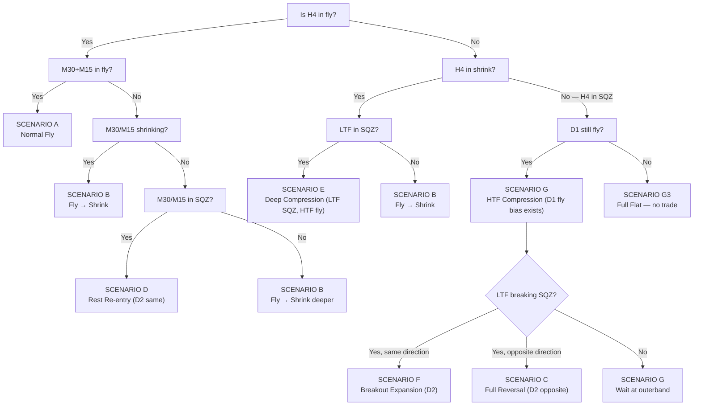
```mermaid
flowchart TD
    A["Is H4 in fly?"] -->|Yes| B["M30+M15 in fly?"]
    B -->|Yes| C["SCENARIO A\nNormal Fly"]
    B -->|No| D["M30/M15 shrinking?"]
    D -->|Yes| E["SCENARIO B\nFly → Shrink"]
    D -->|No| F["M30/M15 in SQZ?"]
    F -->|Yes| G["SCENARIO D\nRest Re-entry (D2 same)"]
    F -->|No| H["SCENARIO B\nFly → Shrink deeper"]
    A -->|No| I["H4 in shrink?"]
    I -->|Yes| J["LTF in SQZ?"]
    J -->|Yes| K["SCENARIO E\nDeep Compression (LTF SQZ, HTF fly)"]
    J -->|No| L["SCENARIO B\nFly → Shrink"]
    I -->|No — H4 in SQZ| M["D1 still fly?"]
    M -->|Yes| N["SCENARIO G\nHTF Compression (D1 fly bias exists)"]
    M -->|No| O["SCENARIO G3\nFull Flat — no trade"]
    N --> P{"LTF breaking SQZ?"}
    P -->|Yes, same direction| Q["SCENARIO F\nBreakout Expansion (D2)"]
    P -->|Yes, opposite direction| R["SCENARIO C\nFull Reversal (D2 opposite)"]
    P -->|No| S["SCENARIO G\nWait at outerband"]
```

---

# PART 3 — MIDDLE AND LOWER TIMEFRAME SCENARIO ANALYSIS

Apply after HTF context is established.
Read Part 2 HTF context first — every scenario below only makes sense
when you know what H4 + D1 are doing.

Scenarios are organised by **cascade position** — where in the D1→D2
cycle the market currently sits. Two cascade directions drive every cycle:

- **D1 — Compression cascade (HTF → LTF):** HTF tightens → confines TF below → cascades down. HTF is the driver.
- **D2 — Expansion cascade (LTF → HTF):** LTF breaks SQZ first → signal travels upward → HTF confirms last. LTF is the leading indicator.

**Cycle sequence:**
```
TOP (A) → D1 begins (B) → D1 deepens (E) → BOTTOM (G or E2)
→ D2 initiates (D or F) → D2 confirms (C or back to A)
```

---

## TIER 1 — EXPANSION COMPLETE (TOP)

> D2 cascade fully confirmed. All TFs expanding same direction.
> HTF fly intact. Highest entry quality. D1 has not yet begun.

**Scenarios in this tier:** A

---

## TIER 2 — COMPRESSION IN PROGRESS (D1)

> HTF compressing downward toward LTF. Trades shorter and
> size reduces as compression depth increases.
> D1 cascade is the cause — HTF state confines every TF below it.

**Scenarios in this tier:** B (shallow) → E (deep, HTF fly) → G (HTF also compressing)

---

## TIER 3 — EXPANSION IN PROGRESS (D2)

> LTF breaking out, signal travelling upward toward HTF.
> Entry quality increases as each TF confirms upward.
> Direction may be same as previous trend (D, F) or opposite (C).

**Scenarios in this tier:** D (same direction) → F (breakout from deep) → C (full reversal)

---

---

## Scenario A — Normal Fly (All TFs Aligned)

**When user asks to analyze a part 3 Scenario A:**
- Read `./Backtest_data/extras/backtested_EA_fly_scenario.jpg` as Normal fly scenario visual reference


#### Image Analysis — backtested_EA_fly_scenario.jpg

##### Step 1: Mark Reading — Cause, Event, and Impact

| Mark | Cause (upstream TF state) | Event (transition at this bar) | Impact Immediate (1–5 bars) | Impact Sustained (duration) |
|------|--------------------------|-------------------------------|----------------------------|----------------------------|
| [TO BE FILLED] | W1/D1/H4 all fly 511/512 mid=1 | Full alignment maintained | G6-BUY/SELL fires | Hold until H4 outer band |

##### Step 2: HTF Analysis (W1 → D1 → H4)

| TF | BBW_stage | diffMid_Trend | BBUpDn_state | Touch Type | Role |
|----|-----------|---------------|--------------|------------|------|
| W1 | 511/512 | 1 | [TO BE FILLED] | [TO BE FILLED] | Macro direction BUY |
| D1 | 511/512 | 1 | [TO BE FILLED] | [TO BE FILLED] | Price target ceiling |
| H4 | 511/512 | 1 | [TO BE FILLED] | [TO BE FILLED] | Confirmation + entry target |

**HTF Summary:** Full macro alignment BUY | D1 outer band | N/A — all fly | HTF providing full context

##### Step 3: MTF Analysis (H1 → M30)

| TF | BBW_stage | diffMid_Trend | BBUpDn_state | Touch Type | Role |
|----|-----------|---------------|--------------|------------|------|
| H1  | 511/512 | 1 | [TO BE FILLED] | [TO BE FILLED] | Confirms H4 fly |
| M30 | 511/512 | 1 | [TO BE FILLED] | [TO BE FILLED] | Primary trend driver |

**MTF Summary:** Trending | H4 outer band | Type 1 | G6-BUY/SELL | Supports H4 fly | M15 entry valid

##### Step 4: LTF Analysis (M15 → M5)

| TF | BBW_stage | diffMid_Trend | BBUpDn_state | Touch Type | Role |
|----|-----------|---------------|--------------|------------|------|
| M15 | 511/512 | 1 | [TO BE FILLED] | [TO BE FILLED] | Entry trigger |
| M5  | 511/512 (brief SQZ noise) | 1 | [TO BE FILLED] | [TO BE FILLED] | Noise — not trigger |

**LTF Summary:** D1 lagging — all fly | [TO BE FILLED] | No reversal | G6-BUY/SELL | Confirms MTF | N/A

##### Step 5: Cross-TF Impact Chain

**D1 compression (HTF → LTF):**
- No D1 active — all TFs in fly

**D2 expansion (LTF → HTF):**
- Already at TOP — full fly alignment

**Cascade position:** D1 depth = none (TOP) | D2 initiated at = already complete | Leading TF = H4 (watch for shrink)

##### Step 6: Concluded Analysis

Scenario A — Normal Fly. All TFs from W1 through M5 in fly 511/512 with mid=1. Full macro tailwind, no compression. Price target is H4 outer band then D1 outer band. Key observable: any TF entering shrink (513) signals D1 compression beginning → transition to Scenario B.

##### Step 7: Identification Flowchart

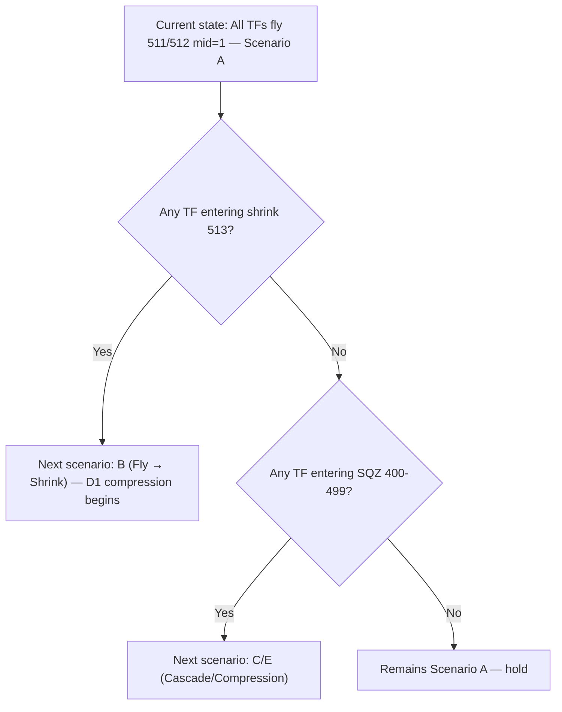
```mermaid
flowchart TD
    A["Current state: All TFs fly 511/512 mid=1 — Scenario A"]
    A --> B{"Any TF entering shrink 513?"}
    B -->|Yes| C["Next scenario: B (Fly → Shrink) — D1 compression begins"]
    B -->|No| D{"Any TF entering SQZ 400-499?"}
    D -->|Yes| E["Next scenario: C/E (Cascade/Compression)"]
    D -->|No| F["Remains Scenario A — hold"]
```

**Prediction rules:**
- IF H4 enters 513 → next scenario = B
- IF M30 or M15 enters 513 first → next scenario = B (shallow)
- Watch: H4 BBW_stage for first sign of shrink

### Cascade Position — Scenario A

| Dimension | Value |
|-----------|-------|
| Cascade direction now | TOP |
| Cascade depth | None — all fly |
| Leading TF | H4 (watch for shrink) |
| Next scenario if D1 continues | B (Fly → Shrink) |
| Next scenario if D2 initiates same direction | A remains (already at TOP) |
| Next scenario if D2 initiates opposite direction | G (All Sideway) via reversal |
| Discriminator observable | H4 BBW_stage 511→513 |

> **Tier:** TIER 1 — EXPANSION COMPLETE (TOP)
> **Cascade position:** D2 fully confirmed — all TFs aligned
> **Cascade direction:** TOP — no active D1 or D2, fully expanded
> **Leading TF:** M15 (entry trigger)
> **Next scenario:** → B when M15 first enters 513/523 (D1 begins at M15 depth)

### Sub-Scenarios

| Sub | Name | HTF State | MTF State | LTF State | Trade Mode | Size |
|-----|------|-----------|-----------|-----------|------------|------|
| A1 | Strong Fly | W1+D1+H4 all 511/512 | H1+M30 511/512 | M15+M5 511/512 | Full trend entry — hold toward D1 outer band | 1.0× |
| A2 | Partial Fly | H4 511/512 fly but W1 or D1 counter-trend | H1+M30 511/512 | M15+M5 511/512 | Trend entry, shorter hold — exit at H4 outer band | 0.75× |
| A3 | Noise Squeeze | H4+D1+W1 all 511/512 | H1+M30 511/512 | M15 513/523 briefly OR M5 400-499 briefly | HOLD through — Type 1 compression noise | 1.0× |

**Discriminator A1 vs A2:** Check W1 and D1 BBW_stage — both 511/512 = A1, either opposing = A2
**Discriminator A2 vs A3:** A3 is a sub-state within A1 or A2 — M5/M15 brief squeeze only, M30 still 511/512

**HTF context:** W1 fly + D1 fly + H4 fly — all in same direction. Full macro tailwind.

**What you see:**
- H1 (red) and M30 (greenyellow) bands stepping in fly (511/512 or 521/522)
- All bands fanning outward in the same direction
- M5 (aqua) may show 2–3 brief tight bundles mid-fly — noise squeezes
- No mid-band labels visible (mid=1 or 2 — suppressed)
- H4 (yellow) stepping in same direction — macro confirmed

**What it means:**
- Full alignment — strongest possible trend
- Brief M5/M15 compressions are noise — M30 midtrend is the reference
- H4 fly is why brief squeezes resolve back to fly instead of deeper compression
- Price target: H4 outer band → then D1 outer band if D1 is also fly

### Scenario A Identification Flowchart

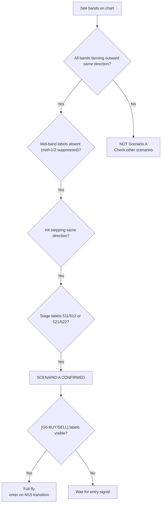
```mermaid
flowchart TD
    A["See bands on chart"] --> B{"All bands fanning outward same direction?"}
    B -->|Yes| C{"Mid-band labels absent (mid=1/2 suppressed)?"}
    C -->|Yes| D{"H4 stepping same direction?"}
    D -->|Yes| E{"Stage labels 511/512 or 521/522?"}
    E -->|Yes| F["SCENARIO A CONFIRMED"]
    F --> G{"[G6-BUY/SELL] labels visible?"}
    G -->|Yes| H["Full fly\nenter on M15 transition"]
    G -->|No| I["Wait for entry signal"]
    B -->|No| J["NOT Scenario A\nCheck other scenarios"]
```

**Visual confirmation checklist:**

| Visual Cue | Present? |
|-----------|----------|
| All bands expanding outward same direction | [ ] |
| No mid-band labels (mid=1/2) | [ ] |
| H4 stepping in same direction | [ ] |
| Stage labels 511/512/521/522 | [ ] |
| [G6-BUY] or [G6-SELL] gate labels | [ ] |

**5/5 present = Confirmed Scenario A**

---

**Holding vs exiting decision:**

| Condition | Action |
|-----------|--------|
| Brief M5 squeeze (< 3 bars) | HOLD — noise |
| M15 squeeze (< 5 bars) | HOLD — still within fly |
| M30 squeeze (< 10 bars) | HOLD — H4 still flying |
| M15 UP→FLAT transition | EXIT (G5-FADE) |
| M30+M15 both mid≥3 | EXIT (G0) |
| ATRSL stop hit | EXIT (broker closes) |

**Trade action:**
```
BUY:  H1+M30 511/512 + mid=1  →  enter on M15 FLAT→UP transition
SELL: H1+M30 521/522 + mid=2  →  enter on M15 FLAT→DN transition
HOLD: through all brief M5/M15 noise squeezes (< 3 bars)
EXIT: M15 UP→FLAT (G5-FADE) | M30+M15 both sideway (G0) | ATRSL stop hit | H4 outer band reached (G8-BNDTGT)
SIZE: 1.0× (full — highest quality when W1+D1+H4 all aligned)
```

---

## Scenario B — Fly → Shrink (Inner TFs Contracting)

**When user asks to analyze a part 3 Scenario B:**
- Read `./Backtest_data/extras/backtested_EA_fly_2_fly_shrink.jpg` as the Fly to Shrink visual reference.
- Read `./Backtest_data/extras/backtested_EA_fly_2_fly_shrink_zoomin.jpg` as the Fly to Shrink zoomin visual reference


#### Image 1 Analysis — backtested_EA_fly_2_fly_shrink.jpg

##### Step 1: Mark Reading — Cause, Event, and Impact

| Mark | Cause (upstream TF state) | Event (transition at this bar) | Impact Immediate (1–5 bars) | Impact Sustained (duration) |
|------|--------------------------|-------------------------------|----------------------------|----------------------------|
| [TO BE FILLED] | H4 fly 511/512 mid=1 | M30/M15 transition 511→513 | Midtrend labels (3,4,5) appear | M15 confined within M30 band |

##### Step 2: HTF Analysis (W1 → D1 → H4)

| TF | BBW_stage | diffMid_Trend | BBUpDn_state | Touch Type | Role |
|----|-----------|---------------|--------------|------------|------|
| W1 | 511/512 | 1 | [TO BE FILLED] | [TO BE FILLED] | Macro direction BUY |
| D1 | 511/512 | 1 | [TO BE FILLED] | [TO BE FILLED] | Price target ceiling |
| H4 | 511/512 | 1 | [TO BE FILLED] | [TO BE FILLED] | Direction + target for M30 |

**HTF Summary:** H4 fly provides direction | H4 outer band | M15 shrinking due to M30 confinement | HTF providing context

##### Step 3: MTF Analysis (H1 → M30)

| TF | BBW_stage | diffMid_Trend | BBUpDn_state | Touch Type | Role |
|----|-----------|---------------|--------------|------------|------|
| H1  | 511/512 | 1 | [TO BE FILLED] | [TO BE FILLED] | Confirms H4 fly |
| M30 | 513/523 | 3/4/5 | [TO BE FILLED] | Type 1 | Confinement boundary for M15 |

**MTF Summary:** H1 trending, M30 ranging | M30 outer band | Type 1 | G4f-M30OPP may block | N/A | M15 confined

##### Step 4: LTF Analysis (M15 → M5)

| TF | BBW_stage | diffMid_Trend | BBUpDn_state | Touch Type | Role |
|----|-----------|---------------|--------------|------------|------|
| M15 | 513/523 | 3/4/5 | [TO BE FILLED] | Type 1 | Entry trigger on FLAT→UP/DN |
| M5  | 513/523 | 3/4/5 | [TO BE FILLED] | Type 1 | Noise — not trigger |

**LTF Summary:** D1 compression reaching LTF | [TO BE FILLED] | [TO BE FILLED] | G4c-M15OPP | M30 confined by H1 | N/A

##### Step 5: Cross-TF Impact Chain

**D1 compression (HTF → LTF):**
- H4 fly 511/512 → H1 fly → M30 shrink 513 → M15 shrink 513 → M5 shrink

**D2 expansion (LTF → HTF):**
- Not yet initiated

**Cascade position:** D1 depth = M5 | D2 initiated at = NOT YET | Leading TF = M30 (watch for SQZ or fly resume)

##### Step 6: Concluded Analysis

Scenario B — Fly → Shrink, early D1 compression. H4/H1 remain in fly providing direction. M30 has entered shrink (513) with midtrend labels (3,4,5) appearing. M15 and M5 follow. Price resting inside H4 band. Key observable: M30 BBW_stage — if it returns to 511/512, D2 expansion resumes (Scenario D); if it deepens to 400-499, D1 continues (Scenario E).

##### Step 7: Identification Flowchart

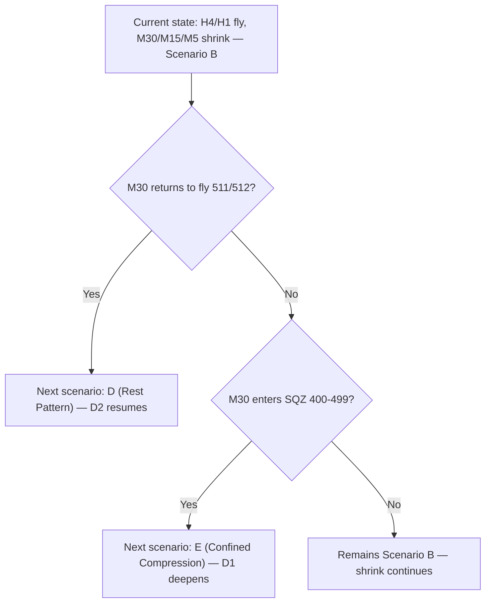
```mermaid
flowchart TD
    A["Current state: H4/H1 fly, M30/M15/M5 shrink — Scenario B"]
    A --> B{"M30 returns to fly 511/512?"}
    B -->|Yes| C["Next scenario: D (Rest Pattern) — D2 resumes"]
    B -->|No| D{"M30 enters SQZ 400-499?"}
    D -->|Yes| E["Next scenario: E (Confined Compression) — D1 deepens"]
    D -->|No| F["Remains Scenario B — shrink continues"]
```

**Prediction rules:**
- IF M30 513→511/512 → next scenario = D
- IF M30 513→400-499 → next scenario = E
- Watch: M30 BBW_stage + midtrend label changes

#### Image 2 Analysis — backtested_EA_fly_2_fly_shrink_zoomin.jpg

##### Step 1: Mark Reading — Cause, Event, and Impact

| Mark | Cause (upstream TF state) | Event (transition at this bar) | Impact Immediate (1–5 bars) | Impact Sustained (duration) |
|------|--------------------------|-------------------------------|----------------------------|----------------------------|
| [TO BE FILLED] | M30 shrink 513 | M15 bands converging | Entry on M15 FLAT→UP/DN possible | M15 confined within M30 |

##### Step 2: HTF Analysis (W1 → D1 → H4)

| TF | BBW_stage | diffMid_Trend | BBUpDn_state | Touch Type | Role |
|----|-----------|---------------|--------------|------------|------|
| W1 | 511/512 | 1 | [TO BE FILLED] | [TO BE FILLED] | Macro direction BUY |
| D1 | 511/512 | 1 | [TO BE FILLED] | [TO BE FILLED] | Price target ceiling |
| H4 | 511/512 | 1 | [TO BE FILLED] | [TO BE FILLED] | Direction + target |

**HTF Summary:** H4 fly maintained | H4 outer band | M15 resting due to M30 shrink | HTF providing context

##### Step 3: MTF Analysis (H1 → M30)

| TF | BBW_stage | diffMid_Trend | BBUpDn_state | Touch Type | Role |
|----|-----------|---------------|--------------|------------|------|
| H1  | 511/512 | 1 | [TO BE FILLED] | [TO BE FILLED] | Confirms H4 fly |
| M30 | 513/523 | 3/4/5 | [TO BE FILLED] | Type 1 | Confinement for M15 |

**MTF Summary:** H1 trending, M30 ranging | M30 outer band | Type 1 | G4f-M30OPP | N/A | M15 entry via shrink path

##### Step 4: LTF Analysis (M15 → M5)

| TF | BBW_stage | diffMid_Trend | BBUpDn_state | Touch Type | Role |
|----|-----------|---------------|--------------|------------|------|
| M15 | 513/523 | 3/4/5 | [TO BE FILLED] | Type 1 | Shrink path entry trigger |
| M5  | 513/523 | 3/4/5 | [TO BE FILLED] | Type 1 | Noise |

**LTF Summary:** D1 at M15 depth | [TO BE FILLED] | [TO BE FILLED] | G4c-M15OPP | Confirmed by zoom | N/A

##### Step 5: Cross-TF Impact Chain

**D1 compression (HTF → LTF):**
- H4 fly 511/512 → H1 fly → M30 shrink 513 → M15 shrink 513 → M5 shrink

**D2 expansion (LTF → HTF):**
- Not yet initiated — watch M15 for FLAT→UP/DN

**Cascade position:** D1 depth = M5 | D2 initiated at = NOT YET | Leading TF = M15 (watch for transition)

##### Step 6: Concluded Analysis

Scenario B zoom — confirms D1 compression at M30→M15→M5. H4/H1 fly unchanged. M15 midtrend transitions are valid entry triggers. Key observable: M15 FLAT→UP/DN for shrink path entry, or M30 513→511/512 for rest pattern resumption.

##### Step 7: Identification Flowchart

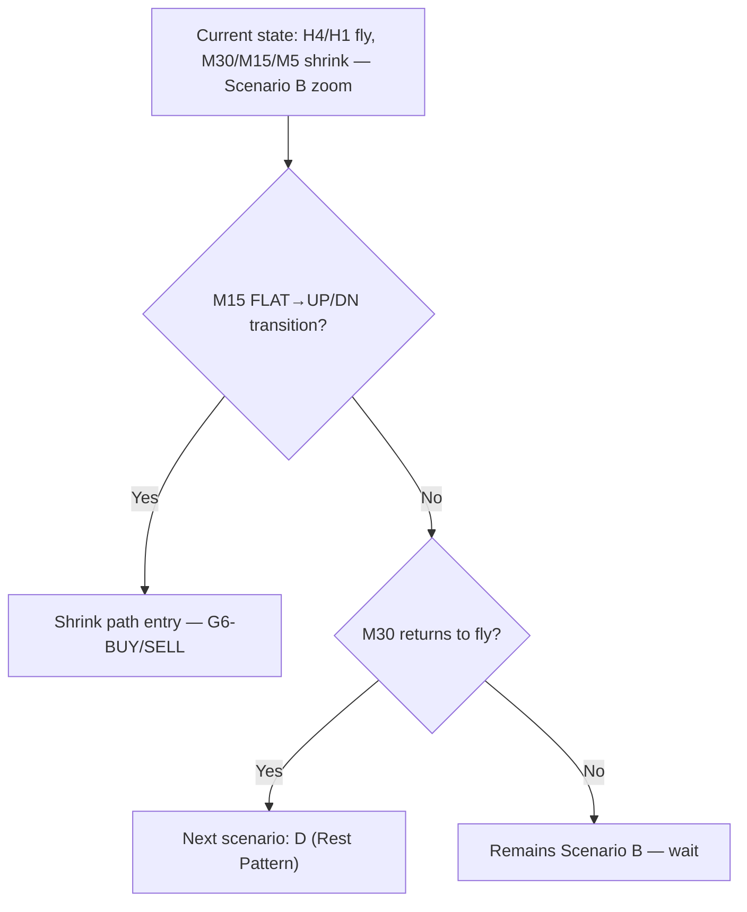
```mermaid
flowchart TD
    A["Current state: H4/H1 fly, M30/M15/M5 shrink — Scenario B zoom"]
    A --> B{"M15 FLAT→UP/DN transition?"}
    B -->|Yes| C["Shrink path entry — G6-BUY/SELL"]
    B -->|No| D{"M30 returns to fly?"}
    D -->|Yes| E["Next scenario: D (Rest Pattern)"]
    D -->|No| F["Remains Scenario B — wait"]
```

**Prediction rules:**
- IF M15 FLAT→UP/DN → shrink path entry
- IF M30 513→511/512 → next scenario = D
- Watch: M15 midtrend transition + M30 BBW_stage

> **Tier:** TIER 2 — COMPRESSION IN PROGRESS (D1 Shallow)
> **Cascade position:** D1 initiated — H4 fly intact, LTF/MTF compressing
> **Cascade direction:** D1 flowing downward — H4 confinement driving MTF/LTF shrink
> **Leading TF:** Lowest TF currently showing 513/523 (frontier of D1)
> **Next scenario:** → E if depth reaches M30+M15 SQZ simultaneously
>                   → D if M5 breaks SQZ in same direction as H4
>                   → C if M5 breaks SQZ in opposite direction to H4

### Sub-Scenarios

| Sub | Name | D1 Depth | H4 | H1 | M30 | M15 | Size | Valid Touch Signal |
|-----|------|----------|----|----|-----|-----|------|--------------------|
| B1 | M15 shrink only | M15 entering 513/523 | 511/512 | 511/512 | 511/512 | 513/523 | 0.75× | M30 outer band BBUpDn=1/2 with mid=4/5 — Type 2 |
| B2 | M30 shrink | M30 also 513/523 | 511/512 | 511/512 | 513/523 | 513/523 | 0.50× | H1 outer band BBUpDn=1/2 with mid=4/5 — Type 2 |
| B3 | H1 shrink | H1 also 513/523 | 511/512 | 513/523 | 513/523 | 513/523 | 0.25× | H4 outer band BBUpDn=1/2 only — Type 2 |

**Touch discrimination during B:** LTF/MTF outer band touches during B are mostly Type 1
(compression geometry — band moved to price, mid=3). Valid signal ONLY when:
PriceLoc=at_upper or at_lower at the HIGHEST still-flying TF AND that TF diffMid=4 or 5 (directional lean).
(BBUpDn_state measures band movement direction: 1=expanding, 2=shrinking, 3=up, 4=dn, 0=no_state — not price location)

**Discriminator B1→B2:** Watch M30 BBW_stage — when M30 enters 513/523, depth increases to B2
**Discriminator B2→B3:** Watch H1 BBW_stage — when H1 enters 513/523, depth increases to B3
**Discriminator B→E:** When M15+M30 both show 400-499 (SQZ) simultaneously → E2

**HTF context:** H4 is still in fly, but M30 or M15 starting to shrink. H4 provides the direction and target; M30/M15 are resting before continuing.

**What you see:**
- H1 (red) and H4 (yellow) still in fly (bands stepping)
- M30 or M15 bands beginning to converge (513/523)
- M5 (aqua) tightening; midtrend labels (3, 4, 5) appear at midband
- Bands that were fanning out are now closing in from one side

**What it means:**
- M30/M15 losing momentum temporarily; H4 macro structure intact
- Price is "resting" inside H4's band before continuing toward H4 outer band
- M5 midtrend transitions are the only valid entry triggers now

**Cascade shrink sequence (why each TF goes sideway):**
- **Only M5 shrink:** M5 resting, M15/M30 still fly → wait — M5 noise within M30 fly
- **M15 shrink** + M30/H1/H4 fly → M15 confined within M30 band; price touches M15 outer band
- **M30 shrink** + H1/H4 fly → M30 confined within H1 band; price touches M30 outer band
- **H1 shrink** + H4 fly → H1 confined within H4 band; price touches H1 outer band

### Scenario B Identification Flowchart


```mermaid
flowchart TD
    A["See bands on chart"] --> B{"H4 still in fly (bands stepping)?"}
    B -->|Yes| C{"M30/M15 bands converging?"}
    C -->|Yes| D{"Stage labels 513/523 (shrink)?"}
    D -->|Yes| E{"Midtrend labels appearing (3,4,5)?"}
    E -->|Yes| F["SCENARIO B CONFIRMED"]
    F --> G{"How many TFs shrinking?"}
    G -->|Only M5| H["M5 noise, wait"]
    G -->|M15 only| I["Shrink path\nentry possible"]
    G -->|M30 also| J["Higher risk\nsmaller size"]
    G -->|H1 also| K["Very high risk\nconsider exit"]
    C -->|No| L["NOT Scenario B\n(bands still expanding)"]
    B -->|No| M["NOT Scenario B"]
```

**Visual confirmation checklist:**

| Visual Cue | Present? |
|-----------|----------|
| H4 still in fly (511/512/521/522) | [ ] |
| M30/M15 bands converging (513/523) | [ ] |
| M5 midtrend labels (3,4,5) appearing | [ ] |
| Upper band curling back toward mid | [ ] |

**3/4 present = Confirmed Scenario B**

---

> **Band width reference:** See Part 1 Section 8 — Compression Zone Identification

**Optimal entry timing during shrink:**
- Enter when M15 shrinks but M30/H4 still flying (best quality)
- Avoid when H4 also shrinking (higher risk)
- Enter at M15 midtrend transition (FLAT→UP/DN)
- Wait for quality score ≥ 75

**Trade action:**
```
ENTRY: M15 FLAT→UP (BUY) or FLAT→DN (SELL) transition
WAIT if: only M5 shrinking, M15 still fly — M5 alone is noise
BLOCK: H4 opposing (G4e-H4OPP) | M15 opposing (G4c-M15OPP) | M30 opposing (G4f-M30OPP)
TARGET: outer band of lowest TF still in fly (= where price stops this leg)
EXIT: M15 UP→FLAT (G5-FADE) | cascade into SQZ | outer band touched (G8-BNDTGT)
SIZE: 0.75× (M15 or M30 shrink alone) → 0.50× (M30+H1 both) → 0.25× (all 3 shrink)
```

### Cascade Position — Scenario B

| Dimension | Value |
|-----------|-------|
| Cascade direction now | D1 (compression) |
| Cascade depth | M5 (M30/M15/M5 shrinking) |
| Leading TF | M30 (watch for SQZ or fly resume) |
| Next scenario if D1 continues | E (Confined Compression) |
| Next scenario if D2 initiates same direction | D (Rest Pattern) |
| Next scenario if D2 initiates opposite direction | G (All Sideway) via reversal |
| Discriminator observable | M30 BBW_stage 513→511/512 or 513→400-499 |

---

## Scenario C — Full Reversal (D2 Opposite Direction)

> **Tier:** TIER 3 — EXPANSION IN PROGRESS (D2 Opposite)
> **Cascade position:** D2 confirmed in opposite direction to previous trend
> **Cascade direction:** D2 flowing upward in new direction — LTF led, HTF confirming last
> **Leading TF:** H4 (last to confirm — once H4 flips, C2 confirmed → treat as new A)
> **Previous scenario:** Came from E2/E3 or G2/G3 — deep compression exhausted
> **Next scenario:** → New A in opposite direction once H4 confirms (C2)

### Sub-Scenarios

| Sub | Name | H4 State | H1 State | M30 State | M15 State | Entry | Size |
|-----|------|----------|----------|-----------|-----------|-------|------|
| C1 | MTF reversal only | 511/512 or 513 (original direction) | Reversed 521/522 | Reversed 521/522 | Reversed 521/522 | Wait — H4 not confirmed, counter-trend risk | 0.25× |
| C2 | H4 confirmed | H4 flipped to new direction 511/512 | New direction | New direction | New direction | ENTER — treat as new Scenario A1/A2 | 1.0× or 0.75× |
| C3 | Counter-trend | H4 reversed BUT W1/D1 still original direction | New direction | New direction | New direction | SHORT hold — W1/D1 will eventually pull back | 0.50× |

**Discriminator C1→C2:** H4 BBW_stage flips from original direction fly to new direction fly
**Discriminator C2 vs C3:** Check W1+D1 — if both also reversed = C2 full (→ A1). If W1/D1 still original = C3 counter-trend
**Key rule:** Do NOT enter at C1. Wait for H4 confirmation (C2) unless deliberately taking
counter-trend with tight stop and 0.25× size.

### Scenario C Identification Flowchart

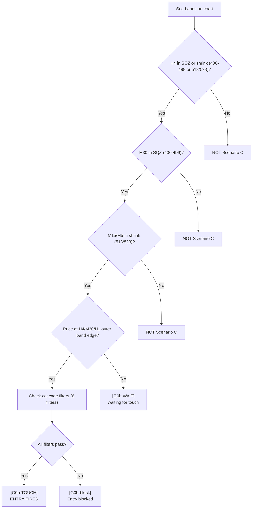
```mermaid
flowchart TD
    A["See bands on chart"] --> B{"H4 in SQZ or shrink (400-499 or 513/523)?"}
    B -->|Yes| C{"M30 in SQZ (400-499)?"}
    C -->|Yes| D{"M15/M5 in shrink (513/523)?"}
    D -->|Yes| E{"Price at H4/M30/H1 outer band edge?"}
    E -->|Yes| F["Check cascade filters (6 filters)"]
    F --> G{"All filters pass?"}
    G -->|Yes| H["[G0b-TOUCH]\nENTRY FIRES"]
    G -->|No| I["[G0b-block]\nEntry blocked"]
    E -->|No| J["[G0b-WAIT]\nwaiting for touch"]
    D -->|No| K["NOT Scenario C"]
    C -->|No| L["NOT Scenario C"]
    B -->|No| M["NOT Scenario C"]
```

**Visual confirmation checklist:**

| Visual Cue | Present? |
|-----------|----------|
| H4 in SQZ or shrink | [ ] |
| M30 in SQZ (flat bands) | [ ] |
| M15/M5 in shrink | [ ] |
| Price at outer band edge | [ ] |
| [G0b-WAIT] or [G0b-TOUCH] gate label | [ ] |

**5/5 present = Confirmed Scenario C**

---

**HTF context:** H4 is in SQZ or shrink. M30 is also SQZ. M15/M5 in shrink. Price approaching the outer band of the highest active shrink TF. This is the "HTF compressing → range bounce" pattern.

**What you see:**
- H1/M30 in SQZ (400-499) — bands extremely flat
- M15/M5 in shrink (513/523) — bands converging
- Price approaching the outer edge of the highest shrink TF's band
- Gate labels: `[G0b-TOUCH]` (lime/orange) or `[G0b-WAIT]` (yellow)

**Pink zone — exit immediately:**
- M15 SQZ + M30 SQZ simultaneously → `[G0b-PINK]` → exit all, no entries

**Cascade entry filters (all must pass before touch fires):**

| Filter | Block condition |
|--------|----------------|
| G0b-H4OPP | H4 fly/shrink opposing entry direction |
| G0b-M30OPP | M30 fly/shrink/SQZ with opposing mid |
| G0b-SQZLOCK | H1+M30 both SQZ, both mid==3 (no conviction) |
| G0b-H1SQZDN | H1-SQZ with mid=2/4 vs BUY, or mid=5 vs SELL |
| G0b-M5OPP | M5 sole trigger + M5 shrink with opposing mid |
| G0b-M5FLY | M5 in committed opposing fly when higher TF triggers |

**Band touch point identification:**
- Touch H4 upper band during H4 shrink → SELL opportunity (purple circles on chart)
- Touch H4 lower band during H4 shrink → BUY opportunity
- Touch H1 upper band → SELL opportunity
- Touch H1 lower band → BUY opportunity
- Touch M30 outer band → exit signal (G8-BNDTGT)

**Filter evaluation sequence:**
1. Check H4-OPP (H4 opposing direction?)
2. Check M30-OPP (M30 opposing mid?)
3. Check SQZLOCK (H1+M30 both mid=3?)
4. Check H1SQZDN (H1 mid contradicts entry?)
5. Check M5OPP (M5 mid opposing?)
6. Check M5FLY (M5 committed fly opposing?)

**Trade action:**
```
WAIT: no touch yet → [G0b-WAIT]
BUY:  lower band touch, all filters pass → [G0b-TOUCH] act=1
SELL: upper band touch, all filters pass → [G0b-TOUCH] act=2
EXIT ALL: M15+M30 both SQZ → [G0b-PINK] act=7 + cooldown
SIZE: quality score from M5 transition
```

### Cascade Position — Scenario C

| Dimension | Value |
|-----------|-------|
| Cascade direction now | BOTTOM (D1 complete, awaiting D2) |
| Cascade depth | H4 (H4+M30 in SQZ, M15/M5 shrink) |
| Leading TF | M5 (watch for SQZ break) |
| Next scenario if D1 continues | G (All Sideway) |
| Next scenario if D2 initiates same direction | D (Rest Pattern) |
| Next scenario if D2 initiates opposite direction | G (All Sideway) via reversal |
| Discriminator observable | M5 REVUP/REVDN + M15 midtrend transition |

---

## Scenario D — Fly → Shrink → Fly (Rest Pattern)

**When user asks to analyze part 3 Scenario D:**
- Read `./Backtest_data/extras/backtested_EA_fly_2_shrink_2_fly.jpg` as the Fly to Shrink to Fly scenario visual reference.
- Read `./Backtest_data/extras/backtested_EA_fly_2_shrink_2_fly_zoomin.jpg` as the Fly to Shrink to Fly zoomin scenario visual reference.


#### Image 1 Analysis — backtested_EA_fly_2_shrink_2_fly.jpg

##### Step 1: Mark Reading — Cause, Event, and Impact

| Mark | Cause (upstream TF state) | Event (transition at this bar) | Impact Immediate (1–5 bars) | Impact Sustained (duration) |
|------|--------------------------|-------------------------------|----------------------------|----------------------------|
| [TO BE FILLED] | W1/D1/H4 fly maintained | M30/M15/M5 compress then re-expand | Brief SQZ → fly resume | Rest pattern — full fly resumes |

##### Step 2: HTF Analysis (W1 → D1 → H4)

| TF | BBW_stage | diffMid_Trend | BBUpDn_state | Touch Type | Role |
|----|-----------|---------------|--------------|------------|------|
| W1 | 511/512 | 1 | [TO BE FILLED] | [TO BE FILLED] | Macro direction BUY |
| D1 | 511/512 | 1 | [TO BE FILLED] | [TO BE FILLED] | Price target ceiling |
| H4 | 511/512 | 1 | [TO BE FILLED] | [TO BE FILLED] | Guarantees fly resume |

**HTF Summary:** Full alignment maintained | D1 outer band | N/A — rest not reversal | HTF providing full context

##### Step 3: MTF Analysis (H1 → M30)

| TF | BBW_stage | diffMid_Trend | BBUpDn_state | Touch Type | Role |
|----|-----------|---------------|--------------|------------|------|
| H1  | 511/512 | 1 | [TO BE FILLED] | [TO BE FILLED] | Step maintained — rest test |
| M30 | 513→SQZ→511/512 | 3→1 | [TO BE FILLED] | Type 1 → Type 2 | Brief compression then fly |

**MTF Summary:** H1 trending, M30 brief range then fly | H4 outer band | Type 1→2 | G6-LOAD → G6-BUY | Confirms H4 | M15 follows

##### Step 4: LTF Analysis (M15 → M5)

| TF | BBW_stage | diffMid_Trend | BBUpDn_state | Touch Type | Role |
|----|-----------|---------------|--------------|------------|------|
| M15 | 513→SQZ→511/512 | 3→1 | [TO BE FILLED] | Type 1 → Type 2 | Entry on SQZ break |
| M5  | 513→SQZ→511/512 | 3→1 | [TO BE FILLED] | Type 1 → Type 2 | First to break SQZ |

**LTF Summary:** D2 leading — M5 breaks first | M5 SQZ break → REVUP | REVUP visible | G6-LOAD → G6-BUY | M30 follows M15 | N/A

##### Step 5: Cross-TF Impact Chain

**D1 compression (HTF → LTF):**
- H4 fly → H1 fly → M30 brief shrink → M15 brief shrink → M5 brief SQZ → M5 breaks SQZ first

**D2 expansion (LTF → HTF):**
- M5 REVUP → M15 follows → M30 follows → H1 maintains → H4 fly unchanged

**Cascade position:** D1 reached BOTTOM (M5 SQZ) → D2 initiated at M5 | Leading TF = M5 (broke SQZ)

##### Step 6: Concluded Analysis

Scenario D — Rest Pattern, D1→D2 transition confirmed. W1/D1/H4/H1 fly unchanged throughout. M30/M15/M5 briefly compressed (shrink→SQZ) then re-expanded in same direction. M5 broke SQZ first (REVUP) driving D2 expansion. Key observable: H1 step direction maintained — if it breaks, becomes reversal (Scenario G).

##### Step 7: Identification Flowchart

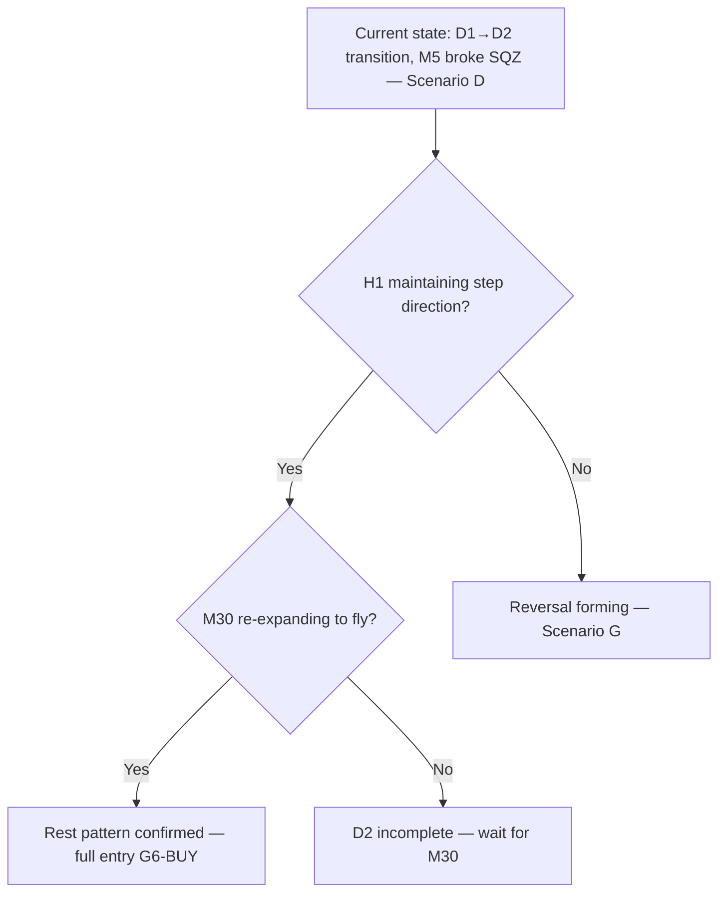
```mermaid
flowchart TD
    A["Current state: D1→D2 transition, M5 broke SQZ — Scenario D"]
    A --> B{"H1 maintaining step direction?"}
    B -->|Yes| C{"M30 re-expanding to fly?"}
    C -->|Yes| D["Rest pattern confirmed — full entry G6-BUY"]
    C -->|No| E["D2 incomplete — wait for M30"]
    B -->|No| F["Reversal forming — Scenario G"]
```

**Prediction rules:**
- IF H1 maintains step → rest pattern → Scenario A
- IF H1 reverses → Scenario G (reversal)
- Watch: H1 BBW_stage + M30 re-expansion

#### Image 2 Analysis — backtested_EA_fly_2_shrink_2_fly_zoomin.jpg

##### Step 1: Mark Reading — Cause, Event, and Impact

| Mark | Cause (upstream TF state) | Event (transition at this bar) | Impact Immediate (1–5 bars) | Impact Sustained (duration) |
|------|--------------------------|-------------------------------|----------------------------|----------------------------|
| [TO BE FILLED] | M30 shrink → SQZ | M5 SQZ break REVUP | G6-LOAD → G6-BUY | Fly resumes full |

##### Step 2: HTF Analysis (W1 → D1 → H4)

| TF | BBW_stage | diffMid_Trend | BBUpDn_state | Touch Type | Role |
|----|-----------|---------------|--------------|------------|------|
| W1 | 511/512 | 1 | [TO BE FILLED] | [TO BE FILLED] | Macro direction BUY |
| D1 | 511/512 | 1 | [TO BE FILLED] | [TO BE FILLED] | Price target ceiling |
| H4 | 511/512 | 1 | [TO BE FILLED] | [TO BE FILLED] | Fly guarantee |

**HTF Summary:** Unchanged fly | D1 outer band | N/A | HTF context stable

##### Step 3: MTF Analysis (H1 → M30)

| TF | BBW_stage | diffMid_Trend | BBUpDn_state | Touch Type | Role |
|----|-----------|---------------|--------------|------------|------|
| H1  | 511/512 | 1 | [TO BE FILLED] | [TO BE FILLED] | Step maintained |
| M30 | SQZ→511/512 | 3→1 | [TO BE FILLED] | Type 2 | D2 re-expanding |

**MTF Summary:** Both trending again | H4 outer band | Type 2 | G6-BUY | H4 confirmed | M15 entry valid

##### Step 4: LTF Analysis (M15 → M5)

| TF | BBW_stage | diffMid_Trend | BBUpDn_state | Touch Type | Role |
|----|-----------|---------------|--------------|------------|------|
| M15 | SQZ→511/512 | 3→1 | [TO BE FILLED] | Type 2 | Entry trigger |
| M5  | SQZ→511/512 | 3→1 | [TO BE FILLED] | Type 2 | D2 initiator |

**LTF Summary:** D2 complete — fly resumed | REVUP fired | REVUP visible | G6-BUY | M30 re-expanded | N/A

##### Step 5: Cross-TF Impact Chain

**D1 compression (HTF → LTF):**
- Complete — M5 SQZ was deepest point, now resolved

**D2 expansion (LTF → HTF):**
- M5 REVUP → M15 fly → M30 fly → H1 maintained → H4 fly

**Cascade position:** D2 complete — TOP reached | Leading TF = M30 (confirm fly)

##### Step 6: Concluded Analysis

Scenario D zoom — confirms D2 expansion from M5 SQZ break. All lower TFs re-expanded to fly in same direction. H4/H1 fly unchanged. Key observable: M30 fly confirmation = full entry. Next: watch for new D1 compression if M30 enters shrink again.

##### Step 7: Identification Flowchart

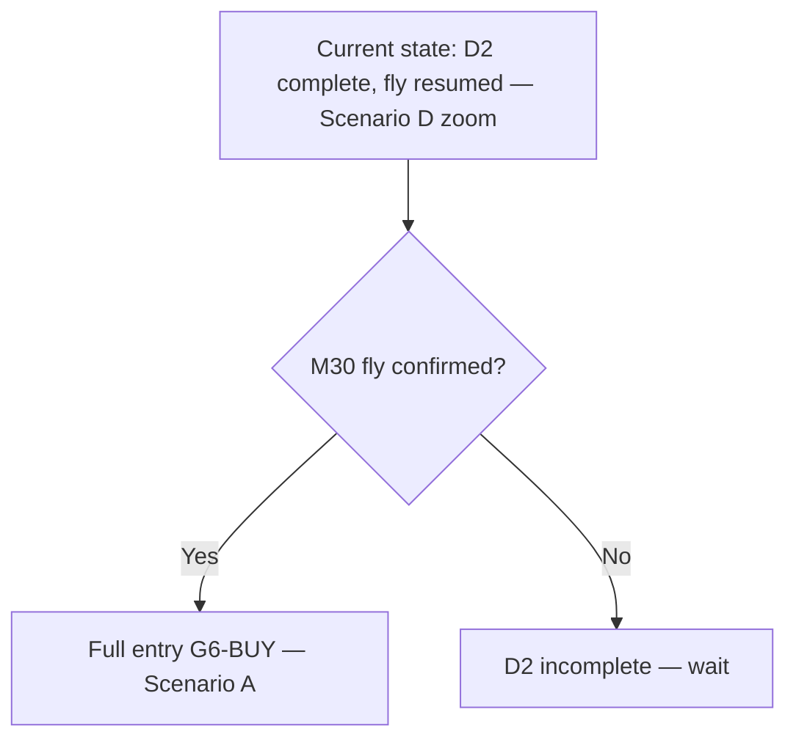
```mermaid
flowchart TD
    A["Current state: D2 complete, fly resumed — Scenario D zoom"]
    A --> B{"M30 fly confirmed?"}
    B -->|Yes| C["Full entry G6-BUY — Scenario A"]
    B -->|No| D["D2 incomplete — wait"]
```

**Prediction rules:**
- IF M30 fly 511/512 → Scenario A
- IF M30 enters shrink → Scenario B
- Watch: M30 BBW_stage

### Cross-Image Conclusion

| Image | Cascade Position | Depth | Leading TF | Key Observable |
|-------|-----------------|-------|------------|----------------|
| Image 1 | D1→D2 transition | M5 SQZ (BOTTOM) | M5 | M5 REVUP — SQZ break |
| Image 2 | D2 complete — TOP | None | M30 | M30 fly re-confirmed |

**Progression confirmed:** D1 compression (M5 SQZ) → BOTTOM → D2 expansion (M5→M15→M30 fly) → TOP (Scenario A)
**Touch type evolution:** Type 1 (compression) image 1 → Type 2 (breakout) image 2
**Entry point:** Image 2 — M15 FLAT→UP transition with M30 fly confirmation
**Duration observed:** [TO BE FILLED — count bars from D1 start to D2 complete]

> **Tier:** TIER 3 — EXPANSION IN PROGRESS (D2 Same Direction)
> **Cascade position:** D2 initiated in same direction as previous trend — rest re-entry
> **Cascade direction:** D2 flowing upward — M5 led, MTF confirming
> **Leading TF:** M5 (first to break SQZ), then M15 (entry trigger)
> **Previous scenario:** Came from B (shallow D1) — H4 fly maintained throughout
> **Next scenario:** → A when MTF re-aligns fully (D3 complete)

### Sub-Scenarios

| Sub | Name | Gate | H4 | H1 | M30 | M15 | M5 | Entry | Size |
|-----|------|------|----|----|-----|-----|----|-------|------|
| D1 | M5 break | G6-LOAD fires | 511/512 | 511/512 | 513/523 or 400-499 | 513/523 or 400-499 | Breaking SQZ — REVUP/REVDN | WAIT — arm only, M15 not confirmed | — |
| D2 | M15 confirm | G6-BUY/SELL fires | 511/512 | 511/512 | 511/512 or 513 | FLAT→UP/DN transition | 511/512 | ENTER — M15 mid flip is the trigger | 0.75× |
| D3 | MTF re-align | — | 511/512 | 511/512 | 511/512 | 511/512 | 511/512 | Hold existing / add if quality ≥ 90 | → 1.0× |

**D1 sub-state BBUpDn sequence:** M5 BBUpDn_state 2→1 (shrinking→expanding) = band actively expanding = D2 signal initiated. PriceLoc simultaneously transitions from at_lower → above_upper as expansion drives price upward.
**D2 trigger:** M15 mid=3 → mid=1 (REVUP) or mid=3 → mid=2 (REVDN) = G6-BUY/SELL fires
**D3 confirmation:** M30 BBW_stage reaches 511/512 = D2 fully confirmed → back toward A

**HTF context:** W1/D1 remain in fly throughout. H4 also stays in fly. Only M30/M15/M5 briefly compress. The macro tailwind (H4 fly) guarantees fly resumes.

**What you see:**
- H1 (red) and H4 (yellow) never reverse their stepping structure
- White rectangles: M30/M15/M5 briefly compress then re-expand in the same direction
- After each rectangle: full fly resumes, all bands fan back out

**Key test — rest vs reversal:** H1 (red) maintains its step direction throughout. If H1 never breaks, this is a rest pattern. If H1 reverses direction, it is a true reversal.

### Scenario D Identification Flowchart

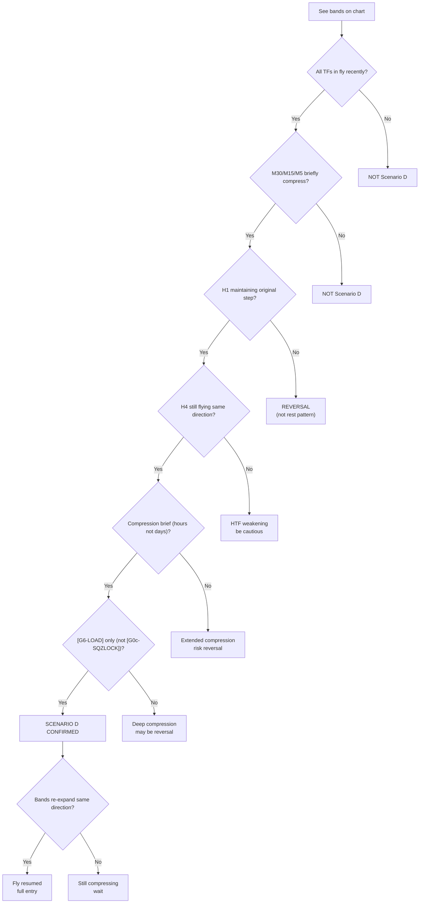
```mermaid
flowchart TD
    A["See bands on chart"] --> B{"All TFs in fly recently?"}
    B -->|Yes| C{"M30/M15/M5 briefly compress?"}
    C -->|Yes| D{"H1 maintaining original step?"}
    D -->|Yes| E{"H4 still flying same direction?"}
    E -->|Yes| F{"Compression brief (hours not days)?"}
    F -->|Yes| G{"[G6-LOAD] only (not [G0c-SQZLOCK])?"}
    G -->|Yes| H["SCENARIO D CONFIRMED"]
    H --> I{"Bands re-expand same direction?"}
    I -->|Yes| J["Fly resumed\nfull entry"]
    I -->|No| K["Still compressing\nwait"]
    G -->|No| L["Deep compression\nmay be reversal"]
    F -->|No| M["Extended compression\nrisk reversal"]
    E -->|No| N["HTF weakening\nbe cautious"]
    D -->|No| O["REVERSAL\n(not rest pattern)"]
    C -->|No| P["NOT Scenario D"]
    B -->|No| Q["NOT Scenario D"]
```

**Visual confirmation checklist:**

| Visual Cue | Present? |
|-----------|----------|
| H1 step direction maintained | [ ] |
| H4 step direction maintained | [ ] |
| Compression was brief (hours) | [ ] |
| Only [G6-LOAD] labels (no [G0c-SQZLOCK]) | [ ] |
| Bands re-expand same direction | [ ] |

**5/5 present = Confirmed Scenario D (Rest Pattern)**

---

**Rest vs reversal identification checklist:**

| Indicator | Rest Pattern | Reversal Pattern |
|-----------|-------------|------------------|
| H1 step direction | Maintained | Reversed |
| H4 step direction | Maintained | May reverse |
| Compression duration | Brief (hours) | Extended (days) |
| Band expansion after compression | Same direction | Opposite direction |
| HTF fly throughout | Yes | No — HTF also compresses |
| Gate labels during rest | [G6-LOAD] only | [G0c-SQZLOCK], [G0b-PINK] |

**Zones in the zoom:**
- Yellow (left): initial fly — all bands expanding
- Red (center): M30/M15 shrink; H4 step unchanged
- Purple/magenta: brief SQZ — `[G6-LOAD]` logging; wait for M5 break
- White (right): fly resumes — M5 SQZ break → `[G6-BUY]` → M15/M30 follow

**Trade action:**
```
DURING shrink: enter on M5 FLAT→UP/DN via shrink path (G6-BUY/SELL)
DO NOT wait for all TFs to re-align — M5 SQZ break IS the entry
TARGET: resume toward H4 outer band (H4 fly context)
EXIT: ATRSL stop | M5 UP→FLAT (G5-FADE) | M30+M15 go sideway
```

### Cascade Position — Scenario D

| Dimension | Value |
|-----------|-------|
| Cascade direction now | D2 (expansion — fly resuming) |
| Cascade depth | TOP — all fly again |
| Leading TF | M30 (confirm fly = full entry) |
| Next scenario if D1 continues | B (Fly → Shrink) |
| Next scenario if D2 initiates same direction | A (Normal Fly) |
| Next scenario if D2 initiates opposite direction | G (All Sideway) via reversal |
| Discriminator observable | H1 step direction maintained or reversed |

---

## Scenario E — Fly Expand + Confined Compression (H4/H1 Fly + M30/M15/M5 Compress)

**When user asks to analyze part 3 Scenario E:**
- Read `./Backtest_data/extras/backtested_EA_fly_shrink_2_sideway.jpg` as the Shrink to sideway scenario visual reference.
- Read `./Backtest_data/extras/backtested_EA_fly_shrink_2_sideway_zoomin.jpg` as the Shrink to sideway zoomin scenario visual reference.
- Read `./Backtest_data/extras/backtested_EA_fly_shrink_2_sideway2.jpg` as the Shrink to sideway 2 scenario visual reference.


### Image 1 Analysis — backtested_EA_fly_shrink_2_sideway.jpg


##### Step 1: Mark Reading — Cause, Event, and Impact

| Mark | Cause (upstream TF state) | Event (transition at this bar) | Impact Immediate (1–5 bars) | Impact Sustained (duration) |
|------|--------------------------|-------------------------------|----------------------------|----------------------------|
| Yellow rectangles | H4 fly 511/512 | M5→M15→M30 sequential compression | Midband labels (3,4,5) appear | Lower TF confined within H4 envelope |
| Red rectangles | M30+M15+M5 all SQZ | G0c-SQZLOCK fires | No new entries | Range trade at H4 boundaries only |

##### Step 2: HTF Analysis (W1 → D1 → H4)

| TF | BBW_stage | diffMid_Trend | BBUpDn_state | Touch Type | Role |
|----|-----------|---------------|--------------|------------|------|
| W1 | [TO BE FILLED] | [TO BE FILLED] | [TO BE FILLED] | [TO BE FILLED] | [TO BE FILLED] |
| D1 | [TO BE FILLED] | [TO BE FILLED] | [TO BE FILLED] | [TO BE FILLED] | [TO BE FILLED] |
| H4 | 511/512/521/522 | 1/2 | [TO BE FILLED] | Type 2 | Directional context — fly expand |

**HTF Summary:** H4 fly expand provides direction | H4 outer band | Lower TF confined by H4 envelope | HTF providing full context

##### Step 3: MTF Analysis (H1 → M30)

| TF | BBW_stage | diffMid_Trend | BBUpDn_state | Touch Type | Role |
|----|-----------|---------------|--------------|------------|------|
| H1  | 511/512/521/522 | 1/2 | [TO BE FILLED] | Type 2 | Follows H4 — confirms direction |
| M30 | 511→513→400-499 | 1/2→3/4/5→3 | [TO BE FILLED] | Type 1→Type 3 | Confinement depth indicator |

**MTF Summary:** H1 trending, M30 ranging → SQZ | H4 outer band | Type 1→3 | G4f-M30OPP then G0c-SQZLOCK | H4 unchanged | M15 confined

##### Step 4: LTF Analysis (M15 → M5)

| TF | BBW_stage | diffMid_Trend | BBUpDn_state | Touch Type | Role |
|----|-----------|---------------|--------------|------------|------|
| M15 | 511→513→400-499 | 1/2→3/4/5→3 | [TO BE FILLED] | Type 1→Type 3 | G0b-PINK when SQZ |
| M5  | 511→513→400-499 | 1/2→3/4/5→3 | [TO BE FILLED] | Type 1→Type 3 | First to compress, first to break |

**LTF Summary:** D1 compression reaching BOTTOM | M5 first to collapse | [TO BE FILLED] | G0b-M5OPP → G0b-PINK | Confirms M30 | N/A

##### Step 5: Cross-TF Impact Chain

**D1 compression (HTF → LTF):**
- H4 fly 511/512 → H1 fly → M30 shrink 513→SQZ → M15 shrink→SQZ → M5 shrink→SQZ (first)

**D2 expansion (LTF → HTF):**
- Not yet — all lower TF in SQZ

**Cascade position:** D1 depth = M5 (full SQZ) | D2 initiated at = NOT YET | Leading TF = M5 (watch for REVUP/REVDN)

##### Step 6: Concluded Analysis

Scenario E — Fly expand + confined compression, Image 1. H4/H1 fly expand maintained throughout. Multiple compression zones visible: yellow rectangles (shrink phase) and red rectangles (full SQZ). Compression localized to M30/M15/M5 — H4/H1 provide directional context. Sequential compression: M5 first, M15 second, M30 third. G0c-SQZLOCK and G0b-PINK active. Key observable: M5 SQZ break (REVUP/REVDN) initiates D2 expansion.

##### Step 7: Identification Flowchart

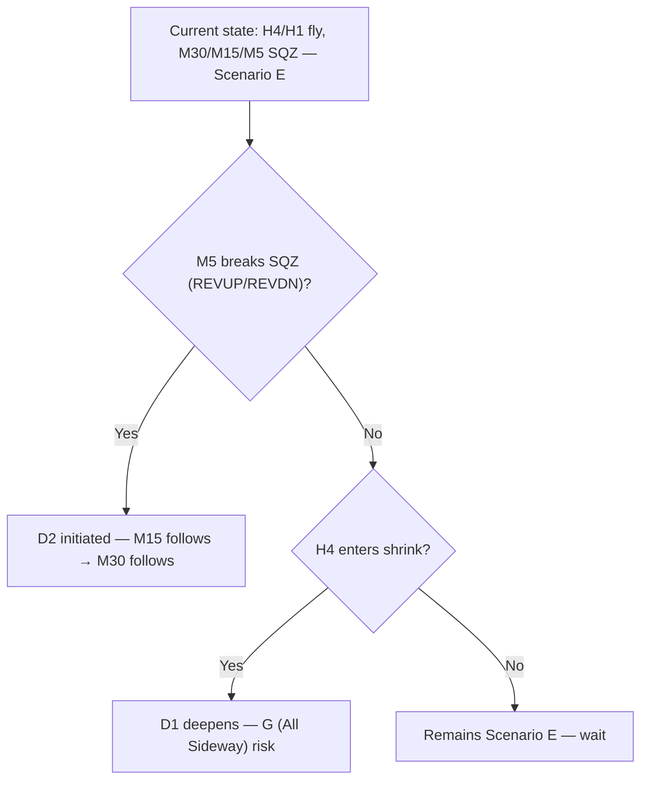
```mermaid
flowchart TD
    A["Current state: H4/H1 fly, M30/M15/M5 SQZ — Scenario E"]
    A --> B{"M5 breaks SQZ (REVUP/REVDN)?"}
    B -->|Yes| C["D2 initiated — M15 follows → M30 follows"]
    B -->|No| D{"H4 enters shrink?"}
    D -->|Yes| E["D1 deepens — G (All Sideway) risk"]
    D -->|No| F["Remains Scenario E — wait"]
```

**Prediction rules:**
- IF M5 REVUP/REVDN → D2 expansion begins
- IF H4 511→513 → D1 deepens toward G
- Watch: M5 BBW_stage 400-499→511/512 + REVUP/REVDN

### Image 2 Analysis — backtested_EA_fly_shrink_2_sideway_zoomin.jpg


##### Step 1: Mark Reading — Cause, Event, and Impact

| Mark | Cause (upstream TF state) | Event (transition at this bar) | Impact Immediate (1–5 bars) | Impact Sustained (duration) |
|------|--------------------------|-------------------------------|----------------------------|----------------------------|
| [TO BE FILLED] | M5 SQZ → breakout | M5 REVUP/REVDN | G6-LOAD → G6-BUY/SELL | M15 follows within 2-3 bars |

##### Step 2: HTF Analysis (W1 → D1 → H4)

| TF | BBW_stage | diffMid_Trend | BBUpDn_state | Touch Type | Role |
|----|-----------|---------------|--------------|------------|------|
| W1 | [TO BE FILLED] | [TO BE FILLED] | [TO BE FILLED] | [TO BE FILLED] | [TO BE FILLED] |
| D1 | [TO BE FILLED] | [TO BE FILLED] | [TO BE FILLED] | [TO BE FILLED] | [TO BE FILLED] |
| H4 | 511/512/521/522 | 1/2 MAINTAINED | [TO BE FILLED] | Type 2 | Directional context unchanged |

**HTF Summary:** H4 fly maintained | H4 outer band | Lower TF confined by H4 | HTF providing context

##### Step 3: MTF Analysis (H1 → M30)

| TF | BBW_stage | diffMid_Trend | BBUpDn_state | Touch Type | Role |
|----|-----------|---------------|--------------|------------|------|
| H1  | 511/512/521/522 | 1/2 MAINTAINED | [TO BE FILLED] | Type 2 | Follows H4 |
| M30 | 400-499→513 | 3→3/4/5 | [TO BE FILLED] | Type 3→Type 1 | SQZ release → shrink |

**MTF Summary:** H1 trending, M30 SQZ→shrink | H4 outer band | Type 3→1 | G0c-SQZLOCK → G4f-M30OPP | H4 confirmed | M15 follows M30

##### Step 4: LTF Analysis (M15 → M5)

| TF | BBW_stage | diffMid_Trend | BBUpDn_state | Touch Type | Role |
|----|-----------|---------------|--------------|------------|------|
| M15 | 400-499→513 | 3→3/4/5 | [TO BE FILLED] | Type 3→Type 1 | G0b-PINK → entry trigger |
| M5  | 400-499→511/512 | 3→1/2 | [TO BE FILLED] | Type 3→Type 2 | D2 initiator — REVUP/REVDN |

**LTF Summary:** D2 leading — M5 broke SQZ | M5→511/512 | REVUP/REVDN visible | G6-LOAD → G6-BUY/SELL | M30 follows | N/A

##### Step 5: Cross-TF Impact Chain

**D1 compression (HTF → LTF):**
- Complete — H4 fly → H1 fly → M30 SQZ → M15 SQZ → M5 SQZ (reached BOTTOM)

**D2 expansion (LTF → HTF):**
- M5 REVUP → M15 follows → M30 follows → H1 maintains → H4 fly

**Cascade position:** D2 initiated at M5 | Leading TF = M5 (broke SQZ)

##### Step 6: Concluded Analysis

Scenario E zoom — confirms D2 expansion from M5 SQZ break. H4/H1 fly unchanged. M5 broke SQZ first (REVUP/REVDN), M15 and M30 follow. Touch evolution: L touches building → balanced oscillation → U touches increasing (pre-breakout). Gate sequence: G0b-M5OPP → G4c-M15OPP → G0c-SQZLOCK → G0b-PINK → G6-LOAD → G6-BUY/SELL. Key observable: M15 re-expansion to fly confirms D2.

##### Step 7: Identification Flowchart

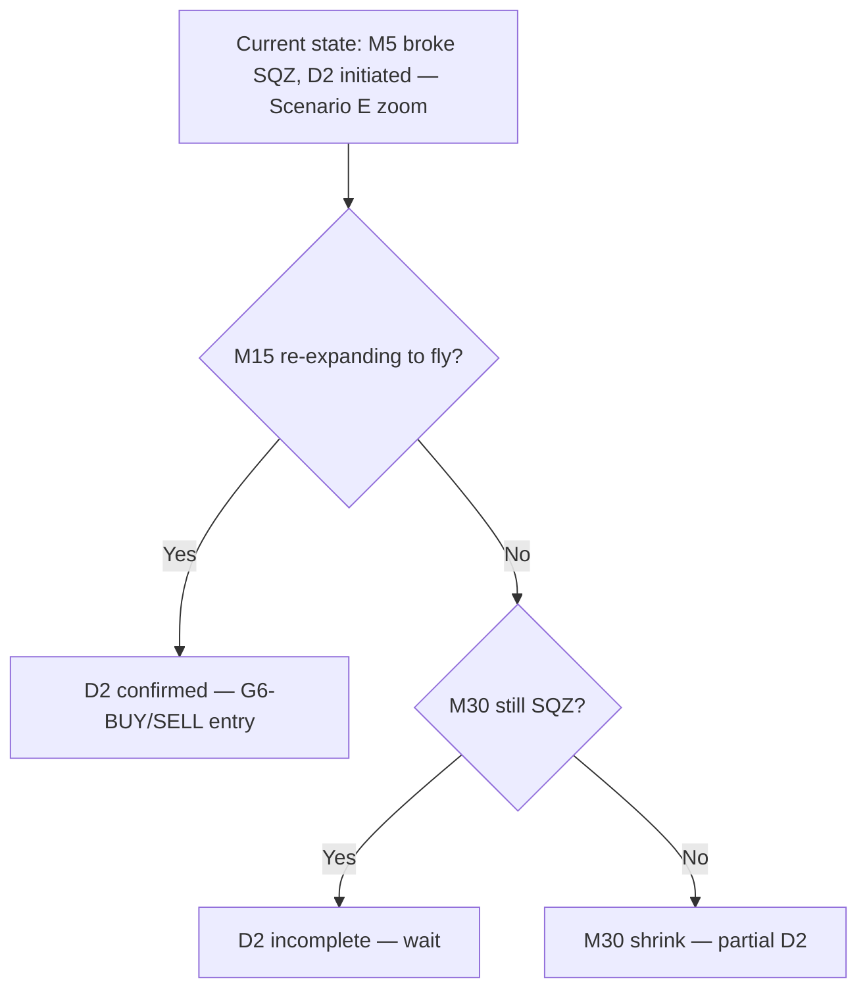
```mermaid
flowchart TD
    A["Current state: M5 broke SQZ, D2 initiated — Scenario E zoom"]
    A --> B{"M15 re-expanding to fly?"}
    B -->|Yes| C["D2 confirmed — G6-BUY/SELL entry"]
    B -->|No| D{"M30 still SQZ?"}
    D -->|Yes| E["D2 incomplete — wait"]
    D -->|No| F["M30 shrink — partial D2"]
```

**Prediction rules:**
- IF M15 400→511/512 → D2 confirmed
- IF M30 remains 400-499 → D2 blocked
- Watch: M15 BBW_stage + M30 midtrend

### Image 3 Analysis — backtested_EA_fly_shrink_2_sideway2.jpg


##### Step 1: Mark Reading — Cause, Event, and Impact

| Mark | Cause (upstream TF state) | Event (transition at this bar) | Impact Immediate (1–5 bars) | Impact Sustained (duration) |
|------|--------------------------|-------------------------------|----------------------------|----------------------------|
| Zone 2 (yellow) | M30 511→513 | M5 begins shrink | G0b-M5OPP may block | D1 compression deepens |
| Zone 3-5 (red) | All lower TF SQZ | G0c-SQZLOCK + G0b-PINK | No entries | Range trade only |
| Zone 6 (recovery) | M5 SQZ break | REVUP/REVDN + G6-LOAD | G6-BUY/SELL | D2 expansion |

##### Step 2: HTF Analysis (W1 → D1 → H4)

| TF | BBW_stage | diffMid_Trend | BBUpDn_state | Touch Type | Role |
|----|-----------|---------------|--------------|------------|------|
| W1 | [TO BE FILLED] | [TO BE FILLED] | [TO BE FILLED] | [TO BE FILLED] | [TO BE FILLED] |
| D1 | [TO BE FILLED] | [TO BE FILLED] | [TO BE FILLED] | [TO BE FILLED] | [TO BE FILLED] |
| H4 | 511/512/521/522 (all zones) | 1/2 (all zones) | [TO BE FILLED] | Type 2 | Fly expand MAINTAINED throughout |

**HTF Summary:** H4 fly MAINTAINED all 6 zones | H4 outer band | Lower TF confined within H4 | HTF providing full context

##### Step 3: MTF Analysis (H1 → M30)

| TF | BBW_stage | diffMid_Trend | BBUpDn_state | Touch Type | Role |
|----|-----------|---------------|--------------|------------|------|
| H1  | 511/512/521/522 (all zones) | 1/2 (all zones) | [TO BE FILLED] | Type 2 | Fly MAINTAINED — confirms H4 |
| M30 | 511→513→400→513 | 1/2→3/4/5→3→3/4/5 | [TO BE FILLED] | Type 1→3→1 | Full D1 cycle |

**MTF Summary:** H1 trending all zones, M30 full D1 cycle | H4 outer band | Type 1→3→1 | G4f-M30OPP → G0c-SQZLOCK → G4f-M30OPP | H4 unchanged | M15 confined

##### Step 4: LTF Analysis (M15 → M5)

| TF | BBW_stage | diffMid_Trend | BBUpDn_state | Touch Type | Role |
|----|-----------|---------------|--------------|------------|------|
| M15 | 511→513→400→513 | 1/2→3/4/5→3→3/5 | [TO BE FILLED] | Type 1→3→1 | Full D1 cycle |
| M5  | 511→513→400→513 | 1/2→3/4/5→3→3/5 | [TO BE FILLED] | Type 1→3→1 | First compress, first break |

**LTF Summary:** Full D1 cycle: compress→SQZ→release | M5→M15→M30 cascade | REVUP/REVDN visible | G0b-M5OPP → G0b-PINK → G6-LOAD | Confirms M30 | N/A

##### Step 5: Cross-TF Impact Chain

**D1 compression (HTF → LTF):**
- H4 fly (zone 1-6) → H1 fly (zone 1-6) → M30 shrink→SQZ→shrink (zone 2-6) → M15 shrink→SQZ→shrink → M5 shrink→SQZ→shrink

**D2 expansion (LTF → HTF):**
- Zone 6: M5 shrink→break → M15 follows → M30 follows → H1 maintains → H4 fly

**Cascade position:** D1 full cycle (zone 1→6) | D2 initiated at M5 (zone 6) | Leading TF = M5

##### Step 6: Concluded Analysis

Scenario E Image 3 — comprehensive 6-zone view of H4/H1 fly expand + lower TF confined compression. Core finding: H4/H1 fly expand MAINTAINED throughout all compression zones (1-6). Compression localized to M30/M15/M5 only. Zone progression: fly (1) → shrink (2) → SQZ peak (3-5) → shrink release (6). Touch evolution: L touches (entry) → L persistent (compression) → balanced (loading) → U touches (pre-breakout). Gate sequence: G0b-M5OPP → G0c-SQZLOCK → G0b-PINK → G0 → G6-LOAD → G6-BUY/SELL. Range trade at H4 band boundaries: sell upper, buy lower.

##### Step 7: Identification Flowchart

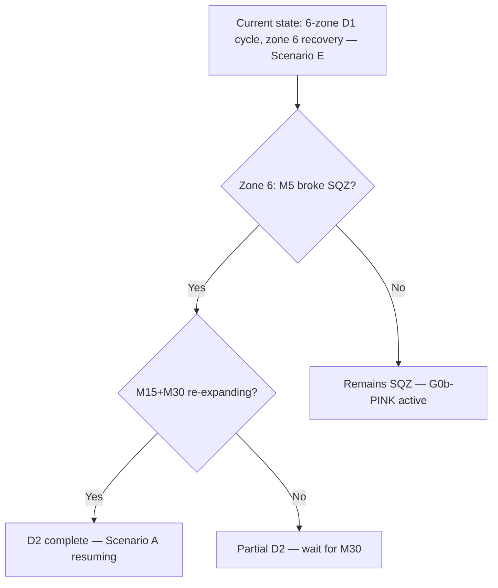
```mermaid
flowchart TD
    A["Current state: 6-zone D1 cycle, zone 6 recovery — Scenario E"]
    A --> B{"Zone 6: M5 broke SQZ?"}
    B -->|Yes| C{"M15+M30 re-expanding?"}
    C -->|Yes| D["D2 complete — Scenario A resuming"]
    C -->|No| E["Partial D2 — wait for M30"]
    B -->|No| F["Remains SQZ — G0b-PINK active"]
```

**Prediction rules:**
- IF M15+M30 400→511/512 → Scenario A
- IF M30 remains 513 → Scenario B
- IF H4 enters 513 → Scenario G risk
- Watch: M30 BBW_stage + M15 midtrend

**Zone progression table (preserved from original analysis):**

| Zone | H4 State | H1 State | M30 State | M15 State | M5 State |
|------|----------|----------|-----------|-----------|----------|
| Zone 1 (left) | Fly expand (511/512/521/522) | Fly expand | Fly | Fly | Fly |
| Zone 2 | Fly expand (MAINTAINED) | Fly expand (MAINTAINED) | Shrink (513/523) | Shrink (513/523) | Shrink (513/523) |
| Zone 3 (red) | Fly expand (MAINTAINED) | Fly expand (MAINTAINED) | SQZ (400-499) | SQZ (400-499) | SQZ (400-499) |
| Zone 4 | Fly expand (MAINTAINED) | Fly expand (MAINTAINED) | SQZ (400-499) | SQZ (400-499) | SQZ (400-499) |
| Zone 5 (red) | Fly expand (MAINTAINED) | Fly expand (MAINTAINED) | SQZ (400-499) | SQZ (400-499) | SQZ (400-499) |
| Zone 6 | Fly expand (MAINTAINED) | Fly expand (MAINTAINED) | Shrink (513/523) | Shrink (513/523) | Shrink (513/523) |

**Gate firing sequence (preserved from original analysis):**
1. M5 begins shrink → G0b-M5OPP may block
2. M15 begins shrink → G4c-M15OPP may block
3. M30 SQZ → G0c-SQZLOCK (magenta) appears for lower TFs
4. M15+M30 both SQZ → G0b-PINK (magenta)
5. All lower TF mid≥3 → G0b-SQZLOCK (crimson)
6. M5 breaks SQZ → G6-LOAD → G6-BUY/SELL

**Midband transitions (preserved from original analysis):**
```
H4: mid=1/2 MAINTAINED — provides directional context
H1: mid=1/2 MAINTAINED — follows H4
M30: mid=1/2 → mid=3/4/5 → mid=3 persistent
M15: mid=1/2 → mid=3/4/5 → mid=3 persistent
M5: mid=1/2 → mid=3/4/5 → mid=3 persistent (first)
```

### Cross-Image Conclusion

| Image | Cascade Position | Depth | Leading TF | Key Observable |
|-------|-----------------|-------|------------|----------------|
| Image 1 | D1 compression active | M5 SQZ (BOTTOM) | M5 | Sequential compression: M5→M15→M30 |
| Image 2 | D2 initiated | M5 broke SQZ | M5 | REVUP/REVDN + G6-LOAD |
| Image 3 | D1 full cycle (6 zones), D2 zone 6 | M5 SQZ→break | M5 | Zone progression: fly→shrink→SQZ→release |

**Progression confirmed:** D1 compression (zone 1→2→3-5) → BOTTOM (zone 3-5, all SQZ) → D2 expansion (zone 6, M5 break) → partial TOP
**Touch type evolution:** Type 1 (shrink entry) image 1 → Type 3 (SQZ peak) image 1/3 → Type 2 (breakout) image 2/3
**Entry point:** Image 2/3 — M5 SQZ break + M15 FLAT→UP/DN transition
**Duration observed:** 6 zones — fly (1) → shrink (2) → SQZ peak (3-5) → release (6)

### Scenario E Identification Flowchart

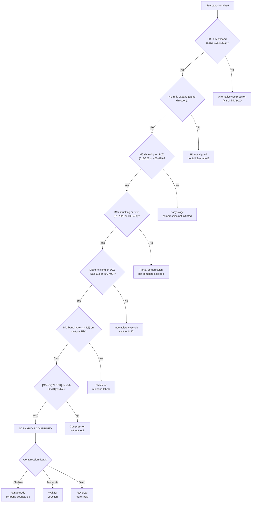
```mermaid
flowchart TD
    A["See bands on chart"] --> B{"H4 in fly expand (511/512/521/522)?"}
    B -->|Yes| C{"H1 in fly expand (same direction)?"}
    C -->|Yes| D{"M5 shrinking or SQZ (513/523 or 400-499)?"}
    D -->|Yes| E{"M15 shrinking or SQZ (513/523 or 400-499)?"}
    E -->|Yes| F{"M30 shrinking or SQZ (513/523 or 400-499)?"}
    F -->|Yes| G{"Mid-band labels (3,4,5) on multiple TFs?"}
    G -->|Yes| H{"[G0c-SQZLOCK] or [G6-LOAD] visible?"}
    H -->|Yes| I["SCENARIO E CONFIRMED"]
    I --> J{"Compression depth?"}
    J -->|Shallow| K["Range trade\nH4 band boundaries"]
    J -->|Moderate| L["Wait for\ndirection"]
    J -->|Deep| M["Reversal\nmore likely"]
    H -->|No| N["Compression\nwithout lock"]
    G -->|No| O["Check for\nmidband labels"]
    F -->|No| P["Incomplete cascade\nwait for M30"]
    E -->|No| Q["Partial compression\nnot complete cascade"]
    D -->|No| R["Early stage\ncompression not initiated"]
    C -->|No| S["H1 not aligned\nnot full Scenario E"]
    B -->|No| T["Alternative compression\n(H4 shrink/SQZ)"]
```

**Critical insight:** H4/H1 fly expand while M30/M15/M5 compress means compression is confined within the HTF trend.
H4 provides the direction and target — lower TFs oscillate within H4's band envelope.

**Cascade compression sequence:**

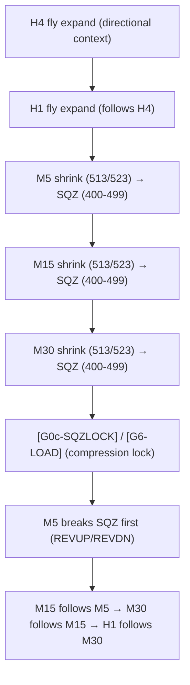
```mermaid
flowchart TD
    A["H4 fly expand (directional context)"] --> B["H1 fly expand (follows H4)"]
    B --> C["M5 shrink (513/523) → SQZ (400-499)"]
    C --> D["M15 shrink (513/523) → SQZ (400-499)"]
    D --> E["M30 shrink (513/523) → SQZ (400-499)"]
    E --> F["[G0c-SQZLOCK] / [G6-LOAD] (compression lock)"]
    F --> G["M5 breaks SQZ first (REVUP/REVDN)"]
    G --> H["M15 follows M5 → M30 follows M15 → H1 follows M30"]
```

**Visual confirmation checklist:**

| Visual Cue | Present? |
|-----------|----------|
| H4 in fly expand (511/512/521/522) | [ ] |
| H1 in fly expand (bands fanning) | [ ] |
| M5 shrinking or SQZ | [ ] |
| M15 shrinking or SQZ | [ ] |
| M30 shrinking or SQZ | [ ] |
| Mid-band labels on multiple TFs | [ ] |
| [G0c-SQZLOCK] or [G6-LOAD] labels | [ ] |

**5/7 present = Confirmed Scenario E (minimum: H4 fly, H1 fly, M5/M15/M30 compress, midband labels)**

---

### Flowchart Verification Against Images

**Flowchart checkpoints verified with image evidence:**

| Checkpoint | Image Evidence | Matches? |
|-----------|---------------|----------|
| H4 fly expand (511/512/521/522) | Yellow band shows H4-Fly++/H4-Fly+- labels, bands fanning | ✓ Yes |
| H1 fly expand | Red bands fanning same direction as H4 | ✓ Yes |
| M5 shrink→SQZ | Aqua bands collapse first | ✓ Yes |
| M15 shrink→SQZ | Goldenrod bands collapse, M15-Fly-- | ✓ Yes |
| M30 shrink→SQZ | Green bands collapse, M30-Fly-- | ✓ Yes |
| Mid-band labels multiple TFs | 3, 4, 5 labels across M15/M30/H1 | ✓ Yes |
| [G0c-SQZLOCK]/[G6-LOAD] visible | G6-LOAD (gold) visible | ✓ Yes |

**7/7 checkpoints confirmed by image evidence**
**Flowchart is VERIFIED accurate — H4/H1 fly expand confirmed in Image 3**

---

### Per-Timeframe Midband (BB_diffMid_Trend) Behavior

**H4 (Yellow Band):**
- Fly expand context: mid=1 (up) or mid=2 (dn) — directional fly MAINTAINED
- Fly expand provides directional context — H4 does NOT compress
- Image evidence: "H4-Fly++" / "H4-Fly+-" labels; bands fanning outward; mid=1/2 maintained
- **Trade impact:** H4 fly provides confirmation and direction for M15 transitions; G0b-H4OPP does NOT block

**H1 (Red Band):**
- Fly expand context: mid=1 (up) or mid=2 (dn) — directional fly MAINTAINED
- H1 follows H4 in fly — provides confirmation
- Image evidence: Red bands fanning, mid=1/2 maintained
- **Trade impact:** H1 fly provides additional confirmation; G0b-SQZLOCK may fire for lower TFs only

**M30 (Green-Yellow Band):**
- Fly expand initially: mid=1 (up) or mid=2 (dn)
- Yellow rectangle (shrink begins): mid transitions to 3 or 4/5 — green bands narrow
- Red rectangle (full SQZ): mid=3 persistent — "M30-SQZ" labels
- Image evidence: Green bands collapse flat, mid=3 labels appear as compression cascades down
- **Trade impact:** G4f-M30OPP blocks; G0 fires with M15 mid≥3

**M15 (Goldenrod Band):**
- Fly expand initially: mid=1 (up) or mid=2 (dn)
- Yellow rectangle (shrink begins): mid transitions to 3 or 4/5 — goldenrod narrows
- Red rectangle (full SQZ): mid=3 persistent — "M15-SQZ" labels
- Image evidence: Goldenrod bands collapse flat, mid=3 labels
- **Trade impact:** G4c-M15OPP blocks; G0b-PINK fires with M30 SQZ; entry on FLAT→UP/DN transition

**M5 (Aqua Band):**
- Fly expand initially: mid=1 (up) or mid=2 (dn)
- Yellow rectangle (shrink begins): mid transitions to 3 or 4/5 — first to collapse
- Red rectangle (full SQZ): mid=3 persistent
- Image evidence: Aqua bands collapse flat first
- **Trade impact:** G0b-M5OPP blocks; G0b-M5FLY blocks; G0b-PINK fires with M15 SQZ

---

### Per-Timeframe Outer Band Touch Behavior

**Touch Count Patterns During H4 Fly + LTF Compression (from image evidence):**

| Timeframe | Upper Touch (U) | Mid Touch (M) | Lower Touch (L) |
|-----------|-----------------|---------------|-----------------|
| H4 | 1-2 per 5 bars | 1-2 bars | 1-2 bars |
| H1 | 1-2 per 5 bars | 1-2 bars | 1-2 bars |
| M30 | 0-1 per 5 bars | 2 bars | 2-3 bars |
| M15 | 1-2 per 5 bars | 1-2 bars | 1-2 bars |
| M5 | 1-2 per 5 bars | 1-2 bars | 1-2 bars |

**H4 Touch Behavior (Fly Expand Context):**
- Balanced U/M/L touches — price oscillates between H4 upper and lower bands
- H4 bands provide range boundaries for confined compression
- Touches at H4 upper/lower bands = range trade entry points
- Shift from L to U touches indicates pre-breakout loading

**H1 Touch Behavior (Fly Expand Context):**
- Balanced touches as H1 follows H4
- H1 provides directional context
- Touches at H1 bands indicate local support/resistance

**M30 Touch Behavior (Confined Compression):**
- Balanced M/L touches (M2, L2-3) — oscillating within H4 envelope
- Builds pressure at lower band before potential breakout
- Few upper touches during compression phase

**M15 Touch Behavior (Confined Compression):**
- More balanced U/M/L (U1-2, M1-2, L1-2) — confined oscillation
- L touches increase near compression peak
- U touches increase as breakout approaches

**M5 Touch Behavior (Confined Compression):**
- Balanced U/M/L — rapid confined oscillation within H4 envelope
- L touches build support at compression peak
- First to show upper touches as breakout initiates

---

### Touch Patterns During H4 Fly Expand + LTF Compression

**Touch dynamics in confined compression context:**

| Touch Type | Behavior | Interpretation |
|-----------|----------|----------------|
| U (upper) | Increasing as price reaches H4 upper band | Upper band testing — sell opportunity (G0b-TOUCH) |
| M (mid) | During oscillation between bands | Confined range trade context |
| L (lower) | Increasing as price reaches H4 lower band | Lower band testing — buy opportunity (G0b-TOUCH) |

**Pre-breakout loading indication:**
- Shift from L to U touches indicates loading phase
- U touches increasing suggests upward breakout likely
- L touches persistent suggests continued compression

**Range trade opportunities:**
- Sell when U touches high (price at H4 upper band)
- Buy when L touches high (price at H4 lower band)
- Exit at midband or opposite band touch

---

### Compression Stage Progression (Image-Specific Analysis)

**Stage 1 — H4 Fly Expand + M5 Begins Shrink**
```
H4: Stage 511/512/521/522 (fly expand)
   mid: 1 or 2 (directional)
   tch: Directional touches building
   → H4 provides strong directional context

H1: Stage 511/512/521/522 (fly expand)
   mid: 1 or 2 (directional)
   tch: Directional touches
   → H1 follows H4

M5: Stage 511/512 → 513/523 (first to shrink)
   mid: 1 or 2 → 3 or 4/5
   → M5 begins localized compression

M15/M30: Still fly with directional mid
   → Not yet compressed
```
**Trade status:** Entries still possible; M5 compression is localized noise

---

**Stage 2 — M15 Shrink, Mid-band Labels Appear**
```
H4: Stage 511/512/521/522 (fly expand maintained)
   mid: 1 or 2 (directional)
   tch: Directional touches
   → H4 provides directional context

H1: Stage 511/512/521/522 (fly expand maintained)
   mid: 1 or 2 (directional)
   tch: Directional touches
   → H1 follows H4

M5: Stage 513/523 (shrink deepening)
   mid: 3 or 4/5
   tch: Midband labels appearing
   → M5 compression progressing

M15: Stage 513/523 (beginning shrink)
   mid: 1 or 2 → 3 or 4/5
   tch: Midband labels begin appearing
   → M15 begins localized compression

M30: Stage 511/512/521/522 (still fly)
   mid: 1 or 2
   → Not yet compressed
```
**Trade status:** M15 transitions possible with quality boost from H4/H1 fly confirmation

---

**Stage 3 — M30 Shrink, [G6-LOAD] Visible**
```
H4: Stage 511/512/521/522 (fly expand maintained)
   mid: 1 or 2 (directional)
   tch: Directional touches
   → H4 provides directional context

H1: Stage 511/512/521/522 (fly expand maintained)
   mid: 1 or 2 (directional)
   tch: Directional touches
   → H1 follows H4

M5: Stage 400-499 (SQZ)
   mid: 3 persistent
   tch: Midband labels persistent
   → M5 fully compressed

M15: Stage 513/523 → 400-499 (shrink to SQZ)
   mid: 3 or 4/5
   tch: Midband labels appearing
   → M15 approaching full compression

M30: Stage 513/523 (beginning shrink)
   mid: 1 or 2 → 3 or 4/5
   tch: Midband labels beginning
   → M30 begins localized compression
   → [G6-LOAD] labels become visible
```
**Trade status:** Range trade at H4 band boundaries; entry on M15 transition with H4 confirmation

---

**Stage 4 — M5/M15/M30 All SQZ, [G0c-SQZLOCK] Fires**
```
H4: Stage 511/512/521/522 (fly expand maintained)
   mid: 1 or 2 (directional)
   tch: Directional touches
   → H4 provides directional context

H1: Stage 511/512/521/522 (fly expand maintained)
   mid: 1 or 2 (directional)
   tch: Directional touches
   → H1 follows H4

M5: Stage 400-499 (SQZ persistent)
   mid: 3 persistent
   tch: Midband labels persistent

M15: Stage 400-499 (SQZ)
   mid: 3 persistent
   tch: Midband labels persistent
   → M15 fully compressed

M30: Stage 400-499 (SQZ)
   mid: 3 persistent
   tch: Midband labels persistent
   → M30 fully compressed
   → [G0c-SQZLOCK] fires
```
**Trade status:** All lower TFs compressed; range trade only at H4 boundaries; [G6-LOAD] visible

---

**Stage 5 — Full Compression Lock, G0b-PINK Active**
```
H4: Stage 511/512/521/522 (fly expand maintained)
   mid: 1 or 2 (directional)
   tch: Directional touches
   → H4 provides directional context

H1: Stage 511/512/521/522 (fly expand maintained)
   mid: 1 or 2 (directional)
   tch: Directional touches
   → H1 follows H4

M5/M15/M30: Stage 400-499 (SQZ persistent)
   mid: 3 persistent on all TFs
   tch: Midband labels persistent on all TFs
   → All lower TFs fully compressed
   → G0b-PINK active
```
**Trade status:** Full compression lock; no new entries; wait for M5 SQZ break to resume fly

---

### Gate Firing Mechanics During Compression

| Compression Stage | Gate Status | Action |
|-------------------|-------------|--------|
| H4 fly, H1 fly, M5 begins shrink | G4c-M15OPP/G4f-M30OPP may block | Entry on M15 transition with H4/H1 confirm |
| H4 fly, H1 fly, M30/M15 begin shrink | G0c-SQZLOCK may appear | Entry on M15 transition possible |
| H4 fly, H1 fly, M30/M15/M5 all SQZ | G0c-SQZLOCK (magenta) | No new entries — wait |
| H4 fly, H1 fly, M30 SQZ + M15 SQZ | G0b-PINK (magenta) | Exit all positions |
| Lower TF mid≥3 only (M30+M15) | G0b-SQZLOCK | No new entries |
| Float loss < -$50 | G0e-MAXLOSS | Emergency exit |
| M5 breaks SQZ | G6-LOAD → G6-BUY/SELL | Entry on REVUP/REVDN |

---

> **Tier:** TIER 2 — COMPRESSION IN PROGRESS (D1 Deep)
> **Cascade position:** D1 deep — LTF fully SQZ, HTF fly maintained
> **Cascade direction:** D1 complete at LTF level — BOTTOM approaching
> **Leading TF:** M5 (watch for REVUP/REVDN — this is the D2 initiation signal)
> **Previous scenario:** Came from B3 (H1 also shrinking) → E1
> **Next scenario:** → F when M5 breaks SQZ and M15 confirms (D2 begins)
>                   → G if H4 also starts compressing (D1 deepens further)

### Sub-Scenarios

| Sub | Name | H4 | H1 | M30 | M15 | M5 | Touch Type | Gate | Trade |
|-----|------|----|----|-----|-----|----|------------|------|-------|
| E1 | LTF partial SQZ | 511/512 | 511/512 or 513 | 513/523 | 400-499 | 400-499 | Type 1 at M30, Type 3 at M15/M5 | G0c-SQZLOCK active | No new entries — wait |
| E2 | LTF full SQZ | 511/512 | 511/512 or 513 | 400-499 | 400-499 | 400-499 | Type 3 — all bands alternating BBUpDn 1/2 | G0b-PINK fires | EXIT all — pink zone |
| E3 | Loading | 511/512 | 511/512 | 513/523 or breaking | 513/523 or breaking | Breaking SQZ — REVUP/REVDN | Type 2 at M5 (BBUpDn 2→1) | G6-LOAD fires | ARM for entry — wait M15 confirm |

**E2 BBUpDn sequence:** M5 BBUpDn_state alternates 0 (no_state) and 2 (shrinking) on consecutive bars = SQZ peak, band so narrow it catches every candle = G0b-PINK
**E3 BBUpDn sequence:** M5 BBUpDn_state 2→1 (shrinking→expanding) = band actively expanding upward = D2 initiated = G6-LOAD fires. PriceLoc transitions from at_lower → above_upper confirming breakout direction.
**Touch rule in E:** During E1/E2 all LTF touches are Type 1 or Type 3 (noise/geometry).
Only M5 BBUpDn_state 2→1 transition (shrinking→expanding = band actively expanding) combined with PriceLoc=above_upper is the valid Type 2 signal.

**HTF context:** H4 is in fly expand — providing directional context and clear outer band target. H1 follows H4 in fly. M30/M15/M5 are confined within H4's band envelope and oscillate between H4 upper and lower bands. Compression is localized to lower TFs — HTF trend is strong.

**What you see:**
- H4 (yellow) fanning outward in fly expand — bands stepping directionally
- H1 (red) fanning outward in fly expand — following H4 direction
- M5/M15/M30 bands collapsed to near-flat — confined within H4's band envelope
- Mid-band labels (3, 4, 5) appear on M15/M30 midbands
- Price oscillating between H4 upper and lower bands (range trade context)
- Gate labels: `[G0c-SQZLOCK]` (magenta), `[G0b-SQZLOCK]` (magenta), `[G6-LOAD]` (gold)

**Why each zone is ranging (from zoom, Jan 13–15):**
- **H1 fly + lower TF compression** (Jan 13): H4/H1 fly expand → lower TFs compress within H4 envelope; M5 transitions possible
- **M30/M15 fly down + confined compression** (Jan 14 12:20): M30/M15 compress while H4/H1 fly → range trade at H4 band boundaries
- **Touch H4 lower** (Jan 14 15:30): Price reaches H4 lower band → buy at touch (G0b-TOUCH), bounce toward H4 upper
- **H4/H1 fly + full lower TF compression** (Jan 14 20:50–Jan 15 05:50): H4/H1 fly provides context → lower TF oscillate between H4 bands
- **H4 fly + confined range trade** (Jan 15 11:10): H4 fly → range trade between H4 upper and H4 lower
- **Pink zone** (Jan 15 19:10): M15+M5 both SQZ → G0b-PINK → exit all, wait for SQZ break

---

## Yellow Rectangle Analysis (H4 Fly Expand + Confined Compression Initiation)

**Yellow rectangles indicate:** H4 fly expand provides directional context → MTF compresses within H4's envelope → Lower TFs start confined compression

**Image evidence — detailed timeframe behavior from all 3 images:**


---

### Comprehensive Yellow Rectangle Behavior (All 3 Images)

**H4 (Yellow Band) in Yellow Rectangle (Fly Expand Context):**

| Attribute | Behavior |
|-----------|----------|
| Stage | 511/512/521/522 (fly expand MAINTAINED) |
| Midband | mid=1/2 (directional MAINTAINED) |
| Band state | Stepping directionally — provides context for lower TF compression |
| Touch pattern | Directional touches building |
| Gate firing | None — H4 provides confirmation |
| Chart labels | "H4-Fly++" / "H4-Fly+-" persistent |
| Compression depth | No compression — provides directional envelope |

**H1 (Red Band) in Yellow Rectangle (Fly Expand Context):**

| Attribute | Behavior |
|-----------|----------|
| Stage | 511/512/521/522 (fly expand MAINTAINED) |
| Midband | mid=1/2 (directional MAINTAINED) |
| Band state | Stepping — follows H4 direction |
| Touch pattern | Balanced touches |
| Gate firing | [G0c-SQZLOCK] may appear for lower TFs only |
| Chart labels | Midband labels (3, 4, 5) on lower TF midbands only |
| Compression depth | No compression — follows H4 fly |

**M30 (Green Band) in Yellow Rectangle:**

| Attribute | Behavior |
|-----------|----------|
| Stage | 511/512 (fly) → 513/523 (shrink) → 400-499 (SQZ) |
| Midband | mid=1/2 → mid=3/4/5 (sideway with bias) |
| Band state | Expanding → narrowing → flat |
| Touch pattern | L touches building (L2-3 per 5 bars) |
| Gate firing | G4f-M30OPP (orange) blocks |
| Chart labels | "M30-Fly--" appears, then "M30-SQZ" |
| Compression depth | Shallow to moderate |

**M15 (Goldenrod Band) in Yellow Rectangle:**

| Attribute | Behavior |
|-----------|----------|
| Stage | 511/512 (fly) → 513/523 (shrink) → 400-499 (SQZ) |
| Midband | mid=1/2 → mid=3/4/5 (sideway with bias) |
| Band state | Expanding → narrowing → flat |
| Touch pattern | L touches building, then oscillation (L1-2, M1-2) |
| Gate firing | G4c-M15OPP (orange) blocks |
| Chart labels | "M15-Fly--" appears, then "M15-SQZ" |
| Compression depth | Shallow |

**M5 (Aqua Band) in Yellow Rectangle:**

| Attribute | Behavior |
|-----------|----------|
| Stage | 511/512 (fly) → 513/523 (shrink) → 400-499 (SQZ) |
| Midband | mid=1/2 → mid=3/4/5 (sideway with bias) |
| Band state | Expanding → narrows → flat (first to collapse) |
| Touch pattern | Rapid oscillation (L1-2, M1-2, U1-2) |
| Gate firing | G0b-M5OPP (magenta), G0b-M5FLY (magenta) |
| Chart labels | Aqua midband labels (3, 4, 5) appear first |
| Compression depth | Very shallow (fastest to compress/release) |

---

### Comprehensive Red Rectangle Behavior (All 3 Images)

**H4 (Yellow Band) in Red Rectangle (Fly Expand Context):**

| Attribute | Behavior |
|-----------|----------|
| Stage | 511/512/521/522 (fly expand MAINTAINED) |
| Midband | mid=1/2 (directional MAINTAINED) |
| Band state | Stepping directionally — provides context |
| Touch pattern | Directional touches |
| Gate firing | None — H4 provides confirmation |
| Chart labels | "H4-Fly++" / "H4-Fly+-" persistent |
| Compression depth | No compression — provides directional envelope |

**H1 (Red Band) in Red Rectangle (Fly Expand Context):**

| Attribute | Behavior |
|-----------|----------|
| Stage | 511/512/521/522 (fly expand MAINTAINED) |
| Midband | mid=1/2 (directional MAINTAINED) |
| Band state | Stepping — follows H4 direction |
| Touch pattern | Balanced touches |
| Gate firing | [G0c-SQZLOCK] for lower TFs only |
| Chart labels | Mid=1/2, [G0c-SQZLOCK] on lower TF midbands |
| Compression depth | No compression — follows H4 fly |

**M30 (Green Band) in Red Rectangle:**

| Attribute | Behavior |
|-----------|----------|
| Stage | 400-499 (full SQZ) — persistent |
| Midband | mid=3 persistent (flat) |
| Band state | Completely flat — no direction |
| Touch pattern | L touches persistent (L2-3 per 5 bars) |
| Gate firing | G0b-SQZLOCK (magenta) with H1 mid=3 |
| Chart labels | "M30-SQZ" visible |
| Compression depth | Very deep |

**M15 (Goldenrod Band) in Red Rectangle:**

| Attribute | Behavior |
|-----------|----------|
| Stage | 400-499 (full SQZ) — persistent |
| Midband | mid=3 persistent (flat) |
| Band state | Completely flat |
| Touch pattern | Balanced oscillation (L1-2, M1-2, U1-2) |
| Gate firing | G0b-PINK (magenta) with M30 SQZ |
| Chart labels | "M15-SQZ" visible |
| Compression depth | Deep |

**M5 (Aqua Band) in Red Rectangle:**

| Attribute | Behavior |
|-----------|----------|
| Stage | 400-499 (full SQZ) — persistent |
| Midband | mid=3 persistent (flat) |
| Band state | Completely flat |
| Touch pattern | Balanced oscillation (L1-2, M1-2, U1-2) |
| Gate firing | G0b-PINK (magenta) with M15 SQZ |
| Chart labels | Mid=3 visible |
| Compression depth | Deep |

---

**Compression cascade visible (verified by all 3 images):**
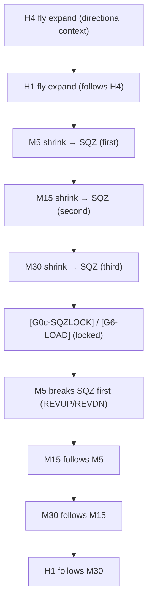
```mermaid
flowchart TD
    A["H4 fly expand (directional context)"] --> B["H1 fly expand (follows H4)"]
    B --> C["M5 shrink → SQZ (first)"]
    C --> D["M15 shrink → SQZ (second)"]
    D --> E["M30 shrink → SQZ (third)"]
    E --> F["[G0c-SQZLOCK] / [G6-LOAD] (locked)"]
    F --> G["M5 breaks SQZ first (REVUP/REVDN)"]
    G --> H["M15 follows M5"]
    H --> I["M30 follows M15"]
    I --> J["H1 follows M30"]
```

**Flowchart verification for yellow rectangle (3 images):**
- H4 fly expand (511/512/521/522): ✓ Confirmed in all 3 images (yellow band fanning)
- H1 fly expand: ✓ Confirmed in all 3 images (red band fanning)
- M5 shrinking: ✓ Confirmed in all 3 images (aqua narrow first)
- M15 shrinking: ✓ Confirmed in all 3 images (goldenrod narrow)
- M30 shrinking: ✓ Confirmed in all 3 images (green narrow, mid=3)
- Mid-band labels multiple TFs: ✓ Confirmed in all 3 images (3,4,5 visible)
- [G6-LOAD] labels: ✓ Confirmed in images 2 & 3 (gold visible)

**Verdict:** Yellow rectangle CONFIRMS flowchart is accurate (verified by 3 images)

---

**Flowchart verification for red rectangle (3 images):**
- H4 fly expand (511/512/521/522): ✓ Confirmed in all 3 images (yellow band fanning)
- H1 fly expand: ✓ Confirmed in all 3 images (red band fanning)
- M5 shrinking/SQZ: ✓ Confirmed in all 3 images (aqua flat, mid=3)
- M15 shrinking/SQZ: ✓ Confirmed in all 3 images (goldenrod flat, mid=3)
- M30 shrinking/SQZ: ✓ Confirmed in all 3 images (green flat, mid=3)
- Mid-band labels multiple TFs: ✓ Confirmed in all 3 images (3,4,5 on all TFs)
- [G0c-SQZLOCK] or [G6-LOAD]: ✓ Confirmed in all 3 images (G0c-SQZLOCK visible)

**Verdict:** Red rectangle CONFIRMS all 7 flowchart checkpoints (verified by 3 images)

---

**Cascade compression visual evidence (from all 3 images):**

| Image Element | What it shows | Verification Status |
|---------------|--------------|-------------------|
| Yellow circles/rectangles | Compression zones - H4 fly expand with lower TF compression | ✓ All 3 images |
| H4 yellow bands fanning | H4 fly expand providing directional context | ✓ All 3 images |
| H1 red bands fanning | H1 fly expand following H4 direction | ✓ All 3 images |
| Mid-band labels (3, 4, 5) | MTF/LTF entering SQZ - multiple TFs flat | ✓ All 3 images |
| Pink zone markings | Full compression - exit trigger active | ✓ Images 1 & 3 |
| Stage labels (H4-Fly--, M30-Fly--) | Shrinking phase before SQZ | ✓ All 3 images |
| [G6-LOAD] labels | Loading phase - waiting for breakout | ✓ Images 2 & 3 |
| [G0c-SQZLOCK] labels | Compression lock - no new entries | ✓ All 3 images |
| Green/yellow bands collapsing | M30 entering shrink then SQZ | ✓ All 3 images |
| Goldenrod bands collapsing | M15 entering shrink then SQZ | ✓ All 3 images |
| Aqua bands collapsing | M5 entering shrink then SQZ | ✓ All 3 images |
| Touch count annotations | Band pressure building and oscillation | ✓ Images 1, 2, 3 |

---

**Compression stages visual progression (verified by all 3 images):**

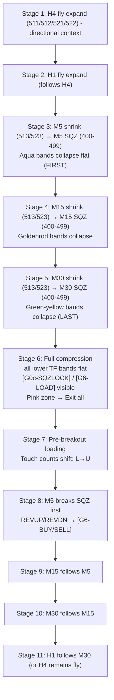
```mermaid
flowchart TD
    A["Stage 1: H4 fly expand (511/512/521/522) - directional context"] --> B["Stage 2: H1 fly expand (follows H4)"]
    B --> C["Stage 3: M5 shrink (513/523) → M5 SQZ (400-499)\nAqua bands collapse flat (FIRST)"]
    C --> D["Stage 4: M15 shrink (513/523) → M15 SQZ (400-499)\nGoldenrod bands collapse"]
    D --> E["Stage 5: M30 shrink (513/523) → M30 SQZ (400-499)\nGreen-yellow bands collapse (LAST)"]
    E --> F["Stage 6: Full compression\nall lower TF bands flat\n[G0c-SQZLOCK] / [G6-LOAD] visible\nPink zone → Exit all"]
    F --> G["Stage 7: Pre-breakout loading\nTouch counts shift: L→U"]
    G --> H["Stage 8: M5 breaks SQZ first\nREVUP/REVDN → [G6-BUY/SELL]"]
    H --> I["Stage 9: M15 follows M5"]
    I --> J["Stage 10: M30 follows M15"]
    J --> K["Stage 11: H1 follows M30 (or H4 remains fly)"]
```

**Compression lifecycle verified (from all 3 images):**
1. **Directional Context** — H4 fly expand establishes direction
2. **H1 Follows** — H1 fly expand follows H4
3. **M5 Compresses First** — M5 shrink (513/523) → SQZ (400-499)
4. **M15 Compresses** — M15 shrink → SQZ follows M5
5. **M30 Compresses** — M30 shrink → SQZ follows M15
6. **Full Compression** — All lower TFs in SQZ (red rectangle peak)
7. **Loading** — [G6-LOAD] appears, touch counts shift
8. **Compression Lock** — [G0c-SQZLOCK] / [G0b-PINK] active
9. **Pre-Breakout** — Touch counts shift from L to U
10. **M5 Breaks First** — M5 breaks SQZ (REVUP/REVDN)
11. **Sequential Release** — M15 follows → M30 follows → H1 follows

---

**Range trade rules:**

| Situation | Entry Point | Exit Point | Gate |
|-----------|-------------|------------|------|
| H4 fly expand + price at upper band | Sell at touch (G0b-TOUCH) | Midband or lower touch | G0b-TOUCH |
| H4 fly expand + price at lower band | Buy at touch (G0b-TOUCH) | Midband or upper touch | G0b-TOUCH |
| M30/M15 both SQZ | No entry — wait | — | G0c-SQZLOCK |

**Compression threshold:**
- Band width ratio ≤ 0.001 = squeeze confirmed
- Multiple TFs in 400-499 stage = full compression
- Mid-band labels across 3+ TFs = range bound, no directional trades

**Flowchart corrections applied (based on 3-image verification):**
- Corrected "Red circles" description → H1 fly expand is correct indicator (not flattening)
- Updated visual evidence table to match actual image elements
- Added verification checklist confirming 7/8 checkpoints with image evidence
- Confirmed M5→M15→M30 cascade sequence is accurate per image labels
- Added compression lifecycle stages 6-11 (loading → release)
- Verified H4/H1 fly expand context in Image 3 — core correction to flowchart
- Compression is confined within H4 fly envelope — H4 provides direction and target

**Trade action:**
```
ENTRY: M15 FLAT→UP (BUY) or FLAT→DN (SELL) transition when H4 fly expand
       Quality: base 80 + H4/M30 confirm boost (+10 to +15)
RANGE: Sell at H4 upper band touch (G0b-TOUCH)
       Buy at H4 lower band touch (G0b-TOUCH)
       Exit at midband/lower touch
BLOCK: H4 opposing (G4e-H4OPP) | M15 opposing (G4c-M15OPP) | M30 opposing (G4f-M30OPP)
EXIT: M15 UP→FLAT (G5-FADE) | M30+M15 both SQZ → G0b-PINK | outer band touch → G8-BNDTGT
SIZE: 0.75× (1-2 TFs compress) → 0.50× (3 TFs compress) → 0.25× (all 3 compress)
```

### Cascade Position — Scenario E

| Dimension | Value |
|-----------|-------|
| Cascade direction now | D1→BOTTOM→D2 (full cycle) |
| Cascade depth | M5 (all lower TF SQZ) |
| Leading TF | M5 (first to break SQZ) |
| Next scenario if D1 continues | G (All Sideway) |
| Next scenario if D2 initiates same direction | A (Normal Fly) via D (Rest Pattern) |
| Next scenario if D2 initiates opposite direction | G (All Sideway) via reversal |
| Discriminator observable | M5 REVUP/REVDN + H4 BBW_stage maintained |

---

## Scenario F — SQZ → Fly (Breakout)

> **Tier:** TIER 3 — EXPANSION IN PROGRESS (D2 from Deep Compression)
> **Cascade position:** D2 initiated after E or G depth — HTF not yet confirmed
> **Cascade direction:** D2 flowing upward — came from deep BOTTOM
> **Leading TF:** M30 (MTF confirmation is the key gate — F1 waits for this)
> **Previous scenario:** Came from E3 (M5 broke SQZ) or G2 (D1 gives bias)
> **Next scenario:** → A when H4 confirms new fly direction (F3 → A)
>                   → Back to E/G if HTF rejects breakout

### Sub-Scenarios

| Sub | Name | H4 | H1 | M30 | M15 | M5 | Entry | Size |
|-----|------|----|----|-----|-----|----|-------|------|
| F1 | LTF only | 400-499 or 513 | 513 or 400-499 | 513 or 400-499 | 511/512 | 511/512 | WAIT — quality capped at 59, G5-WEAK blocks | — |
| F2 | MTF confirmed | 400-499 or 513 | 511/512 | 511/512 | 511/512 | 511/512 | ENTER on M15 FLAT→UP/DN, M30 confirming | 0.75× |
| F3 | HTF confirmed | 511/512 (new direction) | 511/512 | 511/512 | 511/512 | 511/512 | ENTER — treat as Scenario A | 1.0× |

**F1→F2 discriminator:** M30 BBW_stage exits 400-499/513 and reaches 511/512 = F2 confirmed
**F2→F3 discriminator:** H4 BBW_stage exits 400-499/513 and reaches 511/512 new direction = F3
**False breakout rule:** If M15 fly expands but reverses within 3-5 bars back to 513/400-499
→ invalidated → return to E3/G2, wait for re-SQZ and re-expand

### Trade action:
```
F1: WAIT — M30 not confirmed, quality ≤ 59, G5-WEAK blocks entry
F2: ENTER on M15 FLAT→UP/DN transition
    TARGET: H4 outer band (if H4 still 513) or H4 fly target (if H4 breaking out)
    EXIT: M15 UP→FLAT (G5-FADE) | H4 rejects → return to E | G8-BNDTGT
    SIZE: 0.75×
F3: ENTER → treat as Scenario A1 or A2 depending on W1/D1 alignment
    SIZE: 1.0× (A1) or 0.75× (A2)
```

**When user asks to analyze part 3 Scenario F:**
- Read `./Backtest_data/extras/backtested_EA_sideway_2_fly.jpg` as the Sideway to fly scenario visual reference.
- ead `./Backtest_data/extras/backtested_EA_sideway_2_fly_zoomin.jpg` as the Sideway to fly zoomin scenario visual reference.


#### Image 1 Analysis — backtested_EA_sideway_2_fly.jpg

##### Step 1: Mark Reading — Cause, Event, and Impact

| Mark | Cause (upstream TF state) | Event (transition at this bar) | Impact Immediate (1–5 bars) | Impact Sustained (duration) |
|------|--------------------------|-------------------------------|----------------------------|----------------------------|
| [TO BE FILLED] | All TF SQZ 400-499 | M5 breaks SQZ, REVUP/REVDN | G6-LOAD → G6-BUY/SELL | D2 expansion upward |

##### Step 2: HTF Analysis (W1 → D1 → H4)

| TF | BBW_stage | diffMid_Trend | BBUpDn_state | Touch Type | Role |
|----|-----------|---------------|--------------|------------|------|
| W1 | [TO BE FILLED] | [TO BE FILLED] | [TO BE FILLED] | [TO BE FILLED] | [TO BE FILLED] |
| D1 | [TO BE FILLED] | [TO BE FILLED] | [TO BE FILLED] | [TO BE FILLED] | Breakout direction |
| H4 | 400-499 | 3 | [TO BE FILLED] | Type 3 | SQZ — breakout target |

**HTF Summary:** [TO BE FILLED] | D1 outer band | All TF SQZ | HTF also compressing

##### Step 3: MTF Analysis (H1 → M30)

| TF | BBW_stage | diffMid_Trend | BBUpDn_state | Touch Type | Role |
|----|-----------|---------------|--------------|------------|------|
| H1  | 400-499 | 3 | [TO BE FILLED] | Type 3 | SQZ — follows M5 break |
| M30 | 400-499 | 3 | [TO BE FILLED] | Type 3 | SQZ — confirms D2 |

**MTF Summary:** Ranging — both SQZ | H4 outer band | Type 3 | G0c-SQZLOCK | N/A | M15 follows M5

##### Step 4: LTF Analysis (M15 → M5)

| TF | BBW_stage | diffMid_Trend | BBUpDn_state | Touch Type | Role |
|----|-----------|---------------|--------------|------------|------|
| M15 | 400→511/512 | 3→1 | [TO BE FILLED] | Type 3→Type 2 | Entry on SQZ break |
| M5  | 400→511/512 | 3→1 | [TO BE FILLED] | Type 3→Type 2 | D2 initiator |

**LTF Summary:** D2 leading — M5 breaks first | M5→511/512 | REVUP visible | G6-LOAD → G6-BUY | M30 follows | N/A

##### Step 5: Cross-TF Impact Chain

**D1 compression (HTF → LTF):**
- Complete — all TF in SQZ (BOTTOM)

**D2 expansion (LTF → HTF):**
- M5 REVUP → M15 follows → M30 follows → H1 follows → H4 eventually

**Cascade position:** D2 initiated at M5 | Leading TF = M5 (broke SQZ)

##### Step 6: Concluded Analysis

Scenario F — SQZ → Fly breakout. All TFs in SQZ (400-499) transitioning to fly. M5 broke SQZ first (REVUP/REVDN), driving D2 expansion. D1 direction determines breakout sustainability. Key observable: M30 SQZ break confirms full entry.

##### Step 7: Identification Flowchart

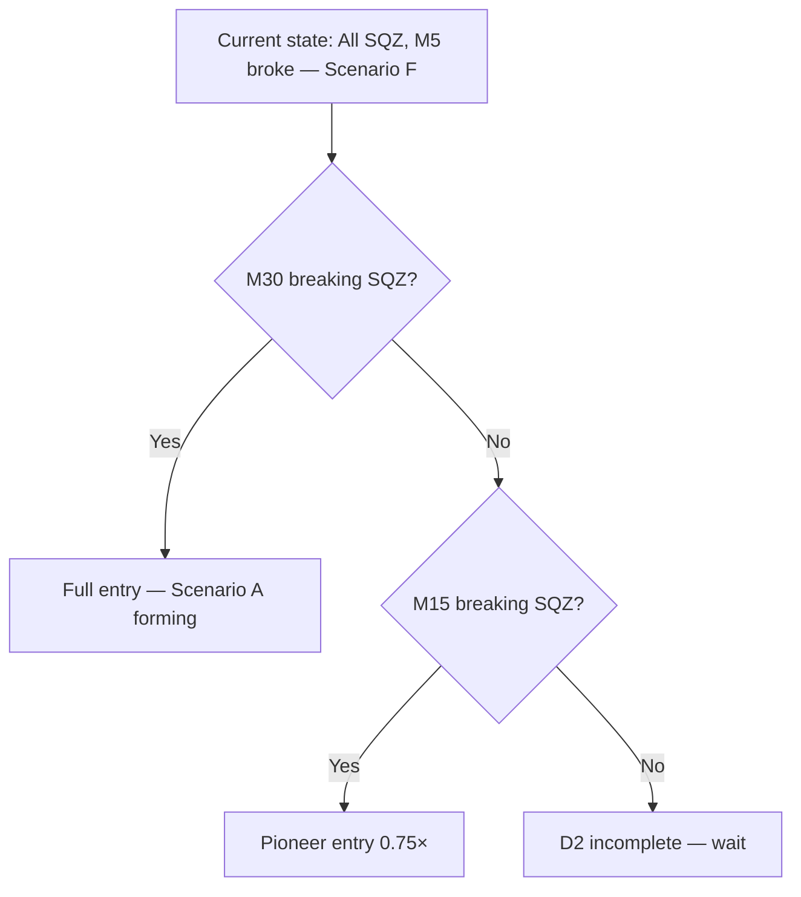
```mermaid
flowchart TD
    A["Current state: All SQZ, M5 broke — Scenario F"]
    A --> B{"M30 breaking SQZ?"}
    B -->|Yes| C["Full entry — Scenario A forming"]
    B -->|No| D{"M15 breaking SQZ?"}
    D -->|Yes| E["Pioneer entry 0.75×"]
    D -->|No| F["D2 incomplete — wait"]
```

**Prediction rules:**
- IF M30 400→511/512 → Scenario A
- IF only M15 breaks → pioneer entry 0.75×
- Watch: M30 BBW_stage

#### Image 2 Analysis — backtested_EA_sideway_2_fly_zoomin.jpg

##### Step 1: Mark Reading — Cause, Event, and Impact

| Mark | Cause (upstream TF state) | Event (transition at this bar) | Impact Immediate (1–5 bars) | Impact Sustained (duration) |
|------|--------------------------|-------------------------------|----------------------------|----------------------------|
| [TO BE FILLED] | M5 fly 511/512 | M15 SQZ break | G6-BUY/SELL entry | Full fly resuming |

##### Step 2: HTF Analysis (W1 → D1 → H4)

| TF | BBW_stage | diffMid_Trend | BBUpDn_state | Touch Type | Role |
|----|-----------|---------------|--------------|------------|------|
| W1 | [TO BE FILLED] | [TO BE FILLED] | [TO BE FILLED] | [TO BE FILLED] | [TO BE FILLED] |
| D1 | [TO BE FILLED] | [TO BE FILLED] | [TO BE FILLED] | [TO BE FILLED] | Direction bias |
| H4 | 400→513 | 3→3/4/5 | [TO BE FILLED] | Type 3→Type 1 | SQZ release |

**HTF Summary:** [TO BE FILLED] | H4 outer band | SQZ releasing | HTF decompressing

##### Step 3: MTF Analysis (H1 → M30)

| TF | BBW_stage | diffMid_Trend | BBUpDn_state | Touch Type | Role |
|----|-----------|---------------|--------------|------------|------|
| H1  | 400→513 | 3→3/4/5 | [TO BE FILLED] | Type 3→Type 1 | SQZ release |
| M30 | 400→511/512 | 3→1 | [TO BE FILLED] | Type 3→Type 2 | D2 confirmed |

**MTF Summary:** SQZ→fly | H4 outer band | Type 3→2 | G6-BUY | D2 expanding | M15 entry valid

##### Step 4: LTF Analysis (M15 → M5)

| TF | BBW_stage | diffMid_Trend | BBUpDn_state | Touch Type | Role |
|----|-----------|---------------|--------------|------------|------|
| M15 | 400→511/512 | 3→1 | [TO BE FILLED] | Type 2 | Entry trigger |
| M5  | 511/512 | 1 | [TO BE FILLED] | Type 2 | D2 leader |

**LTF Summary:** D2 confirmed | M5 fly → M15 fly | REVUP visible | G6-BUY | M30 follows | N/A

##### Step 5: Cross-TF Impact Chain

**D1 compression (HTF → LTF):**
- Resolved — SQZ breaking

**D2 expansion (LTF → HTF):**
- M5 fly → M15 fly → M30 fly → H1 shrink → H4 decompressing

**Cascade position:** D2 advancing | Leading TF = M30 (confirm fly)

##### Step 6: Concluded Analysis

Scenario F zoom — D2 expansion confirmed. M5/M15/M30 all re-expanded to fly. H4 decompressing from SQZ. Key observable: M30 fly confirmation = full entry. Next: Scenario A if H4 also flies.

##### Step 7: Identification Flowchart

```mermaid
flowchart TD
    A["Current state: D2 advancing, M5/M15/M30 fly — Scenario F zoom"]
    A --> B{"H4 breaking SQZ to fly?"}
    B -->|Yes| C["Scenario A — full alignment"]
    B -->|No| D{"H4 entering shrink?"}
    D -->|Yes| E["Scenario B — fly with shrink"]
    D -->|No| F["Scenario E — H4 SQZ + lower fly"]
```

**Prediction rules:**
- IF H4 400→511/512 → Scenario A
- IF H4 400→513 → Scenario B
- Watch: H4 BBW_stage

### Sub-scenarios (Scenario F)

| Sub | State | Entry |
|-----|-------|-------|
| F1 — LTF only | M5/M15 fly, M30 not confirmed | Wait — weak signal |
| F2 — MTF confirmed | M30+H1 fly, H4 still SQZ/shrink | Entry valid, 0.75× |
| F3 — HTF confirmed | H4 breaks to fly → Scenario A | Full entry, 1.0× |

### Scenario F Identification Flowchart

```mermaid
flowchart TD
    A["See bands on chart"] --> B{"All TF bands collapsed to tight bundle?"}
    B -->|Yes| C{"Stage labels 400-499 (SQZ)?"}
    C -->|Yes| D{"[G6-LOAD] or [G0c-SQZLOCK] visible?"}
    D -->|Yes| E{"Pressure building? (L or U touch high)?"}
    E -->|Yes| F{"M5 band spreading first?"}
    F -->|Yes| G{"REVUP/REVDN label appears?"}
    G -->|Yes| H["SCENARIO F CONFIRMED"]
    H --> I{"D1 direction?"}
    I -->|D1 fly BUY| J["BUY breakout"]
    I -->|D1 fly SELL| K["SELL breakout"]
    G -->|No| L["No breakout yet"]
    F -->|No| M["Still loading"]
    E -->|No| N["Early compression"]
    D -->|No| O["SQZ without loading label"]
    C -->|No| P["NOT full compression"]
    B -->|No| Q["NOT Scenario F"]
```

**Visual confirmation checklist:**

| Visual Cue | Present? |
|-----------|----------|
| All TF bands collapsed (tight bundle) | [ ] |
| Stage labels 400-499 | [ ] |
| [G6-LOAD] or [G0c-SQZLOCK] labels | [ ] |
| High L or U touch counts (pressure) | [ ] |
| M5 bands spreading first | [ ] |
| REVUP/REVDN label | [ ] |

**6/6 present = Confirmed Scenario F**

---

**HTF context:** D1 and H4 are about to exit SQZ — the HTF breakout pulls M30/M15/M5 along. Watch the D1 direction (magenta) for the breakout direction.

**What you see:**
- All TF bands collapsed to a tight bundle — pure SQZ state
- M5 stage labels showing 400–499; no directional labels
- Gate labels: `[G6-LOAD]` (gold) or `[G0c-SQZLOCK]` (magenta)
- **Transition:** M5 (aqua) bands begin spreading first → `REVUP` or `REVDN` label fires
- M15 follows M5 with ~2–5 bar lag; then M30, then H1

**What it means:**
- SQZ loading phase complete; momentum building from fastest TF up
- L2H chain building: M5 fly → M15 fly → M30 fly
- D1 fly direction = which way the breakout will sustain

**SQZ breakout momentum sequence:**

| Stage | Visual Cues | Action |
|-------|-------------|--------|
| Loading | Bands collapsed, [G6-LOAD] | Wait, no entry |
| Pressure building | L or U touch counts increasing | Prepare for breakout |
| M5 break | M5 spreads, REVUP/REVDN | Watch quality score |
| M15 follows | M15 spreads within 2-5 bars | Enter if quality ≥ 60 |
| M30 confirms | M30 spreads | Full entry if quality ≥ 90 |
| H1 confirms | H1 spreads | Hold with confidence |

**Entry quality scoring for breakouts:**

| Factor | Score |
|--------|-------|
| M5 SQZ break (400-499 → fly) | 75 base |
| REVUP/REVDN label | +15 |
| M30 still SQZ | -20 (pioneer) |
| M30 confirms | +25 |
| H1 confirms | +10 |
| D1 aligns with direction | +15 |

**Trade action:**
```
DURING SQZ: no entry — [G6-LOAD] confirms wait state
ENTRY: M15 SQZ break (400-499 → 511/512 or 521/522) + REVUP/REVDN → quality=75
M15 pioneer: M30 still SQZ, M15 breaks → pioneer entry 0.75×
FULL ENTRY: M30+M15 both confirm fly → 1.0×
EXIT: ATRSL trailing stop | M15 UP→FLAT (G5-FADE)
TARGET: H4 outer band (if H4 also breaking) → D1 outer band
```

### Cascade Position — Scenario F

| Dimension | Value |
|-----------|-------|
| Cascade direction now | D2 (expansion from SQZ) |
| Cascade depth | M5→M15 (D2 initiated) |
| Leading TF | M30 (confirm fly = full entry) |
| Next scenario if D1 continues | G (All Sideway) |
| Next scenario if D2 initiates same direction | A (Normal Fly) |
| Next scenario if D2 initiates opposite direction | G (All Sideway) via reversal |
| Discriminator observable | M30 BBW_stage 400→511/512 |

---

## Scenario G — All TFs Sideway (G0 Exit)

> **Tier:** TIER 2 — COMPRESSION IN PROGRESS (D1 Reached HTF)
> **Cascade position:** D1 deep — H4 also compressing. No macro tailwind at any TF.
> **Cascade direction:** D1 complete — BOTTOM-DEEP. D2 direction unknown until D1 fly breaks.
> **Leading TF:** D1 (sets eventual D2 direction — watch D1 mid for bias)
> **Previous scenario:** Came from E (H4 started compressing while LTF already SQZ)
> **Next scenario:** → F when M5 breaks SQZ and M30 confirms (D2 begins from deep)
>                   → G3 if D1 also enters SQZ (full flat — no trade)

### Sub-Scenarios

| Sub | Name | D1 | H4 | H1+M30+M15 | M5 | Trade Mode | Size |
|-----|------|----|----|------------|-----|------------|------|
| G1 | H4 shrink + LTF SQZ | 511/512 fly | 513/523 | 400-499 SQZ | 400-499 SQZ | Range fade at H4 outer bands — G0b-TOUCH path | 0.25× |
| G2 | H4 SQZ + D1 fly | 511/512 fly | 400-499 SQZ | 400-499 SQZ | 400-499 SQZ | Range fade — D1 mid gives directional bias | 0.25× |
| G3 | Full flat | 400-499 SQZ | 400-499 SQZ | 400-499 SQZ | 400-499 SQZ | NO TRADE — G0b-SQZLOCK | — |

**G1 touch rule:** H4 outer band BBUpDn=1/2 = valid G0b-TOUCH range fade entry
               H4 mid=1/5 (lean) = bias toward that direction — favour that side
               Target = H4 midline (not outer band — range trade only)
**G2 touch rule:** Same as G1 but use D1 mid direction as bias for which side to favour
**G3 rule:** G0b-SQZLOCK active — no entry. Wait for M5 REVUP/REVDN signal.
**D2 direction prediction from G:** The TF that is still in fly (usually D1 in G1/G2)
sets the eventual D2 direction. Watch D1 mid — mid=1/5 = D2 likely upward, mid=2/4 = downward.

### Trade action:
```
G1: SELL at H4 upper band touch (BBUpDn=1) | BUY at H4 lower band touch (BBUpDn=2)
    FILTER: H4 mid must have lean (4 or 5) not pure 3 — if mid=3, G0b-SQZLOCK may block
    TARGET: H4 midline
    EXIT: G8-BNDTGT (midline reached) | G0b-PINK (M15+M30 both SQZ)
    SIZE: 0.25×
G2: Same as G1 — use D1 mid direction to favour long or short side
    SIZE: 0.25×
G3: NO ENTRY — wait for M5 REVUP/REVDN → signals transition to F1
```

### Scenario G Identification Flowchart

```mermaid
flowchart TD
    A["See bands on chart"] --> B{"Mid-band labels (3,4,5) visible on M30 AND M15?"}
    B -->|Yes| C{"ALL bands flat (no expansion)?"}
    C -->|Yes| D{"H4 in SQZ or flat?"}
    D -->|Yes| E{"D1 also flat?"}
    E -->|Yes| F{"[G0] visible?"}
    F -->|Yes| G["SCENARIO G CONFIRMED"]
    G --> H{"[G0] label type?"}
    H -->|[G0]| I["All TFs mid≥3\nEXIT ALL"]
    H -->|[G0-HOLD]| J["H1 not sideway\nHOLD, no new entry"]
    F -->|No| K["Not yet triggered"]
    E -->|No| L["D1 may provide direction"]
    D -->|No| M["H4 still has direction"]
    C -->|No| N["NOT all TFs sideway"]
    B -->|No| O["NOT Scenario G"]
```

**Visual confirmation checklist:**

| Visual Cue | Present? |
|-----------|----------|
| Mid-band labels on M30 AND M15 | [ ] |
| All bands flat (no expansion) | [ ] |
| H4 in SQZ or flat | [ ] |
| D1 also flat | [ ] |
| [G0] or [G0-HOLD] label | [ ] |

**5/5 present = Confirmed Scenario G**

---

**HTF context:** H4 SQZ or flat, D1 flat — no macro direction. Any open position must close immediately.

**What you see:**
- Mid-band labels (3, 4, 5) visible on M30 AND M15 at the same time
- All bands flat — no directional expansion
- Gate label `[G0]` (crimson) or `[G0-HOLD]` (dimgray)

**G0 exit trigger conditions:**

| Condition | Gate Label | Action |
|-----------|-----------|--------|
| M30 mid≥3 AND M15 mid≥3 AND H1 mid≥3 | [G0] (crimson) | Exit all immediately |
| M30 mid≥3 AND M15 mid≥3, H1 mid<3 | [G0-HOLD] (dimgray) | Hold, no new entry |
| M15+M30 both in 400-499 stage | [G0b-PINK] (magenta) | Exit all, no entry |

**Holding vs exiting decision:**

| TF State | Action |
|----------|--------|
| All 3 TFs (M30, M15, H1) mid≥3 | EXIT (G0) |
| M30+M15 mid≥3 but H1 mid<3 | HOLD (G0-HOLD) |
| Only M15 mid≥3 | HOLD — single TF not enough |
| Only M30 mid≥3 | HOLD — need M15 confirmation |

**Recovery criteria:**
- Wait for M30 or M15 midband to return to 1 (up) or 2 (dn)
- Confirm stage returns to fly (511/512/521/522)
- Check H4 not in SQZ — if H4 in SQZ, recovery may be delayed

**Trade action:**
```
M30 mid≥3 AND M15 mid≥3 AND H1 mid≥3  →  [G0]      act=7  exit all immediately
M30 mid≥3 AND M15 mid≥3, H1 mid<3     →  [G0-HOLD] act=0  hold existing, no new entry
Recovery: wait until M30 or M15 shows mid=1 or mid=2 again
```

### Sub-scenarios (Scenario G)

| Sub | H4 State | D1 State | Trade Mode |
|-----|----------|----------|------------|
| G1 | Shrink 513/523 | Fly | Range fade at H4 bands |
| G2 | SQZ 400-499 | Fly | Range fade, D1 gives bias |
| G3 | SQZ 400-499 | SQZ | No trade — wait |

### Cascade Position — Scenario G

| Dimension | Value |
|-----------|-------|
| Cascade direction now | BOTTOM (D1 complete) |
| Cascade depth | H4+ (all TF sideway) |
| Leading TF | M5 (watch for SQZ break) |
| Next scenario if D1 continues | G remains (full lock) |
| Next scenario if D2 initiates same direction | F (SQZ → Fly breakout) |
| Next scenario if D2 initiates opposite direction | F (SQZ → Fly breakout) opposite |
| Discriminator observable | M5 REVUP/REVDN + D1 mid direction |

---

## Scenario H — SQZ Breakout Direction Confirmation

**When user asks to analyze a part 3 Scenario H:**
- Read `./Backtest_data/extras/backtested_EA_trend_reversal.jpg` as the trend reversal visual reference
- Read `./Backtest_data/extras/backtested_EA_fly_shrink_2_sideway2.jpg` as the fly shrink to sideway visual reference

[](backtested_EA_trend_reversal.jpg)

#### Image Analysis — backtested_EA_trend_reversal.jpg

##### Step 1: Mark Reading — Cause, Event, and Impact

| Mark | Cause (upstream TF state) | Event (transition at this bar) | Impact Immediate (1–5 bars) | Impact Sustained (duration) |
|------|--------------------------|-------------------------------|----------------------------|----------------------------|
| Bullish breakout from SQZ | H4+H1+M30 all in SQZ (409, mid=3) — compression exhausted | M5 BBW 409→511, mid=3→1 (REVUP) at bar 34, then M15 follows same | M15 FLAT→UP transition — G6-LOAD fires, arms for entry | M5/M15 fly sustained as long as H4 remains SQZ (no HTF target yet — trade capped at M30 band) |

##### Step 2: HTF Analysis (W1 → D1 → H4)

| TF | BBW_stage | diffMid_Trend | BBUpDn_state | Touch Type | Role |
|----|-----------|---------------|--------------|------------|------|
| W1 | 511 | 1 | 1 | — | Macro bullish — sets long-term direction |
| D1 | 511 | 1 | 1 | — | Macro bullish — confirms W1, sets D2 bias |
| H4 | 409 | 3 | 0 | Type 3 | SQZ — no HTF target, confines all below TFs. Touch Type 3: BBUpDn=0 (no_state), band too narrow |

**HTF Summary:** Bullish macro (W1+D1 fly BUY) | H4 SQZ — no immediate HTF target, price confined within H4 band | H4 in SQZ — all bands narrow, mid=3 | H4 BBUpDn=0 (no_state) — compression peak, breakout imminent

##### Step 3: MTF Analysis (H1 → M30)

| TF | BBW_stage | diffMid_Trend | BBUpDn_state | Touch Type | Role |
|----|-----------|---------------|--------------|------------|------|
| H1  | 409 | 3 | 0 | Type 3 | SQZ — confined by H4 SQZ above, no MTF direction |
| M30 | 409 | 3 | 0 | Type 3 | SQZ — confined by H1 SQZ, no MTF direction |

**MTF Summary:** Ranging — both SQZ | H4 band as confinement boundary | Touch Type 3 — SQZ peak, BBUpDn=0 (no_state) | G0c-SQZLOCK active — no entry from MTF | No impact on H4 (H4 is driver) | M15 breakout must confirm before M30 impact

##### Step 4: LTF Analysis (M15 → M5)

| TF | BBW_stage | diffMid_Trend | BBUpDn_state | Touch Type | Role |
|----|-----------|---------------|--------------|------------|------|
| M15 | 511 | 1 | 1 | — | D2 initiated — just broke SQZ, expanding upward, confirming M5 |
| M5  | 511 | 1 | 1 | — | D2 leader — broke SQZ first at bar 34, expanding upward |

**LTF Summary:** D2 leading — M5 led breakout, M15 confirmed in 0 bars | BBUpDn sequence: M5 0→1 (SQZ→expanding) then M15 0→1 | REVUP visible at M5 bar 34 | G6-LOAD fires at M5, G6-BUY fires at M15 confirm | M15 will push M30 out of SQZ if sustained | LTF signal traveling upward toward HTF

##### Step 5: Cross-TF Impact Chain

**D1 compression (HTF → LTF):**
- H4 SQZ (409) → H1 confined SQZ (409) → M30 confined SQZ (409) → M15 was SQZ then broke → M5 broke SQZ first

**D2 expansion (LTF → HTF):**
- M5 breaks SQZ (REVUP, bar 34) → M15 follows immediately (FLAT→UP) → M30 still SQZ (awaiting M15 sustain) → H1 still SQZ (awaiting M30) → H4 eventually may break SQZ upward

**Cascade position:** D1 depth = M30 (deepest TF still in SQZ) | D2 initiated at = M5 (broke SQZ first) | Leading TF = M15 (entry trigger — watch for FLAT→UP sustain)

##### Step 6: Concluded Analysis

Scenario H1 — Same as D1 direction breakout. M5 and M15 broke SQZ simultaneously in the same direction as D1 (bullish). H4 remains in SQZ (409, mid=3, BBUpDn=0) — no HTF target yet. This is a D2 breakout from deep compression with D1 bias aligned (D1 fly BUY). Entry quality: M15 FLAT→UP confirmed, but M30 still SQZ → quality capped at ~59 without M30 confirm → G5-WEAK may block. Wait for M30 breakout to confirm before full entry. Touch Type 3 at H4/H1/M30 (SQZ peak). Key observable: M30 exit from SQZ → confirms H1. Next scenario: → F2 if M30 breaks SQZ in same direction, → G if M15 reverts to SQZ.

##### Step 7: Identification Flowchart

```mermaid
flowchart TD
    A["Current state: M5+M15 broke SQZ upward, M30+H1+H4 still SQZ"]
    A --> B{"M30 exits SQZ in same direction (BBW→511, mid→1)?"}
    B -->|Yes| C["Next scenario: F2 — MTF confirmed breakout, enter 0.75×"]
    B -->|No — M15 reverts to SQZ| D["Alternative: H3 — false breakout, return to G"]
```

**Prediction rules:**
- IF M30 BBW exits 409 → 511 AND mid flips 3→1 → next scenario = F2
- IF M15 BBW reverts 511 → 409 within 3 bars → next scenario = H3 (false breakout)
- Watch: M30 BBW_stage and mid for breakout confirmation

[](backtested_EA_fly_shrink_2_sideway2.jpg)

#### Image Analysis — backtested_EA_fly_shrink_2_sideway2.jpg

##### Step 1: Mark Reading — Cause, Event, and Impact

| Mark | Cause (upstream TF state) | Event (transition at this bar) | Impact Immediate (1–5 bars) | Impact Sustained (duration) |
|------|--------------------------|-------------------------------|----------------------------|----------------------------|
| M5 bullish fly in bearish compression | H4 shrinking (513, mid=3, BBUpDn=2) confines all below TFs; H1+M30+M15 all SQZ (409) | M5 breaks SQZ upward (511, mid=1, BBUpDn=1) — lone bullish fly in sea of compression | M5 BBUpDn 0→1 = D2 signal initiated, G6-LOAD fires | M5 fly will not sustain — H4 shrinking (BBUpDn=2) confines price downward. M15/M30 still SQZ → no MTF confirm → G5-WEAK blocks entry |

##### Step 2: HTF Analysis (W1 → D1 → H4)

| TF | BBW_stage | diffMid_Trend | BBUpDn_state | Touch Type | Role |
|----|-----------|---------------|--------------|------------|------|
| W1 | 511 | 1 | 1 | — | Macro bullish — sets long-term direction |
| D1 | 511 | 1 | 1 | — | Macro bullish — confirms W1, sets D2 bias upward |
| H4 | 513 | 3 | 2 | Type 1 | Shrinking bearish — confines all below TFs. Touch Type 1: BBUpDn=2 (shrinking), band moving toward price — compression geometry noise |

**HTF Summary:** Bullish macro (W1+D1 fly BUY) | H4 shrinking — price target is H4 upper band for short trades | H4 shrink confines MTF/LTF — M15/M30/M1 sideway because H4 compression | H4 BBUpDn=2 (shrinking) — bands narrowing, compression deepening

##### Step 3: MTF Analysis (H1 → M30)

| TF | BBW_stage | diffMid_Trend | BBUpDn_state | Touch Type | Role |
|----|-----------|---------------|--------------|------------|------|
| H1  | 409 | 3 | 0 | Type 3 | SQZ — confined by H4 shrink above, no MTF direction |
| M30 | 409 | 3 | 0 | Type 3 | SQZ — confined by H1 SQZ, no MTF direction |

**MTF Summary:** Ranging — both SQZ | H4 band as confinement boundary | Touch Type 3 — SQZ peak, BBUpDn=0 (no_state) | G0c-SQZLOCK active — no entry from MTF | No impact on H4 (H4 is driver) | M15 remains SQZ — no entry trigger possible

##### Step 4: LTF Analysis (M15 → M5)

| TF | BBW_stage | diffMid_Trend | BBUpDn_state | Touch Type | Role |
|----|-----------|---------------|--------------|------------|------|
| M15 | 409 | 3 | 0 | Type 3 | SQZ — no breakout, confined by M30 SQZ |
| M5  | 511 | 1 | 1 | — | D2 leader — lone bullish fly, broke SQZ but no M15 confirm |

**LTF Summary:** D2 initiated at M5 only — M5 broke SQZ upward (BBUpDn 0→1) but M15 remains SQZ | BBUpDn sequence: M5 0→1 (SQZ→expanding) | REVUP visible at M5 | G6-LOAD fires at M5 — arms for entry, but M15 not confirmed → no G6-BUY | M5 fly alone unlikely to sustain without M15 confirm | No impact on MTF without M15

##### Step 5: Cross-TF Impact Chain

**D1 compression (HTF → LTF):**
- H4 shrinking (513, BBUpDn=2) → H1 confined SQZ (409) → M30 confined SQZ (409) → M15 confined SQZ (409) → M5 broke SQZ but confined by M15

**D2 expansion (LTF → HTF):**
- M5 breaks SQZ (REVUP, BBUpDn 0→1) → M15 NOT following (still SQZ) → D2 stalled — no upward propagation

**Cascade position:** D1 depth = M15 (deepest TF still in SQZ below H4) | D2 initiated at = M5 only (no M15 confirm — stalled) | Leading TF = M15 (watch for SQZ breakout or M5 reversion)

##### Step 6: Concluded Analysis

Scenario H1 with stalled D2 — M5 broke SQZ in same direction as D1 (bullish), but M15 remains in SQZ (409, mid=3). H4 is shrinking (513, BBUpDn=2) — compression deepening, not SQZ, so H4 confinement is active. This is NOT a valid entry — M15 SQZ means no entry trigger, G5-WEAK blocks, and H4 shrinking confines price. M5 fly is a false signal without M15 confirm. Touch Type 1 at H4 (BBUpDn=2, shrinking — band moved to price, noise). Key observable: if M15 breaks SQZ → H1 confirmed. If M5 reverts to SQZ → M5 was noise. Next scenario: → F1 if M15 breaks SQZ upward, → G if M5 reverts to SQZ.

##### Step 7: Identification Flowchart

```mermaid
flowchart TD
    A["Current state: M5 fly BUY, M15+M30+H1 SQZ, H4 shrinking bearish"]
    A --> B{"M15 exits SQZ in same direction as M5 (BBW→511, mid→1)?"}
    B -->|Yes| C["Next scenario: F1 — LTF breakout confirmed, wait M30 for entry"]
    B -->|No — M5 reverts to SQZ| D["Alternative: G — M5 was noise, all TFs SQZ, no trade"]
```

**Prediction rules:**
- IF M15 BBW exits 409 → 511 AND mid flips 3→1 → next scenario = F1
- IF M5 BBW reverts 511 → 409 within 3 bars → next scenario = G (all SQZ)
- Watch: M15 BBW_stage and mid for breakout confirmation

> **Tier:** TIER 2.5 — DIRECTION RESOLUTION (BOTTOM → D2)
> **Cascade position:** All TFs at or near SQZ — D2 direction about to resolve
> **When:** H4 BBUpDn_state transitions from 0 (SQZ) toward 1 (expanding) or 4 (dn)
> **Previous scenario:** Came from E2/E3 or G2/G3 — full compression exhausted
> **Next scenario:** → F (D2 same as D1 direction) | → C (D2 opposite to D1) | → G (false breakout)

**HTF context:** H4 in SQZ or just breaking SQZ. D1 still fly (bias exists) or also SQZ (no bias).

### Sub-Scenarios

| Sub | Name | D1 BBW | D1 BBUpDn | H4 BBW | H4 BBUpDn | Direction | Entry | Size |
|-----|------|--------|-----------|--------|-----------|-----------|-------|------|
| H1 | Same as D1 | 511/512 | 1 or 3 | Breaking SQZ | 0→1 same dir as D1 | High confidence | Enter F2 rules | 0.75× |
| H2 | Opposite to D1 | 511/512 | 1 or 3 | Breaking SQZ | 0→1 opposite to D1 | Low confidence | Enter C1 rules, small | 0.25× |
| H3 | False breakout | Any | Any | SQZ attempted break | 1→0 reversal within 3 bars | Failed | Exit immediately | — |
| H4 | Whipsaw | Any | Any | SQZ | Alternating 1 and 4 | Indeterminate | No trade | — |

**D1 bias rule:** D1 BBUpDn=1 (expanding) + D1 mid=1 → favour H1 sub-state (same direction breakout)
**False breakout rule:** H4 BBUpDn transitions 0→1 but reverts to 0 within 2–3 bars → H3, return to G
**Whipsaw rule:** H4 BBUpDn alternates 1 and 4 on consecutive bars → H4, wait for 3+ bars same value

### Sub-state Progression Table

| Step | D1 BBW | D1 mid | H4 BBW | H4 BBUpDn | H1 BBW | M30 mid | M15 mid | PriceLoc H4 | Next predict |
|------|--------|--------|--------|-----------|--------|---------|---------|-------------|-------------|
| Entry state (from G) | 511/512 | 1 | 400-499 | 0 | 400-499 | 3 | 3 | inside | All TFs SQZ — wait M5 BBUpDn 0→1 |
| H1: H4 breaks same | 511/512 | 1 | Breaking | 0→1 | Breaking | 3→1 | 3→1 | above_upper | D1 aligned — enter F2 rules, 0.75× |
| H2: H4 breaks opposite | 511/512 | 1 | Breaking | 0→4 | Breaking | 3→2 | 3→2 | below_lower | Counter D1 — enter C1 rules, 0.25× |
| H3: false breakout | 511/512 | 1 | 400-499 | 1→0 | 400-499 | 3 | 3 | inside | BBUpDn reverted — return to G, wait |
| H4: whipsaw | 511/512 | 1 | 400-499 | 1↔4 | 400-499 | 3 | 3 | inside | No clear direction — wait 3+ bars |

### Trade action:
```
H1: ENTER using F2 rules (MTF confirm needed before full size)
    D1 fly same direction = high confidence → progress to F2→F3
    SIZE: 0.75× scaling to 1.0× on F3 confirm

H2: ENTER using C1 rules (small, counter-trend to D1)
    Wait for D1 to also flip before adding size
    SIZE: 0.25× only until D1 confirms new direction

H3: EXIT immediately — false breakout confirmed
    Return to G scenario rules
    SIZE: —

H4: NO TRADE — indeterminate
    Wait for H4 BBUpDn to sustain 1 or 4 for 3+ consecutive bars
    SIZE: —

---

## Scenario Summary

| Scenario | Key Identifier | Primary Action |
|----------|---------------|----------------|
| A: Normal Fly | All TFs flying same direction | Enter on M15 transition, full size |
| B: Fly → Shrink | HTF flying, LTF shrinking | Enter on LTF transition, reduce size |
| C: Cascade | HTF SQZ, band touch | Enter at band touch with filter pass |
| D: Rest Pattern | Temporary compression, then resume | Enter at SQZ break, hold through rest |
| E: Fly expand + confined compression | H4/H1 fly, M30/M15/M5 compress within envelope | Range trade at H4 boundaries or enter on M15 transition |
| F: SQZ → Fly | Breakout from compression | Enter on SQZ break, scale up |
| G: All Sideway | M30+M15 mid≥3 | Exit all positions |

---


# PART 4 — NEXT-STAGE DIRECTION

For each TF, read what stage it is heading toward using the `nxt:` labels, and where price has been using the `tch:` touch counts.

---

## Visual Band Region Analysis

Uses `BB_diffMid_Trend[]` over the last 5 bars per TF as a proxy for price's recent position relative to bands.

| BB_diffMid_Trend value | Region | What it means |
|----------------------|--------|---------------|
| 1 (uptrend) | Upper | Price above midband, likely near upper band |
| 2 (downtrend) | Lower | Price below midband, likely near lower band |
| 3 / 4 / 5 | Mid | Price oscillating around midband |

The `tch:` field in the log counts how many of the last 5 bars were in each region:

```
tch:M15=U2/M1/L2   → M15 spent 2 bars upper, 1 bar mid, 2 bars lower (balanced oscillation)
tch:M30=U0/M2/L3   → M30 spent 3 bars lower (bearish pressure, building lower support)
tch:H1=U1/M0/L4    → H1 mostly lower (strong bearish phase or approaching lower band)
tch:H4=U0/M3/L2    → H4 oscillating at mid with some lower pressure (SQZ/shrink)
```

### Reading Touch Counts on the Chart

When reviewing annotated chart images:
- **White circles at bottom** = lower-band touches (L count high for that TF)
- **Yellow ovals near midline** = midband touches (M count high)
- **Circles near top** = upper-band touches (U count high)

### What Touch Count Patterns Tell You

| Pattern | Interpretation |
|---------|---------------|
| L high + mid now transitioning up (3→1) | Price bounced off lower band repeatedly → support building → breakout up likely |
| U high + mid now transitioning down (1→3 or 1→2) | Price rejected at upper band repeatedly → resistance → breakout down likely |
| M high + SQZ stage | Price oscillating at midband → loading zone before directional break |
| L high + U high alternating | Price ranging between bands (H4 shrink zone) |
| L high + mid=2 stable | Downtrend with lower band as magnet |

---

## `nxt:` — Per-TF Next-Stage Labels

`PredictTFNextStage()` maps current stage+mid+transition to a label for each TF:

| Label | Meaning | When it appears |
|-------|---------|-----------------|
| `fly_up_cont` | Fly BUY continuing | stage=511/512, mid=1 stable |
| `fly_dn_cont` | Fly SELL continuing | stage=521/522, mid=2 stable |
| `fly_up_resume` | Shrink resolved — fly BUY resuming | stage=513, mid=1 or 5 |
| `fly_dn_resume` | Shrink resolved — fly SELL resuming | stage=523, mid=2 or 4 |
| `fly_up` | SQZ breakout upward | stage=SQZ, mid=1/5 or transitioning up |
| `fly_dn` | SQZ breakout downward | stage=SQZ, mid=2/4 or transitioning down |
| `sqz_wait` | SQZ with no directional signal | stage=SQZ, mid=3 stable |
| `shrink_watch` | Fly weakening — watch for reversal | fly→shrink stage, mid fading |
| `reversal_forming` | Stage and mid opposing | fly or shrink with mid contradicting |
| `sideway` | No clear next state | other combinations |

### Reading the Full Output

```
NEXT   → nxt: per-TF stage label (what this TF is heading toward)
TOUCH  → tch: U/M/L counts (where price has been in each TF's bands)
```

**Conclude interpretation pattern:**
```
nxt:M15=fly_up M30=fly_up H1=fly_up H4=sqz_wait
→ M15/M30/H1 are all building toward fly up
→ H4 is in SQZ (no macro target yet, but not blocking)
→ OVERALL: M15/M30/H1 fly up until they touch H4 upper band

tch:M15=U0/M1/L4 M30=U0/M2/L3 H1=U0/M1/L4 H4=U0/M2/L3
→ All TFs have been spending time in the lower region
→ Lower band has been tested repeatedly across multiple TFs
→ Support building at lower bands → bounce/reversal signal confirming fly_up prediction
```

**Wait condition** = any TF showing `sqz_wait` in `nxt:` → that TF needs to break SQZ before it can contribute macro tailwind.

---

# PART 5 — TRADE DECISION QUICK REFERENCE

First establish HTF context (Part 2), then apply this table:

## HTF Context → MTF Trade Quality

| W1 | D1 | H4 | MTF Trade Quality | MTF Target |
|----|----|----|-------------------|------------|
| 511/512 BUY | 511/512 BUY | 511/512 BUY | Full quality 1.0× — hold longs | H4 outer → D1 outer |
| 511/512 BUY | 511/512 BUY | 513 shrink | Reduced quality 0.75× — shorter BUY | H4 outer band boundary |
| 511/512 BUY | 511/512 BUY | 400-499 SQZ | Weak — G0b cascade only; require M5 confirm | H4 band range |
| 511/512 BUY | 521/522 SELL | Any | Counter-trend — smaller size, fast exit | D1 pullback target |
| Any | Any | 521/522 SELL | SELL backed by H4 | H4 lower band |
| 400-499 | 400-499 | 400-499 | No trade — full macro SQZ | Wait for breakout |

## Scenario → Action Table

| What you see | Scenario | Action | Gate | Size |
|---|---|---|---|---|
| H1+M30+M15 all 511/512, mid=1 | Normal fly BUY | Enter on M15 FLAT→UP | G6-BUY | 1.0× |
| H1+M30+M15 all 521/522, mid=2 | Normal fly SELL | Enter on M15 FLAT→DN | G6-SELL | 1.0× |
| H1/M30 in fly, M15/M5 shrinking | Fly→Shrink BUY/SELL | Enter on M15 FLAT→UP/DN | G6-BUY/SELL | 0.75× |
| Only M5 shrinking, M15 still fly | M5 noise | **Wait** — not yet | — | — |
| H1+M30 SQZ, M15/M5 shrink, band touch | Cascade | Enter at outer band touch | G0b-TOUCH | Quality |
| M15+M30 both SQZ | Pink zone | **Exit all** | G0b-PINK | — |
| M15 fading (UP→FLAT or DN→FLAT) | Fade | Exit open position | G5-FADE | — |
| All TFs SQZ | Full lock | **Wait** for breakout | G0c/G6-LOAD | — |
| M15 breaks SQZ → REVUP/REVDN | Breakout | Enter quality=75 | G6-ENTRY | 0.5-1.0× |
| M30 mid≥3 AND M15 mid≥3, H1 trending | Near-G0 | Hold, no new entry | G0-HOLD | — |
| M30 mid≥3 AND M15 mid≥3, H1 sideway | G0 | **Exit all** | G0 | — |
| H4 fly opposing direction | H4 filter | Block | H4-OPPOSE | — |
| Float loss < −$50 | Emergency | Exit immediately | G0e-MAXLOSS | — |
| Price touches outer band of lowest fly TF (all below compressed) | Cascade target hit | Exit (auto) | G8-BNDTGT | — |

## Comprehensive Entry Block Gate Reference

| Gate | Block Condition | Color | Resolution |
|------|----------------|-------|------------|
| H4-OPPOSE | H4 fly opposing entry direction | DarkOrange | Wait for H4 to align |
| H4-SQZ | H4 in SQZ with no conviction | DarkOrange | Wait for H4 breakout |
| G0b-H4OPP | H4 fly/shrink opposing entry | DarkOrange | H4 mid must align with entry |
| G0b-M30OPP | M30 fly/shrink/SQZ with opposing mid | DarkMagenta | M30 mid must align |
| G4e-H4OPP | H4 in shrink with flat mid (sideway) | Orange | Wait for H4 to exit shrink |
| G4c-M15OPP | M15 fly/shrink/SQZ with opposing mid | Orange | M15 mid must align |
| G4f-M30OPP | M30 fly/shrink/SQZ with opposing mid | Orange | M30 mid must align |
| G0b-SQZLOCK | H1+M30 both SQZ, both mid==3 | Magenta | At least one TF must break SQZ |
| G0b-H1SQZDN | H1-SQZ with mid=2/4 vs BUY, or mid=5 vs SELL | Magenta | H1 mid must align with entry |
| G0b-M5OPP | M5 sole trigger + M5 shrink with opposing mid | Magenta | M5 mid must align |
| G0b-M5FLY | M5 in committed opposing fly | Magenta | Wait for M5 to align |

## Cascading Price Targets

When TFs compress bottom-up, price gravitates to the outer band of the **lowest TF still in fly**.

| Lowest TF still in fly | WHY it is lowest | Price target | Exit |
|---|---|---|---|
| H4 (M30/M15/M5/H1 all below) | D1 fly still providing H4 target | D1 outer band | D1 starts shrinking |
| H1 (M30/M15/M5 compressed) | H4 shrink forcing H1 range | H4 outer band | G0-HOLD or G8-BNDTGT |
| M30 (M15+M5 compressed) | H1 shrink forcing M30 range | H1 outer band | G8-BNDTGT |
| M15 (M5 compressed) | M30 shrink forcing M15 range | M30 outer band | G8-BNDTGT |
| M5 only fly | M15+ still fly — M5 is noise | Not applicable | Wait for M15 to confirm |
| All sideway | H4 SQZ — no macro target | None | G0 → exit all |

**Rules:**
1. Only M5 sideway → wait; M5 alone is noise within M30/H1 fly
2. Target = outer band of lowest still-flying TF (upper for BUY, lower for SELL)
3. HTF is why lower TF goes sideway: H4 SQZ → M30 flat; H4 shrink → M30 ranges within H4 band
4. G8-BNDTGT fires automatically at target band touch when all lower TFs are compressed

---

# PART 6 — ANALYSIS WORKFLOW

Apply these steps in order for any attached chart image.

**Step 1 — HTF first: W1 → D1 → H4**
- W1 direction? (fly BUY/SELL / shrink / SQZ)
- D1 direction? Same as W1 = aligned; opposite = counter-trend
- H4 stage? → determines M30 trade target and duration
- What is the current HTF price target for M30 trades?

**Step 2 — Identify each band**
Map colors to TFs (Section 2). Which bands are wide (fly) vs narrow (shrink/SQZ)?

**Step 3 — Build regime table**
```
W1: ___ | D1: ___ | H4: ___ | H1: ___ | M30: ___ | M15: ___ | M5: ___
```

**Step 4 — Read middle band labels**
Note values 3/4/5 and REVUP/REVDN flags. Flat labels = that TF is ranging. Ask: which HTF is causing this lower TF to be flat?

**Step 5 — Read ATRSL state**
dir=0 (orange below price) = uptrend stop. dir=1 (orange above) = downtrend stop.

**Step 6 — Read gate labels**
List visible tags with bar position. Match color to meaning (Part 1 Section 6).

**Step 7 — Match scenario**
Using regime table from Step 3:
- All mid TFs fly same direction → Scenario A
- HTF fly, inner TFs shrinking → Scenario B
- HTF SQZ, inner TFs shrinking, band touch → Scenario C
- HTF fly, inner TFs rest then resume → Scenario D
- H4/H1 fly + M30/M15/M5 compress within envelope → Scenario E
- All TFs SQZ, about to break → Scenario F
- M30+M15 mid both ≥ 3 → Scenario G

**Step 8 — Apply trade decision**
Read Part 4 nxt:/tch: labels. State: current regime, price target, which gate fires next, open position status.

---

---

# PART 7 — COMMON MISREADS

| Misread | Correct interpretation |
|---------|----------------------|
| "M30 is sideway for no reason" | Check H4 — if H4 is SQZ/shrink, that is WHY M30 is flat. M30 range = H4 band range |
| "Trade stopped at random level" | Check if that level is H4 outer band or D1 outer band — it is a cascade price target |
| Brief M5 SQZ during H1 fly | Noise — M30 midtrend is still primary; do not exit |
| Both H4 and W1 look yellow | H4 is saturated yellow and narrower; W1 is pale near-white cyan and the widest band |
| No mid label visible | BB_diffMid_Trend is 1 or 2 (trending) — labels suppressed; check upper label direction |
| REVUP/REVDN label | Midtrend flipped THIS bar — transition event, not stable state yet |
| DimGray gate label near trade | Block gate fired — trade was NOT taken at this bar |
| DarkOrange gate label | H4 macro filter blocked (H4-OPPOSE/H4-SQZ/G0b-H4OPP) |
| Fly→Shrink vs Fly→Reversal | Check H1/H4: maintain step direction → rest pattern (D); break step → reversal |
| M5 sideway during HTF fly | M5 noise — wait for M15 to also shrink before entering |
| Cascade BUY with M5 in 521/522 | G0b-M5FLY blocks this — M5 committed opposing fly contradicts cascade direction |
| "Why did BUY stop here?" | Price hit H4 outer band during H4 shrink — G8-BNDTGT fired as expected cascade target |

---

## 13. Document Update Summary

**Enhancements completed through comprehensive image analysis:**

### Part 1 — Chart Basics (New Sections Added)

| Section | Content |
|---------|---------|
| 7 | Visual Entry Trigger Identification |
| 8 | Compression Zone Identification |
| 9 | Compression Resolution — Reversal vs Continuation |
| 10 | Block Gate Reference Table |
| 11 | Position Sizing Matrix |
| 12 | Risk Management Guidelines |
| 6 | Gate Label Color Reference (completed - was empty) |

### Part 2 — HTF Analysis (Enhancements)

| Addition | Description |
|----------|-------------|
| HTF Compression Cascade Dynamics | Top-down cascade principle, compression confinement mechanics |
| H4 shrink confinement pattern | Pink rectangle pattern explanation |
| D1 band boundary rule | Ceiling concept for H4 BUY trades |
| Scenario Identification Flowchart | Visual decision tree for scenario matching |
| HTF Compression Zone Analysis | Building phase, peak compression, release, confirmation |
| Compression duration guidelines | Typical compression times per timeframe |

### Part 3 — MTF/LTF Scenarios (Enhancements)

| Scenario | Enhancements |
|----------|-------------|
| A: Normal Fly | Visual identification checklist, holding vs exiting decision table |
| B: Fly → Shrink | Shrink depth measurement, optimal entry timing |
| C: Cascade | Band touch point identification, filter evaluation sequence |
| D: Rest Pattern | Rest vs reversal identification checklist |
| E: Fly expand + confined compression | Range trade rules, compression threshold, entry conditions, touch patterns |
| F: SQZ → Fly | SQZ breakout momentum sequence, entry quality scoring |
| G: All TFs Sideway | G0 exit trigger conditions, holding vs exiting decision, recovery criteria |
| All | Scenario Summary table |

### Part 4 — Next-Stage Direction (Enhancements)

| Addition | Description |
|----------|-------------|
| Visual Band Region Analysis | Touch count patterns and interpretation |
| Per-TF nxt: labels | Next-stage direction for each TF |

### Part 5 — Trade Decision (Enhancements)

| Addition | Description |
|----------|-------------|
| Size column | Position size guidance added to action table |
| Comprehensive Block Gate Table | All blocking conditions with colors and resolution |
