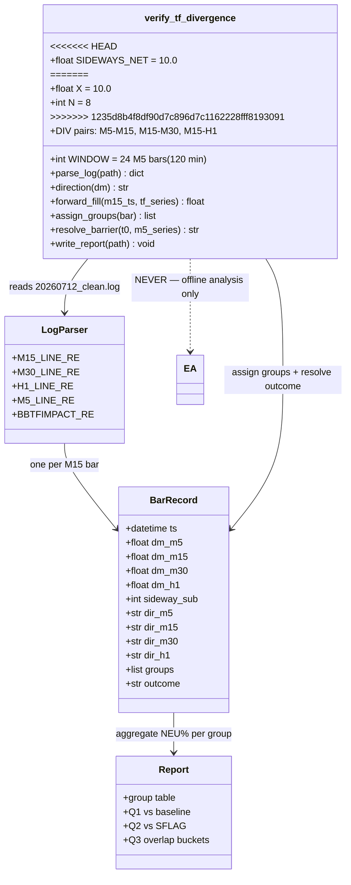
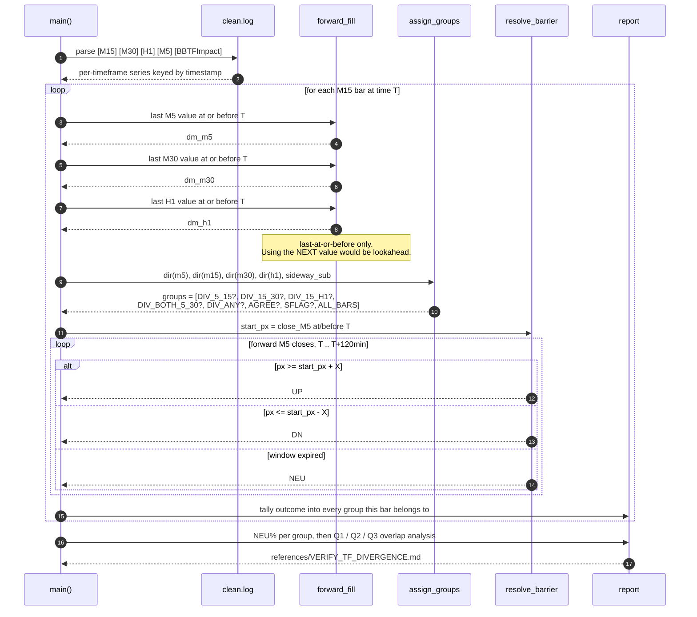

# verify_tf_divergence.py — design & how to read it

Design doc for the cross-timeframe divergence test. The script itself is built from the
accompanying Claude Code prompt; this document defines what it must do and how to
interpret the output.

---

## 1. What this is — and how it differs from TofyVerifySideway

| | `TofyVerifySideway.mqh` | `verify_tf_divergence.py` |
|---|---|---|
| scores | an **existing** detector (TofySideway `S_` flag) | a **proposed** detector (TF direction divergence) |
| runs | live in the EA, on the chart | offline, on the backtest log |
| purpose | is the current flag right? | is this new idea worth building? |

**Neither detects anything.** Both measure whether a candidate sideway signal is followed
by sideways price. This one runs *before* any MQL5 is written — the point is to find out
whether the idea is worth the build cost.

---

## 2. The hypothesis being tested

> When two timeframes disagree about direction, price is ranging.

Concretely: M15 midline trending **down** while M30 midline trends **up** means the
shorter timeframe is pulling against the longer one — neither is winning — so price
should go nowhere.

This is a genuinely different construct from what TofySideway currently does:

| | current TofySideway | divergence idea |
|---|---|---|
| logic | timeframes **agree** it is sideways (`sideway_val` vote + midline cluster distance) | timeframes **disagree** about direction |
| fires on | ~1,684 bars | ~1,445 bars (measured) |

Because they use opposite reasoning, they may fire on **different bars** — which is why
the overlap analysis (§7) is the part that decides whether to build it.

### Measured frequency (from `20260712_clean.log`)

**M5 vs M15 direction:**

| M5 dir | M15 dir | n |
|---|---|---|
| UP | UP | 2,198 |
| DN | DN | 1,942 |
| **UP** | **DN** | **851** |
| **DN** | **UP** | **847** |
| SIDE | UP | 621 |
| SIDE | DN | 540 |

**M15 vs M30 direction:**

| M15 dir | M30 dir | n |
|---|---|---|
| UP | UP | 2,536 |
| DN | DN | 2,115 |
| **UP** | **DN** | **734** |
| **DN** | **UP** | **711** |
| DN | SIDE | 507 |
| UP | SIDE | 396 |

### The key finding: the two divergences barely overlap

| pair | bars | % of 7,609 |
|---|---|---|
| **M5 vs M15** | 1,698 | 22.3% |
| **M15 vs M30** | 1,445 | 19.0% |
| **either** | 2,777 | 36.5% |
| **both** | **366** | **4.8%** |

Only 366 bars (4.8%) fire on *both*. **These are two largely independent signals, not two
views of the same thing.** They must therefore be scored separately — lumping them into a
single `DIV_ANY` group would blur two different phenomena and hide which one works.

Which is better is genuinely unknown:

- **M5/M15** fires more often (22.3%) and is the fastest possible signal — best for
  "early" detection. But M5 is noisy, so many may be meaningless flickers.
- **M15/M30** is slower, but a 30-minute midline turning against a 15-minute one is a
  bigger structural event.

Only NEU% settles it.

---

## 3. Direction encoding

From each timeframe's `diffMid_Trend` current value:

| value | direction |
|---|---|
| 1 (up), 5 (sideway-up) | **UP** |
| 2 (down), 4 (sideway-down) | **DN** |
| 3 (sideways) | **SIDE** |
| 0 | WARMUP |

"Divergence" = one timeframe **UP** and the other **DN**. `SIDE` on either side is not
divergence — it is treated as its own case, since neither timeframe is asserting a
direction.

---

## 4. Forward-fill: why it is needed

Timeframes log at different rates in the same file:

| tag | lines in log |
|---|---|
| M5 | 22,821 |
| M15 | 7,610 |
| M30 | 3,805 |
| H1 | 1,905 |

An M15 bar at 04:15 has **no M30 line of its own** — M30 only prints at :00 and :30. So
for each M15 bar, the script uses the **last M30/H1 value at or before** that bar's
timestamp. That is the value that was actually in effect at the time.

Getting this wrong in the other direction (using the *next* M30 value) would be
lookahead — reading a bar that had not closed yet.

---

<<<<<<< HEAD
## 5. How "sideways" is measured — CORRECTED

> **Superseded method:** an earlier version of this document used a *first-touch
> barrier* (does price hit `start+$10` or `start-$10` first?). **That method is wrong for
> sideways** and has been replaced. It measures DIRECTION, not range: a market swinging
> +/-15 trips a $10 barrier on its first swing and gets labelled directional even when it
> ends where it started.
>
> Verified counter-examples from the log:
>
> | bar | net move | range | first-touch said | truth |
> |---|---|---|---|---|
> | 2026.02.10 07:25 | **+2.75** | 20.75 | UP | sideways |
> | 2026.02.10 13:25 | **-7.51** | 30.04 | DN | sideways |
> | 2026.02.11 08:25 | -2.24 | 12.16 | NEU | sideways |
>
> First-touch got two of three wrong. It is retained ONLY for directional tests such as
> `label_base_rate.py`.

### The measures now used

For each M15 bar: `start_px` = `close_M5` at/before the bar, then look at the next
120 minutes (24 M5 bars).

| measure | formula | role |
|---|---|---|
| **net displacement** | `abs(end_px - start_px)` | **the verdict**: sideways if `< 10.0` |
| **efficiency ratio (ER)** | `abs(end-start) / sum(abs(bar-to-bar moves))` | descriptor, reported not thresholded |
| **range** | `max(window) - min(window)` | how violent the period was |

`end_px` is the close of the 24th bar — not the first barrier touch.

**Why ER is not thresholded:** choosing a cutoff from this dataset would be
curve-fitting. It is reported per group so the *comparison between groups* carries the
signal.

**ER interpretation** (from the measured decile table):

| ER | sideways rate | reading |
|---|---|---|
| < 0.10 | 82-99% | choppy / going nowhere |
| 0.10-0.17 | 40-58% | ambiguous |
| > 0.26 | 0-4% | trending |

### Baseline calibration

Under net displacement, **41.4%** of all bars are sideways (not the ~13% quoted for
first-touch NEUTRAL). Any group must be compared against 41.4%, not against 13%.

### Live-computability

The **divergence signal itself** uses only current-bar data (M15 direction vs M30
direction, both known now), so it could be built into the EA if it tested well. Only the
**scoring** needs future bars, and that stays offline. Never let the scoring enter trade
logic.
=======
## 5. X and N — yes, both are used, unchanged

Same pre-registered barrier as every other measurement in this project:

| param | value | role |
|---|---|---|
| **X** | `10.0` | how far price must move to count as *a move* |
| **N** | `8` M15 bars (120 min) | *by when* the bar is judged |

For each M15 bar: take `close_M5` at/before it as the start price, then walk forward
through M5 closes for 120 minutes.

| first thing that happens | outcome |
|---|---|
| price reaches `start + 10.0` | **UP** |
| price reaches `start - 10.0` | **DN** |
| neither within 120 min | **NEU** |

**`NEU` is the operational definition of "went sideways."** Price stayed inside a $20
band for two hours.

**Why these exact values:** they are identical to `label_base_rate.py` and
`TofyVerifySideway.mqh`, so this result is directly comparable to
FLY_UP 50.5% / FLY_DOWN 47.4% and to the TofySideway `S_` flag score. Changing X or N
would break that comparability and would be tuning, not measuring.

### Live-computability — an important property

The **divergence signal itself uses only current-bar data** (M15 direction now vs M30
direction now). Nothing about it needs the future. So if it tests well, it can be built
into the EA directly.

Only the **scoring** (the barrier outcome) needs future bars — and that stays offline,
in this script, purely to grade the signal. It must never enter the EA.

---
>>>>>>> 1235d8b4f8df90d7c896d7c1162228fff8193091

## 6. The groups being compared

| group | definition | expected n |
|---|---|---|
| `DIV_5_15` | M5 and M15 directions opposite | ~1,698 |
| `DIV_15_30` | M15 and M30 directions opposite | ~1,445 |
| `DIV_15_H1` | M15 and H1 directions opposite | — |
| `DIV_BOTH_5_30` | **both** `DIV_5_15` and `DIV_15_30` | ~366 |
| `DIV_ANY` | any divergence above | ~2,777 |
| `AGREE` | M5, M15, M30 all the same direction | — |
| `SFLAG` | existing TofySideway `S_` flag present | ~1,684 |
| `ALL_BARS` | every M15 bar — the baseline | 7,610 |

Groups deliberately **overlap** (a bar can be both `DIV_15_30` and `SFLAG`). That overlap
is the point, not a defect.

`DIV_BOTH_5_30` (n≈366) is small but deserves its own row: **if two independent
divergences agreeing produces a much higher NEU% than either alone, that is a strong
confirmation signal.** Small sample — treat with caution — but it is exactly the kind of
structure worth building on if it holds.

## 7. How to read the result

Three questions, in order of importance:

**Q1 — does divergence beat the baseline?**
`DIV_15_30` NEU% vs `ALL_BARS` NEU%. If divergence bars are no more likely to go
sideways than a random bar, the idea is dead and nothing else matters.

**Q2 — does it beat the current detector?**
`DIV_15_30` NEU% vs `SFLAG` NEU%. Higher means divergence is a *better* sideway
detector than TofySideway.

**Q3 — does it add anything? (the decisive one)**
Run this separately for `DIV_5_15` and for `DIV_15_30`. Split each into three buckets and
report NEU% for each:

| bucket | meaning |
|---|---|
| in **both** DIV and SFLAG | already covered by TofySideway |
| **DIV only** (no S_ flag) | **what divergence would ADD** |
| **SFLAG only** (no divergence) | what TofySideway catches that divergence misses |

**The "DIV only" bucket decides the build.** If those bars have a high NEU%, divergence
catches real sideways periods TofySideway currently misses — a genuine improvement worth
adding. If they look like any random bar, divergence adds nothing even if Q1 and Q2 look
favourable.

### Calibration

<<<<<<< HEAD
Under net displacement the baseline is 41.4% of all bars (the ~13% figure was the old
first-touch NEUTRAL rate and no longer applies). So do not
=======
NEUTRAL is uncommon in gold — around 13% of all bars in the base-rate test. So do not
>>>>>>> 1235d8b4f8df90d7c896d7c1162228fff8193091
expect 60%. The comparison is **relative**: baseline 13% vs divergence 25% would be a
strong result. Both near 13% means no signal.

Treat any group with n < 100 as low confidence.

---

## 8. Design (UML)



---

## 9. Sequence — one M15 bar



---

## 10. Grouping and scoring logic

```mermaid
flowchart TD
    A["M15 bar at time T"] --> B["dir_m5  = direction(forward_filled dm_m5)"]
    B --> C["dir_m15 = direction(dm_m15)"]
    C --> D["dir_m30 = direction(forward_filled dm_m30)"]

    D --> E{"dir_m5 vs dir_m15<br/>opposite?"}
    E -->|yes| F["group: DIV_5_15"]
    E -->|no| G["not DIV_5_15"]

    F --> H{"dir_m15 vs dir_m30<br/>opposite?"}
    G --> H
    H -->|yes| I["group: DIV_15_30"]
    H -->|no| J["not DIV_15_30"]

    I --> K{"in BOTH<br/>DIV_5_15 and DIV_15_30?"}
    J --> K
    K -->|yes| L["also group: DIV_BOTH_5_30"]
    K -->|no| M["single or no divergence"]

    L --> N{"S_ flag present?"}
    M --> N
    N -->|yes| O["also group: SFLAG"]
    N -->|no| P["no S_ flag"]

    O --> Q["resolve barrier X=10, N=8"]
    P --> Q
<<<<<<< HEAD
    Q --> R{"net = abs(end - start)"}
    R -->|"net < 10"| U["SIDEWAYS"]
    R -->|"net >= 10"| S["DIRECTIONAL"]
    R --> T["also record ER and range"]
=======
    Q --> R{"first touch?"}
    R -->|"start + 10"| S["UP"]
    R -->|"start - 10"| T["DN"]
    R -->|"neither in 120min"| U["NEU = went sideways"]
>>>>>>> 1235d8b4f8df90d7c896d7c1162228fff8193091

    S --> V["tally into EVERY group this bar belongs to"]
    T --> V
    U --> V

    style U fill:#d5e8d4,stroke:#82b366
    style S fill:#f8cecc,stroke:#b85450
    style T fill:#f8cecc,stroke:#b85450
```

## 11. What a result means for the build

| outcome | action |
|---|---|
| DIV_15_30 NEU% >> baseline **and** DIV-only bucket also high | build it into TofySideway — it catches sideways periods currently missed |
| DIV_15_30 NEU% >> baseline, but DIV-only bucket is flat | divergence works, but only on bars TofySideway already flags — adds nothing |
| DIV_15_30 NEU% ≈ baseline | idea is dead; do not build it |

### One caution on "early detection"

The measured problem in DMONLY was **churn**: 844 short-hold trades losing −$2,258.
Detecting sideway *earlier* means exiting *earlier*, which produces **more** short trades,
not fewer.

Earlier detection helps only if it stops you **entering** into chop. It hurts if it clips
trends that were still running. Which effect dominates is exactly what NEU% answers: a
high NEU% on divergence bars means those bars really are chop worth avoiding; a low NEU%
means you would be exiting live trends early.

So this one test answers both questions — whether divergence detects sideways, and
whether acting on it earlier is help or harm.
<<<<<<< HEAD

---

## 12. RESULTS — the test has been run

Runtime 4s on `20260712_clean.log`. **Baseline sideways rate = 41.4%.**

| group | n | sideways% | mean ER | mean range |
|---|---|---|---|---|
| **ALL_BARS** (baseline) | 7,601 | **41.4%** | 0.202 | 36.13 |
| DIV_5_15 | 1,696 | 43.8% | 0.194 | 33.84 |
| DIV_15_30 | 1,440 | **41.5%** | 0.208 | 35.49 |
| DIV_15_H1 | 1,998 | 41.3% | 0.206 | 34.86 |
| DIV_BOTH_5_30 | 366 | 44.0% | 0.193 | 34.90 |
| DIV_ANY | 3,635 | 42.5% | 0.201 | 34.17 |
| AGREE | 2,762 | 39.2% | 0.201 | 39.44 |
| **SFLAG** (TofySideway) | 1,682 | **48.6%** | 0.205 | **27.41** |

### Verdict: divergence does NOT predict sideways

- `DIV_15_30` = **41.5%** against a **41.4%** baseline. One-tenth of a point across 1,440 bars.
- `DIV_5_15` = 43.8%, +2.4 points — within noise on this sample.

**Overlap test (the decisive one)** — bars where divergence fires but TofySideway does not:

| | both | DIV only | SFLAG only |
|---|---|---|---|
| DIV_5_15 | n=401, 52.4% | **n=1295, 41.2%** | n=1281, 47.5% |
| DIV_15_30 | n=423, 44.9% | **n=1017, 40.0%** | n=1259, 49.9% |

The "DIV only" bars — what divergence would *add* — sit at 41.2% and 40.0%, i.e. at or
below baseline. **Divergence adds nothing.**

### Worked examples — the first 8 DIV_15_30 bars in the dataset

| M15 bar | dm15 | dm30 | dirs | start | end | net | sideways? |
|---|---|---|---|---|---|---|---|
| 2026.01.02 16:00 | 2 | 5 | DN vs UP | 4366.02 | 4335.49 | 30.53 | no |
| 2026.01.02 16:15 | 2 | 5 | DN vs UP | 4370.43 | 4322.32 | 48.11 | no |
| 2026.01.02 23:15 | 5 | 2 | UP vs DN | 4329.14 | 4378.07 | 48.93 | no |
| 2026.01.02 23:30 | 5 | 2 | UP vs DN | 4328.90 | 4387.22 | 58.32 | no |
| 2026.01.02 23:45 | 5 | 2 | UP vs DN | 4328.47 | 4387.98 | 59.51 | no |
| 2026.01.05 01:00 | 5 | 2 | UP vs DN | 4361.32 | 4394.72 | 33.40 | no |
| 2026.01.05 01:15 | 1 | 2 | UP vs DN | 4370.15 | 4403.06 | 32.91 | no |
| 2026.01.05 01:30 | 1 | 2 | UP vs DN | 4366.89 | 4396.12 | 29.23 | no |

Eight consecutive divergence bars, **zero sideways**, net moves of $29-59. On
01.02 23:15-23:45 M15 said UP while M30 said DN and price ran **+$59 in two hours**.

### What the test DID find: TofySideway works

- **48.6% vs 41.4% baseline** — +7.2 points, three times any divergence variant
- **mean range 27.41 vs 36.13** — flagged bars have 24% smaller forward range

TofySideway is the strongest sideway detector in the toolkit. It detects the **quiet**
kind (smaller range). Its ER of 0.205 equals the 0.202 baseline, so it does **not**
detect the **choppy** kind (lots of motion, no progress).

### Why the chart looks convincing but the data says no

Divergence regions on a chart often *do* coincide with sideways price — those instances
are real. What the eye cannot see is the ~840 divergence bars followed by clean trends.
A pattern present in noticed examples and absent across the population is the same
failure mode that produced the S-F cell (PF 1.55 in-sample -> 0.13 out-of-sample).

### Follow-up: no field predicts chop

Every logged M15 field was scored against forward ER (baseline 0.202). Spread across
value buckets:

| field | spread | verdict |
|---|---|---|
| diffBBW | 0.007 | no signal |
| diffMid | 0.013 | no signal |
| BBW (WLV) | 0.014 | no signal |
| **midline_Cluster** | **0.015** | **no signal** |
| bandwidth | 0.021 | no signal |
| W_stage | per-value 0.194-0.219 | no signal |
| diffMid_Trend | per-value 0.197-0.205 | no signal |
| BBUpDn | per-value 0.197-0.208 | no signal |

**Nothing currently logged predicts chop.** Note `midline_Cluster` in particular — tuning
its threshold would be optimising a field that does not discriminate.
=======
>>>>>>> 1235d8b4f8df90d7c896d7c1162228fff8193091
