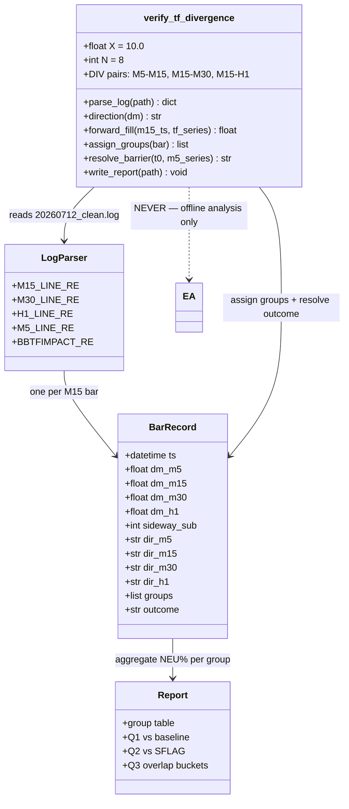
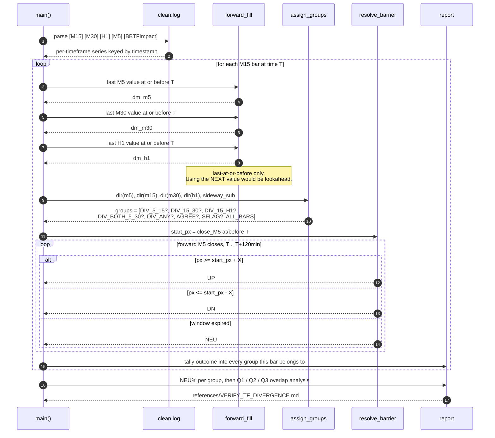
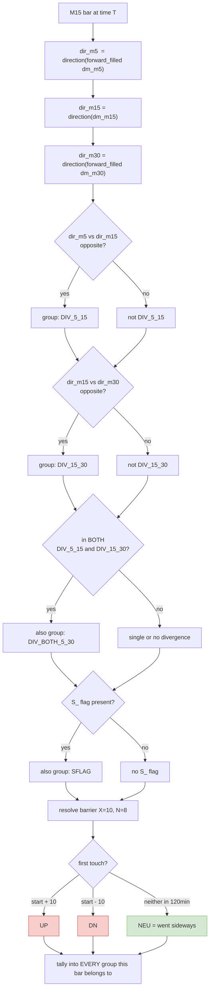

# verify_tf_divergence.py — design & how to read it

Design doc for the cross-timeframe divergence test. The script itself is built from the
accompanying Claude Code prompt; this document defines what it must do and how to
interpret the output.

---

## 1. What this is — and how it differs from TofyVerifySideway

| | `TofyVerifySideway.mqh` | `verify_tf_divergence.py` |
|---|---|---|
| scores | an **existing** detector (TofySideway `S_` flag) | a **proposed** detector (TF direction divergence) |
| runs | live in the EA, on the chart | offline, on the backtest log |
| purpose | is the current flag right? | is this new idea worth building? |

**Neither detects anything.** Both measure whether a candidate sideway signal is followed
by sideways price. This one runs *before* any MQL5 is written — the point is to find out
whether the idea is worth the build cost.

---

## 2. The hypothesis being tested

> When two timeframes disagree about direction, price is ranging.

Concretely: M15 midline trending **down** while M30 midline trends **up** means the
shorter timeframe is pulling against the longer one — neither is winning — so price
should go nowhere.

This is a genuinely different construct from what TofySideway currently does:

| | current TofySideway | divergence idea |
|---|---|---|
| logic | timeframes **agree** it is sideways (`sideway_val` vote + midline cluster distance) | timeframes **disagree** about direction |
| fires on | ~1,684 bars | ~1,445 bars (measured) |

Because they use opposite reasoning, they may fire on **different bars** — which is why
the overlap analysis (§7) is the part that decides whether to build it.

### Measured frequency (from `20260712_clean.log`)

**M5 vs M15 direction:**

| M5 dir | M15 dir | n |
|---|---|---|
| UP | UP | 2,198 |
| DN | DN | 1,942 |
| **UP** | **DN** | **851** |
| **DN** | **UP** | **847** |
| SIDE | UP | 621 |
| SIDE | DN | 540 |

**M15 vs M30 direction:**

| M15 dir | M30 dir | n |
|---|---|---|
| UP | UP | 2,536 |
| DN | DN | 2,115 |
| **UP** | **DN** | **734** |
| **DN** | **UP** | **711** |
| DN | SIDE | 507 |
| UP | SIDE | 396 |

### The key finding: the two divergences barely overlap

| pair | bars | % of 7,609 |
|---|---|---|
| **M5 vs M15** | 1,698 | 22.3% |
| **M15 vs M30** | 1,445 | 19.0% |
| **either** | 2,777 | 36.5% |
| **both** | **366** | **4.8%** |

Only 366 bars (4.8%) fire on *both*. **These are two largely independent signals, not two
views of the same thing.** They must therefore be scored separately — lumping them into a
single `DIV_ANY` group would blur two different phenomena and hide which one works.

Which is better is genuinely unknown:

- **M5/M15** fires more often (22.3%) and is the fastest possible signal — best for
  "early" detection. But M5 is noisy, so many may be meaningless flickers.
- **M15/M30** is slower, but a 30-minute midline turning against a 15-minute one is a
  bigger structural event.

Only NEU% settles it.

---

## 3. Direction encoding

From each timeframe's `diffMid_Trend` current value:

| value | direction |
|---|---|
| 1 (up), 5 (sideway-up) | **UP** |
| 2 (down), 4 (sideway-down) | **DN** |
| 3 (sideways) | **SIDE** |
| 0 | WARMUP |

"Divergence" = one timeframe **UP** and the other **DN**. `SIDE` on either side is not
divergence — it is treated as its own case, since neither timeframe is asserting a
direction.

---

## 4. Forward-fill: why it is needed

Timeframes log at different rates in the same file:

| tag | lines in log |
|---|---|
| M5 | 22,821 |
| M15 | 7,610 |
| M30 | 3,805 |
| H1 | 1,905 |

An M15 bar at 04:15 has **no M30 line of its own** — M30 only prints at :00 and :30. So
for each M15 bar, the script uses the **last M30/H1 value at or before** that bar's
timestamp. That is the value that was actually in effect at the time.

Getting this wrong in the other direction (using the *next* M30 value) would be
lookahead — reading a bar that had not closed yet.

---

## 5. X and N — yes, both are used, unchanged

Same pre-registered barrier as every other measurement in this project:

| param | value | role |
|---|---|---|
| **X** | `10.0` | how far price must move to count as *a move* |
| **N** | `8` M15 bars (120 min) | *by when* the bar is judged |

For each M15 bar: take `close_M5` at/before it as the start price, then walk forward
through M5 closes for 120 minutes.

| first thing that happens | outcome |
|---|---|
| price reaches `start + 10.0` | **UP** |
| price reaches `start - 10.0` | **DN** |
| neither within 120 min | **NEU** |

**`NEU` is the operational definition of "went sideways."** Price stayed inside a $20
band for two hours.

**Why these exact values:** they are identical to `label_base_rate.py` and
`TofyVerifySideway.mqh`, so this result is directly comparable to
FLY_UP 50.5% / FLY_DOWN 47.4% and to the TofySideway `S_` flag score. Changing X or N
would break that comparability and would be tuning, not measuring.

### Live-computability — an important property

The **divergence signal itself uses only current-bar data** (M15 direction now vs M30
direction now). Nothing about it needs the future. So if it tests well, it can be built
into the EA directly.

Only the **scoring** (the barrier outcome) needs future bars — and that stays offline,
in this script, purely to grade the signal. It must never enter the EA.

---

## 6. The groups being compared

| group | definition | expected n |
|---|---|---|
| `DIV_5_15` | M5 and M15 directions opposite | ~1,698 |
| `DIV_15_30` | M15 and M30 directions opposite | ~1,445 |
| `DIV_15_H1` | M15 and H1 directions opposite | — |
| `DIV_BOTH_5_30` | **both** `DIV_5_15` and `DIV_15_30` | ~366 |
| `DIV_ANY` | any divergence above | ~2,777 |
| `AGREE` | M5, M15, M30 all the same direction | — |
| `SFLAG` | existing TofySideway `S_` flag present | ~1,684 |
| `ALL_BARS` | every M15 bar — the baseline | 7,610 |

Groups deliberately **overlap** (a bar can be both `DIV_15_30` and `SFLAG`). That overlap
is the point, not a defect.

`DIV_BOTH_5_30` (n≈366) is small but deserves its own row: **if two independent
divergences agreeing produces a much higher NEU% than either alone, that is a strong
confirmation signal.** Small sample — treat with caution — but it is exactly the kind of
structure worth building on if it holds.

## 7. How to read the result

Three questions, in order of importance:

**Q1 — does divergence beat the baseline?**
`DIV_15_30` NEU% vs `ALL_BARS` NEU%. If divergence bars are no more likely to go
sideways than a random bar, the idea is dead and nothing else matters.

**Q2 — does it beat the current detector?**
`DIV_15_30` NEU% vs `SFLAG` NEU%. Higher means divergence is a *better* sideway
detector than TofySideway.

**Q3 — does it add anything? (the decisive one)**
Run this separately for `DIV_5_15` and for `DIV_15_30`. Split each into three buckets and
report NEU% for each:

| bucket | meaning |
|---|---|
| in **both** DIV and SFLAG | already covered by TofySideway |
| **DIV only** (no S_ flag) | **what divergence would ADD** |
| **SFLAG only** (no divergence) | what TofySideway catches that divergence misses |

**The "DIV only" bucket decides the build.** If those bars have a high NEU%, divergence
catches real sideways periods TofySideway currently misses — a genuine improvement worth
adding. If they look like any random bar, divergence adds nothing even if Q1 and Q2 look
favourable.

### Calibration

NEUTRAL is uncommon in gold — around 13% of all bars in the base-rate test. So do not
expect 60%. The comparison is **relative**: baseline 13% vs divergence 25% would be a
strong result. Both near 13% means no signal.

Treat any group with n < 100 as low confidence.

---

## 8. Design (UML)

---

## 9. Sequence — one M15 bar

---

## 10. Grouping and scoring logic

## 11. What a result means for the build

| outcome | action |
|---|---|
| DIV_15_30 NEU% >> baseline **and** DIV-only bucket also high | build it into TofySideway — it catches sideways periods currently missed |
| DIV_15_30 NEU% >> baseline, but DIV-only bucket is flat | divergence works, but only on bars TofySideway already flags — adds nothing |
| DIV_15_30 NEU% ≈ baseline | idea is dead; do not build it |

### One caution on "early detection"

The measured problem in DMONLY was **churn**: 844 short-hold trades losing −$2,258.
Detecting sideway *earlier* means exiting *earlier*, which produces **more** short trades,
not fewer.

Earlier detection helps only if it stops you **entering** into chop. It hurts if it clips
trends that were still running. Which effect dominates is exactly what NEU% answers: a
high NEU% on divergence bars means those bars really are chop worth avoiding; a low NEU%
means you would be exiting live trends early.

So this one test answers both questions — whether divergence detects sideways, and
whether acting on it earlier is help or harm.
